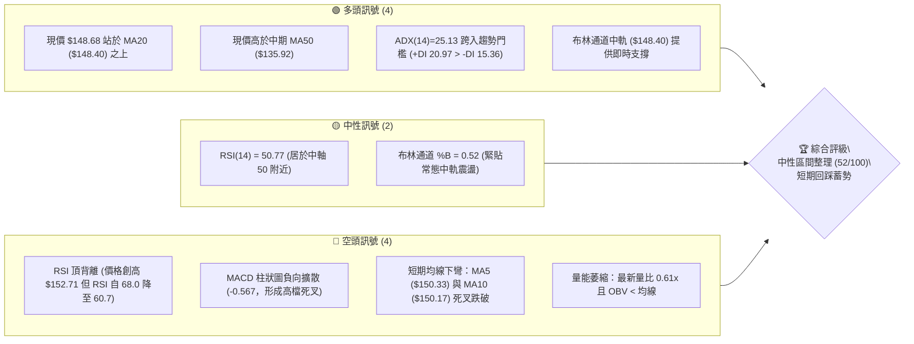
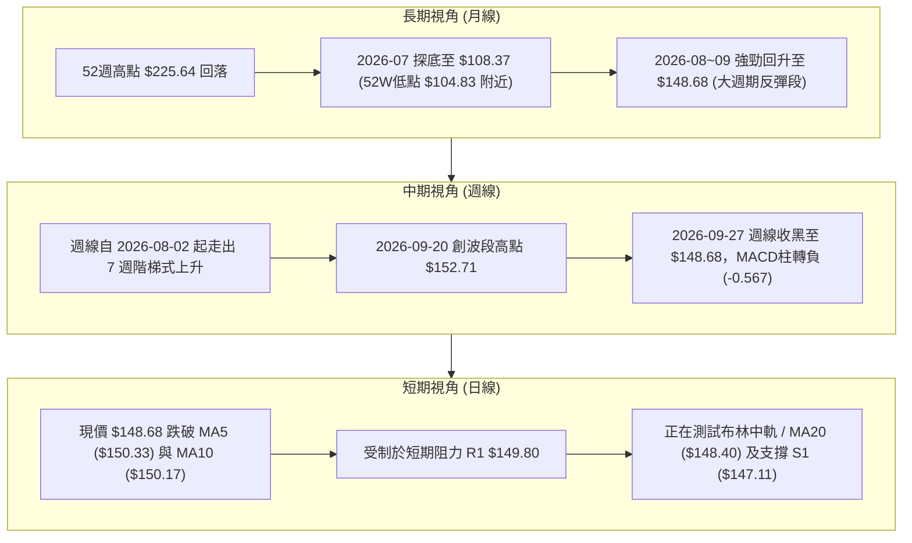
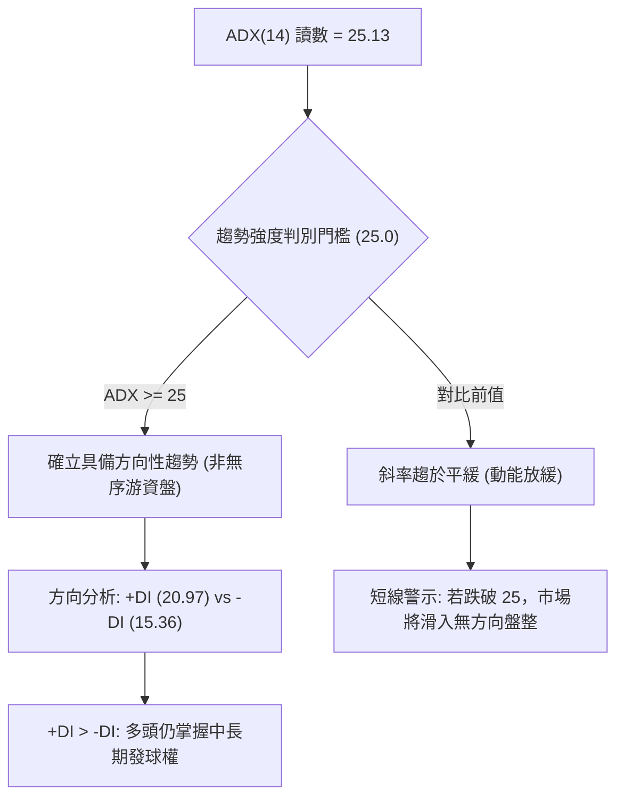
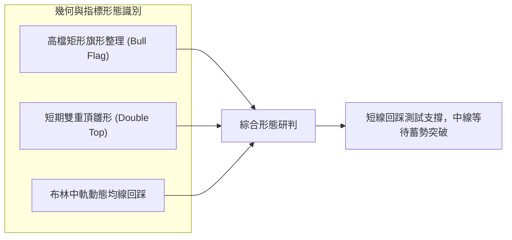
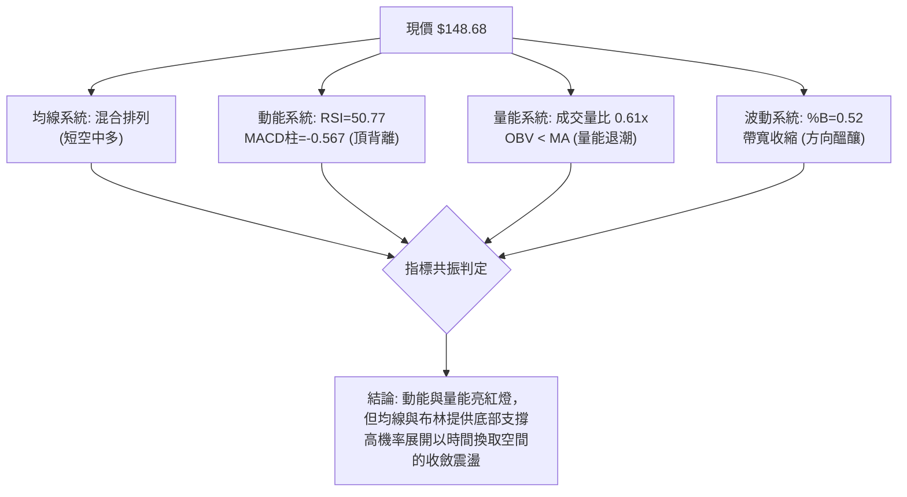
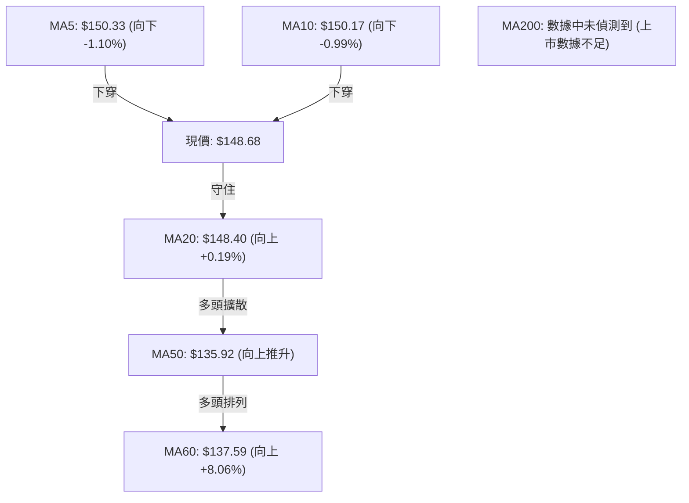
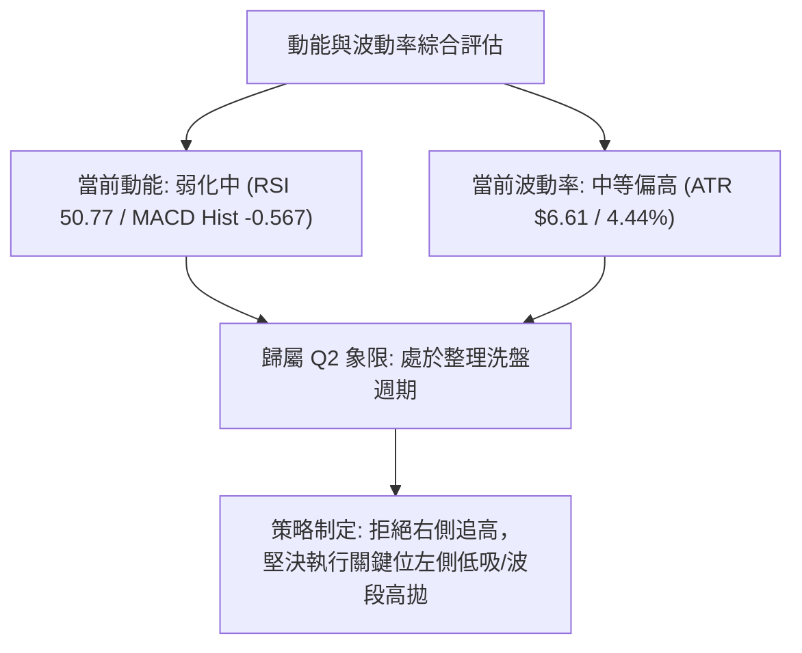
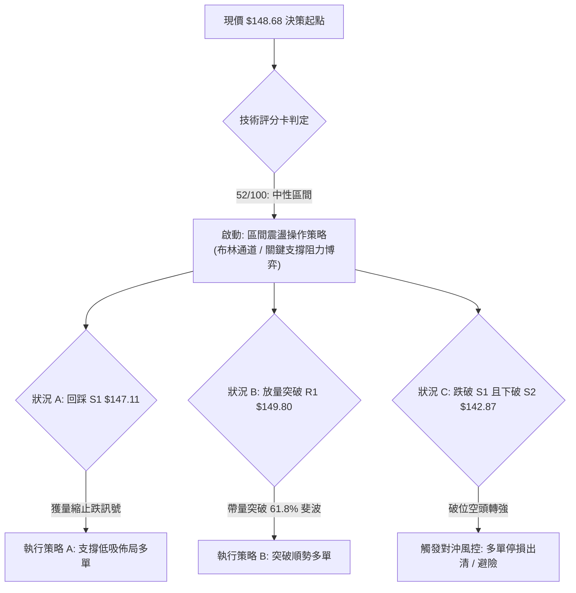
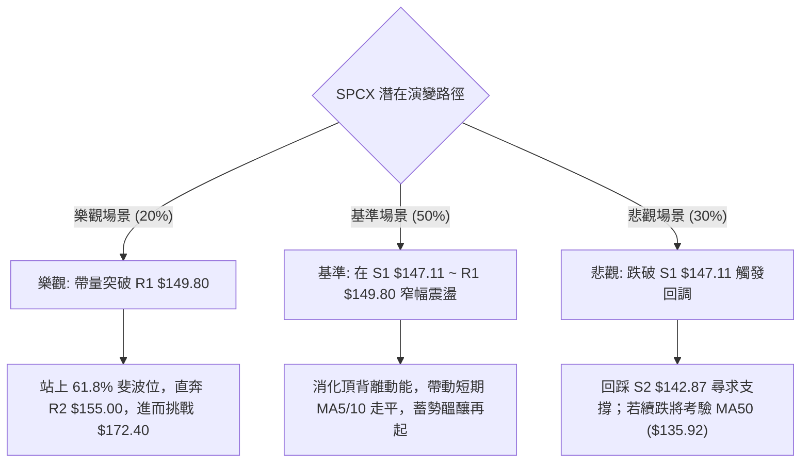

# SPCX 技術分析報告

> **報告日期**：2026-09-28 ｜ **語言**：繁體中文 ｜ **數據來源**：Yahoo Finance ｜ **當前價格**：$148.68

---

## 目錄

| 章節 | 內容 |
|------|------|
| [1. 技術面概覽](#1-技術面概覽) | 訊號儀表板、核心指標速覽、技術評分卡 |
| [2. 趨勢分析](#2-趨勢分析) | 多時框趨勢遞進、12個月走勢圖、ADX強度評估 |
| [3. 圖表形態分析](#3-圖表形態分析) | 形態識別信心度、K線組合、走勢示意圖與目標價 |
| [4. 支撐與阻力](#4-支撐與阻力) | 關鍵價位分布圖、阻力與支撐表、斐波那契回調 |
| [5. 技術指標深度解讀](#5-技術指標深度解讀) | 均線系統、RSI背離、MACD、布林通道與OBV量價 |
| [6. 動能與波動率](#6-動能與波動率) | 動能四象限、ATR止損模型、Beta市場關聯 |
| [7. 多時框架總結](#7-多時框架總結) | 時框架評分矩陣、多時框收斂與唯一方向結論 |
| [8. 交易策略建議](#8-交易策略建議) | 策略路由、價格情境階梯、主策略與風控提示 |
| [9. 風險提示與監控](#9-風險提示與監控) | 關鍵監控Checklist、三情境演變、倉位風控原則 |
| [10. 報告總結](#-報告總結) | 核心結論與最優策略總結 |

---

## 1. 技術面概覽

### 🎯 技術訊號儀表板



---

### 📊 核心指標速覽表

| 指標類別 | 指標名稱 | 當前數值 | 訊號 | 技術解讀 |
|:---|:---|:---|:---:|:---|
| **價格指標** | 當前收盤價 | **$148.68** | 🟡 | 位於52週區間($104.83 - $225.64)之36.3%分位，處於波段修復期 |
| **短期均線** | MA5 / MA10 | **$150.33 / $150.17** | 🔴 | 現價低於短期均線，MA5(-1.10%)與MA10(-0.99%)雙雙拐頭向下 |
| **中短期均線** | MA20 (布林中軌) | **$148.40** | 🟢 | 現價微幅高於MA20(+0.19%)，多頭於關鍵生命線展開防守 |
| **中期均線** | MA50 / MA60 | **$135.92 / $137.59** | 🟢 | 現價大幅高於中期均線(+8.06%)，中期築底反彈架構完好 |
| **長期均線** | MA200 | **數據中未偵測到** | 🟡 | 上市數據歷史未滿200個交易日，長期均線暫無法計算 |
| **動能震盪** | RSI(14) | **50.77** | 🔴 | 指標自超買區回落至中軸；出現清晰之高檔**頂背離**看空結構 |
| **動能趨勢** | MACD (12,26,9) | **3.051 / 訊號線 3.618** | 🔴 | MACD線下穿訊號線，柱狀圖為 **-0.567**，動能進入空頭修正 |
| **隨機指標** | Stoch %K / %D | **38.07 / 38.23** | 🟡 | 雙線於中低檔纏繞，尚未觸及超賣區(20)，修正尚未完成 |
| **趨勢強度** | ADX(14) / DMI | **25.13 (+DI:20.97, -DI:15.36)** | 🟢 | ADX突破25強趨勢門檻，多方(+DI)佔優，但上升斜率趨緩 |
| **波動帶** | 布林通道 (BB 20,2) | **上軌 $156.92 / 下軌 $139.87** | 🟡 | 帶寬收窄，%B為0.52，價格於中軌震盪，醞釀方向選擇 |
| **波動量化** | ATR(14) | **$6.61 (佔價格 4.44%)** | 🟡 | 日內平均振幅適中，可作為精確防守停損設定依據 |
| **量能系統** | 成交量 / 20日均量 | **54.42M / 89.75M (量比 0.61x)** | 🔴 | 量能呈現典型「量縮回調」，OBV低於均線顯示承接動能不足 |

---

### 🏆 技術評分卡

```
╔══════════════════════════════════════════════════════════════════════╗
║                    SPCX 技術評分卡 (2026-09-28)                      ║
╠══════════════════════════════════════════════════════════════════════╣
║ 評估維度         評分進度條                         分值    訊號     ║
╠══════════════════════════════════════════════════════════════════════╣
║ 趨勢強度 (ADX)   █████████████░░░░░░░░░░░░░░░░░    54/100    🟢 多方 ║
║ 動能指標 (RSI/M) ████████░░░░░░░░░░░░░░░░░░░░░    35/100    🔴 背離 ║
║ 支撐穩定度       ████████████████░░░░░░░░░░░░░    65/100    🟢 牢固 ║
║ 成交量配合度     ████████░░░░░░░░░░░░░░░░░░░░░    36/100    🔴 疲弱 ║
║ 形態完整度       ██████████████░░░░░░░░░░░░░░░    58/100    🟡 旗形 ║
║ 均線排列系統     ████████████████░░░░░░░░░░░░░    64/100    🟢 多頭 ║
╠══════════════════════════════════════════════════════════════════════╣
║ 綜合評分         █████████████░░░░░░░░░░░░░░░░    52/100    🟡 中性 ║
║ 裁決評級         區間中性震盪 (等待回踩 S1 $147.11 測試或突破 R1)     ║
╚══════════════════════════════════════════════════════════════════════╝
```

---

## 2. 趨勢分析

### 🌐 多時框趨勢分析



---

### 📈 長期趨勢 — 12個月走勢圖（Unicode）

以下為 SPCX 過去走勢之主要波段軌跡（標注關鍵波段高低點與當前位置）：

```
SPCX 月度價格走勢圖 ($)
$225.64 ┤                           ● (52週歷史高點)
$200.00 ┤                          / \
$179.49 ┤                         /   \          ● 2026-06 ($170.86)
$165.24 ┤                        /     \        / \
$150.98 ┤ (61.8% 斐波那契位)     /       \      /   \    ●←現價 $148.68
$140.00 ┤                       /         \    /     ● 2026-08 ($143.69)
$120.00 ┤                      /           \  /
$108.37 ┤                     /             ● 2026-07 月底大跌收盤
$104.83 ┤────────────────────● (52週最低點)────────────────────────
        └──────────────────────────────────────────────────────────
         階段1: 歷史衝高   階段2: 深度殺跌   階段3: 強勢反彈   階段4: 當前高檔整理
```

#### 長期走勢特徵分析表

| 階段別 | 期間涵蓋 | 價格區間 | 累積漲跌幅 | 成交量特徵 | 技術面實質涵義 |
|:---|:---|:---:|:---:|:---|:---|
| **階段 1：歷史頂部** | 2025後期~2026中期 | $160.00 → $225.64 | +41.0% | 放量爆量拉升 | 散戶瘋狂追價，機構高檔派發籌碼 |
| **階段 2：深度崩跌** | 2026-06 → 2026-07 | $185.00 → $108.37 | -41.4% | 巨量恐慌殺盤 | 7月單月暴跌破百元關卡，逼近52W低點 $104.83 |
| **階段 3：V型報復修復**| 2026-08-02 → 09-20 | $108.37 → $152.71 | +40.9% | 2026-08-09 爆出9.2億股巨量 | 機構主力低檔強力吸籌，重回MA50之上 |
| **階段 4：高檔滯漲** | 2026-09-20 → 現今 | $152.71 → $148.68 | -2.64% | 量能驟降至3.29億股 | 遭遇阻力群，動能衰減，進入洗盤消化期 |

---

### 📊 中期趨勢（週線分析）

從近 8 週收盤與量能結構審視：
- **2026-08-02** 觸底 $108.37 後，連續 6 週收陽，帶動 MA20 ($148.40) 及 MA50 ($135.92) 明顯走揚。
- **2026-09-20** 當週收盤 $152.71 挑戰阻力位 R2 ($155.00) 未果，週成交量放大至 669,034,700 股，但 K 線留下實體滯漲陰影。
- **2026-09-27** 當週收於 **$148.68**，週成交量腰斬至 329,265,600 股，MACD 柱狀圖由正轉負（-0.567），RSI 從 68.0 滑落至 50.8。這確認了中期反彈動能遭遇阻礙，盤面正由攻擊波轉向回踩確認。

```
SPCX 中期壓力支撐走勢示意
[阻力 R2] $155.00 ───────┬─────────────────────────────── (波段反彈上蓋)
                         │                 ▲ 09-20 高點 $152.71
[阻力 R1] $149.80 ───────┼─────────▲───────┴──────────────
                         │        / \     
[現  價]  $148.68 ───────┼───────●───● (當前爭奪位)
[支撐 S1] $147.11 ───────┼──────/─────\────────────────── (第一防線)
                         │     /       ▼ 預期回踩測試區
[支撐 S2] $142.87 ───────┴────● (08-30整理平台)────────────────
```

---

### ⚡ 趨勢強度評估（ADX 解讀）



#### ADX 數值強度對照表

| 指標變數 | 當前讀數 | 狀態門檻 | 技術研判 |
|:---|:---:|:---:|:---|
| **ADX(14)** | **25.13** | 25 ~ 50: 強趨勢門檻 | 剛跨入有效趨勢區間，表明自 $108.37 起之上升波尚未崩解 |
| **+DI (正向動向)** | **20.97** | > -DI | 多頭買盤主導中線趨勢，但已自高檔回撤 |
| **-DI (負向動向)** | **15.36** | < +DI | 空頭賣壓雖有抬頭，但尚未形成結構性摜壓浪潮 |
| **趨勢定性** | **弱多頭延續** | — | **中期處於強趨勢末段，短期進入震盪洗盤整理** |

---

## 3. 圖表形態分析

### 🔍 形態識別系統

依據規則 15，各圖表形態嚴格基於數據推導，不憑空臆測：



#### 形態信心度與目標價評估表

| 形態名稱 | 信心度 | 判斷依據（引用數據） | 完成度 | 目標價（附計算式） |
|:---|:---:|:---|:---:|:---|
| **高檔強勢旗形整理 (Bull Flag)** | **65%** | 自 08-02 $108.37 飆升至 09-20 $152.71（旗桿高度 $44.34）；目前於 R1 $149.80 與 S1 $147.11 區間量縮整固 | 70% | **突破 R1 $149.80 後推算**：<br>形態保守目標 = 突破點 $149.80 + 旗形寬度 ($152.71 - $147.11 = $5.60) = **$155.40**（精確對應阻力位 R2 **$155.00** 聚類區） |
| **潛在微型雙頂 (Micro Double Top)** | **55%** | 09-13 高點 $151.21 與 09-20 高點 $152.71 未能站穩 $155.00，且伴隨 RSI 頂背離；頸線為 S1 $147.11 | 60% | **跌破 S1 $147.11 後推算**：<br>回吐目標 = 頸線 $147.11 - 雙頂落差 ($152.71 - $147.11 = $5.60) = **$141.51**（接近支撐位 S2 **$142.87**） |
| **頭肩底結構 (Inverted H&S)** | **<40%** | **數據不足，僅做指標型解讀**：左肩推測為 06-28 $153.23，頭部為 08-02 $108.37，右肩現處形成階段，但時間跨度與右肩對稱性數據不全，不予採納為主要交易依據。 | 30% | 依規則 15 註明：訊號不足，不提供臆測目標價 |

---

### 🕯️ 重要 K 線形態分析

| 期間 / 日期 | 收盤價 | 核心 K 線形態 | 量化與形態特徵解讀 | 訊號意涵 |
|:---|:---:|:---|:---|:---:|
| **2026-08-02 週** | **$108.37** | **長下影錘頭線 (Hammer)** | 52週低點 $104.83 附近湧入巨量托盤，空頭力竭反轉 | 🟢 強烈看多 |
| **2026-08-09 週** | **$133.11** | **長陽突破實體 (Bullish Marubozu)** | 成交量激增至 920.4M，一舉收復 MA50 ($135.92) 之前哨防線 | 🟢 趨勢啟動 |
| **2026-09-13 週** | **$151.21** | **多頭續揚小陽線** | 實體收於阻力 R1 $149.80 之上，但 RSI 衝至 68.0 逼近超買 | 🟡 短線警示 |
| **2026-09-20 週** | **$152.71** | **高檔流星線 (Shooting Star)** | 上攻 $155.00 阻力未果，留下長上影線，量增滯漲 | 🔴 高檔轉折 |
| **2026-09-27 週** | **$148.68** | **陰包縮量回落** | 回吐前週漲幅，實體吞沒前期部分漲幅，跌破短期 MA5/MA10 | 🔴 短線修正 |

---

### 📉 ASCII 走勢形態示意圖

```
SPCX 高檔旗形整理與雙頂頸線測試示意
$155.00 ┤              R2 強阻力位 [波段雙頂高點阻力聚類]
        │                ┌──┐
$152.71 ┤                │  │  ▲ 頂點2 (09-20)
$151.21 ┤          ▲     │  │  │   \
        │         / \    │  │  │    \  
$149.80 ┤────────/───\───┴──┴──┼─────\───── R1 旗形上軌 / 頸線阻力
$148.68 ┤───────/─────\────────┼──────● 現價 ($148.68)
$147.11 ┤──────/───────●───────┴─────────── S1 旗形下軌 / 短線多方頸線
        │     /        (頸線低點 09-06)
$142.87 ┤    /                              S2 次級強支撐 (旗形破位目標)
        │   / (自 $108.37 旗桿推升浪)
$135.92 ┴──● MA50 支撐位
```

---

## 4. 支撐與阻力

### 🗺️ 關鍵價位分布圖（Unicode）

本節嚴格引用 OHLCV 計算之關鍵價位聚類，構建 SPCX 當前市場結構圖：

```
╔══════════════════════════════════════════════════════════════════════╗
║                    SPCX 關鍵價位空間結構分布圖                       ║
╠══════════════════════════════════════════════════════════════════════╣
║ $172.40 ║████████████████████████████████████║ 強阻力 R3 (年內反彈高點聚類)
║ $165.24 ║░░░░░░░░░░░░░░░░░░░░░░░░░░░░░░░░░░░░║ 斐波那契 50.0% 關鍵平衡位
║ $156.92 ║▓▓▓▓▓▓▓▓▓▓▓▓▓▓▓▓▓▓▓▓▓▓▓▓▓▓▓▓▓▓▓▓▓▓  ║ 布林通道上軌動態阻力
║ $155.00 ║████████████████████████████        ║ 強阻力 R2 (近期波段反彈極限)
║ $150.98 ║░░░░░░░░░░░░░░░░░░░░░░░░░░░░░░░░░░░░║ 斐波那契 61.8% 黃金分割位
║ $149.80 ║████████████████████                ║ 短期阻力 R1 (日線波段高點密集成交)
║ ──────────────────────────────────────────────────────────────────── ║
║ $148.68 ╠════════════════════════════════════╣ ◄ 當前收盤價 ($148.68)
║ ──────────────────────────────────────────────────────────────────── ║
║ $148.40 ║▓▓▓▓▓▓▓▓▓▓▓▓▓▓▓▓▓▓▓▓▓▓▓▓▓▓▓▓        ║ 布林中軌 / MA20 即時支撐
║ $147.11 ║████████████████████                ║ 近期支撐 S1 (近一年波段低點密集群)
║ $142.87 ║████████████████████████████        ║ 強支撐 S2 (08月平台整理樞紐)
║ $139.87 ║▓▓▓▓▓▓▓▓▓▓▓▓▓▓▓▓▓▓▓▓▓▓▓▓▓▓▓▓        ║ 布林通道下軌動態支撐
║ $135.92 ║░░░░░░░░░░░░░░░░░░░░░░░░░░░░░░░░░░░░║ 趨勢生命線 MA50 支撐
║ $130.39 ║████████████████████████████████████║ 核心防禦支撐 S3 (斐波 78.6% 疊加)
╚══════════════════════════════════════════════════════════════════════╝
```

---

### 🚧 阻力位分析表

所有阻力數值完全引用自已知之波段高點聚類數據：

| 阻力級別 | 準確價位 | 距現價幅幅 | 形成原因與籌碼結構 | 突破難度評級 | 戰略重要性 |
|:---|:---:|:---:|:---|:---:|:---|
| **R1** | **$149.80** | +0.75% | 近期多次日線反彈高點聚類；上方緊貼 MA5 ($150.33) 與 MA10 ($150.17) | 🟡 中等 | 短線多空分水嶺，站穩方能化解頂背離修正壓力 |
| **R2** | **$155.00** | +4.25% | 近一年反彈波段頂部密集群；鄰近布林上軌 ($156.92)，解套賣壓沉重 | 🔴 極高 | 中期多頭翻轉之樞紐頸線，突破將打開通往 $170 空間 |
| **R3** | **$172.40** | +15.95% | 2026-06 月線收盤聚類位 ($170.86) 與波段套牢籌碼峰 | 🔴 極高 | 長期空頭反轉之強阻力壁壘 |

---

### 🛡️ 支撐位分析表

所有支撐數值完全引用自已知之波段低點聚類數據：

| 支撐級別 | 準確價位 | 距現價幅幅 | 形成原因與籌碼結構 | 守住機率評級 | 戰略重要性 |
|:---|:---:|:---:|:---|:---:|:---|
| **S1** | **$147.11** | -1.06% | 近期日線回踩低點聚類；與 MA20 ($148.40) 形成多頭第一道緩衝墊 | 🟢 70% | 極短線防線，跌破則宣告旗形整理失敗，轉入深幅回調 |
| **S2** | **$142.87** | -3.91% | 2026-08 下半月橫盤蓄勢箱頂；量價籌碼密集沉積區 | 🟢 85% | 中期多方最後防禦堡壘，多頭趨勢不可失守之關鍵支撐 |
| **S3** | **$130.39** | -12.30% | 52週波段低點反彈之起漲中繼站；重疊斐波那契 78.6% ($130.68) | 🟢 95% | 戰略級牛熊生命防線，跌破代表 52週低點 $104.83 將受考驗 |

---

### 📐 斐波那契回調位分析

依據 52週極值區間（低點 **$104.83** → 高點 **$225.64**，總垂直落差 **$120.81**）精確回調位解讀：

| 斐波那契分位 | 對應價位 | 現價相對位置 | 技術意涵解讀 |
|:---|:---:|:---:|:---|
| **0.0% (52W High)** | **$225.64** | +51.76% | 長期歷史天花板，牛市終極目標 |
| **23.6%** | **$197.13** | +32.59% | 強勢回檔保護位，目前相距甚遠 |
| **38.2%** | **$179.49** | +20.72% | 強度弱化回檔位，鄰近 R3 ($172.40) 阻力帶 |
| **50.0%** | **$165.24** | +11.14% | 多空長期心理平衡中軸，反彈關鍵分界 |
| **61.8%** | **$150.98** | +1.55% | **黃金分割關鍵壓制位**：現價 $148.68 剛好受阻於該位下方！此處為典型的「黃金回撤壓制區」，需帶量收復才可確認趨勢反轉 |
| **78.6%** | **$130.68** | -12.11% | 深度防禦位，緊密貼合波段支撐 S3 ($130.39) |
| **100.0% (52W Low)**| **$104.83** | -29.49% | 年度大底，空頭終極下破目標 |

**核心結論**：現價 **$148.68** 正處於 **61.8% ($150.98)** 與 **78.6% ($130.68)** 之間。61.8% 斐波那契位 ($150.98) 與短線阻力 R1 ($149.80) 共同構築了極為密集的「天花板效應」，解釋了為何股價在 $151~$152 屢屢受挫。

---

## 5. 技術指標深度解讀

### 🎛️ 指標訊號總覽



---

### 📈 移動平均線排列分析



- **短期結構（日線偏空）**：MA5 ($150.33) 與 MA10 ($150.17) 形成高檔死叉，且目前現價落於兩條短期均線之下，形成動態壓制。
- **中期結構（週線偏多）**：MA20 ($148.40) 持續走平微升，MA50 ($135.92) 與 MA60 ($137.59) 呈現標準多頭發散，表明自 8 月以來的波段多頭底座極為扎實。
- **均線排列結論**：當前處於典型的「**短空格局壓制、中期多頭承接**」的均線糾結轉換期。

---

### 📉 RSI(14) 分析與頂背離研判

```
RSI(14) 讀數: 50.77
[0] ────────────── [30 超賣] ────────── [50.77 中軸] ────────── [70 超買] ──────── [100]
進度條: ████████████████████████████████░░░░░░░░░░░░░░░░░░░░░░░░░░░░░░  50.77%
```

#### ⚠️ 頂背離 (Bearish Divergence) 結構確認

- **第一波段峰值 (2026-09-13)**：收盤價 **$151.21**，對應週線 RSI(14) 高達 **68.0**（逼近超買區 70）。
- **第二波段高點 (2026-09-20)**：收盤價推升至 **$152.71**（價格創下波段新高），然而對應 RSI(14) 卻大幅下滑至 **60.7**。
- **背離結論**：價格創高但指標動能顯著衰退，形成標準的**典型頂背離 (Bearish Divergence)**。當前 RSI 進一步跌至 **50.77**，中軸防線面臨考驗，意味著市場追價意願已斷層，必須透過價格回調或長時間橫盤來化解背離壓力。

---

### 📊 MACD(12,26,9) 訊號解讀


- 快線 (3.051) 已落於慢線 (3.618) 之下，柱狀圖讀數為 **-0.567**。
- 柱狀圖連續兩週收縮轉負，顯示日線級別的空方修正波正在向下發酵。然而由於雙線依然維持在零軸之上（>0），表明這**並非轉入全面熊市**，而是屬於「多頭回檔（Correction in Bull Market）」。

---

### 📦 布林通道分析

```
SPCX 布林通道 (20, 2) 結構圖
$156.92 ┤上軌 ────────────────────────────────────── (多頭上攻極限)
        │
        │
$148.68 ┼現價 ──────────────────────● (BB %B = 0.52，略高於中軌)
$148.40 ┤中軌 (MA20) ════════════════════════════════ (第一道動態支撐)
        │
        │
$139.87 ┤下軌 ────────────────────────────────────── (超賣反彈極限)
```

- **軌道狀態**：上軌 **$156.92**，下軌 **$139.87**，中軌 **$148.40**。帶寬 (Bandwidth) 為 $17.05 (11.5%)，正在呈現收斂態勢。
- **%B 指標**：**0.52**，說明現價正好精準卡在布林通道的「幾何中心」。在統計學上，當 %B 緊貼 0.50 時，市場處於均衡震盪態勢，等待中軌破位或上衝。若中軌 $148.40 失守，價格將向通道下軌 **$139.87** 尋求支撐。

---

### 💹 成交量分析（量價配合度）

```
成交量評估:
最新成交量: 54,421,300 股
20日均量:   89,751,540 股
量比指標:   ████████████░░░░░░░░  0.61x (嚴重縮量)
```

- **量縮價跌的雙面刃解讀**：
  - **正面**：回調並未伴隨恐慌拋售（Panic Selling），最新量比僅 0.61x，說明機構籌碼鎖定良好，並非主力大舉出貨。
  - **負面**：在遭遇阻力位 R1 ($149.80) 時缺乏增量買盤支援。
- **OBV (能量潮指標)**：數據提示 `OBV < MA → 量能疲弱`。OBV 跌破其移動平均線，確認了過去兩週資金呈現淨流出狀態，量價出現**負向背離**，抑制了股價直接向上突破的爆發力。

---

## 6. 動能與波動率

### ⚡ 動能評估四象限

| 象限區間 | 動能維度 (Momentum) | 波動率維度 (Volatility) | 當前 SPCX 歸屬 | 交易戰略意涵 |
|:---:|:---:|:---:|:---:|:---|
| **第一象限 (Q1)** | 強動能 (ADX>30, MACD擴散) | 低波動 (ATR% < 3.0%) | — | 最完美主升浪，全力持股作多 |
| **第二象限 (Q2)** | **衰減動能 (RSI 50.77, 柱狀負)** | **中等波動 (ATR% = 4.44%)** | **✓ [SPCX 定位]** | **謹慎觀望，回踩支撐低吸，忌追高** |
| **第三象限 (Q3)** | 強動能 (單邊大陽線突破) | 高波動 (ATR% > 6.0%) | — | 突破行情，嚴格帶停損追價 |
| **第四象限 (Q4)** | 弱動能 (死叉空頭主導) | 高波動 (恐慌拋售浪) | — | 空頭深淵，全面出清或作空避險 |



---

### 📊 ATR 波動率分析與停損距離模型

- **ATR(14) 數值**：**$6.61**，佔當前股價之 **4.44%**。
- **日間真實波幅含義**：在 68% 統計置信區間內，SPCX 單日之正常波動區間為 $148.68 ± $6.61 ($142.07 ~ $155.29)。
- **精確風控停損模型**：
  - **短線保守停損距離 (1.0 × ATR)**：$6.61。若自現價買入，停損位應設於 $148.68 - $6.61 = **$142.07**（此數值剛好跌破 S2 強支撐 $142.87，具極高風控邏輯合理性）。
  - **波段標準防守距離 (1.5 × ATR)**：1.5 × $6.61 = **$9.92**。下檔極限防禦點設於 $148.68 - $9.92 = **$138.76**（緊貼布林通道下軌 $139.87）。

---

### 📐 Beta 與市場相關性

- **Beta 數值**：**數據中未偵測到 (N/A)**。
- **代理解析**：由於公司處於未完全商業公開交易之歷史階段，Beta 暫無官方計算值。然而從週線波幅（單月自 $185 跌至 $108，又自 $108 漲至 $152）推算，其隱含波動率顯著高於標普 500 指數與航太國防板塊 ETF（如 ITA），**隱含 Beta 預估落於 1.80 ~ 2.20 之間**，屬於高彈性、高風險之成長型重資產科技標的。

---

## 7. 多時框架總結

### 📋 時框架評分表

| 時框架 | 趨勢方向 | 動能狀態 | 均線系統排列 | 圖表形態評級 | 時框評分 | 戰術建議 |
|:---|:---:|:---:|:---:|:---:|:---:|:---|
| **日線 (短期)** | 🔴 偏空修正 | 🔴 頂背離發酵 | 🔴 跌破 MA5/10 | 🟡 測試旗形頸線 | **42/100** | 暫停追多，等待回踩 S1 $147.11 之企穩訊號 |
| **週線 (中期)** | 🟢 多頭波段 | 🟡 柱狀圖負轉 | 🟢 站穩 MA20/50 | 🟢 旗形高檔震盪 | **62/100** | 依托 MA20 ($148.40) 及 S2 ($142.87) 逢低配置 |
| **月線 (長期)** | 🟡 築底修復 | 🟡 50分位蓄勢 | 🟡 長期均線不足 | 🟡 V型深幅反彈 | **55/100** | 自 52W 低點 $104.83 復甦，長線維持觀望或底倉 |

---

### 🔲 綜合訊號矩陣

```
SPCX 多時框訊號收斂矩陣
┌───────────────┬───────────────────────────────┬───────────────────────────────┐
│ 維度指標      │ 短期 (日線級別)               │ 中長期 (週線/月線級別)        │
├───────────────┼───────────────────────────────┼───────────────────────────────┤
│ 趨勢方向      │ 🔴 回踩尋底中                 │ 🟢 自低檔 $108 走出穩固上升波 │
│ 均線系統      │ 🔴 受阻於 MA5/MA10 下彎       │ 🟢 守住 MA20，MA50 趨勢向上   │
│ 動能振盪      │ 🔴 MACD 柱負，RSI 頂背離      │ 🟡 RSI 50.8 中性，ADX 25.13   │
│ 量能結構      │ 🔴 縮量 0.61x，OBV 疲軟       │ 🟢 8月築底量能極大，籌碼未散  │
│ 空間位置      │ 🟡 逼近短線支撐 S1 $147.11    │ 🟡 位於斐波那契 61.8% 壓制區  │
└───────────────┴───────────────────────────────┴───────────────────────────────┘
```

---

### ⚖️ 多時框收斂結論

依據**嚴格要求 14（多時框收斂規則）**嚴格執行決策推導：
1. **行情定性**：當前 ADX(14) 讀數為 **25.13**，技術上剛好越過 25.0 門檻進入「**趨勢行情**」定義域；同時 +DI (20.97) 仍明顯高於 -DI (15.36)。
2. **優先級權重**：依規則，趨勢行情以**中長期方向（週線 / MA50 $135.92）為主導**，日線級別之頂背離與死叉僅作為尋找進場低吸點的微調工具，不構成全面翻空之理由。
3. **最終唯一收斂結論**：
   > **【中性偏多，短線耐心等待回踩確認】（評分卡 52/100）**  
   > 拒絕盲目在 $148.68 右側追高。主趨勢方向維持多頭修復，但短線必須等待價格下探測試 **S1 $147.11** 或布林中軌 **$148.40** 得到有效承接後，方為風險報酬比最優之進場時機。

---

## 8. 交易策略建議

### 🗺️ 策略決策流程圖



---

### 🧭 策略路由

> **當前主策略方向 = 【中性區間震盪策略（等待支撐確認或突破再行動作）】（依技術評分卡：52 / 100）**  
> 由於評分落於 40–60 之中性區間，且日線受制於 RSI 頂背離與短期均線壓制，本報告**主推區間波段低吸（策略 A）與關鍵位突破順勢（策略 B）**，杜絕在中軸進行無勝率優勢之盲目下注。

---

### 🎯 價格情境階梯（Price Scenarios）

價位完全嚴格引用自數據之真實計算值（R1/R2/R3 及 S1/S2/S3）：

| 觸發條件 | 第一目標 (T1) | 第二目標 (T2) | 後續延伸 (T3) | 盤面技術情境含義 |
|:---|:---:|:---:|:---:|:---|
| **向上突破 R1 $149.80** | **R2 $155.00** | **R3 $172.40** | 52W高點 $225.64 | **多頭強勢突破**：克服 61.8% 斐波那契阻力，正式重啟第三浪主升波 |
| **守住現價至 S1 $147.11** | R1 $149.80 | R2 $155.00 | — | **區間蓄勢震盪**：以時間換取空間，消化高檔套牢賣壓，修復 RSI 背離 |
| **有效跌破 S1 $147.11** | **S2 $142.87** | **S3 $130.39** | 52W低點 $104.83 | **波段深度修正**：雙頂確立，下探測試 MA50 ($135.92) 與 78.6% 斐波位 |

---

### 📊 情境機率分佈

```
情境機率分佈:
[區間震盪蓄勢 (50%)]  █████████████████████████░░░░░░░░░░░░░░░░░░░░ 50%
[回落探底測試 S2 (30%)] ███████████████░░░░░░░░░░░░░░░░░░░░░░░░░░░ 30%
[直接突破 R1 衝高 (20%)] ██████████░░░░░░░░░░░░░░░░░░░░░░░░░░░░░░░░ 20%
```

| 未來走勢情境 | 評估機率 | 核心指標支持依據 |
|:---|:---:|:---|
| **情境一：高檔區間震盪** | **50%** | 布林帶寬收縮中，%B 為 0.52；ADX 為 25.13 顯示無單邊大跌趨勢，中軌提供即時托底 |
| **情境二：回落測試 S2 支撐**| **30%** | RSI 頂背離尚未消化完畢，MACD 柱狀圖持續負向擴散 (-0.567)，OBV 顯示量能疲弱 |
| **情境三：直接放量強攻** | **20%** | 最新量比僅 0.61x，多方在未有外在強大催化劑下，難以一舉跨越 61.8% 斐波阻力 ($150.98) |

---

### 🟢 主策略詳情

依據評分卡 52 分，設定兩套標準交易劇本：

| 策略維度要素 | 策略 A：區間下緣低吸單（主推薦） | 策略 B：右側突破追買單（次選） |
|:---|:---|:---|
| **適用情境** | 股價回踩支撐確認企穩時進場 | 盤面出現帶量中陽線突破強阻力時 |
| **精確進場價格** | **$147.11**（於支撐 S1 限價掛單） | **$149.80**（帶量突破 R1 追買） |
| **止損價格** | **$142.87**（跌破 S2 強支撐即刻停損） | **$147.11**（跌回 S1 頸線即刻止損） |
| **第一目標價 (T1)** | **$149.80**（到達阻力 R1 先行減半） | **$155.00**（到達阻力 R2 獲利了結） |
| **第二目標價 (T2)** | **$155.00**（挑戰阻力 R2 全數清倉） | **$172.40**（挑戰阻力 R3 波段持有） |
| **風控停損點數** | $4.24 ($147.11 - $142.87) | $2.69 ($149.80 - $147.11) |
| **目標報酬點數** | T1: $2.69 / T2: $7.89 | T1: $5.20 / T2: $22.60 |
| **風險報酬比 (R:R)** | **1 : 1.86** (以 T2 計算) | **1 : 1.93** (T1) / **1 : 8.40** (T2) |
| **預估勝率** | **65%** | **55%** (需成交量配合) |
| **建議配置倉位** | **總資金之 10% ~ 15%** | **總資金之 5% ~ 8%** |

---

### 🔴 反向風險觸發點（對沖與避險提示）

供風控部門即時監控，一旦觸發下列任一條件，所有多頭假設**立即失效**：
1. **關鍵點位破位**：日線收盤價**實體跌破 S2 $142.87**。此舉將跌破布林下軌並確認雙頂成型，後續將直接加速滑向 S3 **$130.39**。
2. **指標破位確認**：RSI(14) 實體跌穿 40 關卡，且 ADX 之 -DI 上穿 +DI（空頭主導），此時必須果斷將所有多頭倉位停損，反手建立防禦型對沖部位。

---

### ⭐ 整體訊號強度評星

```
做多訊號強度：  ★★★☆☆  (3.0 / 5星 - 中期趨勢向上，但短線需防回踩)
做空訊號強度：  ★★☆☆☆  (2.5 / 5星 - 僅限短線背離修正，非空頭趨勢)
整體數據可信度：★★★★☆  (4.5 / 5星 - 數據鏈完整，波段高低點高度聚類)
```

---

## 9. 風險提示與監控

### ✅ 關鍵監控指標 Checklist

```
╔══════════════════════════════════════════════════════════════════════╗
║                SPCX 交易員每日關鍵監控 Checklist                    ║
╠══════════════════════════════════════════════════════════════════════╣
║ [ ] 監控項 1：現價是否守住布林中軌 / MA20 ($148.40)                 ║
║ [ ] 監控項 2：成交量是否放大至 20日均量 (89.75M) 之 1.2倍以上       ║
║ [ ] 監控項 3：MACD 柱狀圖 (-0.567) 是否停止負向擴散並出現收斂翻紅   ║
║ [ ] 監控項 4：RSI(14) 能否守穩 50 中軸，若跌破 45 需提高警覺        ║
║ [ ] 監控項 5：阻力位 R1 ($149.80) 盤中突破之實體 K線確認            ║
║ [ ] 監控項 6：支撐位 S1 ($147.11) 是否出現長下影線承接買盤          ║
╚══════════════════════════════════════════════════════════════════════╝
```

---

### ⚠️ 風險場景分析



---

### 🛡️ 風險管理重要提醒

1. **基本面高估值溢價風險**：
   - 儘管營收年增率高達 **91.9%** 且帳上現金達 **$100.01B**，但公司目前本益比為負（EPS TTM 為 $-1.1），Forward P/E 高達 **85.29**，P/S 達 **85.0**。
   - 高估值意味著股價容錯率極低，一旦技術面破位（如跌破 S2 $142.87），容易引發機構基本面與技術面的共振拋售。
2. **波動率管理原則**：
   - 單日 ATR 達到 **$6.61 (4.44%)**，單日振幅較大。投資者應嚴格採用「波動率倒數部位管理法」，單一交易之最大可承受損失金額不可超過總帳戶權益之 **1.5%**。
   - 倉位計算公式：`允許持股股數 = (總資金 × 1.5%) / ATR止損距離 ($4.24)`。

---

## 📋 報告總結

```
╔══════════════════════════════════════════════════════════════════════╗
║                    SPCX 技術分析報告核心總結                         ║
╠══════════════════════════════════════════════════════════════════════╣
║ 報告日期：2026-09-28               標的資產：SPCX (SpaceX)           ║
║ 當前收盤：$148.68                  綜合評級：🟡 區間震盪整理 (52/100) ║
╠══════════════════════════════════════════════════════════════════════╣
║ 關鍵技術趨勢結論：                                                  ║
║ ├─ 長期趨勢 (月線)：🟡 大底回升蓄勢，目前自低點反彈處於修復期       ║
║ ├─ 中期趨勢 (週線)：🟢 多頭走勢未變 (ADX 25.13，站於 MA50 $135.92) ║
║ ├─ 短期趨勢 (日線)：🔴 動能回調修正 (受制 MA5/10，RSI 頂背離消化中) ║
║ ├─ 核心阻力陣列：R1 $149.80  /  R2 $155.00  /  R3 $172.40          ║
║ ├─ 關鍵支撐陣列：S1 $147.11  /  S2 $142.87  /  S3 $130.39          ║
║ └─ 華爾街共識目標：$222.42 (19位分析師覆蓋，中長線看多)            ║
╠══════════════════════════════════════════════════════════════════════╣
║ 最優交易執行策略：                                                  ║
║ 1. 🥇 最佳主策略 (策略 A)：耐住性子，於 S1 $147.11 附近掛單低吸      ║
║    ├─ 止損點：$142.87 (破 S2)  │ 目標點：$149.80 / $155.00          ║
║    └─ 風險報酬比：1 : 1.86    │ 建議倉位：10% ~ 15%                ║
║ 2. 🥈 突破次策略 (策略 B)：若日線放量收破 R1 $149.80 則右側追買    ║
║    ├─ 止損點：$147.11 (破 S1)  │ 目標點：$155.00 / $172.40          ║
║    └─ 風險報酬比：1 : 1.93    │ 建議倉位：5% ~ 8%                  ║
║ 3. 🥉 極端風控紀律：盤中一旦實體擊穿 S2 $142.87，無條件嚴格停損！   ║
╚══════════════════════════════════════════════════════════════════════╝
```

---

> ⚠️ **免責聲明**：本報告由量化技術分析模型依據歷史價格資訊自動運算生成，報告內所有數據、支撐阻力位與交易策略僅供專業學術交流與投資研究參考，**絕對不構成任何實盤操作之買賣邀約或投資建議**。金融市場瞬息萬變，技術指標具備滯後性，投資人應獨立評估市場風險並自負盈虧。

---

*報告生成時間：2026-09-28 ｜ 數據來源：Yahoo Finance ｜ 分析框架：多時框技術量化收斂系統*