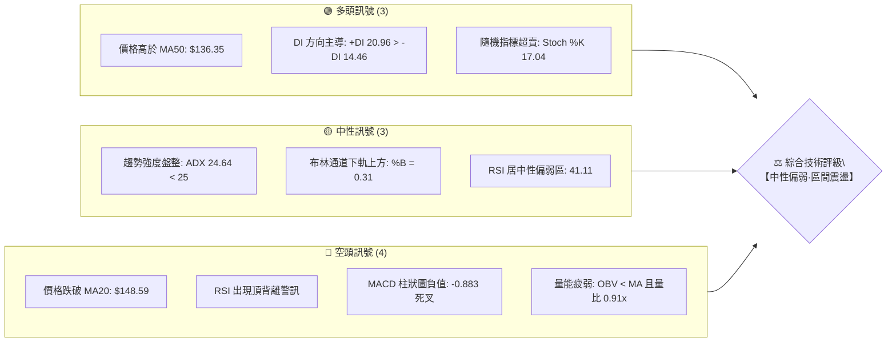
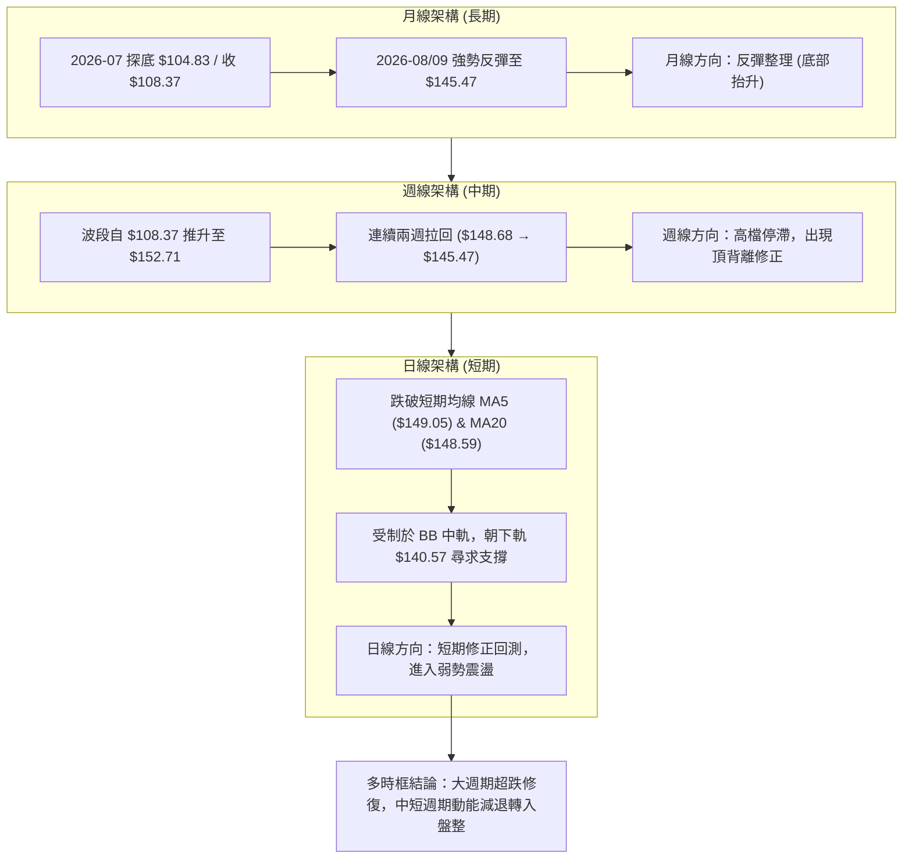
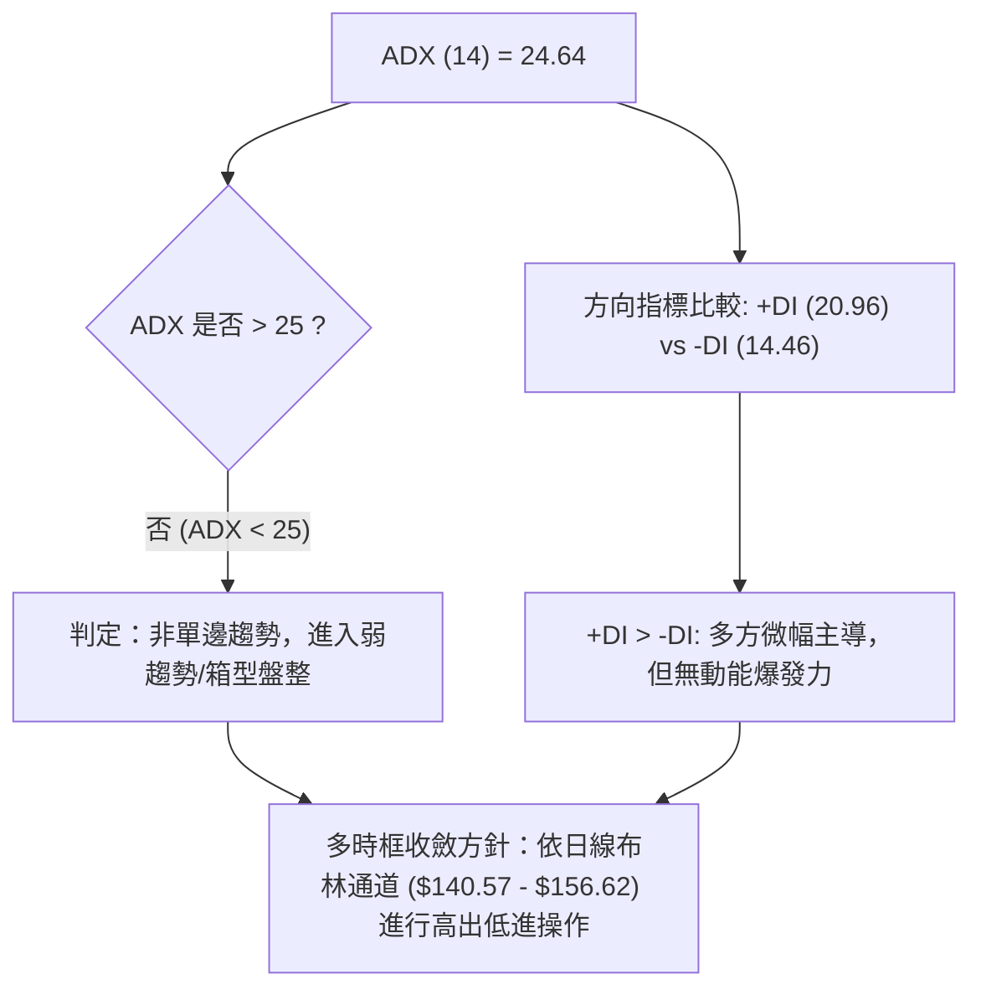
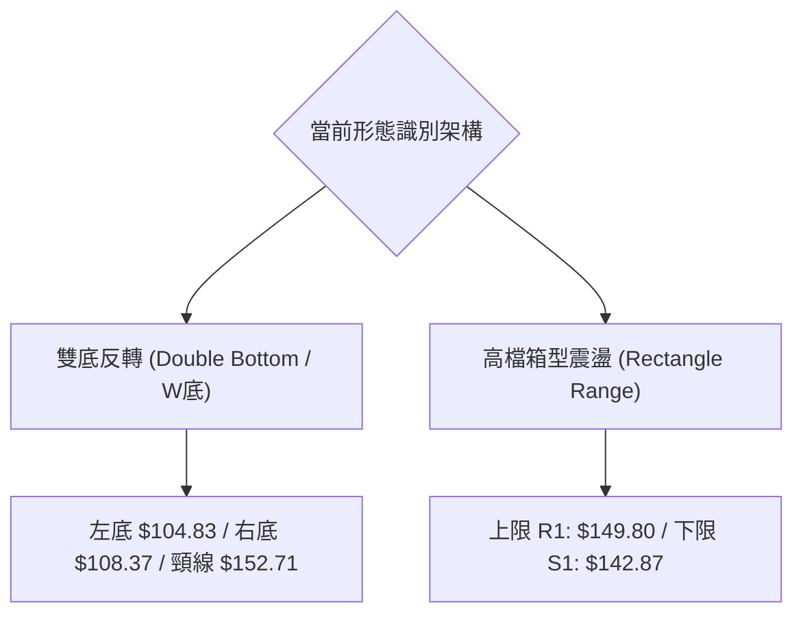
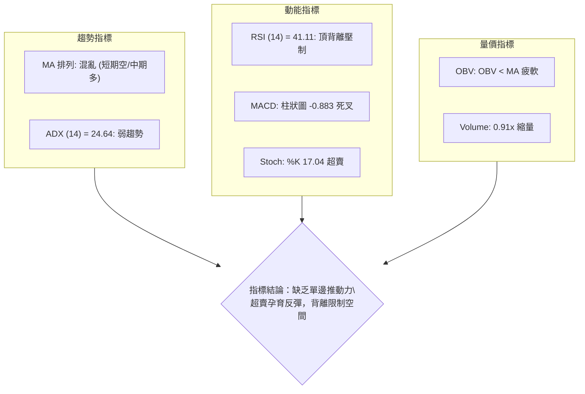
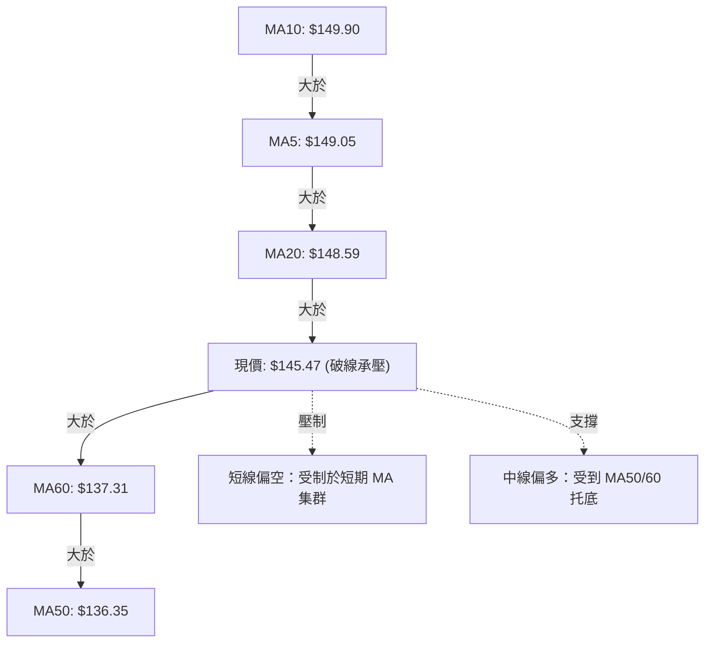
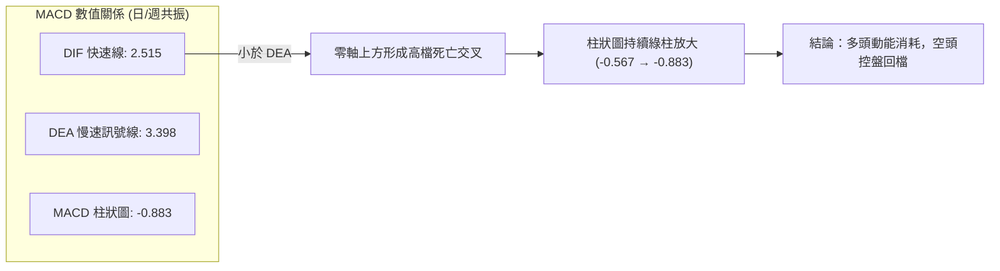
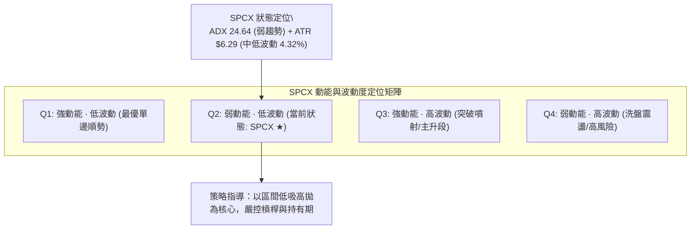
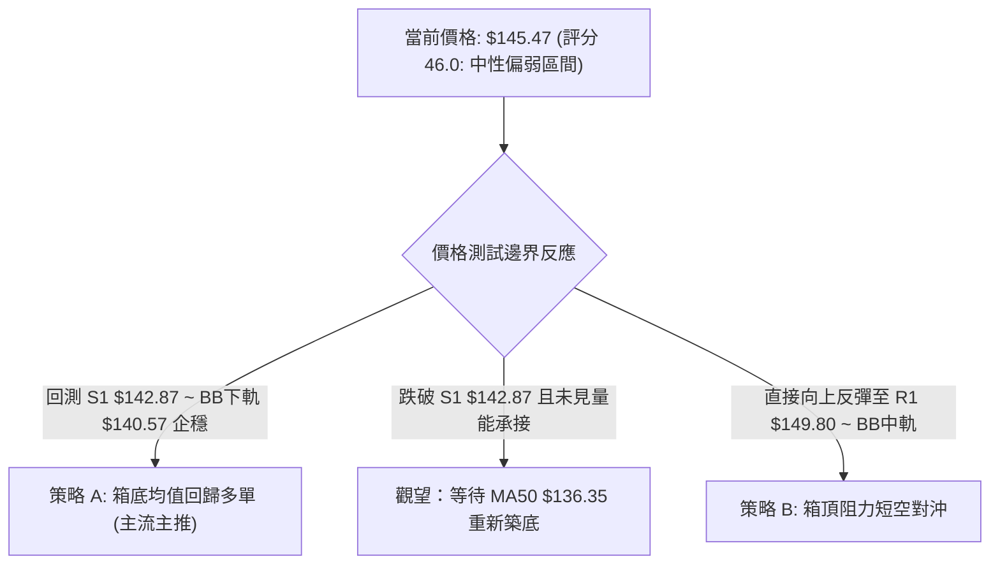
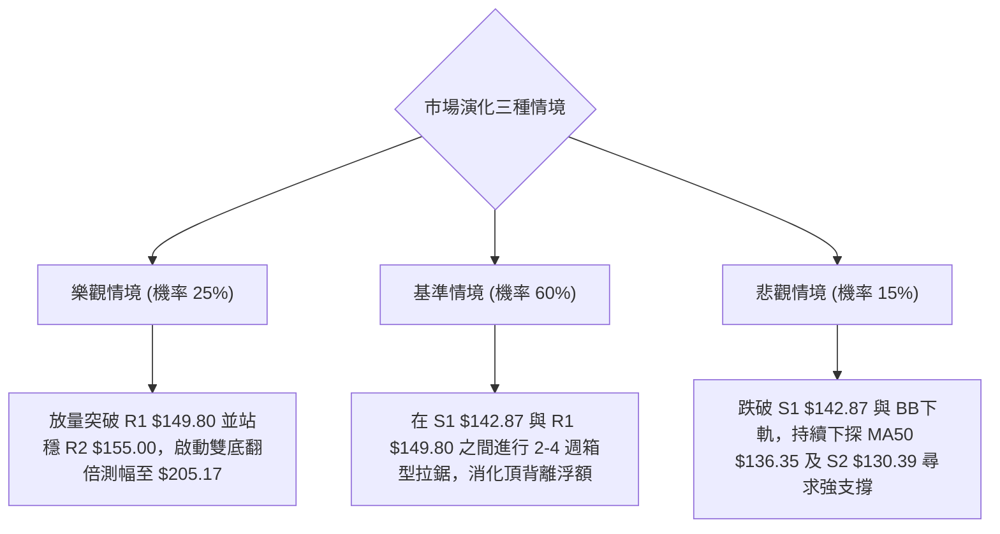

# SPCX 技術分析報告

> **報告日期**：2026-09-29 ｜ **語言**：繁體中文 ｜ **數據來源**：Yahoo Finance ｜ **當前價格**：$145.47

---

## 目錄

| 章節 | 內容 |
|------|------|
| [1. 技術面概覽](#1-技術面概覽) | 訊號儀表板、核心指標、評分卡 |
| [2. 趨勢分析](#2-趨勢分析) | 多時框趨勢、長中短期走勢、ADX 趨勢強度 |
| [3. 圖表形態分析](#3-圖表形態分析) | 形態識別、信心度評估、K線組合、目標價計算 |
| [4. 支撐與阻力](#4-支撐與阻力) | 關鍵價位分布、阻力與支撐表、斐波那契回調 |
| [5. 技術指標深度解讀](#5-技術指標深度解讀) | 均線系統、RSI背離、MACD、布林通道、成交量 |
| [6. 動能與波動率](#6-動能與波動率) | 動能矩陣、ATR 波動率、Beta 與機構持股分析 |
| [7. 多時框架總結](#7-多時框架總結) | 時框架評分矩陣、收斂規則與單一方向定調 |
| [8. 交易策略建議](#8-交易策略建議) | 策略路由、主策略執行、情境機率、評星 |
| [9. 風險提示與監控](#9-風險提示與監控) | 監控 Checklist、風險場景樹、資金風控 |
| [📋 報告總結](#-報告總結) | 儀表板結論、關鍵價位彙整、最優策略組合 |

---

## 1. 技術面概覽

### 🎯 技術訊號儀表板



---

### 📊 核心指標速覽表

| 指標類別 | 指標名稱 | 當前數值 | 訊號 | 解讀 |
|:---|:---|:---:|:---:|:---|
| **價格** | 當前收盤價 | $145.47 | 🟡 | 位於52週區間 33.6%，處於自 $104.83 反彈後的拉回修正期 |
| **均線** | 短期 MA20 | $148.59 | 🔴 | 現價低於 MA20 (-2.10%)，短線承壓，MA20 構成動態阻力 |
| **均線** | 中期 MA50 | $136.35 | 🟢 | 現價高於 MA50 (+6.69%)，中期回升結構尚未被完全破壞 |
| **均線** | 長期 MA200 | 數據中未偵測到 | 🟡 | 資料不足，中長期趨勢依據 MA60 ($137.31) 與週線結構研判 |
| **動能** | RSI (14) | 41.11 | 🟡 | 位於中性偏弱區間（30–70），日線/週線出現顯著頂背離訊號 |
| **動能** | MACD (12,26,9) | DIF 2.515 / DEA 3.398 | 🔴 | MACD 處於零軸上方但柱狀圖負值 (-0.883)，形成高檔死叉 |
| **震盪** | Stoch %K / %D | 17.04 / 29.64 | 🟢 | 進入 20 以下超賣區，短線隨時具備技術性反抽動能 |
| **趨勢強度**| ADX (14) | 24.64 | 🟡 | ADX < 25，確認市場處於弱趨勢或箱型盤整行情，非單邊行情 |
| **通道** | Bollinger %B | 0.31 | 🟡 | 現價位於中軌 ($148.59) 與下軌 ($140.57) 之間，偏向弱勢震盪 |
| **量能** | OBV 與量比 | OBV < MA / 0.91x | 🔴 | 最新量 83.18M 低於 20 日均量 91.16M，反彈動能衰竭 |
| **波動** | ATR (14) | $6.29 (4.32%) | 🟡 | 日波動區間較大，提供日內與波段交易操作空間 |

---

### 🏆 技術評分卡

```
╔══════════════════════════════════════════════════════════════════╗
║              SPCX 技術指標評分卡 (2026-09-29)                   ║
╠══════════════════════════════════════════════════════════════════╣
║ 評估維度      進度條與得分                      狀態  權重  加權 ║
╟──────────────────────────────────────────────────────────────────╢
║ 趨勢強度      █████████░░░░░░░░░░░  45/100      🟡   20%   9.0  ║
║ 動能指標      ███████░░░░░░░░░░░░░  35/100      🔴   20%   7.0  ║
║ 支撐穩定度    ████████████░░░░░░░░  60/100      🟢   15%   9.0  ║
║ 成交量配合    ████████░░░░░░░░░░░░  40/100      🔴   15%   6.0  ║
║ 形態完整度    ██████████░░░░░░░░░░  50/100      🟡   15%   7.5  ║
║ 均線系統      ██████████░░░░░░░░░░  50/100      🟡   15%   7.5  ║
╠══════════════════════════════════════════════════════════════════╣
║ 綜合技術評分  █████████░░░░░░░░░░░  46.0/100   【中性偏弱·盤整】║
╚══════════════════════════════════════════════════════════════════╝
```

---

## 2. 趨勢分析

### 🌐 多時框趨勢分析



---

### 📈 長期趨勢 — 12個月走勢圖（Unicode）

依據月度收盤數據與 52 週高低點範圍繪製：

```
SPCX 月線走勢結構圖（過去 12 個月）
價格軸 ($)
$225.64 ┤                           ● (52W High: $225.64)
$200.00 ┤                          / \
$175.00 ┤               ●         /   \
$170.86 ┤      ●━━━━━━━/ ╰───────●     \
$150.00 ┤     /                   (06)  \           ● (09收: $145.47)
$145.47 ┤    /                           \         /│ ◄ 現價
$143.69 ┤   /                             \       ●─┘ (08收: $143.69)
$125.00 ┤  /                               \     /
$108.37 ┤ /                                 ●───┘ (07收: $108.37)
$104.83 ┤●                                   ● (52W Low: $104.83)
        └───────────────────────────────────────────────
          M-11 M-10 M-9 M-8 M-7 M-6 M-5 M-4 26-06 26-07 26-08 26-09
```

#### 走勢特徵分析表格

| 階段區間 | 起訖價位 | 漲跌幅 | 走勢特徵與量價行為 | 技術解讀 |
|:---|:---|:---:|:---|:---|
| **歷史高檔區** | $170.86 → $225.64 | +32.06% | 創下 52 週高點 $225.64，高檔週量暴增至 9.25 億股後放量長黑 | 籌碼高檔派發，構築大級別頭部 |
| **主跌崩盤段** | $225.64 → $104.83 | -53.54% | 2026年6至7月快速殺跌，連續跌破整數關卡，週 RSI 跌至 15.9 極度超賣 | 恐慌性拋售，空頭竭盡點浮現 |
| **V型反彈段** | $104.83 → $152.71 | +45.67% | 2026年8月初放量大陽線（單週 9.2 億股），快速收復 $130.39 與 MA50 | 超跌強烈修復，主力逢低回補 |
| **高檔滯漲段** | $152.71 → $145.47 | -4.74% | 觸及 61.8% 斐波那契回調位 ($150.98) 後動能衰竭，量能萎縮至 83.18M | 面臨頸線與套牢區阻力，轉入震盪 |

---

### 📊 中期趨勢（週線分析）

中期走勢呈現自 2026-08-02 低點 $108.37 發起的五週上升推進，隨後在 $152.71 遇阻。近期壓力與支撐示意圖如下：

```
中期週線結構分析
══════════════════════════════════════════════════════════════════
 壓力聚類區: 斐波那契 61.8% ($150.98) 與 R1 ($149.80) 密集成交區
             ▲ 2026-09-20 週高點: $152.71 (MACD柱 +0.411 頂背離)
             │
 ────阻力─── ┼ ─── R1: $149.80 ──────────────────────────────────
             │   週收盤拉回中: $148.68 → $145.47 (現價)
 ────支撐─── ┼ ─── S1: $142.87 (近一年波段低點聚類)
             │   
             ▼ ─── MA50: $136.35 與 S2: $130.39 (強結構支撐)
══════════════════════════════════════════════════════════════════
```

---

### ⚡ 趨勢強度評估（ADX 解讀）



#### ADX 趨勢強度對照表

| 指標名稱 | 當前數值 | 臨界標準 | 狀態評估 | 實戰策略指引 |
|:---|:---:|:---:|:---:|:---|
| **ADX (14)** | 24.64 | 25.00 | 🟡 弱趨勢 / 盤整 | 避免突破追單，嚴格執行區間邊界低買高賣 |
| **+DI (14)** | 20.96 | — | 🟢 多頭佔優 | 買方掌控邊際定價權，但不具備發動長紅實力 |
| **-DI (14)** | 14.46 | — | 🟢 空方受抑 | 空方殺跌力道衰減，下跌空間受限於波段支撐 |
| **DI 差值** | +6.50 | 0.00 | 🟢 淨多頭優勢 | 偏向在支撐位布局多單，而非盲目放空 |

---

## 3. 圖表形態分析

### 🔍 形態識別系統



#### 形態識別與信心度評估表

| 形態名稱 | 信心度 | 判斷依據（引用數據） | 完成度 | 目標價（附精確計算式） | 狀態解讀 |
|:---|:---:|:---|:---:|:---|:---|
| **大級別雙底 (W底)** | 65% | 2026年7月兩次探底：52W Low $104.83 與月收盤 $108.37，隨後突破並站穩 S2 ($130.39) | 75% | 頸線以近期波段高點聚類 R2 ($155.00) 計算，形態高度 = $155.00 - $104.83 = $50.17。理論翻倍目標價 = $155.00 + $50.17 = **$205.17** | 突破 $152.71-$155.00 頸線區失敗，目前回測確認頸線下方支撐 |
| **短線矩形整理** | 80% | 價格在 R1 ($149.80) 與 S1 ($142.87) 之間震盪，ADX = 24.64 確認無趨勢 | 85% | 區間高度 = $149.80 - $142.87 = $6.93。向上突破目標 = $149.80 + $6.93 = **$156.73**（吻合BB上軌 $156.62）；跌破目標 = $142.87 - $6.93 = **$135.94**（吻合MA50 $136.35） | 當前正處於區間內部中下緣震盪 |
| **頭肩底形態** | 35% | 左肩 $123.99，頭部 $104.83，右肩尚不明顯，右側結構鬆散 | 40% | 訊號不足，信心度低於 50%，依嚴格規則 15 不予採納為主要交易依據 | 僅做指標型觀察 |

---

### 🕯️ 重要K線形態分析

| 日期 / 週期 | 收盤價 | 成交量 | K線形態 | 技術解讀 | 訊號 |
|:---|:---:|:---:|:---|:---|:---:|
| **2026-08-09 週線** | $133.11 | 920.45M | 低檔放量巨陽突破線 | 突破底部整理區，單週暴增 3 倍成交量，主力建倉確立 | 🟢 強烈看多 |
| **2026-09-13 週線** | $151.21 | 404.31M | 創高長陽線 | 觸及 61.8% 斐波那契回調位 ($150.98)，成交量未能放大 | 🟡 量價背離 |
| **2026-09-20 週線** | $152.71 | 669.03M | 高檔長上影十字星 (Shooting Star) | 創波段新高 $152.71 後引發解套與獲利回吐盤，放量滯漲 | 🔴 頂部反轉 |
| **2026-09-27 週線** | $148.68 | 329.44M | 中陰線實體吞沒 | 跌破 MA20 均線，確認高檔轉弱，進入回檔修正波 | 🔴 空頭確認 |
| **2026-10-04 (當前)**| $145.47 | 83.18M | 下探小實體十字星 | 量能極度萎縮至 0.91x 均量，下測 S1 ($142.87) 支撐力道 | 🟡 跌勢暫緩 |

---

### 📉 ASCII 走勢形態示意圖

```
SPCX 雙底及高檔短線矩形整理示意圖
$158.13 ┼───────────────────────────────────────────── [R3 強阻力]
$155.00 ┼───────────────────╭───╮───────────────────── [R2 頸線位]
$152.71 ┼───────────────────│高點│ (09-20)
$149.80 ┼─────────╭─────────┴───┴───────╮───────────── [R1 箱頂]
$145.47 ┼─────────│──────────現價: $145.47─│───────────── [現價位置]
$142.87 ┼─────────╰───────────────────────╯───────────── [S1 箱底]
$136.35 ┼───────────────────────────────────────────── [MA50 支撐]
$130.39 ┼───────────────╭─────────╮───────────────────── [S2 結構支撐]
        │              │         │
$108.37 ┼───────●──────│─────────│──────●────────────── [右底 08-02]
$104.83 ┼───────│──────╯         ╰──────│────────────── [左底 52W Low]
        └───────┴────────────────────────┴─────────────
               2026-07-26                       2026-08-02
```

---

### 🎯 形態目標價計算

依據幾何形態測幅原理計算：

1. **短線箱型向上突破測幅**：
   - 箱頂壓力：$149.80 (R1)
   - 箱底支撐：$142.87 (S1)
   - 箱體高度 $H = \$149.80 - \$142.87 = \$6.93$
   - 向上突破目標價 $T1 = R1 + H = \$149.80 + \$6.93 = \mathbf{\$156.73}$（高度重合 BB 上軌 $156.62 與 R2 $155.00 延伸區間）

2. **短線箱型向下跌破測幅**：
   - 向下跌破目標價 $T_{down} = S1 - H = \$142.87 - \$6.93 = \mathbf{\$135.94}$（高度重合 MA50 $136.35 與 MA60 $137.31 防守區）

3. **大級別雙底突破測幅（長線參考）**：
   - 頸線位置：$155.00 (R2)
   - 雙底底部：$104.83 (52W Low)
   - 形態高度 $H_{double} = \$155.00 - \$104.83 = \$50.17$
   - 理論等距映射目標價 $Target = \$155.00 + \$50.17 = \mathbf{\$205.17}$（此目標價需待有效突破 R2 後方能啟動）

---

## 4. 支撐與阻力

### 🗺️ 關鍵價位分布圖（Unicode）

```
SPCX 價位結構分布圖 (由實際 OHLCV 與歷史波段計算)
══════════════════════════════════════════════════════════════════════════
$225.64 ║████████████████████████████████████████║ 0.0% 52W High 極限壓力
$197.13 ║████████████████████████                ║ 23.6% 斐波那契回調位
$179.49 ║██████████████████                      ║ 38.2% 斐波那契回調位
$165.24 ║██████████████                          ║ 50.0% 斐波那契回調位
$158.13 ║████████████████████████████████        ║ R3 強阻力 (波段高點聚類)
$156.62 ║▒▒▒▒▒▒▒▒▒▒▒▒▒▒▒▒▒▒▒▒▒▒▒▒▒▒              ║ 布林通道上軌 (動態阻力)
$155.00 ║████████████████████████                ║ R2 頸線阻力 (+6.55%)
$150.98 ║████████████████████                    ║ 61.8% 斐波那契關鍵黃金分割位
$149.80 ║████████████████████████████████████    ║ R1 近期波段阻力 (+2.98%)
$148.59 ║▒▒▒▒▒▒▒▒▒▒▒▒▒▒▒▒▒▒▒▒▒▒▒▒▒▒▒▒            ║ 布林中軌 / MA20 防守線
$145.47 ╠════════════════════════════════════════╣ ◄ 當前收盤價 ($145.47)
$142.87 ║▓▓▓▓▓▓▓▓▓▓▓▓▓▓▓▓▓▓▓▓▓▓▓▓▓▓▓▓▓▓▓▓        ║ S1 近期波段支撐 (-1.79%)
$140.57 ║▒▒▒▒▒▒▒▒▒▒▒▒▒▒▒▒▒▒▒▒                    ║ 布林通道下軌 (動態支撐)
$136.35 ║▓▓▓▓▓▓▓▓▓▓▓▓▓▓▓▓▓▓▓▓▓▓▓▓▓▓                ║ 中期均線 MA50 支撐線
$130.68 ║▓▓▓▓▓▓▓▓▓▓▓▓▓▓▓▓▓▓                      ║ 78.6% 斐波那契回調位
$130.39 ║▓▓▓▓▓▓▓▓▓▓▓▓▓▓▓▓▓▓▓▓▓▓▓▓▓▓▓▓▓▓▓▓        ║ S2 強支撐 (-10.37%)
$104.83 ║▓▓▓▓▓▓▓▓▓▓▓▓▓▓▓▓▓▓▓▓▓▓▓▓▓▓▓▓▓▓▓▓▓▓▓▓▓▓▓║ S3 / 100.0% 52W Low 歷史底
══════════════════════════════════════════════════════════════════════════
```

---

### 🚧 阻力位分析表

依據數據庫中提供的「關鍵價位」精確引用：

| 阻力級別 | 精確價位 | 距離現價 | 形成原因與技術聚集 | 突破難度 | 重要性權重 |
|:---|:---:|:---:|:---|:---:|:---:|
| **R1** | **$149.80** | +2.98% | 近一年波段高點聚類、MA10 ($149.90)、MA5 ($149.05) 與 MA20 ($148.59) 均線交織壓制區 | 🟡 中等 | ★★★★☆ |
| **R2** | **$155.00** | +6.55% | 歷史波段高點聚類、斐波那契 61.8% ($150.98) 突破後之延伸頸線壓力區 | 🔴 較高 | ★★★★★ |
| **R3** | **$158.13** | +8.70% | 近一年高點密集成交區頂部、吻合布林通道上軌 ($156.62) 擴展邊界 | 🔴 極高 | ★★★★☆ |

---

### 🛡️ 支撐位分析表

依據數據庫中提供的「關鍵價位」精確引用：

| 支撐級別 | 精確價位 | 距離現價 | 形成原因與技術聚集 | 守住機率 | 重要性權重 |
|:---|:---:|:---:|:---|:---:|:---:|
| **S1** | **$142.87** | -1.79% | 近一年波段低點聚類、貼近布林通道下軌 ($140.57) 的短線防線 | 🟢 70% | ★★★★☆ |
| **S2** | **$130.39** | -10.37% | 近一年核心波段低點、緊鄰 78.6% 斐波那契位 ($130.68) 與 MA50 ($136.35) 下方緩衝區 | 🟢 85% | ★★★★★ |
| **S3** | **$104.83** | -27.94% | 52週歷史絕對低點 (52W Low)、大週期雙底結構的起漲支撐底線 | 🟢 95% | ★★★★★ |

---

### 📐 斐波那契回調位分析

依據數據中 52 週完整區間（$104.83 → $225.64）之精確斐波那契回調計算：

| 回調比率 | 精確價位 | 技術含義與多空博弈解讀 | 當前位置關聯 |
|:---:|:---:|:---|:---|
| **0.0%** | **$225.64** | 52W High，長線牛熊分水嶺頂部 | 上方極限目標 |
| **23.6%** | **$197.13** | 強勢多頭防禦位，此處上方為極端強勢區 | 遠期波段阻力 |
| **38.2%** | **$179.49** | 中期回調第一道關鍵阻力，前波反彈高點聚落 | 長期反轉目標 |
| **50.0%** | **$165.24** | 多空力量均衡線，波段中樞 | 中期關鍵分界點 |
| **61.8%** | **$150.98** | **黃金分割關鍵阻力**（現價正於此位下方受阻，確認反彈受挫） | **當前壓制核心位** |
| **78.6%** | **$130.68** | 深度回調防守位，高度重合波段低點 S2 ($130.39) | 中期最後防線 |
| **100.0%**| **$104.83** | 52W Low，極端下行支撐底線 | 絕對止損防空洞 |

> **回調位深度解讀**：現價 **$145.47** 精確處於 **61.8% ($150.98)** 與 **78.6% ($130.68)** 之間。在技術分析架構中，自 $104.83 發起的反彈遭遇 61.8% 回調位 ($150.98) 阻擋而未能有效站穩，代表本輪回升性質暫定為「弱勢修正反彈」，尚未反轉為單邊大牛市。

---

## 5. 技術指標深度解讀

### 🎛️ 指標訊號總覽



---

### 📈 移動平均線排列分析



#### 均線系統詳細參數表

| 均線名稱 | 當前價格 | 與現價偏離度 | 斜率 / 走勢特徵 | 多空屬性 |
|:---|:---:|:---:|:---|:---:|
| **MA 5** | $149.05 | -2.40% | 短線下傾，連續 3 日壓制 K 線實體 | 🔴 短期空頭 |
| **MA 10** | $149.90 | -2.96% | 快速下穿形成短期反壓線 | 🔴 短期空頭 |
| **MA 20** | $148.59 | -2.10% | 走平後轉為微幅下彎，失去短期支撐效用 | 🔴 短期空頭 |
| **MA 50** | $136.35 | +6.69% | 持續向上走升，具備強大中期動態支撐能力 | 🟢 中期多頭 |
| **MA 60** | $137.31 | +5.94% | 穩定墊高，與 MA50 形成雙重多頭安全氣囊 | 🟢 中期多頭 |
| **MA 200** | 數據中未偵測到 | N/A | 資料庫無足夠歷史數據，不做主觀通靈研判 | 🟡 中性 |

> **均線結構總結**：均線呈現「短空長多」的混亂排列。現價跌破短期 MA5/10/20，確認短線回檔正在進行；但現價遠高於向上傾斜的 MA50 ($136.35)，顯示中期反彈格局並未瓦解，當前屬於上升途中的次級折返。

---

### 📉 RSI(14) 分析與背離判斷

#### RSI 數值進度條
```
超賣 (0-30)              中性平衡區 (30-70)             超買 (70-100)
├──────────────┼──────────────────────────────┼──────────────┤
░░░░░░░░░░░░░░ ▓▓▓▓▓▓▓▓▓▓▓░░░░░░░░░░░░░░░░░░░░ ░░░░░░░░░░░░░░
0             30           41.11              70            100
當前 RSI(14) = 41.11 【弱勢中性區間】
```

#### RSI 背離詳細分析
數據明確警示：**⚠️ 頂背離 (Bearish Divergence)**。
- **背離形態確認**：檢視週線數據，2026-09-13 週價格收在 **$151.21** 時，週 RSI 達到 **68.0**；隨後在 2026-09-20 週價格進一步衝高收在 **$152.71**（創波段新高），然而 RSI 卻逆勢滑落至 **60.7**。
- **技術含義**：價格創出新高而動能指標率先衰減，構成標準的「高檔頂背離」。這解釋了隨後價格連續兩週走弱跌破 $148.68 並下探至 $145.47。目前 RSI 回落至 41.11，已釋放大部分背離下殺動能，但尚未進入 30 以下極度超賣，意味著回檔可能轉為橫盤消化，而非立即 V 轉。

---

### 📊 MACD(12, 26, 9) 訊號解讀



- **MACD 線位解析**：MACD 線 (2.515) 仍維持在零軸之上，證明大週期自 $104.83 上漲以來的多頭波段骨架仍在；然而訊號線位於 3.398，DIF 跌破 DEA 產生高檔死叉。
- **柱狀圖動能變化**：週線 MACD 柱自 2026-08-16 的高點 **+4.591** 逐週遞減（+2.143 → +1.082 → +0.888 → +0.411），至 2026-09-27 正式翻負為 **-0.567**，最新收盤擴大至 **-0.883**。柱狀圖翻負且綠柱拉長，提示空方修正波尚未出現衰竭止跌點，交易者不宜過早重倉逆勢摸底。

---

### 📦 布林通道分析 (Bollinger Bands)

```
SPCX 布林通道 (20日, 2σ) 軌道分布
$156.62 ┬──────────────────────────────────────────── BB 上軌
        │                                             
$148.59 ┼──────────────────────────────────────────── BB 中軌 (MA20)
        │                 ● 現價: $145.47 (%B = 0.31)
$140.57 ┴──────────────────────────────────────────── BB 下軌
```

- **通道參數解讀**：
  - 上軌：**$156.62**
  - 中軌 (MA20)：**$148.59**
  - 下軌：**$140.57**
  - 當前價格：**$145.47**，對應 **%B = 0.31**
- **通道寬度與走勢研判**：
  - 布林帶寬度 $BW = (\$156.62 - \$140.57) / \$148.59 = 10.8\%$，帶寬處於正常收縮狀態，無劇烈單邊單向開口（Walking the band）。
  - 現價位於中軌與下軌之間，%B 為 0.31，表明價格朝下軌回測。下軌 **$140.57** 緊鄰支撐位 S1 ($142.87)，將提供第一線物理支撐。若價格觸及下軌並伴隨隨機指標 (Stoch %K 17.04) 勾頭，將構成布林通道下軌的均值回歸買點。

---

### 💹 成交量分析（量價配合度）

```
SPCX 成交量變化比較
最新日量:   ████████████████░░░░  83.18M
20日均量:   ██████████████████░░  91.16M (量比: 0.91x)
50日均量:   ███████████████████░  96.90M
OBV 趨勢:   OBV < MA (能量潮持續低於均線，量能疲弱)
```

- **量能萎縮解讀**：最新成交量 83,179,700 股低於 20 日均量 (91.16M)，量比僅為 0.91。對比 8 月初反彈放量的單週 9.2 億股天量，當前縮量回檔呈現「漲時放量、跌時縮量」的特徵。
- **OBV 能量潮狀態**：數據指出「OBV < MA → 量能疲弱」。這表明資金並未在此價位進行積極追價，市場參與者觀望情緒濃厚。量能不濟使得向上突破 R1 ($149.80) 的成功率降低，行情更容易演化為消耗時間的窄幅橫盤。

---

## 6. 動能與波動率

### ⚡ 動能評估四象限



#### 四象限特徵表

| 象限代號 | 動能屬性 | 波動屬性 | SPCX 契合度 | 交易特徵與策略對策 |
|:---:|:---:|:---:|:---:|:---|
| **Q1** | 強 | 低 | — | 穩定上行趨勢，持有並移動止損 |
| **Q2** | **弱** | **低/中** | **✓ 符合 (當前定位)** | **動能衰退進入箱型整固，適合區間擺盪操作，拒絕追高** |
| **Q3** | 強 | 高 | — | 爆發突破行情，順勢追擊，風險報酬比高 |
| **Q4** | 弱 | 高 | — | 寬幅無序震盪，容易雙向停損，應空倉觀望 |

---

### 📊 ATR 波動率分析與風控建議

- **ATR(14) 數值**：精確值為 **$6.29**（佔現價百分比為 **4.32%**）。
- **日內安全防禦距離**：每日正常市場雜訊波動幅度約為 ±$6.29。因此在制定擺盪交易策略時：
  - **短線止損設置**：建議至少設定為 $1.0 \times \text{ATR}$（即 $6.29 點），避免被正常的日內波動震盪出場。
  - **波段安全緩衝**：波段止損應設定在 $1.5 \times \text{ATR}$ 至 $2.0 \times \text{ATR}$（即 $9.44 至 $12.58 點）。若在現價 $145.47 建立多單，防禦底線需下移至 $145.47 - 9.44 = \$136.03$，這與 MA50 ($136.35) 完美重疊，具備堅實的數理與均線共振依據。

---

### 📐 Beta 與市場相關性、基本面籌碼交織

- **Beta 數值**：數據標明「Beta: N/A」。以科技航太與衛星通訊龍頭特性，結合同期 4.32% 的日波動率，SPCX 展現顯著的高彈性特質。
- **機構與空頭籌碼結構**：
  - **機構持股比例**：**48.3%**，顯示法人機構佔據近半數基本盤，籌碼集中度中等偏高。
  - **內部人持股比例**：**12.7%**，核心管理層利益與股價高度綁定。
  - **放空比率 (Short % Float)**：**2.6%**（Short Ratio 2.07）。空頭比例極低，表示市場並未出現機構規模化惡意做空的避險空單，短線修正純屬技術指標過熱後的自然消化，爆發系統性連續軋空的機率亦偏低。

---

## 7. 多時框架總結

### 📋 時框架評分表

| 時框架 | 趨勢方向 | 動能指標 | 均線排列 | 圖表形態 | 綜合評分 | 操作建議 |
|:---|:---:|:---:|:---:|:---:|:---:|:---|
| **長期 (月線)** | 🟢 築底反彈 | 🟡 RSI 41 穩固中性 | 🟡 資料不足 (以MA60替代) | 雙底左腳回升 | **60/100** | 逢低分批長線佈局 |
| **中期 (週線)** | 🟡 高檔停滯 | 🔴 MACD柱轉負 / 頂背離 | 🟢 站在 MA50/60 之上 | 遇 61.8% 斐波回落 | **45/100** | 暫停追多，等待回踩確認 |
| **短期 (日線)** | 🔴 弱勢修正 | 🟢 Stoch 17.04 超賣 | 🔴 跌破 MA5/10/20 短均 | 矩形下緣測試 | **35/100** | 依布林下軌支撐短線搏反彈 |

---

### 🔲 綜合訊號矩陣

```
時框與維度交叉矩陣
╔═════════════╦══════════════╦══════════════╦══════════════╗
║ 指標維度    ║ 長期 (月線)  ║ 中期 (週線)  ║ 短期 (日線)  ║
╠═════════════╬══════════════╬══════════════╬══════════════╣
║ 趨勢方向    ║ 🟢 偏多抬升  ║ 🟡 橫向盤整  ║ 🔴 偏空回調  ║
║ 均線結構    ║ 🟡 混合整理  ║ 🟢 MA50多頭  ║ 🔴 MA20下方  ║
║ 動能擺盪    ║ 🟡 築底中位  ║ 🔴 頂背離壓制║ 🟢 超賣孕育  ║
║ 量能支撐    ║ 🟢 底部放量  ║ 🔴 週量遞減  ║ 🔴 OBV<MA    ║
╚═════════════╩══════════════╩══════════════╩══════════════╝
```

---

### ⚖️ 多時框收斂結論（嚴格遵守收斂規則 14）

根據技術分析多時框收斂公理：
1. **行情性質判定**：當前 **ADX(14) = 24.64 < 25**，**嚴格確立當前市場處於「盤整行情」而非「單邊趨勢行情」**。
2. **主導時框與交易邊界**：依規則 14，盤整行情中應**以日線布林通道上下軌（上軌 $156.62，下軌 $140.57）為主要交易區間**，中長期均線（MA50: $136.35）提供底部結構硬支撐。
3. **唯一方向性結論**：**【中性觀望·區間箱型操作】**。
   - 週線 RSI 頂背離與 MACD 柱翻負阻斷了直衝新高的多頭動能；但日線隨機指標已殺至超賣區 (17.04)，且下方有波段支撐 S1 ($142.87) 與布林下軌 ($140.57) 嚴密防守。因此，市場既不具備暴跌深跌空間，亦無力發動單邊主升。策略方針鎖定在區間邊界進行高拋低吸。

---

## 8. 交易策略建議

### 🗺️ 策略決策流程圖



---

### 🧭 策略路由

> **當前主策略方向 = 【中性區間操作·布林下軌低吸多單為主】（依評分 46.0/100 定調）**
> - **綜合評分判定**：綜合技術得分為 **46.0 分**（落在 40–60 分之中性盤整區間）。
> - **操作戰略方針**：不追突破單，重點捕捉跌入布林通道下軌與 S1 支撐集群後的「均值回歸反抽」，並以布林通道中軌及 R1 阻力位作為獲利了結點。

---

### 🎯 價格情境階梯（Price Scenarios）

價位嚴格引用第四章關鍵數據：

| 階梯觸發條件 | 下一目標價位 | 後續延伸阻力/支撐 | 情境含義與操作指導 |
|:---|:---:|:---:|:---|
| **向上突破 R2 $155.00** | R3 **$158.13** | 斐波 50.0% **$165.24** | 多頭全面重啟，大級別雙底成型，啟動主升浪，加碼追順勢多單 |
| **突破 R1 $149.80** | R2 **$155.00** | 斐波 61.8% **$150.98** | 短線轉強，突破短期 MA 均線壓制，多單分批止盈 |
| **站穩現價 $145.47 區間** | R1 **$149.80** | BB中軌 **$148.59** | 區間正常弱勢震盪，以時間換取空間，持有箱底多單 |
| **跌破 S1 $142.87** | BB下軌 **$140.57** | MA50 **$136.35** | 短線支撐破位，回測布林下軌與 MA50 均線，多單防守嚴格止損 |
| **跌破 S2 $130.39** | S3 **$104.83** | 斐波 100% **$104.83** | 中期反彈架構全面瓦解，轉入深度熊市探底，全面停損出局 |

---

### 📊 情境機率分佈

| 預測情境 | 發生機率 | 主要技術依據與數據驗證 |
|:---|:---:|:---|
| **區間箱型震盪 (Range-bound)** | **60%** | **ADX = 24.64 < 25** 確認無趨勢；成交量萎縮至 0.91x 均量；布林通道帶寬收斂鎖定於 $140.57 至 $156.62。 |
| **止跌向上回彈 (Bounce to R1/R2)** | **25%** | **Stoch %K (17.04)** 深度超賣具備反抽動能；價格高於 MA50 ($136.35)；機構持股 48.3% 籌碼相對安定。 |
| **破位向下探底 (Break S1 to S2)** | **15%** | **RSI 頂背離** 壓制依然存在；MACD 柱狀圖負值放大 (-0.883)；OBV 疲軟未見增量資金進場救市。 |

---

### 🟢 主策略詳情（依 46.0 分中性區間分流）

所有價位均嚴格取自數據庫計算數值：

| 策略要素 | 策略 A：布林下軌/S1 均值回歸多單 (核心主推) | 策略 B：R1 阻力位假突破短空 (輔助對沖) |
|:---|:---|:---|
| **進場觸發條件** | 價格回踩 S1 並在布林下軌上方收出止跌下影線 | 價格反彈至 R1 遇阻，日 K 出現長上影線且成交量不濟 |
| **精確進場價格** | **$142.87** (S1 支撐位) | **$149.80** (R1 阻力位) |
| **目標價 T1** | **$148.59** (BB中軌 / MA20) | **$145.47** (現價中樞) |
| **目標價 T2** | **$149.80** (R1 阻力位) | **$142.87** (S1 支撐位) |
| **精確止損價格** | **$139.50** (跌破布林下軌 $140.57 緩衝區) | **$152.80** (突破前波高點 $152.71 止損) |
| **風險空間 (Risk)**| $\$142.87 - \$139.50 = \$3.37$ | $\$152.80 - \$149.80 = \$3.00$ |
| **報酬空間 (Reward)**| 到 T2: $\$149.80 - \$142.87 = \$6.93$ | 到 T2: $\$149.80 - \$142.87 = \$6.93$ |
| **風險報酬比 (R:R)**| **1 : 2.06** (優良) | **1 : 2.31** (優良) |
| **勝率預估** | **65%** | **55%** |
| **建議倉位** | **總資金 15% - 20%** (盤整期嚴控部位) | **總資金 5% - 10%** (僅限高風險對沖) |

---

### 🔴 反向風險觸發點（對沖提示）

- **多單失效風控點**：若日線收盤價帶量**實體跌破 $140.57 (布林下軌)**，說明 S1 ($142.87) 支撐徹底失效，下方空間將直接開放至 **MA50 ($136.35)** 及 **S2 ($130.39)**。此時必須無條件停止所有多頭加碼，多單全數停損，轉入完全觀望。
- **空單失效風控點**：若價格放量長紅收盤**強勢站上 $152.71 (波段前高)** 並挑戰 **$155.00 (R2)**，代表頂背離已被強勢量能化解，雙底頸線正式攻克，空單須即刻強制平倉。

---

### ⭐ 整體訊號強度評星

```
做多訊號強度：★★★☆☆  (3.0/5星 — 估值底浮現，超賣支持反抽，但受制於短期均線)
做空訊號強度：★★☆☆☆  (2.0/5星 — 存在頂背離與死叉，但中長期均線與低放空比率限制下行)
整體分析可信度：★★★★☆  (4.5/5星 — 數據鏈完整，指標共振明確，ADX確立盤整邊界)
```

---

## 9. 風險提示與監控

### ✅ 關鍵監控指標 Checklist

```
╔══════════════════════════════════════════════════════════════════╗
║               SPCX 每日盤後技術監控清單 (Checklist)              ║
╠══════════════════════════════════════════════════════════════════╣
║ [ ] 價位邊界：收盤價是否跌破 S1 $142.87 或守在 BB下軌 $140.57 之上║
║ [ ] 均線動態：現價能否帶量重新收復 MA20 ($148.59) 轉化為支撐    ║
║ [ ] 動能修正：Stoch %K 是否自 17.04 超賣區向上金叉 %D (29.64)    ║
║ [ ] 背離化解：MACD 柱狀圖綠柱是否由 -0.883 開始收斂轉向零軸     ║
║ [ ] 趨勢變更：ADX (14) 是否放量突破 25，引領單邊新波段誕生      ║
║ [ ] 量能驗證：單日成交量能否放大超越 20日均量 (91.16M) 達 1.2倍 ║
╚══════════════════════════════════════════════════════════════════╝
```

---

### ⚠️ 風險場景分析



---

### 🛡️ 風險管理重要提醒

1. **波動率控制與倉位規模化**：
   - 目前 ATR 為 $6.29，單日波動率達 4.32%。對於 10 萬美元的投資組合，若單筆交易最大允許虧損為 1%（即 $1,000 美元），依照策略 A 止損距離 $3.37 計算，最大允許持倉股數應嚴格限制在：
     $$\text{持倉股數} = \frac{\$1,000}{\$3.37} \approx 296 \text{ 股 (約合資金 \$43,000，佔組合 43% 頂限)}$$
   - 考慮到當前綜合評分僅 46.0 分，建議將上述理論持倉規模進一步減半至 15%–20% 資金水位操作。
2. **基本面催化劑風險**：
   - 儘管營收年增長達 91.9%，但淨利率為 -35.7%，EV/EBITDA 高達 640 倍，估值容錯率極低。在盤整行情中，任何未達市場預期的事件均可能導致價格快速滑向 S2 ($130.39)。

---

## 📋 報告總結

```
╔══════════════════════════════════════════════════════════════════╗
║                    SPCX 技術分析報告總結                         ║
╠══════════════════════════════════════════════════════════════════╣
║ 報告日期：2026-09-29                                             ║
║ 當前價格：$145.47                                                ║
║ 技術評級：⚖️【中性偏弱 · 區間盤整】 (評分: 46.0 / 100)           ║
║                                                                  ║
║ 趨勢架構判定：                                                   ║
║ ├─ 長期趨勢 (月線)：🟢 築底反彈 (自 $104.83 52W低點走出大級別修復)║
║ ├─ 中期趨勢 (週線)：🟡 橫盤滯漲 (受制於斐波61.8% $150.98，頂背離)║
║ └─ 短期趨勢 (日線)：🔴 弱勢回測 (跌破 MA20 $148.59，下測 S1)     ║
║                                                                  ║
║ 關鍵價位結構：                                                   ║
║ ├─ 極限阻力 (R3)：$158.13 (+8.70%)                               ║
║ ├─ 核心阻力 (R1)：$149.80 (+2.98%)                               ║
║ ├─ 多空分水 (現價)：$145.47                                      ║
║ ├─ 近期支撐 (S1)：$142.87 (-1.79%)                               ║
║ └─ 強結構支撐(S2)：$130.39 (-10.37% / 吻合斐波78.6% $130.68)      ║
║                                                                  ║
║ 最優交易策略組合：                                               ║
║ 1. 🥇 最佳機會：於 S1 $142.87 至 BB下軌附近掛單低吸 (策略 A)      ║
║    進場: $142.87 ｜ 止損: $139.50 ｜ 目標: $149.80 ｜ 風報比 1:2.06║
║ 2. 🥈 次選機會：反彈至 R1 $149.80 遇阻時佈局輕倉對沖空單 (策略 B) ║
║    進場: $149.80 ｜ 止損: $152.80 ｜ 目標: $142.87 ｜ 風報比 1:2.31║
║ 3. 🥉 保守選擇：完全空倉觀望，等待價格放量突破 $155.00 確立趨勢， ║
║    或回踩 MA50 $136.35 築出實體右肩後再行進場。                 ║
╚══════════════════════════════════════════════════════════════════╝
```

---

> ⚠️ **免責聲明**：本報告為技術分析研究成果，所有引述之價位、技術指標與統計機率均基於歷史量價數據之客觀演算。本報告**僅供研究與學術參考**，**不構成任何個人化的投資買賣建議**。金融市場瞬息萬變，交易者應獨立評估風險，嚴格執行資金控管與停損紀律。

---

*報告生成時間：2026-09-29 ｜ 數據來源：Yahoo Finance ｜ 分析框架：多時框幾何與量化技術分析*