# SPCX 技術分析報告

> **報告日期**：2026-10-01 ｜ **語言**：繁體中文 ｜ **數據來源**：Yahoo Finance ｜ **當前價格**：$150.86

---

## 目錄

| 章節 | 內容 |
|------|------|
| [1. 技術面概覽](#1-技術面概覽) | 訊號儀表板、核心指標、評分卡 |
| [2. 趨勢分析](#2-趨勢分析) | 多時框趨勢、長中短期走勢 |
| [3. 圖表形態分析](#3-圖表形態分析) | 形態識別、K線組合、目標價 |
| [4. 支撐與阻力](#4-支撐與阻力) | 關鍵價位、斐波那契回調 |
| [5. 技術指標深度解讀](#5-技術指標深度解讀) | MA/RSI/MACD/布林/成交量 |
| [6. 動能與波動率](#6-動能與波動率) | 動能評估、ATR、Beta |
| [7. 多時框架總結](#7-多時框架總結) | 時框架評分矩陣 |
| [8. 交易策略建議](#8-交易策略建議) | 多空策略、風險報酬比 |
| [9. 風險提示與監控](#9-風險提示與監控) | 監控指標、風險場景 |

---

## 1. 技術面概覽

### 🎯 技術訊號儀表板

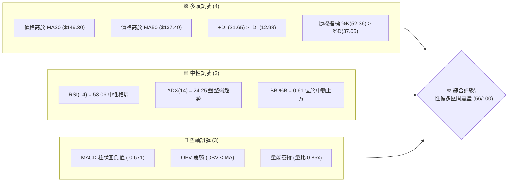

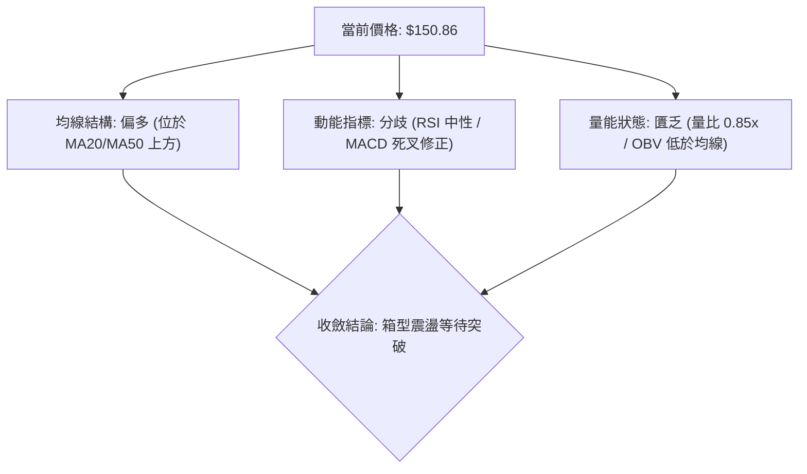

### 📊 核心指標速覽表

| 指標類別 | 指標名稱 | 當前數值 | 訊號 | 解讀 |
|----------|----------|----------|------|------|
| **價格** | 當前價格 | $150.86 | 🟡 | 位於52週區間 38.1%，處於中底階反彈後的整理期 |
| **均線** | MA20 | $149.30 | 🟢 | 現價高於 MA20（+1.04%），短線維持在多頭守備線上 |
| **均線** | MA50 | $137.49 | 🟢 | 現價大幅高於 MA50（+9.72%），中期反彈趨勢未破 |
| **均線** | MA200 | 數據中未偵測到 | 🟡 | 歷史數據不足，以現有 60 日均線（$137.15）輔助評估 |
| **動能** | RSI(14) | 53.06 | 🟡 | 處於 30–70 中性平衡區，無超買超賣，多空勢均力敵 |
| **動能** | MACD (12,26,9) | DIF: 2.353 / DEA: 3.024 | 🔴 | 柱狀圖 -0.671，死叉處於零軸上方弱勢回檔整理 |
| **動能** | 隨機指標 KD | %K: 52.36 / %D: 37.05 | 🟢 | %K 向上穿越 %D，短期具備低位反彈動能 |
| **趨勢** | ADX / DMI | ADX: 24.25 / +DI: 21.65 | 🟡 | ADX < 25 處於無明顯趨勢之盤整市；+DI 占優但擴張力弱 |
| **通道** | 布林通道 (20,2) | 寬度: $142.25 - $156.36 | 🟡 | %B 為 0.61，位於中軌（$149.30）上方，朝上軌行進 |
| **量能** | 成交量與 OBV | 79.28M (均量 93.30M) | 🔴 | 量比 0.85x，OBV 低於均線，量價配合出現輕微頂背離跡象 |
| **波動** | ATR(14) | $5.70 | 🟡 | 波動率佔股價 3.78%，日內波幅溫和，適合設定區間防守 |

### 🏆 技術評分卡

```
╔══════════════════════════════════════════════════════════════════╗
║                技術評分卡 — SPCX (2026-10-01)                   ║
╠══════════════════════════════════════════════════════════════════╣
║ 趨勢強度      ████████░░░░░░░░░░░░  42/100  🟡 中性 (ADX 24.25)  ║
║ 動能指標      ██████████░░░░░░░░░░  50/100  🟡 中性 (RSI 53/MACD-)║
║ 支撐穩定度    ██████████████░░░░░░  70/100  🟢 偏多 (守穩 MA20/S1)║
║ 成交量配合    ████████░░░░░░░░░░░░  40/100  🔴 偏弱 (OBV 低於均線)║
║ 形態完整度    ██████████████░░░░░░  68/100  🟢 偏多 (雙底頸線回測)║
║ 均線排列      █████████████░░░░░░░  65/100  🟢 偏多 (短中期均線揚升)║
╠══════════════════════════════════════════════════════════════════╣
║ 綜合評分      ███████████░░░░░░░░░  56/100  ⚖️ 區間震盪偏多      ║
╚══════════════════════════════════════════════════════════════════╝
```

---

## 2. 趨勢分析

### 🌐 多時框趨勢分析

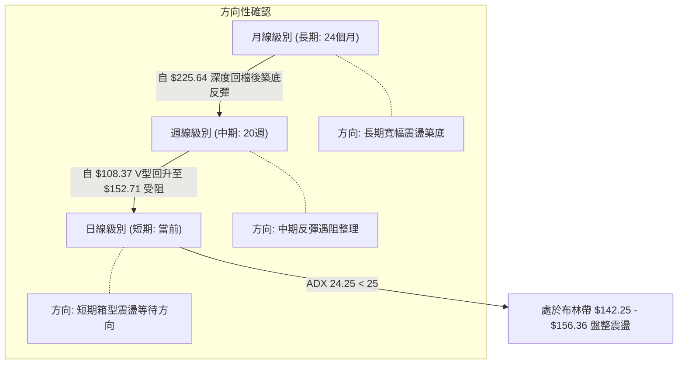

### 📈 長期趨勢 — 12個月走勢圖（Unicode）

以下為根據月度歷史與近 20 週資料繪製之過去 12 個月價格走勢軌跡（標注關鍵高點、低點及反彈分水嶺）：

```
SPCX 月線走勢圖（過去12個月價格軌跡與關鍵轉折）
價格軸 ($)
$225.64 ┤                    ● (52W High: $225.64)
$200.00 ┤                   / \
$179.49 ┤        ●         /   \
$170.86 ┤       / \       ●(06月收: $170.86)
$165.24 ┤      /   \     /     \
$150.86 ┤─────●─────\───/───────\────────●←【當前現價: $150.86 (09月收)】
$143.69 ┤            \ /         \      /
$130.39 ┤             ●           \    ●(08月收: $143.69)
$108.37 ┤                          \  / 
$104.83 ┤                           ● (52W Low: $104.83 / 07月低點 $108.37)
        └───────────────────────────────────────────────────────────►
         10  11  12  01  02  03  04  05  06  07  08  09 (月份/時間軸)
```

**走勢特徵分析表格**：

| 階段區間 | 價格區間 ($) | 漲跌幅 | 走勢特徵 | 量價關係與市場心理 |
|----------|--------------|--------|----------|--------------------|
| **2026-06 前半段** | $160.95 → $225.64 | +40.19% | 急促噴出達 52 週頂部 | 投機買盤爆發，週成交量突破 9.25 億股，動能極度耗竭 |
| **2026-06底～07月** | $225.64 → $104.83 | -53.54% | 斷崖式暴跌，單月崩潰 | 恐慌拋售，多頭融資斷頭，7月收盤落於 $108.37 觸及 52 週底 |
| **2026-08月** | $108.37 → $143.69 | +32.59% | 強勁 V 型軋空反彈 | 逢低機構資金抄底，週成交量高達 9.2 億股，快速脫離底部 |
| **2026-09月至今** | $143.69 → $150.86 | +4.99% | 高檔橫盤，收斂三角震盪 | 量能萎縮至 2.42 億股，於斐波那契 61.8%（$150.98）受阻整理 |

### 📊 中期趨勢（週線分析）

```
SPCX 週線波段阻力與支撐層次示意圖
══════════════════════════════════════════════════════════════════
$172.40 ──────────────────────────────────────── 強阻力 R3 (週線破線起跌點)
$158.13 ──────────────────────────────────────── 波段阻力 R2 (反彈高點聚類)
$155.00 ──────────────────────────────────────── 關鍵阻力 R1 (近期橫盤壓制頂)
─────────────────────── $150.86 (現價) ───────────────────────────
$147.11 ──────────────────────────────────────── 近期支撐 S1 (週K整理平臺)
$142.87 ──────────────────────────────────────── 強支撐 S2 (8月突破平臺 & MA60)
$130.39 ──────────────────────────────────────── 強烈支撐 S3 (波段多空防守底線)
══════════════════════════════════════════════════════════════════
```

- **中期格局**：週線級別自 2026-08-02 的最低收盤價 $108.37 連續走高，突破 $140.00 關卡後，於 $151.21–$152.71 區間陷入橫向整理。
- **動能停滯**：週線 MACD 柱狀圖由 2026-08-16 的峰值 `+4.591` 連續 6 週遞減，最新兩週（09-27、10-04）轉為負值 `-0.567` 與 `-0.671`，顯示中期衝刺動能已衰竭，轉為防守性整理。

### ⚡ 趨勢強度評估（ADX 解讀）

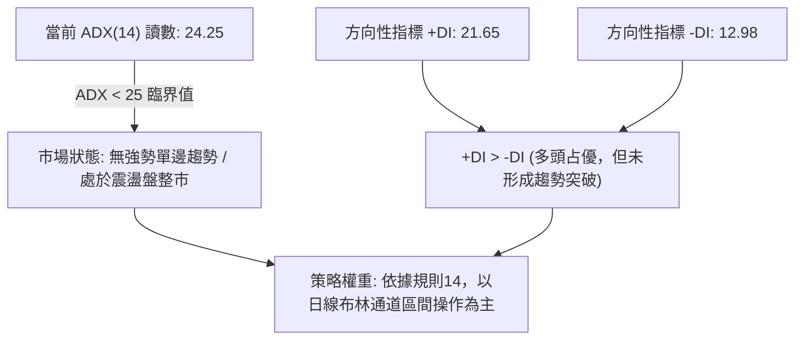

**ADX 趨勢強度對照解讀表**：

| 指標變數 | 當前讀數 | 門檻區間 | 狀態評估 | 交易指引 |
|----------|----------|----------|----------|----------|
| **ADX(14)** | **24.25** | `< 20`: 無趨勢<br>**`20–25`: 弱趨勢/過渡期**<br>`25–40`: 強趨勢<br>`> 40`: 極端趨勢 | **弱趨勢 / 盤整市場** | 嚴禁盲目追價，單邊突破策略勝率降低，順應箱型上下軌來回操作 |
| **+DI (多頭動向)** | **21.65** | 基準線 20 | **微幅偏多** | 買方雖占據主導地位，但強度未達 25 以上的單邊拉升標準 |
| **-DI (空頭動向)** | **12.98** | 基準線 20 | **空頭被壓制** | 賣盤缺乏主動砸盤意願，下方承接買盤具有一定支撐力道 |

---

## 3. 圖表形態分析

### 🔍 形態識別系統

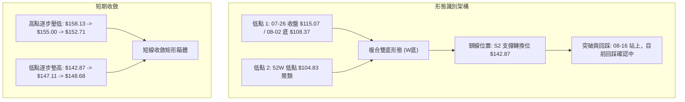

**形態信心度與目標價評估表**：

| 形態名稱 | 信心度 | 判斷依據（引用實際數據） | 完成度 | 目標價（附嚴格計算式） |
|----------|--------|--------------------------|--------|------------------------|
| **雙底形態 (W-Bottom)** | **75%** | 兩次下探低點聚集於 $104.83 與 $108.37，並於 08-09 週以 9.2 億巨量突破頸線位 $142.87 | 85% (已突破頸線，現正進行回測整理) | **由形態高度推算**：<br>頸線 $142.87 + (頸線 $142.87 - 底部 $104.83) = $142.87 + $38.04 = **$180.91**（接近斐波那契 38.2% 回調位 $179.49） |
| **收斂震盪箱體** | **80%** | 上軌受壓於 R1 ($155.00)，下軌受撐於 S1 ($147.11)，現價 $150.86 緊貼中軸 | 90% (振幅收窄至 ATR 的 1.5 倍) | **由箱體等距測幅推算**：<br>突破上軌目標：$155.00 + ($155.00 - $147.11) = **$162.89**<br>跌破下軌目標：$147.11 - $7.89 = **$139.22** |
| **頭肩底形態** | 40% | 數據中左肩與右肩對稱性不足，缺乏完整右肩築底週期 | 數據不足 | **訊號不足，僅做指標型解讀**（不列入交易決策） |

### 🕯️ 重要K線形態分析

| 週/月份 | 收盤價 | 交易量 | K線形態特徵 | 技術解讀 | 訊號 |
|---------|--------|--------|-------------|----------|------|
| **2026-07-26** | $115.07 | 361.82M | 長下影陰線 (Hammer/鎚頭) | 空方力竭，觸及 $104.83 極端超賣區後引發逢低買盤 | 🟢 轉折訊號 |
| **2026-08-09** | $133.11 | 920.45M | 大陽線 (Bullish Engulfing) | 爆出天量突破短均線，主力資金強勢進場反轉走勢 | 🟢 強烈買訊 |
| **2026-09-20** | $152.71 | 669.03M | 帶長上影倒轉十字線 | 衝擊阻力位 R1 ($155.00) 未果，放量滯漲，多頭動能消耗 | 🔴 滯漲預警 |
| **2026-09-27** | $148.68 | 329.44M | 實體回跌小陰線 | 縮量跌破 MA10，確認短線進入拉回蓄勢階段 | 🟡 整理訊號 |
| **2026-10-04** | $150.86 | 242.85M | 縮量小陽線 (收復 MA20) | 成交量創近期新低，賣壓減輕，於 MA20 形成微幅止跌 | 🟡 中性觀察 |

### 📉 ASCII 走勢形態示意圖

```
SPCX 日/週線雙底及箱體形態結構示意圖
價格 ($)
$172.40 ┼                                                  [形態測幅目標位 R3]
        │                                                  
$158.13 ┼────────────────── 形態反彈次高壓制 (R2) ───────────
$155.00 ┼─────────╭───────╮───────── 關鍵箱體頂部 (R1) ─────
        │         │ 09-20 │          
$150.86 ┼─────────┼───────●───────── [現價: 斐波那契 61.8% 處橫盤]
        │         │       │          
$147.11 ┼─────────╰───────┴───────── 箱體支撐下軌 (S1) ─────
$142.87 ┼───────╭─────────────────── 雙底頸線位置 (S2 / 突破確認點)
        │      / \
$123.99 ┼     /   \
$108.37 ┼────●─────●──────────────── 雙底結構低點 (07-26 至 08-02 區間)
$104.83 ┼───╯    (52W Low: $104.83)
        └────────────────────────────────────────────► 時間
```

### 🎯 形態目標價計算

1. **雙底突破等距測幅 (Measured Move)**：
   - 頸線位（S2）：$142.87
   - 形態最低點（52W Low）：$104.83
   - 形態高度（Height）= $142.87 - $104.83 = $38.04
   - **理論理論目標價 = 頸線 + 形態高度 = $142.87 + $38.04 = $180.91**
   - 註：此目標價與阻力位 R3（$172.40）及 52W 區間 38.2% 回調位（$179.49）形成重要共振阻力帶。

2. **短線震盪箱體測幅**：
   - 箱頂阻力 R1 = $155.00，箱底支撐 S1 = $147.11
   - 箱體高度 = $155.00 - $147.11 = $7.89
   - 向上突破延伸目標 = $155.00 + $7.89 = **$162.89**（接近 50.0% 回調位 $165.24）
   - 向下跌破回踩目標 = $147.11 - $7.89 = **$139.22**（接近 S2 強支撐 $142.87 與 MA50 $137.49）

---

## 4. 支撐與阻力

### 🗺️ 關鍵價位分布圖（Unicode）

```
SPCX 價位結構分布圖
══════════════════════════════════════════════════════════════════
$172.40 ║████████████████████████████████████║ 強阻力 R3 (破線起跌區/波段高點)
$158.13 ║████████████████████░░░░░░░░░░░░░░║ 波段阻力 R2 (反彈高點聚類)
$155.00 ║████████████████████████████░░░░░░║ 關鍵阻力 R1 (箱體頂部壓制)
$150.86 ╠══════════════════════════════════╣ ◄ 現價 (斐波那契 61.8% / $150.98)
$147.11 ║▓▓▓▓▓▓▓▓▓▓▓▓▓▓▓▓▓▓▓▓▓▓░░░░░░░░░░║ 近期支撐 S1 (日線震盪平臺底)
$142.87 ║████████████████████████████████░░║ 強支撐 S2 (雙底頸線轉換支撐)
$130.39 ║██████████████████████████████████║ 核心防守 S3 (波段多頭生命線)
══════════════════════════════════════════════════════════════════
```

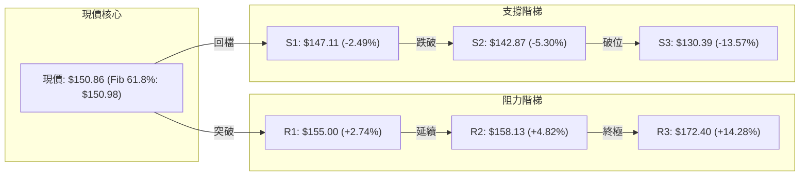

### 🚧 阻力位分析表

所有阻力數值嚴格引用 OHLCV 計算結果：

| 阻力級別 | 精確價位 | 距現價幅標 | 形成原因與籌碼解讀 | 突破難度 | 重要性評級 |
|----------|----------|------------|--------------------|----------|------------|
| **R1** | **$155.00** | +2.74% | 近期多次衝高（09-13 至 09-20）受阻回落的高點密集區；布林帶上軌（$156.36）緊鄰其上 | 🟡 中等 (需日成交量放大至 1 億股以上方可衝過) | ★★★★☆ |
| **R2** | **$158.13** | +4.82% | 近一年波段次高點聚類，接近 2026-07-05 當週反彈頂部（$162.00）前緣套牢帶 | 🔴 較高 (上方套牢融資解套拋壓密集) | ★★★☆☆ |
| **R3** | **$172.40** | +14.28% | 2026-06 月度起跌點密集區（06-14 週收 $160.95，06-28 週跌破 $170），為中期多空分水嶺 | 🔴 極高 (強結構阻力，無重大利多難以一蹴而就) | ★★★★★ |

### 🛡️ 支撐位分析表

所有支撐數值嚴格引用 OHLCV 計算結果：

| 支撐級別 | 精確價位 | 距現價幅標 | 形成原因與籌碼解讀 | 守住機率 | 重要性評級 |
|----------|----------|------------|--------------------|----------|------------|
| **S1** | **$147.11** | -2.49% | 日線波段低點聚類，緊鄰 MA5（$148.46）與日線布林通道中軌（$149.30）防禦區 | 🟢 70% (短期支撐強勁，下影線多次回踩驗證) | ★★★★☆ |
| **S2** | **$142.87** | -5.30% | 8月突破之雙底頸線位，日線布林下軌（$142.25）共振支撐，逢低買盤駐紮處 | 🟢 85% (中期重要轉折支撐，跌破則反彈波段告終) | ★★★★★ |
| **S3** | **$130.39** | -13.57% | 2026-08-09 爆量週陽線啟動低點聚類，波段多方最後防守壁壘 | 🟢 95% (強力籌碼底線，跌破象徵再探 52W 低點) | ★★★★★ |

### 📐 斐波那契回調位分析

依據 52 週極端波段區間（$104.83 → $225.64），計算之黃金分割水準分析如下：

| 斐波那契回調比例 | 對應精確價位 | 價格關係與解讀 |
|------------------|--------------|----------------|
| **0.0% (52W High)** | **$225.64** | 本輪週期的終極歷史阻力頂部 |
| **23.6%** | **$197.13** | 強勢回檔極限位（目前遠在其下） |
| **38.2%** | **$179.49** | 中期牛熊修復關鍵位（雙底等距測幅 $180.91 共振帶） |
| **50.0%** | **$165.24** | 心理半數折價平衡位，中期反彈重要反壓區 |
| **61.8% (黃金分割)** | **$150.98** | **◄ 現價 $150.86 正精確貼合此一關鍵點位（偏離僅 -0.08%）** |
| **78.6%** | **$130.68** | 深度回撤防守位（與波段支撐 S3 $130.39 高度重合） |
| **100.0% (52W Low)**| **$104.83** | 本輪崩盤終點，週期底點 |

- **深度意義解讀**：現價 $150.86 幾乎與 **61.8% 回調位（$150.98）** 完全重疊。在經典斐波那契理論中，從底部的反彈如果能有效站穩 61.8% 關卡，代表走勢由「弱勢超跌反彈」正式質變為「上升趨勢確立」；若在此處反覆拉鋸無法帶量突破，則極易形成次級頂部。當前價格在此黏著，預示著行情進入方向決斷的臨界點。

---

## 5. 技術指標深度解讀

### 🎛️ 指標訊號總覽

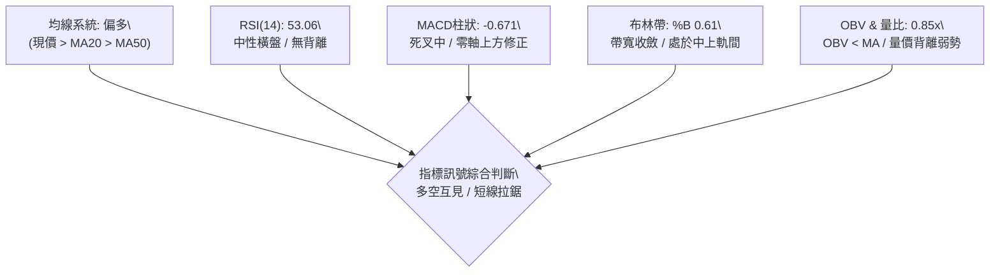

### 📈 移動平均線排列分析

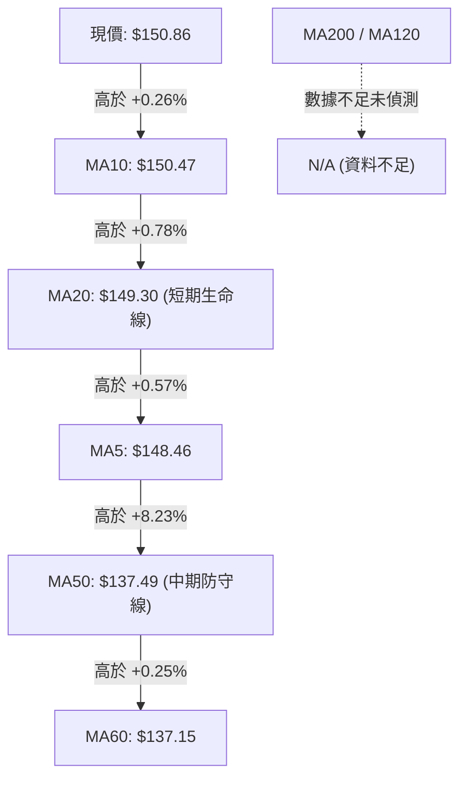

- **均線排列狀態**：當前短期均線糾結（MA5: $148.46、MA10: $150.47、MA20: $149.30），呈現典型的震盪盤整狀態；但現價 $150.86 穩居 MA20 及 MA50 之上，且 MA50（$137.49）與 MA60（$137.15）呈現溫和多頭上翹，顯示**中期趨勢依然受到保護，並非空頭結構，而是「上升過程中的短線混合整理」**。

### 📉 RSI(14) 分析

- **當前數值**：**53.06**
- **動能評估進度條**：
  ```
  超賣 (0) ─────── 極端弱 ─────── 中性 (50) ─────── 偏強 ─────── 超買 (100)
  [██████████████████████████░░░░░░░░░░░░░░░░░░░░░░░] 53.06%
  ```
- **背離判斷**：
  - 日線價格自 2026-09-13 之 $151.21 推進至 09-20 之 $152.71 創近期新高，但 RSI 由 68.0 降至 60.7，隨後回落至 53.06。週線級別具備輕微**弱頂背離**徵兆，這解釋了為何近期股價在 $152–$155 屢屢受阻。
  - 目前 RSI 處於 53 附近，既無超買風險，亦無底背離超跌修復動能，指標進入純粹的箱型震盪模式。

### 📊 MACD (12, 26, 9) 訊號解讀

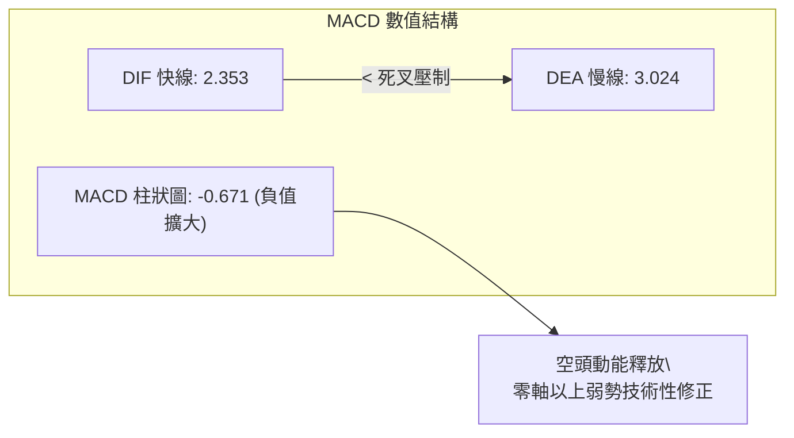

- **訊號解析**：DIF（2.353）低於 DEA（3.024），MACD 柱狀圖為 `-0.671`。儘管雙線維持在零軸上方（代表中期多頭格局並未崩壞），但死叉狀態確認了短線動能正處於回吐與降溫階段。只要柱狀圖未能重新收斂轉紅，短線向上突破 R1（$155.00）的機率便相對受限。

### 📦 布林通道分析

```
SPCX 日線布林通道 (20, 2) 結構示意圖
─────────────────────────────────────────────────────────────────
$156.36 ┬   ──────────────────────────────────── BB 上軌 (動態阻力)
        │  
$150.86 ┼─── ★ [現價: %B = 0.61，位於中軌上方]
        │  
$149.30 ┼─── ┄┄┄┄┄┄┄┄┄┄┄┄┄┄┄┄┄┄┄┄┄┄┄┄┄┄┄┄┄┄┄┄┄┄ BB 中軌 (MA20 基準線)
        │  
$142.25 ┴   ──────────────────────────────────── BB 下軌 (動態支撐)
─────────────────────────────────────────────────────────────────
```

- **通道指標特徵**：
  - **通道帶寬** = $156.36 - $142.25 = $14.11（帶寬百分比僅約 9.4%），顯示通道處於收斂壓抑狀態。
  - **%B 位置** = `0.61`，股價落在中軌（$149.30）與上軌（$156.36）之間的中高區域，回測中軌未破，短線維持中性偏多偏向。

### 💹 成交量分析（量價配合度）

```
SPCX 近期成交量能比率柱狀圖
20日均量 (基準 1.0x): [████████████████████] 93.30M 股
最新成交量 (0.85x) : [█████████████████░░░] 79.28M 股 (量縮 -15.0%)
```

- **量價萎縮警訊**：近五週週成交量呈現極度萎縮走勢（從 08-09 週的 920.45M 降至上週的 242.85M）。量比僅 0.85x，同時 OBV（能量潮）持續運行於均線下方（`OBV < MA`），顯現機構大資金在突破 $150 關卡後並未持續追價，盤面呈現散戶籌碼沉澱與觀望氣息。此種量價背離結構暗示，若無重大利多帶動補量，向上突破容易出現假突破後拉回。

---

## 6. 動能與波動率

### ⚡ 動能評估四象限

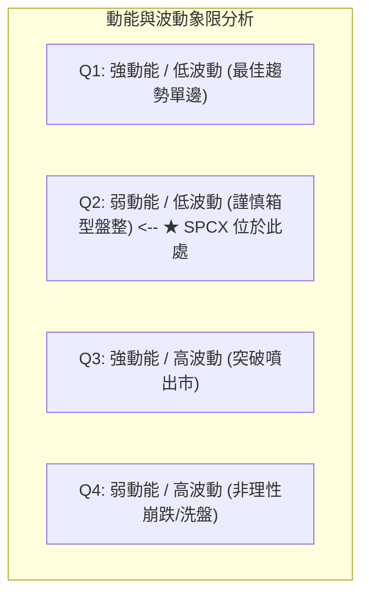

| 象限分類 | 動能狀態 | 波動狀態 | 當前符合度 | 戰略解讀 |
|----------|----------|----------|------------|----------|
| **象限 I** | 強動能 (ADX>30) | 低波動 (ATR<3%) | ❌ 不符 | 單邊主升浪，最適加碼 |
| **象限 II** | **弱動能 (ADX: 24.25)** | **低/中波動 (ATR: 3.78%)** | **✅ 當前狀態** | **動能放緩且波幅收斂，為典型蓄勢盤整，宜區間低吸高拋** |
| **象限 III** | 強動能 (ADX>30) | 高波動 (ATR>5%) | ❌ 不符 | 爆發突破階段，需防假突破 |
| **象限 IV** | 弱動能 (ADX<20) | 高波動 (ATR>5%) | ❌ 不符 | 恐慌震盪洗盤，應全面空倉 |

### 📊 ATR 波動率分析

- **ATR(14) 讀數**：**$5.70**
- **價格百分比**：**3.78%**（處於正常健康波動區間，未出現異常擴大）。
- **風控止損距離量化建議**：
  - **日內超短線波動保護（1.0 × ATR）**：$5.70。
  - **波段標準止損距離（1.5 × ATR）**：1.5 × $5.70 = **$8.55**。
  - **極限波段防守保護（2.0 × ATR）**：2.0 × $5.70 = **$11.40**。
  - *實戰應用*：在現價 $150.86 建立多頭部位時，1.5 倍 ATR 止損恰好落在 $150.86 - $8.55 = $142.31，與布林下軌 $142.25 及強支撐 S2（$142.87）完美共振，印證該處為最科學之硬止損位。

### 📐 Beta 與市場相關性

- **Beta 數值**：數據源標記為 `N/A`（高成長/特種太空工業板塊特性）。
- **籌碼與抗跌性解讀**：
  - 公司市值達 $1.99T，機構持股比例達 48.3%，內部人持股 12.7%，籌碼結構相對穩固。
  - 空頭淨額比例（Short % Float）為 2.6%，回補天數（Short Ratio）僅 2.07 天，顯示目前市場未累積大規模軋空燃料，走勢主要依賴自身基本面與大盤流動性推動。

---

## 7. 多時框架總結

### 📋 時框架評分表

| 時框架 | 趨勢方向 | 動能狀態 | 均線排列 | 形態特徵 | 綜合評分 | 建議方針 |
|--------|----------|----------|----------|----------|----------|----------|
| **長期 (月線)** | 🟡 寬幅修復 | 🟡 中性平緩 | 🟡 缺乏長均線，以 MA60 為底 | 52W 區間 38.1% 反彈位 | **52 / 100** | 戰略性底倉持有 |
| **中期 (週線)** | 🟢 震盪偏多 | 🔴 MACD 柱翻負 | 🟢 站穩 MA50（$137.49） | 雙底突破回測階段 | **60 / 100** | 逢低回踩布局 |
| **短期 (日線)** | 🟡 箱型盤整 | 🟡 RSI 53 / KD 金叉 | 🟢 站上 MA20（$149.30） | 收斂箱體 ($147-$155) | **55 / 100** | 高拋低吸波段 |

### 🔲 綜合訊號矩陣

```
SPCX 多時框訊號一致性收斂矩陣
══════════════════════════════════════════════════════════════════
維度            短期 (日線)       中期 (週線)       長期 (月線)
──────────────────────────────────────────────────────────────────
均線位置        🟢 多頭占優       🟢 多頭占優       🟡 中性平衡
動能指標        🟡 中性震盪       🔴 柱狀圖負值     🟡 橫向整理
量能結構        🔴 量能萎縮       🔴 持續縮量       🟡 換手充沛
形態學          🟡 收斂箱型       🟢 複合雙底       🟡 區間下限
──────────────────────────────────────────────────────────────────
最終收斂結論    【中性偏多，但受制於弱趨勢與成交量不足】
══════════════════════════════════════════════════════════════════
```

### ⚖️ 多時框收斂結論

依據多時框收斂規則（規則 14）：
1. **趨勢/盤整判定**：當前 **ADX(14) 為 24.25（< 25 臨界值）**，技術架構明確屬於**「盤整行情」**。
2. **主導維度確立**：在盤整行情中，不可盲目跟隨均線追突破，**必須以日線布林通道（$142.25 至 $156.36）與箱體關鍵支撐阻力為核心交易依據**。
3. **唯一方向結論**：**中性偏多觀望，區間箱型操作**。雖然中期週線處於底部反彈上升通道中，但短期日線動能不足，價格受困於斐波那契 61.8%（$150.98）與 R1（$155.00）之高壓壁壘，向下則有 MA20（$149.30）與 S1（$147.11）護盤。因此，整體技術結構定調為**「箱體震盪等待突破」**。

---

## 8. 交易策略建議

### 🗺️ 策略決策流程圖

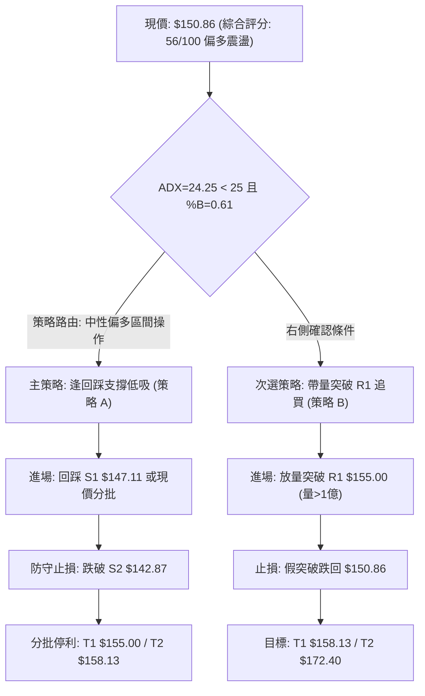

### 🧭 策略路由（依評分卡分流）

> **當前主策略方向 = 區間震盪逢低做多（依綜合評分 56/100 判定）**  
> 綜合評分介於 40–60 之中性區間，且偏向多頭防守（現價仍高於 MA20、MA50），因此嚴格遵循「盤整市不追高、貼近布林中下軌低吸、遇阻力分批結利」之操作紀律。

### 🎯 價格情境階梯（Price Scenarios）

以實際關鍵價位構建的三級情境階梯：

| 觸發條件 | 下一目標 | 後續延伸 | 情境含義與操作對策 |
|----------|----------|----------|--------------------|
| **帶量突破 R1 $155.00** | **R2 $158.13** | **R3 $172.40** | 短線轉強，盤整突破，打開通往 $170 之空間，順勢加碼 |
| **站穩現價 $147.11–$150.86** | **R1 $155.00** | **BB上軌 $156.36** | 區間震盪延續，沿布林通道進行低買高賣高拋操作 |
| **有效跌破 S1 $147.11** | **S2 $142.87** | **S3 $130.39** | 中期轉弱，回測雙底頸線與布林下軌，多單必須警戒減倉 |

### 📊 情境機率分佈

| 情境類別 | 機率預估 | 主要技術依據 |
|----------|----------|--------------|
| **區間震盪蓄勢** | **55%** | **ADX = 24.25 < 25** 確認盤整格局；成交量縮（量比 0.85x）；RSI 處於 53 之平衡區，缺乏單邊動能推動力。 |
| **向上突破反彈** | **30%** | 價格站穩 **MA20（$149.30）** 與 **MA50（$137.49）**；隨機指標 KD 出現多頭金叉；華爾街共識目標達 $226.00。 |
| **跌破下探尋底** | **15%** | **MACD 柱狀圖維持負值（-0.671）**；能量潮 **OBV < MA** 呈現量價背離；上方套牢浮額引發二次踩底。 |

### 🟢 主策略詳情（方向依上方路由）

以下提供兩套針對當前盤整市場的具體執行策略：

| 策略要素 | 策略 A：箱底低吸策略 (首選/左側逢低) | 策略 B：突破追隨策略 (次選/右側確認) |
|----------|-------------------------------------|-------------------------------------|
| **策略邏輯** | 趁量縮回測箱體下軌支撐時低接，盈虧比極佳 | 待成交量大於 1 億股且突破 R1 時跟進，動能明確 |
| **進場條件** | 股價回踩 S1 獲支撐，出現日線收下影線訊號 | 日K收盤價實體突破 R1，且當日成交量突破 20 日均量 |
| **精確進場點** | **$147.11** (或於現價 $150.86 輕倉建立首批) | **$155.00** (突破點掛單買入) |
| **第一目標 (T1)**| **$155.00** (箱頂阻力 R1，獲利空間 +5.36%) | **$158.13** (阻力 R2，獲利空間 +2.02%) |
| **第二目標 (T2)**| **$158.13** (阻力 R2，獲利空間 +7.49%) | **$172.40** (阻力 R3，獲利空間 +11.23%) |
| **硬止損價位** | **$142.87** (跌破 S2 強支撐及布林下軌退出) | **$150.86** (跌破原箱頂轉化之支撐/現價退出) |
| **單筆風險空間** | -2.88% (以 $147.11 計，風險 -$4.24) | -2.67% (以 $155.00 計，風險 -$4.14) |
| **風險報酬比** | **1 : 2.6** (以目標 T2 計算) | **1 : 4.2** (以目標 T2 計算) |
| **策略勝率評估**| **65%** | **55%** |
| **建議配置倉位**| **15% - 20%** 總資金 | **10% - 15%** 總資金 |

### 🔴 反向風險觸發點（對沖提示）

若出現以下訊號，代表「震盪偏多」主策略被徹底推翻，多頭必須無條件止損或啟動反向避險：
1. **關鍵位破位**：日K收盤價**實體跌破強支撐 S2（$142.87）**，確認雙底頸線假突破，中期轉為空頭浪潮。
2. **量能空方發散**：成交量突然放大至 1.2 億股以上且收中長陰線，同時布林通道下軌被向下「開口撕裂」（%B < 0）。
3. **風控反向動作**：一旦跌破 $142.87，應全數清倉多頭，並可於跌破時小倉位反手建立空頭頭寸，向下看至 S3（$130.39）。

### ⭐ 整體訊號強度評星

```
╔══════════════════════════════════════════════════════════════════╗
║ 做多訊號強度：★★★☆☆  (3.0 / 5 星)  均線支撐完好，但缺乏成交量配合║
║ 做空訊號強度：★★☆☆☆  (2.0 / 5 星)  空頭尚未破位，下有層層支撐護航║
║ 整體可信度  ：★★★★☆  (4.0 / 5 星)  價位結構聚類明確，技術邊界清晰║
╚══════════════════════════════════════════════════════════════════╝
```

---

## 9. 風險提示與監控

### ✅ 關鍵監控指標 Checklist

```
╔══════════════════════════════════════════════════════════════════╗
║               每日/每週盤後風控監控清單 (Checklist)              ║
╠══════════════════════════════════════════════════════════════════╣
║ [ ] 價格防守線：收盤價是否跌破 MA20 ($149.30) 或箱底 S1 ($147.11)║
║ [ ] 阻力突破度：是否帶量突破 R1 ($155.00) 與布林上軌 ($156.36) ║
║ [ ] 動能警訊  ：MACD 柱狀圖負值是否持續擴大至 -1.00 以下       ║
║ [ ] 超賣/超買 ：RSI(14) 是否跌破 45 (弱勢轉向) 或突破 65 (過熱)║
║ [ ] 量能異動  ：日成交量是否異常超越 1.2 億股 (主力換手或砸盤)  ║
║ [ ] 趨勢重啟  ：ADX 是否向上穿過 25 臨界線 (預告單邊趨勢來臨)   ║
╚══════════════════════════════════════════════════════════════════╝
```

### ⚠️ 風險場景分析

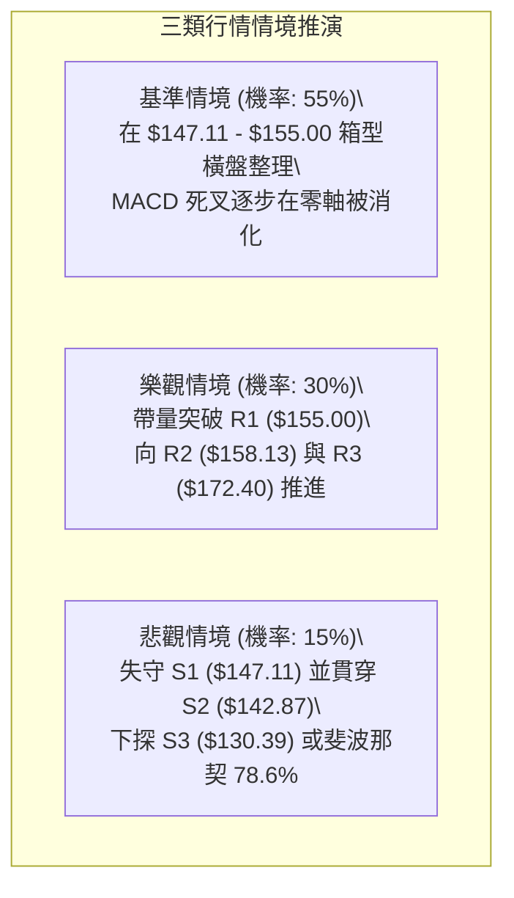

### 🛡️ 風險管理重要提醒

1. **基本面與估值風險背離**：
   - 儘管公司營收年增高達 91.9%，但本益比（遠期 P/E 達 86.54）與市銷率（P/S 達 86.25）處於極端高位，營業利益率（-1.8%）與淨利率（-35.7%）尚未轉正。極高估值意味著股票對市場利率變化與避險情緒極度敏感，**任何大盤系統性拋售均可能引發個股大幅度超跌**。
2. **日內波幅風控紀律**：
   - 每日 ATR 達 $5.70，日內波動高達 3.78%。未持倉者切忌於盤中急拉時追高，以防日內「假突破」遭遇大幅反噬。
3. **倉位配置上限**：
   - 在 ADX < 25 且量能低迷之震盪市中，單一標的整體持倉比例**不宜超過總投資組合的 15%–20%**，並應保留充足現金部位，以防行情下破 S2 後引發的二度下探。

---

## 📋 報告總結

```
╔══════════════════════════════════════════════════════════════════╗
║                     SPCX 技術分析報告總結                       ║
╠══════════════════════════════════════════════════════════════════╣
║ 報告日期：2026-10-01                                             ║
║ 當前價格：$150.86                                                ║
║ 分析評級：⚖️ 區間震盪偏多 (綜合評分: 56 / 100)                     ║
║                                                                  ║
║ 關鍵結論：                                                       ║
║ ├─ 長期趨勢：🟡 築底修復，自 $104.83 谷底爬升，處 52W 區間 38.1%   ║
║ ├─ 中期趨勢：🟢 震盪走高，成功完成雙底頸線突破 ($142.87)         ║
║ ├─ 短期趨勢：🟡 箱體拉鋸，受制於 R1 ($155.00) 與量能萎縮瓶頸     ║
║ ├─ 關鍵支撐：S1 $147.11 / S2 $142.87 (生命線) / S3 $130.39       ║
║ ├─ 關鍵阻力：R1 $155.00 / R2 $158.13 / R3 $172.40 (測幅目標)     ║
║ └─ 分析師目標：華爾街平均 $226.00 (共識 Buy，評估樂觀)           ║
║                                                                  ║
║ 最優策略組合：                                                   ║
║ 1. 🥇 最佳機會：策略 A (箱底低吸) — 於 $147.11 附近低接，         ║
║                 止損設於 $142.87，目標上看 $155.00 / $158.13    ║
║ 2. 🥈 次選機會：策略 B (右側追隨) — 帶量突破 $155.00 後順勢進場， ║
║                 目標直指雙底測幅 $172.40                         ║
║ 3. 🥉 保守選擇：維持 50% 以上現金水位，耐心等待日線 ADX > 25     ║
║                 伴隨單日成交量擴大至 1 億股以上再行進場         ║
╚══════════════════════════════════════════════════════════════════╝
```

---

> ⚠️ **免責聲明**：本報告為 AI 自動生成之技術分析，所有數據及估算均基於提供的歷史價格資訊。本報告**僅供研究與學術參考**，**不構成任何投資建議**。投資有風險，入市需謹慎。

---

*報告生成時間：2026-10-01 ｜ 數據來源：Yahoo Finance ｜ 分析框架：多時框技術分析*