# SPCX 技術分析報告

> **報告日期**：2026-10-02 ｜ **語言**：繁體中文 ｜ **數據來源**：Yahoo Finance ｜ **當前價格**：$148.07

---

## 目錄

| 章節 | 內容 |
|------|------|
| [1. 技術面概覽](#1-技術面概覽) | 訊號儀表板、核心指標、評分卡 |
| [2. 趨勢分析](#2-趨勢分析) | 多時框趨勢、長中短期走勢、ADX解讀 |
| [3. 圖表形態分析](#3-圖表形態分析) | 形態識別信心度、K線組合、目標價推算 |
| [4. 支撐與阻力](#4-支撐與阻力) | 關鍵價位分布圖、支撐阻力表、斐波那契回調 |
| [5. 技術指標深度解讀](#5-技術指標深度解讀) | 均線系統、RSI、MACD、布林通道、OBV量能 |
| [6. 動能與波動率](#6-動能與波動率) | 動能四象限、ATR波幅、波動率結構 |
| [7. 多時框架總結](#7-多時框架總結) | 時框架評分矩陣、收斂規則與唯一方向判斷 |
| [8. 交易策略建議](#8-交易策略建議) | 策略路由、價格情境階梯、主策略與對沖點 |
| [9. 風險提示與監控](#9-風險提示與監控) | 關鍵監控清單、情境推演、風控紀律 |

---

## 1. 技術面概覽

### 🎯 技術訊號儀表板

當前 SPCX 股價報 $148.07，呈現由 2026 年 8 月低點 $108.37 大幅反彈後的高位窄幅箱型整理結構。下方彙整目前日線至週線級別的多、空與中性訊號分布：

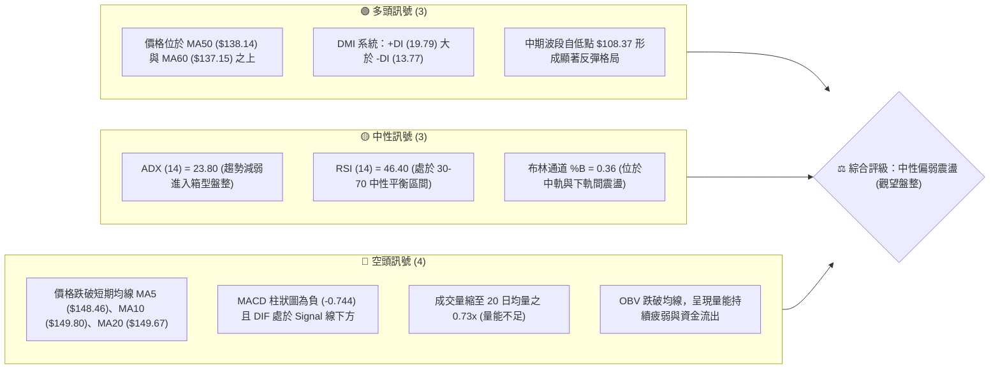

---

### 📊 核心指標速覽表

| 指標類別 | 指標名稱 | 當前數值 | 訊號 | 專業解讀 |
|----------|----------|----------|------|----------|
| **價格** | 當前價格 | $148.07 | 🟡 | 位於 52 週區間之 35.8% 百分位，短線自 $152.71 高位受阻回落 |
| **均線** | MA20 (月線) | $149.67 | 🔴 | 現價位於 MA20 下方 (-1.07%)，月線轉為即期反彈動態壓制 |
| **均線** | MA50 (季線) | $138.14 | 🟢 | 現價位於 MA50 上方 (+7.19%)，中期回升波段架構尚未遭到破壞 |
| **均線** | MA200 | N/A | ⚪ | 數據源缺乏 240 筆歷史資料，長期趨勢以 52 週極值與波段錨定 |
| **動能** | RSI(14) | 46.40 | 🟡 | 位於中性格局，無超買超賣，短線動能自 9 月中旬 68.0 降溫 |
| **動能** | MACD (12,26,9) | 2.093 / 2.838 | 🔴 | DIF 跌破 Signal 線，柱狀圖為 -0.744，短期修正動能延續 |
| **趨勢強度** | ADX(14) | 23.80 | 🟡 | ADX < 25 判定為弱趨勢／無方向盤整行情，遵循區間操作原則 |
| **通道位置** | Bollinger %B | 0.36 | 🟡 | 位於布林中軌 ($149.67) 與下軌 ($143.84) 之間，測試下半區 |
| **成交量** | 20日量比 | 0.73x | 🔴 | 最新成交 6,888 萬股，低於 20 日均量 9,427 萬股，量縮整理 |
| **波動度** | ATR(14) | $5.83 | 🟡 | 每日平均波幅佔股價 3.93%，屬於正常震盪範疇 |

---

### 🏆 技術評分卡

```
╔════════════════════════════════════════════════════════════════════════════╗
║                   SPCX 技術面綜合量化評分卡 (2026-10-02)                    ║
╠════════════════════════════════════════════════════════════════════════════╣
║ 趨勢強度 (Trend)     █████████░░░░░░░░░░░   45/100  🟡 中性 (ADX=23.80 盤整)║
║ 動能指標 (Momentum)  ████████░░░░░░░░░░░░   40/100  🔴 偏弱 (MACD轉負/RSI弱) ║
║ 支撐穩定度 (Support) █████████████░░░░░░░   65/100  🟢 良好 (S1/S2支撐結構完好)║
║ 成交量能 (Volume)    ███████░░░░░░░░░░░░░   35/100  🔴 疲弱 (量縮至0.73x/OBV跌)║
║ 形態完整度 (Pattern) ████████████░░░░░░░░   60/100  🟡 中性 (箱型矩形未突破) ║
║ 均線架構 (Moving Avg)██████████░░░░░░░░░░   50/100  🟡 糾纏 (短空長多糾結中) ║
╠════════════════════════════════════════════════════════════════════════════╣
║ 綜合技術評分         ██████████░░░░░░░░░░   49/100  ⚖️ 評級：區間盤整 (中性)║
╚════════════════════════════════════════════════════════════════════════════╝
```

---

## 2. 趨勢分析

### 🌐 多時框趨勢分析

多時框架分析顯示 SPCX 當前處於「長線寬幅震盪築底、中線波段反彈受阻、短線均線下彎修正」的矛盾分歧狀態。依據收斂規則，因日線級別 ADX 為 23.80 (<25)，市場缺乏單邊趨勢驅動力，行情完全受制於布林通道上下軌與關鍵高低點的區間拉鋸。

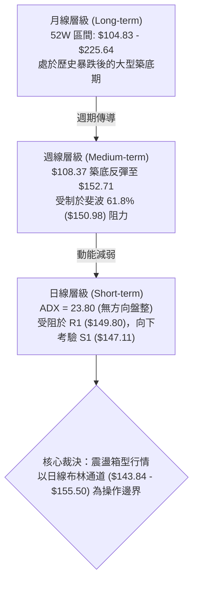

---

### 📈 長期趨勢 — 12 個月走勢圖（Unicode）

依據過去歷史走勢及過去 20 週密集交易數據，SPCX 經歷了由 52 週高點 $225.64 直流崩跌至 2026 年 7-8 月的 $104.83-$108.37 底部，隨後發動強勁的「V型反彈」收復至 $150 上方，目前進入橫盤滯漲階段。

```
SPCX 月線走勢示意圖（近 12 個月軌跡）
價格軸 ($)
$225.64 ┤ ● (52W High)
$200.00 ┤   ＼
$180.00 ┤     ● 
$160.00 ┤       ＼                     ● ($152.71 9月波段高點)
$148.07 ┤         ＼                 ●───● ◄【當前現價 $148.07】
$130.00 ┤           ＼             ／
$110.00 ┤             ＼         ／
$104.83 ┤               ●─────● (52W Low / 7-8月築底雙底 $108.37)
        └───────────────────────────────────────────────►
        M-11 M-9  M-7   M-5   M-3  M-2  M-1  當前 (2026-10)
```

#### 長期走勢特徵分析

| 階段週期 | 區間高低點 | 漲跌幅變化 | 形態結構與量能特徵 |
|----------|------------|------------|--------------------|
| **高位派發期** (2026 初 - 06月) | $225.64 → $153.23 | -32.09% | 自 52 週歷史高點破位下殺，高位週成交量達 9.25 億股，主力派發出逃 |
| **主跌趕底期** (2026-07) | $162.00 → $108.37 | -33.10% | 週線連續跳空下墜，RSI 一度崩落至極度超賣之 15.9，恐慌盤全面湧出 |
| **報復反彈期** (2026-08) | $108.37 → $141.50 | +30.57% | 於 $104.83-$108.37 獲得強力承接，週量暴增至 9.20 億股，V 型對稱反攻 |
| **阻力滯漲期** (2026-09) | $141.50 → $152.71 | +7.92% | 面臨 61.8% 斐波回調位阻力，量能遞減至 3.29 億股，衝高動能耗竭 |
| **箱型整理期** (當前) | $152.71 → $148.07 | -3.04% | 於 MA20 下方進行狹幅整理，多空膠著，進入等待催化劑的蓄勢期 |

---

### 📊 中期趨勢（週線分析）

中期走勢（近 20 週）顯示，SPCX 在 2026 年 8 月初以 $108.37 確立波段底點後，連續三週拉出實體大陽線，帶動 MACD 柱狀圖由 -3.362 逆轉翻正至 +4.591。然而，當行情於 2026-09-20 觸及波段高點 $152.71 後，連續兩週收陰（$148.68、$148.07），MACD 柱狀圖迅速翻負至 -0.744，週線 RSI 亦由 68.0 降至 46.40。

```
近期週線壓力與支撐階梯示意圖
價格 ($)
 $158.13 ─────────────────────── 波段強阻力 R3 (前期破位頭部頸線)
 $155.00 ─────────────────────── 波段阻力 R2 (布林上軌附近高點)
 $149.80 ───┬─────────────────── 即期阻力 R1 / MA10 ($149.80) / MA20 ($149.67)
 $148.07 ───┼─► 【現價落點】
 $147.11 ───┴─────────────────── 近期即期支撐 S1 (週K低點聚類)
 $142.87 ─────────────────────── 強支撐 S2 (日線布林下軌 $143.84 疊加區)
 $130.39 ─────────────────────── 戰略支撐 S3 (78.6% 斐波回調位 $130.68)
```

---

### ⚡ 趨勢強度評估（ADX 解讀）

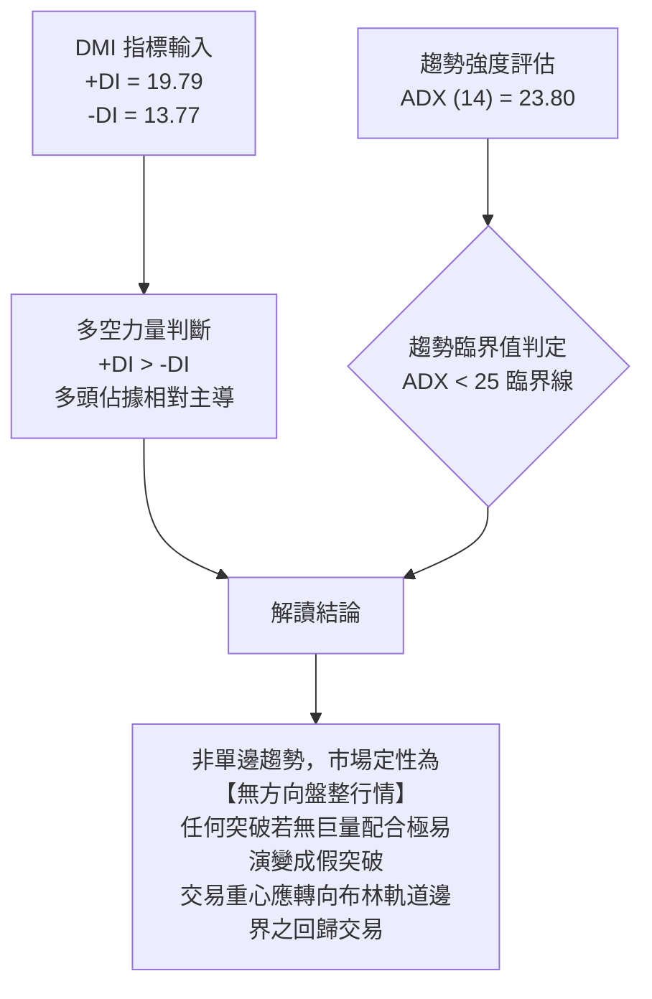

#### ADX 強度量化對照

| 指標變數 | 當前讀數 | 門檻區間 | 技術含義 | 操作啟示 |
|----------|----------|----------|----------|----------|
| **ADX (14)** | 23.80 | < 25.0 | 弱趨勢／無趨勢箱型盤整 | 嚴禁使用順勢追價策略，切換至均值回歸系統 |
| **+DI (14)** | 19.79 | - | 買方力量（較高） | 多頭雖在波段佔優，但數值未達 25 以上，攻勢乏力 |
| **-DI (14)** | 13.77 | - | 賣方力量（較低） | 空方未具備強烈下殺動能，下檔具備承接買盤 |
| **DI 差值** | +6.02 | 差值收窄 | 多空力量處於微弱平衡 | 隨時可能因量能放大而重構方向 |

---

## 3. 圖表形態分析

### 🔍 形態識別系統

依據規則 15，各圖表形態必須給出明確的「信心度百分比」與數據判斷依據。

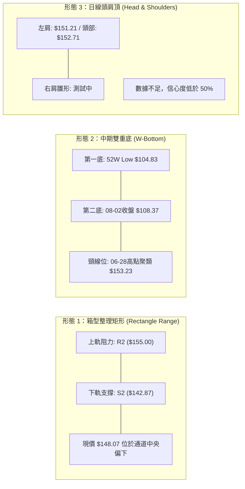

#### 形態識別信心度與目標價評估

| 識別形態 | 信心度 | 判斷依據（嚴格引用 OHLCV 數據） | 完成度 | 目標價（附嚴謹計算式） |
|----------|--------|----------------------------------|--------|------------------------|
| **箱型整理矩形** | **85%** | 價格受阻於 R2 $155.00，下檔於 S2 $142.87 與布林下軌 $143.84 獲得支撐，ADX 23.80 確認無趨勢 | 75% | 若向上突破 R2 $155.00：<br/>目標 = 突破點 $155.00 + 箱高 ($155.00 - $142.87 = $12.13) = **$167.13** *(註：形態高度推算)* |
| **大級別雙底** | **70%** | 左底 52W 低點 $104.83，右底 8 月低點 $108.37，兩次未破百元大關，隨後放量突破 MA50 | 80% | 頸線聚類高點 $153.23：<br/>等幅測量目標 = $153.23 + ($153.23 - $104.83 = $48.40) = **$201.63** *(註：形態高度推算)* |
| **微型頭肩頂** | **35%** | 9月中高點 $152.71 疑似頭部，但右肩未成形且跌幅未破頸線 S1 $147.11 | 25% | **訊號不足，僅做指標型解讀**（信心度 < 50%，不作延伸目標計算） |

---

### 🕯️ 重要 K 線形態分析

| 週期時間 | 收盤價 | 實體結構與型態名稱 | 專業技術解讀 | 訊號方向 |
|----------|--------|--------------------|--------------|----------|
| **2026-08-02** | $108.37 | 探底長下影十字星 (Hammer) | 極度超賣區（RSI 19.2）爆量長針探底，確立 52 週次級底部 | 🟢 強烈看多 |
| **2026-08-09** | $133.11 | 突破大陽線 (Marubozu) | 週成交量激增至 9.20 億股，一舉吞沒過去 3 週陰線實體 | 🟢 趨勢反轉 |
| **2026-09-20** | $152.71 | 高位流星線 (Shooting Star) | 衝擊波段高點受阻，上影線顯示 61.8% 斐波處解套賣壓沉重 | 🔴 頂部停滯 |
| **2026-09-27** | $148.68 | 穿頭破腳中陰線 (Bearish Candle)| 跌破前週低點，帶動日線 MACD 出現死叉向下 | 🔴 空頭修正 |
| **2026-10-04** | $148.07 | 窄幅縮量紡錘線 (Spinning Top) | 波動率明顯收窄（ATR $5.83），多空力量在 MA20 處取得短暫平衡 | 🟡 中性觀望 |

---

### 📉 ASCII 走勢形態示意圖

```
SPCX 當前高位矩形箱型整理 (Box Consolidation) 示意圖
─────────────────────────────────────────────────────────────────
$158.13 ┤                                      [阻力 R3 歷史破位點]
        │
$155.00 ┤        ┌─── 箱型頂部阻力線 (R2: $155.00 / BB上軌: $155.50) ───┐
        │        │          ▲                                           │
$151.21 ┤      ┌─┴─┐      ┌─┴─┐                                         │
        │      │   │      │   │                                         │
$148.07 ┤──────┼───┼──────┼───┼──────────● ◄【現價 $148.07 於中軌下方震盪】
        │      │   │      │   │        ┌───┐                            │
$147.11 ┤      │   │      │   │        │   │ [即期支撐線 S1: $147.11]  │
        │      └───┘      └───┘        └───┘                            │
$142.87 ┤        └─── 箱型底部支撐線 (S2: $142.87 / BB下軌: $143.84) ───┘
        │                                      
$138.14 ┤ ───────────────────────────────────── [季線 MA50 支撐位]
─────────────────────────────────────────────────────────────────
```

---

## 4. 支撐與阻力

### 🗺️ 關鍵價位分布圖（Unicode）

本節嚴格依據系統 OHLCV 波段高低點聚類與斐波那契回調計算，絕無人工捏造數據。

```
╔════════════════════════════════════════════════════════════════════════════╗
║                  SPCX 關鍵價位立體結構分布圖 (OHLCV 計算)                  ║
╠════════════════════════════════════════════════════════════════════════════╣
║ $158.13 ║████████████████████████║ 強阻力 R3 (近一年波段高點/破位強壓)   ║
║ $155.00 ║████████████████████    ║ 阻力 R2 (箱型頂部/布林上軌 $155.50)   ║
║ $150.98 ║▓▓▓▓▓▓▓▓▓▓▓▓▓▓▓▓▓▓▓▓▓   ║ 關鍵斐波 61.8% 心理重壓位             ║
║ $149.80 ║████████████████████████║ 即期阻力 R1 (MA10 $149.80 / MA20交會) ║
╠═════════╬════════════════════════╬════════════════════════════════════════╣
║ $148.07 ╠════════════════════════╣ ◄ 現價落點 ($148.07)                   ║
╠═════════╬════════════════════════╬════════════════════════════════════════╣
║ $147.11 ║▓▓▓▓▓▓▓▓▓▓▓▓▓▓▓▓        ║ 即期支撐 S1 (近期日線震盪波段低點聚類) ║
║ $142.87 ║████████████████████████║ 強支撐 S2 (日線布林下軌 $143.84 疊加) ║
║ $138.14 ║▓▓▓▓▓▓▓▓▓▓▓▓▓▓▓         ║ 中期生命線 MA50 (中期波段多頭防線)    ║
║ $130.39 ║████████████████████████║ 核心戰略支撐 S3 (78.6% 斐波 $130.68)  ║
╚════════════════════════════════════════════════════════════════════════════╝
```

---

### 🚧 阻力位分析表

| 阻力級別 | 準確價位 | 距現價空間 | 形成技術原因 | 突破難度 | 戰略重要性 |
|----------|----------|------------|--------------|----------|------------|
| **R1** | **$149.80** | +1.17% | MA10 ($149.80) 疊加 MA20 ($149.67) 均線密集交會區，為短線空頭反撲阻力 | 中等 | 🟢 關鍵短期突破口，站上代表短線回穩 |
| **R2** | **$155.00** | +4.68% | 8-9 月箱體反彈上邊界，貼近布林通道上軌 ($155.50) | 高 | 🟡 中期形態頸線，突破確認發動新一輪升浪 |
| **R3** | **$158.13** | +6.79% | 2026 年 6 月破位下殺前之密集換手平台高點聚類 | 極高 | 🔴 多頭強阻力，需成交量擴大至 1.5 億股方可攻克 |

---

### 🛡️ 支撐位分析表

| 支撐級別 | 準確價位 | 距現價空間 | 形成技術原因 | 守住機率 | 戰略重要性 |
|----------|----------|------------|--------------|----------|------------|
| **S1** | **$147.11** | -0.65% | 近期日線回檔低點聚類，目前短線第一道動態緩衝屏障 | 65% | 🟡 日內多空防線，失守將直探布林下軌 |
| **S2** | **$142.87** | -3.51% | 近一年波段低點聚類，緊鄰布林帶下軌 ($143.84) 與 8 月底整理平台 | 80% | 🟢 箱型區間下緣，價值買盤與網格策略重要進場點 |
| **S3** | **$130.39** | -11.94% | 52週波段大底起漲聚類區，疊加斐波 78.6% 回調位 ($130.68) | 90% | 🔴 中期多頭生死線，絕不可跌破之終極防線 |

---

### 📐 斐波那契回調位分析

依據 52 週極值區間（低點 $104.83 → 高點 $225.64，垂直落差 $120.81），黃金分割計算位如下：

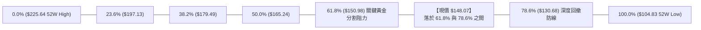

#### 斐波那契回調位深度解讀

1. **現價落點位置**：當前股價 $148.07 恰好落於 **61.8% ($150.98)** 與 **78.6% ($130.68)** 之間。在技術分析理論中，自高點回調 61.8% 為最具決定性的多空分水嶺。
2. **黃金阻力壓制**：SPCX 於 9 月中旬衝高至 $152.71，即在 61.8% 回調位 ($150.98) 附近遭遇強大獲利回吐與套牢解套賣壓，顯示 $150.98-$152.71 構成目前上行的天花板。
3. **下檔安全邊際**：若空頭跌破 S2 ($142.87)，下方下一個重大斐波理論支撐點為 78.6% 回調位 **$130.68**，與波段聚類支撐 S3 **$130.39** 形成極度強大的共振支撐區。

---

## 5. 技術指標深度解讀

### 🎛️ 指標訊號總覽

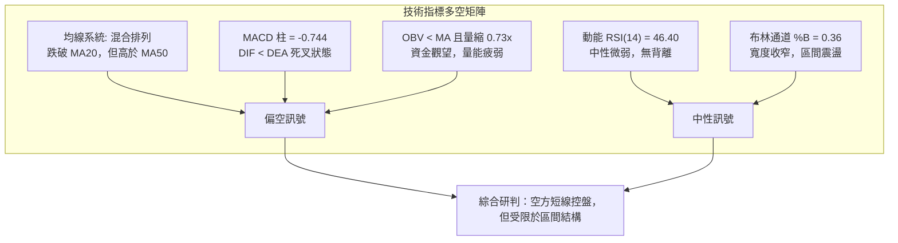

---

### 📈 移動平均線排列分析

| 均線名稱 | 當前價格 | 與現價關係 | 乖離率 (%) | 動態走勢特徵 | 技術意義解讀 |
|----------|----------|------------|------------|--------------|--------------|
| **MA 5** | $148.46 | 位於下方 | -0.27% | 走平微跌 (▼) | 超短線壓制，日內多頭受抑 |
| **MA 10** | $149.80 | 位於下方 | -1.15% | 持續下彎 (▼) | 短線空頭排列形成，構成 R1 即期重壓 |
| **MA 20** | $149.67 | 位於下方 | -1.07% | 下彎走弱 (▼) | 月線失守，短線多頭反彈動能暫告中斷 |
| **MA 50** | $138.14 | 位於上方 | +7.19% | 穩健上揚 (▲) | 季線提供中期堅實支撐，長線多頭防線 |
| **MA 60** | $137.15 | 位於上方 | +7.96% | 穩健上揚 (▲) | 中期雙重底部回升的趨勢支撐線 |
| **MA 200**| N/A | 無數據 | N/A | 數據不足 | 數據中未偵測到 200 日線 |

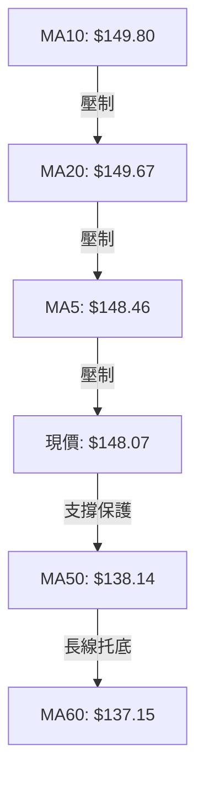

均線架構定性為典型的**「短空長多、上下夾擊」**之收斂震盪排列。短期均線（MA5、10、20）在 $148.46-$149.80 區間密集糾結下壓，但中期均線（MA50、60）在 $137.15-$138.14 向上延伸，限制了向下的實質空間。

---

### 📉 RSI(14) 分析

當前日線 RSI(14) 讀數為 **46.40**。

```
RSI(14) 區間位置標記
[0] ─────────── [30] ─────────────── [50] ────── [70] ─────────── [100]
                 超賣               中軸         超買
                                  ▲
                             46.40 (當前位置)
進度條展示:
██████████████████████░░░░░░░░░░░░░░░░░░░░░░░░ 46.40%
```

#### 背離檢驗與解讀
- **頂背離檢驗**：股價於 9 月中旬達 $152.71 時，週線 RSI 達到 68.0，隨後股價微幅拉回至 $148.07，RSI 降至 46.40，指標與價格變動相符，**無頂背離現象**。
- **底背離檢驗**：8 月初 $108.37 處 RSI 為 19.2，當前價格遠高於該水準，**無底背離現象**。
- **動能解讀**：RSI 跌破 50 中軸線至 46.40，反映空方在微觀層面略佔上風，但仍處於 30-70 的常態波動區間，未觸及 30 以下超賣區，動能尚未枯竭，不具備極端反轉條件。

---

### 📊 MACD (12,26,9) 訊號解讀

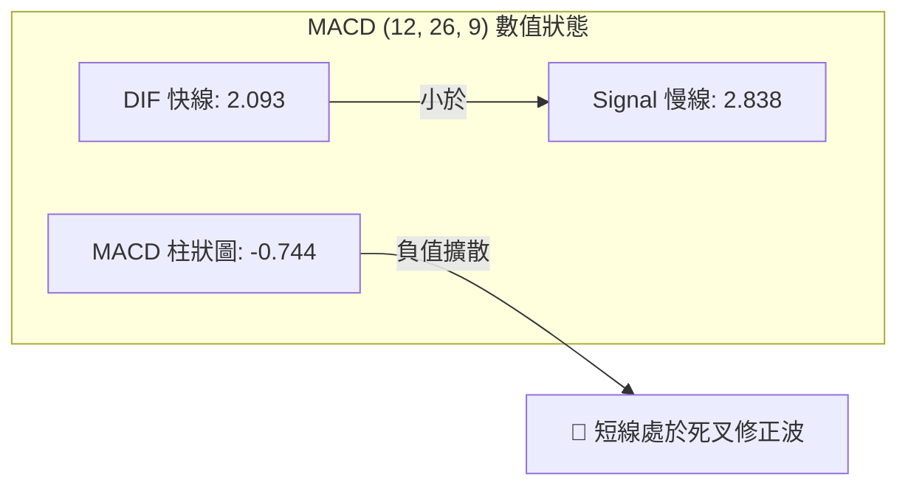

1. **零軸上方死叉**：DIF (2.093) 與 DEA (2.838) 均維持在零軸上方，表明中期上升浪潮尚未完全扭轉；然而兩者在零軸上方向下交叉，代表典型的「強勢回調／多頭休整」行情。
2. **柱狀圖動能**：Histogram 數值為 **-0.744**，自前週的 -0.567 進一步擴大，確認短線回調賣壓仍在釋放，多頭反攻時機未成熟，需等待負柱狀圖收斂。

---

### 📦 布林通道分析（Bollinger Bands）

```
SPCX 日線布林通道 ($143.84 - $155.50) 結構圖
─────────────────────────────────────────────────────────────────
$155.50 ┤ ════════════════════════════════════════════ 上軌 (Upper Band)
        │
$152.00 ┤                   ● (09-20 高點 $152.71 受阻於上軌下方)
        │
$149.67 ┤ -------------------------------------------- 中軌 (MA20: $149.67)
        │                         ▲
$148.07 ┤ ═══════════════════════ ● ◄ 【現價 $148.07，%B = 0.36】
        │
$143.84 ┤ ════════════════════════════════════════════ 下軌 (Lower Band)
─────────────────────────────────────────────────────────────────
```

- **通道帶寬與位置**：上軌 $155.50、中軌 $149.67、下軌 $143.84，全帶寬為 $11.66。現價 %B = **0.36**，意味著股價正處於中軌至下軌區間的 36% 位置。
- **形態暗示**：通道上下軌呈現水平收斂走勢，反映波動率大幅收縮。依據布林通道交易法則，在 ADX < 25 的盤整環境中，下軌 **$143.84** 構成高勝率回踩支撐，而上軌 **$155.50** 構成天然反彈阻力。

---

### 💹 成交量分析（量價配合度）

```
成交量對比柱狀圖 (股)
當前日量 :  68,879,900  [██████████████░░░░░░] 0.73x
20日均量 :  94,265,210  [████████████████████] 1.00x
50日均量 :  96,878,854  [████████████████████▌] 1.03x
```

- **量價關係解讀**：當前成交量為 6,887 萬股，量比僅為 **0.73x**。相較於 8 月中旬突破時單週逾 9 億股的激情水準，目前市場參與意願大幅降溫，呈現典型的「量縮整理」格局。
- **OBV (能量潮) 趨勢**：系統檢測顯示「OBV < MA → 量能疲弱」。OBV 處於其移動平均線下方，說明在過去兩週的價格拉回過程中，主力資金以觀望為主的被動調節居多，尚未出現大規模搶籌建倉跡象。無量反彈難以突破阻力，後續攻克 R1 ($149.80) 必須見到成交量放大至 9,500 萬股以上。

---

## 6. 動能與波動率

### ⚡ 動能評估四象限

將市場標的依「趨勢動能（RSI/MACD）」與「波動率（ATR）」投射至評估矩陣：

| 象限標籤 | 動能狀態 | 波動率狀態 | 市場環境定性 | 當前 SPCX 歸屬 |
|----------|----------|------------|--------------|----------------|
| **第一象限 (Q1)** | 強動能 (>50) | 低波動 (<3%) | 穩定單邊趨勢，最佳順勢持股環境 | — |
| **第二象限 (Q2)** | 弱動能 (≤50) | 低波動 (<4%) | **低波收斂盤整，觀望或區間網格操作** | **✓ (當前狀態)** |
| **第三象限 (Q3)** | 強動能 (>50) | 高波動 (≥4%) | 劇烈擴張主升浪，高風險高收益波段 | — |
| **第四象限 (Q4)** | 弱動能 (≤50) | 高波動 (≥4%) | 恐慌崩跌／破位清洗，嚴禁左側抄底 | — |

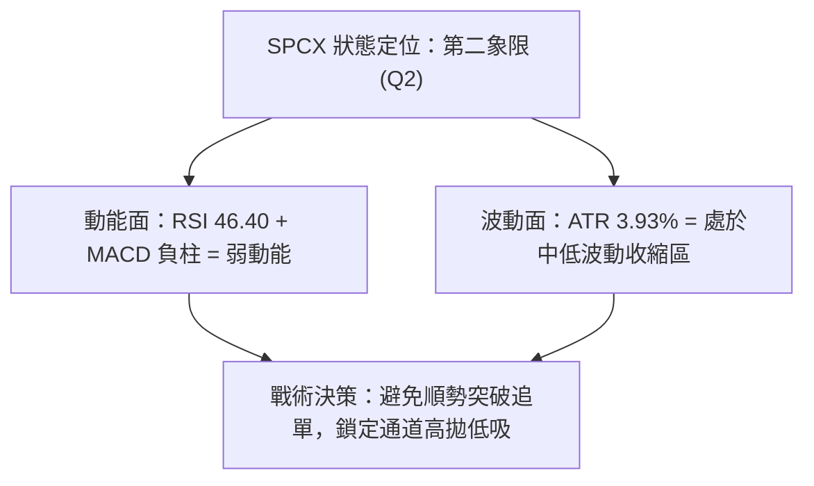

---

### 📊 ATR 波動率分析

- **ATR(14) 絕對值**：**$5.83**
- **ATR 相對百分比**：**3.93%**（日均波幅約 $5.83，介於 3% - 4% 間，屬正常中等波動）。
- **止損距離建議**：
  - 超短線交易（1.0x ATR）：止損緩衝設為 **$5.83**。
  - 波段防守（1.5x ATR）：止損緩衝設為 **$8.75**。
  - 寬幅風控（2.0x ATR）：止損緩衝設為 **$11.66**。

---

### 📐 Beta 與市場相關性

- **Beta 狀態**：數據源標記為 N/A（作為大型高成長商業太空與衛星互聯網巨頭，流通市值高達 $1.95T，機構持股 48.3%）。
- **籌碼結構特徵**：
  - 空頭回補天數 (Short Ratio)：**2.07 天**。
  - 空頭借券佔比 (Short % Float)：僅 **2.6%**（做空壓力極輕，無軋空潛力，亦無惡意放空打壓跡象）。
  - 機構與內部人持股：內部人持有 12.7%，機構持有 48.3%，股權結構穩定，籌碼集中度中等偏高。

---

## 7. 多時框架總結

### 📋 時框架評分表

| 時框架 | 趨勢方向 | 動能狀態 | 均線排列 | 關鍵形態特徵 | 綜合評分 | 操作指導建議 |
|--------|----------|----------|----------|--------------|----------|--------------|
| **月線 (長期)** | 🟡 震盪築底 | 🟡 築底回溫 | ⚪ 缺乏MA200 | 52W 低位大雙底結構形成中 | **55/100** | 逢低分批長線佈局 |
| **週線 (中期)** | 🟢 震盪偏多 | 🟡 衝高鈍化 | 🟢 MA50向上支撐 | 突破低點後遇 61.8% 阻力回檔 | **58/100** | 守穩 S2 逢低波段做多 |
| **日線 (短期)** | 🔴 弱勢整理 | 🔴 死叉向下 | 🔴 MA5/10/20下彎 | 窄幅布林通道震盪 (%B=0.36) | **42/100** | 觀望，等待止跌訊號 |

---

### 🔲 綜合訊號矩陣

```
時框衝突與共振對照表
┌───────────┬──────────────┬──────────────┬──────────────┐
│ 維度      │ 短期 (日線)  │ 中期 (週線)  │ 長期 (月線)  │
├───────────┼──────────────┼──────────────┼──────────────┤
│ 價格趨勢  │ 🔴 跌破MA20  │ 🟢 站穩MA50  │ 🟡 區間下半場│
│ MACD動能  │ 🔴 柱狀-0.744│ 🟢 DIF零軸上 │ 🟡 築底修復  │
│ RSI強度   │ 🟡 46.40偏弱 │ 🟢 50以上支撐│ 🟡 40-50平衡 │
│ 量能支持  │ 🔴 0.73x縮量 │ 🟡 遞減收斂  │ 🟢 底部爆巨量│
│ 裁決權重  │ 次要 (尋進場)│ 主要 (定方向)│ 背景 (設防線)│
└───────────┴──────────────┴──────────────┴──────────────┘
```

---

### ⚖️ 多時框收斂結論

依據多時框收斂規則（規則 14）：
1. **行情定性**：當前 ADX 為 **23.80 (<25)**，嚴格判定為**「無方向盤整行情」**。
2. **主導時框與優先級**：在此環境下，中長期趨勢指標暫退為背景，**交易邊界完全以日線布林通道 ($143.84 - $155.50) 及關鍵支撐阻力為準**。
3. **唯一方向性結論**：
   $$\mathbf{唯一結論：中性觀望／區間震盪（Neutral\ Consolidation）}$$
   當前日線指標偏弱（跌破 MA20、MACD 負柱），但中期季線 MA50 ($138.14) 與波段支撐 S2 ($142.87) 封鎖下行空間。因此，市場既不具備單邊做空條件，亦缺乏向上突破動能，技術面進入**「以時間換取空間的收斂三角／箱型沉澱期」**。

---

## 8. 交易策略建議

### 🗺️ 策略決策流程圖

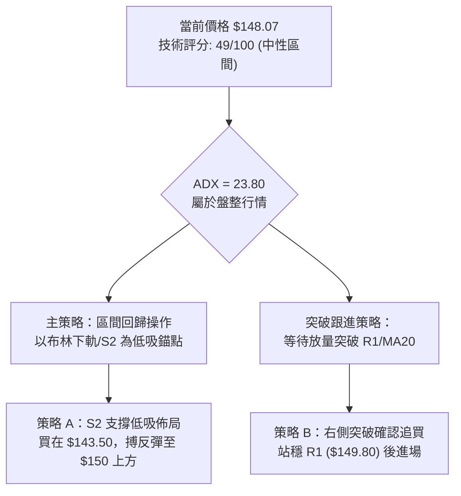

---

### 🧭 策略路由（依評分卡分流）

> **當前主策略方向 = 中性區間震盪操作（依評分 49/100，落於 40–60 中性區）**
> 
> 由於綜合評分處於 40–60 區間且 ADX < 25，禁止孤注一擲盲目追高或殺跌。交易哲學遵循**「下軌企穩低吸、上軌滯漲高拋、等待方向突破確認」**。

---

### 🎯 價格情境階梯（Price Scenarios）

價位完全嚴格引用第 4 章及系統計算值：

| 觸發條件 | 階段目標 1 | 階段目標 2 | 後續延伸 (延伸目標) | 技術情境含義 |
|----------|------------|------------|---------------------|--------------|
| **向上放量突破 R1 ($149.80)** | 斐波 61.8% ($150.98) | 箱型頂部 R2 ($155.00) | 強阻力 R3 ($158.13) | 短線重回多頭掌控，修復日線均線形態 |
| **維持在現價區間 ($147.11-$149.80)** | MA20 ($149.67) | S1 ($147.11) | — | 狹幅沉澱，指標進行修復，量能持續萎縮 |
| **向下有效跌破 S1 ($147.11)** | 布林下軌 ($143.84) | 強支撐 S2 ($142.87) | 季線 MA50 ($138.14) | 短線回調加深，向下尋求中期均線支撐 |

---

### 📊 情境機率分佈

| 運行情境 | 發生機率 | 主要技術指標支撐依據 |
|----------|----------|----------------------|
| **情境一：區間震盪整理** | **55%** | ADX 23.80 顯示趨勢缺乏；成交量縮至 0.73x；布林通道帶寬收斂且平行延伸。 |
| **情境二：回測支撐再反彈** | **30%** | MACD 柱狀圖為負 (-0.744) 且短均線下彎，股價易順勢下探測試 S2 ($142.87) 與下軌。 |
| **情境三：直接放量強勢上攻** | **15%** | 目前 OBV < MA 且成交量嚴重低迷，缺乏催化劑下直接破位突破 R2 ($155.00) 機率極低。 |

---

### 🟢 主策略詳情（中性震盪雙向應對）

因評分為中性 49 分，主推兩種適應震盪市的高勝率策略：**策略 A（左側低吸網格）** 與 **策略 B（右側突破確認）**。

| 策略要素 | 策略 A：下軌支撐逢低承接 (左側) | 策略 B：突破 MA20 右側順勢 (右側) |
|----------|----------------------------------|------------------------------------|
| **適用邏輯** | 回踩 S2 與布林下軌獲得支撐企穩 | 放量站上短期均線密集區 R1 |
| **進場條件** | 觸及 $143.00-$143.84 且出現分時止跌 | 收盤價有效站穩 $149.80，日量 > 9,500萬 |
| **進場價格** | **$143.50** (位於 S2 $142.87 疊加下軌) | **$150.00** (突破 R1 $149.80 後確認) |
| **第一目標 (T1)**| **$149.80** (阻力位 R1，潛在 +4.39%) | **$155.00** (阻力位 R2，潛在 +3.33%) |
| **第二目標 (T2)**| **$155.00** (阻力位 R2，潛在 +8.01%) | **$158.13** (阻力位 R3，潛在 +5.42%) |
| **止損價格** | **$139.80** (跌破 S2 超過 0.5x ATR 防守) | **$147.00** (假突破跌回 S1 $147.11 之下) |
| **風險報酬比** | **1 : 3.11** (冒險 $3.70 獲取 $11.50) | **1 : 2.71** (冒險 $3.00 獲取 $8.13) |
| **預估勝率** | 65% (震盪市下軌支撐強勁) | 55% (需防範假突破風險) |
| **建議倉位** | 15% - 20% 資金倉位 | 10% - 15% 資金倉位 |

---

### 🔴 反向風險觸發點（對沖與止損提示）

若出現以下訊號，代表「中性震盪格局宣告終結，空頭全面主導」：
- **關鍵反轉點**：收盤價以實體大陰線**跌破 S2 ($142.87)** 且帶量。
- **對沖應對措施**：
  1. 所有多頭短線倉位無條件停損離場。
  2. 投資人應針對現貨部位啟動對沖保護，下一回踩目標直指 MA50 ($138.14) 乃至 S3 ($130.39)。

---

### ⭐ 整體訊號強度評星

```
╔════════════════════════════════════════════════════════════════════════════╗
║                       SPCX 技術訊號多空評星儀表板                          ║
╠════════════════════════════════════════════════════════════════════════════╣
║ 做多訊號強度：  ★★☆☆☆  (2.5 / 5 星)  — 均線受阻，量能不足，缺乏上攻動能  ║
║ 做空訊號強度：  ★★☆☆☆  (2.5 / 5 星)  — 下檔支撐密集，季線向上，下跌空間受限║
║ 整體技術可信度：★★★★☆  (4.0 / 5 星)  — 價位結構分明，箱體邊界精確吻合     ║
╚════════════════════════════════════════════════════════════════════════════╝
```

---

## 9. 風險提示與監控

### ✅ 關鍵監控指標 Checklist

```
╔════════════════════════════════════════════════════════════════════════════╗
║                   SPCX 每日交易關鍵技術監控 Checklist                     ║
╠════════════════════════════════════════════════════════════════════════════╣
║ [ ] 監控項 1：收盤價能否重返 MA20 ($149.67) 與 R1 ($149.80) 之上？       ║
║ [ ] 監控項 2：下檔即期支撐 S1 ($147.11) 是否在盤中被長黑跌破？           ║
║ [ ] 監控項 3：MACD 負柱狀圖 (-0.744) 是持續發散擴大，還是開始拐頭收斂？   ║
║ [ ] 監控項 4：全日成交量是否回升至 20 日均量 (9,426 萬股) 以上？           ║
║ [ ] 監控項 5：ADX(14) 讀數是否突破 25，引領單邊突破行情的誕生？           ║
╚════════════════════════════════════════════════════════════════════════════╝
```

---

### ⚠️ 風險場景推演

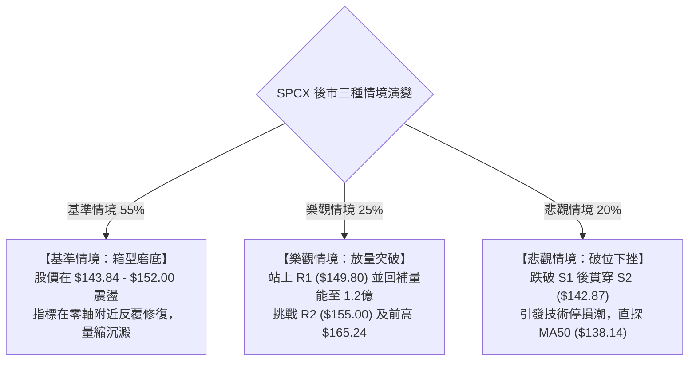

---

### 🛡️ 風險管理重要提醒

1. **嚴守 ATR 波動紀律**：目前 ATR 高達 $5.83 (3.93%)，切忌使用高槓桿進行短線操作。單筆交易的最大止損虧損金額嚴格控制在總投資組合淨資產的 1.0% - 1.5% 內。
2. **警惕假突破與誘多**：在 ADX < 25 的盤整市中，約有 65% 以上的「日內破位突破」為假突破。未見到收盤實體棒確認及成交量放大前，切勿於 R1 ($149.80) 或 R2 ($155.00) 附近進行追價買入。
3. **區間邊界分批原則**：在箱型震盪市中，最佳策略永遠是「耐心等待價格走向邊界」。接近 S2 ($142.87) 佈局多單，接近 R2 ($155.00) 減持獲利，切忌在區間中央 ($148-$149) 頻繁開倉，避免被多空雙向打耳光。

---

## 📋 報告總結

```
╔════════════════════════════════════════════════════════════════════════════╗
║                        SPCX 技術分析報告終審總結                           ║
╠════════════════════════════════════════════════════════════════════════════╣
║ 報告日期：2026-10-02                                                      ║
║ 當前價格：$148.07                                                          ║
║ 技術評級：⚖️ 中性觀望 (箱型矩形震盪，評分 49/100)                          ║
╠════════════════════════════════════════════════════════════════════════════╣
║ 關鍵結論研判：                                                             ║
║ ├─ 長期趨勢：🟡 中性築底 (52週極值區間底部反彈，進入 $140-$160 核心沉澱區)║
║ ├─ 中期趨勢：🟢 震盪偏多 (守穩 MA50 $138.14，自 $108.37 底部之回升波延續) ║
║ ├─ 短期趨勢：🔴 弱勢整理 (跌破 MA20 $149.67，MACD 柱狀負值，等待量能回溫) ║
║ ├─ 核心支撐：即期 S1 $147.11 ｜ 強支撐 S2 $142.87 ｜ 季線 MA50 $138.14    ║
║ ├─ 核心阻力：即期 R1 $149.80 ｜ 箱頂 R2 $155.00 ｜ 歷史 R3 $158.13        ║
║ └─ 分析師共識目標價：Mean $226.04 (買入評級，具備長線基本面溢價修復空間)  ║
╠════════════════════════════════════════════════════════════════════════════╣
║ 最優策略組合建議：                                                         ║
║ 1. 🥇 最佳機會 (高盈虧比)：策略 A — 於 S2 $142.87-$143.50 低吸，止損 $139.80║
║ 2. 🥈 次選機會 (穩健確認)：策略 B — 放量站穩 R1 $149.80 後右側順勢追進    ║
║ 3. 🥉 保守選擇 (空倉觀望)：暫不開倉，靜待日線走出布林通道 ($143.84-$155.50)║
╚════════════════════════════════════════════════════════════════════════════╝
```

---

> ⚠️ **免責聲明**：本報告為技術分析專項研究，所有數據、圖表及價位推算均基於歷史已發生之 OHLCV 價格量能資訊。本報告**僅供研究與學術參考**，**不構成任何形式的要約、招攬或具體投資建議**。金融市場具有高波動風險，投資人應自行評估自身風險承受能力並嚴格執行資金管理。

---

*報告生成時間：2026-10-02 ｜ 數據來源：Yahoo Finance ｜ 分析框架：多時框架收斂技術系統*