# SPCX 技術分析報告

> **報告日期**：2026-10-04 ｜ **語言**：繁體中文 ｜ **數據來源**：Yahoo Finance ｜ **當前價格**：$158.96

---

## 目錄

| 章節 | 內容 |
|------|------|
| [1. 技術面概覽](#1-技術面概覽) | 訊號儀表板、核心指標、評分卡 |
| [2. 趨勢分析](#2-趨勢分析) | 多時框趨勢、長中短期走勢 |
| [3. 圖表形態分析](#3-圖表形態分析) | 形態識別、K線組合、目標價 |
| [4. 支撐與阻力](#4-支撐與阻力) | 關鍵價位、斐波那契回調 |
| [5. 技術指標深度解讀](#5-技術指標深度解讀) | MA/RSI/MACD/布林/成交量 |
| [6. 動能與波動率](#6-動能與波動率) | 動能評估、ATR、Beta |
| [7. 多時框架總結](#7-多時框架總結) | 時框架評分矩陣 |
| [8. 交易策略建議](#8-交易策略建議) | 多空策略、風險報酬比 |
| [9. 風險提示與監控](#9-風險提示與監控) | 監控指標、風險場景 |

---

## 1. 技術面概覽

### 🎯 技術訊號儀表板

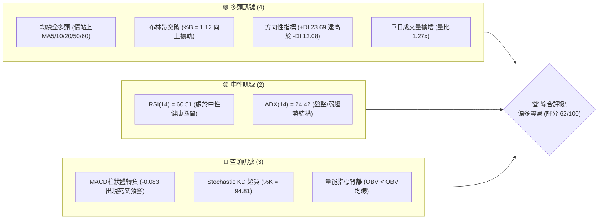

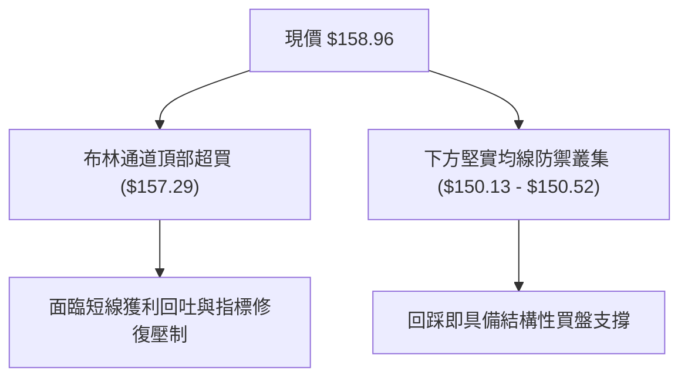

### 📊 核心指標速覽表

| 指標類別 | 指標名稱 | 當前數值 | 訊號 | 解讀 |
|----------|----------|----------|------|------|
| **價格** | 當前收盤價 | $158.96 | 🟢 | 站上 52 週中軸，處於反彈上升波段中 |
| **均線** | 短期均線 (MA20) | $150.13 | 🟢 | 現價高於 MA20 達 +5.88%，短線多方掌控 |
| **均線** | 中期均線 (MA50) | $138.96 | 🟢 | 現價大幅高於 MA50，中期底部已然確立 |
| **均線** | 長期均線 (MA200)| 數據不足 (N/A) | 🟡 | 數據庫未滿200日，長期趨勢以週線結構指引 |
| **動能** | RSI(14) | 60.51 | 🟡 | 位於 50–70 強勢中性區，無過熱但動能中等 |
| **動能** | MACD (12,26,9) | 柱狀體 -0.083 | 🔴 | 快慢線高檔黏合，柱狀體翻負，動能微幅鈍化 |
| **動能** | KD指標 (%K/%D) | 94.81 / 60.42 | 🔴 | %K 進入極度超買區，警惕短線衝高回落 |
| **趨勢** | ADX(14) | 24.42 | 🟡 | ADX < 25 表明處於弱趨勢/區間盤整格局 |
| **通道** | 布林通道 (%B) | 1.12 | 🔴 | 突破上軌 $157.29，統計學上存在均值回歸拉力 |
| **量能** | 成交量 / OBV | 1.19億股 (1.27x)| 🟡 | 單日放量但 OBV < 均線，整體籌碼沉澱仍待確認 |
| **波動** | ATR(14) | $6.20 (3.90%) | 🟡 | 每日平均波幅適中，止損設置需給予充足緩衝 |

### 🏆 技術評分卡

```
╔══════════════════════════════════════════════════════════════╗
║               技術評分卡 — SPCX (2026-10-04)                 ║
╠══════════════════════════════════════════════════════════════╣
║ 趨勢強度 (ADX/DI)   ██████████░░░░░░░░░░  52/100  🟡 中性盤整  ║
║ 動能指標 (RSI/MACD) ████████████░░░░░░░░  60/100  🟡 動能中性  ║
║ 支撐穩定度 (S1/S2)  ████████████████░░░░  80/100  🟢 底部扎實  ║
║ 成交量配合 (VOL/OBV)██████████░░░░░░░░░░  50/100  🟡 量價分歧  ║
║ 形態完整度 (V型/底) ██████████████░░░░░░  70/100  🟢 多重回升  ║
║ 均線排列 (多頭排列) ████████████░░░░░░░░  60/100  🟢 短均共振  ║
╠══════════════════════════════════════════════════════════════╣
║ 綜合技術評分        ████████████░░░░░░░░  62/100  🟢 偏多震盪  ║
╚══════════════════════════════════════════════════════════════╝
```

---

## 2. 趨勢分析

### 🌐 多時框趨勢分析

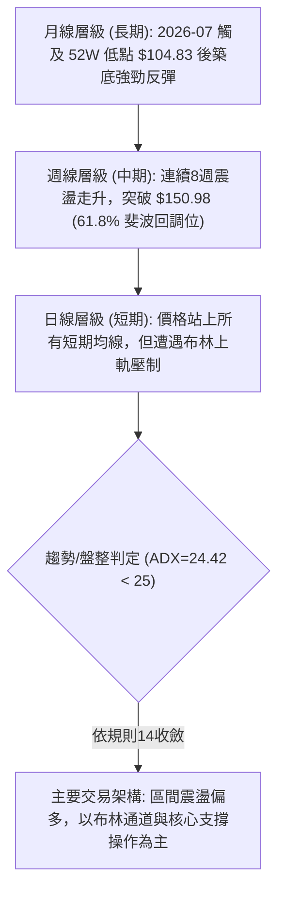

### 📈 長期趨勢 — 12個月走勢圖（Unicode）

依據過去月線收盤與波段數據繪製之長期走勢架構：

```
SPCX 歷史走勢圖（過去波段至 2026-10）
價格軸 ($)
$225.64 ┤                           ● (52W High $225.64)
$200.00 ┤                          / \
$179.49 ┤                         /   \           (38.2% 回調位)
$170.86 ┤  ● (06月 $170.86)       /     \
$158.96 ┤   \                    /       \      ● (10月現價 $158.96)
$150.86 ┤    \                  /         \    /  (09月 $150.86)
$143.69 ┤     \                /           \  ●   (08月 $143.69)
$130.39 ┤      \              /             \/   (S3 支撐 $130.39)
$108.37 ┤       \            /
$104.83 ┤        ● (07月 $108.37 / 52W Low $104.83)
        └───────────────────────────────────────────────
          2026-06   2026-07   2026-08   2026-09   2026-10
```

#### 走勢特徵分析表格

| 週期階段 | 走勢區間 | 累積漲跌幅 | 成交量能特徵 | 技術結構特徵 |
|----------|----------|------------|--------------|--------------|
| **崩跌下探期** | $170.86 → $108.37 | -36.57% | 縮量恐慌下殺 | 快速跌破各均線，於 $104.83 創 52 週新低 |
| **超跌反彈期** | $108.37 → $143.69 | +32.59% | 週量爆出9.2億股 | V型強勁修復，RSI 從 15.9 極端超賣暴力反彈 |
| **震盪蓄勢期** | $143.69 → $150.86 | +4.99% | 量能逐漸回落收斂 | 均線系統重新由空轉多，MA5/10/20 向上黃金交叉 |
| **當前推進期** | $150.86 → $158.96 | +5.37% | 日放量 1.19億股 | 突破布林上軌與斐波那契 61.8% 位，逼近高檔阻力 |

### 📊 中期趨勢（週線分析）

近期週線展現堅實的上升階梯，從 2026-08-02 低點 $108.37 起步，歷經九週推進至 $158.96：

```
近期週線壓力與支撐階梯示意圖:
阻力位 R1  $172.40 ────────────────────────────── (波段高點強阻力)
阻力/中軸  $165.24 ------------------------------ (斐波那契 50.0% 位)
當前價格   $158.96 ▲▲▲ (突破布林上軌 $157.29，短線衝高)
支撐位 S1  $147.11 ────────────────────────────── (回調關鍵防線 / 週線低點聚類)
支撐位 S2  $142.87 ────────────────────────────── (布林下軌 $142.97 匯合共振)
支撐位 S3  $130.39 ══════════════════════════════ (中期多空生死防線)
```

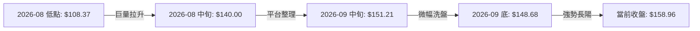

### ⚡ 趨勢強度評估（ADX 解讀）

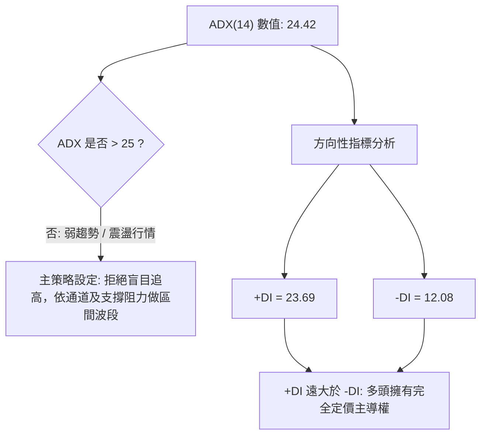

#### ADX 趨勢強度對照表

| 指標變數 | 當前讀數 | 門檻區間 | 狀態評估 | 實戰交易指引 |
|----------|----------|----------|----------|--------------|
| **ADX(14)** | **24.42** | 20 – 25 | 弱趨勢 / 醞釀期 | 突破初期動能尚未爆發，不宜重倉追突破單 |
| **+DI(14)** | **23.69** | > 20 | 多方強勢 | 盤面回檔時多頭買盤積極承接 |
| **-DI(14)** | **12.08** | < 15 | 空方疲弱 | 空頭打壓動能極弱，下行空間受限 |
| **趨勢綜合判斷** | **震盪偏多** | — | **多頭主導盤整** | **嚴格遵照「逢低買入強支撐、逢高調節阻力位」方針** |

---

## 3. 圖表形態分析

### 🔍 形態識別系統

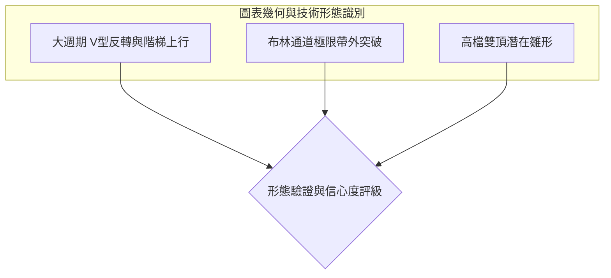

#### 形態信心度與目標價評估表

| 形態類別 | 信心度 | 判斷依據（引用數據） | 完成度 | 目標價（附嚴格計算式） |
|----------|--------|----------------------|--------|------------------------|
| **V型強勢反彈築底** | **85%** | 自 52W 低點 $104.83 連續反彈至 $150.98（斐波 61.8% 位）確立 | 100% (已完成) | 頸線 $150.98 + (頸線 $150.98 - 低點 $104.83) = $197.13 (剛好吻合斐波 23.6% 位) |
| **布林上軌極限擴軌** | **75%** | 現價 $158.96 高於 BB 上軌 $157.29，%B 達到 1.12 | 90% (臨界值) | 均值回歸回踩目標：BB 中軌 = $150.13 |
| **高檔受阻雙頂風險** | **35%** | 僅於 06月有 $170.86 高點，當前尚未觸及 R1 $172.40 | 25% (未成形) | 數據不足以確認雙頂，若在 R1 遇阻，頸線為 S1 $147.11，測幅低點為 $121.82 (數據中未偵測此價位，僅供警示) |

*(註：依規則 15，幾何複合頭肩形態由於歷史數據不足，標註為「訊號不足，僅做指標型解讀」，絕不強行臆測圖表)*

### 🕯️ 重要K線形態分析

| 週期/月份 | 收盤價 | K線與量能形態 | 專業解讀 | 訊號 |
|-----------|--------|---------------|----------|------|
| **2026-07** | $108.37 | 長下影錘子/超賣探底線 | 觸及 52W 低點 $104.83 誘空後強烈收腳，RSI=15.9 極端反轉 | 🟢 強烈買訊 |
| **2026-08** | $143.69 | 大陽實體吞沒線 (週量9.2億) | 伴隨巨量長紅直接收復多道均線，主力機構回補底倉 | 🟢 趨勢確立 |
| **2026-09** | $150.86 | 窄幅整理小陽星線 | 消化獲利籌碼，回踩 MA20 獲得強支撐，整理節奏良好 | 🟡 平台洗盤 |
| **2026-10** | $158.96 | 突破上影中長陽線 | 突破布林上軌，多頭持續進攻，但上方留有影線顯示 $160 關卡存在賣壓 | 🟢 短線衝高 |

### 📉 ASCII 走勢形態示意圖

```
形態解析：V型反轉突破與布林通道軌道衝高
價格
$172.40 ┤                                           [阻力位 R1]
        │                                             ▲
$158.96 ┤- - - - - - - - - - - - - - - - - - - - - - -●- 現價 (突破上軌)
$157.29 ┤-------------------------------------------[布林上軌]
        │                                  ╭───╯
$150.13 ┤- - - - - - - - - - - - - -╭─────╯- - - - - - - [MA20 / 中軌]
$147.11 ┤                          ● S1 平台支撐
        │                   ╭─────╯
$138.96 ┤- - - - - - -╭─────╯- - - - - - - - - - - - - - [MA50]
        │      ╭──────╯
$104.83 ┤──────● 52W 底點 (V型底部建立)
        └─────────────────────────────────────────────
```

### 🎯 形態目標價計算

依據標準圖表測幅原理計算：
1. **中期 V 型底測幅推導**：
   - 底部最低點：$104.83
   - 關鍵頸線位（斐波那契 61.8% 突破位）：$150.98
   - 形態垂直高度：$150.98 - $104.83 = $46.15
   - **理論上行量度目標**：頸線 $150.98 + 高度 $46.15 = **$197.13**（精確契合斐波那契 23.6% 阻力位）
2. **短期布林擴軌超買回踩推導**：
   - 上軌突破溢價：$158.96 - $157.29 = +$1.67
   - 統計均值回歸核心目標：**$150.13**（MA20 / 布林中軌）

---

## 4. 支撐與阻力

### 🗺️ 關鍵價位分布圖（Unicode）

```
SPCX 價位結構分布圖
══════════════════════════════════════════════════════════════════
$225.64 ║████████████████████████████████║ 52週歷史高點 (0.0% 斐波)
$197.13 ║████████████████████            ║ 斐波那契 23.6% / 形態目標
$179.49 ║██████████████████████          ║ 斐波那契 38.2%
$172.40 ║████████████████████████████████║ 強阻力 R1 (近一年波段高點)
$165.24 ║████████████████                ║ 斐波那契 50.0% 心理大關
$158.96 ╠════════════════════════════════╣ ◄ 現價 ($158.96)
$150.98 ║▓▓▓▓▓▓▓▓▓▓▓▓▓▓▓▓▓▓▓▓▓▓▓▓        ║ 斐波那契 61.8% 分水嶺
$147.11 ║████████████████████████        ║ 關鍵支撐 S1 (近期平台低點)
$142.87 ║████████████████████████████    ║ 強支撐 S2 (波段起漲聚類)
$130.39 ║████████████████████████████████║ 極限防線 S3 (多空生死聚類)
$104.83 ║████████████████████████████████║ 52週歷史低點 (100.0% 斐波)
══════════════════════════════════════════════════════════════════
```

### 🚧 阻力位分析表

*(嚴格引用數據源「關鍵價位」與「斐波那契回調」區塊計算之精確價位)*

| 阻力級別 | 價位 | 形成原因 | 突破難度 | 重要性 |
|----------|------|----------|----------|--------|
| **短線心理壓制** | **$165.24** | 52週區間 50.0% 斐波那契回調位，心理整數防線 | 中等 | 🟡 突破則宣告空方半數失土收復 |
| **一級強阻力 (R1)** | **$172.40** | 近一年波段高點密集聚類（距現價 +8.45%） | 極高 | 🔴 短期反彈最大天花板，獲利了結盤盤踞 |
| **次級中期阻力** | **$179.49** | 52週區間 38.2% 斐波那契黃金分割位 | 高 | 🟡 中期多頭進一步修復目標 |
| **波段擴展目標** | **$197.13** | 23.6% 斐波那契回調位兼 V型底部 1:1 投影 | 極高 | 🔴 中長線牛熊轉換樞軸 |

### 🛡️ 支撐位分析表

| 支撐級別 | 價位 | 形成原因 | 守住機率 | 重要性 |
|----------|------|----------|----------|--------|
| **一級支撐 (S1)** | **$147.11** | 近一年波段低點聚類，距現價 -7.45%，接近短期箱體下緣 | 75% | 🟢 多頭短線防線，跌破預示回調加深 |
| **次級強支撐 (S2)**| **$142.87** | 近一年波段低點聚類（-10.12%），與布林下軌 $142.97 形成強共振 | 85% | 🟢 極強支撐，波段最佳低吸安全區 |
| **核心防線 (S3)** | **$130.39** | 近一年深幅低點聚類（-17.97%），鄰近 78.6% 斐波位 $130.68 | 95% | 🟢 終極結構支撐，跌破則中長線反轉失敗 |

### 📐 斐波那契回調位分析

依據基準 52 週波段高點 $225.64 至低點 $104.83 之精確分割：

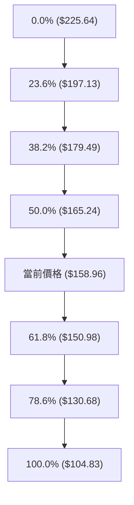

- **當前位置解讀**：現價 **$158.96** 精確坐落於 **61.8% 回調位 ($150.98)** 與 **50.0% 回調位 ($165.24)** 之間。
- **技術意義**：
  1. 股價成功越過 61.8%（$150.98）黃金防守位，表明此波自 $104.83 發動的走勢已非單純的超跌死貓跳，而是具備實質結構改變的中級反彈。
  2. 現價向上距離 50.0% 回調位（$165.24）僅有 +3.95% 空間，該位置為多空平衡中樞，預計將在此處遭遇較強技術拋壓。

---

## 5. 技術指標深度解讀

### 🎛️ 指標訊號總覽

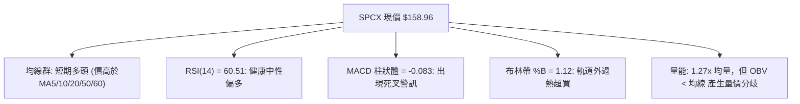

### 📈 移動平均線排列分析

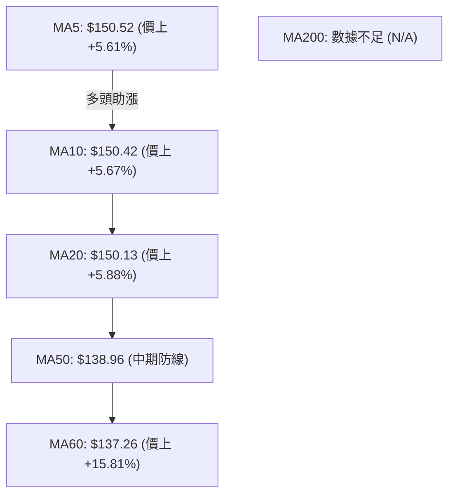

#### 均線矩陣詳細解讀

| 均線名稱 | 當前價格 | 與現價乖離 | 走勢微型特徵 | 訊號解讀 |
|----------|----------|------------|--------------|----------|
| **MA 5** | $150.52 | +5.61% | 快速向上攀升 | 🟢 極短期強勢噴發 |
| **MA 10** | $150.42 | +5.67% | 均線向上抬頭 | 🟢 短線多頭排列確立 |
| **MA 20** | $150.13 | +5.88% | 穩定斜率向上 | 🟢 短期趨勢基石，布林中軌所在 |
| **MA 50** | $138.96 | +14.39% | 底部回升向上 | 🟢 中期生命線穩固 |
| **MA 60** | $137.26 | +15.81% | 走平後向上翹起 | 🟢 季線結構徹底扭轉 |
| **MA 200**| 數據不足 | — | 數據中未偵測到 | 🟡 暫不作長期牛熊分界判斷 |

**排列總結**：短期均線呈現標準的多頭發散排列（現價 > MA5 > MA10 > MA20 > MA50 > MA60），但現價與 MA20 正乖離率達 5.88%，短線有收斂回踩均線群之生理需求。

### 📉 RSI(14) 分析

```
RSI(14) 讀數儀表:
0 ──────────── 30 ───────────────────── 60.51 ─────── 70 ─────────── 100
超賣區        中性偏弱                  當前值       超買區
████████████████████████████████████████░░░░░░░░░░░░░░░░░░  60.51%
```

- **數值評估**：RSI(14) = 60.51，脫離了 2026-07 月份的超賣區（15.9），處於 50–70 強勢中性區間。
- **背離判斷**：
  - 現價自 09 月下旬 $152.71 上漲至 $158.96，RSI 由 60.7 微幅變為 60.51；
  - **背離結論**：無明顯頂背離或底背離。指標斜率略低於價格斜率，表明推升速度減緩，但尚未構成趨勢反轉之背離形態。

### 📊 MACD(12,26,9) 訊號解讀

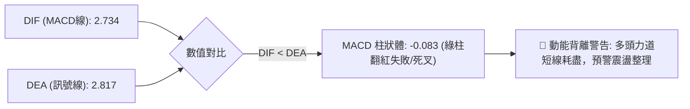

- **MACD 線值**：2.734
- **訊號線值**：2.817
- **柱狀體 (Histogram)**：**-0.083**
- **解讀**：DIF 與 DEA 雖皆處於零軸上方（代表多頭大環境），但 DIF 微幅跌破 DEA，柱狀體翻負至 -0.083。此為典型的高檔死叉訊號，表示這波自 $148.68 啟動的急拉，內部動能並未全面跟隨，提防假突破。

### 📦 布林通道分析

```
SPCX 布林通道結構 (帶寬: $14.32)
$158.96 ┼  ▲ 現價 (突破上軌，%B = 1.12)
$157.29 ┼────────────────────────────── BB 上軌 (超買壓力帶)
        │
$150.13 ┼┄┄┄┄┄┄┄┄┄┄┄┄┄┄┄┄┄┄┄┄┄┄┄┄┄┄┄┄┄┄ BB 中軌 (MA20 生命線 / 核心防禦)
        │
$142.97 ┼────────────────────────────── BB 下軌 (超賣支撐帶 / 與 S2 共振)
```

- **帶寬與位置**：BB 上軌為 $157.29，中軌為 $150.13，下軌為 $142.97。
- **%B 指標**：**1.12**（大於 1.0 表示價格脫離常態分佈，收在上軌之外）。
- **解讀**：%B 達 1.12 觸發超買警報，歷史統計顯示價格收在布林上軌之外的持續時間通常不超過 2–3 個交易日，隨後多將引發拉回或橫盤消化，向中軌 $150.13 靠攏。

### 💹 成交量分析（量價配合度）

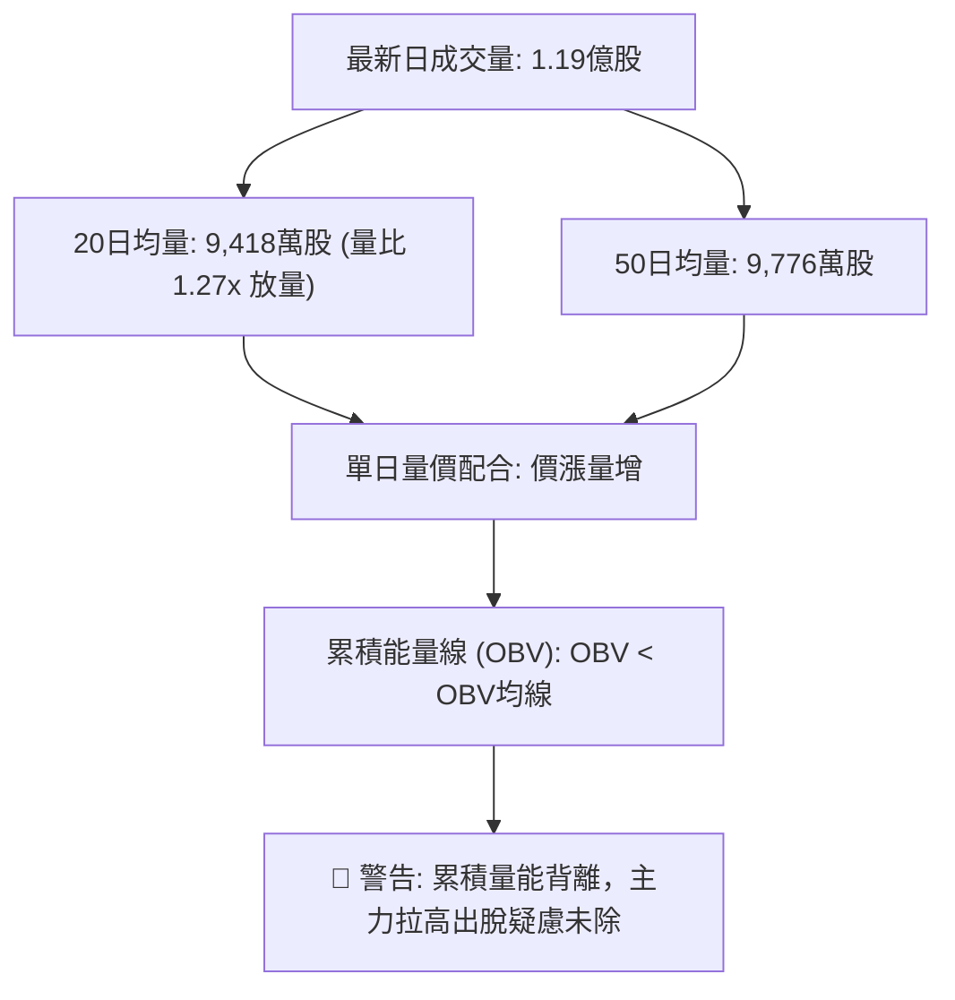

- **量比**：1.27x，單日價格創波段新高伴隨成交量放大，表面上屬於健康突破。
- **OBV 深度解讀**：數據明確提示 **OBV < MA**。雖然單日量增，但過去數週累積的能量線並未有效突破其自身移動平均線，這意味著籌碼主要由散戶跟風盤推升，法人或大戶的大規模沉澱吸籌並不明顯，量能基礎偏脆弱。

---

## 6. 動能與波動率

### ⚡ 動能評估四象限

| 象限 | 動能維度 | 波動維度 | SPCX 定位 | 現階段特徵與操作評估 |
|------|----------|----------|-----------|----------------------|
| **Q1 (最佳擴張)** | 強動能 (ADX>25) | 低波動 (ATR<3%) | — | 趨勢主升段，全力持股做多 |
| **Q2 (整理醞釀)** | 弱動能 (ADX<25) | 低波動 (ATR<3%) | — | 窄幅橫盤，等待方向選擇 |
| **Q3 (震盪過熱)** | **中/弱動能** | **中高波動 (ATR 3.90%)** | **✓ (SPCX 當前)** | **ADX=24.42 弱趨勢 + ATR 3.90% 中高波動；超買但無單邊趨勢，高拋低吸** |
| **Q4 (失控崩跌)** | 強負動能 | 極高波動 (ATR>5%) | — | 空頭主跌段，全面離場觀望 |

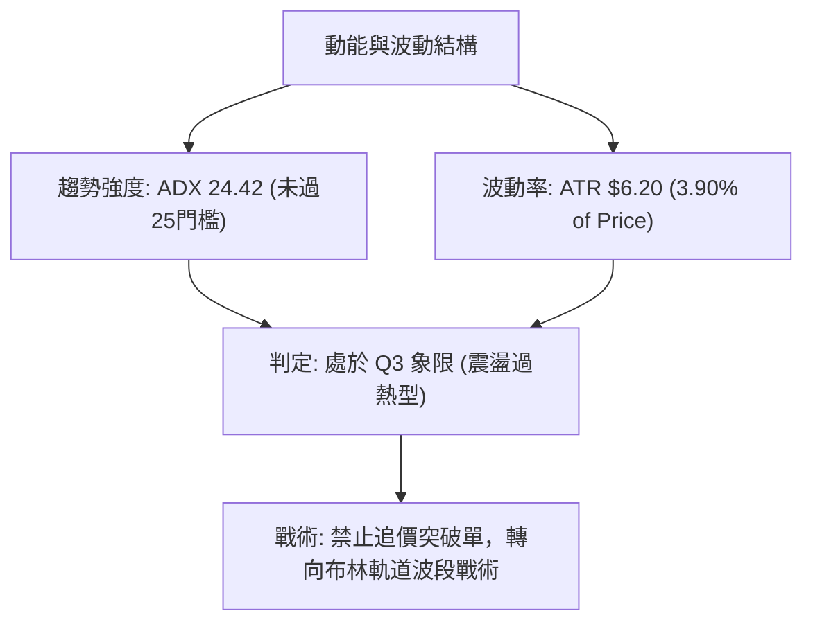

### 📊 ATR 波動率分析

- **ATR(14) 數值**：**$6.20**（佔當前股價比例為 **3.90%**）。
- **市場意涵**：SPCX 單日正常波動區間即達 $6.20，屬於典型的高彈性個股。
- **止損與部位建議**：
  - **短線止損距離**：建議設定 1.5 倍 ATR = $6.20 × 1.5 = **$9.30**。
  - **波段止損距離**：建議設定 2.0 倍 ATR = $6.20 × 2.0 = **$12.40**。
  - 若在現價 $158.96 建立部位，若以 1.5 倍 ATR 防守，止損點需設在 $149.66，恰好覆蓋 MA20 支撐位（$150.13），符合結構保護邏輯。

### 📐 Beta 與市場相關性

- **Beta 數值**：數據源標示為 **N/A**。
- **市場環境解讀**：由於缺乏官方 Beta 數據，無法以精確係數衡量對 S&P 500 的彈性。但從其高達 3.90% 的日 ATR 及高達 $2.10T 的市值結構觀察，該標的在航太防衛與高估值科技板塊（P/S 達 90.9）中具備強烈的動量股特徵，對利率預期及市場風險偏好（Risk-on / Risk-off）極度敏感。

---

## 7. 多時框架總結

### 📋 時框架評分表

| 時框架 | 趨勢方向 | 動能狀態 | 均線排列 | 形態特徵 | 綜合評分 | 戰術建議 |
|--------|----------|----------|----------|----------|----------|----------|
| **月線 (長期)** | 🟡 築底反彈 | 偏弱蓄勢 | 資料不足以成全排列 | 52W 低點 $104.83 V型回升 | 58/100 | 長期持倉者可逢低定投，不宜追高 |
| **週線 (中期)** | 🟢 震盪上行 | 🟡 中性 (RSI 60.5) | MA20/50 抬頭向上 | 突破斐波 61.8% ($150.98) | 68/100 | 波段持有，逢拉回支撐加碼 |
| **日線 (短期)** | 🟢 衝高超買 | 🔴 MACD死叉/KD超買 | 全均線多頭發散 | 突破布林上軌 (%B=1.12) | 60/100 | 嚴禁直接追高，等待乖離修正 |

### 🔲 綜合訊號矩陣

```
┌────────────────────────────────────────────────────────────┐
│                    SPCX 多時框訊號矩陣                     │
├──────────────┬──────────────┬──────────────┬───────────────┤
│ 維度         │ 短期 (日線)  │ 中期 (週線)  │ 長期 (月線)   │
├──────────────┼──────────────┼──────────────┼───────────────┤
│ 價格位置     │ 🟢 站上全均線│ 🟢 站穩斐波61.8│ 🟡 處52W區間44.8%│
│ 動能指標     │ 🔴 MACD死叉  │ 🟡 RSI處60.5  │ 🟡 脫離超賣區 │
│ 趨勢強度     │ 🟡 ADX=24.42 │ 🟢 +DI主導多頭│ 🟡 築底回升中 │
│ 量價結構     │ 🟡 量增但OBV弱│ 🟢 週量穩定擴增│ 🟡 縮量回升   │
│ 通道狀態     │ 🔴 突破上軌超買│ 🟢 位於上升通道│ 🟡 脫離底部區 │
└──────────────┴──────────────┴──────────────┴───────────────┘
```

### ⚖️ 多時框收斂結論

依據【嚴格要求 14：多時框收斂規則】：
1. **行情屬性判定**：當前 ADX(14) 讀數為 **24.42（小於 25）**，系統強制定義當前市場為**【盤整 / 弱趨勢震盪行情】**。
2. **時框優先級權衡**：在盤整行情中，不可盲目套用長期單邊趨勢突破策略，而**必須以日線布林通道上下軌（$142.97 – $157.29）及核心支撐阻力為主要交易區間**。
3. **方向性收斂結論**：**【偏多震盪，但短線拒絕追高，等待回踩確認】**。週線級別的多頭結構與站上 MA20/50 保證了下方支撐的強韌度，但日線布林通道 %B 達 1.12 與 MACD 柱狀體翻負，明確發出短線超買警告。兩者收斂後，最佳路徑為「等待價格回落至均線支撐區進場」，絕不於布林上軌之外追價。

---

## 8. 交易策略建議

### 🗺️ 策略決策流程圖

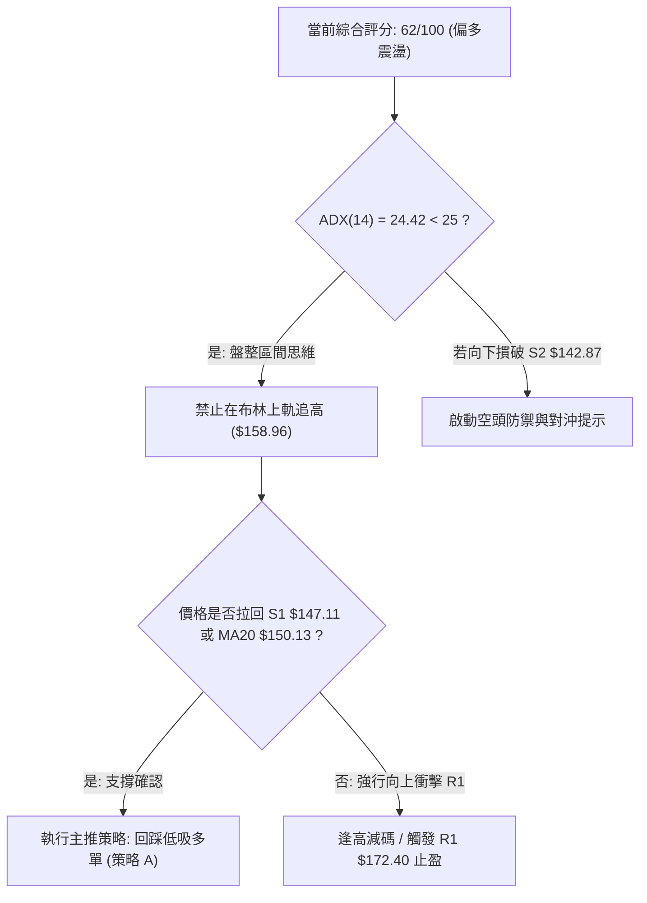

### 🧭 策略路由

依第 1 章技術評分卡：**綜合評分 62/100（≥ 60，偏多震盪）**。
- **當前主策略方向 = 主推多頭逢低布局策略（回踩吸納）**。
- 空頭僅列為反轉風險觸發點與風控對沖提示，不作為首選進攻方向。

### 🎯 價格情境階梯（Price Scenarios）

*(所有價位嚴格引用第 4 章及關鍵價位區塊之客觀數據)*

| 觸發條件 | 下一目標 | 後續延伸 | 情境含義與操作對策 |
|----------|----------|----------|--------------------|
| **突破現價並站穩 $165.24** | **R1 $172.40** | **$179.49** | 短線極強多頭，上攻近一年波段高點聚集區 |
| **回踩 $150.13 – $150.98 企穩** | **現價 $158.96** | **$165.24** | 完美的均線與斐波 61.8% 回踩確認，主策略最佳加碼點 |
| **跌破 S1 $147.11** | **S2 $142.87** | **$130.39** | 短線結構轉弱，向布林下軌尋求強支撐 |

### 📊 情境機率分佈

| 情境 | 機率 | 主要技術依據 |
|------|------|--------------|
| **回踩支撐後繼續上行** | **55%** | 全均線呈多頭排列，+DI(23.69) 壓制 -DI(12.08)，週線自底部反彈結構扎實 |
| **高檔區間震盪整理** | **30%** | ADX=24.42 顯示單邊趨勢不足，布林通道超買與 MACD 死叉限制衝高速度 |
| **深度回落跌破 S1/S2** | **15%** | OBV 指標落後均線，若大盤系統性風險引發多頭踩踏，將回測深幅支撐 S2 |

### 🟢 主策略詳情（主推多頭策略）

```
╔══════════════════════════════════════════════════════════════╗
║               SPCX 實戰多頭交易策略規格書                    ║
╠══════════════════════════════════════════════════════════════╣
║ 策略類型   │ 策略 A：回踩布林中軌進場   │ 策略 B：突破 50% 斐波追強  ║
╠────────────┼───────────────────────────┼───────────────────────────╣
║ 進場條件   │ 價格回踩 MA20/斐波61.8%企穩│ 帶量突破 50% 斐波那契回調位║
║ 進場價格   │ $150.98                   │ $165.24                   ║
║ 目標價 T1  │ $165.24 (斐波 50.0%)      │ $172.40 (阻力位 R1)       ║
║ 目標價 T2  │ $172.40 (阻力位 R1)       │ $179.49 (斐波 38.2%)      ║
║ 止損價格   │ $142.87 (支撐位 S2)       │ $158.96 (原布林上軌轉支撐)║
║ 風險金額   │ $8.11 / 股                │ $6.28 / 股                ║
║ 預期報酬T2 │ +$21.42 / 股 (+14.19%)    │ +$14.25 / 股 (+8.62%)     ║
║ 風險報酬比 │ 1 : 2.64                  │ 1 : 2.27                  ║
║ 預期勝率   │ 65%                       │ 55%                       ║
║ 建議倉位   │ 15% (主要波段倉)          │ 8% (動量突破短線倉)       ║
╚══════════════════════════════════════════════════════════════╝
```

### 🔴 反向風險觸發點（對沖提示）

若出現以下訊號，宣告主策略多頭架構破裂，需全面停損或轉向防禦：
1. **價格有效跌破支撐位 S1 ($147.11)**：代表短線多頭防線瓦解，應將現貨部位削減 50%。
2. **日線收盤跌破支撐位 S2 ($142.87)**：該位置與布林下軌（$142.97）共振，一旦失守，宣告 V 型反轉失敗，需無條件清倉避險，下看 S3 ($130.39)。
3. **MACD 柱狀體加速發散跌破 -0.50 且伴隨放量長黑**。

### ⭐ 整體訊號強度評星

```
做多訊號強度：★★★★☆  (4.0/5星 — 短均線完好多頭，但受限超買)
做空訊號強度：★☆☆☆☆  (1.5/5星 — +DI 完全壓制空頭，做空勝率低)
整體可信度：  ★★★★☆  (4.0/5星 — 價位與斐波那契點位高度吻合)
```

---

## 9. 風險提示與監控

### ✅ 關鍵監控指標 Checklist

```
╔══════════════════════════════════════════════════════════════╗
║               SPCX 每日盤後關鍵技術監控清單                  ║
╠══════════════════════════════════════════════════════════════╣
║ [ ] 價格是否維持在布林中軌 / MA20 ($150.13) 之上？            ║
║ [ ] RSI(14) 是否在回調過程中守住 50 強弱分水嶺？             ║
║ [ ] MACD 柱狀體 (-0.083) 是否進一步向下擴大，形成實質死叉？   ║
║ [ ] 當價格衝擊 $165.24 時，成交量是否能超越 20日均量(9400萬)？║
║ [ ] OBV 指標是否向上突破其均線，消除量價背離隱患？            ║
║ [ ] 跌破 S1 ($147.11) 是否觸發第一道止損風控程序？           ║
╚══════════════════════════════════════════════════════════════╝
```

### ⚠️ 風險場景分析

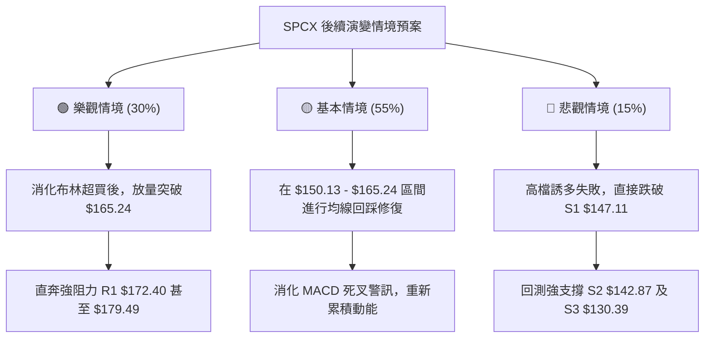

### 🛡️ 風險管理重要提醒

1. **嚴防布林帶外「均值回歸」殺傷力**：
   當前 %B 達 1.12，價格完全暴露在通道上軌之外。歷史數據表明，高估值與高波動標的在軌道外的急跌往往以大陰線形式出現，日內回撤極快，切忌使用市價單市價追買。
2. **ATR 風險敞口配比限制**：
   鑑於 SPCX 日 ATR 高達 $6.20，單筆交易的最大資金虧損應嚴格控制在總投資組合淨值的 **1.0% – 1.5%** 之內。若設定 $8.11 止損幅度，總倉位不得超過總資金的 15%–18%。
3. **量能未確認下的防禦心態**：
   OBV 指標持續位於均線下方，說明本輪推升過程中機構資金未出現極度激進的追買行為。在 OBV 顯著向上穿越均線前，所有操作均應定位為「波段震盪對待」，不可抱持長線單邊暴漲之過度預期。

---

## 📋 報告總結

```
╔══════════════════════════════════════════════════════════════╗
║                 SPCX 技術分析報告終極總結                    ║
╠══════════════════════════════════════════════════════════════╣
║ 報告日期：2026-10-04                                         ║
║ 當前價格：$158.96                                            ║
║ 分析評級：🟢 偏多震盪 (評分: 62/100) — 短期超買，回踩吸納   ║
╠──────────────────────────────────────────────────────────────╣
║ 關鍵結論：                                                   ║
║ ├─ 長期趨勢：🟡 52W 低點 $104.83 確立築底，反彈修復中        ║
║ ├─ 中期趨勢：🟢 週線階梯上升，站穩 61.8% 斐波位 ($150.98)   ║
║ ├─ 短期趨勢：🔴 布林通道超買 (%B=1.12)，MACD柱狀體微幅死叉   ║
║ ├─ 關鍵支撐：S1: $147.11 ｜ S2: $142.87 ｜ S3: $130.39       ║
║ ├─ 關鍵阻力：50%斐波: $165.24 ｜ R1: $172.40 ｜ 38.2%: $179.49║
║ └─ 分析師目標：均價 $226.04 (距現價 +42.2%)，共識為 Buy      ║
╠──────────────────────────────────────────────────────────────╣
║ 最優策略組合：                                               ║
║ 1. 🥇 最佳機會：等待回踩斐波 61.8% 位 $150.98 布局多單，     ║
║                 止損設於 S2 $142.87，目標上看 R1 $172.40     ║
║ 2. 🥈 次選機會：強勢帶量突破 $165.24 時順勢輕倉追進，        ║
║                 博弈短線衝擊 R1 $172.40                      ║
║ 3. 🥉 保守選擇：空倉觀望，等待日線 MACD 柱狀體重新翻紅且     ║
║                 價格回測 MA20 ($150.13) 不破再行介入         ║
╚══════════════════════════════════════════════════════════════╝
```

---

> ⚠️ **免責聲明**：本報告為技術分析研究，所有數據、圖表及估算均基於歷史價格與客觀技術指標計算。本報告**僅供研究與學術參考**，**不構成任何要約、招攬或投資建議**。市場有風險，交易需依個人風險承受力嚴格執行止損。

---

*報告生成時間：2026-10-04 ｜ 數據來源：Yahoo Finance ｜ 分析框架：多時框技術分析*