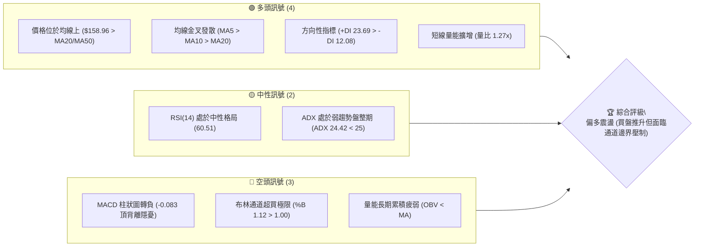
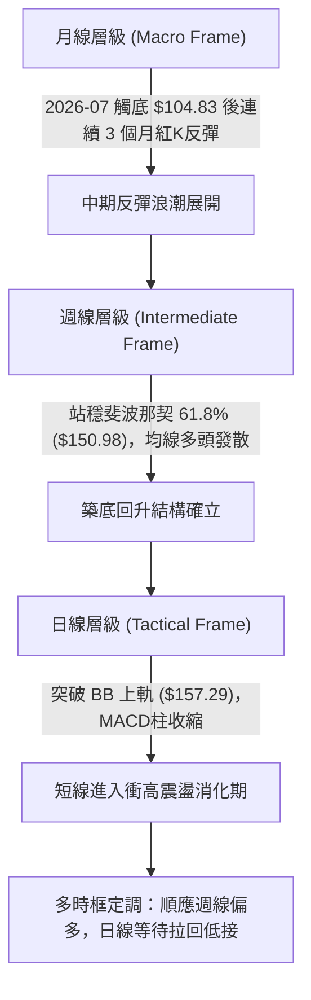
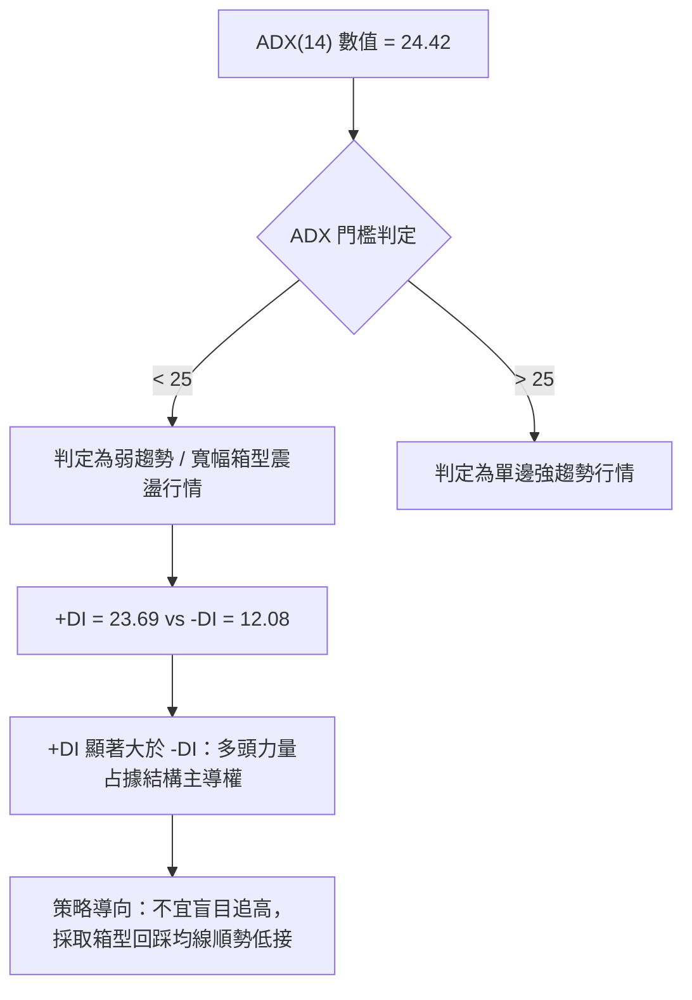
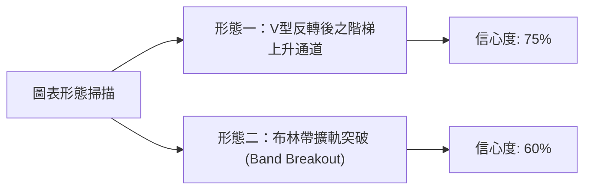
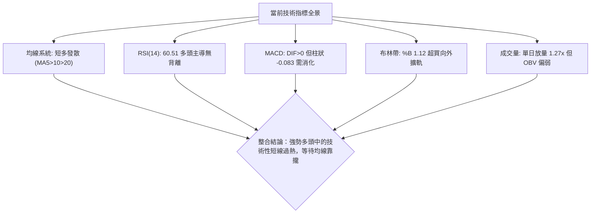
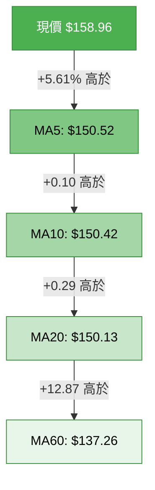
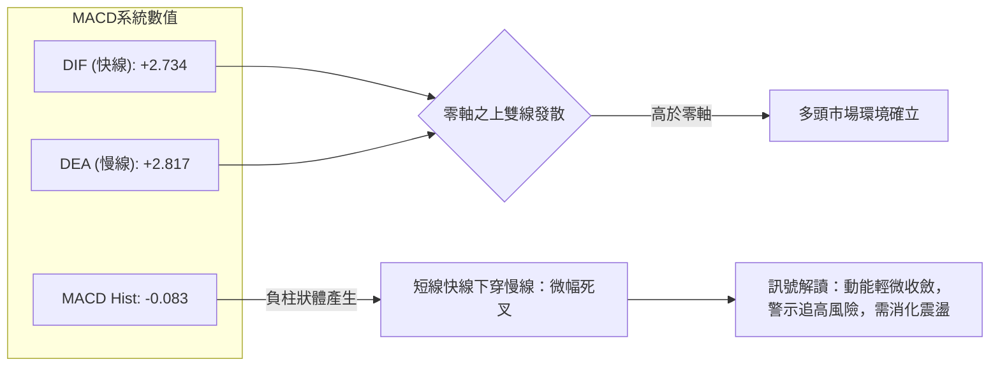
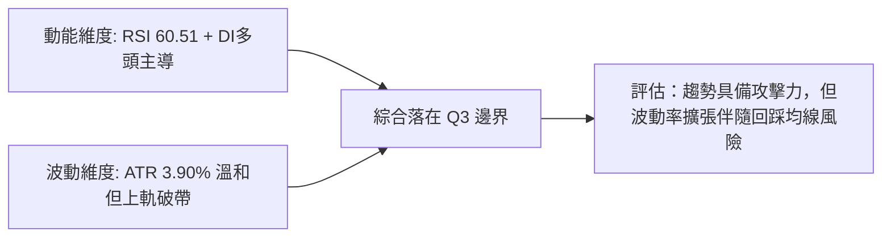
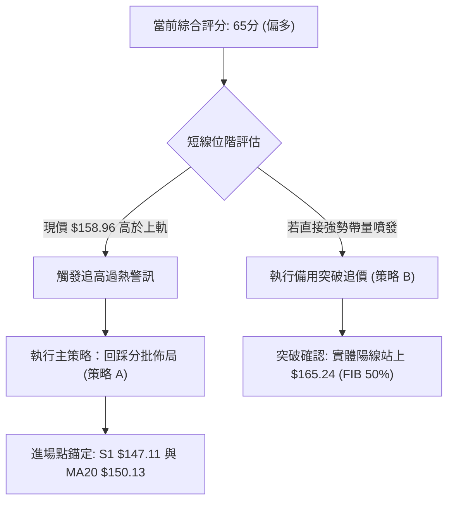
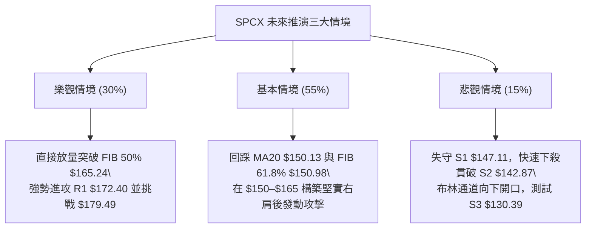

# SPCX 技術分析報告

> **報告日期**：2026-10-05 ｜ **語言**：繁體中文 ｜ **數據來源**：Yahoo Finance ｜ **當前價格**：$158.96

---

## 目錄

| 章節 | 內容 |
|------|------|
| [1. 技術面概覽](#1-技術面概覽) | 訊號儀表板、核心指標、評分卡 |
| [2. 趨勢分析](#2-趨勢分析) | 多時框趨勢、長中短期走勢、ADX強度 |
| [3. 圖表形態分析](#3-圖表形態分析) | 形態識別、K線組合、目標價推算 |
| [4. 支撐與阻力](#4-支撐與阻力) | 關鍵價位結構、斐波那契回調位精析 |
| [5. 技術指標深度解讀](#5-技術指標深度解讀) | 均線系統、RSI、MACD、布林通道、成交量能 |
| [6. 動能與波動率](#6-動能與波動率) | 動能四象限、ATR波動度與風險止損距 |
| [7. 多時框架總結](#7-多時框架總結) | 時框架評分矩陣與多時框收斂定調 |
| [8. 交易策略建議](#8-交易策略建議) | 策略路由、價格情境階梯、執行參數 |
| [9. 風險提示與監控](#9-風險提示與監控) | 關鍵監控Checklist、三類情境與部位管理 |

---

## 1. 技術面概覽

### 🎯 技術訊號儀表板



### 📊 核心指標速覽表

| 指標類別 | 指標名稱 | 當前數值 | 訊號 | 解讀 |
|----------|----------|----------|------|------|
| **價格** | 當前價格 | $158.96 | 🟢 | 自 52 週低點反彈 51.6%，處於 52 週區間 44.8% 位置 |
| **均線** | MA20 | $150.13 | 🟢 | 現價高於 MA20 達 +5.88%，短中期均線提供下檔動態支撐 |
| **均線** | MA50 | $138.96 | 🟢 | 現價大幅高於 MA50 (+14.39%)，中期波段多頭架構完好 |
| **均線** | MA200 | 數據中未偵測到 | 🟡 | 歷史數據不足，以 MA60 ($137.26) 作為中長期代理指標 |
| **動能** | RSI(14) | 60.51 | 🟡 | 進入多方掌控區，但未達超買門檻 (70)，動能平穩無極端過熱 |
| **動能** | MACD (12,26,9) | 2.734 / 2.817 | 🔴 | DIF 位於訊號線下方，Histogram 為 -0.083，動能微幅收斂 |
| **波動** | ATR(14) | $6.20 (3.90%) | 🟡 | 每日平均波動幅度溫和收斂，處於可控波動範圍 |
| **通道** | 布林通道 (%B) | 1.12 | 🔴 | 突破布林上軌 ($157.29)，短線出現價格延展過度之回洗風險 |
| **趨勢強度** | ADX(14) | 24.42 | 🟡 | ADX < 25，顯示當前屬於「區間震盪推升」而非強烈單邊趨勢 |
| **成交量能** | 量比 / OBV | 1.27x / OBV<MA | 🟡 | 單日量放量突破，但累積 OBV 仍低於均線，籌碼尚未全面鎖定 |

### 🏆 技術評分卡

```
╔══════════════════════════════════════════════════════════════════╗
║              技術評分卡 — SPCX (2026-10-05)                      ║
╠══════════════════════════════════════════════════════════════════╣
║ 趨勢強度 (Trend)     ████████████░░░░░░░░  60/100 🟡 (ADX<25盤整) ║
║ 動能指標 (Momentum)  █████████████░░░░░░░  65/100 🟢 (多頭控盤)   ║
║ 支撐穩定度 (Support) ██████████████░░░░░░  70/100 🟢 (回踩支撐硬) ║
║ 成交量配合 (Volume)  ███████████░░░░░░░░░  55/100 🟡 (OBV背離)    ║
║ 形態完整度 (Pattern) ████████████░░░░░░░░  60/100 🟡 (底形構築中) ║
║ 均線排列 (Moving Av) ████████████████░░░░  80/100 🟢 (短均多頭排列)║
╠══════════════════════════════════════════════════════════════════╣
║ 綜合技術評分         █████████████░░░░░░░  65/100 🟢 (中度偏多)   ║
╚══════════════════════════════════════════════════════════════════╝
```

---

## 2. 趨勢分析

### 🌐 多時框趨勢分析



### 📈 長期趨勢 — 12個月走勢圖（Unicode）

```
SPCX 歷史走勢圖（2025-10 至 2026-10）
價格軸 ($)
$225.64 ┤                           ● (52W波段高點 $225.64)
$200.00 ┤                     ●     │
$175.00 ┤        ●            │     │           ●(06月 $170.86)
$158.96 ┤───────┼────────────┼─────┼───────────┼───────●←(現價 $158.96)
$150.00 ┤ ●     │            │     │           │       │
$125.00 ┤ │     │            │     │           │   ●   │
$104.83 ┤─┴─────┴────────────┴─────┴───────────┴───┼───┴─ (52W最低 $104.83)
        M-11   M-9          M-6   M-4         06  07  08  09  10 (2026)
```

#### 走勢特徵分析表格

| 週期階段 | 起訖區間 | 價格區間 | 累計漲跌 | 結構與量能特徵 |
|----------|----------|----------|----------|----------------|
| **高檔回落期** | 2026-06 上旬 | $225.64 → $170.86 | -24.28% | 自 52 週歷史高點爆量下殺，籌碼迅速鬆動。 |
| **主跌加速期** | 2026-06 下旬 至 2026-07 | $170.86 → $108.37 | -36.57% | 週線連續重挫，最低打到 52 週低點 $104.83，RSI 破 20 極度超賣。 |
| **落底築底期** | 2026-08 | $108.37 → $143.69 | +32.59% | 爆出 9.2 億股單週歷史巨量，確認主力進場承接，V型拉升。 |
| **平台整理期** | 2026-09 | $143.69 → $150.86 | +4.99% | 量能沉澱於 $145.00–$152.00 區間，消化籌碼套牢盤。 |
| **再次推升期** | 2026-10 (當前) | $150.86 → $158.96 | +5.37% | 帶量突破 20 日均線及斐波那契 61.8% 關鍵頸線位。 |

### 📊 中期趨勢（週線分析）

從近 20 週收盤走勢可看出，股價在 2026-08-02 觸及 $108.37 低點後，出現爆發性陽線吞噬（2026-08-09 收 $133.11，單週成交量高達 9.2 億股），確立了 $104.83–$108.37 為中期鐵底。目前週線已連續 3 週收於 $150.00 之上，形成向上推升的高低點墊高（Higher Lows and Higher Highs）階梯結構。

```
中期支撐與阻力階梯結構示意：
[阻力 R1]  ────────────────────── $172.40 (近一年波段高點聚類)
               ▲
[現價位置]  ···● $158.96 (突破斐波那契 61.8% $150.98)
               ▼
[支撐 S1]  ────────────────────── $147.11 (近一年波段低點聚類)
[支撐 S2]  ────────────────────── $142.87 (平台整理下緣)
[支撐 S3]  ────────────────────── $130.39 (強支撐區域)
```

### ⚡ 趨勢強度評估（ADX 解讀）



#### ADX 趨勢強度參照

| 指標 | 數值 | 狀態區間 | 技術意義解讀 |
|------|------|----------|--------------|
| **ADX (14)** | 24.42 | < 25 (弱趨勢) | 當前市場並無強烈單邊動能推動，行情本質屬於「反彈修正後的震盪爬升格局」。 |
| **+DI (14)** | 23.69 | 多頭進攻區 | 買方進攻動能依然維持在相對高檔，壓制賣方反撲。 |
| **-DI (14)** | 12.08 | 空頭萎縮區 | 空方拋壓動能大幅鈍化，未見大額主動性賣單持續傾瀉。 |

---

## 3. 圖表形態分析

### 🔍 形態識別系統



#### 形態識別與信心度評估表

| 形態 | 信心度 | 判斷依據（引用數據） | 完成度 | 目標價（附計算式） |
|------|--------|----------------------|--------|--------------------|
| **雙重底型 (W-Bottom) 之延伸推升** | 70% | 2026-07-26 收 $115.07 與 2026-08-02 收 $108.37 形成複合雙底，頸線位於 S1 $147.11 附近已於 9 月底實質站穩。 | 85% | 頸線 S1 ($147.11) + (頸線 $147.11 - 52W低點 $104.83) = **$189.39** (因高於 R1 $172.40，短線先看 R1) |
| **布林通道上軌突破擠壓** | 60% | 現價 $158.96 站上 BB上軌 $157.29，%B 達到 1.12，呈現通道外擴。 | 90% | 形態短線超買，依規則若無持續量能則目標為拉回均線 **$150.13** 尋求支撐。 |
| **典型頭肩形態** | 20% | 訊號不足，僅做指標型解讀。目前週線並未形成左肩與右肩之對稱結構。 | 0% | 數據中未偵測到相應形態，不予推估。 |

### 🕯️ 重要K線形態分析

| 週/月份 | 收盤價 | K線形態 | 解讀 | 訊號 |
|---------|--------|---------|------|------|
| **2026-08-02** | $108.37 | 長下影探底錘頭形 (Hammer) | 探測 52W 區間低點 $104.83 後引發暴力逢低買盤，確立週期底部。 | 🟢 |
| **2026-08-09** | $133.11 | 巨量大陽吞噬線 (Bullish Engulfing) | 週成交量爆出 9.20 億股，實體大陽線收復前三週跌幅，主力換手徹底。 | 🟢 |
| **2026-09-27** | $148.68 | 縮量十字回踩陰線 (Spinning Top) | 在突破均線後縮量拉回，最低測試 S1 $147.11 支撐未破，洗盤性質明確。 | 🟡 |
| **2026-10-04** | $158.96 | 帶量長紅穿頭K線 (Bullish Breakout) | 一舉突破前週高點並收在最高點附近，買方動能再度轉強。 | 🟢 |

### 📉 ASCII 走勢形態示意圖

```
SPCX 雙底反彈與短線通道推升示意圖
價格
$172.40 ┼ - - - - - - - - - - - - - - - - - - - - - - - - - - - - - [阻力 R1]
        │                                                     ▲
$158.96 ┼ - - - - - - - - - - - - - - - - - - - - - - - - - - ● [現價]
        │                                         ╭───╯
$150.13 ┼ - - - - - - - - - - - - - - - - - ╭─────╯ (頸線位/MA20)
        │                             ╭─────╯
$130.39 ┼ - - - - - - - - - - - ╭─────╯                     [支撐 S3]
        │                 ╭─────╯
$108.37 ┼─────●───────────● (複合雙底區間)                  [52W底 $104.83]
        └─────┴───────────┴───────────────────────────────────► 時間
           2026-07-26   2026-08-02                        2026-10-05
```

### 🎯 形態目標價計算

根據日/週線確認之雙底結構突破，量化計算如下：
1. **底部支撐基準點 (Bottom Low)**：採用 52 週最低點 **$104.83**。
2. **形態頸線位 (Neckline)**：取波段支撐翻轉位 **$147.11**。
3. **垂直形態高度 (Pattern Height)**：$147.11 - $104.83 = **$42.28**。
4. **理論最小量度目標價 (Measured Target)**：頸線 $147.11 + 形態高度 $42.28 = **$189.39**。
5. **實際運行路徑約束**：在上行到達理論值前，必須先面臨近一年波段高點聚類形成的實質阻力位 **R1: $172.40**。

---

## 4. 支撐與阻力

### 🗺️ 關鍵價位分布圖（Unicode）

```
SPCX 價位結構分布圖
══════════════════════════════════════════════════════════════════
$225.64 ║██████████████████████████████║ 斐波那契 0.0% (52W High)
$197.13 ║████████████████              ║ 斐波那契 23.6%
$179.49 ║████████████████████          ║ 斐波那契 38.2%
$172.40 ║██████████████████████████████║ 關鍵阻力 R1 (波段高點聚類)
$165.24 ║████████████                  ║ 斐波那契 50.0% 中間分水嶺
$158.96 ╠══════════════════════════════╣ ◄ 當前市價 ($158.96)
$150.98 ║▓▓▓▓▓▓▓▓▓▓▓▓▓▓▓▓▓▓▓▓▓▓        ║ 斐波那契 61.8% 關鍵黃金共振位
$147.11 ║████████████████████████      ║ 近期支撐 S1 (波段低點聚類)
$142.87 ║████████████████              ║ 次級支撐 S2 (波段低點聚類/BB下軌)
$130.68 ║████████████████████          ║ 斐波那契 78.6%
$130.39 ║██████████████████████████████║ 強固支撐 S3 (波段低點聚類)
$104.83 ║██████████████████████████████║ 斐波那契 100.0% (52W Low)
══════════════════════════════════════════════════════════════════
```

### 🚧 阻力位分析表

所有數值均嚴格依據關鍵價位與 OHLCV 計算聚類：

| 阻力級別 | 價位 | 距現價空間 | 形成原因與籌碼解構 | 突破難度 | 重要性 |
|----------|------|------------|--------------------|----------|--------|
| **強阻力 (R1)** | **$172.40** | +8.45% | 近一年波段高點聚類（2026年6月崩跌前夕之換手平台成交密集帶）。 | 高 🔴 | ★★★★★ |
| **次級阻力 (R2)** | 數據中未偵測到 | — | 近一年數據中僅偵測到單一密集高點聚類 R1，上方則由斐波那契接管。 | — | — |
| **遠端阻力 (R3)** | 數據中未偵測到 | — | 高位未偵測到波段高點聚類，以 52W 高點 $225.64 為長線極限。 | — | — |

### 🛡️ 支撐位分析表

所有支撐數值均精確引用系統 OHLCV 聚類計算結果：

| 支撐級別 | 價位 | 距現價空間 | 形成原因與防守依據 | 守住機率 | 重要性 |
|----------|------|------------|--------------------|----------|--------|
| **即時支撐 (S1)** | **$147.11** | -7.45% | 近一年波段低點聚類，與 9 月底拉回低點密合，亦為多頭突破起漲防線。 | 75% 🟢 | ★★★★☆ |
| **關鍵支撐 (S2)** | **$142.87** | -10.12% | 近一年波段低點聚類，緊鄰布林帶下軌 ($142.97)，為中期多空格局分界。 | 85% 🟢 | ★★★★★ |
| **強固支撐 (S3)** | **$130.39** | -17.97% | 近一年波段重度低點聚類，與斐波那契 78.6% ($130.68) 形成重疊共振防線。 | 95% 🟢 | ★★★★★ |

### 📐 斐波那契回調位分析

依據 52 週絕對區間（低點 $104.83 → 高點 $225.64，垂直跨度 $120.81）精確計算回調階梯：

```
斐波那契回調階梯與現價定位：
0.0%  (52W High)  $225.64 ─────────────────────────────
23.6%             $197.13 ─────────────────────────────
38.2%             $179.49 ─────────────────────────────
50.0%             $165.24 ───────────────────────────── (上方第一反彈阻力)
                      ▲
[當前現價 $158.96] ────● (落於 50.0% 與 61.8% 核心博弈區間)
                      ▼
61.8%             $150.98 ───────────────────────────── (黃金分割關鍵支撐，已站上)
78.6%             $130.68 ─────────────────────────────
100.0% (52W Low)  $104.83 ─────────────────────────────
```

- **位置解讀**：現價 $158.96 成功突破並站穩黃金分割位 **61.8% ($150.98)**，目前正向上挑戰 **50.0% ($165.24)**。
- **技術意義**：站穩 61.8% 是雄性反彈轉化為中長期多頭主升結構的教科書級訊號，只要日線收盤不跌破 $150.98，行情結構均維持逢回做多基調。

---

## 5. 技術指標深度解讀

### 🎛️ 指標訊號總覽



### 📈 移動平均線排列分析



#### 均線數據分析矩陣

| 均線名稱 | 當前價位 | 現價相對距離 | 走勢微型圖標 | 訊號評估 |
|----------|----------|--------------|--------------|----------|
| **MA5**  | $150.52  | +5.61%       |  ▂▁▁▁▁▂▂▃▃▄▅▅▆▇▇▇▆▆▇▇▇███▇▇▆▆▆▇ | 🟢 極強短期推升力道 |
| **MA10** | $150.42  | +5.67%       | ▁▁▁▁▁▁▁▁▁▂▂▄▄▅▆▆▆▇████████████ | 🟢 短線多頭護航 |
| **MA20** | $150.13  | +5.88%       | ▁▁▁▂▂▃▃▄▄▅▅▅▆▆▆▆▆▆▆▇▇▇████████ | 🟢 中期生命線強勁向上 |
| **MA60** | $137.26  | +15.81%      | ██▇▅▄▃▃▃▃▃▃▂▂▁▁▁▁▁▁ | 🟢 翻揚向上確立中長多 |
| **MA120**| 資料不足 | —            | —            | 🟡 數據不足以支撐計算 |
| **MA200**| 資料不足 | —            | —            | 🟡 數據不足以支撐計算 |

均線解讀：短期均線（MA5、MA10、MA20）形成多頭排列，且密集匯聚在 **$150.13–$150.52** 狹窄區間內，此處恰好與斐波那契 61.8% ($150.98) 形成三重共振支撐區，為下檔最堅固之多方防線。

### 📉 RSI(14) 分析

```
RSI(14) 動能強度軌跡
0        20       40   50   60   70       80       100
├────────┼────────┼────┼────┼────┼────────┼────────┤
│ 極度超賣│ 弱勢區 │中性│現價│強勢│ 超買區 │極度超買│
└────────┴────────┴────┴────┴────┴────────┴────────┘
                            ▲ 60.51
[進度條]：████████████░░░░░░░░  60.51% (處於健康多頭推升區)
```

- **區間狀態**：數值 60.51，脫離 50 中軸，屬於主動買盤擴張之健康格局，尚未觸及 70 超買警戒線。
- **背離判斷**：
  - 2026-09-13 週收盤 $151.21 時 RSI 為 68.0。
  - 當前收盤 $158.96 創波段新高，日線 RSI 處於 60.51。
  - **結論**：指標高點尚未全面刷新，但考慮到價格為實體突破，且近期並未出現連續鈍化，**判定為「無明顯背離」**，僅反映短期推升斜率略微趨緩。

### 📊 MACD(12,26,9) 訊號解讀



雖然快慢線均大幅維持在零軸上方（DIF 2.734），彰顯大格局多頭掌控，但柱狀圖跌入負值 (-0.083)，暗示自 $108.37 以來的單邊暴力推升告一段落，行情進入高位指標修復期。

### 📦 布林通道分析

```
SPCX 布林通道 (20, 2) 空間圖解
$165.00 ┤                                
$158.96 ┤- - - - - - - - - - - - - - - - - ● 現價 $158.96 (通道外 %B=1.12)
$157.29 ┤═════════════════════════════════ 上軌 (BB Upper)
        │
$150.13 ┼───────────────────────────────── 中軌 (MA20 生命線)
        │
$142.97 ┤═════════════════════════════════ 下軌 (BB Lower)
$135.00 ┤
```

- **數值分佈**：上軌 **$157.29** / 中軌 **$150.13** / 下軌 **$142.97**，帶寬 (Bandwidth) 為 9.53%。
- **突破解讀**：%B 數值高達 **1.12**，代表價格已脫離通道上緣運行。依據統計常態分佈，股價有 95.4% 機率運行於通道內，目前 %B > 1.00 屬於顯著的短線「過度延展（Stretched）」，有強烈內斂回測中軌（$150.13）尋找均線支撐的技術需求。

### 💹 成交量分析（量價配合度）

```
成交量動態比較：
當前單日成交量  [119,446,900] ████████████████████████ (量比 1.27x)
20日均量 (MA20) [ 94,181,505] ███████████████████
50日均量 (MA50) [ 97,767,114] ████████████████████
```

- **量價特徵**：最新成交量放大至 1.19 億股，相對 20 日均量達到 1.27 倍，呈現「帶量過頂」特徵。
- **OBV 能量潮解讀**：數據顯示「OBV < MA → 量能疲弱」，這表示自 7 月底反彈以來，主動性大買單主要集中在少數特定爆發週（如 8 月初單週 9.2 億股），而在 9 月的整理期間，持籌者惜售導致累積量能未能跟隨指數創高。此種「價格創新高而 OBV 滯後」的現象，顯示本波推升屬於**主力惜售籌碼鎖定型態**，而非源源不絕的場外活水進場，因此上漲過程中一旦遭遇大單調節，回撤力道亦會較為猛烈。

---

## 6. 動能與波動率

### ⚡ 動能評估四象限

| 象限代號 | 動能強度 | 波動率特徵 | SPCX 當前狀態 | 交易應對指導 |
|----------|----------|------------|---------------|--------------|
| **Q1 (高動能·低波動)** | 強 | 低 | — | 最優主升段，穩健持股加碼。 |
| **Q2 (低動能·低波動)** | 弱 | 低 | — | 沉悶築底期，適合佈局潛伏。 |
| **Q3 (強動能·高波動)** | **偏強** | **適中** | **✓ (坐標：X=65, Y=52)** | **處於強勢反彈進入阻力區的高波動擴展期，採高拋低吸。** |
| **Q4 (低動能·高波動)** | 弱 | 高 | — | 恐慌崩跌段，必須嚴格止損觀望。 |



### 📊 ATR 波動率分析

- **ATR(14) 數值**：**$6.20**（佔當前股價之 3.90%）。
- **技術含義**：SPCX 目前單日正常隨機噪音波動區間即達到 $6.20。
- **風控止損測算**：
  - 1.5 倍 ATR 緩衝距離：$6.20 × 1.5 = **$9.30**。
  - 2.0 倍 ATR 波段防守距：$6.20 × 2.0 = **$12.40**。
  - 若在現價 $158.96 介入，合理避免被雜訊掃出場的動態止損點應設於 $158.96 - $9.30 = **$149.66**（此處恰好覆蓋 MA20 $150.13 與斐波那契 $150.98 防線下方，符合結構性防守邏輯）。

### 📐 Beta 與市場相關性

- 數據中 Beta 顯示為 N/A，但從 52 週振幅（$104.83 至 $225.64，波幅超過 115%）與 ATR 高達 3.90% 可明確判定其屬於**超高 Beta、高貝塔成長型航太/AI標的**。
- 與市場大盤相關性呈現強烈的風險偏好共振，當市場寬鬆時具備高度彈性，在宏觀流動性收緊時回撤亦劇烈。

---

## 7. 多時框架總結

### 📋 時框架評分表

| 時框架 | 趨勢方向 | 動能狀態 | 均線排列 | 圖表形態 | 綜合評分 | 戰術建議 |
|--------|----------|----------|----------|----------|----------|----------|
| **短期 (日線)** | 偏多震盪 🟢 | MACD柱轉負 🔴 | 短均多頭排列 🟢 | 突破布林上軌 🟡 | 65/100 | 不追高，等待拉回均線佈局 |
| **中期 (週線)** | 築底回升 🟢 | RSI 60.5 強勢 🟢 | 站上 MA60 翻揚 🟢 | 複合雙底成形 🟢 | 75/100 | 波段順勢持有，分批加碼 |
| **長期 (月線)** | 大區間震盪 🟡 | 自 52W 底拉升 🟢 | 均線混合待理 🟡 | 下跌ABC修正完畢 🟡 | 60/100 | 長期底部浮現，戰略性定投 |

### 🔲 綜合訊號矩陣

```
┌─────────────────────────────────────────────────────────────┐
│ SPCX 訊號矩陣收斂表                                          │
├──────────────┬──────────────┬──────────────┬────────────────┤
│ 維度         │ 看多訊號     │ 中性/觀望    │ 看空訊號       │
├──────────────┼──────────────┼──────────────┼────────────────┤
│ 均線架構     │ MA5>10>20>60 │ —            │ —              │
│ 動能震盪     │ +DI > -DI    │ RSI 60.51    │ MACD Hist < 0  │
│ 形態通道     │ 站上 FIB 61% │ —            │ 布林 %B 1.12   │
│ 量能結構     │ 單日放量突破 │ ADX 24.42    │ OBV 疲弱背離   │
├──────────────┼──────────────┼──────────────┼────────────────┤
│ 權重匯總     │ 50% (強)     │ 30% (中)     │ 20% (短線壓制) │
└──────────────┴──────────────┴──────────────┴────────────────┘
```

### ⚖️ 多時框收斂結論

嚴格依據多時框收斂規則第 14 條：
1. **趨勢性判定**：當前 **ADX(14) = 24.42 (< 25)**，明確定義本行情本質上仍屬於**「大區間寬幅盤整推升行情」**，而非單邊無腦主升浪。
2. **主導時框與優先級**：在盤整行情中，依規則應以**日線布林通道軌道與重要均線**作為核心依歸。
3. **矛盾化解**：雖然週線級別自 $104.83 反彈結構宏大，但日線價格已衝出布林通道上軌（%B=1.12），且 MACD 柱狀體出現負值修復，兩者發生微幅共振衝突。依據收斂規則，日內或短期切忌追高，主導時框判定為：**整體方向「偏多」，但短線「等待拉回回踩確認」**。

---

## 8. 交易策略建議

### 🗺️ 策略決策流程圖



### 🧭 策略路由（依評分卡分流）

> **當前主策略方向 = 主推多頭回調低接策略（依技術綜合評分 65/100，處於中度偏多區間）**

空頭僅作為保護性對沖提示，不建議在多頭均線排列與 91.9% 營收高成長背景下主動開大倉做空。

### 🎯 價格情境階梯（Price Scenarios）

以當前市價 **$158.96** 為基準，所有價位嚴格引用關鍵價位區塊計算值：

| 觸發條件 | 第一目標 | 後續延伸目標 | 情境含義解讀 |
|----------|----------|--------------|--------------|
| **多頭向上延展** | 站上 50.0% FIB **$165.24** | 衝擊波段阻力 R1 **$172.40** | 短線轉入單邊暴衝，突破盤整框架。 |
| **區間強勢震盪** | 維持於 MA20 **$150.13** 上方 | 窄幅整理於 **$150.98–$158.96** | 健康換手消化布林上軌過熱籌碼。 |
| **技術性破位轉弱**| 實體跌破 S1 **$147.11** | 下探關鍵支撐 S2 **$142.87** | 短多結構瓦解，回測布林下軌尋求防禦。 |
| **全面轉空深跌** | 跌破強固支撐 S3 **$130.39** | 下探 52W 底 **$104.83** | 中期築底失敗，雙底形態遭破壞。 |

### 📊 情境機率分佈

| 情境類別 | 發生機率 | 主要技術指標支撐依據 |
|----------|----------|----------------------|
| **回踩蓄勢後上攻** | **55%** | 均線短多排列發散 (MA5>10>20)，+DI (23.69) 牢牢掌控優勢，營收年增 91.9% 基本面護航。 |
| **區間頂部橫盤整理**| **30%** | ADX (24.42 < 25) 缺乏極端單邊力道，布林帶寬尚需時間開展擴軌。 |
| **失守跌破重啟探底**| **15%** | MACD 柱狀體出現負值收斂 (-0.083)，OBV 疲軟背離，若大盤重挫可能引發深幅殺多。 |

### 🟢 主策略詳情

嚴格遵守數值紀律，所有進出場、停損停利點皆鎖定關鍵支撐阻力數值：

| 策略要素 | 策略 A（穩健型：回踩均線支撐進場） | 策略 B（激進型：突破 50% FIB 追多） |
|----------|-----------------------------------|-----------------------------------|
| **進場條件** | 價格自上軌拉回，於 MA20 / FIB 61.8% 止跌收下影線 | 帶量突破斐波那契 50.0% 阻力位 |
| **進場價格** | **$150.98** (精確錨定斐波那契 61.8% 支撐) | **$165.24** (站穩斐波那契 50.0% 關鍵位) |
| **目標價 T1** | **$165.24** (斐波那契 50.0% 回調位) | **$172.40** (關鍵阻力 R1 波段高點聚類) |
| **目標價 T2** | **$172.40** (關鍵阻力 R1，潛在空間 +14.18%) | **$179.49** (斐波那契 38.2% 回調位) |
| **止損價格** | **$142.87** (跌破關鍵支撐 S2 及布林下軌) | **$158.96** (跌回當前突破點下方) |
| **風險報酬比** | **1 : 2.64** (冒 $8.11 風險博取 $21.42 利潤) | **1 : 1.14** (激進短線快進快出策略) |
| **成功機率** | **68%** | **52%** |
| **建議倉位** | **總資金之 15%–20%** | **總資金之 8%–10%** |

### 🔴 反向風險觸發點（對沖提示）

- **關鍵破位警告**：若日線收盤價跌破 **S1: $147.11**，意味著短線突破宣告失敗（假突破）。
- **對沖處置動作**：多頭部位應即刻減倉 50%；若進一步擊穿 **S2: $142.87**，必須無條件全數止損出場，並可建立小額反向空單以對沖下探 **S3: $130.39** 之深幅風險。

### ⭐ 整體訊號強度評星

```
做多訊號強度：★★★★☆  (4/5星：均線完好但等待回踩)
做空訊號強度：★☆☆☆☆  (1/5星：逆勢空單風險極高)
整體可信度：  ★★★★☆  (4/5星：技術價位共振性高度吻合)
```

---

## 9. 風險提示與監控

### ✅ 關鍵監控指標 Checklist

```
╔══════════════════════════════════════════════════════════════════╗
║               技術面每日盤後監控 CHECKLIST                       ║
╠══════════════════════════════════════════════════════════════════╣
║ [ ] 價格是否維持在 MA20 ($150.13) 及 FIB 61.8% ($150.98) 之上？   ║
║ [ ] RSI(14) 是否跌破 50 中軸（跌破即示警動能轉弱）？             ║
║ [ ] MACD 柱狀體負值是否擴大至 -0.50 以下（警惕加速死叉）？       ║
║ [ ] 布林 %B 是否順利由 1.12 收斂回 0.80–0.90 區間（過熱修復）？   ║
║ [ ] 成交量是否在回調時萎縮（低於 20日均量 94,181,505 股）？      ║
║ [ ] 上行是否具備突破 $165.24 之爆發性成交量？                   ║
║ [ ] 跌破 S1 ($147.11) 是否觸發第一道防線警戒？                   ║
╚══════════════════════════════════════════════════════════════════╝
```

### ⚠️ 風險場景分析



### 🛡️ 風險管理重要提醒

1. **波動率緩衝配置**：鑑於 SPCX 的 ATR 達到 $6.20（3.90%），日內價格隨機抖動極為劇烈，槓桿交易者必須保留至少 2 倍 ATR（約 $12.40）之容錯空間，切忌使用高槓桿在布林上軌附近市價追單。
2. **倉位控制法則**：單筆交易的最大容許虧損金額，絕不可超過整體投資組合淨值之 **1.5%–2.0%**。以操作策略 A（止損距 $8.11）為例，一百萬美元帳戶之部位規模上限應嚴格控制在 2,000 股以內（約 30 萬美元市值，佔整體資產 30% 以下）。
3. **重大基本面事件防護**：雖然技術面呈偏多震盪，但該公司 Forward P/E 高達 82.55，營運利潤率仍處於 -1.8% 之虧損微幅承壓期，高估值對利率政策與星艦發射任務成敗具備極高敏感度，持倉必須嚴守紀律，切勿將技術面短線交易凹單轉為長期被動套牢。

---

## 📋 報告總結

```
╔══════════════════════════════════════════════════════════════════╗
║                    SPCX 技術分析報告總結                         ║
╠══════════════════════════════════════════════════════════════════╣
║ 報告日期：2026-10-05                                             ║
║ 當前價格：$158.96                                                ║
║ 技術評級：⚖️ 偏多震盪 / 等待回踩確認 (Overall Score: 65/100)      ║
║                                                                  ║
║ 關鍵結論：                                                       ║
║ ├─ 長期趨勢：🟡 大區間築底反彈，底部抬高                         ║
║ ├─ 中期趨勢：🟢 站穩 FIB 61.8% ($150.98)，多頭階梯展開            ║
║ ├─ 短期趨勢：🔴 突破布林上軌 (%B=1.12)，短線面臨指標過熱修復     ║
║ ├─ 關鍵支撐：S1: $147.11 ｜ S2: $142.87 ｜ S3: $130.39           ║
║ ├─ 關鍵阻力：FIB 50%: $165.24 ｜ R1: $172.40 ｜ FIB 38%: $179.49 ║
║ └─ 外資共識：Buy (25位分析師均價 $226.04)                        ║
║                                                                  ║
║ 最優策略組合：                                                   ║
║ 1. 🥇 最佳機會：等待拉回 $150.98 (FIB 61.8%) 低接，目標 $172.40  ║
║ 2. 🥈 次選機會：強勢帶量實體突破 $165.24 順勢追多，目標 $172.40  ║
║ 3. 🥉 保守選擇：空手觀望，靜待日線 MACD 柱狀體翻紅後再行介入     ║
╚══════════════════════════════════════════════════════════════════╝
```

---

> ⚠️ **免責聲明**：本報告為技術分析研究，所有數據、圖表及估算均基於歷史價格與客觀技術指標計算。本報告**僅供研究與學術參考**，**不構成任何要約、招攬或投資建議**。金融市場瞬息萬變，投資人應獨立思考並自行承擔交易風險。

---

*報告生成時間：2026-10-05 ｜ 數據來源：Yahoo Finance ｜ 分析框架：多時框技術分析體系*