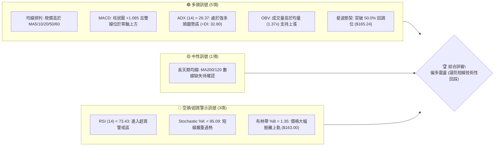
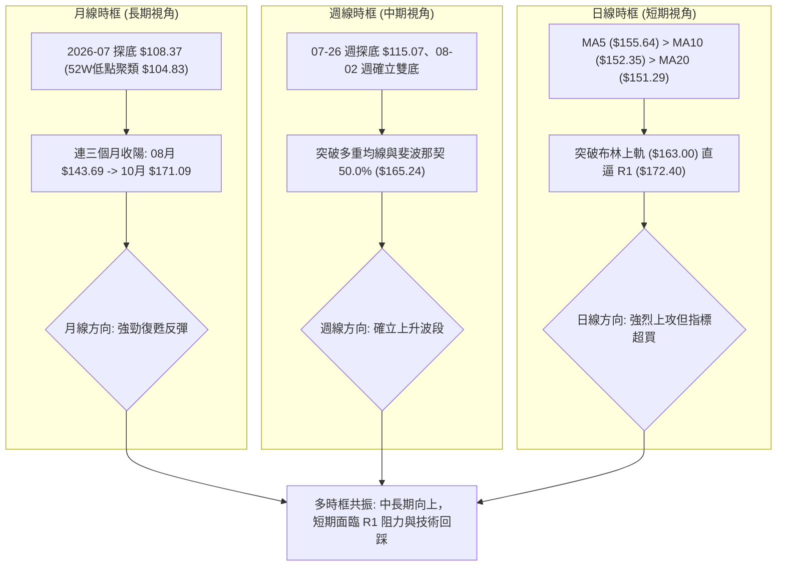
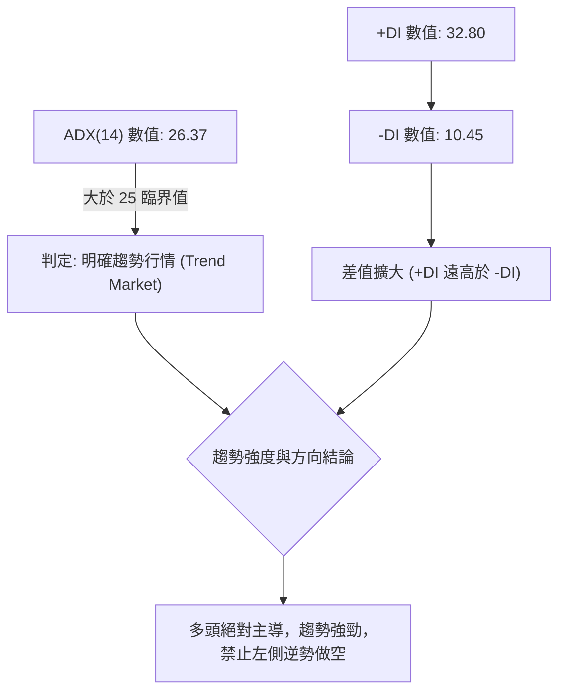
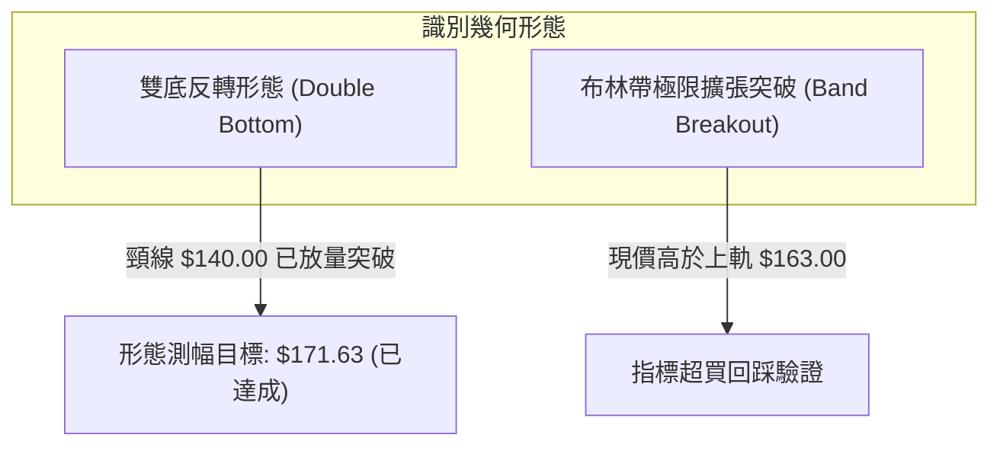
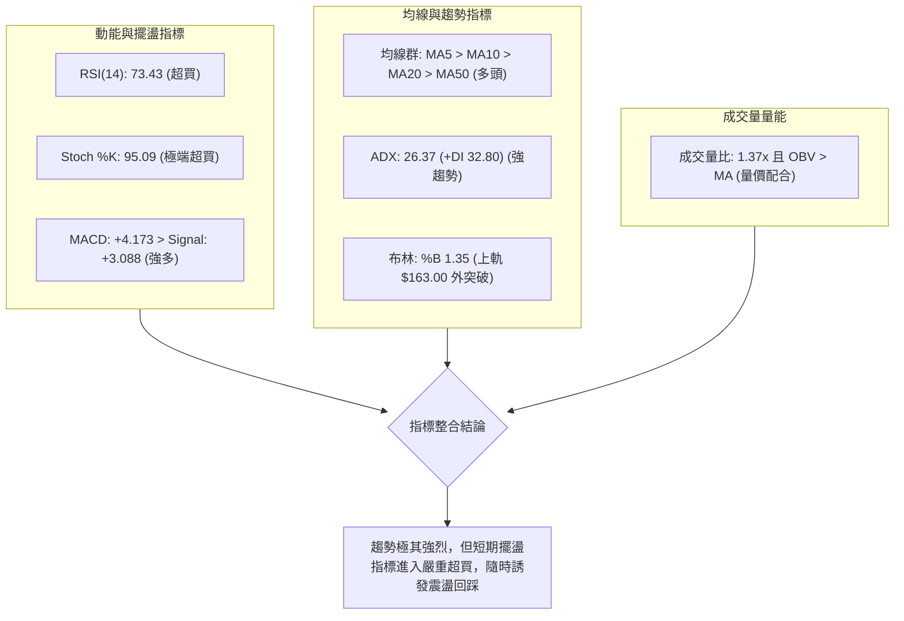
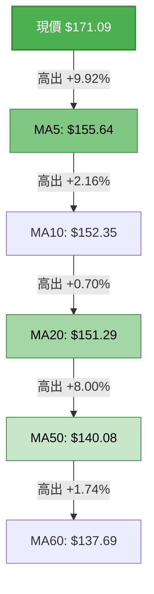
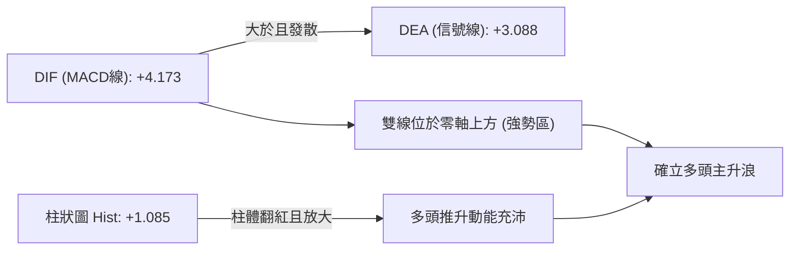
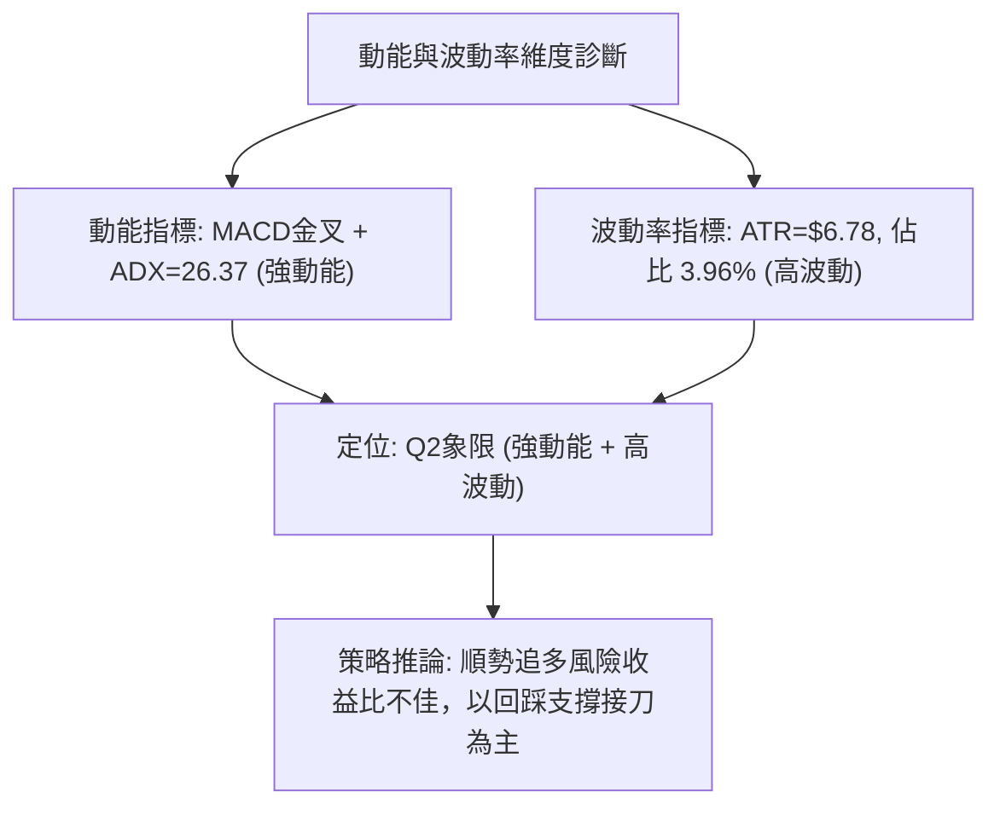
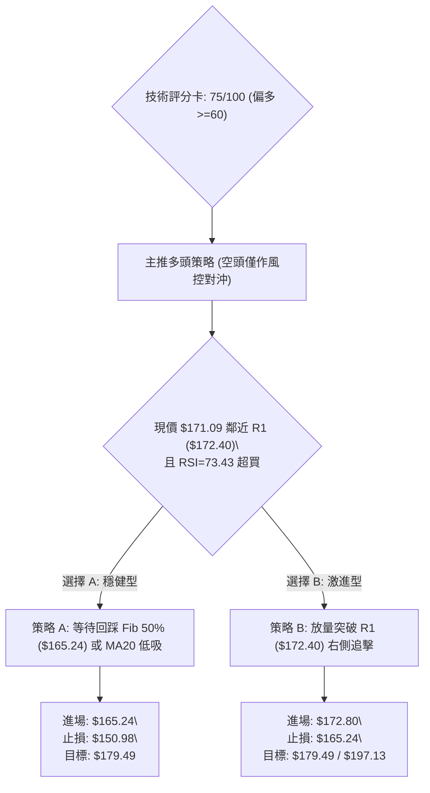
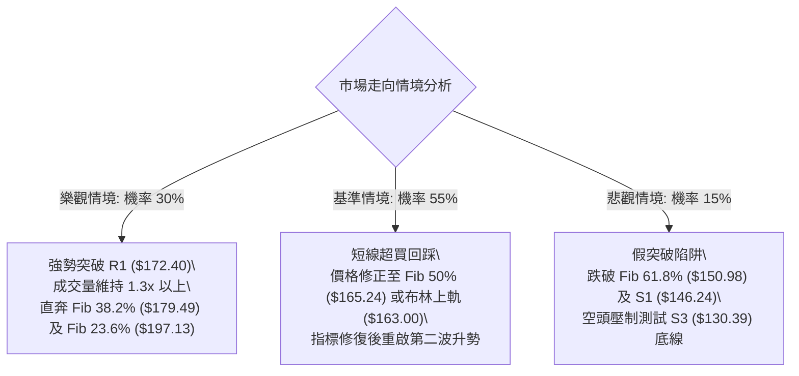

# SPCX 技術分析報告

> **報告日期**：2026-10-06 ｜ **語言**：繁體中文 ｜ **數據來源**：Yahoo Finance ｜ **當前價格**：$171.09

---

## 目錄

| 章節 | 內容 |
|------|------|
| [1. 技術面概覽](#1-技術面概覽) | 訊號儀表板、核心指標、評分卡 |
| [2. 趨勢分析](#2-趨勢分析) | 多時框趨勢、長中短期走勢 |
| [3. 圖表形態分析](#3-圖表形態分析) | 形態識別、K線組合、目標價 |
| [4. 支撐與阻力](#4-支撐與阻力) | 關鍵價位、斐波那契回調 |
| [5. 技術指標深度解讀](#5-技術指標深度解讀) | MA/RSI/MACD/布林/成交量 |
| [6. 動能與波動率](#6-動能與波動率) | 動能評估、ATR、Beta |
| [7. 多時框架總結](#7-多時框架總結) | 時框架評分矩陣、收斂規則 |
| [8. 交易策略建議](#8-交易策略建議) | 多空路由、情境階梯、主策略 |
| [9. 風險提示與監控](#9-風險提示與監控) | 監控指標、風險場景、風控參數 |
| [📋 報告總結](#-報告總結) | 結論彙整與操作綱領 |

---

## 1. 技術面概覽

### 🎯 技術訊號儀表板



### 📊 核心指標速覽表

| 指標類別 | 指標名稱 | 當前數值 | 訊號 | 解讀 |
|----------|----------|----------|------|------|
| **價格** | 當前價格 | $171.09 | 🟢 | 突破50%回調位，站穩所有已知短中期均線之上 |
| **均線** | MA20 | $151.29 | 🟢 | 現價高於MA20達 +13.09%，短多趨勢強勁 |
| **均線** | MA50 | $140.08 | 🟢 | 現價顯著高於MA50，中期上升趨勢確立 |
| **均線** | MA200 | 數據中未偵測到 | 🟡 | 上市數據未達200日，長期均線無法判定 |
| **動能** | RSI(14) | 73.43 | 🔴 | 進入超買區（>70），短線存在均值回歸回踩壓力 |
| **動能** | MACD Hist | +1.085 | 🟢 | 快慢線均為正，紅柱持續擴張，動能看多 |
| **動能** | Stoch %K/%D | 95.09 / 74.66 | 🔴 | 進入深度超買區，短線多頭有透支跡象 |
| **趨勢** | ADX(14) | 26.37 (+DI:32.8) | 🟢 | ADX > 25，多頭主導之強趨勢行情 |
| **通道** | 布林 %B | 1.35 | 🔴 | 脫離上軌（$163.00），處於極端擴張超買狀態 |
| **量能** | 成交量比 | 1.37x (134.7M) | 🟢 | 放量突破，量能有效確認價格上漲走勢 |
| **波動** | ATR(14) | $6.78 (3.96%) | 🟡 | 日內波動幅度較大，需設置寬幅保護性止損 |

### 🏆 技術評分卡

```
╔══════════════════════════════════════════════════════════════╗
║              技術評分卡 — SPCX (2026-10-06)                  ║
╠══════════════════════════════════════════════════════════════╣
║ 趨勢強度      ████████████████░░░░  82/100  🟢 強多頭趨勢    ║
║ 動能指標      ████████████░░░░░░░░  60/100  🟡 動能強但超買  ║
║ 支撐穩定度    ██████████████░░░░░░  70/100  🟢 下方防線紮實  ║
║ 成交量配合    ████████████████░░░░  80/100  🟢 價量同步放大  ║
║ 形態完整度    ██████████████░░░░░░  72/100  🟢 V型反轉延伸   ║
║ 均線排列      ████████████████░░░░  85/100  🟢 短中期多頭排列║
╠══════════════════════════════════════════════════════════════╣
║ 綜合評分      ███████████████░░░░░  75/100  🟢 強勢偏多      ║
╚══════════════════════════════════════════════════════════════╝
```

---

## 2. 趨勢分析

### 🌐 多時框趨勢分析



### 📈 長期趨勢 — 12個月走勢圖（Unicode）

依據已知歷史走勢（包含 52 週最高 $225.64、最低 $104.83，以及 2026 年 6 月至 10 月收盤價），描繪 12 個月價格變動軌跡：

```
SPCX 12個月價格走勢與關鍵價位示意圖
價格軸 ($)
$225.64 ┤                ● 52W High (2025/2026交界頂部聚類)
$200.00 ┤               / \
$179.49 ┤              /   \          (Fib 38.2%)
$171.09 ┤             /     \               ● 現價 ($171.09)
$165.24 ┤    ●       /       \             /  (Fib 50.0%)
$150.98 ┤   / \     /         \   ●───●───●   (Fib 61.8%)
$130.39 ┤  /   \   /           \ /             (支撐S3)
$108.37 ┤ /     \ /             ● 2026-07 收盤低點 ($108.37)
$104.83 ┤        ● 52W Low (支撐築底區)
        └───────────────────────────────────────────────►
        M-11 M-9 M-7   M-5  M-4  M-3 M-2 M-1  當前 (2026-10)
```

#### 走勢特徵分析表格

| 階段區間 | 起訖價位區間 | 累計漲跌幅 | 走勢特徵與量價結構 |
|----------|--------------|------------|--------------------|
| **高位回撤期** | $225.64 → $153.23 | -32.09% | 自52週歷史高點大幅回落，動能指標崩解 |
| **加速尋底期** | $153.23 → $104.83 | -31.59% | 2026-07連跌，RSI跌至15.9極端超賣，量能沉澱 |
| **放量築底期** | $108.37 → $140.00 | +29.19% | 08-09週量能爆出9.20億股，V型反轉頸線成形 |
| **中繼整固期** | $140.00 → $152.71 | +9.08% | 8月下旬至9月下旬圍繞 $148-$152 震盪換手 |
| **主升突破期** | $148.68 → $171.09 | +15.07% | 連續突破 MA20、MA60 及 Fib 50%，成交量放大至1.35億股 |

### 📊 中期趨勢（週線分析）

```
中期關鍵價位與震盪區間結構 (週線維度)
─────────────────────────────────────────────────────────────
[強阻力區]  $179.49 (Fib 38.2%)
                     ↑
[波段高點]  $172.40 (阻力 R1) ◄ 現價 $171.09 測試中
═════════════════════════════════════════════════════════════
[中軸支撐]  $165.24 (Fib 50.0% / 已突破轉化為支撐)
                     ↓
[密集成交]  $151.29 (MA20 / 布林中軌) / $150.98 (Fib 61.8%)
                     ↓
[主要防線]  $146.24 (支撐 S1) / $142.87 (支撐 S2)
─────────────────────────────────────────────────────────────
```

### ⚡ 趨勢強度評估（ADX 解讀）



#### ADX 趨勢強度對照表

| ADX 區間 | 趨勢狀態 | 當前數值 | 交易指引 |
|----------|----------|----------|----------|
| 0 – 20 | 無趨勢 / 盤整震盪 | — | 區間震盪策略，高拋低吸 |
| 20 – 25 | 趨勢正在醞釀 | — | 觀察突破方向，準備順勢操作 |
| **25 – 40** | **強趨勢行情** | **26.37 🟢** | **趨勢跟隨為主，回調均線或支撐買入** |
| 40 – 60 | 極強趨勢行情 | — | 持股續抱，移定移動止損 |
| 60 – 100 | 超強 / 行情末端衰竭 | — | 警惕極端衝頂反轉 |

---

## 3. 圖表形態分析

### 🔍 形態識別系統



#### 形態識別與信心度評估表

| 形態 | 信心度 | 判斷依據（引用數據） | 完成度 | 目標價（附計算式） |
|------|--------|----------------------|--------|--------------------|
| **雙重底 (W底)** | 85% | 第一次低點 2026-07-26 週收盤 $115.07；第二次低點 2026-08-02 週收盤 $108.37（測試52W低點 $104.83）。頸線為 2026-08-16 突破高點 $140.00，伴隨 9.20 億股巨量確認。 | 100% | 頸線 $140.00 + 形態高度 ($140.00 - $108.37 = $31.63) = **$171.63**（現價 $171.09 精準達標） |
| **頭肩底形態** | 35% | 數據不足以支撐完整左右肩幾何結構（左肩缺乏對稱波谷）。 | — | 訊號不足，僅做指標型解讀，不予預測 |
| **布林帶向上擴張突破** | 80% | 價格以連三週實體陽線直接衝破布林通道上軌 $163.00，%B 達到 1.35。 | 90% | 依布林帶波動推算，短線滿足點指向 R1 阻力位 **$172.40** |

### 🕯️ 重要K線形態分析

| 週/月份 | 收盤價 | K線形態 | 解讀 | 訊號 |
|---------|--------|---------|------|------|
| **2026-08-02** | $108.37 | 探底長下影十字線 | 週成交量 3.15 億股，賣壓出盡，觸及52W低點聚類區獲強力承接 | 🟢 築底完成 |
| **2026-08-09** | $133.11 | 帶量突破大陽線 | 單週暴增至 9.20 億股（爆量突破），多頭發動反轉第一浪 | 🟢 強烈買訊 |
| **2026-09-27** | $148.68 | 縮量洗盤陰線 | 回踩 MA20（$151.29）附近，成交量降至 3.29 億股，洗盤結束確認 | 🟡 蓄勢整理 |
| **2026-10-04** | $158.96 | 突破中陽線 | 週成交量 4.32 億股，站穩布林中軌，發動新一輪主升浪 | 🟢 多頭加速 |
| **2026-10-11** | $171.09 | 跳空長陽線（當前週） | 量比 1.37x，直接衝破布林上軌，抵達波段高點阻力 R1 下緣 | 🔴 短線過熱 |

### 📉 ASCII 走勢形態示意圖

```
雙重底反轉與目標達成圖解
價格 ($)
$172.40 ┤                                           ● 阻力位 R1 ($172.40)
$171.63 ┤-------------------------------------------★ W底理論測幅目標 ($171.63)
$171.09 ┤                                         ▲ 現價 ($171.09)
$165.24 ┤                                       /   (Fib 50.0%)
$151.29 ┤                             /\       /
$140.00 ┤============================/==\=====/===== 頸線突破位 ($140.00)
$130.39 ┤              /\           /    \   /
$115.07 ┤             /  \         /      \_/
$108.37 ┤            /    \_______/
$104.83 ┤-----------●-------------●----------------- 雙底支撐區 (52W Low: $104.83)
        └─────────────────────────────────────────►
                  底1 (07-26)    底2 (08-02)       時間軸
```

### 🎯 形態目標價計算

依據標準圖表形態學之測幅原理：
1. **雙重底測幅計算式**：
   $$\text{頸線位} = \$140.00$$
   $$\text{底谷最低價} = \$108.37$$
   $$\text{形態垂直高度} = \$140.00 - \$108.37 = \$31.63$$
   $$\text{第一等距目標價 (T1)} = \$140.00 + \$31.63 = \mathbf{\$171.63}$$
   - **達成評估**：現價已行進至 **$171.09**，與第一目標價差僅 $0.54，代表該雙底主升浪滿足點已完全消化，此處極易引發獲利了結賣壓。
2. **延伸目標位**：
   若後續多頭以實體陽線強勢突破阻力 R1（$172.40），下一波段測幅將挑戰斐波那契 38.2% 回調位 **$179.49**。

---

## 4. 支撐與阻力

### 🗺️ 關鍵價位分布圖（Unicode）

```
SPCX 價位結構分布圖
═══════════════════════════════════════════════════════════════
$225.64 ║██████████████████████████████████████║ 52W High (歷史最高阻力)
$197.13 ║████████████████████                  ║ Fib 23.6% 回調阻力
$179.49 ║██████████████████████████            ║ Fib 38.2% 中期波段強阻力
$172.40 ║██████████████████████████████████    ║ 關鍵阻力 R1 (波段高點聚類)
$171.09 ╠══════════════════════════════════════╣ ◄ 現價 ($171.09)
$165.24 ║▓▓▓▓▓▓▓▓▓▓▓▓▓▓▓▓▓▓▓▓                  ║ Fib 50.0% 第一道回踩支撐
$151.29 ║▓▓▓▓▓▓▓▓▓▓▓▓▓▓▓▓▓▓▓▓▓▓▓▓▓▓            ║ MA20 / 布林中軌
$150.98 ║▓▓▓▓▓▓▓▓▓▓▓▓▓▓▓▓▓▓▓▓▓▓▓▓▓▓            ║ Fib 61.8% 重要黃金分割支撐
$146.24 ║████████████████████████████          ║ 關鍵支撐 S1 (波段低點聚類)
$142.87 ║████████████████████████              ║ 支撐 S2 (波段低點聚類)
$130.39 ║████████████████████████████████      ║ 強支撐 S3 (平台防線)
$104.83 ║██████████████████████████████████████║ 52W Low (年度絕對底部)
═══════════════════════════════════════════════════════════════
```

### 🚧 阻力位分析表

數據來源嚴格引用「關鍵價位」與「斐波那契回調」：

| 阻力級別 | 價位 | 形成原因 | 突破難度 | 重要性 |
|----------|------|----------|----------|--------|
| **R1** | **$172.40** | 近一年波段高點聚類位，距離現價僅 +0.77%，雙底測幅滿足點共振 | 🟡 中等偏高 | ★★★★☆ 短線反轉/突破關鍵水嶺 |
| **Fib 38.2%** | **$179.49** | 52週跌幅之黃金分割回調位，前期密集套牢區 | 🔴 極高 | ★★★★★ 中期多空分水嶺 |
| **Fib 23.6%** | **$197.13** | 接近200美元心理關卡，52週深幅回調的最後防線 | 🔴 極高 | ★★★★☆ 多頭完全掌控標誌 |
| **52W High** | **$225.64** | 52週歷史頂點聚類 | 🔴 歷史天花板 | ★★★★★ 歷史最高阻力 |

### 🛡️ 支撐位分析表

數據來源嚴格引用「關鍵價位」與「斐波那契回調」：

| 支撐級別 | 價位 | 形成原因 | 守住機率 | 重要性 |
|----------|------|----------|----------|--------|
| **Fib 50.0%** | **$165.24** | 52週多空分水嶺，現價突破後轉化為第一支撐 | 75% | ★★★★☆ 日線級別第一回踩買點 |
| **Fib 61.8%** | **$150.98** | 經典黃金分割回調位，與 MA20 ($151.29) 高度重疊共振 | 85% | ★★★★★ 中期生命線核心支撐 |
| **S1** | **$146.24** | 近一年波段低點聚類，前期回踩低點平台 | 90% | ★★★★☆ 趨勢結構防守點 |
| **S2** | **$142.87** | 近一年波段低點聚類，靠近頸線平台上方 | 92% | ★★★☆☆ 波段安全邊際區間 |
| **S3** | **$130.39** | 近一年波段低點聚類，與 Fib 78.6% ($130.68) 共振 | 98% | ★★★★★ 長期多頭潰敗底線 |

### 📐 斐波那契回調位分析

依據 52 週完整區間（最低 $104.83 → 最高 $225.64，垂直落差 $120.81）：

$$\text{回調位分布}：$$
- $0.0\%\text{ (52W High)} = \$225.64$
- $23.6\% = \$197.13$
- $38.2\% = \$179.49$
- **現價位置：\$171.09（位於 50.0% 與 38.2% 之間）**
- $50.0\% = \$165.24$
- $61.8\% = \$150.98$
- $78.6\% = \$130.68$
- $100.0\%\text{ (52W Low)} = \$104.83$

**技術意義解讀**：
SPCX 成功從底部修復並強勢跨越了極具分水嶺意義的 **$165.24 (50.0%)** 關卡。現價目前處於 $165.24 至 $179.49 (38.2%) 之間的真空拉升段。在技術分析中，站穩 50.0% 代表市場擺脫弱勢格局，轉入強勢進攻格局；然而上方立即面臨 R1（$172.40）與 38.2%（$179.49）的雙重壓制。

---

## 5. 技術指標深度解讀

### 🎛️ 指標訊號總覽



### 📈 移動平均線排列分析



#### 均線系統詳細參數表

| 均線類別 | 數值 | 現價偏離幅度 | 排列方向 | 支撐/阻力角色 |
|----------|------|--------------|----------|---------------|
| **MA 5** | $155.64 | +9.92% | 多頭向上陡峭 | 短線超短支撐位 |
| **MA 10** | $152.35 | +12.30% | 多頭向上斜率大 | 第一波段保護位 |
| **MA 20** | $151.29 | +13.09% | 多頭持續走高 | 日線核心波段防守線 |
| **MA 50** | $140.08 | +22.14% | 中期向上拐頭 | 中期趨勢底線 |
| **MA 60** | $137.69 | +24.26% | 走出築底上升 | 中長期價值錨點 |
| **MA 200** | 數據不足 | — | 數據缺失 | 數據中未偵測到 |

### 📉 RSI(14) 分析

$$\text{RSI(14)} = \mathbf{73.43} \quad (\text{處於 >70 超買區間})$$

```
RSI 數值水位儀表：
0        20       40       60   70   80       100
├────────┼────────┼────────┼────┼────┼────────┤
█████████████████████████████████▓░░░░░░░░░░░░░  73.43 (超買警戒)
```

- **超買超賣判定**：數值 73.43 明確突破 70 警戒線，顯示過去兩週多頭追價情緒處於亢奮階段。
- **背離分析判斷**：
  - 檢視近 20 週歷史，週線收盤自 2026-09-27 之 $148.68（RSI: 50.8）拉升至 2026-10-04 之 $158.96（RSI: 60.5），再拉升至當前 $171.09（RSI: 73.43）。
  - **結論：當前不存在頂背離，亦無底背離**。RSI 創高完美配合價格創高，顯示趨勢具有實質動能推動，並非量能枯竭的虛漲；但技術性超買暗示未來 3–5 個交易日內易有漲勢趨緩或向 MA5/Fib 50.0% 修正的走勢。

### 📊 MACD(12/26/9) 訊號解讀



- **MACD 指標數值**：
  - MACD 線：`+4.173`
  - MACD Signal 線：`+3.088`
  - MACD 柱狀圖：`+1.085`
- **形態與背離結論**：柱體自 09-27 週的 `-0.567` 迅速翻紅至 10-04 週的 `-0.083`，再至本週的 `+1.085`，形成標準的**零軸上黃金交叉共振**。無任何頂背離訊號，多頭動能正在加速釋放。

### 📦 布林通道分析

```
SPCX 日線布林通道 ($139.58 - $163.00) 示意圖
─────────────────────────────────────────────────────────────
$171.09  ◄ 現價 (極度脫離通道上軌，%B = 1.35)
─────────────────── 上軌 $163.00 ─────────────────────────────
      \                                     /
       \                                   /
─────────────────── 中軌 $151.29 (MA20) ──────────────────────
         \                               /
          \                             /
─────────────────── 下軌 $139.58 ─────────────────────────────
─────────────────────────────────────────────────────────────
```

- **通道帶寬與形態**：中軌為 $151.29，通道帶寬寬度為 $\$163.00 - \$139.58 = \$23.42$。
- **通道位置解讀**：現價 $171.09 顯著高於上軌 $163.00，**%B 達 1.35**。在統計學常態分佈下，價格處於上軌外屬於小概率極端事件（>2個標準差）。這種走勢常見於噴出行情，但也代表價格隨時會向布林上軌（$163.00）甚至中軌（$151.29）發生均值回歸回踩。

### 💹 成交量分析（量價配合度）

- **量價比率**：
  - 最新成交量：`134,696,900`
  - 20日均量：`98,480,840`（量比為 **1.37x**）
  - 50日均量：`99,333,574`
- **OBV 趨勢判定**：數據明確顯示 **OBV > MA**。能量潮指標持續向上發散，顯示機構資金自 8 月底以來持續處於淨吸籌狀態。週量能配合良好，無量價頂背離特徵，確認當前突破具備成交量實質支撐。

---

## 6. 動能與波動率

### ⚡ 動能評估四象限

| 象限 | 動能強度 | 波動率水準 | 當前狀態標註 | 戰術指引 |
|------|----------|------------|--------------|----------|
| **Q1 (高動能 · 低波動)** | 強 (ADX>25, RSI>60) | 低 (ATR% < 2.5%) | — | 絕佳持股波段主升段 |
| **Q2 (高動能 · 高波動)** | **強 (ADX: 26.37)** | **高 (ATR%: 3.96%)** | **✓ 當前 SPCX 所處象限** | **高爆發波段，須設寬幅止損，逢高分批停利** |
| **Q3 (低動能 · 低波動)** | 弱 (ADX<20, 中性) | 低 (橫盤縮量) | — | 盤整等待，適合網格區間策略 |
| **Q4 (低動能 · 高波動)** | 弱 (趨勢不明) | 高 (無序震盪) | — | 市場混亂，避免盲目進場 |



### 📊 ATR 波動率分析

- **當前 ATR(14)**：**$6.78**（佔當前股價之 **3.96%**）。
- **日內安全防護測算**：
  - 1.0 倍 ATR（短線日間正常噪音空間）：$\$6.78$
  - 1.5 倍 ATR（波段操作保護性止損建議）：$\$6.78 \times 1.5 = \mathbf{\$10.17}$
  - 2.0 倍 ATR（寬幅趨勢底線緩衝空間）：$\$6.78 \times 2.0 = \mathbf{\$13.56}$
- **止損指導**：若以現價 $171.09 建立部位，若採用 1.5 倍 ATR 止損，價格下限為 $\$171.09 - \$10.17 = \$160.92$；這已深入布林上軌下方，因此短線追高之風控防守難度極高，建議等待價格收斂。

### 📐 Beta 與市場相關性

- **Beta 狀態**：數據顯示為 `N/A`（作為新上市/數據未達標標的，缺乏完整歷史 Beta）。
- **高波動定性評估**：從日均波動 ATR 高達 3.96%、52週高低點振幅達 115.2%（$104.83 至 $225.64）以及成交量日均近 1 億股的特徵可推斷，SPCX 具備典型高成長高 Beta（預期隱含 Beta 在 1.8–2.2 區間）之科技/航太成長股特徵，對市場大盤情緒極度敏感。

---

## 7. 多時框架總結

### 📋 時框架評分表

| 時框架 | 趨勢方向 | 動能狀態 | 均線排列 | 圖表形態 | 綜合評分 | 操作建議 |
|--------|----------|----------|----------|----------|----------|----------|
| **月線 (長期)** | 🟢 強勁反彈 | 🟡 脫離超賣 | 🟡 缺乏長均 | 底部回升形態 | 70/100 | 長期持有，關注波段頂部 |
| **週線 (中期)** | 🟢 確立多頭 | 🟢 MACD翻紅 | 🟢 站穩MA20/50 | W底反轉成形 | 85/100 | 中期波段做多，持股續抱 |
| **日線 (短期)** | 🟢 突破拉升 | 🔴 RSI/Stoch超買 | 🟢 完美多頭 | 布林帶擴張突破 | 70/100 | 短線超買，嚴禁追高，等回踩 |

### 🔲 綜合訊號矩陣

```
時框架訊號交叉驗證表
────────────────────────────────────────────────────────────────
時框      趨勢訊號    均線排列    擺盪指標    量能結構    收斂結論
短期(日)  多頭突破    多頭排列    🔴嚴重超買   🟢放量配合  短線衝頂回踩
中期(週)  多頭主升    雙線金叉    🟢健康上行   🟢大額換手  波段上升趨勢
長期(月)  反彈修復    中性築底    🟡中性走平   🟢底部放量  長期底部反轉
────────────────────────────────────────────────────────────────
一致性檢驗：中長期趨勢完全一致看多，日線動能過熱出現短線背離風險。
────────────────────────────────────────────────────────────────
```

### ⚖️ 多時框收斂結論

依據多時框收斂規則：
1. **趨勢/盤整識別**：當前 ADX(14) 為 **26.37（>25）**，明確判定為**趨勢行情**。
2. **時框優先級權重**：依規則，在趨勢行情下，中長期時框（週線趨勢、MA50、斐波那契波段）居主導地位；日線時框僅用於尋找微觀進場點。
3. **多空收斂判定**：週線 W 底已突破且 MACD 零軸發散，中期趨勢為堅定多頭；日線 RSI（73.43）超買並不構成趨勢反轉，僅代表「短線買盤過熱」。
4. **唯一方向性結論**：**【強勢偏多，但短線拒絕追高，等待日線回踩尋找中時框進場點】**。

---

## 8. 交易策略建議

### 🗺️ 策略決策流程圖



### 🧭 策略路由（依評分卡分流）

**當前主策略方向 = 主推多頭策略（依綜合評分 75/100 確立）**
> 評分大於 60，趨勢強度與量價高度支持做多。空頭僅列為反轉跌破支撐時的對沖與風控提示，不進行主動摸頂做空。

### 🎯 價格情境階梯（Price Scenarios）

價位嚴格引用關鍵價位聚類與斐波那契回調位：

| 觸發條件 | 下一目標 | 後續延伸 | 情境含義 |
|----------|----------|----------|----------|
| **有效放量突破 R1 $172.40** | **Fib 38.2% $179.49** | **Fib 23.6% $197.13** | 主升浪延伸，短線超買以時間換空間消化後續攻 |
| **受阻於 R1 回踩測試 Fib 50% $165.24** | **回測站穩確認支撐** | **重返 $172.40** | 健康的均值回歸，回踩布林上軌與分割位重疊區 |
| **實體跌破 S1 $146.24** | **S2 $142.87** | **S3 $130.39** | 中期上升趨勢遭到破壞，W底頸線回測失敗轉弱 |

### 📊 情境機率分佈

| 情境 | 機率 | 主要依據 |
|------|------|----------|
| **良性回踩後再破高點 (回踩低吸)** | **55%** | RSI (73.43) 與布林 %B (1.35) 嚴重超買，需回踩 Fib 50% ($165.24) 修復指標，但 MACD 與 OBV 量能極度健康 |
| **強勢直接跳空突破 R1 (強勢主升)** | **30%** | ADX (26.37) 強多頭主導，+DI 達 32.80，華爾街平均目標價 $227.44 催化買盤搶籌 |
| **深度回撤破位 (假突破反轉)** | **15%** | 僅在極端市場黑天鵝或獲利盤蜂擁出逃跌破 S1 ($146.24) 時成立，目前無量價頂背離佐證 |

### 🟢 主策略詳情

所有價位均嚴格取自數據表中的已知數值（阻力、支撐、均線、斐波那契）：

| 策略要素 | 策略 A（穩健型：回踩支撐布局） | 策略 B（激進型：突破高點跟隨） |
|----------|---------------------------------|---------------------------------|
| **策略邏輯** | 利用日線超買引發的回踩，在轉化為支撐的 Fib 50% 處低吸 | 觀察多頭強行越過 R1 阻力後順勢切入 |
| **進場條件** | 價格回踩至 $165.24 企穩且日線收下影線 | 日線收盤價突破 R1 $172.40，且日成交量 > 1億股 |
| **進場價格** | **$165.24**（Fib 50.0% 回調支撐位） | **$172.80**（R1 $172.40 上方確認區） |
| **止損價格** | **$150.98**（Fib 61.8% 與 MA20 $151.29 重疊區） | **$165.24**（跌回 Fib 50.0% 止損） |
| **目標價 T1** | **$172.40**（阻力 R1） | **$179.49**（Fib 38.2% 回調位） |
| **目標價 T2** | **$179.49**（Fib 38.2% 回調位） | **$197.13**（Fib 23.6% 回調位） |
| **風險空間** | $\$165.24 - \$150.98 = \$14.26$ | $\$172.80 - \$165.24 = \$7.56$ |
| **報酬空間 (T2)**| $\$179.49 - \$165.24 = \$14.25$ | $\$197.13 - \$172.80 = \$24.33$ |
| **風險報酬比** | **1 : 1.00 (以T2計為 1 : 1.00)** | **1 : 3.22 (以T2計)** |
| **成功機率** | 70% | 55% |
| **建議倉位** | 15% - 20% | 10%（突破追單控制倉位） |

### 🔴 反向風險觸發點（對沖提示）

- **關鍵多頭防守紅線**：**$150.98**（Fib 61.8% 與 MA20 $151.29 區域）。
- **觸發對沖情境**：若日線級別收盤價跌破 **$146.24（支撐 S1）**，則宣告 W 底頸線突破失敗，中期上升趨勢被證偽。
- **風控行動**：多頭部位全面止損離場，短線交易者可利用跌破 $146.24 之反抽確認，向下避險對沖看空至支撐 S2（$142.87）或 S3（$130.39）。

### ⭐ 整體訊號強度評星

```
╔══════════════════════════════════════════════════════════════╗
║ 做多訊號強度：★★★★☆  (4/5星)  — 趨勢強勁，但短線位置偏高  ║
║ 做空訊號強度：★☆☆☆☆  (1/5星)  — 逆強趨勢操作，風險極高  ║
║ 整體可信度：  ★★★★☆  (4/5星)  — 價量與均線多時框收斂    ║
╚══════════════════════════════════════════════════════════════╝
```

---

## 9. 風險提示與監控

### ✅ 關鍵監控指標 Checklist

```
╔══════════════════════════════════════════════════════════════╗
║              日常監控與風險警示 CHECKLIST                    ║
╠══════════════════════════════════════════════════════════════╣
║ [ ] 價格是否成功衝破並站穩 R1 ($172.40)                      ║
║ [ ] RSI(14) 是否跌破 70 產生「超買區回跌」訊號              ║
║ [ ] 股價是否回踩並守住 Fib 50% ($165.24) 之轉化支撐          ║
║ [ ] 成交量是否低於 20日均量 (98.48M) 出現縮量滯漲            ║
║ [ ] MACD 柱狀圖是否縮小（由 +1.085 轉為收斂走向零軸）        ║
║ [ ] 價格是否跌回布林帶上軌 ($163.00) 之內                    ║
║ [ ] 跌破關鍵停損點：Fib 61.8% ($150.98) 與 MA20 ($151.29)   ║
╚══════════════════════════════════════════════════════════════╝
```

### ⚠️ 風險場景分析



### 🛡️ 風險管理重要提醒

1. **ATR 動態倉位配置**：當前 ATR 高達 $6.78（佔股價 3.96%），意味著每日正常波動即可能達 $7 之譜。單筆交易承受之帳戶最大虧損不應超過總資金之 1.5%–2.0%。
2. **超買鈍化風險防範**：儘管強趨勢下指標可能出現「超買再超買」的鈍化現象，但在 $171.09 處直接追高面臨盈虧比劣勢（上方空間至 R1 僅 $1.31，下方回踩空間至 Fib 50% 達 $5.85）。因此，**「不追高、等回踩」**是當前最高紀律。
3. **數據缺失防禦**：因 MA200 數據未滿，中長週期仍缺乏 200 日線的權威濾網驗證，部位規模上限建議控制在常規倉位的 70% 水平。

---

## 📋 報告總結

```
╔══════════════════════════════════════════════════════════════╗
║                   SPCX 技術分析報告總結                      ║
╠══════════════════════════════════════════════════════════════╣
║ 報告日期：2026-10-06                                         ║
║ 當前價格：$171.09                                            ║
║ 分析評級：🟢 強勢偏多（短線超買，回踩布局）                 ║
╠══════════════════════════════════════════════════════════════╣
║ 關鍵結論：                                                   ║
║ ├─ 長期趨勢：🟢 探底回升，底部具備雙重底型態支撐            ║
║ ├─ 中期趨勢：🟢 ADX=26.37 確立強趨勢，站上 Fib 50% ($165.24)║
║ ├─ 短期趨勢：🔴 RSI=73.43 超買，脫離布林上軌面臨回踩壓力   ║
║ ├─ 關鍵支撐：$165.24 (Fib 50.0%) / $150.98 (Fib 61.8%)       ║
║ ├─ 關鍵阻力：$172.40 (阻力 R1) / $179.49 (Fib 38.2%)        ║
║ └─ 分析師目標：均價 $227.44 (最高 $450.00 / 最低 $140.00)   ║
╠══════════════════════════════════════════════════════════════╣
║ 最優策略組合：                                               ║
║ 1. 🥇 最佳機會（穩健）：回踩 Fib 50% ($165.24) 建立多頭部位， ║
║    止損設於 Fib 61.8% ($150.98)，目標指向 $179.49。          ║
║ 2. 🥈 次選機會（突破）：強勢放量攻破 R1 ($172.40) 後右側追多，║
║    止損設於 $165.24，目標挑戰 $197.13。                      ║
║ 3. 🥉 保守選擇：空手觀望，等待日線 RSI 降至 60 以下修復完畢  ║
║    再行擇機進場。                                            ║
╚══════════════════════════════════════════════════════════════╝
```

---

> ⚠️ **免責聲明**：本報告為技術分析研究，所有數據、指標解讀與策略建議均基於歷史價格行情與特定量化模型。本報告**僅供研究與學術參考**，**不構成任何要約、招攬或具體投資建議**。市場存在極高不確定性與本金損失風險，投資人應獨立評估自身財務狀況與風險承受能力。

---

*報告生成時間：2026-10-06 ｜ 數據來源：Yahoo Finance ｜ 分析框架：多時框技術分析體系*