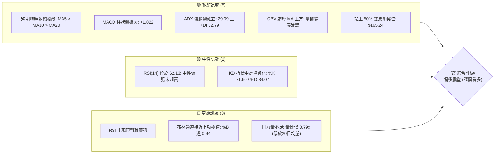
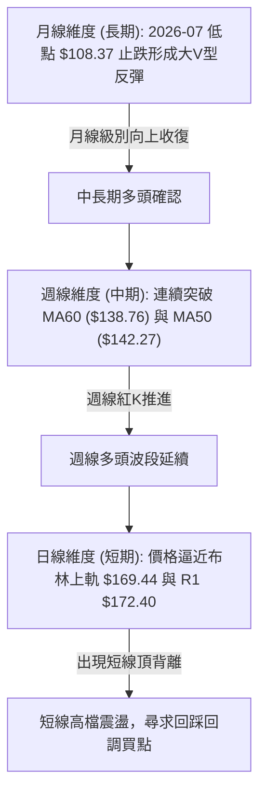
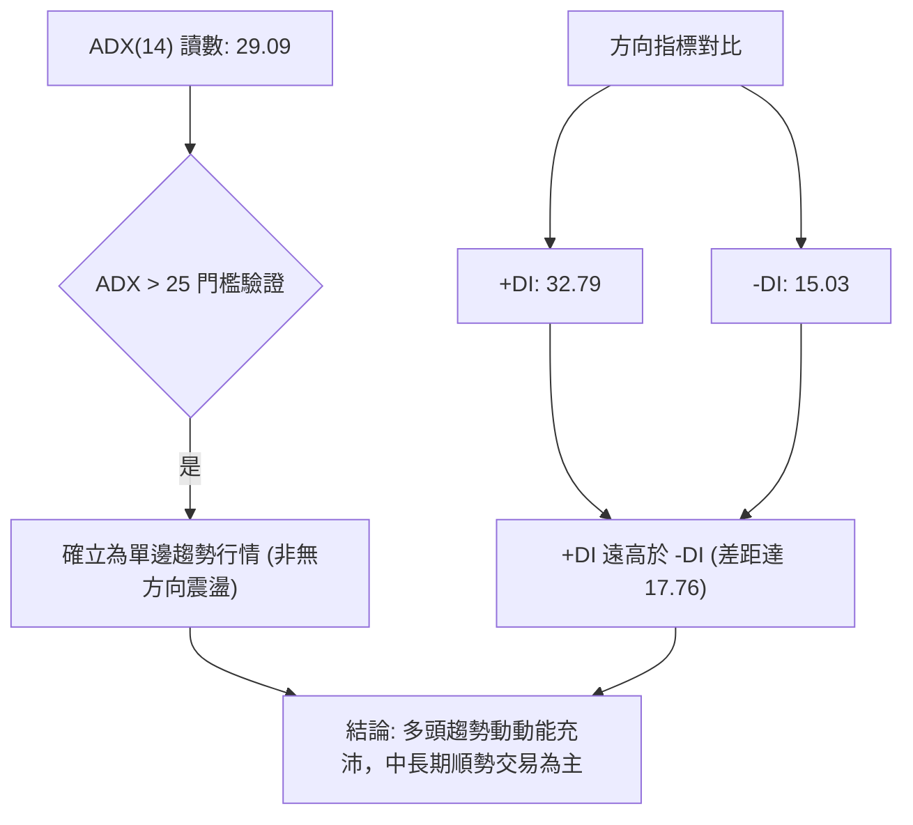
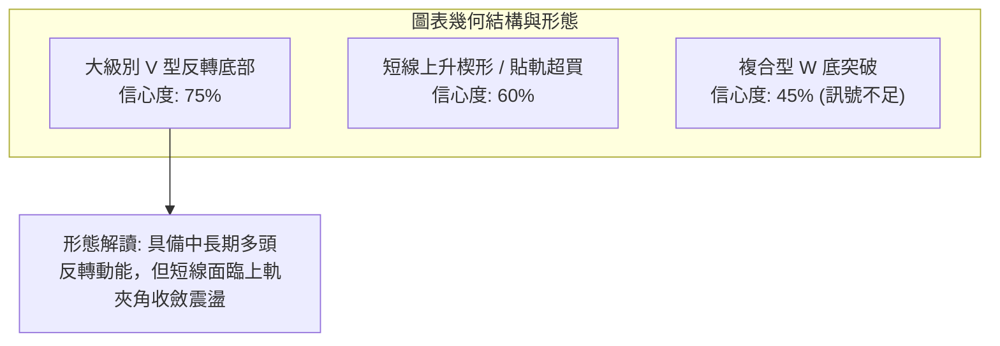
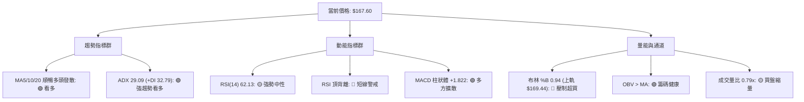
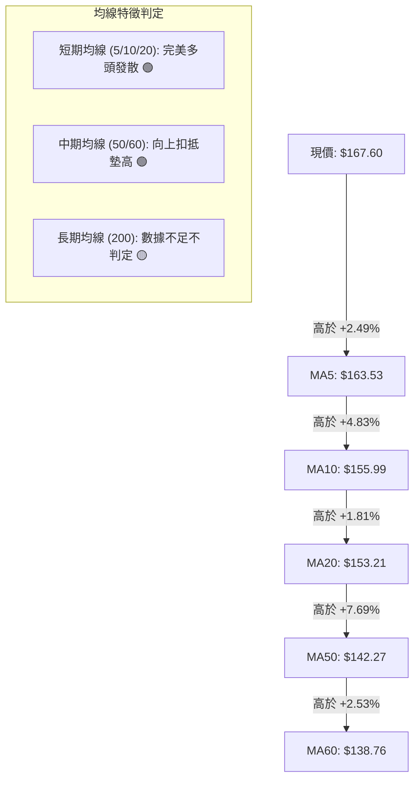
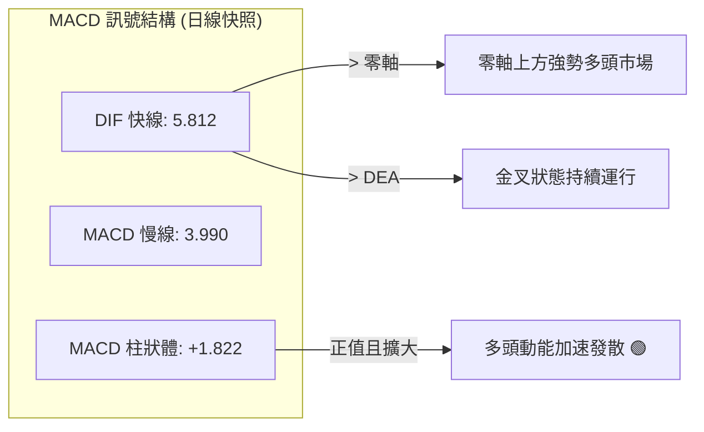
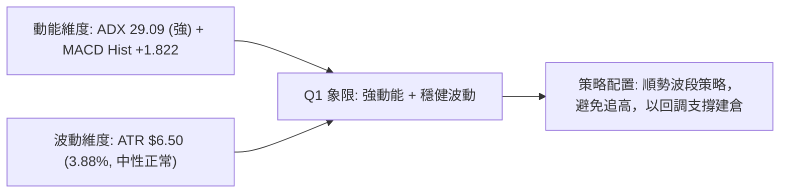
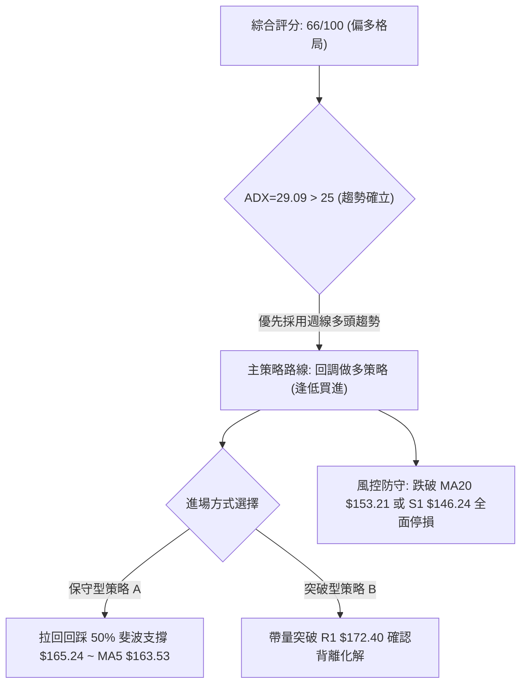
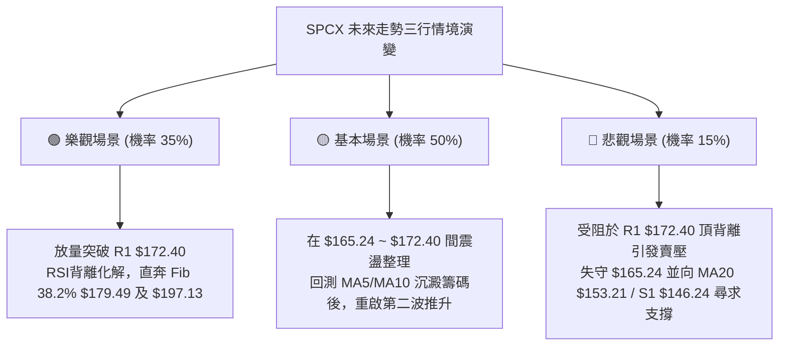

# SPCX 技術分析報告

> **報告日期**：2026-10-08 ｜ **語言**：繁體中文 ｜ **數據來源**：Yahoo Finance ｜ **當前價格**：$167.60

---

## 目錄

| 章節 | 內容 |
|------|------|
| [1. 技術面概覽](#1-技術面概覽) | 訊號儀表板、核心指標、評分卡 |
| [2. 趨勢分析](#2-趨勢分析) | 多時框趨勢、長中短期走勢 |
| [3. 圖表形態分析](#3-圖表形態分析) | 形態識別、K線組合、目標價 |
| [4. 支撐與阻力](#4-支撐與阻力) | 關鍵價位、斐波那契回調 |
| [5. 技術指標深度解讀](#5-技術指標深度解讀) | MA/RSI/MACD/布林/成交量 |
| [6. 動能與波動率](#6-動能與波動率) | 動能評估、ATR、Beta |
| [7. 多時框架總結](#7-多時框架總結) | 時框架評分矩陣 |
| [8. 交易策略建議](#8-交易策略建議) | 多空策略、風險報酬比 |
| [9. 風險提示與監控](#9-風險提示與監控) | 監控指標、風險場景 |

---

## 1. 技術面概覽

### 🎯 技術訊號儀表板



### 📊 核心指標速覽表

| 指標類別 | 指標名稱 | 當前數值 | 訊號 | 解讀 |
|----------|----------|----------|------|------|
| **價格** | 當前價格 | $167.60 | 🟢 | 位於52週區間52.0%，自低點$104.83反彈回升 |
| **均線** | MA20 | $153.21 | 🟢 | 價格在MA20上方+9.39%，多頭支撐明確 |
| **均線** | MA50 | $142.27 | 🟢 | 價格在MA50上方+17.80%，中期多頭排列 |
| **均線** | MA200 | 數據不足 | 🟡 | 歷史數據未滿200日，無法判定長期年線 |
| **動能** | RSI(14) | 62.13 | 🟡 | 位於50-70強勢區，但日線偵測到頂背離 |
| **動能** | MACD | 5.812 / 柱 +1.822 | 🟢 | 快慢線均在零軸上方，柱狀體翻正擴散 |
| **趨勢** | ADX(14) | 29.09 (+DI 32.79) | 🟢 | ADX>25確立強趨勢，+DI佔據絕對優勢 |
| **通道** | 布林 %B | 0.94 (上軌 $169.44) | 🔴 | 價格貼近上軌極值，短線乖離面臨修正壓力 |
| **量能** | 成交量比 | 0.79x | 🟡 | 當日量77.12M低於20日均量97.41M，量價微幅背離 |
| **波動** | ATR(14) | $6.50 (3.88%) | 🟡 | 每日平均震幅適中，設定停損空間充足 |

### 🏆 技術評分卡

```
╔══════════════════════════════════════════════════════════════╗
║                技術評分卡 — SPCX (2026-10-08)                ║
╠══════════════════════════════════════════════════════════════╣
║ 趨勢強度 (ADX/DI)   ██████████████░░░░░░  72/100  🟢 偏強    ║
║ 動能指標 (RSI/MACD) ████████████░░░░░░░░  60/100  🟡 頂背離  ║
║ 支撐穩定度 (S階梯)  ██████████████░░░░░░  70/100  🟢 紮實    ║
║ 成交量配合 (OBV/VOL)██████████░░░░░░░░░░  52/100  🟡 量縮    ║
║ 形態完整度 (波段反轉)████████████░░░░░░░░  63/100  🟢 破頸回升║
║ 均線排列 (短中均線) ████████████████░░░░  80/100  🟢 多頭    ║
╠══════════════════════════════════════════════════════════════╣
║ 綜合評分            █████████████░░░░░░░  66/100  偏多格局   ║
╚══════════════════════════════════════════════════════════════╝
```

---

## 2. 趨勢分析

### 🌐 多時框趨勢分析



### 📈 長期趨勢 — 12個月走勢圖（Unicode）

```
SPCX 月線收盤走勢示意圖（2025-11 至 2026-10）
價格軸 ($)
$225.64 ┤                           ● (52W High $225.64)
$200.00 ┤                          / \
$175.00 ┤   ●                     /   \                     ● $170.86       ● 現價 $167.60
$150.00 ┤    \                   /     \                   / \             /
$125.00 ┤     \                 /       \                 /   \     ● $143.69  ● $150.86
$104.83 ┤      ●───────────────●         \               /     \   /
$100.00 ┤    (歷史波段低點聚類)            ● (2026-07 $108.37)  ● (52W Low $104.83)
        └─────────────────────────────────────────────────────────────────────────────
         M-11 M-10 M-09 M-08 M-07 M-06  M-05  M-04  M-03   M-02   M-01  當前 (2026-10)
```

#### 走勢特徵分析表格

| 階段區間 | 起訖價位 | 漲跌幅 | 結構特徵與技術解讀 |
|----------|----------|--------|-------------------|
| 2026-06 頂部回撤 | $170.86 → $108.37 | -36.57% | 快速恐慌性拋售，灌破所有短期均線，觸及52W低點區間 |
| 2026-07 低檔築底 | $108.37 (波段低 $104.83) | 築底完畢 | 週線 RSI 降至 15.9 極端超賣區，空頭動能竭盡 |
| 2026-08 暴力反彈 | $108.37 → $143.69 | +32.59% | 週成交量爆出 9.20 億股巨量，V型翻揚站回 MA60 |
| 2026-09 震盪推升 | $143.69 → $150.86 | +4.99% | 消化獲利賣壓，均線重新黃金交叉向上發散 |
| 2026-10 攻堅突破 | $150.86 → $167.60 | +11.10% | 成功收復 50% 斐波那契回調位 $165.24，逼近 06月高點阻力 |

### 📊 中期趨勢（週線分析）

```
SPCX 近期週線壓力與支撐階梯圖
$179.49 ────────────────────────────────────────── 斐波那契 38.2% 回調阻力位
                 ▲
$172.40 ═════════╪════════════════════════════════ R1 波段高點阻力 (短線防線)
                 │  ▲ 現價 $167.60 (逼近布林上軌 $169.44)
$165.24 ─────────┴──┼───────────────────────────── 斐波那契 50.0% 回調位 (轉化為強支撐)
                    │
$153.21 ────────────┴───────────────────────────── MA20 / 布林中軌支撐
$146.24 ══════════════════════════════════════════ S1 近期波段支撐位
```

### ⚡ 趨勢強度評估（ADX 解讀）



| 指標名稱 | 當前數值 | 門檻標準 | 狀態判定 | 交易指引 |
|----------|----------|----------|----------|----------|
| ADX (14) | 29.09 | > 25.00 | 強趨勢確立 🟢 | 禁用單純區間震盪策略，適用回調做多順勢策略 |
| +DI (14) | 32.79 | > 20.00 | 多方絕對優勢 🟢 | 多頭掌控盤面主導權 |
| -DI (14) | 15.03 | < 20.00 | 空方力量衰退 🟢 | 賣方未具備打壓盤勢之連續動能 |

---

## 3. 圖表形態分析

### 🔍 形態識別系統



#### 形態識別與信心度評估表

| 形態類別 | 信心度 | 判斷依據（引用數據） | 完成度 | 目標價（附計算式） |
|----------|--------|----------------------|--------|--------------------|
| **V型反轉波段底部** | 75% | 7月觸及 $108.37（52W低點 $104.83）後放量大漲至 $143.69，突破MA20/50 | 100% (已完成) | 形態高度 = 頸線 $142.87 - 谷底 $104.83 = $38.04。<br/>測幅目標 = $142.87 + $38.04 = **$180.91**（接近斐波 38.2% $179.49） |
| **上升楔形收斂 (日線)** | 60% | 價格創波段高 $167.60，但日線 RSI 出現頂背離，且 BB %B 達 0.94 | 80% (進行中) | 若向下回踩，楔形下軌支撐回測 MA20 **$153.21** 或 S1 **$146.24** |
| **雙底形態 (W-Bottom)** | 45% | 數據中僅有 7月單一深谷 $108.37，缺乏對稱第二底 | 訊號不足 | 數據不足以支撐幾何雙底，僅作指標型均線多頭發散解讀 |

### 🕯️ 重要K線形態分析

| 日期 / 週別 | 收盤價 | K線形態特徵 | 技術意涵解讀 | 訊號 |
|-------------|--------|-------------|--------------|------|
| 2026-08-02 | $108.37 | 低檔長下影垂死墓碑底 | RSI 19.2 嚴重超賣，賣壓於 $104.83 處全面耗竭 | 🟢 長期落底 |
| 2026-08-09 | $133.11 | 週線大陽線 (週量 9.20億) | 實體大長紅包覆，強勁主動買盤進駐，扭轉空頭格局 | 🟢 破頸轉強 |
| 2026-09-27 | $148.68 | 縮量洗盤回踩陰線 | 回測 MA20 獲得強支撐，量縮代表籌碼鎖定良好 | 🟢 健康回踩 |
| 2026-10-11 | $167.60 | 沿布林上軌推升實體陽線 | 強勢突破 50% 斐波位 $165.24，逼近 R1 $172.40 | 🟡 多頭夾帶背離 |

### 📉 ASCII 走勢形態示意圖

```
SPCX 2026-07 至 2026-10 底部反轉形態演進圖
$172.40 ┤                                                 [R1 強壓區]
$167.60 ┤                                           ▲ 現價 $167.60 (背離微引動)
$160.00 ┤                                   ▲  /
$150.00 ┤                             /────┴──/ (9月回踩 MA20 $153.21)
$142.87 ┤═══════════════════════[頸線突破點 S2]═══════════════════════
$130.00 ┤                  ▲   /
$120.00 ┤            ▲    / 
$108.37 ┤      ▲    /
$104.83 ┴──────┴────┴ (V型反轉谷底點 2026-07)
```

---

## 4. 支撐與阻力

### 🗺️ 關鍵價位分布圖（Unicode）

```
SPCX 價位結構分布圖（嚴格遵循 OHLCV 計算聚類價位）
════════════════════════════════════════════════════════════════════
$225.64 ║████████████████████████████████████████║ 52W 最高點 (0.0%)
$197.13 ║████████████████████████                ║ 斐波那契 23.6% 回調位
$179.49 ║████████████████████                    ║ 斐波那契 38.2% 回調位
$172.40 ║████████████████████████████████        ║ 強阻力位 R1 (近一年波段高點聚類)
$169.44 ║▓▓▓▓▓▓▓▓▓▓▓▓▓▓▓▓▓▓▓▓▓▓▓▓▓▓▓▓▓▓        ║ 布林通道上軌
$167.60 ╠════════════════════════════════════════╣ ◄ 當前市價 ($167.60)
$165.24 ║▓▓▓▓▓▓▓▓▓▓▓▓▓▓▓▓▓▓▓▓                    ║ 斐波那契 50.0% 回調轉化支撐
$153.21 ║████████████████████                    ║ BB中軌 / MA20 動態防線
$146.24 ║████████████████████████████████        ║ 關鍵支撐 S1 (近一年波段低點聚類)
$142.87 ║████████████████████████                ║ 強支撐 S2 (波段頸線聚類)
$130.39 ║████████████████████████████████████    ║ 核心波段防守 S3
$104.83 ║████████████████████████████████████████║ 52W 最低點 (100.0%)
════════════════════════════════════════════════════════════════════
```

### 🚧 阻力位分析表

| 阻力級別 | 價位 | 形成原因 | 突破難度 | 重要性 |
|----------|------|----------|----------|--------|
| **R1** | **$172.40** | 近一年波段高點密集聚類區（距離現價僅 +2.86%），逢高解套賣壓集中 | 🟡 中偏高 | ★★★★★ (短線多空分水嶺) |
| **Fib 38.2%** | **$179.49** | 52週區間黃金分割壓力，同時為 V型反轉測幅目標區 ($180.91) | 🔴 高 | ★★★★☆ (波段擴展目標) |
| **Fib 23.6%** | **$197.13** | 下跌波段反彈強阻力區，接近 $200 整數心理防線 | 🔴 極高 | ★★★☆☆ (中期多頭目標) |

### 🛡️ 支撐位分析表

| 支撐級別 | 價位 | 形成原因 | 守住機率 | 重要性 |
|----------|------|----------|----------|--------|
| **Fib 50.0%** | **$165.24** | 52週區間正中軸，突破後已形成首道動態回踩支撐位 | 75% | ★★★★☆ (短線防守第一道) |
| **MA20 / 中軌**| **$153.21** | 20日均線扣抵向上，布林通道中軌生命線 | 80% | ★★★★★ (中期多頭基石) |
| **S1** | **$146.24** | 近一年波段低點聚類區（距離現價 -12.75%），波段主力防守區 | 85% | ★★★★★ (強支撐分水嶺) |
| **S2** | **$142.87** | 波段起漲突破頸線，緊貼 MA50 ($142.27) | 90% | ★★★★☆ (趨勢保護底線) |
| **S3** | **$130.39** | 近一年密集整理底座聚類，跌破將引發結構翻空 | 95% | ★★★☆☆ (終極波段防守) |

### 📐 斐波那契回調位分析

*基準：52週波段區間 $104.83 (100.0%) → $225.64 (0.0%)，總落差 $120.81*

```
0.0%  ───────── $225.64 (52W High)
23.6% ───────── $197.13
38.2% ───────── $179.49
                ▲ 當前價格 $167.60 (位於 38.2% 與 50.0% 之間)
50.0% ───────── $165.24 (已成功站上確認)
61.8% ───────── $150.98
78.6% ───────── $130.68
100.0%───────── $104.83 (52W Low)
```

**解讀**：現價 $167.60 穩居 **50.0% 回調位 ($165.24)** 之上，技術上代表原本由 $225.64 下跌至 $104.83 的空頭波段已修復過半，盤勢從「超跌反彈」正式升格為「多頭主導結構」。上方第一道斐波目標為 **38.2% 的 $179.49**，回踩關鍵防守點為 **$165.24**。

---

## 5. 技術指標深度解讀

### 🎛️ 指標訊號總覽



### 📈 移動平均線排列分析



| 均線天期 | 當前數值 | 與現價乖離 | 走勢斜率 | 技術意涵 |
|----------|----------|------------|----------|----------|
| MA 5 | $163.53 | +2.49% | 急陡向上 ▅▆██ | 超短期推升動能強勁，為極短線防守線 |
| MA 10 | $155.99 | +7.44% | 向上翻揚 ▆▆▇██ | 短線拉回第一層重要承接支撐 |
| MA 20 | $153.21 | +9.39% | 穩定走高 ▆▇▇███ | 月線生命線，布林帶中軌，中期多頭堡壘 |
| MA 50 | $142.27 | +17.80% | 走揚扣低 | 季線轉多，確立大波段多方趨勢 |
| MA 60 | $138.76 | +20.78% | 落底揚升 ▁▁▂▃ | 支撐中長線資金回流 |
| MA 200 | 數據中未偵測到 | N/A | N/A | 資料不足，需要240筆數據，不做捏造 |

### 📉 RSI(14) 分析

```
RSI(14) 讀數：62.13
0 ──────────── 30 ──────────────────────── 62.13 ── 70 ────────── 100
[   超賣區   ]    [       中性強勢區       ▲     ]   [  超買警戒區  ]
進度條：████████████████████████░░░░░░░░░░  62.13%
```

#### 背離警訊深度剖析
- **頂背離判定（Bearish Divergence）**：⚠️ **確認存在**。
  - **價格走勢**：10月第一週價格由 $158.96 攀升至 $167.60，突破前高創下近三個月新高。
  - **指標走勢**：9月13日當週收盤價僅 $151.21 時，RSI 達到高點 **68.0**；然而當前價格推升至 $167.60 時，RSI 僅錄得 **62.13**。
  - **結論**：價格創新高而 RSI 峰值下降，顯示買盤推升邊際力道衰退，**切忌於目前價位追高**，須慎防拉回回測均線。

### 📊 MACD(12/26/9) 訊號解讀



週線指標亦印證 MACD 柱狀體翻正（由 9/27 的 -0.567 轉至 10/11 的 **+1.822**），證實波段攻擊動能尚未結束，雖有 RSI 頂背離壓制，但 MACD 趨勢指標目前未見死叉訊號，趨勢依然受保護。

### 📦 布林通道分析

```
SPCX 布林通道 (20, 2) 結構圖
$169.44 ────────────────────────────────────────── 布林上軌 (強壓區)
$167.60 ══════════════════════════════════════════ ◄ 現價 (BB %B = 0.94)
$153.21 ────────────────────────────────────────── 布林中軌 (MA20 生命線)
$136.99 ────────────────────────────────────────── 布林下軌 (極端支撐)
```

**通道特徵**：
1. **%B 指標達 0.94**：極度貼近上軌 $169.44。技術統計中，%B > 0.80 進入超買區域，> 0.90 常引發短線震盪或向中軌拉回。
2. **通道開口**：帶寬擴大，上軌向上延伸，表示波動正在釋放，為標準的多頭推進通道，只要不帶量長黑摜破中軌 $153.21，趨勢結構保持完好。

### 💹 成交量分析（量價配合度）

```
成交量對比
當日成交量:  ███████████████░░░░░ 77.12M (量比 0.79x)
20日均量:   ████████████████████ 97.41M
50日均量:   ████████████████████ 100.11M
OBV 趨勢:   OBV > MA20 (主力籌碼持續沈澱，未見主力棄守跡象 🟢)
```

**量價解讀**：
- **量縮價漲現象**：今日上漲逼近 $167.60，但成交量僅 77.12M，低於20日均量。此現象印證了 RSI 的頂背離，說明追價買盤在逼近 R1 $172.40 前夕趨於謹慎。
- **籌碼面穩定**：OBV 指標持續位於其均線之上，說明雖然追價意願保守，但低檔籌碼鎖定度極佳，並未引發調節賣壓。

---

## 6. 動能與波動率

### ⚡ 動能評估四象限

| 象限區間 | 動能特徵 | 波動特徵 | SPCX 當前狀態 | 技術診斷與操作意涵 |
|----------|----------|----------|---------------|-------------------|
| **第一象限 (Q1)** | 強動能 (ADX>25, MACD+) | 低/適中波動 (ATR 3.88%) | **✓ SPCX 命中** | **順勢擴展期**：趨勢主導明確且波動受控，回調即為買點 |
| **第二象限 (Q2)** | 弱動能 | 低波動 | — | 盤整蓄勢期：觀望或區間高出低進 |
| **第三象限 (Q3)** | 強動能 | 極高波動 (ATR>6%) | — | 主升/主跌爆發期：高風險高回報，容易出現洗盤 |
| **第四象限 (Q4)** | 弱動能 | 高波動 | — | 無序震盪洗盤：嚴禁持倉，最易被雙巴 |



### 📊 ATR 波動率分析

- **ATR(14) 讀數**：**$6.50**（佔現價比率 **3.88%**）
- **單日正常波動範圍**：現價 $167.60 ± $6.50 → **[$161.10 - $174.10]**
- **風控止損空間設定標準**：
  - **保守型止損（1.5 × ATR）**：$6.50 × 1.5 = **$9.75** → 止損價可設於 $167.60 - $9.75 = **$157.85**
  - **波段型止損（2.0 × ATR）**：$6.50 × 2.0 = **$13.00** → 止損價可設於 $167.60 - $13.00 = **$154.60**（緊密貼合 MA20 $153.21 強支撐）

### 📐 Beta 與市場相關性

- **Beta 狀態**：數據顯示為 `N/A`（歷史上市交易時間未滿期或未登錄），實務上新興航太防衛板塊通常呈現高彈性特徵。
- **空頭部位狀態**：
  - **Short Ratio (放空補回天數)**：**2.07 天**
  - **Short % Float (放空流通比例)**：**2.4%**
  - **解讀**：放空比例極低（僅 2.4%），顯示市場未累積龐大融券放空部位，無即時空頭踩踏（Short Squeeze）預期，行情推升完全仰賴多方基本買盤。

---

## 7. 多時框架總結

### 📋 時框架評分表

| 時框架 | 趨勢方向 | 動能狀態 | 均線排列 | 圖表形態 | 綜合評分 | 操作指引 |
|--------|----------|----------|----------|----------|----------|----------|
| **長期 (月線)** | 偏多 🟢 | 震盪翻揚 🟢 | 資料不足(無MA200) | V型底部展開 | **68 / 100** | 長線持有，多頭修復過半 |
| **中期 (週線)** | 強多 🟢 | MACD金叉擴大 🟢 | MA50/60向上突破 🟢 | 站上 50% 斐波位 | **75 / 100** | 波段持股續抱，以回踩加碼 |
| **短期 (日線)** | 震盪偏多 🟡 | RSI頂背離 / %B 0.94 🔴 | MA5>10>20多頭排列 🟢 | 逼近 R1 $172.40 | **58 / 100** | 短線禁止追高，等待短壓化解 |

### 🔲 綜合訊號矩陣

```
時框訊號一致性檢驗：
長期方向 (月)  ─────► 🟢 偏多 (落底回升)
中期方向 (週)  ─────► 🟢 強多 (波段主攻)
短期方向 (日)  ─────► 🟡 中性微空 (指標過熱與頂背離)
一致性評估   ─────► 中長趨勢與短期拉回產生典型衝突
```

### ⚖️ 多時框收斂結論

依「多時框收斂規則 14」進行多空最終裁決：
1. **行情性質驗證**：**ADX(14) = 29.09 > 25**，**明確判定當前為單邊「趨勢行情」**，而非區間盤整行情。
2. **主導權重判定**：趨勢行情中，優先級以**中長期（週線 / MA50 / 斐波那契回調結構）為主導方向**，日線級別的指標背離只用來尋找拉回進場時機，不可單憑日線背離逆勢大幅做空。
3. **收斂結論**：**整體格局定調為「中長期多頭主導下的短線高檔震盪整理」（偏多）**。第 8 章交易策略嚴格遵循此結論，以**拉回逢低做多**為主策略，空方僅保留作為風險防守對沖提示。

---

## 8. 交易策略建議

### 🗺️ 策略決策流程圖



### 🧭 策略路由（依評分卡分流）

> **當前主策略方向 = 主推多頭策略（依技術評分卡綜合評分 66/100 ≥ 60，偏多主導）**  
> 空頭策略僅列為「反轉風險觸發點（對沖提示）」，嚴禁在強趨勢中逆勢猜頂做空。

### 🎯 價格情境階梯（Price Scenarios）

*所有價位嚴格引用第 4 章聚類與斐波那契數據*

| 觸發條件 | 下一目標 | 後續延伸 | 情境含義 |
|----------|----------|----------|----------|
| **強勢突破 R1 $172.40** | **Fib 38.2% $179.49** | **Fib 23.6% $197.13** | 短線頂背離遭強大買盤強行化解，波段主升浪展開 |
| **現價 $167.60 區間震盪** | **回測 Fib 50% $165.24** | **回測 MA20 $153.21** | 消化布林上軌與頂背離賣壓，以時間換取空間 |
| **失守支撐 S1 $146.24** | **測試 S2 $142.87** | **測試 S3 $130.39** | 中期多頭架構遭到破壞，趨勢轉向深度整理 |

### 📊 情境機率分佈

| 情境劇本 | 機率 | 主要依據 |
|----------|------|----------|
| **情境一：短線回踩後延續上攻** | **55%** | ADX 29.09 強趨勢、MACD 柱狀體維持正向發散、OBV 籌碼沈澱支撐 |
| **情境二：高檔強勢橫盤整理** | **30%** | RSI(14) 頂背離抑制追價力道、布林通道 %B 0.94 上軌壓制，需要量能補足 |
| **情境三：深度拉回破線反轉** | **15%** | 除非突發利空摜破 MA20 $153.21 與 S1 $146.24，否則機率較低 |

### 🟢 主策略詳情（多頭買進策略）

| 策略要素 | 策略 A：穩健回調低接買進 (Primary) | 策略 B：突破加碼強勢追擊 (Secondary) |
|----------|-----------------------------------|-------------------------------------|
| **進場條件** | 價格拉回回踩 50% 斐波支撐或 MA5，日K收下影線止跌 | 日K帶量長紅實體收盤正式突破關鍵阻力 R1 |
| **進場價格** | **$165.24**（50.0% 斐波回調位） | **$172.50**（突破 R1 $172.40 確認） |
| **目標價 T1** | **$172.40**（測試波段高點 R1） | **$179.49**（斐波那契 38.2% 回調位） |
| **目標價 T2** | **$179.49**（斐波那契 38.2% 回調位） | **$197.13**（斐波那契 23.6% 回調位） |
| **止損價格** | **$157.85**（跌破進場點 1.5×ATR，防守 MA10） | **$165.24**（假突破跌回 50% 斐波支撐） |
| **風險報酬比** | **1 : 1.93**（冒險 $7.39，獲利至 T2 $14.25） | **1 : 3.39**（冒險 $7.26，獲利至 T2 $24.63） |
| **成功機率** | **65%** | **55%** |
| **建議倉位** | **15% 總資金** | **10% 總資金** |

### 🔴 反向風險觸發點（對沖提示）

若市場出現以下反向破位訊號，主多頭策略失效，建議多單無條件離場並啟動對沖：
1. **關鍵價位跌破**：若日收盤價跌破 **MA20 / 布林中軌 $153.21**，宣告多頭推進節奏中斷；若進一步灌破 **S1 $146.24**，趨勢正式轉弱。
2. **量價異動確認**：若爆出單日成交量大於 1.2 億股之巨量長黑K線，且 MACD 柱狀體由正翻負並形成死叉。

### ⭐ 整體訊號強度評星

```
做多訊號強度：★★★★☆  (4/5星)  — 均線排列完美、ADX強趨勢、MACD擴散
做空訊號強度：★★☆☆☆  (2/5星)  — 僅為指標頂背離與短線超買，無結構性破位
整體可信度：  ★★★★☆  (4/5星)  — 中長期多時框共振良好，指標互相確認度高
```

---

## 9. 風險提示與監控

### ✅ 關鍵監控指標 Checklist

```
╔══════════════════════════════════════════════════════════════╗
║                   每日交易風控監控清單 (Checklist)           ║
╠══════════════════════════════════════════════════════════════╣
║ [ ] 價位監控：現價是否守穩 50% 斐波位 $165.24？            ║
║ [ ] 阻力測試：衝擊 R1 $172.40 時成交量是否突破 97.41M(均量)？║
║ [ ] 背離化解：RSI(14) 是否突破前高 68.0 以化解頂背離警訊？   ║
║ [ ] 均線動態：價格是否持續運行於 MA20 ($153.21) 之上？       ║
║ [ ] 趨勢強度：ADX(14) 讀數是否維持在 25.00 以上？           ║
║ [ ] 波動異常：單日震幅是否突破 2×ATR ($13.00) 異常放大？     ║
╚══════════════════════════════════════════════════════════════╝
```

### ⚠️ 風險場景分析



### 🛡️ 風險管理重要提醒

1. **嚴防高檔追價陷阱**：目前價格處於布林帶上軌極值（%B = 0.94）且伴隨 RSI 頂背離，現價直接以市價重倉追高極易承受日內回撤壓力。應嚴格恪守「回調至支撐位進場」的紀律。
2. **嚴格執行 ATR 止損機制**：單筆交易虧損嚴禁超過帳戶總資產的 1.5%–2.0%。依據當前 ATR $6.50，波段停損空間建議保持在 $9.75 ~ $13.00 之間，切勿隨意向下攤平。
3. **分析師共識與估值安全感**：目前華爾街 27 位分析師綜合評級為 **Buy**，平均目標價高達 **$224.56**（溢價 +33.98%），基本面與法人預期對中長期技術面提供堅實護城河，持股應保持波段耐心，避免被短線震盪洗盤洗出場。

---

## 📋 報告總結

```
╔══════════════════════════════════════════════════════════════════╗
║                     SPCX 技術分析報告總結                        ║
╠══════════════════════════════════════════════════════════════════╣
║ 報告日期：2026-10-08                                            ║
║ 當前價格：$167.60                                                ║
║ 分析評級：🟢 偏多格局 (綜合評分: 66/100，中長趨勢強多，短線防拉回)║
╠══════════════════════════════════════════════════════════════════╣
║ 關鍵結論：                                                       ║
║ ├─ 長期趨勢：🟢 落底回升，月線大V反轉，收復 50% 斐波那契回調位   ║
║ ├─ 中期趨勢：🟢 週線 MACD 翻正擴散，MA50/60 轉化為下檔堅固支撐  ║
║ ├─ 短期趨勢：🟡 短線均線多頭發散，但 RSI 出現頂背離，逼近上軌   ║
║ ├─ 關鍵支撐：$165.24 (Fib 50.0%) / $153.21 (MA20) / $146.24 (S1)║
║ ├─ 關鍵阻力：$172.40 (R1 波段高) / $179.49 (Fib 38.2%)         ║
║ └─ 分析師目標：$224.56 (Mean Target，潛在上行空間 +33.98%)      ║
╠══════════════════════════════════════════════════════════════════╣
║ 最優策略組合：                                                   ║
║ 1. 🥇 最佳機會：回調至 $165.24 支撐布局多單，停損 $157.85        ║
║ 2. 🥈 次選機會：帶量實體紅K突破 R1 $172.40 順勢加碼，看 $179.49║
║ 3. 🥉 保守選擇：等待股價拉回測試 MA20 ($153.21) 止跌再行進場   ║
╚══════════════════════════════════════════════════════════════════╝
```

---

> ⚠️ **免責聲明**：本報告為 AI 自動生成之技術分析，所有數據及估算均基於提供的歷史價格資訊。本報告**僅供研究與學術參考**，**不構成任何投資建議**。投資有風險，入市需謹慎。

---

*報告生成時間：2026-10-08 ｜ 數據來源：Yahoo Finance ｜ 分析框架：多時框技術分析*