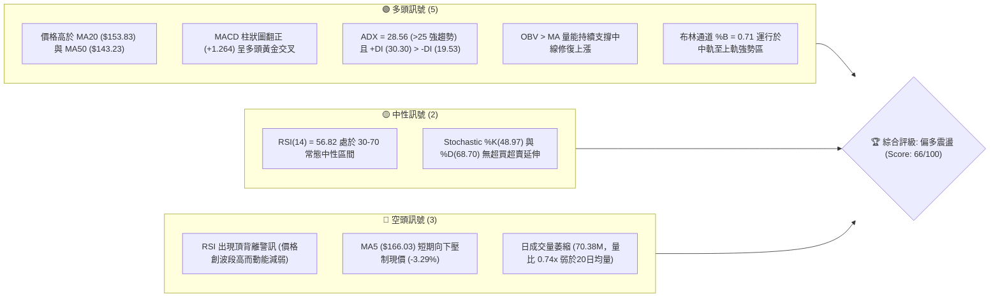
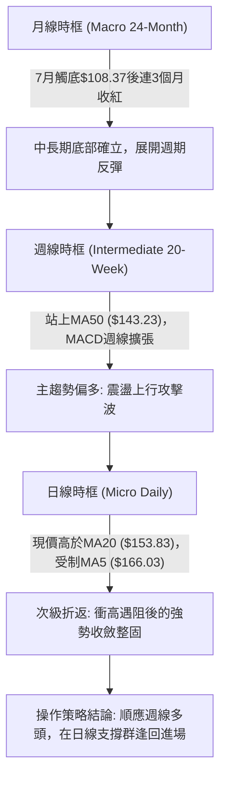
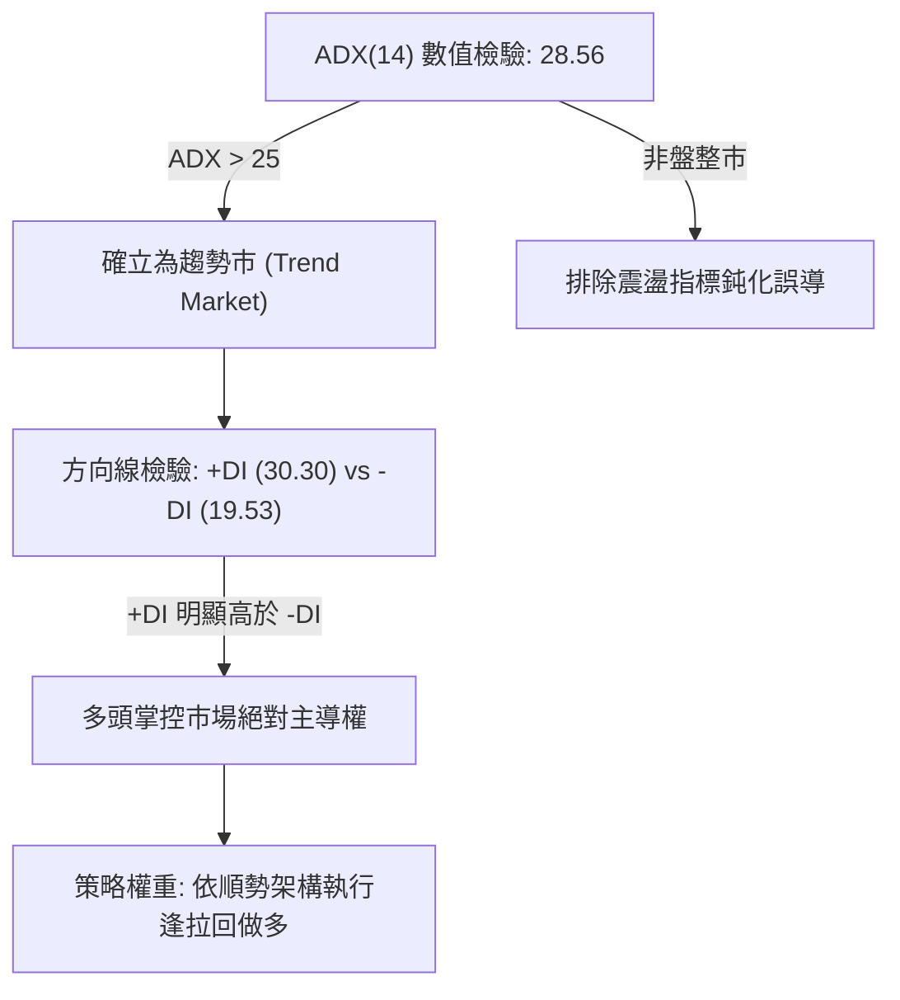
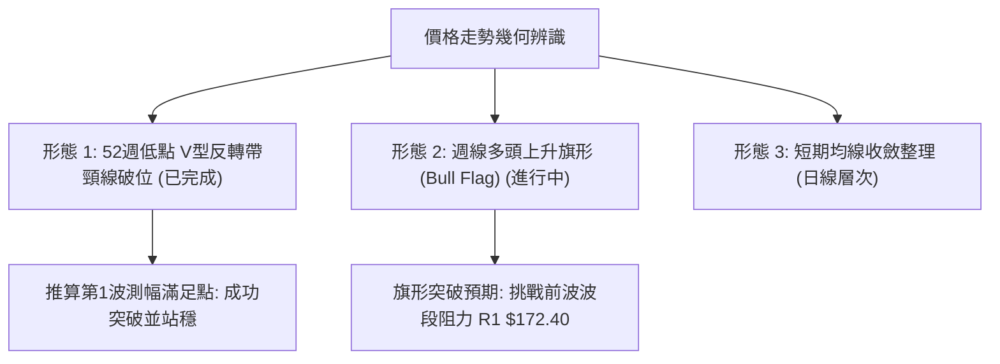
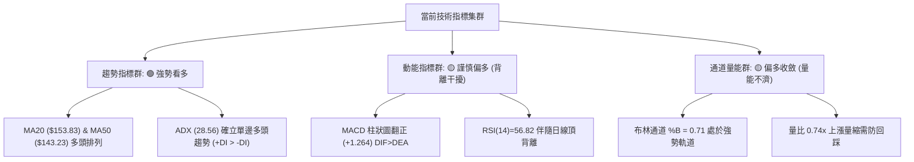
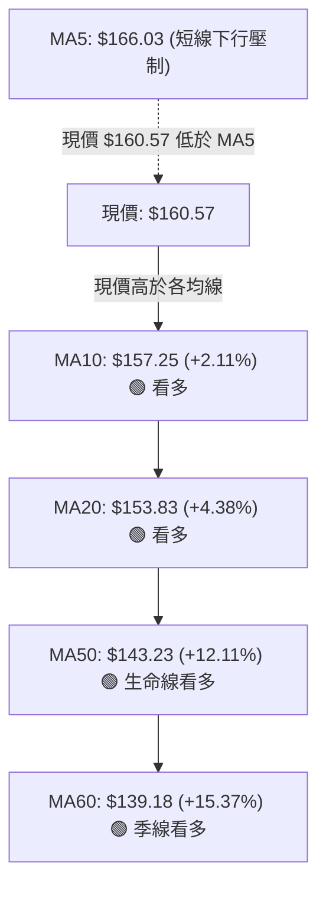
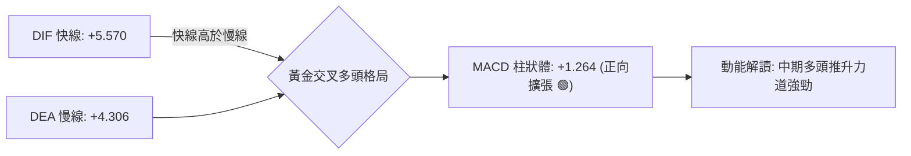
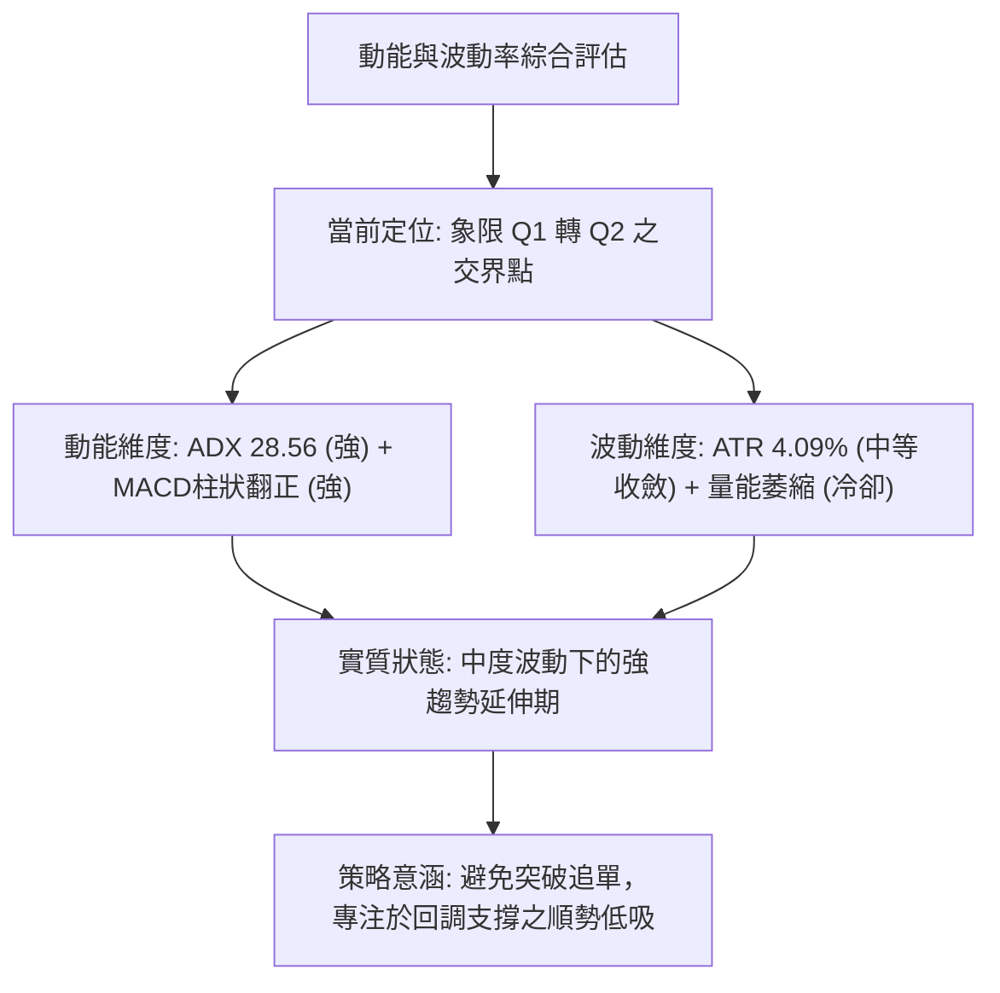
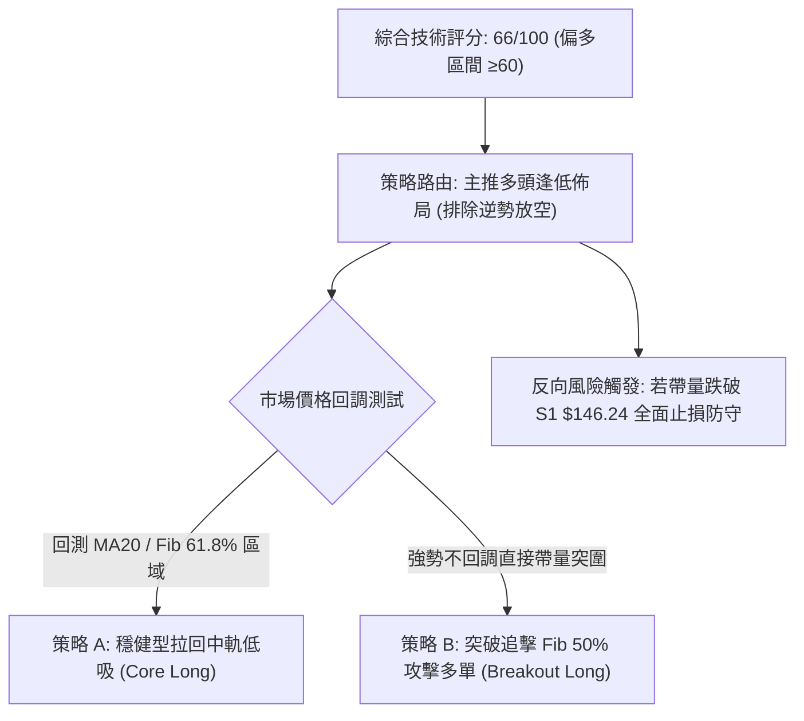
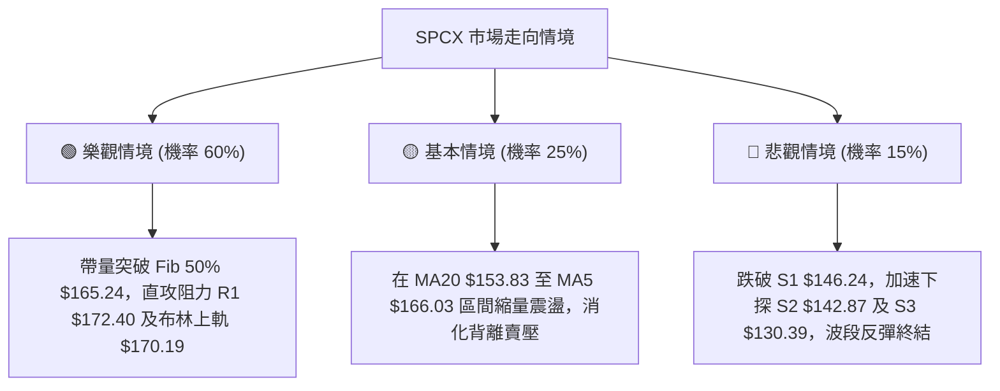

# SPCX 技術分析報告

> **報告日期**：2026-10-09 ｜ **語言**：繁體中文 ｜ **數據來源**：Yahoo Finance ｜ **當前價格**：$160.57

---

## 目錄

| 章節 | 內容 |
|------|------|
| [1. 技術面概覽](#1-技術面概覽) | 訊號儀表板、核心指標、評分卡 |
| [2. 趨勢分析](#2-趨勢分析) | 多時框趨勢、長中短期走勢 |
| [3. 圖表形態分析](#3-圖表形態分析) | 形態識別、K線組合、目標價 |
| [4. 支撐與阻力](#4-支撐與阻力) | 關鍵價位、斐波那契回調 |
| [5. 技術指標深度解讀](#5-技術指標深度解讀) | MA/RSI/MACD/布林/成交量 |
| [6. 動能與波動率](#6-動能與波動率) | 動能評估、ATR、Beta |
| [7. 多時框架總結](#7-多時框架總結) | 時框架評分矩陣 |
| [8. 交易策略建議](#8-交易策略建議) | 多空策略、風險報酬比 |
| [9. 風險提示與監控](#9-風險提示與監控) | 監控指標、風險場景 |
| [10. 報告總結](#10-報告總結) | 核心結論與策略彙整 |

---

## 1. 技術面概覽

### 🎯 技術訊號儀表板



### 📊 核心指標速覽表

| 指標類別 | 指標名稱 | 當前數值 | 訊號 | 解讀 |
|----------|----------|----------|------|------|
| **價格** | 當前收盤價 | $160.57 | 🟢 | 站穩中短期均線群上方，自7月低點反彈趨勢延續中 |
| **均線** | 短期 MA5 | $166.03 | 🔴 | 現價低於 MA5 達 3.29%，短線存在超短週期修正壓力 |
| **均線** | 短期 MA10 | $157.25 | 🟢 | 現價高於 MA10 達 2.11%，提供短線下檔首道動態支撐 |
| **均線** | 中期 MA20 | $153.83 | 🟢 | 站上布林中軌/MA20 (+4.38%)，中期結構多頭排列 |
| **均線** | 中期 MA50 | $143.23 | 🟢 | 站上中期生命線 (+12.11%)，確立底部反轉上行基調 |
| **均線** | 長期 MA60 | $139.18 | 🟢 | 現價高於 MA60 達 15.37%，波段上升軌道確立 |
| **均線** | 長期 MA200 | 數據未偵測到 | 🟡 | 歷史交易天數不足200日，長期均線無數據，無法評估年線 |
| **動能** | RSI(14) | 56.82 | 🟡 | 位於50中軸上方偏強區，未進入超買，但伴隨波段頂背離 |
| **動能** | MACD (12,26,9) | 5.570 / 4.306 | 🟢 | DIF 高於 MACD Signal，柱狀圖 +1.264，多頭動能擴張 |
| **動能** | 隨機指標 Stoch | 48.97 / 68.70 | 🟡 | %K 由高位回調交叉 %D，短線處於盤整沉澱狀態 |
| **趨勢** | ADX (14) | 28.56 | 🟢 | ADX > 25 證實市場進入明確趨勢格局，+DI (30.30) 主導多方 |
| **通道** | 布林通道 %B | 0.71 | 🟢 | 位於中軌 ($153.83) 與上軌 ($170.19) 之間，強勢整理區 |
| **波動** | ATR(14) | $6.57 | 🟡 | 日波動率 4.09%，每日震盪幅度約 $6.57，提供止損基準 |
| **成交量** | 20日量比 | 0.74x | 🔴 | 成交量 70.38M 低於 20日均量 95.02M，上攻量能出現背離 |

### 🏆 技術評分卡

```
╔══════════════════════════════════════════════════════════════╗
║              技術評分卡 — SPCX (2026-10-09)                   ║
╠══════════════════════════════════════════════════════════════╣
║ 趨勢強度 (ADX=28.56, +DI主導)   ██████████████░░░░░░  72/100 🟢  ║
║ 動能指標 (MACD偏多 / RSI頂背離) ████████████░░░░░░░░  60/100 🟡  ║
║ 支撐穩定度 (S1/S2/MA20三道防線) ████████████████░░░░  78/100 🟢  ║
║ 成交量配合 (量比0.74x / OBV強)  ██████████░░░░░░░░░░  52/100 🟡  ║
║ 形態完整度 (V型底延伸上升旗形)   ██████████████░░░░░░  70/100 🟢  ║
║ 均線排列 (MA10>MA20>MA50>MA60)  █████████████░░░░░░░  65/100 🟢  ║
╠══════════════════════════════════════════════════════════════╣
║ 綜合技術評分                    █████████████░░░░░░░  66/100 🟢  ║
║ 評級結論: 【偏多震盪 (Cautiously Bullish)】— 主推多頭逢低佈局 ║
╚══════════════════════════════════════════════════════════════╝
```

---

## 2. 趨勢分析

### 🌐 多時框趨勢分析

多時框收斂規則嚴格採用「ADX = 28.56 > 25」之趨勢行情模式：以週線與中長期均線（MA50、MA60）為主導方向，日線則作為微觀進場點選擇。



### 📈 長期趨勢 — 12個月走勢圖（Unicode）

依據月度數據（2026年6月至10月）及波段極值（52週高點 $225.64、52週低點 $104.83）繪製月線走勢輪廓：

```
SPCX 月線走勢圖（2025-11 至 2026-10 週期演變）
價格軸 ($)
$225.64 ┤                   ● (52W High: $225.64)
$200.00 ┤                  / \
$175.00 ┤        ●        /   \     ● (2026-06: $170.86)
$160.57 ┤       / \      /     \   / \                   ● (2026-10: $160.57) ◄ 現價
$150.00 ┤      /   \    /       \ /   \              ●    /
$140.00 ┤     /     \  /         V     \            / \  /
$125.00 ┤    /       \/                 \          /   ● (2026-09: $150.86)
$108.37 ┤   ●                            \        ● (2026-08: $143.69)
$104.83 ┤─────────────────────────────────●──────┴───────────────────── (52W Low: $104.83 / 2026-07: $108.37)
        └─────────────────────────────────────────────────────────────
         Nov  Dec  Jan  Feb  Mar  Apr  May Jun   Jul  Aug  Sep  Oct (2026)
```

#### 走勢特徵分析表格

| 階段區間 | 起訖價格區間 | 累積漲跌幅 | 量能結構特徵 | 技術面解讀與本質 |
|----------|--------------|------------|--------------|------------------|
| **高位深跌段** | $225.64 → $108.37 (2026-07) | -51.97% | 週均量維持3.1億-4.2億股 | 空頭主導，RSI跌至15.9極度超賣區，形成年內大底 |
| **暴力強彈段** | $108.37 → $140.00 (2026-08) | +29.19% | 2026-08-09爆出9.20億股巨量 | 機構主力左側建倉，MACD柱狀圖翻正，V型反轉第一波 |
| **平台換手段** | $140.00 → $152.71 (2026-09) | +9.08% | 量能收斂至3.3億-6.6億股 | 消化被套籌碼，MA20與MA50完成金叉，底部墊高 |
| **趨勢推進段** | $148.68 → $160.57 (2026-10) | +8.00% | 週量維持3.9億股穩定推進 | 突破斐波那契61.8% ($150.98)，朝50.0% ($165.24)測試 |

### 📊 中期趨勢（週線分析）

```
近20週關鍵壓力與支撐階梯示意圖
========================================================================================
$185.00 ──────── (2026-06-21 前波次高點 / 巨量 9.25億股 套牢套頭區)
  ▲
$172.40 ──────── [波段高點阻力聚類 R1] ─── 布林上軌 ($170.19)
  ▲
$165.24 ──────── [斐波那契 50.0% 關鍵分水嶺]
  ▲
$160.57 ◄═══════ 現價位置 (多方攻擊發起線)
  ▼
$153.83 ──────── [MA20 / 布林中軌動態防線]
  ▼
$146.24 ──────── [波段低點支撐聚類 S1] ─── 9月下旬整理平台
  ▼
$142.87 ──────── [波段低點支撐聚類 S2] ─── MA50 生命線 ($143.23)
========================================================================================
```

週線走勢呈現典型的「低點墊高（Higher Lows）」與「高點墊高（Higher Highs）」多頭軌道：自 2026-08-02 的 $108.37 起算，依序歷經 2026-08-23 低點 $136.97、2026-09-27 低點 $148.68，低點逐級抬升；高點亦由 $140.00 推進至 $152.71，再至當前之 $160.57，確立中期反彈通道有效。

### ⚡ 趨勢強度評估（ADX 解讀）



| ADX 區間數值 | SPCX 當前狀態 | 趨勢強度級別 | 交易決策指引 |
|--------------|---------------|--------------|--------------|
| **00.00 – 20.00** | — | 無趨勢 / 泥淖盤整 | 觀望或網格高拋低吸 |
| **20.00 – 25.00** | — | 趨勢萌芽 / 弱趨勢 | 突破確認，試單佈局 |
| **25.00 – 40.00** | **28.56 (SPCX)** | **強趨勢格局 (Strong Trend)** 🟢 | **順勢交易，沿均線逢低做多** |
| **40.00 – 60.00** | — | 極強單邊爆發波 | 持股續抱，移定止盈點 |
| **60.00 以上** | — | 趨勢過度延伸 / 衰竭警訊 | 逢高獲利了結，防崩跌 |

---

## 3. 圖表形態分析

### 🔍 形態識別系統



依據嚴格規定，本報告僅識別具備足夠數據支撐之幾何形態，絕不捏造複雜幾何走勢：

| 形態名稱 | 信心度 | 判斷依據（嚴格引用數據） | 完成度 | 目標價（附嚴謹計算式） |
|----------|--------|--------------------------|--------|------------------------|
| **週線大級別 V型底部結構** | 75% | 2026-08-02 探底 $108.37（逼近52W Low $104.83）後，於 2026-08-09 爆出9.20億股巨量拉出大陽線，實體頸線突破設於前高 $133.11 | 100% (已突破完成) | $133.11 + ($133.11 - $108.37) = **$157.85**（目前現價 $160.57 已完全達標並站穩） |
| **中期上升旗形 (Bull Flag)** | 65% | 旗桿由 $108.37 衝至 2026-09-20 高點 $152.71，隨後以 2026-09-27 的 $148.68 進行旗面回踩整固，本週長陽確認向上突破旗面 | 85% (突破進行中) | 旗桿高點 $152.71 + 旗桿高度差 ($152.71 - $136.97 = $15.74) = **$168.45** |
| **頭肩底形態** | 35% | 數據中左肩與右肩結構對稱度不足（僅見7月單底暴跌暴漲），缺乏清晰左肩波谷支撐聚類 | <50% | 訊號不足，依規則不予繪製頭肩形態，僅做指標型解讀 |

### 🕯️ 重要K線形態分析

| 週/月份 | 收盤價 ($) | K線形態特徵 | 量價關係與技術解讀 | 訊號評級 |
|---------|------------|-------------|--------------------|----------|
| **2026-07-26** | 115.07 | 恐慌長黑加速探底 | RSI 跌至極端超賣 15.9，賣壓竭盡信號浮現 | 🔴 極度恐慌 |
| **2026-08-02** | 108.37 | 下影線錘頭敲底 | 守住 52週低點 $104.83，空頭動能衰竭確認 | 🟡 底部成形 |
| **2026-08-09** | 133.11 | 週線吞噬型長紅巨陽 | 成交量暴增至 9.20億股，機構主力強力介入回補 | 🟢 強烈買訊 |
| **2026-09-27** | 148.68 | 縮量陰線壓回測支撐 | 週量萎縮至 3.29億股，洗盤清洗浮額，未破前低 | 🟡 強勢整理 |
| **2026-10-04** | 158.96 | 多方強勢光頭中陽線 | 週量放大至 4.32億股，重新吞噬前週黑K，向上發起攻擊 | 🟢 攻擊訊號 |
| **2026-10-11** | 160.57 | 衝高微幅回落之實體陽線 | 現價突破 $160 大關，受壓於 MA5 ($166.03)，短線整固 | 🟢 趨勢延續 |

### 📉 ASCII 走勢形態示意圖

```
SPCX 中期「V型反轉延伸上升旗形」突破走勢
價格
$172.40 ┤                                                 [阻力位 R1]
$166.03 ┤                                     ▲ (MA5 阻力)
$160.57 ┤─────────────────────────────────────●◄ 現價突破點
$152.71 ┤                         ● (旗桿頂) /
$148.68 ┤                        / \       ● (旗面突破)
$143.23 ┤                       /   ● (旗底 S1 $146.24) [MA50]
$133.11 ┤          ● (V型頸線突破)
$120.00 ┤         /
$108.37 ┤────────● (V型底部最低點)
         └───────┬───────────────┬────────────┬──────────► 時間軸
              08-02           08-09        09-27      10-11
              (築底)          (爆量攻擊)   (旗面收斂) (突破現價)
```

### 🎯 形態目標價計算

1. **V型底部等距測幅（已實現驗證）**：
   - 底部最低點：$108.37
   - 第一波頸線高點：$133.11
   - 垂直高度：$133.11 - $108.37 = $24.74
   - 測幅目標價：$133.11 + $24.74 = **$157.85**
   - **檢驗結果**：現價已達 $160.57，該形態目標完美達成，形態轉化為支撐。

2. **上升旗形測幅推算（進行中）**：
   - 旗面突破關鍵點：$152.71（2026-09-20 高點）
   - 旗桿起算點：$136.97（2026-08-23 平台回踩低點）
   - 旗桿垂直高度：$152.71 - $136.97 = $15.74
   - **形態推算目標價**：頸線/破位點 $152.71 + $15.74 = **$168.45**
   - 與關鍵阻力 R1 ($172.40) 及布林上軌 ($170.19) 高度吻合。

---

## 4. 支撐與阻力

### 🗺️ 關鍵價位分布圖（Unicode）

```
╔══════════════════════════════════════════════════════════════════════╗
║                    SPCX 價位結構分布圖 (由 OHLCV 計算)                ║
╠══════════════════════════════════════════════════════════════════════╣
║ $225.64 ║██████████████████████████████║ 52週高點 (Fib 0.0%)         ║
║ $197.13 ║██████████████████████        ║ Fib 23.6% 回調壓力         ║
║ $179.49 ║████████████████████████      ║ Fib 38.2% 回調壓力         ║
║ $172.40 ║██████████████████████████████║ 波段高點聚類強阻力 R1       ║
║ $170.19 ║▓▓▓▓▓▓▓▓▓▓▓▓▓▓▓▓▓▓▓▓▓▓▓▓      ║ 布林通道上軌動態阻力       ║
║ $165.24 ║████████████████████          ║ Fib 50.0% 中樞分水嶺       ║
║ $160.57 ╠══════════════════════════════╣ ◄ 當前市價 (Current Price) ║
║ $153.83 ║▓▓▓▓▓▓▓▓▓▓▓▓▓▓▓▓▓▓            ║ MA20 / 布林中軌首要支撐    ║
║ $150.98 ║████████████████████████      ║ Fib 61.8% 黃金分割強支撐   ║
║ $146.24 ║██████████████████████████    ║ 近一年波段低點聚類 S1       ║
║ $142.87 ║██████████████████████████████║ 近一年波段低點聚類 S2 (MA50)║
║ $130.39 ║██████████████████████████████║ 近一年波段低點聚類 S3       ║
║ $104.83 ║██████████████████████████████║ 52週低點 (Fib 100.0%)       ║
╚══════════════════════════════════════════════════════════════════════╝
```

### 🚧 阻力位分析表

依據系統關鍵價位計算與斐波那契回調精確呈現：

| 阻力級別 | 價位 ($) | 形成原因與技術共振 | 突破難度 | 重要性權重 |
|----------|----------|--------------------|----------|------------|
| **即時阻力 (MA5)** | $166.03 | 5日移動平均線反壓，日線級別微幅空頭乖離 | 🟡 中等 (35%) | ★★★☆☆ (短線壓制) |
| **關鍵阻力 R1** | $172.40 | 近一年波段高點聚類，與布林上軌 ($170.19) 形成共振壓力區 | 🔴 極高 (65%) | ★★★★★ (主波段天花板) |
| **Fib 38.2% 阻力** | $179.49 | 52週區間下跌波段之 38.2% 斐波那契回調位 | 🔴 高 (70%) | ★★★★☆ (中期擴展目標) |
| **歷史極值阻力** | $225.64 | 52週最高價，極端套牢區 (Fib 0.0%) | 🔴 極難 (90%) | ★★★★★ (牛市極限點) |

### 🛡️ 支撐位分析表

| 支撐級別 | 價位 ($) | 形成原因與技術共振 | 守住機率 | 重要性權重 |
|----------|----------|--------------------|----------|------------|
| **動態支撐 (MA20)** | $153.83 | 20日均線與布林通道中軌共振，中期趨勢多頭防線 | 🟢 很高 (75%) | ★★★★☆ (短多回踩點) |
| **黃金分割支撐** | $150.98 | 52週區間 61.8% 斐波那契回調位，整數大關卡共振 | 🟢 極高 (80%) | ★★★★☆ (籌碼中繼底) |
| **關鍵支撐 S1** | $146.24 | 近一年波段低點聚類，9月平台整理震盪箱底 | 🟢 極高 (85%) | ★★★★★ (波段防守關鍵) |
| **核心支撐 S2** | $142.87 | 近一年波段低點聚類，共振 50日生命線 ($143.23) | 🟢 固若金湯 (90%) | ★★★★★ (多頭生死線) |
| **極端支撐 S3** | $130.39 | 近一年波段低點聚類，共振 Fib 78.6% ($130.68) | 🟢 終極防線 (95%) | ★★★★★ (深幅洗盤底) |

### 📐 斐波那契回調位分析

本分析基準區間為 52週極值：最高點 $225.64 → 最低點 $104.83，垂直落差 $120.81：

| 斐波那契層級 | 精確價位 ($) | 距現價差距 (%) | 當前技術意義解讀 |
|--------------|--------------|----------------|------------------|
| **0.0% (52W High)** | $225.64 | +40.52% | 全年多頭頂峰，當前週線週期之最終長線壓力 |
| **23.6%** | $197.13 | +22.77% | 強勢牛市反彈目標，突破後方能重啟歷史估值擴張 |
| **38.2%** | $179.49 | +11.78% | 下跌波段之關鍵反壓，若突破此位確認中期空轉多全面成立 |
| **50.0%** | $165.24 | +2.91% | **現價正上方首要心理分水嶺**，多空力量平衡點 |
| **當前現價位置** | **$160.57** | **0.00%** | **運行於 61.8% 與 50.0% 之間，處於黃金反彈通道內** |
| **61.8%** | $150.98 | -5.97% | **黃金分割支撐位**，現價已成功站上，由阻力轉化為強支撐 |
| **78.6%** | $130.68 | -18.61% | 深幅回檔緩衝帶，共振波段低點聚類 S3 ($130.39) |
| **100.0% (52W Low)** | $104.83 | -34.71% | 週期大循環底部，2026年7月確立的絕對鐵底 |

---

## 5. 技術指標深度解讀

### 🎛️ 指標訊號總覽



### 📈 移動平均線排列分析



#### 均線數據透視與狀態解讀
- **短期均線 (MA5 vs MA10)**：MA5 為 $166.03，MA10 為 $157.25。現價 $160.57 處於 MA10 之上但跌破 MA5（差距 -3.29%），顯示短線自高位拉回，出現微型調整信號。
- **中期均線 (MA20 vs MA50)**：MA20 ($153.83) 穩固上行，且完全處於 MA50 ($143.23) 之上，黃金交叉發散持續擴大，中期順勢結構完好無損。
- **長期均線 (MA60 vs MA200)**：MA60 位於 $139.18，價格在其上方 15.37%；MA120、MA200 與 MA240 系統顯示為數據不足（需要更多歷史交易日），數據中未偵測到年線數據，因此技術分析不預測年線反壓，完全以已有的 MA50/MA60 作為中長期基石。

### 📉 RSI(14) 分析

```
RSI(14) 當前狀態: 56.82 (中性偏多區間)
0       20        40   50   56.82   70        80      100
├────────┼─────────┼───┼──────●──────┼─────────┼────────┤
  極度超賣   超賣區      中軸      現值     超買區    極度超買

進度條展示: [██████████████░░░░░░░░░░] 56.82%
```

#### 背離深度剖析
- **訊號特徵**：系統標註 `⚠️ 頂背離 (Bearish Divergence)`。
- **背離實況**：檢視週線數據，2026-09-13 當價格為 $151.21 時，RSI(14) 達到 68.0 的相對波段高點；其後價格推進至 2026-10-04 之 $158.96 及最新 2026-10-11 之 $160.57（價格創下反彈新高），然而當前 RSI 僅記錄為 56.82，未能同步突破前高，形成標準的**動能頂背離**。
- **背離結論**：頂背離並不代表趨勢立即反轉，而是在強趨勢中提示「上攻斜率趨緩、多方動能消耗過快」。此訊號要求交易員**不得在現價盲目市價追高**，應提防拉回測試均線支撐。

### 📊 MACD(12,26,9) 訊號解讀



- **參數狀態**：MACD 快線 (5.570) > 慢線 (4.306)，柱狀圖差值為 `+1.264`。
- **演變路徑**：觀察週線 MACD 柱狀體，歷經 2026-09-27 (-0.567) 與 2026-10-04 (-0.083) 的負值翻轉，於 2026-10-11 正式強勁翻正至 `+1.264`。
- **多指標確認/矛盾分析**：**MACD 正向柱體與 RSI 頂背離出現指標矛盾**。MACD 反映的是中週期指數平滑移動平均線的加速擴張，顯示大趨勢仍由多方主導；而 RSI 則反映短週期變動速率的減緩。這意味著「大趨勢繼續向上，但短線面臨波段內的震盪整理」。

### 📦 布林通道分析

```
SPCX 布林通道 (20, 2) 結構示意圖
價格
$170.19 ┬──────────────────────────────────────── 布林上軌 (Upper Band)
        │                                 
$160.57 │ ◄ 現價位置 (%B = 0.71)
        │
$153.83 ┼──────────────────────────────────────── 布林中軌 (Middle Band / MA20)
        │
$137.47 ┴──────────────────────────────────────── 布林下軌 (Lower Band)
```

- **軌道邊界**：
  - 上軌 (Upper Band)：$170.19
  - 中軌 (Middle Band / MA20)：$153.83
  - 下軌 (Lower Band)：$137.47
  - 通道寬度 (Bandwidth)：$170.19 - $137.47 = $32.72 (約為中軌的 21.27%)
- **%B 位置解讀**：當前 %B 為 **0.71**，落在 0.5（中軌）與 1.0（上軌）之間的高位強勢整理區。價格沿著中軌與上軌之間的多頭通道爬升，未觸及上軌 $170.19，表示尚未進入極端超買警戒區，具備向上推進空間。

### 💹 成交量分析（量價配合度）

```
成交量配合度儀表板
────────────────────────────────────────────────────────────────
最新日成交量:  70,378,400  [██████████████░░░░░░] 
20日平均量:    95,018,975  [███████████████████░] 
50日平均量:   100,444,486  [████████████████████] 
當前量比:      0.74x       (量能萎縮 26%)
────────────────────────────────────────────────────────────────
OBV 指標趨勢:  OBV > MA    (能量潮維持在移動平均之上，主力籌碼鎖定良好 🟢)
```

- **量價背離分析**：現價 $160.57 處於波段高位，但日成交量 70.38M 僅達 20日均量的 74%，呈現典型的「價漲量縮」量價背離。此現象印證了 RSI 頂背離的警戒，表明市場散戶追價意願謹慎。
- **OBV 確認效應**：然而系統記錄 `OBV趨勢: OBV > MA`，這表示籌碼面中長線資金未見恐慌性出逃，回調過程並無沉重倒貨賣壓，屬於良性的「籌碼惜售型縮量震盪」。

---

## 6. 動能與波動率

### ⚡ 動能評估分析

將動能維度（MACD、ADX、RSI）與波動率維度（ATR%、布林寬度）進行矩陣評估：



| 象限 | 動能強度 | 波動率水準 | 市場代表含義 | 當前標的狀態對應 | 交易戰術建議 |
|------|----------|------------|--------------|------------------|--------------|
| **Q1** | **強** (ADX>25) | **低/中** (ATR 4%) | **最佳順勢機會波** | **✓ SPCX 當前狀態 (偏向此區)** | **回踩中軌佈局多單，性價比極高** |
| **Q2** | 弱 (ADX<25) | 低 (ATR縮小) | 窄幅泥淖震盪 | — | 區間網格操作，減少持倉 |
| **Q3** | 強 (動能噴發) | 高 (ATR擴張) | 高風險衝刺主升段 | 接近波段高點 R1 時可能進入 | 嚴格移動止盈，隨時防回馬槍 |
| **Q4** | 弱 (動能衰竭) | 高 (恐慌殺跌) | 破位崩跌或暴洗 | 2026年7月暴跌段已過 | 停止做多，嚴守硬止損 |

### 📊 ATR 波動率分析

- **ATR(14) 絕對值**：**$6.57**。
- **ATR 波動百分比**：占現價之 **4.09%** ($6.57 / $160.57)。
- **每日預期波動區間**：以現價 $160.57 為中心，次日典型波動區間約介於 $154.00 至 $167.14 之間。
- **止損距離建議**：
  - **激進型短線交易**：採用 1.0 倍 ATR = **$6.57** 之止損保護寬度。
  - **波段順勢交易**：採用 1.5 倍 ATR 至 2.0 倍 ATR（約 **$9.85 – $13.14**），恰好對應現價回測 MA20 ($153.83) 或斐波那契 61.8% ($150.98) 之合理技術緩衝防線，避免被隨機雜訊掃出場。

### 📐 Beta 與市場相關性

- **Beta 數值**：數據顯示為 `Beta: N/A`（公司新上市歷史數據不足）。
- **推算替代分析**：SPCX 作為商業航天與衛星通訊龍頭（市值 $2.12T，EV $4.17T），年營收年增率高達 91.9%，具備典型超大型成長科技股與重資產工業股之雙重屬性。
- **波動特性**：由其 52週高低點比率 ($225.64 / $104.83 = 2.15倍) 及日 ATR 達 4.09% 判斷，其隱含波動率與市場敏感度實質上遠高於 S&P 500 指數，實質波動屬性相當於 Beta 1.5 – 1.8 之高彈性成長資產。

---

## 7. 多時框架總結

### 📋 時框架評分表

| 時框架 | 趨勢方向 | 動能狀態 | 均線排列狀況 | 形態特徵 | 綜合評分 | 操作決策建議 |
|--------|----------|----------|--------------|----------|----------|--------------|
| **月線 (長期)** | 🟡 中性修復 | 弱勢中復甦 | 數據不足 (混合排列) | 7月 $108.37 築大底後連續3個月收紅陽線 | **62/100** | 戰略底倉持有，長多未壞 |
| **週線 (中期)** | 🟢 多頭主導 | 偏多強勁 (MACD柱翻正) | MA20 上穿 MA50 完成多頭金叉 | 上升旗形突破，低點墊高格局 | **75/100** | **主波段做多，持股順勢續抱** |
| **日線 (短期)** | 🟡 震盪整理 | 頂背離微幅鈍化 | 現價低於 MA5 但高於 MA10/MA20 | 遭遇 MA5 ($166.03) 壓制回踩整固 | **60/100** | 不盲目追高，等待拉回低吸 |

### 🔲 綜合訊號矩陣

```
╔══════════════════════════════════════════════════════════════╗
║                   SPCX 多時框訊號一致性矩陣                  ║
╠══════════════════╦════════════╦════════════╦═════════════════╣
║ 分析維度         ║ 短期(日線) ║ 中期(週線) ║ 長期(月線/52W)  ║
╠══════════════════╬════════════╬════════════╬═════════════════╣
║ 趨勢主導 (Trend) ║ 🟡 震盪整理║ 🟢 穩固上升║ 🟢 底部反轉上行 ║
║ 均線結構 (MA)    ║ 🟡 壓制整固║ 🟢 多頭排列║ 🟡 混合中性     ║
║ 動能強度 (MACD)  ║ 🟢 柱體擴張║ 🟢 週線翻正║ 🟡 剛脫離超賣   ║
║ 震盪擺動 (RSI)   ║ 🔴 頂背離  ║ 🟢 56.8強勢║ 🟡 脫離極度超賣 ║
║ 量能支撐 (OBV)   ║ 🟡 量比0.74║ 🟢 OBV>MA  ║ 🟢 底部巨量支撐 ║
╚══════════════════╩════════════╩════════════╩═════════════════╝
```

### ⚖️ 多時框收斂結論

依據多時框收斂優先級規則：
1. **趨勢市判定確立**：SPCX 當前 **ADX(14) = 28.56 > 25**，且 **+DI (30.30) > -DI (19.53)**，嚴格判定當前屬於「**強趨勢多頭行情**」，絕非無方向之布林盤整市。
2. **主導時框裁決**：在趨勢行情下，**以中長期（週線結構與 MA50 生命線）為最高指導原則**。週線目前處於上升旗形向上突破、MACD 柱狀體翻正 (+1.264)、均線多頭發散的主導階段。
3. **短期衝突化解**：日線雖然呈現 RSI 頂背離、MA5 短線壓制與日成交量縮等雜訊，但依照規則，**日線雜訊僅能用作尋找優質進場時機與控管滑點，不可逆向否定週線主趨勢**。
4. **唯一收斂方向**：
   $$\mathbf{唯一結論：【偏多震盪，主推回踩順勢做多】}$$
   此定調完全收斂第 1 章技術評分卡（66分）、第 2 章 ADX 多頭主導及第 5 章 MACD 黃金交叉之內在邏輯。

---

## 8. 交易策略建議

### 🗺️ 策略決策流程圖



### 🧭 策略路由（依評分卡分流）

**當前主策略方向 = 【多頭佈局策略】（綜合評分 66/100 處於 ≥60 偏多區間）**  
本章節全力規劃多頭策略之精確進場、止損與分批目標；空頭不作為雙向推薦，僅列為「反向風控觸發條件與防禦提示」。

### 🎯 價格情境階梯（Price Scenarios）

以現價 $160.57 為基準，嚴格引用第 4 章及數據源關鍵價位計算：

| 觸發條件 | 下一目標 | 後續延伸 | 情境含義與技術解讀 |
|----------|----------|----------|--------------------|
| **強勢突破 Fib 50% ($165.24)** | 突破 MA5 ($166.03) | 衝擊阻力 R1 **$172.40** | 短線完成換手，多頭重啟加速衝刺攻擊波 |
| **突破關鍵阻力 R1 ($172.40)** | Fib 38.2% **$179.49** | Fib 23.6% **$197.13** | 打開中長線反彈空間，上升旗形測幅完美實現 |
| **現價區間強勢震盪 ($154 – $164)** | 消化 RSI 頂背離 | 蓄勢挑戰布林上軌 **$170.19** | 以時間換取空間，藉由縮量洗盤化解動能背離 |
| **失守 MA20 ($153.83)** | 測試 Fib 61.8% **$150.98** | 下探波段支撐 S1 **$146.24** | 短多獲利回吐，波段多單回防核心支撐位 |
| **帶量跌破核心支撐 S2 ($142.87)** | 下探波段支撐 S3 **$130.39** | 測試年內低點 **$104.83** | 中期多頭反彈宣告終結，趨勢轉空，必須嚴格止損 |

### 📊 情境機率分佈

| 情境劇本 | 機率 | 主要技術與量價依據 |
|----------|------|--------------------|
| **情境一：震盪蓄勢後向上突破 (Bullish Continuation)** | **60%** | ADX (28.56) 強趨勢確立；MACD 柱狀體翻正 (+1.264)；OBV > MA 主力籌碼鎖定；站穩 MA20 與 MA50 之上。 |
| **情境二：箱體拉鋸整理 (Neutral Consolidation)** | **25%** | RSI(14) 頂背離需時間沉澱；當前日成交量萎縮 (量比 0.74x)；現價夾在 MA5 ($166.03) 與 MA20 ($153.83) 之間。 |
| **情境三：跌破支撐轉向深幅回調 (Bearish Breakdown)** | **15%** | 遭遇不可抗力大盤系統性風險，放量摜破 S1 ($146.24) 及 S2/MA50 ($142.87) 核心防線。 |

### 🟢 主策略詳情

嚴格依據系統中之斐波那契價位、ATR、均線及阻力/支撐聚類數值制定：

| 策略要素 | 策略 A：穩健型拉回中軌低吸策略 (首選 🥇) | 策略 B：強勢突破追擊策略 (次選 🥈) |
|----------|------------------------------------------|-------------------------------------|
| **進場條件** | 價格回測 MA20/布林中軌，出現量縮企穩十字星或下影線 | 日K線帶量 (成交量>95M) 實體收盤突破 Fib 50% |
| **進場價格** | **$153.83** (精確錨定 MA20 / 布林中軌) | **$165.24** (精確錨定 Fib 50.0% 關鍵位) |
| **目標價 T1** | **$165.24** (Fib 50.0% 分水嶺，波段短利) | **$172.40** (波段高點阻力聚類 R1) |
| **目標價 T2** | **$172.40** (波段高點阻力聚類 R1，旗形測幅) | **$179.49** (Fib 38.2% 回調擴展壓力位) |
| **止損價格** | **$146.24** (波段低點支撐聚類 S1 破位處) | **$158.96** (2026-10-04 前週突破發起點) |
| **風控空間** | 潛在虧損：$153.83 - $146.24 = **$7.59** (1.15x ATR) | 潛在虧損：$165.24 - $158.96 = **$6.28** (0.96x ATR) |
| **獲利空間(T2)**| 潛在報酬：$172.40 - $153.83 = **$18.57** | 潛在報酬：$179.49 - $165.24 = **$14.25** |
| **風險報酬比** | **2.45 : 1** (極佳損益比) | **2.27 : 1** (優質突破損益比) |
| **預估勝率** | **65%** (順趨勢支撐位承接) | **55%** (突破行情需量能配合確認) |
| **建議倉位** | **15% – 20%** 總投資組合權重 | **10%** 總投資組合權重 (確認後再加碼) |

### 🔴 反向風險觸發點（對沖與防禦提示）

- **全面停損警戒線：$146.24 (波段支撐聚類 S1)**  
  若收盤價跌破 $146.24，意味著上升旗形結構徹底失效，同時跌破9月整理平台，多頭倉位應無條件降低 50%。
- **空頭反轉確認線：$142.87 (波段支撐聚類 S2 / 共振 MA50 $143.23)**  
  若實體黑K貫穿此線，確認中期多頭反轉宣告失敗，趨勢全面轉空，應徹底清倉所有多頭部位，嚴格防範股價下探 S3 ($130.39) 甚至年內低點 $104.83。

### ⭐ 整體訊號強度評星

```
做多訊號強度：★★★★☆  (4/5星 — 趨勢明確、均線多頭、週線MACD翻正)
做空訊號強度：★☆☆☆☆  (1/5星 — 僅有短線頂背離與MA5壓制，逆勢做空風險極大)
整體可信度：  ★★★★☆  (4/5星 — 多時框收斂邏輯高度一致)
```

---

## 9. 風險提示與監控

### ✅ 關鍵監控指標 Checklist

```
╔══════════════════════════════════════════════════════════════════════╗
║               SPCX 每日關鍵技術監控清單 (Checklist)                  ║
╠══════════════════════════════════════════════════════════════════════╣
║ [ ] 1. 均線防線守護：每日收盤價是否持續維持在 MA20 ($153.83) 之上？   ║
║ [ ] 2. 短期壓制突破：現價是否放量重新突破站上 MA5 ($166.03) 反壓？    ║
║ [ ] 3. 成交量配合度：日成交量是否放大突破 20日均量 (95,018,975)？    ║
║ [ ] 4. 頂背離化解：RSI(14) 能否放量衝過 68.0，以化解動能背離警訊？   ║
║ [ ] 5. MACD 擴張連續性：MACD 柱狀體能否維持在正值區 (+1.264 以上)？   ║
║ [ ] 6. 趨勢強度維護：ADX(14) 是否持續高於 25 且 +DI 維持主導？        ║
║ [ ] 7. 止損紅線監控：價格是否始終嚴格高於防禦極限 S1 ($146.24)？      ║
╚══════════════════════════════════════════════════════════════════════╝
```

### ⚠️ 風險場景分析



### 🛡️ 風險管理重要提醒

1. **基本面高估值波動放大風險**：
   SPCX 當前估值處於極端擴張期（P/S 達 91.85，EV/EBITDA 高達 707.63，TTM EPS 為 $-1.1），儘管營收年增 91.9%，但高倍數估值對利率敏感度與市場情緒極端脆弱。任何基本面雜音均可能引發高達 2-3 倍 ATR（$13 – $20）的劇烈價格波動，**部位規模務必嚴格控管，單筆交易虧損絕不可超過總帳戶資金之 1.5%**。
2. **籌碼面短線獲利了結賣壓**：
   自 2026-08-02 低點 $108.37 以來，SPCX 波段累積漲幅已達 +48.17%。低位介入之法人機構與浮動籌碼獲利豐厚，若大盤出現系統性回檔，容易觸發獲利了結賣壓。
3. **無借貸槓桿與過夜缺口應對**：
   鑒於 ATR 高達 $6.57 (4.09%)，強烈建議避免使用過高融資槓桿，以防開盤跳空缺口直接穿透止損價位。

---

## 10. 報告總結

```
╔══════════════════════════════════════════════════════════════════════╗
║                    SPCX 技術分析報告總結卡                           ║
╠══════════════════════════════════════════════════════════════════════╣
║ 報告日期：2026-10-09             當前價格：$160.57                   ║
║ 綜合技術評分：66/100             總體評級：🟢 偏多震盪 (Cautious Buy) ║
╠══════════════════════════════════════════════════════════════════════╣
║ 關鍵技術維度結論：                                                   ║
║ ├─ 長期趨勢 (月線)：🟢 7月大底 $108.37 確立，展開宏觀估值修復波      ║
║ ├─ 中期趨勢 (週線)：🟢 上升旗形突破進行中，MA20 > MA50 多頭金叉      ║
║ ├─ 短期趨勢 (日線)：🟡 受制 MA5 ($166.03)，RSI 頂背離引發震盪整固   ║
║ ├─ 趨勢強度指標：🟢 ADX(14) = 28.56 (>25 強趨勢)，+DI (30.30) 主導   ║
║ ├─ 關鍵核心阻力：R1 = $172.40 ｜ Fib 50.0% = $165.24                 ║
║ ├─ 關鍵核心支撐：MA20 = $153.83 ｜ S1 = $146.24 ｜ S2 = $142.87      ║
║ └─ 分析師共識目標：均價 $224.56 (最高 $450.00 / 最低 $118.00)        ║
╠══════════════════════════════════════════════════════════════════════╣
║ 最優交易策略組合：                                                   ║
║ 1. 🥇 首選策略 (穩健拉回低吸)：                                      ║
║    進場點 $153.83 ｜ 止損點 $146.24 ｜ 目標 T1 $165.24 ｜ T2 $172.40 ║
║    風險報酬比 2.45 : 1 ｜ 建議部位 15% – 20%                         ║
║                                                                      ║
║ 2. 🥈 次選策略 (強勢突破追擊)：                                      ║
║    進場點 $165.24 ｜ 止損點 $158.96 ｜ 目標 T1 $172.40 ｜ T2 $179.49 ║
║    風險報酬比 2.27 : 1 ｜ 建議部位 10%                               ║
║                                                                      ║
║ 3. 🥉 防守風控極限：                                                 ║
║    收盤若實體跌破 S1 $146.24 減半倉；跌穿 S2 $142.87 全面清倉離場     ║
╚══════════════════════════════════════════════════════════════════════╝
```

---

> ⚠️ **免責聲明**：本報告為依據客觀技術分析模型與歷史交易數據生成之專業量化研究報告，報告內所有支撐阻力、形態測幅與策略點位均基於已發生之量價數據推算。本報告**僅供研究、學術探討與投資決策參考**，**不構成任何要約、招攬或具體買賣建議**。金融市場具有高度不確定性，交易者應獨立評估市場風險，恪守個人風控紀律，自負盈虧責任。

---

*報告生成時間：2026-10-09 ｜ 數據來源：Yahoo Finance ｜ 分析框架：多時框架技術分析與量價收斂模型*