<details>
<summary>📊 靜態圖表 (點擊展開)</summary>
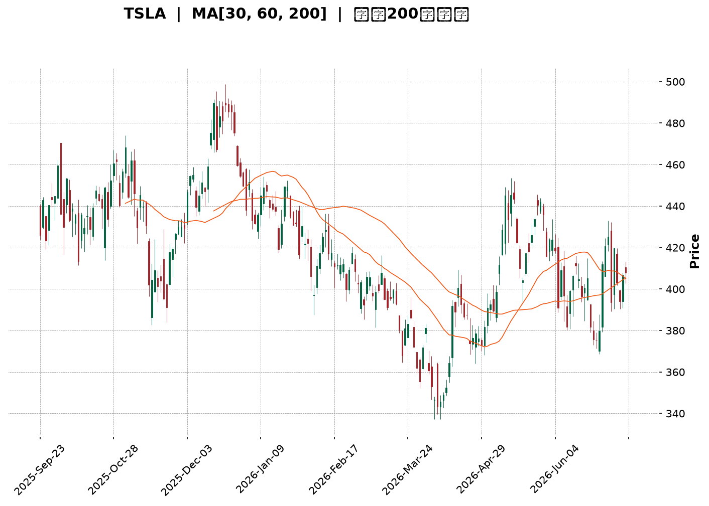
</details>

<html>
<head><meta charset="utf-8" /></head>
<body>
    <div style="height:500px; width:100%;">                        <script>window.PlotlyConfig = {MathJaxConfig: 'local'};</script>
        <script charset="utf-8" src="https://cdn.plot.ly/plotly-3.7.0.min.js" integrity="sha256-jvTGqxNp8AGWEcvNLVuKr+8j5dGe9Yw51LQkmDH+IYA=" crossorigin="anonymous"></script>                <div id="candlestick-chart" class="plotly-graph-div" style="height:100%; width:100%;"></div>            <script>                window.PLOTLYENV=window.PLOTLYENV || {};                                if (document.getElementById("candlestick-chart")) {                    Plotly.newPlot(                        "candlestick-chart",                        [{"close":{"dtype":"f8","bdata":"AAAAoJmdekAAAADgo6x7QAAAAIA9dnpAAAAAYGaGe0AAAAAgXLN7QAAAACCFy3tAAAAAIFy3fEAAAAAAAEB7QAAAAKBH3XpAAAAAAABUfEAAAACgcBF7QAAAAEAKa3tAAAAA4KM4e0AAAAAA19d5QAAAAGBmPntAAAAAANfTekAAAABgZjJ7QAAAAAAAzHpAAAAAwPV0e0AAAABA4fZ7QAAAAKCZqXtAAAAAIIVve0AAAAAgrg98QAAAACCFG3tAAAAAYLhGfEAAAADAzMh8QAAAAAAp2HxAAAAAoJmBe0AAAADA9Yh8QAAAAIDrRX1AAAAAACnEe0AAAADAHuF8QAAAAGCP3ntAAAAA4FHYekAAAAAgrtN7QAAAAIDreXtAAAAAoJnpekAAAAAA1x95QAAAAKCZRXlAAAAAYLiOeUAAAAAAABR5QAAAAADXP3lAAAAAIK6zeEAAAACgcHF4QAAAAOB6HHpAAAAAYGY2ekAAAACgR6l6QAAAAGC44npAAAAAgD3iekAAAAAA19N6QAAAAADX63tAAAAA4HpofEAAAAAAAHB8QAAAAKBHeXtAAAAAYLjSe0AAAABAMzd8QAAAAIA97ntAAAAAIFyvfEAAAADA9bR9QAAAAIAUnn5AAAAAACk0fUAAAACA6zV+QAAAAEAzE35AAAAAIK6LfkAAAADA9Vh+QAAAAGBmVn5AAAAAQAqzfUAAAACAPbp8QAAAAEDhZnxAAAAAIIUbfEAAAADAHmF7QAAAAGC4OnxAAAAAIFwPe0AAAABgj\u002fZ6QAAAAMDMPHtAAAAAACnQe0AAAAAgXA98QAAAAEAz83tAAAAAQDNze0AAAADAHml7QAAAAAAAWHtAAAAAAAA0ekAAAABACvd6QAAAAIDCFXxAAAAAwPUQfEAAAABAMzN7QAAAAGBm7npAAAAAIFz3ekAAAADA9Qh6QAAAAGCP5npAAAAAwPVcekAAAAAgXF96QAAAAAApYHlAAAAAIFzTeEAAAACAwrF5QAAAAMAeFXpAAAAAIFyTekAAAADgUcR6QAAAAMAeEXpAAAAAQAoXekAAAACAFKp5QAAAAMAetXlAAAAAIFy7eUAAAADAHr15QAAAAKBH\u002fXhAAAAAgBSWeUAAAABgZhZ6QAAAAKBHiXlAAAAAACkoeUAAAADAHjV5QAAAAEDhhnhAAAAAQApfeUAAAADAzFh5QAAAACCuy3hAAAAAQOHqeEAAAAAA1\u002fN4QAAAAMAefXlAAAAAACmweEAAAABAM3N4QAAAAMD1uHhAAAAA4FH0eEAAAADgeox4QAAAAMDMxHdAAAAAIFz\u002fdkAAAACgmc13QAAAAOB68HdAAAAAQDMfeEAAAACAwkF3QAAAAKBHnXZAAAAA4Ho0dkAAAAAAADx3QAAAAAAp1HdAAAAAoHCJdkAAAADAHg12QAAAAGBmqnVAAAAAAAB0dUAAAACA65l1QAAAAEAzz3VAAAAAYLgGdkAAAABAM8N2QAAAAEAzf3hAAAAAYGZOeEAAAACA6wl5QAAAAAAAiHhAAAAAYLgmeEAAAAAAKTh4QAAAACCFW3dAAAAAwMyEd0AAAABguKp3QAAAAOBRgHdAAAAAwMxMd0AAAACAFNp3QAAAAMAebXhAAAAAACmIeEAAAACA61V4QAAAACCu63hAAAAA4KO8eUAAAACgmcV6QAAAAAAA0HtAAAAAQDMXe0AAAADgUdR7QAAAAMDMtHtAAAAAANdjekAAAAAA1595QAAAAIDCQXlAAAAAACkUekAAAACgmR16QAAAAAApoHpAAAAAoHAZe0AAAACAwoV7QAAAAKCZoXtAAAAA4KM8e0AAAACAFP55QAAAAADXe3pAAAAAQDN7ekAAAABAMyd6QAAAAAAAcHhAAAAAQDOPeUAAAABA4cp4QAAAAKBw2XdAAAAAYGbyeEAAAABA4WZ5QAAAAGBmsnlAAAAAYI9KeUAAAACAFMZ4QAAAAADXB3lAAAAAwMxQeUAAAACAwtl3QAAAAOB6eHdAAAAAgOtxd0AAAAAgXLt3QAAAAKBwvXlAAAAAoJlJekAAAADAzJR6QAAAAEAzl3hAAAAA4FE8ekAAAABgZi55QAAAAMD1oHhAAAAAwMxoeUAAAAAAKXx5QA=="},"high":{"dtype":"f8","bdata":"AAAAIIWPe0AAAAAgXMN7QAAAAKCZNXtAAAAAIIWHe0AAAAAgri98QAAAAAAA0HtAAAAA4KPkfEAAAAAAAGx9QAAAAOBR7HtAAAAAwMxYfEAAAABA4Up8QAAAAKBHlXtAAAAAoJlFe0AAAACAFLJ7QAAAAIA9TntAAAAAQDMje0AAAAAAKYh7QAAAAKCZdXtAAAAAIFyXe0AAAADAzBx8QAAAAMDMFHxAAAAA4KPYe0AAAABgZhZ8QAAAAEDhOnxAAAAAYI\u002fCfEAAAAAAADB9QAAAAEAzG31AAAAAwPVwfEAAAAAAAKB8QAAAAMAeoX1AAAAAIIXDfEAAAACgRyV9QAAAAEAzN31AAAAAgMJ1e0AAAABguBp8QAAAAADXp3tAAAAAoEele0AAAAAAAIh6QAAAAEAKw3lAAAAAIFx\u002fekAAAABgZo55QAAAAOB6vHlAAAAAQArPekAAAADAzCx5QAAAACCFW3pAAAAAIK5HekAAAABACq96QAAAAEDhDntAAAAAYI8ae0AAAADAzEx7QAAAAGC4\u002fntAAAAAgBRqfEAAAACA6618QAAAAAAAHHxAAAAAgD1GfEAAAACAFI58QAAAAOBRFHxAAAAAACnwfEAAAADgURx+QAAAAAAAuH5AAAAA4Hr0fkAAAACAwq1+QAAAAADXp35AAAAAoEctf0AAAAAghb9+QAAAAGBmrn5AAAAAoHCRfkAAAABgZlZ9QAAAAIDr8XxAAAAAwMyIfEAAAACgcKV8QAAAAMDMmHxAAAAAAAAEfEAAAACA62V7QAAAAIA9TntAAAAAwMwQfEAAAADAzGR8QAAAAMD1PHxAAAAAYI++e0AAAACAwtV7QAAAAAAA9HtAAAAAIK7rekAAAABAM2N7QAAAAAAAGHxAAAAAQOFGfEAAAADgo9B7QAAAAOBRWHtAAAAAAClke0AAAAAgroN7QAAAAIAUfntAAAAAYGayekAAAADA9ch6QAAAAGBmfnpAAAAAoJkheUAAAADAzOh5QAAAAAAAVHpAAAAAAAC0ekAAAACgmUV7QAAAACCuQ3tAAAAAwPWAekAAAAAghdt5QAAAAGBmDnpAAAAAAAD0eUAAAABAM+t5QAAAAEAze3lAAAAAwB6teUAAAACgcEV6QAAAAMD1DHpAAAAAgOtxeUAAAADgo0h5QAAAAKBwxXhAAAAAoEeFeUAAAACA64l5QAAAAKCZJXlAAAAAoHAZeUAAAACgcGl5QAAAAIAUBnpAAAAAAABoeUAAAABAMwN5QAAAACCuO3lAAAAAgOsBeUAAAADAHjF5QAAAAOBRNHhAAAAAgD2+d0AAAACgRxV4QAAAACCuN3hAAAAAIK7DeEAAAABACgd4QAAAAIDCHXdAAAAA4KP0dkAAAACgR1V3QAAAAIA98ndAAAAA4Hokd0AAAAAghft2QAAAAOBRwHVAAAAAAADIdkAAAACAFM51QAAAAIDC5XVAAAAAoJlFdkAAAACAFPp2QAAAAGBmqnhAAAAAwPWgeEAAAADgepR5QAAAAMDMbHlAAAAAQDOfeEAAAAAAKZB4QAAAAAAAIHhAAAAAACnsd0AAAADgesx3QAAAAOCj5HdAAAAAYGaGd0AAAAAAAAx4QAAAAMAe3XhAAAAAgD2qeEAAAACA6yF5QAAAAEDhGnlAAAAAoEf9eUAAAABAM\u002fN6QAAAAGCPEnxAAAAAwMz8e0AAAABgZlZ8QAAAACCuP3xAAAAAYI8qe0AAAACAFFJ6QAAAAIAUWnlAAAAAIFwXekAAAABAM696QAAAAAAp+HpAAAAAQDMze0AAAACgmdl7QAAAACBcv3tAAAAAwB6Re0AAAACgmdl6QAAAAGC4hnpAAAAAoJkZe0AAAACgmaV6QAAAAEDhinpAAAAAQArPeUAAAAAAACh6QAAAAKBw0XhAAAAA4KP4eEAAAABA4Wp5QAAAAAAAAHpAAAAAYLjGeUAAAABACl95QAAAAOBRKHlAAAAAAADseUAAAACA6414QAAAAKBHCXhAAAAAgOuxd0AAAADAzDx4QAAAAOBR1HlAAAAA4KOIekAAAACAwg17QAAAAKCZBXtAAAAAAABAekAAAADA9Th6QAAAAIAU+nhAAAAAgMJ9eUAAAABgj9J5QA=="},"hovertemplate":"\u003cb\u003e%{x|%Y-%m-%d}\u003c\u002fb\u003e\u003cbr\u003e\u958b: $%{open:.2f}\u003cbr\u003e\u9ad8: $%{high:.2f}\u003cbr\u003e\u4f4e: $%{low:.2f}\u003cbr\u003e\u6536: $%{close:.2f}\u003cextra\u003e\u003c\u002fextra\u003e","low":{"dtype":"f8","bdata":"AAAAIIV7ekAAAADgetB6QAAAAKBHMXpAAAAA4FFQekAAAAAAAHh7QAAAAIDrEXtAAAAAAACMe0AAAADAHjl7QAAAAKBHCXpAAAAAQApLe0AAAABAMwd7QAAAACCuk3pAAAAAQOGiekAAAABAM7d5QAAAAEAzO3pAAAAAgMIdekAAAACgR6V6QAAAAMD1VHpAAAAAoJl5ekAAAACAwol7QAAAAMDMoHtAAAAAAADQekAAAABgZt55QAAAAGC44npAAAAAQApre0AAAACgmTl8QAAAAGBmSnxAAAAAgMJ5e0AAAABACrt7QAAAAMDMXHxAAAAAoJm5e0AAAAAgXIt7QAAAAKBwMXtAAAAAgBReekAAAACAwhV7QAAAAIDCBXtAAAAAwPWoekAAAACgcMV4QAAAAOB67HdAAAAAANfreEAAAAAgXJt4QAAAAAAA6HhAAAAAANereEAAAAAAKfx3QAAAAKBwEXlAAAAAQDNfeUAAAACAPQ56QAAAAEAzo3pAAAAA4KOUekAAAACA62F6QAAAAIDC8XpAAAAAgD3We0AAAABgjzp8QAAAAAAANHtAAAAAQDM7e0AAAACAwrl7QAAAAKBHhXtAAAAAYLiae0AAAABgjzp9QAAAAKBHHX1AAAAAQDMjfUAAAACA65F9QAAAACCFq31AAAAAoEdVfkAAAACgcC1+QAAAAMDMzH1AAAAAwB6dfUAAAAAAALB8QAAAAKBHXXxAAAAAwMwUfEAAAADAzDR7QAAAAMAeyXtAAAAA4HrMekAAAADgo\u002fR6QAAAAIDrhXpAAAAAgD3mekAAAAAAAGB7QAAAAEAzv3tAAAAAIIUje0AAAABgZlp7QAAAAAApNHtAAAAAQAoXekAAAACA6zl6QAAAAIAUCntAAAAA4KPAe0AAAADgeiR7QAAAAEAK63pAAAAAoJnhekAAAACA6+l5QAAAAEAza3pAAAAAAADoeUAAAABACtt5QAAAAEDh8nhAAAAA4Ho4eEAAAAAAANx4QAAAAOCjdHlAAAAAAAAQekAAAADgekB6QAAAAAAA4HlAAAAAgBSueUAAAAAAKQh5QAAAAKBHmXlAAAAAgMJBeUAAAAAAAFh5QAAAAOCjoHhAAAAAgD3aeEAAAABgZsJ5QAAAAGCPOnlAAAAAgMLheEAAAAAAAER4QAAAAIA9FnhAAAAAoEepeEAAAABguPZ4QAAAACBco3hAAAAAYGbWd0AAAABACuN4QAAAAGBmInlAAAAAYGaqeEAAAABAM194QAAAAGC4pnhAAAAAAACQeEAAAADA9YR4QAAAACCuq3dAAAAAIFzHdkAAAAAgrkt3QAAAAMD1hHdAAAAAACkQeEAAAACA6z13QAAAACCFd3ZAAAAAgD0CdkAAAAAAAJB2QAAAAKBHYXdAAAAA4HpwdkAAAACAPap1QAAAAADXE3VAAAAAYLg6dUAAAAAAABR1QAAAAADXa3VAAAAAwB7JdUAAAADgUSx2QAAAAAAAqHZAAAAAwMzcd0AAAABgZnp4QAAAAKBHRXhAAAAAIIUTeEAAAADAzBR4QAAAAIA9BndAAAAAIK4rd0AAAADgUcB2QAAAAOCjSHdAAAAA4KMgd0AAAABguAJ3QAAAAMDMrHdAAAAAwMwMeEAAAAAAAFB4QAAAAOBRAHhAAAAAgOsheUAAAACAPQZ6QAAAAMDMDHpAAAAAAClkekAAAAAgXON6QAAAAGCPkntAAAAAAABgekAAAACgR1V5QAAAAIAUmnhAAAAAgD1meUAAAABgZs55QAAAAAApSHpAAAAAgOuhekAAAADgUTh7QAAAAMDMRHtAAAAAgD3CekAAAABA4fZ5QAAAAGBm2nlAAAAAAAAAekAAAABgjxJ6QAAAAKBwSXhAAAAAIIWreEAAAAAA1wN4QAAAAGBmwndAAAAAYI\u002fKd0AAAAAAKSx4QAAAAKCZcXlAAAAA4KMIeUAAAAAAKZx4QAAAAEAzC3hAAAAAYGameEAAAADA9bB3QAAAAMDMUHdAAAAAIIUzd0AAAACgmQl3QAAAAMDMtHdAAAAAAABgeUAAAACgcCF6QAAAAMDMVHhAAAAAAABoeEAAAACAFB55QAAAAAApaHhAAAAAgMJteEAAAADA9Sx5QA=="},"name":"\u50f9\u683c","open":{"dtype":"f8","bdata":"AAAAgBR+e0AAAACgR916QAAAAADXM3tAAAAAwMzEekAAAACgmcV7QAAAAOBRmHtAAAAAwMy8e0AAAADgo2h9QAAAAOCjtHtAAAAAAACMe0AAAADAHv17QAAAAMAeWXtAAAAAwPX8ekAAAADgo0h7QAAAAOB6eHpAAAAA4KOsekAAAABgZi57QAAAACCuK3tAAAAAAACYekAAAACA6717QAAAAAAp3HtAAAAAQDO3e0AAAAAAAEB6QAAAAKBH7XtAAAAAIK5\u002fe0AAAADgemx8QAAAAAAA6HxAAAAAwMwwfEAAAAAAAOx7QAAAAADXf3xAAAAAIFxnfEAAAADAzEB8QAAAACBc33xAAAAAYLhee0AAAACgmXl7QAAAAGBmdntAAAAAYGaie0AAAACAFHJ6QAAAAMDMJHhAAAAAANfreEAAAACAFFZ5QAAAAEDhYnlAAAAAgBTqeUAAAADAHiV5QAAAAGC4InlAAAAAYLjmeUAAAABAM396QAAAAKBwqXpAAAAAwB6VekAAAADA9ex6QAAAAKCZAXtAAAAAQAoffEAAAADgelB8QAAAAEAz93tAAAAA4KNYe0AAAADAHuF7QAAAAEAzD3xAAAAAoHABfEAAAABACld9QAAAACBcg31AAAAAIIWDfkAAAABgj+J9QAAAAIDrgX5AAAAAgBSefkAAAABgZpZ+QAAAACCuh35AAAAAIK5TfkAAAAAAAFB9QAAAAKBw0XxAAAAAoJmBfEAAAADAzJx8QAAAAADX\u002f3tAAAAAgBTme0AAAABgZj57QAAAAIA9vnpAAAAAQDM\u002fe0AAAAAgrpN7QAAAAEAzI3xAAAAAwPWse0AAAACAFJJ7QAAAAAAAeHtAAAAAgMLVekAAAABgj1p6QAAAAGCPMntAAAAAQOH2e0AAAAAAANB7QAAAAGCPVntAAAAAYI\u002f+ekAAAADAzFx7QAAAAKCZlXpAAAAA4KNUekAAAADgUYR6QAAAACBcR3pAAAAA4FHQeEAAAACA6w15QAAAAGCPnnlAAAAAoEchekAAAAAgXL96QAAAAMDM5HpAAAAAwPXkeUAAAACAwsV5QAAAAIDCsXlAAAAAAAB0eUAAAADAzIR5QAAAAOCjdHlAAAAAAAD4eEAAAABgZsJ5QAAAAGC45nlAAAAAQAoveUAAAACgmWl4QAAAAKBwsXhAAAAAoJndeEAAAADAHhl5QAAAAKBw4XhAAAAAwMxgeEAAAAAghSN5QAAAAOB6JHlAAAAAQOFSeUAAAABguPJ4QAAAACCFw3hAAAAAQAq7eEAAAAAAAPB4QAAAAOBRNHhAAAAAoJm9d0AAAACgcFF3QAAAAMD1iHdAAAAAANdfeEAAAACgmdl3QAAAAEAKG3dAAAAAgMLddkAAAAAAKZh2QAAAAIAUqndAAAAAQDPDdkAAAACgcKl2QAAAAEAKp3VAAAAA4KO8dkAAAABgZnJ1QAAAAOCjpHVAAAAAwB7hdUAAAABguFp2QAAAAKBH7XZAAAAAwPWceEAAAABguL54QAAAAKBHKXlAAAAAAACQeEAAAADAHjl4QAAAAOB6dHdAAAAAAABYd0AAAACgcEF3QAAAAEDhandAAAAAYGZ2d0AAAAAAAEx3QAAAAADX53dAAAAAIK5jeEAAAABACrN4QAAAAAAAJHhAAAAAIK53eUAAAAAgrgd6QAAAAGCPYnpAAAAAYI+We0AAAABguEp7QAAAAADX53tAAAAAIK4fe0AAAADgUTR6QAAAAGCPMnlAAAAAoJl5eUAAAABA4WJ6QAAAAGC4anpAAAAAACnkekAAAACAPa57QAAAAIDrWXtAAAAAoJl9e0AAAAAA17d6QAAAACCFI3pAAAAAQDMrekAAAACgcD16QAAAAAAASHpAAAAAoEfFeEAAAADgerB5QAAAAOCjeHhAAAAA4HpEeEAAAAAA1\u002fd4QAAAAIDrxXlAAAAAgMJBeUAAAADgehh5QAAAAKCZ4XhAAAAAoJmteEAAAACAwol4QAAAAKBHwXdAAAAA4FF0d0AAAABgZiJ3QAAAAOCj3HdAAAAAAABgeUAAAAAgXFd6QAAAAAApwHpAAAAAAADYeEAAAAAgXA96QAAAAIAU9nhAAAAAANefeEAAAAAA16d5QA=="},"x":["2025-09-23T00:00:00-04:00","2025-09-24T00:00:00-04:00","2025-09-25T00:00:00-04:00","2025-09-26T00:00:00-04:00","2025-09-29T00:00:00-04:00","2025-09-30T00:00:00-04:00","2025-10-01T00:00:00-04:00","2025-10-02T00:00:00-04:00","2025-10-03T00:00:00-04:00","2025-10-06T00:00:00-04:00","2025-10-07T00:00:00-04:00","2025-10-08T00:00:00-04:00","2025-10-09T00:00:00-04:00","2025-10-10T00:00:00-04:00","2025-10-13T00:00:00-04:00","2025-10-14T00:00:00-04:00","2025-10-15T00:00:00-04:00","2025-10-16T00:00:00-04:00","2025-10-17T00:00:00-04:00","2025-10-20T00:00:00-04:00","2025-10-21T00:00:00-04:00","2025-10-22T00:00:00-04:00","2025-10-23T00:00:00-04:00","2025-10-24T00:00:00-04:00","2025-10-27T00:00:00-04:00","2025-10-28T00:00:00-04:00","2025-10-29T00:00:00-04:00","2025-10-30T00:00:00-04:00","2025-10-31T00:00:00-04:00","2025-11-03T00:00:00-05:00","2025-11-04T00:00:00-05:00","2025-11-05T00:00:00-05:00","2025-11-06T00:00:00-05:00","2025-11-07T00:00:00-05:00","2025-11-10T00:00:00-05:00","2025-11-11T00:00:00-05:00","2025-11-12T00:00:00-05:00","2025-11-13T00:00:00-05:00","2025-11-14T00:00:00-05:00","2025-11-17T00:00:00-05:00","2025-11-18T00:00:00-05:00","2025-11-19T00:00:00-05:00","2025-11-20T00:00:00-05:00","2025-11-21T00:00:00-05:00","2025-11-24T00:00:00-05:00","2025-11-25T00:00:00-05:00","2025-11-26T00:00:00-05:00","2025-11-28T00:00:00-05:00","2025-12-01T00:00:00-05:00","2025-12-02T00:00:00-05:00","2025-12-03T00:00:00-05:00","2025-12-04T00:00:00-05:00","2025-12-05T00:00:00-05:00","2025-12-08T00:00:00-05:00","2025-12-09T00:00:00-05:00","2025-12-10T00:00:00-05:00","2025-12-11T00:00:00-05:00","2025-12-12T00:00:00-05:00","2025-12-15T00:00:00-05:00","2025-12-16T00:00:00-05:00","2025-12-17T00:00:00-05:00","2025-12-18T00:00:00-05:00","2025-12-19T00:00:00-05:00","2025-12-22T00:00:00-05:00","2025-12-23T00:00:00-05:00","2025-12-24T00:00:00-05:00","2025-12-26T00:00:00-05:00","2025-12-29T00:00:00-05:00","2025-12-30T00:00:00-05:00","2025-12-31T00:00:00-05:00","2026-01-02T00:00:00-05:00","2026-01-05T00:00:00-05:00","2026-01-06T00:00:00-05:00","2026-01-07T00:00:00-05:00","2026-01-08T00:00:00-05:00","2026-01-09T00:00:00-05:00","2026-01-12T00:00:00-05:00","2026-01-13T00:00:00-05:00","2026-01-14T00:00:00-05:00","2026-01-15T00:00:00-05:00","2026-01-16T00:00:00-05:00","2026-01-20T00:00:00-05:00","2026-01-21T00:00:00-05:00","2026-01-22T00:00:00-05:00","2026-01-23T00:00:00-05:00","2026-01-26T00:00:00-05:00","2026-01-27T00:00:00-05:00","2026-01-28T00:00:00-05:00","2026-01-29T00:00:00-05:00","2026-01-30T00:00:00-05:00","2026-02-02T00:00:00-05:00","2026-02-03T00:00:00-05:00","2026-02-04T00:00:00-05:00","2026-02-05T00:00:00-05:00","2026-02-06T00:00:00-05:00","2026-02-09T00:00:00-05:00","2026-02-10T00:00:00-05:00","2026-02-11T00:00:00-05:00","2026-02-12T00:00:00-05:00","2026-02-13T00:00:00-05:00","2026-02-17T00:00:00-05:00","2026-02-18T00:00:00-05:00","2026-02-19T00:00:00-05:00","2026-02-20T00:00:00-05:00","2026-02-23T00:00:00-05:00","2026-02-24T00:00:00-05:00","2026-02-25T00:00:00-05:00","2026-02-26T00:00:00-05:00","2026-02-27T00:00:00-05:00","2026-03-02T00:00:00-05:00","2026-03-03T00:00:00-05:00","2026-03-04T00:00:00-05:00","2026-03-05T00:00:00-05:00","2026-03-06T00:00:00-05:00","2026-03-09T00:00:00-04:00","2026-03-10T00:00:00-04:00","2026-03-11T00:00:00-04:00","2026-03-12T00:00:00-04:00","2026-03-13T00:00:00-04:00","2026-03-16T00:00:00-04:00","2026-03-17T00:00:00-04:00","2026-03-18T00:00:00-04:00","2026-03-19T00:00:00-04:00","2026-03-20T00:00:00-04:00","2026-03-23T00:00:00-04:00","2026-03-24T00:00:00-04:00","2026-03-25T00:00:00-04:00","2026-03-26T00:00:00-04:00","2026-03-27T00:00:00-04:00","2026-03-30T00:00:00-04:00","2026-03-31T00:00:00-04:00","2026-04-01T00:00:00-04:00","2026-04-02T00:00:00-04:00","2026-04-06T00:00:00-04:00","2026-04-07T00:00:00-04:00","2026-04-08T00:00:00-04:00","2026-04-09T00:00:00-04:00","2026-04-10T00:00:00-04:00","2026-04-13T00:00:00-04:00","2026-04-14T00:00:00-04:00","2026-04-15T00:00:00-04:00","2026-04-16T00:00:00-04:00","2026-04-17T00:00:00-04:00","2026-04-20T00:00:00-04:00","2026-04-21T00:00:00-04:00","2026-04-22T00:00:00-04:00","2026-04-23T00:00:00-04:00","2026-04-24T00:00:00-04:00","2026-04-27T00:00:00-04:00","2026-04-28T00:00:00-04:00","2026-04-29T00:00:00-04:00","2026-04-30T00:00:00-04:00","2026-05-01T00:00:00-04:00","2026-05-04T00:00:00-04:00","2026-05-05T00:00:00-04:00","2026-05-06T00:00:00-04:00","2026-05-07T00:00:00-04:00","2026-05-08T00:00:00-04:00","2026-05-11T00:00:00-04:00","2026-05-12T00:00:00-04:00","2026-05-13T00:00:00-04:00","2026-05-14T00:00:00-04:00","2026-05-15T00:00:00-04:00","2026-05-18T00:00:00-04:00","2026-05-19T00:00:00-04:00","2026-05-20T00:00:00-04:00","2026-05-21T00:00:00-04:00","2026-05-22T00:00:00-04:00","2026-05-26T00:00:00-04:00","2026-05-27T00:00:00-04:00","2026-05-28T00:00:00-04:00","2026-05-29T00:00:00-04:00","2026-06-01T00:00:00-04:00","2026-06-02T00:00:00-04:00","2026-06-03T00:00:00-04:00","2026-06-04T00:00:00-04:00","2026-06-05T00:00:00-04:00","2026-06-08T00:00:00-04:00","2026-06-09T00:00:00-04:00","2026-06-10T00:00:00-04:00","2026-06-11T00:00:00-04:00","2026-06-12T00:00:00-04:00","2026-06-15T00:00:00-04:00","2026-06-16T00:00:00-04:00","2026-06-17T00:00:00-04:00","2026-06-18T00:00:00-04:00","2026-06-22T00:00:00-04:00","2026-06-23T00:00:00-04:00","2026-06-24T00:00:00-04:00","2026-06-25T00:00:00-04:00","2026-06-26T00:00:00-04:00","2026-06-29T00:00:00-04:00","2026-06-30T00:00:00-04:00","2026-07-01T00:00:00-04:00","2026-07-02T00:00:00-04:00","2026-07-06T00:00:00-04:00","2026-07-07T00:00:00-04:00","2026-07-08T00:00:00-04:00","2026-07-09T00:00:00-04:00","2026-07-10T00:00:00-04:00"],"type":"candlestick"},{"hovertemplate":"MA30: $%{y:.2f}\u003cextra\u003e\u003c\u002fextra\u003e","line":{"color":"#2196F3","dash":"dash","width":2},"mode":"lines","name":"MA30","x":["2025-09-23T00:00:00-04:00","2025-09-24T00:00:00-04:00","2025-09-25T00:00:00-04:00","2025-09-26T00:00:00-04:00","2025-09-29T00:00:00-04:00","2025-09-30T00:00:00-04:00","2025-10-01T00:00:00-04:00","2025-10-02T00:00:00-04:00","2025-10-03T00:00:00-04:00","2025-10-06T00:00:00-04:00","2025-10-07T00:00:00-04:00","2025-10-08T00:00:00-04:00","2025-10-09T00:00:00-04:00","2025-10-10T00:00:00-04:00","2025-10-13T00:00:00-04:00","2025-10-14T00:00:00-04:00","2025-10-15T00:00:00-04:00","2025-10-16T00:00:00-04:00","2025-10-17T00:00:00-04:00","2025-10-20T00:00:00-04:00","2025-10-21T00:00:00-04:00","2025-10-22T00:00:00-04:00","2025-10-23T00:00:00-04:00","2025-10-24T00:00:00-04:00","2025-10-27T00:00:00-04:00","2025-10-28T00:00:00-04:00","2025-10-29T00:00:00-04:00","2025-10-30T00:00:00-04:00","2025-10-31T00:00:00-04:00","2025-11-03T00:00:00-05:00","2025-11-04T00:00:00-05:00","2025-11-05T00:00:00-05:00","2025-11-06T00:00:00-05:00","2025-11-07T00:00:00-05:00","2025-11-10T00:00:00-05:00","2025-11-11T00:00:00-05:00","2025-11-12T00:00:00-05:00","2025-11-13T00:00:00-05:00","2025-11-14T00:00:00-05:00","2025-11-17T00:00:00-05:00","2025-11-18T00:00:00-05:00","2025-11-19T00:00:00-05:00","2025-11-20T00:00:00-05:00","2025-11-21T00:00:00-05:00","2025-11-24T00:00:00-05:00","2025-11-25T00:00:00-05:00","2025-11-26T00:00:00-05:00","2025-11-28T00:00:00-05:00","2025-12-01T00:00:00-05:00","2025-12-02T00:00:00-05:00","2025-12-03T00:00:00-05:00","2025-12-04T00:00:00-05:00","2025-12-05T00:00:00-05:00","2025-12-08T00:00:00-05:00","2025-12-09T00:00:00-05:00","2025-12-10T00:00:00-05:00","2025-12-11T00:00:00-05:00","2025-12-12T00:00:00-05:00","2025-12-15T00:00:00-05:00","2025-12-16T00:00:00-05:00","2025-12-17T00:00:00-05:00","2025-12-18T00:00:00-05:00","2025-12-19T00:00:00-05:00","2025-12-22T00:00:00-05:00","2025-12-23T00:00:00-05:00","2025-12-24T00:00:00-05:00","2025-12-26T00:00:00-05:00","2025-12-29T00:00:00-05:00","2025-12-30T00:00:00-05:00","2025-12-31T00:00:00-05:00","2026-01-02T00:00:00-05:00","2026-01-05T00:00:00-05:00","2026-01-06T00:00:00-05:00","2026-01-07T00:00:00-05:00","2026-01-08T00:00:00-05:00","2026-01-09T00:00:00-05:00","2026-01-12T00:00:00-05:00","2026-01-13T00:00:00-05:00","2026-01-14T00:00:00-05:00","2026-01-15T00:00:00-05:00","2026-01-16T00:00:00-05:00","2026-01-20T00:00:00-05:00","2026-01-21T00:00:00-05:00","2026-01-22T00:00:00-05:00","2026-01-23T00:00:00-05:00","2026-01-26T00:00:00-05:00","2026-01-27T00:00:00-05:00","2026-01-28T00:00:00-05:00","2026-01-29T00:00:00-05:00","2026-01-30T00:00:00-05:00","2026-02-02T00:00:00-05:00","2026-02-03T00:00:00-05:00","2026-02-04T00:00:00-05:00","2026-02-05T00:00:00-05:00","2026-02-06T00:00:00-05:00","2026-02-09T00:00:00-05:00","2026-02-10T00:00:00-05:00","2026-02-11T00:00:00-05:00","2026-02-12T00:00:00-05:00","2026-02-13T00:00:00-05:00","2026-02-17T00:00:00-05:00","2026-02-18T00:00:00-05:00","2026-02-19T00:00:00-05:00","2026-02-20T00:00:00-05:00","2026-02-23T00:00:00-05:00","2026-02-24T00:00:00-05:00","2026-02-25T00:00:00-05:00","2026-02-26T00:00:00-05:00","2026-02-27T00:00:00-05:00","2026-03-02T00:00:00-05:00","2026-03-03T00:00:00-05:00","2026-03-04T00:00:00-05:00","2026-03-05T00:00:00-05:00","2026-03-06T00:00:00-05:00","2026-03-09T00:00:00-04:00","2026-03-10T00:00:00-04:00","2026-03-11T00:00:00-04:00","2026-03-12T00:00:00-04:00","2026-03-13T00:00:00-04:00","2026-03-16T00:00:00-04:00","2026-03-17T00:00:00-04:00","2026-03-18T00:00:00-04:00","2026-03-19T00:00:00-04:00","2026-03-20T00:00:00-04:00","2026-03-23T00:00:00-04:00","2026-03-24T00:00:00-04:00","2026-03-25T00:00:00-04:00","2026-03-26T00:00:00-04:00","2026-03-27T00:00:00-04:00","2026-03-30T00:00:00-04:00","2026-03-31T00:00:00-04:00","2026-04-01T00:00:00-04:00","2026-04-02T00:00:00-04:00","2026-04-06T00:00:00-04:00","2026-04-07T00:00:00-04:00","2026-04-08T00:00:00-04:00","2026-04-09T00:00:00-04:00","2026-04-10T00:00:00-04:00","2026-04-13T00:00:00-04:00","2026-04-14T00:00:00-04:00","2026-04-15T00:00:00-04:00","2026-04-16T00:00:00-04:00","2026-04-17T00:00:00-04:00","2026-04-20T00:00:00-04:00","2026-04-21T00:00:00-04:00","2026-04-22T00:00:00-04:00","2026-04-23T00:00:00-04:00","2026-04-24T00:00:00-04:00","2026-04-27T00:00:00-04:00","2026-04-28T00:00:00-04:00","2026-04-29T00:00:00-04:00","2026-04-30T00:00:00-04:00","2026-05-01T00:00:00-04:00","2026-05-04T00:00:00-04:00","2026-05-05T00:00:00-04:00","2026-05-06T00:00:00-04:00","2026-05-07T00:00:00-04:00","2026-05-08T00:00:00-04:00","2026-05-11T00:00:00-04:00","2026-05-12T00:00:00-04:00","2026-05-13T00:00:00-04:00","2026-05-14T00:00:00-04:00","2026-05-15T00:00:00-04:00","2026-05-18T00:00:00-04:00","2026-05-19T00:00:00-04:00","2026-05-20T00:00:00-04:00","2026-05-21T00:00:00-04:00","2026-05-22T00:00:00-04:00","2026-05-26T00:00:00-04:00","2026-05-27T00:00:00-04:00","2026-05-28T00:00:00-04:00","2026-05-29T00:00:00-04:00","2026-06-01T00:00:00-04:00","2026-06-02T00:00:00-04:00","2026-06-03T00:00:00-04:00","2026-06-04T00:00:00-04:00","2026-06-05T00:00:00-04:00","2026-06-08T00:00:00-04:00","2026-06-09T00:00:00-04:00","2026-06-10T00:00:00-04:00","2026-06-11T00:00:00-04:00","2026-06-12T00:00:00-04:00","2026-06-15T00:00:00-04:00","2026-06-16T00:00:00-04:00","2026-06-17T00:00:00-04:00","2026-06-18T00:00:00-04:00","2026-06-22T00:00:00-04:00","2026-06-23T00:00:00-04:00","2026-06-24T00:00:00-04:00","2026-06-25T00:00:00-04:00","2026-06-26T00:00:00-04:00","2026-06-29T00:00:00-04:00","2026-06-30T00:00:00-04:00","2026-07-01T00:00:00-04:00","2026-07-02T00:00:00-04:00","2026-07-06T00:00:00-04:00","2026-07-07T00:00:00-04:00","2026-07-08T00:00:00-04:00","2026-07-09T00:00:00-04:00","2026-07-10T00:00:00-04:00"],"y":{"dtype":"f8","bdata":"AAAAAAAA+H8AAAAAAAD4fwAAAAAAAPh\u002fAAAAAAAA+H8AAAAAAAD4fwAAAAAAAPh\u002fAAAAAAAA+H8AAAAAAAD4fwAAAAAAAPh\u002fAAAAAAAA+H8AAAAAAAD4fwAAAAAAAPh\u002fAAAAAAAA+H8AAAAAAAD4fwAAAAAAAPh\u002fAAAAAAAA+H8AAAAAAAD4fwAAAAAAAPh\u002fAAAAAAAA+H8AAAAAAAD4fwAAAAAAAPh\u002fAAAAAAAA+H8AAAAAAAD4fwAAAAAAAPh\u002fAAAAAAAA+H8AAAAAAAD4fwAAAAAAAPh\u002fAAAAAAAA+H8AAAAAAAD4f5qZmanxlHtA3t3dPcOee0CrqqqaC6l7QFVVVVUOtXtAmpmZ2UCve0BmZmamVLB7QERERFScrXtAq6qq+jeee0Crqqp6FIx7QM3MzJx9fntAd3d3F9lme0Dv7u7e3VV7QJqZmSlcQ3tAERERgdwte0CJiIgo6iF7QM3MzCxAGHtAAAAAsAATe0CJiIiYbg57QJqZmXkwD3tAd3d3d0wKe0DNzMzsmAB7QLy7uyvOAntAERERoRoLe0Dv7u6OUA57QERERKRwEXtAZmZmxpINe0AzMzNTuAh7QFVVVTXsAHtAmpmZOfsKe0CamZk5+xR7QO\u002fu7g50IHtAMzMzU7gse0C8u7t7FDh7QO\u002fu7r7mSntAMzMz43pqe0BmZmZG\u002fX97QFVVVcVnmHtAq6qqyi+we0ARERHx7s57QHd3d4ek6XtAZmZmFmf\u002fe0Dv7u4+ChN8QImIiCh4LHxA7+7ujpdAfEBVVVWVGFZ8QJqZmem0X3xAiYiIiF1tfEBmZmYmTXl8QAAAAFBignxA3t3dTTeHfECamZkpMYx8QImIiJhDh3xAMzMzs3J0fECamZn54Wd8QFVVVUUZbXxAIiIiYixvfEB3d3e3gWZ8QLy7u4v6XXxAERER4U9PfEC8u7uL+i98QImIiOhCEHxAd3d3dwX4e0BERET0RNd7QDMzMwMrr3tAq6qqelt+e0AiIiKSplZ7QCIiImJXMntAIiIicq8Xe0BERERk9AZ7QCIiIoIH83pAZmZmNtDhekDNzMy8LdN6QN7d3Z2ovXpAiYiISFOyekCJiIiY4Kd6QN7d3X2xlHpA7+7uzrCBekARERHR23B6QFVVVeVCXHpAzczMfLFIekAAAACw5DV6QBERESHbHXpA7+7u3sEWekBVVVUF8wh6QGZmZkbh7HlAmpmZuQLSeUC8u7v71L55QLy7u8uFsnlAiYiIKBWfeUDNzMysjpF5QM3MzHz4fnlAZmZmBvNyeUC8u7v7YmN5QFVVVbWsVXlAvLu7GxNGeUDNzMyc7zV5QCIiIuKlI3lAZmZmlrUOeUAAAADgwfB4QFVVVcVL03hAvLu72ySyeEARERFxaJ14QAAAAEBgjXhAq6qqqhxyeEAzMzMzpVJ4QLy7u1tINnhAiYiIaAMTeEC8u7sLu+x3QBEREZHtzHdAzczMnDayd0De3d1tWZ13QFVVVeUXnXdA3t3dXQGUd0AiIiJCYJF3QImIiLgej3dAMzMz05SId0CrqqpKU4J3QBEREYEjcHdAZmZm9ihmd0AzMzMzel93QGZmZlYOVXdAzczMTPBGd0BERET0\u002fUB3QJqZmUmaRndA7+7uLrJTd0AiIiJyPVh3QFVVVQWdYHdAq6qqCmVud0De3d2tY4x3QImIiCi\u002fuHdAiYiI+G\u002fid0BmZmbmpQl4QM3MzGy8KnhAREREtJ1LeEAAAABQG2p4QERERITAiHhAmpmZWTmweEB3d3cnv9Z4QJqZmWnY\u002f3hAIiIi0iIreUAiIiIywVN5QHd3d1eAbnlAREREZIKHeUBERETkpY95QBERETFPoHlAd3d3JzG0eUDv7u5+scR5QKuqqsrozXlAvLu7m1LfeUAiIiKS7eh5QAAAABDm63lAd3d3t\u002fP5eUDe3d29LQd6QGZmZnYFEnpAd3d3V4AYekARERFxPRx6QM3MzLwtHXpAAAAAgJUZekDe3d3tpwB6QFVVVfWa23lAd3d39368eUB3d3fXh5l5QBEREYHAiHlAd3d3l+CHeUCrqqrqCpB5QJqZmXlbinlAvLu7K7KLeUDv7u7+uIN5QBEREcGucnlARERE5EJkeUCJiIjo31J5QA=="},"type":"scatter"},{"hovertemplate":"MA60: $%{y:.2f}\u003cextra\u003e\u003c\u002fextra\u003e","line":{"color":"#9C27B0","dash":"dash","width":2},"mode":"lines","name":"MA60","x":["2025-09-23T00:00:00-04:00","2025-09-24T00:00:00-04:00","2025-09-25T00:00:00-04:00","2025-09-26T00:00:00-04:00","2025-09-29T00:00:00-04:00","2025-09-30T00:00:00-04:00","2025-10-01T00:00:00-04:00","2025-10-02T00:00:00-04:00","2025-10-03T00:00:00-04:00","2025-10-06T00:00:00-04:00","2025-10-07T00:00:00-04:00","2025-10-08T00:00:00-04:00","2025-10-09T00:00:00-04:00","2025-10-10T00:00:00-04:00","2025-10-13T00:00:00-04:00","2025-10-14T00:00:00-04:00","2025-10-15T00:00:00-04:00","2025-10-16T00:00:00-04:00","2025-10-17T00:00:00-04:00","2025-10-20T00:00:00-04:00","2025-10-21T00:00:00-04:00","2025-10-22T00:00:00-04:00","2025-10-23T00:00:00-04:00","2025-10-24T00:00:00-04:00","2025-10-27T00:00:00-04:00","2025-10-28T00:00:00-04:00","2025-10-29T00:00:00-04:00","2025-10-30T00:00:00-04:00","2025-10-31T00:00:00-04:00","2025-11-03T00:00:00-05:00","2025-11-04T00:00:00-05:00","2025-11-05T00:00:00-05:00","2025-11-06T00:00:00-05:00","2025-11-07T00:00:00-05:00","2025-11-10T00:00:00-05:00","2025-11-11T00:00:00-05:00","2025-11-12T00:00:00-05:00","2025-11-13T00:00:00-05:00","2025-11-14T00:00:00-05:00","2025-11-17T00:00:00-05:00","2025-11-18T00:00:00-05:00","2025-11-19T00:00:00-05:00","2025-11-20T00:00:00-05:00","2025-11-21T00:00:00-05:00","2025-11-24T00:00:00-05:00","2025-11-25T00:00:00-05:00","2025-11-26T00:00:00-05:00","2025-11-28T00:00:00-05:00","2025-12-01T00:00:00-05:00","2025-12-02T00:00:00-05:00","2025-12-03T00:00:00-05:00","2025-12-04T00:00:00-05:00","2025-12-05T00:00:00-05:00","2025-12-08T00:00:00-05:00","2025-12-09T00:00:00-05:00","2025-12-10T00:00:00-05:00","2025-12-11T00:00:00-05:00","2025-12-12T00:00:00-05:00","2025-12-15T00:00:00-05:00","2025-12-16T00:00:00-05:00","2025-12-17T00:00:00-05:00","2025-12-18T00:00:00-05:00","2025-12-19T00:00:00-05:00","2025-12-22T00:00:00-05:00","2025-12-23T00:00:00-05:00","2025-12-24T00:00:00-05:00","2025-12-26T00:00:00-05:00","2025-12-29T00:00:00-05:00","2025-12-30T00:00:00-05:00","2025-12-31T00:00:00-05:00","2026-01-02T00:00:00-05:00","2026-01-05T00:00:00-05:00","2026-01-06T00:00:00-05:00","2026-01-07T00:00:00-05:00","2026-01-08T00:00:00-05:00","2026-01-09T00:00:00-05:00","2026-01-12T00:00:00-05:00","2026-01-13T00:00:00-05:00","2026-01-14T00:00:00-05:00","2026-01-15T00:00:00-05:00","2026-01-16T00:00:00-05:00","2026-01-20T00:00:00-05:00","2026-01-21T00:00:00-05:00","2026-01-22T00:00:00-05:00","2026-01-23T00:00:00-05:00","2026-01-26T00:00:00-05:00","2026-01-27T00:00:00-05:00","2026-01-28T00:00:00-05:00","2026-01-29T00:00:00-05:00","2026-01-30T00:00:00-05:00","2026-02-02T00:00:00-05:00","2026-02-03T00:00:00-05:00","2026-02-04T00:00:00-05:00","2026-02-05T00:00:00-05:00","2026-02-06T00:00:00-05:00","2026-02-09T00:00:00-05:00","2026-02-10T00:00:00-05:00","2026-02-11T00:00:00-05:00","2026-02-12T00:00:00-05:00","2026-02-13T00:00:00-05:00","2026-02-17T00:00:00-05:00","2026-02-18T00:00:00-05:00","2026-02-19T00:00:00-05:00","2026-02-20T00:00:00-05:00","2026-02-23T00:00:00-05:00","2026-02-24T00:00:00-05:00","2026-02-25T00:00:00-05:00","2026-02-26T00:00:00-05:00","2026-02-27T00:00:00-05:00","2026-03-02T00:00:00-05:00","2026-03-03T00:00:00-05:00","2026-03-04T00:00:00-05:00","2026-03-05T00:00:00-05:00","2026-03-06T00:00:00-05:00","2026-03-09T00:00:00-04:00","2026-03-10T00:00:00-04:00","2026-03-11T00:00:00-04:00","2026-03-12T00:00:00-04:00","2026-03-13T00:00:00-04:00","2026-03-16T00:00:00-04:00","2026-03-17T00:00:00-04:00","2026-03-18T00:00:00-04:00","2026-03-19T00:00:00-04:00","2026-03-20T00:00:00-04:00","2026-03-23T00:00:00-04:00","2026-03-24T00:00:00-04:00","2026-03-25T00:00:00-04:00","2026-03-26T00:00:00-04:00","2026-03-27T00:00:00-04:00","2026-03-30T00:00:00-04:00","2026-03-31T00:00:00-04:00","2026-04-01T00:00:00-04:00","2026-04-02T00:00:00-04:00","2026-04-06T00:00:00-04:00","2026-04-07T00:00:00-04:00","2026-04-08T00:00:00-04:00","2026-04-09T00:00:00-04:00","2026-04-10T00:00:00-04:00","2026-04-13T00:00:00-04:00","2026-04-14T00:00:00-04:00","2026-04-15T00:00:00-04:00","2026-04-16T00:00:00-04:00","2026-04-17T00:00:00-04:00","2026-04-20T00:00:00-04:00","2026-04-21T00:00:00-04:00","2026-04-22T00:00:00-04:00","2026-04-23T00:00:00-04:00","2026-04-24T00:00:00-04:00","2026-04-27T00:00:00-04:00","2026-04-28T00:00:00-04:00","2026-04-29T00:00:00-04:00","2026-04-30T00:00:00-04:00","2026-05-01T00:00:00-04:00","2026-05-04T00:00:00-04:00","2026-05-05T00:00:00-04:00","2026-05-06T00:00:00-04:00","2026-05-07T00:00:00-04:00","2026-05-08T00:00:00-04:00","2026-05-11T00:00:00-04:00","2026-05-12T00:00:00-04:00","2026-05-13T00:00:00-04:00","2026-05-14T00:00:00-04:00","2026-05-15T00:00:00-04:00","2026-05-18T00:00:00-04:00","2026-05-19T00:00:00-04:00","2026-05-20T00:00:00-04:00","2026-05-21T00:00:00-04:00","2026-05-22T00:00:00-04:00","2026-05-26T00:00:00-04:00","2026-05-27T00:00:00-04:00","2026-05-28T00:00:00-04:00","2026-05-29T00:00:00-04:00","2026-06-01T00:00:00-04:00","2026-06-02T00:00:00-04:00","2026-06-03T00:00:00-04:00","2026-06-04T00:00:00-04:00","2026-06-05T00:00:00-04:00","2026-06-08T00:00:00-04:00","2026-06-09T00:00:00-04:00","2026-06-10T00:00:00-04:00","2026-06-11T00:00:00-04:00","2026-06-12T00:00:00-04:00","2026-06-15T00:00:00-04:00","2026-06-16T00:00:00-04:00","2026-06-17T00:00:00-04:00","2026-06-18T00:00:00-04:00","2026-06-22T00:00:00-04:00","2026-06-23T00:00:00-04:00","2026-06-24T00:00:00-04:00","2026-06-25T00:00:00-04:00","2026-06-26T00:00:00-04:00","2026-06-29T00:00:00-04:00","2026-06-30T00:00:00-04:00","2026-07-01T00:00:00-04:00","2026-07-02T00:00:00-04:00","2026-07-06T00:00:00-04:00","2026-07-07T00:00:00-04:00","2026-07-08T00:00:00-04:00","2026-07-09T00:00:00-04:00","2026-07-10T00:00:00-04:00"],"y":{"dtype":"f8","bdata":"AAAAAAAA+H8AAAAAAAD4fwAAAAAAAPh\u002fAAAAAAAA+H8AAAAAAAD4fwAAAAAAAPh\u002fAAAAAAAA+H8AAAAAAAD4fwAAAAAAAPh\u002fAAAAAAAA+H8AAAAAAAD4fwAAAAAAAPh\u002fAAAAAAAA+H8AAAAAAAD4fwAAAAAAAPh\u002fAAAAAAAA+H8AAAAAAAD4fwAAAAAAAPh\u002fAAAAAAAA+H8AAAAAAAD4fwAAAAAAAPh\u002fAAAAAAAA+H8AAAAAAAD4fwAAAAAAAPh\u002fAAAAAAAA+H8AAAAAAAD4fwAAAAAAAPh\u002fAAAAAAAA+H8AAAAAAAD4fwAAAAAAAPh\u002fAAAAAAAA+H8AAAAAAAD4fwAAAAAAAPh\u002fAAAAAAAA+H8AAAAAAAD4fwAAAAAAAPh\u002fAAAAAAAA+H8AAAAAAAD4fwAAAAAAAPh\u002fAAAAAAAA+H8AAAAAAAD4fwAAAAAAAPh\u002fAAAAAAAA+H8AAAAAAAD4fwAAAAAAAPh\u002fAAAAAAAA+H8AAAAAAAD4fwAAAAAAAPh\u002fAAAAAAAA+H8AAAAAAAD4fwAAAAAAAPh\u002fAAAAAAAA+H8AAAAAAAD4fwAAAAAAAPh\u002fAAAAAAAA+H8AAAAAAAD4fwAAAAAAAPh\u002fAAAAAAAA+H8AAAAAAAD4f0RERNyyWntAiYiIyL1le0AzMzMLkHB7QCIiIor6f3tAZmZm3t2Me0BmZmb2KJh7QM3MzAwCo3tAq6qq4jOne0De3d21ga17QCIiIhIRtHtA7+7uFiCze0Dv7u4OdLR7QBERESnqt3tAAAAACDq3e0Dv7u5eAbx7QDMzM4v6u3tAREREHC\u002fAe0B3d3ff3cN7QM3MzGTJyHtAq6qq4sHIe0AzMzMLZcZ7QCIiIuIIxXtAIiIiqsa\u002fe0BEREREGbt7QM3MzPREv3tARERElF++e0BVVVUFnbd7QImIiGBzr3tAVVVVjSWte0CrqqrieqJ7QLy7u3tbmHtAVVVV5V6Se0AAAAC4rId7QBEREeEIfXtA7+7uLmt0e0BERETsUWt7QLy7u5NfZXtAZmZmnu9je0Crqqqq8Wp7QM3MzARWbntAZmZmpptwe0De3d39G3N7QDMzM2MQdXtAvLu7a3V5e0Dv7u6W\u002fH57QLy7uzMzentAvLu7K4d3e0C8u7t7FHV7QKuqqppSb3tAVVVVZfRne0DNzMzsCmF7QM3MzFyPUntAERERSZpFe0B3d3d\u002fajh7QN7d3UX9LHtA3t3djZcge0CamZlZqxJ7QLy7uytACHtAzczMhDL3ekBEREScxOB6QKuqqrKdx3pA7+7uPny1ekAAAAD4U516QERERNxrgnpAMzMzSzdiekB3d3cXS0Z6QCIiIqL+KnpAREREhDITekAiIiIi2\u002ft5QLy7u6Mp43lAERERifrJeUDv7u4WS7h5QO\u002fu7m6EpXlAmpmZ+TeSeUDe3d3lQn15QM3MzOx8ZXlAvLu7G1pKeUBmZmZuyy55QDMzMzuYFHlAzczMDHT9eEDv7u4On+l4QDMzM4N53XhAZmZmnmHVeEC8u7ujKc14QHd3d\u002f\u002f\u002fvXhAZmZmxkuteEAzMzMjlKB4QGZmZqZUkXhAd3d3D5+CeEAAAABwhHh4QJqZmWkDanhAmpmZqfFceEAAAAB4MFJ4QHd3d38jTnhAVVVVpeJMeEB3d3eHFkd4QLy7u3MhQnhAiYiIUI0+eEDv7u7Gkj54QO\u002fu7nYFRnhAIiIiakpKeEC8u7srh1N4QGZmZlYOXHhAd3d3L91eeECamZlBYF54QAAAAHCEX3hAERERYZ5heECamZkZvWF4QFVVVf1iZnhAd3d3t6xueEAAAABQjXh4QGZmZh7MhXhAERER4cGNeEAzMzMTg5B4QM3MzPS2l3hAVVVV\u002fWKeeEDNzMxkgqN4QN7d3SUGn3hAERERyb2ieECrqqriM6R4QDMzMzN6oHhAIiIiAnKgeEARERHZFaR4QAAAAOBPrHhAMzMzQxm2eECamZlxPbp4QBEREWHlvnhAVVVVRf3DeEDe3d3NhcZ4QO\u002fu7g4tynhAAAAAeHfPeEDv7u7eltF4QO\u002fu7na+2XhA3t3dJb\u002fpeEBVVVUdE\u002f14QO\u002fu7v6NCXlAq6qqwvUdeUAzMzMTPC15QFVVVZVDOXlAMzMz27JHeUBVVVWNUFN5QA=="},"type":"scatter"},{"hovertemplate":"MA200: $%{y:.2f}\u003cextra\u003e\u003c\u002fextra\u003e","line":{"color":"#FF6F00","dash":"solid","width":2},"mode":"lines","name":"MA200","x":["2025-09-23T00:00:00-04:00","2025-09-24T00:00:00-04:00","2025-09-25T00:00:00-04:00","2025-09-26T00:00:00-04:00","2025-09-29T00:00:00-04:00","2025-09-30T00:00:00-04:00","2025-10-01T00:00:00-04:00","2025-10-02T00:00:00-04:00","2025-10-03T00:00:00-04:00","2025-10-06T00:00:00-04:00","2025-10-07T00:00:00-04:00","2025-10-08T00:00:00-04:00","2025-10-09T00:00:00-04:00","2025-10-10T00:00:00-04:00","2025-10-13T00:00:00-04:00","2025-10-14T00:00:00-04:00","2025-10-15T00:00:00-04:00","2025-10-16T00:00:00-04:00","2025-10-17T00:00:00-04:00","2025-10-20T00:00:00-04:00","2025-10-21T00:00:00-04:00","2025-10-22T00:00:00-04:00","2025-10-23T00:00:00-04:00","2025-10-24T00:00:00-04:00","2025-10-27T00:00:00-04:00","2025-10-28T00:00:00-04:00","2025-10-29T00:00:00-04:00","2025-10-30T00:00:00-04:00","2025-10-31T00:00:00-04:00","2025-11-03T00:00:00-05:00","2025-11-04T00:00:00-05:00","2025-11-05T00:00:00-05:00","2025-11-06T00:00:00-05:00","2025-11-07T00:00:00-05:00","2025-11-10T00:00:00-05:00","2025-11-11T00:00:00-05:00","2025-11-12T00:00:00-05:00","2025-11-13T00:00:00-05:00","2025-11-14T00:00:00-05:00","2025-11-17T00:00:00-05:00","2025-11-18T00:00:00-05:00","2025-11-19T00:00:00-05:00","2025-11-20T00:00:00-05:00","2025-11-21T00:00:00-05:00","2025-11-24T00:00:00-05:00","2025-11-25T00:00:00-05:00","2025-11-26T00:00:00-05:00","2025-11-28T00:00:00-05:00","2025-12-01T00:00:00-05:00","2025-12-02T00:00:00-05:00","2025-12-03T00:00:00-05:00","2025-12-04T00:00:00-05:00","2025-12-05T00:00:00-05:00","2025-12-08T00:00:00-05:00","2025-12-09T00:00:00-05:00","2025-12-10T00:00:00-05:00","2025-12-11T00:00:00-05:00","2025-12-12T00:00:00-05:00","2025-12-15T00:00:00-05:00","2025-12-16T00:00:00-05:00","2025-12-17T00:00:00-05:00","2025-12-18T00:00:00-05:00","2025-12-19T00:00:00-05:00","2025-12-22T00:00:00-05:00","2025-12-23T00:00:00-05:00","2025-12-24T00:00:00-05:00","2025-12-26T00:00:00-05:00","2025-12-29T00:00:00-05:00","2025-12-30T00:00:00-05:00","2025-12-31T00:00:00-05:00","2026-01-02T00:00:00-05:00","2026-01-05T00:00:00-05:00","2026-01-06T00:00:00-05:00","2026-01-07T00:00:00-05:00","2026-01-08T00:00:00-05:00","2026-01-09T00:00:00-05:00","2026-01-12T00:00:00-05:00","2026-01-13T00:00:00-05:00","2026-01-14T00:00:00-05:00","2026-01-15T00:00:00-05:00","2026-01-16T00:00:00-05:00","2026-01-20T00:00:00-05:00","2026-01-21T00:00:00-05:00","2026-01-22T00:00:00-05:00","2026-01-23T00:00:00-05:00","2026-01-26T00:00:00-05:00","2026-01-27T00:00:00-05:00","2026-01-28T00:00:00-05:00","2026-01-29T00:00:00-05:00","2026-01-30T00:00:00-05:00","2026-02-02T00:00:00-05:00","2026-02-03T00:00:00-05:00","2026-02-04T00:00:00-05:00","2026-02-05T00:00:00-05:00","2026-02-06T00:00:00-05:00","2026-02-09T00:00:00-05:00","2026-02-10T00:00:00-05:00","2026-02-11T00:00:00-05:00","2026-02-12T00:00:00-05:00","2026-02-13T00:00:00-05:00","2026-02-17T00:00:00-05:00","2026-02-18T00:00:00-05:00","2026-02-19T00:00:00-05:00","2026-02-20T00:00:00-05:00","2026-02-23T00:00:00-05:00","2026-02-24T00:00:00-05:00","2026-02-25T00:00:00-05:00","2026-02-26T00:00:00-05:00","2026-02-27T00:00:00-05:00","2026-03-02T00:00:00-05:00","2026-03-03T00:00:00-05:00","2026-03-04T00:00:00-05:00","2026-03-05T00:00:00-05:00","2026-03-06T00:00:00-05:00","2026-03-09T00:00:00-04:00","2026-03-10T00:00:00-04:00","2026-03-11T00:00:00-04:00","2026-03-12T00:00:00-04:00","2026-03-13T00:00:00-04:00","2026-03-16T00:00:00-04:00","2026-03-17T00:00:00-04:00","2026-03-18T00:00:00-04:00","2026-03-19T00:00:00-04:00","2026-03-20T00:00:00-04:00","2026-03-23T00:00:00-04:00","2026-03-24T00:00:00-04:00","2026-03-25T00:00:00-04:00","2026-03-26T00:00:00-04:00","2026-03-27T00:00:00-04:00","2026-03-30T00:00:00-04:00","2026-03-31T00:00:00-04:00","2026-04-01T00:00:00-04:00","2026-04-02T00:00:00-04:00","2026-04-06T00:00:00-04:00","2026-04-07T00:00:00-04:00","2026-04-08T00:00:00-04:00","2026-04-09T00:00:00-04:00","2026-04-10T00:00:00-04:00","2026-04-13T00:00:00-04:00","2026-04-14T00:00:00-04:00","2026-04-15T00:00:00-04:00","2026-04-16T00:00:00-04:00","2026-04-17T00:00:00-04:00","2026-04-20T00:00:00-04:00","2026-04-21T00:00:00-04:00","2026-04-22T00:00:00-04:00","2026-04-23T00:00:00-04:00","2026-04-24T00:00:00-04:00","2026-04-27T00:00:00-04:00","2026-04-28T00:00:00-04:00","2026-04-29T00:00:00-04:00","2026-04-30T00:00:00-04:00","2026-05-01T00:00:00-04:00","2026-05-04T00:00:00-04:00","2026-05-05T00:00:00-04:00","2026-05-06T00:00:00-04:00","2026-05-07T00:00:00-04:00","2026-05-08T00:00:00-04:00","2026-05-11T00:00:00-04:00","2026-05-12T00:00:00-04:00","2026-05-13T00:00:00-04:00","2026-05-14T00:00:00-04:00","2026-05-15T00:00:00-04:00","2026-05-18T00:00:00-04:00","2026-05-19T00:00:00-04:00","2026-05-20T00:00:00-04:00","2026-05-21T00:00:00-04:00","2026-05-22T00:00:00-04:00","2026-05-26T00:00:00-04:00","2026-05-27T00:00:00-04:00","2026-05-28T00:00:00-04:00","2026-05-29T00:00:00-04:00","2026-06-01T00:00:00-04:00","2026-06-02T00:00:00-04:00","2026-06-03T00:00:00-04:00","2026-06-04T00:00:00-04:00","2026-06-05T00:00:00-04:00","2026-06-08T00:00:00-04:00","2026-06-09T00:00:00-04:00","2026-06-10T00:00:00-04:00","2026-06-11T00:00:00-04:00","2026-06-12T00:00:00-04:00","2026-06-15T00:00:00-04:00","2026-06-16T00:00:00-04:00","2026-06-17T00:00:00-04:00","2026-06-18T00:00:00-04:00","2026-06-22T00:00:00-04:00","2026-06-23T00:00:00-04:00","2026-06-24T00:00:00-04:00","2026-06-25T00:00:00-04:00","2026-06-26T00:00:00-04:00","2026-06-29T00:00:00-04:00","2026-06-30T00:00:00-04:00","2026-07-01T00:00:00-04:00","2026-07-02T00:00:00-04:00","2026-07-06T00:00:00-04:00","2026-07-07T00:00:00-04:00","2026-07-08T00:00:00-04:00","2026-07-09T00:00:00-04:00","2026-07-10T00:00:00-04:00"],"y":{"dtype":"f8","bdata":"AAAAAAAA+H8AAAAAAAD4fwAAAAAAAPh\u002fAAAAAAAA+H8AAAAAAAD4fwAAAAAAAPh\u002fAAAAAAAA+H8AAAAAAAD4fwAAAAAAAPh\u002fAAAAAAAA+H8AAAAAAAD4fwAAAAAAAPh\u002fAAAAAAAA+H8AAAAAAAD4fwAAAAAAAPh\u002fAAAAAAAA+H8AAAAAAAD4fwAAAAAAAPh\u002fAAAAAAAA+H8AAAAAAAD4fwAAAAAAAPh\u002fAAAAAAAA+H8AAAAAAAD4fwAAAAAAAPh\u002fAAAAAAAA+H8AAAAAAAD4fwAAAAAAAPh\u002fAAAAAAAA+H8AAAAAAAD4fwAAAAAAAPh\u002fAAAAAAAA+H8AAAAAAAD4fwAAAAAAAPh\u002fAAAAAAAA+H8AAAAAAAD4fwAAAAAAAPh\u002fAAAAAAAA+H8AAAAAAAD4fwAAAAAAAPh\u002fAAAAAAAA+H8AAAAAAAD4fwAAAAAAAPh\u002fAAAAAAAA+H8AAAAAAAD4fwAAAAAAAPh\u002fAAAAAAAA+H8AAAAAAAD4fwAAAAAAAPh\u002fAAAAAAAA+H8AAAAAAAD4fwAAAAAAAPh\u002fAAAAAAAA+H8AAAAAAAD4fwAAAAAAAPh\u002fAAAAAAAA+H8AAAAAAAD4fwAAAAAAAPh\u002fAAAAAAAA+H8AAAAAAAD4fwAAAAAAAPh\u002fAAAAAAAA+H8AAAAAAAD4fwAAAAAAAPh\u002fAAAAAAAA+H8AAAAAAAD4fwAAAAAAAPh\u002fAAAAAAAA+H8AAAAAAAD4fwAAAAAAAPh\u002fAAAAAAAA+H8AAAAAAAD4fwAAAAAAAPh\u002fAAAAAAAA+H8AAAAAAAD4fwAAAAAAAPh\u002fAAAAAAAA+H8AAAAAAAD4fwAAAAAAAPh\u002fAAAAAAAA+H8AAAAAAAD4fwAAAAAAAPh\u002fAAAAAAAA+H8AAAAAAAD4fwAAAAAAAPh\u002fAAAAAAAA+H8AAAAAAAD4fwAAAAAAAPh\u002fAAAAAAAA+H8AAAAAAAD4fwAAAAAAAPh\u002fAAAAAAAA+H8AAAAAAAD4fwAAAAAAAPh\u002fAAAAAAAA+H8AAAAAAAD4fwAAAAAAAPh\u002fAAAAAAAA+H8AAAAAAAD4fwAAAAAAAPh\u002fAAAAAAAA+H8AAAAAAAD4fwAAAAAAAPh\u002fAAAAAAAA+H8AAAAAAAD4fwAAAAAAAPh\u002fAAAAAAAA+H8AAAAAAAD4fwAAAAAAAPh\u002fAAAAAAAA+H8AAAAAAAD4fwAAAAAAAPh\u002fAAAAAAAA+H8AAAAAAAD4fwAAAAAAAPh\u002fAAAAAAAA+H8AAAAAAAD4fwAAAAAAAPh\u002fAAAAAAAA+H8AAAAAAAD4fwAAAAAAAPh\u002fAAAAAAAA+H8AAAAAAAD4fwAAAAAAAPh\u002fAAAAAAAA+H8AAAAAAAD4fwAAAAAAAPh\u002fAAAAAAAA+H8AAAAAAAD4fwAAAAAAAPh\u002fAAAAAAAA+H8AAAAAAAD4fwAAAAAAAPh\u002fAAAAAAAA+H8AAAAAAAD4fwAAAAAAAPh\u002fAAAAAAAA+H8AAAAAAAD4fwAAAAAAAPh\u002fAAAAAAAA+H8AAAAAAAD4fwAAAAAAAPh\u002fAAAAAAAA+H8AAAAAAAD4fwAAAAAAAPh\u002fAAAAAAAA+H8AAAAAAAD4fwAAAAAAAPh\u002fAAAAAAAA+H8AAAAAAAD4fwAAAAAAAPh\u002fAAAAAAAA+H8AAAAAAAD4fwAAAAAAAPh\u002fAAAAAAAA+H8AAAAAAAD4fwAAAAAAAPh\u002fAAAAAAAA+H8AAAAAAAD4fwAAAAAAAPh\u002fAAAAAAAA+H8AAAAAAAD4fwAAAAAAAPh\u002fAAAAAAAA+H8AAAAAAAD4fwAAAAAAAPh\u002fAAAAAAAA+H8AAAAAAAD4fwAAAAAAAPh\u002fAAAAAAAA+H8AAAAAAAD4fwAAAAAAAPh\u002fAAAAAAAA+H8AAAAAAAD4fwAAAAAAAPh\u002fAAAAAAAA+H8AAAAAAAD4fwAAAAAAAPh\u002fAAAAAAAA+H8AAAAAAAD4fwAAAAAAAPh\u002fAAAAAAAA+H8AAAAAAAD4fwAAAAAAAPh\u002fAAAAAAAA+H8AAAAAAAD4fwAAAAAAAPh\u002fAAAAAAAA+H8AAAAAAAD4fwAAAAAAAPh\u002fAAAAAAAA+H8AAAAAAAD4fwAAAAAAAPh\u002fAAAAAAAA+H8AAAAAAAD4fwAAAAAAAPh\u002fAAAAAAAA+H8AAAAAAAD4fwAAAAAAAPh\u002fAAAAAAAA+H89CtcHPSJ6QA=="},"type":"scatter"}],                        {"template":{"data":{"barpolar":[{"marker":{"line":{"color":"rgb(17,17,17)","width":0.5},"pattern":{"fillmode":"overlay","size":10,"solidity":0.2}},"type":"barpolar"}],"bar":[{"error_x":{"color":"#f2f5fa"},"error_y":{"color":"#f2f5fa"},"marker":{"line":{"color":"rgb(17,17,17)","width":0.5},"pattern":{"fillmode":"overlay","size":10,"solidity":0.2}},"type":"bar"}],"carpet":[{"aaxis":{"endlinecolor":"#A2B1C6","gridcolor":"#506784","linecolor":"#506784","minorgridcolor":"#506784","startlinecolor":"#A2B1C6"},"baxis":{"endlinecolor":"#A2B1C6","gridcolor":"#506784","linecolor":"#506784","minorgridcolor":"#506784","startlinecolor":"#A2B1C6"},"type":"carpet"}],"choropleth":[{"colorbar":{"outlinewidth":0,"ticks":""},"type":"choropleth"}],"contourcarpet":[{"colorbar":{"outlinewidth":0,"ticks":""},"type":"contourcarpet"}],"contour":[{"colorbar":{"outlinewidth":0,"ticks":""},"colorscale":[[0.0,"#0d0887"],[0.1111111111111111,"#46039f"],[0.2222222222222222,"#7201a8"],[0.3333333333333333,"#9c179e"],[0.4444444444444444,"#bd3786"],[0.5555555555555556,"#d8576b"],[0.6666666666666666,"#ed7953"],[0.7777777777777778,"#fb9f3a"],[0.8888888888888888,"#fdca26"],[1.0,"#f0f921"]],"type":"contour"}],"heatmap":[{"colorbar":{"outlinewidth":0,"ticks":""},"colorscale":[[0.0,"#0d0887"],[0.1111111111111111,"#46039f"],[0.2222222222222222,"#7201a8"],[0.3333333333333333,"#9c179e"],[0.4444444444444444,"#bd3786"],[0.5555555555555556,"#d8576b"],[0.6666666666666666,"#ed7953"],[0.7777777777777778,"#fb9f3a"],[0.8888888888888888,"#fdca26"],[1.0,"#f0f921"]],"type":"heatmap"}],"histogram2dcontour":[{"colorbar":{"outlinewidth":0,"ticks":""},"colorscale":[[0.0,"#0d0887"],[0.1111111111111111,"#46039f"],[0.2222222222222222,"#7201a8"],[0.3333333333333333,"#9c179e"],[0.4444444444444444,"#bd3786"],[0.5555555555555556,"#d8576b"],[0.6666666666666666,"#ed7953"],[0.7777777777777778,"#fb9f3a"],[0.8888888888888888,"#fdca26"],[1.0,"#f0f921"]],"type":"histogram2dcontour"}],"histogram2d":[{"colorbar":{"outlinewidth":0,"ticks":""},"colorscale":[[0.0,"#0d0887"],[0.1111111111111111,"#46039f"],[0.2222222222222222,"#7201a8"],[0.3333333333333333,"#9c179e"],[0.4444444444444444,"#bd3786"],[0.5555555555555556,"#d8576b"],[0.6666666666666666,"#ed7953"],[0.7777777777777778,"#fb9f3a"],[0.8888888888888888,"#fdca26"],[1.0,"#f0f921"]],"type":"histogram2d"}],"histogram":[{"marker":{"pattern":{"fillmode":"overlay","size":10,"solidity":0.2}},"type":"histogram"}],"mesh3d":[{"colorbar":{"outlinewidth":0,"ticks":""},"type":"mesh3d"}],"parcoords":[{"line":{"colorbar":{"outlinewidth":0,"ticks":""}},"type":"parcoords"}],"pie":[{"automargin":true,"type":"pie"}],"scatter3d":[{"line":{"colorbar":{"outlinewidth":0,"ticks":""}},"marker":{"colorbar":{"outlinewidth":0,"ticks":""}},"type":"scatter3d"}],"scattercarpet":[{"marker":{"colorbar":{"outlinewidth":0,"ticks":""}},"type":"scattercarpet"}],"scattergeo":[{"marker":{"colorbar":{"outlinewidth":0,"ticks":""}},"type":"scattergeo"}],"scattergl":[{"marker":{"line":{"color":"#283442"}},"type":"scattergl"}],"scattermapbox":[{"marker":{"colorbar":{"outlinewidth":0,"ticks":""}},"type":"scattermapbox"}],"scattermap":[{"marker":{"colorbar":{"outlinewidth":0,"ticks":""}},"type":"scattermap"}],"scatterpolargl":[{"marker":{"colorbar":{"outlinewidth":0,"ticks":""}},"type":"scatterpolargl"}],"scatterpolar":[{"marker":{"colorbar":{"outlinewidth":0,"ticks":""}},"type":"scatterpolar"}],"scatter":[{"marker":{"line":{"color":"#283442"}},"type":"scatter"}],"scatterternary":[{"marker":{"colorbar":{"outlinewidth":0,"ticks":""}},"type":"scatterternary"}],"surface":[{"colorbar":{"outlinewidth":0,"ticks":""},"colorscale":[[0.0,"#0d0887"],[0.1111111111111111,"#46039f"],[0.2222222222222222,"#7201a8"],[0.3333333333333333,"#9c179e"],[0.4444444444444444,"#bd3786"],[0.5555555555555556,"#d8576b"],[0.6666666666666666,"#ed7953"],[0.7777777777777778,"#fb9f3a"],[0.8888888888888888,"#fdca26"],[1.0,"#f0f921"]],"type":"surface"}],"table":[{"cells":{"fill":{"color":"#506784"},"line":{"color":"rgb(17,17,17)"}},"header":{"fill":{"color":"#2a3f5f"},"line":{"color":"rgb(17,17,17)"}},"type":"table"}]},"layout":{"annotationdefaults":{"arrowcolor":"#f2f5fa","arrowhead":0,"arrowwidth":1},"autotypenumbers":"strict","coloraxis":{"colorbar":{"outlinewidth":0,"ticks":""}},"colorscale":{"diverging":[[0,"#8e0152"],[0.1,"#c51b7d"],[0.2,"#de77ae"],[0.3,"#f1b6da"],[0.4,"#fde0ef"],[0.5,"#f7f7f7"],[0.6,"#e6f5d0"],[0.7,"#b8e186"],[0.8,"#7fbc41"],[0.9,"#4d9221"],[1,"#276419"]],"sequential":[[0.0,"#0d0887"],[0.1111111111111111,"#46039f"],[0.2222222222222222,"#7201a8"],[0.3333333333333333,"#9c179e"],[0.4444444444444444,"#bd3786"],[0.5555555555555556,"#d8576b"],[0.6666666666666666,"#ed7953"],[0.7777777777777778,"#fb9f3a"],[0.8888888888888888,"#fdca26"],[1.0,"#f0f921"]],"sequentialminus":[[0.0,"#0d0887"],[0.1111111111111111,"#46039f"],[0.2222222222222222,"#7201a8"],[0.3333333333333333,"#9c179e"],[0.4444444444444444,"#bd3786"],[0.5555555555555556,"#d8576b"],[0.6666666666666666,"#ed7953"],[0.7777777777777778,"#fb9f3a"],[0.8888888888888888,"#fdca26"],[1.0,"#f0f921"]]},"colorway":["#636efa","#EF553B","#00cc96","#ab63fa","#FFA15A","#19d3f3","#FF6692","#B6E880","#FF97FF","#FECB52"],"font":{"color":"#f2f5fa"},"geo":{"bgcolor":"rgb(17,17,17)","lakecolor":"rgb(17,17,17)","landcolor":"rgb(17,17,17)","showlakes":true,"showland":true,"subunitcolor":"#506784"},"hoverlabel":{"align":"left"},"hovermode":"closest","mapbox":{"style":"dark"},"paper_bgcolor":"rgb(17,17,17)","plot_bgcolor":"rgb(17,17,17)","polar":{"angularaxis":{"gridcolor":"#506784","linecolor":"#506784","ticks":""},"bgcolor":"rgb(17,17,17)","radialaxis":{"gridcolor":"#506784","linecolor":"#506784","ticks":""}},"scene":{"xaxis":{"backgroundcolor":"rgb(17,17,17)","gridcolor":"#506784","gridwidth":2,"linecolor":"#506784","showbackground":true,"ticks":"","zerolinecolor":"#C8D4E3"},"yaxis":{"backgroundcolor":"rgb(17,17,17)","gridcolor":"#506784","gridwidth":2,"linecolor":"#506784","showbackground":true,"ticks":"","zerolinecolor":"#C8D4E3"},"zaxis":{"backgroundcolor":"rgb(17,17,17)","gridcolor":"#506784","gridwidth":2,"linecolor":"#506784","showbackground":true,"ticks":"","zerolinecolor":"#C8D4E3"}},"shapedefaults":{"line":{"color":"#f2f5fa"}},"sliderdefaults":{"bgcolor":"#C8D4E3","bordercolor":"rgb(17,17,17)","borderwidth":1,"tickwidth":0},"ternary":{"aaxis":{"gridcolor":"#506784","linecolor":"#506784","ticks":""},"baxis":{"gridcolor":"#506784","linecolor":"#506784","ticks":""},"bgcolor":"rgb(17,17,17)","caxis":{"gridcolor":"#506784","linecolor":"#506784","ticks":""}},"title":{"x":0.05},"updatemenudefaults":{"bgcolor":"#506784","borderwidth":0},"xaxis":{"automargin":true,"gridcolor":"#283442","linecolor":"#506784","ticks":"","title":{"standoff":15},"zerolinecolor":"#283442","zerolinewidth":2},"yaxis":{"automargin":true,"gridcolor":"#283442","linecolor":"#506784","ticks":"","title":{"standoff":15},"zerolinecolor":"#283442","zerolinewidth":2}}},"xaxis":{"rangeslider":{"visible":false},"title":{"text":"\u65e5\u671f"}},"font":{"size":11},"title":{"text":"TSLA  |  MA(30\u002f60\u002f200)  |  \u6700\u8fd1200\u4ea4\u6613\u65e5"},"yaxis":{"title":{"text":"\u80a1\u50f9 (USD)"}},"hovermode":"x unified","height":500},                        {"responsive": true}                    )                };            </script>        </div>
</body>
</html>

# TSLA 技術分析報告

> **報告日期**：2026-07-11 ｜ **語言**：繁體中文 ｜ **數據來源**：Yahoo Finance ｜ **當前價格**：$407.76

---

## 目錄

| 章節 | 內容 |
|------|------|
| [1. 技術面概覽](#1-技術面概覽) | 訊號儀表板、核心指標、評分卡 |
| [2. 趨勢分析](#2-趨勢分析) | 多時框趨勢、長中短期走勢 |
| [3. 圖表形態分析](#3-圖表形態分析) | 形態識別、K線組合、目標價 |
| [4. 支撐與阻力](#4-支撐與阻力) | 關鍵價位、斐波那契回調 |
| [5. 技術指標深度解讀](#5-技術指標深度解讀) | MA/RSI/MACD/布林/成交量 |
| [6. 動能與波動率](#6-動能與波動率) | 動能評估、ATR、Beta |
| [7. 多時框架總結](#7-多時框架總結) | 時框架評分矩陣 |
| [8. 交易策略建議](#8-交易策略建議) | 多空策略、風險報酬比 |
| [9. 風險提示與監控](#9-風險提示與監控) | 監控指標、風險場景 |

---

## 1. 技術面概覽

本章節提供 TSLA 當前技術狀況的快速總覽，透過視覺化儀表板與評分卡，幫助投資者迅速掌握多空訊號分佈及各項技術指標的強度。

### 🎯 技術訊號儀表板

當前 TSLA 的技術訊號呈現多空交織的局面。雖然短期動能指標顯示看多跡象，但中長期均線的空頭排列及弱勢趨勢強度，使得整體市場情緒偏向謹慎觀望。

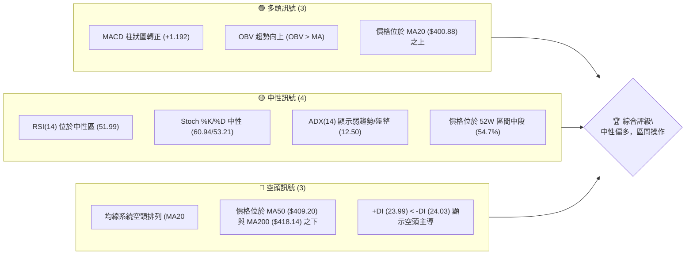

### 📊 核心指標速覽表

下表彙整了 TSLA 各項核心技術指標的當前數值與其所反映的訊號，提供快速決策參考。

| 指標類別 | 指標名稱 | 當前數值 | 訊號 | 解讀 |
|----------|----------|----------|------|------|
| **價格** | 當前價格 | $407.76 | 🟡 | 位於布林中軌上方，但受 MA50 壓制 |
| **均線** | MA20 | $400.88 | 🟢 | 價格位於短期均線上方，短期支撐 |
| **均線** | MA50 | $409.20 | 🔴 | 價格位於中期均線下方，形成阻力 |
| **均線** | MA200 | $418.14 | 🔴 | 價格位於長期均線下方，長期壓力 |
| **動能** | RSI(14) | 51.99 | 🟡 | 處於中性區間，無超買超賣訊號 |
| **動能** | MACD | -0.144 (線) | 🟢 | MACD柱狀圖轉正 (+1.192)，短線動能增強 |
| **波動** | ATR(14) | $20.17 | 🟡 | 每日平均波動約 4.95%，屬中高波動 |
| **趨勢** | ADX(14) | 12.50 | 🔴 | 趨勢強度極弱，市場處於盤整狀態 |
| **成交量**| OBV趨勢 | OBV > MA | 🟢 | 量能支撐價格上漲，短期量價配合良好 |

### 🏆 技術評分卡

綜合考量各項技術指標，TSLA 目前的技術面評分呈現中性偏弱，主要受制於缺乏明確的趨勢方向及均線的空頭排列。

```
╔══════════════════════════════════════════════════════════════╗
║              技術評分卡 — TSLA (2026-07-11)                  ║
╠══════════════════════════════════════════════════════════════╣
║ 趨勢強度      ██░░░░░░░░░░░░░░░░░░  10/100  🔴 (ADX極弱，盤整) ║
║ 動能指標      ███████░░░░░░░░░░░░  70/100  🟢 (MACD柱轉正，RSI中性) ║
║ 支撐穩定度    █████░░░░░░░░░░░░░░  50/100  🟡 (接近S1，斐波那契50%回調) ║
║ 成交量配合    ██████░░░░░░░░░░░░░░  60/100  🟢 (OBV正向，但近期成交量偏低) ║
║ 形態完整度    ██░░░░░░░░░░░░░░░░░░  20/100  🔴 (缺乏明確高信心度形態) ║
║ 均線排列      ██░░░░░░░░░░░░░░░░░░  20/100  🔴 (MA20<MA50<MA200空頭排列) ║
╠══════════════════════════════════════════════════════════════╣
║ 綜合評分      ████░░░░░░░░░░░░░░░░  40/100  🟡 中性偏空 (等待方向確認) ║
╚══════════════════════════════════════════════════════════════╝
```

---

## 2. 趨勢分析

對 TSLA 進行多時框趨勢分析，從長期、中期到短期，層層解讀其價格走勢特徵。

### 🌐 多時框趨勢分析

當前 TSLA 的趨勢分析顯示，長期而言仍處於上升通道中的回調階段，中期則呈現震盪築底或盤整的格局，而短期則有從前期的下跌中反彈的跡象，但仍受上方均線壓力。

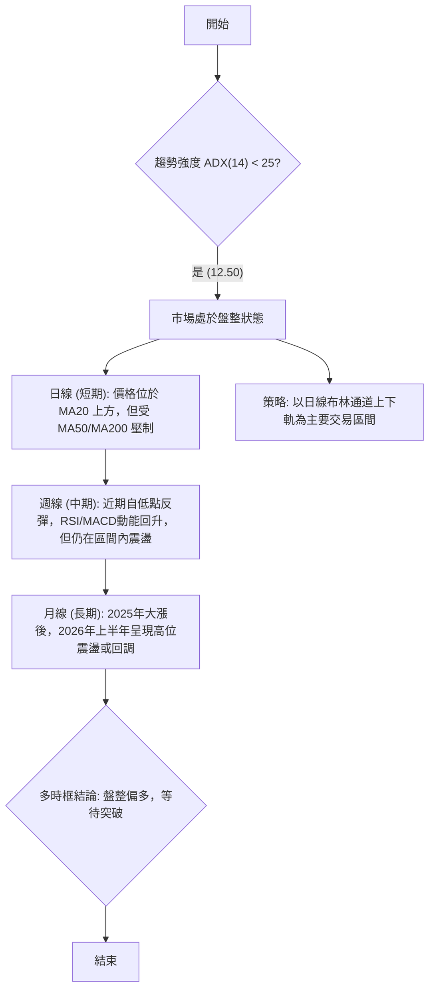

### 📈 長期趨勢 — 12個月走勢圖（Unicode）

過去 12 個月（2025-07 至 2026-07），TSLA 股價經歷了大幅波動。從 2025 年 9 月至 12 月的強勁上漲，股價從 $333.87 飆升至 $449.72，達到一個階段性高點。進入 2026 年後，股價進入震盪回調區間，雖在 5 月份一度反彈至 $435.79，但未能突破前期高點，目前穩定在 $407.76 附近。這表明長期上漲趨勢的動能有所減弱，進入了高位盤整或回調階段。

```
TSLA 月線走勢圖（過去12個月）
價格軸 ($)
$456.56 ┤              ● (2025-10 高點)
$449.72 ┤            ● (2025-12)
$435.79 ┤                          ● (2026-05)
$407.76 ┤●━━━━━━━━━━━━━━━━━━━━━━━━━━━●←現在 (2026-07)
$333.87 ┤  ● (2025-08 低點)
     └────────────────────────────
      25-07 25-08 25-09 25-10 25-11 25-12 26-01 26-02 26-03 26-04 26-05 26-06 26-07
```

**走勢特徵分析表格**

| 階段 | 時間區間 | 主要走勢 | 價格區間 | 漲跌幅 | 走勢特徵 |
|------|----------|----------|----------|--------|----------|
| 1 | 2025-07 ~ 2025-08 | 整理/下跌 | $308.27 ~ $333.87 | +8.29% | 經歷短期回調後開始築底 |
| 2 | 2025-09 ~ 2025-12 | 強勁上漲 | $333.87 ~ $449.72 | +34.69% | 突破性上漲，動能強勁 |
| 3 | 2026-01 ~ 2026-04 | 震盪回調 | $371.75 ~ $430.41 | -13.63% | 築頂或高位震盪，多空拉鋸 |
| 4 | 2026-05 ~ 2026-07 | 區間震盪 | $407.76 ~ $435.79 | -6.44% | 繼續在高位區間內震盪，尋找方向 |

### 📊 中期趨勢（週線分析）

中期來看，TSLA 在過去 20 週內呈現震盪築底後的反彈格局。從 2026-04-12 的低點 $348.95 快速反彈至 2026-05-10 的 $428.35，隨後進入高位盤整。近期股價在 $379.71 附近獲得支撐後再次反彈至 $407.76。這表明中期趨勢正在從下跌轉向橫盤整理或溫和反彈。

```
TSLA 中期走勢圖（壓力與支撐示意）
價格軸 ($)
$435.79 ┤                     ╭───╮  (近期高點)
$428.35 ┤                   ╱     ╲
$409.28 ┤─────────────────R1─────── (關鍵阻力 R1)
$407.76 ┤              ●───────── (當前價格)
$393.63 ┤───────S1─────────────── (近期支撐 S1)
$379.71 ┤             ╰───╯
$361.83 ┤
$348.95 ┤●────────────────────────── (近期低點)
     └────────────────────────────
      (近期價格區間)
```
從週線圖來看，最近 20 週內，股價在 $348.95 找到強力支撐後，出現了一波較為強勁的反彈，最高觸及 $435.79。隨後股價回落，在 $379.71 再次獲得支撐，並逐步反彈。當前價格 $407.76 位於近期反彈波段的中上部。技術上，上方阻力位 R1 $409.28 和 MA50 $409.20 形成較強的壓制，若能突破此區間，則有望繼續挑戰 R2 $418.36 甚至 R3 $434.60。下方支撐則關注 S1 $393.63 和 S2 $382.96。

### ⚡ 趨勢強度評估（ADX 解讀）

ADX 指標用於衡量趨勢的強度，而非方向。當前 TSLA 的 ADX(14) 數值為 12.50，遠低於 25 的閾值，這明確指出市場目前處於**弱趨勢或盤整行情**。

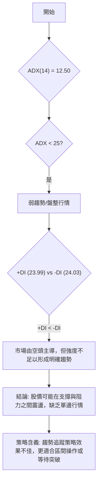

**ADX 強度對照表**

| ADX 數值範圍 | 趨勢強度 | 市場解讀 |
|--------------|----------|----------|
| 0-25 | 弱趨勢/盤整 | 市場缺乏明確方向，價格在區間內震盪 |
| 25-50 | 中等趨勢 | 趨勢正在形成或已確立，動能適中 |
| 50-75 | 強趨勢 | 趨勢強勁，價格沿單一方向快速移動 |
| 75-100 | 極強趨勢 | 趨勢非常強勁，可能出現超買或超賣 |

當前 ADX 僅為 12.50，表明 TSLA 處於典型的盤整市場，投資者應避免追漲殺跌，而應關注區間的支撐與阻力位，尋找高拋低吸的機會，或等待趨勢明確突破。同時，+DI (23.99) 略低於 -DI (24.03)，雖然差異不大，但仍暗示短線空頭力量略佔優勢，只是這種優勢不足以推動股價形成強勢下跌趨勢。

---

## 3. 圖表形態分析

基於提供的數據，TSLA 目前的價格走勢並未形成具備高信心度的經典圖表形態（如頭肩頂/底、雙頂/底等）。由於數據主要為月線和週線收盤價，且缺乏詳細的日線 K 棒資訊，難以精確識別複雜的幾何形態。因此，本章節將主要側重於價格區間的觀察和指標型解讀。

### 🔍 形態識別系統

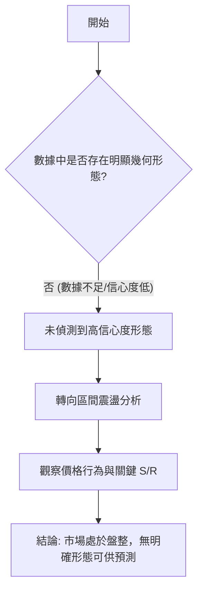

**形態信心度表格**

| 形態 | 信心度 | 判斷依據（引用數據） | 完成度 | 目標價（附計算式） |
|------|--------|----------------------|--------|--------------------|
| 區間震盪 | 70% | ADX (14) = 12.50 (弱趨勢/盤整)；價格在 $370-$430 區間波動；布林通道中軌 ($400.88) 附近徘徊 | 進行中 | 上軌 $429.77 / 下軌 $371.99 |

由於數據中未偵測到具備高信心度的圖表形態（如頭肩頂、雙底等），故不進行複雜形態的目標價計算。當前市場更傾向於區間震盪，其目標價可參考布林通道的上下軌。

### 🕯️ 重要K線形態分析

從提供的近 20 週收盤走勢數據來看，我們可以觀察到一些重要的 K 線行為模式，儘管沒有詳細的開高低收，但週收盤價的變化仍能提供線索。

| 日期 | 收盤價 | RSI | MACD柱 | 週成交量 | K線形態 (推測) | 解讀 | 訊號 |
|------|--------|-----|--------|----------|----------------|------|------|
| 2026-03-29 | $361.83 | 32.8 | -1.764 | 307,356,800 | 潛在錘子線/長下影線 | 在低位獲得支撐，下跌動能減弱 | 🟡 |
| 2026-04-12 | $348.95 | 42.0 | -1.720 | 344,551,600 | 潛在底部反轉K線 | 創下近期新低後迅速拉回，顯示買盤介入 | 🟢 |
| 2026-04-19 | $400.62 | 64.5 | +6.169 | 381,562,600 | 大型陽線/吞噬 | 突破性上漲，確認底部反彈 | 🟢 |
| 2026-05-31 | $435.79 | 53.0 | +0.699 | 167,927,200 | 潛在射擊之星/烏雲蓋頂 | 在高位量能縮減，多頭動能減弱 | 🔴 |
| 2026-06-07 | $391.00 | 37.3 | -4.464 | 225,778,100 | 大型陰線/長黑棒 | 快速下跌，確認高位壓力 | 🔴 |
| 2026-07-12 | $407.76 | 52.0 | +1.192 | 197,900,400 | 中陽線/反彈 | 在支撐位附近反彈，動能恢復 | 🟢 |

**分析**：
- 在 2026 年 3 月底至 4 月初，股價在 $361.83 和 $348.95 附近連續兩週出現止跌跡象，尤其 $348.95 創下低點後迅速反彈，隨後一週的 $400.62 大幅上漲，伴隨 MACD 柱狀圖轉正和 RSI 飆升，確認了短期的底部反轉形態。
- 進入 5 月底，股價在 $435.79 附近達到高點，但隨後的成交量縮小，且 6 月初出現大幅回落，顯示上方壓力沉重，可能形成了短期的頂部形態。
- 最近兩週，股價在 $379.71 獲得支撐後再次反彈，RSI 和 MACD 柱狀圖均呈現積極訊號，表明短線反彈動能仍在。

### 📉 ASCII 走勢形態示意圖

目前的價格走勢更傾向於一個區間震盪的格局，並在嘗試從區間底部反彈。

```
TSLA 近期區間震盪示意圖
價格軸 ($)
$435.79 ┤─────── ╔═════════╗ ─────── (區間上沿/阻力)
$429.77 ┤         ║         ║
$422.04 ┤         ║         ║
$409.28 ┤─────────║───R1───║───────── (關鍵阻力 R1)
$407.76 ┤         ║   ●    ║ ← 當前價格
$400.88 ┤─────────║──MA20──║───────── (布林中軌/MA20)
$393.63 ┤─────────║───S1───║───────── (近期支撐 S1)
$371.99 ┤         ║         ║
$366.31 ┤         ╚═════════╝ ─────── (區間下沿/支撐)
     └───────────────────────────────────
      (時間軸)
```
示意圖顯示，TSLA 股價目前在 $370-$430 之間進行盤整。當前價格 $407.76 位於此區間的中上部，正嘗試突破上方的關鍵阻力 R1 $409.28。

### 🎯 形態目標價計算

由於缺乏明確的幾何形態，我們主要參考區間震盪的邊界作為潛在目標價。
- **區間上沿目標價**：布林通道上軌 $429.77。
- **區間下沿目標價**：布林通道下軌 $371.99。

若未來能有效突破區間上沿 $429.77，則可能形成新的上漲趨勢，目標價可進一步看向 52 週高點 $498.83。反之，若跌破區間下沿 $371.99，則可能加速下跌，目標價看向 52 週低點 $297.82。

---

## 4. 支撐與阻力

精確識別支撐與阻力位對於制定交易策略至關重要。本章節將詳細分析 TSLA 的關鍵價位分布，並結合斐波那契回調位，提供全面的價格結構視角。

### 🗺️ 關鍵價位分布圖（Unicode）

當前 TSLA 股價 $407.76 正處於多個關鍵價位的交匯點。上方有 MA50、R1 等阻力，下方則有 MA20 和 S1 等支撐。

```
TSLA 價位結構分布圖 (2026-07-11)
═══════════════════════════════════════════════════
$434.60 ║████████████████████████║ 強阻力 R3
$429.77 ║▓▓▓▓▓▓▓▓▓▓▓▓▓▓▓▓▓▓▓▓▓▓▓▓║ 布林上軌
$422.04 ║████████████████████    ║ 斐波那契 38.2%
$418.36 ║████████████████████████║ 阻力 R2 (MA200 $418.14)
$409.28 ║████████████████████████║ 關鍵阻力 R1 (MA50 $409.20)
$407.76 ╠════════════════════════╣ ◄ 現價
$400.88 ║▓▓▓▓▓▓▓▓▓▓▓▓▓▓▓▓        ║ 布林中軌 (MA20 $400.88)
$398.32 ║████████████████████████║ 斐波那契 50.0%
$393.63 ║▓▓▓▓▓▓▓▓▓▓▓▓▓▓▓▓        ║ 近期支撐 S1
$382.96 ║████████████████████████║ 強支撐 S2
$374.61 ║████████████████████████║ 斐波那契 61.8%
$371.99 ║▓▓▓▓▓▓▓▓▓▓▓▓▓▓▓▓▓▓▓▓▓▓▓▓║ 布林下軌
$366.31 ║████████████████████████║ 極強支撐 S3
═══════════════════════════════════════════════════
```

### 🚧 阻力位分析表

TSLA 面臨的多重阻力位，將考驗其上漲動能。

| 阻力級別 | 價位 | 形成原因 | 突破難度 | 重要性 |
|----------|------|----------|----------|--------|
| R1 | $409.28 | 近期波段高點聚類；同時接近 MA50 ($409.20) | 中等 | 🟢 突破此位將確認短期反彈動能 |
| R2 | $418.36 | 近期波段高點聚類；同時接近 MA200 ($418.14) | 較高 | 🟡 突破此位將扭轉中期下跌趨勢 |
| R3 | $434.60 | 近期波段高點聚類；接近 52 週斐波那契 38.2% 回調位 | 高 | 🔴 突破此位有望挑戰更高區間 |
| 額外阻力 | $429.77 | 布林通道上軌 | 中等 | 🟡 盤整區間的自然上限 |

當前價格 $407.76 距離 R1 $409.28 僅一步之遙，能否有效突破並站穩，是判斷短期走勢的關鍵。

### 🛡️ 支撐位分析表

TSLA 下方存在多層支撐，為股價提供緩衝。

| 支撐級別 | 價位 | 形成原因 | 守住機率 | 重要性 |
|----------|------|----------|----------|--------|
| S1 | $393.63 | 近期波段低點聚類；接近斐波那契 50.0% 回調位 ($398.32) | 中等 | 🟢 跌破此位可能觸發短期止損 |
| S2 | $382.96 | 近期波段低點聚類 | 較高 | 🟡 跌破此位將確認中期走弱 |
| S3 | $366.31 | 近期波段低點聚類 | 高 | 🔴 跌破此位可能導致更深層次的回調 |
| 額外支撐 | $400.88 | MA20 / 布林通道中軌 | 中等 | 🟢 短期趨勢線，對價格有吸附作用 |

當前價格 $407.76 位於 MA20 $400.88 之上，MA20 將作為短期支撐。若跌破 MA20，則 S1 $393.63 和斐波那契 50% 回調位 $398.32 將是更重要的防線。

### 📐 斐波那契回調位分析

斐波那契回調位基於 TSLA 過去 52 週的高點 $498.83 和低點 $297.82 計算得出，這些價位通常被市場視為潛在的支撐或阻力。

| 回調比例 | 價位 | 意義 |
|----------|------|------|
| 0.0% (52W High) | $498.83 | 52週高點，極強阻力 |
| 23.6% | $451.39 | 上漲趨勢中的淺層回調位，或下跌反彈的初步阻力 |
| 38.2% | $422.04 | 較重要的回調位，可能形成阻力或支撐 |
| 50.0% | $398.32 | 關鍵心理關口，常作為強支撐或阻力 |
| 61.8% | $374.61 | 黃金分割點，極強支撐或阻力 |
| 78.6% | $340.84 | 深層回調位，或下跌反彈的最後一道防線 |
| 100.0% (52W Low) | $297.82 | 52週低點，極強支撐 |

當前價格 $407.76 位於斐波那契 38.2% ($422.04) 和 50.0% ($398.32) 回調位之間。這表明股價仍處於 52 週上漲波段的較深回調區域。
- **上方阻力**：首先面臨 38.2% 回調位 $422.04 的阻力。若能突破，則可能進一步挑戰 23.6% 回調位 $451.39。
- **下方支撐**：50.0% 回調位 $398.32 是一個非常重要的心理和技術支撐。若能守住此位，則有望繼續反彈；若跌破，則可能進一步探向 61.8% 回調位 $374.61。
當前股價在 50% 回調位上方運行，顯示多頭仍有守住關鍵區域的意願。

---

## 5. 技術指標深度解讀

本章節將對 TSLA 的主要技術指標進行深入分析，包括移動平均線、RSI、MACD、布林通道和成交量，並解釋它們之間的相互關係。

### 🎛️ 指標訊號總覽

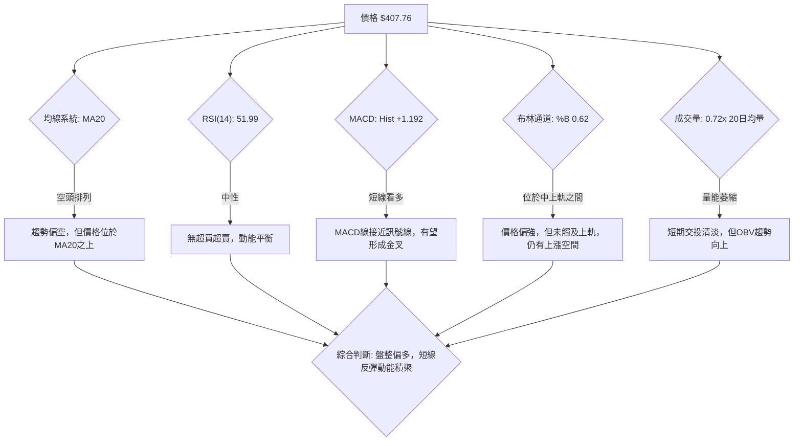

### 📈 移動平均線排列分析

TSLA 的移動平均線系統目前呈現空頭排列，但價格與短期均線的關係顯示出一些微妙變化。

```
TSLA 移動平均線排列 (2026-07-11)
════════════════════════════════════════════════════
$418.14 ║████████████████████████║ MA200 (長期壓力)
$409.20 ║████████████████████████║ MA50 (中期壓力)
$407.76 ╠════════════════════════╣ ◄ 現價
$400.88 ║▓▓▓▓▓▓▓▓▓▓▓▓▓▓▓▓        ║ MA20 (短期支撐)
════════════════════════════════════════════════════
```
- **MA20 ($400.88)**：當前價格 $407.76 位於 MA20 之上，顯示短期內多頭佔優，MA20 構成即時支撐。
- **MA50 ($409.20)**：價格位於 MA50 之下，MA50 形成中期阻力。
- **MA200 ($418.14)**：價格位於 MA200 之下，MA200 形成長期阻力。
- **均線排列**：MA20 < MA50 < MA200，這是典型的**空頭排列**。儘管價格短期站上 MA20，但整體中長期趨勢仍偏空。這表明當前的反彈可能只是下跌趨勢中的修正，除非價格能有效突破並站穩 MA50 和 MA200，否則中長期趨勢難以扭轉。

### 📉 RSI(14) 分析

RSI (Relative Strength Index) 用於衡量價格變動的強度和速度，判斷超買或超賣。
- **RSI(14) 數值**：51.99
- **RSI 進度條**：▓▓▓▓▓▓▓▓▓▓▓░░░░░░░░░ 51.99%
- **超買超賣區間**：RSI 位於 30-70 的中性區間。這表明市場既沒有超買也沒有超賣，價格動能相對平衡，沒有極端情緒。
- **RSI 背離**：根據提供的數據，**無明顯背離訊號**。價格在近期低點後反彈，RSI 也同步回升，顯示價格與動能指標之間沒有明顯的背離現象。這意味著當前的反彈是健康的，沒有隱藏的風險或機會。

### 📊 MACD(12/26/9) 訊號解讀

MACD (Moving Average Convergence Divergence) 用於識別趨勢變化和動能。
- **MACD 線**：-0.144
- **MACD Signal 線**：-1.335
- **MACD Hist (柱狀圖)**：+1.192
- **訊號解讀**：
    - MACD 線 (-0.144) 仍低於 Signal 線 (-1.335)，這傳統上被視為空頭訊號。
    - 然而，MACD 柱狀圖從負值轉為正值 (+1.192)，這是一個**短期看多訊號**。柱狀圖轉正意味著 MACD 線正在加速向上，並逐漸接近 Signal 線，預示著可能即將形成「金叉」（MACD 線上穿 Signal 線）。
    - 綜合來看，MACD 顯示短期動能正在從空頭轉向多頭，但尚未完全確認趨勢反轉。這與 RSI 的中性表現相符，表明市場正在積聚反彈動能。

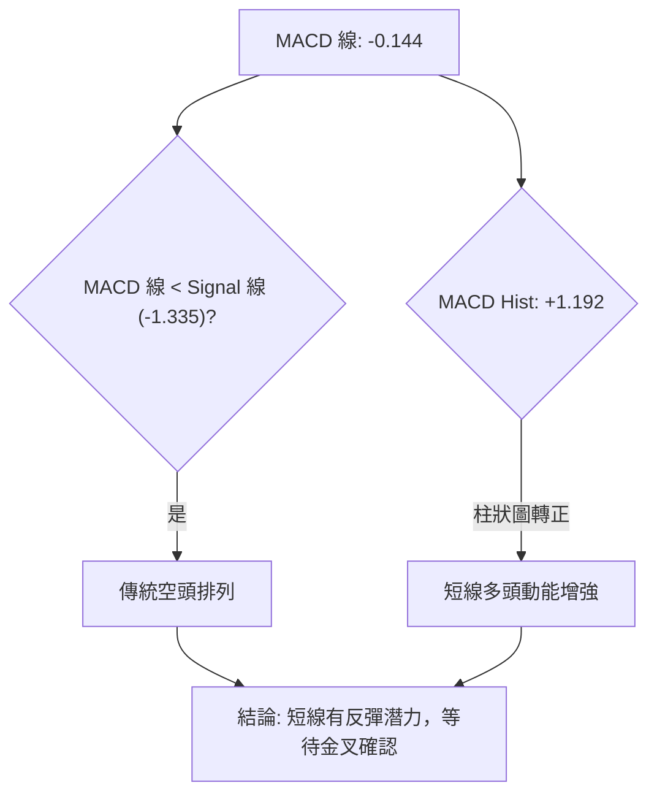

### 📦 布林通道分析

布林通道 (Bollinger Bands) 用於衡量價格的波動區間。
- **BB上軌**：$429.77
- **BB中軌(MA20)**：$400.88
- **BB下軌**：$371.99
- **BB %B**：0.62 (0=下軌, 0.5=中軌, 1=上軌)
- **價格位置**：當前價格 $407.76 位於布林通道中軌 $400.88 和上軌 $429.77 之間。
- **解讀**：價格在中上軌之間運行，顯示短期走勢偏強，但尚未觸及上軌，因此仍有向上空間。布林通道的帶寬（上軌與下軌之間的距離）決定了波動率。目前帶寬為 $429.77 - $371.99 = $57.78，相對於 $407.76 的價格，顯示波動率適中。由於 ADX 顯示盤整，價格很可能在布林通道的上下軌之間震盪。

```
TSLA 布林通道示意圖
價格軸 ($)
$429.77 ┤═══════════════════════════════ (BB上軌)
        ║                                
$407.76 ┤               ● ← 現價         
$400.88 ┤───────────────┼─────────────── (BB中軌 / MA20)
        ║               │                
$371.99 ┤═══════════════╧═══════════════ (BB下軌)
     └───────────────────────────────────
      (時間軸)
```

### 💹 成交量分析（量價配合度）

成交量是價格走勢的燃料，量價配合度可以驗證趨勢的有效性。
- **最新成交量**：33,342,700
- **20日均量**：46,415,260
- **量比**：0.72x (最新成交量 / 20日均量)
- **OBV趨勢**：OBV > MA → 量能支撐上漲
- **解讀**：
    - 當前成交量 ($33.3M) 低於 20 日均量 ($46.4M)，量比僅為 0.72x。這表明近期交易活動相對清淡，可能反映市場在盤整中的觀望情緒。
    - 然而，OBV (On Balance Volume) 趨勢顯示 OBV 線位於其移動平均線之上，這是一個**看多訊號**。OBV 趨勢向上表明在價格上漲的交易日裡，累積的成交量大於下跌的交易日，這意味著儘管單日成交量可能偏低，但整體上買盤力量仍在累積，量能對價格上漲形成支撐。
    - 綜合來看，雖然短期成交量縮小，但 OBV 的積極表現為當前的反彈提供了量能上的支撐，顯示這波反彈並非無量空漲。

---

## 6. 動能與波動率

本章節將評估 TSLA 的當前動能與波動率特性，這對於理解股票的風險收益特徵和選擇合適的交易策略至關重要。

### ⚡ 動能評估四象限

動能評估四象限分析結合了動能強度和波動率，以判斷股票的當前市場狀態。

| 象限 | 動能 | 波動 | 當前狀態 | 評估 |
|------|------|------|----------|------|
| Q1 | 強 | 低 | - | 最佳機會 (趨勢明確，風險可控) |
| Q2 | 弱 | 低 | - | 謹慎觀望 (缺乏動能，波動小，無交易機會) |
| Q3 | 強 | 高 | - | 高風險高收益 (趨勢不明顯，動能強，波動大) |
| Q4 | 弱 | 高 | ✓ | 避免進場 (缺乏方向，波動大，風險高) |

**TSLA 當前狀態評估**：
- **動能**：RSI 51.99 (中性)，MACD 柱狀圖轉正 (+1.192) (短線看多)，ADX 12.50 (弱趨勢)。綜合來看，短期動能正在積聚，但整體趨勢動能較弱。
- **波動**：ATR(14) $20.17，佔價格的 4.95%。Beta 1.802。這屬於中高波動率股票。

因此，TSLA 目前最接近 **Q4（弱動能，高波動）**。
雖然 MACD 柱狀圖顯示短線動能正在增強，但 ADX 極低，表明這種動能不足以推動股價形成強趨勢，更可能在一個寬幅區間內震盪。Beta 值高也支持其高波動的特性。在這種情況下，市場缺乏明確方向，但價格波動劇烈，交易風險較高，更應謹慎。

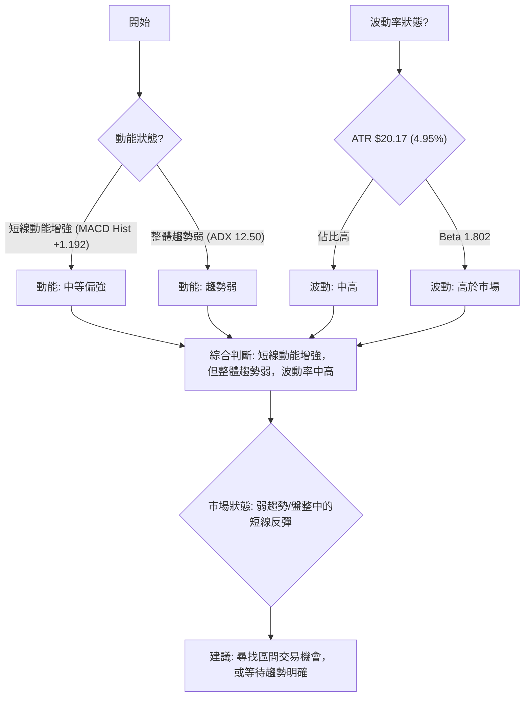

### 📊 ATR 波動率分析

ATR (Average True Range) 衡量股票的平均每日價格波動範圍。
- **ATR(14)**：$20.17
- **ATR佔價格比重**：4.95% ($20.17 / $407.76)
- **解讀**：
    - TSLA 的 ATR 數值 $20.17 相對於其股價 $407.76 來說，佔比接近 5%。這表明 TSLA 是一隻**波動性較高的股票**。高波動性意味著價格在短時間內可能出現較大的漲跌幅，潛在的收益和風險都較大。
    - **止損距離建議**：對於波動性較高的股票，止損點的設定需要更寬鬆，以避免被市場的日常波動「洗出場」。一般建議將止損點設定在 1.5 到 2 倍的 ATR 距離之外。
        - 1.5 x ATR = 1.5 x $20.17 = $30.26
        - 2.0 x ATR = 2.0 x $20.17 = $40.34
        - 若以當前價格 $407.76 考慮，若向上突破，止損點可設定在 $407.76 - $30.26 = $377.50 或 $407.76 - $40.34 = $367.42 附近。這與 S2 ($382.96) 和 S3 ($366.31) 支撐位有重疊，可作為參考。

### 📐 Beta 與市場相關性

Beta 值衡量股票相對於整體市場（通常是 S&P 500 指數）的波動性。
- **Beta**：1.802
- **解讀**：
    - TSLA 的 Beta 值為 1.802，遠大於 1。這意味著 TSLA 的股價波動性**顯著高於大盤**。當市場上漲 1% 時，TSLA 理論上會上漲約 1.802%；當市場下跌 1% 時，TSLA 也會下跌約 1.802%。
    - **投資策略含義**：對於追求高成長和高收益的投資者，高 Beta 股票提供了更大的潛力，但也伴隨著更高的風險。在牛市中，TSLA 可能會跑贏大盤；在熊市中，其跌幅也可能更大。這要求投資者在配置 TSLA 時，需要對市場的整體走勢有清晰的判斷，並做好嚴格的風險控制。

---

## 7. 多時框架總結

本章節將彙整各時框架的分析結果，並根據多時框收斂規則，得出最終的趨勢判斷和交易方向。

### 📋 時框架評分表

| 時框架 | 趨勢方向 | 動能 | 均線排列 | 形態 | 綜合評分 (1-10) | 建議 |
|--------|----------|------|----------|------|-----------------|------|
| 長期 (月線) | 🟢 上漲中的回調 | 🟡 中性 | 🟡 混合 | 🟡 區間盤整 | 6 | 區間觀望 |
| 中期 (週線) | 🟡 盤整偏多 | 🟢 增強 | 🔴 空頭排列 | 🟡 築底反彈 | 5 | 區間操作 |
| 短期 (日線) | 🟢 反彈中 | 🟢 強勁 | 🔴 空頭排列 | 🟡 區間震盪 | 6 | 短線偏多 |

### 🔲 綜合訊號矩陣

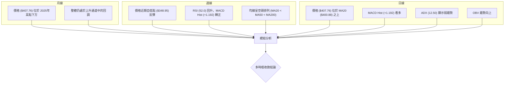

### ⚖️ 多時框收斂結論

根據嚴格要求的多時框收斂規則：

1.  **趨勢行情判斷**：首先判斷 ADX。TSLA 的 ADX(14) 為 12.50，遠低於 25。這明確指示當前市場處於**盤整行情**，而非趨勢行情。

2.  **主導時框與策略**：在盤整行情下，應以日線布林通道上下軌為主要交易區間。
    *   **日線級別**：當前價格 $407.76 位於 MA20 ($400.88) 之上，且 MACD 柱狀圖轉正，RSI 位於中性區，顯示短線有反彈動能。布林通道 %B 為 0.62，價格在中上軌之間運行，偏向通道上沿。
    *   **週線級別**：近期股價在 $379.71 附近獲得支撐後反彈，RSI 和 MACD 柱狀圖均顯示積極訊號，但均線仍為空頭排列，價格受 MA50 和 MA200 壓制。這表明中期趨勢仍在試圖築底，尚未形成明確的多頭趨勢。
    *   **月線級別**：長期來看，股價在 2025 年大漲後，2026 年上半年處於高位震盪回調階段，整體仍是上升通道中的修正。

3.  **衝突處理與最終結論**：
    日線指標（MACD柱狀圖、RSI回升）顯示短線有反彈動能，偏多。
    週線均線（空頭排列）顯示中期仍有壓力，偏空。
    月線則顯示長期處於回調。
    由於 ADX 顯示為盤整行情，主策略應以日線布林通道區間操作為主。雖然均線空頭排列，但動能指標短線轉強，且價格位於 MA20 和布林中軌上方。

**因此，多時框收斂後的最終結論是：TSLA 當前處於盤整行情中的短線反彈階段，整體方向為**🟡 中性偏多，建議以區間操作為主，等待明確的方向性突破。**

---

## 8. 交易策略建議

基於多時框架分析的結論，TSLA 目前處於盤整行情中的短線反彈階段，綜合評分顯示中性偏多。因此，我們將主要推薦區間操作策略，並準備好突破後的追蹤策略。

### 🗺️ 策略決策流程圖

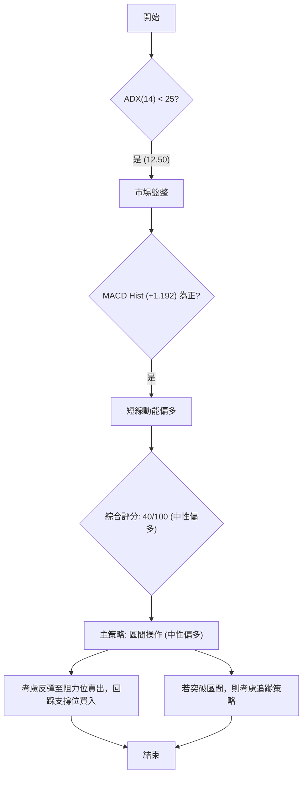

### 🧭 策略路由（依評分卡分流）

**當前主策略方向 = 🟡 中性偏多，以區間操作為主（綜合評分 40/100）**

基於綜合評分 40/100，市場處於中性偏空但短線動能轉好的狀態。因此，主策略應為區間操作，並密切關注區間突破的機會。

### 🎯 價格情境階梯（Price Scenarios）

以下為 TSLA 在不同價格情境下的走勢預期：

| 觸發條件 | 下一目標 | 後續延伸 | 情境含義 |
|----------|----------|----------|----------|
| 突破 R1 $409.28 | R2 $418.36 | R3 $434.60 (布林上軌 $429.77) | 短線轉強，有望挑戰中期阻力 |
| 站穩現價區間 ($400.88 - $409.28) | — | — | 繼續在 MA20 和 MA50 之間震盪 |
| 跌破 S1 $393.63 | S2 $382.96 | S3 $366.31 (布林下軌 $371.99) | 中期轉弱，可能下探更深支撐 |

### 📊 情境機率分佈

根據當前技術指標狀態，對未來三種情境的機率估計：

| 情境 | 機率 | 主要依據 |
|------|------|----------|
| 繼續上行 / 反彈 | 45% | MACD柱狀圖轉正 (+1.192)，RSI (51.99) 中性偏強，OBV趨勢向上，價格位於 MA20 ($400.88) 和布林中軌之上。 |
| 區間震盪 | 40% | ADX (12.50) 顯示弱趨勢/盤整，MA50 ($409.20) 和 MA200 ($418.14) 形成上方阻力，價格受到壓縮。 |
| 回落 / 再探底 | 15% | 均線空頭排列，成交量低於均量，若未能突破阻力，可能再次回落測試支撐。 |

### 🟢 主策略詳情（區間操作與反彈）

鑑於 ADX 顯示盤整，主策略將側重於區間內的高拋低吸，並輔以短期反彈追蹤。

| 策略要素 | 策略 A：區間低吸 (反彈) | 策略 B：突破追多 (待確認) |
|----------|-----------------------|--------------------------|
| 進場條件 | 價格回踩 S1 $393.63 或 MA20 $400.88 附近，並出現止跌訊號 (如K線反轉) | 價格有效站穩 R1 $409.28 並伴隨放量，或突破 MA50 $409.20 |
| 進場價格 | $395.00 - $400.00 | $410.00 (突破 R1 後) |
| 目標價 T1 | R1 $409.28 | R2 $418.36 |
| 目標價 T2 | R2 $418.36 (或布林上軌 $429.77) | R3 $434.60 (或斐波那契 38.2% $422.04) |
| 止損價格 | S2 $382.96 (跌破 S1 $393.63 並確認) | MA20 $400.88 (跌破 R1 後迅速跌回) |
| 風險報酬比 | (409.28 - 397.50) / (397.50 - 382.96) = 11.78 / 14.54 ≈ 0.81:1 (T1) | (418.36 - 410.00) / (410.00 - 400.88) = 8.36 / 9.12 ≈ 0.91:1 (T1) |
| 成功機率 | 55% | 45% |
| 建議倉位 | 輕倉至中倉 (10-15%) | 輕倉 (5-10%) |

**風險報酬比說明**：策略A的風險報酬比略低於1，表明短期反彈空間有限，但成功機率較高。策略B在突破確認後追多，風險報酬比也接近1，需嚴格止損。兩者都反映了盤整行情下的謹慎操作原則。

### 🔴 反向風險觸發點（對沖提示）

以下情況可能推翻上述主策略，建議考慮對沖或減倉：
1.  **跌破 S2 $382.96**：若價格有效跌破 S2 $382.96，將確認中期走弱，可能觸發更深層次的下跌。
2.  **ADX 快速上升且 -DI 顯著高於 +DI**：若 ADX 突破 25 並快速上升，同時 -DI 顯著高於 +DI，則表明空頭趨勢正在確立，盤整格局被打破。
3.  **MACD 柱狀圖再次轉負並形成死叉**：若 MACD 線未能上穿 Signal 線，反而再次下行並形成死叉，則短線反彈動能衰竭。

### ⭐ 整體訊號強度評星

```
╔══════════════════════════════════════════════════════════════╗
║                    整體訊號強度評星 — TSLA                     ║
╠══════════════════════════════════════════════════════════════╣
║ 做多訊號強度：★★☆☆☆  (2/5星) 理由：短線動能指標轉好，但中長期趨勢偏弱，上方阻力重重。 ║
║ 做空訊號強度：★★★☆☆  (3/5星) 理由：均線空頭排列，但ADX顯示盤整，下方支撐尚存。     ║
║ 整體可信度：  ★★★☆☆  (3/5星) 理由：市場缺乏明確趨勢，指標多空交織，需謹慎操作。     ║
╚══════════════════════════════════════════════════════════════╝
```

---

## 9. 風險提示與監控

在盤整行情中進行交易，風險管理尤為重要。本章節將提供關鍵監控指標和風險場景分析，以及重要的風險管理建議。

### ✅ 關鍵監控指標 Checklist

以下為 TSLA 交易期間需要密切關注的關鍵技術指標清單，以確保及時調整策略。

```
╔══════════════════════════════════════════════════════════════╗
║                關鍵監控指標 Checklist — TSLA                   ║
╠══════════════════════════════════════════════════════════════╣
║ [ ] 價格是否站穩 MA20 ($400.88) 及布林中軌？             🟢 否則轉弱 ║
║ [ ] 價格能否有效突破 R1 ($409.28) 及 MA50 ($409.20)？    🟢 否則受阻 ║
║ [ ] RSI(14) 是否進入超買 (>70) 或超賣 (<30) 區間？       🟡 警示訊號 ║
║ [ ] MACD 線是否形成金叉 (上穿 Signal) 或死叉 (下穿 Signal)？🟢 確認動能 ║
║ [ ] MACD 柱狀圖是否持續為正並放大，或轉負？              🟢 確認動能 ║
║ [ ] ADX(14) 是否突破 25 並指示新趨勢形成？               🟡 趨勢轉變 ║
║ [ ] +DI/-DI 差距是否擴大，指示單邊力量增強？             🟡 趨勢確認 ║
║ [ ] 成交量是否伴隨價格突破而放大，或伴隨下跌而縮小？     🟢 量價配合 ║
║ [ ] 是否出現任何高信心度的圖表形態？                     🟡 形態確認 ║
║ [ ] 是否有重大新聞或基本面變化影響股價？                 🔴 基本面風險 ║
╚══════════════════════════════════════════════════════════════╝
```

### ⚠️ 風險場景分析

針對 TSLA 當前技術面狀態，預測三種可能的市場情境：

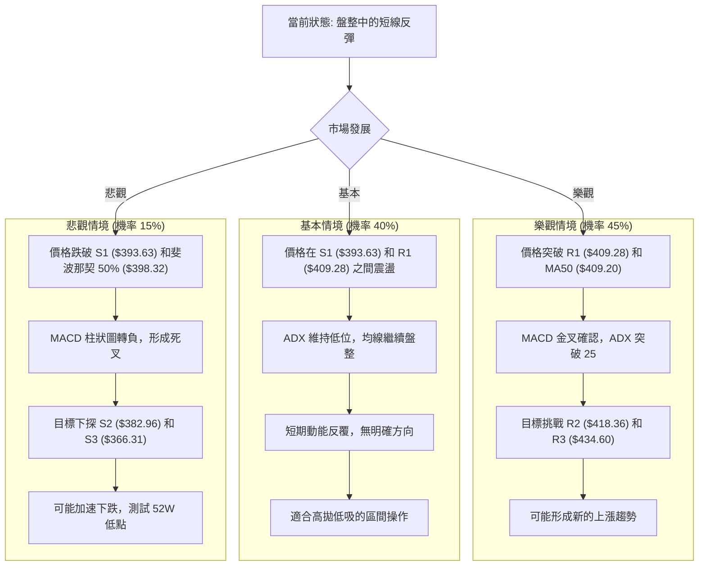

### 🛡️ 風險管理重要提醒

1.  **嚴格止損**：由於 TSLA 波動性較高 (ATR $20.17, Beta 1.802)，必須設定並嚴格執行止損點。在盤整行情中，價格可能出現假突破或假跌破，因此止損點的設置應考慮 ATR 範圍，避免過於緊湊。
2.  **倉位管理**：在趨勢不明確的盤整市場中，應採取較輕的倉位，避免重倉。將資金分散投資於多個標的，或降低單一標的的倉位比重。
3.  **等待確認**：對於任何突破或反轉訊號，務必等待多個指標的相互確認，避免過早入場。例如，價格突破阻力時，應觀察是否伴隨成交量放大、RSI 進入強勢區、MACD 形成金叉等。
4.  **關注市場情緒與基本面**：儘管本報告側重技術分析，但 TSLA 作為高成長、高關注度的股票，容易受新聞事件、公司財報、產業政策等基本面因素影響，尤其在盤整期，任何利好或利空消息都可能打破平衡。
5.  **多空平衡**：在盤整市場中，不宜過度看多或看空。當價格接近區間上沿時考慮減倉或獲利了結；當價格接近區間下沿時考慮輕倉介入。

---

## 📋 報告總結

```
╔════════════════════════════════════════════════════════════╗
║                   TSLA 技術分析報告總結                      ║
╠════════════════════════════════════════════════════════════╣
║ 報告日期：2026-07-11                                         ║
║ 當前價格：$407.76                                            ║
║ 分析評級：⚖️ 中性偏多 (市場處於盤整，短線動能轉強，但中長期壓力仍在) ║
║                                                              ║
║ 關鍵結論：                                                   ║
║ ├─ 長期趨勢：🟢 上升通道中的回調，整體趨勢未變。             ║
║ ├─ 中期趨勢：🟡 盤整築底或震盪反彈，均線空頭排列形成壓力。   ║
║ ├─ 短期趨勢：🟢 短線反彈動能積聚，MACD柱狀圖轉正，價格位於MA20之上。 ║
║ ├─ 關鍵支撐：S1 $393.63 (斐波那契 50% 回調位 $398.32 附近)  ║
║ ├─ 關鍵阻力：R1 $409.28 (MA50 $409.20 附近)                 ║
║ └─ 分析師目標：無統一分析師目標，但區間上沿可參考布林上軌 $429.77。║
║                                                              ║
║ 最優策略組合：                                               ║
║ 1. 🥇 最佳機會：**區間低吸反彈策略**：在 S1 $393.63 或 MA20 $400.88 附近尋找止跌訊號輕倉買入，目標 R1 $409.28。 ║
║ 2. 🥈 次選機會：**突破追多策略**：若價格有效站穩 R1 $409.28 並伴隨放量，可輕倉追多，目標 R2 $418.36。       ║
║ 3. 🥉 保守選擇：**觀望等待**：若對盤整行情把握不大，可等待 ADX 突破 25，趨勢明確後再考慮進場。            ║
╚════════════════════════════════════════════════════════════╝
```

---

> ⚠️ **免責聲明**：本報告為 AI 自動生成之技術分析，所有數據及估算均基於提供的歷史價格資訊。本報告**僅供研究與學術參考**，**不構成任何投資建議**。投資有風險，入市需謹慎。

---

*報告生成時間：2026-07-11 ｜ 數據來源：Yahoo Finance ｜ 分析框架：多時框技術分析*