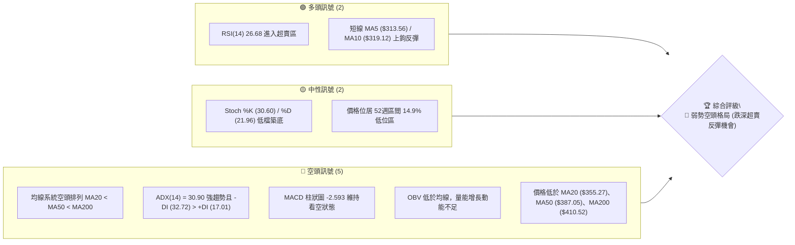
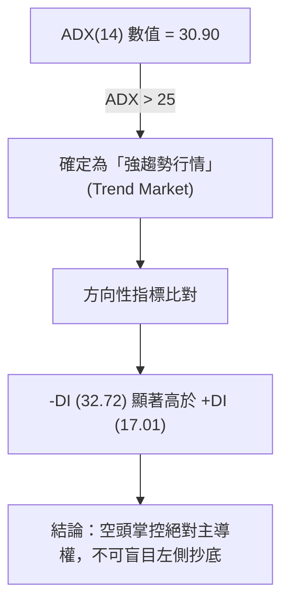
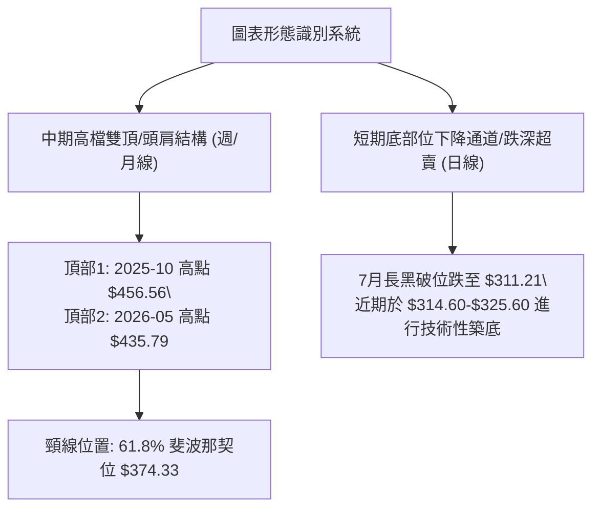
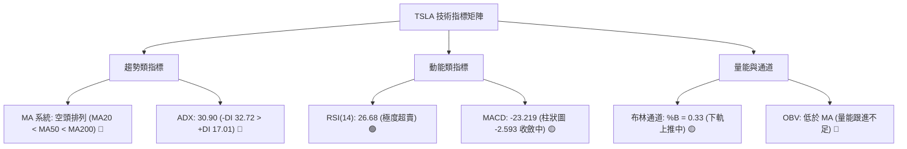
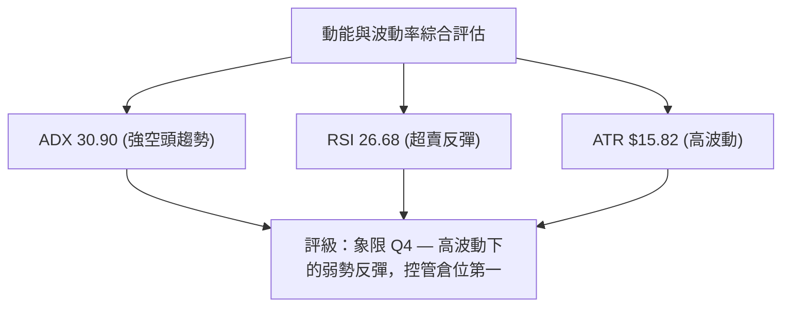
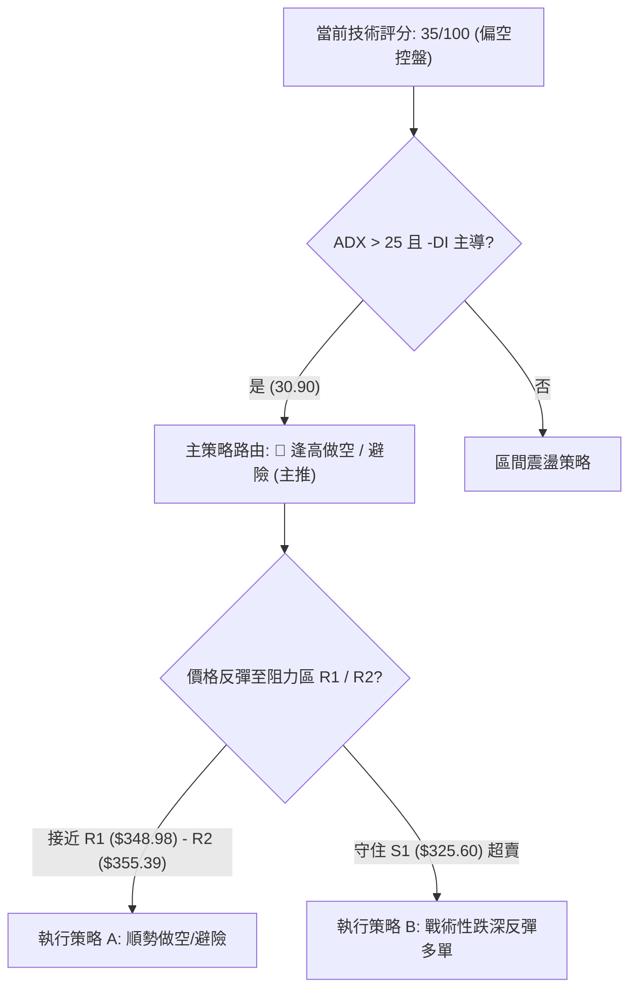
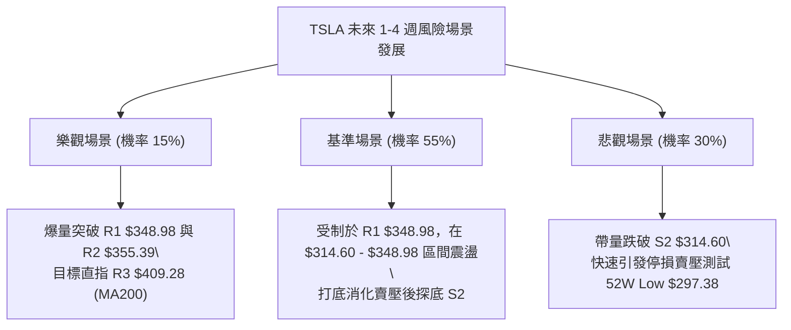

# TSLA 技術分析報告

> **報告日期**：2026-08-04 ｜ **語言**：繁體中文 ｜ **數據來源**：Yahoo Finance ｜ **當前價格**：$327.35

---

## 目錄

| 章節 | 內容 |
|------|------|
| [1. 技術面概覽](#1-技術面概覽) | 訊號儀表板、核心指標、評分卡 |
| [2. 趨勢分析](#2-趨勢分析) | 多時框趨勢、長中短期走勢 |
| [3. 圖表形態分析](#3-圖表形態分析) | 形態識別、K線組合、目標價 |
| [4. 支撐與阻力](#4-支撐與阻力) | 關鍵價位、斐波那契回調 |
| [5. 技術指標深度解讀](#5-技術指標深度解讀) | MA/RSI/MACD/布林/成交量 |
| [6. 動能與波動率](#6-動能與波動率) | 動能評估、ATR、Beta |
| [7. 多時框架總結](#7-多時框架總結) | 時框架評分矩陣 |
| [8. 交易策略建議](#8-交易策略建議) | 多空策略、風險報酬比 |
| [9. 風險提示與監控](#9-風險提示與監控) | 監控指標、風險場景 |

---

## 1. 技術面概覽

### 🎯 技術訊號儀表板



### 📊 核心指標速覽表

| 指標類別 | 指標名稱 | 當前數值 | 訊號 | 解讀 |
|----------|----------|----------|------|------|
| **價格** | 當前價格 | $327.35 | 🔴 | 位於 52 週高低價區間（$297.38 - $498.83）之 14.9% 位置 |
| **均線** | MA20 | $355.27 | 🔴 | 價格低於 MA20 (-7.86%)，下行壓力顯著 |
| **均線** | MA50 | $387.05 | 🔴 | 中期趨勢偏空，形成上方重大移動阻力 |
| **均線** | MA200 | $410.52 | 🔴 | 長期牛熊分界線失守，整體結構轉空 |
| **動能** | RSI(14) | 26.68 | 🟢 | 低於 30 達到極度超賣，具備短線技術性反彈需求 |
| **動能** | MACD(12,26,9) | -23.219 | 🔴 | DIF 線遠低於零軸，MACD 柱狀圖 -2.593 仍處空方控盤 |
| **趨勢強度**| ADX(14) | 30.90 | 🔴 | ADX > 25 代表強趨勢，-DI (32.72) 主導空頭趨勢 |
| **波動** | ATR(14) | $15.82 | 🟡 | 日內平均波幅達 4.83%，屬高波動特徵 |
| **通道** | 布林 %B | 0.33 | 🟡 | 位於布林下軌（$273.98）與中軌（$355.27）之間 |

### 🏆 技術評分卡

```
╔══════════════════════════════════════════════════════════════╗
║              TSLA 技術評分卡 — (2026-08-04)                  ║
╠══════════════════════════════════════════════════════════════╣
║ 趨勢強度      ▓▓▓▓▓▓▓▓░░░░░░░░░░░░  40/100  🔴 空頭控盤      ║
║ 動能指標      ▓▓▓▓▓▓░░░░░░░░░░░░░░  30/100  🔴 動能疲弱      ║
║ 支撐穩定度    ▓▓▓▓▓▓▓▓▓▓░░░░░░░░░░  50/100  🟡 臨近 S1/S2    ║
║ 成交量配合    ▓▓▓▓▓▓▓▓░░░░░░░░░░░░  40/100  🔴 量比 0.82x    ║
║ 形態完整度    ▓▓▓▓▓▓▓▓░░░░░░░░░░░░  40/100  🔴 頭部破位      ║
║ 均線排列      ▓▓▓▓░░░░░░░░░░░░░░░░  20/100  🔴 全面空頭      ║
╠══════════════════════════════════════════════════════════════╣
║ 綜合評分      ▓▓▓▓▓▓▓░░░░░░░░░░░░░  35/100  🔴 偏空控盤      ║
╚══════════════════════════════════════════════════════════════╝
```

---

## 2. 趨勢分析

### 🌐 多時框趨勢分析

```mermaid
graph TD
    A["月線層級 (長期: 12-24個月)"] -->|"頂部回落破位"| B["中立偏空: 自高點 $456.56 回撤至 $327.35"]
    B --> C["週線層級 (中期: 3-6個月)"]
    C -->|"波段低點聚類跌破"| D["強烈空頭: 均線呈現空頭排列 MA20<MA50<MA200"]
    D --> E["日線層級 (短期: 1-4週)"]
    E -->|"RSI("14")=26.68 超賣"| F["短線反彈: 守住 S1 $325.60，尋求測試 R1 $348.98"]
```

### 📈 長期趨勢 — 12個月走勢圖（Unicode）

```
TSLA 月線走勢圖（2025-09 至 2026-08）
價格軸 ($)
$460 ┤                    ● (2025-10: $456.56 - 52W頂部)
$440 ┤              ●          ●             ●
$420 ┤                                   ●
$400 ┤                                                 ●
$380 ┤                                                            ●
$360 ┤                                                                      ●
$340 ┤        ●
$320 ┤                                                                             ● (現價 $327.35)
$300 ┤                                                                          ● (2026-07: $311.21)
     └─────────────────────────────────────────────────────────────────────────────
       09/25 10/25 11/25 12/25 01/26 02/26 03/26 04/26 05/26 06/26 07/26 08/26
```

**歷史走勢特徵分析表（近 12 個月收盤價）**：

| 月份 | 收盤價 | MoM 變動 | 走勢特徵分析 |
|------|--------|----------|--------------|
| 2025-09 | $444.72 | +33.20% | 多頭強勢發動，成交量放大突破前期盤整區 |
| 2025-10 | $456.56 | +2.66% | 創下近一年高點（52W 高點衝高至 $498.83），隨後高檔滯漲 |
| 2025-11 | $430.17 | -5.78% | 獲利回吐賣壓現形，回撤至 MA20 尋求支撐 |
| 2025-12 | $449.72 | +4.54% | 年底作帳行情反彈，二次測試高點未果形成雙頂雛形 |
| 2026-01 | $430.41 | -4.29% | 高位震盪區間，買盤跟進意願開始下降 |
| 2026-02 | $402.51 | -6.48% | 跌破 400 整數關卡，短期均線交叉向下 |
| 2026-03 | $371.75 | -7.64% | 測試 61.8% 斐波那契回調位（$374.33），空頭掌控局勢 |
| 2026-04 | $381.63 | +2.66% | 技術性弱勢反彈，受制於 MA50 壓力 |
| 2026-05 | $435.79 | +14.19% | 季報消息面激勵形成反彈高點，完成左側右頭構造 |
| 2026-06 | $420.60 | -3.49% | 高檔再次失守 MA20，買盤迅速退潮 |
| 2026-07 | $311.21 | -26.01% | 主跌段爆量長黑下殺，直接貫穿 MA200 與支撐層 |
| 2026-08 | $327.35 | +5.19% | 探底至 S2 $314.60 附近後觸及 RSI 超賣反彈 |

### 📊 中期趨勢（週線分析）

中期結構顯示，TSLA 在 2026 年 7 月經歷了嚴重的瀑布式下跌（自 $407.76 跌至 $311.21），目前週線級別之 MACD 柱線為 -2.593，雖空頭擴張動能收斂，但整體均線已呈現「空頭排列」（MA20: $355.27 < MA50: $387.05 < MA200: $410.52）。上方重重均線壓制反彈空間，阻力關卡明確。

```
週線結構阻力與支撐示意圖
阻力區 3 ── $409.28 (R3 / MA200 結構重壓) ────────────────
阻力區 2 ── $355.39 (R2 / MA20 均線壓力) ────────────────
阻力區 1 ── $348.98 (R1 / 78.6% 斐波那契位 $340.49-$348.98) ─
現價區   ── $327.35 (現價軸) ═════════════════════════════
支撐區 1 ── $325.60 (S1 近期波段低點聚類) ───────────────
支撐區 2 ── $314.60 (S2 7月鞏固低點) ───────────────────
強支撐區 ── $297.38 (52周最低點) ───────────────────────
```

### ⚡ 趨勢強度評估（ADX 解讀）



| 指標名稱 | 數值 | 狀態門檻 | 當前判定 | 技術含義 |
|----------|------|----------|----------|----------|
| **ADX (14)** | 30.90 | > 25.0 | 強趨勢 | 擺脫盤整，處於單邊趨勢運行中 |
| **+DI (14)** | 17.01 | - | 多頭動能衰退 | 買盤發力嚴重不足 |
| **-DI (14)** | 32.72 | > +DI | 空頭主導 | 賣壓強勁，趨勢向下延伸 |

---

## 3. 圖表形態分析

### 🔍 形態識別系統



#### 形態信心度與目標價評估表

| 形態名稱 | 信心度 | 判斷依據（引用數據） | 完成度 | 目標價計算式與精確數值 |
|----------|--------|----------------------|--------|------------------------|
| **中期雙頂結構 (Double Top)** | 75% | 頂部一 $456.56、頂部二 $435.79，2026-07 實體K線有效跌破頸線 $374.33（61.8% 斐波位）。 | 85% | 頸線 $374.33 - 形態高度 ($456.56 - $374.33 = $82.23) = **$292.10**（接近 52W 低點 $297.38） |
| **短線下降楔形/超賣反彈** | 55% | 日線 RSI 觸及 26.68，價格於 S2 ($314.60) 與 S1 ($325.60) 止跌。 | 40% | 向上目標為 R1 **$348.98** 與 R2 **$355.39**（MA20 位置） |

### 🕯️ 重要 K 線形態分析（近 5 個月）

| 月份 | 收盤價 | K 線形態 | 解讀 | 訊號 |
|------|--------|---------|------|------|
| 2026-04 | $381.63 | 弱勢小陽星 | 止跌試探，成交量未見放大，多頭買盤猶豫 | 🟡 中性 |
| 2026-05 | $435.79 | 中長紅K棒 | 多頭強勢反撲測試高點，但未突破前高 $456.56 | 🟢 看多 |
| 2026-06 | $420.60 | 高檔倒轉錘頭 | 上影線顯示上方解套賣壓沈重，多頭力竭 | 🔴 看空 |
| 2026-07 | $311.21 | 大長黑K棒 | 爆量長黑破位，連續貫穿 MA50 與 MA200，空頭主導 | 🔴 看空 |
| 2026-08 | $327.35 | 下影線小紅K | 探底 $311.21 後受到 S2 ($314.60) 支撐力道引發跌深反彈 | 🟢 看多 (短線) |

### 📉 ASCII 走勢形態示意圖

```
TSLA 雙頂破位與反彈示意圖
$456.56 ───────────● 頂1
                  /  \         ● $435.79 頂2
                 /    \       / \
                /      \     /   \
$374.33 ───────/────────●───/─────\─────────── 頸線 (61.8% 斐波那契位)
              /        頸線位      \
             /                      \
$327.35 ────/────────────────────────\──────● 現價 $327.35 (超賣反彈中)
                                      \    /
$314.60 ───────────────────────────────●──/── S2 支撐波段低點 ($314.60)
$292.10 ─────────────────────────────────┴── 形態最小測量目標價 $292.10
```

### 🎯 形態目標價計算

1. **雙頂形態最小測量下行目標價**：
   - 高點聚類平均值：$(456.56 + 435.79) / 2 = \$446.18$
   - 破位頸線（61.8% 斐波那契回調位）：$\$374.33$
   - 形態垂直高度：$\$446.18 - \$374.33 = \$71.85$
   - 測量下行目標價：$\$374.33 - \$71.85 = \mathbf{\$302.48}$（若採用最高單點 $\$456.56$ 計算，目標價為 $\$374.33 - \$82.23 = \mathbf{\$292.10}$，指向 52W 低點 $\$297.38$ 區域）。

---

## 4. 支撐與阻力

### 🗺️ 關鍵價位分布圖（Unicode）

```
TSLA 關鍵價位結構分布圖
═══════════════════════════════════════════════════════════════════
$498.83 ║██████████████████████████████████████║ 52週高點 (0.0% 斐波位)
$451.29 ║████████████████████████              ║ 23.6% 斐波位
$421.88 ║██████████████████                    ║ 38.2% 斐波位
$409.28 ║██████████████████████████████████████║ 強阻力 R3 / MA200 ($410.52)
$398.10 ║██████████████                      ║ 50.0% 斐波位 / MA50 ($387.05)
$374.33 ║██████████████████                    ║ 61.8% 斐波位 (前頸線重壓)
$355.39 ║██████████████                        ║ 阻力 R2 / MA20 ($355.27)
$348.98 ║██████████                            ║ 阻力 R1 (78.6% 斐波位 $340.49-$348.98)
$327.35 ╠══════════════════════════════════════╣ ◄ 當前價格 ($327.35)
$325.60 ║▓▓▓▓▓▓▓▓▓▓▓▓▓▓▓▓                      ║ 近期支撐 S1
$314.60 ║████████████████████████              ║ 強支撐 S2 (7月 consolidation 低點)
$297.38 ║██████████████████████████████████████║ 52週低點 / 形態最終支撐 (100.0% 斐波位)
═══════════════════════════════════════════════════════════════════
```

### 🚧 阻力位分析表

| 阻力級別 | 精確價位 | 距離現價 | 形成原因與技術意涵 | 突破難度 | 重要性 |
|----------|----------|----------|--------------------|----------|--------|
| **R1** | $348.98 | +6.61% | 近一年波段高點聚類與 78.6% 斐波那契位 ($340.49) 交會區 | 🟡 中等 | 🟢 短線解套關卡 |
| **R2** | $355.39 | +8.57% | 20日移動平均線 (MA20: $355.27) 與布林中軌沉積區 | 🔴 偏高 | 🟡 短期多空分界 |
| **R3** | $409.28 | +25.03%| 200日均線 (MA200: $410.52) 與密集成交解套區 | 🔴 極高 | 🔴 中長期牛熊分界 |

### 🛡️ 支撐位分析表

| 支撐級別 | 精確價位 | 距離現價 | 形成原因與技術意涵 | 守住機率 | 重要性 |
|----------|----------|----------|--------------------|----------|--------|
| **S1** | $325.60 | -0.53% | 近一年波段低點聚類，極短線微觀防守點 | 🟡 50% | 🟡 短線防禦點 |
| **S2** | $314.60 | -3.89% | 2026年7月底打底低點聚類（週線低點 $313.03/$311.21 支撐帶）| 🟢 70% | 🔴 短期關鍵防線 |
| **52W Low**| $297.38| -9.15% | 52 週最低點與斐波那契 100% 完全回調支撐 | 🟢 85% | 🔴 長期生死防線 |

### 📐 斐波那契回調位分析（52週區間 $297.38 → $498.83）

| 斐波那契層級 | 精確價位 | 距離現價 | 當前與價格之位置關係與解讀 |
|--------------|----------|----------|----------------------------|
| **0.0% (52W High)** | $498.83 | +52.38% | 52 週歷史高點，長線多頭終極目標 |
| **23.6%** | $451.29 | +37.86% | 強勢牛市回調位，目前已嚴重失守 |
| **38.2%** | $421.88 | +28.88% | 中期波段強弱分界點 |
| **50.0%** | $398.10 | +21.61% | 半數回撤位，靠近 MA50 ($387.05) 區域 |
| **61.8%** | $374.33 | +14.35% | 黄金分割回調位，原為強支撐，跌破後轉為重大中線阻力 |
| **78.6%** | $340.49 | +4.01% | 弱勢修正回調位，目前價格在該位置下方徘徊 |
| **100.0% (52W Low)**| $297.38 | -9.15% | 52 週最低點，多頭最後守備防線 |

**位置解讀**：當前價格 **$327.35** 落在 **78.6% ($340.49)** 與 **100.0% ($297.38)** 斐波那契回調區間內（百分位 14.9%）。此區間屬於「深度回撤與超賣修復區」，若反彈無法重新站回 78.6% ($340.49) 以上，技術面上探底 100% ($297.38) 的風險將持續存在。

---

## 5. 技術指標深度解讀

### 🎛️ 指標訊號總覽



### 📈 移動平均線排列分析

均線系統呈標準的**死叉與空頭排列**（MA5 < MA10 < MA20 < MA50 < MA200）：
- **MA5 ($313.56)**：上升 +4.40%，展現極短線反彈力道。
- **MA10 ($319.12)**：上升 +2.58%，價格 $327.35 已站上 MA5 與 MA10。
- **MA20 ($355.27)**：下降 -7.86%，下方扣抵高價，下行斜率陡峭，為首要均線壓制。
- **MA50 ($387.05)** 與 **MA200 ($410.52)**：雙雙向下傾斜，形成中長期死亡交叉，中期結構完全被空頭掌控。

### 📉 RSI(14) 分析

```
RSI(14) 當前數值: 26.68
[█▓░░░░░░░░░░░░░░░░░░] 26.68% (超賣區 < 30)
 0                  30        50                  100
```

- **超買超賣狀態**：RSI(14) 現報 **26.68**，落在 30 以下的「極度超賣區」。歷史經驗顯示，TSLA RSI 低於 30 常伴隨 5-10% 的技術性跌深反彈。
- **背離判斷**：日線與週線 RSI 暫無明顯的「底背離」特徵（價格創新低，RSI 未創新低），但週線 RSI 由 2026-07-26 的 15.7 回升至目前的 26.7，顯示殺盤動能有初步竭盡跡象。

### 📊 MACD(12/26/9) 訊號解讀

- **MACD 線**：-23.219
- **Signal 線**：-20.626
- **MACD 柱狀圖**：-2.593（看空但呈綠柱縮短收斂態勢）
- **解讀**：MACD 雙線均在零軸下方深處運行，反映過去一個月經歷重大賣壓。然而，柱狀圖負值由前週的 -8.365 與 -6.930 大幅收斂至 -2.593，說明**空頭殺盤動能正逐漸減弱**，短線具備築底反彈的技術條件。

### 📦 布林通道分析

```
布林通道現狀示意圖 ($)
$436.56 ─────────── Upper Band (上軌)
                    
$355.27 ─────────── Middle Band (中軌 / MA20)
         ● $327.35  (現價: %B = 0.33)
$273.98 ─────────── Lower Band (下軌)
```

- **通道寬度與位置**：BB 上軌 $\$436.56$、中軌 $\$355.27$、下軌 $\$273.98$。
- **%B 指標**：**0.33**，表明當前價格離下軌較近，但已從先前跌破下軌的極端狀態回升至通道內，暫無再次急跌貼軌下行之跡象。

### 💹 成交量分析（量價配合度）

- **最新成交量**：32,958,176 股
- **20日均量**：39,961,114 股（**量比 0.82x**）
- **50日均量**：44,445,590 股
- **量價關係**：近期價格反彈至 $327.35，但成交量降至 20日均量的 82%，呈現「**價升量縮**」的背離特徵。這表明當前上漲主因為「賣壓暫停與空頭補倉」，而非強烈的增量買盤追價，因此對反彈高度需持審慎態度。
- **OBV 趨勢**：能量潮指標（OBV）持續低於其移動平均線，量能未實現翻多確認。

---

## 6. 動能與波動率

### ⚡ 動能評估四象限

| 象限區分 | 動能強度 | 波動率狀態 | TSLA 當前位置與評估 |
|----------|----------|------------|---------------------|
| **Q1 (最佳機會)** | 強 (陽性) | 低 | - |
| **Q2 (突破前夕)** | 弱 (中性) | 低 | - |
| **Q3 (高風險高收益)** | 強 (陰性) | 高 | - |
| **Q4 (趨勢回撤/防禦區)** | **弱 (陰性)** | **中高** | **✓ 當前狀態：動能偏弱、波動率偏高 (ATR 4.83%)，屬於空頭趨勢下的跌深修復階段** |



### 📊 ATR 波動率分析

- **ATR(14)**：**$15.82**（占當前股價之 **4.83%**）。
- **止損距離建議**：
  - **短線交易 (1.5x ATR)**：\$15.82 \times 1.5 = \mathbf{\$23.73}
  - **中線交易 (2.0x ATR)**：\$15.82 \times 2.0 = \mathbf{\$31.64}
- **交易應用**：鑑於單日波幅接近 $16，進場時止損空間必須給予至少 $15-23 的彈性，避免因正常日內噪音而誤觸止損出局。

### 📐 Beta 與市場相關性

- **Beta 係數**：**1.827**。
- **解讀**：TSLA 具備極高的高 Beta 特徵，大盤（S&P 500 / Nasdaq）每波動 1%，TSLA 平均朝同方向波動 1.83%。在市場整體避險情緒濃厚時，TSLA 將承受更重下行壓力；反之，若大盤反彈，其彈升幅度亦相對顯著。

---

## 7. 多時框架總結

### 📋 時框架評分表

| 時框架 | 趨勢方向 | 動能狀態 | 均線排列 | 圖表形態 | 綜合評分 | 建議處置 |
|--------|----------|----------|----------|----------|----------|----------|
| **月線 (長期)** | 🟡 中立偏空 | 🔴 賣壓釋放 | 🟡 高檔死叉 | 雙頂壓制 | 40/100 | 長線減碼/避險 |
| **週線 (中期)** | 🔴 延伸空頭 | 🔴 -DI 主導 | 🔴 空頭排列 | 破位下殺 | 30/100 | 順勢逢高做空 |
| **日線 (短期)** | 🟢 超賣反彈 | 🟢 RSI 築底 | 🔴 MA20 壓制 | 築底反彈 | 45/100 | 觀望 / 極小倉位博弈反彈 |

### 🔲 綜合訊號矩陣

```
時框架訊號收斂矩陣
─────────────────────────────────────────────────────────────
長期 (月線) ───►  🔴 空頭控盤 (高點 $456.56 回撤)
中期 (週線) ───►  🔴 空頭強勢 (ADX=30.90, -DI=32.72)
短期 (日線) ───►  🟢 短線超賣 (RSI=26.68, MA5/10 上鉤)
─────────────────────────────────────────────────────────────
多時框收斂判定 ──► 🔴 偏空控盤下的短線超賣修復 (以週線空頭為主導)
```

### ⚖️ 多時框收斂結論

依據多時框收斂規則：當前 **ADX(14) = 30.90 (> 25)**，明確定義為**強趨勢行情**。
在此規則下，必須以**中長期（週線/MA200）方向為主導**，日線的超賣訊號（RSI 26.68）僅能視為尋找「逢高做空進場點」或「極短線超賣反彈」的工具。

**最終收斂方向**：**🔴 偏空控制（Bearish Dominant）**。主策略應為「逢高避險/順勢做空」，極短線反彈空間受限於 R1 ($348.98) 與 R2 ($355.39)。

---

## 8. 交易策略建議

### 🗺️ 策略決策流程圖



### 🧭 策略路由

> **當前主策略方向 = 🔴 偏空控盤：順勢逢高做空 / 持股避險策略（綜合評分 35/100）**

因技術評分卡綜合評分為 **35/100**（≤ 40），且 ADX 呈現強空頭趨勢，主推策略為**偏空逢高做空策略（策略 A）**；多頭交易僅列為「戰術性短線超賣反彈（策略 B）」，且需嚴格控制倉位。

### 🎯 價格情境階梯（Price Scenarios）

| 觸發條件 | 第一目標位 | 第二目標位 | 情境技術含義 |
|----------|------------|------------|--------------|
| **突破 R1 $348.98** | R2 $355.39 | R3 $409.28 | 短線空頭回補，測試 MA20 與布林中軌 |
| **站穩現價區間 ($325.60 - $348.98)** | S1 $325.60 | R1 $348.98 | 弱勢超賣修復，時間換取空間 |
| **跌破 S1 $325.60** | S2 $314.60 | 52W Low $297.38 | 空頭趨勢向下延伸，尋求 52 週低點測試 |

### 📊 情境機率分佈

```
情境機率預估
┌────────────────────────────────────────────────────────────┐
│ 🔴 逢高受阻回落 / 探底 S2 (55%) █████████████████████████  │
│ 🟡 區間低位震盪 $314.60 - $348.98 (30%) ███████████████    │
│ 🟢 強勢反彈測試 MA20 $355.39 (15%) ███████                │
└────────────────────────────────────────────────────────────┘
```

- **回落/再探底 (55%)**：均線空頭排列，量比 0.82x 顯示買盤動能不足，ADX 強空主導。
- **區間震盪 (30%)**：RSI 26.68 極度超賣阻礙急跌，價格於 S1/S2 附近進行築底消化。
- **強勢反彈 (15%)**：需配合市場整體大盤強烈反轉及爆量突破 R1 ($348.98)。

### 🟢 交易策略明細表

| 策略要素 | 策略 A（主推：順勢逢高做空/避險） | 策略 B（次選：戰術性跌深反彈多單） |
|----------|──────────────────────────────────|──────────────────────────────────|
| **策略邏輯** | 順應週線空頭趨勢，趁 RSI 超賣引發的反彈測試 R1/R2 時建立空頭部位 | 利用日線 RSI 26.68 極度超賣，博弈短線向 MA20 的均線回歸反彈 |
| **進場條件** | 反彈至 R1 ($348.98) 附近且出現上影線受阻訊號 | 股價回撤守住 S1 ($325.60) 或 S2 ($314.60) 觸發止跌紅K |
| **進場價格** | **$348.98**（R1 / 78.6% 斐波那契區域） | **$325.60**（S1 支撐位附近） |
| **目標價 T1** | **$314.60**（S2 波段低點，收益率 +9.85%） | **$348.98**（R1 阻力位，收益率 +7.18%） |
| **目標價 T2** | **$297.38**（52W 最低點，收益率 +14.79%）| **$355.39**（R2 / MA20，收益率 +9.15%） |
| **止損價格** | **$358.00**（突破 R2 $355.39 上方 0.7%，風險 -2.58%）| **$314.00**（跌破 S2 $314.60 下方 0.2%，風險 -3.56%）|
| **風險報酬比**| **3.82 : 1**（對應 T1） / **5.73 : 1**（對應 T2） | **2.02 : 1**（對應 T1） / **2.57 : 1**（對應 T2） |
| **成功機率** | **60%** | **35%** |
| **建議倉位** | **15% - 20%** | **5% - 8%（嚴格止損）** |

### 🔴 反向風險觸發點（對沖與撤退提示）

- **做空撤退線**：若日線收盤價強勢突破 **$355.39 (R2 / MA20)**，代表短線空頭結構被破壞，空單必須立即無條件止損出場。
- **做多撤退線**：若跌破 **$314.60 (S2)**，代表超賣反彈失敗，向下尋求 **$297.38 (52W Low)** 的下行加速段開啟，多單必須停損。

### ⭐ 整體訊號強度評星

```
做多訊號強度：★★☆☆☆  (2/5星 - 僅憑跌深超賣，缺乏量能與形態支持)
做空訊號強度：★★★★☆  (4/5星 - 均線空頭排列，ADX 30.90 強空主導)
整體可信度：  ★★★★☆  (4/5星 - 多時框訊號收斂度高，價位結構明確)
```

---

## 9. 風險提示與監控

### ✅ 關鍵監控指標 Checklist

```
╔══════════════════════════════════════════════════════════════╗
║                TSLA 技術面每日監控 Check List                 ║
╠══════════════════════════════════════════════════════════════╣
║ [ ] 1. 每日收盤價是否守住 S1 $325.60 與 S2 $314.60 關鍵支撐 ║
║ [ ] 2. RSI(14) 能否由超賣區 26.68 有效站回 30 以上         ║
║ [ ] 3. 成交量是否放大突破 20 日均量 (39.96M) 完成量能確認     ║
║ [ ] 4. MACD 柱狀圖 (-2.593) 是否出現黃金交叉向上翻紅         ║
║ [ ] 5. 價格反彈至 R1 $348.98 / R2 $355.39 時的 K 線受阻型態  ║
╚══════════════════════════════════════════════════════════════╝
```

### ⚠️ 風險場景分析



### 🛡️ 風險管理重要提醒

1. **波動率管理（ATR 應用）**：TSLA 當前 ATR 為 **$15.82 (4.83%)**，日內波動劇烈。單筆交易之風險暴露切勿超過總資金的 1.5-2.0%。
2. **避免盲目左側抄底**：ADX 現報 **30.90**，-DI 處於 32.72 之高位，顯示空頭趨勢強勁。在價格未確立站穩 MA20 ($355.27) 前，右側確認訊號尚未出現。
3. **量能背離警訊**：當前反彈量比僅 **0.82x**，若後續反彈無法伴隨成交量放大，極易演變為「假突破真拉回」的誘多陷阱。

---

## 📋 報告總結

```
╔══════════════════════════════════════════════════════════════╗
║                  TSLA 技術分析報告總結                       ║
════════════════════════════════════════════════════════════════
報告日期：2026-08-04
當前價格：$327.35
分析評級：🔴 偏空控盤（超賣修復中）

關鍵結論：
├─ 長期趨勢：🟡 中立偏空（自高點 $456.56 深幅修正）
├─ 中期趨勢：🔴 強烈空頭（MA20<MA50<MA200，ADX 30.90 強空）
├─ 短期趨勢：🟢 跌深反彈（RSI 26.68 超賣，MA5/10 上鉤）
├─ 關鍵支撐：S1 $325.60 ｜ S2 $314.60 ｜ 52W Low $297.38
├─ 關鍵阻力：R1 $348.98 ｜ R2 $355.39 ｜ R3 $409.28
└─ 分析師共識目標價：$397.87 (Mean)

最優策略組合：
1. 🥇 最佳機會（主推）：策略 A — 逢高做空/避險
   - 進場 $348.98 ｜ 止損 $358.00 ｜ 目標 T1 $314.60 / T2 $297.38 (風報比 3.82:1)
2. 🥈 次選機會（次推）：策略 B — 戰術性短多（僅限極短線敏銳交易者）
   - 進場 $325.60 ｜ 止損 $314.00 ｜ 目標 T1 $348.98 / T2 $355.39 (風報比 2.02:1)
3. 🥉 保守選擇：保持現金觀望，等待股價站穩 MA20 ($355.27) 突破確認
════════════════════════════════════════════════════════════════
```

---

> ⚠️ **免責聲明**：本報告為 AI 自動生成之技術分析，所有數據及估算均基於提供的歷史價格資訊。本報告**僅供研究與學術參考**，**不構成任何投資建議**。投資有風險，入市需謹慎。

---

*報告生成時間：2026-08-04 ｜ 數據來源：Yahoo Finance ｜ 分析框架：多時框技術分析*