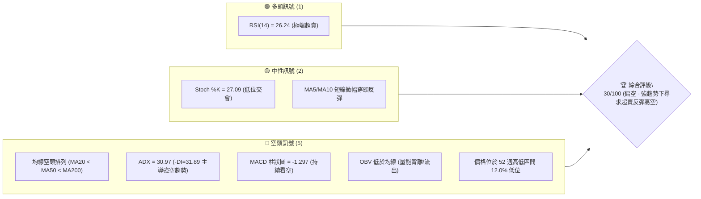
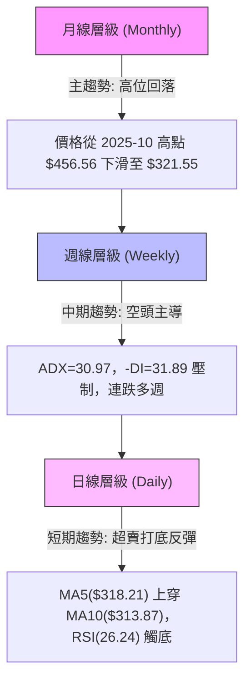
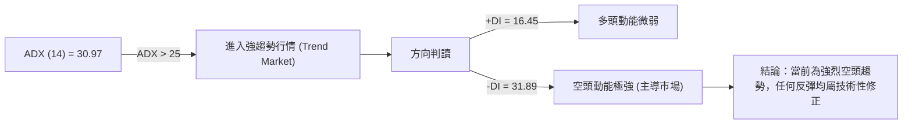
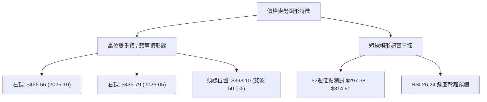
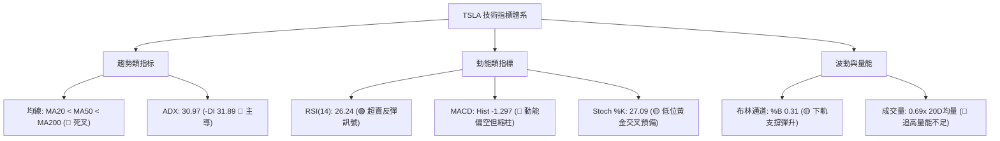
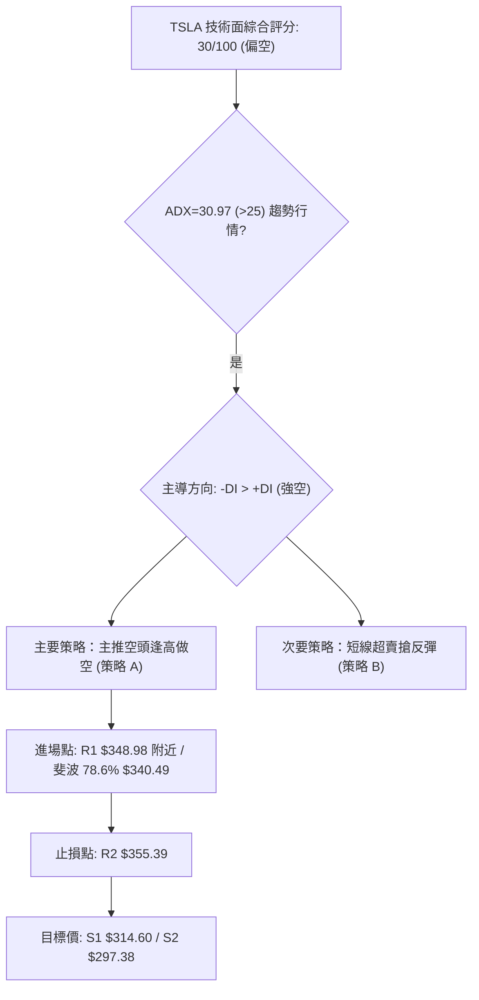
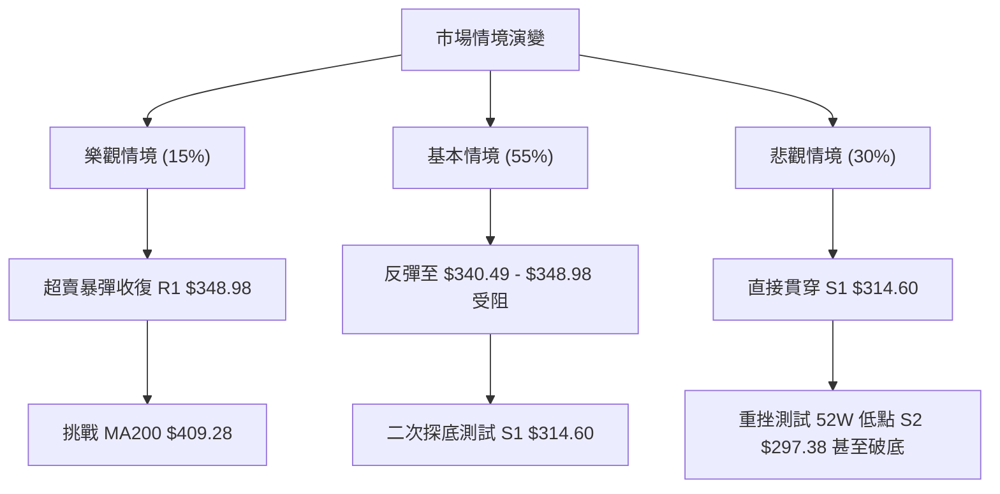

# TSLA 技術分析報告

> **報告日期**：2026-08-05 ｜ **語言**：繁體中文 ｜ **數據來源**：Yahoo Finance ｜ **當前價格**：$321.55

---

## 目錄

| 章節 | 內容 |
|------|------|
| [1. 技術面概覽](#1-技術面概覽) | 訊號儀表板、核心指標、評分卡 |
| [2. 趨勢分析](#2-趨勢分析) | 多時框趨勢、長中短期走勢 |
| [3. 圖表形態分析](#3-圖表形態分析) | 形態識別、K線組合、目標價 |
| [4. 支撐與阻力](#4-支撐與阻力) | 關鍵價位、斐波那契回調 |
| [5. 技術指標深度解讀](#5-技術指標深度解讀) | MA/RSI/MACD/布林/成交量 |
| [6. 動能與波動率](#6-動能與波動率) | 動能評估、ATR、Beta |
| [7. 多時框架總結](#7-多時框架總結) | 時框架評分矩陣 |
| [8. 交易策略建議](#8-交易策略建議) | 多空策略、風險報酬比 |
| [9. 風險提示與監控](#9-風險提示與監控) | 監控指標、風險場景 |

---

## 1. 技術面概覽

### 🎯 技術訊號儀表板



### 📊 核心指標速覽表

| 指標類別 | 指標名稱 | 當前數值 | 訊號 | 解讀 |
|----------|----------|----------|------|------|
| **價格** | 當前價格 | $321.55 | 🔴 | 位於 52 週區間底部（$297.38 - $498.83 的 12.0% 處） |
| **均線** | MA20 | $351.64 | 🔴 | 價格低於 MA20（-8.56%），短線下行壓力顯著 |
| **均線** | MA50 | $384.96 | 🔴 | 價格低於 MA50（-16.47%），中期趨勢偏空 |
| **均線** | MA200 | $409.99 | 🔴 | 價格遠低於 MA200（-21.57%），長期年線失守 |
| **動能** | RSI(14) | 26.24 | 🟢 | 極端超賣區（<30），存在技術性空頭回補反彈需求 |
| **動能** | MACD | -22.247 | 🔴 | MACD 線與訊號線（-20.950）處於負值區，柱狀圖 -1.297 |
| **趨勢** | ADX(14) | 30.97 | 🔴 | 強勢趨勢（>25），且 -DI(31.89) 遠高於 +DI(16.45) |
| **波動** | ATR(14) | $15.61 | 🟡 | 日均波動率 4.85%，屬於高波動個股，風控需放大 |
| **通道** | BB %B | 0.31 | 🟡 | 價格位於布林通道中軌（$351.64）與下軌（$271.17）之間 |
| **成交量**| 20日量比 | 0.69x | 🔴 | 當前成交量（2,750萬）低於20日均量（3,966萬），量能萎縮 |

### 🏆 技術評分卡

```
╔══════════════════════════════════════════════════════════════════╗
║                 技術評分卡 — TSLA (2026-08-05)                   ║
╠══════════════════════════════════════════════════════════════════╣
║  趨勢強度      ███████░░░░░░░░░░░░░  35/100  🔴 (強空趨勢)       ║
║  動能指標      ████████░░░░░░░░░░░░  40/100  🟡 (超賣反彈機會)   ║
║  支撐穩定度    ██████████░░░░░░░░░░  50/100  🟡 (逼近52W低點S2)  ║
║  成交量配合    ██████░░░░░░░░░░░░░░  30/100  🔴 (OBV走弱/動能不足) ║
║  形態完整度    ██████░░░░░░░░░░░░░░  30/100  🔴 (頭部突破下跌中) ║
║  均線排列      ██░░░░░░░░░░░░░░░░░░  10/100  🔴 (完美空頭排列)   ║
╠══════════════════════════════════════════════════════════════════╣
║  綜合評分      ██████░░░░░░░░░░░░░░  30/100  評級：🔴 偏空      ║
╚══════════════════════════════════════════════════════════════════╝
```

---

## 2. 趨勢分析

### 🌐 多時框趨勢分析



### 📈 長期趨勢 — 24個月走勢圖（Unicode）

```
TSLA 24個月歷史收盤價走勢圖 (2024-08 至 2026-08)
價格軸 ($)
$460 ┤                               ● $456.56 (2025-10 頂部)
$430 ┤                        ●     █   ●
$400 ┤         ● $403.84      █  ●  █   █   ● $435.79 (2026-05 次高)
$370 ┤         █              █  █  █   █   █   ●
$340 ┤      ●  █        ●     █  █  █   █   █   █
$310 ┤      █  █  ●     █  ●  █  █  █   █   █   █     ● $321.55 (現在)
$280 ┤      █  █  █  ●  █  █  █  █  █   █   █   █  ●  █
$250 ┤●     █  █  █  █  █  █  █  █  █   █   █   █  █  █
     └─────────────────────────────────────────────────────────
      24/08  11  12 25/03 05 07 09 10 12 26/02 04 05 07 08
```

#### 走勢特徵分析表格

| 階段歷史 | 時間區間 | 價格變動幅度 | 趨勢特徵與驅動因素 |
|----------|----------|--------------|-------------------|
| **第一階段：強勢爆發** | 2024-08 ~ 2024-12 | $214.11 ➔ $403.84 (+88.6%) | 選後慶祝行情與交車預期上升，拉升至 400 美元關卡 |
| **第二階段：大幅回檔** | 2025-01 ~ 2025-03 | $404.60 ➔ $259.16 (-35.9%) | 獲利賣壓與第1季交付數據疲弱，回測 250 美元區間 |
| **第三階段：衝高創高** | 2025-04 ~ 2025-10 | $282.16 ➔ $456.56 (+61.8%) | 儲能業務暴增與 FSD 進展，刷出歷史波段新高 $456.56 |
| **第四階段：震盪頂部** | 2025-11 ~ 2026-05 | $430.17 ➔ $435.79 (震盪) | 高位雙頂構建，多次測試 $430-$450 阻力無力突破 |
| **第五階段：加速探底** | 2026-06 ~ 2026-08 | $420.60 ➔ $321.55 (-23.5%) | 財報淨利下滑與毛利率承壓，快速跌破 MA200 年線 |

### 📊 中期趨勢（週線分析）

```
TSLA 中期關鍵通道與壓力支撐區域
$456.56 ═════════════════════════════════════════════════ [歷史頂部區]
$409.28 ───────────────────────────────────────────────── [R3 / MA200 重合區]
$384.96 ------------------------------------------------- [MA50 中期反彈壓力]
$348.98 ┄┄┄┄┄┄┄┄┄┄┄┄┄┄┄┄┄┄┄┄┄┄┄┄┄┄┄┄┄┄┄┄┄┄┄┄┄┄┄┄┄┄┄┄┄┄┄┄ [R1 近期關鍵阻力]
$321.55 ◄━━━━━ 當前價格區間 ━━━━━
$314.60 ┄┄┄┄┄┄┄┄┄┄┄┄┄┄┄┄┄┄┄┄┄┄┄┄┄┄┄┄┄┄┄┄┄┄┄┄┄┄┄┄┄┄┄┄┄┄┄┄ [S1 短期強支撐]
$297.38 ═════════════════════════════════════════════════ [S2 52週最低點支撐]
```

中期走勢顯示，TSLA 在 2026 年 7 月下旬出現連續長黑K線（從 $380.84 驟跌至 $313.03），週線 RSI 一度跌至 15.7 之極端區域。目前在 $311.21–$321.55 進行弱勢築底，成交量由最高每週 3.8 億股縮減至 9,910 萬股，顯示賣壓已有所消化，但缺乏強烈买盤推升。

### ⚡ 趨勢強度評估（ADX 解讀）



| 指標名稱 | 當前數值 | 臨界值判斷 | 趨勢解讀 |
|----------|----------|------------|----------|
| **ADX (14)** | 30.97 | > 25.0 (強趨勢) | 市場處於明確的單邊趨勢，非無方向的無序盤整行情 |
| **+DI (14)** | 16.45 | < 20.0 (弱) | 多頭攻擊意願低落 |
| **-DI (14)** | 31.89 | > 30.0 (極強) | 空頭控制盤面主導權，降幅顯著 |

---

## 3. 圖表形態分析

### 🔍 形態識別系統



#### 形態信心度與目標價計算表

| 形態名稱 | 信心度 | 判斷依據（引用數據） | 完成度 | 目標價計算式與精確數值 |
|----------|--------|----------------------|--------|------------------------|
| **高位雙重頂 (Double Top)** | 85% | 頂一 $456.56，頂二 $435.79，2026-07 跌破頸線 $398.10 | 100% (已突破跌破) | 頸線 $398.10 - (高點 $456.56 - 頸線 $398.10) = **$339.64** (已達標，向下延伸測試 S2 **$297.38**) |
| **日線超賣下落楔形** | 60% | 價格於 $311.21-$321.55 止跌，與 RSI 26.24 形成低位收斂 | 65% (構建中) | 若突破 R1 **$348.98**，推算出反彈目標位為斐波 61.8% **$374.33** |

### 🕯️ 重要K線形態分析

| 日期/時間 | 關鍵價位 | K線形態 | 解讀 | 訊號 |
|-----------|----------|---------|------|------|
| 2026-05-31 | $435.79 | 避雷針/高位吊人線 | 右頂確認，上方高價拋壓極其沉重 | 🔴 看空 |
| 2026-07-26 | $313.03 | 大長黑K線 | 帶量突破 MA200 ($409.99)，趨勢全面轉空 | 🔴 看空 |
| 2026-08-02 | $311.21 | 下影線錘子線 | 接近 52 週低點 $297.38 處獲得初步支撐 | 🟡 止跌訊號 |
| 2026-08-09 | $321.55 | 短陽線 (MA5/10反彈) | 價格站在 MA5 ($318.21) 上方，發動超賣反彈 | 🟢 短多反彈 |

### 📉 ASCII 走勢形態示意圖

```
TSLA 雙頂形態破位與下探結構
$456.56 ┤      頂一: $456.56
        │       /\                 頂二: $435.79
$435.79 ┤      /  \                 /\
        │     /    \               /  \
$398.10 ┼────/──────\─────────────/────\────── [頸線 $398.10]
        │   /        \           /      \
        │  /          \         /        \
$348.98 ┤ /            \_______/          \      [反彈阻力 R1 $348.98]
        │                                  \    /
$321.55 ┤───────────────────────────────────\──/─◄ [當前 $321.55]
$297.38 ┴────────────────────────────────────\/── [52W 低點 S2 $297.38]
```

---

## 4. 支撐與阻力

### 🗺️ 關鍵價位分布圖（Unicode）

```
TSLA 價位結構分布圖 (由高至低精確排列)
═══════════════════════════════════════════════════════════════════
$498.83 ║████████████████████████████████████████████║ 52週最高點 (0.0%)
$451.29 ║██████████████████████████████████          ║ 斐波 23.6% 回調位
$421.88 ║██████████████████████████                  ║ 斐波 38.2% 回調位
$409.28 ║███████████████████████                     ║ 強阻力 R3 / MA200 ($409.99)
$398.10 ║████████████████████                        ║ 斐波 50.0% 回調位 / 雙頂頸線
$374.33 ║███████████████                             ║ 斐波 61.8% 回調位
$355.39 ║████████████                                ║ 阻力 R2
$348.98 ║██████████                                  ║ 關鍵阻力 R1 / 20日壓力
$340.49 ║████████                                    ║ 斐波 78.6% 回調位
$321.55 ╠════════════════════════════════════════════╣ ◄ 現價 ($321.55)
$314.60 ║▓▓▓▓▓▓▓▓▓▓▓▓▓▓▓▓                            ║ 近期強支撐 S1
$297.38 ║████████████████████████████████████████████║ 強支撐 S2 / 52週最低點 (100.0%)
═══════════════════════════════════════════════════════════════════
```

### 🚧 阻力位分析表

| 阻力級別 | 價位 | 形成原因（由 OHLCV 嚴格計算） | 突破難度 | 重要性 |
|----------|------|----------------───────────────|----------|--------|
| **R1** | **$348.98** | 近一年波段高點聚類與 MA20 ($351.64) 下壓區 | 🟡 中等 | 短線反彈第一道關鍵考驗 |
| **R2** | **$355.39** | 近一年密集成交套牢區區塊邊緣 | 🔴 困難 | 多空強弱轉換分割點 |
| **R3** | **$409.28** | 波段高點聚類、MA200 ($409.99) 與 240日線重合 | 🔴 極難 | 長期牛熊分界線 |

### 🛡️ 支撐位分析表

| 支撐級別 | 價位 | 形成原因（由 OHLCV 嚴格計算） | 守住機率 | 重要性 |
|----------|------|----------------───────────────|----------|--------|
| **S1** | **$314.60** | 近一年波段低點聚類與 8月週線收盤低點 | 🟡 60% | 日線層級防守支撐 |
| **S2** | **$297.38** | 52 週最低點 (52W Low) 與斐波 100% 絕對底部 | 🟢 75% | 長期多頭最後防線，失守將開啟新一波下跌 |

### 📐 斐波那契回調位分析

基於 52 週高低點（High: **$498.83** ➔ Low: **$297.38**，波幅 **$201.45**）精確計算：

```
斐波那契階梯與當前位置
0.0%  │ $498.83 (52W High)
23.6% │ $451.29
38.2% │ $421.88
50.0% │ $398.10
61.8% │ $374.33
78.6% │ $340.49
      │ ◄───── 當前價格 $321.55 (位於 78.6% 與 100.0% 之間)
100.0%│ $297.38 (52W Low)
```

- **位置解讀**：現價 **$321.55** 目前深陷於 **78.6% ($340.49)** 與 **100.0% ($297.38)** 的黃金分割極端超跌區間。
- **技術意義**：跌破 78.6% 位（$340.49）代表原有的上升趨勢結構已被徹底破壞。若短線反彈無法收復 **$340.49**，價格極易受引力作用進一步向 100.0% 回調位（**$297.38**）靠攏。

---

## 5. 技術指標深度解讀

### 🎛️ 指標訊號總覽



### 📈 移動平均線排列分析

```
均線系統現狀 (空頭排列)
$409.99 ───────────────────────────────────────── MA200 (年線)
$384.96 ----------------------------------------- MA50  (季線)
$351.64 - - - - - - - - - - - - - - - - - - - - - MA20  (月線)
$321.55 ◄ 現價
$318.21 ┄ ┄ ┄ ┄ ┄ ┄ ┄ ┄ ┄ ┄ ┄ ┄ ┄ ┄ ┄ ┄ ┄ ┄ ┄ ┄ ┄ MA5   (週線)
$313.87 ․ ․ ․ ․ ․ ․ ․ ․ ․ ․ ․ ․ ․ ․ ․ ․ ․ ․ ․ ․ ․ MA10  (雙週線)
```

- **短線 (MA5/MA10)**：MA5 (**$318.21**) 向上突破 MA10 (**$313.87**)，現價 **$321.55** 位於兩者之上，顯示短線出現微弱的金叉止跌跡象。
- **中長期 (MA20/50/200)**：MA20 (**$351.64**) < MA50 (**$384.96**) < MA200 (**$409.99**)，呈現標準且強烈的**空頭排列 (Bearish Alignment)**。各條中長期均線角度皆向下傾斜，構成上方三重重重蓋頂的阻力牆。

### 📉 RSI(14) 分析

```
RSI(14) 強度進度條
超賣 [<30]              中性 [50]              超買 [>70]
███████░░░░░░░░░░░░░░░░░░░░░░░░░░░░░░░░░░░░░  26.24
```

- **當前數值**：**26.24**，落入 <30 極端超賣區。
- **背離判斷**：從 7 月底的 RSI 15.7 微幅回升至 26.24，價格由 $311.21 升至 $321.55，價格與 RSI 同步微幅墊高，目前**無明確的頂背離或底背離**。此處低 RSI 僅代表短期拋壓過度宣洩後的技術性反彈修復需求。

### 📊 MACD(12/26/9) 訊號解讀

```
MACD 指標狀態
DIF 線 (MACD):      -22.247 ────┐
DEA 線 (Signal):    -20.950 ────┼─ 位於零軸遠下方 (極度弱勢)
柱狀圖 (Histogram):  -1.297  ────┘ (負值收斂中)
```

- **現狀**：MACD 線 (-22.247) 低於訊號線 (-20.950)，雙線均處於深幅負值區，顯示大格局空頭掌控。
- **動態**：柱狀圖自前週的 -8.365 顯著收斂至 **-1.297**，顯示賣壓動能正在減緩，空頭力道有所收斂，短線具備綠柱翻紅（金叉）的潛在可能。

### 📦 布林通道分析

```
TSLA 布林通道結構 (BB 20, 2)
$432.11 ╔═════════════════════════════════════════════════╗ 上軌 (Upper)
        ║                                                 ║
$351.64 ╟─────────────────────────────────────────────────╢ 中軌 (MA20)
        ║               ● $321.55 (現價 %B = 0.31)        ║
$271.17 ╚═════════════════════════════════════════════════╝ 下軌 (Lower)
```

- **通道數據**：上軌 **$432.11** ｜ 中軌 **$351.64** ｜ 下軌 **$271.17** ｜ 帶寬 **$160.94**。
- **%B 位置**：**0.31**。價格自觸及下軌近郊後向中軌方向反彈，目前尚在中軌 **$351.64** 之下。中軌為第一道壓制點。

### 💹 成交量分析（量價配合度）

- **量能快照**：最新單日成交量為 **27,506,311** 股，相較於 20 日均量（**39,662,191**）量比僅 **0.69x**；50 日均量更達 **44,080,824**。
- **量價診斷**：價格在上週止跌反彈，但成交量顯著萎縮（量縮價漲），顯示市場追高意願不足，主要由空頭回補（Short Covering）推升，而非強烈的主導買盤進場。
- **OBV 趨勢**：OBV 指標持續低於其移動平均線，能量潮走勢疲弱，資金淨流出趨勢尚未逆轉。

---

## 6. 動能與波動率

### ⚡ 動能評估四象限

| 象限分區 | 動能強度 (Momentum) | 波動率 (Volatility) | TSLA 當前狀態 | 交易戰略意涵 |
|----------|---------------------|---------------------|---------------|--------------|
| **象限一 (Q1)** | 強 (Strong) | 低 (Low) | — | 穩健趨勢續抱 |
| **象限二 (Q2)** | 弱 (Weak) | 低 (Low) | — | 盤整觀望 |
| **象限三 (Q3)** | 強 (Strong) | 高 (High) | — | 突破追價 (高風險) |
| **象限四 (Q4)** | **弱 (Weak)** | **高 (High)** | **✓ (TSLA 當前定位)** | **下行波段/高震盪，逢高避險做空為主** |

TSLA 目前 ATR 為 **$15.61**（佔股價 **4.85%**），Beta 為 **1.827**，呈現典型「高波動、弱動能」的 Q4 象限特徵。

### 📊 ATR 波動率分析

- **ATR(14)**：**$15.61**。代表 TSLA 每日平均波動幅度約 15.61 美元。
- **交易風控設距應用**：
  - **緊密止損 (1.0x ATR)**：$15.61
  - **標準止損 (1.5x ATR)**：$23.42
  - **寬鬆止損 (2.0x ATR)**：$31.22
- 在佈局多空單時，止損距離至少須設置在 $15.61 以上，以避免被日內正常市場噪音掃出場。

### 📐 Beta 與市場相關性

- **Beta 係數**：**1.827**。TSLA 屬於高 Beta 成長型/消費週期股，波動幅度約為大盤（S&P 500）的 1.83 倍。在市場大盤修正時，TSLA 跌幅通常更深；在大盤反彈時，其彈幅亦較顯著。

---

## 7. 多時框架總結

### 📋 時框架評分表

| 時框架 | 趨勢方向 | 動能指標 | 均線排列 | 形態結構 | 綜合評分 | 建議戰術 |
|--------|----------|----------|----------|----------|----------|----------|
| **日線 (Daily)** | 🟡 止跌反彈 | 🟢 RSI超賣 bounce | 🔴 空頭排列 | 🟡 超賣打底 | **45/100** | 短線反彈彈至 R1 避險 |
| **週線 (Weekly)**| 🔴 強勢看空 | 🔴 MACD負值放大 | 🔴 死叉向下 | 🔴 雙頂跌破 | **25/100** | 中期逢高尋求做空點 |
| **月線 (Monthly)**| 🔴 頂部回落 | 🔴 漲勢中斷 | 🟡 轉向盤整 | 🔴 避雷針頂 | **30/100** | 長線多單需減碼提防 |

### 🔲 綜合訊號矩陣

```
TSLA 多時框訊號一致性評估
┌──────────┬──────────┬──────────┬──────────┐
│  時框架  │ 短期日線 │ 中期週線 │ 長期月線 │
├──────────┼──────────┼──────────┼──────────┤
│ 趨勢方向 │  🟡 止跌 │  🔴 空頭 │  🔴 下跌 │
│ 均線架構 │  🔴 下降 │  🔴 死叉 │  🟡 扁平 │
│ 量能配合 │  🔴 縮量 │  🔴 流出 │  🔴 觀望 │
└──────────┴──────────┴──────────┴──────────┘
結論：中長期方向一致向下，短期日線僅為指標過度修正之超賣反彈。
```

### ⚖️ 多時框收斂結論

根據多時框收斂規則：當前 **ADX(14) = 30.97 (>25)**，明確定義市場為**「趨勢行情」**。
在強勢空頭趨勢下（-DI 31.89 > +DI 16.45 且價格遠低於 MA200 **$409.99**），中長期週線與月線方向具備最高優先級（偏空）。

日線 RSI 26.24 的超賣現象，**僅能作為短線反彈的觸發條件，不可視為長期翻多的反轉訊號**。最終收斂結論為：**「總體偏空，短線尋求反彈至阻力位後再行順勢做空/減碼」**。第 8 章的策略部署將嚴格遵循此偏空收斂結論。

---

## 8. 交易策略建議

### 🗺️ 策略決策流程圖



### 🧭 策略路由

**當前主策略方向 = 🔴 逢高做空 / 反彈減碼（依評分 30/100 分流）**

由於綜合評估分數僅 30/100，中長期空頭排列明確，主推「逢高做空（或多頭逢反彈減碼）」策略；多頭進場僅限於極短線嚴格止損的超賣反彈操作。

### 🎯 價格情境階梯 (Price Scenarios)

| 觸發條件 | 下一目標 | 後續延伸 | 情境含義 |
|----------|----------|----------|----------|
| **突破 R1 $348.98** | R2 **$355.39** | 斐波 61.8% **$374.33** | 短線空頭回補力道強勁，挑戰月線壓力 |
| **站穩當前區間 $321.55** | R1 **$348.98** | S1 **$314.60** | 於 $314.60 - $348.98 進行超賣震盪修復 |
| **跌破 S1 $314.60** | S2 **$297.38** | 續創 52 週新低 | 空頭趨勢續跌，下探 52 週絕對低點 |

### 📊 情境機率分佈

```
情境機率分佈圖
┌─────────────────────────────────────────┬───────────┐
│ 情境劇本                                │ 機率估計  │
├─────────────────────────────────────────┼───────────┤
│ 1. 反彈至 R1 $348.98 / $340.49 後受阻回落  │ ██████████ 55% │
│ 2. 直接跌破 S1 $314.60 深入下探 S2 $297.38│ ██████░░░░ 30% │
│ 3. 強勢突破 R2 $355.39 展開 V 型反轉     │ ███░░░░░░░ 15% │
└─────────────────────────────────────────┴───────────┘
```

### 🟢 主策略詳情（方向依路由決定）

#### 🥇 策略 A：主推 — 反彈高空策略 (Rebound Short) [順應主趨勢]

- **適用對象**：空頭避險交易者 / 尋求高空之波段交易者
- **進場條件**：價格反彈至斐波 78.6% **$340.49** 至 R1 **$348.98** 區域，且日線出現上影線或黑K反轉訊號。

| 策略要素 | 精確數值 / 算式 | 說明與依據 |
|----------|-----------------|------------|
| **進場價格** | **$345.00** | 取 $340.49 (斐波 78.6%) 與 $348.98 (R1) 之間聚類區 |
| **止損價格** | **$355.39** | 設於 R2 阻力位上方（風控距離 $10.39，約 0.67x ATR） |
| **目標價 T1** | **$314.60** | 近期強支撐 S1（預期獲利 $30.40） |
| **目標價 T2** | **$297.38** | 52週最低點 S2（預期獲利 $47.62） |
| **風險報酬比** | **2.93 : 1** (對 T1) / **4.58 : 1** (對 T2) | 風險 $10.39 vs 報酬 $30.40 / $47.62 |
| **勝率估計** | **60%** | 順應 ADX 30.97 強空趨勢與 MA 空頭排列 |
| **建議倉位** | **15% - 20%** | 中等波段倉位 |

#### 🥈 策略 B：次選 — 戰術性超賣搶反彈 (Counter-Trend Long) [逆勢短線]

- **適用對象**：高風險承受度之短線敏捷交易者
- **進場條件**：價格於當前 **$321.55** 或回測 S1 **$314.60** 企穩，量能溫和放大。

| 策略要素 | 精確數值 / 算式 | 說明與依據 |
|----------|-----------------|------------|
| **進場價格** | **$321.55** | 當前市價進場 |
| **止損價格** | **$297.38** | 設於 52週低點 S2 下方（風控距離 $24.17，約 1.55x ATR） |
| **目標價 T1** | **$340.49** | 斐波 78.6% 回調位（預期獲利 $18.94） |
| **目標價 T2** | **$348.98** | 阻力位 R1（預期獲利 $27.43） |
| **風險報酬比** | **0.78 : 1** (對 T1) / **1.13 : 1** (對 T2) | 風險報酬比偏低，不適合重倉 |
| **勝率估計** | **40%** | 逆勢交易，僅靠 RSI 26.24 超賣支撐 |
| **建議倉位** | **5% - 10%** | 輕倉嚴格止損 |

### 🔴 反向風險觸發點（對沖提示）

若 TSLA 放量向上突破阻力位 **$355.39 (R2)** 且日線收盤站穩，宣告「反彈轉升」，空頭策略 A 必須立即執行止損離場；多頭可將反彈目標上調至 MA50 **$384.96** 或 斐波 50% **$398.10**。

### ⭐ 整體訊號強度評星

```
做多訊號強度：★★☆☆☆  (2/5星 - 僅憑超賣反彈，無趨勢支撐)
做空訊號強度：★★██☆  (4/5星 - 順應大格局空頭與均線壓制)
整體可信度：  ████☆  (4/5星 - 多時框指標訊號高度一致)
```

---

## 9. 風險提示與監控

### ✅ 關鍵監控指標 Checklist

```
╔══════════════════════════════════════════════════════════════════╗
║               TSLA 交易每日關鍵監控 Checklist                    ║
╠══════════════════════════════════════════════════════════════════╣
║ [ ] 價位突破：是否收盤跌破 S1 ($314.60) 或 突破 R1 ($348.98)     ║
║ [ ] RSI 動態：RSI(14) 能否順利脫離 <30 超賣區並站上 40            ║
║ [ ] MACD 柱狀：柱狀圖 (-1.297) 是否能實現金叉翻紅                 ║
║ [ ] 量能變化：反彈時成交量是否能超越 20日均量 (3,966萬股)        ║
║ [ ] 大盤連動：Nasdaq / S&P 500 是否出現整體性拋售風險 (Beta 1.83) ║
╚══════════════════════════════════════════════════════════════════╝
```

### ⚠️ 風險場景分析



### 🛡️ 風險管理重要提醒

1. **高波動性風險 (High Volatility)**：TSLA ATR 高達 **$15.61**，單日幅動常達 4–5%。單筆交易損失務必控制在總資金的 **1%–2%** 以內。
2. **財報與基本面催化劑**：當前 P/E (TTM) 達 292.32，營業利益率僅 1.4%，基本面容錯率極低。若出現任何營運負面新聞，易引發無差別拋售。
3. **嚴格執行止損紀律**：若採用策略 B 搶反彈，跌破 **$297.38** 必須無條件停損，切勿將逆勢短線單轉為長期套牢單。

---

## 📋 報告總結

```
╔══════════════════════════════════════════════════════════════════╗
║                    TSLA 技術分析報告總結                         ║
╠══════════════════════════════════════════════════════════════════╣
║ 報告日期：2026-08-05                                              ║
║ 當前價格：$321.55                                                 ║
║ 綜合評估：30/100  評級：🔴 偏空 (Strong Bearish Trend)            ║
║                                                                  ║
║ 關鍵結論：                                                       ║
║ ├─ 長期趨勢：🔴 偏空 (從 $456.56 頂部回落，跌破 MA200 $409.99)   ║
║ ├─ 中期趨勢：🔴 強空 (ADX=30.97，-DI=31.89 主導，週線連跌)        ║
║ ├─ 短期趨勢：🟢 超賣反彈 (RSI 26.24 觸底，MA5/10 短線金叉)        ║
║ ├─ 關鍵支撐：S1 $314.60  ｜  S2 $297.38 (52週最低點)               ║
║ ├─ 關鍵阻力：R1 $348.98  ｜  R2 $355.39  ｜  R3 $409.28          ║
║ └─ 分析師目標價均值：$397.87                                     ║
║                                                                  ║
║ 最優策略組合：                                                   ║
║ 1. 🥇 最佳機會：反彈至 $340.49 - $348.98 (R1) 逢高佈局空單/減碼  ║
║ 2. 🥈 次選機會：當前 $321.55 輕倉搶超賣反彈，嚴格止損 $297.38     ║
║ 3. 🥉 保守選擇：觀望等待價格測試 S2 $297.38 築底完成再作打算     ║
╚══════════════════════════════════════════════════════════════════╝
```

---

> ⚠️ **免責聲明**：本報告為專業技術分析研判，所有數據及價位均嚴格基於提供之歷史市場資訊計算。本報告**僅供研究與學術參考**，**不構成任何買賣投資建議**。金融市場投資具有高度風險，投資人應獨立思考並自負盈虧風險。

---

*報告生成時間：2026-08-05 ｜ 數據來源：Yahoo Finance ｜ 分析框架：多時框技術分析 (MTFA)*