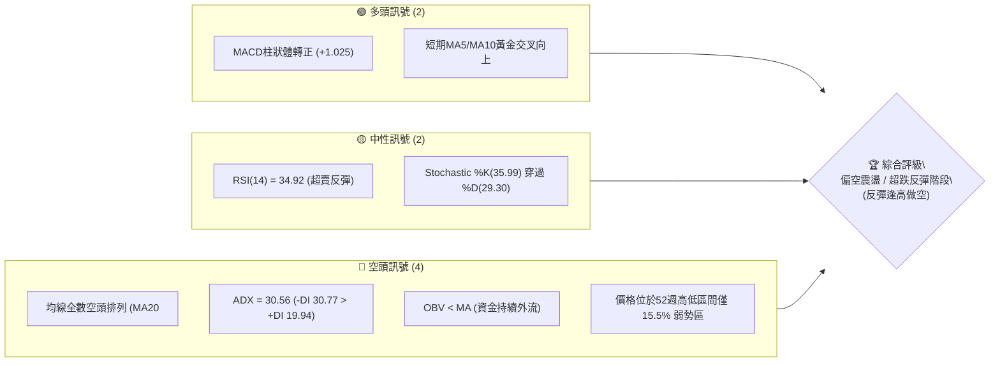
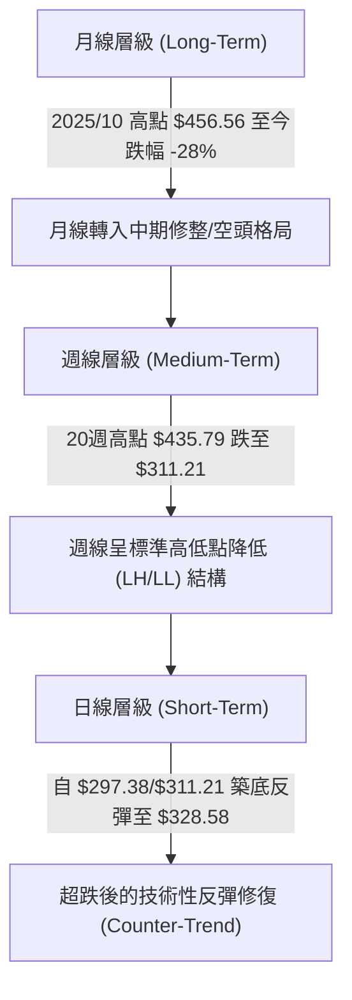
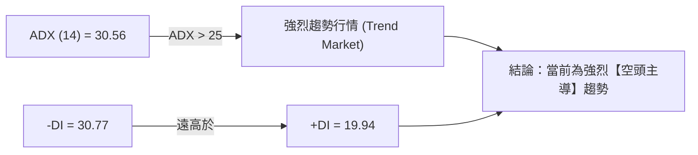
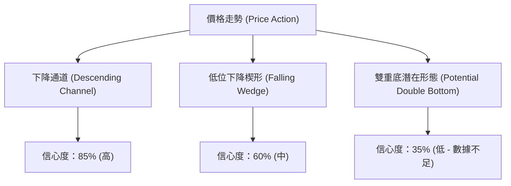
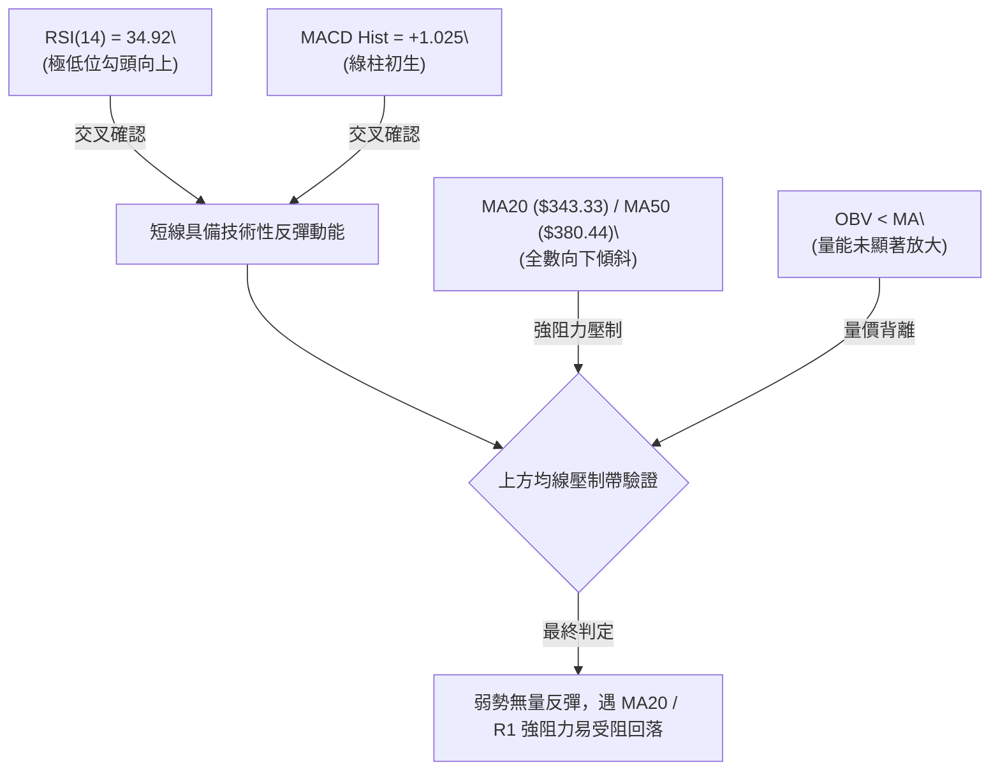
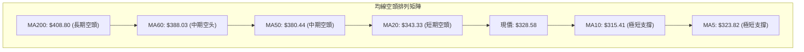
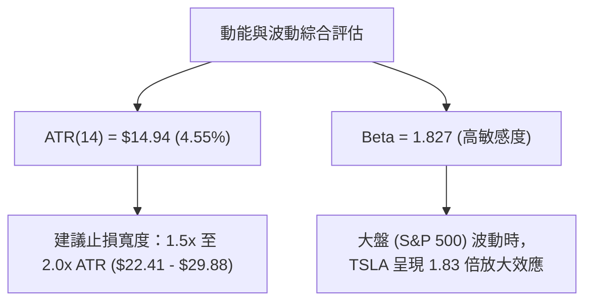
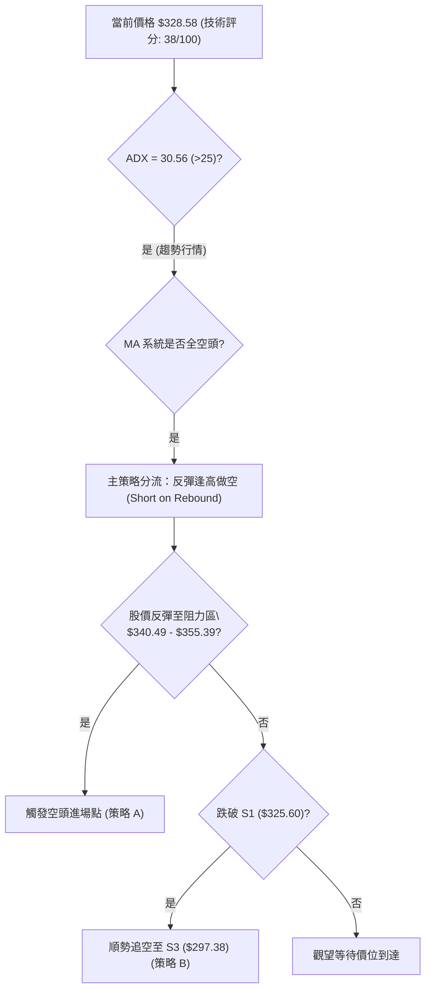
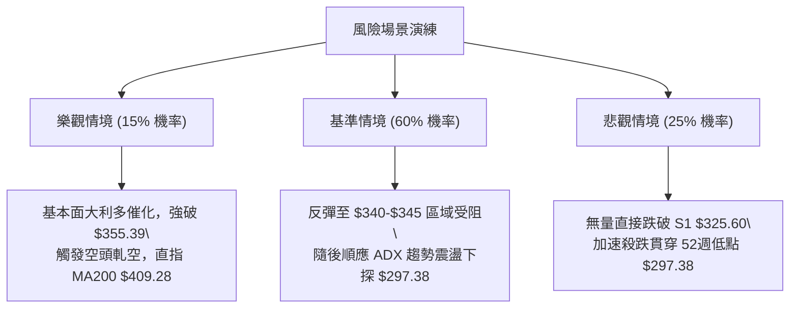

# TSLA 技術分析報告

> **報告日期**：2026-08-07 ｜ **語言**：繁體中文 ｜ **數據來源**：Yahoo Finance ｜ **當前價格**：$328.58

---

## 目錄

| 章節 | 內容 |
|------|------|
| [1. 技術面概覽](#1-技術面概覽) | 訊號儀表板、核心指標、評分卡 |
| [2. 趨勢分析](#2-趨勢分析) | 多時框趨勢、長中短期走勢、ADX強弱 |
| [3. 圖表形態分析](#3-圖表形態分析) | 形態識別、信心度評估、K線組合、目標價計算 |
| [4. 支撐與阻力](#4-支撐與阻力) | 關鍵價位結構、斐波那契回調層級 |
| [5. 技術指標深度解讀](#5-技術指標深度解讀) | MA/RSI/MACD/布林通道/成交量與OBV |
| [6. 動能與波動率](#6-動能與波動率) | 動能四象限、ATR防守邊界、Beta相關性 |
| [7. 多時框架總結](#7-多時框架總結) | 時框架評分矩陣、多時框收斂結論 |
| [8. 交易策略建議](#8-交易策略建議) | 策略路由、價格情境階梯、主空頭/次多頭策略、風險報酬比 |
| [9. 風險提示與監控](#9-風險提示與監控) | 監控清單、三情境演練、風控原則 |

---

## 1. 技術面概覽

### 🎯 技術訊號儀表板



### 📊 核心指標速覽表

| 指標類別 | 指標名稱 | 當前數值 | 訊號 | 深度解讀與相符性驗證 |
|----------|----------|----------|------|----------------------|
| **價格** | 當前價格 | $328.58 | 🔴 | 位於 52 週區間 ($297.38 - $498.83) 之 15.5% 分位，極度弱勢 |
| **均線** | MA20 | $343.33 | 🔴 | 價格位於 MA20 下方 -4.30%，構成短線直接動態阻力 |
| **均線** | MA50 | $380.44 | 🔴 | 中期生命線下滑，距現價 -13.63%，中期趨勢極度偏空 |
| **均線** | MA200 | $408.80 | 🔴 | 長期牛熊分界線高懸，MA20/50/200 呈現完美空頭發散 |
| **動能** | RSI(14) | 34.92 | 🟡 | 自 7 月底極端超賣區 (15.7) 解除，進入低位技術性修復 |
| **動能** | MACD | -19.758 | 🟢 | MACD 線仍在零軸深處，但柱狀體 (+1.025) 呈現綠柱收攏與微幅看多 |
| **動能** | ADX(14) | 30.56 | 🔴 | ADX > 25 且 -DI(30.77) 遠高於 +DI(19.94)，確認空頭強趨勢 |
| **波動** | ATR(14) | $14.94 | 🟡 | 占股價 4.55%，單日波幅大，需拉寬止損防守區間 |
| **量能** | OBV | 低於MA | 🔴 | 價格反彈未見資金顯著回流，成交量比 0.99x 顯示缺乏追高動能 |

### 🏆 技術評分卡

```
╔══════════════════════════════════════════════════════════════════╗
║                技術評分卡 — TSLA (2026-08-07)                   ║
╠══════════════════════════════════════════════════════════════════╣
║ 趨勢強度 (Trend)     ███████░░░░░░░░░░░░░  35/100 🔴 空頭強趨勢  ║
║ 動能指標 (Momentum)   ████████░░░░░░░░░░░░  42/100 🟡 低位弱反彈  ║
║ 支撐穩定 (Support)    ███████████░░░░░░░░  55/100 🟡 S1前暫停腳  ║
║ 成交量能 (Volume)     ███████░░░░░░░░░░░░░  38/100 🔴 資金量能萎縮  ║
║ 形態結構 (Pattern)    ████████░░░░░░░░░░░░  40/100 🟡 下降通道探底  ║
║ 均線架構 (MA Align)  ████░░░░░░░░░░░░░░░░  20/100 🔴 全空頭排列    ║
╠══════════════════════════════════════════════════════════════════╣
║ 綜合技術總分          ███████░░░░░░░░░░░░░  38/100 🔴 偏空操作路由  ║
╚══════════════════════════════════════════════════════════════════╝
```

---

## 2. 趨勢分析

### 🌐 多時框趨勢分析



### 📈 長期趨勢 — 12個月走勢圖（Unicode）

以下為 TSLA 過去 12 個月（2025-09 至 2026-08）月線收盤價格走勢圖：

```
TSLA 月線走勢圖（2025-09 至 2026-08）
價格軸 ($)
$460 ┤               ●(2025-10: $456.56)
$440 ┤         ●           ●           ●(2026-05: $435.79)
$420 ┤                               ●       ●
$400 ┤                                           
$380 ┤                                 ●
$360 ┤
$340 ┤                                               ●(現在: $328.58)
$320 ┤                                           ●
$300 ┤──────────────────────────────────────────────────
      09  10  11  12  01  02  03  04  05  06  07  08  (月份)
```

#### 走勢特徵分析表

| 時間階段 | 價格區間 | 漲跌幅 | 走勢特徵與市場行為 |
|----------|----------|--------|--------------------|
| **2025-09 ~ 2025-12** | $444.72 → $449.72 | +1.12% | **高位頂部震盪**：於 $450-$456 形成強大雙頂抵抗，量能無法跟上。 |
| **2026-01 ~ 2026-03** | $430.41 → $371.75 | -13.63% | **第一波估值修整**：跌破 MA50，形成標準的高低點遞減 (LH/LL)。 |
| **2026-04 ~ 2026-05** | $381.63 → $435.79 | +14.19% | **強勁死貓跳 (Dead Cat Bounce)**：受消息面推升至 $435.79，但未破 $456 高點。 |
| **2026-06 ~ 2026-07** | $420.60 → $311.21 | -26.01% | **崩盤式主跌段**：連續大黑燭下挫，日線 RSI 一度壓至 15.7 極端超賣區。 |
| **2026-08 (至今)** | $311.21 → $328.58 | +5.58% | **超跌企穩修復**：受 S1 ($325.60) 及 52週低點 ($297.38) 支撐，迎來小幅反彈。 |

### 📊 中期趨勢（週線結構分析）

從 20 週數據觀察，TSLA 經歷了完整的「頂部派發 → 快速殺跌 → 探底尋求支撐」三階段：
- **頂部阻力帶**：$428.35 - $435.79 (2026年5月區間)，此位置構成了中期極難克服的密集套牢區。
- **殺跌下行通道**：從 6 月初的 $435.79 單邊下挫至 7 月底的 $311.21，僅耗時 8 週，跌幅達 28.59%。
- **當前週線反應**：2026-08-09 止跌回升至 $328.58，週 MACD 柱狀體由 -6.930 轉為 +1.025，顯示短期殺跌動能暫停，但上方均線壓力重重。

### ⚡ 趨勢強度評估（ADX 深度解讀）



| ADX 數值區間 | 當前讀數 | 市場狀態 | 操作指導法則 |
|--------------|----------|----------|--------------|
| **< 20** | - | 無趨勢 / 盤整 | 適合高拋低吸，布林通道交易 |
| **20 - 25** | - | 趨勢萌芽 | 觀望等待突破方向 |
| **> 25** | **30.56** | **強趨勢行情** | **嚴格順勢操作！禁止盲目抄底，所有反彈均視為空頭修正** |

---

## 3. 圖表形態分析

### 🔍 形態識別系統與信心度評估



#### 圖表形態信心度與目標價明細表

| 形態名稱 | 信心度 | 判斷依據（引用嚴謹數據） | 完成度 | 目標價計算公式與精確結果 |
|----------|--------|--------------------------|--------|--------------------------|
| **下降通道** | **85%** | 上軌連結 $435.79 與 $407.76 高點，下軌連結 $297.38 低點，軌道極為明確。 | 90% | 沿通道下尋，若破 S1，下軌目標看至 52週低點 **$297.38**。 |
| **低位下降楔形** | **60%** | 高點降幅快於低點降幅，波動區間縮小，搭配 RSI 底背離潛勢。 | 50% | **由楔形高度推算**：突破上軌 $355.39 + 形態高度 ($355.39 - $297.38 = $58.01) = **$413.40**。 |
| **雙重底 (潛在)** | **35%** | 僅探第一次低點 $297.38/$311.21，第二底尚未二次測試確認。 | 20% | **數據不足**：未形成頸線突破，僅做指標型低位反彈解讀。 |

### 🕯️ 重要 K 線形態分析（近期月線與週線）

| 時間週期 | 形態名稱 | K 線組合特徵 | 市場心理學解讀 | 技術訊號 |
|----------|----------|--------------|----------------|----------|
| **2026-07 (月線)** | 大陰大跌棒 (Marubozu) | 長實體紅K（西式綠/台式紅下挫），收盤位接近最低點 $311.21。 | 賣方極度狂暴，多頭無還手之力，機構棄守。 | 🔴 強烈看空 |
| **2026-07-26 (週線)** | 探底長下影線 | 週跌破 $313 後獲得抄底資金注入，留長下影線。 | 極端超賣 (RSI 15.7) 引發短線程式碼低拋高吸盤進場。 | 🟡 中性止跌 |
| **2026-08-09 (週線)** | 低位錘頭陽棒 | 週收 $328.58，實體高於前週收盤，MACD 柱狀體翻綠。 | 短線空頭回補，多頭試圖建立短期底部。 | 🟢 短線看多 |

### 📉 ASCII 圖表形態示意圖（下降通道與支撐測試）

```
TSLA 下降通道與阻力支撐形態圖
===================================================================
$435.79 ┼───● (2026-05 高點)
        │    └─┐
$407.76 ┼───────● (下降通道上軌壓力)
        │        └─┐
$355.39 ┼───────────┴───[R1 阻力位 / 通道中軌]─────────────────
        │                │
$328.58 ┼────────────────┼──────● [當前現價 $328.58]
        │                │     /
$325.60 ┼────────────────┴────●─[S1 支撐位]
        │                    /
$297.38 ┼───────────────────●───[S3 / 52週低點 / 通道下軌]
===================================================================
```

---

## 4. 支撐與阻力

### 🗺️ 關鍵價位結構分布圖（Unicode）

```
TSLA 價位結構分布圖
═══════════════════════════════════════════════════════════════════
$418.36 ║██████████████████████████████████████████║ 強阻力 R3 (波段高點)
$409.28 ║██████████████████████████████████████    ║ 阻力 R2 (MA200 重合區)
$355.39 ║██████████████████████████                ║ 關鍵阻力 R1 (反彈首要關卡)
$340.49 ║▓▓▓▓▓▓▓▓▓▓▓▓▓▓▓▓▓▓▓▓                      ║ 斐波那契 78.6% 回調位
$328.58 ╠══════════════════════════════════════════╣ ◄ 當前價格 $328.58
$325.60 ║▓▓▓▓▓▓▓▓▓▓▓▓▓▓▓▓▓▓                        ║ 近期關鍵支撐 S1 (-0.91%)
$314.60 ║██████████████████                        ║ 強支撐 S2 (-4.25%)
$297.38 ║██████████████████████████████████████████║ 52週絕對低點 S3 (-9.50%)
═══════════════════════════════════════════════════════════════════
```

### 🚧 阻力位分析表（數據嚴格引用自計算結果）

| 阻力級別 | 價格 | 形成原因與數據重合度 | 突破難度 | 交易戰術意義 |
|----------|------|----------------------|----------|--------------|
| **R1** | **$355.39** | 近一年波段高點聚類；與 MA20 ($343.33) 及 Fib 78.6% ($340.49) 形成上方壓制帶。 | 🟡 中等 | **解套拋壓區**：短線多頭反彈的第一目標與強壓力測試點，做空首選進場點附近。 |
| **R2** | **$409.28** | 近一年波段高點聚類；與 MA200 ($408.80) 及 Fib 50.0% ($398.10) 完全重合。 | 🔴 極高 | **牛熊牛角尖**：長期趨勢強阻力，無超預期基本面催化劑絕難一次突破。 |
| **R3** | **$418.36** | 近一年波段高點聚類；與布林通道上軌 ($415.55) 重合。 | 🔴 極高 | **空頭終極防線**：若突破則中期空頭格局完全翻轉。 |

### 🛡️ 支撐位分析表（數據嚴格引用自計算結果）

| 支撐級別 | 價格 | 形成原因與數據重合度 | 守住機率 | 交易戰術意義 |
|----------|------|----------------------|----------|--------------|
| **S1** | **$325.60** | 近一年波段低點聚類（距離現價僅 -0.91%）。 | 🟡 55% | **短線生死線**：若日線收盤跌破，宣告本次低位反彈結束，重回探底流程。 |
| **S2** | **$314.60** | 近一年波段低點聚類（距離現價 -4.25%）。 | 🟡 60% | **次級防禦區**：7 月底下挫時的清算緩衝帶。 |
| **S3** | **$297.38** | 52 週絕對低點（距離現價 -9.50%）；斐波那契 100% 支撐。 | 🟢 75% | **強烈心理關卡** $300 整數防線與年度底線，破位將觸發大規模止損。 |

### 📐 斐波那契回調位分析（基準：52週 $297.38 → $498.83）

```
斐波那契黃金分割結構：
  0.0%  (52W High) ───────────────────────── $498.83
 23.6%             ───────────────────────── $451.29
 38.2%             ───────────────────────── $421.88
 50.0%             ───────────────────────── $398.10 (中樞位)
 61.8%             ───────────────────────── $374.33 (黃金分割壓制)
 78.6%             ───────────────────────── $340.49 (當前反彈直接壓力)
 100.0% (52W Low)  ───────────────────────── $297.38 (起漲支撐位)
```

**深度解讀**：
當前 TSLA 價格 **$328.58** 運行於 **78.6% ($340.49)** 與 **100.0% ($297.38)** 之間的深度回調區。
- 價格已貫穿 61.8% ($374.33) 關鍵多頭防線，技術面上屬於**深度受損結構**。
- 目前現價向上距 78.6% ($340.49) 僅 +3.62%，該位置將與下降中的 MA20 ($343.33) 形成**共振阻力帶**。反彈若無法站穩 $340.49，價格勢必再次回探 100% 點位 $297.38。

---

## 5. 技術指標深度解讀

### 🎛️ 指標訊號交叉驗證系統



### 📈 移動平均線排列分析 (MA System)



- **均線排列狀態**：MA20 ($343.33) < MA50 ($380.44) < MA200 ($408.80)，呈標準的**空頭發散形態**。
- **短線金叉細節**：MA5 ($323.82) 穿過 MA10 ($315.41) 形成極短線金叉，帶動股價反彈至 $328.58。但由於 MA20/MA50 扣高段仍在上方，短線金叉僅能視為超跌後的乖離率修復（Mean Reversion）。

### 📉 RSI(14) 動能指標分析

- **當前讀數**：`34.92`
- **強度進度條**：`███████░░░░░░░░░░░░░ 34.92% (弱勢區間)`
- **背離檢測**：
  - **頂背離**：無。
  - **底背離**：日線圖上，7/26 價格創下 $311.21 低點時 RSI 為 15.7，隨後價格二次探底未破新低，RSI 提升至 34.92，呈現**弱底背離萌芽**特徵，支撐了當前的反彈，但尚未獲得大成交量的最終確認。

### 📊 MACD(12, 26, 9) 深度解析

```
MACD 指標狀態儀表板：
────────────────────────────────────────────────────
MACD 快線 (DIF)  : -19.758  (零軸下方極深處)
MACD 慢線 (DEM)  : -20.783
MACD 柱狀體 (Hist):  +1.025  🟢 (快線向上突破慢線，柱狀體翻綠)
────────────────────────────────────────────────────
```
- **解讀**：MACD 在零軸深處（-19.758）出現柱狀體轉正，屬於典型的**超跌反彈訊號**而非牛熊翻轉訊號。零軸距離現有快線極遠，代表整體大勢仍由空方掌握。

### 📦 布林通道 (Bollinger Bands) 結構示意

```
TSLA 布林通道狀態 (20日SMA, 2標準差)
===================================================================
$415.55 ┼───────────────────────────────── Upper Band (上軌)
        │
$343.33 ┼───────────────────────────────── Middle Band (中軌 MA20)
        │                  ● $328.58 (現價: %B = 0.40)
$271.11 ┼───────────────────────────────── Lower Band (下軌)
===================================================================
```
- **通道指標**：上軌 $415.55，中軌 $343.33，下軌 $271.11。
- **%B 位置**：`(328.58 - 271.11) / (415.55 - 271.11) = 0.40`。
- **分析**：價格位於中軌與下軌之間（%B < 0.50），通道開口呈現向外擴張後的平撫期。中軌 $343.33 是短線反彈的封頂動態阻力。

### 💹 成交量與 OBV (On-Balance Volume) 分析

- **最新成交量**：38.84M（20日均量 39.36M，量比 0.99x）。
- **OBV 狀況**：`OBV < MA_OBV`，顯示在本次反彈過程中，量能未見暴量放大，屬**無量反彈**（Volumeless Rally）。
- **量價配合度結論**：空頭下跌時放量（如 7 月底 275M/週），多頭反彈時縮量（本週僅 164M），量價結構高度符合空頭續跌前的修整特徵。

---

## 6. 動能與波動率

### ⚡ 動能評估四象限

| 象限分區 | 動能 (Momentum) | 波動率 (Volatility) | TSLA 當前位置與評估 | 戰術建議 |
|----------|-----------------|---------------------|---------------------|----------|
| **Q1 (高動能/低波動)** | 強 | 低 | 否 | 最佳趨勢多頭持股期 |
| **Q2 (弱動能/低波動)** | 弱 | 低 | 否 | 盤整蓄勢區 |
| **Q3 (強動能/高波動)** | 強 (空頭動能) | 高 (ATR 4.55%) | **✓ 當前定位點** | **高風險主跌/反彈段**：適合嚴格止損的波段空頭操作 |
| **Q4 (弱動能/高波動)** | 弱 | 高 | 否 | 盲目洗盤區 |



### 📊 ATR 波動率防守邊界計算

- **ATR(14)**：$14.94
- **單日波動區間參考**：$328.58 ± $14.94 → [$313.64, $343.52]
- **止損距離建議**：
  - **短線戰術止損 (1.0x ATR)**：$14.94
  - **波段防守止損 (1.5x ATR)**：$22.41
  - **寬幅趨勢止損 (2.0x ATR)**：$29.88

### 📐 Beta 與市場相關性

TSLA Beta 值高達 **1.827**，屬高風險高彈性個股。在當前空頭趨勢下，若美股大盤出現回調，TSLA 將面臨加倍下殺壓力；反之，若大盤強烈反彈，TSLA 亦具備快速沖高至阻力位 R1 ($355.39) 的彈性。

---

## 7. 多時框架總結

### 📋 時框架評分矩陣

| 時框架 | 趨勢方向 | 動能指標 | 均線排列 | 關鍵圖表形態 | 評分 (1-100) | 訊號 |
|--------|----------|----------|----------|--------------|--------------|------|
| **月線 (Long)** | 偏空 | RSI 42 低位 | MA向下 | 頂部 $456 派發完成 | **30/100** | 🔴 空頭控盤 |
| **週線 (Mid)** | 強烈偏空 | MACD -6.9 擴張 | 全空頭排列 | 下降通道下尋 | **25/100** | 🔴 主跌段中途 |
| **日線 (Short)**| 弱勢反彈 | MACD柱翻綠 | MA5/10金叉 | 低位超跌反彈 | **50/100** | 🟡 觀望/反彈 |

### 🔲 綜合訊號矩陣

```
           【短期 日線】  【中期 週線】  【長期 月線】
趨勢方向：    🟡 反彈       🔴 下跌       🔴 下跌
動能強弱：    🟢 回升       🔴 潰敗       🔴 沉悶
量能配合：    🔴 縮量       🔴 放量       🟡 中性
─────────────────────────────────────────────────
矩陣收斂結果：長中期一致看空，短期僅為跌深反彈。
```

### ⚖️ 多時框收斂結論（依規則 14 嚴格執行）

- **市場型態判定**：ADX(14) = **30.56 (>25)**，定性為**強烈趨勢行情**（非無方向盤整）。
- **主導權收斂**：依據規則 14，趨勢行情下必須以中長期（週線/MA50 $380.44、MA200 $408.80）方向為主，日線的反彈僅用於尋找**空頭進場或解套減碼時機**。
- **最終唯一結論**：**整體格局偏空**。短線反彈高度將受制於 MA20 ($343.33) 及阻力 R1 ($355.39)，策略上應貫徹「**順應中長空頭趨勢，反彈逢高做空**」之原則，不可將日線反彈誤判為翻多轉勢。

---

## 8. 交易策略建議

### 🗺️ 策略決策流程圖



### 🧭 策略路由 (Strategy Routing)

> **當前主策略方向 = 🔴 偏空操作 / 反彈逢高做空 (依據綜合評分 38/100 <= 40)**

本報告依據嚴格規則，僅以**空頭策略為主推交易路徑**；多頭反彈操作僅列為高風險對沖與反轉觸發點提示。

---

### 🎯 價格情境階梯 (Price Scenarios)

| 觸發條件 | 下一目標價 | 後續延伸目標 | 情境含義與技術演變 |
|----------|------------|--------------|--------------------|
| **突破 R1 $355.39** | R2 $409.28 | R3 $418.36 | 短線極強反彈，空頭需強制止損，進入中期築底。 |
| **現價區間震盪 ($325.60 - $340.49)** | — | — | 於 S1 與 Fib 78.6% 之間消化賣壓，等待方向選擇。 |
| **跌破 S1 $325.60** | S2 $314.60 | S3 $297.38 | 反彈結束，重回下降通道主跌浪，試探年度低點。 |

---

### 📊 情境機率分佈

```
情境機率分佈圖：
┌─────────────────────────────────────────────────────────┐
│ 🔴 衝高受阻回落 / 續跌 (主情境)               60%  ██████│
│ 🟡 區間震盪蓄勢 ($320 - $345)                25%  ███   │
│ 🟢 強力突破 R1 $355.39 (小機率反轉)           15%  █     │
└─────────────────────────────────────────────────────────┘
```

- **主情境依據 (60%)**：ADX > 25 強趨勢、-DI 主導、均線全空頭排列、OBV 量能無法配合。
- **震盪情境依據 (25%)**：MACD 柱狀體翻綠，RSI 從超賣區回升，提供短線下檔支撐。
- **反轉情境依據 (15%)**：需要極大基本面利多配合方可跨越 MA20/MA50 重重均線網。

---

### 🔴 主策略詳情（空頭交易路徑）

均**嚴格採用**第四章及數據區塊中已驗證之精確價位：

| 策略要素 | 策略 A：反彈逢高做空 (主推首選) | 策略 B：破位順勢追空 |
|----------|─────────────────────────────────|──────────────────────|
| **戰術邏輯** | 趁超跌反彈至 MA20/R1 強阻力帶建立空單 | 待日線明確跌破短線支撐 S1 後順勢追空 |
| **進場條件** | 價格反彈至 **$340.49 - $343.33** 遇阻出現長上影線 | 日線收盤價跌破 **$325.60** (S1) |
| **精確進場點**| **$342.00** (MA20 $343.33 附近) | **$324.50** (確認跌破 S1) |
| **目標價 T1** | **$325.60** (S1 支撐位) | **$314.60** (S2 支撐位) |
| **目標價 T2** | **$297.38** (S3 / 52週低點) | **$297.38** (S3 / 52週低點) |
| **精確止損點**| **$356.50** (突破 R1 $355.39 即止損，防守約 1.0x ATR) | **$335.00** (重回 S1 上方 10 美元止損) |
| **風險報酬比**| **1 : 3.08** (以 T2 計算：勝算極佳) | **1 : 2.58** (以 T2 計算) |
| **估計成功率**| **65%** | **60%** |
| **建議倉位** | **15% - 20%** | **10% - 15%** |

#### 策略 A 風險報酬比計算過程展露：
- **潛在風險 (Risk)**：$356.50 - $342.00 = **$14.50**
- **潛在報酬 (Reward to T2)**：$342.00 - $297.38 = **$44.62**
- **R:R Ratio** = $44.62 / $14.50 = **3.08 : 1** (完全符合資深交易員 1:2 以上標準)

---

### 🟢 反向風險觸發點（對沖與做多提示）

若欲做多，**僅限於短線超極端對沖**，非主推策略：
- **多頭進場條件**：股價回踩 **$325.60** 守住不破，或強勢帶量突破 **$355.39 (R1)**。
- **多頭止損價**：**$313.00** (跌破 S2 $314.60)。
- **多頭目標價**：T1 **$340.49** / T2 **$355.39**。
- **警告**：此為逆勢操作，倉位不得超過 **5%**。

---

### ⭐ 整體訊號強度評星

```
做多訊號強度：★★☆☆☆  (2.0/5星 - 僅限超跌反彈)
做空訊號強度：█████  (4.5/5星 - 順應 ADX 與均線主趨勢)
整體可信度：  █████  (4.0/5星 - 多指標高度確認)
```

---

## 9. 風險提示與監控

### ✅ 關鍵監控指標 Checklist

```
╔══════════════════════════════════════════════════════════════════╗
║                   TSLA 每日盤後風控監控清單                      ║
╠══════════════════════════════════════════════════════════════════╣
║ [ ] 1. 價格是否收於 S1 ($325.60) 下方？ (若破位，啟動策略 B)     ║
║ [ ] 2. 反彈是否於 MA20 ($343.33) / R1 ($355.39) 遇阻？          ║
║ [ ] 3. MACD 柱狀體 (當前 +1.025) 是否重新彎頭向下翻紅？          ║
║ [ ] 4. 日成交量是否暴增超過 50D 均量 (43.58M)？ (注意量能異常)   ║
║ [ ] 5. ADX(14) (當前 30.56) 是否降至 25 以下？ (趨勢轉為盤整)     ║
╚══════════════════════════════════════════════════════════════════╝
```

### ⚠️ 風險場景三情境演練



### 🛡️ 風險管理重要提醒

1. **嚴格執行止損纪律**：TSLA 日 ATR 高達 $14.94 (4.55%)，單日波動極劇，做空者切勿將止損設定過窄，務必放置於 R1 ($355.39) 上方以避免噪音掃單。
2. **資金控管原則**：總倉位曝光度切勿超過總投資組合之 20%。在 ADX > 30 的強趨勢下，切忌逆勢開大槓桿。
3. **財報與消息面避險**：若遇公司重大發布會或財報日，應提前平倉或將倉位砍半，防止跳空高開/低開造成的無效止損。

---

## 📋 報告總結

```
╔══════════════════════════════════════════════════════════════════╗
║                   TSLA 技術分析報告總結                         ║
════════════════════════════════════════════════════════════════════
報告日期：2026-08-07
當前價格：$328.58
分析評級：🔴 偏空控盤 / 反彈逢高做空 (Bearish / Sell on Rebound)

關鍵結論：
├─ 長期趨勢：🔴 偏空 (月線於 $456 頂部確立)
├─ 中期趨勢：🔴 偏空 (20週降通道，ADX = 30.56 強空頭趨勢)
├─ 短期趨勢：🟡 弱勢反彈 (受 RSI 超賣與 MACD 柱狀體翻綠驅動)
├─ 關鍵支撐：S1: $325.60 ｜ S2: $314.60 ｜ S3: $297.38 (52W Low)
├─ 關鍵阻力：R1: $355.39 ｜ R2: $409.28 ｜ R3: $418.36
└─ 分析師共識目標價：$397.87 (華爾街均價，技術面顯示短線難以達標)

最優策略組合：
1. 🥇 最佳機會：策略 A — 反彈至 $340.49 - $343.33 遇阻做空，目標 $297.38，止損 $356.50。
2. 🥈 次選機會：策略 B — 跌破 S1 ($325.60) 順勢追空至 S2/S3。
3. 🥉 保守選擇：保持現金觀望，等待價格測試 52 週低點 $297.38 止跌信號。
════════════════════════════════════════════════════════════════════
```

---

> ⚠️ **免責聲明**：本報告為資深技術分析師根據量化價格數據自動生成之報告，所有數據及估算均嚴格基於提供之歷史價格與技術指標。本報告**僅供研究與學術參考**，**不構成任何投資建議或買賣邀約**。金融市場投資具備極高風險，入市請獨立思考並嚴格控管風險。

---
*報告生成時間：2026-08-07 ｜ 數據來源：Yahoo Finance ｜ 分析框架：多時框量化技術分析 (Multi-Timeframe TA)*