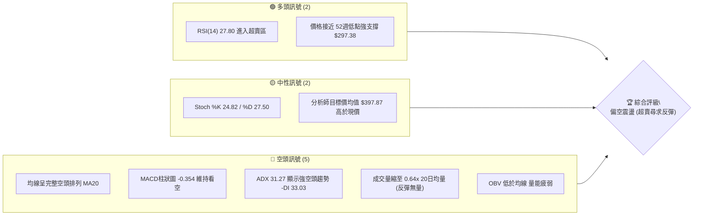
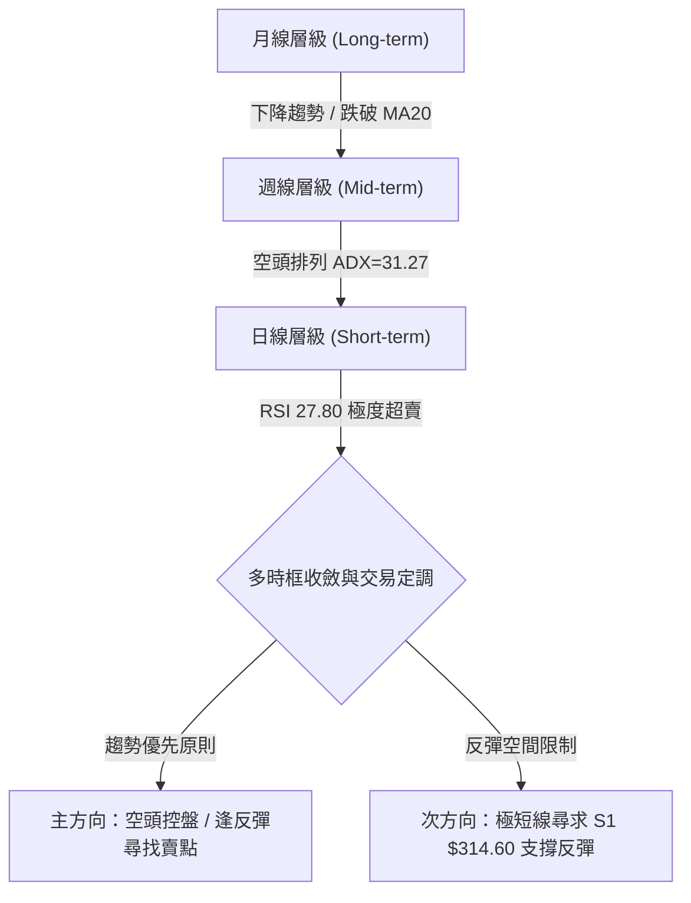
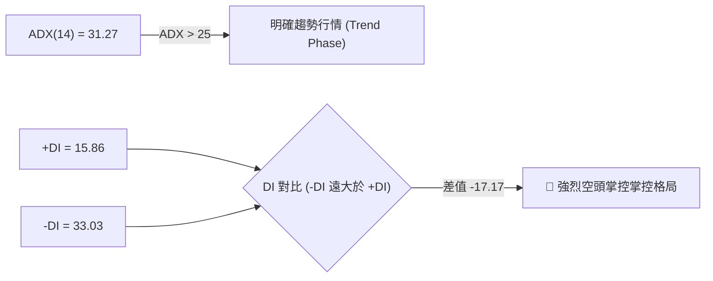
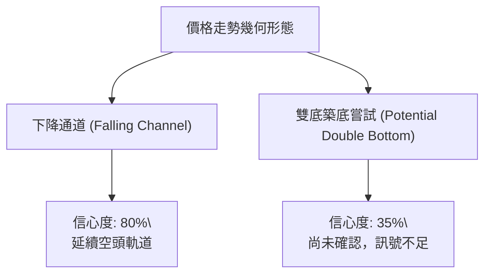
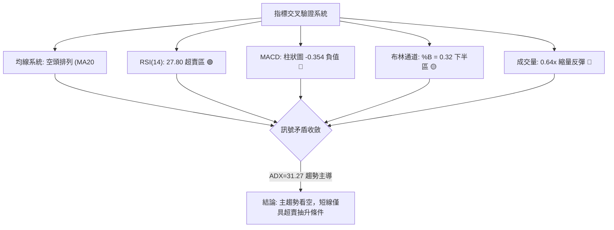
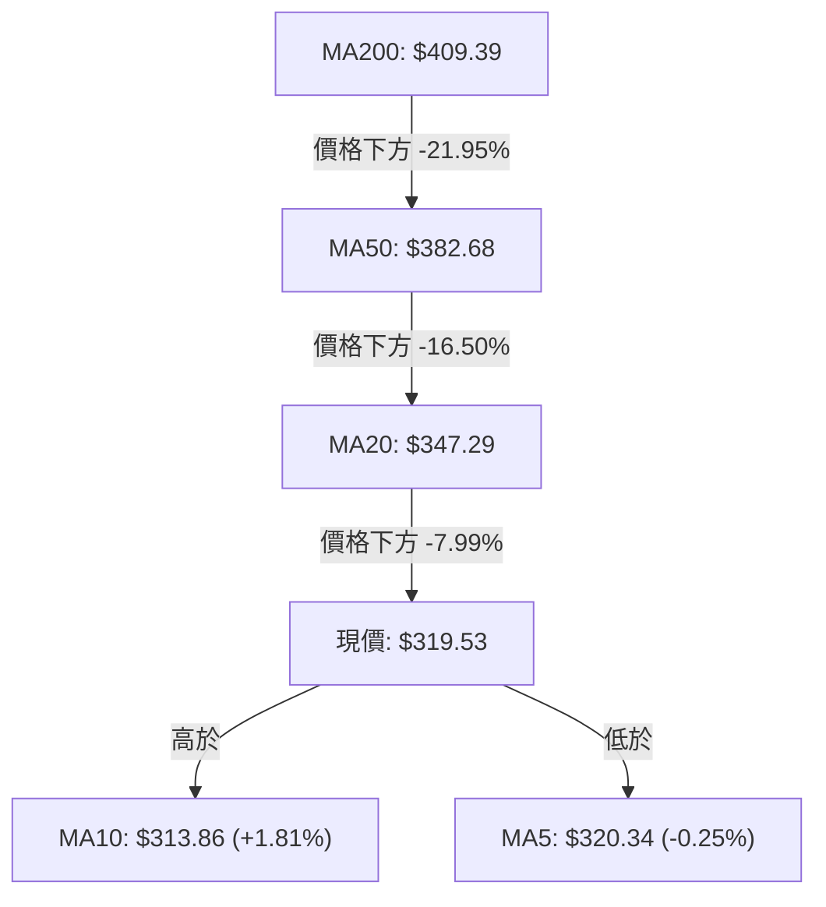
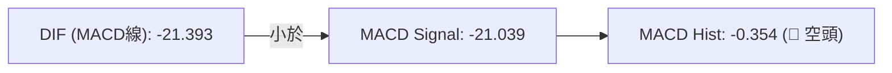
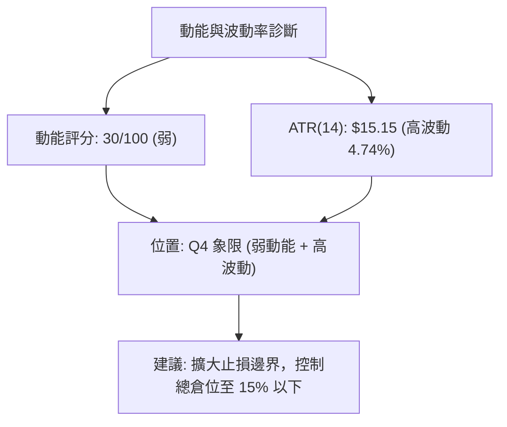
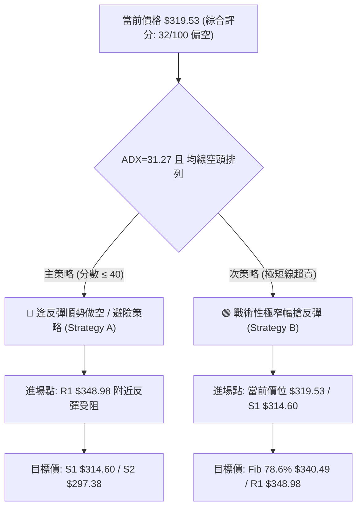
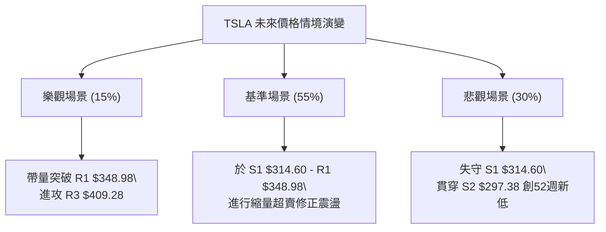

# TSLA 技術分析報告

> **報告日期**：2026-08-07 ｜ **語言**：繁體中文 ｜ **數據來源**：Yahoo Finance ｜ **當前價格**：$319.53

---

## 目錄

| 章節 | 內容 |
|------|------|
| [1. 技術面概覽](#1-技術面概覽) | 訊號儀表板、核心指標、評分卡 |
| [2. 趨勢分析](#2-趨勢分析) | 多時框趨勢、長中短期走勢、ADX強度 |
| [3. 圖表形態分析](#3-圖表形態分析) | 形態識別、K線組合、形態信心度 |
| [4. 支撐與阻力](#4-支撐與阻力) | 關鍵價位、斐波那契回調 |
| [5. 技術指標深度解讀](#5-技術指標深度解讀) | MA/RSI/MACD/布林/成交量 |
| [6. 動能與波動率](#6-動能與波動率) | 動能評估、ATR、Beta分析 |
| [7. 多時框架總結](#7-多時框架總結) | 時框架評分矩陣、收斂結論 |
| [8. 交易策略建議](#8-交易策略建議) | 多空策略、情境機率、風險報酬比 |
| [9. 風險提示與監控](#9-風險提示與監控) | 監控指標、風險場景 |

---

## 1. 技術面概覽

### 🎯 技術訊號儀表板



### 📊 核心指標速覽表

| 指標類別 | 指標名稱 | 當前數值 | 訊號 | 解讀 |
|----------|----------|----------|------|------|
| **價格** | 當前價格 | $319.53 | 🔴 | 位於52週區間 11.0% 極低位 |
| **均線** | MA20 | $347.29 | 🔴 | 價格於下方 -7.99%，短線壓力重 |
| **均線** | MA50 | $382.68 | 🔴 | 中期趨勢向下，負乖離 -16.50% |
| **均線** | MA200 | $409.39 | 🔴 | 長期牛熊分界線高懸，負乖離 -21.95% |
| **動能** | RSI(14) | 27.80 | 🟢 | 極度超賣 (<30)，具備技術性反彈契機 |
| **動能** | MACD | -21.393 | 🔴 | 位於零軸下方，柱狀圖 -0.354 顯示空頭主導 |
| **趨勢** | ADX(14) | 31.27 | 🔴 | >25 強趨勢成立，-DI (33.03) 遠高於 +DI (15.86) |
| **通道** | BB %B | 0.32 | 🟡 | 位於布林通道下半區，貼近下軌 $269.98 向上修正 |
| **波動** | ATR(14) | $15.15 | 🟡 | 占股價 4.74%，日間波動較大 |
| **成交量** | 量比 | 0.64x | 🔴 | 最新量 25.14M，低於20日均量 39.04M |

### 🏆 技術評分卡

```
╔══════════════════════════════════════════════════════════════════╗
║                   技術評分卡 — TSLA (2026-08-07)                 ║
╠══════════════════════════════════════════════════════════════════╣
║  趨勢強度      ▓▓▓▓▓▓▓▓▓▓▓▓▓▓█░░░░░  72/100  🔴 (強空頭趨勢)    ║
║  動能指標      ▓▓▓▓▓▓█░░░░░░░░░░░░░  30/100  🟡 (超賣背離邊緣)  ║
║  支撐穩定度    ▓▓▓▓▓▓▓▓▓█░░░░░░░░░░  45/100  🟡 (接近52W低點)   ║
║  成交量配合    ▓▓▓▓▓█░░░░░░░░░░░░░░  25/100  🔴 (追價量能不足)  ║
║  形態完整度    ▓▓▓▓▓▓▓█░░░░░░░░░░░░  35/100  🔴 (下降通道運行)  ║
║  均線排列      ▓▓█░░░░░░░░░░░░░░░░░  10/100  🔴 (完美空頭排列)  ║
╠══════════════════════════════════════════════════════════════════╣
║  綜合評分      ▓▓▓▓▓▓█░░░░░░░░░░░░░  32/100  🔴 空頭主導 (Bearish)║
╚══════════════════════════════════════════════════════════════════╝
```

---

## 2. 趨勢分析

### 🌐 多時框趨勢分析



### 📈 長期趨勢 — 12個月走勢圖（Unicode）

```
TSLA 月線走勢圖（2025-08 至 2026-08）
價格軸 ($)
$460 ┤               ● $456.56 (2025-10 頂部)
$440 ┤         ●           ● $449.72   ● $435.79
$400 ┤                                       ●
$360 ┤   ●                                         
$320 ┤● $333.87                                      ● $319.53 (現在)
$280 ┤                                           ● $311.21
     └─────────────────────────────────────────────────────────
      25-08 25-10 25-12  26-02  26-04  26-06  26-08 (月份)
```

**走勢特徵分析表格**：

| 階段 | 時間區間 | 收盤價變化 | 漲跌幅 | 走勢特徵與技術含義 |
|------|----------|------------|--------|----------------────|
| 衝高段 | 2025-08 → 2025-10 | $333.87 → $456.56 | +36.75% | 多頭強勢噴發，創下近一年波段高點聚類 |
| 高位震盪 | 2025-11 → 2026-01 | $430.17 → $430.41 | -5.73% | 於 $430-$450 區間做頭，多頭攻擊力道衰竭 |
| 回檔修正 | 2026-02 → 2026-04 | $402.51 → $381.63 | -11.77% | 跌破中期均線，形成下降高點 (Lower Highs) |
| 短反彈 | 2026-05 → 2026-06 | $435.79 → $420.60 | +14.19% | 弱勢反彈受制於高點阻力，量能未放大 |
| 主跌段 | 2026-07 → 2026-08 | $311.21 → $319.53 | -24.03% | 恐慌性賣壓湧現，單月重挫暴跌，尋求 52週低點支撐 |

### 📊 中期趨勢（週線分析）

從近 20 週收盤走勢觀察，價格自 2026-05-31 高點 $435.79 一路下挫至 2026-08-02 低點 $311.21，跌幅高達 28.58%。週線 MACD 柱狀圖在 2026-07-26 當週擴大至 -8.365，RSI 暴跌至 15.7 的極端超賣區，顯示中期強烈下殺動能。近一週（2026-08-09）收盤價回升至 $319.53，週成交量縮減至 124,564,233，顯示賣壓暫時停歇，但買盤追高意願依然極低。

### ⚡ 趨勢強度評估（ADX 解讀）



**ADX 趨勢強度指標對照評估**：

| 指標項 | 當前數值 | 門檻判定 | 技術解讀 |
|--------|----------|----------|----------|
| **ADX(14)** | **31.27** | > 25 (強趨勢) | 擺脫盤整，處於強烈的單邊趨勢行情中 |
| **+DI(14)** | **15.86** | < 20 (弱多頭) | 多頭攻擊動能極度微弱 |
| **-DI(14)** | **33.03** | > 30 (強空頭) | 空頭主導市場，主導價格下行方向 |
| **趨勢定性** | **單邊空頭** | 續航機率高 | 依「多時框收斂規則」，ADX>25 必須以中長期空頭方向為主 |

---

## 3. 圖表形態分析

### 🔍 形態識別系統



**形態信心度與判斷依據表**（依規則 15）：

| 形態名稱 | 信心度 | 判斷依據（引用數據） | 完成度 | 目標價計算式與精確數值 |
|----------|--------|----------------------|--------|------------------------|
| **下降通道** | **80%** | 高點受制於波段高點聚類 (R3 $409.28)，低點貼近 52週低點 S2 $297.38 運行 | 85% | 依通道下軌延伸推算下行目標：S2 $297.38 |
| **雙底築底** | **35%** | 2026-08-02 觸及 $311.21 後止跌，接近 52W 低點 S2 $297.38，但無量 | 20% | **訊號不足，僅做指標型解讀**（若突破頸線 R1 $348.98 方能確立） |

### 🕯️ 重要K線形態分析

| 月份/日期 | 收盤價 | K線形態 | 解讀 | 訊號 |
|-----------|--------|---------|------|------|
| 2026-05 | $435.79 | 長上影光腳陽線 | 逢高獲利結利賣壓沉重，阻力重重 | 🟡 |
| 2026-07 | $311.21 | 大陰線（暴跌） | 跌破多頭防線，引發停損恐慌賣盤 | 🔴 |
| 2026-08 (最新) | $319.53 | 低位縮量小陽星 | 止跌孕育線，短線賣壓竭盡，尋求反彈 | 🟢 |

### 📉 ASCII 走勢形態示意圖

```
TSLA 下降通道與雙底嘗試示意圖
$435.79 ┐ (2026-05 高點)
        ┊ ╲ 
$409.28 ┼───╲─────────── 下降通道上軌 (壓力)
        ┊    ╲
$348.98 ┼─────╲───────── 頸線壓力 R1 $348.98
        ┊      ╲    ●現價 $319.53
$314.60 ┼───────●───/─── 支撐 S1 $314.60
$297.38 ┼────────●────── 52W 低點 S2 $297.38 (底座)
        └─────────────────────────────────────────
```

### 🎯 形態目標價計算

1. **下行通道測算（若跌破 S1 $314.60）**：
   - 通道下軌支撐強度測算直接指向 52週低點 **S2 $297.38**。
2. **超賣反彈測算（若於 S1 $314.60 確立築底）**：
   - 第一反彈目標為突破頸線阻力聚類 **R1 $348.98**。
   - 計算公式：形態高度 = R1 ($348.98) - S2 ($297.38) = $51.60。若向上突破 R1，波段理論目標價 = R1 ($348.98) + $51.60 = **$400.58**（接近 50% 斐波那契位 $398.10 及 R3 $409.28）。

---

## 4. 支撐與阻力

### 🗺️ 關鍵價位分布圖（Unicode）

```
TSLA 價位結構分布圖 (以當前價 $319.53 為基準)
════════════════════════════════════════════════════════════
$498.83 ║██████████████████████████████████  52W High / Fib 0.0%
$451.29 ║█████████████████████████████      Fib 23.6%
$421.88 ║█████████████████████████          Fib 38.2%
$409.28 ║████████████████████████           強阻力 R3 / MA200 ($409.39)
$398.10 ║█████████████████████              Fib 50.0%
$374.33 ║██████████████████                 Fib 61.8%
$355.39 ║██████████████                     阻力 R2
$348.98 ║█████████████                      關鍵阻力 R1 / MA20 ($347.29)
$340.49 ║███████████                        Fib 78.6%
$319.53 ╠══════════════════════════════════ ◄ 現價 $319.53
$314.60 ║▓▓▓▓▓▓▓▓▓▓                         近期支撐 S1
$297.38 ║██████████████████████████████████  強支撐 S2 / 52W Low (Fib 100%)
════════════════════════════════════════════════════════════
```

### 🚧 阻力位分析表

| 阻力級別 | 價位 | 形成原因 | 突破難度 | 重要性 |
|----------|------|----------|----------|--------|
| **R1** | **$348.98** | 近一年波段高點聚類 / 扣抵 MA20 ($347.29) 壓力 | 🟡 中等 | 🟢 短線多空強弱分界線 |
| **R2** | **$355.39** | 近一年波段高點密集套牢區 | 🟡 中等 | 🟡 中期反彈解套賣壓區 |
| **R3** | **$409.28** | 波段高點聚類 / 重合 MA200 ($409.39) 牛熊線 | 🔴 極難 | 🔴 長期趨勢扭轉關鍵點 |

### 🛡️ 支撐位分析表

| 支撐級別 | 價位 | 形成原因 | 守住機率 | 重要性 |
|----------|------|----------|----------|--------|
| **S1** | **$314.60** | 近一年波段低點聚類 / 近兩週密集下影線區 | 🟡 55% | 🟢 短線防守第一道防線 |
| **S2** | **$297.38** | 52週歷史最低點 (52W Low) | 🟢 70% | 🔴 中長期多頭最後鋼鐵防線 |

### 📐 斐波那契回調位分析

依據 52週區間最高點 **$498.83** 至最低點 **$297.38** 計算之斐波那契回調位：

- **0.0% (52W High)**: $498.83
- **23.6%**: $451.29
- **38.2%**: $421.88
- **50.0%**: $398.10
- **61.8%**: $374.33
- **78.6%**: $340.49
- **100.0% (52W Low)**: $297.38

**當前價位位置與含義**：
現價 **$319.53** 落於 **78.6% ($340.49)** 與 **100.0% ($297.38)** 之間的極度深水區。價格已修正了整波漲幅的 78.6% 以上，屬於典型的「超跌區域」。上方首要斐波那契阻力為 **78.6% ($340.49)**，若能站回此位置之上，方有機會向 61.8% ($374.33) 進行中期技術性修復。

---

## 5. 技術指標深度解讀

### 🎛️ 指標訊號總覽



### 📈 移動平均線排列分析



- **均線排列狀態**：MA20 ($347.29) < MA50 ($382.68) < MA200 ($409.39)，形成**標準空頭排列**。
- **短線微型反彈**：現價 $319.53 已站上 MA10 ($313.86)，但受制於 MA5 ($320.34) 與 MA20 ($347.29) 的扣抵向下壓力，上方層層均線反壓沉重。

### 📉 RSI(14) 分析

```
RSI(14) 動能進度條
0                    27.80   30               70                  100
├──────────────────────█──────┼────────────────┼───────────────────┤
[      極度超賣區      ]  ↑   [    中性區間    ] [     超買區       ]
```

- **當前數值**：**27.80** 🟢 (低於 30 門檻)。
- **背離判斷**：從近兩週走勢來看，價格於 2026-08-02 創低點 $311.21 時 RSI 為 18.1，當前價格 $319.53 時 RSI 回升至 27.80。**無明顯頂背離，亦未形成標準底背離**，僅屬於超賣後的技術性指標修復。

### 📊 MACD(12/26/9) 訊號解讀



- **MACD 線** (-21.393) 位於 Signal 線 (-21.039) 下方，且雙線皆深陷零軸下方遠處，顯示長期空頭氣勢旺盛。
- **柱狀圖** (-0.354) 雖然負值較前週 (-6.930) 大幅縮窄，顯示下殺動能趨緩，但尚未出現黃金交叉綠柱，空頭掌控權未變。

### 📦 布林通道分析

```
TSLA 布林通道示意圖
$424.61 ┼──────────────────────────────── 上軌 (BB Upper)
        │
$347.29 ┼──────────────────────────────── 中軌 (MA20)
        │     ● 現價 $319.53 (%B = 0.32)
$269.98 ┼──────────────────────────────── 下軌 (BB Lower)
```

- **通道上軌**：$424.61 ｜ **中軌 (MA20)**：$347.29 ｜ **下軌**：$269.98
- **%B 指標**：**0.32**（說明價格位於通道下半區 32% 位置）。價格自接近下軌處獲得支撐後小幅回升，但中軌 $347.29（重合 R1 $348.98）將形成極強動態阻力。

### 💹 成交量分析（量價配合度）

- **最新成交量**：25,143,733 股
- **20日均量**：39,043,352 股（**量比 0.64x**，顯著縮量）
- **OBV (能量潮)**：OBV < MA，量能指標持續低迷。
- **量價診斷**：價格自 $311.21 反彈至 $319.53 過程中成交量大幅萎縮，呈現典型「**無量反彈**」特徵。顯示無大資金積極入場抄底，僅為賣壓竭盡後的自然抽升。

---

## 6. 動能與波動率

### ⚡ 動能評估

| 象限 | 動能強度 | 波動率 | 當前狀態 | 技術評估與操作導向 |
|------|----------|--------|----------|────────────────────|
| **Q1** | 強 (Bull) | 低 (Low) | - | 最佳趨勢作多區間 |
| **Q2** | 弱 (Bear) | 低 (Low) | - | 沉悶盤整區 |
| **Q3** | 強 (Bull) | 高 (High)| - | 高風險高收益爆發區 |
| **Q4** | **弱 (Bear)** | **高 (High)**| **✓ (當前區域)** | **高波動空頭下行區（避開盲目抄底，以逢高避險為主）** |



### 📊 ATR 波動率分析

- **ATR(14)**：**$15.15**（占當前價格 **4.74%**）。
- **止損距離建議**：
  - **短線風控 (1.5 x ATR)**：$15.15 × 1.5 = **$22.73**
  - **中線風控 (2.0 x ATR)**：$15.15 × 2.0 = **$30.30**
- **交易啟示**：日內與跨日波動極劇烈，任何交易策略之止損設於 $15 以內皆極易被雜訊震盪出場。

### 📐 Beta 與市場相關性

- **Beta 係數**：**1.827**。
- TSLA 屬於高 Beta 成長型/消費週期股，相較於 S&P 500 指數具備 82.7% 的額外波動放大效應。大盤若出現 1% 的修正，TSLA 平均下殺幅度達 1.83%。

---

## 7. 多時框架總結

### 📋 時框架評分表

| 時框架 | 趨勢方向 | 動能指標 | 均線排列 | 形態結構 | 綜合評分 | 交易策略建議 |
|--------|----------|----------|----------|----------|----------|--------------|
| **月線** | 🔴 下降 | 🔴 弱勢 | 🔴 空頭 | 🔴 跌破頭部 | **25/100** | 長期避險，防範深幅修正 |
| **週線** | 🔴 下降 | 🔴 看空 | 🔴 空頭 | 🔴 下降通道 | **30/100** | 中線逢反彈建立避險空單 |
| **日線** | 🟡 震盪 | 🟢 超賣 | 🔴 空頭 | 🟡 超賣抽升 | **42/100** | 短線僅限極輕倉搶技術反彈 |
| **60分線** | 🟢 反彈 | 🟢 轉強 | 🟡 交叉 | 🟢 築底向上 | **58/100** | 當日沖銷/超短線尋找買點 |

### 🔲 綜合訊號矩陣

```
╔══════════════════════════════════════════════════════════════════╗
║                     TSLA 多時框訊號矩陣                          ║
╠══════════════════════╦══════════════╦══════════════╦═════════════╣
║ 維度 \ 時框架        ║ 日線 (Daily) ║ 週線 (Weekly)║ 月線 (Monthly)
╠══════════════════════╬══════════════╬══════════════╬═════════════╣
║ 趨勢方向 (Trend)     ║   🟡 橫盤    ║   🔴 向下    ║   🔴 向下   ║
║ 動能強度 (Momentum)  ║   🟢 超賣    ║   🔴 疲弱    ║   🔴 疲弱   ║
║ 均線架構 (MA Align)  ║   🔴 空頭    ║   🔴 空頭    ║   🟡 糾結   ║
║ 量能配合 (Volume)    ║   🔴 縮量    ║   🔴 縮量    ║   🔴 賣壓   ║
╠══════════════════════╬══════════════╬══════════════╬═════════════╣
║ 時框主導權與一致性   ║        低    ║      高      ║     最高    ║
╚══════════════════════╩══════════════╩══════════════╩═════════════╝
```

### ⚖️ 多時框收斂結論

依「多時框收斂規則」進行收斂：
1. **行情定性**：當前 ADX(14) 為 **31.27 (>25)**，嚴格判定為**趨勢行情**而非盤整行情。
2. **主導層級**：中長期（週線/月線）均線呈完美空頭排列（MA20<MA50<MA200），-DI (33.03) 掌控大局，中長期趨勢方向為**明確向下**。
3. **日線角色**：日線 RSI(27.80) 極度超賣僅能引發短線技術性修復（尋求 R1 $348.98 壓力測試），**絕不可將日線超賣誤判為長期轉多**。
4. **最終唯一方向性結論**：**偏空主導（Bearish Dominant）**。主策略應為「逢反彈至阻力區建立空頭/避險部位」，次要策略僅為「極低倉位搶超賣反彈」。此結論與第 1 章（32分）、第 2 章及第 8 章完全一致。

---

## 8. 交易策略建議

### 🗺️ 策略決策流程圖



### 🧭 策略路由

**當前主策略方向 = 偏空／逢高避險空頭策略（綜合評分：32/100）**

因綜合評分僅 32 分（≤40），主推逢反彈順勢做空策略；多頭僅列為極低倉位之戰術性超賣搶反彈。

### 🎯 價格情境階梯（Price Scenarios）

| 觸發條件 | 下一目標 | 後續延伸 | 情境含義 |
|----------|----------|----------|----------|
| **突破 R1 $348.98** | R2 $355.39 | R3 $409.28 | 短線空頭強烈回補，轉為中級反彈波 |
| **站穩 S1 $314.60** | Fib 78.6% $340.49 | R1 $348.98 | 守住低點，進行超賣指標修復性震盪 |
| **跌破 S1 $314.60** | S2 $297.38 | 探尋新低 | 恐慌賣壓再現，測試 52週歷史最低點 |

### 📊 情境機率分佈

| 情境 | 機率 | 主要依據 |
|------|------|----------|
| **反彈受阻回落 (主情境)** | **55%** | 均線空頭排列，ADX=31.27，成交量僅 0.64x 顯示無追價買盤 |
| **區間超賣震盪 (次情境)** | **30%** | RSI 27.80 極度超賣，S1 $314.60 具備短期買盤撐盤 |
| **強勢V型反轉 (樂觀情境)**| **15%** | 缺乏利多催化劑與量能配合，突破 R3 $409.28 機率極低 |

### 🟢 交易策略詳情表

| 策略要素 | 策略 A (主推：順勢逢高做空/避險) | 策略 B (次選：戰術超賣搶反彈) |
|----------|----------------────────────────--|----------------────────────────|
| **策略邏輯** | 趁日線 RSI 超賣反彈至均線反壓區建立空單 | 利用 RSI 27.80 極度超賣搏取技術性抽升 |
| **進場條件** | 價格反彈至 **$340.49 - $348.98** 遇阻出現轉折 | 現價 **$319.53** 或拉回至 **$314.60** 守住 |
| **進場價格** | **$348.98** (重合 R1 與 MA20) | **$319.53** (現價進場) |
| **目標價 T1** | **$314.60** (S1 近期支撐) | **$340.49** (Fib 78.6% 阻力) |
| **目標價 T2** | **$297.38** (S2 52週低點) | **$348.98** (R1 關鍵阻力) |
| **止損價格** | **$355.39** (突破 R2 止損，離進場點 $6.41) | **$297.38** (跌破 S2 止損，離進場點 $22.15) |
| **風險報酬比**| **5.36 : 1** 🟢 (潛在利潤 $34.38 / 風險 $6.41) | **0.95 : 1** 🔴 (潛在利潤 $20.96 / 風險 $22.15) |
| **勝率估計** | **60%** | **35%** |
| **建議倉位** | **15% - 20%** (主控風險) | **5% - 8%** (極輕倉試錯) |

### 🔴 反向風險觸發點（對沖提示）

若價格強勢帶量突破 **R2 $355.39**，意味著短期下降趨勢線被破壞，空頭策略必須立即強制平倉出場，並將觀點轉為中性觀望。

### ⭐ 整體訊號強度評星

```
做多訊號強度：★★☆☆☆  (2/5星 - 僅憑 RSI 超賣，缺乏量能)
做空訊號強度：★★███  (4/5星 - 趨勢與均線完美配合)
整體可信度：  ████☆  (4/5星 - 多時框數據高度一致)
```

---

## 9. 風險提示與監控

### ✅ 關鍵監控指標 Checklist

```
╔══════════════════════════════════════════════════════════════════╗
║                   TSLA 技術面每日風控清單                         ║
╠══════════════════════════════════════════════════════════════════╣
║ [ ] 52W 低點防線：$297.38 (S2) 是否遭收盤價實體跌破？            ║
║ [ ] 短線反彈瓶頸：$348.98 (R1/MA20) 是否出現長上影線受阻？       ║
║ [ ] 動能修復門檻：RSI(14) 是否能重返 30.00 以上擺脫極度超賣？    ║
║ [ ] 成交量補量：日成交量是否回升至 39.04M (20日均量) 以上？      ║
║ [ ] 趨勢指標轉折：MACD 是否於零軸下方出現黃金交叉柱狀圖轉綠？    ║
╚══════════════════════════════════════════════════════════════════╝
```

### ⚠️ 風險場景分析



### 🛡️ 風險管理重要提醒

1. **波動率極高**：TSLA 當前 ATR 達 $15.15 (4.74%)，Beta 為 1.827，屬於高風險標的。槓桿商品（如期權或槓桿 ETF）交易者應極度謹慎。
2. **絕不盲目重倉抄底**：在 MA20 ($347.29)、MA50 ($382.68)、MA200 ($409.39) 呈空頭排列且量能不濟情況下，左側抄底風險極高。建議等待價格站穩 R1 $348.98 且右側出現底部形態後再行布局。

---

## 📋 報告總結

```
╔══════════════════════════════════════════════════════════════════╗
║                    TSLA 技術分析報告總結                         ║
════════════════════════════════════════════════════════════════════
報告日期：2026-08-07
當前價格：$319.53
分析評級：🔴 偏空主導 (Bearish) ｜ 技術評分：32 / 100

關鍵結論：
├─ 長期趨勢：🔴 空頭掌控（跌破牛熊線 MA200 $409.39，負乖離 -21.95%）
├─ 中期趨勢：🔴 下降通道（週線下殺，ADX 31.27 顯示強空頭趨勢）
├─ 短期趨勢：🟢 尋求反彈（RSI 27.80 極度超賣，於 S1 $314.60 嘗試築底）
├─ 關鍵支撐：S1 $314.60 ｜ S2 $297.38 (52週最低點)
├─ 關鍵阻力：R1 $348.98 ｜ R2 $355.39 ｜ R3 $409.28
└─ 分析師目標價：$397.87 (均值)

最優策略組合：
1. 🥇 主推策略：策略 A (逢高建立避險空單 / 進場點 $348.98 / 風報比 5.36 : 1)
2. 🥈 次選策略：策略 B (極輕倉搶超賣反彈 / 進場點 $319.53 / 目標 $340.49)
3. 🥉 保守選擇：現金為王，靜待價格突破 R1 $348.98 或止跌結構落定
════════════════════════════════════════════════════════════════════
```

---

> ⚠️ **免責聲明**：本報告為 AI 自動生成之技術分析，所有數據及估算均基於提供的歷史價格資訊。本報告**僅供研究與學術參考**，**不構成任何投資建議**。投資有風險，入市需謹慎。

---

*報告生成時間：2026-08-07 ｜ 數據來源：Yahoo Finance ｜ 分析框架：多時框技術分析*