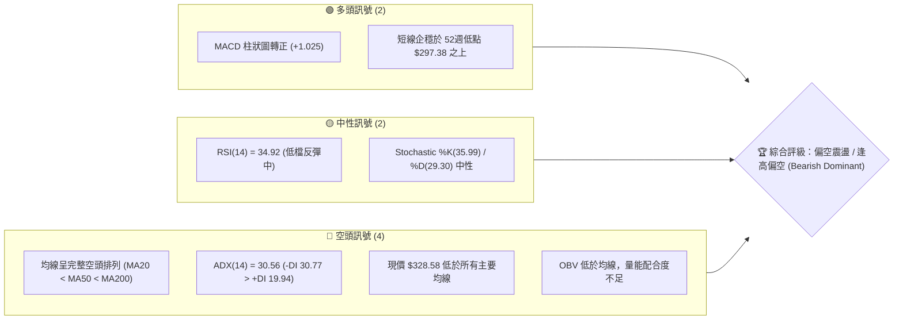
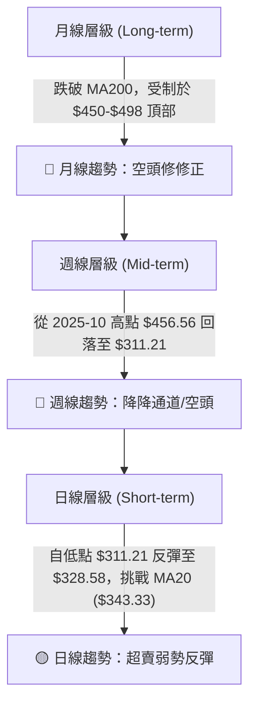
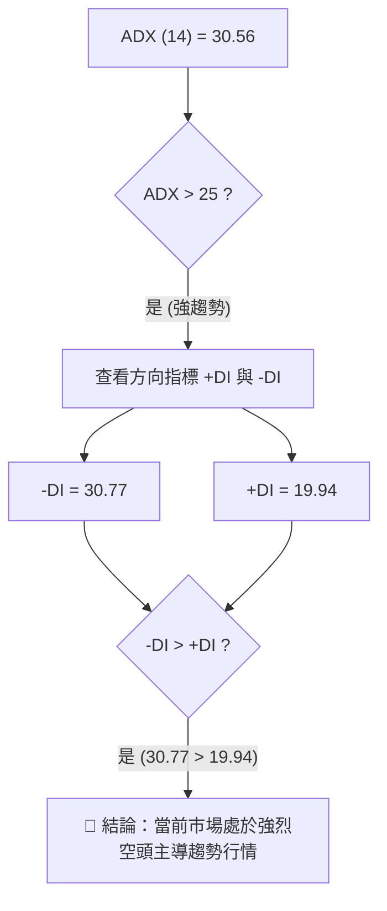
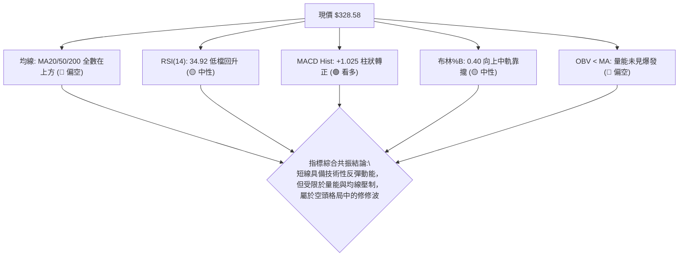
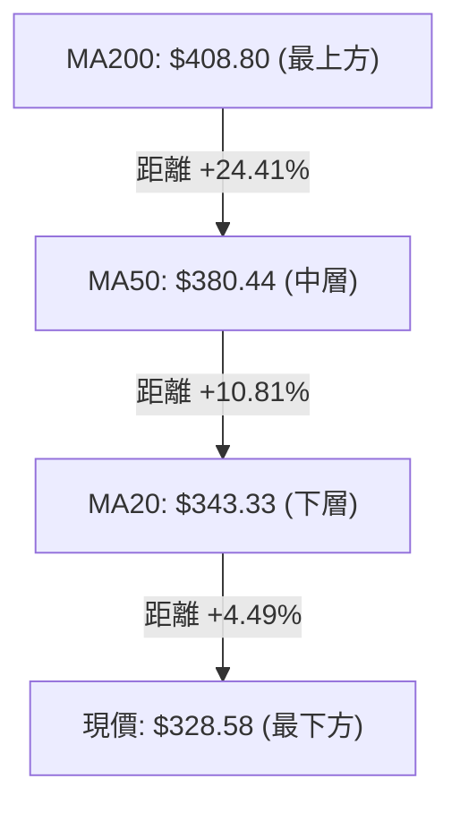
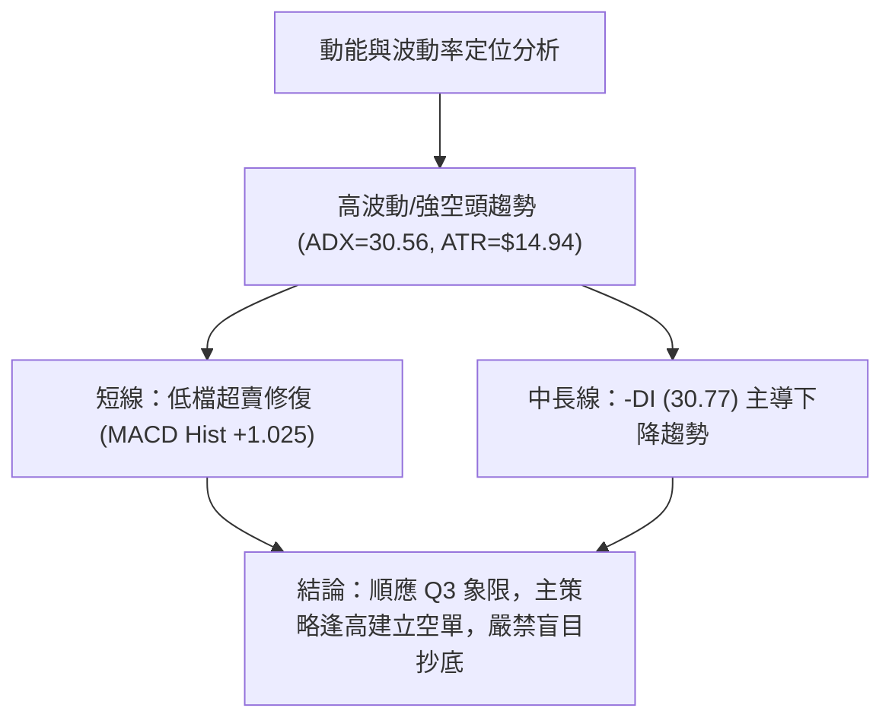
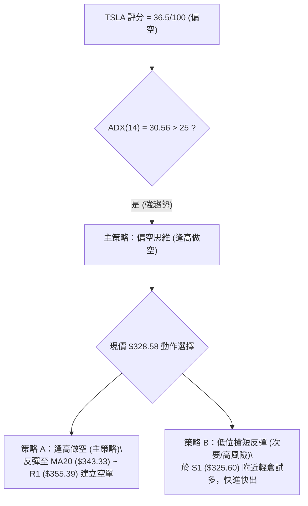
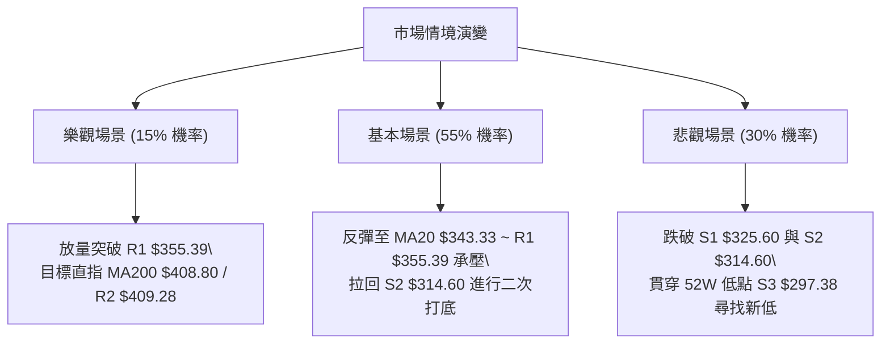

# TSLA 技術分析報告

> **報告日期**：2026-08-08 ｜ **語言**：繁體中文 ｜ **數據來源**：Yahoo Finance ｜ **當前價格**：$328.58

---

## 目錄

| 章節 | 內容 |
|------|------|
| [1. 技術面概覽](#1-技術面概覽) | 訊號儀表板、核心指標、評分卡 |
| [2. 趨勢分析](#2-趨勢分析) | 多時框趨勢、長中短期走勢、ADX強弱 |
| [3. 圖表形態分析](#3-圖表形態分析) | 形態識別與信心度、K線組合、目標價計算 |
| [4. 支撐與阻力](#4-支撐與阻力) | 關鍵價位圖、阻力/支撐層級、斐波那契回調 |
| [5. 技術指標深度解讀](#5-技術指標深度解讀) | MA均線系統、RSI、MACD、布林通道、OBV與成交量 |
| [6. 動能與波動率](#6-動能與波動率) | 動能四象限、ATR波動度、Beta分析 |
| [7. 多時框架總結](#7-多時框架總結) | 時框架評分矩陣、多時框收斂結論 |
| [8. 交易策略建議](#8-交易策略建議) | 策略路由、價格情境階梯、主策略詳情、對沖提示 |
| [9. 風險提示與監控](#9-風險提示與監控) | 監控 Checklist、風險場景、倉位管理建議 |

---

## 1. 技術面概覽

### 🎯 技術訊號儀表板



### 📊 核心指標速覽表

| 指標類別 | 指標名稱 | 當前數值 | 訊號 | 解讀 |
|----------|----------|----------|------|------|
| **價格** | 當前收盤價 | $328.58 | 🔴 | 位於 52 週高低價區間 (15.5%)，極度靠近低檔區 |
| **均線** | MA20 | $343.33 | 🔴 | 價格位於 MA20 下方 (-4.30%)，短線承壓 |
| **均線** | MA50 | $380.44 | 🔴 | 價格位於 MA50 下方 (-13.63%)，中期趨勢偏空 |
| **均線** | MA200 | $408.80 | 🔴 | 價格位於 MA200 下方 (-19.62%)，長期趨勢偏空 |
| **動能** | RSI(14) | 34.92 | 🟡 | 脫離超賣區 (先前低點 15.7)，動能弱勢修復 |
| **動能** | MACD(12,26,9) | -19.758 | 🟢 | MACD線 -19.758 > 信號線 -20.783，柱狀圖 +1.025 交叉向上 |
| **趨勢強度**| ADX(14) | 30.56 | 🔴 | ADX > 25 具備強趨勢，-DI(30.77) 主導空頭趨勢 |
| **波動** | ATR(14) | $14.94 | 🟡 | 日波幅占股價 4.55%，屬於中高波動狀態 |
| **通道** | 布林通道 %B | 0.40 | 🟡 | 現價處於下軌 ($271.11) 與中軌 ($343.33) 之間 |
| **成交量** | 20日均量比 | 1.00x | 🟡 | 最新量 39.37M 與 20日均量 39.39M 持平，無突破大量 |

### 🏆 技術評分卡

```
╔══════════════════════════════════════════════════════════════════╗
║                TSLA 技術綜合評分卡 (2026-08-08)                 ║
╠══════════════════════════════════════════════════════════════════╣
║ 趨勢強度 (Trend)     ▓▓▓▓▓▓▓░░░░░░░░░░░░░  35/100  🔴 空頭強趨勢   ║
║ 動能指標 (Momentum)  ▓▓▓▓▓▓▓▓▓░░░░░░░░░░░  45/100  🟡 短線低檔反彈 ║
║ 支撐穩定度 (Support) ▓▓▓▓▓▓▓▓▓▓░░░░░░░░░░  50/100  🟡 近 S1 關卡   ║
║ 成交量配合 (Volume)  ▓▓▓▓▓▓▓░░░░░░░░░░░░░  35/100  🔴 OBV量能偏弱  ║
║ 形態完整度 (Pattern) ▓▓▓▓▓▓▓▓░░░░░░░░░░░░  40/100  🟡 無完成反轉形態║
║ 均線排列 (MA System) ▓▓▓▓░░░░░░░░░░░░░░░░  20/100  🔴 完全空頭排列 ║
╠══════════════════════════════════════════════════════════════════╣
║ 綜合評分             ▓▓▓▓▓▓▓▓░░░░░░░░░░░░  36.5/100 評級：🔴 偏空 ║
╚══════════════════════════════════════════════════════════════════╝
```

---

## 2. 趨勢分析

### 🌐 多時框趨勢分析



### 📈 長期趨勢 — 12個月走勢圖（Unicode）

近 12 個月（2025-08 至 2026-08）價格走勢軌跡如下圖所示，呈現「雙頂（2025-10 $456.56 與 2025-12 $449.72）後大幅崩跌」的空頭格局：

```
TSLA 月線價格走勢圖（2025-08 至 2026-08）
價位 ($)
$480 ┼                                 ● (2025-10 高點 $456.56)
$450 ┼                   ● (2025-09)       ● (2025-12 $449.72)
$420 ┼                                         ● (2026-01 $430.41)
$390 ┼                                             ● (2026-05 $435.79)
$360 ┼                                                 ● (2026-06 $420.60)
$330 ┼ ● (2025-08 $333.87)                                 ● (現價 $328.58)
$300 ┼                                                         ● (2026-07 低點 $311.21)
     └─┬───────┬───────┬───────┬───────┬───────┬───────┬───────┬───────►
     2025-08 2025-09 2025-10 2025-12 2026-01 2026-03 2026-05 2026-07 2026-08
```

#### 長期走勢特徵分析表

| 階段 | 時間區間 | 收盤價變化 | 漲跌幅 | 走勢特徵分析 |
|------|----------|------------|--------|--------------|
| **衝頂期** | 2025-08 至 2025-10 | $333.87 ➔ $456.56 | +36.75% | 多頭強勢暴漲，創下近一年高點聚類 |
| **高檔震盪** | 2025-11 至 2026-01 | $430.17 ➔ $430.41 | +0.06% | 逢高獲利結算，形成 $450 近郊雙重頂部 |
| **主跌段一** | 2026-01 至 2026-03 | $430.41 ➔ $371.75 | -13.63%| 跌破短期均線，空頭動能開始發酵 |
| **死貓反彈** | 2026-04 至 2026-05 | $381.63 ➔ $435.79 | +14.19%| 逢低買盤湧入反彈，但在 $435 附近遭到強烈解套賣壓 |
| **主跌段二** | 2026-06 至 2026-07 | $420.60 ➔ $311.21 | -26.01%| 恐慌性拋售，週線 RSI 降至 15.7 極度超賣區 |
| **低位打底** | 2026-07 至 2026-08 | $311.21 ➔ $328.58 | +5.58% | 超賣後技術性抽離低點，進行下軌守備 |

### 📊 中期趨勢（週線分析）

從近 20 週收盤走勢觀察：
- **2026-05-31** 達到中期高點 $435.79 後，展開連續 9 週的下降趨勢。
- **2026-07-26** 當週暴跌至 $313.03（週 RSI 觸及 15.7 極值超賣）。
- **2026-08-09** 最新週收盤 $328.58，MACD 柱狀圖轉為正值 (+1.025)，RSI 回升至 34.92，顯示週線級別止跌試圖確立，惟上方面臨多層均線強烈蓋頂。

### ⚡ 趨勢強度評估（ADX 解讀）



| 指標 | 數值 | 臨界值 | 解讀與行情性質判斷 |
|------|------|--------|--------------------|
| **ADX(14)** | **30.56** | > 25.0 | **強趨勢行情**（非無方向之盤整整理，任何反彈均屬順勢空頭之修復） |
| **+DI** | **19.94** | - | 多頭買盤動能弱化 |
| **-DI** | **30.77** | - | 空頭賣壓顯著占據主導地位（差距 10.83） |

---

## 3. 圖表形態分析

### 🔍 形態識別系統

根據近一年與最近 20 週價格幾何結構進行客觀形態識別，評估如下：

| 形態名稱 | 形態類型 | 信心度 (%) | 判斷依據（引用數據） | 完成度 (%) | 目標價計算式 / 結論 |
|----------|----------|------------|----------------------|------------|---------------------|
| **下降通道** | 趨勢形態 | **85%** | 高點連線 ($456.56 ➔ $435.79) 與低點連線 ($371.75 ➔ $311.21) 構成向下傾斜通道 | **90%** | 通道下軌支撐在 $297.38 (52W Low)，上軌阻力在 $355.39 (R1) |
| **雙重頂 (M頭)** | 大型頂部 | **75%** | 2025-10 高點 $456.56 與 2025-12 高點 $449.72，頸線約在 $371.75 | **100% (已跌破)** | 跌破頸線 $371.75 後，最小測量跌幅目標已在 $311.21 區間達陣 |
| **V型超賣反彈**| 短期築底 | **45%** | 2026-07-26 低點 $311.21 後連續兩週收陽，RSI 由 15.7 彈至 34.92 | **35%** | **訊號不足，僅做指標型解讀**（未過 MA20 $343.33 前不可視為反轉底形） |

### 🕯️ 重要 K 線形態分析

| 日期/週期 | 收盤價 | K 線形態 | 技術解讀 | 多空訊號 |
|-----------|--------|----------|----------|----------|
| 2026-07-26 | $313.03 | 大陰線 (Long Black Day) | 伴隨 275.6M 週成交量恐慌性殺盤，跌破多頭防線 | 🔴 強烈看空 |
| 2026-08-02 | $311.21 | 下影錘子線 (Hammer) | 探底 $311.21 後獲得買盤支撐，低檔出現買盤抵抗 | 🟢 短線止跌 |
| 2026-08-09 | $328.58 | 中陽線 (Moderate Bullish) | 價格向上包覆前週實體，MACD柱轉正，短期底部浮現 | 🟢 低檔反彈 |

### 📉 ASCII 走勢形態示意圖

```
TSLA 下降通道與雙頂形態示意圖 (週線層級)
$460 ┤       頂點1 ($456.56)   頂點2 ($449.72)
$430 ┤───────/───\─────────────/───\────────── 下降通道上軌阻力 ($355.39)
$400 ┤            \           /     \
$370 ┤─────────────\─────────/───────\──────── 頸線阻力 ($371.75 / MA50 $380.44)
$340 ┤              \       /         \       ◄ 現價 $328.58
$310 ┤               \_____/           \______● 最低點 ($311.21) / S2 ($314.60)
$280 ┤──────────────────────────────────────── 通道下軌 / 52W Low ($297.38)
```

### 🎯 形態目標價計算

1. **已發生的雙頂 (M頭) 最小跌幅測量**：
   - 頂部平均價：$(456.56 + 449.72) / 2 = \$453.14$
   - 頸線位置：2026-03 低點 $\$371.75$
   - 形態高度：$\$453.14 - \$371.75 = \$81.39$
   - 最小跌幅目標價：$\$371.75 - \$81.39 = \$290.36$
   - *驗證*：2026-07 最低來到 $\$311.21$，已精準接近此形態測量目標區，顯示跌勢第一階段已基本滿足。

2. **短線反彈高度推算（由超賣反彈形態推算）**：
   - 低點：$\$311.21$
   - 第一目標：下降通道上軌兼阻力位 R1 = **$\$355.39$**
   - 第二目標：斐波那契 61.8% 回調位兼 MA50 = **$\$374.33$ 至 $\$380.44$**

---

## 4. 支撐與阻力

### 🗺️ 關鍵價位分布圖（Unicode）

```
TSLA 價位結構分布圖 (以當前價 $328.58 為核心)
══════════════════════════════════════════════════════════════════
$498.83 ║████████████████████████████████████████████████║ 52週最高點 (0.0%)
$418.36 ║████████████████████████████████████████║ 強阻力 R3 (波段高點聚類)
$409.28 ║██████████████████████████████████████  ║ 阻力 R2 (MA200 $408.80)
$374.33 ║██████████████████████████████        ║ Fib 61.8% 重合區 / MA50 $380.44
$355.39 ║████████████████████████            ║ 關鍵阻力 R1 (波段高點聚類)
$343.33 ║▓▓▓▓▓▓▓▓▓▓▓▓▓▓▓▓▓▓                  ║ 布林中軌 / MA20
$340.49 ║▓▓▓▓▓▓▓▓▓▓▓▓▓▓▓▓▓                   ║ Fib 78.6% 回調位
$328.58 ╠════════════════════════════════════════╠ ◄ 當前收盤價 (Current Price)
$325.60 ║▓▓▓▓▓▓▓▓▓▓▓▓▓▓▓                     ║ 近期第一支撐 S1 (-0.91%)
$314.60 ║████████████████                    ║ 關鍵支撐 S2 (近兩週震盪低點)
$297.38 ║████████████████████████████████████║ 強支撐 S3 / 52週最低點 (100.0%)
══════════════════════════════════════════════════════════════════
```

### 🚧 阻力位分析表

| 阻力級別 | 精確價位 | 距現價幅屬 | 形成原因與技術共振 | 突破難度 | 重要性 |
|----------|----------|------------|---------------------|----------|--------|
| **R1** | **$355.39** | +8.16% | 近一年波段高點聚類、接近下降通道上軌線 | 🟡 中等 | 🟢 短線多空分水嶺 |
| **R2** | **$409.28** | +24.56% | 波段高點聚類、與 MA200 ($408.80) 高度重合 | 🔴 極高 | 🔴 牛熊中期轉換點 |
| **R3** | **$418.36** | +27.32% | 波段高點聚類、接近斐波那契 38.2% ($421.88) | 🔴 極高 | 🟡 長期解套套牢區 |

### 🛡️ 支撐位分析表

| 支撐級別 | 精確價位 | 距現價幅屬 | 形成原因與技術共振 | 守住機率 | 重要性 |
|----------|----------|------------|---------------------|----------|--------|
| **S1** | **$325.60** | -0.91% | 近一年波段低點聚類、極度靠近當前價格 | 🟡 60% | 🟢 極短線防守點 |
| **S2** | **$314.60** | -4.25% | 波段低點聚類、2026-07-26 週收盤價 $313.03 區間 | 🟡 55% | 🟡 中期多頭退路 |
| **S3** | **$297.38** | -9.50% | 52週最低價 (100.0% Fib 位置)，整數心理關卡 | 🟢 70% | 🔴 長期生死防線 |

### 📐 斐波那契回調位分析

依據 52 週高點 **$498.83** 至 52 週低點 **$297.38** 之完整波段進行黃金分割計算：

| 斐波那契比例 | 計算價位 | 技術意義與與現價關係 |
|--------------|----------|----------------------|
| **0.0%** | **$498.83** | 52 週最高點（波段起點） |
| **23.6%** | **$451.29** | 高檔強勢防守區 |
| **38.2%** | **$421.88** | 與波段高點 R3 ($418.36) 形成交會賣壓區 |
| **50.0%** | **$398.10** | 中軸多空分水嶺 |
| **61.8%** | **$374.33** | 黃金分割反彈壓力區，與 MA50 ($380.44) 重合 |
| **78.6%** | **$340.49** | 短線反彈第一道關鍵斐波壓力 |
| **100.0%** | **$297.38** | 52 週最低點（黃金分割底線） |

**當前價位位置判讀**：
現價 **$328.58** 落於 **78.6% ($340.49)** 與 **100.0% ($297.38)** 之間的低檔超賣修復區。目前股價向上試圖挑戰 **78.6% ($340.49)** 及 MA20 (**$343.33**)。若突破 $340.49，反彈波段方能延伸至 61.8% ($374.33)。

---

## 5. 技術指標深度解讀

### 🎛️ 指標訊號總覽



### 📈 移動平均線排列分析



- **排列狀態**：均線呈現標準的**完全空頭排列**（MA20 $343.33 < MA50 $380.44 < MA200 $408.80）。
- **斜率分析**：MA20 (-4.30%)、MA60 (-15.32%)、MA120 (-15.39%) 及 MA240 (-19.46%) 全部呈向下扣高斜率，顯示各天期平均成本均處於虧損狀態，解套賣壓層層蓋頂。
- **短期扣抵**：MA5 升至 $323.82，MA10 升至 $315.41，短線極均線止跌黃金交叉，支持現價向 MA20 ($343.33) 進行扣抵反彈。

### 📉 RSI(14) 分析

```
RSI(14) 數值進度條
0               30    34.92     70              100
├───────────────┼──────█────────┼───────────────┤
  超賣區 (Oversold)    當前位置      超買區 (Overbought)
```

- **當前數值**：**34.92**（處於 30-70 中性偏弱區間）。
- **動能演變**：週線 RSI 由兩週前的 15.7 極值超賣升至 34.92，代表短線拋售潮（Capitulation）暫告一段落。
- **背離判斷**：日線與週線層級目前**無明確頂背離或底背離**現象。股價創 52 週新低 $311.21 時，RSI 同步創低，隨後隨價格同步回升，屬正常的技術性過熱/過冷指標修復。

### 📊 MACD(12/26/9) 訊號解讀

- **MACD 快線**：-19.758
- **Signal 慢線**：-20.783
- **MACD 柱狀圖 (Histogram)**：**+1.025** 🟢
- **訊號解析**：MACD 快線在零軸下方深處（-20 附近）金叉慢線，柱狀圖連續由負轉正（+1.025），此為典型的**低檔超賣黃金交叉**。雖然整體仍處於零軸下方的空頭領域，但提供了 1-3 週的短線反彈時間窗口。

### 📦 布林通道分析

```
TSLA 日線布林通道結構示意圖
$415.55 ┤──────────────────────────────────────── 布林上軌 (Upper Band)
        │
$343.33 ┤ - - - - - - - - - - - - - - - - - - - - 布林中軌 (MA20)
        │                             ● 現價 $328.58 (%B = 0.40)
$271.11 ┤──────────────────────────────────────── 布林下軌 (Lower Band)
```

- **通道軌道價位**：上軌 **$415.55** ｜ 中軌(MA20) **$343.33** ｜ 下軌 **$271.11**。
- **%B 指標**：**0.40**。價格自下軌附近 ($311.21) 觸底回升，目前正向中軌 $343.33 靠攏。
- **通道帶寬**：帶寬顯著放大後開始收斂，暗示前期劇烈單邊殺跌動能減緩，轉入以中軌 $343.33 為核心的波段震盪修復期。

### 💹 成交量分析（量價配合度）

- **最新成交量**：39,370,100 股
- **20日均量**：39,385,860 股（量比 **1.00x**，完全持平）
- **50日均量**：43,588,884 股（低於中期均量 -9.68%）
- **OBV 能量潮趨勢**：**OBV < MA**。
- **量價背離分析**：股價自 $311.21 反彈至 $328.58 期間，成交量並未同步放大（週成交量由 275.6M 縮至 164.8M），顯示此波反彈主因是「賣壓衰竭」而非「主力激進吃貨」。量能未能放大限制了突破 R1 ($355.39) 的續航力。

---

## 6. 動能與波動率

### ⚡ 動能評估四象限

根據「動能強度 (MACD/RSI)」與「波動率/趨勢強度 (ADX/ATR)」雙軸定位：

| 象限 | 動能類別 | 波動與趨勢特徵 | 當前 TSLA 定位與狀態 | 交易戰術建議 |
|------|----------|----------------|----------------------|--------------|
| **Q1** | 強動能 (Bull) | 低波動/穩健 | - | 順勢加碼買進 |
| **Q2** | 弱動能 (Bear) | 低波動/沉悶 | - | 觀望等待方向 |
| **Q3** | 強動能 (Bear) | 高波動/強趨勢 | **✓ TSLA 處於此象限 (ADX 30.56, -DI 30.77)** | **反彈尋找空頭進場點 (逢高做空)** |
| **Q4** | 轉折動能 | 高波動/超賣反彈 | 短線特徵 (MACD柱 +1.025, ATR $14.94) | 僅限極短線快進快出 |



### 📊 ATR 波動率分析

- **ATR(14) 數值**：**$14.94**（佔當前股價 **4.55%**）。
- **每日波幅期望值**：股價每日正常波幅約在 $\pm \$14.94$ 之間。
- **止損距離設定參考**：
  - *短線交易止損*：$1.0 \times \text{ATR} = \$14.94$
  - *波段交易止損*：$1.5 \times \text{ATR} = \$22.41$
  - *中期趨勢止損*：$2.0 \times \text{ATR} = \$29.88$

### 📐 Beta 與市場相關性

- **Beta 係數**：**1.827**。
- **市場解讀**：TSLA 具備高 Beta 屬性，波動度為美股大盤 (S&P 500) 的 1.83 倍。在大盤拉回時 TSLA 下殺壓力倍增；在大盤反彈時其彈幅亦較大。目前 2.0% 的 Short % Float 與 1.63 的 Short Ratio 顯示回補壓力溫和，尚未構成強烈的軋空 (Short Squeeze) 條件。

---

## 7. 多時框架總結

### 📋 時框架評分表

| 時框架 | 趨勢方向 | 動能狀態 | 均線排列 | 形態結構 | 綜合評分 | 戰術建議 |
|--------|----------|----------|----------|----------|----------|----------|
| **月線 (Long)** | 🔴 下降趨勢 | 🔴 弱勢 | 🔴 空頭扣押 | 🔴 頂部完成 | **30 / 100** | 減碼/避險 |
| **週線 (Mid)** | 🔴 下降通道 | 🟡 低檔回升 | 🔴 完全空頭 | 🔴 跌破雙頂 | **35 / 100** | 逢高做空 |
| **日線 (Short)**| 🟡 震盪反彈 | 🟢 MACD金叉 | 🔴 壓制於MA20下 | 🟡 止跌錘子 | **45 / 100** | 搶短反彈 / 預備開空 |

### 🔲 綜合訊號矩陣

```
TSLA 多時框訊號收斂矩陣
══════════════════════════════════════════════════════════════════
時框架      均線系統    動能指標    成交量配合   形態層面   綜合評級
──────────────────────────────────────────────────────────────────
月線 (L)     🔴 空頭      🔴 弱勢      🔴 偏弱     🔴 雙頂     🔴 空頭
週線 (M)     🔴 空頭      🟡 修復      🔴 偏弱     🔴 通道     🔴 空頭
日線 (S)     🔴 空頭      🟢 金叉      🟡 平衡     🟡 底打     🟡 中性反彈
══════════════════════════════════════════════════════════════════
```

### ⚖️ 多時框收斂結論

依據多時框收斂規則（ADX = 30.56 > 25，屬於**強趨勢行情**）：
1. **主導權判定**：中長期（週線/MA50 $380.44、MA200 $408.80）空頭趨勢佔據絕對主導地位。
2. **日線定位**：日線 MACD 金叉與 RSI 反彈僅屬空頭強趨勢中的**「次級修正反彈 (Counter-trend Rebound)」**，用以尋找最佳的逢高做空進場點。
3. **唯一方向性結論**：**整體格局偏空（Bearish Dominant）**。交易思維應以「逢反彈至阻力位建立空單」為主，反彈目標看至 MA20 ($343.33) 至 R1 ($355.39) 區間。

---

## 8. 交易策略建議

### 🗺️ 策略決策流程圖



### 🧭 策略路由

**當前主策略方向 = 🔴 逢高做空 / 偏空操作（依評分 36.5/100 路由）**

由於綜合評分 ≤ 40 分，且 ADX > 25 顯示空頭趨勢強勁，本報告主推**空頭/反彈佈空策略**；多頭反彈操作僅作為極短線輔助方案，並列出嚴格的反轉風險觸發點。

### 🎯 價格情境階梯（Price Scenarios）

以當前價格 **$328.58** 為基準，建構精確價位情境劇本：

| 觸發條件 | 第一目標價 | 第二目標價 | 情境含義與操作指引 |
|----------|------------|------------|--------------------|
| **突破 R1 $355.39** | R2 **$409.28** | R3 **$418.36** | 反彈力道強勁，空單必須止損，短線轉為中度反彈格局 |
| **站穩現價 $328.58** | MA20 **$343.33** | R1 **$355.39** | 超賣技術性修復延伸，向下降通道上軌與均線靠攏 |
| **跌破 S1 $325.60** | S2 **$314.60** | S3 **$297.38** | 反彈夭折，重回主跌趨勢，測試 52 週最低點 |

### 📊 情境機率分佈

```
情境機率分佈圓餅圖示意
[████████████████████] 55%  情境一：反彈至 $343.33-$355.39 後遭壓制回落 (主情境)
[██████████          ] 30%  情境二：直接跌破 S1 $325.60，下探 S2 $314.60 / S3 $297.38
[█████               ] 15%  情境三：強勢突破 R1 $355.39，展開 V 型反轉指向 R2 $409.28
```

| 情境劇本 | 機率 | 主要依據 |
|----------|------|----------|
| **反彈受阻回落 (主情境)** | **55%** | MACD 柱狀圖轉正支持短彈，但均線完全空頭排列且 OBV < MA，上方壓制極強 |
| **直接破底續跌** | **30%** | ADX = 30.56 且 -DI(30.77) 掌控局面，若大盤拉回易直接跌破 S1 |
| **強勢 V 型反轉** | **15%** | 缺乏突破性成交量與基本面利多支持，突破 R1 難度極高 |

### 🟢 主策略詳情

#### 策略 A：逢高做空（主推策略 — 順應中長期空頭）

| 策略要素 | 策略 A1 (標準逢高做空) | 策略 A2 (突破失敗確認做空) |
|----------|------------------------|----------------------------|
| **進場條件** | 價格反彈至 MA20 附近出現上影線或陰吞噬 | 價格向上挑戰 R1 失敗，跌破前日低點 |
| **進場價格** | **$343.33** (MA20 位置) | **$350.00** (R1 前哨區) |
| **止損價格** | **$358.50** (突破 R1 $355.39 上方 + $3.11) | **$362.00** (R1 上方約 2%) |
| **目標價 T1** | **$325.60** (S1 支撐) | **$325.60** (S1 支撐) |
| **目標價 T2** | **$314.60** (S2 支撐) | **$297.38** (S3 / 52W Low) |
| **風險報酬比** | **(343.33 - 314.60) / (358.50 - 343.33) = 1.89 : 1** | **(350.00 - 297.38) / (362.00 - 350.00) = 4.38 : 1** |
| **勝率評估** | **60%** | **65%** |
| **建議倉位** | **15% - 20%** | **20%** |

#### 策略 B：低位搶短多（次要策略 — 極短線反彈）

| 策略要素 | 策略 B (極短線逆勢搶彈) |
|----------|------------------------|
| **進場條件** | 現價 $328.58 守住 S1 $325.60，日線站穩 MA5 ($323.82) |
| **進場價格** | **$328.58** (當前價格) |
| **目標價 T1** | **$340.49** (Fib 78.6%) |
| **目標價 T2** | **$343.33** (MA20 / 布林中軌) |
| **止損價格** | **$320.00** (跌破 S1 $325.60 約 1.7%，符合 0.5x ATR) |
| **風險報酬比** | **(343.33 - 328.58) / (328.58 - 320.00) = 1.72 : 1** |
| **勝率評估** | **45%** (逆勢操作，勝率較低) |
| **建議倉位** | **5% - 10% (嚴格輕倉)** |

### 🔴 反向風險觸發點（對沖與平倉提示）

若發生以下情況，必須**立刻平空或暫停做空**：
1. **價格強勢收盤突破 R1 $355.39**，且單日成交量突破 60,000,000 股（高於 20日均量 1.5 倍）。
2. **RSI(14) 突破 55** 並伴隨 MACD 快線上穿零軸。
3. 若發生上述狀況，空單應於 **$358.50** 無條件止損出場，轉為觀望。

### ⭐ 整體訊號強度評星

```
做多訊號強度：  ★★☆☆☆  (2/5 星 - 僅限低檔超賣修復)
做空訊號強度：  █████  (4/5 星 - 均線與ADX空頭強烈共振)
整體可信度：    ★★███  (4/5 星 - 多時框數據一致性高)
```

---

## 9. 風險提示與監控

### ✅ 關鍵監控指標 Checklist

```
╔══════════════════════════════════════════════════════════════════╗
║                   TSLA 日常技術監控清單 (Checklist)               ║
╠══════════════════════════════════════════════════════════════════╣
║ [ ] 1. 價格是否站上或跌破 MA20 ($343.33)                         ║
║ [ ] 2. 日成交量是否暴增至 50D 均量 ($43.58M) 以上                 ║
║ [ ] 3. MACD 柱狀圖是否保持正值 (+1.025) 抑或重新轉負              ║
║ [ ] 4. RSI(14) 能否順利升破 40 關卡                              ║
║ [ ] 5. S1 ($325.60) 與 S2 ($314.60) 支撐測試情況                  ║
║ [ ] 6. ADX(14) 數值是否持續高於 25 (確認強趨勢持續)              ║
╚══════════════════════════════════════════════════════════════════╝
```

### ⚠️ 風險場景分析



### 🛡️ 風險管理重要提醒

1. **ATR 波動風控**：TSLA 當前 ATR 為 **$14.94**，意味著單日價格正常波動幅度可達 4.55%。槓桿產品或選擇權賣方應預留足夠保證金，避免被正常日間波動震盪出場。
2. **倉位管理原則**：
   - 在均線空頭排列（MA20 < MA50 < MA200）未扭轉前，**總持股/多頭倉位不宜超過總資金 15%**。
   - 順勢做空倉位單筆風險（最大損失）應控制在總資金的 **1% - 2%** 以內。
3. **止損紀律**：任何策略均須在進場前設立硬性止損單。策略 A 空單止損設於 **$358.50**，策略 B 多單止損設於 **$320.00**，嚴禁任意移動止損線。

---

## 📋 報告總結

```
╔══════════════════════════════════════════════════════════════════╗
║                   TSLA 技術分析報告總結                         ║
╠══════════════════════════════════════════════════════════════════╣
║ 報告日期：2026-08-08                                             ║
║ 當前價格：$328.58                                                ║
║ 綜合評級：🔴 偏空震盪 / 逢高做空 (Bearish Dominant)               ║
║ 綜合得分：36.5 / 100                                             ║
╠══════════════════════════════════════════════════════════════════╣
║ 關鍵結論：                                                       ║
║ ├─ 長期趨勢：🔴 空頭 (受制於頂部雙頂 $456.56 與 MA200 $408.80)     ║
║ ├─ 中期趨勢：🔴 空頭 (下降通道運行，ADX 30.56 空頭強趨勢)         ║
║ ├─ 短期趨勢：🟡 低檔反彈 (MACD 柱狀圖 +1.025，RSI 34.92 脫離超賣) ║
║ ├─ 關鍵支撐：S1 $325.60 ｜ S2 $314.60 ｜ S3 $297.38 (52W Low)    ║
║ ├─ 關鍵阻力：R1 $355.39 ｜ R2 $409.28 ｜ R3 $418.36              ║
║ └─ 分析師目標價均值：$397.87                                      ║
╠══════════════════════════════════════════════════════════════════╣
║ 最優策略組合：                                                   ║
║ 1. 🥇 最佳機會 (主推)：反彈至 MA20 ($343.33) ~ R1 ($355.39) 逢高 ║
║    建立空單，目標下看 S2 $314.60 / S3 $297.38，止損 $358.50。    ║
║ 2. 🥈 次選機會 (觀望)：等待價格拉回至 S3 $297.38 附近出現明確雙  ║
║    重底訊號後，再行評估中長線建倉機會。                          ║
║ 3. 🥉 高風險搶彈：於 $328.58 輕倉試多，目標 $343.33，嚴設止損    ║
║    於 $320.00。                                                  ║
╚══════════════════════════════════════════════════════════════════╝
```

---

> ⚠️ **免責聲明**：本報告為 AI 自動生成之技術分析，所有數據及估算均基於提供的歷史價格資訊。本報告**僅供研究與學術參考**，**不構成任何投資建議**。投資有風險，入市需謹慎。

---

*報告生成時間：2026-08-08 ｜ 數據來源：Yahoo Finance ｜ 分析框架：多時框技術分析*