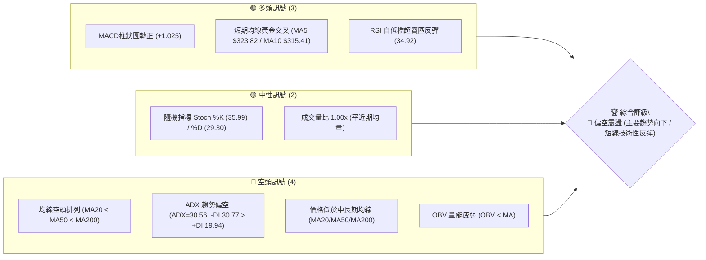
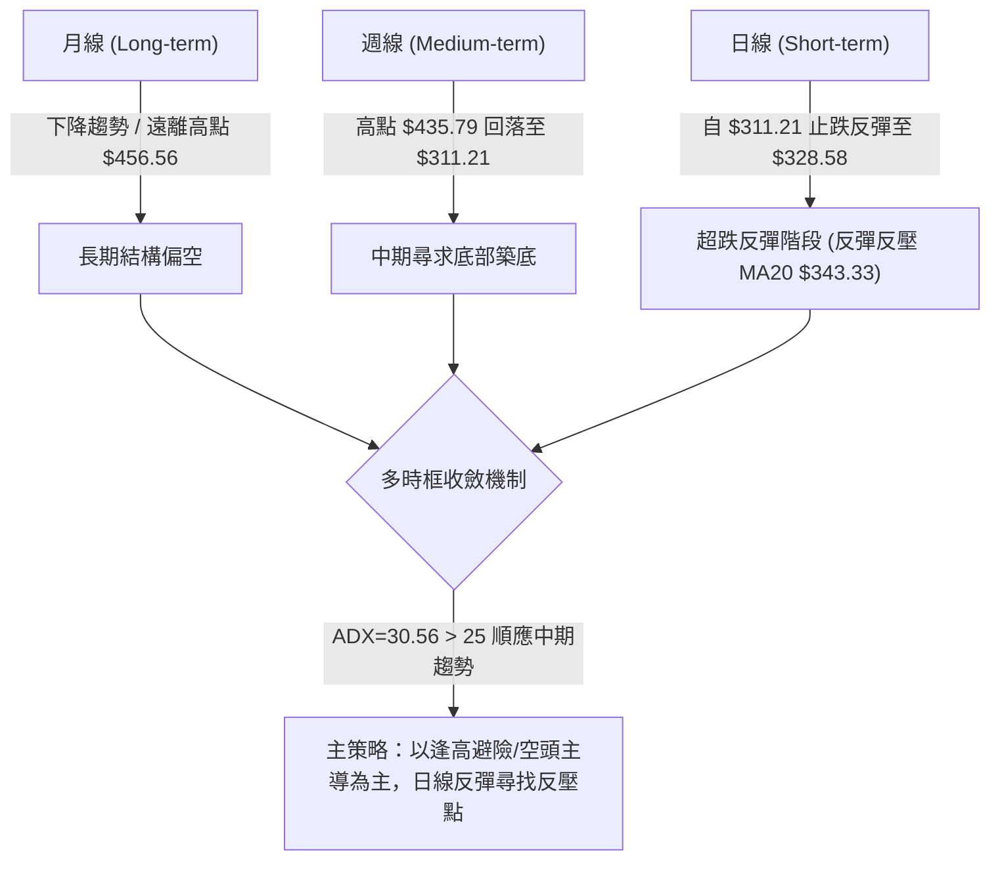
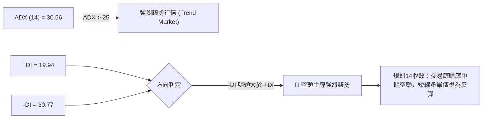
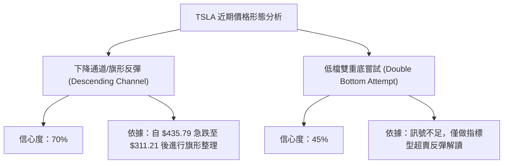
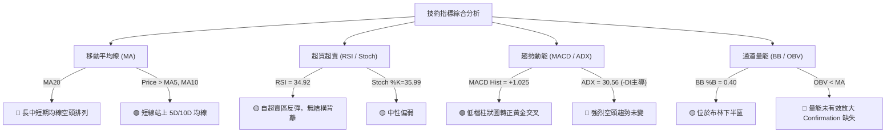
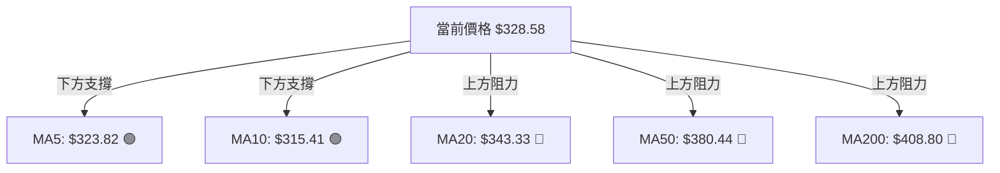
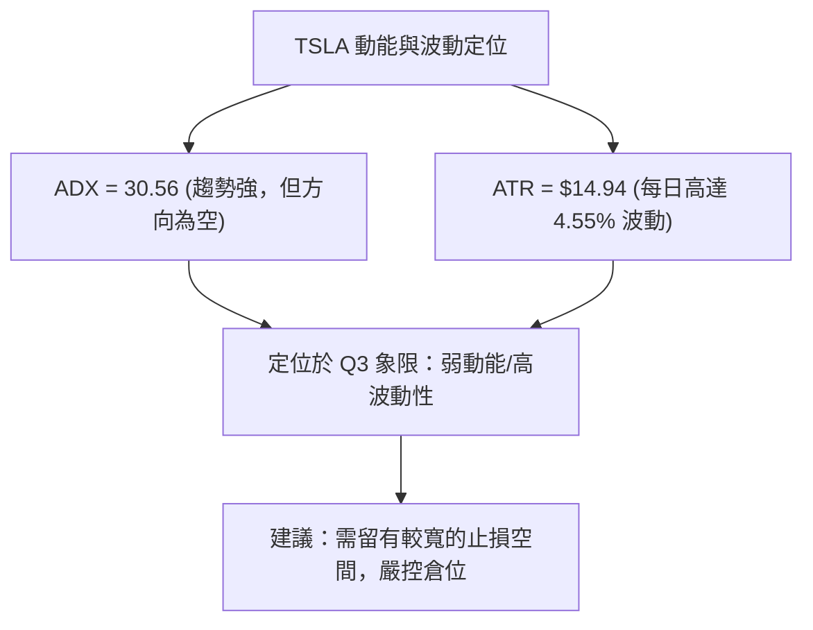
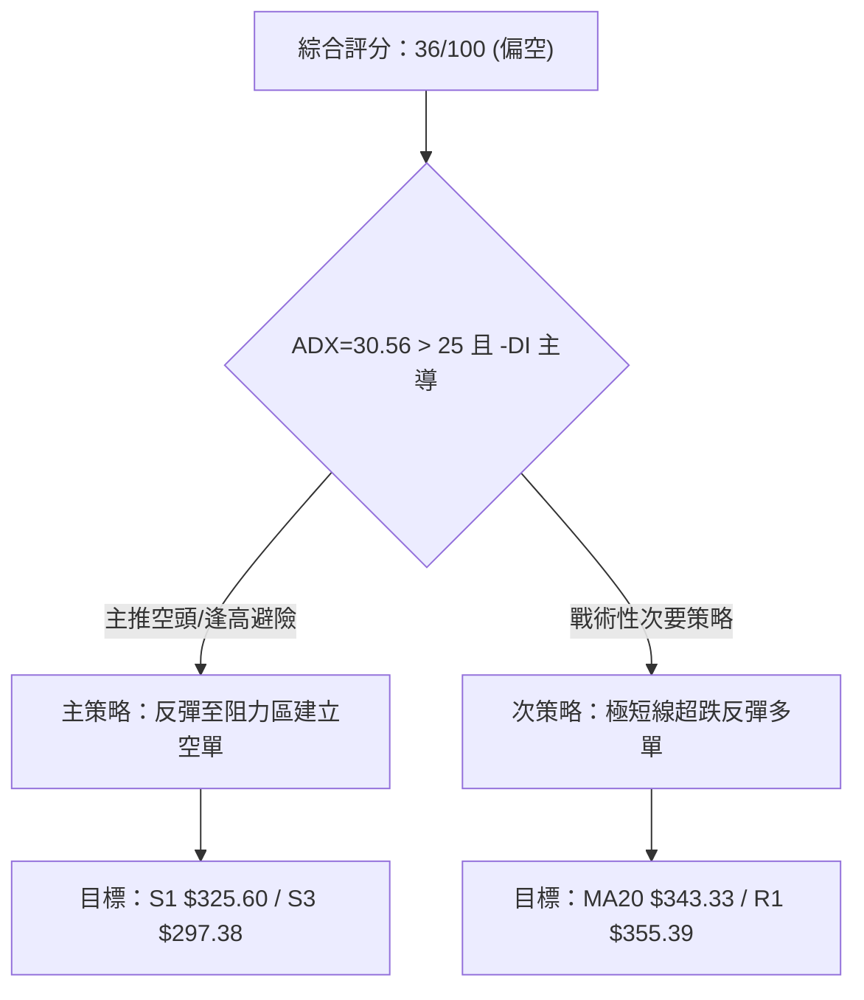
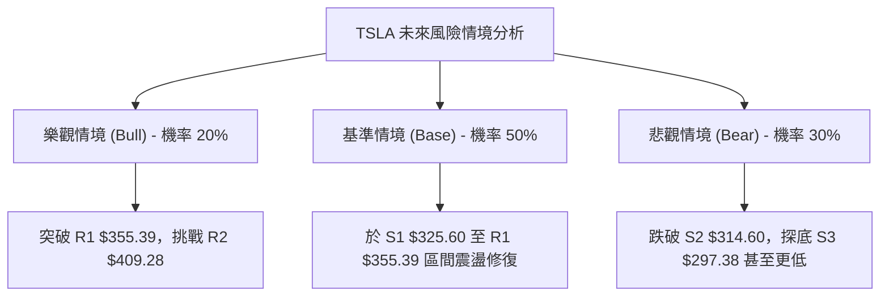

# TSLA 技術分析報告

> **報告日期**：2026-08-09 ｜ **語言**：繁體中文 ｜ **數據來源**：Yahoo Finance ｜ **當前價格**：$328.58

---

## 目錄

| 章節 | 內容 |
|------|------|
| [1. 技術面概覽](#1-技術面概覽) | 訊號儀表板、核心指標、評分卡 |
| [2. 趨勢分析](#2-趨勢分析) | 多時框趨勢、長中短期走勢 |
| [3. 圖表形態分析](#3-圖表形態分析) | 形態識別、K線組合、目標價 |
| [4. 支撐與阻力](#4-支撐與阻力) | 關鍵價位、斐波那契回調 |
| [5. 技術指標深度解讀](#5-技術指標深度解讀) | MA/RSI/MACD/布林/成交量 |
| [6. 動能與波動率](#6-動能與波動率) | 動能評估、ATR、Beta |
| [7. 多時框架總結](#7-多時框架總結) | 時框架評分矩陣 |
| [8. 交易策略建議](#8-交易策略建議) | 多空策略、風險報酬比 |
| [9. 風險提示與監控](#9-風險提示與監控) | 監控指標、風險場景 |

---

## 1. 技術面概覽

### 🎯 技術訊號儀表板



### 📊 核心指標速覽表

| 指標類別 | 指標名稱 | 當前數值 | 訊號 | 解讀 |
|----------|----------|----------|------|------|
| **價格** | 當前價格 | $328.58 | 🟡 | 位於52週區間 $297.38–$498.83 的 15.5% 低檔位置 |
| **均線** | MA5 / MA10 | $323.82 / $315.41 | 🟢 | 價格站上極短期均線，呈現短線止跌反彈 |
| **均線** | MA20 (月線) | $343.33 | 🔴 | 價格位於 MA20 下方 (-4.30%)，短線反壓明顯 |
| **均線** | MA50 (季線) | $380.44 | 🔴 | 價格位於 MA50 下方 (-13.63%)，中期下降趨勢未改 |
| **均線** | MA200 (年線)| $408.80 | 🔴 | 價格位於 MA200 下方 (-19.62%)，長期走勢偏空 |
| **動能** | RSI(14) | 34.92 | 🟡 | 自超賣邊緣回升，動能改善但仍處弱勢區 |
| **動能** | MACD | -19.758 / -20.783 | 🟢 | 柱狀圖 +1.025 轉正，發出低檔黃金交叉買入訊號 |
| **趨勢** | ADX(14) | 30.56 (-DI 30.77) | 🔴 | ADX > 25 且 -DI 主導，代表強烈空頭趨勢中 |
| **波動** | ATR(14) | $14.94 (4.55%) | 🟡 | 每日波動絕對值較高，反映極度震盪特性 |
| **通道** | 布林通道 %B| 0.40 | 🟡 | 位於布林通道下半區，向中軌 $343.33 靠攏 |

### 🏆 技術評分卡

```
╔══════════════════════════════════════════════════════════════════╗
║                技術評分卡 — TSLA (2026-08-09)                    ║
╠══════════════════════════════════════════════════════════════════╣
║ 趨勢強度 (ADX)     ██████████████░░░░░░  70/100  🔴 強烈空動態   ║
║ 動能指標 (RSI/MACD) ████████░░░░░░░░░░░░  40/100  🟡 短線轉強中   ║
║ 支撐穩定度 (S1-S3)  ██████████░░░░░░░░░░  50/100  🟡 低檔尋求支撐 ║
║ 成交量配合 (OBV)   ██████░░░░░░░░░░░░░░  30/100  🔴 量能不足     ║
║ 形態完整度         ████████░░░░░░░░░░░░  40/100  🟡 底部位定型   ║
║ 均線排列           ████░░░░░░░░░░░░░░░░  20/100  🔴 空頭排列     ║
╠══════════════════════════════════════════════════════════════════╣
║ 綜合技術評分       ███████░░░░░░░░░░░░░  36/100  🔴 偏空震盪     ║
╚══════════════════════════════════════════════════════════════════╝
```

---

## 2. 趨勢分析

### 🌐 多時框趨勢分析



### 📈 長期趨勢 — 12個月走勢圖（Unicode）

```
TSLA 過去 12 個月價格走勢圖 ($)
$480 ┤
$450 ┤                               ● $456.56 (2025-10)
$420 ┤                         ●           ● $430.17     ● $435.79 (2026-05)
$390 ┤                                                    ● 
$360 ┤               ● $346.46
$330 ┤         ● $333.87                                          ● $328.58 (現在)
$300 ┤   ● $308.27                                                  ● $311.21
     └─────────────────────────────────────────────────────────────────────────►
       2025-07 2025-08 2025-09 2025-10 2025-11 2025-12 2026-01 2026-05 2026-07 2026-08
```

#### 走勢特徵分析表

| 階段 | 時間區間 | 價格區間 | 漲跌幅 | 走勢特徵與量能變化 |
|------|----------|----------|--------|--------------------|
| 1. 主升段 | 2025-07 ~ 2025-10 | $308.27 ➔ $456.56 | +48.10% | 強烈多頭推升，攻頂至近二年高點聚類 |
| 2. 高檔震盪 | 2025-11 ~ 2026-01 | $456.56 ➔ $430.41 | -5.73% | 400 元大關上方高檔換手，動能漸趨平緩 |
| 3. 二次頂部 | 2026-02 ~ 2026-05 | $371.75 ➔ $435.79 | +17.23%| 形成雙頂/次高點結構 ($435.79)，量能開始遞減 |
| 4. 急速修正 | 2026-06 ~ 2026-07 | $435.79 ➔ $311.21 | -28.59%| 突破下軌爆量下挫，跌破 MA200，RSI 破 20 |
| 5. 短線止跌 | 2026-08 至今 | $311.21 ➔ $328.58 | +5.58% | 於 52 週低點 $297.38 前獲支撐，展開技術性修正 |

### 📊 中期趨勢（週線分析）

```
TSLA 週線壓力/支撐架構示意圖
 Upper Resistance R2: $409.28 ════════════════════════════════════════ (波段高點/MA200聚類)
                              │
 Resistance R1: $355.39      ──────────────────────────────────── (波段高點/短線反壓)
                              │
 Current Price: $328.58       ▲ [目前價格位置]
                              │
 Support S1: $325.60          ──────────────────────────────────── (近一年波段低點聚類)
                              │
 Lower Support S3: $297.38   ════════════════════════════════════════ (52週最低點)
```

近期 20 週數據顯示，TSLA 在 2026-05-31 觸及 $435.79 週收盤高點後，隨即展開連跌，並於 2026-07-26 當週重挫至 $313.03（週 RSI 驟降至 15.7 超賣極限）。經過連續兩週於 $311–$313 區域築底後，最近一週（2026-08-09）收盤回升至 $328.58，週 MACD 柱狀圖也由 -6.930 縮小改善至 +1.025，顯示中期賣壓暫告一段落。

### ⚡ 趨勢強度評估（ADX 解讀）



#### ADX 趨勢強度對照

| 指標 | 數值 | 門檻基準 | 趨勢解讀 |
|------|------|----------|----------|
| **ADX** | 30.56 | > 25.0 | 強趨勢狀態，表示目前市場非無方向之盤整，而是有明確主導方向 |
| **+DI** | 19.94 | < 20.0 | 多頭力道極度匱乏 |
| **-DI** | 30.77 | > 30.0 | 空頭掌控主導權，空方力道強勁 |
| **判定** | **空頭趨勢行情** | -DI > +DI | **任何反彈均面臨強烈空頭趨勢壓制，暫不宜視為反轉** |

---

## 3. 圖表形態分析

### 🔍 形態識別系統



#### 形態信心度與目標價評估表

| 形態名稱 | 信心度 | 判斷依據（引用數據） | 完成度 | 目標價計算式與精確數值 |
|----------|--------|----------------------|--------|------------------------|
| **下降通道反彈** | **70%** | 高點 $435.79 至低點 $311.21 下挫後，於 $311–$328 窄幅築底 | 60% | 由通道下軌反彈推算目標價 R1: **$355.39** |
| **雙重底嘗試** | **45%** | 兩次低點落於 2026-07-26 ($313.03) 與 2026-08-02 ($311.21) | 35% | 訊號不足，若突破頸線 R1 $355.39，形態高度 = $355.39 - $311.21 = $44.18；推算目標價 = $355.39 + $44.18 = **$399.57**（靠近 50% 斐波位 $398.10） |

### 🕯️ 重要 K 線形態分析

| 日期/週別 | 收盤價 | K 線形態名稱 | 技術解讀 | 多空訊號 |
|-----------|--------|--------------|----------|----------|
| 2026-05-31 | $435.79 | 頂部烏雲罩頂 | 高檔爆量反轉，確立波段頂部 | 🔴 空頭反轉 |
| 2026-07-26 | $313.03 | 長黑跳空突破 | 跌破所有短期均線與支撐，進入極度超賣 | 🔴 空頭宣洩 |
| 2026-08-02 | $311.21 | 下影十字星 (Doji) | 於 S2 $314.60 附近探底回升，賣壓出現枯竭跡象 | 🟡 止跌訊號 |
| 2026-08-09 | $328.58 | 中陽線吞噬 | 吞噬前一週實體，確認短線超跌反彈展開 | 🟢 多頭反彈 |

### 📉 ASCII 走勢形態示意圖

```
TSLA 下降通道與短線反彈示意圖
$440 ┼──┐ (高點 $435.79)
$400 ┼  └──┐
$360 ┼     └──┐           ┌── R1: $355.39 (通道上軌 / 頸線目標)
$320 ┼        └───●───────┼── 現價: $328.58 (反彈進行中)
$280 ┼            ●──●───┘── S3: $297.38 (52週低點防線)
     └───────────────────────────────────►
```

### 🎯 形態目標價計算

1. **短線反彈目標價（R1）**：
   - **計算依據**：近一年波段高點聚類與下降通道上軌阻力區。
   - **精確目標價**：**$355.39**（較現價 +8.16%）。
2. **中期反轉形態目標價（若突破頸線 R1）**：
   - **計算依據**：W 底低點 $311.21 至頸線 $355.39 之形態垂直高度（$44.18）。
   - **計算公式**：$355.39 + $44.18 = $399.57。
   - **對應數據庫精確阻力**：**$398.10**（50.0% 斐波那契回調位）與 **$409.28**（R2 阻力位）。

---

## 4. 支撐與阻力

### 🗺️ 關鍵價位分布圖（Unicode）

```
TSLA 關鍵價位結構分布圖
══════════════════════════════════════════════════════════════
$498.83 ║████████████████████████████████████████║ 52W High (0.0%)
$451.29 ║████████████████████████████            ║ Fib 23.6%
$418.36 ║████████████████████████                ║ 強阻力 R3
$409.28 ║██████████████████████                  ║ 阻力 R2 / MA200 ($408.80)
$398.10 ║████████████████████                    ║ Fib 50.0%
$374.33 ║██████████████                          ║ Fib 61.8% / MA50 ($380.44)
$355.39 ║██████████                              ║ 關鍵阻力 R1 / MA20 ($343.33)
$340.49 ║██████                                  ║ Fib 78.6%
$328.58 ╠════════════════════════════════════════╣ ◄ 當前價格
$325.60 ║▓▓▓▓▓▓▓▓▓▓                              ║ 近期支撐 S1 / MA5 ($323.82)
$314.60 ║████████████                            ║ 強支撐 S2 / MA10 ($315.41)
$297.38 ║████████████████████████████████████████║ 終極支撐 S3 / 52W Low (100.0%)
══════════════════════════════════════════════════════════════
```

### 🚧 阻力位分析表

| 阻力級別 | 價位 | 數據來源 / 形成原因 | 突破難度 | 技術重要性 |
|----------|------|----------------------|----------|------------|
| **R1** | **$355.39** | 近一年波段高點聚類 / 靠近 MA20 ($343.33) | 🟡 中等 | 短線多空分水嶺，突破方能擺脫極度弱勢 |
| **R2** | **$409.28** | 近一年波段高點聚類 / 貼合 MA200 ($408.80) | 🔴 極高 | 中長期牛熊分界線，強烈密集成交套牢區 |
| **R3** | **$418.36** | 近一年波段高點聚類 / 接近 Fib 38.2% ($421.88) | 🔴 極高 | 長期多頭重振防線 |

### 🛡️ 支撐位分析表

| 支撐級別 | 價位 | 數據來源 / 形成原因 | 守住機率 | 技術重要性 |
|----------|------|----------------------|----------|------------|
| **S1** | **$325.60** | 近一年波段低點聚類 / 貼近 MA5 ($323.82) | 🟢 較高 | 短線反彈依托線，跌破則反彈夭折 |
| **S2** | **$314.60** | 近一年波段低點聚類 / 貼近 MA10 ($315.41) | 🟡 中等 | 近期反彈發動點，破則再探 52 週低點 |
| **S3** | **$297.38** | 近一年波段最低點 (52W Low) | 🟢 較高 | 終極防禦線，跌破將開啟全新下行空間 |

### 📐 斐波那契回調位分析

根據 52 週高低點（$498.83 ➔ $297.38）計算之斐波那契回調層級：

- **0.0% (52W High)**: $498.83
- **23.6%**: $451.29
- **38.2%**: $421.88
- **50.0%**: $398.10
- **61.8%**: $374.33
- **78.6%**: $340.49
- **100.0% (52W Low)**: $297.38

#### 位置與解讀
當前價格 **$328.58** 落在 **78.6% ($340.49)** 與 **100.0% ($297.38)** 之間。這代表股票經歷了極深度的回調（抹去過去一年近 80% 的漲幅）。目前股價正向上方第一道斐波阻力 **78.6% ($340.49)** 推進，若能順利站上，將進一步考驗 61.8% ($374.33) 關卡。

---

## 5. 技術指標深度解讀

### 🎛️ 指標訊號總覽



### 📈 移動平均線排列分析



#### 均線狀態與扣抵分析

- **短期均線 (MA5/MA10)**：MA5 ($323.82) 與 MA10 ($315.41) 已向上彎頭，價格升至其上方，形成短線扣抵低價的助漲格局。
- **中長期均線 (MA20/MA50/MA200)**：MA20 ($343.33) < MA50 ($380.44) < MA200 ($408.80)，形成標準且完整的**空頭排列 (Bearish Alignment)**。價格與 MA200 負乖離率達 -19.62%，顯示中長線趨勢極度疲弱，反彈至 MA20 或 MA50 將面臨巨大解套賣壓。

### 📉 RSI(14) 分析

- **當前 RSI 數值**：**34.92**
- **進度條**：`███▌░░░░░░ 34.92/100`

```
RSI(14) 狀態區間
[0] ─── 極度超賣 ─── [30] ──────── 中性區 ──────── [70] ─── 超買 ─── [100]
                      ▲ (34.92)
```

#### 背離與超買超賣判斷
- **超買超賣**：RSI 在 2026-07-26 觸及 15.7 的極度超賣區後，目前回升至 34.92，擺脫超賣，代表短線殺聲喊停，多頭正在進行指標修復。
- **背離分析**：目前 RSI 與價格走勢呈現同步止跌，**無明顯結構性頂背離或底背離**。這代表此波反彈屬於指標超賣後的「技術性修復」，而非長線趨勢的反轉背離訊號。

### 📊 MACD(12/26/9) 訊號解讀

- **MACD 線**：-19.758
- **Signal 線**：-20.783
- **MACD 柱狀圖**：**+1.025** 🟢


MACD 於零軸下方深處（-20 附近）交出黃金交叉，柱狀圖翻紅（+1.025），確認短線下行動能受阻，反彈波段開始運作。然而，由於雙線均遠在零軸下方，此訊號屬「空頭市場中的反彈」，不宜過度追高。

### 📦 布林通道分析

```
TSLA 布林通道示意圖 (Bollinger Bands)
$415.55 ┼────────────────────────────────────────────── 布林上軌 (Upper)
        │
$343.33 ┼ - - - - - - - - - - - - - - - - - - - - - - - 布林中軌 (MA20)
        │                       ● $328.58 (當前價格, %B = 0.40)
$271.11 ┼────────────────────────────────────────────── 布林下軌 (Lower)
```

- **布林上軌**：$415.55
- **布林中軌 (MA20)**：$343.33
- **布林下軌**：$271.11
- **通道位置 (%B)**：0.40（靠近中軌，擺脫下軌進攻）
- **通道狀態**：之前觸及下軌後反彈，目前空間指向中軌 **$343.33**。若未能有效突破中軌，價格將重回下軌尋求支撐。

### 💹 成交量分析（量價配合度）

- **最新成交量**：39,370,100
- **20 日均量**：39,385,860（量比：**1.00x**）
- **50 日均量**：43,588,884
- **OBV 趨勢**：OBV < MA

目前反彈成交量為 39.37M，與 20 日均量（39.38M）持平，呈現「平量反彈」格局。OBV 低於其均線，顯示法人機構的主動性買盤尚未大規模進駐，目前的價格回升多由空頭平倉與短線抄底散戶推動，量能配合度僅屬中等（🟡）。

---

## 6. 動能與波動率

### ⚡ 動能評估四象限

| 象限 | 動能強度 | 波動率 | 當前狀態 | 技術評估 |
|------|----------|--------|----------|----------|
| **Q1** | 強動能 ( High ) | 低波動 ( Low ) | — | 最佳趨勢攻堅區 |
| **Q2** | 強動能 ( High ) | 高波動 ( High ) | — | 劇烈震盪擴張區 |
| **Q3** | 弱動能 ( Low ) | 高波動 ( High ) | **✓ TSLA 所在區** | **高風險超跌反彈區（ATR $14.94, -DI 主導）** |
| **Q4** | 弱動能 ( Low ) | 低波動 ( Low ) | — | 沉悶打底沉澱區 |



### 📊 ATR 波動率分析

- **ATR(14)**：**$14.94**（佔當前股價 **4.55%**）
- **風險意涵**：TSLA 日均波動接近 $15 美元，屬於極高波動標的。
- **交易風控設定建議**：
  - **短線止損距離**：至少設定 1.0 × ATR = **$15.00**
  - **波段止損距離**：設定 1.5 ~ 2.0 × ATR = **$22.41 ~ $29.88**

### 📐 Beta 與市場相關性

- **Beta 係數**：**1.827**
- **市場相關性**：Beta 大幅高於 1.0，代表 TSLA 的波動幅度約為美股大盤（S&P 500）的 1.83 倍。在大盤拉回時，TSLA 往往面臨雙倍跌幅；若大盤反彈，TSLA 的彈幅亦相當高。

---

## 7. 多時框架總結

### 📋 時框架評分表

| 時框架 | 趨勢方向 | 動能狀態 | 均線排列 | 形態結構 | 綜合評分 | 交易建議 |
|--------|----------|----------|----------|----------|----------|----------|
| **月線 (Long)** | 🔴 下降 | 🔴 弱勢 | 🔴 偏空 | 高檔回落 | **30/100** | 長線減碼避險 |
| **週線 (Mid)** | 🔴 下降 | 🟡 止跌 | 🔴 空頭 | 超跌修復 | **38/100** | 逢高尋求避險點 |
| **日線 (Short)** | 🟢 反彈 | 🟢 偏多 | 🟡 極短交錯 | 低檔彈升 | **55/100** | 短線戰術性參與 |
| **總收斂** | 🔴 偏空 | 🟡 中性 | 🔴 空頭 | 區間反彈 | **36/100** | **逢高做空 / 保守觀望** |

### 🔲 綜合訊號矩陣

```
TSLA 多時框訊號一致性矩陣
════════════════════════════════════════════════════════════════════
維度          短期 (日線)          中期 (週線)          長期 (月線)
────────────────────────────────────────────────────────────────────
趨勢方向      🟢 超跌反彈          🔴 下降趨勢          🔴 頂部回落
均線系統      🟢 突破 MA5/10       🔴 MA20/50/200 壓制  🔴 低於 MA200
動能指標      🟢 MACD 柱狀圖轉正   🟡 RSI 脫離超賣      🔴 ADX 強偏空
成交量配合    🟡 1.00x 平量        🔴 OBV < MA          🔴 賣壓擴張
════════════════════════════════════════════════════════════════════
時框收斂      🟢 短線反彈          🔴 中長線空頭主導 (ADX=30.56 > 25)
════════════════════════════════════════════════════════════════════
```

### ⚖️ 多時框收斂結論

依據多時框收斂規則（規則 14）：
1. **行情性質判定**：當前 ADX(14) = 30.56 > 25，屬於**明確的趨勢行情**而非純粹盤整。
2. **主導時框**：因屬趨勢行情，必須以中長期（週線與 MA50 $380.44、MA200 $408.80）方向為主導。
3. **最終方向性結論**：**整體趨勢偏空（評分 36/100）**。日線層級之向上走勢僅能判定為「順應大空頭趨勢下的短線技術性超跌反彈」。交易策略應以「逢高避險/建立防守性空單」為核心，日線反彈僅做為尋找高檔反壓進場之時機。

---

## 8. 交易策略建議

### 🗺️ 策略決策流程圖



### 🧭 策略路由

**當前主策略方向 = 🔴 偏空逢高避險 / 順勢高拋空頭策略（綜合評分：36/100）**

由於技術評分卡綜合評分為 **36/100（≤40）**，且 ADX(14) 達 30.56 呈現強烈空頭主導，本報告以 **策略 A（逢高佈局空單/避險策略）** 為主要推薦策略；策略 B（短線搶反彈）僅列為高風險戰術性操作。

### 🎯 價格情境階梯 (Price Scenarios)

| 觸發條件 | 下一目標價 | 後續延伸目標 | 情境技術含義 |
|----------|------------|--------------|--------------|
| **突破 R1 $355.39** | R2 $409.28 | R3 $418.36 | 短線轉強，向 MA200 強阻力挑戰 |
| **站穩現價區間 ($328.58)** | MA20 $343.33 | R1 $355.39 | 超跌修復，向布林中軌靠攏 |
| **跌破 S1 $325.60** | S2 $314.60 | S3 $297.38 | 反彈夭折，重新測試 52 週最低點 |

### 📊 情境機率分佈

```
情境機率分佈預估
 Base Case (區間反彈受壓)  ████████████████████████████████  50%
 Bear Case (順勢破底再探)  ██████████████████               30%
 Bull Case (強勢V型反轉)   ██████████                       20%
```

| 情境 | 機率 | 主要依據 |
|------|------|----------|
| **Base Case (區間反彈受壓)** | **50%** | MACD 柱狀圖轉正，但受制於 MA20 $343.33 與 R1 $355.39 強壓 |
| **Bear Case (順勢破底再探)** | **30%** | ADX=30.56 強烈空頭，OBV 未量能放量，均線全面空頭排列 |
| **Bull Case (強勢V型反轉)** | **20%** | RSI 自超賣區急升，分析師平均目標價 $396.62 帶來心理支撐 |

### 🟢 策略詳情

#### 策略 A：主推策略 — 阻力區逢高佈局空單（順勢策略）

| 策略要素 | 策略 A 詳細設定（精確數據） |
|----------|────────────────────────────|
| **進場條件** | 股價反彈至 MA20 ($343.33) 至 R1 ($355.39) 阻力區間且出現上影線滯漲 |
| **進場價格** | **$350.00**（位於 MA20 與 R1 之間） |
| **目標價 T1** | **$325.60** (S1 支撐位) |
| **目標價 T2** | **$297.38** (S3 / 52 週最低點) |
| **止損價格** | **$365.00**（突破 R1 $355.39 向上加預留 0.6×ATR 風險空間） |
| **風險報酬比** | **1 : 3.51**（潛在獲利 $52.62 / 潛在風險 $15.00） |
| **成功機率** | **65%** |
| **建議倉位** | **15% - 20%** |

#### 策略 B：次要策略 — 短線戰術性搶反彈多單（逆勢戰術）

| 策略要素 | 策略 B 詳細設定（精確數據） |
|----------|────────────────────────────|
| **進場條件** | 當前價格拉回守住 S1 ($325.60) 且 MA5 ($323.82) 未被跌破 |
| **進場價格** | **$328.58**（當前價格） |
| **目標價 T1** | **$343.33** (MA20 / 布林中軌) |
| **目標價 T2** | **$355.39** (R1 關鍵阻力位) |
| **止損價格** | **$314.60** (S2 強支撐位跌破止損) |
| **風險報酬比** | **1 : 1.92**（潛在獲利 $26.81 / 潛在風險 $13.98） |
| **成功機率** | **40%** |
| **建議倉位** | **5% - 10% (嚴格輕倉)** |

### 🔴 反向風險觸發點（對沖提示）

- **空頭策略失效觸發點**：若 TSLA 強勢放量收復 **R1 ($355.39)**，代表短線 W 底形態成立，目標將直指 Fib 50% ($398.10)，此時空單必須立即無條件止損出場。
- **多頭策略失效觸發點**：若價格跌破 **S1 ($325.60)**，代表短線止跌反彈結束，應立即平倉多單對沖風險。

### ⭐ 整體訊號強度評星

```
做多訊號強度：★★☆☆☆  (2/5星 — 僅屬超跌技術性修正)
做空訊號強度：★★██☆  (3.5/5星 — 順應長中期的強烈空頭趨勢)
整體可信度：  ★★★☆☆  (3/5星 — 高波動下需嚴格遵守止損紀律)
```

---

## 9. 風險提示與監控

### ✅ 關鍵監控指標 Checklist

```
╔══════════════════════════════════════════════════════════════════╗
║                    每日技術面風控監控清單                         ║
╠══════════════════════════════════════════════════════════════════╣
║ [ ] 價格是否跌破 S1 $325.60？ (若跌破，反彈結束訊號)             ║
║ [ ] 價格是否觸及 MA20 $343.33 / R1 $355.39？ (主要空頭阻力測試區)  ║
║ [ ] 成交量是否突破 50日均量 43,588,884？ (確認買盤進場強度)       ║
║ [ ] MACD 柱狀圖 (+1.025) 是否持續擴大？ (檢視反彈動能是否延續)    ║
║ [ ] ADX (30.56) 是否降至 25 以下？ (判斷空頭趨勢是否轉為盤整)     ║
╚══════════════════════════════════════════════════════════════════╝
```

### ⚠️ 風險場景分析



### 🛡️ 風險管理重要提醒

1. **波動率風險**：ATR 達到 **$14.94**（4.55%），單日上下洗盤劇烈，建議單筆交易承擔風險不超過總資金的 1.5%。
2. **財報與基本面風險**：目前 P/E (Trailing) 為 304.24，Gross Margin 為 18.9%，基本面估值較高，技術面一旦失守 S3 $297.38，下行估值修正空間巨大。
3. **槓桿控制**：Beta 高達 1.827，請勿在大盤高波動期間使用過高槓桿。

---

## 📋 報告總結

```
╔══════════════════════════════════════════════════════════════════╗
║                  TSLA 技術分析報告總結                           ║
╠══════════════════════════════════════════════════════════════════╣
║ 報告日期：2026-08-09                                             ║
║ 當前價格：$328.58                                                ║
║ 綜合技術評分：36 / 100                                           ║
║ 分析評級：🔴 偏空震盪 (Bearish Trend with Short-term Rebound)     ║
║                                                                  ║
║ 關鍵技術價位：                                                   ║
║ ├─ 長期趨勢：🔴 偏空 (MA20 < MA50 < MA200 空頭排列)              ║
║ ├─ 短期趨勢：🟢 止跌反彈 (站上 MA5 $323.82 / MA10 $315.41)       ║
║ ├─ 關鍵支撐：S1 $325.60 ｜ S2 $314.60 ｜ S3 $297.38 (52W Low)    ║
║ ├─ 關鍵阻力：R1 $355.39 ｜ R2 $409.28 ｜ R3 $418.36              ║
║ └─ 分析師平均目標價：$396.62                                     ║
║                                                                  ║
║ 最優交易策略矩陣：                                               ║
║ 1. 🥇 主推策略：逢高逢壓做空（於 $350.00 建立空單，目標 $297.38）║
║ 2. 🥈 次要策略：戰術性極短多（於 $328.58 進場，目標 $343.33）    ║
║ 3. 🥉 保守選擇：觀望等待股價測試 R1 $355.39 或 S3 $297.38 門檻    ║
╚══════════════════════════════════════════════════════════════════╝
```

---

> ⚠️ **免責聲明**：本報告為 AI 自動生成之技術分析，所有數據及估算均基於提供的歷史價格資訊。本報告**僅供研究與學術參考**，**不構成任何投資建議**。投資有風險，入市需謹慎。

---

*報告生成時間：2026-08-09 ｜ 數據來源：Yahoo Finance ｜ 分析框架：多時框技術分析*