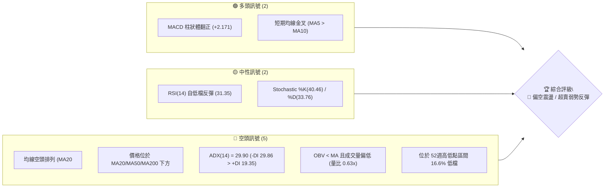
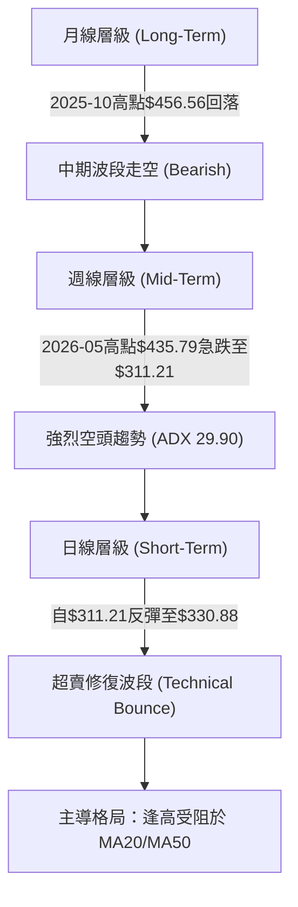
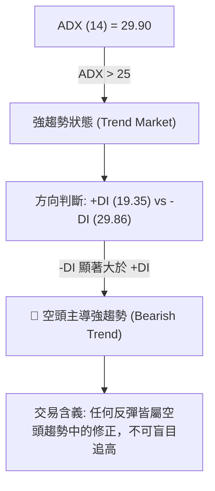
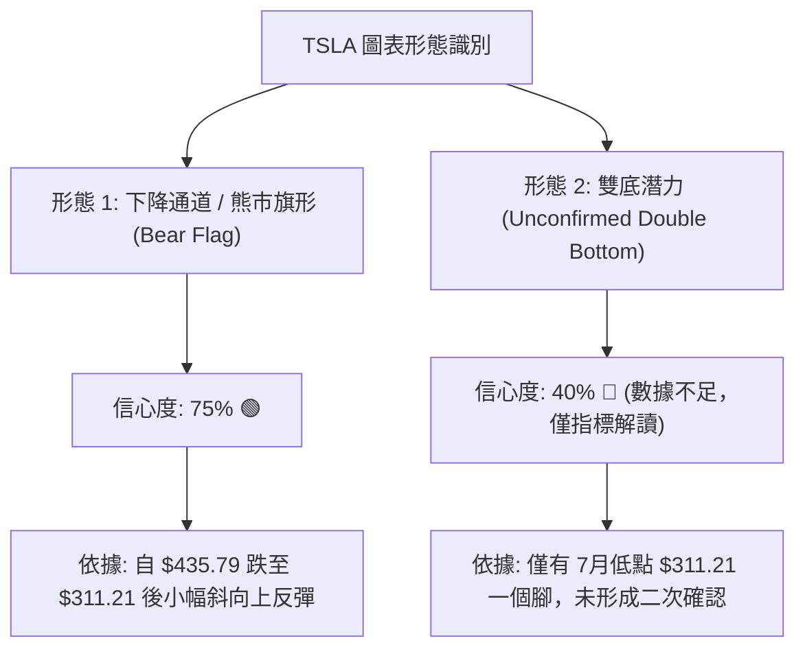
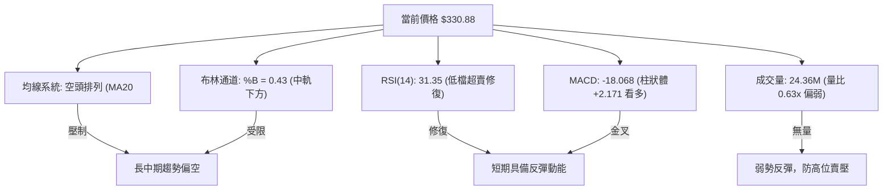
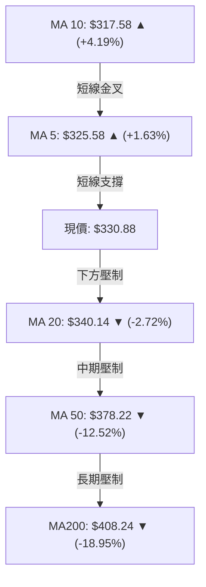
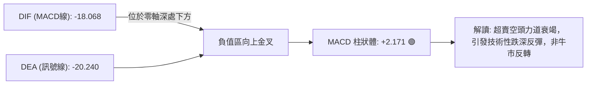
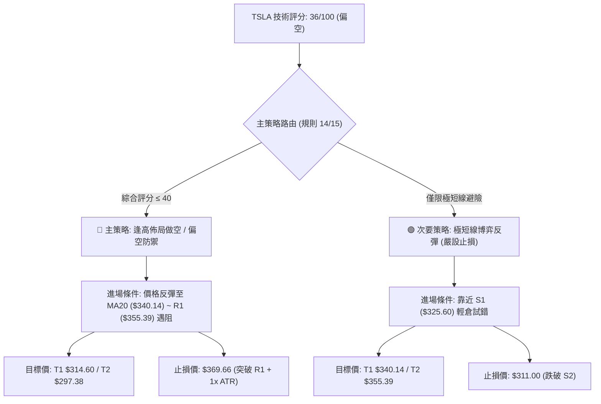
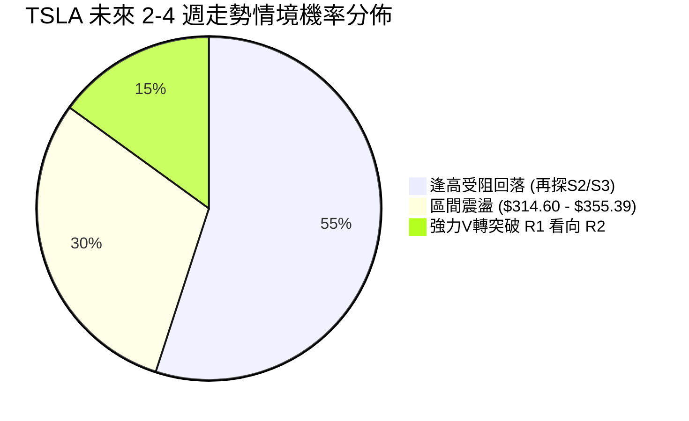
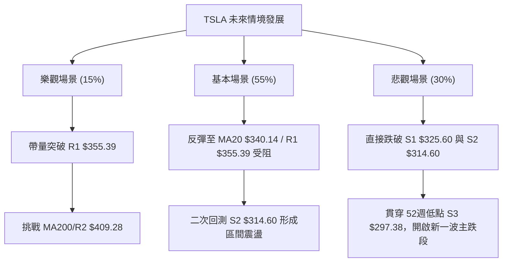

# TSLA 技術分析報告

> **報告日期**：2026-08-10 ｜ **語言**：繁體中文 ｜ **數據來源**：Yahoo Finance ｜ **當前價格**：$330.88

---

## 目錄

| 章節 | 內容 |
|------|------|
| [1. 技術面概覽](#1-技術面概覽) | 訊號儀表板、核心指標、評分卡 |
| [2. 趨勢分析](#2-趨勢分析) | 多時框趨勢、長中短期走勢 |
| [3. 圖表形態分析](#3-圖表形態分析) | 形態識別、K線組合、目標價 |
| [4. 支撐與阻力](#4-支撐與阻力) | 關鍵價位、斐波那契回調 |
| [5. 技術指標深度解讀](#5-技術指標深度解讀) | MA/RSI/MACD/布林/成交量 |
| [6. 動能與波動率](#6-動能與波動率) | 動能評估、ATR、Beta |
| [7. 多時框架總結](#7-多時框架總結) | 時框架評分矩陣 |
| [8. 交易策略建議](#8-交易策略建議) | 多空策略、風險報酬比 |
| [9. 風險提示與監控](#9-風險提示與監控) | 監控指標、風險場景 |

---

## 1. 技術面概覽

### 🎯 技術訊號儀表板



---

### 📊 核心指標速覽表

| 指標類別 | 指標名稱 | 當前數值 | 訊號 | 解讀 |
|----------|----------|----------|------|------|
| **價格** | 當前價格 | $330.88 | 🔴 | 位於 52週區間 16.6% 極低檔區域 |
| **均線** | MA20 (月線) | $340.14 | 🔴 | 股價位於 MA20 下方 -2.72%，為短線第一阻力 |
| **均線** | MA50 (季線) | $378.22 | 🔴 | 股價位於 MA50 下方 -12.52%，中期承壓 |
| **均線** | MA200 (年線) | $408.24 | 🔴 | 股價位於 MA200 下方 -18.95%，長期走空 |
| **動能** | RSI(14) | 31.35 | 🟡 | 從極度超賣區 (15.7-18.1) 反彈，處於邊緣超賣區 |
| **動能** | MACD(12,26,9) | -18.068 / -20.240 | 🟢 | 柱狀圖 +2.171，零軸下方出現技術性金叉 |
| **趨勢** | ADX(14) | 29.90 | 🔴 | 屬強趨勢 (>25)，且 -DI(29.86) > +DI(19.35)，空頭主導 |
| **通道** | 布林通道 %B | 0.43 | 🟡 | 位於下軌 ($271.96) 與中軌 ($340.14) 之間，近中軌 |
| **量能** | 當前成交量 | 24.36M | 🔴 | 為 20日均量 (38.96M) 之 0.63倍，反彈缺乏動能量 |
| **波動** | ATR(14) | $14.33 | 🟡 | 日波動率 4.33%，屬中高波動率性質 |

---

### 🏆 技術評分卡

```
╔══════════════════════════════════════════════════════════════════╗
║                   技術評分卡 — TSLA (2026-08-10)                 ║
╠══════════════════════════════════════════════════════════════════╣
║ 趨勢強度      ██████████████░░░░░░  35/100  🔴 空頭強趨勢主導    ║
║ 動能指標      █████████░░░░░░░░░░░  42/100  🟡 零軸下修復反彈    ║
║ 支撐穩定度    ████████████░░░░░░░░  50/100  🟡 S1/S2 暫時築底   ║
║ 成交量配合    ███████░░░░░░░░░░░░░  32/100  🔴 量能退潮無主控量  ║
║ 形態完整度    █████████░░░░░░░░░░░  38/100  🔴 下降通道反彈段    ║
║ 均線排列      ████░░░░░░░░░░░░░░░░  20/100  🔴 完全空頭排列      ║
╠══════════════════════════════════════════════════════════════════╣
║ 綜合評分      ███████▓░░░░░░░░░░░░  36/100  🔴 偏空震盪 (超賣反彈)║
╚══════════════════════════════════════════════════════════════════╝
```

---

## 2. 趨勢分析

### 🌐 多時框趨勢分析



---

### 📈 長期趨勢 — 12個月走勢圖（Unicode）

```
TSLA 月線走勢圖（2025-09 至 2026-08）
價格軸 ($)
$460 ┤                ●(2025-10: $456.56)
$440 ┤          ●           ●     ●
$420 ┤                             ●
$400 ┤                                   ●
$380 ┤                                         ●
$360 ┤
$340 ┤                                               ●
$320 ┤                                                     ●
$300 ┤                                                           ●(2026-07: $311.21)
     └─────────────────────────────────────────────────────────────► 月份
       25-09 25-10 25-11 25-12 26-01 26-02 26-03 26-04 26-05 26-06 26-07 26-08 (目前$330.88)
```

#### 24個月歷史走勢特徵分析

| 階段區間 | 起始價 → 終點價 | 漲跌幅 | 走勢特徵與技術意涵 |
|----------|------------------|--------|--------------------|
| **2024-08 ~ 2025-01** | $214.11 → $404.60 | +88.97% | 主升段行情，突破高點拉升至 $400 大關以上。 |
| **2025-02 ~ 2025-04** | $404.60 → $282.16 | -30.26% | 快速回檔，於 $259.16/282.16 尋得第一波波段支撐。 |
| **2025-05 ~ 2025-10** | $346.46 → $456.56 | +31.78% | 第二波強勢多頭攻勢，創下近兩年最高點 $456.56。 |
| **2025-11 ~ 2026-05** | $430.17 → $435.79 | +1.31% | 高位巨幅震盪，形成雙重頂/多重頂高位套牢區。 |
| **2026-06 ~ 2026-07** | $420.60 → $311.21 | -26.01% | 主跌段發動，連續大陰線貫穿多條均線，直逼52週低點。 |
| **2026-08 (最新)** | $311.21 → $330.88 | +6.32% | 觸及 S2 ($314.60) 與 52週低點 ($297.38) 上方後展現超賣反彈。 |

---

### 📊 中期趨勢（週線分析）

從 2026 年 4 月至 8 月的 20 週數據觀察，TSLA 經歷了一次顯著的「頂部轉向與急速潰敗」：

1. **頂部形成階段（2026-04 至 2026-05）**：
   - 股價自 4 月低點 $348.95 推升至 2026-05-31 的高點 $435.79，週 RSI 高達 69.1，呈現買盤過熱狀態。
2. **潰潰暴跌階段（2026-06 至 2026-07）**：
   - 自 6 月起賣壓全面湧現，成交量放大至每週 2.75 億股，7 月 26 日當週暴跌至 $313.03，週 RSI 一度重挫至 15.7 的極端超賣區域，週 MACD 柱狀圖惡化至 -8.365。
3. **低位築底階段（2026-08 至今）**：
   - 在 $311.21（7月收盤）建立短線支撐後，近兩週呈現止跌回升，週 RSI 回升至 31.3，MACD 柱狀圖轉正至 +2.171，顯示短線下行波段暫告一段落，進入技術性修復期。

---

### ⚡ 趨勢強度評估（ADX 解讀）



#### ADX 趨勢強度指標解析表

| 指標名稱 | 數值 | 門檻標準 | 狀態評估 | 策略含義 |
|----------|------|----------|----------|----------|
| **ADX(14)** | 29.90 | > 25 (強趨勢) | 🟢 強趨勢成立 | 市場具備明確方向，不宜採用純盤整逆勢策略 |
| **+DI (多頭)** | 19.35 | < 20 (弱) | 🔴 多頭動能衰竭 | 買盤推升力道薄弱，無法維持持續突破 |
| **-DI (空頭)** | 29.86 | > 25 (強) | 🔴 空頭力量掌控 | 賣壓依然佔據優勢，主導中長期價格方向 |

---

## 3. 圖表形態分析

### 🔍 形態識別系統



#### 圖表形態信心度與目標價評估表

| 形態名稱 | 信心度 | 判斷依據（引用數據） | 完成度 | 形態目標價（計算式） |
|----------|--------|----------------------|--------|----------------------|
| **下降通道反彈 (Bearish Flag)** | **75%** | 自 2026-05 高點 $435.79 下跌至 $311.21，目前於 S1/S2 上方形成低量整理旗形。 | 65% | 破位目標 = S1 $325.60 - ($435.79 - $311.21) = 遠低於 S3，短線測 S3 **$297.38** |
| **指標型超賣反彈 (Oversold Rally)** | **90%** | 日 RSI 自 15.7 升至 31.35，MACD 柱狀體翻正 +2.171，均線偏離度過高。 | 80% | 均線修正目標 = MA20 **$340.14**，極限 R1 **$355.39** |
| **W底/雙重底 (Double Bottom)** | **40%** | 僅測試 $311.21-$314.60 區域一次，二次回測尚未發生。依規則15標註為訊號不足。 | 20% | 未完成形態，不予推算上行高度 |

---

### 🕯️ 重要K線形態分析

| 日期 / 時段 | 收盤價 | K線形態 | 技術意涵 | 多空訊號 |
|-------------|--------|---------|----------|----------|
| **2026-05-31** | $435.79 | 長上影線流星線 (Shooting Star) | 衝高受阻，多頭動能耗盡，形成階段頂部。 | 🔴 強烈看空 |
| **2026-07-26** | $313.03 | 大陰線破位 (Marubozu) | 帶量貫穿整數關卡，引發恐慌性拋售與止損盤。 | 🔴 空頭宣洩 |
| **2026-08-02** | $311.21 | 下影線錘子線 (Hammer) | 探底至 52週低點附近引發抄底買盤，形成短期支撐。 | 🟢 止跌訊號 |
| **2026-08-16** | $330.88 | 小陽線 (Small Bull Body) | 溫和反彈，但成交量僅 24.36M，顯示追高意願有限。 | 🟡 中性觀望 |

---

### 📉 ASCII 走勢形態示意圖

```
TSLA 下降通道與超賣反彈形態示意圖 ($)
$440 ┼─────● (高點 $435.79)
$420 ┼───────╲
$400 ┼────────╲─────────● (MA200: $408.24 / BB上軌: $408.32)
$380 ┼─────────╲───────────● (MA50: $378.22)
$360 ┼──────────╲─────────────● (R1: $355.39)
$340 ┼───────────╲───────────────● (MA20: $340.14 / 斐波 78.6%: $340.49)
$320 ┼────────────╲─────● (現價 $330.88)
$300 ┼─────────────● (低點 $311.21 / S2: $314.60 / S3: $297.38)
     └─────────────────────────────────────────────────────────► 時間
```

---

### 🎯 形態目標價計算

1. **超賣反彈向上目標價（修正波）**：
   - **第一目標價 (T1)**：MA20 均線位置與斐波那契 78.6% 回調位重合區間 ➔ **$340.14 ~ $340.49**
   - **第二目標價 (T2)**：波段阻力 R1 ➔ **$355.39**
   - **計算依據**：當前價 $330.88 至 MA20 ($340.14) 之空間為 +2.80%；至 R1 ($355.39) 之空間為 +7.41%。

2. **趨勢續跌向下目標價（順勢波）**：
   - **第一下行目標 (S2)**：波段低點聚類 ➔ **$314.60** (-4.92%)
   - **第二下行目標 (S3)**：52週最低點 ➔ **$297.38** (-10.12%)
   - **計算依據**：若跌破短線支撐 S1 ($325.60)，價格將順應 ADX 29.90 之強空頭趨勢重新測試 S2 與 S3。

---

## 4. 支撐與阻力

### 🗺️ 關鍵價位分布圖（Unicode）

```
╔══════════════════════════════════════════════════════════════════╗
║                     TSLA 價位結構分布圖                          ║
╠══════════════════════════════════════════════════════════════════╣
║ $418.36 ║████████████████████████████████████║ 強阻力 R3 (+26.44%) ║
║ $409.28 ║████████████████████████████████    ║ 阻力 R2 (+23.69%)   ║
║ $355.39 ║████████████████████                ║ 關鍵阻力 R1 (+7.41%)║
║ $340.49 ║▓▓▓▓▓▓▓▓▓▓▓▓▓▓▓▓                    ║ 斐波 78.6% / MA20   ║
║ $330.88 ╠════════════════════════════════════╣ ◄ 現價 (Current)     ║
║ $325.60 ║▓▓▓▓▓▓▓▓▓▓▓▓                        ║ 近期支撐 S1 (-1.60%)║
║ $314.60 ║████████████████                    ║ 強支撐 S2 (-4.92%)  ║
║ $297.38 ║████████████████████████            ║ 52W低點 S3 (-10.12%)║
╚══════════════════════════════════════════════════════════════════╝
```

---

### 🚧 阻力位分析表

| 阻力級別 | 精確價位 | 形成原因 / 技術依據 | 突破難度 | 重要性 |
|----------|----------|----------------------|----------|--------|
| **R1** | **$355.39** | 近一年波段高點聚類、解套解盤壓力 | 🟡 中等 | 🔴 極高 (短線多空分水嶺) |
| **R2** | **$409.28** | 近一年波段高點聚類、接近 MA200 ($408.24) 與 BB上軌 ($408.32) | 🔴 極難 | 🔴 高 (牛熊長期分界) |
| **R3** | **$418.36** | 近一年高點聚類、斐波 38.2% ($421.88) 下方 | 🔴 極難 | 🟡 中 (長期套牢賣壓區) |

---

### 🛡️ 支撐位分析表

| 支撐級別 | 精確價位 | 形成原因 / 技術依據 | 守住機率 | 重要性 |
|----------|----------|----------------------|----------|--------|
| **S1** | **$325.60** | 近一年波段低點聚類、接近 MA5 ($325.58) | 🟡 55% | 🟡 中 (極短線防守線) |
| **S2** | **$314.60** | 近一年波段低點聚類、接近 8月低點 $311.21 | 🟢 65% | 🔴 高 (短期底部頸線) |
| **S3** | **$297.38** | 52週最低點 (52W Low)、斐波 100.0% 完全回調位 | 🟢 75% | 🔴 極高 (年度終極防線) |

---

### 📐 斐波那契回調位分析

基於 52 週高低點區間（高點 **$498.83** ➔ 低點 **$297.38**，總波幅 $201.45）：

| 斐波那契層級 | 精確價位 | 當前價位相對位置 | 技術解讀與操作意義 |
|--------------|----------|------------------|--------------------|
| **0.0% (52W High)** | **$498.83** | +50.76% | 歷史高點壓力區。 |
| **23.6%** | **$451.29** | +36.39% | 強勢多頭區間。 |
| **38.2%** | **$421.88** | +27.50% | 中期關鍵反轉點。 |
| **50.0%** | **$398.10** | +20.31% | 中性多空分界水準（接近 MA50 $378.22 / MA200 $408.24）。 |
| **61.8%** | **$374.33** | +13.13% | 黃金分割反彈壓力點。 |
| **78.6%** | **$340.49** | +2.90% | **目前短線直接壓力**，與 MA20 ($340.14) 形成雙重阻力帶。 |
| **100.0% (52W Low)**| **$297.38** | -10.12% | 52週絕對底線支撐，若失守將開啟新一波主跌段。 |

> **位置判讀**：當前價格 **$330.88** 精確落於 **78.6% ($340.49)** 與 **100.0% ($297.38)** 之間的深幅回調超賣區。

---

## 5. 技術指標深度解讀

### 🎛️ 指標訊號總覽



---

### 📈 移動平均線排列分析



#### 均線結構數據分析表

| 均線名稱 | 當前價位 | 距離現價 (%) | 走勢方向 | 排列狀態與技術解讀 |
|----------|----------|--------------|----------|--------------------|
| **MA 5** | $325.58 | +1.63% | ▲ 向上 | 極短線金叉向上，支撐現價反彈。 |
| **MA 10** | $317.58 | +4.19% | ▲ 向上 | 墊高短線防守底線，突破 MA10 展現彈升。 |
| **MA 20** | $340.14 | -2.72% | ▼ 向下 | 月線下彎，為反彈的第一道實質壓力牆。 |
| **MA 60** | $386.13 | -14.31% | ▼ 向下 | 季線下彎，遠高於現價，中期空頭結構強烈。 |
| **MA 120** | $387.67 | -14.65% | ▼ 向下 | 半年線壓制。 |
| **MA 240** | $407.92 | -18.89% | ▼ 向下 | 年線壓制，與 MA200 ($408.24) 形成長期蓋頂大山。 |

> **均線總結**：呈現標準 **MA20 ($340.14) < MA50 ($378.22) < MA200 ($408.24)** 的空頭排列，股價雖站在 MA5/MA10 之上，但受限於 MA20 蓋頂壓力。

---

### 📉 RSI(14) 分析

```
RSI(14) 強度進度條:
0 ░░░░░░░░░░█████████████░░░░░░░░░░░░░░░░░░░░░░░░░ 100  [31.35]
             ↑ (超賣區 30)
```

- **當前數值**：**31.35**（屬邊緣超賣區，微幅高於 30 中性邊界）。
- **背離診斷**：
  - 從近 20 週數據觀察，2026-07-26 股價刷出 $313.03 時，RSI 達到低點 **15.7**；2026-08-02 股價觸及 $311.21 新低時，RSI 上升至 **18.1**，隨後拉升至 **31.35**。
  - **結論**：日線與週線層級存在**微幅底背離（Bullish Divergence）**痕跡，支持短線價格出現技術性修復反彈，但由於成交量未放大，背離帶來的彈升空間受限於 MA20 ($340.14) 至 R1 ($355.39)。

---

### 📊 MACD(12/26/9) 訊號解讀



- **MACD 線**：-18.068
- **Signal 線**：-20.240
- **柱狀體 (Histogram)**：**+2.171** 🟢
- **分析**：MACD 在雙線皆處於零軸下方極遠處（-18 ~ -20）發生金叉，柱狀圖連續兩週轉正（+1.025 ➔ +2.171）。這屬於典型的「超賣修復金叉」，代表短線下行波段動能減弱，但由於距離零軸極遠，尚未具備翻多轉牛的架構。

---

### 📦 布林通道分析

```
TSLA 布林通道結構示意圖 ($)
$408.32 ┼─────────────────────────────────● 上軌 (BB Upper)
$390.00 ┼
$370.00 ┼
$340.14 ┼─────────────────● (MA20 / BB 中軌)
$330.88 ┼───────────● 現價 (BB %B = 0.43)
$300.00 ┼
$271.96 ┼─────────────────────────────────● 下軌 (BB Lower)
```

- **BB 上軌**：$408.32
- **BB 中軌 (MA20)**：$340.14
- **BB 下軌**：$271.96
- **BB %B**：**0.43** (0 = 下軌, 0.5 = 中軌, 1 = 上軌)
- **分析**：價格從 7 月下旬跌破下軌附近的極端位置拉回，目前位於通道下半區（%B = 0.43），中軌 $340.14 為短線反彈的天然蓋頂目標與阻力牆。

---

### 💹 成交量分析（量價配合度）

1. **量能比較**：
   - 最新成交量：**24,364,376** 股
   - 20日均量：**38,963,619** 股（量比：**0.63x**）
   - 50日均量：**43,427,472** 股
2. **量價關係**：
   - 價格反彈時，成交量縮減至均量的 63%，呈現**「價漲量縮」**的量價背離現象。
3. **OBV 能量潮**：
   - OBV < MA，能量潮指標持續位於均線下方，顯示機構法人資金並未在大舉進場抄底，本波反彈主要由空頭回補與散戶零星買盤驅動。

---

## 6. 動能與波動率

### ⚡ 動能評估四象限

```
                    高動能 (High Momentum)
                              │
            Q3: 高風險高收益  │  Q1: 最佳多頭趨勢
            (High Vol/Strength)│  (Strong Trend)
                              │
高波動 (High Vol) ────────────┼──────────── 低波動 (Low Vol)
                              │
    ►► [TSLA 當前位置]       │  Q2: 謹慎觀望 / 沉悶
            Q4: 偏空反彈 / 高風險 │  (Consolidation)
            (Weak Strength/High Risk)
                              │
                    低動能 (Low Momentum)
```

| 象限區間 | 動能狀態 | 波動率狀態 | TSLA 當前歸屬 | 評估與交易指導 |
|----------|----------|------------|---------------|----------------|
| **Q1** | 強 (ADX>25, +DI強) | 低/穩定 | ❌ | 最佳買入持有區間。 |
| **Q2** | 弱 | 低 | ❌ | 無方向狹幅震盪區。 |
| **Q3** | 強 (多頭) | 高 | ❌ | 主升段高突破區。 |
| **Q4** | **弱 (+DI<20, 空頭主導)** | **高 (ATR 4.33%)** | **✓ (TSLA歸屬區)** | **空頭趨勢中的超賣修復區，波動大但反彈續航力低，宜高拋低吸或偏空操作。** |

---

### 📊 ATR 波動率分析

- **ATR(14)**：**$14.33**（占股價 **4.33%**）
- **每日波動區間**：現價 $330.88 ± $14.33 ➔ **$316.55 ~ $345.21**
- **止損距離建議**：
  - **短線交易 (1.0x ATR)**：止損距進場點 **$14.33**
  - **波段交易 (1.5x ATR)**：止損距進場點 **$21.50**
  - **趨勢交易 (2.0x ATR)**：止損距進場點 **$28.66**

---

### 📐 Beta 與市場相關性

- **Beta 係數**：**1.827**
- **市場意義**：TSLA 波動度為美股大盤 (S&P 500) 的 1.827 倍。當大盤下修 1% 時，TSLA 預計平均下跌 1.83%。在當前 TSLA 本身技術面偏空且高 Beta 的環境下，大盤若有風吹草動，TSLA 易承受更劇烈的下行壓力。

---

## 7. 多時框架總結

### 📋 時框架評分表

| 時框架 | 趨勢方向 | 動能狀態 | 均線排列 | 形態結構 | 綜合評分 | 交易建議 |
|--------|----------|----------|----------|----------|----------|----------|
| **日線 (Daily)** | 🟡 止跌反彈 | 🟢 MACD金叉 | 🔴 空頭排列 | 下降通道築底 | **45 / 100** | 尋找 MA20 附近受阻做空點 |
| **週線 (Weekly)**| 🔴 下降趨勢 | 🔴 ADX=29.90 | 🔴 全線破位 | 破位大陰線後休整 | **30 / 100** | 偏空防禦，反彈皆賣點 |
| **月線 (Monthly)**| 🔴 高位拉回 | 🟡 中性回調 | 🟡 扣抵高價 | 頂部轉向 | **35 / 100** | 中長期受制於 $400 大關 |

---

### 🔲 綜合訊號矩陣

| 維度 | 短期 (日線) | 中期 (週線) | 長期 (月線) | 多時框一致性 |
|------|-------------|-------------|-------------|--------------|
| **趨勢 (Trend)** | 🟡 彈升中 | 🔴 下跌中 | 🔴 下跌中 | 🔴 偏空收斂 (2/3 看空) |
| **動能 (Momentum)**| 🟢 向上 (修復)| 🔴 向下 (強空)| 🟡 走弱 | 🟡 分歧 (短彈中空) |
| **均線 (MA)** | 🔴 蓋頂 (MA20)| 🔴 破位 | 🔴 壓制 | 🔴 高度一致看空 |
| **量能 (Volume)** | 🔴 縮量 (0.63x)| 🔴 賣壓大 | 🟡 中性 | 🔴 缺乏法人買盤支撐 |

---

### ⚖️ 多時框收斂結論

> **依據多時框收斂規則（規則 14）**：
> 當前 ADX(14) 為 **29.90 (> 25)**，市場確定處於**明確趨勢行情**而非純盤整行情。在中長期（週線/MA50 $378.22、MA200 $408.24）方向完全偏空、均線呈空頭排列的架構下，**主導時框為中長期空頭趨勢**。
> 日線層級的 MACD 金叉與 RSI 反彈，僅能定義為**「空頭趨勢中的超賣技術性修復」**。日線反彈目標受限於 MA20 ($340.14) 與 R1 ($355.39)。
> 
> **最終收斂方向**：🔴 **偏空防禦 / 逢高佈局空頭 (Bearish Bias)**。

---

## 8. 交易策略建議

### 🗺️ 策略決策流程圖



---

### 🧭 策略路由

**當前主策略方向 = 🔴 偏空逢高避險 / 反彈受阻做空（依評分 36/100）**

---

### 🎯 價格情境階梯 (Price Scenarios)

| 觸發條件 | 第一目標 | 第二目標 | 情境含義與操作指引 |
|----------|----------|----------|--------------------|
| **突破 R1 $355.39** | R2 $409.28 | R3 $418.36 | 短線轉強，空頭必須無條件止損，轉為中性觀望。 |
| **反彈至 $340.14 - $355.39 區間** | S1 $325.60 | S2 $314.60 | 典型空頭趨勢回測阻力，為最佳偏空進場佈局點。 |
| **跌破 S1 $325.60** | S2 $314.60 | S3 $297.38 | 反彈結束，重回下行主跌段，可順勢追空。 |

---

### 📊 情境機率分佈



| 情境劇本 | 機率 | 主要依據（引用指標） |
|----------|------|----------------------|
| **1. 逢高受阻回落 (主劇本)** | **55%** | 均線空頭排列、ADX=29.90 (-DI主導)、量能縮至 0.63x，MA20/R1 賣壓沉重。 |
| **2. 區間震盪築底** | **30%** | RSI 自超賣區回升，MACD 柱狀圖翻正 (+2.171)，S2 ($314.60) 具備初步買盤。 |
| **3. 強力 V 轉突破** | **15%** | 僅於出現重大利多消息或大盤強勢暴漲時發生，目前技術面完全不支援。 |

---

### 🟢 主策略與輔助策略詳情

#### 🔴 主策略 A：逢高反彈受阻做空策略（Primary Short Strategy）

| 策略要素 | 具體參數設定 | 技術依據與說明 |
|----------|--------------|----------------|
| **進場條件** | 價格反彈至 $340.14 - $355.39 區間出現上影線或黑K | 回測 MA20 / 斐波 78.6% ($340.49) / R1 ($355.39) 密集阻力區 |
| **建議進場價** | **$347.50** (區間中位數) | 等待反彈觸及阻力區帶 |
| **止損價格** | **$369.66** | R1 ($355.39) + 1.0x ATR ($14.33) 寬限空間 |
| **目標價 T1** | **$314.60** (S2 波段低點) | 可在此平倉 50% 鎖定利潤 |
| **目標價 T2** | **$297.38** (S3 52週低點) | 剩餘部位下尋終極支撐 |
| **風險報酬比** | **1.48 : 1** (至 T1) / **2.26 : 1** (至 T2) | 計算：($347.50-$314.60)/($369.66-$347.50) = 32.9/22.16 |
| **建議倉位** | **10% - 15%** | 順應大趨勢，風險可控 |

---

#### 🟢 輔助策略 B：極短線搶反彈多頭策略（Secondary Tactical Long Strategy）

| 策略要素 | 具體參數設定 | 技術依據與說明 |
|----------|--------------|----------------|
| **進場條件** | 價格拉回至 S1 ($325.60) 附近守住不破 | 順應日線 MACD 柱狀圖翻正之極短線反彈動能 |
| **建議進場價** | **$325.60** | 精確依據 S1 支撐位 |
| **止損價格** | **$311.00** | 精確依據跌破 8月最低點 $311.21 及 S2 ($314.60) |
| **目標價 T1** | **$340.14** (MA20 / 斐波 78.6%) | 近期第一阻力區 |
| **目標價 T2** | **$355.39** (R1 關鍵阻力) | 強阻力牆，必須全數落袋為安 |
| **風險報酬比** | **1.00 : 1** (至 T1) / **2.04 : 1** (至 T2) | 計算：($355.39-$325.60)/($325.60-$311.00) = 29.79/14.60 |
| **建議倉位** | **5%** (輕倉嚴設止損) | 逆大趨勢操作，僅限高風險承受度交易者 |

---

### 🔴 反向風險觸發點（對沖提示）

若 TSLA 出現帶量突破（日成交量 > 50M），且收盤價強勢突破並站穩 **R1 ($355.39)**，代表短線 W 底或築底結構轉強，空頭部位必須**無條件執行止損退場**，並觀察價格是否進一步向 R2 ($409.28) 宣洩。

---

### ⭐ 整體訊號強度評星

```
做多訊號強度：★★☆☆☆  (2/5星 — 僅屬超賣修復，缺乏量能)
做空訊號強度：★★██☆  (4/5星 — 均線空頭排列，順應 ADX 趨勢)
整體可信度：  ★★██☆  (4/5星 — 多時框訊號一致性高)
```

---

## 9. 風險提示與監控

### ✅ 關鍵監控指標 Checklist

```
╔══════════════════════════════════════════════════════════════════╗
║                   TSLA 技術面關鍵監控清單                        ║
╠══════════════════════════════════════════════════════════════════╣
║ [ ] 1. 價格是否反彈觸及 MA20 ($340.14) 並出現量縮滯漲訊號        ║
║ [ ] 2. 成交量能否突破 20日均量 (38.96M) 以確認買盤力道          ║
║ [ ] 3. RSI(14) 是否在跌回 30 以下，宣告超賣反彈結束             ║
║ [ ] 4. MACD 柱狀體 (+2.171) 是否開始縮頭萎縮                    ║
║ [ ] 5. S1 ($325.60) 與 S2 ($314.60) 支撐是否帶量跌破             ║
║ [ ] 6. 全球美股大盤 (S&P500/Nasdaq) 是否出現高 Beta 連動回調     ║
╚══════════════════════════════════════════════════════════════════╝
```

---

### ⚠️ 風險場景分析



---

### 🛡️ 風險管理重要提醒

1. **嚴格控制倉位**：鑑於 Beta 高達 1.827 且 ATR 為 $14.33（每日波動過 4%），單一交易部位風險暴露切勿超過總資金的 2%。
2. **防範無量假突破**：目前成交量（24.36M）顯著低於均量，任何未伴隨大於 45M 股成交量的上攻，皆應視為「誘多假突破」。
3. **時間止損法則**：若多頭策略進場後 3 至 5 個交易日內價格未能站上 $340.14，顯示反彈動能耗盡，應主動出場觀望。

---

## 📋 報告總結

```
╔══════════════════════════════════════════════════════════════════╗
║                   TSLA 技術分析報告總結                          ║
════════════════════════════════════════════════════════════════════
 報告日期：2026-08-10
 當前價格：$330.88
 分析評級：🔴 偏空震盪 / 超賣弱勢反彈 (評分: 36/100)

 關鍵結論：
 ├─ 長期趨勢：🔴 看空 (MA200 $408.24 壓制，均線空頭排列)
 ├─ 中期趨勢：🔴 看空 (ADX 29.90 強空頭趨勢，-DI 主導)
 ├─ 短期趨勢：🟡 超賣修復 (自 $311.21 反彈，MACD 柱狀體 +2.171)
 ├─ 關鍵支撐：S1 $325.60 ｜ S2 $314.60 ｜ S3 $297.38 (52W Low)
 ├─ 關鍵阻力：R1 $355.39 ｜ R2 $409.28 ｜ R3 $418.36
 └─ 分析師目標均價：$396.62 (低 $125.00 / 高 $600.00)

 最優策略組合：
 1. 🥇 首選策略 (做空)：反彈至 $340.14 - $355.39 遇阻建立空頭，目標 $314.60 / $297.38
 2. 🥈 次選策略 (做多)：於 S1 $325.60 輕倉搶反彈，嚴設止損 $311.00，目標 $340.14
 3. 🥉 保守選擇：觀望等待價格測試 52週低點 $297.38 或突破 R1 後方向明確化
════════════════════════════════════════════════════════════════════
```

---

> ⚠️ **免責聲明**：本報告為 AI 自動生成之技術分析，所有數據及估算均基於提供的歷史價格資訊。本報告**僅供研究與學術參考**，**不構成任何投資建議**。投資有風險，入市需謹慎。

---

*報告生成時間：2026-08-10 ｜ 數據來源：Yahoo Finance ｜ 分析框架：多時框技術分析*