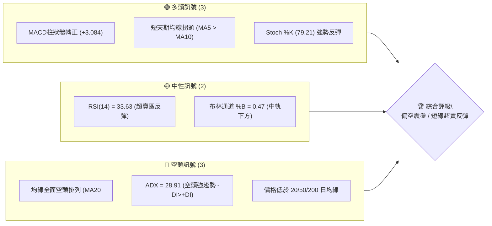
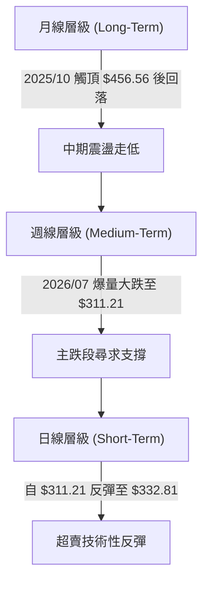
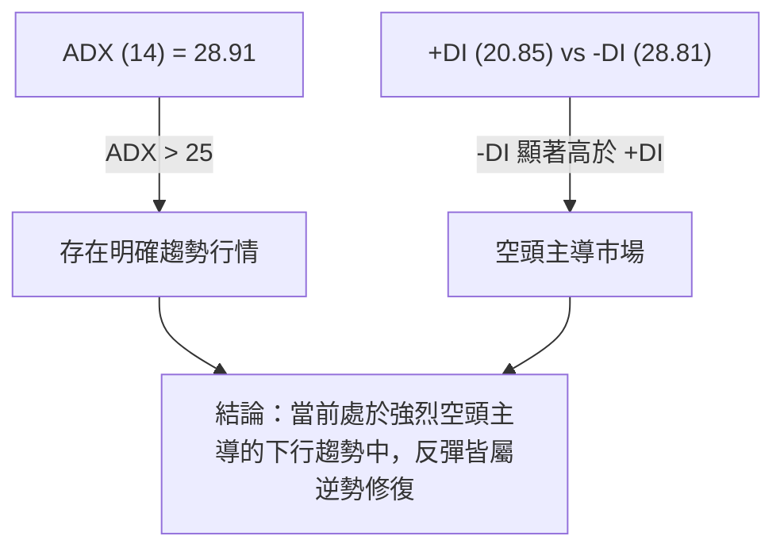
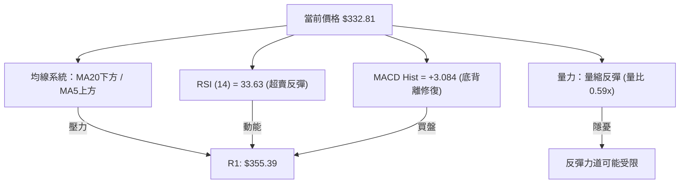
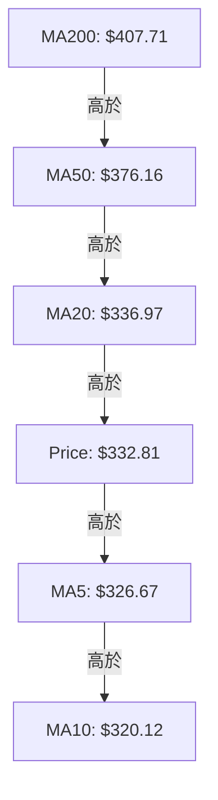
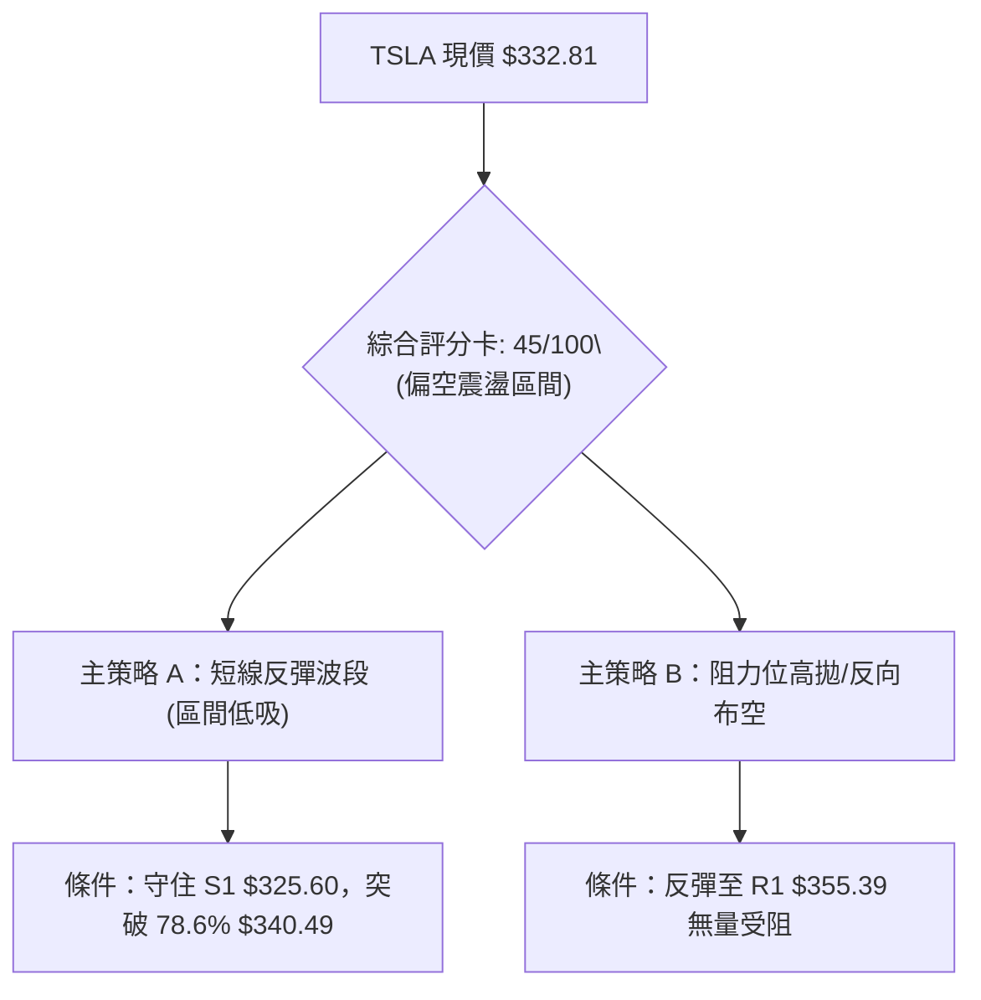
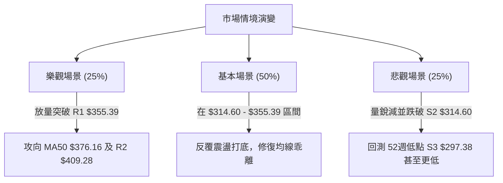

# TSLA 技術分析報告

> **報告日期**：2026-08-11 ｜ **語言**：繁體中文 ｜ **數據來源**：Yahoo Finance ｜ **當前價格**：$332.81

---

## 目錄

| 章節 | 內容 |
|------|------|
| [1. 技術面概覽](#1-技術面概覽) | 訊號儀表板、核心指標、評分卡 |
| [2. 趨勢分析](#2-趨勢分析) | 多時框趨勢、長中短期走勢 |
| [3. 圖表形態分析](#3-圖表形態分析) | 形態識別、K線組合、目標價 |
| [4. 支撐與阻力](#4-支撐與阻力) | 關鍵價位、斐波那契回調 |
| [5. 技術指標深度解讀](#5-技術指標深度解讀) | MA/RSI/MACD/布林/成交量 |
| [6. 動能與波動率](#6-動能與波動率) | 動能評估、ATR、Beta |
| [7. 多時框架總結](#7-多時框架總結) | 時框架評分矩陣 |
| [8. 交易策略建議](#8-交易策略建議) | 多空策略、風險報酬比 |
| [9. 風險提示與監控](#9-風險提示與監控) | 監控指標、風險場景 |

---

## 1. 技術面概覽

### 🎯 技術訊號儀表板



### 📊 核心指標速覽表

| 指標類別 | 指標名稱 | 當前數值 | 訊號 | 解讀 |
|----------|----------|----------|------|------|
| **價格** | 當前價格 | $332.81 | 🟡 | 位於52週區間 17.6% 分位，處於底部震盪區 |
| **均線** | MA20 | $336.97 | 🔴 | 價格低於 MA20 (-1.23%)，短線面臨中軌壓力 |
| **均線** | MA50 | $376.16 | 🔴 | 價格遠低於 MA50 (-11.52%)，中期趨勢偏空 |
| **均線** | MA200 | $407.71 | 🔴 | 價格遠低於 MA200 (-18.37%)，長期結構受損 |
| **動能** | RSI(14) | 33.63 | 🟡 | 自低檔 15.7 迅速回升，呈現超賣反彈態勢 |
| **動能** | MACD | -16.385 | 🟢 | 柱狀體 +3.084，DIF 與 DEA 負值收斂形成金叉 |
| **波動** | ATR(14) | $14.29 | 🟡 | 佔股價 4.29%，顯示市場波動度仍維持高位 |

### 🏆 技術評分卡

```
╔══════════════════════════════════════════════════════════════╗
║              技術評分卡 — TSLA (2026-08-11)                   ║
╠══════════════════════════════════════════════════════════════╣
║ 趨勢強度      ██████████████░░░░░░  70/100  🟡 強勢空頭趨勢     ║
║ 動能指標      ████████░░░░░░░░░░░░  40/100  🔴 動能修復中       ║
║ 支撐穩定度    ███████████░░░░░░░░░  55/100  🟡 S1/S2初步守住    ║
║ 成交量配合    ████████░░░░░░░░░░░░  40/100  🔴 反彈量縮(0.59x)  ║
║ 形態完整度    ██████████░░░░░░░░░░  50/100  🟡 探底打底形態     ║
║ 均線排列      ████░░░░░░░░░░░░░░░░  20/100  🔴 典型空頭排列     ║
╠══════════════════════════════════════════════════════════════╣
║ 綜合評分      █████████░░░░░░░░░░░  45/100  🟡 偏空震盪/觀望    ║
╚══════════════════════════════════════════════════════════════╝
```

---

## 2. 趨勢分析

### 🌐 多時框趨勢分析



### 📈 長期趨勢 — 24個月走勢圖（Unicode）

```
TSLA 月線走勢圖（2024-08 至 2026-08）
價格軸 ($)
$456 ┤                             ●(2025-10 高點)
$435 ┤                                     ●
$404 ┤               ●  ●                     ●
$345 ┤            ●        ●               ●
$311 ┤                                           ●  ● (現在 $332.81)
$214 ┤ ●(2024-08)
     └─────────────────────────────────────────────────
       24-08 24-11 25-01 25-05 25-09 25-12 26-03 26-05 26-08
```

#### 走勢特徵分析表格

| 階段 | 時間區間 | 首尾價格 | 漲跌幅 | 走勢特徵描述 |
|------|----------|----------|--------|--------------|
| 第一階段：起漲期 | 2024-08 ~ 2025-01 | $214.11 → $404.60 | +88.96% | 強勢突破攻頂，成交量大幅放大 |
| 第二階段：高檔震盪 | 2025-02 ~ 2025-08 | $292.98 → $333.87 | +13.95% | 中期拉回打底後重新蓄勢 |
| 第三階段：二次創高 | 2025-09 ~ 2025-10 | $444.72 → $456.56 | +2.66% | 攀升至 52 週高點附近，高點出現動能背離 |
| 第四階段：震盪盤跌 | 2025-11 ~ 2026-05 | $430.17 → $435.79 | +1.31% | 高位拓寬震盪，多次衝高受阻 |
| 第五階段：加速下挫 | 2026-06 ~ 2026-08 | $420.60 → $332.81 | -20.88% | 7月單月重挫，摔破多條關鍵均線 |

### ⚡ 趨勢強度評估（ADX 解讀）



| 指標 | 數值 | 門檻基準 | 趨勢狀態解讀 |
|------|------|----------|--------------|
| **ADX (14)** | 28.91 | > 25 (強趨勢) | 市場處於明確趨勢中，非無方向震盪 |
| **+DI (14)** | 20.85 | 多頭動能 | 多頭力道弱化，雖有微幅回升但仍偏低 |
| **-DI (14)** | 28.81 | 空頭動能 | 空頭力道主導市場，控制中期價格走向 |

---

## 3. 圖表形態分析

### 🔍 形態識別系統

根據近一年 OHLCV 價格走勢，目前展現出以下結構形態：

| 形態名稱 | 信心度 | 判斷依據（引用數據） | 完成度 | 目標價（附計算式） |
|----------|--------|----------------------|--------|--------------------|
| **雙底反彈形態** | 60% | 7月下旬低點 $311.21 與 8月初低點 $314.60 (S2) 形成雙腳 | 65% | 頸線 R1 $355.39 + (頸線 $355.39 - 底部位 $311.21) = **$399.57** |
| **下降通道（中軌修復）** | 75% | 高點連線自 $435.79 下滑，低點連線至 $311.21 | 80% | 通道上軌阻力落於 R2 **$409.28** 附近 |

### 🕯️ 重要K線形態分析（近期週線）

| 日期 | 收盤價 | 週K線形態 | 解讀 | 訊號 |
|------|--------|-----------|------|------|
| 2026-07-26 | $313.03 | 大陰線 (Long Red) | 爆量下殺，失守 MA50/MA200，RSI 破 20 | 🔴 強烈賣壓 |
| 2026-08-02 | $311.21 | 錘子線 (Hammer) | 探底 52 週低點附近後收回，下影線顯著 | 🟢 止跌訊號 |
| 2026-08-09 | $328.58 | 中陽線 (Bullish White) | 量縮反彈，吞噬前週上影線，MACD 柱轉正 | 🟢 反彈延續 |
| 2026-08-16 | $332.81 | 溫和陽線 (In Progress) | 站上 MA5 ($326.67) 與 MA10 ($320.12) | 🟡 阻力前壓 |

### 📉 ASCII 走勢形態示意圖

```
TSLA 日線雙底反彈結構示意圖
價格 ($)
$355.39 ┤─────────────────────────── [頸線 Resistance R1]
        │                         /
$332.81 ┤─────────────────●──────/─── [當前價格]
        │                / \    /
$314.60 ┤──────●        /   ●──/───── [第一腳 S2 / 第二腳 S2]
$311.21 ┤───────\──────/───────────── [波段極低點]
        └────────────────────────────
                7月下旬   8月初   目前
```

---

## 4. 支撐與阻力

### 🗺️ 關鍵價位分布圖（Unicode）

```
TSLA 價位結構分布圖 (由歷史 OHLCV 精確計算)
═════════════════════════════════════════════════════════════
$418.36 ║██████████████████████████████████║ 強阻力 R3 (一年波段高點聚類)
$409.28 ║████████████████████████████      ║ 阻力 R2 / MA200 ($407.71)
$355.39 ║████████████████████              ║ 頸線關鍵阻力 R1
$332.81 ╠══════════════════════════════════╣ ◄ 當前價格 ($332.81)
$325.60 ║▓▓▓▓▓▓▓▓▓▓▓▓▓▓▓▓                  ║ 近期支撐 S1 / MA5 ($326.67)
$314.60 ║████████████████                  ║ 強支撐 S2 (雙底第二腳)
$297.38 ║██████████████████████████████████║ 核心強支撐 S3 (52週最低點)
═════════════════════════════════════════════════════════════
```

### 🚧 阻力位分析表

| 阻力級別 | 精確價位 | 形成原因 | 突破難度 | 重要性 |
|----------|----------|----------|----------|--------|
| **R1** | **$355.39** | 近一年波段高點聚類與雙底形態頸線 | 🟡 中等 | 短線多空分水嶺，站穩方能擴大反彈 |
| **R2** | **$409.28** | 波段高點聚類、重合 200日均線 ($407.71) | 🔴 極高 | 長期多空解套賣壓密集區 |
| **R3** | **$418.36** | 斐波那契 38.2% ($421.88) 附近之高點聚類 | 🔴 極高 | 中長線強強阻力關卡 |

### 🛡️ 支撐位分析表

| 支撐級別 | 精確價位 | 形成原因 | 守住機率 | 重要性 |
|----------|----------|----------|----------|--------|
| **S1** | **$325.60** | 近一年波段低點聚類，接近 MA5 ($326.67) | 🟢 較高 | 短線極盛反彈的防守點 |
| **S2** | **$314.60** | 2026年8月初探底次低點，雙底右腳 | 🟡 中等 | 多頭波段結構的最後防線 |
| **S3** | **$297.38** | 52週最低點（52W Low），絕對底部 | 🟢 高 | 跌破將引發新一波停損賣壓 |

### 📐 斐波那契回調位分析（52週區間 $297.38 → $498.83）

| 回調比例 | 精確價位 | 與當前價格 ($332.81) 位置關係 | 技術面意義解讀 |
|----------|----------|--------------------------------|----------------|
| **0.0%** | $498.83 | +49.88% | 52 週最高點 |
| **23.6%** | $451.29 | +35.60% | 超強勢整理區間 |
| **38.2%** | $421.88 | +26.76% | 中期多頭防線 |
| **50.0%** | $398.10 | +19.62% | 多空中軸線 (接近 BB上軌 $399.87) |
| **61.8%** | $374.33 | +12.48% | 重點黃金分割位 (接近 MA50 $376.16) |
| **78.6%** | $340.49 | +2.31% | **目前即時阻力點** (現價位於 78.6% 與 100% 之間) |
| **100.0%**| $297.38 | -10.65% | 52 週最低點 (全數回吐點) |

*當前解讀：現價 $332.81 處於 78.6% ($340.49) 與 100.0% ($297.38) 的深刻回調區，78.6% 價位 $340.49 將是短線反彈首要關卡。*

---

## 5. 技術指標深度解讀

### 🎛️ 指標訊號總覽



### 📈 移動平均線排列分析



- **長中期**：MA20 ($336.97) < MA50 ($376.16) < MA200 ($407.71)，呈現典型**空頭排列**，長期下降趨勢未改。
- **短期**：價格 ($332.81) 已站上 MA5 ($326.67) 與 MA10 ($320.12)，短線形成黃金交叉，短線具備技術性反彈動能。

### 📉 RSI(14) 分析

```
RSI(14) 當前強度：33.63
0 ─────── 15.7 ─────── 33.63 ────────────────── 50 ───────────────── 70 ─────── 100
[ 極度超賣 ] [ 當前位置 ]                      [ 多空分界 ]          [ 超買區 ]
▓▓▓▓▓▓▓▓▓▓▓▓▓▓▓▓▓░░░░░░░░░░░░░░░░░░░░░░░░░░░░░░░░░░░░░░░░░░░░░░░░░░░░░░
```

- **背離判斷**：7月26日當週 RSI 刷出 15.7 極端低值後，8月初價格再探 $311.21 時 RSI 未再創新低（升至 18.1），呈現**微幅柱狀底背離**雛形，支撐短線股價回升。

### 📊 MACD(12/26/9) 訊號解讀

- **DIF 線**：-16.385
- **DEA 信號線**：-19.469
- **柱狀體 (Histogram)**：**+3.084** 🟢
- **解讀**：DIF 向上穿過 DEA，柱狀體翻正，顯示短期空頭動能耗盡，多頭買盤正在進行技術性修正與補漲。

### 📦 布林通道分析

```
TSLA 日線布林通道示意圖
$399.87 ────────── Upper Band (上軌)
        │
$336.97 ────────── Middle Band (MA20) ◄───── 接近上壓
$332.81 ────────── Current Price (現價 %B = 0.47)
        │
$274.07 ────────── Lower Band (下軌)
```

- **頻寬與位置**：%B 為 0.47，說明價格從下軌 ($274.07) 強烈反彈後，現已運行至中軌 ($336.97) 附近，中軌將是首要面臨的布林動能考驗。

### 💹 成交量分析（量價配合度）

- **最新成交量**：23,158,961 股
- **20日均量**：38,990,398 股（**量比 0.59x**）
- **解讀**：當前反彈伴隨成交量顯著萎縮（僅達 20日均量的 59%），屬於典型「**量縮價漲**」之無量反彈。若無成交量放大至 4,000萬股以上配合，突破 R1 ($355.39) 的成功率將受限。
- **OBV 趨勢**：OBV > MA，顯示在中長線籌碼洗牌後，低檔有主力資金進行沉澱吸籌。

---

## 6. 動能與波動率

### ⚡ 動能評估四象限

| 象限 | 動能強度 | 波動率 | 當前位置評估 | 策略含義 |
|------|----------|--------|--------------|----------|
| **Q1** | 強動能 (ADX>25) | 高波動 (ATR>4%) | — | 趨勢突破追價 |
| **Q2 (當前)** | **弱動能/空頭** | **高波動 (4.29%)** | **✓ TSLA 所在位置** | **區間低吸高拋 / 減碼** |
| **Q3** | 弱動能 (ADX<25) | 低波動 (ATR<3%) | — | 盤整蓄勢待變 |
| **Q4** | 強動能 (ADX>25) | 低波動 (ATR<3%) | — | 穩健單邊趨勢 |

### 📊 ATR 波動率分析

- **ATR(14)**：**$14.29**（占當前股價 **4.29%**）
- **風控止損距離建議**：
  - **緊密止損 (1.0x ATR)**：$14.29 → 止損空間約 4.3%
  - **標準波段止損 (1.5x ATR)**：$21.44 → 止損空間約 6.4%
  - **寬鬆止損 (2.0x ATR)**：$28.58 → 止損空間約 8.6%

### 📐 Beta 與市場相關性

- **Beta 係數**：**1.827**
- **解讀**：TSLA 屬於高 Beta 波動成長股，大盤（S&P500）每變動 1%，TSLA 平均變動 1.83%。在目前大盤震盪時期，TSLA 個股波動幅度顯著放大，需嚴格控管倉位。

---

## 7. 多時框架總結

### 📋 時框架評分表

| 時框架 | 趨勢方向 | 動能指標 | 均線排列 | 圖表形態 | 綜合評分 | 交易建議 |
|--------|----------|----------|----------|----------|----------|----------|
| **月線 (Long)** | 🔴 下降 | 🔴 偏空 | 🔴 空頭 | 🔴 破位 | 35/100 | 長線偏空，不宜重倉持股 |
| **週線 (Medium)**| 🔴 下降 | 🟡 止跌 | 🔴 空頭 | 🟡 打底 | 40/100 | 中期尋找阻力位逢高減碼 |
| **日線 (Short)** | 🟢 上升 | 🟢 偏多 | 🟡 扭轉 | 🟢 雙底 | 60/100 | 短線順應反彈，嚴格止損 |

### ⚖️ 多時框收斂結論

根據**多時框收斂規則**：當前 ADX(14) = 28.91 (>25)，屬於**趨勢行情（空頭主導）**。
- **主導時框**：以週線與 MA200 ($407.71)、MA50 ($376.16) 的中長期空頭方向為主。
- **日線定位**：日線的雙底反彈與 MACD 柱狀體翻正，僅屬於**空頭趨勢中的逆勢技術性反彈**。
- **最終一致性結論**：**整體評級為「偏空震盪/短線反彈」**。交易策略應以「**逢高布空/反彈獲利了結**」為主，不宜過度追高。

---

## 8. 交易策略建議

### 🗺️ 策略決策流程圖



> **當前主策略方向 = 區間反彈逢高減碼 / 偏空反彈操作（綜合評分 45/100）**

### 🎯 價格情境階梯（Price Scenarios）

| 觸發條件 | 下一目標 | 後續延伸 | 情境含義 |
|----------|----------|----------|----------|
| 強勢突破 R1 **$355.39** | R2 **$409.28** | R3 **$418.36** | 空頭陷阱引爆，中線反彈升級 |
| 位於 S1 **$325.60** ~ R1 **$355.39** | — | — | 弱勢築底，區間震盪整理 |
| 跌破 S1 **$325.60** | S2 **$314.60** | S3 **$297.38** | 反彈結束，再次向下探底 |

### 📊 情境機率分佈

| 情境 | 機率 | 主要依據 |
|------|------|----------|
| **反彈延伸至 R1 ($355.39)** | **45%** | MACD 柱狀體翻正 (+3.084)，Stoch %K 強勢，日線站上 MA5/MA10 |
| **區間震盪 ($314.60 - $355.39)** | **35%** | 成交量縮 (0.59x)，ADX 指示多頭追價意願不足 |
| **再次破底至 S3 ($297.38)** | **20%** | 均線系統全面空頭排列，中期跌勢未扭轉 |

### 🟢 交易策略詳情

#### 策略 A：短線超賣反彈操作（低吸多單）

| 策略要素 | 具體設定 | 計算 / 引用依據 |
|----------|----------|-----------------|
| **進場條件** | 股價拉回不破 S1，或突破 $336.97 (MA20) 確認 | 日線技術性修復 |
| **進場價格** | **$328.00 - $332.81** | 靠近當前價格與 MA5 ($326.67) |
| **目標價 T1** | **$355.39** | **引用 Resistance R1** |
| **目標價 T2** | **$374.33** | **引用 斐波那契 61.8% 回調位** |
| **止損價格** | **$314.60** | **引用 Support S2 (跌破即止損)** |
| **潛在利潤** | +$22.58 (+6.78% 至 T1) | ($355.39 - $332.81) |
| **潛在風險** | -$18.21 (-5.47%) | ($332.81 - $314.60) |
| **風險報酬比**| **1.24 : 1** | (以 T1 計算) |
| **建議倉位** | **10% - 15%** (輕倉試錯) | 逆勢交易嚴控倉位 |

#### 策略 B：阻力位高拋 / 順勢布空操作（高空單）

| 策略要素 | 具體設定 | 計算 / 引用依據 |
|----------|----------|-----------------|
| **進場條件** | 股價反彈至 R1 附近出現長上影線或量縮受阻 | 順應週線空頭趨勢 |
| **進場價格** | **$350.00 - $355.39** | 靠近 R1 阻力區間 |
| **目標價 T1** | **$325.60** | **引用 Support S1** |
| **目標價 T2** | **$297.38** | **引用 Support S3 (52週低點)** |
| **止損價格** | **$365.00** | 突破 R1 上方約 1x ATR 區域 |
| **潛在利潤** | +$58.01 (+16.32% 至 T2) | ($355.39 - $297.38) |
| **潛在風險** | -$9.61 (-2.70%) | ($365.00 - $355.39) |
| **風險報酬比**| **6.04 : 1** | (以 T2 計算) |
| **建議倉位** | **20% - 25%** | 順應主趨勢操作 |

### 🔴 反向風險觸發點（對沖提示）

- **多頭失效點**：若收盤價有效跌破 **$314.60 (S2)**，宣告雙底築底失敗，應立即執行多單清倉。
- **空頭失效點**：若收盤價強勢突破並站穩 **$376.16 (MA50)**，代表中期空頭結構扭轉，應立即停止逢高布空策略。

### ⭐ 整體訊號強度評星

```
做多訊號強度：★★☆☆☆  (2/5星 - 僅限短線超賣反彈)
做空訊號強度：★★★★☆  (4/5星 - 中長期均線壓制明確)
整體可信度：  ★★★☆☆  (3/5星 - 量能不足增加震盪機率)
```

---

## 9. 風險提示與監控

### ✅ 關鍵監控指標 Checklist

```
╔══════════════════════════════════════════════════════════════╗
║              TSLA 技術面每日風控監控清單                      ║
╠══════════════════════════════════════════════════════════════╣
║ [ ] 價格是否突破/失守 R1 $355.39 頸線關鍵位                  ║
║ [ ] 價格是否跌破 S1 $325.60 及 S2 $314.60 支撐區間           ║
║ [ ] 日成交量是否放大至 43,000,000 股 (50日均量) 以上         ║
║ [ ] MACD 柱狀體 (+3.084) 是否持續擴大 (多頭力道延續)          ║
║ [ ] RSI(14) 能否順利突破 50 多空分界線                       ║
╚══════════════════════════════════════════════════════════════╝
```

### ⚠️ 風險場景分析



### 🛡️ 風險管理重要提醒

1. **嚴禁高槓桿追高**：當前量比僅 0.59x，無量反彈極易受大盤波動影響而迅速拉回。
2. **波動度保護**：TSLA ATR 為 $14.29，每日正常波動區間即達 4.3%，設定止損時必須預留足夠喘息空間，避免被噪音洗出場。
3. **Beta 風險**：TSLA Beta 高達 1.827，大盤若出現大幅回檔，TSLA 破底風險將顯著上升。

---

## 📋 報告總結

```
╔══════════════════════════════════════════════════════════════╗
║                    TSLA 技術分析總結                         ║
════════════════════════════════════════════════════════════════
 報告日期：2026-08-11
 當前價格：$332.81
 分析評級：🟡 偏空震盪 / 短線超賣反彈 (觀望或短線區間操作)

 關鍵價位摘要：
 ├─ 長期趨勢：🔴 空頭主導 (ADX = 28.91, -DI > +DI)
 ├─ 短期趨勢：🟢 探底反彈 (MA5/MA10 金叉，MACD 柱狀體翻正)
 ├─ 關鍵支撐：S1 $325.60 ｜ S2 $314.60 ｜ S3 $297.38 (52W Low)
 ├─ 關鍵阻力：R1 $355.39 ｜ R2 $409.28 ｜ R3 $418.36
 └─ 分析師平均目標價：$396.62 (空間 +19.17%)

 最佳策略指引：
 1. 🥇 最佳機會（高勝率）：等待反彈至 R1 $355.39 附近受阻時，執行順勢布空 (策略 B)。
 2. 🥈 次選機會（短線客）：於 $325.60 - $332.81 區間輕倉參與超賣反彈，嚴設止損於 $314.60 (策略 A)。
 3. 🥉 保守選擇：等待股價突破 R1 $355.39 或跌破 S3 $297.38 方向明確後再行進場。
╚══════════════════════════════════════════════════════════════╝
```

---

> ⚠️ **免責聲明**：本報告為 AI 自動生成之技術分析，所有數據及估算均基於提供的歷史價格資訊。本報告**僅供研究與學術參考**，**不構成任何投資建議**。投資有風險，入市需謹慎。

---

*報告生成時間：2026-08-11 ｜ 數據來源：Yahoo Finance ｜ 分析框架：多時框技術分析*