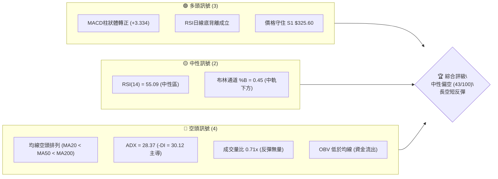
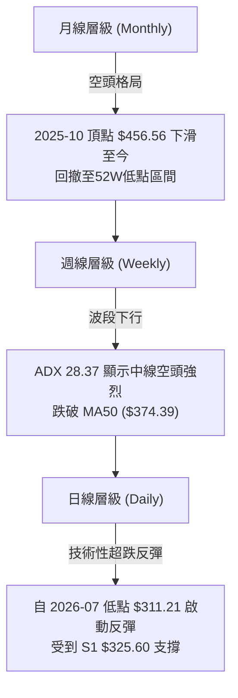
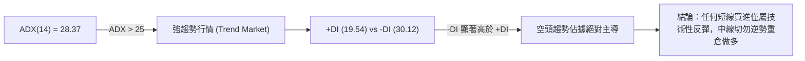
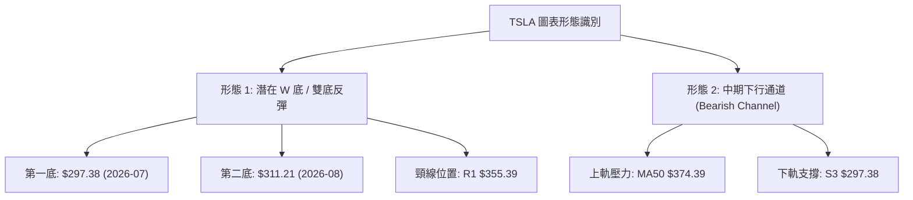
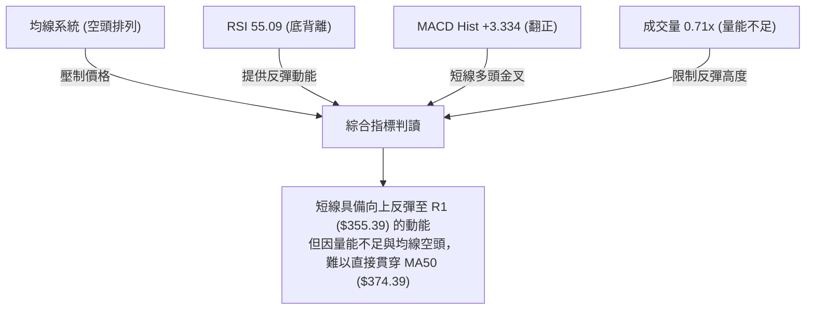
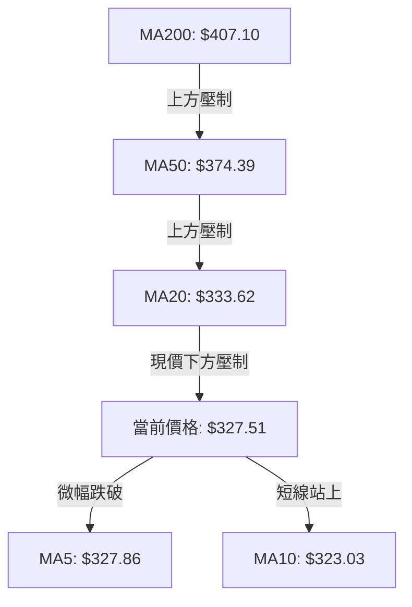
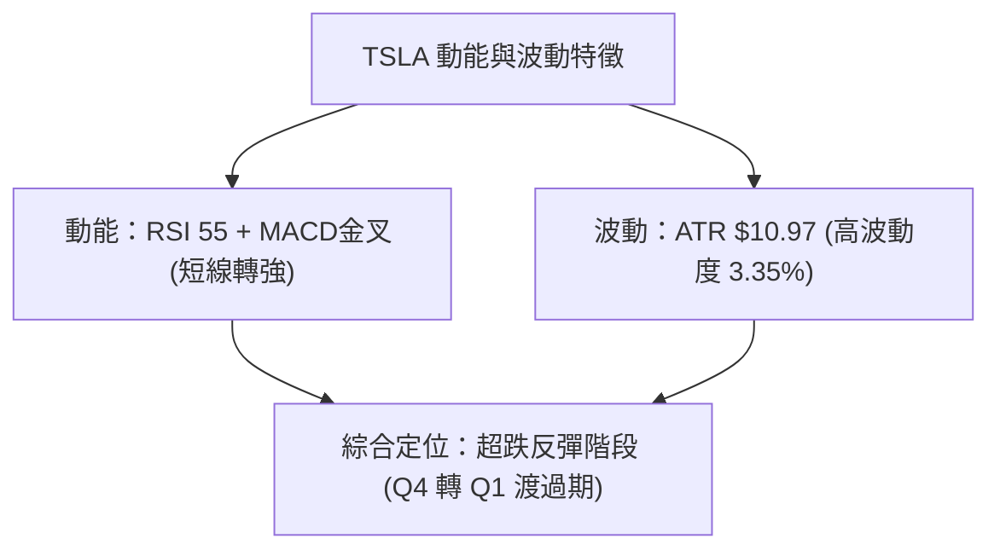
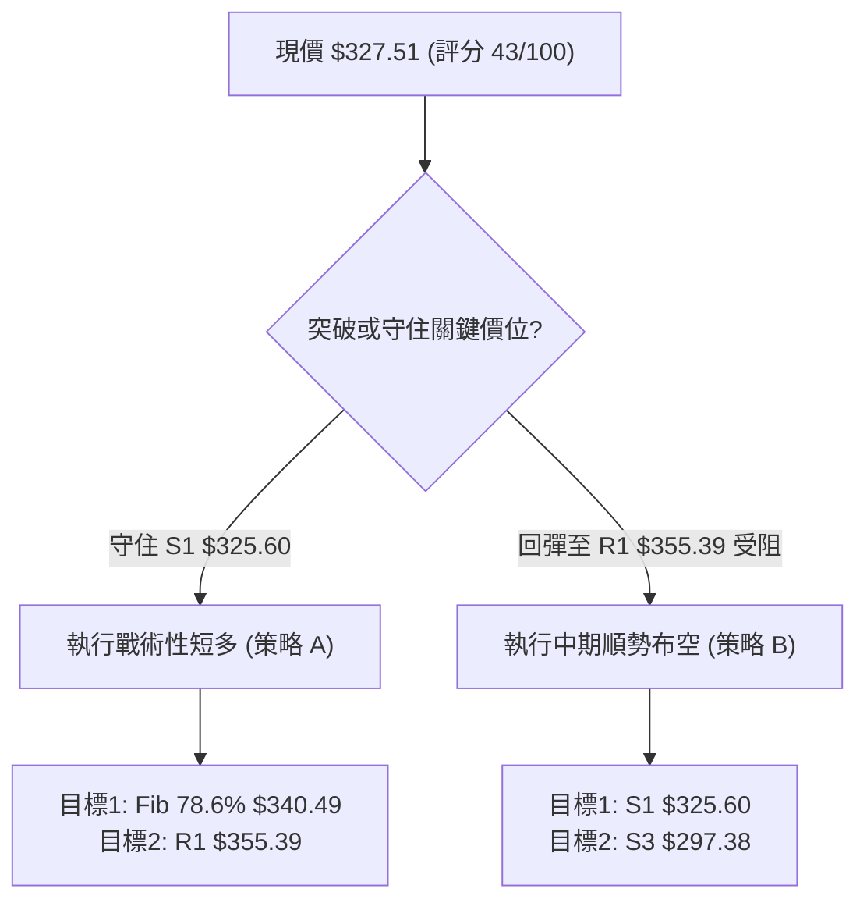
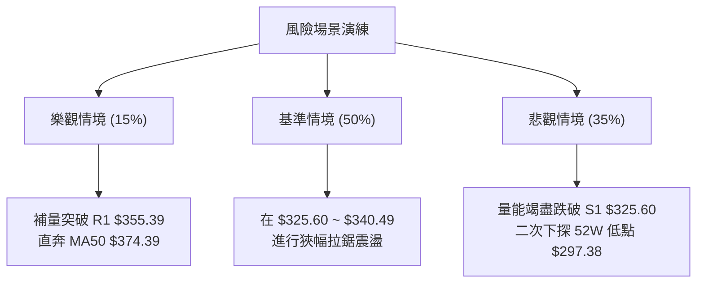

# TSLA 技術分析報告

> **報告日期**：2026-08-12 ｜ **語言**：繁體中文 ｜ **數據來源**：Yahoo Finance ｜ **當前價格**：$327.51

---

## 目錄

| 章節 | 內容 |
|------|------|
| [1. 技術面概覽](#1-技術面概覽) | 訊號儀表板、核心指標、評分卡 |
| [2. 趨勢分析](#2-趨勢分析) | 多時框趨勢、長中短期走勢、ADX解讀 |
| [3. 圖表形態分析](#3-圖表形態分析) | 形態識別、信心度評估、K線組合、目標價計算 |
| [4. 支撐與阻力](#4-支撐與阻力) | 關鍵價位結構、阻力/支撐矩陣、斐波那契回調 |
| [5. 技術指標深度解讀](#5-技術指標深度解讀) | MA/RSI/MACD/布林通道/成交量與OBV |
| [6. 動能與波動率](#6-動能與波動率) | 動能評估、ATR止損計算、Beta相關性 |
| [7. 多時框架總結](#7-多時框架總結) | 時框架評分矩陣、多時框收斂規則結論 |
| [8. 交易策略建議](#8-交易策略建議) | 策略路由、情境階梯、主反向策略、風險報酬比 |
| [9. 風險提示與監控](#9-風險提示與監控) | 關鍵監控清單、三情境演練、風控守則 |

---

## 1. 技術面概覽

### 🎯 技術訊號儀表板



### 📊 核心指標速覽表

| 指標類別 | 指標名稱 | 當前數值 | 訊號 | 解讀 |
|----------|----------|----------|------|------|
| **價格** | 當前價格 | $327.51 | 🟡 中性 | 處於52週區間 15.0% 位置，築底反彈中 |
| **均線** | MA20 | $333.62 | 🔴 空頭 | 價格位於 MA20 下方 (-1.83%)，短線承壓 |
| **均線** | MA50 | $374.39 | 🔴 空頭 | 價格位於 MA50 下方 (-12.51%)，中期空頭 |
| **均線** | MA200 | $407.10 | 🔴 空頭 | 價格位於 MA200 下方 (-19.55%)，長期空頭 |
| **動能** | RSI(14) | 55.09 | 🟢 多頭 | 中性區間向上，且存在顯著底背離訊號 |
| **動能** | MACD(12,26,9) | -15.302 / Hist +3.334 | 🟢 多頭 | DIF低位金叉 Signal (-18.635)，柱狀體連增 |
| **趨勢** | ADX(14) | 28.37 | 🔴 空頭 | 強趨勢(>25)，-DI(30.12) > +DI(19.54) 空頭主導 |
| **波動** | ATR(14) | $10.97 | 🟡 中性 | 日均波動率 3.35%，屬中高波動個股 |
| **量能** | 成交量比 | 0.71x | 🔴 空頭 | 日量2,769萬股 < 20日均量3,880萬股，反彈縮量 |

### 🏆 技術評分卡

```
╔══════════════════════════════════════════════════════════════════╗
║                   技術評分卡 — TSLA (2026-08-12)                  ║
╠══════════════════════════════════════════════════════════════════╣
║  趨勢強度      ▓▓▓▓▓▓▓░░░░░░░░░░░░░  35/100  🔴 空頭強勢 (ADX=28.37)║
║  動能指標      ▓▓▓▓▓▓▓▓▓▓▓░░░░░░░░░  58/100  🟢 底背離反彈中        ║
║  支撐穩定度    ▓▓▓▓▓▓▓▓▓▓░░░░░░░░░░  52/100  🟡 守住S1 $325.60      ║
║  成交量配合    ▓▓▓▓▓▓▓▓░░░░░░░░░░░░  40/100  🔴 量能退潮 (0.71x)    ║
║  形態完整度    ▓▓▓▓▓▓▓▓▓▓░░░░░░░░░░  50/100  🟡 潛在雙底打底期      ║
║  均線排列      ▓▓▓▓░░░░░░░░░░░░░░░░  20/100  🔴 典型空頭排列        ║
╠══════════════════════════════════════════════════════════════════╣
║  綜合評分      ▓▓▓▓▓▓▓▓▓░░░░░░░░░░░  43/100  🟡 中性偏空 (弱勢反彈) ║
╚══════════════════════════════════════════════════════════════════╝
```

---

## 2. 趨勢分析

### 🌐 多時框趨勢分析



### 📈 長期趨勢 — 12個月走勢圖（Unicode）

以下為 TSLA 過去 12 個月（2025-09 至 2026-08）的月線收盤價格走勢圖與關鍵高低點標註：

```
TSLA 月線走勢圖 (2025-09 至 2026-08)
價格軸 ($)
$460 ┤               ● $456.56 (2025-10 高點)
$440 ┤         ● $444.72   ● $449.72   ● $435.79
$420 ┤                         ● $430.41   ● $420.60
$400 ┤                               ● $402.51
$380 ┤                                     ● $381.63
$360 ┤
$340 ┤● $333.87                                  
$320 ┤                                                 ● $327.51 (現在)
$300 ┤                                           ● $311.21 (低點)
     └─────────────────────────────────────────────────────────────
      09/25 10/25 11/25 12/25 01/26 02/26 03/26 04/26 05/26 06/26 07/26 08/26
```

#### 走勢特徵分析表

| 階段 | 期間 | 價格變動 | 漲跌幅 | 走勢特徵與技術含義 |
|------|------|----------|--------|----------------────|
| **高位衝頂** | 2025-09 ~ 2025-10 | $333.87 → $456.56 | +36.75% | 資金大幅流入，創下該波段最高點 $456.56 |
| **高檔震盪** | 2025-11 ~ 2026-01 | $430.17 → $430.41 | +0.06%  | 高位獲利結調，買盤跟進乏力，形成頭部結構 |
| **主跌段**   | 2026-02 ~ 2026-04 | $402.51 → $381.63 | -5.19%  | 跌破均線支撐，加速下行，MA200 降至 $407.10 |
| **死貓反彈** | 2026-05 ~ 2026-06 | $435.79 → $420.60 | -3.49%  | 向上挑戰阻力未果，成交量逐步萎縮 |
| **二次探底** | 2026-07 ~ 2026-08 | $311.21 → $327.51 | +5.24%  | 深度下挫至 52W 低點附近 ($297.38)，短線止跌尋求支撐 |

### 📊 中期趨勢（週線分析）

中期技術架構呈現典型的「壓力下移」特徵。上方重重阻力區塊集中於 MA50（$374.39）與 MA200（$407.10），下方的支撐則落在 S1（$325.60）與 52 週低點 S3（$297.38）。

```
週線結構壓力支撐示意圖
═══════════════════════════════════════════════════════════════════
$418.36 ────────────────────────────────────────── R3 強阻力
$409.28 ────────────────────────────────────────── R2 關鍵阻力 / MA200 ($407.10)
$374.39 ────────────────────────────────────────── MA50 / 斐波那契 61.8% ($374.33)
$355.39 ────────────────────────────────────────── R1 短線壓力頸線
$333.62 ────────────────────────────────────────── MA20 / 布林中軌
$327.51 ───► 【當前現價】
$325.60 ────────────────────────────────────────── S1 短線防守支撐
$314.60 ────────────────────────────────────────── S2 近期波段低點
$297.38 ────────────────────────────────────────── S3 52週最低點
═══════════════════════════════════════════════════════════════════
```

### ⚡ 趨勢強度評估（ADX 解讀）



#### ADX 趨勢強度指標對照表

| 指標名稱 | 當前數值 | 參考標準 | 趨勢狀態 | 對交易策略的指示 |
|----------|----------|----------|----------|------------------|
| **ADX(14)** | 28.37 | > 25 (強趨勢) | 明确趨勢中 | 遵循主趨勢方向，順勢做空或反彈減碼 |
| **+DI** | 19.54 | < 20 (多頭孱弱) | 買盤動能不足 | 多頭推升力道薄弱，隨時可能遭空頭壓制 |
| **-DI** | 30.12 | > 30 (空頭強勁) | 賣壓佔據主導 | 空頭掌控市場控盤權 |

---

## 3. 圖表形態分析

### 🔍 形態識別系統



#### 形態信心度與目標價計算表

| 形態名稱 | 信心度 | 判斷依據（引用數據） | 完成度 | 目標價計算式（明確數值） |
|----------|--------|----------------------|--------|--------------------------|
| **潛在雙底反彈** | 55% | 低點 $297.38 與 $311.21 形成二次測試，且 RSI 底部抬升 | 60% | 頸線 R1 $355.39 + (頸線 $355.39 - 第一底 $297.38 = $58.01) = **$413.40**（接近 R2 $409.28） |
| **中期下行通道** | 85% | MA20 < MA50 < MA200 空頭排列，高點 $456.56 → $435.79 遞減 | 90% | 下通道下軌回測值 = **S3 $297.38** |

### 🕯️ 重要 K 線形態分析

| 日期/月份 | 收盤價 | K 線形態 | 技術解讀 | 多空訊號 |
|-----------|--------|----------|----------|----------|
| 2026-07-26 | $313.03 | 大陰線破位 | 單週暴跌，RSI 陷入 15.7 極端超賣區 | 🔴 極空 |
| 2026-08-02 | $311.21 | 錘頭線 / 長下影 | 止跌訊號，回測 52W 低點 $297.38 附近獲得支撐 | 🟢 看多反彈 |
| 2026-08-09 | $328.58 | 中陽線吞噬 | 包覆前週實體，MACD 柱狀體翻正 (+1.025) | 🟢 看多確認 |
| 2026-08-16 | $327.51 | 十字星震盪 | 現價於 S1 $325.60 附近整固，多空暫時均衡 | 🟡 中性整整 |

### 📉 ASCII 走勢形態示意圖（潛在雙底）

```
TSLA 日線雙底（W底）構建示意圖
價格 ($)
$360 ┤                    頸線 R1 $355.39
     │                     / \
$340 ┤                    /   \
     │   ●               /     \       ● 現價 $327.51
$320 ┤    \             /       \     /
     │     \           /         ●---/ (第二底 $311.21)
$300 ┤      ●---------/ (第一底 $297.38)
     └──────────────────────────────────────────────
      2026-07-19      2026-07-26     2026-08-02    2026-08-12
```

### 🎯 形態目標價計算

根據雙底（W Bottom）形態之標準幾何測幅原理：
1. **形態高度**（Pattern Height）：頸線價位 $355.39 - 底部低點 $297.38 = **$58.01**
2. **多頭理論目標價**：頸線價位 $355.39 + 形態高度 $58.01 = **$413.40**
   - *註：該理論目標價與阻力位 R2（$409.28）及 50.0% 斐波那契回調位（$398.10）高度重合，若順利突破 R1，此區間將為終極獲利了結區。*

---

## 4. 支撐與阻力

### 🗺️ 關鍵價位分布圖（Unicode）

```
TSLA 價位結構與密集區分布圖
═══════════════════════════════════════════════════════════════════
$498.83 ║████████████████████████████████████████║ 52W 最高點 (0.0% Fib)
$451.29 ║████████████████████                    ║ 23.6% 斐波那契回調位
$418.36 ║████████████████████████████████        ║ 強阻力 R3
$409.28 ║██████████████████████████              ║ 阻力 R2 / MA200 ($407.10)
$398.10 ║██████████████████                      ║ 50.0% 斐波那契回調位
$374.39 ║████████████████████████████            ║ 關鍵阻力 / MA50 / 61.8% Fib ($374.33)
$355.39 ║████████████████████                    ║ 短線第一阻力 R1 (W底頸線)
$340.49 ║████████████                            ║ 78.6% 斐波那契回調位
$333.62 ║██████████                              ║ MA20 / 布林中軌
$327.51 ╠════════════════════════════════════════╣ ◄ 當前價格 ($327.51)
$325.60 ║▓▓▓▓▓▓▓▓▓▓▓▓▓▓▓▓▓▓▓▓▓▓▓▓▓▓▓▓            ║ 短線第一支撐 S1
$314.60 ║████████████████                        ║ 中期波段支撐 S2
$297.38 ║████████████████████████████████████████║ 52W 最低點 S3 (100.0% Fib)
═══════════════════════════════════════════════════════════════════
```

### 🚧 阻力位分析表

所有阻力價位均嚴格取自數據集中由 OHLCV 計算之定性高點：

| 阻力級別 | 精確價位 | 距現價幅度和形成原因 | 突破難度 | 交易戰略重要性 |
|----------|----------|----------------------|----------|----------------|
| **R1** | **$355.39** | +8.51% ｜ 近一年波段高點聚類、潛在W底頸線 | 🟡 中等 | 短線多空分水嶺，突破方能開啟中期反彈 |
| **R2** | **$409.28** | +24.97% ｜ 近一年密集籌碼反彈高點、鄰近 MA200 ($407.10) | 🔴 極高 | 長期均線重壓區，牛熊分界線 |
| **R3** | **$418.36** | +27.74% ｜ 近一年強阻力峰值聚類 | 🔴 極高 | 頂部反轉壓力牆 |

### 🛡️ 支撐位分析表

所有支撐價位均嚴格取自數據集中由 OHLCV 計算之定性低點：

| 支撐級別 | 精確價位 | 距現價幅度和形成原因 | 守住機率 | 交易戰略重要性 |
|----------|----------|----------------------|----------|----------------|
| **S1** | **$325.60** | -0.58% ｜ 近一週平台整理下軌、短線聚類 | 🟢 較高 | 短線多頭最後防線，跌破則反彈夭折 |
| **S2** | **$314.60** | -3.94% ｜ 2026-07 暴跌後二次回測低點聚類 | 🟡 中等 | 中期防守關卡 |
| **S3** | **$297.38** | -9.20% ｜ 52 週絕對最低點 (52W Low) | 🔴 關鍵 | 全年最低防線，若失守將引發估值崩塌 |

### 📐 斐波那契回調位分析（以 52週區間 $297.38 → $498.83 為準）

當前價格 **$327.51** 位於 **78.6% 回調位（$340.49）** 與 **100.0% 回調位（$297.38）** 之間的超跌修復區間。

| 斐波那契分位 | 精確價位 | 相對現價位置 | 技術分析解讀 |
|--------------|----------|--------------|--------------|
| **0.0%** (52W High) | **$498.83** | +52.31% | 歷史牛市頂部 |
| **23.6%** | **$451.29** | +37.79% | 極強多頭回撤極限 |
| **38.2%** | **$421.88** | +28.81% | 中期多頭強弱線 |
| **50.0%** | **$398.10** | +21.55% | 半數回撤位，靠近 R2 ($409.28) |
| **61.8%** | **$374.33** | +14.30% | 黃金分割強阻力，與 MA50 ($374.39) 完全重合 |
| **78.6%** | **$340.49** | +3.96% | 短線反彈第一道斐波那契阻力牆 |
| **100.0%** (52W Low) | **$297.38** | -9.20% | 底部極限值 S3 |

---

## 5. 技術指標深度解讀

### 🎛️ 指標訊號總覽



### 📈 移動平均線排列分析



#### 均線數據明細與排列評估

- **均線排列狀態**：`MA20 ($333.62) < MA50 ($374.39) < MA200 ($407.10)` ➜ **典型空頭排列**
- **短線扣抵分析**：MA10（$323.03）已開始向上勾頭（+1.39%），現價 $327.51 成功站上 MA10，預示短線底角構建完成；但 MA20（$333.62）依然呈下彎態勢（-1.83%），成為短線第一道動態壓制。

### 📉 RSI(14) 分析與背離判斷

- **當前數值**：**55.09**
- **進度條顯示**：`█████████████░░░░░░░░ 55.09%`（處於 30-70 中性偏多區）
- **背離判讀（底背離確認 🟢）**：
  - 價格於 2026-07-26 下探低點，當時 RSI(14) 掉入 **15.7** 的極端超賣區。
  - 隨後價格於 2026-08-02 再次下探低點 $311.21，但 RSI 未再創新低，反彈至 **18.1**。
  - 今日價格回升至 $327.51，RSI 陡峭拉升至 **55.09**。典型的「價格二次探底、指標底角抬升」之**標準底背離（Bullish Divergence）**，預示短線賣壓衰竭，技術性反彈持續進行中。

### 📊 MACD(12/26/9) 訊號解讀

- **MACD 線 (DIF)**：`-15.302`
- **Signal 線 (DEA)**：`-18.635`
- **MACD 柱狀體 (Histogram)**：`+3.334` 🟢
- **訊號解讀**：DIF 於零軸遠端下方上穿 DEA 形成「低位黃金交叉」。柱狀體連續多週擴張（由 -8.365 ➔ -6.930 ➔ +1.025 ➔ +3.334），明確指示空頭能量消退，多頭反彈動能正在累積。

### 📦 布林通道分析

```
TSLA 布林通道 (Bollinger Bands) 狀態
═══════════════════════════════════════════════════════════════════
$390.48 ────────────────────────────────────────── BB 上軌 (Upper)
                                                  
$333.62 ────────────────────────────────────────── BB 中軌 (MA20)
$327.51 ───► 【當前現價】(%B = 0.45)
                                                  
$276.77 ────────────────────────────────────────── BB 下軌 (Lower)
═══════════════════════════════════════════════════════════════════
```
- **布林帶寬度**：上軌 $390.48 至 下軌 $276.77，總通道寬度高達 $113.71，表明市場前段經歷急跌後波動率大增。
- **%B 指標**：**0.45**，顯示現價略低於中軌（$333.62），處於中軌與下軌之間的合理築底區域，並未觸及超買上軌，具備向上向上軌衝刺的空間。

### 💹 成交量分析（量價配合度）

- **最新日成交量**：27,695,899 股
- **20 日均量**：38,807,015 股（**量比 0.71x**）
- **OBV 趨勢**：`OBV < MA`
- **量價診斷**：當前反彈過程伴隨成交量顯著萎縮（量比僅 0.71x），顯示機構法人追高意願低落，目前反彈主要由空頭回補（Short Covering）所驅動，而非新多頭資金主力鎖碼。若未來挑戰 R1（$355.39）時無法補量至 4,000 萬股以上，將面臨受阻回落風險。

---

## 6. 動能與波動率

### ⚡ 動能評估四象限

| 象限分區 | 動能強度 (Momentum) | 波動率 (Volatility) | 當前 TSLA 歸屬狀態 | 戰術建議 |
|----------|---------------------|---------------------|--------------------|----------|
| **第一象限 (Q1)** | 強 (Strong) | 低 (Low) | ❌ 非當前狀態 | 最佳趨勢加碼點 |
| **第二象限 (Q2)** | 弱 (Weak) | 低 (Low) | ❌ 非當前狀態 | 觀望休整區 |
| **第三象限 (Q3)** | 強 (Strong) | 高 (High) | ❌ 非當前狀態 | 高風險追漲區 |
| **第四象限 (Q4)** | **弱/築底 (Weak/Rebound)** | **高 (High, ATR 3.35%)** | **✓ TSLA 當前位置** | **小倉位高拋低吸，嚴設止損** |



### 📊 ATR 波動率分析與止損設定

- **ATR(14) 數值**：**$10.97**（佔當前股價 3.35%）
- **每日預期波動區間**：$327.51 ± $10.97 ➜ **[$316.54 ~ $338.48]**
- **風控止損距離建議**：
  - **保守型 (2.0 × ATR)**：$21.94 ➜ 止損價可設於 $327.51 - $21.94 = **$305.57**（守住 S2 $314.60 之下）
  - **戰術型 (1.2 × ATR)**：$13.16 ➜ 止損價可設於 $327.51 - $13.16 = **$314.35**（精準貼近 S2 $314.60）

### 📐 Beta 與市場相關性

- **Beta 係數**：**1.827**
- **解讀**：TSLA 具備高 Beta 特性，大盤（S&P 500 / Nasdaq）每波動 1%，TSLA 平均將產生 1.827% 的同向波動。在當前大盤震盪環境下，個股下行與上行風險均被放大。

---

## 7. 多時框架總結

### 📋 時框架評分表

| 時框架 | 趨勢方向 | 動能指標 | 均線排列 | 形態結構 | 綜合評分 | 戰術建議 |
|--------|----------|----------|----------|----------|----------|----------|
| **月線 (Monthly)** | 🔴 下行 | 🔴 偏弱 | 🔴 空頭壓制 | 頂部反轉 | **30/100** | 長線減碼，不宜重倉 |
| **週線 (Weekly)** | 🔴 下行 | 🟡 止跌 | 🔴 空頭排列 | 下行通道 | **40/100** | 中線反彈逢高尋求做空點 |
| **日線 (Daily)** | 🟢 上升 | 🟢 底背離 | 🟡 MA10金叉 | W底反彈中 | **60/100** | 短線可快進快出博取反彈 |

### 🔲 綜合訊號矩陣

```
時框架訊號收斂矩陣
┌──────────┬──────────┬──────────┬──────────┐
│ 時框架   │ 趨勢方向 │ 動能強度 │ 交易決策 │
├──────────┼──────────┼──────────┼──────────┤
│ 長期月線 │   空頭   │   弱勢   │ 避開長多 │
│ 中期週線 │   空頭   │   中性   │ 逢高布空 │
│ 短期日線 │   多頭   │   偏強   | 戰術做多 │
└──────────┴──────────┴──────────┴──────────┘
```

### ⚖️ 多時框收斂規則結論

依據多時框收斂規則（Rule 14）：
1. **當前趨勢狀態**：ADX(14) = 28.37（> 25），且 -DI (30.12) > +DI (19.54)，**判定當前為「強烈中期空頭趨勢行情」**。
2. **主導時框取捨**：依規則，當 ADX > 25 時，**必須以中長期（週線與 MA50/MA200）方向為主要主導方向**。日線層級之 RSI 底背離與 MACD 柱狀體翻正，僅能被定義為「空頭趨勢中的技術性修復反彈」。
3. **最終收斂結論**：**中性偏空（整體評分 43/100）**。策略應以「短線戰術性反彈做多（嚴設止損）」與「逢高接近 R1/MA50 佈局中期空單」為主，切勿盲目樂觀追高。

---

## 8. 交易策略建議

### 🗺️ 策略決策流程圖



### 🧭 策略路由

**當前主策略方向：中性偏空 / 短線反彈高拋低吸（綜合評分 43/100）**
- **主推策略**：策略 A（短線戰術性反彈多單）與 策略 B（R1 壓力區反彈受阻布空單）。

### 🎯 價格情境階梯 (Price Scenarios)

| 觸發條件 | 下一目標價 | 後續延伸目標 | 情境技術含義 |
|----------|------------|--------------|--------------|
| **向上突破 R1 $355.39** | $374.39 (MA50 / 61.8% Fib) | $409.28 (R2 / MA200) | W底形態確認，引發中線空頭補回暴漲 |
| **站穩現價區間 ($325.60 ~ $333.62)** | $340.49 (78.6% Fib) | $355.39 (R1) | 區間築底，消化短線賣壓 |
| **跌破 S1 $325.60** | $314.60 (S2) | $297.38 (S3 / 52W Low) | 反彈失敗，再次向下尋求 52 週低點支撐 |

### 📊 情境機率分佈

```
情境機率分佈示意圖
┌─────────────────────────────────────────────────────────┐
│ 情境 A: 區間震盪反彈衝刺 R1 $355.39    [ 50% 機率 ] █████│
│ 情境 B: 於 MA20受阻，回測 S1/S2        [ 35% 機率 ] ███▌ │
│ 情境 C: 強力突破 R1 挑戰 MA50 $374.39  [ 15% 機率 ] █▌   │
└─────────────────────────────────────────────────────────┘
```

| 情境劇本 | 估計機率 | 主要技術依據 |
|----------|----------|--------------|
| **情境 A：區間震盪向上反彈** | **50%** | RSI 日線底背離成立、MACD 柱狀體翻正 (+3.334) 提供短線反彈動能 |
| **情境 B：受阻回落二次探底** | **35%** | 成交量比僅 0.71x (反彈縮量)、均線呈空頭排列，OBV 低於均線 |
| **情境 C：強勢爆發V型反轉** | **15%** | ADX 28.37 -DI 主導，上空頭籌碼沉重，直接V轉機率極低 |

### 🟢 交易策略詳情表

所有進場價、止損價、目標價均嚴格基於第 4 章之關鍵價位與 ATR 計算：

| 策略要素 | 策略 A：短線戰術反彈多單 (主推) | 策略 B：R1 壓力區逢高布空 (對沖/順勢) |
|----------|─────────────────────────────────|───────────────────────────────────────|
| **策略類型** | 逆勢短線多單 (Tactical Rebound Long) | 順勢中期空單 (Trend-Following Short) |
| **進場條件** | 現價 $327.51 守住 S1 $325.60 觸發 | 價格反彈至 R1 $355.39 附近出現滯漲 K 線 |
| **進場價格** | **$327.51**（或回檔至 $325.60 附近） | **$355.39** |
| **止損價格** | **$314.60**（跌破 S2 止損，風險 $12.91） | **$374.39**（突破 MA50 止損，風險 $19.00） |
| **目標價 T1**| **$340.49**（78.6% Fib，漲幅 +3.96%） | **$325.60**（S1 支撐，跌幅 -8.38%） |
| **目標價 T2**| **$355.39**（R1 阻力，漲幅 +8.51%） | **$297.38**（S3 / 52W Low，跌幅 -16.32%）|
| **風險報酬比**| **2.16 : 1**（以 T2 計算: $27.88 / $12.91）| **3.05 : 1**（以 T2 計算: $58.01 / $19.00）|
| **建議倉位** | **5% ~ 10%**（輕倉試探） | **10% ~ 15%**（標準順勢倉位） |

### 🔴 反向風險觸發點（對沖與風控提示）

- **多單失效觸發點**：若日線收盤價**強勢跌破 S1 $325.60**，宣告短線底背離修復失敗，多單必須無條件止損出場，切勿攤平。
- **空單失效觸發點**：若日線收盤價**放量突破 R1 $355.39 並站穩**，表明 W 底形態正式成立，空單須立即平倉觀望。

### ⭐ 整體訊號強度評星

```
做多訊號強度：★★☆☆☆  (2/5星 - 僅屬超跌反彈)
做空訊號強度：★★★☆☆  (3/5星 - 中期趨勢順勢)
整體可信度：  ★★★☆☆  (3/5星 - 無量反彈增加震盪概率)
```

---

## 9. 風險提示與監控

### ✅ 關鍵監控指標 Checklist

```
╔══════════════════════════════════════════════════════════════════╗
║                   每日交易前風險監控 CHECKLIST                   ║
╠══════════════════════════════════════════════════════════════════╣
║ [ ] 1. 價格是否守住 S1 $325.60 防守線？                          ║
║ [ ] 2. 日成交量是否回升至 20日均量 (3,880萬股) 以上？            ║
║ [ ] 3. MACD 柱狀體是否保持擴張 (+3.334 以上)？                   ║
║ [ ] 4. RSI(14) 是否順利站穩 50 中軸線？                          ║
║ [ ] 5. 價格接近 MA20 ($333.62) 時是否有解套賣壓？                ║
╚══════════════════════════════════════════════════════════════════╝
```

### ⚠️ 風險場景分析



### 🛡️ 風險管理重要提醒

1. **嚴禁重倉**：TSLA 目前 ADX 指標高達 28.37 且 -DI 主導，中線屬於空頭市場。戰術性做多僅能以小倉位（10% 以內）進行，切忌高槓桿或滿倉操作。
2. **嚴格執行 ATR 止損**：當前 ATR 為 $10.97，個股單日波動大，必須嚴格依照 S2（$314.60）設置硬性止損單（Stop-Loss Order），防止突發性利空導致滑點與巨額虧損。

---

## 📋 報告總結

```
╔══════════════════════════════════════════════════════════════════╗
║                     TSLA 技術分析報告總結                        ║
════════════════════════════════════════════════════════════════════
報告日期：2026-08-12
當前價格：$327.51
綜合評級：⚖️ 中性偏空 (43/100) — 長空短反彈

關鍵價位速查：
├─ 長期趨勢：🔴 空頭排列 (MA20 < MA50 < MA200)
├─ 短期動能：🟢 底背離成立，MACD 柱狀體翻正 (+3.334)
├─ 關鍵支撐：S1 $325.60 ｜ S2 $314.60 ｜ S3 $297.38 (52W Low)
├─ 關鍵阻力：R1 $355.39 ｜ MA50 $374.39 ｜ R2 $409.28
└─ 分析師目標價均值：$396.62

最優交易策略組合：
1. 🥇 戰術做多：於 $327.51 (或靠近 S1 $325.60) 輕倉試多，止損設 $314.60，目標 $340.49 / $355.39。
2. 🥈 順勢布空：若價格反彈至 R1 $355.39 附近受阻，建立順勢空單，止損設 $374.39，目標 $325.60 / $297.38。
════════════════════════════════════════════════════════════════════
```

---

> ⚠️ **免責聲明**：本報告為 AI 根據提供之歷史行情數據自動生成之技術分析報告，所有價位、圖表與指標解讀均嚴格基於數據套算。本報告**僅供學術研究與交易思路參考**，**不構成任何形式的投資建議與邀約**。金融市場具備高度風險，投資人應獨立評估風險並自行承擔履約責任。

---
*報告生成時間：2026-08-12 ｜ 數據來源：Yahoo Finance ｜ 分析框架：多時框技術分析系統*