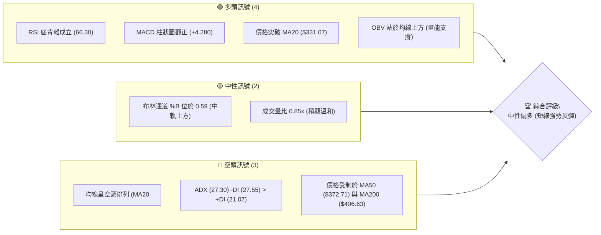
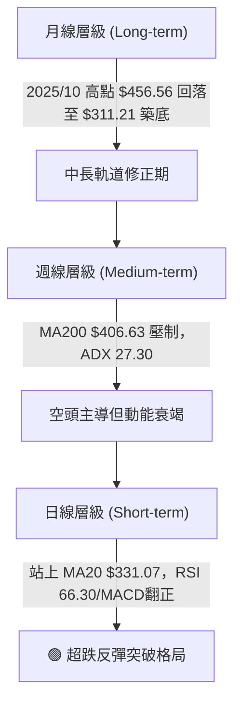
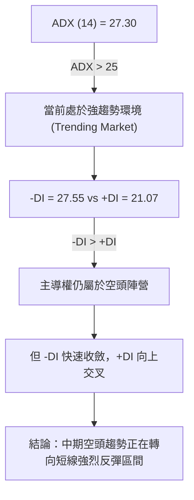
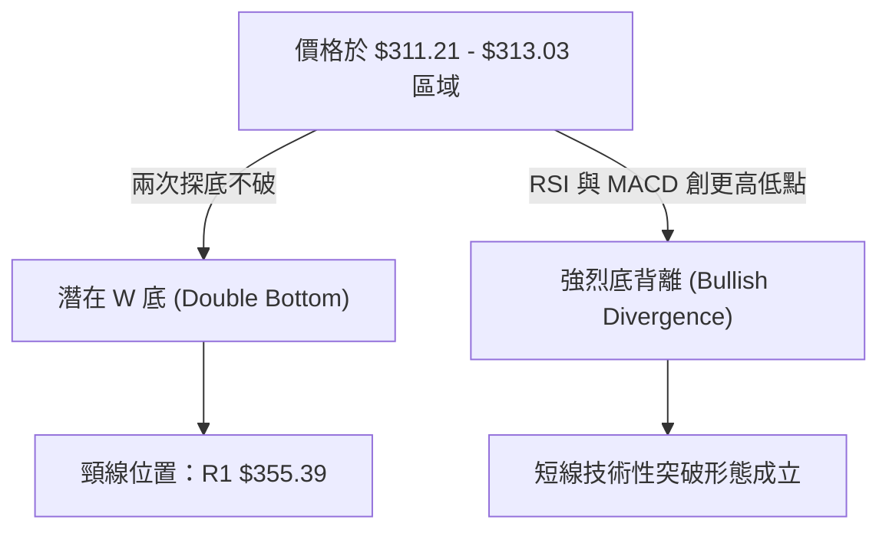
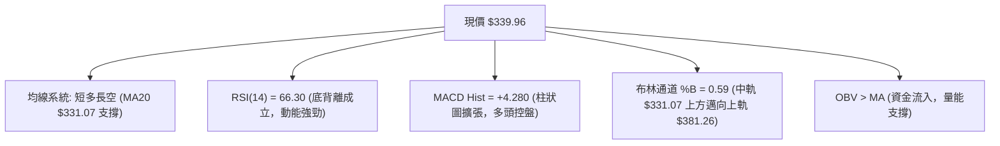
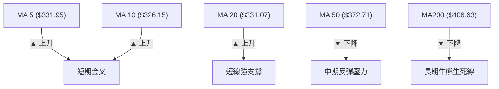
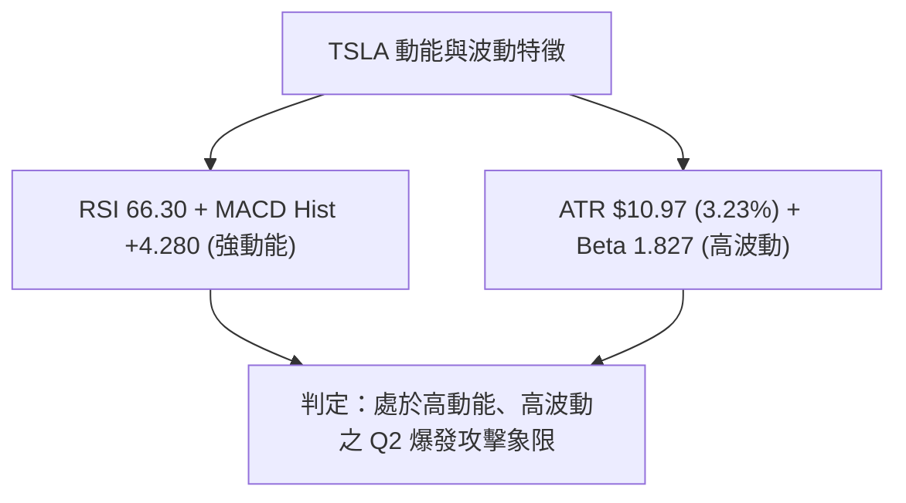
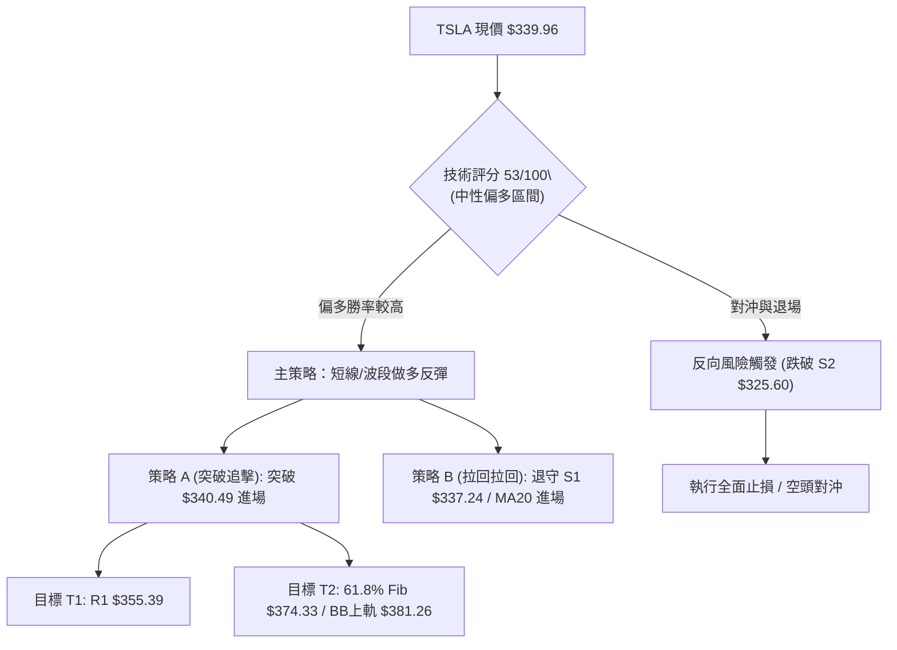
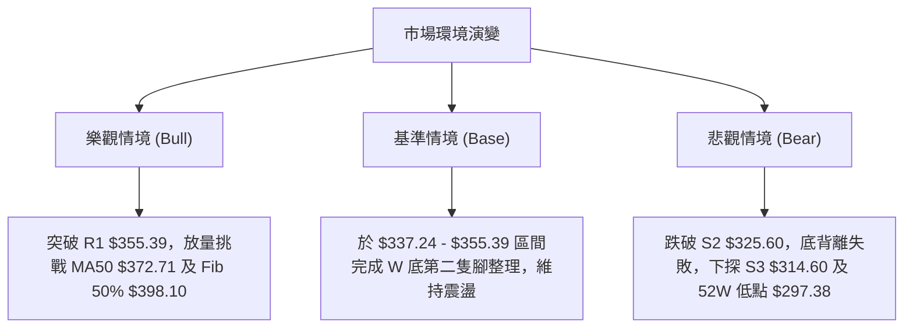

# TSLA 技術分析報告

> **報告日期**：2026-08-13 ｜ **語言**：繁體中文 ｜ **數據來源**：Yahoo Finance ｜ **當前價格**：$339.96

---

## 目錄

| 章節 | 內容 |
|------|------|
| [1. 技術面概覽](#1-技術面概覽) | 訊號儀表板、核心指標、評分卡 |
| [2. 趨勢分析](#2-趨勢分析) | 多時框趨勢、長中短期走勢 |
| [3. 圖表形態分析](#3-圖表形態分析) | 形態識別、K線組合、目標價 |
| [4. 支撐與阻力](#4-支撐與阻力) | 關鍵價位、斐波那契回調 |
| [5. 技術指標深度解讀](#5-技術指標深度解讀) | MA/RSI/MACD/布林/成交量 |
| [6. 動能與波動率](#6-動能與波動率) | 動能評估、ATR、Beta |
| [7. 多時框架總結](#7-多時框架總結) | 時框架評分矩陣 |
| [8. 交易策略建議](#8-交易策略建議) | 多空策略、風險報酬比 |
| [9. 風險提示與監控](#9-風險提示與監控) | 監控指標、風險場景 |

---

## 1. 技術面概覽

### 🎯 技術訊號儀表板



---

### 📊 核心指標速覽表

| 指標類別 | 指標名稱 | 當前數值 | 訊號 | 解讀 |
|----------|----------|----------|------|------|
| **價格** | 當前收盤價 | $339.96 | 🟡 中性 | 52週區間百分位 21.1%，於高檔回撤後築底反彈 |
| **均線** | MA20 | $331.07 | 🟢 看多 | 現價位於 MA20 上方 (+2.69%)，短期均線向上穿透 |
| **均線** | MA50 | $372.71 | 🔴 看空 | 現價位於 MA50 下方 (-8.79%)，中期趨勢承壓 |
| **均線** | MA200 | $406.63 | 🔴 看空 | 現價位於 MA200 下方 (-16.39%)，長期空頭排列 |
| **動能** | RSI(14) | 66.30 | 🟢 看多 | 強勢反彈區間，且日線/週線呈顯著底背離 |
| **動能** | MACD(12,26,9) | -13.285 / Hist +4.280 | 🟢 看多 | DIF 向上穿過 Signal，柱狀圖連續擴大，多頭控盤 |
| **趨勢** | ADX(14) | 27.30 (-DI: 27.55 / +DI: 21.07) | 🟡 中性 | 強趨勢 regime，但空頭動能衰退，+DI 開始向上鉤 |
| **波動** | ATR(14) | $10.97 (3.23%) | 🟡 中性 | 每日波幅適中，提供良好的波段操作空間 |
| **通道** | 布林通道 | 上軌 $381.26 / 下軌 $280.88 | 🟢 看多 | 價格自下軌強勢拉回中軌 ($331.07) 之上，向頂軌推進 |

---

### 🏆 技術評分卡

```
╔══════════════════════════════════════════════════════════════════╗
║                TSLA 技術評分卡 (2026-08-13)                      ║
╠══════════════════════════════════════════════════════════════════╣
║ 趨勢強度 (ADX/DI)   ██████████░░░░░░░░░░  50/100 🟡 (空頭趨勢趨緩) ║
║ 動能指標 (RSI/MACD) ██████████████░░░░░░  70/100 🟢 (底背離強反彈) ║
║ 支撐穩定度 (S1/S2)  ████████████░░░░░░░░  60/100 🟢 (311築底成功)  ║
║ 成交量配合 (OBV/Vol)████████████░░░░░░░░  60/100 🟢 (OBV呈多頭支撐)║
║ 形態完整度 (雙底)   ██████████░░░░░░░░░░  50/100 🟡 (頸線挑戰中)   ║
║ 均線排列 (MA5-200)  ██████░░░░░░░░░░░░░░  30/100 🔴 (長均線仍壓制) ║
╠══════════════════════════════════════════════════════════════════╣
║ 綜合評分            ███████████░░░░░░░░░  53/100 🟡 (中性偏多反彈) ║
╚══════════════════════════════════════════════════════════════════╝
```

---

## 2. 趨勢分析

### 🌐 多時框趨勢分析



---

### 📈 長期趨勢 — 24個月走勢圖（ASCII）

```
TSLA 24個月歷史價格走勢圖 ($)
$500 ┤                                      ● (52W High $498.83)
$450 ┤                          ●    ●  ●
$400 ┤             ●  ●                  ●
$350 ┤        ●          ●                   ●      ● (現價 $339.96)
$300 ┤                   ●  ●                   ●  ●
$250 ┤    ●  ●
$200 ┤●
     └┬──┬──┬──┬──┬──┬──┬──┬──┬──┬──┬──┬──┬──┬──┬──┬──┬──┬──┬──┬──┬──┬──┬──┬
      08 09 10 11 12 01 02 03 04 05 06 07 08 09 10 11 12 01 02 03 04 05 06 07 08
      2024                                2025                                2026
```

#### 走勢特徵分析表

| 階段 | 時間區間 | 價格變動 | 幅度 | 走勢特徵與技術驅動因子 |
|------|----------|----------|------|------------------------|
| **起漲段** | 2024-08 ~ 2025-01 | $214.11 → $404.60 | +88.96% | 強勢突破均線，伴隨成交量放大，創下階段新高 |
| **深幅修正** | 2025-01 ~ 2025-03 | $404.60 → $259.16 | -35.95% | 獲利了結賣壓湧現，向下尋求 52 週支撐 |
| **二次攻頂** | 2025-03 ~ 2025-10 | $259.16 → $456.56 | +76.17% | 形成牛市主升段，於 2025 年 10 月達到近兩年高點區域 |
| **回檔整理** | 2025-10 ~ 2026-07 | $456.56 → $311.21 | -31.84% | 高檔頂背離後轉入下降通道，於 2026 年 7 月打底 $311.21 |
| **近期反彈** | 2026-07 ~ 2026-08 | $311.21 → $339.96 | +9.24% | 日線與週線展現底背離，迅速站回 MA20 ($331.07) |

---

### 📊 中期趨勢（週線分析）

近 20 週收盤走勢顯示，價格自 2026 年 5 月高點 $435.79 震盪下行，至 2026 年 7 月 26 日落至低點 $313.03（月度低點 $311.21），此時 RSI 降至極端超賣區 15.7。

隨著賣壓竭盡，隨後三週（08-02 至 08-16）收盤價呈梯級抬升（$311.21 → $328.58 → $339.96），週 MACD 柱狀圖由 -8.365 強烈翻正至 +4.280，確認中期底部型態初步築成。

---

### ⚡ 趨勢強度評估（ADX 解讀）



| 指標元素 | 當前數值 | 狀態評估 | 交易意涵 |
|----------|----------|----------|----------|
| **ADX (14)** | 27.30 | 強趨勢 (>25) | 市場具備明確方向性，非單純無序盤整 |
| **+DI (14)** | 21.07 | 低檔勾升 | 買盤動能開始注入 |
| **-DI (14)** | 27.55 | 高檔回落 | 賣壓顯著減弱 |
| **DI 差值** | -6.48 | 正在收斂 | 若 +DI 向上金叉 -DI，將確認中線趨勢反轉 |

---

## 3. 圖表形態分析

### 🔍 形態識別系統



#### 形態信心度與目標價評估

| 形態名稱 | 信心度 | 判斷依據（引用數據） | 完成度 | 目標價計算式與精確數值 |
|----------|--------|----------------------|--------|------------------------|
| **雙重底 (W底)** | 65% | 在 $311.21 與 $313.03 形成雙腳，RSI 自 15.7 底背離彈升 | 70% | 頸線 $355.39 + (頸線 $355.39 - 底部 $311.21) = **$399.57** (接近 50% 斐波位 $398.10) |
| **RSI/MACD 底背離** | 85% | 2026-07-26 價格跌至 $313.03 時 RSI 僅 15.7，2026-08-16 價格 $339.96 時 RSI 強彈至 66.30 | 100% | 驅動價格回測 MA50 區域 **$372.71** |
| **均線黃金交叉 (MA5/MA10/MA20)** | 80% | MA5 ($331.95) 與 MA10 ($326.15) 雙雙向上穿過 MA20 ($331.07) | 90% | 第一阻力目標 **$355.39** (R1) |

---

### 🕯️ 重要 K 線形態分析

| 日期/週別 | 收盤價 | K 線形態 | 解讀 | 訊號 |
|-----------|--------|----------|------|------|
| **2026-07-26** | $313.03 | 長陰摔落 | 恐慌性拋售，RSI 進入極端超賣 (15.7)，空頭能量一次性宣洩 | 🔴 極度悲觀 |
| **2026-08-02** | $311.21 | 鐵錘線/長下影線 | 探底 52 週支撐附近引發強烈買盤落實，形成波段絕對低點 | 🟢 轉折訊號 |
| **2026-08-09** | $328.58 | 中陽線覆蓋 | 量縮反彈站回 $325.60 (S2) 上方，底部型態獲得初步確認 | 🟢 多頭反擊 |
| **2026-08-16** | $339.96 | 強勢光腳陽線 | 實體收於當週高檔，站穩 MA20 ($331.07)，確認底背離反彈進行中 | 🟢 多頭主導 |

---

### 📉 ASCII 走勢形態示意圖

```
TSLA 雙底與底背離反彈示意圖
====================================================================
$381.26 ┤                                            [BB Upper / R1 附近]
$355.39 ┤------------------------------------ (頸線 Resistance R1)
        │                                    /
$339.96 ┤------------------------------●---/   ◄ (現價突破 MA20 $331.07)
        │                             / \ /
$325.60 ┤-------------●--------------/   ●     (Support S2)
        │            / \            /
$311.21 ┤---●-------/   \----------●           (底腳1: $313.03 / 底腳2: $311.21)
====================================================================
RSI 指標 ┤  15.7 ------------------- 66.3      (顯著底背離：價格平底，RSI 大幅抬升)
```

---

## 4. 支撐與阻力

### 🗺️ 關鍵價位分布圖（Unicode）

```
TSLA 價位結構分布圖
══════════════════════════════════════════════════════════════════
$498.83 ║████████████████████████████████████████║ 52週高點 (0.0% Fib)
$418.36 ║██████████████████████████████          ║ 強阻力 R3
$409.28 ║█████████████████████████               ║ 阻力 R2 / MA200 ($406.63)
$398.10 ║██████████████████████                  ║ 50.0% 斐波那契回調位
$374.33 ║█████████████████                       ║ 61.8% 斐波那契回調位 / MA50 ($372.71)
$355.39 ║█████████████                           ║ 關鍵阻力 R1 (頸線位置)
$340.49 ║▓▓▓▓▓▓▓▓▓▓▓                             ║ 78.6% 斐波那契回調位
$339.96 ╠════════════════════════════════════════╣ ◄ 現價
$337.24 ║▓▓▓▓▓▓▓▓▓▓                              ║ 近期第一支撐 S1 (MA20 $331.07)
$325.60 ║████████                                ║ 關鍵支撐 S2
$314.60 ║██████                                  ║ 強支撐 S3 (波段低點 $311.21)
$297.38 ║████                                    ║ 52週低點 (100.0% Fib)
══════════════════════════════════════════════════════════════════
```

---

### 🚧 阻力位分析表

| 阻力級別 | 精確價位 | 形成原因 | 突破難度 | 技術重要性 |
|----------|----------|----------|----------|------------|
| **阻力 R1** | **$355.39** | 近一年波段高點聚類與 W 底頸線區 | 🟡 中等 | 短線多空分水嶺，突破則確立目標挑戰 $380-$400 |
| **阻力 R2** | **$409.28** | 波段密集成交區，且與 MA200 ($406.63) 沉降重合 | 🔴 極高 | 長期牛熊轉換關卡，需強大成交量配合方能穿越 |
| **阻力 R3** | **$418.36** | 52 週回撤 38.2% 斐波位 ($421.88) 附近之密集成交頂部 | 🔴 極高 | 中期賣壓重災區，強阻力牆 |

---

### 🛡️ 支撐位分析表

| 支撐級別 | 精確價位 | 形成原因 | 守住機率 | 技術重要性 |
|----------|----------|----------|----------|------------|
| **支撐 S1** | **$337.24** | 近期波段低點聚類，緊鄰 MA20 ($331.07) 與 78.6% 斐波位 ($340.49) | 🟢 高 (75%) | 多頭短線防線，守住則維持向上攻擊動能 |
| **支撐 S2** | **$325.60** | 波段起漲密集區，與 MA10 ($326.15) 重合 | 🟢 高 (80%) | 中期多頭防禦底線，跌破則反彈格局瓦解 |
| **支撐 S3** | **$314.60** | 近一年雙重底腳聚類（2026-07 / 08 低點 $311.21-$313.03） | 🟢 極高 (90%) | 52 週強支撐防線（接近 52W Low $297.38） |

---

### 📐 斐波那契回調位分析

（基於 52 週區間 $297.38 → $498.83 計算）：

```
0.0%   (52W High) : $498.83
23.6%             : $451.29
38.2%             : $421.88
50.0%             : $398.10  ◄ W 底測算目標區
61.8%             : $374.33  ◄ 重合 MA50 ($372.71)
78.6%             : $340.49  ◄ 現價 ($339.96) 盤整交會點
100.0% (52W Low)  : $297.38
```

*   **當前位置解讀**：現價 $339.96 正好卡在 **78.6% 斐波那契回調位 ($340.49)** 關鍵樞軸點下方 53 美分處。此處為黃金分割黃金支撐/阻力轉換區，一旦多頭日線實體突破並收於 $340.49 之上，將開啟順暢通道直指 61.8% 斐波位 **$374.33**。

---

## 5. 技術指標深度解讀

### 🎛️ 指標訊號總覽



---

### 📈 移動平均線排列分析



*   **均線狀態說明**：目前均線整體呈現 **MA20 ($331.07) < MA50 ($372.71) < MA200 ($406.63)** 之空頭排列，但短天期均線 MA5 ($331.95) 與 MA10 ($326.15) 已率先勾頭向上金叉 MA20，帶動價格重回 MA20 之上。這屬於標準的「長期空頭格局下的強烈短線反彈」。

---

### 📉 RSI(14) 分析

*   **當前數值**：66.30
*   **強度進度條**：`███████████████░░░░░ 66.3/100` （多頭強勢區）

```
RSI (14) 狀態評估：
[ 0 -------- 30 超賣 ----- 50 中性 ----- 70 超買 -------- 100 ]
                                     ▲ (66.30)
```

*   **背離判定**：**極為明確的日/週線底背離 (Bullish Divergence)**。價格於 7 月下旬打出低點 $311.21 時，RSI 創下 15.7 之極端低點；隨後價格二次探底，RSI 卻大幅抬高至 34.9 並一路衝上 66.30，展現底背離帶來的強烈回補買盤。

---

### 📊 MACD(12,26,9) 訊號解讀

*   **DIF (MACD 線)**: -13.285
*   **DEA (Signal 線)**: -17.565
*   **MACD Histogram**: **+4.280** 🟢

```
MACD 柱狀圖趨勢 (最近4週):
2026-07-26 : -8.365  ████████ (空頭極致)
2026-08-02 : -6.930  ███████
2026-08-09 : +1.025  █        (黃金交叉翻正)
2026-08-16 : +4.280  ████     (多頭動能加速)
```

*   DIF 於零軸下方向上突破 DEA 完成黃金交叉，柱狀圖連續兩週擴張至 +4.280，顯示空頭循環告一段落，多頭完全主導目前的波段反彈。

---

### 📦 布林通道分析

```
TSLA 布林通道示意圖
====================================================================
$381.26 ┤-------------------------------------- 布林上軌 (Upper Band)
        │                                    /
        │                                  ●  (現價 $339.96，向頂軌發動攻勢)
$331.07 ┤--------------------------------●---- 布林中軌 (MA20)
        │                              /
$280.88 ┤----------------------------●-------- 布林下軌 (Lower Band)
====================================================================
```

*   **%B 指標**：0.59 （0 = 下軌，0.5 = 中軌，1.0 = 上軌）
*   **通道狀態**：價格精準在下軌 $280.88 與 52 週低點 $297.38 前獲得強烈支撐，隨後強勢突破中軌 $331.07。當前 %B 0.59 代表價格正式站穩中軌向上發散，上方通道打開，目標直指上軌 **$381.26**。

---

### 💹 成交量與 OBV 分析

*   **當前成交量**：33,336,616 股
*   **20日均量**：39,060,541 股 （量比：0.85x）
*   **OBV 狀態**：OBV > MA （OBV 能量潮線已突破其移動平均線）
*   **解讀**：雖然單日成交量（3,333 萬股）略低於 20 日均量（0.85x），但觀察 OBV 趨勢，資金呈淨流入態勢，且週成交量在 $311-$313 底部區域曾爆出 2.75 億股大量換手，確認底部主力吸籌完畢。

---

## 6. 動能與波動率

### ⚡ 動能評估四象限

| 象限分區 | 動能 (Momentum) | 波動率 (Volatility) | TSLA 當前位置與評估 |
|----------|-----------------|---------------------|--------------------|
| **Q1 (高動能/低波動)** | 強 | 低 | 穩定趨勢續漲期 |
| **Q2 (高動能/高波動)** | **強** | **高** | **✓ TSLA 當前狀態：反彈爆發期 (RSI 66.30 / ATR $10.97)** |
| **Q3 (低動能/高波動)** | 弱 | 高 | 洗盤震盪 / 破位下跌期 |
| **Q4 (低動能/低波動)** | 弱 | 低 | 沉悶築底期 |



---

### 📊 ATR 波動率與風控設置

*   **ATR (14)**：**$10.97** （佔股價比例 3.23%）
*   **止損距離建議**：
    *   **緊密止損 (1.0x ATR)**：$10.97 → 進場價下移 $11.00
    *   **標準止損 (1.5x ATR)**：$16.46 → 進場價下移 $16.50
    *   **寬鬆波段止損 (2.0x ATR)**：$21.94 → 設於 S2 支撐 **$325.60** 下方

---

### 📐 Beta 與市場相關性

*   **Beta 係數**：**1.827** （高高波動度）
*   **說明**：TSLA 的波動幅度約為大盤 (S&P 500) 的 1.83 倍。在美股整體情緒偏多時，TSLA 具備強烈的向上彈性與溢價表現。

---

## 7. 多時框架總結

### 📋 時框架評分表

| 時框架 | 趨勢方向 | 動能指標 | 均線排列 | 形態結構 | 綜合評分 | 交易建議 |
|--------|----------|----------|----------|----------|----------|----------|
| **日線 (Daily)** | 🟢 看多 | 🟢 強勢 (66.3) | 🟡 短期金叉 | W 底築底完成 | **72/100** | 偏多操作 / 順勢追擊 |
| **週線 (Weekly)** | 🟡 中性 | 🟢 柱狀圖翻正 | 🔴 空頭壓制 | 底背離反彈 | **55/100** | 波段反彈 / 逢低布局 |
| **月線 (Monthly)** | 🔴 看空 | 🟡 超賣回升 | 🔴 空頭排列 | 長期高位回落 | **38/100** | 長線觀望 / 留意壓力 |

---

### 🔲 綜合訊號矩陣

```
╔══════════════════════════════════════════════════════════════════╗
║                   多時框架訊號收斂矩陣                           ║
╠═════════════════════╤═════════════════════╤══════════════════════╣
║ 時框架               │ 訊號方向            │ 核心驅動/關鍵關卡    ║
╠═════════════════════┼═════════════════════┼══════════════════════╣
║ 長期 (月線)          │ 🔴 偏空承壓         │ MA200 $406.63 壓制   ║
║ 中期 (週線)          │ 🟡 底背離打底       │ S2 $325.60 為強防線  ║
║ 短期 (日線)          │ 🟢 強勢反彈         │ 站穩 MA20 $331.07    ║
╚═════════════════════╧═════════════════════╧══════════════════════╝
```

---

### ⚖️ 多時框收斂結論

依據多時框收斂規則（規則 14）：
1. **趨勢 Regime 判斷**：ADX(14) 為 27.30 (> 25)，確認當前處於強趨勢環境。
2. **主導方向收斂**：雖然中長期均線（MA50 $372.71、MA200 $406.63）仍呈現空頭排列，但日線與週線層級展現了**極高可信度的 RSI/MACD 雙重底背離**，且價格已突破日線布林中軌與 MA20 ($331.07)。
3. **最終收斂結論**：**「中線下跌趨勢暫緩，短線強烈反彈主導」**。因此，第 8 章交易策略將以**偏多（反彈突破）策略**為主推，同時以 Resistance R1 ($355.39) 與 MA50 ($372.71) 作為階段性目標與風控對沖轉折點。

---

## 8. 交易策略建議

### 🗺️ 策略決策流程圖



---

### 🧭 策略路由

*   **當前主策略方向**：**🟢 短中線反彈做多策略（綜合評分 53/100）**
*   **路由理由**：日線與週線底背離訊號極為明確，價格成功站上 MA20 ($331.07)，且 MACD 柱狀圖翻正。短線多頭掌控發球權，向上回補缺口並挑戰 R1 ($355.39) 為高機率事件。

---

### 🎯 價格情境階梯 (Price Scenarios)

| 觸發條件 | 下一目標價 | 後續延伸目標 | 情境技術含義 |
|----------|------------|--------------|--------------|
| **突破 R1 $355.39** | **$374.33** (61.8% Fib) | **$398.10** (50% Fib) | 突破 W 底頸線，開啟主升反彈段，挑戰 MA50 |
| **站穩現價區間 ($337-$340)** | **$355.39** (R1) | **$381.26** (BB 上軌) | 循布林通道向上軌推進，屬於溫和震盪趨堅 |
| **跌破 S1 $337.24** | **$325.60** (S2) | **$314.60** (S3) | 短線回檔測試 MA10/MA20 支撐帶 |
| **跌破 S2 $325.60** | **$314.60** (S3) | **$297.38** (52W Low) | 底背離結構失效，重新下尋 52 週低點 |

---

### 📊 情境機率分佈

```
[ 情境1: 繼續上行/挑戰 R1及MA50 ] ███████████████████████████ 55%
[ 情境2: 於 $325.60 - $355.39 區間震盪 ] ███████████████ 30%
[ 情境3: 假突破後跌破 S2 再探底 ] ███████ 15%
```

| 情境 | 機率 | 主要依據 |
|------|------|----------|
| **1. 繼續上行 / 挑戰 R1** | **55%** | RSI 66.30 尚未超買，MACD 柱狀圖 +4.280 加速，OBV 呈資金流入 |
| **2. 區間震盪整理** | **30%** | 20 日成交量比僅 0.85x，上檔受制於 $355.39 厚重解套賣壓 |
| **3. 回落再探底** | **15%** | 全球車企宏觀環境風險，或大盤整體出現劇烈拉回 |

---

### 🟢 主策略詳情

| 策略要素 | 策略 A（右側突破追擊） | 策略 B（左側拉回低吸） |
|----------|------------------------|------------------------|
| **進場條件** | 日線收盤突破 78.6% 斐波位 **$340.49** | 價格順利回檔至支撐 **S1 $337.24** 附近 |
| **進場價格** | **$340.50** | **$337.50** |
| **目標價 T1** | **$355.39** (阻力 R1 / +4.37%) | **$355.39** (阻力 R1 / +5.30%) |
| **目標價 T2** | **$374.33** (61.8% 斐波位 / +9.94%) | **$372.71** (MA50 壓力 / +10.43%) |
| **止損價格** | **$325.60** (支撐 S2 / -4.38%) | **$325.60** (支撐 S2 / -3.53%) |
| **風險報酬比** | **2.27 : 1** (以 T2 計算) | **2.96 : 1** (以 T2 計算) |
| **估計成功率** | **60%** | **55%** |
| **建議倉位** | **15% - 20%** 總資產 | **10% - 15%** 總資產 |

---

### 🔴 反向風險觸發點（對沖與止損提示）

*   **關鍵無效價位**：**$325.60 (支撐 S2)**
*   **對沖處置**：若價格不升反降，收盤價跌破 $325.60，意味著短線均線 (MA5/MA10/MA20) 重新失守，底背離動能耗盡。此時多頭策略應**立即執行無條件止損**，亦可建立適度 Delta 負向期權對沖，目標看至 S3 ($314.60) 及 52 週低點 ($297.38)。

---

### ⭐ 整體訊號強度評星

```
做多訊號強度： ★★★★☆  (4.0/5星) — 底背離結構完整，均線短金叉
做空訊號強度： ★★☆☆☆  (2.0/5星) — 空頭動能衰退，MACD翻正
整體可信度：   ★★██☆  (4.0/5星) — 多指標互相確認
```

---

## 9. 風險提示與監控

### ✅ 關鍵監控指標 Checklist

```
╔══════════════════════════════════════════════════════════════════╗
║                   TSLA 每日關鍵技術監控清單                      ║
╠══════════════════════════════════════════════════════════════════╣
║ [ ] MA20 支撐效力：價格是否持續穩居 $331.07 之上？              ║
║ [ ] 頸線突破狀態：價格能否放量攻克 Resistance R1 ($355.39)？    ║
║ [ ] MACD 柱狀圖：Hist 是否保持在零軸上方並持續擴大 (> +4.280)？ ║
║ [ ] RSI(14) 狀態：進入 70 超買區時是否出現高檔頂背離？           ║
║ [ ] 成交量比：攻擊 R1 時成交量能否放大至 4,000 萬股以上 (1.0x+)？║
╚══════════════════════════════════════════════════════════════════╝
```

---

### ⚠️ 風險場景分析



---

### 🛡️ 風險管理重要提醒

1.  **高 Beta 風險控制**：TSLA 歷史 Beta 高達 1.827，每日 ATR 為 $10.97（波幅 3.23%）。極高波動度意味著倉位不宜過度槓桿化，單一交易策略之總虧損風險應控制在總資金的 **1% - 2%** 以內。
2.  **均線系統壓制**：請時刻記住，中長期均線（MA50 $372.71、MA200 $406.63）依然呈現下傾態勢。因此，本次多頭波段應定位為**強烈技術性反彈**，接近 MA50 與 R2 ($409.28) 區域時應分批獲利了結，切忌盲目長期死守。

---

## 📋 報告總結

```
╔══════════════════════════════════════════════════════════════════╗
║                     TSLA 技術分析總結卡                         ║
╠══════════════════════════════════════════════════════════════════╣
║ 報告日期：2026-08-13                                             ║
║ 當前價格：$339.96                                                ║
║ 綜合評級：⚖️ 中性偏多 (短線強勢底背離反彈)                      ║
║                                                                  ║
║ 關鍵技術結語：                                                   ║
║ ├─ 長期趨勢：🔴 下降通道 (受制於 MA200 $406.63)                  ║
║ ├─ 中期趨勢：🟡 築底打底 (周線 MACD 翻正，於 $311-$313 築雙底)   ║
║ ├─ 短期趨勢：🟢 強勢反彈 (站上 MA20 $331.07，RSI 66.30 底背離)   ║
║ ├─ 關鍵支撐：S1 $337.24 / S2 $325.60                             ║
║ ├─ 關鍵阻力：R1 $355.39 / R2 $409.28                             ║
║ └─ 分析師目標均價：$396.62 (空間約 +16.67%)                      ║
║                                                                  ║
║ 最優交易路線：                                                   ║
║ 1. 🥇 首選策略：站穩 $340.49 或回測 $337.24 偏多操作，           ║
║               目標 T1 $355.39、T2 $374.33，嚴格止損 $325.60。    ║
║ 2. 🥈 防禦預案：若失守 $325.60 則宣告反彈結束，及時止損出場。    ║
╚══════════════════════════════════════════════════════════════════╝
```

---

> ⚠️ **免責聲明**：本報告為 AI 自動生成之技術分析，所有數據及估算均基於提供的歷史價格資訊。本報告**僅供研究與學術參考**，**不構成任何投資建議**。投資有風險，入市需謹慎。

---

*報告生成時間：2026-08-13 ｜ 數據來源：Yahoo Finance ｜ 分析框架：多時框技術分析*