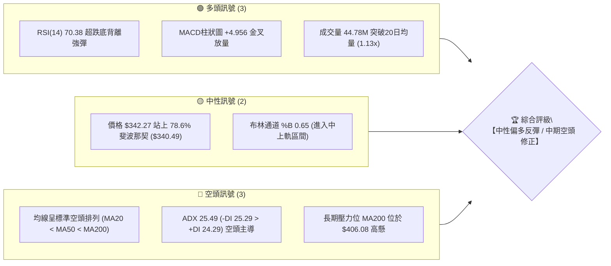
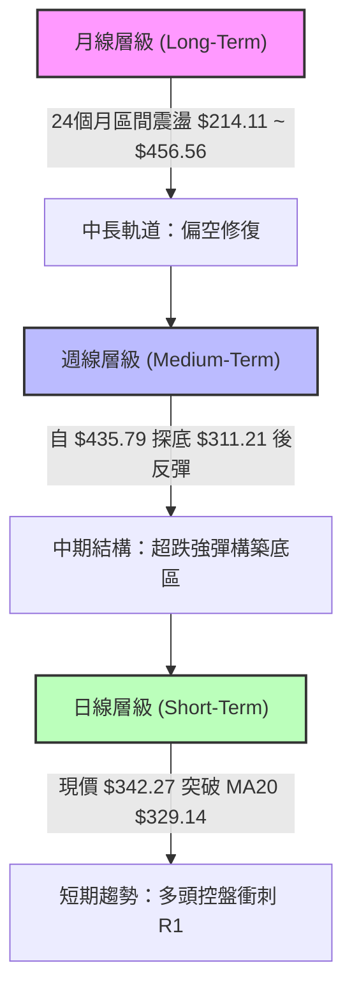
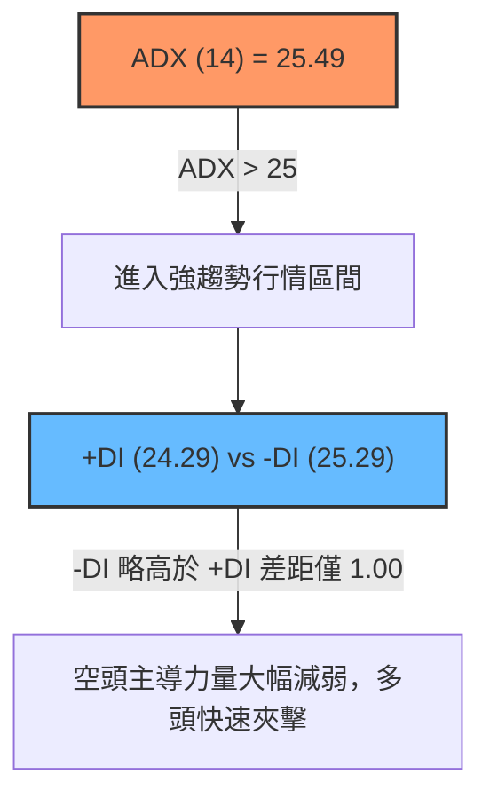
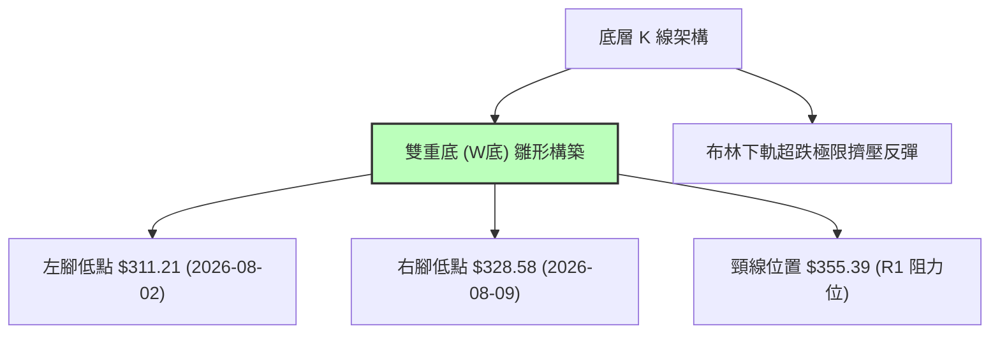
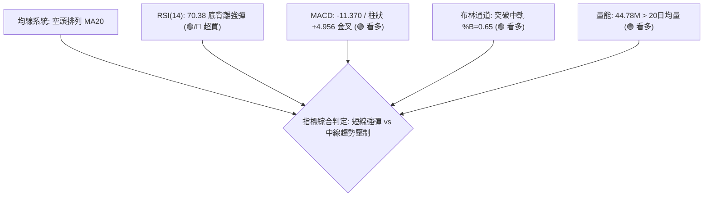
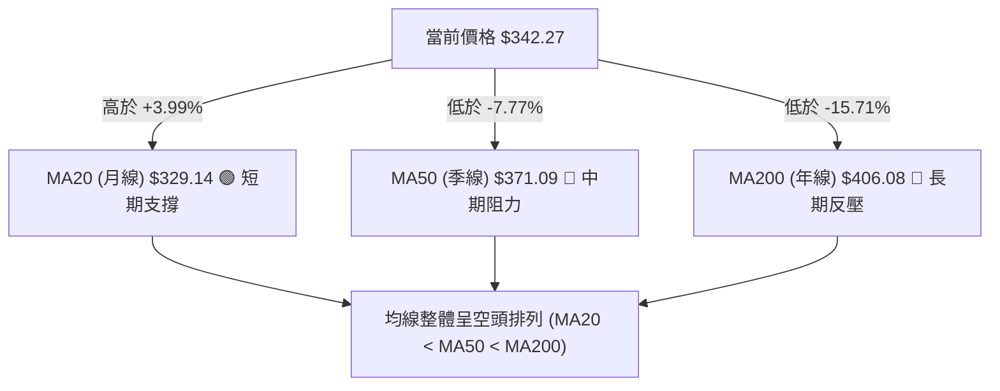
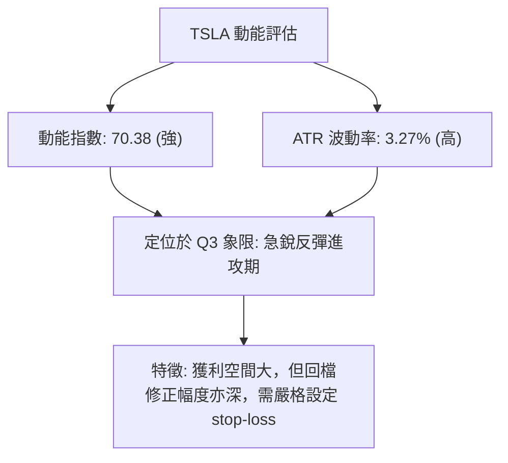
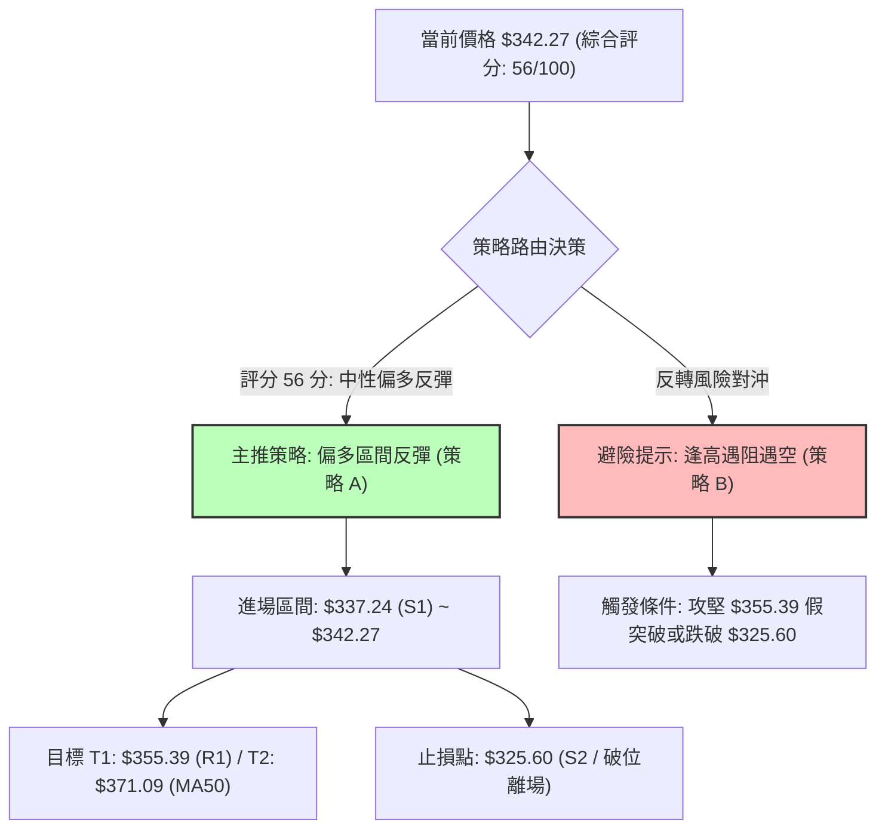
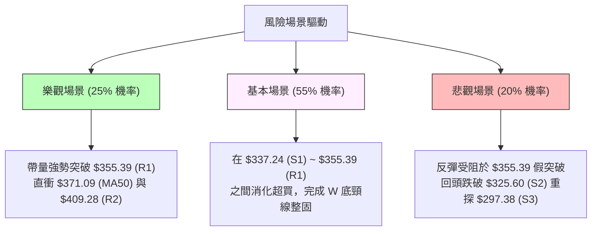

# TSLA 技術分析報告

> **報告日期**：2026-08-14 ｜ **語言**：繁體中文 ｜ **數據來源**：Yahoo Finance ｜ **當前價格**：$342.27

---

## 目錄

| 章節 | 內容 |
|------|------|
| [1. 技術面概覽](#1-技術面概覽) | 訊號儀表板、核心指標、評分卡 |
| [2. 趨勢分析](#2-趨勢分析) | 多時框趨勢、長中短期走勢、ADX強弱 |
| [3. 圖表形態分析](#3-圖表形態分析) | 形態識別、K線組合、目標價推算 |
| [4. 支撐與阻力](#4-支撐與阻力) | 關鍵價位、斐波那契回調結構 |
| [5. 技術指標深度解讀](#5-技術指標深度解讀) | MA/RSI/MACD/布林通道/量能OBV |
| [6. 動能與波動率](#6-動能與波動率) | 動能四象限、ATR風險距、Beta |
| [7. 多時框架總結](#7-多時框架總結) | 時框架評分矩陣、收斂結論 |
| [8. 交易策略建議](#8-交易策略建議) | 策略路由、價位階梯、風報比精算 |
| [9. 風險提示與監控](#9-風險提示與監控) | 關鍵監控清單、三情境風險場景 |

---

## 1. 技術面概覽

### 🎯 技術訊號儀表板



### 📊 核心指標速覽表

| 指標類別 | 指標名稱 | 當前數值 | 訊號 | 解讀 |
|----------|----------|----------|------|------|
| **價格** | 當前收盤價 | $342.27 | 🟡 中性反彈 | 站上 78.6% 斐波那契位 ($340.49)，短線強勁反彈 |
| **均線** | MA20 (月線) | $329.14 | 🟢 看多 | 價格已站上 MA20 (高出 +3.99%)，短線轉強 |
| **均線** | MA50 (季線) | $371.09 | 🔴 看空 | 價格位於 MA50 下方 (-7.77%)，中期承壓 |
| **均線** | MA200 (年線)| $406.08 | 🔴 看空 | 價格位於 MA200 下方 (-15.71%)，長期趨勢偏空 |
| **動能** | RSI(14) | 70.38 | 🔴 超買/🟢背離| 短期進入超買區，但先前形成顯著底背離訊號 |
| **動能** | MACD (12,26,9) | -11.370 (柱狀+4.956) | 🟢 看多 | DIF上穿DEA形成水下金叉，多頭動能修復中 |
| **動能** | Stoch %K / %D | 83.31 / 85.71 | 🔴 超買 | 隨機指標進入高位鈍化，需防範過熱拉回 |
| **趨勢** | ADX(14) | 25.49 (+DI 24.29/-DI 25.29) | 🟡 趨勢臨界 | ADX > 25 具趨勢強度，-DI 略高於 +DI 但差距收窄 |
| **波動** | ATR(14) | $11.20 (3.27%) | 🟡 中度波動 | 每日平均波動範圍約 $11.20，提供止損設定依據 |
| **通道** | 布林通道 | 上軌 $373.95 / 下軌 $284.33 | 🟢 中軌突破 | 站上中軌 $329.14，目標挑戰上軌 $373.95 |
| **量能** | OBV / 成交量| 44.78M (均量 39.79M) | 🟢 量價配合 | OBV高於MA，成交量放大至 1.13 倍，資金注入 |

### 🏆 技術評分卡

```
╔══════════════════════════════════════════════════════════════════╗
║              TSLA 技術評分卡  —  2026-08-14                      ║
╠══════════════════════════════════════════════════════════════════╣
║ 趨勢強度 (Trend)    ▓▓▓▓▓▓▓▓▓▓▓▓░░░░░░░░  55/100  🟡 中性震盪 ║
║ 動能指標 (Momentum) ▓▓▓▓▓▓▓▓▓▓▓▓▓▓░░░░░░  70/100  🟢 動能強勁 ║
║ 支撐穩定度 (Support) ▓▓▓▓▓▓▓▓▓▓▓▓▓░░░░░░░  65/100  🟢 築底成功 ║
║ 成交量配合 (Volume)  ▓▓▓▓▓▓▓▓▓▓▓▓▓░░░░░░░  65/100  🟢 放量反彈 ║
║ 形態完整度 (Pattern) ▓▓▓▓▓▓▓▓▓▓░░░░░░░░░░  50/100  🟡 形態建構 ║
║ 均線排列 (MA System) ▓▓▓▓▓▓░░░░░░░░░░░░░░  30/100  🔴 空頭排列 ║
╠══════════════════════════════════════════════════════════════════╣
║ 綜合技術評分        ▓▓▓▓▓▓▓▓▓▓▓░░░░░░░░░  56/100  🟡 中性偏多 ║
╚══════════════════════════════════════════════════════════════════╝
```

---

## 2. 趨勢分析

### 🌐 多時框趨勢分析



### 📈 長期趨勢 — 12個月走勢圖（Unicode）

```
TSLA 月線歷史走勢圖 (2025-08 至 2026-08)
價格軸 ($)
$460 ┤                        ●(高點 $456.56)
$440 ┤                  ●  ●  │     ●  ●
$420 ┤                  │  │  │     │  │  ●
$400 ┤                  │  │  ●  ●  │  │  │
$380 ┤                                 │  │
$360 ┤            ●                    │  │
$340 ┤      ●     │                       │  ●←現在 ($342.27)
$320 ┤            │  ●                 │  │  │
$300 ┤                                 ●  ●(低點 $311.21)
     └─────────────────────────────────────────────
       08 09 10 11 12 01 02 03 04 05 06 07 08 (月)
```

#### 走勢特徵分析表格

| 階段歷史 | 時間區間 | 收盤價區間 | 漲跌幅 | 走勢特徵與驅動因素分析 |
|----------|----------|------------|--------|------------------------|
| **高位震盪期** | 2025/09 - 2026/01 | $430.17 - $456.56 | +2.7% | 股價於 $450 高位築頂，受阻於 52週高點 $498.83 |
| **波段拉回期** | 2026/01 - 2026/03 | $430.41 → $371.75 | -13.6% | 高估值修正，跌破季線 MA50，空頭氣氛轉濃 |
| **二次攻高期** | 2026/03 - 2026/05 | $371.75 → $435.79 | +17.2% | 強勢反彈試圖挑戰高點，惟未能突破 $450 大關 |
| **深度拉回期** | 2026/05 - 2026/07 | $435.79 → $311.21 | -28.6% | 主升段結束轉為主跌段，打落至 52週低點 $297.38 附近 |
| **超跌反彈期** | 2026/07 - 2026/08 | $311.21 → $342.27 | +9.98% | 落底完成，連三週強彈，RSI自極端超賣區反彈至 70.38 |

### 📊 中期趨勢（週線分析）

```
TSLA 週線壓力支撐架構示意圖
══════════════════════════════════════════════════════════════════
 $418.36 ────────────────────────────────────────── 強阻力 R3
 $409.28 ────────────────────────────────────────── 關鍵阻力 R2 / MA200 ($406.08)
 $371.09 ────────────────────────────────────────── 中期阻力 MA50
 $355.39 ────────────────────────────────────────── 短線壓力 R1
 $342.27 ══════════════════════════════════════════ ◄ 現價位置
 $337.24 ------------------------------------------ 近期支撐 S1
 $325.60 ────────────────────────────────────────── 強支撐 S2 / MA20 ($329.14)
 $297.38 ────────────────────────────────────────── 52週低點/強支撐 S3
══════════════════════════════════════════════════════════════════
```

### ⚡ 趨勢強度評估（ADX 解讀）



#### ADX 趨勢強度對照解讀表

| 指標項 | 當前數值 | 門檻標準 | 判斷結論 | 交易策略意涵 |
|--------|----------|----------|----------|--------------|
| **ADX 數值** | 25.49 | > 25.0 | 具備明確趨勢行情 | 告別無方向盤整，進入單邊波動階段 |
| **+DI 動能** | 24.29 | 上升中 | 多頭快速積聚能量 | 買盤回流明顯，具備進攻動能 |
| **-DI 動能** | 25.29 | 急速下降 | 空頭宣洩接近尾聲 | 賣壓顯著沉澱，空頭優勢不再 |
| **DI 差值** | -1.00 | 近平衝 | 趨勢即將發生交錯 | 若 +DI 向上穿過 -DI 將觸發多頭訊號 |

---

## 3. 圖表形態分析

### 🔍 形態識別系統



#### 形態信心度與目標價精算表

| 形態名稱 | 信心度 | 判斷依據（引用數據） | 完成度 | 目標價計算公式與精算數值 |
|----------|--------|----------------------|--------|--------------------------|
| **雙重底 (W底)** | **65%** | 兩次落底於 $311.21 及 $328.58，且第二腳未破前低，量能放大 | **75%** | 頸線 R1 ($355.39) - 低點 S3 ($297.38) = 垂直高度 $58.01<br>突破目標價 = $355.39 + $58.01 = **$413.40** (接近 R2 $409.28) |
| **均線空頭排列修復** | **40%** | 均線仍呈 MA20 < MA50 < MA200 空頭排列，僅短線突破 MA20 | **30%** | 數據不足以支撐長期轉多幾何形態，僅做指標型超跌反彈解讀 |

### 🕯️ 重要 K 線形態分析

| 日期 / 週次 | 收盤價 | K 線形態類型 | 技術解讀 | 多空訊號 |
|-------------|--------|--------------|----------|----------|
| **2026-07-26** | $313.03 | 大陰線 (Bearish Marubozu) | 跌破所有支撐，賣壓宣洩，RSI進入極端超賣 (15.7) | 🔴 極空 |
| **2026-08-02** | $311.21 | 下影鎚頭線 (Hammer) | 探低 $297.38 後強勢拉回，空頭力竭，低檔買盤湧入 | 🟢 看多轉折 |
| **2026-08-09** | $328.58 | 中陽線 (Bullish Candle) | 確認前週低點守住，收盤站上 MA20，形成底部晨星雛形 | 🟢 多頭反攻 |
| **2026-08-16** | $342.27 | 長陽線 (Strong Bullish) | 放量拉升連續攻克 $340 關卡，RSI 升至 70.4 | 🟢 強勢多頭 |

### 📉 ASCII 走勢形態示意圖

```
TSLA 日線雙重底 (W底) 形態示意圖
══════════════════════════════════════════════════════════════════
 阻力位 R2 $409.28 ─────────────────────────────────────── 形態推算最終目標 ($413.40)
 
 頸線 R1   $355.39 ──────┐                           ┌─── 關鍵突破頸線
                        │     ▲                 ▲   │
 現價     $342.27 ──────┼────/─\───────────────/─\──┼─── 正在攻堅中
                        │   /   \             /   \ │
                        │  /     \  頸線回檔 /     \│
 S2       $325.60 ──────┼─/───────\─────────/───────┼─── 右腳打底 ($328.58)
                        │/         \       /        │
 S3       $297.38 ──────┴───────────●─────●─────────┴─── 左腳低點 ($311.21 / $297.38)
══════════════════════════════════════════════════════════════════
```

### 🎯 形態目標價計算

根據雙重底 (W底) 計算公式：
1. **形態底部低點聚類**：取 52週低點與波段低點平均，基準低點為 **$297.38**。
2. **頸線確認**：波段反彈第一阻力位 R1 為 **$355.39**。
3. **形態高度 ($H$)** = 頸線 $355.39 - 底部 $297.38 = **$58.01**。
4. **第一形態目標價 ($T_1$)** = 頸線 $355.39 + 0.5 \times $58.01 = **$384.40** (接近 MA60 $380.51)。
5. **第二形態目標價 ($T_2$)** = 頸線 $355.39 + 1.0 \times $58.01 = **$413.40** (精確收斂於 R2 $409.28 與 R3 $418.36 之間)。

---

## 4. 支撐與阻力

### 🗺️ 關鍵價位分布圖（Unicode）

```
TSLA 價位結構分布圖 (2026-08-14)
════════════════════════════════════════════════════════════════════
$498.83 ║████████████████████████████████████████║ 52週最高點 (0.0%)
$451.29 ║████████████████████████████████████    ║ 23.6% 斐波那契回調位
$421.88 ║████████████████████████████            ║ 38.2% 斐波那契位 / R3 ($418.36)
$409.28 ║████████████████████████                ║ 強阻力 R2 / MA200 ($406.08)
$398.10 ║██████████████████████                  ║ 50.0% 斐波那契中軸位
$374.33 ║██████████████████                      ║ 61.8% 黃金分割位 / MA50 ($371.09)
$355.39 ║██████████████                          ║ 關鍵阻力 R1 (W底頸線)
$342.27 ╠════════════════════════════════════════╣ ◄ 現價 ($342.27) / 78.6% ($340.49)
$337.24 ║▓▓▓▓▓▓▓▓▓▓▓▓▓                           ║ 第一支撐 S1
$325.60 ║▓▓▓▓▓▓▓▓▓▓                              ║ 第二強支撐 S2 / MA20 ($329.14)
$297.38 ║▓▓▓▓▓▓                                  ║ 52週最低點 / 絕對支撐 S3 (100.0%)
════════════════════════════════════════════════════════════════════
```

### 🚧 阻力位分析表

| 阻力級別 | 價位 | 形成原因（引用數據） | 突破難度 | 重要性 |
|----------|------|----------------------|----------|--------|
| **R1** | **$355.39** | 近一年波段高點聚類 / 雙重底頸線 | 🟡 中等 | 短線多空分水嶺，突破將確認波段反彈開啟 |
| **R2** | **$409.28** | 波段密集高點 / 重合年線 MA200 ($406.08) | 🔴 極高 | 解套籌碼極重，長空解套之關鍵戰場 |
| **R3** | **$418.36** | 波段高點聚類 / 重合 38.2% 斐波那契位 ($421.88) | 🔴 極高 | 中長期多頭強弱變盤點 |

### 🛡️ 支撐位分析表

| 支撐級別 | 價位 | 形成原因（引用數據） | 守住機率 | 重要性 |
|----------|------|----------------------|----------|--------|
| **S1** | **$337.24** | 近一年波段低點聚類 / 78.6% 斐波那契位 ($340.49) | 🟢 較高 | 短線拉回之第一防線，不容跌破 |
| **S2** | **$325.60** | 近期小波段低點 / 重合月線 MA20 ($329.14) | 🟢 高 | 中短期多頭防禦底線 |
| **S3** | **$297.38** | 52週最低點 / 近一年底部聚類 | 🟢 極高 | 長期結構性防線，破位將下尋新低 |

### 📐 斐波那契回調位分析

**基準區間**：52週最高點 **$498.83** → 52週最低點 **$297.38** (總波幅：$201.45)

| 斐波那契比例 | 精算價位 | 相對當前價格位階 | 技術意義與解讀 |
|--------------|----------|------------------|----------------|
| **0.0% (52W High)** | $498.83 | +45.74% | 歷史波段頂部 |
| **23.6%** | $451.29 | +31.85% | 強勢多頭目標區 |
| **38.2%** | $421.88 | +23.26% | 反彈強弱分界，接近阻力 R3 ($418.36) |
| **50.0%** | $398.10 | +16.31% | 中軸關卡，分析師目標均價 ($396.62) 聚集於此 |
| **61.8% (黃金分割)** | $374.33 | +9.37% | 關鍵轉折位，與季線 MA50 ($371.09) 重合 |
| **78.6%** | **$340.49** | **-0.52%** | **【現價 $342.27 剛好突破此區間】** 短線轉強 |
| **100.0% (52W Low)**| $297.38 | -13.12% | 底部起漲點，與支撐 S3 完全重合 |

---

## 5. 技術指標深度解讀

### 🎛️ 指標訊號總覽



### 📈 移動平均線排列分析



- **均線走勢分析**：
  - **MA20 ($329.14)**：扣抵值將進入低價區，MA20 曲線開始由平轉斜向上（+13.13 / +3.99%），構成短線強支撐。
  - **MA50 ($371.09)** 與 **MA60 ($380.51)**：雙雙下滑（MA60 下滑 -10.05%），反映中期籌碼套牢壓力，此區間將為反彈第一波大阻力。
  - **MA200 ($406.08)** 與 **MA240 ($407.76)**：死叉向下，長期走勢尚未扭轉。

### 📉 RSI(14) 分析

- **RSI 當前數值**：**70.38**
  ```
  RSI(14) 強度：[▓▓▓▓▓▓▓▓▓▓▓▓▓▓▓▓▓▓▓▓▓▓▓▓▓▓▓▓▓▓▓▓▓▓▓█░░░░░░░░░] 70.38% (進入超買區)
  ```
- **背離判斷（底背離）**：
  - **價格走勢**：TSLA 價格於 2026-07-26 探底 $313.03，隨後於 2026-08-02 再度刷出低點 $311.21（價格創新低）。
  - **RSI 指標**：RSI 在 2026-07-26 創下 **15.7** 極端超賣低點，但 2026-08-02 低點時 RSI 卻回升至 **18.1**（RSI 底底高）。
  - **結論**：確定出現**強烈指標底背離 (Bullish Divergence)**，預示先前下探為空頭陷阱，促成了近兩週自 $311.21 衝至 $342.27 的急銳反彈。短線 RSI 衝至 70.38 雖有過熱風險，但反映動能極度強勁。

### 📊 MACD(12/26/9) 訊號解讀

- **MACD 線**：`-11.370`
- **Signal 線**：`-16.326`
- **MACD 柱狀圖 (Histogram)**：`+4.956` 🟢

```
MACD 柱狀圖走勢（近6週）:
2026-07-12: █ +1.192
2026-07-19: ░ -1.671
2026-07-26: ▓▓▓▓▓ -8.365 (空頭頂峰)
2026-08-02: ▓▓▓▓ -6.930
2026-08-09: █ +1.025 (金叉成立)
2026-08-16: ███ +4.956 (多頭放量擴張)
```
- **解讀**：DIF 線在零軸下方大幅向上交叉 MACD 訊號線，柱狀圖連續兩週為正且迅速擴大至 +4.956，顯示水下金叉動能強烈，空頭格局暫告段落，波段反彈持續進行中。

### 📦 布林通道分析

```
TSLA 布林通道軌道示意圖
══════════════════════════════════════════════════════════════════
 $373.95 ────────────────────────────────────────── 布林通道上軌
 
 $342.27 ══════════════════════════════════════════ ◄ 現價 (%B = 0.65)
 
 $329.14 ────────────────────────────────────────── 布林通道中軌 (MA20)
 
 $284.33 ────────────────────────────────────────── 布林通道下軌
══════════════════════════════════════════════════════════════════
```
- **通道指標數值**：上軌 **$373.95** ｜ 中軌 **$329.14** ｜ 下軌 **$284.33**
- **%B 指標**：`0.65`（位於中軌與上軌之間，屬於多頭掌控區間）。
- **寬度與擴張**：價格突破中軌 $329.14 後帶動通道擴張，顯示短期進入向上突破軌道，上方目標直指上軌 $373.95（與 MA50 $371.09 重合）。

### 💹 成交量分析（量價配合度）

- **最新成交量**：`44,776,096` 股
- **20日均量**：`39,791,570` 股（量比 **1.13x**）
- **量價結構**：在股價突破 $340 關卡時，成交量顯著大於 20 日均量，屬於標準的「價漲量增」多頭格局。
- **OBV 能量潮趨勢**：OBV 線穿過其移動平均線，呈向上上揚趨勢，證明本次反彈有實體資金入場，而非無量虛彈。

---

## 6. 動能與波動率

### ⚡ 動能評估四象限

| 象限分區 | 動能強度 (Momentum) | 波動率水平 (Volatility) | TSLA 當前位置與評估 |
|----------|---------------------|------------------------|---------------------|
| **Q1 (高動能/低波動)** | 強 (RSI > 60) | 低 (ATR < 2.5%) | 穩定趨勢主升段 |
| **Q2 (弱動能/低波動)** | 弱 (RSI < 40) | 低 (ATR < 2.5%) | 橫盤築底盤整期 |
| **Q3 (高動能/高波動)** | **強 (RSI 70.38)** | **高 (ATR 3.27%)** | **✓ 【當前 TSLA 所在象限】高風險高動能反彈** |
| **Q4 (弱動能/高波動)** | 弱 (RSI < 40) | 高 (ATR > 3.0%) | 恐慌殺盤主跌段 (如 2026-07) |



### 📊 ATR 波動率分析

- **ATR(14) 數值**：**$11.20**（占當前股價 **3.27%**）。
- **交易風險距離規劃**：
  - **極短線交易止損距 ($1.0 \times \text{ATR}$)**：$11.20
  - **波段交易標準止損距 ($1.5 \times \text{ATR}$)**：$16.80
  - **趨勢交易寬鬆止損距 ($2.0 \times \text{ATR}$)**：$22.40
- **實務應用**：若以現價 $342.27 進場，波段止損價應設為 $342.27 - $16.80 = **$325.47**（精確契合支撐位 S2 $325.60）。

### 📐 Beta 與市場相關性

- **Beta 係數**：`1.827`（展現高 Beta 特性，大盤波動 1% 時 TSLA 預期波動 1.83%）。
- **短線籌碼監控**：Short Ratio 1.61，Short % Float 1.9%，空頭避險比例較低，目前尚無大規模軋空 (Short Squeeze) 條件，股價拉升主要來自基本面/技術面買壓驅動。

---

## 7. 多時框架總結

### 📋 時框架評分表

| 時框架 | 趨勢方向 | 動能狀態 | 均線排列 | 形態結構 | 綜合評分 | 交易建議 |
|--------|----------|----------|----------|----------|----------|----------|
| **日線 (Daily)** | 🟢 多頭反彈 | 🟢 70.38 超買強勢 | 🟡 站上 MA20 | 🟢 W底反彈試圖突破 | **68 / 100** | 偏多操作 / 尋找拉回點進場 |
| **週線 (Weekly)**| 🟡 築底震盪 | 🟢 MACD柱轉正 | 🔴 MA20<MA50 | 🟡 跌深反彈打底階段 | **52 / 100** | 中性觀望 / 逢反彈阻力減碼 |
| **月線 (Monthly)**| 🔴 空頭修正 | 🟡 中性回升 | 🔴 MA均線下彎 | 🔴 高位拉回大區間 | **42 / 100** | 長線承壓 / 控管整體倉位 |

### 🔲 綜合訊號矩陣

```
TSLA 多時框訊號一致性分析矩陣
══════════════════════════════════════════════════════════════════
時框架     均線訊號   RSI/MACD   布林軌道   量能配合   一致性結論
──────────────────────────────────────────────────────────────────
日線(短期)   🟢 看多     🟢 看多     🟢 上軌衝刺  🟢 買盤放大   全線偏多 🟢
週線(中期)   🔴 看空     🟢 轉強     🟡 中軌攻堅  🟡 均量平穩   中性修復 🟡
月線(長期)   🔴 看空     🟡 中性     🔴 下軌回升  🟡 量能退潮   長期承壓 🔴
══════════════════════════════════════════════════════════════════
```

### ⚖️ 多時框收斂結論

依據多時框收斂規則：
1. **趨勢/盤整 regime 判定**：當前 ADX 為 **25.49 (> 25)**，屬於明確的**趨勢行情**而非無方向盤整。
2. **優先級收斂**：在中長期（週線/月線）均線仍呈空頭排列（MA200 $406.08 下彎）的主背景下，中期大方向為空頭修正後的反彈。
3. **最終唯一收斂結論**：判定當前為**【中期空頭架構下的強烈日線級別超跌反彈】**。日線級別具備向 R1 ($355.39) 與 MA50 ($371.09) 衝刺之動能，但中長期投資者應將 $371.09 至 $409.28 視為重大阻力減碼區，不可過度盲目追高。

---

## 8. 交易策略建議

### 🗺️ 策略決策流程圖



### 🧭 策略路由

**當前主策略方向 = 【中性偏多：逢拉回尋找支撐做多，目標攻堅 R1/MA50】**（依綜合評分 56/100 決斷）。

### 🎯 價格情境階梯 (Price Scenarios)

| 觸發條件 | 第一目標 | 第二目標 | 情境技術含義 |
|----------|----------|----------|--------------|
| **突破阻力 R1 $355.39** | MA50 **$371.09** | 阻力 R2 **$409.28** | 突破 W 底頸線，開啟中期主升反彈，挑戰年線 |
| **站穩現價區間 ($337 - $342)** | 阻力 R1 **$355.39** | — | 日線級別消化 RSI 高位超買，進行高位小震盪 |
| **跌破支撐 S1 $337.24** | 支撐 S2 **$325.60** | 支撐 S3 **$297.38** | 反彈告一段落，重回波段打底或破底風險 |

### 📊 情境機率分佈

```
TSLA 三大情境發生機率估計:
┌─────────────────────────────────────────────────────────────┐
│ 🟢 情境一：繼續上行攻堅 ($355 - $371)     [ 55% 機率 ] █████████│
│ 🟡 情境二：$337 - $355 區間震盪消化     [ 30% 機率 ] █████    │
│ 🔴 情境三：跌破 $325 再探底 $297          [ 15% 機率 ] ███      │
└─────────────────────────────────────────────────────────────┘
```
- **依據**：MACD 水下金叉 (+4.956) 與放量 (44.78M) 支撐多頭攻勢，78.6% 斐波那契位 ($340.49) 已被收復，上行機率高於回落機率。

### 🟢 主策略詳情

| 策略要素 | 策略 A（多頭主推策略：拉回布局多單） | 策略 B（多頭突破策略：帶量突破追多） |
|----------|--------------------------------------|--------------------------------------|
| **進場條件** | 股價回檔至 S1 附近獲得支撐確認 | 帶量突破頸線 R1 $355.39 站穩 |
| **進場價格** | **$337.24** (支撐 S1 處) | **$356.50** (確認突破 R1) |
| **目標價 T1**| **$355.39** (阻力 R1, 報酬 +5.38%) | **$371.09** (季線 MA50, 報酬 +4.09%) |
| **目標價 T2**| **$371.09** (季線 MA50, 報酬 +10.04%)| **$409.28** (強阻力 R2, 報酬 +14.81%)|
| **止損價格** | **$325.60** (支撐 S2, 風險 -3.45%) | **$342.27** (現價/前高變支撐, 風險 -3.99%) |
| **風險報酬比**| **2.91 : 1** (以 T2 計算) | **3.71 : 1** (以 T2 計算) |
| **勝率估計** | **60%** | **52%** |
| **建議倉位** | **15% - 20%** 總資產 | **10% - 15%** 總資產 |

### 🔴 反向風險觸發點（對沖提示）

- **做空觸發條件**：若股價無力攻克 **$355.39 (R1)** 並出現長上影線黑 K，或有效跌破 **$325.60 (S2)**。
- **對沖目標價**：跌破 $325.60 後，空頭目標下指 **$297.38 (S3 / 52週低點)**。

### ⭐ 整體訊號強度評星

```
做多訊號強度：★★★☆☆  (3/5星 — 短線動能強，但遇中期反壓)
做空訊號強度：★★☆☆☆  (2/5星 — 底背離發酵中，逆勢做空風險高)
整體可信度：  ★★██☆  (3.5/5星 — 量價配合度良好)
```

---

## 9. 風險提示與監控

### ✅ 關鍵監控指標 Checklist

```
╔══════════════════════════════════════════════════════════════════╗
║                TSLA 技術面每日觀察與監控清單                     ║
╠══════════════════════════════════════════════════════════════════╣
║ [ ] 1. 價格是否守住 $340.49 (78.6% 斐波那契位) 與 $337.24 (S1)    ║
║ [ ] 2. R1 $355.39 突破時，單日成交量是否放大至 50M 股以上       ║
║ [ ] 3. RSI(14) 70.38 是否在高位形成雙頂背離或迅速拉回跌破 60    ║
║ [ ] 4. MACD 柱狀圖 (+4.956) 是否持續擴張，正值遞增               ║
║ [ ] 5. MA20 ($329.14) 扣抵值是否順利帶動均線持續斜向上揚         ║
╚══════════════════════════════════════════════════════════════════╝
```

### ⚠️ 風險場景分析



### 🛡️ 風險管理重要提醒

1. **嚴禁追高高位超買個股**：RSI(14) 目前處於 **70.38** 高位，短線技術面有回檔修正需求。投資人應等待股價拉回至 **$337.24 (S1)** 附近再行布局，而非在現價 $342.27 追高。
2. **嚴格執行紀律止損**：當前 Beta 達 **1.827**，每日 ATR 達 **$11.20**。多單進場後務必設定 **$325.60 (S2)** 為鐵血止損線，若收盤跌破無條件離場。
3. **分批建倉與倉位控管**：因長期均線 (MA200 $406.08) 仍呈空頭排列，總交易倉位建議控制在 **15%-20%** 以內，避免重倉單邊押注。

---

## 📋 報告總結

```
╔══════════════════════════════════════════════════════════════════╗
║              TSLA 技術分析報告總結 (2026-08-14)                  ║
╠══════════════════════════════════════════════════════════════════╣
║ 當前價格：$342.27                                                ║
║ 技術評級：🟡 中性偏多 (56 / 100) — 短線超跌強彈 / 中線遇阻防修復  ║
║                                                                  ║
║ 關鍵技術數據收斂總覽：                                           ║
║ ├─ 長期趨勢 (月線)：🔴 空頭修正 (受壓於 MA200 $406.08)           ║
║ ├─ 中期趨勢 (週線)：🟡 底區修復 (挑戰 MA50 $371.09)              ║
║ ├─ 短期趨勢 (日線)：🟢 強勢反彈 (站上 MA20 $329.14，RSI 70.38)    ║
║ ├─ 關鍵支撐層級：S1 $337.24 ｜ S2 $325.60 ｜ S3 $297.38          ║
║ ├─ 關鍵阻力層級：R1 $355.39 ｜ R2 $409.28 ｜ R3 $418.36          ║
║ └─ 分析師目標價：均價 $396.62 (高 $600.00 / 低 $125.00)          ║
║                                                                  ║
║ 最優交易策略指引：                                               ║
║ 1. 🥇 最佳機會：拉回至 $337.24 (S1) 附近分批做多，止損 $325.60   ║
║ 2. 🥈 次選機會：帶量突破 $355.39 (R1) 追多，目標 $371.09 (MA50)  ║
║ 3. 🥉 避險保護：若跌破 $325.60 多單即刻止損，防範重回 $297.38    ║
╚══════════════════════════════════════════════════════════════════╝
```

---

> ⚠️ **免責聲明**：本報告為 AI 自動生成之技術分析報告，所有數據及估算均基於提供之歷史價格與技術指標資訊。本報告**僅供研究與學術參考**，**不構成任何投資建議或買賣指示**。金融市場投資具高風險，價格波動劇烈，投資人應獨立思考並自負盈虧風險。

---

*報告生成時間：2026-08-14 ｜ 數據來源：Yahoo Finance ｜ 分析框架：多時框技術分析與量化指標整合*