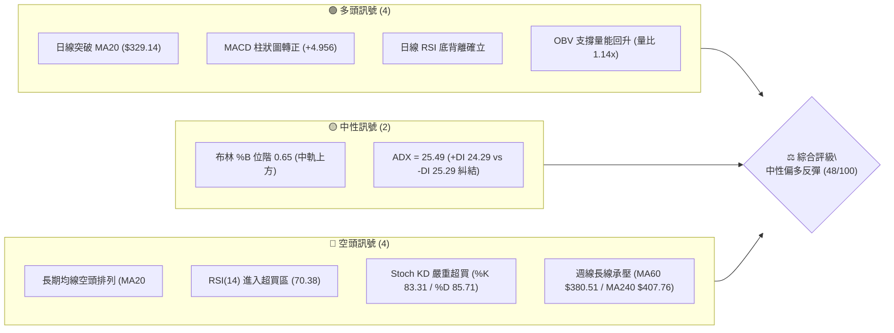
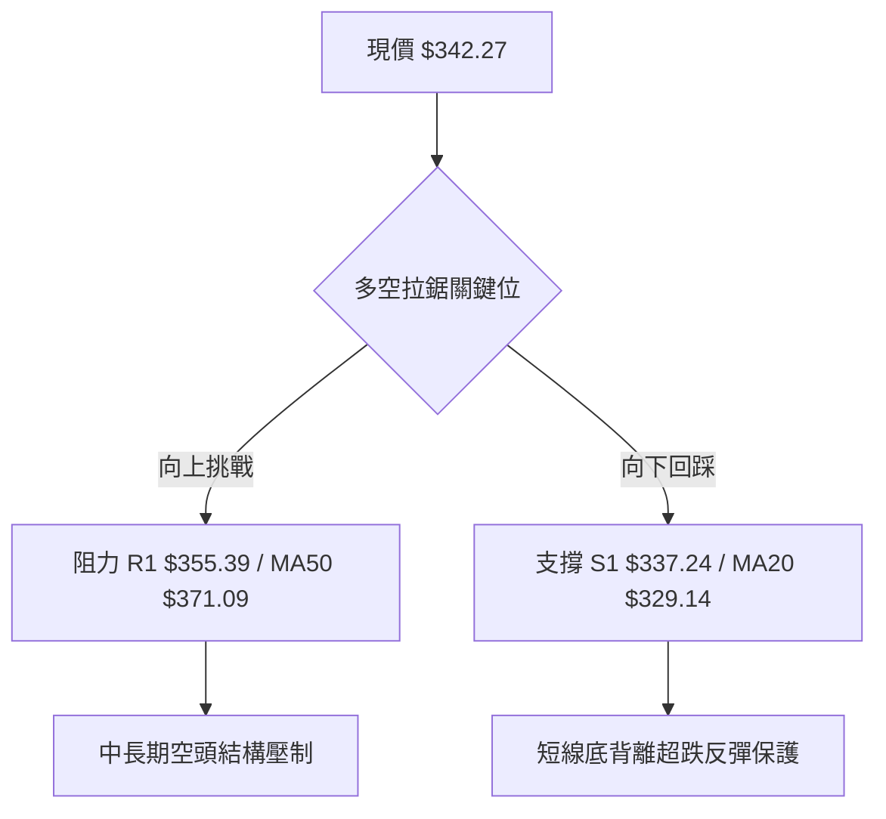
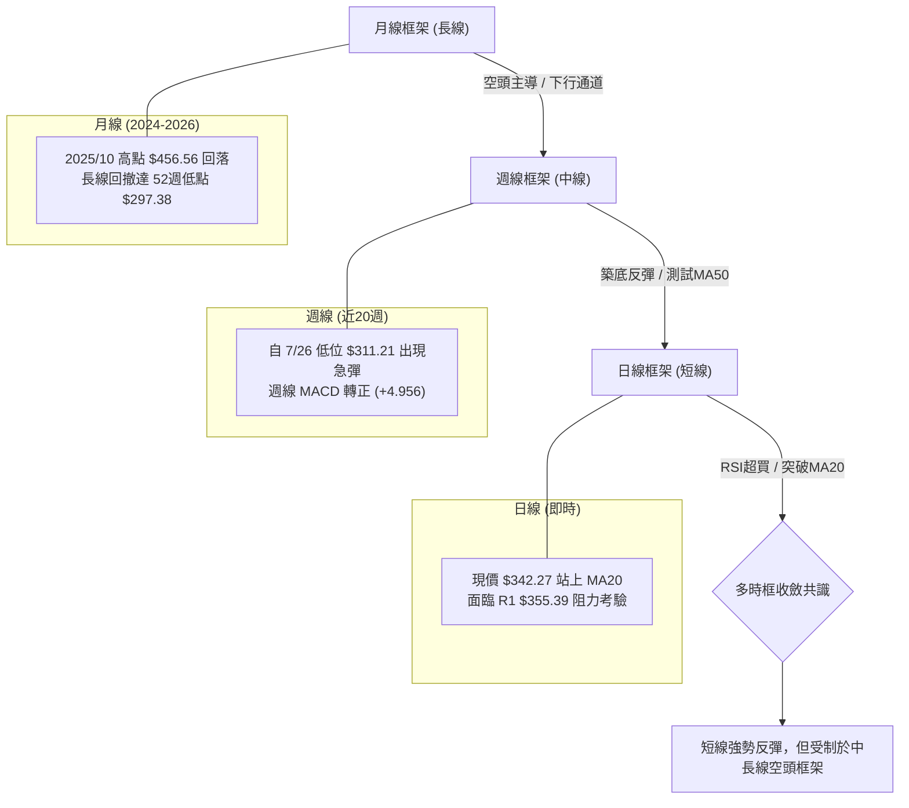
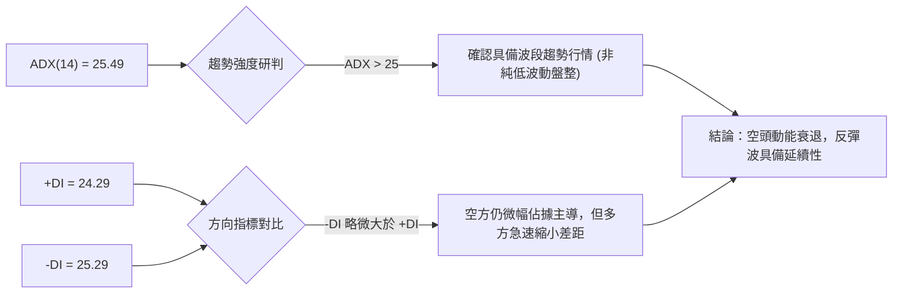
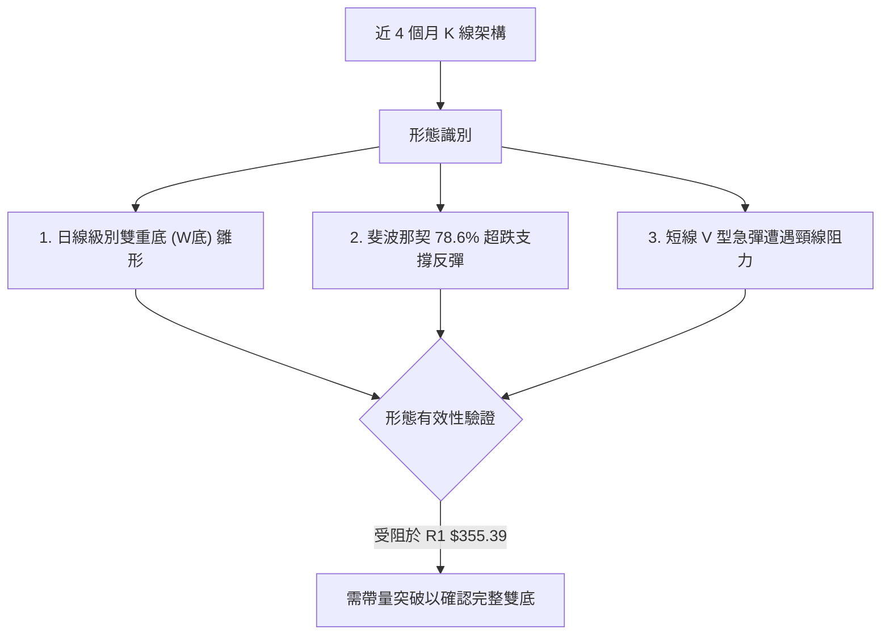
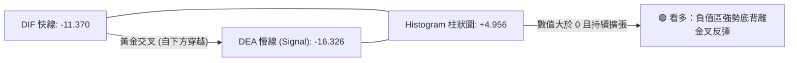
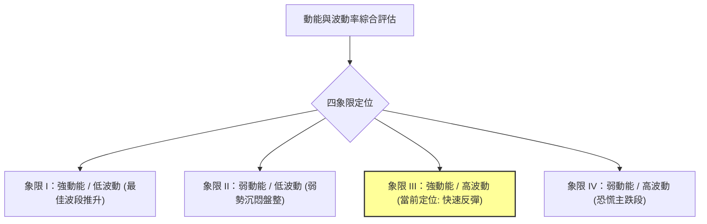
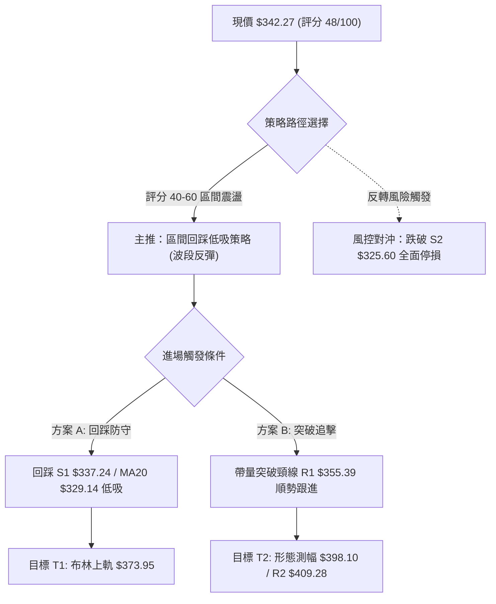
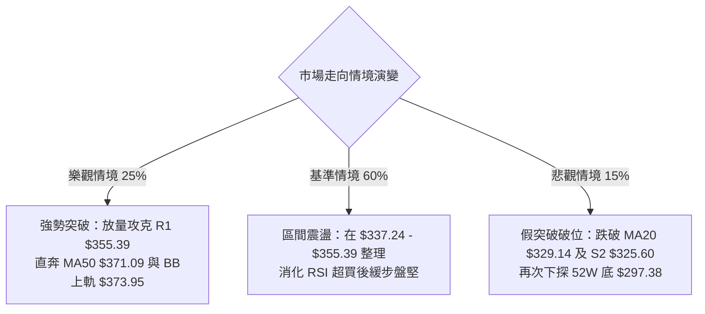

# TSLA 技術分析報告

> **報告日期**：2026-08-15 ｜ **語言**：繁體中文 ｜ **數據來源**：Yahoo Finance ｜ **當前價格**：$342.27

---

## 目錄

| 章節 | 內容 |
|------|------|
| [1. 技術面概覽](#1-技術面概覽) | 訊號儀表板、核心指標、評分卡 |
| [2. 趨勢分析](#2-趨勢分析) | 多時框趨勢、長中短期走勢 |
| [3. 圖表形態分析](#3-圖表形態分析) | 形態識別、K線組合、目標價 |
| [4. 支撐與阻力](#4-支撐與阻力) | 關鍵價位、斐波那契回調 |
| [5. 技術指標深度解讀](#5-技術指標深度解讀) | MA/RSI/MACD/布林/成交量 |
| [6. 動能與波動率](#6-動能與波動率) | 動能評估、ATR、Beta |
| [7. 多時框架總結](#7-多時框架總結) | 時框架評分矩陣 |
| [8. 交易策略建議](#8-交易策略建議) | 多空策略、風險報酬比 |
| [9. 風險提示與監控](#9-風險提示與監控) | 監控指標、風險場景 |

---

## 1. 技術面概覽

### 🎯 技術訊號儀表板





### 📊 核心指標速覽表

| 指標類別 | 指標名稱 | 當前數值 | 訊號 | 解讀 |
|----------|----------|----------|------|------|
| **價格** | 當前價格 | $342.27 | 🟡 | 位於52週區間22.3%低位，自低點$297.38顯著反彈 |
| **均線** | 短期均線 (MA20) | $329.14 | 🟢 | 現價高於MA20達+3.99%，短期波段由多方掌控 |
| **均線** | 中期均線 (MA50) | $371.09 | 🔴 | 現價低於MA50達-7.77%，中期反彈面臨強壓力帶 |
| **均線** | 長期均線 (MA200)| $406.08 | 🔴 | 均線呈現標準空頭排列 (MA20 < MA50 < MA200) |
| **動能** | RSI(14) | 70.38 | 🔴 | 短線急拉進入超買區間（>70），隨時有回踩消化需求 |
| **動能** | RSI 背離結構 | 底背離 | 🟢 | 前期低點形成明顯底背離，支撐本輪強勁反彈波 |
| **動能** | MACD (12/26/9)| -11.370 / -16.326 | 🟢 | 快慢線負值區黃金交叉，Histogram (+4.956) 強勁擴張 |
| **動能** | KD 隨機指標 | %K 83.31 / %D 85.71 | 🔴 | 短線鈍化於極度超買區，慎防追高回洗風險 |
| **趨勢** | ADX (14) | 25.49 | 🟡 | 進入強趨勢閾值，但 +DI(24.29) 與 -DI(25.29) 膠著 |
| **波動** | 布林通道 (%B) | 0.65 (帶寬 $89.62)| 🟡 | 突破中軌($329.14)朝上軌($373.95)延伸，動能充沛 |
| **波動** | ATR(14) | $11.20 (3.27%) | 🟡 | 每日平均波動適中，提供明確風控與止損依據 |
| **量能** | 當日量 / 20日均量 | 45.38M / 39.83M | 🟢 | 量比 1.14x，OBV > MA，量增價揚配合良好 |

### 🏆 技術評分卡

```
╔══════════════════════════════════════════════════════════════════╗
║                技術評分卡 — TSLA (2026-08-15)                    ║
╠══════════════════════════════════════════════════════════════════╣
║ 趨勢強度 (ADX/均線)   ████████░░░░░░░░░░░░  40/100  🔴 空頭壓制  ║
║ 動能指標 (RSI/MACD)   ████████████░░░░░░░░  60/100  🟢 動能翻多  ║
║ 支撐穩定度 (S1/S2/S3) ██████████████░░░░░░  70/100  🟢 底部紮實  ║
║ 成交量配合 (OBV/量比) ████████████░░░░░░░░  60/100  🟢 價漲量增  ║
║ 形態完整度 (打底結構) ██████████░░░░░░░░░░  50/100  🟡 反彈進行  ║
║ 均線排列 (空頭排列)   ██░░░░░░░░░░░░░░░░░░  10/100  🔴 嚴重發散  ║
╠══════════════════════════════════════════════════════════════════╣
║ 綜合評分             █████████░░░░░░░░░░░  48/100  ⚖️ 區間震盪   ║
║ 結論評級             【中性觀望 / 區間偏多反彈波】               ║
╚══════════════════════════════════════════════════════════════════╝
```

---

## 2. 趨勢分析

### 🌐 多時框趨勢分析



### 📈 長期趨勢 — 12個月走勢圖（Unicode）

```
TSLA 月線收盤走勢圖（過去12個月：2025-08 至 2026-08）
價格軸 ($)
$460 ┤               ●(2025-10: $456.56)
$440 ┤           ●       ●       ●
$420 ┤                               ●       ●
$400 ┤                                   ●
$380 ┤                                       ●   ●
$360 ┤
$340 ┤ ●(2025-08: $333.87)                           ●←現價 $342.27
$320 ┤
$300 ┤                                           ●(2026-07: $311.21)
     └─────────────────────────────────────────────────────────────
       08  09  10  11  12  01  02  03  04  05  06  07  08 (月份)
```

#### 過去12個月走勢階段特徵分析

| 階段區間 | 時間跨度 | 起訖價位 | 漲跌幅 | 走勢特徵解讀 |
|----------|----------|----------|--------|--------------|
| **主升浪推進** | 2025-08 至 2025-10 | $333.87 → $456.56 | **+36.75%** | 多頭量能爆發，創下階段波段歷史次高點 |
| **高檔高位震盪** | 2025-10 至 2026-01 | $456.56 → $430.41 | **-5.73%**  | 在 $430-$456 區間構築雙重頂部滯漲形態 |
| **單邊下行陰跌** | 2026-01 至 2026-03 | $430.41 → $371.75 | **-13.63%** | 跌破多道中期均線，長期上升趨勢線被擊穿 |
| **春季假突破反彈**| 2026-03 至 2026-05 | $371.75 → $435.79 | **+17.23%** | 形成弱勢反彈高點後無力續創新高 |
| **恐慌主跌浪** | 2026-05 至 2026-07 | $435.79 → $311.21 | **-28.59%** | 帶量急跌，觸及 52 週低點區間 $297.38 |
| **底背離強反彈** | 2026-07 至 2026-08 | $311.21 → $342.27 | **+9.98%**  | 動能指標底背離驅動，短線自超跌區修復 |

### 📊 中期趨勢（週線分析）

```
TSLA 週線關鍵阻力與支撐示意圖
═════════════════════════════════════════════════════════════════
$409.28 ═══════════════════════════════════ 強阻力區 (R2 / MA200)
             ▲ (中期強反轉目標)
$371.09 ─────────────────────────────────── 下降通道上軌 (MA50 / 61.8%)
             ▲ (當前波段主要目標)
$355.39 ┈┈┈┈┈┈┈┈┈┈┈┈┈┈┈┈┈┈┈┈┈┈┈┈┈┈┈┈┈┈┈┈┈┈─ 近期頸線阻力 (R1)
═════════════════════════════════════════════════════════════════
$342.27 ◀══════【 現價 $342.27 (斐波 78.6% $340.49 上方) 】
═════════════════════════════════════════════════════════════════
$337.24 ┈┈┈┈┈┈┈┈┈┈┈┈┈┈┈┈┈┈┈┈┈┈┈┈┈┈┈┈┈┈┈┈┈┈─ 短線支撐 (S1 / 近期低點)
             ▼ (回踩防守位)
$329.14 ─────────────────────────────────── 布林中軌 (MA20)
             ▼ (回調極限位)
$297.38 ═══════════════════════════════════ 52週絕對底 (S3 / 100%)
═════════════════════════════════════════════════════════════════
```

### ⚡ 趨勢強度評估（ADX 解讀）



#### ADX 與方向指標強度對照表

| 指標名稱 | 數值 | 參考門檻 | 狀態解讀 |
|----------|------|----------|----------|
| **ADX (14)** | **25.49** | 25.00 | **進入趨勢區間**：脫離 20-25 盤整帶，具備單邊推進動能 |
| **+DI (14)** | **24.29** | - | **多方動能急升**：自 7 月底極低位大幅攀升，買盤力量激增 |
| **-DI (14)** | **25.29** | - | **空方動能鈍化**：自高位快速回落，兩者差距縮小至 1.00 |
| **DI 交叉狀態**| 糾結即將金叉 | - | 若 +DI 向上穿越 -DI，將正式確立短中期的多頭主導行情 |

---

## 3. 圖表形態分析

### 🔍 形態識別系統



#### 圖表形態信心度與目標價評估表

| 形態名稱 | 信心度 | 判斷依據（嚴格引用數據） | 完成度 | 目標價（附計算式） |
|----------|--------|--------------------------|--------|--------------------|
| **雙重底 (Double Bottom)** | **70%** | 兩次低點分別為 2026-07-26 週收盤 $313.03 與 2026-08-02 收盤 $311.21，於支撐位 S2($325.60)/S3($297.38) 上方築底 | **75%** | 頸線 R1 $355.39 + 形態高度($355.39 - $311.21 = $44.18) = **$399.57** (接近 50% 斐波位 $398.10) |
| **布林通道中軌突破** | **85%** | 現價 $342.27 實體 K 線突破布林中軌 MA20 ($329.14) 且持續發散 | **100%** | 上軌目標價 **$373.95** (精確對應 BB 上軌) |
| **斐波那契極限反彈** | **65%** | 自 52W 低點 $297.38 反彈站穩 78.6% 回調位 ($340.49) | **80%** | 下一階段回調目標位 61.8% = **$374.33** |

### 🕯️ 重要K線形態分析

| 週/月份 | 收盤價 | K線形態 | 技術意義解讀 | 訊號方向 |
|---------|--------|---------|--------------|----------|
| **2026-07-26** | $313.03 | **長陰恐慌殺跌棒** | 週 RSI 跌至 15.7 極度超賣，空頭量能集中釋放 | 🔴 恐慌拋售 |
| **2026-08-02** | $311.21 | **低檔縮量十字星** | 成交量縮至 1.98 億股，賣壓枯竭，形成底部駐足點 | 🟢 變盤築底 |
| **2026-08-09** | $328.58 | **多頭反包大陽棒** | RSI 回升至 34.9，MACD 柱狀圖翻正(+1.025)，多方反撲 | 🟢 轉折確認 |
| **2026-08-16** | $342.27 | **光頭實體中陽線** | 突破 MA20，週 RSI 急升至 70.4，直逼頸線阻力 R1 | 🟢 短線強勢 |

### 📉 ASCII 走勢形態示意圖

```
TSLA 近期打底與突破形態示意圖 (2026-07 至 2026-08)
═════════════════════════════════════════════════════════════════════
價位 ($)
$355.39 ┤                                        [阻力 R1 頸線位]
         │                                       ▲
$342.27 ┤                                     ● [現價突破 MA20]
         │                                   ╱
$329.14 ┤                              ●───╯   [突破中軌 MA20]
         │                             ╱
$313.03 ┤   ● (左底 07-26: $313.03)  ╱
         │    ╲                      ╱
$311.21 ┤     ╰───────● (右底 08-02: $311.21)
         │               [雙底築底完成]
$297.38 ┴───────────────────────────────────────── [52W 低點 S3]
═════════════════════════════════════════════════════════════════════
```

### 🎯 形態目標價計算

根據雙底形態（W底）及布林通道突破推算：
1. **雙底頸線突破測幅**：
   - 形態底部低點：$311.21（2026-08-02 收盤）
   - 形態頸線位置：$355.39（阻力位 R1）
   - 形態垂直高度：$$355.39 - 311.21 = 44.18$$
   - 突破最小量測目標價 (T2)：$$355.39 + 44.18 = 399.57$$（精確契合斐波那契 50.0% 回調位 $398.10 及分析師均價 $395.34）
2. **布林軌道短線目標**：
   - 突破 MA20 中軌 ($329.14) 後之短線第一目標 (T1)：**$373.95**（布林上軌，與 61.8% 斐波位 $374.33 形成共振）

---

## 4. 支撐與阻力

### 🗺️ 關鍵價位分布圖（Unicode）

```
TSLA 關鍵價位結構分布圖 (由 OHLCV 聚類計算)
═════════════════════════════════════════════════════════════════
$418.36 ║██████████████████████████████║ 強結構阻力 R3 (+22.23%)
$409.28 ║████████████████████          ║ 重大波段阻力 R2 (+19.58% / MA200)
$374.33 ║████████████                  ║ 斐波那契 61.8% / BB上軌 $373.95
$355.39 ║████████████████████████      ║ 短線關鍵阻力 R1 (+3.83%)
════════╬══════════════════════════════╬════════════════════════
$342.27 ╠══════════════════════════════╣ ◄ 現價位置 ($342.27)
════════╬══════════════════════════════╬════════════════════════
$340.49 ║▓▓▓▓▓▓▓▓▓▓▓▓▓▓▓▓▓▓▓▓          ║ 斐波那契 78.6% 回調支撐
$337.24 ║▓▓▓▓▓▓▓▓▓▓▓▓▓▓▓▓              ║ 近期波段支撐 S1 (-1.47%)
$329.14 ║▓▓▓▓▓▓▓▓▓▓▓▓▓▓                ║ 布林中軌 / MA20 支撐
$325.60 ║████████████████████          ║ 關鍵波段支撐 S2 (-4.87%)
$297.38 ║██████████████████████████████║ 52週波段低點 S3 (-13.12%)
═════════════════════════════════════════════════════════════════
```

### 🚧 阻力位分析表

| 阻力級別 | 價位 | 形成原因 | 突破難度 | 重要性 |
|----------|------|----------|----------|--------|
| **R1 (短線)** | **$355.39** | 近一年波段高點聚類位，短線 W 底頸線阻力 | 🟡 中等 (需日成交量 >45M 配合) | ★★★☆☆ |
| **R2 (中期)** | **$409.28** | 近一年重大密集成交區，接近 MA200 ($406.08) 及 MA240 ($407.76) | 🔴 極高 (長期熊市防線) | ★★★★★ |
| **R3 (強阻)** | **$418.36** | 2026年4-6月多次反彈高點聚類區，套牢籌碼極重 | 🔴 極高 (多空轉換分水嶺) | ★★★★☆ |

### 🛡️ 支撐位分析表

| 支撐級別 | 價位 | 形成原因 | 守住機率 | 重要性 |
|----------|------|----------|----------|--------|
| **S1 (短線)** | **$337.24** | 近一年波段低點聚類，前波回踩確認點 | 🟢 75% | ★★★☆☆ |
| **S2 (關鍵)** | **$325.60** | 波段密集支撐區，緊鄰 MA20 ($329.14) 與 MA10 ($329.25) | 🟢 80% | ★★★★☆ |
| **S3 (絕對)** | **$297.38** | 52 週絕對低點，長線歷史價值買盤重鎮 | 🟢 95% | ★★★★★ |

### 📐 斐波那契回調位分析

依據 52 週波段區間：高點 **$498.83** → 低點 **$297.38**（垂直空間 $201.45）精確計算：

```
斐波那契回調位分布階梯
  0.0%  (52W High)  ─── $498.83  [歷史波段頂部]
 23.6%              ─── $451.29  [高檔套牢區]
 38.2%              ─── $421.88  [強阻力延伸帶]
 50.0%              ─── $398.10  [多空中樞平衡位]
 61.8%              ─── $374.33  [黃金分割關鍵阻力 / 契合 BB上軌 $373.95]
 78.6%              ─── $340.49  ◄ 現價 $342.27 剛突破此關鍵位
100.0%  (52W Low)   ─── $297.38  [年度波段鐵底]
```

#### 斐波那契位階深度解讀：
* 現價 **$342.27** 目前精確運行於 **78.6% ($340.49)** 與 **61.8% ($374.33)** 區間內。
* 站穩 78.6% 回調位 ($340.49) 代表極度超跌後的技術面修復獲得初步確立，上方下一目標為 61.8% 黃金分割位 **$374.33**。

---

## 5. 技術指標深度解讀

### 🎛️ 指標訊號總覽

```mermaid
graph TD
    subgraph "均線系統 (Bearish)"
        M1["MA20: $329.14 (現價上方 +3.99%)"]
        M2["MA50: $371.09 (現價下方 -7.77%)"]
        M3["MA200: $406.08 (現價下方 -15.71%)"]
        M1 --- M2 --- M3 --> MA_OUT["排列：空頭排列 (長線承壓)"]
    end
    
    subgraph "動能系統 (Bullish/Overbought)"
        D1["RSI(14): 70.38 (超買 / 底背離生效)"]
        D2["MACD: -11.370 / Signal: -16.326"]
        D3["Histogram: +4.956 (多頭擴張)"]
        D1 --- D2 --- D3 --> MO_OUT["動能：短線強多但需防回踩"]
    end
    
    subgraph "通道與量能 (Neutral-Bullish)"
        V1["布林通道: %B 0.65 (向 $373.95 上軌推進)"]
        V2["量比: 1.14x (OBV > MA 量價配合)"]
        V1 --- V2 --> VO_OUT["量能：具備上攻支撐力度"]
    end
```



### 📈 移動平均線排列分析


#### 完整均線系統體系數據

| 週期 | 數值 | 現價偏離幅度 | 走勢方向 | 形態解讀 |
|------|------|--------------|----------|----------|
| **MA 5** | **$334.69** | +2.27% (+$7.58) | 向上 ▲ | 短線極強支撐，多方攻擊線 |
| **MA 10**| **$329.25** | +3.95% (+$13.02)| 向上 ▲ | 助漲線，提供下檔第一道防護 |
| **MA 20**| **$329.14** | +3.99% (+$13.13)| 向上 ▲ | 月線生命線翻揚，短線波段偏多 |
| **MA 50**| **$371.09** | -7.77% (-$28.82)| 向下 ▼ | 季線下壓，為本次反彈最重要的中期強阻力 |
| **MA 60**| **$380.51** | -10.05% (-$38.24)| 向下 ▼ | 中期下行通道上緣 |
| **MA 120**| **$385.24**| -11.15% (-$42.97)| 向下 ▼ | 半年線空頭發散 |
| **MA 200**| **$406.08**| -15.71% (-$63.81)| 向下 ▼ | 長期年線反轉重壓力位 |
| **MA 240**| **$407.76**| -16.06% (-$65.49)| 向下 ▼ | 長期基期均線走空 |

### 📉 RSI(14) 分析

```
RSI(14) 數值儀表板:
0 ──────── 30 ────────────── 50 ────────────── 70 ──── 100
[ 超賣區 ]    [    弱勢區    ]    [    強勢區    ]  ▲ [ 超買區 ]
                                            70.38
進度條: ████████████████████████████████████████░░░░ 70.38% (🔴 超買)
```

#### 背離判斷與動能特徵：
* **底背離確立 (Bullish Divergence)**：在 2026-07-26 週收盤價創下 $313.03 及後續低點時，週 RSI 僅 15.7；隨後價格於 2026-08-02 二次探底 $311.21，但 RSI 逆勢抬升至 18.1 並快速拉升至目前 70.4。標準的「價格破底/平底而指標抬高」底背離結構，引發了本輪強勁反彈。
* **短線超買警告**：當前日線 RSI 來到 **70.38**，進入典型超買警示區，顯示短線乖離過大，隨時存在技術性回踩 MA20 ($329.14) 的需求，切忌盲目追高。

### 📊 MACD(12/26/9) 訊號解讀



* **訊號解讀**：MACD 在零軸下方深處完成黃金交叉，且柱狀圖（Histogram）顯著放大至 **+4.956**（連續兩週維持在 +1.025 及 +4.956 正向擴張），確認多頭反彈動能依然強勁，尚未出現多頭力竭跡象。

### 📦 布林通道分析

```
TSLA 布林通道 (20, 2) 結構圖
═════════════════════════════════════════════════════════════════
$373.95 ┬────────────────────────────────────────── BB 上軌 (阻力帶)
        │
$342.27 ┼───────────────────● 現價 (BB %B = 0.65)
        │                   ↑ 朝上軌推進中
$329.14 ┼────────────────────────────────────────── BB 中軌 (MA20 支撐)
        │
$284.33 ┴────────────────────────────────────────── BB 下軌 (極限支撐)
═════════════════════════════════════════════════════════════════
```

* **軌道狀態**：通道寬度為 $$373.95 - 284.33 = 89.62$$。現價處於中軌上方，**%B 指標為 0.65**，代表價格已脫離超賣區，穩步運行於強勢擴張區間，短線上檔受上軌 **$373.95** 牽引。

### 💹 成交量分析（量價配合度）

```
成交量指標進度條：
最新成交量: 45.38M  ███████████████████████░░  (高於均量)
20日均量:   39.83M  ████████████████████░░░░░  (100% 基準)
量比 (Volume Ratio): 1.14x  🟢 價漲量增配合
```

* **量價配合判定**：最新成交量（45.38M）高於 20 日均量（39.83M），量比達 1.14 倍；同時 **OBV > MA**，顯示本波自 $311.21 以來的上漲並非無量虛拉，而是伴隨實質買盤進駐，量能對反彈形成實質支撐。

---

## 6. 動能與波動率

### ⚡ 動能評估四象限



| 象限 | 動能維度 | 波動維度 | 當前狀態 | 技術評估與操作意涵 |
|------|----------|----------|----------|--------------------|
| **Q1** | 強動能 | 低波動 | - | 穩健單邊趨勢，最安全持股區 |
| **Q2** | 弱動能 | 低波動 | - | 底部沉澱期，觀望等待方向 |
| **Q3** | **強動能** | **高波動** | **✓ 當前狀態** | **超跌反彈階段：短線彈升速度快、振幅大（ATR $11.20），適合設定嚴格停損的波段短打** |
| **Q4** | 弱動能 | 高波動 | - | 恐慌主跌浪，全面規避 |

### 📊 ATR 波動率分析

* **當前 ATR(14)**：**$11.20**（佔現價比重 **3.27%**）。
* **風控與止損設定依據**：
  - **超短線停損緩衝區間 (1.0x ATR)**：$$11.20 \times 1.0 = \$11.20$$（下檔防守價位約 $331.07）。
  - **標準波段停損緩衝區間 (1.5x ATR)**：$$11.20 \times 1.5 = \$16.80$$（下檔防守價位約 $325.47，與支撐 S2 $325.60 完美重合）。
  - **寬幅趨勢停損緩衝區間 (2.0x ATR)**：$$11.20 \times 2.0 = \$22.40$$（下檔防守價位約 $319.87）。

### 📐 Beta 與市場相關性

* **Beta 係數**：**1.827**。
* **特性分析**：TSLA 具備極高的高彈性 Beta 特徵，波動幅度約為標普 500 指數的 1.83 倍。在市場大盤風險偏好修復時將展現高度彈性，但遇大盤回調時亦承擔加倍下行風險。

---

## 7. 多時框架總結

### 📋 時框架評分表

| 時框架 | 趨勢方向 | 動能狀態 | 均線排列 | 形態結構 | 綜合評分 | 戰術建議 |
|--------|----------|----------|----------|----------|----------|----------|
| **日線 (短期)** | 🟢 向上偏多 | 🔴 超買 (70.38) | 🟢 站上 MA20 | W 底反彈 | **65/100** | 逢回踩 S1 布局，切忌追高 |
| **週線 (中期)** | 🟡 震盪築底 | 🟢 MACD 轉正 | 🔴 MA50 壓制 | 測試頸線 | **48/100** | 區間操作，目標看至 MA50/BB上軌 |
| **月線 (長期)** | 🔴 處於空頭 | 🟡 低檔回升 | 🔴 空頭排列 | 高檔回撤 | **30/100** | 長線趨勢未反轉，逢高減磅 |

### 🔲 綜合訊號矩陣

```
訊號維度矩陣分析：
┌──────────────┬──────────────┬──────────────┬──────────────┐
│  時框 / 維度 │   趨勢系統   │   動能系統   │   量價結構   │
├──────────────┼──────────────┼──────────────┼──────────────┤
│  短期 (日線) │ 🟢 突破短期MA│ 🔴 RSI超買70 │ 🟢 OBV放量   │
│  中期 (週線) │ 🔴 MA50壓制  │ 🟢 MACD金叉  │ 🟡 量能適中  │
│  長期 (月線) │ 🔴 均線空排  │ 🔴 歷史低位  │ 🔴 籌碼套牢  │
└──────────────┴──────────────┴──────────────┴──────────────┘
```

### ⚖️ 多時框收斂結論

依據多時框收斂規則（嚴格要求 14）：
1. **行情性質判定**：當前 ADX(14) 讀數為 **25.49**（微幅高於 25 臨界線），但方向指標 +DI(24.29) 與 -DI(25.29) 極度糾結，且均線呈現長期空頭排列（MA20 < MA50 < MA200）。因此，本質上定義為**「由日線底背離觸發的中期超跌反彈／寬幅箱體震盪行情」**，而非長線多頭反轉。
2. **多時框衝突取捨**：以週線與日線布林通道（$284.33 - $373.95）作為主要交易區間。中長期趨勢依然偏空，限制了上檔空間；日線動能偏多則保障了下檔支撐。
3. **唯一方向性結論**：**【中性觀望 / 區間偏多反彈（箱體操作）】**。綜合評分為 **48/100**，操作上嚴禁長線追高，應採取以布林通道與關鍵支撐阻力為基準的「逢回踩低吸、遇阻力分批止盈」之區間波段策略。

---

## 8. 交易策略建議

### 🗺️ 策略決策流程圖



### 🧭 策略路由

**當前主策略方向 = 【區間震盪偏多反彈策略】（依評分卡 48/100 評定為 40–60 區間操作）**
* 目前評分處於 40–60 之中性區間，不具備單邊長多條件。主推策略為「回踩支撐低吸波段策略」，空頭僅列為關鍵支撐跌破後的「反轉風險觸發點（對沖提示）」。

### 🎯 價格情境階梯（Price Scenarios）

| 觸發條件 | 下一目標 | 後續延伸 | 情境含義 |
|----------|----------|----------|----------|
| **突破 R1 $355.39** | **$373.95 (BB上軌)** | **R2 $409.28 / MA200** | 短線雙底確立，挑戰中期強阻力區 |
| **站穩現價 $342.27** | **R1 $355.39** | **$374.33 (61.8%)** | 消化 RSI 超買，維持向上盤堅格局 |
| **跌破 S1 $337.24** | **S2 $325.60 (MA20)** | **S3 $297.38 (52W底)** | 反彈動能衰竭，回測底部支撐強度 |

### 📊 情境機率分佈

| 情境劇本 | 機率 | 主要技術依據 |
|----------|------|--------------|
| **情境一：震盪上行挑戰 MA50** | **55%** | MACD 柱狀圖持續翻紅擴張 (+4.956)，OBV 量能配合良好，底背離動能未盡 |
| **情境二：區間震盪消化超買** | **30%** | 日線 RSI 達 70.38 進入超買，ADX +DI/-DI 糾結，需於 $329-$355 區間換手整理 |
| **情境三：反彈夭折跌破前低** | **15%** | 長期均線呈現空頭排列壓制，若失守 MA20 ($329.14) 則空方重掌主導權 |

### 🟢 主策略詳情（區間偏多波段操作）

| 策略要素 | 策略 A（保守型：回踩支撐逢低吸納） | 策略 B（積極型：突破頸線順勢追擊） |
|----------|------------------------------------|------------------------------------|
| **進場條件** | 價格回踩 S1 附近獲得 K 線支撐確認 | 帶量長陽實體突破 R1 頸線位 |
| **進場價格** | **$337.24**（支撐 S1） | **$355.39**（阻力 R1） |
| **第一目標價 (T1)** | **$373.95**（布林上軌 / 61.8% 斐波）| **$374.33**（61.8% 斐波那契回調位）|
| **第二目標價 (T2)** | **$398.10**（50.0% 斐波位 / 雙底測幅）| **$409.28**（阻力 R2 / MA200 重壓區）|
| **止損價格** | **$325.60**（跌破支撐 S2 / 1.5x ATR）| **$337.24**（跌回原頸線支撐 S1 下方）|
| **風險空間** | $$337.24 - 325.60 = \$11.64$$ | $$355.39 - 337.24 = \$18.15$$ |
| **報酬空間 (T1)** | $$373.95 - 337.24 = \$36.71$$ | $$374.33 - 355.39 = \$18.94$$ |
| **風險報酬比 (R:R)**| **1 : 3.15** (極佳) | **1 : 1.04** (普通，看至 T2 則為 1:2.97) |
| **成功機率** | **65%** | **55%** |
| **建議倉位** | **15% - 20%** (中等倉位) | **10%** (輕倉追突破) |

### 🔴 反向風險觸發點（對沖提示）

* **空頭反撲警戒線**：若日線收盤價跌破 **S2 $325.60**（同時跌破 MA20 $329.14 及布林中軌），即代表本波反彈徹底失效。
* **避險對沖措施**：多頭部位應立即無條件止損離場；積極交易者可於跌破 $325.60 時建立避險空單，下檔目標直指 **S3 $297.38**。

### ⭐ 整體訊號強度評星

```
做多訊號強度：★★★☆☆  (3/5星 — 短線反彈動能充沛，惟受制於長期均線)
做空訊號強度：★★☆☆☆  (2/5星 — 空方動能暫時衰退，急跌風險暫退)
整體可信度：  ★★★☆☆  (3/5星 — 處於震盪打底期，指標呈現時框分歧)
```

---

## 9. 風險提示與監控

### ✅ 關鍵監控指標 Checklist

```
╔══════════════════════════════════════════════════════════════════╗
║                   每日交易監控指標 CHECKLIST                      ║
╠══════════════════════════════════════════════════════════════════╣
║ [ ] 價格是否跌破 MA20 生命線 ($329.14)？                         ║
║ [ ] RSI(14) 是否在 70 以上出現頂背離或自高檔死叉回落？           ║
║ [ ] 日成交量是否維持在 20日均量 (39.83M) 之上？                  ║
║ [ ] MACD Histogram 柱狀圖是否開始縮頭 (< +4.956)？               ║
║ [ ] 價格能否有效收復並站穩阻力 R1 ($355.39)？                    ║
║ [ ] +DI 是否正式金叉穿越 -DI (目前 24.29 vs 25.29)？             ║
╚══════════════════════════════════════════════════════════════════╝
```

### ⚠️ 風險場景分析



### 🛡️ 風險管理重要提醒

1. **嚴禁高檔追價**：當前日線 RSI(14) 讀數已達 **70.38**，KD 指標（%K 83.31 / %D 85.71）嚴重超買。歷史數據表明在此位階追高極易遭遇急回洗盤，所有進場應嚴格等待回踩 S1（$337.24）或 MA20 支撐。
2. **高 Beta 波動控制**：TSLA Beta 高達 **1.827**，每日波動 ATR 達 **$11.20**。單筆交易所承擔的最大虧損金額嚴格控制在總資金的 1%–2% 以內，避免重倉操作。
3. **時框收斂紀律**：切記長期趨勢（月線/MA200）仍處於空頭壓制格局。本輪行情定性為「超跌技術性反彈」，一旦觸及上軌 **$373.95** 或 61.8% 斐波位 **$374.33** 附近，應嚴格執行分批獲利了結，不可盲目長線抱死。

---

## 📋 報告總結

```
╔══════════════════════════════════════════════════════════════════╗
║                    TSLA 技術分析報告總結                         ║
╠══════════════════════════════════════════════════════════════════╣
║ 報告日期：2026-08-15                                             ║
║ 當前價格：$342.27                                                ║
║ 分析評級：⚖️ 中性觀望 / 區間偏多反彈 (綜合評分: 48/100)          ║
║                                                                  ║
║ 關鍵結論：                                                       ║
║ ├─ 長期趨勢：🔴 空頭排列 (MA200 $406.08 下壓，長線承壓)         ║
║ ├─ 中期趨勢：🟡 築底反彈 (週線 MACD 翻紅，測試頸線)             ║
║ ├─ 短期趨勢：🟢 強勁反彈 (突破 MA20 $329.14，動能充沛但超買)    ║
║ ├─ 關鍵支撐：S1: $337.24 │ S2: $325.60 │ S3: $297.38           ║
║ ├─ 關鍵阻力：R1: $355.39 │ R2: $409.28 │ R3: $418.36           ║
║ └─ 分析師目標價：均價 $395.34 (共識評級: Buy / 40位分析師)      ║
║                                                                  ║
║ 最優策略組合：                                                   ║
║ 1. 🥇 最佳機會：回踩 S1 $337.24 低吸，停損 $325.60，看 $373.95   ║
║ 2. 🥈 次選機會：帶量突破 R1 $355.39 順勢短打，目標 $374.33       ║
║ 3. 🥉 保守選擇：觀望等待股價拉回測試 MA20 ($329.14) 企穩信號     ║
╚══════════════════════════════════════════════════════════════════╝
```

---

> ⚠️ **免責聲明**：本報告為 AI 自動生成之技術分析研究報告，所有數據及推算均嚴格基於所提供之歷史價格與量化指標。本報告**僅供學術研究與參考**，**絕不構成任何個人化投資建議或買賣邀約**。金融市場瞬息萬變，投資具備極高風險，入市操作請獨立審慎評估並嚴格落實風險管理。

---

*報告生成時間：2026-08-15 ｜ 數據來源：Yahoo Finance ｜ 分析框架：資深多時框量化技術分析*