# TSLA 技術分析報告

> **報告日期**：2026-08-16 ｜ **語言**：繁體中文 ｜ **數據來源**：Yahoo Finance ｜ **當前價格**：$342.27

---

## 目錄

| 章節 | 內容 |
|------|------|
| [1. 技術面概覽](#1-技術面概覽) | 訊號儀表板、核心指標、評分卡 |
| [2. 趨勢分析](#2-趨勢分析) | 多時框趨勢、長中短期走勢、ADX解讀 |
| [3. 圖表形態分析](#3-圖表形態分析) | 形態識別、信心度評估、K線組合、目標價 |
| [4. 支撐與阻力](#4-支撐與阻力) | 關鍵價位分佈、支撐阻力表、斐波那契回調 |
| [5. 技術指標深度解讀](#5-技術指標深度解讀) | 均線系統、RSI背離、MACD、布林通道、OBV |
| [6. 動能與波動率](#6-動能與波動率) | 動能四象限、ATR波動分析、Beta相關性 |
| [7. 多時框架總結](#7-多時框架總結) | 時框矩陣、收斂規則與單一方向性結論 |
| [8. 交易策略建議](#8-交易策略建議) | 策略路由、情境階梯、主策略詳情、風控點 |
| [9. 風險提示與監控](#9-風險提示與監控) | 監控清單、情境模擬、資金管理原則 |

---

## 1. 技術面概覽

### 🎯 技術訊號儀表板

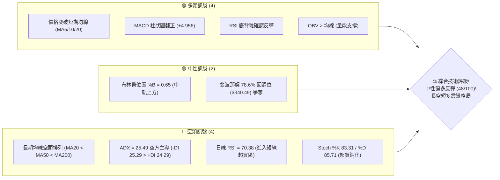

### 📊 核心指標速覽表

| 指標類別 | 指標名稱 | 當前數值 | 訊號 | 技術解讀 |
|:---|:---|:---|:---:|:---|
| **價格** | 現價 (Close) | $342.27 | 🟡 | 位於52週區間 22.3% 低位，短線自低檔反彈 |
| **短期均線** | MA20 | $329.14 | 🟢 | 價格在MA20上方 (+3.99%)，短線多頭掌控 |
| **中期均線** | MA50 | $371.09 | 🔴 | 價格在MA50下方 (-7.77%)，中期下降壓力未解 |
| **長期均線** | MA200 | $406.08 | 🔴 | 價格在MA200下方 (-15.71%)，長期趨勢屬弱勢空頭 |
| **動能震盪** | RSI(14) | 70.38 | 🔴 | 數值 > 70 進入短線超買區，存在拉回整理壓力 |
| **動能型態** | RSI 背離 | 底背離 | 🟢 | 先前自 $311.21 形成底背離，支撐本波技術反彈 |
| **趨勢動能** | MACD | -11.370 / -16.326 | 🟢 | 零軸下方黃金交叉，Histogram 為 +4.956 持續放大 |
| **擺動指標** | KD (Stoch) | 83.31 / 85.71 | 🔴 | %K 與 %D 於 80 以上高檔超買，提防追高風險 |
| **趨勢強度** | ADX(14) | 25.49 (-DI > +DI) | 🔴 | ADX > 25 呈現趨勢行情，但 -DI 主導表明中長格局偏空 |
| **通道指標** | 布林通道 | 上軌 $373.95 / 中軌 $329.14 | 🟡 | %B 為 0.65，突破中軌朝上軌進攻，通道寬度擴展 |
| **成交量能** | 當日量 / 20日均量 | 45.38M / 39.83M (1.14x) | 🟢 | 量增價揚，OBV 高於均線，量價配合健康 |
| **波動度** | ATR(14) | $11.20 (3.27%) | 🟡 | 日內平均波動度適中，提供明確止損設定區間 |

### 🏆 技術評分卡

```
╔══════════════════════════════════════════════════════════════════╗
║                技術評分卡 — TSLA (2026-08-16)                    ║
╠══════════════════════════════════════════════════════════════════╣
║ 趨勢強度 (Trend)      ████████░░░░░░░░░░░░  40/100  🔴 中長空頭  ║
║ 短期動能 (Momentum)   ██████████████░░░░░░  70/100  🟢 動能轉強  ║
║ 支撐穩定度 (Support)  ████████████░░░░░░░░  60/100  🟡 低檔築底  ║
║ 成交量配合 (Volume)   ████████████░░░░░░░░  60/100  🟢 量能回溫  ║
║ 形態完整度 (Pattern)  ██████████░░░░░░░░░░  50/100  🟡 雙底構築  ║
║ 均線排列 (MA System)  ██░░░░░░░░░░░░░░░░░░  10/100  🔴 空頭排列  ║
╠══════════════════════════════════════════════════════════════════╣
║ 綜合技術評分          █████████░░░░░░░░░░░  48/100  ⚖️ 區間反彈  ║
╚══════════════════════════════════════════════════════════════════╝
```

---

## 2. 趨勢分析

### 🌐 多時框趨勢分析

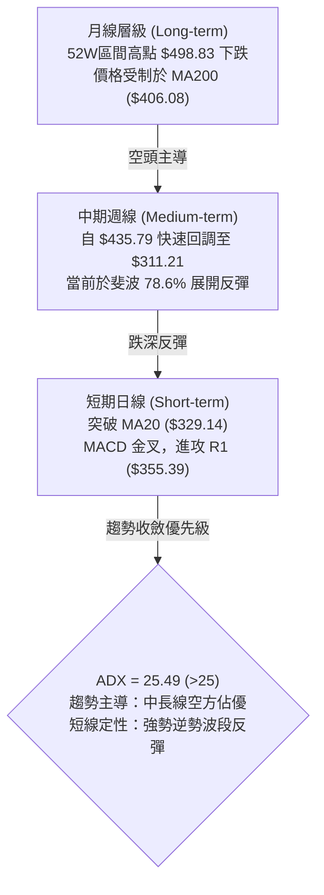

### 📈 長期趨勢 — 12個月走勢圖（Unicode）

```
TSLA 過去12個月月線收盤價走勢圖 ($)
$460 ┤               ● $456.56
$440 ┤           ●       ● $449.72        ● $435.79
$420 ┤                                        ● $420.60
$400 ┤                               ● $402.51
$380 ┤                                   ● $381.63
$360 ┤                               ● $371.75
$340 ┤   ● $333.87                                   ● $342.27 (現價)
$320 ┤                                           ● $311.21 (低點)
     └─────┬───┬───┬───┬───┬───┬───┬───┬───┬───┬───┬───────
          08  09  10  11  12  01  02  03  04  05  06  07  08 (2025/08-2026/08)
```

#### 📊 走勢特徵分析

| 階段區間 | 時間跨度 | 價格區間 | 累積漲跌幅 | 核心技術特徵 |
|:---|:---|:---|:---:|:---|
| **主升峰值期** | 2025-08 ~ 2025-10 | $333.87 → $456.56 | +36.75% | 多頭強勢推升，創出波段歷史高點 $456.56（52W高點 $498.83） |
| **高檔箱體震盪** | 2025-11 ~ 2026-01 | $456.56 → $430.41 | -5.73% | 在 $430-$450 構築頂部形態，動能初顯疲態 |
| **主跌破位期** | 2026-02 ~ 2026-04 | $430.41 → $371.75 | -13.63% | 連續跌破 MA50 與整數心理關卡，空頭加速釋放 |
| **弱勢次級反彈** | 2026-05 ~ 2026-06 | $371.75 → $435.79 | +17.23% | 反彈受制於長期高點阻力區，隨後出現巨幅拋壓 |
| **加速崩跌探底** | 2026-07 ~ 2026-08 | $420.60 → $311.21 | -26.01% | 連續破位觸發停損，於 52W 低點 $297.38 上方 $311 止跌 |
| **技術底背離反彈**| 2026-08 (最新) | $311.21 → $342.27 | +9.98% | RSI 底背離引發空頭回補，收復短期 MA20 均線 |

### 📊 中期趨勢（週線分析）

```
TSLA 週線關鍵架構與壓力支撐示意圖
══════════════════════════════════════════════════════════════
 $409.28 ~ $418.36 ─── 強阻力帶 R2-R3 (MA200 $406.08 與密集成交區)
          ▲
          │   中期空頭防守防線 (MA50 $371.09 / 斐波 61.8% $374.33)
 $355.39 ─┴─ 短期波段目標 R1 (近一年波段高點聚類)
          ▲
 $342.27 ─┼─ 【當前價格】(站上 斐波 78.6% $340.49)
          ▼
 $337.24 ─── 近端支撐 S1 (前期回踩低點)
 $325.60 ─── 中期支撐 S2 (MA20 $329.14 緩衝帶)
 $297.38 ─── 52週絕對底部 S3 (年度低點防線)
══════════════════════════════════════════════════════════════
```

### ⚡ 趨勢強度評估（ADX 解讀）

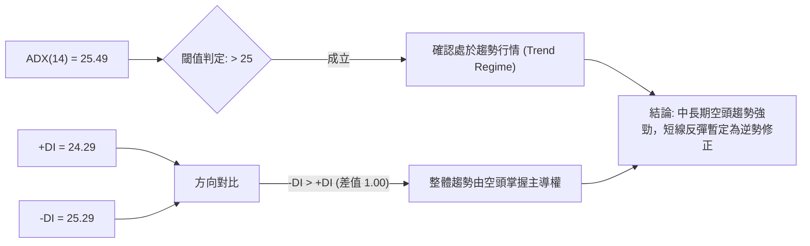

| 指標項 | 當前數值 | 參考標準 | 狀態評估 |
|:---|:---:|:---|:---|
| **ADX (14)** | **25.49** | <20 盤整；20-25 轉折；>25 明確趨勢 | 🟢 趨勢行情已確立 (剛越過 25 強度門檻) |
| **+DI (14)** | **24.29** | 多方買盤推動力 | 🟡 多方力量快速爬升，但尚未形成絕對優勢 |
| **-DI (14)** | **25.29** | 空方拋售推動力 | 🔴 空方力量仍微幅高於多方，空頭結構未徹底瓦解 |
| **DI 交叉狀態** | -DI ≥ +DI | 差值 -1.00 | 🟡 空頭優勢正在收窄，若 +DI 上穿將觸發日線金叉 |

---

## 3. 圖表形態分析

### 🔍 形態識別系統

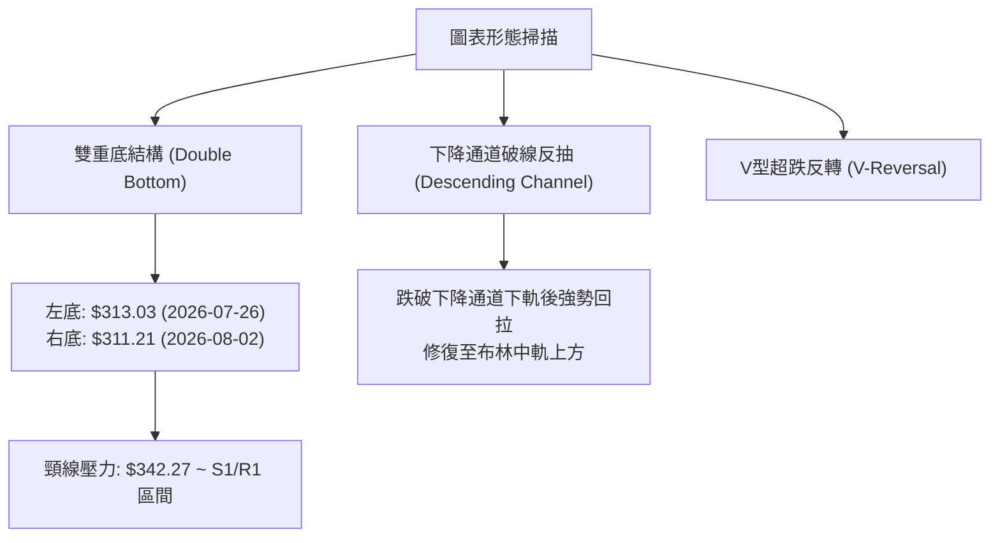

#### 形態識別評估表

| 形態名稱 | 信心度 | 判斷依據（引用技術數據） | 完成度 | 目標價（附嚴格幾何計算式） |
|:---|:---:|:---|:---:|:---|
| **低檔雙重底 (W-Bottom)** | **72%** | 兩次波段低點分別為 2026-07-26 之 **$313.03** 與 2026-08-02 之 **$311.21**（守住 S3 **$297.38**），RSI 底背離確認 | 85% | 頸線（取近期高點 **$342.27**）+ 形態高度（$342.27 - $311.21 = $31.06）= **$373.33**（精確契合 MA50 **$371.09** 與斐波 61.8% **$374.33**） |
| **均線空頭收斂修復** | **80%** | 短天期 MA5 ($334.69) > MA10 ($329.25) > MA20 ($329.14) 向上發散，對抗長天期 MA200 ($406.08) | 60% | 均線乖離回抽目標：指向 MA60 **$380.51** 至 MA120 **$385.24** 阻力區間 |
| **頭肩頂破位延伸** | **35%** | 數據不足以確認完整頭肩架構（信心度 < 50%） | -- | *訊號不足，僅做指標型超跌反彈解讀，不預設大型頂部延伸* |

### 🕯️ 重要 K 線形態分析

| 日期 / 週期 | 收盤價 | K 線組合形態 | 技術面解讀 | 訊號方向 |
|:---|:---:|:---|:---|:---:|
| **2026-07-26** | $313.03 | 長陰破位加速線 (RSI=15.7) | 極度恐慌拋售，週成交量放大至 275.65M，觸發極端超賣 | 🔴 空頭宣洩 |
| **2026-08-02** | $311.21 | 縮量十字星錘頭線 (Hammer) | 探低 $311.21 後獲得買盤支撐，量能萎縮至 198.84M，賣壓衰竭 | 🟢 止跌轉折 |
| **2026-08-09** | $328.58 | 實體中陽線突破 (Bullish Piercing) | 收復 MA20，週 RSI 回升至 34.9，MACD 柱狀圖翻正 (+1.025) | 🟢 確認反彈 |
| **2026-08-16** | $342.27 | 光腳大陽線 (Marubozu) | 突破斐波那契 78.6% ($340.49)，成交量維持 157.13M，多方發力 | 🟢 強勢推進 |

### 📉 ASCII 走勢形態示意圖

```
TSLA 近期日線雙底築底與突破示意圖
價格 ($)
$374.33 ┤                                        [形態理論目標 T1: $373.33]
$355.39 ┤                             ─────── R1 阻力線
$342.27 ┤                           ● (現價突破頸線)
$337.24 ┤                     ╭───╯           S1 支撐
$325.60 ┤               ╭───╯                 S2 支撐
$313.03 ┤   ● (左底)    │
$311.21 ┤       ╰───────● (右底: $311.21，RSI底背離)
$297.38 ┤───────────────────────────────────── S3 (52W絕對低點)
        └──────────────────────────────────────────
           2026-07-26   2026-08-02   2026-08-16
```

---

## 4. 支撐與阻力

### 🗺️ 關鍵價位分布圖（Unicode）

```
TSLA 價位結構分布圖（OHLCV 精確計算）
════════════════════════════════════════════════════════════════════
$418.36 ║████████████████████████████████║ 強阻力 R3 (年線上方重壓區)
$409.28 ║██████████████████████████      ║ 強阻力 R2 (MA200 密集成交區)
$374.33 ║▓▓▓▓▓▓▓▓▓▓▓▓▓▓▓▓▓▓▓▓▓▓          ║ 斐波 61.8% / MA50 匯合阻力帶
$355.39 ║████████████████                ║ 關鍵阻力 R1 (波段突破第一道關卡)
$342.27 ╠════════════════════════════════╣ ◄ 當前價格 ($342.27)
$340.49 ║────────────────────────────────║ 斐波 78.6% 回調位
$337.24 ║▓▓▓▓▓▓▓▓▓▓▓▓                    ║ 近期動態支撐 S1 (短期均線防線)
$325.60 ║████████████████                ║ 中期關鍵支撐 S2 (MA20 防守位)
$297.38 ║████████████████████████████████║ 年度鐵底支撐 S3 (52週最低價)
════════════════════════════════════════════════════════════════════
```

### 🚧 阻力位分析表

| 阻力級別 | 精確價位 | 距現價幅標 | 形成原因與籌碼結構 | 突破難度 | 重要性權重 |
|:---|:---:|:---:|:---|:---:|:---:|
| **R1** | **$355.39** | +3.83% | 近一年波段高點聚類位，前期下跌途中的籌碼套牢反抽密集點 | 🟡 中等 | ★★★★☆ |
| **R2** | **$409.28** | +19.58% | 長期 MA200 ($406.08) 與 MA240 ($407.76) 聚集處，機構籌碼多空分水嶺 | 🔴 極高 | ★★★★★ |
| **R3** | **$418.36** | +22.23% | 近一年重大波段高點聚類，歷史頭部頸線密集換手壓力區 | 🔴 極高 | ★★★★☆ |

### 🛡️ 支撐位分析表

| 支撐級別 | 精確價位 | 距現價幅標 | 形成原因與籌碼結構 | 守住機率 | 重要性權重 |
|:---|:---:|:---:|:---|:---:|:---:|
| **S1** | **$337.24** | -1.47% | 近一年波段低點聚類，短線 MA5 ($334.69) 上方之動態買盤防守點 | 🟢 75% | ★★★☆☆ |
| **S2** | **$325.60** | -4.87% | 近期整理平台低點聚類，MA20 ($329.14) 與 MA10 ($329.25) 共振帶 | 🟢 80% | ★★★★☆ |
| **S3** | **$297.38** | -13.12% | 52週絕對低點 (52W Low)，年內宏觀資金最後一道多頭防線 | 🟢 90% | ★★★★★ |

### 📐 斐波那契回調位分析

依據 52 週完整波動區間（高點 **$498.83** → 低點 **$297.38**，垂直落差 $201.45）精確計算：

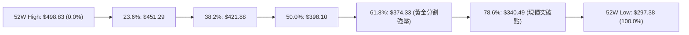

- **當前位置解讀**：現價 **$342.27** 剛剛向上穿透 **78.6% 回調位 ($340.49)**，位於 78.6% ($340.49) 與 61.8% ($374.33) 之間。
- **技術意涵**：78.6% 是深度回調行情的關鍵反轉分界線。成功站上 $340.49 代表自 $297.38 起算的底部超跌反彈已確認成立，向上空間正式被打開至黃金分割 61.8% 壓力位 **$374.33**（同時與雙底理論目標價 $373.33 形成共振）。

---

## 5. 技術指標深度解讀

### 🎛️ 指標訊號總覽

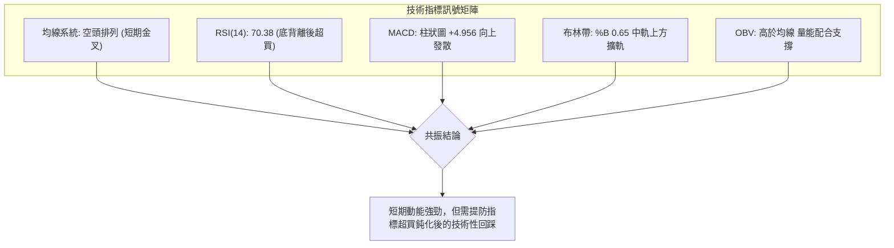

### 📈 移動平均線排列分析

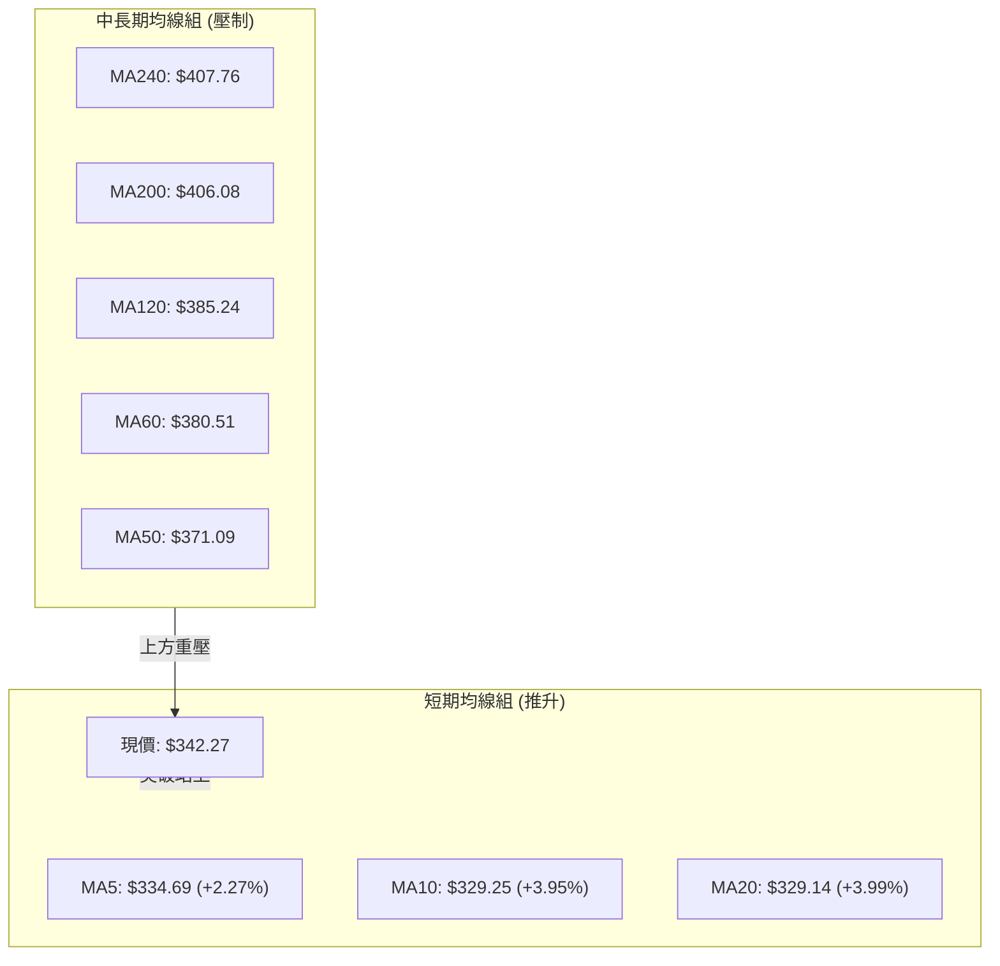

| 均線名稱 | 當前價格 | 乖離率 (Bias) | 趨勢方向 | 狀態與交叉意義 |
|:---|:---:|:---:|:---:|:---|
| **MA5** | $334.69 | +2.27% | ▲ 向上 | 短線超強攻擊線，提供極短線保護 |
| **MA10** | $329.25 | +3.95% | ▲ 向上 | 與 MA20 形成低檔黃金交叉 |
| **MA20** | $329.14 | +3.99% | ▲ 向上 | 突破生命線，扭轉日線級別跌勢 |
| **MA50** | $371.09 | -7.77% | ▼ 向下 | 中期多空分水嶺，第一階段上攻強阻力 |
| **MA60** | $380.51 | -10.05% | ▼ 向下 | 季線下行壓制中 |
| **MA120** | $385.24 | -11.15% | ▼ 向下 | 半年線下行壓制中 |
| **MA200** | $406.08 | -15.71% | ▼ 向下 | 年線重壓區，牛熊分界線 |
| **MA240** | $407.76 | -16.06% | ▼ 向下 | 長期均線空頭排列 (MA20 < MA50 < MA200) |

### 📉 RSI(14) 分析

- **當前數值**：`70.38`
- **強度進度條**：`██████████████░░░░░░ 70.38%` (🔴 進入短線超買區間)

```
0 ──────────── 30 (超賣) ──────────── 50 (中軸) ──────────── 70 (超買) ──●── 100
                                                                   70.38
```

#### 背離深度剖析
- **底背離確認（Bullish Divergence）**：
  - 價格於 2026-07-26 觸及 $313.03 (RSI=15.7)，隨後於 2026-08-02 創下更低收盤價 $311.21。
  - 同期 RSI(14) 卻自 15.7 大幅抬升至 18.1，形成經典的**日線級別標準底背離**。
  - 結論：本波自 $311.21 衝刺至 $342.27 之行情，即為底背離訊號之完美釋放。當前 RSI 達到 70.38，未出現頂背離，但短線存在過熱拉回至 50-60 水平的需求。

### 📊 MACD(12/26/9) 訊號解讀

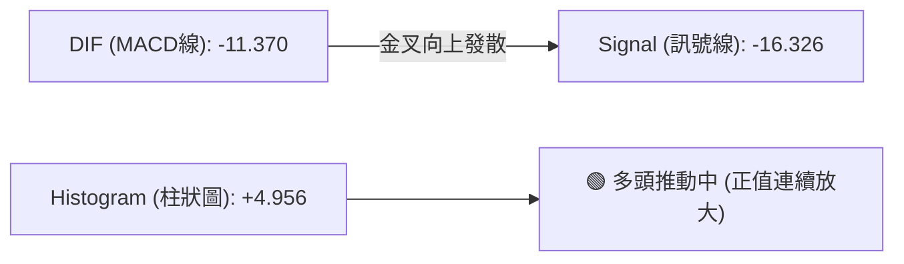

- **數值狀態**：DIF (-11.370) 高於 Signal (-16.326)，差值柱狀圖為 **+4.956**。
- **型態解讀**：MACD 在零軸下方形成深位黃金交叉，柱狀圖連續 4 週擴大（由 -6.930 → +1.025 → +4.956），顯示底部空頭回補動能極其充沛，屬於典型「超跌反彈修復波」，下一階段目標為挑戰零軸阻力。

### 📦 布林通道分析 (Bollinger Bands)

```
TSLA 當前布林通道與價格相對位置
══════════════════════════════════════════════════════════════
 $373.95 ─────────────────────────────────────── 上軌 (Upper Band)
          
 $342.27 ═══════════════════════════════════════ 現價 (Close, %B = 0.65)
          
 $329.14 ─────────────────────────────────────── 中軌 / MA20 (Middle Band)
          
 $284.33 ─────────────────────────────────────── 下軌 (Lower Band)
══════════════════════════════════════════════════════════════
```

- **帶寬與位置**：通道上軌 $373.95、中軌 $329.14、下軌 $284.33。
- **%B 指標**：**0.65**（坐落於中軌與上軌之間的多頭掌控區）。
- **走勢特徵**：價格在經歷下軌開口後迅速反彈，目前強勢站上中軌 $329.14，通道呈現擴軌（Expansion）初期特徵，目標直指上軌 **$373.95**（與斐波 61.8% $374.33 形成完美技術共振）。

### 💹 成交量分析（量價配合度）

- **量能對比**：最新單日成交量 **45,375,100**，超越 20 日均量 **39,828,150**（量比 **1.14x**），高於 50 日均量 **42,641,026**。
- **OBV（能量潮）分析**：OBV 趨勢向上並突破其均線系統，表明資金在 $311-$328 區間呈現實質淨流入，呈現健康的「價漲量增、量在價先」形態，無量價背離隱憂。

---

## 6. 動能與波動率

### ⚡ 動能評估四象限

| 象限 | 動能維度 | 波動率維度 | 當前狀態 | 戰略評估 |
|:---:|:---:|:---:|:---:|:---|
| **Q1 (高動能 / 低波動)** | 強 | 低 | -- | 穩定主升趨勢 |
| **Q2 (弱動能 / 低波動)** | 弱 | 低 | -- | 盤整築底觀望 |
| **Q3 (強動能 / 高波動)** | **強** | **高** | **✓ (TSLA 當前定位)** | **高風險高報酬：超跌反彈強勢推進，波動劇烈** |
| **Q4 (弱動能 / 高波動)** | 弱 | 高 | -- | 恐慌主跌浪 |

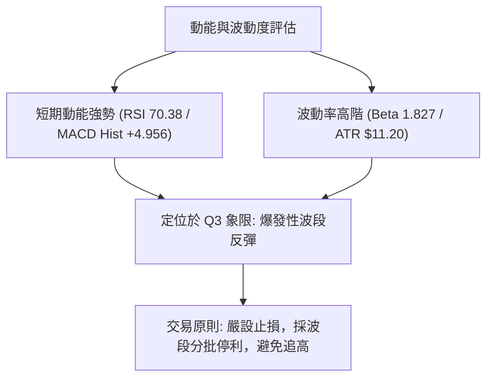

### 📊 ATR 波動率分析

- **ATR(14) 數值**：**$11.20**（佔現價百分比 **3.27%**）。
- **日常波動區間預估**：
  - 單日合理震盪帶：現價 ± 1.0 ATR → **$331.07 ~ $353.47**。
  - 極端波動安全邊際：2.0 ATR → **$22.40**。
- **止損距離建議**：
  - 短線激進止損（1.0 ATR）：$342.27 - $11.20 = **$331.07**。
  - 波段防守止損（1.5 ATR）：$342.27 - ($11.20 × 1.5) = **$325.47**（精確對接 S2 支撐位 **$325.60**）。

### 📐 Beta 與市場相關性

- **Beta 係數**：**1.827**（高 Beta 特性）。
- **市場敏感度解讀**：TSLA 波動度為 S&P 500 指數的 1.83 倍。在大盤多頭環境下具備極高的向上進攻彈性，但若大盤拉回，其跌幅亦將顯著放大。當前高 Beta 配合動能回升，適合波段動量交易者。

---

## 7. 多時框架總結

### 📋 時框架評分表

| 時框架 | 趨勢方向 | 動能狀態 | 均線排列 | 圖表形態 | 綜合評分 | 戰術建議 |
|:---|:---:|:---:|:---:|:---:|:---:|:---|
| **長期 (月線)** | 🔴 下行偏空 | 弱勢築底 | 空頭 (位於MA200下方) | 頂部回調探底 | 30/100 | 逢高減碼長線套牢籌碼 |
| **中期 (週線)** | 🟡 跌勢趨緩 | 修復回升 | 空頭發散收斂中 | 雙底構築初期 | 50/100 | 區間震盪看待，逢低布局 |
| **短期 (日線)** | 🟢 強勢反彈 | 超買偏多 | 短期金叉 (站上MA20) | 突破頸線發力 | 75/100 | 順勢短多，緊盯 R1/布林上軌 |

### 🔲 綜合訊號矩陣

```
┌─────────────────┬────────────────────────────────────────────────────────┐
│ 維度            │ 短期 (日線)          中期 (週線)          長期 (月線)      │
├─────────────────┼────────────────────────────────────────────────────────┤
│ 趨勢判定        │ 🟢 向上突破          🟡 止跌盤整          🔴 下降通道      │
│ 動能評估 (MACD) │ 🟢 柱狀擴大          🟢 低檔金叉          🔴 零軸下方      │
│ 震盪指標 (RSI)  │ 🔴 70.38 (超買)      🟡 50.30 (中性)      🔴 38.60 (弱勢)  │
│ 均線系統        │ 🟢 突破 MA20         🔴 受制 MA50         🔴 遠離 MA200    │
│ 量能結構        │ 🟢 放量進攻          🟡 縮量見底          🔴 資金流出      │
└─────────────────┴────────────────────────────────────────────────────────┘
```

### ⚖️ 多時框收斂結論

依據多時框收斂規則：
1. **趨勢/盤整環境判定**：當前 ADX(14) 為 **25.49 (>25)**，符合**趨勢行情（Trend Regime）**標準。
2. **優先級收斂取捨**：依規則，趨勢行情下以中長期方向（MA50 $371.09 / MA200 $406.08 / -DI > +DI）為主導趨勢，日線強勢反彈僅作為尋找次級折返進場點的依據。
3. **唯一方向性結論**：**【中性區間偏多反彈（Counter-Trend Rebound）】**。
   - 中長線大結構仍處於空頭修復期，但日線底背離與突破 MA20 帶動的強勁反彈不可忽視。短線操作應聚焦於自現價 **$342.27** 向上挑戰 **R1 ($355.39)** 及布林上軌/MA50 共振帶 **$371.09 ~ $374.33** 之波段反彈行情，並在重要阻力位果斷獲利了結。

---

## 8. 交易策略建議

### 🗺️ 策略決策流程圖

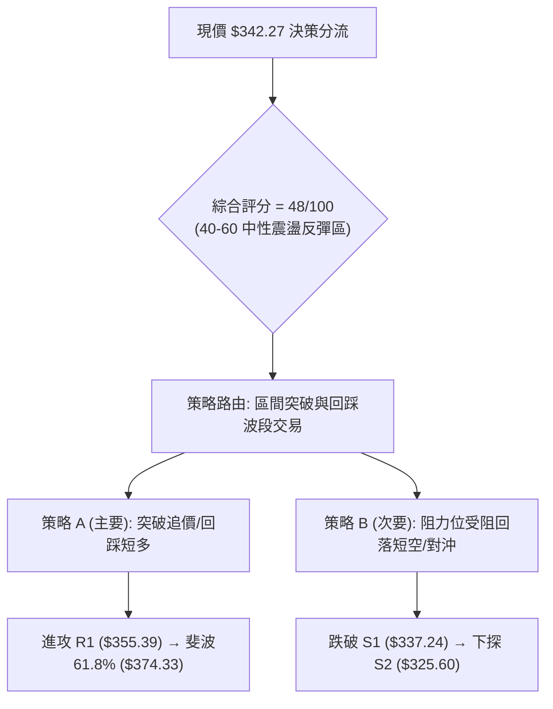

### 🧭 策略路由（依評分卡分流）

> **當前主策略方向 = 【中性區間偏多波段反彈】（依綜合評分 48/100，介於 40–60 區間操作帶，以布林通道與斐波那契回調位為核心交易邊界）**

### 🎯 價格情境階梯（Price Scenarios）

價位完全嚴格引用本報告第 4 章由 OHLCV 與斐波那契計算之數值：

| 觸發條件 | 第一目標 (T1) | 第二目標 (T2) | 延伸目標 (T3) | 情境技術含義 |
|:---|:---:|:---:|:---:|:---|
| **強勢突破 R1 ($355.39)** | **$374.33** (斐波 61.8%) | **$409.28** (強阻力 R2) | **$418.36** (強阻力 R3) | 空頭結構徹底逆轉，挑戰年線大關 |
| **維持現價區間震盪** | **$355.39** (阻力 R1) | **$337.24** (支撐 S1) | **$325.60** (支撐 S2) | 日線消化 RSI 超買，以時間換取空間 |
| **失守跌破 S1 ($337.24)** | **$325.60** (關鍵支撐 S2) | **$297.38** (年度低點 S3) | -- | 反彈夭折，重新下探 52 週鐵底 |

### 📊 情境機率分佈

| 情境劇本 | 發生機率 | 主要技術指標支撐依據 |
|:---|:---:|:---|
| **情境一：延續反彈 (上行挑戰 R1/MA50)** | **55%** | MACD 柱狀圖 (+4.956) 持續發散、OBV 支撐量價齊揚、突破 MA20 ($329.14) |
| **情境二：高檔震盪 (消化 RSI 超買)** | **30%** | 日線 RSI 達 70.38 進入超買區、Stoch KD 高檔鈍化，需回踩 S1 ($337.24) 整固 |
| **情境三：反彈失敗 (破位下探 S2/S3)** | **15%** | 中長線均線仍呈空頭排列 (MA200 $406.08 下行)、ADX 中 -DI 仍微幅佔優 |

### 🟢 主策略詳情

本報告綜合評分 48/100，主推順應短線動能的波段反彈策略，並提供回踩確認與突破追價兩種進場模式：

| 策略要素 | 策略 A（回踩支撐逢低做多） | 策略 B（突破 R1 追擊動量多單） |
|:---|:---|:---|
| **適用場景** | RSI 超買短線拉回，回踩支撐不破 | 買盤強勁直接放量長陽突破 R1 阻力 |
| **進場條件** | 回踩 S1 獲得支撐，日線收下影線 | 日線收盤價有效突破 R1 ($355.39) |
| **進場價格** | **$337.24** (S1 支撐位) | **$356.00** (突破 R1 後確認進場) |
| **目標價 T1** | **$355.39** (R1 阻力位，漲幅 +5.38%) | **$374.33** (斐波 61.8% / 布林上軌，+5.15%) |
| **目標價 T2** | **$374.33** (形態理論目標，漲幅 +11.00%) | **$409.28** (R2 阻力 / MA200，+14.97%) |
| **止損價格** | **$325.60** (S2 支撐位下方，跌幅 -3.45%) | **$342.27** (回跌至現價 / 假突破止損，-3.86%) |
| **風險報酬比 (R:R)**| **1 : 3.19** (以 T2 計算) | **1 : 3.88** (以 T2 計算) |
| **預估成功率** | **65%** | **55%** |
| **建議倉位** | **15% ~ 20%** (標準波段倉位) | **10% ~ 15%** (動量突破倉位) |

### 🔴 反向風險觸發點（對沖提示）

- **多單全面撤退/對沖觸發點**：若價格帶量跌破 **S2 ($325.60)** 且日線收盤確認，意味 MA20 失守且雙底結構遭破壞，主策略完全失效。
- **對沖處置建議**：立即清空所有反彈多單，並可利用反向 ETF 或保護性 Put 鎖定利潤，空方延伸目標下看 **S3 ($297.38)**。

### ⭐ 整體訊號強度評星

```
做多訊號強度：★★★☆☆  (3/5星 - 短線動能強勁，但受制中長均線)
做空訊號強度：★★☆☆☆  (2/5星 - 空頭動能衰竭，處於空頭回補期)
整體分析可信度：★★★★☆  (4/5星 - 量價與斐波那契點位高度共振)
```

---

## 9. 風險提示與監控

### ✅ 關鍵監控指標 Checklist

```
╔══════════════════════════════════════════════════════════════════╗
║                   每日交易風控監控清單 (Checklist)               ║
╠══════════════════════════════════════════════════════════════════╣
║ [ ] 價格是否維持在 MA20 ($329.14) 與 S1 ($337.24) 上方？         ║
║ [ ] RSI(14) 是否在 70 以上出現頂背離或迅速跌破 50 中軸？         ║
║ [ ] MACD 柱狀圖是否持續維持在正值區 (+4.956 以上)？              ║
║ [ ] 每日成交量是否維持在 20 日均量 (39.83M) 之上？              ║
║ [ ] 上攻 R1 ($355.39) 時是否遭遇巨量長上影線阻擊？               ║
║ [ ] ADX 趨勢指標中 +DI 是否成功黃金交叉上穿 -DI？                ║
╚══════════════════════════════════════════════════════════════════╝
```

### ⚠️ 風險場景分析

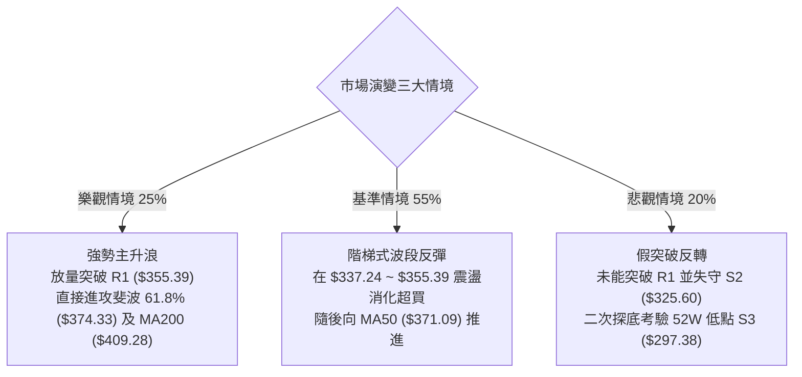

### 🛡️ 風險管理重要提醒

1. **嚴禁忽視超買訊號**：日線 RSI 已達 **70.38**，Stoch %K/%D 均高於 83。歷史數據顯示 TSLA 在 RSI > 70 後通常會出現 1-3 天的技術性震盪整理，現價位不宜使用高槓桿盲目追高。
2. **波動度適應（ATR 紀律）**：TSLA 當前 ATR 高達 **$11.20**，單日波動幅度可達 3% 以上。倉位配置不宜超過總資金的 **25%**，單筆交易最大虧損應嚴格控制在總資產的 **1.0% ~ 1.5%** 範圍內。
3. **宏觀與基本面風險**：公司 Forward P/E 高達 157 倍，Beta 為 1.827，對整體利率環境與科技股市場情緒極為敏感，操作必須嚴守技術止損位。

---

## 📋 報告總結

```
╔══════════════════════════════════════════════════════════════════╗
║                   TSLA 技術分析總結儀表板                         ║
╠══════════════════════════════════════════════════════════════════╣
║ 報告日期：2026-08-16              當前價格：$342.27              ║
║ 技術評級：⚖️ 中性偏多反彈 (48/100) 52週區間位置：22.3% (低位)      ║
╠══════════════════════════════════════════════════════════════════╣
║ 趨勢結構診斷：                                                   ║
║ ├─ 長期趨勢 (月線)：🔴 空頭壓制 (受制於 MA200 $406.08)          ║
║ ├─ 中期趨勢 (週線)：🟡 築底震盪 (守住 S3 $297.38，尋求均線修復) ║
║ └─ 短期趨勢 (日線)：🟢 強勢反彈 (底背離發酵，突破 MA20 $329.14) ║
╠══════════════════════════════════════════════════════════════════╣
║ 核心價位導航：                                                   ║
║ ├─ 關鍵第一阻力 (R1)：$355.39      近端動態支撐 (S1)：$337.24    ║
║ ├─ 中期核心阻力 (R2)：$409.28      關鍵防守支撐 (S2)：$325.60    ║
║ └─ 年線重壓阻力 (R3)：$418.36      年度鐵底支撐 (S3)：$297.38    ║
╠══════════════════════════════════════════════════════════════════╣
║ 最優交易策略推薦：                                               ║
║ 1. 🥇 首選策略：回踩 S1 ($337.24) 建立多單，止損 $325.60，      ║
║                 目標 T1: $355.39 / T2: $374.33 (R:R = 1:3.19)   ║
║ 2. 🥈 次選策略：放量實體突破 R1 ($355.39) 追多，目標 $374.33    ║
║ 3. 🥉 風控防線：收盤跌破 S2 ($325.60) 觸發全面止損離場對沖      ║
╚══════════════════════════════════════════════════════════════════╝
```

---

> ⚠️ **免責聲明**：本報告為技術分析研究成果，所有數據及推算均嚴格基於歷史量價資訊與量化指標。本報告**僅供學術研究與投資參考**，**不構成任何形式的個別投資諮詢或買賣邀約**。金融市場具高度波動風險，投資人應獨立審慎評估自身風險承受能力並自負盈虧。

---
*報告生成時間：2026-08-16 ｜ 數據來源：Yahoo Finance ｜ 分析架構：多時框技術分析模型*