# TSLA 技術分析報告

> **報告日期**：2026-08-18 ｜ **語言**：繁體中文 ｜ **數據來源**：Yahoo Finance ｜ **當前價格**：$336.87

---

## 目錄

| 章節 | 內容 |
|------|------|
| [1. 技術面概覽](#1-技術面概覽) | 訊號儀表板、核心指標、評分卡 |
| [2. 趨勢分析](#2-趨勢分析) | 多時框趨勢、長中短期走勢、ADX解讀 |
| [3. 圖表形態分析](#3-圖表形態分析) | 形態識別、K線組合、目標價推算 |
| [4. 支撐與阻力](#4-支撐與阻力) | 關鍵價位、斐波那契回調結構 |
| [5. 技術指標深度解讀](#5-技術指標深度解讀) | MA/RSI/MACD/布林/成交量全面剖析 |
| [6. 動能與波動率](#6-動能與波動率) | 動能評估四象限、ATR、Beta 風險分析 |
| [7. 多時框架總結](#7-多時框架總結) | 時框架評分矩陣與方向收斂 |
| [8. 交易策略建議](#8-交易策略建議) | 策略路由、多空價格階梯、風報比精算 |
| [9. 風險提示與監控](#9-風險提示與監控) | 關鍵監控清單、情境推演與風控指引 |
| [10. 報告總結](#-報告總結) | 核心結論與執行路徑匯總 |

---

## 1. 技術面概覽

### 🎯 技術訊號儀表板

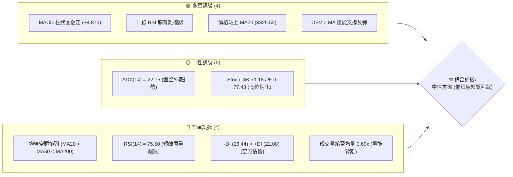

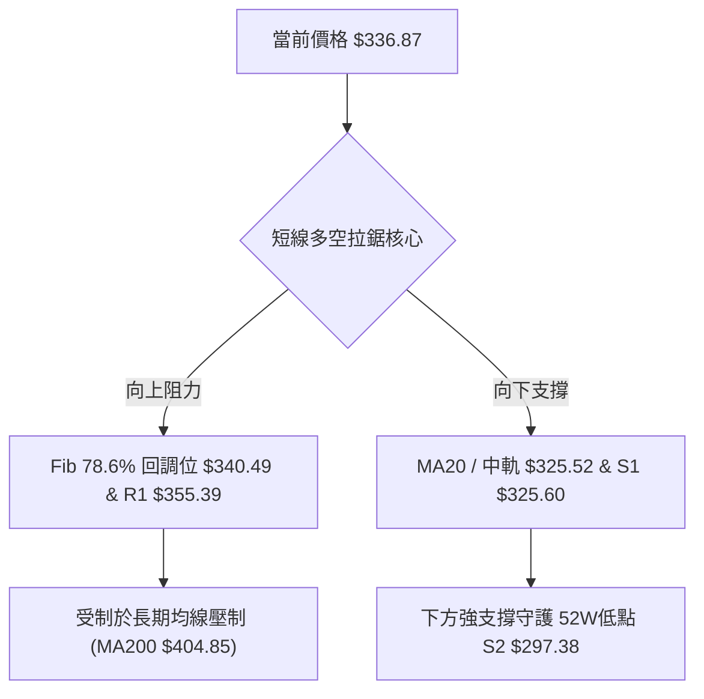

### 📊 核心指標速覽表

| 指標類別 | 指標名稱 | 當前數值 | 訊號 | 解讀 |
|:---|:---|:---|:---:|:---|
| **價格** | 當前價格 | $336.87 | 🟡 | 位於52週區間19.6%，處於自低點反彈但受制於阻力區間 |
| **均線** | MA20 | $325.52 | 🟢 | 價格位於 MA20 上方 (+3.49%)，短線反彈動能延續 |
| **均線** | MA50 | $368.42 | 🔴 | 價格位於 MA50 下方 (-8.56%)，中期趨勢仍處於修正格局 |
| **均線** | MA200 | $404.85 | 🔴 | 價格位於 MA200 下方 (-16.79%)，長期牛熊分界線構成重壓 |
| **動能** | RSI(14) | 75.50 | 🔴 | 日線進入超買區 (>70)，短線追高風險急劇攀升 |
| **動能** | MACD | -8.966 / Sig: -13.838 | 🟢 | 負值區低位金叉，柱狀圖 (+4.873) 擴張，反彈動能強勁 |
| **動能** | Stoch %K / %D | 71.18 / 77.43 | 🟡 | 高位徘徊且出現死叉跡象，短線動能面臨衰竭 |
| **趨勢** | ADX(14) | 22.75 (-DI: 26.44) | 🟡 | ADX < 25 表明處於無趨勢/弱趨勢盤整，空方仍略佔主導 |
| **通道** | 布林帶 (%B) | $292.04 - $359.01 (%B: 0.67)| 🟢 | 站上中軌 $325.52，朝上軌 $359.01 挺進 |
| **量能** | 20日成交量比 | 27.11M / 39.16M (0.69x) | 🔴 | 量能萎縮，反彈缺乏機構大資金積極追價確認 |
| **波動** | ATR(14) | $10.86 (3.22%) | 🟡 | 波動率處於中等水準，日均震盪區間約 $11 |

### 🏆 技術評分卡

```
╔════════════════════════════════════════════════════════════════╗
║                 技術評分卡 — TSLA (2026-08-18)                ║
╠════════════════════════════════════════════════════════════════╣
║ 趨勢強度      ████████░░░░░░░░░░░░  40/100  🔴 空頭佔優/盤整   ║
║ 動能指標      ████████████░░░░░░░░  60/100  🟡 短多但超買      ║
║ 支撐穩定度    ██████████████░░░░░░  70/100  🟢 S1 $325.60 穩固 ║
║ 成交量配合    ████████░░░░░░░░░░░░  40/100  🔴 量價背離(縮量)  ║
║ 形態完整度    ████████████░░░░░░░░  60/100  🟡 築底反彈階段    ║
║ 均線排列      ██████░░░░░░░░░░░░░░  30/100  🔴 MA20<50<200空頭 ║
╠════════════════════════════════════════════════════════════════╣
║ 綜合評分      ██████████░░░░░░░░░░  50/100  ⚖️ 中性觀望/區間   ║
╚════════════════════════════════════════════════════════════════╝
```

---

## 2. 趨勢分析

### 🌐 多時框趨勢分析

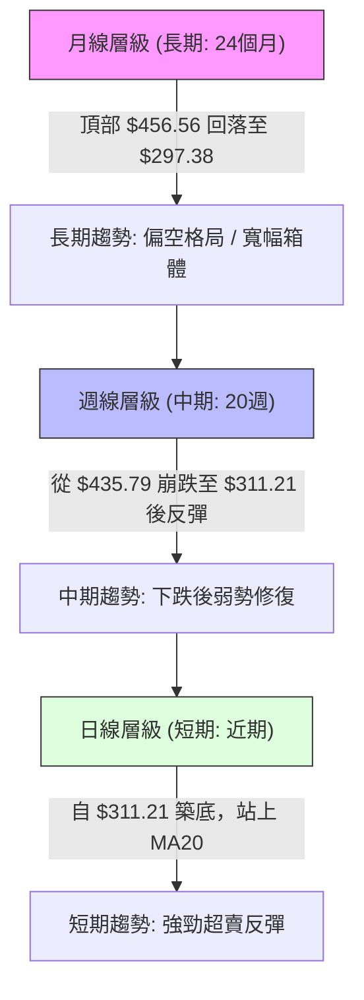

### 📈 長期趨勢 — 12個月走勢圖（Unicode）

```
TSLA 月線走勢圖（過去12個月：2025-08 至 2026-08）
價格軸 ($)
$460 ┤                  ●(10月 $456.56 頂部)
$440 ┤              ●   │     ●(12月 $449.72)
$420 ┤              │   │  ●  │                 ●(05月 $435.79 次高)
$400 ┤              │   │  │  │  ●  ●           │  ●
$380 ┤              │   │  │  │  │  │     ●     │  │
$360 ┤              │   │  │  │  │  │  ●  │     │  │
$340 ┤        ●     │   │  │  │  │  │  │  │     │  │        ●(現在 $336.87)
$320 ┤  ●     │     │   │  │  │  │  │  │  │     │  │     ●  │
$300 ┤  │     │     │   │  │  │  │  │  │  │     │  │  ●  │  │ (07月 $311.21)
     └──┴─────┴─────┴───┴──┴──┴──┴──┴──┴──┴─────┴──┴──┴──┴──┴────────
       08月  09月  10月 11 12 01 02 03 04 05    06 07 08 (2026)
```

#### 走勢特徵分析表格

| 階段區間 | 時間 | 起始/結束價 | 漲跌幅 | 走勢特徵與量價解讀 |
|:---|:---|:---|:---:|:---|
| **主升浪峰值** | 2025-08 ~ 2025-10 | $333.87 → $456.56 | +36.75% | 多頭爆發性拉升，創下波段高點 $456.56，市場情緒狂熱 |
| **高位雙頂震盪**| 2025-11 ~ 2026-01 | $430.17 → $430.41 | -0.04% | 於 $430~$450 構築高位雙頂分發形態，量能逐步衰退 |
| **主跌推動浪** | 2026-02 ~ 2026-03 | $402.51 → $371.75 | -7.64% | 跌破多道中期均線，空頭排列確立，市場拋壓加劇 |
| **次級反彈頂** | 2026-04 ~ 2026-05 | $381.63 → $435.79 | +14.19% | 弱勢反彈構築頭肩頂之右肩 ($435.79)，量能未能創新高 |
| **崩跌探底浪** | 2026-06 ~ 2026-07 | $420.60 → $311.21 | -26.01% | 斷崖式下跌，跌破所有均線，於 $297.38 (52W低點) 附近獲得支撐 |
| **技術性修復** | 2026-08 (至今) | $311.21 → $336.87 | +8.24% | 觸底超跌反彈，指標低位金叉，目前受阻於 Fib 78.6% ($340.49) |

### 📊 中期趨勢（週線分析）

```
TSLA 近20週核心價格結構與多空分水嶺
══════════════════════════════════════════════════════════════════
$435.79 ──┬────────────────────────────────────────── 5月反彈高點 (頭肩頂右肩)
          │
$409.28 ──┼────────────────────────────────────────── R2 強阻力 (MA200 附近)
          │
$355.39 ──┼────────────────────────────────────────── R1 關鍵阻力 (波段密集成交區)
$340.49 ──┼────────────────────────────────────────── 斐波那契 78.6% 回調位
$336.87 ──*◄ 當前價格 (受阻於 78.6% 回調位)
$325.60 ──┼────────────────────────────────────────── S1 近期支撐 / MA20 ($325.52)
          │
$297.38 ──┴────────────────────────────────────────── S2 強支撐 (52週最低點聚類)
══════════════════════════════════════════════════════════════════
```

### ⚡ 趨勢強度評估（ADX 解讀）

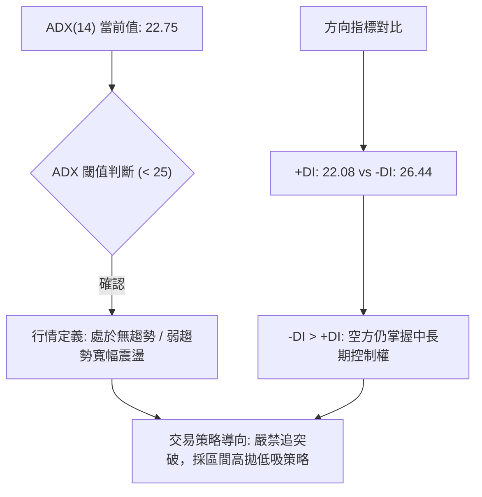

#### ADX 趨勢強度量化對照表

| 指標名稱 | 當前數值 | 參考標準 | 當前狀態評估 | 實戰指導意義 |
|:---|:---|:---|:---|:---|
| **ADX (14)** | **22.75** | < 20 極弱; 20-25 弱/盤整; >25 趨勢; >40 強趨勢 | 🟡 弱趨勢/區間震盪 | 趨勢跟隨系統容易失效，應轉向均值回歸交易 |
| **+DI (14)** | **22.08** | 多方攻擊動能 | 🟡 偏弱 | 多頭僅屬於超跌修復動能，尚未形成主升推動力 |
| **-DI (14)** | **26.44** | 空方主導動能 | 🔴 偏強 | 雖然空方動能減弱，但數值依然高於多方 |
| **DI 差值** | **-4.36** | 正值多頭 / 負值空頭 | 🔴 空方佔優 | 反彈隨時面臨上方阻力層的空頭壓制 |

---

## 3. 圖表形態分析

### 🔍 形態識別系統

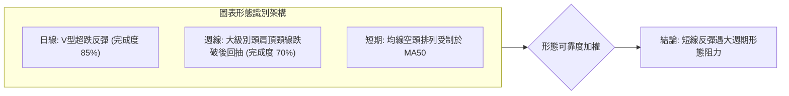

#### 形態判斷依據與目標價測算（依規則 15）

| 形態名稱 | 信心度 | 判斷依據（嚴格引用數據） | 完成度 | 目標價（附嚴格計算式） | 形態意義 |
|:---|:---:|:---|:---:|:---|:---|
| **大級別頭肩頂 (回抽確認)** | **75%** | 左肩 $456.56 (2025-10)、頭部 $498.83 (52W高)、右肩 $435.79 (2026-05)；頸線跌破點 $374.33 (Fib 61.8%) | **70%** | 頭部高度 = $498.83 - $374.33 = $124.50<br>量度跌幅 = $374.33 - $124.50 = **$249.83** (遠期空頭目標) | 中長期頂部已確立，當前反彈屬於跌破頸線後的右側回抽測試 |
| **短線雙重底 (微型築底)** | **65%** | 低點一: 2026-07-26 週收盤 $313.03<br>低點二: 2026-08-02 週收盤 $311.21 (守住 S2 $297.38)<br>頸線位置: S1 $325.60 | **85%** | 形態高度 = $325.60 - $311.21 = $14.39<br>向上量度目標 = $325.60 + $14.39 = **$339.99** (接近當前價 $336.87) | 短期底部形態目標已基本達成，進一步上行空間受限 |
| **布林帶回歸形態** | **80%** | 價格自 7 月底跌破布林下軌 $292.04 後強勢向中軌 $325.52 回歸並向上軌發起衝擊 | **90%** | 目標為布林上軌 = **$359.01** (與 R1 $355.39 共振) | 短線強勢均值回歸行情正在進入後半段 |

### 🕯️ 重要K線形態分析

| 日期/月份 | 收盤價 | K線形態特徵 | 深度量價解讀 | 訊號方向 |
|:---|:---:|:---|:---|:---:|
| **2026-05-31** | $435.79 | 長上影流星線 (右肩頂) | 多頭最後一次上攻乏力，週成交量萎縮至 1.67 億股，高位買盤耗盡 | 🔴 強烈看跌 |
| **2026-07-26** | $313.03 | 大陰線破位放量跌 | 恐慌性拋盤湧出，週成交量放大至 2.75 億股，RSI 崩跌至 15.7 極度超賣 | 🔴 恐慌拋售 |
| **2026-08-02** | $311.21 | 錘頭十字星 (底分型) | 股價探底 $297.38 (52W低點) 後收回，下影線長，量能縮至 1.98 億股，賣壓衰竭 | 🟢 止跌企穩 |
| **2026-08-16** | $342.27 | 中陽線反包突破 | 突破 MA20 ($325.52) 與 S1 ($325.60)，MACD 柱翻正，多頭短線奪回主導權 | 🟢 短線看多 |
| **2026-08-23** | $336.87 | 高位長上影小陰線 (當前) | 觸及 Fib 78.6% ($340.49) 出現受阻回落，RSI 達 75.50 超買，量能萎縮 | 🔴 滯漲回調 |

### 📉 ASCII 走勢形態示意圖

```
TSLA 中短期日線「雙底回抽與頸線受阻」形態示意圖
──────────────────────────────────────────────────────────────────
$355.39 ─── R1 強阻力區間 ─────────────────────────────────────────
             /   \ 
$340.49 ────/─────\────── Fib 78.6% 壓力位 (現價 $336.87 正在此處受阻)
           /       ▲ [當前阻力受挫]
$325.60 ──/─────────\──── 頸線位置 / MA20 ($325.52) ──【突破確認點】
         /           \
$313.03 ●             ● $311.21 (雙底結構：07/26 與 08/02 低點)
         \           /
$297.38 ──▼─────────▼──── 52W 低點 S2 強支撐線
──────────────────────────────────────────────────────────────────
```

---

## 4. 支撐與阻力

### 🗺️ 關鍵價位分布圖（Unicode）

```
TSLA 關鍵價位與籌碼結構分布圖 (嚴格引用 OHLCV 計算數據)
═══════════════════════════════════════════════════════════════════
$498.83 ║████████████████████████████████║ 52週歷史最高點 (0.0% Fib)
$451.29 ║██████████████████████          ║ Fib 23.6% 回調位
$418.36 ║████████████████████████        ║ 強阻力 R3 (年內波段高點聚類)
$409.28 ║██████████████████████████      ║ 阻力 R2 / MA200 ($404.85) 重壓區
$374.33 ║██████████████████              ║ Fib 61.8% / MA50 ($368.42)
$355.39 ║████████████████████████        ║ 關鍵阻力 R1 (布林上軌 $359.01)
$340.49 ║████████████████                ║ Fib 78.6% 第一道阻力關卡
$336.87 ╠════════════════════════════════╣ ◄─── 當前現價 ($336.87)
$325.60 ║▓▓▓▓▓▓▓▓▓▓▓▓▓▓▓▓▓▓▓▓▓▓▓▓        ║ 近期支撐 S1 / MA20 ($325.52)
$297.38 ║████████████████████████████████║ 強支撐 S2 / 52週最低點 (100.0% Fib)
═══════════════════════════════════════════════════════════════════
```

### 🚧 阻力位分析表

| 阻力級別 | 價位 | 形成原因與技術共振 | 突破難度 | 重要性評級 |
|:---|:---:|:---|:---:|:---:|
| **R1 (近端阻力)** | **$355.39** | 近一年波段高點密集群，共振日線布林通道上軌 ($359.01) | 中等偏高 | 🟢🟢🟢 (短線多頭天花板) |
| **R2 (中期阻力)** | **$409.28** | 週線級別重壓區，共振 200 日牛熊均線 MA200 ($404.85) 及 MA240 ($407.81) | 極高 | 🔴🔴🔴 (中期多空分水嶺) |
| **R3 (強阻力)** | **$418.36** | 歷史密集成交籌碼峰頂部，接近 Fib 38.2% ($421.88) | 極高 | 🔴🔴🔴 (牛市重啟確認線) |

### 🛡️ 支撐位分析表

| 支撐級別 | 價位 | 形成原因與技術共振 | 守住機率 | 重要性評級 |
|:---|:---:|:---|:---:|:---:|
| **S1 (近端支撐)** | **$325.60** | 近一年波段低點聚類，精準共振 20 日均線 MA20 ($325.52) 與布林中軌 | 70% | 🟢🟢🟢 (短線回踩防守底線) |
| **S2 (極限支撐)** | **$297.38** | 52 週最低點 (2026-07 探底低點)，斐波那契 100.0% 極限支撐位 | 85% | 🟢🟢🟢🟢 (中期生命線) |
| **S3 (延伸支撐)** | **無** | *數據中未偵測到低於 S2 之波段聚類數據* | — | — |

### 📐 斐波那契回調位分析

依據 52 週波動區間：**最低點 $297.38 → 最高點 $498.83**（波幅 $201.45）進行嚴格測算：

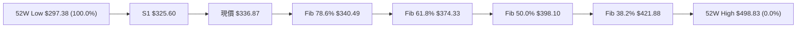

- **當前位置解讀**：現價 **$336.87** 精確處於 **Fib 100.0% ($297.38)** 與 **Fib 78.6% ($340.49)** 之間。
- **技術意義**：
  1. 股價正測試 Fib 78.6% ($340.49) 的第一道關鍵阻力。若無法帶量有效收復 $340.49，則本次反彈僅為弱勢技術回抽，隨時可能回測 S1 ($325.60)。
  2. 若能有效突破 $340.49，上方目標將依序指向黃金分割位 Fib 61.8% ($374.33) 與 Fib 50.0% ($398.10)。

---

## 5. 技術指標深度解讀

### 🎛️ 指標訊號總覽

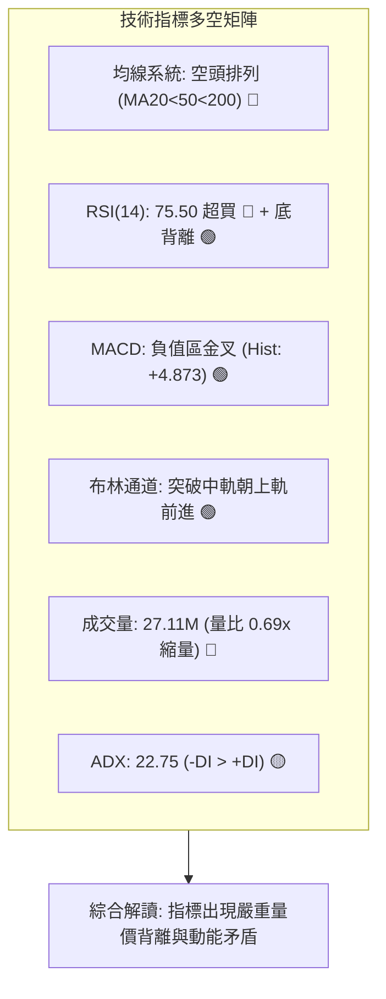

### 📈 移動平均線排列分析

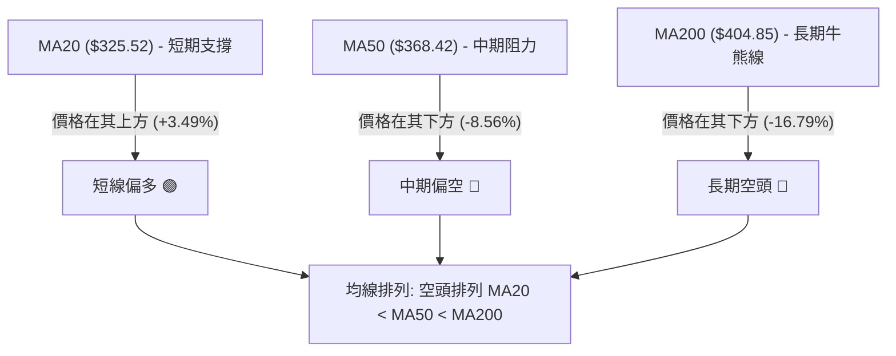

#### 均線各週期偏離度分析表

| 均線名稱 | 數值 | 距離現價幅度 | 排列方向 | 走勢特徵與技術含義 |
|:---|:---:|:---:|:---:|:---|
| **MA 5** | $337.18 | -0.09% | 走平 | 5日線與現價重合，短線攻勢出現停滯跡象 |
| **MA 10**| $331.93 | +1.49% | 向上 ▲ | 短期助漲支撐，回踩第一緩衝線 |
| **MA 20**| $325.52 | +3.49% | 向上 ▲ | 短線多空分水嶺，共振支撐 S1 ($325.60) |
| **MA 60**| $377.86 | -10.85% | 向下 ▼ | 中期下行壓力帶，空頭防線 |
| **MA120**| $383.98 | -12.27% | 向下 ▼ | 半年線壓制，長期籌碼套牢區 |
| **MA200**| $404.85 | -16.79% | 向下 ▼ | 年線壓制，判定TSLA處於技術性熊市區間 |
| **MA240**| $407.81 | -17.40% | 向下 ▼ | 長期牛熊邊界，阻力 R2 ($409.28) 所在 |

### 📉 RSI(14) 分析

- **當前數值**：**75.50** 🔴（已進入 >70 嚴重超買區間）
- **進度條展示**：
  ```
  RSI(14): [███████████████████████████████████░░░░░] 75.50% (超買警戒)
           0        30(超賣)     50(中性)    70(超買) 100
  ```
- **背離判斷與結論**：
  - **底背離確認**：股價在 2026-07-26 創低 $313.03 (RSI: 15.7)，隨後 2026-08-02 股價再探低 $311.21，但 RSI 抬升至 18.1，形成經典的**日線級別底背離**（Bullish Divergence），直接引發了隨後自 $311.21 至 $342.27 的強力反彈。
  - **當前超買警訊**：經過連續兩週反彈，RSI 迅速由 18.1 飆升至 75.50。在均線空頭排列（MA20<MA50<MA200）的熊市修復波中，**超買指標極易引發快速的獲利回吐**，需高度警惕短線回調風險。

### 📊 MACD(12/26/9) 訊號解讀

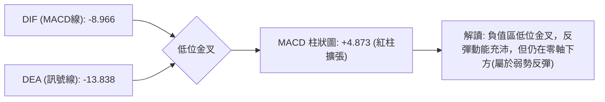

- **MACD 線**：-8.966
- **Signal 線**：-13.838
- **柱狀圖 (Histogram)**：+4.873（🟢 持續為正，多頭動能修復中）
- **結構研判**：雙線處於零軸下方（負值區），表示宏觀趨勢仍由空頭主導；但零軸下方的黃金交叉通常具備強勁的短線技術反彈力道，目前紅柱尚在放大，支撐股價維持在 MA20 之上。

### 📦 布林通道分析

```
TSLA 布林通道 (20, 2) 結構示意圖
──────────────────────────────────────────────────────────────────
$359.01 ──┬── 上軌 ────────────────────────────────────────────────
          │   
$336.87 ──*◄── 現價位置 (%B = 0.67，位於中軌與上軌之間)
          │   
$325.52 ──┼── 中軌 (MA20) ────────────────────────────────────────
          │   
$292.04 ──┴── 下軌 ────────────────────────────────────────────────
──────────────────────────────────────────────────────────────────
```

- **通道帶寬**：通道處於收口後的微幅發散狀態，上軌 $359.01 構成上方動態極限阻力。
- **%B 指標**：0.67，顯示價格自超賣區（下軌 $292.04）強勁回升至中軌上方，短線多頭掌控通道上半部，但在觸及上軌 $359.01 之前，面臨 R1 $355.39 的密集反壓。

### 💹 成交量分析（量價配合度）

```
成交量對比進度條 (最新 vs 20日均量):
最新成交量:  [█████████████░░░░░░] 27.11M (量比: 0.69x)
20日均量:    [███████████████████] 39.16M
50日均量:    [████████████████████] 41.73M
```

- **量價背離現象**：TSLA 股價自 7 月底反彈至今，成交量呈現**顯著量縮**（2026-08-23 週僅 53.15M，最新日成交量僅 27.11M，量比僅 0.69x）。
- **OBV 趨勢解讀**：數據顯示「OBV > MA → 量能支撐上漲」，顯示前期有存量主力資金在低位低吸鎖倉；但「縮量上漲」在技術上代表**買盤追高意願不足，主要由空頭回補推動**，一旦空頭回補結束且無新增量能進場，價格將在阻力位 R1 ($355.39) 或 Fib 78.6% ($340.49) 處快速受阻。

---

## 6. 動能與波動率

### ⚡ 動能評估四象限

| 象限 | 動能維度 | 波動維度 | 典型特徵 | 當前狀態評估 | 策略應對 |
|:---|:---:|:---:|:---|:---:|:---|
| **Q1 (高動能·低波動)** | 強 | 低 | 穩健單邊趨勢 | — | 趨勢加碼 |
| **Q2 (弱動能·低波動)** | 弱 | 低 | 窄幅盤整沉寂 | — | 突破前埋伏 |
| **Q3 (強動能·高波動)** | 強 | 高 | 劇烈單邊行情 / 主升跌浪 | — | 嚴格跟隨 |
| **Q4 (中弱動能·中高波動)** | **偏弱** | **中高** | **震盪築底 / 超跌反彈** | **✓ (TSLA 當前定位)** | **區間操作 / 高拋低吸** |

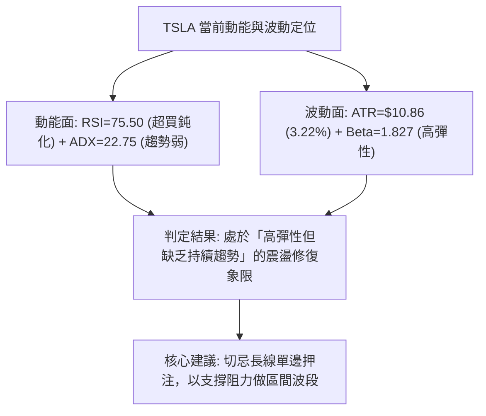

### 📊 ATR 波動率分析

- **ATR(14)**：**$10.86**（佔當前股價的 **3.22%**）
- **實戰指導意義**：
  - TSLA 目前每日平均真實波幅近 $11，代表日內與跨日雜訊較大。
  - **止損距離設置**：標準波段操作止損緩衝應設為 $1.5 \times \text{ATR} \approx \$16.29$，或至少 $1.0 \times \text{ATR} \approx \$10.86$。
  - 當前價格距離 S1 支撐 ($325.60) 為 $11.27 (約 1.04 ATR)，顯示回踩 S1 屬於極其正常的日內/短線波動範圍。

### 📐 Beta 與市場相關性

- **Beta 係數**：**1.827**（極高系統性風險彈性）
- **市場解讀**：
  - TSLA 的波動幅度約為標普 500 指數的 1.83 倍。在大盤處於震盪時，TSLA 容易出現誇大的假突破或假跌破。
  - 在短線操作中，高 Beta 意味著利潤釋放快但下行回撤極為劇烈，倉位配置必須保持克制（建議總倉位不超過 15%~20%）。

---

## 7. 多時框架總結

### 📋 時框架評分表

| 時框架 | 趨勢方向 | 動能狀態 | 均線排列狀態 | 形態結構 | 綜合評分 | 交易建議方向 |
|:---|:---:|:---:|:---:|:---:|:---:|:---|
| **月線 (長期)** | 🔴 偏空 | 弱勢回落 | 跌破 20月均線 | 大級別雙頂回落 | **35/100** | 逢高減磅，防範大週期C浪下跌 |
| **週線 (中期)** | 🔴 偏空 | 超賣修復 | 空頭排列 (MA20<50<200) | 頭肩頂破位回抽測試頸線 | **40/100** | 中期處於弱勢反彈，受制於 R2 |
| **日線 (短期)** | 🟢 偏多 | 充沛但超買 | 站上 MA20，受阻於 MA50 | 雙底反彈，測試 Fib 78.6% | **65/100** | 短多獲利了結，等待回踩 S1 |

### 🔲 綜合訊號矩陣

```
┌─────────────────┬──────────────┬──────────────┬──────────────┐
│ 分析維度        │ 短期 (日線)  │ 中期 (週線)  │ 長期 (月線)  │
├─────────────────┼──────────────┼──────────────┼──────────────┤
│ 趨勢架構        │ 🟢 超跌反彈  │ 🔴 震盪下行  │ 🔴 寬幅震盪  │
│ 均線系統        │ 🟢 站上 MA20 │ 🔴 空頭排列  │ 🟡 測試年線  │
│ 動能指標 (MACD) │ 🟢 柱狀擴張  │ 🟡 底部金叉中│ 🔴 零軸下方  │
│ 震盪指標 (RSI)  │ 🔴 超買 (75) │ 🟡 中性回升  │ 🔴 弱勢區間  │
│ 成交量能配合    │ 🔴 縮量反彈  │ 🔴 縮量修復  │ 🔴 分發放量  │
└─────────────────┴──────────────┴──────────────┴──────────────┘
```

### ⚖️ 多時框收斂結論（依規則 14 嚴格執行）

1. **趨勢/盤整行情判定**：當前 **ADX(14) = 22.75 (< 25)**，嚴格判定為**盤整行情（震盪行情）**。
2. **多時框收斂邏輯**：
   - 根據收斂規則，在盤整行情中，**以日線布林通道 ($292.04 - $359.01) 與關鍵支撐阻力 ($325.60 - $355.39) 為主要交易區間**。
   - 雖然日線級別 MACD 與 MA20 展現出短多反彈訊號，但週線與月線均線呈現標準空頭排列，且日線 RSI 高達 75.50 處於嚴重超買，疊加成交量比僅 0.69x 的量價背離。
3. **唯一方向性結論**：**中性觀望（偏短線超買回踩）**。
   - 反彈已進入阻力深水區，不可在現價 $336.87 盲目追多；主策略應鎖定「**回踩支撐低吸或在阻力區間高拋**」的區間震盪交易。

---

## 8. 交易策略建議

### 🗺️ 策略決策流程圖

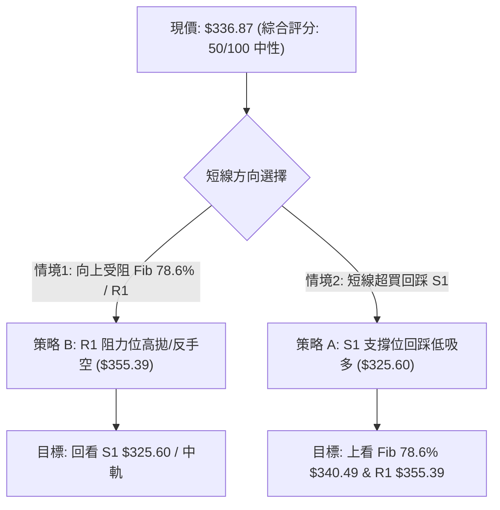

### 🧭 策略路由（依評分卡分流）

> **當前主策略方向 = 區間震盪交易（依評分 50/100，中性震盪，以布林通道與 S1/R1 區間操作為主）**

### 🎯 價格情境階梯（Price Scenarios）

| 觸發條件 | 第一目標 | 後續延伸 | 技術情境含義（嚴格引用數據） |
|:---|:---:|:---:|:---|
| **強勢突破 R1 $355.39** | R2 $409.28 | R3 $418.36 | 中期反轉確立，回補上方缺口並挑戰 MA200 牛熊線 |
| **受阻於 Fib 78.6% $340.49** | S1 $325.60 | 布林中軌 $325.52 | 短線超買引發正常技術回踩，維持區間震盪整理 |
| **有效跌破 S1 $325.60** | S2 $297.38 | 布林下軌 $292.04 | 雙底反彈失敗，再次回測 52 週最低點尋求支撐 |

### 📊 情境機率分佈

| 情境劇本 | 機率估計 | 主要技術依據（嚴格引用指標數據） |
|:---|:---:|:---|
| **情境一：回踩 S1 後區間震盪** | **55%** | ADX=22.75 確立盤整；RSI=75.50 超買需消化；S1 $325.60 與 MA20 共振具備強支撐 |
| **情境二：延續反彈衝擊 R1** | **30%** | MACD 柱狀圖 (+4.873) 仍處於擴張紅柱；OBV 指標維持在均線上方支撐反彈 |
| **情境三：破位重挫再探 S2** | **15%** | 均線系統 MA20<50<200 仍處空頭排列；若大盤劇震，高 Beta (1.827) 恐加速下殺 |

### 🟢 主策略詳情（區間震盪操作策略）

```
TSLA 交易策略參數精算看板
╔══════════════════════════════════════════════════════════════════╗
║ 策略 A (左側支撐低吸 - 多)   │ 策略 B (右側阻力高拋 - 空/對沖)    ║
╠══════════════════════════════┼══════════════════════════════════╣
║ 進場條件: 回踩 S1 企穩不破   │ 進場條件: 衝高受阻 R1 出現頂分型 ║
║ 進場價格: $325.60            │ 進場價格: $355.39                ║
║ 止損價格: $314.74 (S1-1 ATR) │ 止損價格: $366.25 (R1+1 ATR)     ║
║ 目標價 T1: $340.49 (Fib 78.6)│ 目標價 T1: $336.87 (現價)        ║
║ 目標價 T2: $355.39 (R1 阻力) │ 目標價 T2: $325.60 (S1 支撐)     ║
║ 風險報酬比 (至T2): 2.74 : 1  │ 風險報酬比 (至T2): 2.74 : 1      ║
║ 成功機率: 60%                │ 成功機率: 55%                    ║
║ 建議倉位: 15%                │ 建議倉位: 10%                    ║
╚══════════════════════════════════════════════════════════════════╝
```

#### 策略詳細計算說明：
1. **策略 A（回踩低吸做多）**：
   - **進場點**：**$325.60**（S1 關鍵支撐位，共振 MA20 $325.52）。
   - **止損點**：**$314.74**（計算式：$325.60 - 1.0 \times \text{ATR } \$10.86 = \$314.74$，風險空間 $10.86）。
   - **目標價 T1**：**$340.49**（Fib 78.6% 回調位，獲利空間 $14.89，R:R = 1.37:1）。
   - **目標價 T2**：**$355.39**（R1 阻力位，獲利空間 $29.79，R:R = **2.74:1**）。
2. **策略 B（阻力受挫做空/對沖）**：
   - **進場點**：**$355.39**（R1 關鍵阻力位，共振布林上軌 $359.01）。
   - **止損點**：**$366.25**（計算式：$355.39 + 1.0 \times \text{ATR } \$10.86 = \$366.25$，風險空間 $10.86）。
   - **目標價 T1**：**$336.87**（當前現價平台，獲利空間 $18.52，R:R = 1.71:1）。
   - **目標價 T2**：**$325.60**（S1 支撐位，獲利空間 $29.79，R:R = **2.74:1**）。

### 🔴 反向風險觸發點（對沖提示）

- **多頭反轉失效點**：若日線收盤價**實體跌破 $325.60 (S1)** 且伴隨成交量放大，代表雙底支撐瓦解，必須無條件停損多單並啟動空頭防禦，股價恐加速下探 **$297.38 (S2)**。
- **空頭爆倉風險點**：若股價帶量長陽突破 **$355.39 (R1)** 並站穩，代表空頭結構被破壞，反彈升級為反轉，空頭策略必須立即離場，後市將直接測試 **$409.28 (R2 / MA200)**。

### ⭐ 整體訊號強度評星

```
做多訊號強度：★★★☆☆  (3/5星 — 短線受制於超買與量縮，等待回踩)
做空訊號強度：★★☆☆☆  (2/5星 — 中期偏空但短線動能尚未衰竭，不宜盲目摸頂)
整體可信度：  ★★★★☆  (4/5星 — 區間邊界清晰，支撐阻力數據高度共振)
```

---

## 9. 風險提示與監控

### ✅ 關鍵監控指標 Checklist

```
╔════════════════════════════════════════════════════════════════╗
║                   TSLA 技術風控監控清單 (Checklist)            ║
╠════════════════════════════════════════════════════════════════╣
║ [ ] 監控項 1: 日線收盤是否跌破 MA20 / S1 ($325.60)?            ║
║     └─ 跌破即宣告短線反彈結束，進入二度探底。                   ║
║ [ ] 監控項 2: RSI(14) 是否跌破 70 形成死叉回落?                 ║
║     └─ 自超買區回落將觸發程式化交易多頭平倉賣壓。               ║
║ [ ] 監控項 3: 成交量是否放大至 40M 以上 (突破 20日均量)?       ║
║     └─ 若縮量衝高必為假突破；必須放量才能確認攻克 R1 ($355.39)。║
║ [ ] 監控項 4: MACD 柱狀圖是否由紅翻綠 (小於 0)?                ║
║     └─ 柱狀圖衰竭將確認動能反轉。                              ║
║ [ ] 監控項 5: -DI 是否重新抬頭上穿 30?                          ║
║     └─ 空方趨勢重新佔據絕對主導。                              ║
╚════════════════════════════════════════════════════════════════╝
```

### ⚠️ 風險場景分析

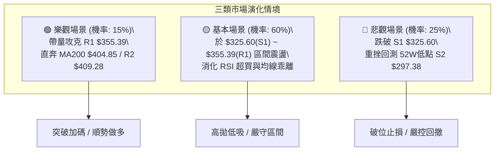

### 🛡️ 風險管理重要提醒

1. **嚴禁追高紀律**：當前 RSI 處於 75.50 超買高位，此時追多等同於在阻力位下方承擔極度不對稱的下行風險。**「買在支撐、賣在阻力」**為當前唯一可行的量化原則。
2. **高 Beta 倉位降槓桿**：TSLA Beta 為 1.827，波動極度劇烈。單筆交易風險暴露金額嚴格控制在總資金的 **1% ~ 1.5%** 以內。
3. **ATR 動態止損執行**：切勿使用固定百分比止損，嚴格依照當前 $10.86 的 ATR 設置防守空間，避免因盤中正常毛刺波動而被洗盤出場。

---

## 📋 報告總結

```
╔════════════════════════════════════════════════════════════════╗
║                   TSLA 技術分析報告總結 (Executive Summary)    ║
╠════════════════════════════════════════════════════════════════╣
║ 報告日期：2026-08-18                                           ║
║ 當前價格：$336.87                                              ║
║ 分析評級：⚖️ 中性震盪 (Neutral / Range-Bound)                  ║
║                                                                ║
║ 關鍵結論：                                                     ║
║ ├─ 長期趨勢：🔴 偏空格局 (受制於 MA200 $404.85 與頭肩頂壓制)   ║
║ ├─ 中期趨勢：🔴 弱勢修復 (ADX 22.75 處於弱趨勢盤整，空方主導)   ║
║ ├─ 短期趨勢：🟢 超跌反彈但嚴重超買 (站上 MA20，但 RSI 達 75.50)║
║ ├─ 關鍵支撐：S1: $325.60 ｜ S2: $297.38 (52W最低點)            ║
║ ├─ 關鍵阻力：R1: $355.39 ｜ R2: $409.28 ｜ Fib 78.6%: $340.49  ║
║ └─ 分析師共識：40 位分析師目標均價 $395.34 (Buy 共識)          ║
║                                                                ║
║ 最優策略組合：                                                 ║
║ 1. 🥇 最佳機會：回踩 S1 $325.60 逢低做多，止損 $314.74，       ║
║                 目標 $355.39 (風報比 2.74:1)                   ║
║ 2. 🥈 次選機會：反彈至 R1 $355.39 受阻做空，止損 $366.25，     ║
║                 目標 $325.60 (風報比 2.74:1)                   ║
║ 3. 🥉 保守選擇：現價 $336.87 保持空倉觀望，等待價格觸及區間   ║
║                 邊界 ($325.60 或 $355.39) 再行進場            ║
╚════════════════════════════════════════════════════════════════╝
```

---

> ⚠️ **免責聲明**：本報告為技術分析研究，所有數據及估算均嚴格基於歷史 OHLCV 資訊。本報告**僅供研究與學術參考**，**不構成任何投資買賣建議**。市場有風險，交易需嚴格執行風控。

---

*報告生成時間：2026-08-18 ｜ 數據來源：Yahoo Finance ｜ 分析框架：多時框技術分析體系*