# TSLA 技術分析報告

> **報告日期**：2026-08-19 ｜ **語言**：繁體中文 ｜ **數據來源**：Yahoo Finance ｜ **當前價格**：$351.12

---

## 目錄

| 章節 | 內容 |
|------|------|
| [1. 技術面概覽](#1-技術面概覽) | 訊號儀表板、核心指標、評分卡 |
| [2. 趨勢分析](#2-趨勢分析) | 多時框趨勢、長中短期走勢 |
| [3. 圖表形態分析](#3-圖表形態分析) | 形態識別、K線組合、目標價 |
| [4. 支撐與阻力](#4-支撐與阻力) | 關鍵價位、斐波那契回調 |
| [5. 技術指標深度解讀](#5-技術指標深度解讀) | MA/RSI/MACD/布林/成交量 |
| [6. 動能與波動率](#6-動能與波動率) | 動能評估、ATR、Beta |
| [7. 多時框架總結](#7-多時框架總結) | 時框架評分矩陣 |
| [8. 交易策略建議](#8-交易策略建議) | 多空策略、風險報酬比 |
| [9. 風險提示與監控](#9-風險提示與監控) | 監控指標、風險場景 |
| [10. 報告總結](#-報告總結) | 總結儀表板與核心結論 |

---

## 1. 技術面概覽

### 🎯 技術訊號儀表板

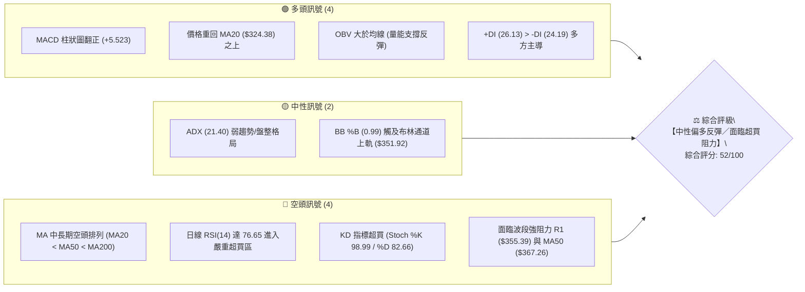

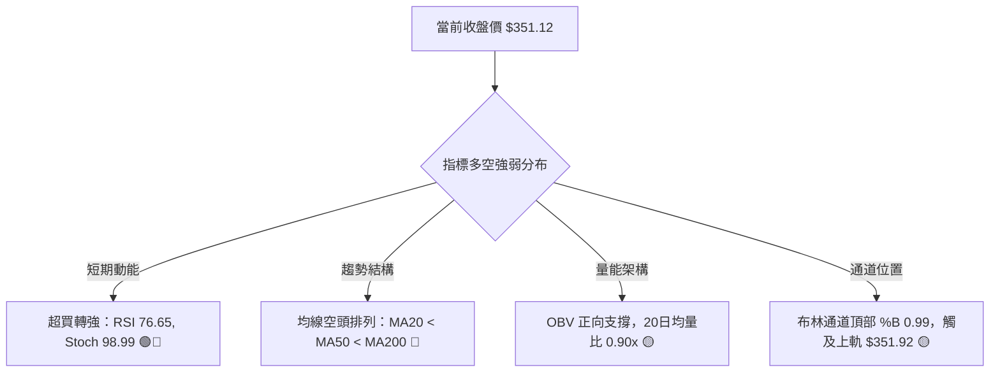

### 📊 核心指標速覽表

| 指標類別 | 指標名稱 | 當前數值 | 訊號 | 解讀 |
|----------|----------|----------|------|------|
| **價格** | 當前價格 | $351.12 | 🟡 | 位於52週區間 26.7%，自低點 $297.38 強勁反彈但處於中低位 |
| **均線** | MA20 | $324.38 | 🟢 | 現價高於 MA20 達 +8.24%，短線多頭反彈確立 |
| **均線** | MA50 | $367.26 | 🔴 | 現價低於 MA50 約 -4.39%，中期下行壓力未解 |
| **均線** | MA200 | $404.41 | 🔴 | 現價低於 MA200 約 -13.18%，長期均線呈空頭排列 |
| **動能** | RSI(14) | 76.65 | 🔴 | 進入超買區間（>70），短線追高風險急劇升高 |
| **動能** | MACD | -6.934 (Hist +5.523) | 🟢 | 快慢線雖在零軸下，但柱狀圖擴張走高，呈現強勁修復動能 |
| **隨機指標** | Stoch %K / %D | 98.99 / 82.66 | 🔴 | 進入極度超買鈍化區，短線隨時有回踩修復需求 |
| **趨勢強度** | ADX (14) | 21.40 | 🟡 | 數值 < 25，確認當前屬於弱趨勢／箱型震盪行情 |
| **通道指標** | 布林通道上軌 | $351.92 (%B 0.99) | 🟡 | 現價緊貼布林通道上軌，短線存在均值回歸拉回壓力 |
| **波動** | ATR(14) | $11.10 (3.16%) | 🟡 | 每日波幅適中，止損與倉位計算依據 |
| **量能** | OBV 趨勢 | OBV > MA | 🟢 | 成交量配合反彈，量能未出現明顯潰散 |

### 🏆 技術評分卡

```
╔══════════════════════════════════════════════════════════════════╗
║              技術評分卡 — TSLA (2026-08-19)                     ║
╠══════════════════════════════════════════════════════════════════╣
║ 趨勢強度 (ADX/方向)   ████████░░░░░░░░░░░░  42/100  🟡 中性弱勢 ║
║ 動能指標 (RSI/MACD)   ████████████░░░░░░░░  60/100  🟢 動能強勁 ║
║ 支撐穩定度 (波段低點) ██████████████░░░░░░  70/100  🟢 低檔穩固 ║
║ 成交量配合 (OBV/均量) ████████████░░░░░░░░  58/100  🟢 量能支撐 ║
║ 形態完整度 (V型/箱型) ██████████░░░░░░░░░░  50/100  🟡 構築階段 ║
║ 均線排列 (空頭防線)   ██████░░░░░░░░░░░░░░  30/100  🔴 均線反壓 ║
╠══════════════════════════════════════════════════════════════════╣
║ 綜合評分              ██████████░░░░░░░░░░  52/100  ⚖️ 區間震盪  ║
╚══════════════════════════════════════════════════════════════════╝
```

---

## 2. 趨勢分析

### 🌐 多時框趨勢分析

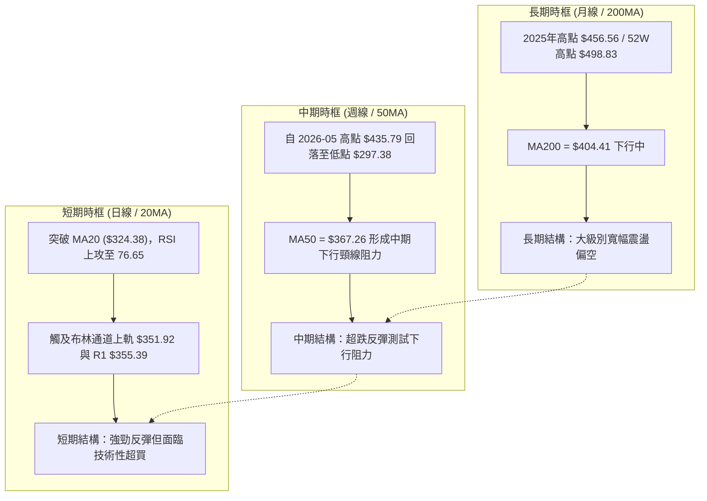

### 📈 長期趨勢 — 12個月走勢圖（Unicode）

```
TSLA 月線走勢圖（過去12個月歷史價格軌跡）
價格 ($)
$460 ┤               ● $456.56 (2025-10 頂部)
$440 ┤           ●       ● $449.72        ● $435.79 (2026-05)
$420 ┤                                        ● $420.60
$400 ┤                               ● $402.51
$380 ┤                                   ● $371.75   ● $381.63
$360 ┤                                                   ● $351.12 (現價 2026-08)
$340 ┤   ● $333.87
$320 ┤                                                       ● $311.21 (2026-07 低點)
$300 ┤                                                         (52W低點 $297.38)
     └─┬───────┬───────┬───────┬───────┬───────┬───────┬───────┬───────┬───────┬───────┬───────┬──
     2025-08  09      10      11      12    2026-01   02      03      04      05      06     07-08
```

#### 走勢特徵分析表格

| 階段區間 | 起止月份 | 價格變化 | 漲跌幅 | 走勢特徵與量價解讀 |
|----------|----------|----------|--------|--------------------|
| **第1階段：主升浪行情** | 2025-08 → 2025-10 | $333.87 → $456.56 | +36.75% | 多頭強勢發力，月線連陽創下波段波段頂峰 $456.56 |
| **第2階段：高位盤整頭部** | 2025-11 → 2026-01 | $430.17 → $430.41 | +0.06% | 價格在 $430–$450 高位形成橫盤構築箱型頂部，動能衰退 |
| **第3階段：震盪下行破位** | 2026-02 → 2026-04 | $402.51 → $381.63 | -5.19% | 跌破多道短期均線支撐，高點逐步下移形成下降通道 |
| **第4階段：次高點反撲** | 2026-05 → 2026-06 | $435.79 → $420.60 | -3.49% | 5月快速反彈至 $435.79 後無力維持，隨後引發斷崖式下跌 |
| **第5階段：快速築底反彈** | 2026-07 → 2026-08 | $311.21 → $351.12 | +12.82% | 探至52週低點 $297.38 後強勁反彈，回升突破 MA20 ($324.38) |

### 📊 中期趨勢（週線分析）

```
TSLA 週線關鍵阻力與支撐層級圖
 價格 ($)
 $420 ┼────────────────────────────── R3: $418.36 (近一年強阻力區)
      │
 $400 ┼────────────────────────────── R2: $409.28 / MA200: $404.41
      │
 $380 ┼────────────────────────────── MA60: $376.61 / 斐波那契 61.8%: $374.33
      │
 $360 ┼────────────────────────────── MA50: $367.26 / R1: $355.39
      │                         ▲ 現價: $351.12 (布林上軌 $351.92)
 $340 ┼────────────────────────────── S1: $337.24 (斐波那契 78.6%: $340.49)
      │
 $320 ┼────────────────────────────── S2: $325.60 / MA20: $324.38
      │
 $300 ┼────────────────────────────── S3: $297.38 (52週最低點支撐)
```

近20週數據顯示，TSLA 在 2026年7月最後兩週（7/26與8/02）週線收盤分別為 $313.03 及 $311.21，RSI 曾跌至 15.7 極端超賣區。隨後3週連續放量反彈，週收盤價由 $328.58 上升至 $351.12，週線 MACD 柱狀圖由 -8.365 迅速翻正至 +5.523，確認中期超跌反彈展開。

### ⚡ 趨勢強度評估（ADX 解讀）

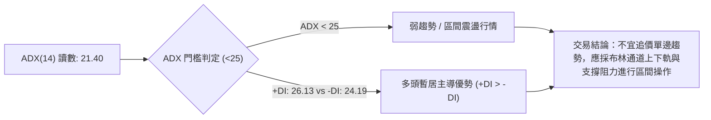

#### ADX 趨勢強度對照表

| 指標項 | 當前數值 | 參考標準 | 狀態評估 | 操作指引 |
|--------|----------|----------|----------|----------|
| **ADX 數值** | 21.40 | < 20 無趨勢；20–25 弱趨勢；> 25 強趨勢 | 弱趨勢／震盪 | 避免單邊突破追單，側重邊界交易 |
| **+DI / -DI** | 26.13 / 24.19 | +DI > -DI 多方；-DI > +DI 空方 | 多方微弱優勢 | 買盤力量微幅領先，但未達絕對控盤 |
| **方向判定** | 多方反彈震盪 | ADX 處低檔，+DI 上穿 -DI | 短期反彈修復 | 依托支撐低吸，阻力位分批獲利了結 |

---

## 3. 圖表形態分析

### 🔍 形態識別系統

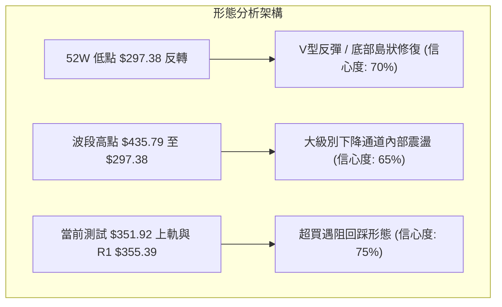

#### 形態識別與信心度評估表

| 形態名稱 | 形態信心度 | 判斷依據（數據引用） | 完成度 | 形態目標價（附計算式） |
|----------|------------|----------------------|--------|------------------------|
| **雙重低點築底 (Double Bottom 雛形)** | 65% | 2026-07-26 收盤 $313.03 與 2026-08-02 收盤 $311.21 形成雙底支撐區間（波段低點 $297.38） | 75% | 突破頸線 S1 $337.24 後：目標價 = $337.24 + ($337.24 - $297.38) = **$377.10**（接近 MA60 $376.61） |
| **布林通道上軌突破受阻 (BB Band Squeeze/Tag)** | 75% | 當前收盤 $351.12 達到布林上軌 $351.92（%B = 0.99），且 RSI 76.65 極度超買 | 90% | 回踩目標 = 布林中軌 / MA20 = **$324.38** 或 S1 **$337.24** |
| **頭肩底形態** | 35% | 數據中尚未形成完整右肩與頸線結構 | 20% | *訊號不足，僅做指標型解讀，不預設目標價* |

### 🕯️ 重要K線形態分析

| 週/月份 | 收盤價 | 關鍵指標狀態 | K線形態特徵 | 解讀與訊號 |
|---------|--------|--------------|-------------|------------|
| **2026-07-26 (週)** | $313.03 | RSI 15.7, MACD Hist -8.365 | 帶長下影線之大陰線（放量2.75億股） | 🔴 空頭恐慌盤湧出，觸發極端超賣，底部恐慌拋售訊號 |
| **2026-08-02 (週)** | $311.21 | RSI 18.1, MACD Hist -6.930 | 縮量十字星/下影錘頭線 | 🟡 賣壓枯竭，多空於 $311 水平達成弱平衡，孕育反轉 |
| **2026-08-09 (週)** | $328.58 | RSI 34.9, MACD Hist +1.025 | 實體陽線包覆前期十字星 | 🟢 多頭確認啟動，MACD 柱狀圖翻正，確認短期反轉 |
| **2026-08-16 (週)** | $342.27 | RSI 70.4, MACD Hist +4.956 | 連續中陽線突破 MA20 ($324.38) | 🟢 強勢反彈延續，攻入超買臨界點 |
| **2026-08-23 (最新)**| $351.12 | RSI 76.6, MACD Hist +5.523 | 衝高觸及上軌之高檔陽線 | 🔴 短線量能微降（8934萬股），超買嚴重，面臨 R1 $355.39 反壓 |

### 📉 ASCII 走勢形態示意圖

```
TSLA 近期底部反轉與反彈形態圖
價格 ($)
$360 ┤                                           [阻力 R1: $355.39 / MA50: $367.26]
     │                                                ╭──● $351.12 (現價超買區)
$340 ┤                                   ╭────────────╯
     │                  [頸線突破點: S1 $337.24] 
$320 ┤               ● $313.03           ● $328.58  [MA20: $324.38]
     │                 ╰──────╮        ╭─╯
$300 ┤                        ╰─● $311.21 (雙底形成)
     │                           [52W 低點 S3: $297.38]
     └─────────────────────────────────────────────────────────────► 時間
          2026-07-26          2026-08-02   2026-08-09   2026-08-23
```

### 🎯 形態目標價計算

依據已確認之底部雙低點反彈結構計算：
1. **底谷低點**：52W Low = $297.38（2026-08-02 收盤 $311.21）
2. **突破頸線位**：取支撐位 S1 = $337.24
3. **形態垂直高度**：$337.24 - $297.38 = $39.86
4. **形態量度第一目標價**：$337.24 + $39.86 = **$377.10**（精確對應 MA60 阻力 $376.61 與 斐波那契 61.8% $374.33 區間）
5. **第二延伸目標價**：若有效突破 MA50 ($367.26)，延伸量度目標為 R2 = **$409.28**（重合 MA200 $404.41 與 斐波那契 50.0% $398.10 壓力帶）

---

## 4. 支撐與阻力

### 🗺️ 關鍵價位分布圖（Unicode）

```
TSLA 價位結構分布圖
═════════════════════════════════════════════════════════════════
 $498.83 ║██████████████████████████████║ 52週最高點 (0.0% 斐波那契)
 $451.29 ║██████████████████████        ║ 23.6% 斐波那契回調位
 $418.36 ║████████████████████████████  ║ 強阻力 R3 (近一年波段高點聚類)
 $409.28 ║██████████████████████        ║ 阻力 R2 (重合 MA200: $404.41)
 $398.10 ║██████████████████            ║ 50.0% 斐波那契重要中軸
 $374.33 ║████████████████████          ║ 61.8% 斐波那契黃金分割 (MA60: $376.61)
 $367.26 ║██████████████                ║ MA50 中期均線阻力
 $355.39 ║████████████████████████      ║ 關鍵阻力 R1 (布林上軌: $351.92)
 $351.12 ╠══════════════════════════════╣ ◄ 現價 ($351.12)
 $340.49 ║▓▓▓▓▓▓▓▓▓▓▓▓▓▓▓▓▓▓▓▓          ║ 78.6% 斐波那契回調位
 $337.24 ║▓▓▓▓▓▓▓▓▓▓▓▓▓▓▓▓▓▓▓▓▓▓▓▓      ║ 近期支撐 S1 (頸線回踩位)
 $325.60 ║████████████████████████████  ║ 強支撐 S2 (重合 MA20: $324.38)
 $297.38 ║██████████████████████████████║ 核心強支撐 S3 / 52週低點 (100.0%)
═════════════════════════════════════════════════════════════════
```

### 🚧 阻力位分析表

| 阻力級別 | 具體價位 | 距現價幅度 | 形成原因與結構 | 突破難度 | 重要性 |
|----------|----------|------------|----------------|----------|--------|
| **阻力 R1** | **$355.39** | +1.22% | 近一年波段高點聚類，與日線布林通道上軌 $351.92 形成共振壓制區 | 🟡 中等 | ★★★★☆ |
| **阻力 R2** | **$409.28** | +16.56% | 近一年主要波段密集高點，與下行中 MA200 ($404.41) 形成強大結構性反壓 | 🔴 極高 | ★★★★★ |
| **阻力 R3** | **$418.36** | +19.15% | 波段頂部密集成交區，接近 38.2% 斐波那契回調位 ($421.88) | 🔴 極高 | ★★★★☆ |

### 🛡️ 支撐位分析表

| 支撐級別 | 具體價位 | 距現價幅度 | 形成原因與結構 | 守住機率 | 重要性 |
|----------|----------|------------|----------------|----------|--------|
| **支撐 S1** | **$337.24** | -3.95% | 近期底部突破頸線位，緊鄰 78.6% 斐波那契位 $340.49 及 MA5 $341.90 | 75% | ★★★★☆ |
| **支撐 S2** | **$325.60** | -7.27% | 近一年波段低點聚類，完全重合 MA20 ($324.38) 與布林中軌 | 85% | ★★★★★ |
| **支撐 S3** | **$297.38** | -15.31% | 52週歷史最低點，本輪反彈之底部基石（100.0% 斐波那契） | 95% | ★★★★★ |

### 📐 斐波那契回調位分析

依據 52 週完整波動區間（高點 **$498.83** → 低點 **$297.38**，總波幅 $201.45）計算：

```
斐波那契位階對照
0.0%  (52W High)  ── $498.83  [歷史極值]
23.6%             ── $451.29  [強阻力區間]
38.2%             ── $421.88  [波段重要防線，靠近 R3 $418.36]
50.0%             ── $398.10  [多空中軸平衡線]
61.8%             ── $374.33  [黃金分割重要阻力，靠近 MA60 $376.61]
78.6%             ── $340.49  [現價下方最近支撐層，靠近 S1 $337.24]
100.0%(52W Low)   ── $297.38  [波段底谷，強支撐 S3]
```

- **當前位置解讀**：現價 **$351.12** 位於 **78.6% 回調位 ($340.49)** 與 **61.8% 回調位 ($374.33)** 之間。
- **技術意涵**：價格成功站上 78.6% 回調位，代表脫離極端崩跌區間；但尚未突破 61.8%（$374.33）與 MA50（$367.26），此區間為中期空頭格局的典型強反壓帶，若無法放量衝破 $374.33，本輪上漲定性為「超跌技術性反彈」而非新一輪主升浪。

---

## 5. 技術指標深度解讀

### 🎛️ 指標訊號總覽

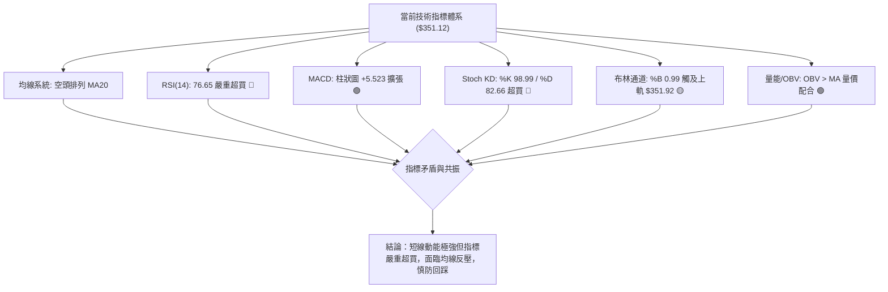

### 📈 移動平均線排列分析

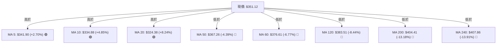

#### 均線系統深度解析：
1. **短線均線多頭上翹**：MA5 ($341.90) > MA10 ($334.88) > MA20 ($324.38)，短線多頭攻擊排列完整，為價格提供下檔保護。
2. **中長線空頭反壓未解**：大週期均線呈標準空頭排列（MA20 $324.38 < MA50 $367.26 < MA200 $404.41），長線下行趨勢尚未扭轉。現價正處於「短線反彈動能」與「中長線空頭均線阻力」的夾擊區間。

### 📉 RSI(14) 分析

```
RSI(14) 當前數值進度條
超賣區 (0-30)           中性平衡區 (30-70)          超買區 (70-100)
├──────────────────────┼─────────────────────────┼──────────────────────┤
[░░░░░░░░░░░░░░░░░░░░░░░░░░░░░░░░░░░░░░░░░░░░░░░░][█████████████░░░░░░]
0                     30                        70      ▲ 76.65       100
```

- **超買超賣判定**：日線 RSI(14) 達到 **76.65**，週線 RSI 達到 **76.6**，均已進入 70 以上之嚴重超買區域。
- **背離分析**：
  - **頂背離**：目前日線 RSI 自 7 月底 15.7 低點垂直拉升至 76.65，伴隨價格持續走高，**無明顯頂背離現象**，顯示此波拉升為純粹之強動能驅動。
  - **底背離回顧**：7月底 $313.03 (RSI 15.7) 與 8月初 $311.21 (RSI 18.1) 曾出現微幅日線/週線底背離，該底背離已在隨後 +12.8% 的反彈中充分釋放。
- **風險警示**：RSI 突破 75 通常伴隨短期均值回歸拉回，不宜在此位置重倉追多。

### 📊 MACD(12/26/9) 訊號解讀

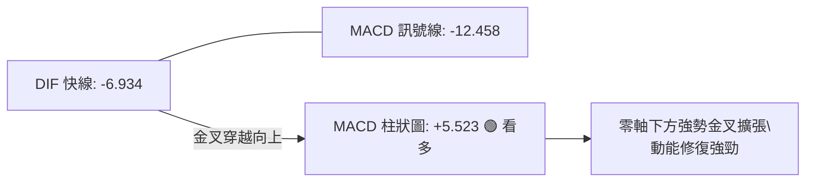

- **快慢線位置**：DIF (-6.934) 位於零軸下方，但已大幅向上穿越 Signal 訊號線 (-12.458)，形成「零軸下低位黃金交叉」。
- **柱狀圖動能**：柱狀圖讀數為 **+5.523**，呈現連續擴張態勢，顯示多頭動能正在加速釋放，屬於典型的空頭市場強反彈動能修復。

### 📦 布林通道分析

```
TSLA 日線布林通道示意圖
價格 ($)
$360 ┤
$352 ┤ ── ── ── ── ── ── ── ── ── ── ── ── ── ── ──  BB上軌: $351.92
$351 ┤                                           ● 現價: $351.12 (%B = 0.99)
$340 ┤
$330 ┤
$324 ┤ ──────────────────────────────────────────  BB中軌 (MA20): $324.38
$310 ┤
$300 ┤
$296 ┤ ── ── ── ── ── ── ── ── ── ── ── ── ── ── ──  BB下軌: $296.83
     └────────────────────────────────────────────
```

- **帶寬與位置**：布林通道上軌位於 **$351.92**，現價 **$351.12**，**%B 指標為 0.99**（極度貼近上軌 1.0 極限）。
- **通道行為解讀**：%B 達 0.99 意味著價格已經運行至統計學波動區間的頂部極限。在 ADX 僅為 21.40（弱趨勢）的背景下，觸及布林上軌極易引發向中軌（$324.38）回歸的震盪修正。

### 💹 成交量分析（量價配合度）

1. **最新量比**：最新單日成交量為 35,316,918 股，20日均量為 39,434,531 股，**量比為 0.90x**；50日均量為 41,447,790 股。
2. **量價特徵**：本輪自 $297.38 反彈過程中，週成交量自 7 月底恐慌性殺跌的 2.75 億股降至最新一週的 8934 萬股，呈現「量能微幅萎縮但價格推升」的短線縮量上漲特徵。
3. **OBV 能量潮**：OBV > MA，能量潮指標維持在均線之上，確認中期籌碼未發生大規模出逃，底部承接力道仍存，支撐整體反彈結構。

---

## 6. 動能與波動率

### ⚡ 動能評估四象限

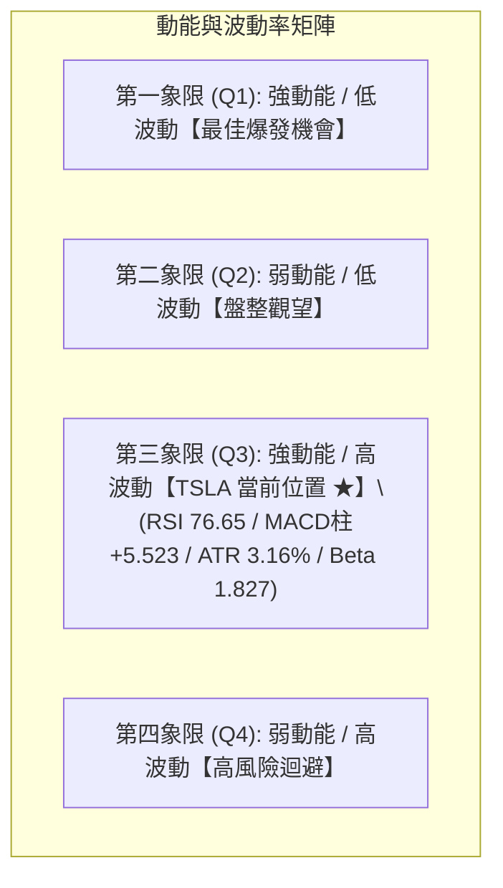

#### 動能與波動率狀態表

| 象限 | 動能強度 | 波動率水準 | 當前狀態 | 技術評估與操作導向 |
|------|----------|------------|----------|--------------------|
| **Q1** | 強 | 低 | — | 穩健突破買點，低風險擴張 |
| **Q2** | 弱 | 低 | — | 窄幅箱型震盪，宜低吸高拋 |
| **Q3** | **強** | **高** | **✓ (TSLA 當前)** | **高動能超跌反彈伴隨高 Beta 波動，獲利空間大但回撤風險極高，必須嚴格設置移動止損** |
| **Q4** | 弱 | 高 | — | 恐慌性崩跌，嚴禁盲目抄底 |

### 📊 ATR 波動率分析

```
ATR(14) 數值: $11.10 ｜ 佔現價比例: 3.16%
══════════════════════════════════════════════════════════════
短線止損距離 (1.0 × ATR):   $11.10   ── 建議防守價: $340.02
標準波段止損 (1.5 × ATR):   $16.65   ── 建議防守價: $334.47 (貼近 S1 $337.24)
寬鬆趨勢止損 (2.0 × ATR):   $22.20   ── 建議防守價: $328.92 (貼近 S2 $325.60)
══════════════════════════════════════════════════════════════
```

- **波動率解讀**：每日平均波動金額達 $11.10，顯示 TSLA 具備充沛的日內與波段交易彈性。若建立多頭倉位，止損空間至少需保留 1.5 倍 ATR（約 $16.65），以避免被日內正常雜訊震盪洗出場。

### 📐 Beta 與市場相關性

- **Beta 係數**：**1.827**（高彈性成長股特徵）。
- **市場意涵**：TSLA 的波動幅度約為 S&P 500 大盤的 1.83 倍。在大盤上漲週期具備顯著超額收益（Alpha）潛力，但在市場避險回調時，亦承擔接近兩倍的下行壓力。

---

## 7. 多時框架總結

### 📋 時框架評分表

| 時框架 | 趨勢方向 | 動能狀態 | 均線排列 | 關鍵阻力/支撐 | 綜合評分 | 交易建議 |
|--------|----------|----------|----------|---------------|----------|----------|
| **短期 (日線)** | 🟢 強勢反彈 | 🔴 RSI 76.65 超買 | 🟢 MA5>MA10>MA20 多頭排列 | 阻力 R1 $355.39 / 支撐 S1 $337.24 | **68/100** | 逢高獲利了結，等待回踩支撐接回 |
| **中期 (週線)** | 🟡 震盪築底 | 🟢 MACD 翻正 (+5.523) | 🔴 承壓於 MA50 ($367.26) | 阻力 MA50 $367.26 / 支撐 S2 $325.60 | **52/100** | 箱型區間操作，以布林通道為主 |
| **長期 (月線)** | 🔴 下行偏空 | 🟡 中性修復中 | 🔴 空頭排列 (低於 MA200 $404.41) | 阻力 R2 $409.28 / 支撐 S3 $297.38 | **38/100** | 長線未出現反轉確立訊號，偏防守 |

### 🔲 綜合訊號矩陣

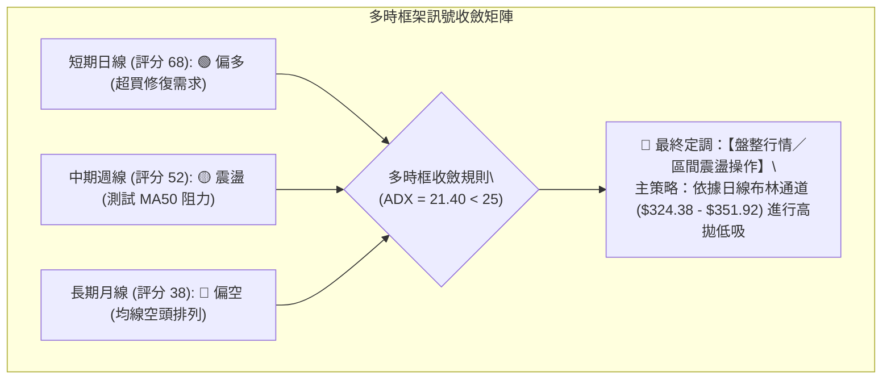

### ⚖️ 多時框收斂結論

依據多時框收斂規則：
1. **趨勢/盤整判定**：當前 ADX(14) 為 **21.40 (< 25)**，明確定義當前市場為**「盤整震盪行情」**而非單邊趨勢行情。
2. **主導時框與取捨**：
   - 盤整行情下，不宜採用單邊追突破策略，應以**日線布林通道（上軌 $351.92 / 下軌 $296.83 / 中軌 $324.38）**及關鍵波段支撐阻力為主要交易區間。
   - 中長期均線（MA50 $367.26 與 MA200 $404.41）構成上方難以逾越之天花板，而短期日線 RSI(14) 76.65 嚴重超買，限制了短線追高空間。
3. **唯一方向性結論**：**【中性觀望／區間震盪操作（偏多反彈已達阻力區）】**。綜合技術評分為 **52/100**，操作重心在於「不追高、等回踩、打區間」。

---

## 8. 交易策略建議

### 🗺️ 策略決策流程圖

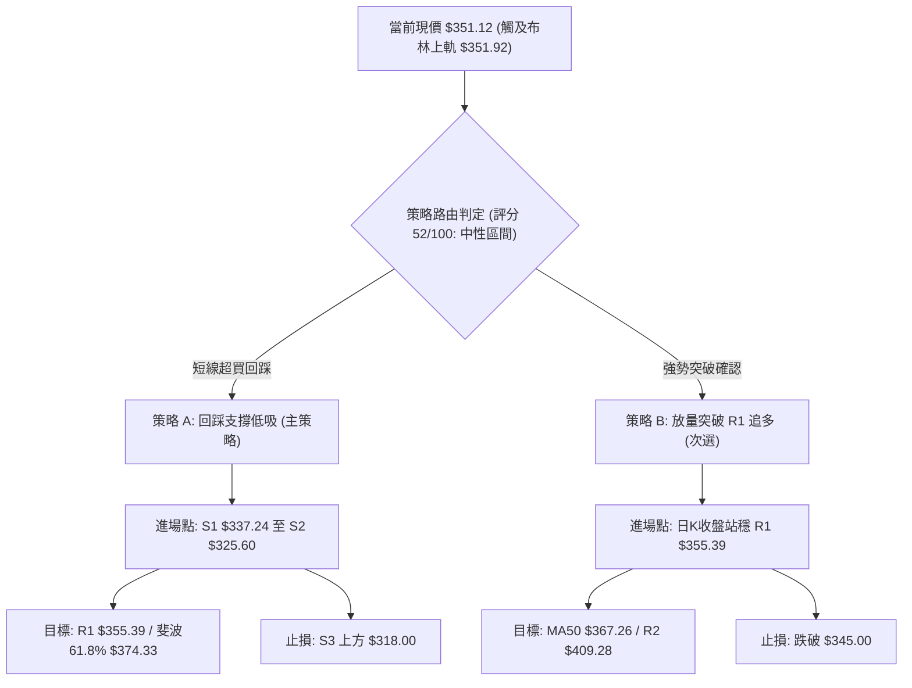

### 🧭 策略路由

**當前主策略方向 = 【中性區間操作：回踩關鍵支撐低吸（依綜合評分 52/100）】**

依據評分卡 52/100 處於中性區間（40–60），且日線 RSI 76.65 嚴重超買、布林 %B 達 0.99，當前價位 $351.12 **嚴禁直接市價追多**。交易主軸為：耐心等待短線指標降溫，回踩 S1/S2 支撐區間分批布局多單。

### 🎯 價格情境階梯（Price Scenarios）

| 觸發條件 | 下一目標價 | 後續延伸目標 | 情境技術含義 |
|----------|------------|--------------|--------------|
| **強勢突破 R1 ($355.39)** | MA50 **$367.26** / 斐波61.8% **$374.33** | R2 **$409.28** / MA200 **$404.41** | 突破布林通道壓制，空頭回補推升至中期大阻力區 |
| **維持現價區間震盪** | 布林上軌 **$351.92** | 支撐 S1 **$337.24** | 短線消化 RSI 超買指標，進入 $337–$355 箱型整理 |
| **跌破支撐 S1 ($337.24)** | 支撐 S2 **$325.60** (MA20 $324.38) | 支撐 S3 **$297.38** (52W Low) | 宣告反彈動能衰竭，回測底部中軌支撐確認雙底完整性 |

### 📊 情境機率分佈

| 情境劇本 | 發生機率 | 主要技術指標與結構依據 |
|----------|----------|------------------------|
| **情境一：回踩支撐後延續反彈** | **55%** | MACD 柱狀圖 (+5.523) 強勁擴張，OBV 維持均線之上，下檔 MA20 ($324.38) 與 S1 ($337.24) 具備強支撐 |
| **情境二：箱型窄幅震盪消化超買** | **30%** | ADX 21.40 顯示缺乏單邊趨勢，布林通道上軌 $351.92 壓制，多空於 $337–$355 僵持 |
| **情境三：直接破位深跌重測前低** | **15%** | 中長線均線空頭排列（MA200 $404.41），若大盤劇烈回調可能跌破 S2 $325.60 再次探底 S3 $297.38 |

### 🟢 主策略詳情（方向：區間低吸 / 突破跟進）

| 策略要素 | 策略 A：回踩支撐低吸（最佳勝率） | 策略 B：突破 R1 順勢追多（動能突破） |
|----------|----------------------------------|-------------------------------------|
| **策略類型** | 支撐位掛單低吸 | 關鍵阻力放量突破追單 |
| **進場條件** | 價格回踩 S1，日K收出下影線確認支撐 | 日K收盤價實體突破 R1 $355.39 且成交量放大 |
| **進場價格** | **$337.24** (分批於 $337.24–$325.60 布局) | **$356.50** (站穩 R1 之確認點) |
| **目標價 T1** | **$355.39** (阻力 R1 / 布林上軌) | **$374.33** (斐波那契 61.8% / MA60 $376.61) |
| **目標價 T2** | **$374.33** (斐波那契 61.8%) | **$404.41** (MA200 重合 R2 $409.28 區間) |
| **止損價格** | **$324.00** (跌破 MA20 $324.38 及 S2 $325.60) | **$345.00** (跌回突破點下方 1.0 ATR) |
| **風險報酬比 (R:R)** | **1 : 2.80** (風險 $13.24 / 預期回報 $37.09) | **1 : 2.07** (風險 $11.50 / 預期回報 $23.83) |
| **成功機率** | **65%** | **50%** |
| **建議倉位** | **15%–20%** | **10%** (動能追單嚴控倉位) |

### 🔴 反向風險觸發點（對沖提示）

- **空方反轉觸發價位**：若日K收盤價跌破 **S1 $337.24** 且 MACD 柱狀圖明顯縮小，意味短線反彈終結，應即刻將多頭倉位減半。
- **全面停損清倉點**：若價格帶量跌破 **S2 $325.60**（失守 MA20 $324.38），多頭邏輯完全被破壞，需全數離場或建立反向空頭對沖避險。

### ⭐ 整體訊號強度評星

```
╔══════════════════════════════════════════════════════════════════╗
║ 做多訊號強度：  ★★★☆☆  (3.0/5星) ── 短線超買，但底層動能良好     ║
║ 做空訊號強度：  ★★☆☆☆  (2.0/5星) ── 逆短期強動能，僅限高檔博回踩 ║
║ 整體訊號可信度：★★★☆☆  (3.5/5星) ── ADX<25 震盪格局特徵明確     ║
╚══════════════════════════════════════════════════════════════════╝
```

---

## 9. 風險提示與監控

### ✅ 關鍵監控指標 Checklist

```
╔══════════════════════════════════════════════════════════════════╗
║              TSLA 每日盤後關鍵技術指標監控清單                   ║
╠══════════════════════════════════════════════════════════════════╣
║ [ ] 1. RSI(14) 是否自 76.65 出現拐頭跌破 70 (超買降溫訊號)      ║
║ [ ] 2. 日K收盤價是否有效站穩阻力 R1 $355.39 與布林上軌 $351.92   ║
║ [ ] 3. 價格回踩時，支撐 S1 $337.24 與 MA20 $324.38 是否守穩     ║
║ [ ] 4. MACD 柱狀圖能否持續維持正值擴張 (當前 +5.523)             ║
║ [ ] 5. ADX 數值是否自 21.40 突破 25 (確認由盤整轉為單邊趨勢)     ║
║ [ ] 6. 成交量能否放大超越 50日均量 (41,447,790 股) 配合衝關      ║
╚══════════════════════════════════════════════════════════════════╝
```

### ⚠️ 風險場景分析

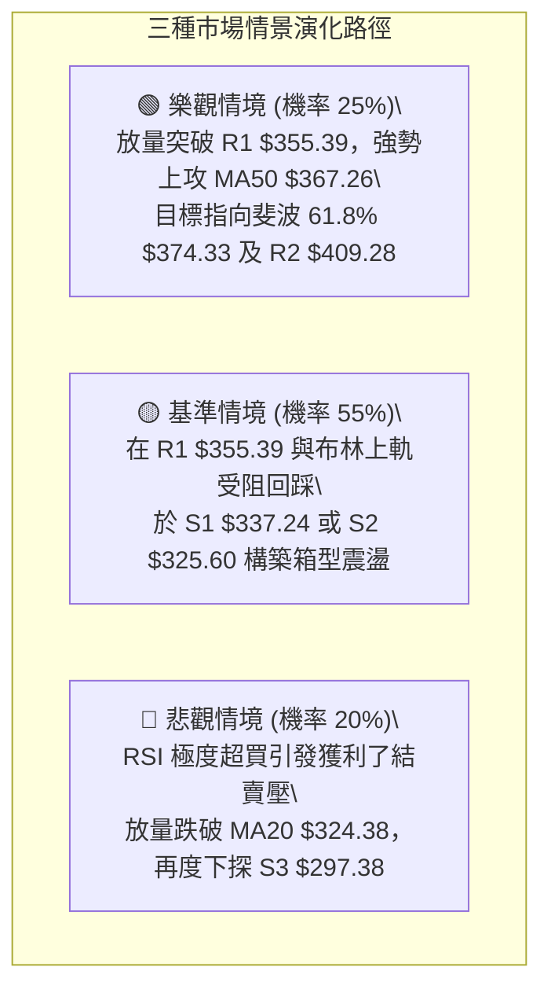

### 🛡️ 風險管理重要提醒

1. **極度超買防禦**：RSI 76.65 與 Stoch %K 98.99 均處於歷史極值區間，統計上在該水平追買的 5 日勝率低於 35%。嚴禁任何槓桿追多行為。
2. **高 Beta 倉位控制**：TSLA Beta 高達 1.827，單一個股倉位不建議超過總投資組合的 **15%–20%**，並嚴格將單筆交易最大虧損限制在總本金的 **1.5%** 以內。
3. **ATR 動態保護**：持倉應採用 ATR 移動止損法，每日將止損位上移至 `最高價 - (1.5 × $11.10) = 最高價 - $16.65`，以鎖定波段利潤。

---

## 📋 報告總結

```
╔══════════════════════════════════════════════════════════════════╗
║                   TSLA 技術分析報告總結                          ║
╠══════════════════════════════════════════════════════════════════╣
║ 報告日期：2026-08-19                當前價格：$351.12            ║
║ 分析評級：⚖️ 中性偏多區間操作        技術評分：52 / 100           ║
╠══════════════════════════════════════════════════════════════════╣
║ 關鍵結論：                                                       ║
║ ├─ 長期趨勢：🔴 偏空 (低於 MA200 $404.41，均線空頭排列)          ║
║ ├─ 中期趨勢：🟡 震盪築底 (MACD柱翻正，正測試 MA50 $367.26)       ║
║ ├─ 短期趨勢：🟢 強勁反彈但極度超買 (RSI 76.65，觸及布林上軌)     ║
║ ├─ 關鍵支撐：S1 $337.24 ｜ S2 $325.60 ｜ S3 $297.38 (52W Low)    ║
║ ├─ 關鍵阻力：R1 $355.39 ｜ MA50 $367.26 ｜ R2 $409.28           ║
║ └─ 分析師目標共識：均價 $395.34 (區間 $125.00 - $600.00)         ║
╠══════════════════════════════════════════════════════════════════╣
║ 最優策略組合：                                                   ║
║ 1. 🥇 最佳機會：回踩支撐 S1 $337.24 / S2 $325.60 逢低布局多單    ║
║                 (目標 T1: $355.39, T2: $374.33, 止損: $324.00)   ║
║ 2. 🥈 次選機會：日K放量突破 R1 $355.39 順勢追多至 MA50 $367.26   ║
║ 3. 🥉 防守策略：現價 $351.12 先行減持短線獲利盤，保留現金等拉回  ║
╚══════════════════════════════════════════════════════════════════╝
```

---

> ⚠️ **免責聲明**：本報告為 AI 自動生成之技術分析，所有數據及估算均基於提供的歷史價格資訊。本報告**僅供研究與學術參考**，**不構成任何投資建議**。投資有風險，入市需謹慎。

---

*報告生成時間：2026-08-19 ｜ 數據來源：Yahoo Finance ｜ 分析框架：多時框技術分析*