# TSLA 技術分析報告

> **報告日期**：2026-08-20 ｜ **語言**：繁體中文 ｜ **數據來源**：Yahoo Finance ｜ **當前價格**：$345.13

---

## 目錄

| 章節 | 內容 |
|------|------|
| [1. 技術面概覽](#1-技術面概覽) | 訊號儀表板、核心指標、評分卡 |
| [2. 趨勢分析](#2-趨勢分析) | 多時框趨勢、長中短期走勢、ADX解讀 |
| [3. 圖表形態分析](#3-圖表形態分析) | 形態識別、信心度評估、K線組合 |
| [4. 支撐與阻力](#4-支撐與阻力) | 關鍵價位、斐波那契回調結構 |
| [5. 技術指標深度解讀](#5-技術指標深度解讀) | MA/RSI/MACD/布林/成交量 |
| [6. 動能與波動率](#6-動能與波動率) | 動能評估、ATR、Beta |
| [7. 多時框架總結](#7-多時框架總結) | 時框架評分矩陣、多時框收斂 |
| [8. 交易策略建議](#8-交易策略建議) | 策略路由、主策略、情境機率 |
| [9. 風險提示與監控](#9-風險提示與監控) | 監控指標、風險場景、總結 |

---

## 1. 技術面概覽

### 🎯 技術訊號儀表板

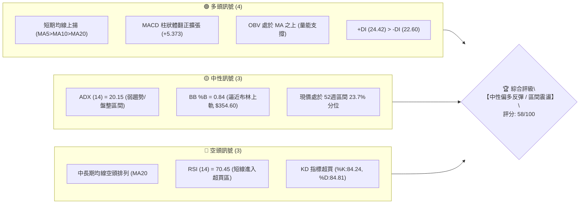

### 📊 核心指標速覽表

| 指標類別 | 指標名稱 | 當前數值 | 訊號 | 解讀 |
|:---|:---|:---|:---:|:---|
| **價格** | 當前收盤價 | $345.13 | 🟢 | 自 52 週低點 $297.38 強勁反彈，短線多頭掌控節奏 |
| **短期均線** | MA20 | $325.65 | 🟢 | 現價高於 MA20 達 +5.98%，短期趨勢偏多走升 |
| **中期均線** | MA50 | $366.23 | 🔴 | 現價低於 MA50（-5.76%），中期反彈面臨動態均線壓制 |
| **長期均線** | MA200 | $403.85 | 🔴 | 現價低於 MA200（-14.54%），長期架構仍受制於空頭走勢 |
| **動能指標** | RSI(14) | 70.45 | 🔴 | 數值突破 70 警戒線，短線動能飽和，存在回踩整固需求 |
| **趨勢動能** | MACD (12,26,9) | Hist: +5.373 | 🟢 | MACD: -5.742, Signal: -11.114，雙線低檔金叉且柱狀體擴張 |
| **波動指標** | ATR(14) | $11.00 (3.19%) | 🟡 | 每日平均波動幅度約 $11.00，波動度中等適中 |
| **趨勢強度** | ADX(14) | 20.15 | 🟡 | ADX < 25 表明市場處於無明確單邊趨勢之「箱體盤整/反彈」期 |

### 🏆 技術評分卡

```
╔══════════════════════════════════════════════════════════════════╗
║              技術評分卡 — TSLA (2026-08-20)                      ║
╠══════════════════════════════════════════════════════════════════╣
║ 趨勢強度 (ADX/方向)   ██████████░░░░░░░░░░  50/100  🟡 中性 (弱趨勢)  ║
║ 短期動能 (MACD/RSI)   ██████████████░░░░░░  70/100  🟢 偏多 (短線過熱)║
║ 支撐穩定度 (S1/S2/S3) ████████████████░░░░  80/100  🟢 強勁 (底部確立)║
║ 成交量配合 (OBV/均量) ████████████░░░░░░░░  60/100  🟢 良好 (量能支撐)║
║ 形態完整度 (雙底反彈) ████████████░░░░░░░░  60/100  🟡 中等 (構築中)  ║
║ 均線排列 (多空結構)   ██████░░░░░░░░░░░░░░  30/100  🔴 偏空 (長線空頭)║
╠══════════════════════════════════════════════════════════════════╣
║ 綜合技術評分          ███████████░░░░░░░░░  58/100  🟡 中性偏多震盪  ║
╚══════════════════════════════════════════════════════════════════╝
```

---

## 2. 趨勢分析

### 🌐 多時框趨勢分析

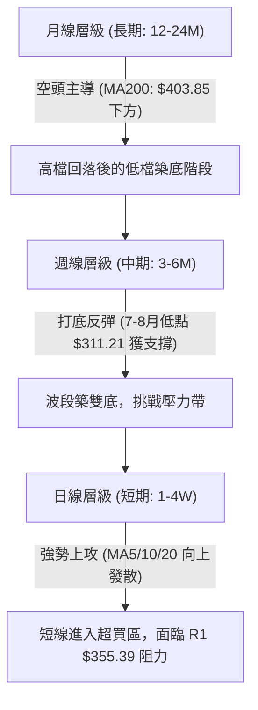

### 📈 長期趨勢 — 12個月走勢圖（Unicode）

TSLA 過去 12 個月呈現典型由「強勢衝頂」轉入「大幅修正與低檔沉澱」的循環週期。

```
TSLA 月線走勢圖（2025-08 至 2026-08）
價格軸 ($)
$460 ┤               ●(2025-10: 456.56 高點)
$440 ┤           ●       ●               ●
$420 ┤                                       ●
$400 ┤                               ●
$380 ┤                                   ●
$360 ┤
$340 ┤●                                          ●←現價 $345.13
$320 ┤
$300 ┤                                       ●(2026-07: 311.21 低點)
     └─────────────────────────────────────────────────────────────
      08  09  10  11  12  01  02  03  04  05  06  07  08 (月份)
     2025 ─────────────────────────► 2026 ────────────────────►
```

#### 走勢特徵分析表格

| 階段 | 時間區間 | 起止價格 | 漲跌幅 | 走勢特徵與結構意涵 |
|:---|:---|:---|:---:|:---|
| **第一階段：多頭主升浪** | 2025-08 ~ 2025-10 | $333.87 → $456.56 | +36.75% | 量價齊揚，衝刺歷史次高點，建立年度多頭頂部區間 |
| **第二階段：高檔震盪作頂**| 2025-11 ~ 2026-01 | $456.56 → $430.41 | -5.73%  | 高檔橫盤拉鋸，籌碼換手發散，MACD 動能逐步背離 |
| **第三階段：中期波段下殺**| 2026-02 ~ 2026-03 | $430.41 → $371.75 | -13.63% | 連續收黑，失守短期支撐，正式確認回檔走勢 |
| **第四階段：次級反彈遇阻**| 2026-04 ~ 2026-05 | $371.75 → $435.79 | +17.23% | 破底後技術面抽腳反彈，未能再創新高，形成次級高點 |
| **第五階段：加速探底尋底**| 2026-06 ~ 2026-07 | $420.60 → $311.21 | -26.01% | 斷崖式急跌，月線重挫逾百元，逼近 52 週低點 $297.38 |
| **第六階段：築底強勁回升**| 2026-07 ~ 2026-08 | $311.21 → $345.13 | +10.90% | 雙週拉出長陽線，RSI 與 MACD 低檔金叉，展開超跌反彈 |

### 📊 中期趨勢（週線分析）

中期走勢上，TSLA 在 2026 年 7 月 26 日當週跌至 $313.03，隨後 8 月 2 日當週見次低點 $311.21（週線 RSI 跌至極端超賣區 15.7~18.1），隨後出現報復性反彈，連續三週上漲至當前 $345.13。

```
週線級別中期阻力與支撐分佈
─────────────────────────────────────────────────────────────
[強阻力區]  R2: $409.28  ════════════════════  (MA200: $403.85 / 50% 回調: $398.10)
[動態阻力]  MA50: $366.23 --------------------  (中期趨勢分水嶺)
[關鍵阻力]  R1: $355.39  ════════════════════  (布林上軌 $354.60 聚類)
[當前價格]  ►► $345.13 ◄◄ (短線反彈延伸中)
[短期支撐]  S1: $337.24  --------------------  (MA10: $337.44 / 78.6% 回調: $340.49)
[核心支撐]  S2: $325.60  ════════════════════  (MA20 / 布林中軌: $325.65)
[強烈防線]  S3: $297.38  ════════════════════  (52週低點 / 底部支撐)
─────────────────────────────────────────────────────────────
```

### ⚡ 趨勢強度評估（ADX 解讀）

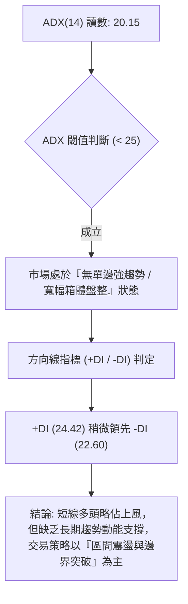

| 指標變數 | 具體讀數 | 門檻區間 | 技術含義解讀 |
|:---|:---:|:---:|:---|
| **ADX (14)** | **20.15** | < 25 (弱趨勢/盤整) | 單邊趨勢強度不足，價格易在布林通道上下軌之間形成震盪拉鋸 |
| **+DI (14)** | **24.42** | > -DI (多方領先) | 短線買盤動能佔優，支撐當前自低檔向上反彈走勢 |
| **-DI (14)** | **22.60** | < +DI (空方收斂) | 賣盤殺跌動能較 7 月顯著退潮，空頭暫停施壓 |

---

## 3. 圖表形態分析

### 🔍 形態識別系統

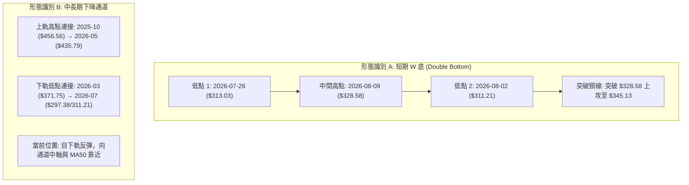

#### 形態信心度與目標價評估表

| 形態名稱 | 信心度 | 判斷依據（引用精確數據） | 完成度 | 目標價（附嚴格幾何計算式） |
|:---|:---:|:---|:---:|:---|
| **短期雙底 (W底)** | **75%** | 兩次下探低點 $313.03 與 $311.21，於支撐位 S2 ($325.60) 下方成功築底，並帶量突破中繼頸線 $328.58 | 85% | 頸線 $328.58 + 形態高度 ($328.58 - $311.21 = $17.37) = **$345.95**（現價 $345.13 已基本抵達滿足點） |
| **布林通道帶狀反彈** | **70%** | 價格自布林下軌 $296.70 啟動，穿越中軌 MA20 ($325.65)，%B 達 0.84 | 80% | 目標為布林通道上軌 **$354.60**（與關鍵阻力 R1 $355.39 重合） |
| **中級頭肩頂頸線回抽** | **45%** | 數據不足以確認完整右肩，頭部為 2025-10 $456.56，當前僅為超跌反彈 | 30% | 訊號不足，僅做指標型解讀，不預設延伸目標 |

### 🕯️ 重要K線形態分析

| 週期/月份 | 收盤價 | 典型K線組合 | 技術解讀 | 訊號 |
|:---|:---:|:---|:---|:---:|
| **2026-07** | $311.21 | 大陰線破位探底 (長下影) | 恐慌盤湧出，觸及 52 週低點 $297.38 後有逢低承接買盤進場 | 🟡 |
| **2026-08-09 (週)** | $328.58 | 低檔晨星 (Morning Star) | 止跌反轉K線，確認 $311.21 為有效短期波段底部 | 🟢 |
| **2026-08-16 (週)** | $342.27 | 光腳中陽線 (Bullish Marubozu) | 多方強勢發力，連穿 MA5 ($342.94) 與 MA10 ($337.44) | 🟢 |
| **2026-08-23 (最新)**| $345.13 | 高檔留上影小陽線 | 多頭動能持續，但逼近布林上軌與 R1 $355.39 阻力，出現獲利回吐壓制 | 🟡 |

### 📉 ASCII 走勢形態示意圖

```
TSLA 雙底 (W-Bottom) 突破與通道反彈架構
價格軸 ($)
$360 ┤                                        [R1: $355.39 / 布林上軌 $354.60]
$350 ┤                                     ▲
$345 ┤───────────────────────────────────● 現價: $345.13 (抵達雙底滿足點)
$340 ┤                                 ╱
$335 ┤                              ╱   [S1: $337.24 / MA10: $337.44]
$330 ┤            頸線: $328.58  ──────● (突破頸線)
$325 ┤               ▲            ╱     [S2: $325.60 / MA20: $325.65]
$320 ┤              ╱ ╲          ╱
$315 ┤  底1: $313.03   ╲  底2: $311.21
$310 ┤    ●             ●
$300 ┤────────────────────────────────── [S3: $297.38 / 52週最低價防線]
     └─────────────────────────────────────────────────────────────
       2026-07-26   08-02   08-09   08-16   08-23 (週K進程)
```

---

## 4. 支撐與阻力

### 🗺️ 關鍵價位分布圖（Unicode）

```
TSLA 價位結構分布圖
════════════════════════════════════════════════════════════════════
$418.36 ║████████████████████████████████║ 強烈阻力 R3 (年內反彈高點壓力)
$409.28 ║████████████████████████        ║ 重大阻力 R2 (MA200: $403.85 / 50% 斐波回調)
$355.39 ║████████████████████████████████║ 短期關鍵阻力 R1 (布林上軌 $354.60 壓制)
$345.13 ╠════════════════════════════════╣ ◄ 現價 (當前反彈前沿)
$337.24 ║▓▓▓▓▓▓▓▓▓▓▓▓▓▓▓▓▓▓▓▓            ║ 近期第一支撐 S1 (MA10: $337.44 / 78.6% 回調)
$325.60 ║████████████████████████████████║ 強支撐 S2 (MA20 / 布林中軌 $325.65)
$297.38 ║████████████████████████████████║ 年度鐵底支撐 S3 (52週最低價 $297.38)
════════════════════════════════════════════════════════════════════
```

### 🚧 阻力位分析表

| 阻力級別 | 價位 | 形成原因（依據波段聚類數據） | 突破難度 | 重要性評級 |
|:---|:---:|:---|:---:|:---:|
| **R1 (短期阻力)** | **$355.39** | 近一年波段高點聚類位，高度貼合布林通道上軌 ($354.60) | 中等 (需要放量配合) | 🟢★★★★☆ |
| **R2 (重大阻力)** | **$409.28** | 近一年波段高點聚類位，重合 MA200 ($403.85) 及斐波那契 50% 回調位 ($398.10) | 極高 (中長期牛熊分界線) | 🔴★★★★★ |
| **R3 (強烈阻力)** | **$418.36** | 近一年波段反彈頂部聚類位，接近 38.2% 斐波回調位 ($421.88) | 極高 (強套牢賣壓帶) | 🔴★★★★☆ |

### 🛡️ 支撐位分析表

| 支撐級別 | 價位 | 形成原因（依據波段聚類數據） | 守住機率 | 重要性評級 |
|:---|:---:|:---|:---:|:---:|
| **S1 (短期支撐)** | **$337.24** | 近一年波段低點聚類位，貼合 MA10 ($337.44) 與 78.6% 斐波回調位 ($340.49) | 70% | 🟢★★★☆☆ |
| **S2 (強支撐位)** | **$325.60** | 近一年波段低點聚類位，精確重合 MA20 ($325.65) 及布林中軌 | 85% | 🟢★★★★★ |
| **S3 (極限防線)** | **$297.38** | 52 週最低價 ($297.38) 及斐波那契 100% 回調底線 | 95% | 🟢★★★★★ |

### 📐 斐波那契回調位分析

*基準區間：52週波段高點 $498.83 至 52週波段低點 $297.38（波幅 $201.45）*

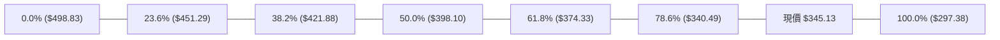

| 斐波那契回調位 | 精確價位 | 距現價空間 | 結構意涵與技術解讀 |
|:---|:---:|:---:|:---|
| **0.0% (52W High)** | **$498.83** | +44.53% | 年度歷史頂部，多頭終極目標 |
| **23.6%** | **$451.29** | +30.76% | 高檔強阻力區，2025-10 高點平台附近 |
| **38.2%** | **$421.88** | +22.24% | 黃金分割重要回調位，上方與 R3 ($418.36) 形成重疊壓力 |
| **50.0% (中軸)** | **$398.10** | +15.35% | 多空中期平衡分水嶺，接近 MA200 ($403.85) 與 R2 ($409.28) |
| **61.8% (黃金分割)**| **$374.33** | +8.46% | 黃金分割強壓力位，重合 60日均線 MA60 ($375.14) 與 MA50 ($366.23) 區間 |
| **78.6%** | **$340.49** | -1.34% | **當前突破防守位**：現價已成功站上此位，轉化為短線第一道動態支撐 |
| **100.0% (52W Low)**| **$297.38** | -13.84% | 年度波段起漲鐵底，跌破將引發嚴重技術面崩潰 |

> **位置判定**：當前現價 **$345.13** 精確運行於 **78.6% 回調位 ($340.49)** 與 **61.8% 回調位 ($374.33)** 之間。突破 $340.49 代表短線超跌反彈確立，正向 61.8% 黃金分割阻力區間邁進。

---

## 5. 技術指標深度解讀

### 🎛️ 指標訊號總覽

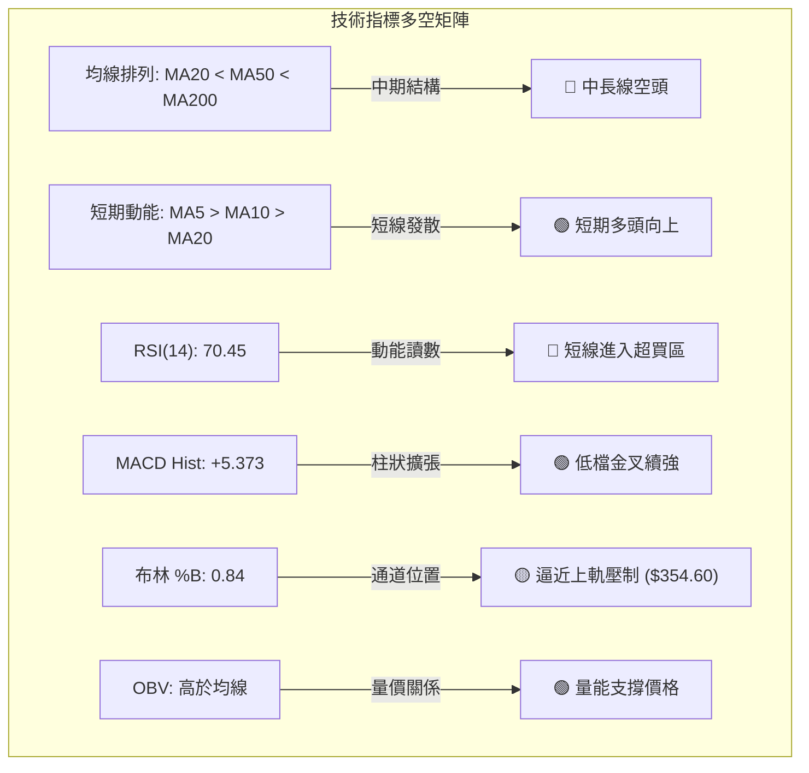

### 📈 移動平均線排列分析

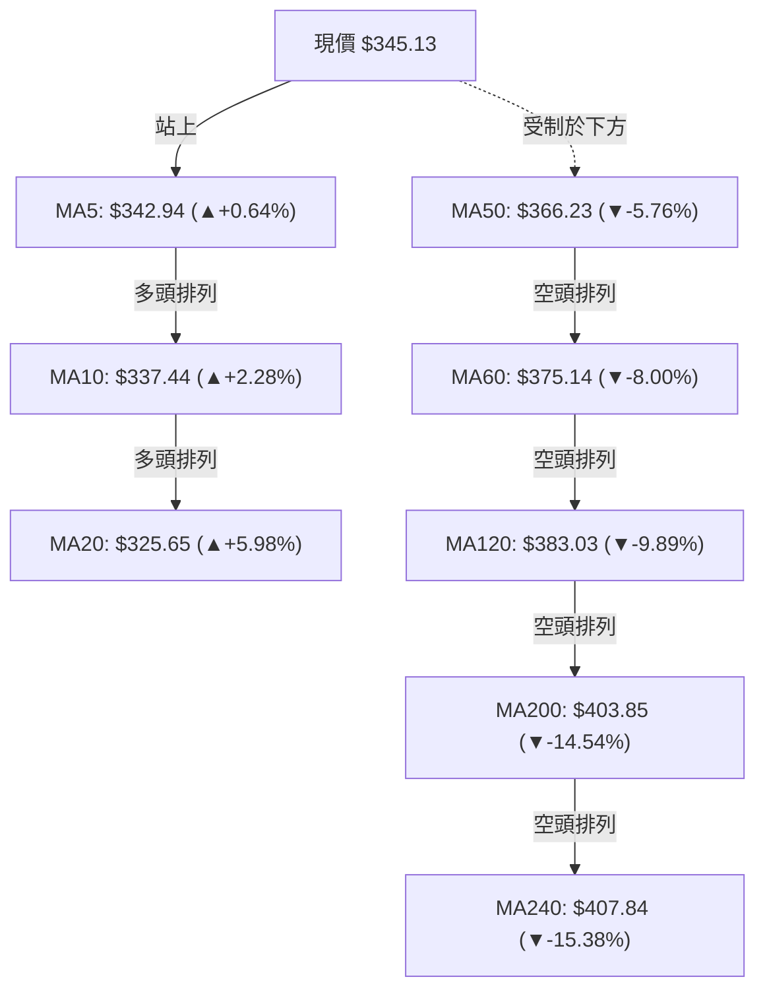

| 均線名稱 | 數值 | 距現價差距 | 當前排列特徵與走勢研判 |
|:---|:---:|:---:|:---|
| **MA5** | $342.94 | +0.64% (下方) | 短期均線上揚，提供每日超短線移動支撐 |
| **MA10** | $337.44 | +2.28% (下方) | 短期生命線，斜率向上，構成短線回踩第一防線 |
| **MA20** | $325.65 | +5.98% (下方) | 月線支撐強勁，自下軌向上翻揚，奠定波段反彈底座 |
| **MA50** | $366.23 | -5.76% (上方) | 季線下行壓制，為中期反彈首要遭遇的動態重壓區 |
| **MA200** | $403.85 | -14.54% (上方) | 年線空頭下壓，長期牛熊分界嶺，中長線仍處空方防禦 |

### 📉 RSI(14) 分析

- **RSI(14) 讀數**：`70.45` 
- **狀態進度條**：
  ```
  超賣 (0)          中性 (50)         超買 (70)        極端 (100)
  ├───┼───────────────┼───────────────┼───█───────────┤
  0                  50              70  70.45       100
  進度條：[███████████████████████████████░░░░░░░░░] 70.45%
  ```
- **區間判定**：🔴 **超買警戒區**。RSI 在 8 月初僅為 18.1（極度超賣），經過連續兩週拉升至 70.45，顯示短線買盤爆發力強，但指標進入鈍化與超買區，暗示現價 $345.13 不宜過度追高。
- **背離分析**：
  - 日線/週線檢查：價格自 7 月底 $311.21 創低後強勁回升，RSI 同步自 18.1 快速拉升至 70.45，**無頂背離亦無底背離**。此波為典型的超跌後「指標修復型共振反彈」。

### 📊 MACD(12,26,9) 訊號解讀

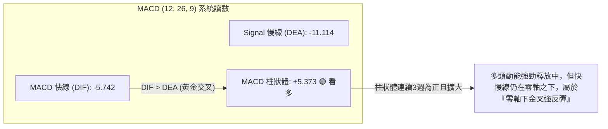

| 參數指標 | 數值 | 訊號狀態 | 技術解讀 |
|:---|:---:|:---:|:---|
| **MACD DIF** | -5.742 | 🟢 向上翻揚 | 快線自深谷快速上穿慢線，呈現陡峭仰角 |
| **MACD DEA** | -11.114 | 🟢 拐頭向上 | 慢線落後確認金叉，提供中期反彈訊號 |
| **MACD 柱狀體** | +5.373 | 🟢 多頭擴張 | 連續三週（+1.025 → +4.956 → +5.373）正向放大，反彈動能充沛 |

### 📦 布林通道分析

```
TSLA 布林通道 (Bollinger Bands, 20, 2) 結構圖
─────────────────────────────────────────────────────────────
$354.60 ┬─────────────────────────────────── [BB 上軌] (阻力壓制)
        │                              ▲ 
$345.13 ┼──────────────────────────────●───── [現價: %B = 0.84]
        │                            ╱
$325.65 ┼───────────────────────────●─────── [BB 中軌: MA20] (強支撐)
        │                         ╱
$296.70 ┴────────────────────────●─────────── [BB 下軌] (7月觸軌起漲)
─────────────────────────────────────────────────────────────
```

- **上軌**：`$354.60` ｜ **中軌 (MA20)**：`$325.65` ｜ **下軌**：`$296.70`
- **帶寬與位置**：當前 `%B = 0.84`，股價已由下軌迅速貫穿中軌並逼近上軌。布林通道開口未顯著擴張，表明當前處於標準的「箱體軌道內部震盪」，在觸及上軌 $354.60（與 R1 $355.39 重疊）時面臨技術性回檔風險。

### 💹 成交量分析（量價配合度）

- **最新日成交量**：`30,691,906` 股
- **20日均量**：`35,259,730` 股（量比：`0.87x`，略低於均量）
- **50日均量**：`40,891,194` 股
- **OBV (能量潮)**：`OBV > MA` 🟢 **看多**。
- **量價結構診斷**：
  在 7 月底探底 $311.21 時週成交量達 2.75 億股（恐慌放量見底），隨後反彈過程中成交量呈現溫和縮量上漲（最新週量約 1.21 億股）。OBV 保持在均線之上，說明底部籌碼鎖定良好，主力未見出貨跡象，但若欲一舉突破 R1 $355.39 與 MA50，成交量必須放大至 20 日均量以上（>35.2M）。

---

## 6. 動能與波動率

### ⚡ 動能評估四象限

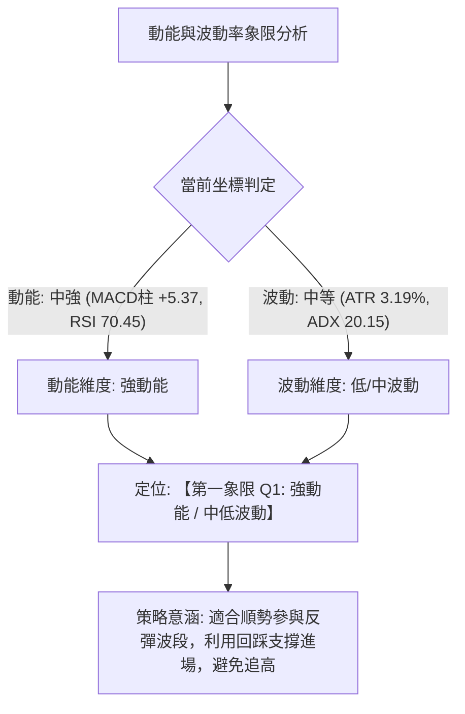

| 象限代號 | 動能強度 | 波動率水平 | 當前股票狀態 | 戰略應對方針 |
|:---:|:---:|:---:|:---:|:---|
| **Q1** | **強** | **中/低** | **✓ TSLA 當前位置** | **最佳波段機會**：動能向上釋放且未失控，逢回調支撐順勢做多 |
| **Q2** | 弱 | 低 | - | 沉悶盤整：資金效率低，觀望為宜 |
| **Q3** | 強 | 高 | - | 高風險高收益：單日爆發性行情，嚴格設定窄止損 |
| **Q4** | 弱 | 高 | - | 避開進場：無序震盪殺跌，極易受損 |

### 📊 ATR 波動率分析

- **ATR(14)**：`$11.00`（佔現價比率：`3.19%`）
- **波動特性評估**：每日合理預期震盪區間為 ±$11.00。當前波動率較 7 月急跌期顯著收斂，屬於健康的反彈擴張走勢。
- **動態風控距離建議**：
  - **超短線當沖止損**：`0.75 × ATR` = `$8.25`
  - **波段交易標準止損**：`1.5 × ATR` = `$16.50`（建議以現價向下設定於 $328.63 附近，與 S1 $337.24 / S2 $325.60 配合）
  - **寬鬆趨勢防守**：`2.0 × ATR` = `$22.00`

### 📐 Beta 與市場相關性

- **Beta 係數**：`1.827`
- **解讀**：TSLA 具備典型高 Beta 成長股特徵，波動幅度約為 S&P 500 大盤的 1.83 倍。在大盤偏多或市場風險偏好（Risk-On）回升時，TSLA 具備優異的向上彈性；但若大盤回檔，其下行修正力道亦將被放大。

---

## 7. 多時框架總結

### 📋 時框架評分表

| 時框架 | 趨勢方向 | 動能狀態 | 均線排列 | 圖表形態 | 綜合評分 | 操作建議 |
|:---|:---:|:---:|:---:|:---:|:---:|:---|
| **短期 (日線)** | 🟢 偏多上行 | 🟢 強勁 (RSI: 70.45 超買) | 🟢 MA5>10>20 發散 | 雙底突破滿足 | **75/100** | 逢回踩 S1 布局，不追高 |
| **中期 (週線)** | 🟡 震盪築底 | 🟢 MACD柱翻正擴張 | 🔴 MA20<MA50 下壓 | 箱體底部反彈 | **55/100** | 區間操作，目標看至 R1~R2 |
| **長期 (月線)** | 🔴 空頭防守 | 🟡 低檔鈍化修復 | 🔴 處於 MA200 下方 | 大週期下行整理 | **40/100** | 長線維持防禦，等待均線扭轉 |

### 🔲 綜合訊號矩陣

```
╔══════════════════════════════════════════════════════════════════╗
║              TSLA 多時框架綜合訊號矩陣                           ║
╠══════════════════════════════════════════════════════════════════╣
║ 評估維度         短期 (日線)       中期 (週線)       長期 (月線) ║
║ 趨勢方向         🟢 偏多反彈       🟡 區間震盪       🔴 偏空格局 ║
║ 均線架構         🟢 短多排列       🔴 中期承壓       🔴 空頭排列 ║
║ 動能指標         🔴 短線超買       🟢 金叉放量       🟡 低檔修復 ║
║ 關鍵邊界         阻力 R1 $355.39   阻力 R2 $409.28   阻力 R3 $418.36║
║ 防守底線         支撐 S1 $337.24   支撐 S2 $325.60   支撐 S3 $297.38║
╚══════════════════════════════════════════════════════════════════╝
```

### ⚖️ 多時框收斂結論

依據多時框收斂規則（嚴格要求 14）：
1. **行情性質判定**：當前 `ADX(14) = 20.15 (< 25)`，市場定性為**「非單邊強趨勢之寬幅盤整／箱體震盪行情」**。
2. **主導時框與邊界**：在盤整行情下，交易邏輯由**日線與週線布林通道（下軌 $296.70 至 上軌 $354.60）及波段聚類價位（S2 $325.60 至 R1 $355.39 / R2 $409.28）**主導。
3. **收斂唯一方向**：**【中性偏多區間震盪（逢回調做多）】**。日線雖呈現強勁短多排列，但逼近布林上軌與超買區，中期受制於 MA50 與 MA200。因此，戰略上不宜在 $345.13 追買，而應以**回踩 S1 ($337.24) 或 S2 ($325.60) 逢低吸納、向上挑戰 R1 ($355.39) 與 R2 ($409.28)** 為主要交易邏輯。

---

## 8. 交易策略建議

### 🗺️ 策略決策流程圖

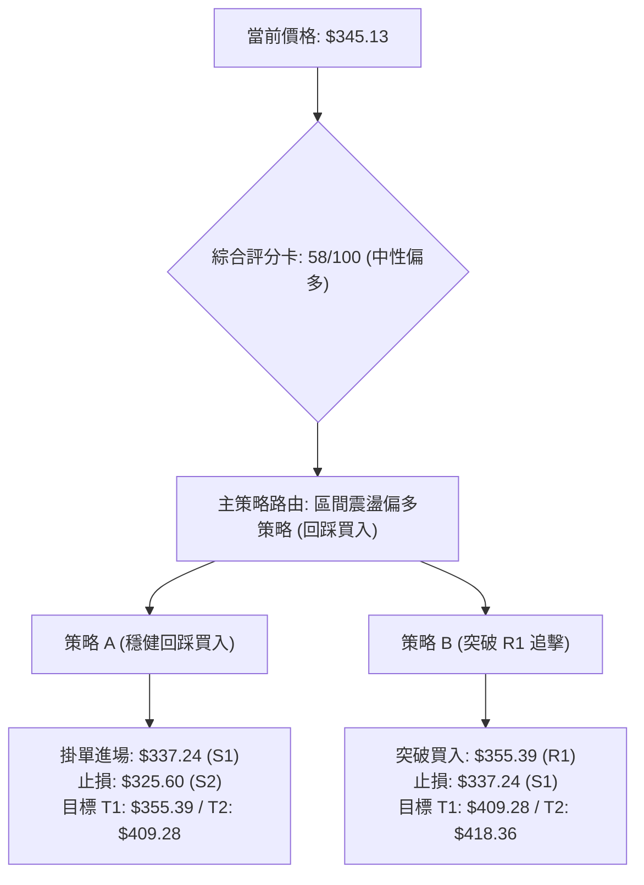

### 🧭 策略路由

> **當前主策略方向 = 【中性偏多區間震盪操作】（依評分卡 58/100，介於 40–60 之中性偏多區間）**
> 
> 鑑於 RSI(14) 達 70.45 且 ADX 僅 20.15，嚴禁在 $345.13 追高。策略重點在於利用「布林通道上軌壓制帶來的短線回踩」，於關鍵支撐位進場布局多單。

### 🎯 價格情境階梯（Price Scenarios）

價位完全嚴格引用第 4 章及數據計算值：

| 觸發條件 | 第一目標 (T1) | 後續延伸 (T2) | 結構技術含義 |
|:---|:---:|:---:|:---|
| **向上放量突破 R1 $355.39** | **R2 $409.28** | **R3 $418.36** | 正式扭轉中期偏空格局，展開挑戰 MA200 之大波段反彈 |
| **回踩 S1 $337.24 獲支撐** | **現價 $345.13** | **R1 $355.39** | 短線消化超買指標，延續雙底突破後的標準多頭階梯上漲 |
| **跌破 S2 $325.60 (MA20)** | **S3 $297.38** | — | 短期反彈宣告衰竭，行情重回 52 週低點尋求二次築底 |

### 📊 情境機率分佈

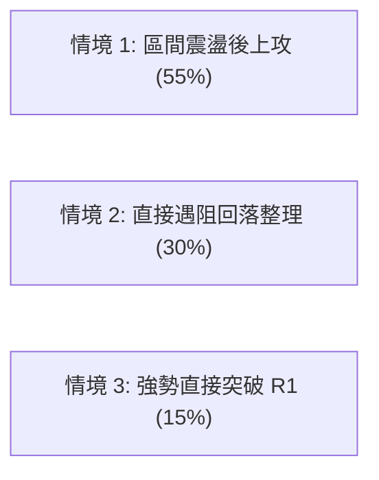

| 情境劇本 | 機率預估 | 主要技術指標依據 |
|:---|:---:|:---|
| **情境一：回踩 S1 後震盪上攻** | **55%** | MACD 柱狀體持續擴張 (+5.373)，OBV 處於 MA 之上，回調有買盤承接 |
| **情境二：遇阻 R1 回落測試 S2** | **30%** | RSI 達 70.45 超買，ADX 僅 20.15 缺乏趨勢動能，布林上軌壓制顯著 |
| **情境三：放量直接突破 R1** | **15%** | 最新日成交量（30.6M）低於 20日均量，缺乏直接強行爆發突破的巨量 |

### 🟢 主策略詳情

本報告主推兩套偏多操作策略，嚴格依據系統支撐阻力數值計算風險報酬比：

| 策略要素 | 策略 A（穩健型：回踩支撐買入） | 策略 B（進取型：突破阻力追擊） |
|:---|:---|:---|
| **策略邏輯** | 消化短線超買，回踩 S1/MA10 進場 | 帶量突破布林上軌與 R1 順勢加碼 |
| **進場條件** | 價格回調至 S1 且 1小時K線收出止跌陽線 | 日K線收盤價實質突破 R1 ($355.39) 且量能 > 35M |
| **進場價格** | **$337.24**（精確對應支撐 S1） | **$355.39**（精確對應阻力 R1） |
| **目標價 T1** | **$355.39**（阻力 R1，獲利空間 +$18.15 / +5.38%） | **$409.28**（阻力 R2，獲利空間 +$53.89 / +15.16%） |
| **目標價 T2** | **$409.28**（阻力 R2，獲利空間 +$72.04 / +21.36%） | **$418.36**（阻力 R3，獲利空間 +$62.97 / +17.72%） |
| **止損價格** | **$325.60**（跌破 S2 / MA20，虧損 -$11.64 / -3.45%） | **$337.24**（假突破跌回 S1，虧損 -$18.15 / -5.11%） |
| **風險報酬比** | **1 : 1.56**（以 T1 計）／ **1 : 6.19**（以 T2 計） | **1 : 2.97**（以 T1 計）／ **1 : 3.47**（以 T2 計） |
| **預估勝率** | **65%** | **55%** |
| **建議倉位** | **15% - 20%** 總資金 | **10% - 15%** 總資金 |

### 🔴 反向風險觸發點（對沖提示）

- **多頭失效關鍵位**：若收盤價**跌破 S2 ($325.60)**，宣告短期上升結構破壞，應立即平倉多頭部位或建立對沖空單。
- **極端風險防守位**：若跌破 **S3 ($297.38)**，將引發停損賣壓潮，行情將開啟全新一輪破底跌勢。

### ⭐ 整體訊號強度評星

```
╔══════════════════════════════════════════════════════════════════╗
║ 做多訊號強度：  ★★★☆☆  (3.5/5星 — 短線反彈動能足，受制於中長線均線) ║
║ 做空訊號強度：  ★★☆☆☆  (2.0/5星 — 底部支撐成型，殺跌動能已衰竭)     ║
║ 整體訊號可信度：★★★★☆  (4.0/5星 — 價位聚類清晰，量價指標共振良好)   ║
╚══════════════════════════════════════════════════════════════════╝
```

---

## 9. 風險提示與監控

### ✅ 關鍵監控指標 Checklist

```
╔══════════════════════════════════════════════════════════════════╗
║              TSLA 交易日常監控清單 (Checklist)                   ║
╠══════════════════════════════════════════════════════════════════╣
║ [ ] 價位監控：現價與短期阻力 R1 ($355.39) 之互動（是否放量承壓）║
║ [ ] 動能監控：日線 RSI(14) 是否在 70.45 上方出現高檔鈍化或拐頭  ║
║ [ ] 均線監控：MA10 ($337.44) 與 MA20 ($325.65) 之支撐有效性      ║
║ [ ] 趨勢監控：ADX(14) 是否自 20.15 向上抬升突破 25（趨勢啟動）  ║
║ [ ] 能量監控：日成交量是否回升至 20日均量 35.2M 以上             ║
║ [ ] 止損底線：S2 ($325.60) 多單波段防守點是否失守               ║
╚══════════════════════════════════════════════════════════════════╝
```

### ⚠️ 風險場景分析

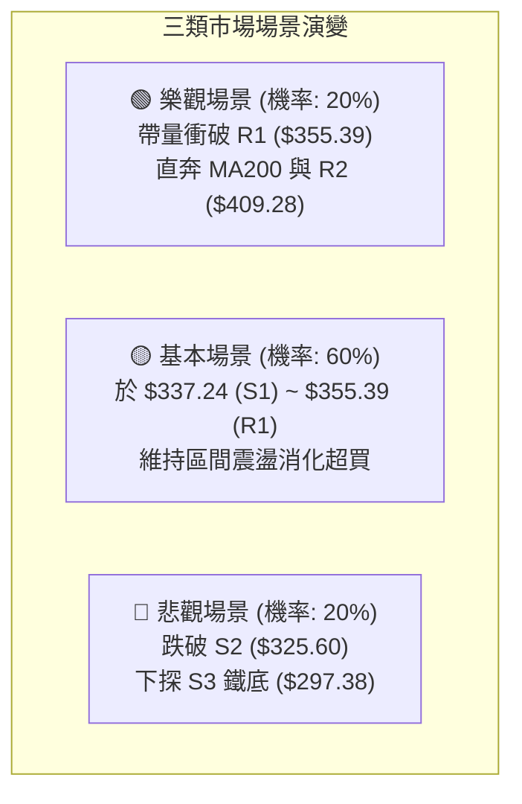

### 🛡️ 風險管理重要提醒

1. **嚴禁高檔追價**：當前股價已由 $311.21 快速拉升至 $345.13，RSI(14) 達 70.45，短線盈虧比在 $345.13 進場極不對稱（向上至 R1 僅剩 +$10.26 空間，向下至 S1 有 -$7.89 空間）。
2. **倉位嚴格管控**：因中長線 MA50 ($366.23) 與 MA200 ($403.85) 仍處空頭排列，總持倉部位建議控制在 **30% 以內**，保留充裕現金。
3. **ATR 動態追蹤止損**：進場後依據 `1.5 × ATR = $16.50` 動態向上移動防守點，鎖定波段獲利。

---

## 📋 報告總結

```
╔══════════════════════════════════════════════════════════════════╗
║                   TSLA 技術分析報告總結                          ║
╠══════════════════════════════════════════════════════════════════╣
║ 報告日期：2026-08-20                當前價格：$345.13            ║
║ 分析評級：🟡 58/100 — 中性偏多區間震盪 (底部反彈展開中)          ║
╠══════════════════════════════════════════════════════════════════╣
║ 關鍵結論：                                                       ║
║ ├─ 長期趨勢：🔴 偏空受制（處於 MA200 $403.85 下方）             ║
║ ├─ 中期趨勢：🟡 築底震盪（$311.21 形成雙底，挑戰 MA50 $366.23）   ║
║ ├─ 短期趨勢：🟢 偏多上行（MA5/10/20 多頭排列，MACD 柱狀體擴張） ║
║ ├─ 關鍵支撐：S1: $337.24 ｜ S2: $325.60 ｜ S3: $297.38          ║
║ ├─ 關鍵阻力：R1: $355.39 ｜ R2: $409.28 ｜ R3: $418.36          ║
║ └─ 共識目標：分析師平均目標價 $395.34 (接近 50% 回調位 $398.10)  ║
╠══════════════════════════════════════════════════════════════════╣
║ 最優策略組合：                                                   ║
║ 1. 🥇 最佳機會（策略 A）：耐心等待回踩 S1 $337.24 進場，止損     ║
║    設於 S2 $325.60，第一目標看 R1 $355.39，第二目標 R2 $409.28。 ║
║ 2. 🥈 次選機會（策略 B）：若強勢放量突破 R1 $355.39 順勢追擊，   ║
║    目標直指 R2 $409.28，嚴格以 S1 $337.24 為止損。               ║
║ 3. 🥉 保守選擇：在股價未實質站穩 MA50 ($366.23) 之前，維持觀望， ║
║    或僅以 10% 輕倉參與布林通道內之高拋低吸。                     ║
╚══════════════════════════════════════════════════════════════════╝
```

---

> ⚠️ **免責聲明**：本報告為技術分析研究成果，所有數據、圖表及價位推算均基於歷史價格與量化模型。本報告**僅供學術研究與投資參考**，**不構成任何形式的要約或投資建議**。金融市場具高度風險，投資人應獨立評估風險並自負盈虧。

---

*報告生成時間：2026-08-20 ｜ 數據來源：Yahoo Finance ｜ 分析框架：多時框架量化技術體系*