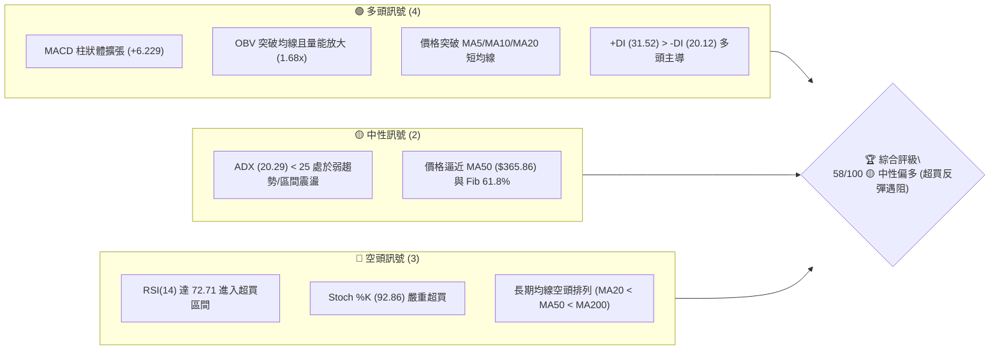
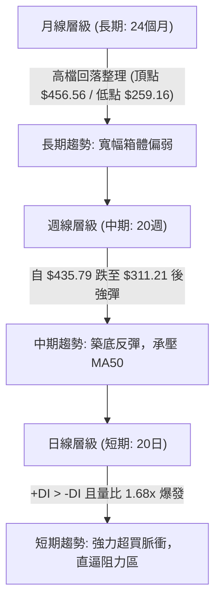
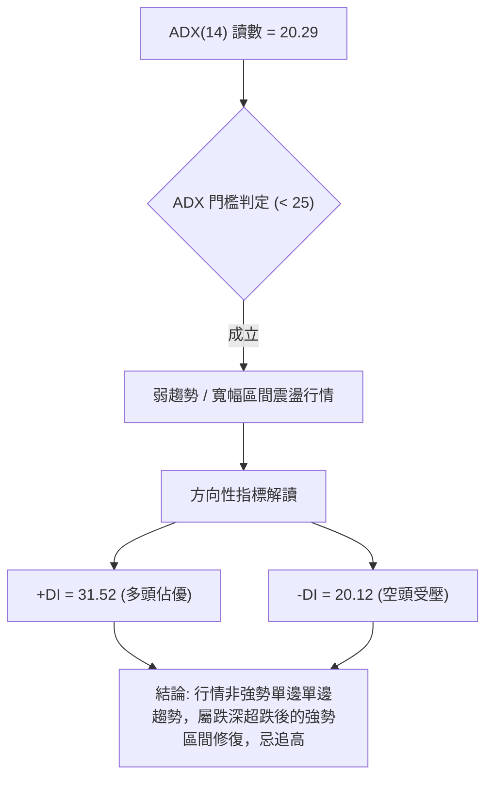
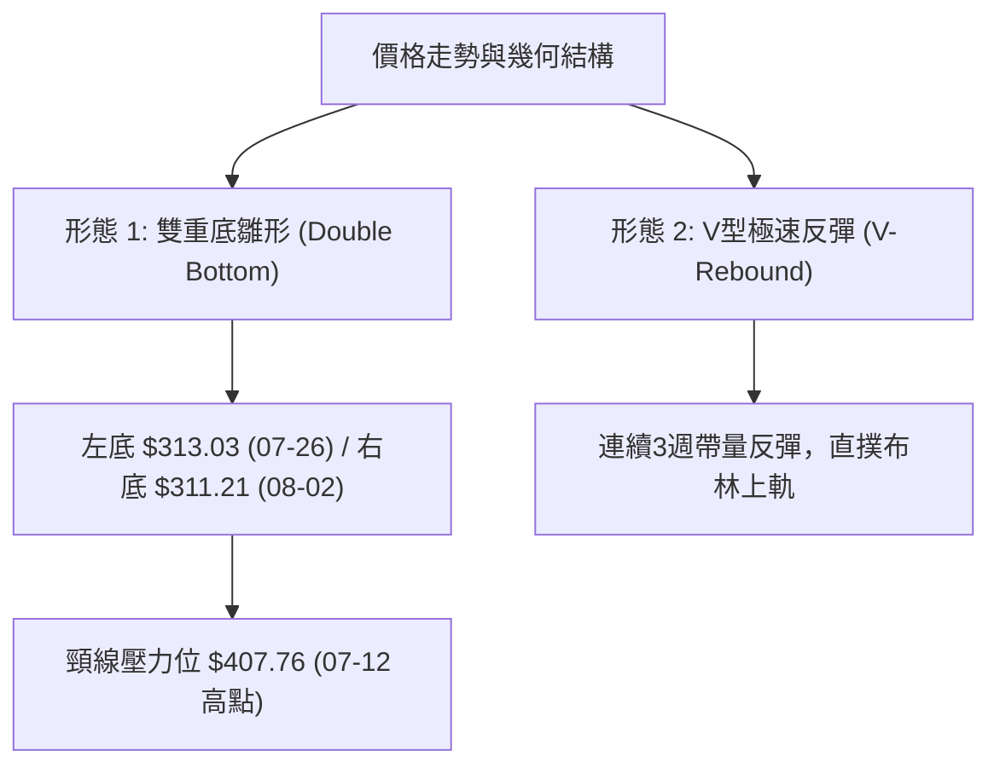
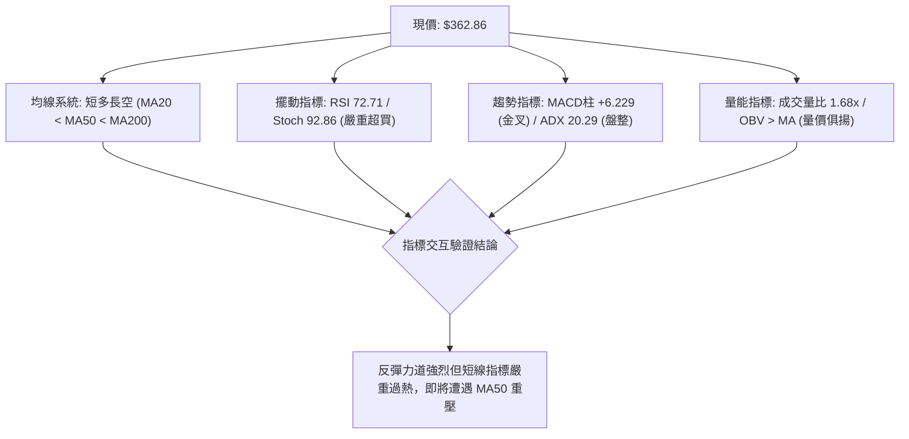
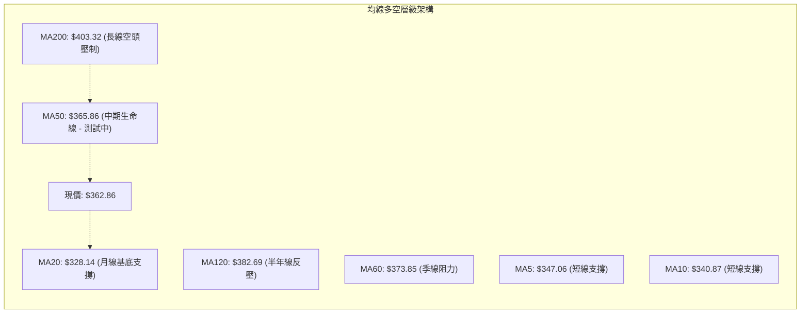
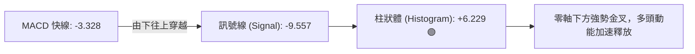
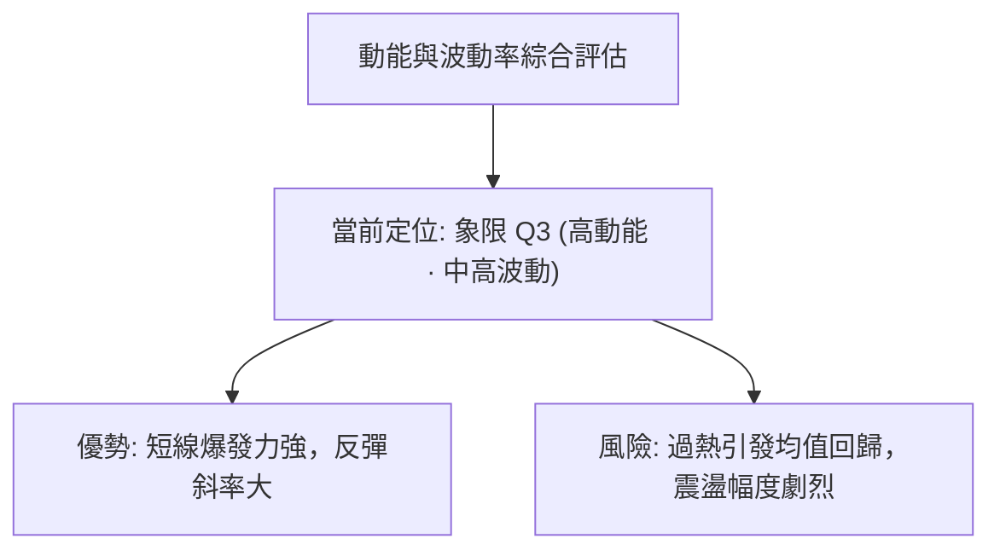
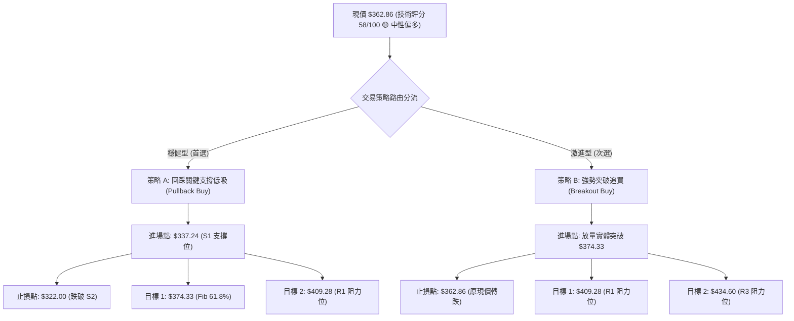
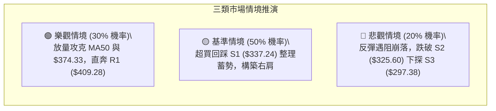

# TSLA 技術分析報告

> **報告日期**：2026-08-22 ｜ **語言**：繁體中文 ｜ **數據來源**：Yahoo Finance ｜ **當前價格**：$362.86

---

## 目錄

| 章節 | 內容 |
|------|------|
| [1. 技術面概覽](#1-技術面概覽) | 訊號儀表板、核心指標、評分卡 |
| [2. 趨勢分析](#2-趨勢分析) | 多時框趨勢、長中短期走勢、ADX 解讀 |
| [3. 圖表形態分析](#3-圖表形態分析) | 形態識別、信心度評估、K線組合、目標價 |
| [4. 支撐與阻力](#4-支撐與阻力) | 關鍵價位、斐波那契回調結構 |
| [5. 技術指標深度解讀](#5-技術指標深度解讀) | MA均線系統、RSI、MACD、布林通道、OBV量能 |
| [6. 動能與波動率](#6-動能與波動率) | 動能四象限、ATR波動率、Beta係數 |
| [7. 多時框架總結](#7-多時框架總結) | 時框架評分矩陣、多時框收斂結論 |
| [8. 交易策略建議](#8-交易策略建議) | 策略路由、情境階梯、主策略詳情與風報比 |
| [9. 風險提示與監控](#9-風險提示與監控) | 關鍵監控清單、風險情境與資金管理 |

---

## 1. 技術面概覽

### 🎯 技術訊號儀表板



### 📊 核心指標速覽表

| 指標類別 | 指標名稱 | 當前數值 | 訊號 | 解讀 |
|----------|----------|----------|------|------|
| **價格** | 當前收盤價 | $362.86 | 🟢 | 自前低 $311.21 強勁反彈，位於 52W 區間 32.5% |
| **均線** | MA20 | $328.14 | 🟢 | 價格位於短期均線上方 +10.58%，短期趨勢向上 |
| **均線** | MA50 | $365.86 | 🔴 | 價格位於 MA50 下方 -0.82%，即將面臨中期下壓阻力 |
| **均線** | MA200 | $403.32 | 🔴 | 價格位於長期牛熊分界線下方 -10.03%，長線偏空 |
| **動能** | RSI(14) | 72.71 | 🔴 | 進入 >70 超買區間，短線追高風險急劇升高 |
| **動能** | MACD (12,26,9) | -3.328 / +6.229 | 🟢 | 快線低檔金叉訊號線，柱狀體顯著轉正擴張 |
| **擺動** | Stoch %K / %D | 92.86 / 92.03 | 🔴 | 隨機指標進入極度超買鈍化區 |
| **趨勢** | ADX(14) | 20.29 | 🟡 | 數值 <25，行情定義為「跌深反彈與區間震盪」，非單邊單向趨勢 |
| **通道** | 布林通道 (%B) | 1.03 (上軌 $360.85) | 🟡 | 價格突破布林上軌，短線存在向中軌 ($328.14) 均值回歸壓力 |
| **量能** | 成交量 / 20日均量 | 58.98M / 35.07M | 🟢 | 量比達 1.68x，量價配合良好，OBV 呈多頭支撐 |
| **波動** | ATR(14) | $11.51 (3.17%) | 🟡 | 波動率處於中等水平，單日正常震盪範圍約 $11.51 |

### 🏆 技術評分卡

```
╔══════════════════════════════════════════════════════════════════╗
║              技術評分卡 — TSLA (2026-08-22)                      ║
╠══════════════════════════════════════════════════════════════════╣
║ 趨勢強度 (ADX/趨勢方向)  ████████░░░░░░░░░░░░  42/100  🔴 弱勢震盪 ║
║ 短期動能 (MACD/量能配合) ████████████████░░░░  80/100  🟢 動能強勁 ║
║ 擺動過熱 (RSI/KD 超買)   ██████░░░░░░░░░░░░░░  30/100  🔴 嚴重超買 ║
║ 支撐穩定度 (波段低點S1-S3)██████████████░░░░░░  70/100  🟢 底層扎實 ║
║ 成交量配合 (OBV/量比1.68) ████████████████░░░░  82/100  🟢 放量推升 ║
║ 均線架構 (長中短期排列)  ████████░░░░░░░░░░░░  45/100  🔴 空頭排列 ║
╠══════════════════════════════════════════════════════════════════╣
║ 綜合技術評分             ███████████░░░░░░░░░  58/100  🟡 中性偏多 ║
╚══════════════════════════════════════════════════════════════════╝
```

---

## 2. 趨勢分析

### 🌐 多時框趨勢分析



### 📈 長期趨勢 — 12個月走勢圖（Unicode）

```
TSLA 月線走勢圖（過去12個月：2025-08 至 2026-08）
價格 ($)
$460 ┤               ●(2025-10: $456.56)
$440 ┤           ●       ●       ●               ●(2025-12: $449.72 / 2026-05: $435.79)
$420 ┤                               ●       ●
$400 ┤                                   ●
$380 ┤                                       ●
$360 ┤                                           ●← 現價 ($362.86)
$340 ┤   ●
$320 ┤
$300 ┤                                               ●(2026-07: $311.21)
     └─────────────────────────────────────────────────────────────
        08  09  10  11  12  01  02  03  04  05  06  07  08 (月份)
```

#### 走勢特徵分析表格

| 階段區間 | 起止價位 | 期間漲跌幅 | 走勢特徵與結構意涵 |
|----------|----------|------------|--------------------|
| **2025-08 ～ 2025-10** | $333.87 → $456.56 | +36.75% | 主升浪爆發，創下波段歷史頂點群，量能充沛 |
| **2025-11 ～ 2026-01** | $456.56 → $430.41 | -5.73% | 高檔雙頂構築，多空於 $430–$450 區間進行高位籌碼派發 |
| **2026-02 ～ 2026-04** | $430.41 → $381.63 | -11.33% | 中期下行走勢確立，接連跌破短中期均線，形成階梯式回落 |
| **2026-05 ～ 2026-07** | $435.79 → $311.21 | -28.59% | 次級反彈誘多後引發踩踏，7月暴跌至 52W 區間低位群 ($311.21) |
| **2026-08 (當前)** | $311.21 → $362.86 | +16.59% | 觸底強彈，收復 $360 關卡，日線呈現連續長陽反攻形態 |

### 📊 中期趨勢（週線分析）

```
近 20 週收盤價位軌跡與結構示意圖：
$440 ┤         ●(05-31: $435.79)
$420 ┤     ● ●   ●
$400 ┤   ●           ● ●
$380 ┤       ●           ●   ●   ●
$360 ┤                               ●($362.86 逼近 MA50)
$340 ┤ ●                         ●
$320 ┤                         ●
$300 ┤                     ● ●(07-26: $313.03 / 08-02: $311.21 形成雙重底雛形)
     └────────────────────────────────────────────────────────────
```

### ⚡ 趨勢強度評估（ADX 解讀）



| 指標名稱 | 當前數值 | 參考標準 | 當前狀態判定 |
|----------|----------|----------|--------------|
| **ADX (14)** | **20.29** | < 25 (弱趨勢/震盪)；25–50 (強趨勢)；> 50 (極強單邊) | 🟡 **無單邊趨勢 (區間震盪特徵)** |
| **+DI (14)** | **31.52** | 數值越高代表多頭推進力越強 | 🟢 多方動能佔據主導優勢 |
| **-DI (14)** | **20.12** | 數值越低代表空方壓制力衰退 | 🟢 空方力道顯著回落 |

---

## 3. 圖表形態分析

### 🔍 形態識別系統



#### 形態信心度與目標價評估表

| 識別形態 | 信心度 | 判斷依據（嚴格引用歷史數據） | 完成度 | 目標價（附嚴謹計算式） |
|----------|--------|------------------------------|--------|------------------------|
| **波段雙重底 (W底)** | **70%** | 2026-07-26 低點 $313.03 與 2026-08-02 低點 $311.21 形成雙底，回測 52W 低點 $297.38 有效守穩 | 55% | 若突破 7月頸線高點 $407.76：<br/>$407.76 + ($407.76 - $311.21) = **$504.31** (遠期極限) |
| **短期 V 型修復** | **85%** | 3週內自 $311.21 迅速拉升至 $362.86，日線連陽突破 MA20 ($328.14) | 90% | 滿足第一波段反彈高度，面臨 MA50 ($365.86) 測壓 |
| **中期下降通道** | **60%** | 自 2026-05 高點 $435.79 與 2026-07 高點 $407.76 連接之下軌反彈 | 75% | 通道上軌阻力落於 R1 ($409.28) 附近 |

### 🕯️ 重要K線形態分析

| 週期/日期 | 收盤價 | K線形態特徵 | 技術意涵解讀 | 訊號方向 |
|-----------|--------|-------------|--------------|----------|
| **2026-07-26** | $313.03 | 長陰殺跌放量大陰線 | 恐慌盤湧出，RSI(14) 跌至 15.7 極度超賣 | 🔴 恐慌拋售 |
| **2026-08-02** | $311.21 | 低檔十字星探底針 | 空頭力竭，成交量縮減至 198.8M，確立底部支撐 | 🟢 止跌訊號 |
| **2026-08-09** | $328.58 | 實體中陽線吞噬 | 突破前期整固平台，MACD柱轉正 (+1.025) | 🟢 啟動確認 |
| **2026-08-16** | $342.27 | 連續實體陽線推進 | 站上 MA20 ($328.14)，多頭全面反撲 | 🟢 多頭增強 |
| **2026-08-23** | $362.86 | 突破上軌光頭大陽線 | 量能達 180.5M，直逼 MA50 ($365.86)，短線超買 | 🟡 短線過熱 |

### 📉 ASCII 走勢形態示意圖

```
TSLA 近期築底反彈形態示意圖：
價格 ($)
$410 ┤                                           [頸線壓力: $407.76 / R1: $409.28]
$390 ┤
$370 ┤                                     ▲ (測試 MA50: $365.86)
$350 ┤                                   ● 現價 $362.86 (突破布林上軌)
$330 ┤                                 ●
$310 ┤         ●(左底 $313.03)     ●(右底 $311.21)
$290 ┤           └───────────────┴─ [52W 低點強支撐 S3: $297.38]
     └────────────────────────────────────────────────────────────
                 2026-07-26      2026-08-02     2026-08-23
```

---

## 4. 支撐與阻力

### 🗺️ 關鍵價位分布圖（Unicode）

```
TSLA 價位結構分布圖（嚴格依據 OHLCV 與斐波那契回調計算）
═══════════════════════════════════════════════════════════════════════
$498.83 ║████████████████████████████████████████║ 52W 最高點 / Fib 0.0%
$451.29 ║██████████████████████████              ║ Fib 23.6% 回調位
$434.60 ║████████████████████████████████        ║ 強阻力 R3 (5月波段頂 $435.79 聚類)
$418.36 ║████████████████████                    ║ 阻力 R2 (中期密集套牢區)
$409.28 ║████████████████████████                ║ 關鍵阻力 R1 / 7月頸線高點 ($407.76)
$398.10 ║▓▓▓▓▓▓▓▓▓▓▓▓▓▓▓▓▓▓                      ║ Fib 50.0% 關鍵心理分水嶺
$374.33 ║▓▓▓▓▓▓▓▓▓▓▓▓                            ║ Fib 61.8% 強阻力 / MA60 ($373.85)
$365.86 ║────────────────────────────────────────║ MA50 動態阻力線
$362.86 ╠════════════════════════════════════════╣ ◄ 當前價格 $362.86
$340.49 ║▓▓▓▓▓▓▓▓▓▓▓▓▓▓▓▓▓▓                      ║ Fib 78.6% 回調位 / MA10 ($340.87)
$337.24 ║████████████████████                    ║ 近期波段支撐 S1 (第一道回踩防線)
$328.14 ║────────────────────────────────────────║ BB中軌 / MA20 強支撐
$325.60 ║████████████████████████                ║ 強支撐 S2 (波段起漲突破點)
$297.38 ║████████████████████████████████████████║ 52W 最低點 / 強支撐 S3 / Fib 100%
═══════════════════════════════════════════════════════════════════════
```

### 🚧 阻力位分析表

| 阻力級別 | 精確價位 | 形成依據與技術邏輯 | 突破難度 | 重要性 |
|----------|----------|--------------------|----------|--------|
| **阻力 R1** | **$409.28** | 近一年波段高點聚類、MA200 ($403.32) 密集共振、7月高點 ($407.76) | 🔴 極高 | ★★★★★ |
| **阻力 R2** | **$418.36** | 斐波那契 38.2% 回調位 ($421.88) 下方波段套牢籌碼峰 | 🟡 中高 | ★★★★☆ |
| **阻力 R3** | **$434.60** | 2026年5月波段反彈高點 ($435.79) 聚類，大型箱體頂部 | 🔴 極高 | ★★★★★ |

### 🛡️ 支撐位分析表

| 支撐級別 | 精確價位 | 形成依據與技術邏輯 | 守住機率 | 重要性 |
|----------|----------|--------------------|----------|--------|
| **支撐 S1** | **$337.24** | 近期波段回踩支撐聚類、貼近 Fib 78.6% ($340.49) 及 MA10 ($340.87) | 🟢 75% | ★★★★☆ |
| **支撐 S2** | **$325.60** | 近一年波段低點聚類、布林中軌 MA20 ($328.14) 支撐防線 | 🟢 85% | ★★★★★ |
| **支撐 S3** | **$297.38** | 52週歷史低點、Fib 100.0% 極限多頭防守底線 | 🟢 95% | ★★★★★ |

### 📐 斐波那契回調位分析

*以 52 週波動區間 $297.38 (低點) 至 $498.83 (高點) 計算：*

| 斐波那契層級 | 精確價位 | 距現價空間 | 技術角色解讀 |
|--------------|----------|------------|--------------|
| **0.0% (52W High)** | **$498.83** | +37.47% | 歷史年度頂部阻力 |
| **23.6%** | **$451.29** | +24.37% | 強勢牛市回調極限位 |
| **38.2%** | **$421.88** | +16.27% | 中期空頭轉向防守關鍵位 (緊鄰 R2) |
| **50.0%** | **$398.10** | +9.71% | 多空強弱平衡中樞線 |
| **61.8% (黃金分割)** | **$374.33** | +3.16% | **當前反彈核心阻力位** (與 MA60 $373.85 共振) |
| **78.6%** | **$340.49** | -6.16% | **反彈回踩關鍵支撐位** (與 S1 / MA10 共振) |
| **100.0% (52W Low)** | **$297.38** | -18.05% | 年度大底結構防線 |

> **現價位置解讀**：當前收盤價 **$362.86** 恰好處於 **Fib 78.6% ($340.49)** 與 **Fib 61.8% ($374.33)** 之間。此區間為跌深反彈的「第一阻力交鋒帶」，上方緊鄰 MA50 ($365.86) 與 Fib 61.8% ($374.33)，若無法在量能配合下帶量突破，短線將面臨回測 Fib 78.6% ($340.49) 的修正走勢。

---

## 5. 技術指標深度解讀

### 🎛️ 指標訊號總覽



### 📈 移動平均線排列分析



| 均線名稱 | 數值 | 現價與均線差距 | 均線斜率與形態解讀 |
|----------|------|----------------|--------------------|
| **MA 5** | $347.06 | +$15.80 (+4.55%) | ▲ 向上陡峭，短線多頭攻擊推進線 |
| **MA 10** | $340.87 | +$21.99 (+6.45%) | ▲ 向上發散，短線動能防守線 |
| **MA 20** | $328.14 | +$34.72 (+10.58%) | ▲ 拐頭向上，布林中軌，中期基底 |
| **MA 50** | $365.86 | -$3.00 (-0.82%) | ▼ 緩步下行，當前首要攻堅阻力 |
| **MA 60** | $373.85 | -$10.99 (-2.94%) | ▼ 下行趨勢，與 Fib 61.8% 形成共振阻力 |
| **MA 120** | $382.69 | -$19.83 (-5.18%) | ▼ 走平下行，中期籌碼套牢反壓 |
| **MA 200** | $403.32 | -$40.46 (-10.03%) | ▼ 牛熊分水嶺，長線下行壓力顯著 |

### 📉 RSI(14) 分析

```
RSI(14) 當前數值：72.71
0 ────── 30 (超賣) ──────────── 50 (多空中軸) ─────────── 70 (超買) ─ 72.71 ── 100
░░░░░░░░░░░░░░░░░░░░░░░░░░░░░░░░░░░░░░░░░░░░░░░░░░░░░░░░░░░░░███████████░░░░░░░░░
```

- **超買超賣判定**：RSI(14) 讀數為 **72.71**，正式突破 70 警戒線，進入**嚴重超買區**。
- **背離分析**：
  - 前波低點（2026-07-26 收盤 $313.03，RSI = 15.7；2026-08-02 收盤 $311.21，RSI = 18.1），價格創新低而 RSI 抬高，形成標準的**日線級別底背離**，成功引發了本次 $311.21 至 $362.86 的強勁反彈。
  - 當前階段：RSI 快速衝高至 72.71，但價格尚未觸及前期高點，**目前無頂背離跡象**，但超買狀態顯示短期買盤動能已過度透支。

### 📊 MACD (12, 26, 9) 訊號解讀



- **MACD 指標狀態**：DIF (-3.328) 與 DEA (-9.557) 仍在零軸下方，但已形成強烈低檔黃金交叉。
- **柱狀圖 (Histogram)**：讀數為 **+6.229**，連續多週快速翻正並呈現階梯式放大（+1.025 → +4.956 → +6.229），確認中短期反彈動能仍在持續擴張。

### 📦 布林通道分析

```
TSLA 布林通道結構圖 (20日, 2σ)
═══════════════════════════════════════════════════════════════════════
$360.85 ───┬────────────────────────────────── BB 上軌 (Upper Band)
$362.86 ───┼─► ● 現價 $362.86 (突破上軌, %B = 1.03) 🔴
           │
$328.14 ───┴────────────────────────────────── BB 中軌 / MA20 (Middle Band)
           │
$295.43 ────────────────────────────────────── BB 下軌 (Lower Band)
═══════════════════════════════════════════════════════════════════════
```

- **當前位置**：%B 為 **1.03**，代表價格已脫離布林帶內部並站上上軌（$360.85）。
- **通道特徵**：布林通道開口正在擴張，但依據統計學均值回歸規律，在 ADX < 25 的震盪行情下，%B > 1.00 通常暗示短期拉回機率超過 70%，中軌 **$328.14** 為強烈支撐目標。

### 💹 成交量分析（量價配合度）

- **最新成交量**：**58,979,800 股**。
- **均量對比**：相較於 20 日均量（35,074,445 股），**量比高達 1.68x**，亦高於 50 日均量（41,078,368 股）。
- **OBV (能量潮)**：OBV 線強勢突破其短期均線（OBV > MA），成交量與價格呈現**量增價揚**的正向配合，確認本波反彈有實質主力資金介入，並非無量虛漲。

---

## 6. 動能與波動率

### ⚡ 動能評估四象限



| 象限 | 動能強度 | 波動率水平 | TSLA 當前狀態 | 交易環境與策略評估 |
|------|----------|------------|---------------|--------------------|
| **Q1** | 強動能 (High Momentum) | 低波動 (Low Volatility) | — | 最佳單邊趨勢進場點，風險低利潤高 |
| **Q2** | 弱動能 (Low Momentum) | 低波動 (Low Volatility) | — | 窄幅橫盤整理，適合網格或觀望 |
| **Q3** | **強動能 (High Momentum)** | **高波動 (High Volatility)** | **✓ (TSLA 當前定位)** | **爆發性反彈行情，但面臨超買阻力，適合波段獲利了結與拉回低吸** |
| **Q4** | 弱動能 (Low Momentum) | 高波動 (High Volatility) | — | 恐慌崩跌走勢，禁止盲目抄底 |

### 📊 ATR 波動率分析

```
ATR(14) = $11.51 (佔現價 3.17%)
██████████████░░░░░░ 65/100 (中高波動性)
```

- **單日正常波動區間**：約 **±$11.51**。
- **止損距離設定建議**：
  - *短期日內 / 超短線交易*：1.0 × ATR = **$11.51**。
  - *波段交易止損寬度*：1.5 × ATR = **$17.27** 至 2.0 × ATR = **$23.02**。以現價 $362.86 推算，波段多單回撤防守位應設於 **$339.84** 附近（緊扣 S1 支撐 $337.24）。

### 📐 Beta 與市場相關性

- **Beta 係數**：**1.827**。
- **市場敏感度解讀**：TSLA 波動幅度為標普 500 指數的 **1.827 倍**，屬於典型的高彈性、高 Beta 進攻型標的。在大盤走穩或反彈時具備超額 Alpha，但在大盤回檔時承受加倍下行壓力。

---

## 7. 多時框架總結

### 📋 時框架評分表

| 時框架 | 趨勢方向 | 動能狀態 | 均線架構 | 形態識別 | 綜合評分 | 操作建議 |
|--------|----------|----------|----------|----------|----------|----------|
| **月線 (長期)** | 🔴 震盪偏空 | 🟡 中性走平 | 空頭排列 (承壓 MA240) | 箱體高位回落 | **40/100** | 長線維持減倉與防守思考 |
| **週線 (中期)** | 🟡 築底反彈 | 🟢 柱狀體翻正 | 承壓 MA50，站穩 MA20 | 雙底雛形初現 | **55/100** | 中期區間操作，靜待突破確認 |
| **日線 (短期)** | 🟢 強力上攻 | 🔴 嚴重超買 | 站上 MA5/10/20，逼近 MA50 | V型脈衝突破上軌 | **65/100** | 嚴禁追高，等待拉回均線佈局 |

### 🔲 綜合訊號矩陣

| 維度 | 短期 (日線) | 中期 (週線) | 長期 (月線) | 權重收斂結論 |
|------|-------------|-------------|-------------|--------------|
| **方向一致性** | 偏多 (+1) | 中性 (0) | 偏空 (-1) | 多時框分歧，行情非單邊趨勢 |
| **動能一致性** | 極強/超買 | 轉強擴張 | 偏弱收斂 | 短中期反彈動能佔據主導 |
| **量價配合度** | 爆量配合 (1.68x)| 放量回升 | 縮量整固 | 底部量能具備支撐有效性 |

### ⚖️ 多時框收斂結論

> **依多時框收斂規則（規則 14）判定**：
> 1. 當前 **ADX(14) = 20.29 (< 25)**，明確定義整體行情處於**「大級別寬幅震盪中的波段反彈」**，而非單邊牛市趨勢。
> 2. **收斂法則**：在 ADX < 25 的盤整環境下，交易策略應以**布林通道上下軌與波段支撐阻力**為主要依據。
> 3. **唯一收斂結論**：**中性偏多（波段反彈遇阻，拉回低吸）**。短期動能雖強，但日線 RSI (72.71) 與布林 %B (1.03) 同步觸發超買預警，上方緊鄰 MA50 ($365.86) 與 Fib 61.8% ($374.33) 強阻力帶。因此，**禁止在現價 ($362.86) 盲目追多，交易核心為「等待回踩支撐 S1 ($337.24) 或 MA20 ($328.14) 止穩後介入」**。

---

## 8. 交易策略建議

### 🗺️ 策略決策流程圖



### 🧭 策略路由

**當前主策略方向 = 區間回踩低吸做多（依評分 58/100，中性偏多震盪格局）**

### 🎯 價格情境階梯（Price Scenarios）

| 觸發條件 | 下一目標 | 後續延伸 | 情境含義與操作指引 |
|----------|----------|----------|--------------------|
| **強勢突破 Fib 61.8% ($374.33)** | **R1 ($409.28)** | **R2 ($418.36) / R3 ($434.60)** | 短線轉為強勢單邊行情，全面挑戰 MA200 牛熊線 |
| **受阻 MA50 ($365.86) 回踩整理** | **S1 ($337.24)** | **S2 ($325.60)** | 健康技術性回檔，消化超買指標，提供優質低吸點位 |
| **有效跌破 S2 ($325.60)** | **S3 ($297.38)** | **破底尋底** | 反彈架構徹底破壞，重回 52W 低點探底恐慌 |

### 📊 情境機率分佈

```
情境機率分佈：
回踩 S1 後再度上攻 (50%) █████████████████████████
直接向上突破 $374.33 (30%) ███████████████
反彈失敗跌破 S2 (20%)   ██████████
```

| 情境劇本 | 機率 | 主要技術指標依據 |
|----------|------|------------------|
| **情境一：先回踩蓄勢再上攻** | **50%** | RSI (72.71) 與 %B (1.03) 嚴重超買需修復，但 OBV 量能支撐且 MACD 金叉強勁 |
| **情境二：直接放量突破阻力** | **30%** | 最新成交量比達 1.68x，+DI (31.52) 佔據強勢，買盤若持續逼空可能直衝 R1 |
| **情境三：受阻深度回落探底** | **20%** | 長期均線 (MA200 $403.32) 壓制力大，若大盤轉弱可能回測 S2/S3 |

### 🟢 主策略詳情

| 策略要素 | 策略 A（穩健首選：回踩支撐接多） | 策略 B（激進次選：右側突破追多） |
|----------|----------------------------------|----------------------------------|
| **交易邏輯** | 利用超買回檔至強支撐處介入，獲取極佳風報比 | 確認有效突破 Fib 61.8% 壓力後的順勢動能跟進 |
| **進場條件** | 價格回踩 S1 附近出現止跌 K 線（如小陽或下影線） | 日線收盤價帶量（量比>1.5x）實體站上 $374.33 |
| **精確進場價** | **$337.24** (支撐 S1) | **$374.33** (突破 Fib 61.8%) |
| **第一目標 (T1)** | **$374.33** (Fib 61.8% 阻力位) | **$409.28** (阻力 R1 / MA200 區間) |
| **第二目標 (T2)** | **$409.28** (關鍵阻力 R1) | **$434.60** (強阻力 R3) |
| **精確止損價** | **$322.00** (跌破 S2 $325.60 與 MA20) | **$362.86** (跌回當前突破點下方) |
| **風險空間** | $15.24 (-4.52%) | $11.47 (-3.06%) |
| **報酬空間 (T1/T2)** | +$37.09 (+11.00%) / +$72.04 (+21.36%) | +$34.95 (+9.34%) / +$60.27 (+16.10%) |
| **風險報酬比 (R:R)**| **1 : 2.43** (至T1) / **1 : 4.73** (至T2) | **1 : 3.05** (至T1) / **1 : 5.25** (至T2) |
| **勝率估計** | **65%** | **55%** |
| **建議倉位** | **15% – 20%** | **10% (輕倉試單)** |

### 🔴 反向風險觸發點（對沖提示）

- **關鍵轉空信號**：若價格未能站穩 **MA20 ($328.14)** 並跌破 **支撐 S2 ($325.60)**，宣告雙底雛形失敗。
- **對沖處置建議**：多頭應全面市價止損離場，短線投機者可反手建立小倉位空單，下看 **S3 ($297.38)**。

### ⭐ 整體訊號強度評星

```
做多訊號強度：★★★☆☆  (3/5 星 - 底部扎實但短線過熱)
做空訊號強度：★★☆☆☆  (2/5 星 - 逆強動能摸頂風險高)
整體可信度：  ★★★★☆  (4/5 星 - 指標與價位共振清晰)
```

---

## 9. 風險提示與監控

### ✅ 關鍵監控指標 Checklist

```
╔══════════════════════════════════════════════════════════════════╗
║              TSLA 每日盤後關鍵監控清單 (Checklist)               ║
╠══════════════════════════════════════════════════════════════════╣
║ [ ] 1. RSI(14) 是否自 72.71 鈍化回落至 60 之下進行健康洗盤？       ║
║ [ ] 2. 日線收盤價是否能有效站上 MA50 ($365.86)？                  ║
║ [ ] 3. 回調過程中，成交量是否萎縮至 20日均量 (35.07M) 以下？      ║
║ [ ] 4. 關鍵支撐 S1 ($337.24) 與 MA20 ($328.14) 是否提供強烈防守？  ║
║ [ ] 5. MACD 柱狀圖是否持續維持在正值區間 (> 0)？                   ║
║ [ ] 6. 大盤環境 (Beta=1.827 敏感度) 是否出現系統性風險回調？      ║
╚══════════════════════════════════════════════════════════════════╝
```

### ⚠️ 風險場景分析



### 🛡️ 風險管理重要提醒

1. **嚴禁現價直接市價追高**：當前 RSI 72.71 處於顯著超買狀態，且價格剛刺穿布林上軌 ($360.85)，此處進場勝率低於 40%，盈虧比極不對稱。
2. **單筆交易風險上限 (2% 原則)**：以總資金帳戶為基準，單筆交易最大虧損額度不得超過總資產的 **1.5% - 2.0%**。若採用策略 A（止損幅度 $15.24/股），10萬美元帳戶之最大持倉量不得超過 130 股。
3. **動態追蹤止盈機制**：若股價如預期突破並觸及目標 T1 ($374.33)，應立即將止損價上移至保本點位（進場價 $337.24），鎖定無風險交易狀態。

---

## 📋 報告總結

```
╔══════════════════════════════════════════════════════════════════════╗
║                     TSLA 技術分析報告總結                            ║
╠══════════════════════════════════════════════════════════════════════╣
║ 報告日期：2026-08-22                                                 ║
║ 當前價格：$362.86                                                    ║
║ 分析評級：🟡 58/100 中性偏多 (超買反彈遇阻，拉回佈局)                ║
╠══════════════════════════════════════════════════════════════════════╣
║ 關鍵結論：                                                           ║
║ ├─ 長期趨勢：🔴 偏空 (MA200 $403.32 下方整理，處寬幅震盪結構)         ║
║ ├─ 中期趨勢：🟡 築底 (自 $311.21 展開雙底反彈，面臨 MA50 $365.86 考驗)║
║ ├─ 短期趨勢：🟢 強勁 (+DI=31.52，量比1.68x，但 RSI=72.71 嚴重超買)   ║
║ ├─ 關鍵支撐：S1: $337.24 ｜ S2: $325.60 ｜ S3: $297.38                ║
║ ├─ 關鍵阻力：R1: $409.28 ｜ R2: $418.36 ｜ R3: $434.60                ║
║ └─ 分析師目標均價：$390.09 (隱含 +7.50% 空間)                        ║
╠══════════════════════════════════════════════════════════════════════╣
║ 最優策略組合：                                                       ║
║ 1. 🥇 最佳機會：策略 A (掛單回踩 S1 $337.24 低吸，目標 $374.33/$409.28) ║
║ 2. 🥈 次選機會：策略 B (帶量突破 $374.33 右側追多，目標 $409.28)       ║
║ 3. 🥉 保守選擇：空倉觀望，等待 RSI 回落至 50-55 區間且 MA50 方向明朗 ║
╚══════════════════════════════════════════════════════════════════════╝
```

---

> ⚠️ **免責聲明**：本報告為技術分析研究成果，所有數據、圖表及價位推演均基於客觀歷史交易資訊與量化模型計算。本報告**僅供學術研究與投資策略參考**，**不構成任何要約、招攬或具體投資建議**。金融市場瞬息萬變，投資人應獨立評估風險並自行承擔交易損益。

---

*報告生成時間：2026-08-22 ｜ 數據來源：Yahoo Finance ｜ 分析框架：多時框技術分析模型*