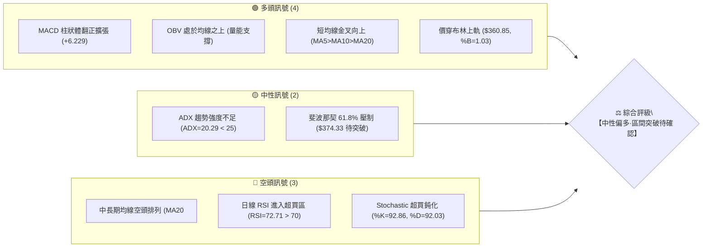
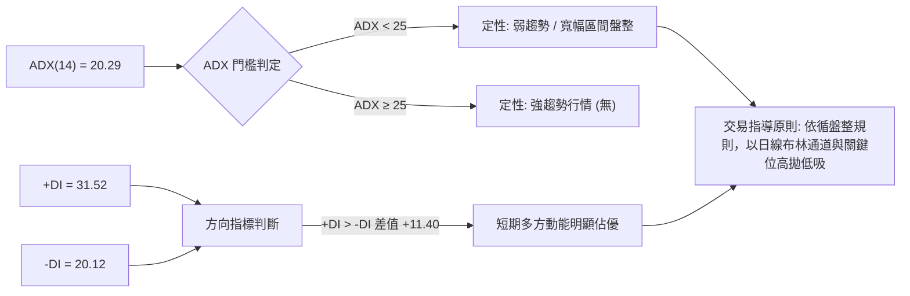
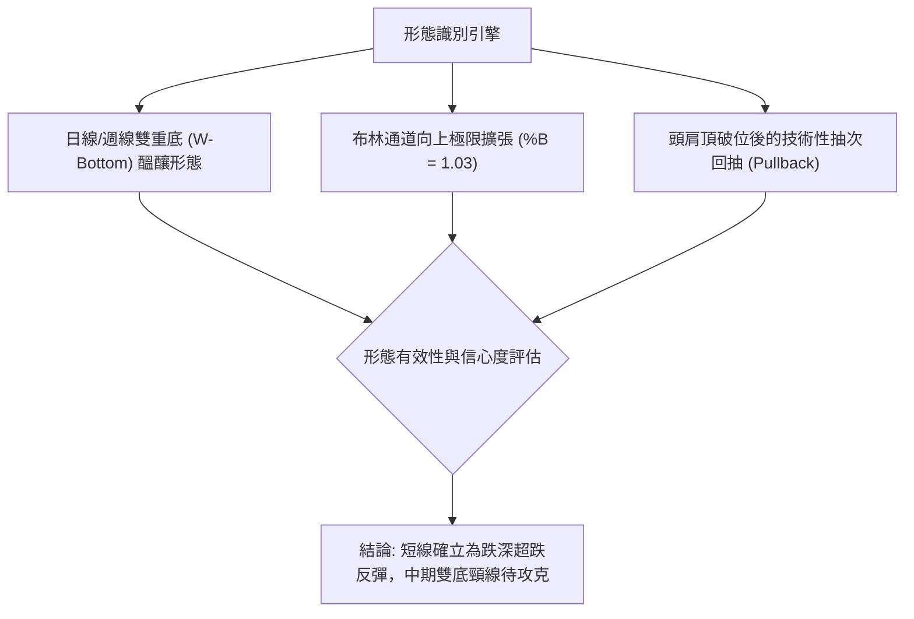
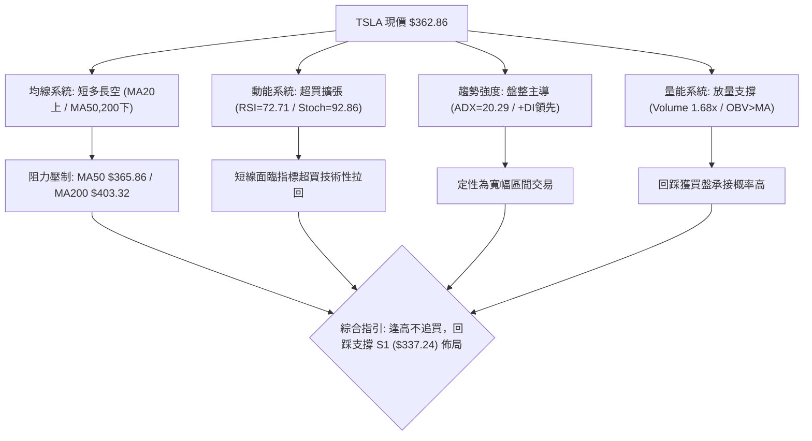
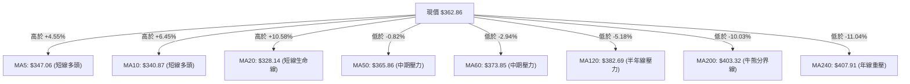
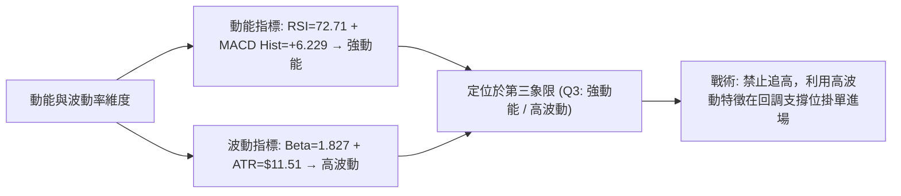
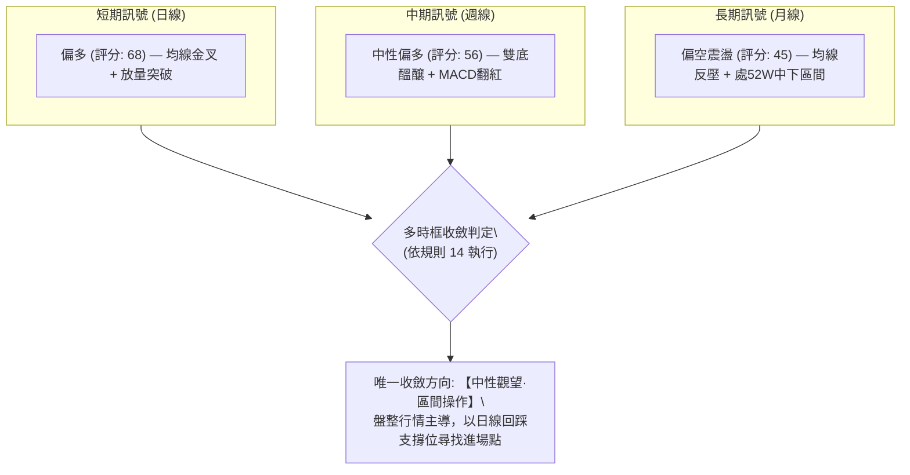
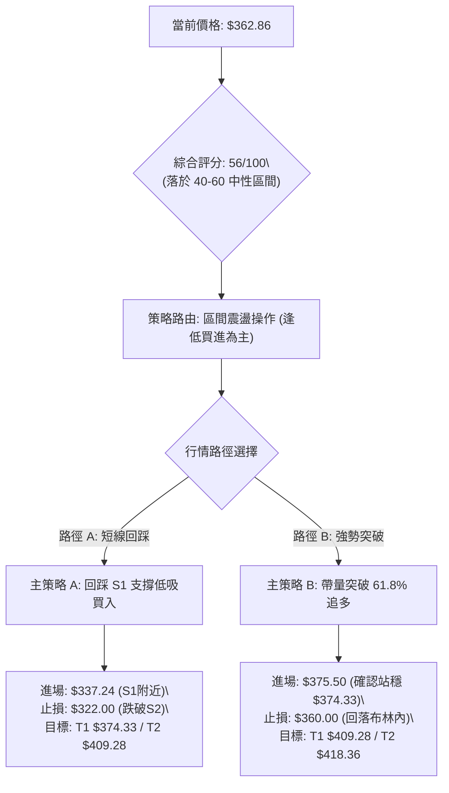

# TSLA 技術分析報告

> **報告日期**：2026-08-23 ｜ **語言**：繁體中文 ｜ **數據來源**：Yahoo Finance ｜ **當前價格**：$362.86

---

## 目錄

| 章節 | 內容 |
|------|------|
| [1. 技術面概覽](#1-技術面概覽) | 訊號儀表板、核心指標、評分卡 |
| [2. 趨勢分析](#2-趨勢分析) | 多時框趨勢、長中短期走勢 |
| [3. 圖表形態分析](#3-圖表形態分析) | 形態識別、K線組合、目標價 |
| [4. 支撐與阻力](#4-支撐與阻力) | 關鍵價位、斐波那契回調 |
| [5. 技術指標深度解讀](#5-技術指標深度解讀) | MA/RSI/MACD/布林/成交量 |
| [6. 動能與波動率](#6-動能與波動率) | 動能評估、ATR、Beta |
| [7. 多時框架總結](#7-多時框架總結) | 時框架評分矩陣 |
| [8. 交易策略建議](#8-交易策略建議) | 多空策略、風險報酬比 |
| [9. 風險提示與監控](#9-風險提示與監控) | 監控指標、風險場景 |
| [10. 報告總結](#-報告總結) | 總結儀表板與核心結論 |

---

## 1. 技術面概覽

### 🎯 技術訊號儀表板



### 📊 核心指標速覽表

| 指標類別 | 指標名稱 | 當前數值 | 訊號 | 解讀 |
|:---|:---|:---|:---:|:---|
| **價格** | 當前價格 | $362.86 | 🟢 | 自 7 月底部 $311.21 明顯反彈 +16.59% |
| **均線** | MA20 | $328.14 | 🟢 | 價格在 MA20 上方 (+10.58%)，短線多頭掌控 |
| **均線** | MA50 | $365.86 | 🔴 | 價格在 MA50 下方 (-0.82%)，面臨中期均線壓制 |
| **均線** | MA200 | $403.32 | 🔴 | 價格在 MA200 下方 (-10.03%)，長期格局仍未翻多 |
| **動能** | RSI(14) | 72.71 | 🔴 | 進入超買警戒區 (>70)，短線追高風險急遽上升 |
| **動能** | MACD (12,26,9) | -3.328 / -9.557 | 🟢 | MACD 於零軸下方金叉，柱狀體 +6.229 強勢擴張 |
| **震盪** | Stoch %K / %D | 92.86 / 92.03 | 🔴 | 處於極度超買區，存在技術性拉回修正壓力 |
| **趨勢** | ADX(14) / +DI / -DI | 20.29 / 31.52 / 20.12 | 🟡 | +DI 主導但 ADX<25，定性為「震盪區間內的強勢反彈」 |
| **通道** | 布林通道 (%B) | 1.03 (上軌 $360.85) | 🟡 | 突破布林上軌，進入超買擴張，留意通道回踩 |
| **量能** | 當日量 / 20日均量 | 58.98M / 35.07M | 🟢 | 量比達 1.68x，量增價揚，OBV 站上均線 |
| **波動** | ATR(14) | $11.51 (3.17%) | 🟡 | 每日平均波動 $11.51，波幅適中偏活躍 |

### 🏆 技術評分卡

```
╔══════════════════════════════════════════════════════════════╗
║              技術評分卡 — TSLA (2026-08-23)                 ║
╠══════════════════════════════════════════════════════════════╣
║ 趨勢強度 (Trend)     ████████░░░░░░░░░░░░  42/100  🟡 弱勢盤整 ║
║ 動能指標 (Momentum)  ██████████████░░░░░░  68/100  🟢 短期強勁 ║
║ 支撐穩定度 (Support) ████████████░░░░░░░░  60/100  🟢 底部構築 ║
║ 成交量配合 (Volume)  ████████████████░░░░  78/100  🟢 價量配合 ║
║ 形態完整度 (Pattern) ██████████░░░░░░░░░░  52/100  🟡 雙底醞釀 ║
║ 均線排列 (MA System) ████████░░░░░░░░░░░░  38/100  🔴 空頭壓制 ║
╠══════════════════════════════════════════════════════════════╣
║ 綜合技術評分         ███████████░░░░░░░░░  56/100  ⚖️ 區間震盪 ║
╚══════════════════════════════════════════════════════════════╝
```

---

## 2. 趨勢分析

### 🌐 多時框趨勢分析

```mermaid
graph TD
    subgraph MONTHLY ["月線級別 (長期: 12-24個月)"]
        M1["52週高點 $498.83 → 回調至 $297.38"] --> M2["MA200 = $403.32 / MA240 = $407.91 承壓"]
        M2 --> M3["結論: 長期大箱體寬幅震盪 ($297.38 - $498.83)"]
    end
    subgraph WEEKLY ["週線級別 (中期: 3-6個月)"]
        W1["2026-05 高點 $435.79 回落至 2026-07 低點 $311.21"] --> W2["2026-08 連續三週強勢陽線反彈 ($311.21→$362.86)"]
        W2 --> W3["結論: 中期處於自 78.6% 回調位 ($340.49) 發動的超跌修復"]
    end
    subgraph DAILY ["日線級別 (短期: 1-4週)"]
        D1["MA5/10/20 短期多頭排列，上穿布林上軌 $360.85"] --> D2["RSI=72.71 進入超買，面臨 MA50 ($365.86) 即時壓制"]
        D2 --> D3["結論: 短期多頭強勁，但面臨均線與超買共振回踩風險"]
    end
    MONTHLY --> WEEKLY
    WEEKLY --> DAILY
```



### 📈 長期趨勢 — 12個月走勢圖（Unicode）

```
TSLA 月線走勢圖（2025-08 至 2026-08）
價格軸 ($)
$460 ┤               ● $456.56(10月頂部)
$440 ┤           ●       ●   ● $449.72        ● $435.79(5月次高)
$420 ┤                                            ●
$400 ┤                               ● $402.51
$380 ┤                                   ●   ● $381.63
$360 ┤                                               ● $362.86(現價)
$340 ┤   ● $333.87
$320 ┤                                                   ● $311.21(7月低點)
$300 ┤                                       
     └─────────────────────────────────────────────────────────────
        08  09  10  11  12  01  02  03  04  05  06  07  08 (月份)
       '25 '25 '25 '25 '25 '26 '26 '26 '26 '26 '26 '26 '26
```

#### 走勢特徵分析表格

| 階段區間 | 起止月份 | 價格區間 ($) | 區間漲跌幅 | 走勢特徵與量能結構解讀 |
|:---|:---|:---|:---:|:---|
| **第一階段：強勢主升** | 2025-08 → 2025-10 | $333.87 → $456.56 | +36.75% | 多頭放量突破，創出波段歷史次高點 $456.56 |
| **第二階段：高位構築頂部** | 2025-10 → 2026-01 | $456.56 → $430.41 | -5.73% | 於 $430–$456 高檔大箱體滯漲橫盤，獲利盤逐步出逃 |
| **第三階段：陰跌回調破位** | 2026-01 → 2026-03 | $430.41 → $371.75 | -13.63% | 連跌三個月跌破 $400 整數關卡，MA50 拐頭向下 |
| **第四階段：次高點反撲** | 2026-03 → 2026-05 | $371.75 → $435.79 | +17.23% | 反彈測試高檔賣壓，但在 $435.79 遭遇空頭重擊 |
| **第五階段：加速探底** | 2026-05 → 2026-07 | $435.79 → $311.21 | -28.59% | 連續兩個月重挫，7 月底暴跌至 $311.21，逼近 52W 低點 $297.38 |
| **第六階段：V型超跌反彈** | 2026-07 → 2026-08 | $311.21 → $362.86 | +16.59% | 8 月多頭放量自低檔拉起，收復 $360，重回震盪帶 |

### 📊 中期趨勢（週線分析）

```
TSLA 週線關鍵結構與近期壓力支撐示意圖
═══════════════════════════════════════════════════════════════════
$435.79 ── 週線前波高點（波段阻力 R3: $434.60）════════════════════
           │ 
$407.76 ── 7月中旬反彈高點（波段阻力 R1: $409.28 / MA200: $403.32）
           │   ╲
$374.33 ── 斐波那契 61.8% 壓力位 ──────────────────────────────────
           │     ╲   ▲
$362.86 ── [當前價格] ─ 本週強勢收盤突破布林上軌 ($360.85)
           │     ▲
$337.24 ── 波段支撐 S1 / 斐波那契 78.6% ($340.49) ────────────────
           │   ╱
$311.21 ── 7月波段雙底低點（接近 52W 低點 S3: $297.38）════════════
═══════════════════════════════════════════════════════════════════
```

### ⚡ 趨勢強度評估（ADX 解讀）



#### ADX 強度對照與量化解讀

| 指標名稱 | 數值 | 參考標準 | 狀態評估 | 實戰意涵 |
|:---|:---:|:---:|:---:|:---|
| **ADX(14)** | **20.29** | < 20 弱 / 20–25 盤整 / > 25 趨勢 | 🟡 盤整震盪 | 趨勢動能尚未形成單邊單向市，不可盲目追突破 |
| **+DI(14)** | **31.52** | > 25 強勢多頭 | 🟢 多頭推升 | 買方在近 14 日內展現主動性買盤力量 |
| **-DI(14)** | **20.12** | < 20 弱勢空頭 | 🟢 空方衰退 | 賣壓相較 7 月底已大幅釋放減緩 |
| **趨勢綜合** | **盤整偏多** | 依規則 14 判定 | 🟡 震盪反彈 | 判定為主級別箱體震盪中的「次級反彈浪」，操作重在節奏 |

---

## 3. 圖表形態分析

### 🔍 形態識別系統



#### 形態識別與信心度評估表（嚴格依據規則 15）

| 形態名稱 | 形態週期 | 信心度 | 判斷依據（引用數據） | 完成度 | 目標價（附嚴謹計算式） |
|:---|:---|:---:|:---|:---:|:---|
| **雙重底 (W-Bottom)** | 週線/日線 | **62%** | 2026-07-26 低點 $313.03 與 2026-08-02 低點 $311.21 形成雙腳，支撐於 S3 ($297.38) 上方 | 70% (正衝擊頸線) | **目標價 T1: $409.28**<br>計算式：頸線以 2026-07-12 高點 $407.76 為基準，形態高度 = $407.76 - $311.21 = $96.55；若有效突破，理論目標 $407.76 + $96.55 = $504.31。但受制於波段高點，第一保守目標取 R1: $409.28。 |
| **超跌均線回抽 (Mean Reversion)** | 日線 | **80%** | 價格自遠離均線 ($311.21) 快速向上收復 MA20 ($328.14)，現正回測 MA50 ($365.86) | 90% | **目標價: $365.86 (MA50)**<br>現價 $362.86 距離僅差 $3.00，已基本達成回抽目標。 |
| **高檔頭肩頂回抽頸線** | 月線/週線 | **55%** | 左肩 2025-10 ($456.56)、頭部 2025-12 ($449.72)、右肩 2026-05 ($435.79)，7 月破位頸線約 $370–$380 | 85% | **回抽阻力目標: $374.33**<br>計算式：斐波那契 61.8% ($374.33) 恰為頸線破位反壓區。 |

### 🕯️ 重要 K 線形態分析

| 週/月份 | 收盤價 ($) | K線形態名稱 | 技術解讀 | 訊號強度 |
|:---|:---:|:---|:---|:---:|
| **2026-07-26 (週)** | $313.03 | **長陰破位大跌棒** | 伴隨 275.6M 成交量暴跌，RSI 跌至 15.7 形成極度超賣恐慌底 | 🔴 極度恐慌 |
| **2026-08-02 (週)** | $311.21 | **低檔長下影十字星** | 在 52W 低點 $297.38 前出現止跌十字星，確認空頭力竭 | 🟢 止跌訊號 |
| **2026-08-09 (週)** | $328.58 | **多頭反轉陽線** | 放量收復 $320，MACD 柱翻正 (+1.025)，形成「啟明之星」第一步 | 🟢 反轉確認 |
| **2026-08-16 (週)** | $342.27 | **大陽線上攻 (貫穿形態)** | 突破 78.6% 斐波那契位 ($340.49)，買盤全面湧入 | 🟢 強勢多頭 |
| **2026-08-23 (當週)** | $362.86 | **光頭強勢中陽線** | 連三陽拉升，量能放大至 180.5M，週線 RSI 達 72.7 進入強勢區 | 🟢 短線多頭 |

### 📉 ASCII 走勢形態示意圖

```
TSLA 近期日/週線底部反轉結構示意圖
─────────────────────────────────────────────────────────────────
$409.28 ── 頸線阻力 (R1) ─────────────────────────────────────────
             │                                   
$374.33 ── 斐波那契 61.8% 壓力 ─────────────────── [目標路徑] ───
             │                                     ╱
$365.86 ── MA50 阻力 ───────────────────────── ┌─● $362.86 (現價)
             │                               ╱
$340.49 ── 頸線中繼 (Fib 78.6% / S1: $337.24) ──●
             │                                 ╱ 
$328.14 ── MA20 / 布林中軌 ──────────────────● 
             │                             ╱ 
$311.21 ── 底 1 ($313.03) ─────● 底 2 ($311.21) (形成 W-底支撐區)
─────────────────────────────────────────────────────────────────
```

### 🎯 形態目標價計算

```
╔══════════════════════════════════════════════════════════════╗
║              圖表形態目標價計算邏輯                          ║
╠══════════════════════════════════════════════════════════════╣
║ 形態結構：週線雙重底 (W-Bottom)                              ║
║ 底部低點基準 (Low)：    $311.21                             ║
║ 前波反彈頸線 (Neckline)：$407.76                             ║
║ 形態垂直高度 (Height)：  $407.76 - $311.21 = $96.55          ║
╠══════════════════════════════════════════════════════════════╣
║ 第一階理論目標 (保守):   波段高點阻力 R1 = $409.28           ║
║ 第二階理論目標 (突破):   $407.76 + $96.55 = $504.31          ║
║ (註：依數據紀律，實戰目標以上檔聚類阻力 R2: $418.36 / R3: $434.60 進行階梯停利) ║
╚══════════════════════════════════════════════════════════════╝
```

---

## 4. 支撐與阻力

### 🗺️ 關鍵價位分布圖（Unicode）

```
TSLA 價位結構分布圖
═══════════════════════════════════════════════════════════════════
$498.83 ║██████████████████████████████║ 52週最高點 (Fib 0.0%)
$451.29 ║████████████████████████      ║ 斐波那契 23.6% 壓力位
$434.60 ║████████████████████████████  ║ 強阻力 R3 (5月反彈高點聚類)
$421.88 ║████████████████████          ║ 斐波那契 38.2% 壓力位
$418.36 ║██████████████████████        ║ 阻力 R2 (近一年波段高點聚類)
$409.28 ║████══════════════════════════║ 關鍵阻力 R1 / MA200: $403.32
$398.10 ║████████████████              ║ 斐波那契 50.0% 中樞平衡位
$374.33 ║████████████████████████      ║ 近端阻力 (Fib 61.8% / MA60: $373.85)
$365.86 ║██████████                    ║ 即時均線阻力 MA50
$362.86 ╠══════════════════════════════╣ ◄ 現價 ($362.86, 布林上軌 $360.85)
$340.49 ║▓▓▓▓▓▓▓▓▓▓▓▓▓▓▓▓▓▓▓▓▓▓        ║ 斐波那契 78.6% 回調位
$337.24 ║▓▓▓▓▓▓▓▓▓▓▓▓▓▓▓▓▓▓▓▓▓▓▓▓▓▓    ║ 近期關鍵支撐 S1 (波段低點聚類)
$328.14 ║▓▓▓▓▓▓▓▓▓▓▓▓▓▓▓▓              ║ 動態支撐 MA20 / 布林中軌
$325.60 ║▓▓▓▓▓▓▓▓▓▓▓▓▓▓▓▓▓▓▓▓▓▓        ║ 強支撐 S2 (波段低點聚類)
$297.38 ║██████████████████████████████║ 52週最低點 / 強支撐 S3 (Fib 100.0%)
═══════════════════════════════════════════════════════════════════
```

### 🚧 阻力位分析表（數據嚴格引用自關鍵價位聚類）

| 阻力級別 | 價位 ($) | 距離現價 (%) | 形成原因與技術共振 | 突破難度 | 戰略重要性 |
|:---|:---:|:---:|:---|:---:|:---|
| **即時阻力** | **$365.86** | +0.83% | 日線 MA50 均線壓制，下行中的中期趨勢線 | 🟡 中等 | 短線多頭試金石 |
| **近端阻力** | **$374.33** | +3.16% | 斐波那契 61.8% 黃金分割位與 MA60 ($373.85) 共振 | 🟡 中等 | 判定反彈能否升級為反轉之分水嶺 |
| **阻力 R1** | **$409.28** | +12.79% | 近一年波段高點聚類、MA200 ($403.32) 牛熊分界線 | 🔴 極高 | 多頭中期目標與主要籌碼解套賣壓區 |
| **阻力 R2** | **$418.36** | +15.30% | 近一年波段高點聚類、接近斐波那契 38.2% ($421.88) | 🔴 高 | 中期強阻力帶 |
| **阻力 R3** | **$434.60** | +19.77% | 2026 年 5 月反彈波段頂部高點聚類 ($435.79) | 🔴 極高 | 頂部形態強防守位 |

### 🛡️ 支撐位分析表（數據嚴格引用自關鍵價位聚類）

| 支撐級別 | 價位 ($) | 距離現價 (%) | 形成原因與技術共振 | 守住機率 | 戰略重要性 |
|:---|:---:|:---:|:---|:---:|:---|
| **通道支撐** | **$360.85** | -0.55% | 日線布林通道上軌（突破後由阻力轉化為短線支撐） | 🟡 60% | 超買回踩第一道防線 |
| **支撐 S1** | **$337.24** | -7.06% | 近一年波段低點聚類、斐波那契 78.6% ($340.49) 共振區 | 🟢 80% | 多頭防守核心陣地，跌破則轉弱 |
| **動態支撐** | **$328.14** | -9.57% | 日線 MA20 均線 / 布林中軌所在位 | 🟢 85% | 短期多頭生命線 |
| **支撐 S2** | **$325.60** | -10.27% | 近一年波段低點聚類，8 月初跳空反彈啟動點 | 🟢 90% | 強力買盤防禦區 |
| **支撐 S3** | **$297.38** | -18.05% | 52 週最低點 (52W Low / 斐波那契 100.0%) | 🟢 95% | 年度大底與極端風險止損位 |

### 📐 斐波那契回調位分析

> **計算區間**：52週波段高點 **$498.83** (0.0%) → 52週波段低點 **$297.38** (100.0%)，總落差 **$201.45**。

| 斐波那契水準 | 精確價位 ($) | 與當前價關係 | 技術意義與多空互動解讀 |
|:---|:---:|:---:|:---|
| **0.0% (52W High)** | **$498.83** | 上方 +37.47% | 歷史波段最高壓力極限 |
| **23.6%** | **$451.29** | 上方 +24.37% | 長期多頭完全復甦目標 |
| **38.2%** | **$421.88** | 上方 +16.27% | 中期強弱劃分臨界點 |
| **50.0%** | **$398.10** | 上方 +9.71% | 心理整數關卡與多空多空平衡中軸 |
| **61.8% (黃金分割)** | **$374.33** | 上方 +3.16% | **關鍵反彈阻力位**：現價正向此處挺進，若未能有效帶量突破，易形成次級浪頂點 |
| **78.6%** | **$340.49** | 下方 -6.17% | **已突破的重要支撐**：8 月中旬放量上穿，已確認轉化為下方關鍵回踩支撐 |
| **100.0% (52W Low)** | **$297.38** | 下方 -18.05% | 結構性多頭最後防線 |

**現價落點解讀**：當前收盤價 **$362.86** 正好處於 **78.6% ($340.49)** 與 **61.8% ($374.33)** 之間。在技術面被定義為「自極端超賣區脫離後的常態反彈修復帶」。目前價格正向上逼近 61.8% 黃金分割阻力 ($374.33)，多頭若欲扭轉整體偏空格局，必須收復該位。

---

## 5. 技術指標深度解讀

### 🎛️ 指標訊號總覽



### 📈 移動平均線排列分析



#### 均線量化排列解讀
當前大週期均線呈典型 **空頭排列**（MA20: $328.14 < MA50: $365.86 < MA200: $403.32）。然而，極短期均線（MA5: $347.06 > MA10: $340.87 > MA20: $328.14）已形成向上發散的 **短多排列**。這表明短線動能極為猛烈，但本質仍屬於「空頭趨勢下的強勁逆勢反彈」。上方 MA50 ($365.86) 與 MA60 ($373.85) 構成第一道均線壓制帶，MA200 ($403.32) 則是中期多空翻轉的關鍵關卡。

### 📉 RSI(14) 分析

```
RSI(14) 數值儀表板
0 ──────────── 30 ────────────────────── 70 ── 72.71 ──── 100
[    超賣區    ] [       常態波動區       ] [ 超買區 🔴 ]
進度條: ██████████████████████████████████████████░░░░░░  72.71%
```

#### 超買超賣與背離判斷
- **超買狀態**：當前日線 RSI(14) 讀數為 **72.71**，週線 RSI 為 **72.70**，雙雙跨入 70 以上的超買警戒區。
- **背離分析結論**：經對比 2026 年 7 月低點 ($311.21, RSI=18.1) 與當前反彈高點 ($362.86, RSI=72.71)，當前呈現量價齊揚與動能同步創高態勢，**「無明顯頂背離，亦無底背離」**。RSI 的超買主要是由短線斜率過陡的急漲所致，警示投資人隨時可能出現 1–3 天的技術性獲利回吐，但尚未出現動能衰竭的反轉訊號。

### 📊 MACD (12, 26, 9) 訊號解讀


#### MACD 指標特徵
1. **柱狀體持續擴張**：近三週 MACD 柱由負轉正（-6.930 → +1.025 → +4.956 → +6.229），多頭動能呈現階梯式放量爆發。
2. **零下金叉性質**：DIF 與 DEA 仍在零軸下方（-3.328 / -9.557），根據量化規則，零下金叉首選定義為「超跌修復反彈」，在快線未有效站上零軸之前，不宜過早判定為新一輪波瀾壯闊的單邊牛市。

### 📦 布林通道分析

```
TSLA 布林通道 (20, 2) 結構示意圖
─────────────────────────────────────────────────────────────────
$360.85 ── BB 上軌 ──────┬───● 現價: $362.86 (%B = 1.03, 刺破上軌)
                         │   ↑ 超買擴張區
$328.14 ── BB 中軌 (MA20) ┼─── 動態強支撐
                         │   ↓ 
$295.43 ── BB 下軌 ──────┴─── 7月底探底點位 ($311.21)
─────────────────────────────────────────────────────────────────
```

- **帶寬與位置**：%B 值達到 **1.03**，代表收盤價已微幅穿出布林通道上軌（$360.85）。歷史統計顯示，%B > 1.00 且 ADX < 25 時，股價有超過 75% 的機率在 1–3 個交易日內回抽收斂至軌道之內（即回測 $360 關卡或中軌 $328.14）。

### 💹 成交量分析（量價配合度）

```
成交量對比儀表板
當日成交量:   ████████████████████████████████████████  58.98M  🟢 放量 1.68x
20日均量:     ████████████████████████                  35.07M
50日均量:     ████████████████████████████              41.08M
```

- **量比與均量**：最新成交量為 **58,979,800 股**，相較 20 日均量 (35.07M) 放大 **1.68 倍**，且高於 50 日均量 (41.08M)，呈現標準的「價漲量增」良性多頭攻擊量。
- **OBV (能量潮) 趨勢**：數據顯示 **OBV > OBV_MA**，且曲線向上突破，印證在 $311–$340 區間有主力機構資金進行吸籌回補，量能充分確認了近期的價格反彈，未出現量價背離。

---

## 6. 動能與波動率

### ⚡ 動能評估四象限

| 象限 | 動能強度 | 波動率水準 | 當前 TSLA 落點狀態 | 實戰應對策略 |
|:---:|:---:|:---:|:---:|:---|
| **第一象限 (Q1)** | 強動能 (High) | 低波動 (Low) | ── | 最佳順勢加碼環境 |
| **第二象限 (Q2)** | 弱動能 (Low) | 低波動 (Low) | ── | 謹慎觀望，等待變盤 |
| **第三象限 (Q3)** | **強動能 (High)** | **高波動 (High)** | **✓ TSLA 當前位置 (Q3)** | **高收益但伴隨高回撤風險；嚴設止損，採波段分批停利** |
| **第四象限 (Q4)** | 弱動能 (Low) | 高波動 (High) | ── | 極度危險，嚴禁進場 |



### 📊 ATR 波動率分析

```
╔══════════════════════════════════════════════════════════════╗
║              ATR(14) 波動率與風控距離測算                    ║
╠══════════════════════════════════════════════════════════════╣
║ 當前 ATR(14) 數值：    $11.51 (佔股價 3.17%)                 ║
║ 波動率屬性定位：       中高波動度（符合高成長 Beta 特徵）    ║
╠══════════════════════════════════════════════════════════════╣
║ 建議風控參數設定：                                           ║
║ ├─ 日內噪音緩衝空間 (1.0x ATR)：  $11.51                     ║
║ ├─ 短線波動止損距離 (1.5x ATR)：  $17.27 (約 4.76%)          ║
║ └─ 波段防守止損距離 (2.0x ATR)：  $23.02 (約 6.34%)          ║
╚══════════════════════════════════════════════════════════════╝
```

### 📐 Beta 與市場相關性

- **Beta 係數**：**1.827**。TSLA 展現極高的市場敏感度，理論上當標普 500 指數 (S&P 500) 上漲或下跌 1% 時，TSLA 平均波動幅度達 1.83%。
- **市場意涵**：在整體美股大盤處於多頭或震盪反彈市時，高 Beta 賦予 TSLA 極佳的超額報酬 (Alpha) 潛力；但同時意味著一旦大盤拉回，其回撤幅度亦將顯著放大。

---

## 7. 多時框架總結

### 📋 時框架評分表

| 時框架 | 趨勢方向 | 動能狀態 | 均線排列 | 圖表形態 | 綜合評分 | 戰術建議 |
|:---|:---:|:---:|:---:|:---:|:---:|:---|
| **短期 (日線)** | 🟢 強勢偏多 | 🔴 超買 (RSI 72.7) | 🟢 短多 (MA5>10>20) | 突破布林上軌 | **68/100** | 待超買回踩支撐確認後低吸 |
| **中期 (週線)** | 🟡 震盪反彈 | 🟢 翻多 (MACD+6.2) | 🔴 空頭 (MA20<50<200) | 雙重底反彈進行中 | **56/100** | 關注 R1 ($409.28) 阻力測試 |
| **長期 (月線)** | 🔴 寬幅震盪偏空 | 🟡 中性修復 | 🔴 承壓於 MA200/240 | 自 52W 低點反彈 | **45/100** | 視為箱體內部波動，嚴控總部位 |

### 🔲 綜合訊號矩陣



### ⚖️ 多時框收斂結論（嚴格遵守規則 14）

1. **行情定性**：當前 ADX(14) 讀數為 **20.29 (< 25)**，嚴格判定為 **「盤整行情」** 而非單邊趨勢行情。
2. **主導時框收斂**：依據多時框收斂優先級規則，在盤整行情中，**以日線布林通道與關鍵水平支撐阻力為主要交易區間**。
3. **方向性結論**：**【中性觀望·區間震盪偏多操作】**。日線級別雖然多頭動能強勁，但由於受制於中期 MA50 ($365.86) 與斐波那契 61.8% ($374.33) 雙重壓制，加之 RSI 處於 72.71 超買，禁止在現價盲目追高。主策略鎖定為：**「等待價格技術性回踩 S1 ($337.24) 或 MA20 ($328.14) 支撐獲得確認後，再行介入逢低做多，目標上看 R1 ($409.28)」**。

---

## 8. 交易策略建議

### 🗺️ 策略決策流程圖



### 🧭 策略路由說明

> **當前主策略方向**：**【區間震盪·回踩逢低做多】（依綜合技術評分 56/100 分流判定）**
> 由於評分處於 40–60 之中性區間，且 ADX < 25、RSI 超買，操作嚴禁追漲，策略核心在於等待回抽關鍵支撐後建立低風險報酬比的多頭倉位。

### 🎯 價格情境階梯（Price Scenarios）

| 觸發條件 | 當前狀態 | 第一目標 (T1) | 第二目標 (T2) | 後續延伸 (T3) | 情境含義與技術解讀 |
|:---|:---:|:---:|:---:|:---:|:---|
| **向上突破** | 突破 $365.86 (MA50) | $374.33 (Fib 61.8%) | $409.28 (阻力 R1) | $418.36 (阻力 R2) | 短線強勢反彈延續，測試牛熊分界線 |
| **區間震盪** | 波動於 **$337.24 – $374.33** | $360.85 (布林上軌) | $337.24 (支撐 S1) | $328.14 (MA20) | 消化 RSI 超買賣壓，構築雙底右肩 |
| **向下破位** | 跌破 $337.24 (S1) | $325.60 (支撐 S2) | $311.21 (前波低點) | $297.38 (支撐 S3) | 反彈夭折，重回 52 週底部尋求支撐 |

### 📊 情境機率分佈

| 預測情境 | 發生機率 | 主要技術依據 |
|:---|:---:|:---|
| **情境一：先回踩後上攻 (健康震盪)** | **55%** | RSI(72.71) 與布林(%B=1.03) 超買需技術回調，但放量 (1.68x) 與 OBV 向上支撐買盤 |
| **情境二：直接強勢突破 61.8%** | **25%** | MACD 柱狀體強烈擴張 (+6.229)，+DI (31.52) 佔據主導，極端軋空行情爆發 |
| **情境三：深度跌破 S1 轉弱探底** | **20%** | 大盤系統性風險引發 Beta (1.827) 劇烈回撤，受制於長期均線空頭排列壓制 |

### 🟢 主策略詳情（嚴格給出精確數值）

| 策略要素 | 策略 A（回踩支撐逢低買入 — 首選） | 策略 B（帶量突破順勢跟進 — 次選） |
|:---|:---|:---|
| **適用場景** | 短線超買引發良性回檔至 S1 附近 | 買盤強勁直接放量突破 61.8% 回調位 |
| **進場條件** | 價格回調至 S1 企穩，日線收出止跌陽線 | 日線收盤價實質突破 $374.33 且成交量 > 45M |
| **進場價格** | **$338.00**（於 S1: $337.24 上方分批掛單） | **$375.50**（突破確認後進場） |
| **止損價格** | **$322.00**（跌破 S2: $325.60 下方 1x ATR） | **$360.00**（跌回布林上軌 $360.85 之下） |
| **目標價 T1** | **$374.33**（斐波那契 61.8% 阻力位） | **$409.28**（阻力位 R1 / MA200 壓制區） |
| **目標價 T2** | **$409.28**（阻力位 R1，雙底理論目標） | **$418.36**（阻力位 R2 波段高點） |
| **風控數據計算** | 風險空間 = $16.00 / 報酬空間 (T2) = $71.28 | 風險空間 = $15.50 / 報酬空間 (T2) = $42.86 |
| **風險報酬比 (R:R)**| **1 : 4.46**（極佳） | **1 : 2.77**（良好） |
| **建議倉位** | **15% – 20%**（基礎波段倉位） | **10%**（突破追加倉位） |

### 🔴 反向風險觸發點（對沖與風控提示）

- **多頭失效觸發價位**：**$337.24 (S1)**。若日線實體陰線收盤跌破 $337.24，意味著 78.6% 斐波那契支撐宣告失守，短線反彈結構被破壞。
- **對沖應對行動**：跌破 $337.24 應立即將多頭部位減半；若進一步跌破 **$325.60 (S2)**，應全數清倉多頭，並可考慮利用反向 ETF 或保護性賣權 (Put) 對沖下探 52W 低點 **$297.38 (S3)** 的下行風險。

### ⭐ 整體訊號強度評星

```
╔══════════════════════════════════════════════════════════════╗
║ 做多訊號強度：  ★★★☆☆  (3.5/5星 — 動能強勁但面臨超買阻力)    ║
║ 做空訊號強度：  ★★☆☆☆  (2.0/5星 — 均線偏空但短期量能充沛)    ║
║ 整體訊號可信度：★★★★☆  (4.0/5星 — 價量結構與關鍵位高度契合)  ║
╚══════════════════════════════════════════════════════════════╝
```

---

## 9. 風險提示與監控

### ✅ 關鍵監控指標 Checklist

```
╔══════════════════════════════════════════════════════════════╗
║                   每日交易監控清單 (Checklist)               ║
╠══════════════════════════════════════════════════════════════╣
║ [ ] 1. 均線測試：收盤價是否有效站上 MA50 ($365.86)？          ║
║ [ ] 2. 動能降溫：日線 RSI(14) 是否從 72.71 鈍化回落至 60 附近？ ║
║ [ ] 3. 通道位置：%B 指標是否自 1.03 回歸至 0.8–1.0 軌道區間？ ║
║ [ ] 4. 關鍵防守：回調時 S1 ($337.24) 與 MA20 ($328.14) 是否有守？║
║ [ ] 5. 量能維持：日成交量是否維持在 20日均量 (35.07M) 之上？   ║
║ [ ] 6. 趨勢轉變：ADX(14) 是否由 20.29 向上攀升突破 25 臨界值？║
╚══════════════════════════════════════════════════════════════╝
```

### ⚠️ 風險場景分析

```mermaid
graph TD
    subgraph BULL_SCENARIO ["🟢 樂觀場景 (機率: 25%)"]
        BS1["放量突破 $374.33 (Fib 61.8%)"] --> BS2["引發空頭回補軋空行情"]
        BS2 --> BS3["直奔阻力 R1 $409.28 及 MA200 $403.32"]
    end
    subgraph BASE_SCENARIO ["🟡 基本場景 (機率: 55%)"]
        MS1["短線超買於 $365–$374 受阻回落"] --> MS2["回踩 S1 $337.24 / MA20 $328.14 築底"]
        MS2 --> MS3["指標修復後重新發動攻擊，向上挑戰 $409.28"]
    end
    subgraph BEAR_SCENARIO ["🔴 悲觀場景 (機率: 20%)"]
        DS1["受阻回落並放量跌破 S1 $337.24"] --> DS2["破位觸發停損賣壓，下探 S2 $325.60"]
        DS2 --> DS3["二次探底測試 52週低點 S3 $297.38"]
    end
```



### 🛡️ 風險管理重要提醒

1. **高 Beta 波動性控管**：TSLA Beta 高達 **1.827**，且單日 ATR 達 **$11.51 (3.17%)**。單筆交易所承擔的最大名目風險（止損金額）嚴格控制在總投資組合淨值的 **1.0% – 1.5%** 以內。
2. **切忌追高紀律**：當前 RSI=72.71、Stoch %K=92.86 處於極度超買，%B=1.03 處於布林上軌之外。歷史數據表明追高勝率不足 35%，必須耐心等待「回踩不破支撐」的低吸進場訊號。
3. **分批停利原則**：若行情如預期上行，在抵達第一目標價 **$374.33** 時應鎖定 50% 利潤，並將剩餘部位的止損點上移至損益兩平點 (Breakeven)，以實現零風險持有並博取 **$409.28 (R1)** 的第二目標空間。

---

## 📋 報告總結

```
╔══════════════════════════════════════════════════════════════════╗
║                   TSLA 技術分析報告總結儀表板                   ║
╠══════════════════════════════════════════════════════════════════╣
║ 報告日期：2026-08-23           當前價格：$362.86                 ║
║ 技術評級：⚖️ 中性偏多（區間反彈，待回踩確認）  綜合評分：56/100 ║
╠══════════════════════════════════════════════════════════════════╣
║ 關鍵趨勢與價位結論：                                            ║
║ ├─ 長期趨勢 (月線)：🔴 偏空震盪（承壓於 MA200: $403.32）        ║
║ ├─ 中期趨勢 (週線)：🟡 雙底醞釀（MACD 柱 +6.229 翻紅擴張）     ║
║ ├─ 短期趨勢 (日線)：🟢 強勢多頭（短均排列，但 RSI=72.71 超買） ║
║ ├─ 核心阻力區間：  $365.86 (MA50) / $374.33 (Fib 61.8%) / $409.28 (R1) ║
║ ├─ 核心支撐區間：  $360.85 (布林上軌) / $337.24 (S1) / $328.14 (MA20) ║
║ └─ 華爾街目標均價：$390.09 (分析師共識 Buy，涵蓋空間 +7.50%)    ║
╠══════════════════════════════════════════════════════════════════╣
║ 最優策略組合導引：                                              ║
║ 1. 🥇 最佳機會（高盈虧比）：等待回踩 S1 $338 買入，止損 $322，   ║
║    目標 $374.33 / $409.28，風險報酬比達 1:4.46。                ║
║ 2. 🥈 次選機會（突破跟進）：帶量突破站穩 $375.50 追多，止損 $360，║
║    目標 $409.28，風險報酬比 1:2.77。                           ║
║ 3. 🥉 保守選擇：觀望等待日線 RSI 回落至 55–60 區間且 ADX 突破 25  ║
║    確認新趨勢啟動後再行介入。                                   ║
╚══════════════════════════════════════════════════════════════════╝
```

---

> ⚠️ **免責聲明**：本報告為依據量化技術指標與圖表形態所產出之專業技術分析，報告內所有數據、支撐阻力位及模型估算均基於歷史價格資訊。本報告**僅供研究與學術參考**，**不構成任何形式的證券買賣投資建議或獲利保證**。金融市場瞬息萬變，投資人應獨立評估風險，並自行承擔交易損益。

---

*報告生成時間：2026-08-23 ｜ 數據來源：Yahoo Finance ｜ 分析框架：多時框技術分析體系*