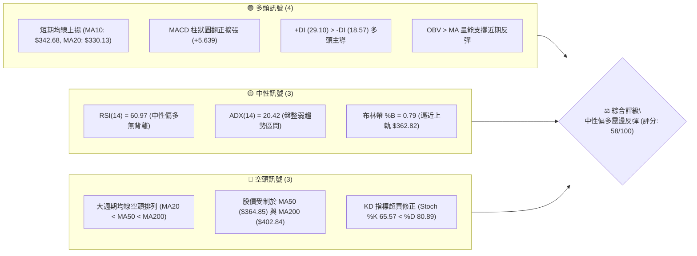
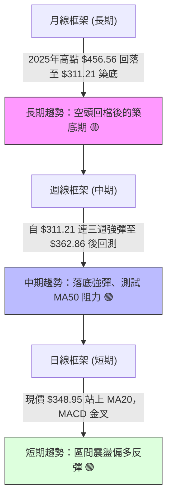
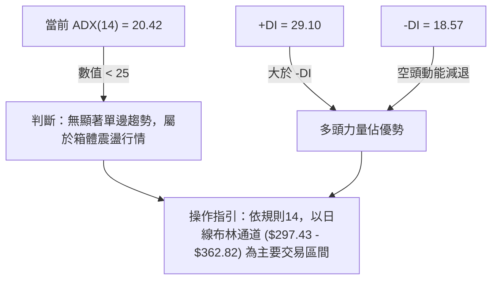
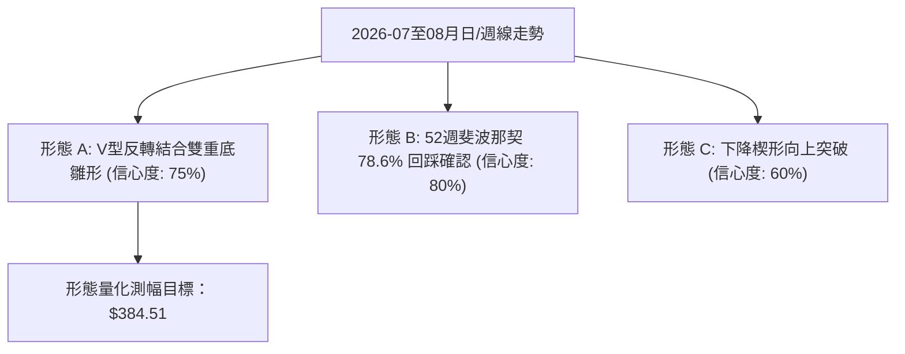
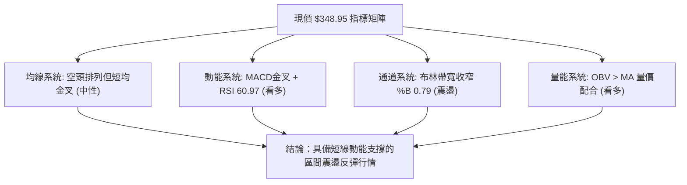
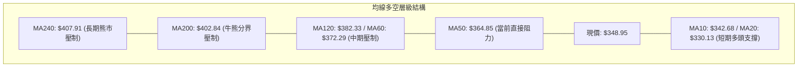
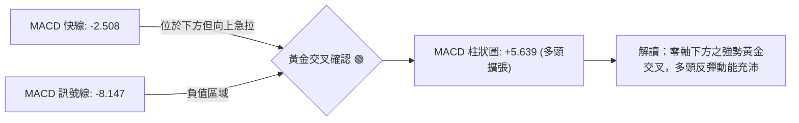
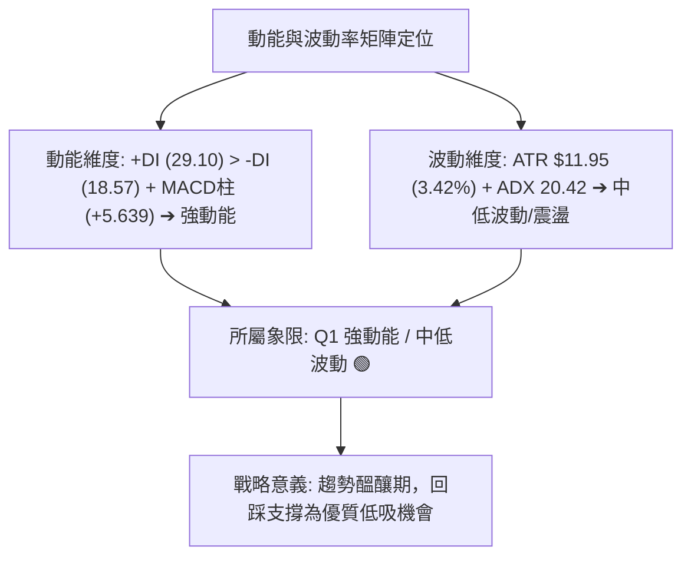
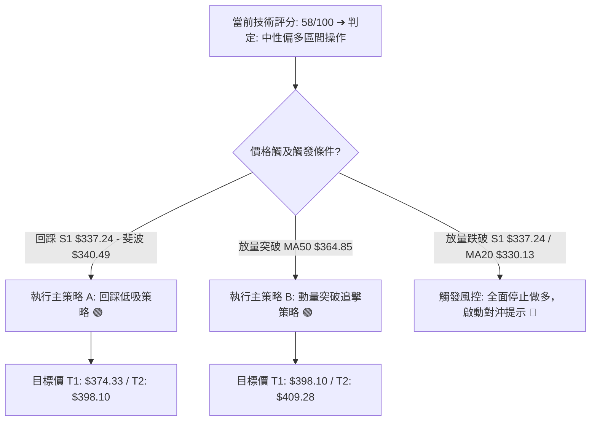
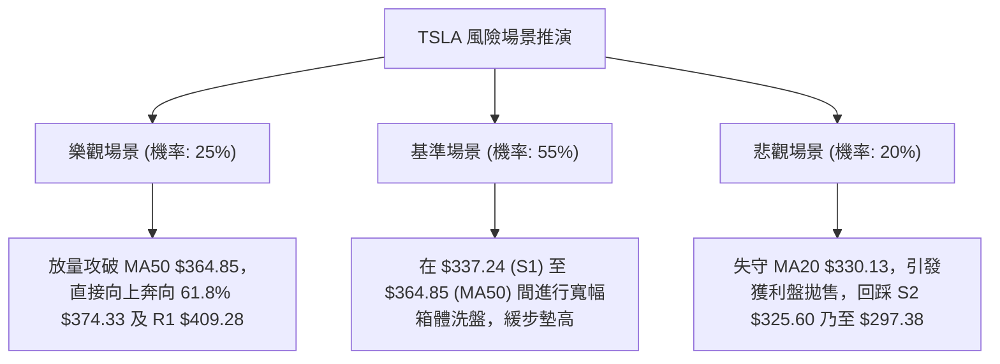

# TSLA 技術分析報告

> **報告日期**：2026-08-24 ｜ **語言**：繁體中文 ｜ **數據來源**：Yahoo Finance ｜ **當前價格**：$348.95

---

## 目錄

| 章節 | 內容 |
|------|------|
| [1. 技術面概覽](#1-技術面概覽) | 訊號儀表板、核心指標、評分卡 |
| [2. 趨勢分析](#2-趨勢分析) | 多時框趨勢、長中短期走勢 |
| [3. 圖表形態分析](#3-圖表形態分析) | 形態識別、K線組合、目標價 |
| [4. 支撐與阻力](#4-支撐與阻力) | 關鍵價位、斐波那契回調 |
| [5. 技術指標深度解讀](#5-技術指標深度解讀) | MA/RSI/MACD/布林/成交量 |
| [6. 動能與波動率](#6-動能與波動率) | 動能評估、ATR、Beta |
| [7. 多時框架總結](#7-多時框架總結) | 時框架評分矩陣 |
| [8. 交易策略建議](#8-交易策略建議) | 多空策略、風險報酬比 |
| [9. 風險提示與監控](#9-風險提示與監控) | 監控指標、風險場景 |
| [10. 報告總結](#-報告總結) | 核心結論與策略彙總 |

---

## 1. 技術面概覽

### 🎯 技術訊號儀表板



### 📊 核心指標速覽表

| 指標類別 | 指標名稱 | 當前數值 | 訊號 | 解讀 |
| :--- | :--- | :--- | :---: | :--- |
| **價格** | 當前收盤價 | $348.95 | 🟡 | 位於52週區間25.6%低位，自低檔強勁反彈但面臨中期均線壓制 |
| **均線** | 短期 MA20 | $330.13 | 🟢 | 現價高於 MA20 達 +5.70%，短線底部支撐確立 |
| **均線** | 中期 MA50 | $364.85 | 🔴 | 現價低於 MA50（-4.36%），上方首道核心動態壓力線 |
| **均線** | 長期 MA200 | $402.84 | 🔴 | 現價低於 MA200（-13.38%），長期趨勢仍處空頭架構 |
| **動能** | RSI(14) | 60.97 | 🟡 | 位於 50-70 強勢中性區間，無頂背離或底背離訊號 |
| **動能** | MACD (12,26,9) | -2.508 / -8.147 | 🟢 | 快線黃金交叉慢線，柱狀圖 +5.639 持續擴張看多 |
| **趨勢** | ADX (14) | 20.42 | 🟡 | ADX < 25 處於無顯著單邊趨勢之「箱體盤整」格局 |
| **通道** | Bollinger Bands | $362.82 / $297.43 | 🟡 | %B 為 0.79，價格運作於中軌上方，朝上軌測試 |
| **量能** | OBV 與成交量 | 39.02M (量比 1.12x) | 🟢 | OBV > MA，量能配合價格回升，未見量價背離 |
| **波動** | ATR (14) | $11.95 (3.42%) | 🟡 | 波動度處中等水準，提供明確之風控與止損依據 |

### 🏆 技術評分卡

```
╔══════════════════════════════════════════════════════════════════╗
║                 技術評分卡 — TSLA (2026-08-24)                   ║
╠══════════════════════════════════════════════════════════════════╣
║ 趨勢強度 (ADX/DMI)  ████████░░░░░░░░░░░░  45/100 🟡 (弱趨勢盤整) ║
║ 短期動能 (MACD/RSI) ███████████████░░░░░  75/100 🟢 (反彈強勁)   ║
║ 支撐穩定度 (波段低) ██████████████░░░░░░  70/100 🟢 (S1/S2強固)  ║
║ 成交量能 (OBV/均量) █████████████░░░░░░░  65/100 🟢 (量能支撐)   ║
║ 形態完整度 (圖表K線)██████████░░░░░░░░░░  50/100 🟡 (築底反彈中) ║
║ 均線排列 (多空結構) ████████░░░░░░░░░░░░  40/100 🔴 (長空短多)   ║
╠══════════════════════════════════════════════════════════════════╣
║ 綜合技術評分        ███████████░░░░░░░░░  58/100 🟡 中性偏多區間 ║
╚══════════════════════════════════════════════════════════════════╝
```

---

## 2. 趨勢分析

### 🌐 多時框趨勢分析



### 📈 長期趨勢 — 12個月走勢圖（Unicode）

```
TSLA 月線走勢圖（過去12個月：2025-08 至 2026-08）
價格 ($)
$460 ┤               ● $456.56 (2025-10 歷史次高)
$440 ┤           ● $444.72   ● $449.72       ● $435.79 (2026-05)
$420 ┤                               ● $430.41   ● $420.60
$400 ┤                                   ● $402.51
$380 ┤                                           ● $381.63
$360 ┤                                       ● $371.75
$340 ┤● $333.87                                          ● $348.95 (現價)
$320 ┤                                                       
$300 ┤                                                   ● $311.21 (2026-07 底部)
     └──────────────────────────────────────────────────────────────
       25-08 25-09 25-10 25-11 25-12 26-01 26-02 26-03 26-04 26-05 26-06 26-07 26-08
```

#### 走勢特徵分析表格

| 階段區間 | 起始 / 結束價 | 區間漲跌幅 | 價量特徵與形態解讀 | 趨勢性質 |
| :--- | :--- | :---: | :--- | :---: |
| **2025-08 ～ 2025-10** | $333.87 → $456.56 | **+36.75%** | 主升浪拉升，於 10 月創下 $456.56 波段高點，買盤鼎盛 | 🟢 強勢多頭 |
| **2025-11 ～ 2026-01** | $456.56 → $430.41 | **-5.73%** | 高檔橫盤構築頂部區間（$430–$450），量能出現收斂 | 🟡 高檔築頂 |
| **2026-02 ～ 2026-04** | $430.41 → $381.63 | **-11.33%**| 破位下行，跌破短期均線，於 $371.75 尋求初步支撐後弱勢反彈 | 🔴 中期下行 |
| **2026-05 ～ 2026-07** | $435.79 → $311.21 | **-28.59%**| 5月衝高 $435.79 假突破後急速崩跌，7月放量下探至 $311.21（52W低點 $297.38 上方） | 🔴 空頭崩跌 |
| **2026-08 至今** | $311.21 → $348.95 | **+12.13%**| 自超賣區強勁技術性反彈，收復 MA20，進入區間築底反彈修復 | 🟢 觸底反彈 |

### 📊 中期趨勢（週線分析）

```
TSLA 近期週線關鍵架構示意圖：
$435.79 (05-31 高點) ────────────────────────── [強阻力界線]
         ╲
          ╲   [下跌通道]
           ╲
            $311.21 (08-02 底部) ────┐ [雙底/V型低點 S3: $297.38 上方]
                                     └──► 08-23 週衝高 $362.86
                                          現價回落至 $348.95 (測試 S1: $337.24 支撐)
```

中期週線在 2026-07-26 當週收在 $313.03（RSI 跌至 15.7 極度超賣），隨後於 2026-08-02 當週的 $311.21 確立低點。隨後三週量能配合，推升至 2026-08-23 當週高點 $362.86。當前股價在 $348.95 進行週線級別的獲利回吐回測，中期趨勢已從「單邊暴跌」轉換為「寬幅震盪築底」。

### ⚡ 趨勢強度評估（ADX 解讀）



| 指標名稱 | 數值 | 臨界標準 | 狀態評估 | 實戰意涵 |
| :--- | :---: | :---: | :---: | :--- |
| **ADX (14)** | **20.42** | 25.00 | 🟡 弱趨勢 / 盤整 | 趨勢強度不足，嚴禁追漲殺跌，宜採區間高拋低吸策略 |
| **+DI (14)** | **29.10** | — | 🟢 多方佔優 | 短線多頭攻擊意願高於空方，反彈動能尚未衰竭 |
| **-DI (14)** | **18.57** | — | 🟢 空方衰退 | 賣壓大幅收斂，無顯著破底風險 |

---

## 3. 圖表形態分析

### 🔍 形態識別系統



#### 形態識別與信心度評估表

| 形態名稱 | 信心度 | 判斷依據（引用數據） | 完成度 | 目標價（附嚴格計算式） |
| :--- | :---: | :--- | :---: | :--- |
| **雙重底雛形 (W-Bottom)** | **75%** | 2026-07-26 之 $313.03 與 2026-08-02 之 $311.21 形成雙低點，隨後放量突破短期頸線 $342.27 | 85% | 頸線 $342.27 + 形態高度 ($342.27 - $311.21 = $31.06) = **$373.33**（對應 61.8% 斐波位 $374.33） |
| **斐波那契 78.6% 回踩支撐** | **80%** | 股價精確於 52週低點 $297.38 至高點 $498.83 區間的 78.6% 回調位 **$340.49** 獲得支撐 | 100% | 第一阻力測幅：向 50.0% 回調位 **$398.10** 或波段阻力 **R1: $409.28** 推進 |
| **下降趨勢線突破** | **60%** | 突破自 2026-05 高點 $435.79 下跌以來的日線下降軌道，現價於軌道上方震盪回測 | 70% | 由突破點 $330.13 + 下跌通道寬度推算測幅目標為 **R1: $409.28** |

### 🕯️ 重要K線形態分析

| 月份 / 週別 | 價格 / 收盤 | K線形態名稱 | 技術解讀 | 訊號強度 |
| :--- | :---: | :--- | :--- | :---: |
| **2026-07 (月線)** | $311.21 | **長下影大陰線** | 單月自 $420.60 暴跌至 $311.21，但在 52W 低點 $297.38 前獲強勁承接 | 🔴 恐慌拋售見底 |
| **2026-08-02 (週線)** | $311.21 | **錘頭線 (Hammer)** | 極度超賣區（RSI 18.1）收出長下影線，空頭動能耗盡 | 🟢 明確止跌訊號 |
| **2026-08-16 (週線)** | $342.27 | **大陽線突破** | 週漲幅近 +4.16%，RSI 從 34.9 飆升至 70.4，多頭強勢反撲 | 🟢 轉折確認訊號 |
| **2026-08-23 (週線)** | $362.86 | **帶上影線中陽線** | 測試布林上軌 $362.82 與 MA50 ($364.85) 遇阻回落，顯現獲利盤調節 | 🟡 遇阻震盪訊號 |
| **2026-08-30 (當前)** | $348.95 | **縮量回踩小陰線** | 回踩 78.6% 斐波位 $340.49 與 S1 $337.24 支撐帶，量能收斂（39.02M） | 🟢 良性回測確認 |

### 📉 ASCII 走勢形態示意圖

```
TSLA 底部 W 底形態與突破示意圖：
      頸線突破點 $342.27 ────┐
                             │       ● 衝高 $362.86 (遇 MA50 阻力)
                             ▼      ╱ ╲
           $342.27 ──────────▲─────╱───● $348.95 (現價回踩頸線與支撐)
                            ╱ ╲   ╱
                           ╱   ╲ ╱
$313.03 (左底) ───────────●     ● $311.21 (右底 2026-08-02)
                          └─────┘
                         雙底形態高度 = $31.06
                         最小量度目標 = $342.27 + $31.06 = $373.33
```

---

## 4. 支撐與阻力

### 🗺️ 關鍵價位分布圖（Unicode）

```
TSLA 價位結構與斐波那契分布圖
════════════════════════════════════════════════════════════════════
$498.83 ║████████████████████████████████████║ 52週歷史最高點 (0.0%)
$451.29 ║████████████████████████            ║ 斐波那契 23.6% 回調位
$434.60 ║████████████████████████████        ║ 強阻力 R3 (近一年波段高點聚類)
$421.88 ║████████████████████                ║ 斐波那契 38.2% 回調位
$418.36 ║██████████████████████              ║ 阻力 R2 (近一年波段高點聚類)
$409.28 ║████████████████████████            ║ 關鍵阻力 R1 (波段高點聚類 / 接近 MA200)
$398.10 ║████████████████                    ║ 斐波那契 50.0% 中樞分水嶺
$374.33 ║██████████████                      ║ 斐波那契 61.8% 強阻力 (近 MA60 $372.29)
$364.85 ║██████████                          ║ 動態阻力 MA50 / 布林上軌 $362.82
$348.95 ╠════════════════════════════════════╣ ◄ 現價 ($348.95)
$340.49 ║▓▓▓▓▓▓▓▓▓▓▓▓▓▓▓▓▓▓                  ║ 斐波那契 78.6% 回調位 (短線支撐)
$337.24 ║▓▓▓▓▓▓▓▓▓▓▓▓▓▓▓▓                    ║ 近期支撐 S1 (波段低點聚類)
$330.13 ║▓▓▓▓▓▓▓▓▓▓▓▓                        ║ 動態支撐 MA20 / 布林中軌
$325.60 ║▓▓▓▓▓▓▓▓▓▓▓▓▓▓▓▓▓▓▓▓                ║ 關鍵支撐 S2 (波段低點聚類)
$297.38 ║████████████████████████████████████║ 強支撐 S3 / 52週最低點 (100.0%)
════════════════════════════════════════════════════════════════════
```

### 🚧 阻力位分析表

| 阻力級別 | 準確價位 | 形成原因與技術匯聚 | 突破難度 | 重要性評級 |
| :--- | :---: | :--- | :---: | :---: |
| **阻力 R1** | **$409.28** | 近一年波段高點聚類；與 MA200 ($402.84) 及 MA240 ($407.91) 高度重疊 | 高 | 🔴 極重要（牛熊分水嶺） |
| **阻力 R2** | **$418.36** | 近一年波段密集套牢區高點聚類；上方緊鄰 38.2% 斐波位 $421.88 | 中高 | 🟡 重要波段目標 |
| **阻力 R3** | **$434.60** | 2026-05 月線高點 $435.79 聚類；空頭主力強防守位 | 極高 | 🔴 終極波段阻力 |

### 🛡️ 支撐位分析表

| 支撐級別 | 準確價位 | 形成原因與技術匯聚 | 守住機率 | 重要性評級 |
| :--- | :---: | :--- | :---: | :---: |
| **支撐 S1** | **$337.24** | 近一年波段低點聚類；緊鄰斐波那契 78.6% ($340.49) 與 MA10 ($342.68) | 75% | 🟢 短線防守第一道防線 |
| **支撐 S2** | **$325.60** | 近一年波段密集換手低點；位於 MA20 ($330.13) 下方之緩衝防線 | 85% | 🟢 中期回檔核心防守點 |
| **支撐 S3** | **$297.38** | 52週歷史最低點 (100.0% 斐波那契)；布林下軌 $297.43 重疊 | 95% | 🟢 長期鋼鐵底（破位止損） |

### 📐 斐波那契回調位分析

依據 52週區間（低點 $297.38 → 高點 $498.83，總波幅 $201.45）計算：

- **0.0% (52W High)**: **$498.83**
- **23.6%**: **$451.29**
- **38.2%**: **$421.88**
- **50.0%**: **$398.10**
- **61.8%**: **$374.33**
- **78.6%**: **$340.49**
- **100.0% (52W Low)**: **$297.38**

**當前位置解讀**：
現價 **$348.95** 精確坐落於 **78.6% ($340.49)** 與 **61.8% ($374.33)** 之間。在技術分析中，78.6% 回調位為深度回檔的最後多頭防線。TSLA 在 $311.21 止跌並強勢回升站上 $340.49，確認此區間由阻力轉化為強支撐。當前上方第一道斐波阻力即為 61.8% 的 **$374.33**，若能有效突破，價格將進一步向 50.0% 關鍵中樞 **$398.10** 推進。

---

## 5. 技術指標深度解讀

### 🎛️ 指標訊號總覽



### 📈 移動平均線排列分析



| 均線名稱 | 當前價格 | 與現價差距 (%) | 走勢趨向 | 多空意涵 |
| :--- | :---: | :---: | :---: | :--- |
| **MA 5** | $348.99 | -0.01% | 平緩 | 極短線多空拉鋸均衡 |
| **MA 10** | $342.68 | +1.83% | 陡峭向上 ▲ | 短線強勁多頭推升支撐 |
| **MA 20** | $330.13 | +5.70% | 轉折向上 ▲ | 短期生命線，提供強勁回踩支撐 |
| **MA 50** | $364.85 | -4.36% | 緩慢向下 ▼ | 中期下行壓力線，構成直接反彈阻力 |
| **MA 60** | $372.29 | -6.27% | 下行 ▼ | 季線壓力，與 61.8% 斐波位共振 |
| **MA 120** | $382.33 | -8.73% | 下行 ▼ | 半年線壓力 |
| **MA 200** | $402.84 | -13.38% | 下行 ▼ | 長期牛熊分水嶺，大級別反轉目標 |
| **MA 240** | $407.91 | -14.46% | 下行 ▼ | 年線重壓，與阻力 R1 $409.28 重合 |

**均線結構綜合解讀**：
大週期仍呈標準空頭排列（MA20 < MA50 < MA200），但短期均線已出現積極改善（MA5 > MA10 > MA20）。此格局定義為典型的「**熊市中的強勢均線修復波**」，短線具備向上挑戰 MA50 ($364.85) 的動能，但在突破 MA200 之前，不宜過度樂觀視為大牛市啟動。

### 📉 RSI(14) 分析

```
RSI(14) 當前水平：
0 ──────── 30 ──────────────── 60.97 ────── 70 ──────── 100
[超賣區]        [弱勢區]         [現值]   [超買區]
██████████████████████████████████░░░░░░░░░░░░░░░░░░░░ 60.97%
```

- **數值解讀**：RSI(14) 目前位於 **60.97**，穩居 50 多空分界線上方，展現健康的多頭主導動能。
- **超買/超賣評估**：未進入 >70 之極端超買區，亦遠離 <30 極端超賣區，具備進一步向上延伸的空間。
- **背離分析**：
  - 價格於 2026-07-26 創低 $313.03（RSI 15.7），隨後 2026-08-02 再探低點 $311.21 時，週線 RSI 卻回升至 18.1，形成微幅**週線底背離**，隨後引發本輪反彈。
  - 當前日線走勢中，價格回升伴隨 RSI 上揚，**無任何頂背離跡象**，動能結構穩健。

### 📊 MACD(12/26/9) 訊號解讀



- **MACD 核心數值**：DIF快線 (-2.508) 遠高於 DEA慢線 (-8.147)。
- **柱狀圖動能**：柱狀圖數值達 **+5.639**，呈現綠柱持續放大（看多），顯示自 7 月底觸底以來的反彈動能依舊在多方掌控中。
- **反轉提示**：MACD 即將挑戰零軸（0 水位），若能成功上穿零軸，將確立中期趨勢由空轉多。

### 📦 布林通道分析

```
TSLA 布林通道 (20, 2) 結構圖：
$362.82 ┬────────────────────────────────────────── 上軌 (BB Upper)
        │                      ● 衝高回落 ($362.86)
$348.95 │──────────────────────●─────────────────── 現價 (%B = 0.79)
        │
$330.13 │────────────────────────────────────────── 中軌 (MA20 Support)
        │
$297.43 ┴────────────────────────────────────────── 下軌 (BB Lower / 近52W低點)
```

- **軌道狀態**：上軌 **$362.82**，中軌 **$330.13**，下軌 **$297.43**，帶寬正在收窄後呈現微幅向上開口。
- **%B 指標**：數值為 **0.79**，價格位於中軌與上軌之間的強勢多頭通道。
- **通道互動**：股價於 2026-08-23 精確觸及上軌 $362.86 後產生技術性回吐，目前於中軌上方進行健康震盪整固，中軌 $330.13 構成強力回測防線。

### 💹 成交量分析（量價配合度）

- **最新成交量**：39,022,052 股（39.02M）。
- **20日均量**：34,779,578 股（34.78M），**量比為 1.12x**（溫和放量）。
- **50日均量**：40,952,323 股（40.95M）。
- **OBV (能量潮)**：OBV > MA，線型明確向上，量能指標走在價格前端，確認 8 月份以來的反彈具備實質買盤進駐，並非無量誘多。

---

## 6. 動能與波動率

### ⚡ 動能評估



#### 動能評估四象限定位表

| 象限代號 | 動能強度 | 波動率水準 | 當前狀態 | 交易策略指引 |
| :---: | :---: | :---: | :---: | :--- |
| **Q1** | **強** | **中/低** | **✓ 當前定位 (TSLA)** | **最佳操作機會：回踩關鍵支撐低吸，順應動能看反彈** |
| **Q2** | 弱 | 低 | — | 謹慎觀望：市場陷入沉寂，缺乏獲利空間 |
| **Q3** | 強 | 高 | — | 高風險高收益：單邊暴漲暴跌，需嚴格緊縮止損 |
| **Q4** | 弱 | 高 | — | 避免進場：無序震盪與寬幅洗盤，極易被雙向掃損 |

### 📊 ATR 波動率分析

- **ATR(14) 數值**：**$11.95**（佔當前股價之 **3.42%**）。
- **日內安全邊際**：當前每日平均波幅約 $12 美元，意味著日內波動雜訊在 ±$12 區間屬正常範疇。
- **止損距離建議**：
  - **保守型擺動交易 (Swing Trading)**：採用 1.5 倍 ATR = $11.95 × 1.5 = **$17.93** 風險緩衝。
  - **緊密型日內/短線交易**：採用 1.0 倍 ATR = **$11.95** 風險緩衝。

### 📐 Beta 與市場相關性

- **Beta 係數**：**1.827**（極高彈性標的）。
- **市場特徵解讀**：TSLA 波動度為 S&P 500 大盤的 1.83 倍。在大盤上漲時具備顯著的超額收益（Alpha）爆發力，但在大盤回檔時亦承擔加倍回撤風險。
- **沽空比例 (Short Interest)**：Short % Float 僅 **1.9%**，Short Ratio **1.61**，顯示市場空頭部位偏低，無大規模空頭擠壓（Short Squeeze）潛能，行情推升完全仰賴真實多頭買盤。

---

## 7. 多時框架總結

### 📋 時框架評分表

| 時框架 | 趨勢方向 | 動能狀態 | 均線排列 | 圖表形態 | 綜合評分 | 建議操作維度 |
| :--- | :---: | :---: | :---: | :---: | :---: | :--- |
| **短期 (日線)** | 🟢 多頭反彈 | 🟢 MACD金叉/RSI 61 | 🟡 MA20上方/受制MA50 | 🟢 雙底突破回踩 | **72/100** | 逢低做多，尋求波段向上空間 |
| **中期 (週線)** | 🟡 築底震盪 | 🟢 RSI超賣強彈至70 | 🔴 空頭排列壓制 | 🟡 箱體築底雛形 | **55/100** | 區間震盪操作，緊盯布林帶寬 |
| **長期 (月線)** | 🔴 大幅回檔 | 🟡 月線級別尋求支撐 | 🔴 MA200下方運行 | 🟡 斐波78.6%防守 | **45/100** | 長線分批建倉，嚴設 $297.38 止損 |

### 🔲 綜合訊號矩陣

```
╔══════════════════════════════════════════════════════════════════╗
║                     TSLA 多時框訊號收斂矩陣                      ║
╠══════════════════════════════════════════════════════════════════╣
║ 維度 / 週期   │   短期 (Daily)   │   中期 (Weekly)  │  長期 (Monthly)║
╠══════════════════════════════════════════════════════════════════╣
║ 趨勢主導      │   🟢 向上反彈    │   🟡 寬幅箱體    │  🔴 空頭回檔   ║
║ 動能指標      │   🟢 多頭擴張    │   🟢 強勁修復    │  🟡 動能中性   ║
║ 均線結構      │   🟢 短均多頭    │   🔴 中期反壓    │  🔴 長期熊市   ║
║ 關鍵防線      │   S1: $337.24    │   S2: $325.60    │  S3: $297.38   ║
║ 關鍵阻力      │   MA50: $364.85  │   61.8%: $374.33 │  R1: $409.28   ║
╚══════════════════════════════════════════════════════════════════╝
```

### ⚖️ 多時框收斂結論（依規則 14）

1. **行情性質判定**：當前 ADX(14) 數值為 **20.42 (< 25)**，嚴格判定為「**無單邊趨勢之箱體盤整行情**」。
2. **多時框優先級收斂**：
   - 依據規則 14，在盤整行情下，交易策略**以日線布林通道上下軌 ($297.43 ～ $362.82) 為主要交易區間**。
   - 週線與月線之大級別空頭均線（MA200: $402.84）限制了上方中長期爆發空間，但短期日線之 MACD 金叉、RSI 60.97 以及 OBV 量能支撐，確認了自 $311.21 以來的反彈尚未結束。
3. **唯一方向性結論**：**【中性偏多 — 區間回踩低吸】**。短線以回測支撐 S1 ($337.24) / 斐波 78.6% ($340.49) 為進場契機，向上鎖定布林上軌與斐波 61.8% ($374.33) 作為獲利目標。

---

## 8. 交易策略建議

### 🗺️ 策略決策流程圖



### 🧭 策略路由

> **當前主策略方向 = 【中性偏多 — 區間震盪低吸】（依綜合評分 58/100 與 ADX 20.42 定調）**
> 綜合評分處於 40–60 區間且偏向上緣，ADX < 25 指明當前為箱體操作環境。策略主推「支撐位回踩低吸」與「區間突破動量追擊」，嚴禁追高；空頭方向僅列為關鍵跌破時的風控對沖提示。

### 🎯 價格情境階梯（Price Scenarios）

| 觸發條件 | 第一目標 (T1) | 第二延伸 (T2) | 後續延伸 (T3) | 情境技術含義 |
| :--- | :---: | :---: | :---: | :--- |
| **向上突破 MA50 ($364.85)** | 斐波 61.8% **$374.33** | 斐波 50.0% **$398.10** | 阻力 R1 **$409.28** | 中期均線破位翻多，展開向 MA200 之大級別反彈浪 |
| **維持 $340.49 ～ $362.82 震盪** | 布林上軌 **$362.82** | 斐波 61.8% **$374.33** | — | 標準布林通道內箱體運行，籌碼沉澱蓄勢 |
| **向下跌破 S1 ($337.24)** | 關鍵支撐 S2 **$325.60** | 52W 低點 S3 **$297.38** | — | 短線反彈失敗，重新測試底部雙底支撐區間 |

### 📊 情境機率分佈

| 情境類別 | 機率預估 | 主要指標依據（精確引用數據） |
| :--- | :---: | :--- |
| **情境一：震盪向上反彈** | **55%** | MACD 柱狀圖 (+5.639) 持續擴張；+DI (29.10) 強於 -DI (18.57)；OBV > MA 量能配合。 |
| **情境二：區間箱體震盪** | **30%** | ADX(14) 僅 20.42 處於無趨勢狀態；布林上軌 $362.82 與 MA50 $364.85 壓制力道強勁。 |
| **情境三：跌破轉弱探底** | **15%** | 長期均線 MA200 ($402.84) 仍處空頭排列，若失守 S1 $337.24 則可能引發獲利了結賣壓。 |

### 🟢 主策略詳情

#### 策略 A：區間回踩低吸策略（首選推薦）

- **適用場景**：股價回測 78.6% 斐波回調位與 S1 支撐帶。
- **進場條件**：現價回落至 **$340.49 ～ $342.68 (MA10)** 區間獲得買盤支撐時進場。
- **精確進場點**：**$341.00**
- **止損價格**：**$328.00**（跌破 MA20 $330.13 及 S1 $337.24 下方，風險距離 $13.00，約 1.1x ATR）。
- **目標價 T1**：**$364.85**（MA50 動態阻力處，潛在收益 +$23.85）。
- **目標價 T2**：**$374.33**（斐波那契 61.8% 回調位，潛在收益 +$33.33）。
- **風險報酬比 (R/R Ratio)**：
  - 至 T1 = 23.85 / 13.00 = **1.83 : 1**
  - 至 T2 = 33.33 / 13.00 = **2.56 : 1**
- **勝率評估**：**65%** ｜ **建議倉位**：**15%**

#### 策略 B：突破動量跟進策略（次選推薦）

- **適用場景**：多頭放量突破 MA50 及布林上軌關鍵共振阻力。
- **進場條件**：日線收盤價帶量（日成交量 > 40M）實質站上 **$365.00**（突破 MA50: $364.85）。
- **精確進場點**：**$365.50**
- **止損價格**：**$348.95**（跌回現價支撐及突破平台下方，風險距離 $16.55，約 1.4x ATR）。
- **目標價 T1**：**$398.10**（斐波那契 50.0% 中樞，潛在收益 +$32.60）。
- **目標價 T2**：**$409.28**（阻力 R1 / MA200 壓制位，潛在收益 +$43.78）。
- **風險報酬比 (R/R Ratio)**：
  - 至 T1 = 32.60 / 16.55 = **1.97 : 1**
  - 至 T2 = 43.78 / 16.55 = **2.65 : 1**
- **勝率評估**：**55%** ｜ **建議倉位**：**10%**

### 🔴 反向風險觸發點（對沖與風控提示）

若發生以下任一技術破位事件，必須全面終止多頭策略，多單應立即離場觀望：

1. **關鍵支撐破位**：日線收盤價跌破 **S1: $337.24** 且伴隨 MACD 柱狀圖顯著收斂翻負。
2. **生命線失守**：盤中跌破 **MA20: $330.13**，意味著短線反彈結構徹底遭到破壞，價格將向 **S2: $325.60** 及 **S3: $297.38** 尋求二次探底。
3. **對沖建議**：跌破 $330.13 時，現貨持倉者可利用小部位 Put Option 或等額空單對沖至 S3 ($297.38)。

### ⭐ 整體訊號強度評星

```
╔══════════════════════════════════════════════════════════════════╗
║                     交易訊號強度綜合評星                         ║
╠══════════════════════════════════════════════════════════════════╣
║ 做多訊號強度：    ★★★☆☆  (3.5/5星) ➔ 短線動能充沛，惟受制均線   ║
║ 做空訊號強度：    ★★☆☆☆  (2.0/5星) ➔ 賣壓大幅收斂，缺乏空頭催化 ║
║ 趨勢持續性：      ★★☆☆☆  (2.0/5星) ➔ ADX低迷，以震盪思維應對   ║
║ 整體技術可信度：  ★★★★☆  (4.0/5星) ➔ 價位與斐波那契高密度重合 ║
╚══════════════════════════════════════════════════════════════════╝
```

---

## 9. 風險提示與監控

### ✅ 關鍵監控指標 Checklist

```
╔══════════════════════════════════════════════════════════════════╗
║                   每日交易風控監控清單 (Checklist)               ║
╠══════════════════════════════════════════════════════════════════╣
║ [ ] 價格防守線：收盤價是否守穩 78.6% 斐波位 $340.49 與 S1 $337.24║
║ [ ] 均線動態：MA20 ($330.13) 是否維持每日向上發散趨勢            ║
║ [ ] 阻力測試：股價衝擊 MA50 ($364.85) 時的成交量是否 > 40.95M     ║
║ [ ] MACD 動能：MACD 柱狀圖是否持續維持在正值 (>0) 擴張           ║
║ [ ] RSI 警示：RSI(14) 是否在逼近 70 時出現頂背離鈍化             ║
║ [ ] 波動異動：單日真實波幅是否異常超過 2 倍 ATR ($23.90)         ║
╚══════════════════════════════════════════════════════════════════╝
```

### ⚠️ 風險場景分析



### 🛡️ 風險管理重要提醒

1. **Beta 槓桿效應控制**：由於 TSLA 的 Beta 高達 **1.827**，整體部位曝險切忌過度集中。單一策略部位建議控制在總投資組合資金的 **10%～15%** 以內。
2. **ATR 動態止損紀律**：嚴格執行以 ATR ($11.95) 為基準的止損機制，絕不允許將短期波段交易轉變為「被動長期套牢持有」。
3. **無趨勢環境下的交易紀律**：當 ADX 位於 20.42 時，市場最忌諱「在阻力位追多、在支撐位追空」。所有多頭操作必須嚴格恪守「**逢支撐回踩低吸、遇阻力分批止盈**」之原則。

---

## 📋 報告總結

```
╔══════════════════════════════════════════════════════════════════╗
║                     TSLA 技術分析報告總結                        ║
╠══════════════════════════════════════════════════════════════════╣
║ 報告日期：2026-08-24            當前價格：$348.95                ║
║ 分析評級：⚖️ 中性偏多區間震盪    綜合技術評分：58/100            ║
╠══════════════════════════════════════════════════════════════════╣
║ 關鍵結論：                                                       ║
║ ├─ 長期趨勢：🔴 處於 52W 高點 $498.83 回落後之修復期 (MA200下方) ║
║ ├─ 中期趨勢：🟢 於 52W 低點 $297.38 上方完成雙底築底，動能修復   ║
║ ├─ 短期趨勢：🟢 站穩 MA20 ($330.13)，MACD 金叉放量反彈進行中     ║
║ ├─ 關鍵支撐：S1: $337.24  │  S2: $325.60  │  S3: $297.38        ║
║ ├─ 關鍵阻力：MA50: $364.85 │ 61.8%: $374.33 │ R1: $409.28       ║
║ └─ 華爾街共識目標價：$390.09 (覆蓋39位分析師，當前潛在空間+11.8%)║
╠══════════════════════════════════════════════════════════════════╣
║ 最優策略組合：                                                   ║
║ 1. 🥇 最佳機會：策略 A (回踩 $341.00 低吸，止損 $328.00，        ║
║                 目標 T1: $364.85 / T2: $374.33，R/R 2.56:1)      ║
║ 2. 🥈 次選機會：策略 B (帶量突破 $365.50 追擊，止損 $348.95，    ║
║                 目標 T1: $398.10 / T2: $409.28，R/R 2.65:1)      ║
║ 3. 🥉 保守選擇：等待股價回測 $330.13 (MA20/布林中軌) 企穩再行佈局║
╚══════════════════════════════════════════════════════════════════╝
```

---

> ⚠️ **免責聲明**：本報告為技術分析研究，所有數據指標及量化估算均基於歷史價格與成交量資訊。本報告**僅供學術研究與投資邏輯參考**，**不構成任何形式的個人化投資建議或買賣邀約**。金融市場瞬息萬變，交易決策應獨立評估自身風險承受能力並自負盈虧。

---

*報告生成時間：2026-08-24 ｜ 數據來源：Yahoo Finance ｜ 分析架構：多時框架量化技術分析*