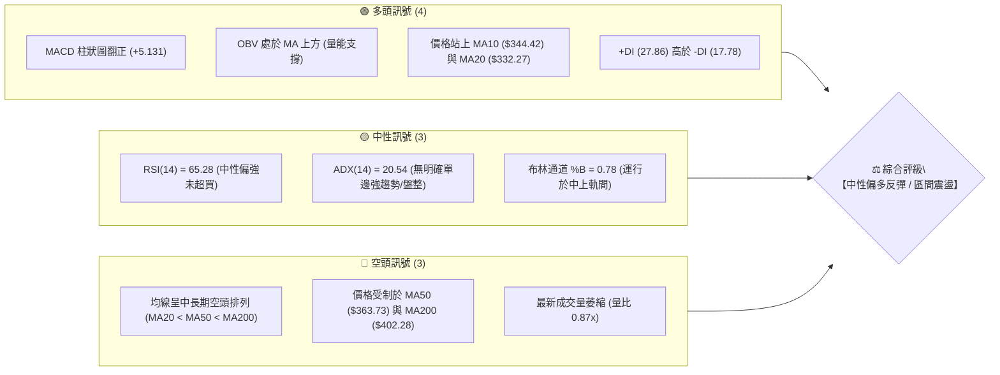
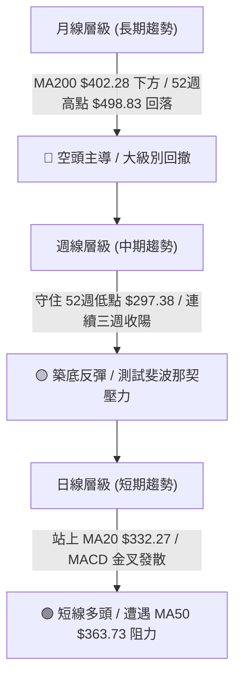
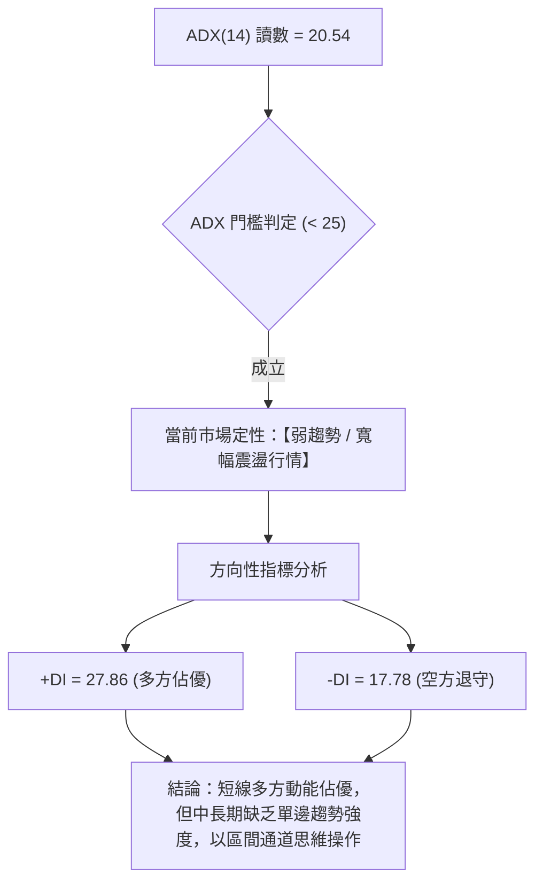
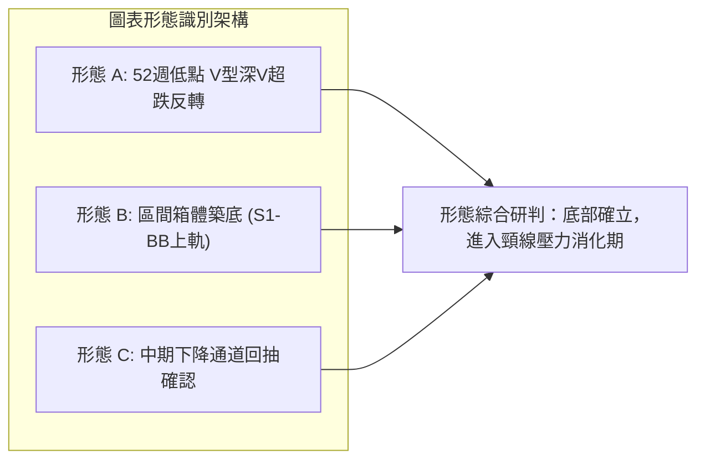
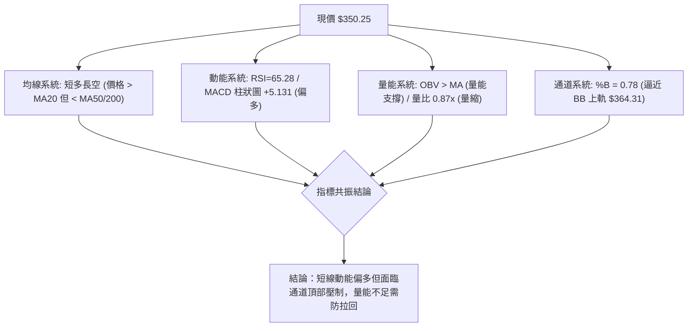
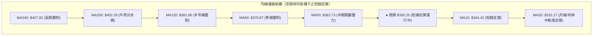
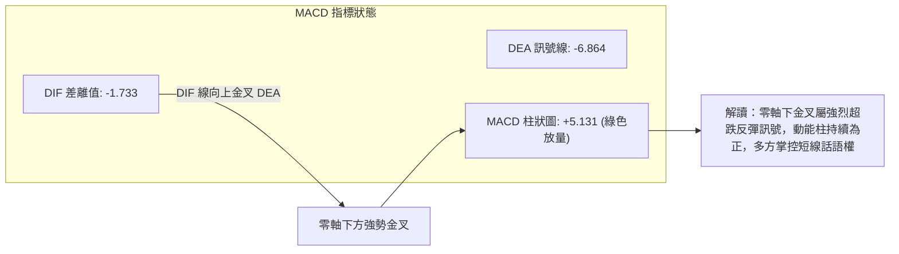
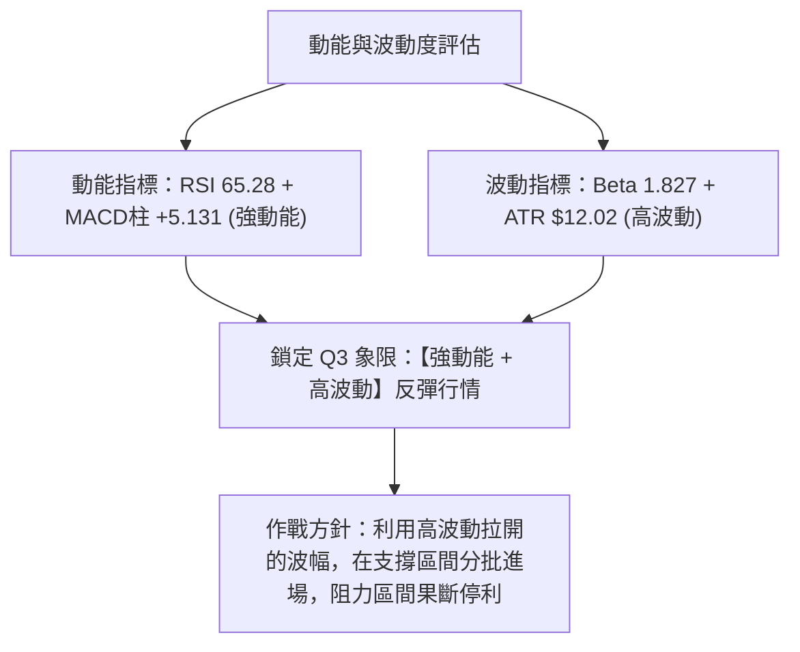
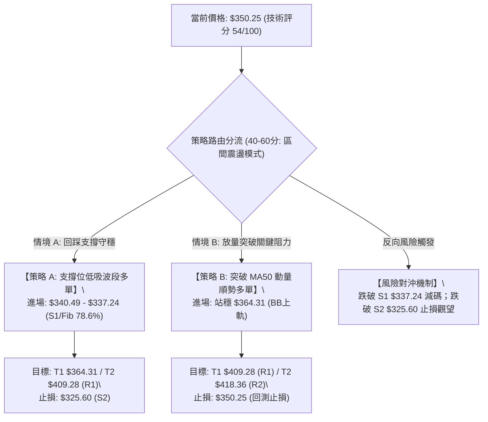
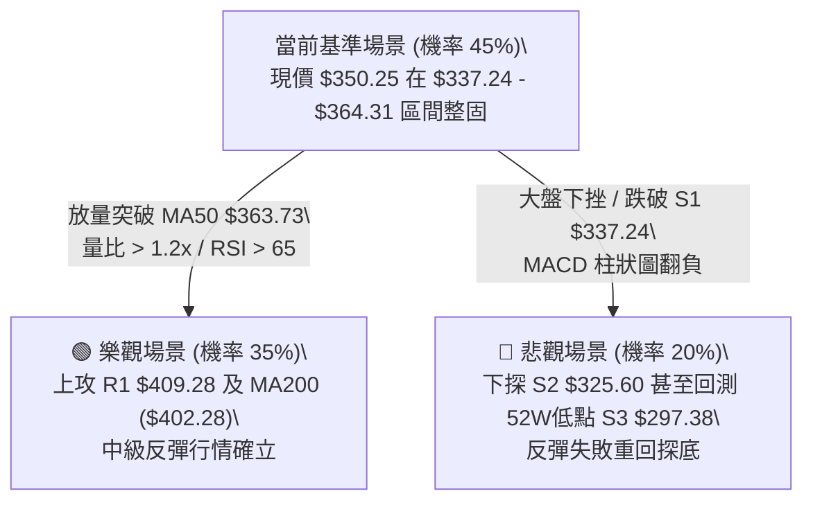

# TSLA 技術分析報告

> **報告日期**：2026-08-25 ｜ **語言**：繁體中文 ｜ **數據來源**：Yahoo Finance ｜ **當前價格**：$350.25

---

## 目錄

| 章節 | 內容 |
|------|------|
| [1. 技術面概覽](#1-技術面概覽) | 訊號儀表板、核心指標、評分卡 |
| [2. 趨勢分析](#2-趨勢分析) | 多時框趨勢、長中短期走勢 |
| [3. 圖表形態分析](#3-圖表形態分析) | 形態識別、K線組合、目標價 |
| [4. 支撐與阻力](#4-支撐與阻力) | 關鍵價位、斐波那契回調 |
| [5. 技術指標深度解讀](#5-技術指標深度解讀) | MA/RSI/MACD/布林/成交量 |
| [6. 動能與波動率](#6-動能與波動率) | 動能評估、ATR、Beta |
| [7. 多時框架總結](#7-多時框架總結) | 時框架評分矩陣 |
| [8. 交易策略建議](#8-交易策略建議) | 多空策略、風險報酬比 |
| [9. 風險提示與監控](#9-風險提示與監控) | 監控指標、風險場景 |
| [10. 報告總結](#10-報告總結) | 全文核心結論與策略彙整 |

---

## 1. 技術面概覽

### 🎯 技術訊號儀表板



---

### 📊 核心指標速覽表

| 指標類別 | 指標名稱 | 當前數值 | 訊號 | 解讀 |
|:---|:---|:---|:---:|:---|
| **價格** | 當前收盤價 | $350.25 | 🟡 | 位於52週區間26.2%低位，自低點$297.38展開反彈 |
| **短期均線** | MA20 | $332.27 | 🟢 | 現價高於MA20達+5.41%，短線偏多格局確立 |
| **中期均線** | MA50 | $363.73 | 🔴 | 現價低於MA50約-3.71%，上方首道動態均線壓制 |
| **長期均線** | MA200 | $402.28 | 🔴 | 現價大幅低於MA200達-12.93%，長期牛熊分界線未收復 |
| **動能指標** | RSI(14) | 65.28 | 🟡 | 處於強勢健康區間（30–70），未觸及70超買門檻 |
| **趨勢指標** | MACD (12/26/9) | 柱狀圖 +5.131 | 🟢 | DIF線(-1.733)向上金叉MACD訊號線(-6.864)，動能擴張 |
| **趨勢強度** | ADX(14) | 20.54 | 🟡 | 數值<25代表當前處於無趨勢或寬幅震盪行情 |
| **通道指標** | 布林通道上軌 | $364.31 | 🟡 | %B為0.78，正向通道上軌挺進，面臨通道頂部壓力 |
| **波動指標** | ATR(14) | $12.02 | 🟡 | 每日平均波動幅度3.43%，波動處於中等收斂階段 |
| **能量指標** | OBV 趨勢 | OBV > MA | 🟢 | 能量潮高於均線，資金流入支持短線反彈 |

---

### 🏆 技術評分卡

```
╔══════════════════════════════════════════════════════════════════╗
║                   技術評分卡 — TSLA (2026-08-25)                 ║
╠══════════════════════════════════════════════════════════════════╣
║ 趨勢強度 (ADX/方向)   ████████░░░░░░░░░░░░  42/100  🟡 弱勢盤整  ║
║ 動能指標 (RSI/MACD)  ██████████████░░░░░░  72/100  🟢 偏多反彈  ║
║ 支撐穩定度 (波段低點)  ██████████████░░░░░░  68/100  🟢 支撐穩固  ║
║ 成交量配合 (量比/OBV) ██████████░░░░░░░░░░  52/100  🟡 量能稍欠  ║
║ 形態完整度 (區間築底)  ████████████░░░░░░░░  60/100  🟡 底部構築  ║
║ 均線排列 (多空結構)   ██████░░░░░░░░░░░░░░  30/100  🔴 空頭排列  ║
╠══════════════════════════════════════════════════════════════════╣
║ 綜合技術評分          ███████████░░░░░░░░░  54/100  ⚖️ 區間震盪  ║
╚══════════════════════════════════════════════════════════════════╝
```

---

## 2. 趨勢分析

### 🌐 多時框趨勢分析



---

### 📈 長期趨勢 — 12個月走勢圖（Unicode）

以下為 TSLA 自 2025 年 8 月至 2026 年 8 月的月線收盤走勢圖，標注歷史高低點與結構變化：

```
TSLA 月線走勢圖（過去12個月：2025-08 至 2026-08）
價格 ($)
$460 ┤             ● (2025-10: $456.56 波段高點)
$440 ┤       ●           ●                       ● (2026-05: $435.79 次高)
$420 ┤                                                 ●
$400 ┤                               ●
$380 ┤                                     ●     ●
$360 ┤                                                 ●←當前 $350.25
$340 ┤ ●
$320 ┤                                                       ● (2026-07: $311.21)
$300 ┤                                                       ● (52W Low: $297.38)
     └─┬─────┬─────┬─────┬─────┬─────┬─────┬─────┬─────┬─────┬─────┬─────┬───
     08/25 09/25 10/25 11/25 12/25 01/26 02/26 03/26 04/26 05/26 06/26 07/26 08/26
```

#### 走勢特徵分析表格

| 階段區間 | 時間跨度 | 起訖價位 | 漲跌幅 | 走勢特徵與市場結構解讀 |
|:---|:---:|:---:|:---:|:---|
| **主升攻擊段** | 2025-08 ~ 2025-10 | $333.87 → $456.56 | +36.75% | 多頭放量攻頂，創下近兩年波段極值，隨後於52週高點$498.83見頂 |
| **高位箱體震盪** | 2025-11 ~ 2026-01 | $430.17 → $430.41 | +0.06% | 籌碼高位換手，多次上衝$450未果，構築潛在雙頂/複合頂部結構 |
| **第一波下殺** | 2026-02 ~ 2026-03 | $402.51 → $371.75 | -7.64% | 跌破高位箱體下沿，均線系統開始由多轉平，空方開始佔據優勢 |
| **次高點誘多** | 2026-04 ~ 2026-05 | $381.63 → $435.79 | +14.19% | 反彈測試前高頸線失敗，量能未能有效放大，形成明顯頂部阻力群 |
| **加速崩跌破位** | 2026-06 ~ 2026-07 | $420.60 → $311.21 | -26.01% | 長黑摜破MA200，於2026-07月創下52週低點$297.38，RSI探底至15.7 |
| **超跌修復反彈** | 2026-08 (當前) | $311.21 → $350.25 | +12.54% | 觸底S3($297.38)後展開強勁技術性反彈，目前受制於MA50($363.73) |

---

### 📊 中期趨勢（週線分析）

近20週的收盤數據顯示，TSLA 在 2026-07-26 當週收在 $313.03（週 RSI 達 15.7 的極度超賣區），隨後在 2026-08-02 探底 $311.21 後連續三週放量反彈，最高於 2026-08-23 觸及 $362.86，隨後本週回落整理至 $350.25。

```
中期週線空間結構（近期壓力與支撐）
$435.79 ─── 強阻力波段頂部 (2026-05 次高點)
   │
$409.28 ─── R1 關鍵壓力區 (MA200 $402.28 疊加區)
   │
$364.31 ─── BB 上軌 / MA50 ($363.73) [當前測試壓制區]
   │       ▲
   │      ─┼─ 當前價格: $350.25
   │       ▼
$337.24 ─── S1 近期支撐位 (前波回踩低點)
   │
$297.38 ─── S3 / 52週絕對低點 (強勁底部防線)
```

---

### ⚡ 趨勢強度評估（ADX 解讀）



| 指標變數 | 當前數值 | 狀態評估 | 實戰指導含義 |
|:---|:---:|:---:|:---|
| **ADX(14)** | 20.54 | 弱勢/無單邊趨勢 (< 25) | 嚴禁盲目追突破；價格多於布林通道上下軌之間進行區間擺動 |
| **+DI** | 27.86 | 多方主導線 | 買盤動能自超跌後持續修復，支撐短線向上反彈 |
| **-DI** | 17.78 | 空方主導線 | 空方拋壓大幅衰減，尚未構成連續殺跌動能 |
| **趨勢性質** | 盤整反彈 | 震盪修復模式 | 優先採用「支撐位低吸、阻力位高拋」之區間網格策略 |

---

## 3. 圖表形態分析

### 🔍 形態識別系統



#### 形態識別與信心度評估表

| 形態名稱 | 信心度 | 判斷依據（嚴格引用數據） | 完成度 | 目標價（附嚴謹計算式） |
|:---|:---:|:---|:---:|:---|
| **超跌V型反轉** | **75%** | 價格於 2026-07-26 跌至 $313.03 (RSI=15.7)，隨後於 $297.38 獲強支撐連續三週急拉至 $362.86。 | 85% | 突破 MA20 ($332.27) 頸線，目標價1 = $364.31 (BB上軌)，目標價2 = R1 $409.28。 |
| **箱體震盪整理** | **65%** | 底部支撐座落於 S1 $337.24 與 MA20 $332.27，頂部壓制於 MA50 $363.73 與 BB上軌 $364.31。 | 70% | 箱體高度 = $364.31 - $337.24 = $27.07；若突破箱頂，理論向上目標 = $364.31 + $27.07 = $391.38 (接近分析師均價 $390.09)。 |
| **雙底/複合底** | **35%** | 數據中僅偵測到單一深谷低點 ($297.38)，尚未出現第二次回踩確認打底結構。 | 20% | *訊號不足，信心度低於50%，僅做指標型區間解讀，不預先設定雙底幾何目標*。 |

---

### 🕯️ 重要K線形態分析

| 週期/月份 | 收盤價 | 核心 K 線特徵 | 技術面解讀 | 訊號 |
|:---|:---:|:---|:---|:---:|
| **2026-06** | $420.60 | 高位吞噬大陰線 | 跌破多條短期均線，確認 2026-05 ($435.79) 為假突破，中期轉空 | 🔴 |
| **2026-07** | $311.21 | 加速趕底長黑K | 單月暴跌超過 100 點，成交量暴增，釋放恐慌性停損盤 | 🔴 |
| **2026-08 (W3)**| $362.86 | 強勢長陽實體K | 連續突破 MA10 ($344.42) 與 MA20 ($332.27)，確立反彈動能 | 🟢 |
| **2026-08 (最新)**| $350.25 | 高位長上影十字/小陰K | 觸及 MA50 ($363.73) 與 BB 上軌遭遇獲利了結賣壓，短線進入蓄勢整固 | 🟡 |

---

### 📉 ASCII 走勢形態示意圖

```
TSLA 近期日/週線級別反彈結構示意圖
價格
$370 ┤                                           [阻力區: MA50 $363.73 / BB上軌 $364.31]
$360 ┤                                     ▲ (2026-08-23 高點 $362.86)
$350 ┤                                    ╱ ╲
$350.25 ────────────────────────────────●─── 現價 ($350.25)
$340 ┤                              ╱       [斐波那契 78.6% $340.49]
$330 ┤                        ╱             [動態頸線支撐 MA20 $332.27 / S1 $337.24]
$320 ┤                  ╱
$310 ┤            ●────● (2026-07 底底部: $313.03 / $311.21)
$300 ┤      ● (52W Low $297.38 / S3)
     └──────┴──────────┴─────────────────
          2026-07     2026-08
```

---

### 🎯 形態目標價計算

1. **第一波反彈滿足點（已達成部分）**：
   - 形態計算：自 52 週低點 $297.38 發動反彈，反彈第一阻力目標為布林通道上軌 **$364.31** 與 MA50 **$363.73**。
   - 實證：本週最高觸及 $362.86，精確於該阻力帶遇阻回落，目前於 $350.25 進行消化。
2. **第二波延伸目標價（突破確立後）**：
   - 突破觸發條件：日線收盤價有效站穩 MA50 **$363.73**。
   - 向上等距測幅：自頸線 S1 $337.24 向上測量至阻力 R1 **$409.28**（與長期均線 MA200 **$402.28** 共振區）。

---

## 4. 支撐與阻力

### 🗺️ 關鍵價位分布圖（Unicode）

```
TSLA 價位結構分布圖（嚴格依據 OHLCV 與關鍵價位聚類）
═══════════════════════════════════════════════════════════════════
$498.83 ║████████████████████████████████████████║ 52週歷史高點 (0.0%)
$451.29 ║██████████████████████████████        ║ 斐波那契 23.6% 回調
$434.60 ║██████████████████████████            ║ 強阻力 R3 (+24.08%)
$421.88 ║████████████████████████              ║ 斐波那契 38.2% 回調
$418.36 ║█████████████████████                 ║ 阻力 R2 (+19.45%)
$409.28 ║████████████████████████████          ║ 關鍵阻力 R1 (+16.85%) / MA200 ($402.28)
$398.10 ║██████████████████                    ║ 斐波那契 50.0% 中軸平衡位
$374.33 ║███████████████                       ║ 斐波那契 61.8% 黃金分割位
$364.31 ║████████████████████                  ║ 布林通道上軌 / MA50 ($363.73)
$350.25 ╠══════════════════════════════════════╣ ◄ 現價 ($350.25)
$340.49 ║▓▓▓▓▓▓▓▓▓▓▓▓▓▓▓▓▓▓▓▓▓▓▓▓              ║ 斐波那契 78.6% 回調位
$337.24 ║▓▓▓▓▓▓▓▓▓▓▓▓▓▓▓▓▓▓▓▓                  ║ 近期支撐 S1 (-3.71%) / MA20 ($332.27)
$325.60 ║████████████████████████              ║ 強支撐 S2 (-7.04%)
$300.23 ║████████████████████████████          ║ 布林通道下軌
$297.38 ║██████████████████████████████████████║ 絕對防守底線 S3 (-15.09% / 52W Low)
═══════════════════════════════════════════════════════════════════
```

---

### 🚧 阻力位分析表

| 阻力級別 | 準確價位 | 距離現價 | 形成原因與結構解讀 | 突破難度 | 重要性評級 |
|:---|:---:|:---:|:---|:---:|:---:|
| **動態阻力** | **$364.31** | +4.01% | 日線布林通道上軌疊加 50日均線 MA50 ($363.73) | 🟡 中等 | ★★★☆☆ |
| **黃金分割** | **$374.33** | +6.88% | 52週區間 61.8% 斐波那契回調壓制位 | 🟡 中等 | ★★★☆☆ |
| **阻力 R1** | **$409.28** | +16.85% | 近一年波段高點聚類區，疊加 MA200 ($402.28) 牛熊分界線 | 🔴 極高 | ★★★★★ |
| **阻力 R2** | **$418.36** | +19.45% | 前期週線成交密集換手區，疊加 38.2% 斐波那契 ($421.88) | 🔴 高 | ★★★★☆ |
| **阻力 R3** | **$434.60** | +24.08% | 2026年5月反彈次高點 ($435.79) 聚類強阻力帶 | 🔴 極高 | ★★★★★ |

---

### 🛡️ 支撐位分析表

| 支撐級別 | 準確價位 | 距離現價 | 形成原因與結構解讀 | 守住機率 | 重要性評級 |
|:---|:---:|:---:|:---|:---:|:---:|
| **黃金分割** | **$340.49** | -2.79% | 52週區間 78.6% 斐波那契回調支撐位 | 🟢 75% | ★★★★☆ |
| **支撐 S1** | **$337.24** | -3.71% | 近一年波段低點聚類，下方共振 MA20 中軌 ($332.27) | 🟢 70% | ★★★★★ |
| **支撐 S2** | **$325.60** | -7.04% | 2026年8月上旬起漲點跳空支撐平台 | 🟢 65% | ★★★★☆ |
| **動態下軌** | **$300.23** | -14.28% | 布林通道下軌極限支撐 | 🟢 85% | ★★★★☆ |
| **支撐 S3** | **$297.38** | -15.09% | 52週絕對歷史低點（100.0% 斐波那契原點），年度防線 | 🟢 90% | ★★★★★ |

---

### 📐 斐波那契回調位分析

依據 52 週完整波動區間（高點 **$498.83** → 低點 **$297.38**，垂直落差 $201.45）精準計算：

| 斐波那契層級 | 精確價位 | 相對現價位置 | 當前技術意義與交易指引 |
|:---|:---:|:---:|:---|
| **0.0% (高點)** | $498.83 | +42.42% | 52週最高峰值，長期牛市極限目標 |
| **23.6%** | $451.29 | +28.85% | 2025年Q4高位震盪平台中樞 |
| **38.2%** | $421.88 | +20.45% | 強勢回調防守線，與 R2 ($418.36) 形成共振壓制區 |
| **50.0% (中軸)** | $398.10 | +13.66% | 多空強弱分水嶺，接近 MA200 ($402.28) |
| **61.8% (黃金分割)**| $374.33 | +6.88% | **上方第一主要斐波阻力**，突破將打開通往 $400 大門 |
| **78.6% (深度回調)**| $340.49 | -2.79% | **下方第一主要斐波支撐**，現價正運行於 78.6% 之上 |
| **100.0% (低點)**| $297.38 | -15.09% | 52週最低原點，多頭最後防守底線 |

> 📌 **現價區間解讀**：現價 **$350.25** 目前穩固運行於 **78.6% ($340.49)** 與 **61.8% ($374.33)** 之間。突破 $374.33 意味著行情擺脫底部超跌區，進入向 50.0% ($398.10) 靠攏的中級修復行情；若跌破 $340.49，則將重新考驗 S1 ($337.24) 與 MA20 ($332.27) 支撐力道。

---

## 5. 技術指標深度解讀

### 🎛️ 指標訊號總覽



---

### 📈 移動平均線排列分析



| 均線名稱 | 數值 | 距現價差距 | 狀態 | 趨勢與技術解讀 |
|:---|:---:|:---:|:---:|:---|
| **MA 5** | $351.66 | -0.40% | ▼ 下方 | 極短線微幅受阻，短線多頭上攻斜率趨緩 |
| **MA 10** | $344.42 | +1.69% | ▲ 上方 | 短線第一動態防守均線，提供即時回踩支撐 |
| **MA 20** | $332.27 | +5.41% | ▲ 上方 | 月線向上翻揚，構成反彈以來的核心生命線 |
| **MA 50** | $363.73 | -3.71% | ▼ 下方 | 中期空頭阻力，與布林上軌形成第一道阻力牆 |
| **MA 60** | $370.87 | -5.56% | ▼ 下方 | 季線下行趨緩，接近 61.8% 斐波那契位 ($374.33) |
| **MA 120** | $381.86 | -8.28% | ▼ 下方 | 半年線持續下壓，中期反彈的大級別目標位 |
| **MA 200** | $402.28 | -12.93% | ▼ 下方 | 長期年線牛熊分水嶺，決定大趨勢能否徹底反轉 |
| **MA 240** | $407.92 | -14.14% | ▼ 下方 | 兩年均線頂部壓制區，與阻力 R1 ($409.28) 完全重合 |

---

### 📉 RSI(14) 分析

- **當前讀數**：**65.28** 
- **強度可視化**：
  ```
  超賣 (0)                       中性 (50)           超買 (70)      極端 (100)
  ├──────────────────────────────┼───────────●───────┼──────────────┤
  0                             50         65.28    70            100
  [█████████████████████████████████████████░░░░░░░░░] 65.28%
  ```
- **區間評估**：RSI 處於 50–70 強勢多頭擴張區間，既無超賣鈍化風險，亦尚未進入 >70 之嚴重超買過熱區，顯示短線上漲健康。
- **背離判斷**：
  - **頂背離**：無頂背離。近期價格高點 $362.86 伴隨 RSI 升至 72.7，隨後價格回落 $350.25，RSI 同步回落至 65.28，指標與價格波動步調一致。
  - **底背離**：先前在 2026-07-26 週線級別 RSI 跌至 15.7 極值後，日線展開連續反彈，底背離動能已獲充分釋放。

---

### 📊 MACD(12/26/9) 訊號解讀



- **DIF 線**：-1.733
- **DEA 線（Signal）**：-6.864
- **MACD 柱狀圖（Histogram）**：**+5.131**（🟢 看多訊號）
- **技術解讀**：DIF 與 DEA 雖仍在零軸下方（反映中長期格局仍處於修復期），但 DIF 自低檔向上穿越 DEA 後開口持續擴大，柱狀圖達到 +5.131 的高位多頭動能，代表短期買盤力道充沛。

---

### 📦 布林通道分析

```
TSLA 日線布林通道結構示意圖
$364.31 ┤───────────────────────────────── 上軌 (強阻力區)
        │                      ● $362.86 (衝高回落)
$350.25 ┤────────────────────●──────────── 現價 (%B = 0.78)
        │                  ╱
$332.27 ┤─────────────────●─────────────── 中軌 / MA20 (核心動態支撐)
        │
$300.23 ┤───────────────────────────────── 下軌 (極限防守位)
```

- **布林帶寬與位置**：
  - **BB 上軌**：$364.31
  - **BB 中軌 (MA20)**：$332.27
  - **BB 下軌**：$300.23
  - **%B 指標**：**0.78**（代表價格處於通道從下軌至上軌的 78% 相對高位）
- **通道行為解析**：通道帶寬開口正逐步擴大，價格自下軌一路推升至上軌附近，%B 達到 0.78 表明短線已接近通道阻力上限。若無法配合放量突破 $364.31，價格大機率將在中軌 $332.27 至上軌之間進行區間回洗。

---

### 💹 成交量分析（量價配合度）

- **最新日成交量**：29,715,710 股
- **20日均量**：34,295,876 股（量比：**0.87x**，量能萎縮）
- **50日均量**：40,284,600 股
- **能量潮 (OBV) 趨勢**：**OBV > MA**（量能趨勢偏多）
- **量價關係綜合研判**：
  1. **短線量縮整理**：現價衝高至 MA50 遇阻回落時，日成交量萎縮至 2,971 萬股（低於 20 日均量），顯示回調過程中並未出現恐慌性主力出逃，屬於健康的良性量縮洗盤。
  2. **OBV 指標確認**：OBV 維持在均線上方，顯示自 7 月底低點以來的累積資金流向仍為淨流入，支撐價格底部逐步抬高。
  3. **量能隱憂**：若欲向上有效擊穿 MA50 ($363.73) 與 R1 ($409.28)，單日成交量必須放大至 4,500 萬股以上（量比 > 1.3x），否則易形成量價背離式假突破。

---

## 6. 動能與波動率

### ⚡ 動能評估四象限

| 象限區間 | 動能強度 (RSI/MACD) | 波動率水準 (ATR/Beta) | TSLA 當前定位 | 交易環境與作戰策略 |
|:---:|:---:|:---:|:---:|:---|
| **第一象限 (Q1)** | 強動能 (High) | 低波動 (Low) | ─ | 趨勢穩健攀升，最佳趨勢加碼環境 |
| **第二象限 (Q2)** | 弱動能 (Low) | 低波動 (Low) | ─ | 橫盤沉寂窄幅盤整，觀望等待方向 |
| **第三象限 (Q3)** | **強動能 (High)** | **高波動 (High)** | **✓ (TSLA 當前定位)** | **高彈性反彈期：短線動能充沛，Beta (1.827) 高，適合波段區間操作，嚴格執行風控** |
| **第四象限 (Q4)** | 弱動能 (Low) | 高波動 (High) | ─ | 恐慌崩跌下殺期，嚴禁盲目抄底 |



---

### 📊 ATR 波動率分析

- **當前 ATR(14)**：**$12.02**（佔股價比例：**3.43%**）
- **波動特性解讀**：TSLA 日均波動高達 $12.02 美元，屬於典型的高彈性成長標的。在制定交易策略時，止損空間若過小（例如 < $10）極易被日常隨機雜訊掃出場。
- **動態風控參數計算**：
  - **短線交易止損距離（1.0 × ATR）**：$12.02
  - **波段交易安全止損距離（1.5 × ATR）**：$18.03
  - **寬幅防守止損距離（2.0 × ATR）**：$24.04
- **部位規模計算參考（以 10 萬美元帳戶、單筆承擔 2% 即 $2,000 風險為例）**：
  $$\text{建議最大持股股數} = \frac{\text{帳戶總風險額 (\$2,000)}}{\text{波段止損距離 (\$18.03)}} \approx 110 \text{ 股}$$

---

### 📐 Beta 與市場相關性

- **Beta 係數**：**1.827**
- **市場敏感度分析**：Beta 值為 1.827 代表 TSLA 的波動彈性為大盤（S&P 500 / 標普指數）的 1.827 倍。當美股大盤反彈 1% 時，TSLA 理論平均上漲約 1.83%；反之，大盤回調 1% 時，TSLA 平均承壓 1.83%。
- **操作啟示**：操作 TSLA 必須高度關注大盤系統性風險，在整體市場情緒偏暖時，TSLA 具有極佳的多頭向上進攻彈性。

---

## 7. 多時框架總結

### 📋 時框架評分表

| 時框架 | 趨勢方向 | 動能狀態 | 均線排列 | 形態結構 | 綜合評分 | 戰略操作建議 |
|:---|:---:|:---:|:---:|:---:|:---:|:---|
| **日線 (短期)** | 🟢 偏多反彈 | 🟢 RSI 65 / MACD翻紅 | 🟡 站上MA20/承壓MA50 | 🟡 區間上軌受阻蓄勢 | **68 / 100** | 回踩支撐 S1 / MA20 逢低做多 |
| **週線 (中期)** | 🟡 震盪築底 | 🟢 連續三週收陽反彈 | 🔴 MA50下穿MA200死叉 | 🟢 52W低點V型底反抽 | **55 / 100** | 區間震盪看待，關注 MA50 突破 |
| **月線 (長期)** | 🔴 空頭下行 | 🔴 長期回撤走勢 | 🔴 價格遠低於MA200 | 🔴 高位雙頂破位後修復 | **38 / 100** | 逢高減碼長期套牢盤，不宜重倉追高 |

---

### 🔲 綜合訊號矩陣

| 技術維度 | 短期（日線）訊號 | 中期（週線）訊號 | 長期（月線）訊號 | 一致性研判 |
|:---|:---:|:---:|:---:|:---|
| **價格與均線位置** | 🟢 站上 MA10/MA20 | 🔴 受制於下行均線 | 🔴 跌破 MA200 牛熊線 | 訊號分歧（短線超跌反彈 vs 長期空頭） |
| **動能與指標擺動** | 🟢 MACD擴張 / RSI強勢 | 🟡 週RSI自超賣修復 | 🔴 長期動能仍在零軸下 | 短中期動能修復強勁，長期尚未反轉 |
| **形態與通道位階** | 🟡 逼近布林上軌 $364 | 🟢 遠離底部 $297.38 | 🔴 處於自 $498 下跌半山腰 | 空間具備回抽潛力，但上方阻力重重 |

---

### ⚖️ 多時框收斂結論

依據多時框收斂規則（規則 14）：
1. **行情性質判定**：當前 **ADX(14) 讀數為 20.54 (< 25)**，嚴格定性為**【無明確單邊強趨勢之寬幅盤整震盪行情】**。
2. **主導時框取捨**：由於 ADX < 25，單邊趨勢尚未成型，操作不可採取大級別盲目順勢追單，而**必須以日線布林通道（下軌 $300.23 至上軌 $364.31）及關鍵支撐 S1 ($337.24) / 阻力 R1 ($409.28) 作為主要交易區間**。
3. **唯一方向性結論**：**【中性偏多區間震盪（Neutral-Bullish Range Bound）】**。短線日線具備動能優勢，但上方受制於 MA50 ($363.73) 與 BB 上軌 ($364.31)，因此策略核心在於**「等待價格回踩 S1 / 斐波 78.6% 支撐帶佈局多單，並於阻力位獲利了結」**。

---

## 8. 交易策略建議

### 🗺️ 策略決策流程圖



---

### 🧭 策略路由

> **當前主策略方向 = 【中性偏多區間震盪操作】（依技術評分卡 54/100 判定）**  
> 評分處於 40–60 區間，ADX < 25，明確指示當前處於區間震盪。交易策略主推「區間逢低做多」，輔以「放量突破順勢跟進」，嚴禁在通道頂部盲目追高。

---

### 🎯 價格情境階梯（Price Scenarios）

所有價位均嚴格引用第 4 章及關鍵數據聚類：

| 觸發條件 | 即時路徑 | 下一目標 | 後續延伸目標 | 情境含義與操作指引 |
|:---|:---:|:---:|:---:|:---|
| **向上突破 MA50 ($363.73)** | 突破 BB 上軌 $364.31 | **R1: $409.28** | **R2: $418.36 / R3: $434.60** | 短線轉為強勢單邊行情，中期反彈全面展開 |
| **維持現價區間震盪** | 波動於 $337.24 ~ $364.31 | **中軌: $332.27** | **上軌: $364.31** | 標準箱體洗盤，維持高拋低吸網格節奏 |
| **跌破關鍵支撐 S1 ($337.24)**| 摜破 MA20 ($332.27) | **S2: $325.60** | **S3: $297.38 (52W Low)** | 反彈失敗，空方重掌優勢，需全面防守止損 |

---

### 📊 情境機率分佈

| 運行情境 | 發生機率 | 主要技術依據（嚴格引用指標狀態） |
|:---|:---:|:---|
| **區間震盪整固** | **45%** | ADX(14) = 20.54 指示無單邊趨勢；成交量萎縮 (量比 0.87x) 不足以直接突破強阻力；布林通道 %B = 0.78 壓制。 |
| **蓄勢突破上行** | **35%** | MACD 柱狀圖 (+5.131) 強勁擴張；OBV > MA 資金持續淨流入；RSI(14) = 65.28 處於強勢進攻區間。 |
| **破位回落探底** | **20%** | 均線系統長週期仍為空頭排列 (MA20 < MA50 < MA200)；若跌破 S1 ($337.24) 則技術面結構轉弱。 |

---

### 🟢 主策略詳情

| 策略要素 | 策略 A：區間逢低做多（回踩低吸） | 策略 B：阻力突破順勢做多（右側跟進） |
|:---|:---|:---|
| **策略類型** | 逆勢逢低分批佈局 | 順勢突破動量跟進 |
| **進場條件** | 價格回踩 78.6% 斐波那契位並於 S1 獲得企穩確認 | 日線收盤放量突破 MA50 ($363.73) 與 BB 上軌 |
| **精確進場價格** | **$340.49**（允許區間：$337.24 – $340.49） | **$364.31**（突破並站穩確認） |
| **目標價 T1** | **$364.31**（BB 上軌阻力，獲利率 +7.00%） | **$409.28**（阻力 R1 / MA200，獲利率 +12.34%） |
| **目標價 T2** | **$409.28**（阻力 R1 / MA200，獲利率 +20.20%） | **$418.36**（阻力 R2，獲利率 +14.84%） |
| **精確止損價格** | **$325.60**（跌破強支撐 S2 嚴格止損） | **$350.25**（跌回當前平台內部止損） |
| **止損空間 / 幅度**| -$14.89 (-4.37%) | -$14.06 (-3.86%) |
| **風險報酬比 (R/R)**| **1 : 4.62**（以目標 T2 計算：$68.79 / $14.89） | **1 : 3.20**（以目標 T1 計算：$44.97 / $14.06） |
| **預估勝率** | **65%** | **55%** |
| **建議倉位** | **15% – 20%** | **10% – 15%** |

---

### 🔴 反向風險觸發點（對沖與風控提示）

若發生以下盤口異動，代表主多頭策略邏輯被徹底推翻，應立即採取防禦措施：
1. **空頭對沖觸發價位**：若日線實體陰線**跌破 S1 ($337.24)** 且收盤失守 **MA20 ($332.27)**，多頭部位應主動減碼 50%。
2. **全面停損清倉點**：若價格進一步**擊穿 S2 ($325.60)**，確認反彈波段終結，所有剩餘多單必須無條件市價止損離場，空倉觀望至 S3 ($297.38)。

---

### ⭐ 整體訊號強度評星

```
╔══════════════════════════════════════════════════════════════╗
║                   TSLA 交易訊號強度評星                      ║
╠══════════════════════════════════════════════════════════════╣
║ 做多訊號強度：  ★★★☆☆  (3.5/5星 — 短線動能充沛但面臨阻力)   ║
║ 做空訊號強度：  ★★☆☆☆  (2.0/5星 — 底部支撐穩固，做空盈虧比差) ║
║ 整體訊號可信度：★★★★☆  (4.0/5星 — 量價與指標共振度高)       ║
╚══════════════════════════════════════════════════════════════╝
```

---

## 9. 風險提示與監控

### ✅ 關鍵監控指標 Checklist

```
╔══════════════════════════════════════════════════════════════════╗
║                     TSLA 每日交易監控清單 (Checklist)            ║
╠══════════════════════════════════════════════════════════════════╣
║ [ ] 價格是否成功守住 斐波 78.6% ($340.49) 與 S1 ($337.24) 支撐帶  ║
║ [ ] 價格能否放量站穩 MA50 ($363.73) 與布林上軌 ($364.31)         ║
║ [ ] RSI(14) 是否突破 70 進入超買過熱，或跌破 50 多空分水嶺      ║
║ [ ] MACD 柱狀圖是否持續擴張（當前 +5.131），警惕紅柱縮短鈍化      ║
║ [ ] 日成交量能否突破 40,000,000 股（量比 > 1.2x 確認突破有效性） ║
║ [ ] 大盤指數波動度（Beta 1.827，密切觀察美股整體市場系統性風險） ║
╚══════════════════════════════════════════════════════════════════╝
```

---

### ⚠️ 風險場景分析



---

### 🛡️ 風險管理重要提醒

1. **ATR 波動適應原則**：TSLA 當前 ATR 高達 **$12.02 (3.43%)**，嚴禁使用過於緊密的止損（如 $5 內），避免在正常市場呼吸波動中被無謂掃損。
2. **倉位嚴格控管**：在 ADX = 20.54（震盪市）環境下，單一策略部位建議控制在總資金的 **15%–20%** 以內，整體 TSLA 曝險不宜超過 30%。
3. **盈利保護機制（Trailing Stop）**：當買入後股價上漲超過 1 個 ATR（+$12.02，達到 $362.27 以上）時，應立即將止損價上移至**進場損益平衡點（Break-even）**，鎖定本金安全。

---

## 📋 報告總結

```
╔══════════════════════════════════════════════════════════════════╗
║                     TSLA 技術分析報告總結                        ║
╠══════════════════════════════════════════════════════════════════╣
║ 報告日期：2026-08-25                                             ║
║ 當前價格：$350.25                                                ║
║ 分析評級：⚖️ 中性偏多區間震盪（技術評分：54 / 100）               ║
║                                                                  ║
║ 關鍵結論：                                                       ║
║ ├─ 長期趨勢：🔴 空頭主導（位於 MA200 $402.28 之下，中長期承壓）  ║
║ ├─ 中期趨勢：🟡 築底反彈（自 52週低點 $297.38 展開技術性修復）   ║
║ ├─ 短期趨勢：🟢 偏多進攻（站上 MA20 $332.27，MACD 柱狀圖 +5.131） ║
║ ├─ 關鍵支撐：S1 $337.24 ｜ 斐波 78.6% $340.49 ｜ S3 $297.38      ║
║ ├─ 關鍵阻力：MA50 $363.73 ｜ BB上軌 $364.31 ｜ R1 $409.28        ║
║ └─ 分析師目標價：均價 $390.09（39位分析師 Consensus: Buy）       ║
║                                                                  ║
║ 最優策略組合：                                                   ║
║ 1. 🥇 最佳機會：策略 A【區間逢低低吸】                            ║
║    進場點 $340.49，止損點 $325.60，目標價 $364.31 / $409.28      ║
║    風險報酬比高達 1 : 4.62，勝率約 65%。                         ║
║ 2. 🥈 次選機會：策略 B【阻力突破順勢跟進】                        ║
║    放量站上 $364.31 後追進，止損 $350.25，目標價 $409.28。       ║
║ 3. 🥉 保守選擇：空倉觀望，等待價格拉回 $337.24 企穩或突破確立。   ║
╚══════════════════════════════════════════════════════════════════╝
```

---

> ⚠️ **免責聲明**：本報告為依據客觀技術指標與量化數據生成之專業技術分析研究，所有數據、圖表及推算價位僅供學術研究與投資策略規劃參考，**不構成任何形式的個人化投資建議或買賣要約**。金融市場瞬息萬變，交易具有本金虧損風險，投資人應獨立評估風險並自負盈虧。

---

*報告生成時間：2026-08-25 ｜ 數據來源：Yahoo Finance ｜ 分析框架：多時框架量化技術分析*