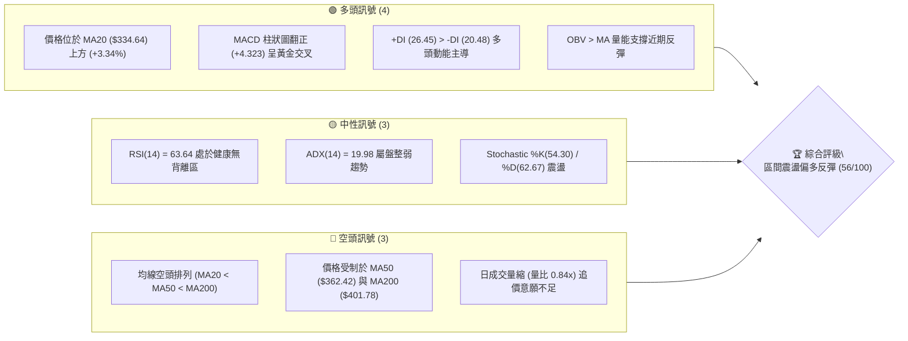
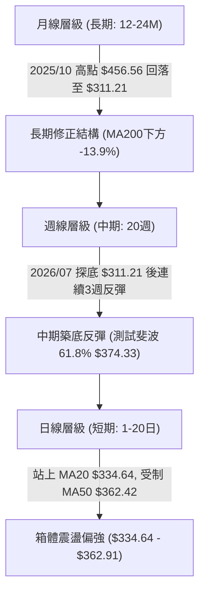
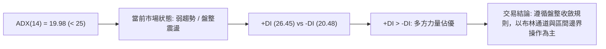
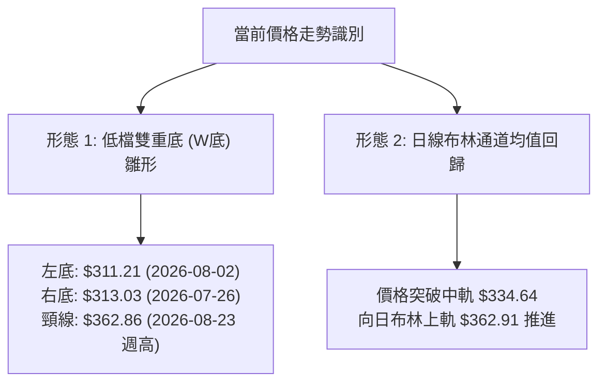
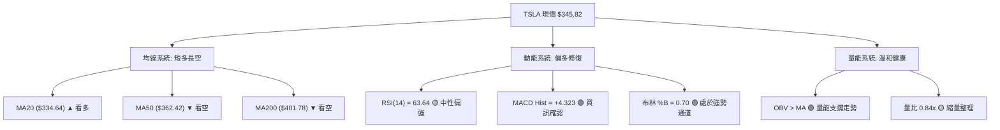
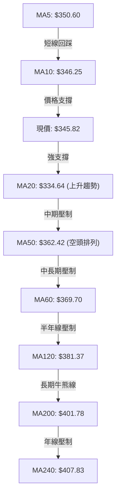
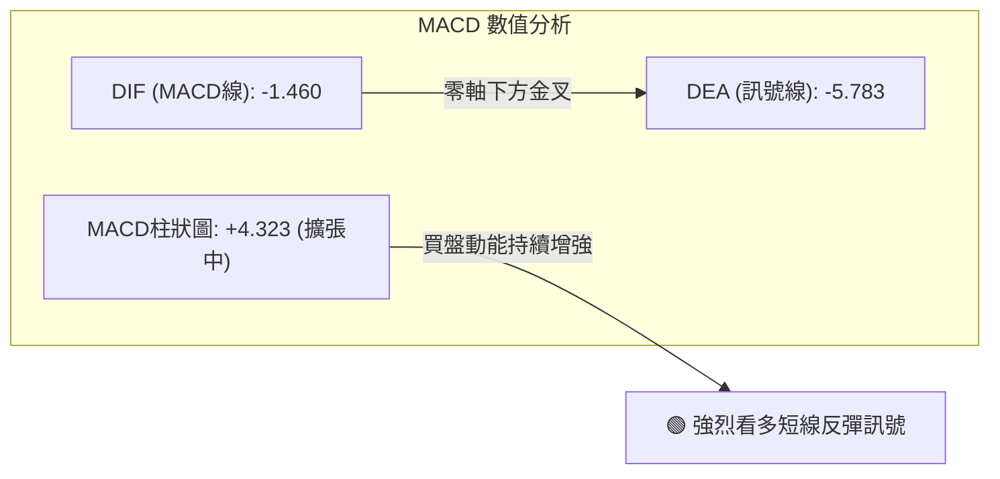
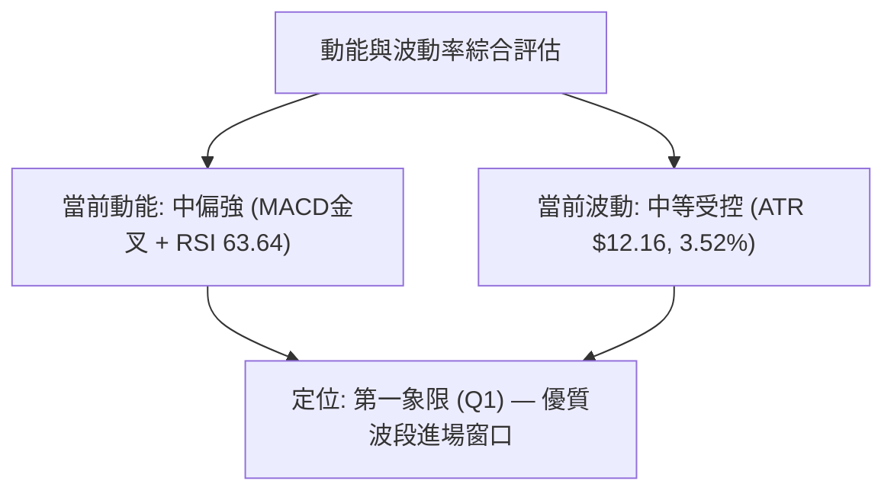
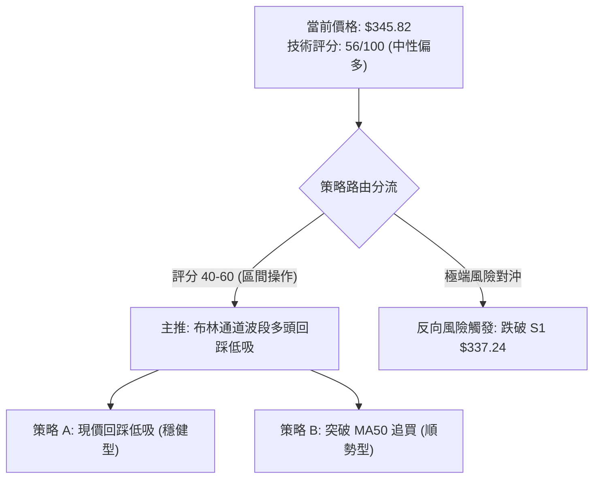
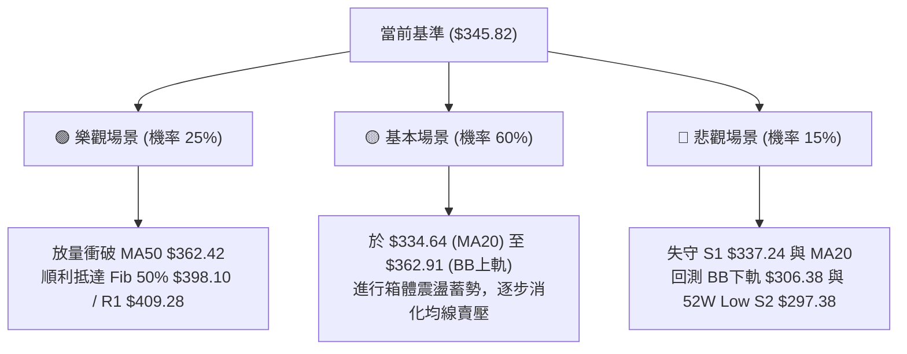

# TSLA 技術分析報告

> **報告日期**：2026-08-27 ｜ **語言**：繁體中文 ｜ **數據來源**：Yahoo Finance ｜ **當前價格**：$345.82

---

## 目錄

| 章節 | 內容 |
|------|------|
| [1. 技術面概覽](#1-技術面概覽) | 訊號儀表板、核心指標、評分卡 |
| [2. 趨勢分析](#2-趨勢分析) | 多時框趨勢、長中短期走勢 |
| [3. 圖表形態分析](#3-圖表形態分析) | 形態識別、K線組合、目標價 |
| [4. 支撐與阻力](#4-支撐與阻力) | 關鍵價位、斐波那契回調 |
| [5. 技術指標深度解讀](#5-技術指標深度解讀) | MA/RSI/MACD/布林/成交量 |
| [6. 動能與波動率](#6-動能與波動率) | 動能評估、ATR、Beta |
| [7. 多時框架總結](#7-多時框架總結) | 時框架評分矩陣 |
| [8. 交易策略建議](#8-交易策略建議) | 多空策略、風險報酬比 |
| [9. 風險提示與監控](#9-風險提示與監控) | 監控指標、風險場景 |

---

## 1. 技術面概覽

### 🎯 技術訊號儀表板



### 📊 核心指標速覽表

| 指標類別 | 指標名稱 | 當前數值 | 訊號 | 解讀 |
|----------|----------|----------|------|------|
| **價格** | 當前價格 | $345.82 | 🟡 | 位於52週區間24.0%分位，低檔反彈但受制於中期均線 |
| **均線** | MA20 | $334.64 | 🟢 | 價格位於MA20上方+3.34%，短線支撐確立 |
| **均線** | MA50 | $362.42 | 🔴 | 價格位於MA50下方-4.58%，中期趨勢仍受壓制 |
| **均線** | MA200 | $401.78 | 🔴 | 價格位於MA200下方-13.93%，長期牛熊分界線構成重壓 |
| **動能** | RSI(14) | 63.64 | 🟡 | 位於30-70中性偏強區間，無頂底背離，具上行空間 |
| **動能** | MACD(12,26,9) | -1.460 / Hist +4.323 | 🟢 | 快慢線即將零軸下金叉，柱狀圖持續擴大，短線買盤強 |
| **動能** | Stoch(14,3,3) | %K 54.30 / %D 62.67 | 🟡 | 指標自高檔小幅收斂，呈現高位箱體整理 |
| **趨勢** | ADX(14) / DMI | 19.98 (+DI 26.45) | 🟡 | ADX<25處於無趨勢/盤整格局，但+DI佔優偏向多頭試探 |
| **通道** | Bollinger Bands | 上軌 $362.91 / 下軌 $306.38 | 🟢 | %B為0.70，股價運行於中軌($334.64)與上軌間 |
| **成交量** | 20日均量比 | 0.84x (28.25M vs 33.74M) | 🟡 | 量能未顯著放大，屬健康縮量整理，OBV維持正向 |
| **波動** | ATR(14) | $12.16 (3.52%) | 🟡 | 波動率處於中等水平，單日安全停損距離參考為1-1.5倍ATR |

### 🏆 技術評分卡

```
╔══════════════════════════════════════════════════════════════╗
║              技術評分卡 — TSLA (2026-08-27)                  ║
╠══════════════════════════════════════════════════════════════╣
║ 趨勢強度 (ADX<25)      ████████░░░░░░░░░░░░  40/100  🟡 中性 ║
║ 短期動能 (MACD/RSI)    ██████████████░░░░░░  70/100  🟢 偏多 ║
║ 支撐穩定度 (S1/Fib)    ████████████░░░░░░░░  60/100  🟢 良好 ║
║ 成交量配合 (OBV/Vol)   ██████████░░░░░░░░░░  50/100  🟡 普普通 ║
║ 形態結構 (雙底雛形)    ████████████░░░░░░░░  60/100  🟢 中性偏多 ║
║ 均線排列 (空頭排列)    ████████░░░░░░░░░░░░  40/100  🔴 偏空 ║
╠══════════════════════════════════════════════════════════════╣
║ 綜合評分               ███████████░░░░░░░░░  56/100  中性偏多 ║
╚══════════════════════════════════════════════════════════════╝
```

---

## 2. 趨勢分析

### 🌐 多時框趨勢分析



### 📈 長期趨勢 — 12個月走勢圖（Unicode）

```
TSLA 月線走勢圖（過去12個月：2025-08 至 2026-08）
價格軸 ($)
$460 ┤                  ●(10月 456.56)
$440 ┤              ●   │     ●(12月 449.72)
$420 ┤              │   │     │     ●(01月 430.41)          ●(05月 435.79)
$400 ┤              │   │     │     │     ●(02月 402.51)    │     ●(06月 420.60)
$380 ┤              │   │     │     │     │     ●(04月 381.63)    │
$360 ┤              │   │     │     │     │     │           │     │
$340 ┤        ●     │   │     │     │     │     │     ●(03月 371.75)    ●(08月 345.82 現價)
$320 ┤  ●     │     │   │     │     │     │     │           │     │     │
$300 ┤  │     │     │   │     │     │     │     │           │     │     ●(07月 311.21 低點)
     └─────────────────────────────────────────────────────────────────────────────
       08/25 09/25 10/25 11/25 12/25 01/26 02/26 03/26 04/26 05/26 06/26 07/26 08/26
```

#### 走勢特徵分析表格

| 階段區間 | 起訖月份 | 起訖價格 | 區間漲跌幅 | 走勢結構與技術特徵 |
|----------|----------|----------|------------|--------------------|
| **波段主升** | 2025-08 → 2025-10 | $333.87 → $456.56 | +36.75% | 多頭放量突破，創下年內高點 $456.56，MACD維持高檔鈍化 |
| **高檔箱體** | 2025-10 → 2026-01 | $456.56 → $430.41 | -5.73% | 於 $430-$456 區間寬幅震盪，動能逐步耗竭，成交量溫和萎縮 |
| **波段回調** | 2026-01 → 2026-03 | $430.41 → $371.75 | -13.63% | 連續跌破短期均線，空方主導，下探半年線獲得初步承接 |
| **次高反彈** | 2026-03 → 2026-05 | $371.75 → $435.79 | +17.23% | 假突破構築次高點 $435.79，未能突破前高，形成中期雙頭壓力 |
| **急劇下殺** | 2026-05 → 2026-07 | $435.79 → $311.21 | -28.59% | 週線連續重挫，RSI跌至15.7極端超賣區，探至52週低點邊緣 |
| **低檔修復** | 2026-07 → 2026-08 | $311.21 → $345.82 | +11.12% | 築底反彈，收復MA20，MACD日線轉正，進入修復性箱體 |

### 📊 中期趨勢（週線分析）

```
TSLA 中期關鍵結構示意圖 (週線層級)
$435.79 ═══════════════════════════════════════ (05月波段高點 / R3 $434.60 區域)
             │                        │
             │     中期下降趨勢線     ▼
             ▼  ╲
$401.78 ─────────────────────────────────────── (MA200 / 斐波 50.0% $398.10 關鍵多空分水嶺)
                   ╲
$362.42 ─────────────────────────────────────── (MA50 / 布林上軌 $362.91 當前反彈首道壓力)
                      ╲        ▲
$345.82 ═══════════════════════╬═══════════════ ◄ 現價 ($345.82 位於布林中上軌間)
                               ║  低檔強勁反彈
$311.21 ───────────────────────╩─────────────── (07月低點 / 接近 52W Low S2 $297.38)
```

週線數據顯示，2026-07-26 當週 RSI 觸及 15.7 極值後，近4週成交量依序為 198.8M、164.9M、157.2M、180.8M，呈現「量縮築底、放量反彈」特徵。週 MACD 柱狀圖由 -8.365 快速收斂至 +4.323，中期動能正顯著改善。

### ⚡ 趨勢強度評估（ADX 解讀）



| ADX 區間 | 趨勢強度定義 | TSLA 當前狀態 | 交易戰術對策 |
|----------|--------------|---------------|--------------|
| 0 - 20 | 無趨勢 / 極弱趨勢 | **19.98 (當前)** | 嚴禁盲目追突破，採用區間高拋低吸，嚴守支撐阻力 |
| 20 - 25 | 趨勢醞釀中 | 邊緣過渡 | 密切觀察 +DI 與 -DI 開口，若突破 $362.91 則趨勢確立 |
| 25 - 40 | 強趨勢形成 | 否 | 若 ADX > 25 則轉為順勢交易模式 |
| 40+ | 極強 / 動能過熱 | 否 | 容易出現竭盡形態 |

---

## 3. 圖表形態分析

### 🔍 形態識別系統



#### 形態信心度與目標價評估表

| 形態名稱 | 信心度 | 判斷依據（引用數據） | 完成度 | 目標價（附精確計算式） |
|----------|--------|----------------------|--------|------------------------|
| **低檔雙重底 (Double Bottom)** | 62% | 2026-07-26 低點 $313.03 與 2026-08-02 低點 $311.21 形成雙底，且週 RSI 自 15.7 強烈反彈。 | 70% | 頸線為波段反彈高點 $362.86，形態高度 = $362.86 - $311.21 = $51.65。突破目標 = $362.86 + $51.65 = **$414.51**（接近 R2 $418.36）。 |
| **下降通道突破** | 55% | 自 2026-05 高點 $435.79 繪製之下壓趨勢線，於 $340.49（斐波 78.6%）處獲得突破確認。 | 80% | 量度幅度 = $340.49 + ($345.82 - $311.21) = **$375.10**（接近斐波 61.8% $374.33）。 |
| **頭肩底形態** | 35% | 數據不足，僅有左側與頭部特徵，缺乏完整右肩構造。 | 30% | *訊號不足，信心度 < 50%，僅做指標型解讀，不預設目標價。* |

### 🕯️ 重要K線形態分析

| 週期/日期 | 收盤價 | 關鍵K線形態 | 量價技術解讀 | 訊號評級 |
|-----------|--------|-------------|--------------|----------|
| **2026-07-26 週** | $313.03 | 長下影大陰線 | 恐慌拋盤湧現，成交量放大至 275.6M，觸及超賣極值 | 🔴 恐慌探底 |
| **2026-08-02 週** | $311.21 | 低檔十字星/錘頭線 | 殺跌動能衰竭，連續兩週守住 $311 區域，空頭動能衰退 | 🟡 止跌信號 |
| **2026-08-09 週** | $328.58 | 長陽包覆吞噬線 | 週成交量 164.9M，實體陽線包覆前週實體，築底確認 | 🟢 多頭吞噬 |
| **2026-08-16 週** | $342.27 | 連續紅K突破均線 | 站上 MA20，週 RSI 回升至 70.4，多方動能延續 | 🟢 轉強信號 |
| **2026-08-23 週** | $362.86 | 衝高帶上影陽線 | 測試 MA50 壓力未果回落，上影線顯示 $362 附近存在解套賣壓 | 🟡 遇阻回吐 |
| **2026-08-30 週** | $345.82 | 回踩整固陰線 | 縮量至 97.25M 回踩支撐 S1 $337.24 / 斐波 78.6% $340.49 守穩 | 🟢 縮量回踩 |

### 📉 ASCII 走勢形態示意圖

```
TSLA 雙重底反彈形態示意圖
價格 ($)
$362.86 ┤                     頸線壓力位 (2026-08-23 高點 / 逼近 MA50 $362.42)
        │                      ╭─▲─╮
        │                     ╭╯   ╰╮
$345.82 ┤                    ╭╯     ╰─● 現價 ($345.82，回踩頸線下方蓄勢)
        │        ╭╮         ╭╯
$328.58 ┤       ╭╯╰╮       ╭╯
        │      ╭╯  ╰╮     ╭╯
$313.03 ┤─────▼─────╰╮   ╭╯
$311.21 ┤ (左底 07/26) ╰─▼─╯ (右底 08/02)
        └─────────────────────────────────────────────────────────────
         2026-07-26    2026-08-02    2026-08-16    2026-08-23  2026-08-27
```

### 🎯 形態目標價計算

```
低檔雙底突破計算公式：
├─ 形態底部 (最低點)：$311.21
├─ 形態頸線 (突破點)：$362.86
├─ 形態高度 (H)     ：$362.86 - $311.21 = $51.65
├─ 第一量度目標 (T1)：$362.86 + (0.618 × $51.65) = $394.78 (接近斐波 50% $398.10)
└─ 完整量度目標 (T2)：$362.86 + $51.65 = $414.51 (接近阻力位 R2 $418.36 / MA200 $401.78)
```

---

## 4. 支撐與阻力

### 🗺️ 關鍵價位分布圖（Unicode）

```
TSLA 價位結構分布圖
══════════════════════════════════════════════════════════════════
$498.83 ║██████████████████████████████║ 52週歷史高點 (Fib 0.0%)
$451.29 ║████████████████████          ║ 斐波那契 23.6% 回調阻力
$434.60 ║████████████████████████████  ║ 強阻力 R3 (+25.67%)
$421.88 ║██████████████████            ║ 斐波那契 38.2% 回調阻力
$418.36 ║████████████████████          ║ 關鍵阻力 R2 (+20.98%)
$409.28 ║████████████████████████      ║ 關鍵阻力 R1 (+18.35%)
$401.78 ║──────────────────────────────║ 長期均線 MA200 (牛熊分水嶺)
$398.10 ║████████████████              ║ 斐波那契 50.0% 中樞平衡位
$374.33 ║██████████████                ║ 斐波那契 61.8% 黃金分割位
$362.91 ║████████████                  ║ 布林通道上軌 / MA50 ($362.42)
$345.82 ╠══════════════════════════════╣ ◄ 當前市價 ($345.82)
$340.49 ║▓▓▓▓▓▓▓▓▓▓                    ║ 斐波那契 78.6% 短線支撐
$337.24 ║▓▓▓▓▓▓▓▓▓▓▓▓▓▓▓▓              ║ 近期波段支撐 S1 (-2.48%)
$334.64 ║▓▓▓▓▓▓▓▓▓▓▓▓▓▓                ║ 布林通道中軌 / MA20 支撐
$306.38 ║▓▓▓▓▓▓▓▓▓▓▓▓                  ║ 布林通道下軌
$297.38 ║██████████████████████████████║ 52週歷史低點 / 強支撐 S2 (-14.01%)
══════════════════════════════════════════════════════════════════
```

### 🚧 阻力位分析表

| 阻力級別 | 精確價位 | 形成原因與技術共振 | 突破難度 | 重要性評級 |
|----------|----------|--------------------|----------|------------|
| **短線阻力 (MA50/BB)** | **$362.42 - $362.91** | MA50 均線壓制與日布林通道上軌共振，近期高點套牢區 | 🟡 中等 | ★★★☆☆ |
| **阻力 R1** | **$409.28** | 近一年波段高點聚類，與 MA200 ($401.78) 及 Fib 50% ($398.10) 形成密集壓力帶 | 🔴 極高 | ★★★★★ |
| **阻力 R2** | **$418.36** | 近一年波段次高點密集區，與 Fib 38.2% ($421.88) 形成共振阻力區 | 🔴 高 | ★★★★☆ |
| **阻力 R3** | **$434.60** | 近一年波段頂部高點聚類，2026-05 月線高點 $435.79 所在 | 🔴 極高 | ★★★★★ |

### 🛡️ 支撐位分析表

| 支撐級別 | 精確價位 | 形成原因與技術共振 | 守住機率 | 重要性評級 |
|----------|----------|--------------------|----------|------------|
| **短線支撐 (Fib 78.6%)** | **$340.49** | 52週區間 78.6% 黃金分割回調位，短線多空攻防線 | 75% | ★★★☆☆ |
| **支撐 S1** | **$337.24** | 近一年波段低點聚類，緊鄰 MA20 ($334.64) 與布林中軌 | 80% | ★★★★☆ |
| **動態支撐 (MA20)** | **$334.64** | 20日均線及布林中軌，短線上升趨勢生命線 | 85% | ★★★★☆ |
| **支撐 S2** | **$297.38** | 52週最低價 (52W Low)，年內終極多頭防線 | 95% | ★★★★★ |

### 📐 斐波那契回調位分析

依據 52 週極值區間（低點 **$297.38** → 高點 **$498.83**，波幅 **$201.45**）計算：

| 斐波那契回調層級 | 精確價位 | 當前相對位置 | 技術解讀與操作意義 |
|------------------|----------|--------------|--------------------|
| **0.0% (52W High)** | $498.83 | +44.25% | 年內最高阻力極限 |
| **23.6%** | $451.29 | +30.50% | 極強多頭區間，主升浪目標 |
| **38.2%** | $421.88 | +22.00% | 強阻力帶，與 R2 ($418.36) 重疊 |
| **50.0%** | $398.10 | +15.12% | 多空平衡中樞，緊鄰 MA200 ($401.78) |
| **61.8%** | $374.33 | +8.24% | 黃金分割強壓力位，突破將確認中期反轉 |
| **78.6%** | $340.49 | -1.54% | **當前價格 ($345.82) 緊貼此線上運行** |
| **100.0% (52W Low)** | $297.38 | -14.01% | 底部極限支撐，破位則打開下行空間 |

> **位置判定結論**：現價 $345.82 正好處於 **78.6% ($340.49)** 與 **61.8% ($374.33)** 之間。股價成功站穩 78.6% 回調位之上，表明自 $297.38 區域發起的反彈非弱勢抽頭，短期具備向上挑戰 61.8% ($374.33) 及 MA50 ($362.42) 的動能。

---

## 5. 技術指標深度解讀

### 🎛️ 指標訊號總覽



### 📈 移動平均線排列分析



| 均線名稱 | 當前價格 | 與現價差距 | 趨勢方向 | 均線角色與技術解讀 |
|----------|----------|------------|----------|--------------------|
| **MA 5** | $350.60 | -1.36% | 下降 ▼ | 短線超買修正，短壓所在 |
| **MA 10** | $346.25 | -0.13% | 下降 ▼ | 價格緊貼 MA10 爭奪，短線平衡點 |
| **MA 20** | $334.64 | +3.34% | 上升 ▲ | **短線生命線**，呈向上發散，提供第一道堅實防線 |
| **MA 50** | $362.42 | -4.58% | 下降 ▼ | 中期下壓均線，與布林上軌重疊，構成第一波反彈阻力 |
| **MA 60** | $369.70 | -6.46% | 下降 ▼ | 季線阻力，壓制中期多頭空間 |
| **MA 120** | $381.37 | -9.32% | 下降 ▼ | 半年線，中期深幅反彈目標 |
| **MA 200** | $401.78 | -13.93% | 下降 ▼ | **長期牛熊分界線**，決定是否開啟長期多頭行情 |
| **MA 240** | $407.83 | -15.20% | 下降 ▼ | 年線重壓區，與阻力 R1 ($409.28) 形成技術疊加 |

### 📉 RSI(14) 分析

```
RSI(14) 水平指示器
0 ─────────── 30 ────────────────────── 63.64 ─── 70 ─────────── 100
[   超賣區   ] [        中性區間        ▲        ] [   超買區   ]
                                    當前數值
數值進度條: ████████████░░░░░░░░  63.64% (中性偏多)
```

- **區間狀態**：當前數值 **63.64**，自 7 月底極端超賣區 (15.7) 快速回升，目前運行於 50-70 的強勢多頭掌控區，未進入 >70 的過熱超買區。
- **背離檢驗**：
  - *頂背離*：當前價格自 $311.21 反彈至 $345.82，RSI 亦步亦趨自 18.1 上升至 63.64，**未見頂背離現象**。
  - *底背離*：7 月下旬 $313.03 至 8 月初 $311.21 形成雙低時，週 RSI 由 15.7 抬升至 18.1，已成功觸發**週線級別微幅底背離**，支撐了本輪強勁反彈。
- **結論**：RSI 結構健康，具備向 70 關口（對應價位約 $360-$362）進一步衝擊的技術空間。

### 📊 MACD(12/26/9) 訊號解讀



- **快慢線位置**：DIF (-1.460) 正快速向零軸靠攏，DEA (-5.783) 緊隨其後。快線大幅穿越慢線形成零軸下方強勢黃金交叉。
- **柱狀圖動能**：Histogram 數值為 **+4.323**，呈現連續多根綠柱放大態勢，顯示短期多頭買盤力量處於主升階段，空頭壓制力顯著衰退。

### 📦 布林通道分析

```
TSLA 日線布林通道結構 (20, 2.0)
$362.91 ─────────────────────────────── BB 上軌 (與 MA50 $362.42 重疊阻力)
             ╭───────────────────────╮
$345.82 ═════╬═══════════════════════╬═ ◄ 現價 (%B = 0.70，強勢通道)
             │                       │
$334.64 ─────┴───────────────────────┴─ BB 中軌 (MA20 動態支撐)
             │                       │
$306.38 ─────────────────────────────── BB 下軌 (極端波動下檔防線)
```

- **通道帶寬**：上軌 $362.91，下軌 $306.38，帶寬為 $56.53 (約 16.3%)。通道開口開始收窄後呈水平擴張，顯示暴跌後的修復震盪。
- **%B 指標**：數值為 **0.70**，明確處於 0.5 (中軌) 至 1.0 (上軌) 之間的強勢運行區間，技術上處於回踩中軌不破、向上軌挑戰的良性軌道。

### 💹 成交量分析（量價配合度）

- **量比與均量**：最新單日成交量為 **28,245,570 股**，對比 20 日均量 (33,739,304) 量比為 **0.84x**；對比 50 日均量 (39,939,121) 呈現顯著縮量。
- **量價關係判斷**：
  - 價格自 $311 反彈至 $362 期間呈現「放量上漲」，而在 $362 回落至 $345 期間呈現「縮量回踩」。此為典型的多頭修正特徵，而非主力出貨。
  - **OBV 能量潮**：當前指標明確維持 `OBV > MA`，確認成交量能持續為價格上漲提供實質支撐，未發生量價背離。

---

## 6. 動能與波動率

### ⚡ 動能評估四象限

| 象限 | 動能強度 (Momentum) | 波動率水準 (Volatility) | TSLA 當前狀態 | 戰術定位與評估 |
|------|---------------------|-------------------------|---------------|----------------|
| **Q1** | **強 (MACD/RSI偏多)** | **低/中 (ATR 3.52%)** | **✓ 符合 (當前象限)** | **最佳波段交易機會**：動能修復良好且波動受控，利於波段低吸佈局。 |
| **Q2** | 弱 (動能不足) | 低 (縮量窄幅) | - | 謹慎觀望：缺乏利潤空間。 |
| **Q3** | 強 (動能極大) | 高 (暴漲暴跌) | - | 高風險高收益：適合突破追價但止損較寬。 |
| **Q4** | 弱 (跌勢猛烈) | 高 (恐慌拋售) | - | 避免進場：如 7 月底暴跌階段。 |



### 📊 ATR 波動率分析

- **當前 ATR(14)**：**$12.16**（佔當前股價之 **3.52%**）。
- **日內真實波動空間**：預期單日波動區間為 $345.82 ± $12.16（即 $333.66 - $357.98）。
- **風控止損距離建議**：
  - *短期日內/超短線*：1.0 倍 ATR = **$12.16**（止損設於現價下方法 $333.66，剛好覆蓋 MA20 $334.64）。
  - *波段波段交易*：1.5 倍 ATR = **$18.24**（止損設於現價下方至 **$327.58**，留出足夠雜訊容忍度）。

### 📐 Beta 與市場相關性

- **Beta 係數**：**1.827**。
- **大盤敏感度解讀**：TSLA 具備極高的高彈性特質，當標普 500 (SPX) 或納斯達克 100 (QQQ) 上漲 1.0% 時，理論上 TSLA 波動幅度約為 1.83%。在市場處於反彈修復期時，高 Beta 特性能為多頭策略提供顯著的超額 Alpha 收益空間。

---

## 7. 多時框架總結

### 📋 時框架評分表

| 時框架 | 趨勢方向 | 動能狀態 | 均線排列 | 圖表形態 | 綜合評分 | 戰術建議 |
|--------|----------|----------|----------|----------|----------|----------|
| **月線 (長期)** | 🔴 偏空 | 🟡 中性衰退 | 空頭排列 (低於MA200) | 自 $456.56 回落修正 | **38 / 100** | 長線資金控制倉位，等待站穩 MA200 |
| **週線 (中期)** | 🟡 中性 | 🟢 強烈修復 | MA20 上彎 / 受制 MA50 | $311 區域低檔雙底確立 | **58 / 100** | 中期築底反彈，逢回踩關鍵支撐建立部位 |
| **日線 (短期)** | 🟢 偏多 | 🟢 多頭掌控 | 站穩 MA20 / 受壓 MA50 | 布林中軌支撐，回踩整固 | **68 / 100** | 短線回調提供低吸買點，目標看至 MA50 |

### 🔲 綜合訊號矩陣

```
╔══════════════════════════════════════════════════════════════════╗
║                     TSLA 多時框訊號收斂矩陣                      ║
╠═════════════╦══════════════╦══════════════╦══════════════════════╣
║   分析維度   ║  短期 (日線) ║  中期 (週線) ║     長期 (月線)      ║
╠═════════════╬══════════════╬══════════════╬══════════════════════╣
║ 趨勢方向    ║ 🟢 偏多反彈  ║ 🟡 築底震盪  ║ 🔴 修正下降          ║
║ 動能指標    ║ 🟢 MACD金叉  ║ 🟢 RSI超賣反彈║ 🟡 動能收斂          ║
║ 均線系統    ║ 🟢 站上MA20  ║ 🔴 受制MA50  ║ 🔴 低於MA200         ║
║ 關鍵價位    ║ > S1 $337.24 ║ > S2 $297.38 ║ < R1 $409.28         ║
╚═════════════╩══════════════╩══════════════╩══════════════════════╝
```

### ⚖️ 多時框收斂結論

依據多時框收斂優先級規則：
1. **趨勢/盤整識別**：當前 ADX(14) 數值為 **19.98 (< 25)**，技術上嚴格定義為**盤整/震盪行情**。
2. **主導維度收斂**：在盤整行情中，中長期趨勢暫不起決定性單邊推動作用，市場由**日線布林通道上下軌（$306.38 - $362.91）及關鍵支撐阻力所構築的箱體**主導。
3. **方向性最終結論**：**區間震盪偏多反彈（中性偏多）**。日線級別在 MA20 ($334.64) 與斐波 78.6% ($340.49) 獲得明確支撐，MACD 柱狀圖持續多頭發散，短線動能支持股價向上測試布林上軌及 MA50 ($362.42 - $362.91)。

---

## 8. 交易策略建議

### 🗺️ 策略決策流程圖



### 🧭 策略路由

> **當前主策略方向 = 【中性偏多：區間回踩低吸多頭策略】（依評分 56/100）**

基於綜合評分 56 分（中性區間偏多），且盤整 ADX<25，交易主軸採取「**支撐位上方逢低吸納、測試阻力位分批止盈**」之區間波段策略；若向上放量突破 $362.91 則順勢加碼。

### 🎯 價格情境階梯（Price Scenarios）

所有價位均直接引用自關鍵數據區塊：

| 觸發條件 | 當前/下一目標 | 後續延伸目標 | 情境技術含義 |
|----------|---------------|--------------|--------------|
| **強勢突破 MA50 ($362.42)** | 斐波 61.8% **$374.33** | 斐波 50% **$398.10** / MA200 **$401.78** | 中期底部確立，向長期均線修復推進 |
| **強勢突破 R1 ($409.28)** | 阻力 R2 **$418.36** | 阻力 R3 **$434.60** | 長期反轉牛市開啟，挑戰前波頂部 |
| **站穩現價區間 ($340.49-$345.82)** | 布林上軌 **$362.91** | 阻力 R1 **$409.28** | 箱體內部健康震盪上行 |
| **跌破 S1 ($337.24) / MA20** | 布林下軌 **$306.38** | 強支撐 S2 **$297.38** | 短線反彈失敗，重新探測年內雙底 |

### 📊 情境機率分佈

| 價格情境 | 發生機率 | 主要技術依據 |
|----------|----------|--------------|
| **情境一：震盪上行測試 MA50/R1** | **60%** | MACD 零軸下金叉且柱狀圖達 +4.323；OBV 正向支撐；價格穩居 MA20 之上。 |
| **情境二：區間窄幅震盪 ($334-$362)** | **25%** | ADX 僅 19.98 處於無趨勢狀態；20日均量縮至 0.84x，追高動能受限。 |
| **情境三：跌破 MA20 重新探底 S2** | **15%** | 中長期均線（MA50/MA200）仍處空頭排列，若大盤重挫可能引發二次測底。 |

### 🟢 主策略詳情

| 策略要素 | 策略 A（穩健型：現價/回踩分批建倉） | 策略 B（激進型：突破 MA50 順勢加碼） |
|----------|-------------------------------------|---------------------------------------|
| **交易方向** | 做多 (Long) | 做多 (Long 突破單) |
| **進場條件** | 現價 $345.82 附近或回踩 Fib 78.6% 守穩 | 日線收盤放量突破 MA50 / BB上軌 $362.91 |
| **進場價格** | **$340.49 - $345.82** | **$363.50** (確認突破後) |
| **目標價 T1** | **$362.42** (MA50 / 布林上軌) | **$374.33** (斐波那契 61.8%) |
| **目標價 T2** | **$398.10** (斐波 50.0% / 逼近 MA200) | **$409.28** (關鍵阻力 R1) |
| **止損價格** | **$333.50** (跌破 MA20 $334.64 與 S1 $337.24) | **$350.00** (跌回突破點下方) |
| **預期風險報酬比**| **1 : 4.25** (以現價進場至 T2 計算) | **1 : 3.39** (以突破進場至 T2 計算) |
| **成功機率評估**| **65%** | **55%** |
| **建議配置倉位**| **15% - 20%** | **10%** |

```
策略 A 風險報酬精確推算：
├─ 進場均價：$345.82
├─ 止損價位：$333.50  (最大虧損：-$12.32，約 -3.56%)
├─ 第一目標：$362.42  (預期盈利：+$16.60，約 +4.80% ｜ 風報比 1 : 1.35)
├─ 終極目標：$398.10  (預期盈利：+$52.28，約 +15.12% ｜ 風報比 1 : 4.25)
└─ 綜合風報比評定：極具交易價值之非對稱波段機會
```

### 🔴 反向風險觸發點（對沖提示）

- **多頭止損與轉空警戒線**：若日線收盤價**實體跌破支撐位 S1 ($337.24)** 且 **失守 MA20 ($334.64)**，代表此波低檔反彈架構破裂。
- **對沖處置建議**：若觸發上述條件，多頭部位應無條件止損離場；進取型交易者可反手建立小額空頭避險部位，目標下看布林下軌 **$306.38** 及 52週低點 S2 **$297.38**。

### ⭐ 整體訊號強度評星

```
做多訊號強度：★★★★☆  (4.0/5星 — 短線反彈動能充沛，支撐明確)
做空訊號強度：★★☆☆☆  (2.0/5星 — 空頭動能衰退，追空盈虧比差)
整體可信度：  ★★★★☆  (4.0/5星 — 多指標共振，盤整結構邊界清晰)
```

---

## 9. 風險提示與監控

### ✅ 關鍵監控指標 Checklist

```
╔══════════════════════════════════════════════════════════════╗
║              TSLA 技術面每日核心監控 Checklist               ║
╠══════════════════════════════════════════════════════════════╣
║ [ ] 價格是否維持在 MA20 ($334.64) 與 S1 ($337.24) 支撐之上    ║
║ [ ] MACD 柱狀圖是否持續維持在正值區 (+4.323 以上或無縮小)    ║
║ [ ] RSI(14) 是否在衝擊 70 關口時出現頂背離跡象              ║
║ [ ] 向上挑戰 MA50 ($362.42) 時單日成交量是否放大至 35M 以上  ║
║ [ ] ADX(14) 是否由 19.98 向上升破 25 (確認由震盪轉趨勢)      ║
║ [ ] 跌破 $333.50 止損位時是否立即執行部位風控保護            ║
╚══════════════════════════════════════════════════════════════╝
```

### ⚠️ 風險場景分析



### 🛡️ 風險管理重要提醒

1. **高 Beta 波動控制**：TSLA Beta 高達 **1.827**，日常波動極其劇烈。總投資組合中 TSLA 部位配置建議控制在 **15%-20%** 以內，避免單一標的過度曝險。
2. **均線逆風約束**：雖然短線指標偏多，但 MA50 ($362.42) 及 MA200 ($401.78) 仍處於空頭下壓形態。在價格尚未有效站穩 MA200 前，任何多頭策略均應定位為「**估值修復波段**」，而非盲目的長線死多頭。
3. **嚴格執行價格紀律**：當前盤整格局下，切忌在布林通道上軌 ($362.91) 附近盲目追高；最佳策略始終是在回踩支撐 S1 ($337.24) 或 Fib 78.6% ($340.49) 時低吸，並將硬性止損錨定於 $333.50。

---

## 📋 報告總結

```
╔══════════════════════════════════════════════════════════════════╗
║                   TSLA 技術分析報告總結                      ║
╠══════════════════════════════════════════════════════════════════╣
║ 報告日期：2026-08-27                                         ║
║ 當前價格：$345.82                                            ║
║ 分析評級：⚖️ 區間偏多反彈 (Technical Score: 56/100)           ║
║                                                              ║
║ 關鍵結論：                                                   ║
║ ├─ 長期趨勢：🔴 弱勢修正 (MA200 $401.78 下方運行 -13.93%)    ║
║ ├─ 中期趨勢：🟡 築底反彈 ($311 雙底確立，MACD 週線翻多)      ║
║ ├─ 短期趨勢：🟢 偏多整固 (站穩 MA20 $334.64，挑戰 MA50)     ║
║ ├─ 關鍵支撐：S1 $337.24 ｜ S2 $297.38 (52W Low)             ║
║ ├─ 關鍵阻力：MA50 $362.42 ｜ R1 $409.28 ｜ R2 $418.36       ║
║ └─ 分析師共識目標：$390.09 (現價具備 +12.80% 潛在空間)       ║
║                                                              ║
║ 最優策略組合：                                               ║
║ 1. 🥇 最佳機會：於 $340.49-$345.82 區間建立多頭，目標 $362.42 ║
║ 2. 🥈 次選機會：突破 $362.91 後順勢加碼，波段目標看至 $398.10 ║
║ 3. 🥉 保守選擇：等待股價徹底突破 MA200 ($401.78) 再行長線進場║
╚══════════════════════════════════════════════════════════════════╝
```

---

> ⚠️ **免責聲明**：本報告為技術分析研究，所有數據、圖表及價位推演均基於客觀歷史價格資訊。本報告**僅供研究與學術參考**，**不構成任何要約、招攬或投資建議**。金融市場投資具備固有風險，投資人應依個人財務狀況獨立判斷並自負盈虧。

---

*報告生成時間：2026-08-27 ｜ 數據來源：Yahoo Finance ｜ 分析框架：多時框技術分析體系*