# TSLA 技術分析報告

> **報告日期**：2026-08-28 ｜ **語言**：繁體中文 ｜ **數據來源**：Yahoo Finance ｜ **當前價格**：$354.81

---

## 目錄

| 章節 | 內容 |
|------|------|
| [1. 技術面概覽](#1-技術面概覽) | 訊號儀表板、核心指標、評分卡 |
| [2. 趨勢分析](#2-趨勢分析) | 多時框趨勢、長中短期走勢、ADX 解讀 |
| [3. 圖表形態分析](#3-圖表形態分析) | 形態識別、K線組合、目標價計算 |
| [4. 支撐與阻力](#4-支撐與阻力) | 關鍵價位分佈、斐波那契回調結構 |
| [5. 技術指標深度解讀](#5-技術指標深度解讀) | MA/RSI/MACD/布林通道/成交量 |
| [6. 動能與波動率](#6-動能與波動率) | 動能四象限、ATR 波動率、Beta 分析 |
| [7. 多時框架總結](#7-多時框架總結) | 時框架評分矩陣與多時框收斂結論 |
| [8. 交易策略建議](#8-交易策略建議) | 策略路由、價格情境、主策略與風控 |
| [9. 風險提示與監控](#9-風險提示與監控) | 監控清單、情境分析、倉位管理 |
| [📋 報告總結](#-報告總結) | 核心指標精要與最優策略總結 |

---

## 1. 技術面概覽

### 🎯 技術訊號儀表板

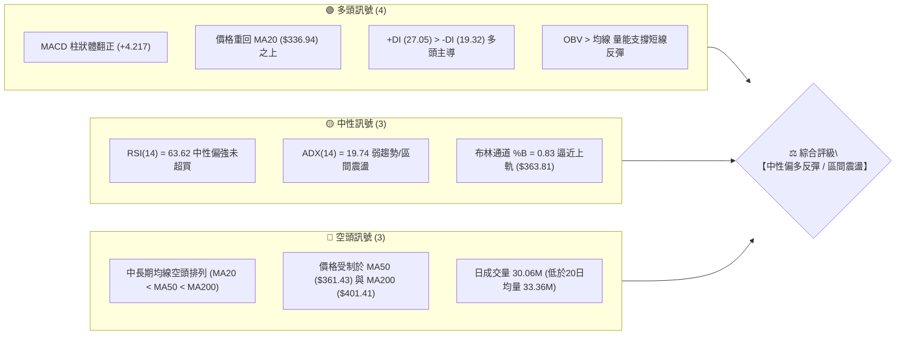

### 📊 核心指標速覽表

| 指標類別 | 指標名稱 | 當前數值 | 訊號 | 技術面解讀 |
|:---|:---|:---|:---:|:---|
| **價格** | 當前收盤價 | $354.81 | 🟡 | 位於52週區間 28.5% 分位，自波段低點 $297.38 反彈中 |
| **均線** | 短期 MA20 | $336.94 | 🟢 | 價格位於 MA20 之上 (+5.30%)，短線多頭反彈確立 |
| **均線** | 中期 MA50 | $361.43 | 🔴 | 價格位於 MA50 之下 (-1.83%)，面臨第一道中期均線反壓 |
| **均線** | 長期 MA200 | $401.41 | 🔴 | 價格顯著低於 MA200 (-11.61%)，長期趨勢結構尚未扭轉 |
| **動能** | RSI(14) | 63.62 | 🟡 | 處於 30–70 中性強勢區，未進入超買，具備向上延伸空間 |
| **動能** | MACD (12,26,9) | -0.512 / -4.729 | 🟢 | MACD 快線即將上穿零軸，柱狀圖 +4.217 呈現強烈看多金叉 |
| **動能** | KD (%K / %D) | 72.73 / 65.05 | 🟢 | KD 指標維持黃金交叉上行，短線多方動能延續 |
| **趨勢** | ADX (14) | 19.74 | 🟡 | ADX < 25，屬於弱趨勢盤整行情，以區間波段震盪為主 |
| **通道** | 布林通道 (20,2) | $310.07 ~ $363.81 | 🟡 | %B = 0.83，價格運行於中軌與上軌之間，即將測試上軌壓力 |
| **波動** | ATR (14) | $11.88 (3.35%) | 🟡 | 日均波動幅度適中，提供合理的止損設置緩衝空間 |
| **量能** | 20日成交量比 | 0.90x (30.06M/33.36M) | 🟡 | 略低於均量，呈現反彈縮量整理，突破需補量配合 |

### 🏆 技術評分卡

```
╔══════════════════════════════════════════════════════════════╗
║             技術評分卡 — TSLA (2026-08-28)                   ║
╠══════════════════════════════════════════════════════════════╣
║ 趨勢強度 (ADX/均線)   ████████░░░░░░░░░░░░  40/100  🔴 偏弱  ║
║ 動能指標 (MACD/RSI)   ██████████████░░░░░░  70/100  🟢 偏強  ║
║ 支撐穩定度 (S1/S2)    ██████████████░░░░░░  70/100  🟢 良好  ║
║ 成交量配合 (OBV/量比) ██████████░░░░░░░░░░  50/100  🟡 中性  ║
║ 形態完整度 (區間反彈) ████████████░░░░░░░░  60/100  🟡 中性  ║
║ 均線排列系統          ████████░░░░░░░░░░░░  40/100  🔴 空頭  ║
╠══════════════════════════════════════════════════════════════╣
║ 綜合技術評分          ███████████░░░░░░░░░  55/100  🟡 中性  ║
║ 核心結論：ADX < 25 定調為【區間震盪反彈行情】，以布林通道為主 ║
╚══════════════════════════════════════════════════════════════╝
```

---

## 2. 趨勢分析

### 🌐 多時框趨勢分析

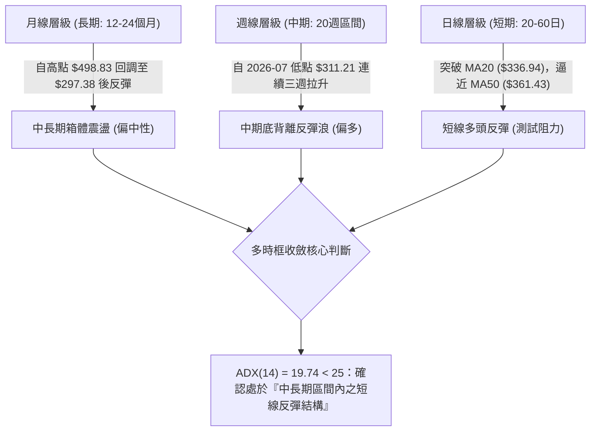

### 📈 長期趨勢 — 12個月走勢圖（Unicode）

```
TSLA 月線走勢圖（2025-08 至 2026-08）
價格軸 ($)
$460 ┤             ● $456.56(10月)     ● $449.72(12月)
$440 ┤         ● $444.72           ● $430.17       ● $430.41               ● $435.79(05月)
$420 ┤                                                                 ● $420.60
$400 ┤                                                 ● $402.51
$380 ┤                                                         ● $381.63
$360 ┤                                                             ● $371.75   ● $354.81 (現價)
$340 ┤ ● $333.87                                                               
$320 ┤                                                                         ● $311.21(07月)
$300 ┤                                                                         ● $297.38(52W低)
     └─┬───────┬───────┬───────┬───────┬───────┬───────┬───────┬───────┬───────┬───────┬───────┬───────
     08月    09月    10月    11月    12月    01月    02月    03月    04月    05月    06月    07月    08月
     (2025)                                                                                          (2026)
```

**12個月走勢特徵分析表格**：

| 階段區間 | 起止月份 | 價格區間 | 累計漲跌 | 趨勢特徵與量價行為 |
|:---|:---|:---|:---:|:---|
| **主升浪推進** | 2025-08 ~ 2025-10 | $333.87 → $456.56 | +36.75% | 放量單邊上攻，創波段歷史次高點 $456.56 |
| **高位箱體震盪** | 2025-11 ~ 2026-01 | $430.17 ~ $449.72 | -5.73% | 在 $430–$450 高位築雙頂結構，動能逐漸遞減 |
| **主跌回調浪** | 2026-02 ~ 2026-04 | $402.51 → $371.75 | -13.62% | 跌破高位箱體下沿，均線系統開始死叉下行 |
| **次高點誘多反抽** | 2026-05 ~ 2026-06 | $381.63 → $435.79 | +14.19% | 反彈觸及斐波那契高位區，但成交量未能創高 |
| **深幅探底回踩** | 2026-07 | $420.60 → $311.21 | -26.01% | 單月重挫，摜破多道均線，探至 52W 低點 $297.38 |
| **築底修復回升** | 2026-08 (當前) | $311.21 → $354.81 | +14.01% | S1 支撐上方啟動超跌反彈，修復日線與週線指標 |

### 📊 中期趨勢（週線分析）

從近 20 週收盤走勢可見，TSLA 經歷了明確的「急跌後底部吞噬反彈」：
1. **7月下旬崩跌**：2026-07-26 當週收在 $313.03（RSI 跌至 15.7 極端超賣，MACD 柱狀體為 -8.365），隨後於 2026-08-02 下探至 $311.21 形成中期底部。
2. **8月份連續三週放量反彈**：收盤價分別為 $328.58（RSI 34.9）→ $342.27（RSI 70.4）→ $362.86（RSI 72.7）→ $354.81（RSI 63.6），MACD 柱狀體迅速由 -8.365 收斂並強勢翻正至 +4.217。
3. **當前技術位置**：價格在經歷 8 月中下旬快速回升後，於 MA50（$361.43）及布林上軌（$363.81）遭遇獲利盤回吐，短線呈現良性回踩整理。

### ⚡ 趨勢強度評估（ADX 解讀）

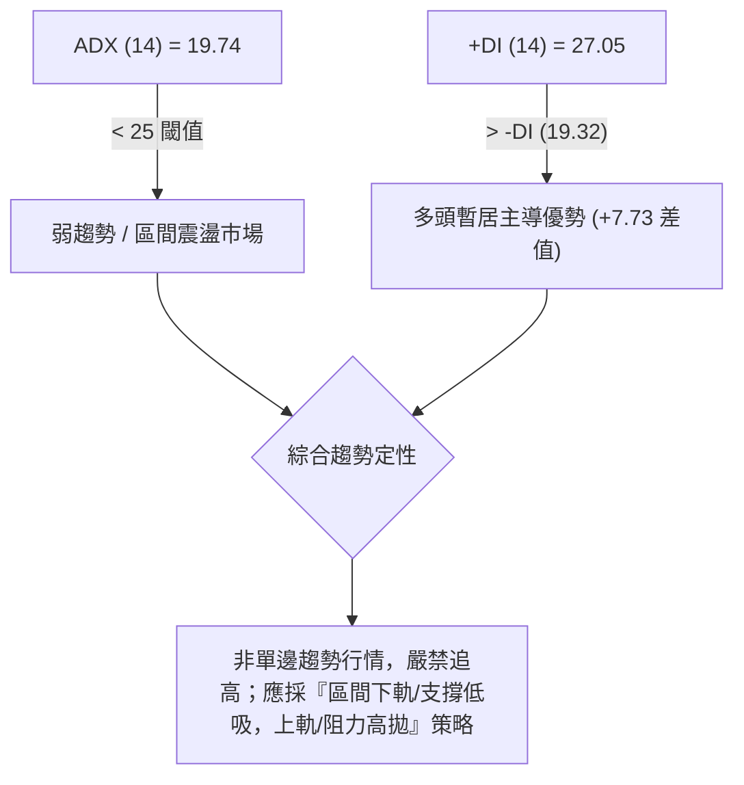

**ADX 趨勢強度對照表**：

| ADX 數值區間 | 當前數值 | 趨勢狀態定義 | 建議操作邏輯 | 本案適用性 |
|:---:|:---:|:---|:---|:---:|
| 0 – 20 | **19.74** | **弱趨勢 / 盤整震盪** | **布林通道高拋低吸、均值回歸策略** | 🟢 **完全符合** |
| 20 – 25 | — | 趨勢醞釀期 | 等待突破關鍵阻力或支撐確立方向 | 🟡 觀望 |
| 25 – 40 | — | 明確單邊趨勢 | 順勢突破加碼，追隨中期均線方向 | 🔴 不適用 |
| 40 – 100 | — | 極強單邊趨勢 | 持股續抱直到動能背離出現 | 🔴 不適用 |

---

## 3. 圖表形態分析

### 🔍 形態識別系統

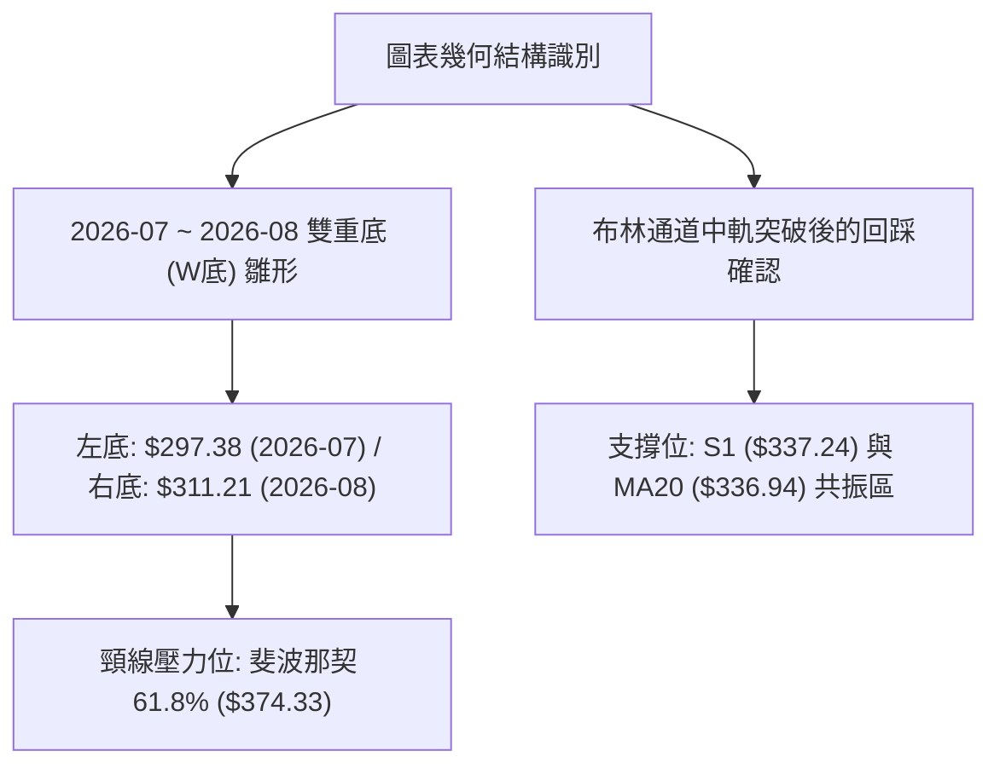

**圖表形態識別與信心度評估表**：

| 形態名稱 | 信心度 | 判斷依據（數據引用） | 形態完成度 | 頸線 / 支撐阻力 | 形態測算目標價（附計算式） |
|:---|:---:|:---|:---:|:---|:---|
| **雙重底 (W-Bottom)** | **65%** | 2026-07-26 低點 $297.38 與 2026-08-02 收盤 $311.21 形成雙底，MACD 柱狀體由 -8.365 大幅翻正至 +4.217 形成動能底背離 | 70% | 頸線位取斐波那契 61.8% **$374.33** | 頸線 $374.33 + 形態高度 ($374.33 - $297.38 = $76.95) = **$451.28**（精確對應 Fib 23.6% **$451.29**） |
| **布林通道中軌突破反轉** | **80%** | 價格帶量站穩布林中軌 MA20 ($336.94)，%B 達到 0.83，短線沿中軌上行 | 85% | 中軌支撐 **$336.94**，上軌阻力 **$363.81** | 布林上軌 **$363.81**，進一步看至阻力位 R1 **$409.28** |
| **頭肩頂形態（大週期）** | **35%** | 數據不足以確認完整右肩，左肩 $456.56、頭部 $498.83，目前右側反彈尚未觸及頭部高度，信心度低於 50% | 30% | 頸線 $297.38 | *訊號不足，不予採用幾何預測，僅做指標型解讀* |

### 🕯️ 重要K線形態分析

| 週期/月份 | 收盤價 | K線形態名稱 | 技術解讀 | 訊號強度 |
|:---|:---:|:---|:---|:---:|
| **2026-07** | $311.21 | **長下影長黑棒** | 單月自 $420.60 暴跌，但最低點 $297.38 處湧現承接買盤，留下影線 | 🟡 空頭力竭 |
| **2026-08-16當週** | $342.27 | **低檔大陽線（破底翻）** | 週線大漲並收復 MA20，RSI 由 34.9 飆升至 70.4，確立短線底部 | 🟢 強烈買訊 |
| **2026-08-23當週** | $362.86 | **衝高遇阻陽十字星** | 上探 MA50 ($361.43) 及布林上軌 ($363.81)，留下上方影線 | 🟡 阻力確認 |
| **2026-08-30當週** | $354.81 | **良性回踩小陰線** | 縮量拉回於 $354.81，守穩在 MA20 ($336.94) 之上，屬於強勢整理 | 🟢 蓄勢整理 |

### 📉 ASCII 走勢形態示意圖

```
TSLA 雙重底 (W底) 構築與關鍵反彈示意圖
價格 ($)
$374.33 ┼───────────────────────── 頸線預期位 (Fib 61.8%)
        │                     /\
$363.81 ┼────────────────────/──\──── 布林上軌 / 近期高點 $362.86
        │                   /    \
$354.81 ┼──────────────────/──────●── 現價 $354.81 (回踩整理中)
        │                 /
$336.94 ┼────────/\──────/──────────── 頸線中樞 / MA20 / S1 ($337.24)
        │       /  \    /
$311.21 ┼──────/────\──/────────────── 右底 (2026-08-02 收盤)
        │     /      \/
$297.38 ┼────/──────────────────────── 左底 (52W Low)
        └───────────────────────────────
             7月下旬     8月上旬    8月中下旬
```

---

## 4. 支撐與阻力

### 🗺️ 關鍵價位分布圖（Unicode）

```
TSLA 價位結構分布圖（數據精確映射）
══════════════════════════════════════════════════════════════════
$498.83 ║██████████████████████████████║ 52週歷史高點 (Fib 0.0%)
$451.29 ║████████████████████████      ║ 斐波那契 23.6% 回調位
$434.60 ║████████████████████████████  ║ 強阻力位 R3 (+22.49%)
$421.88 ║██████████████████████        ║ 斐波那契 38.2% 回調位
$418.36 ║████████████████████          ║ 中期阻力位 R2 (+17.91%)
$409.28 ║████████████████████████      ║ 關鍵阻力位 R1 (+15.35%)
$401.41 ║██████████████████            ║ 長期年線 MA200 反壓
$398.10 ║████████████████              ║ 斐波那契 50.0% 多空中軸
$374.33 ║██████████████                ║ 斐波那契 61.8% 黃金分割阻力
$363.81 ║██████████                    ║ 布林通道上軌壓力
$361.43 ║████████                      ║ 中期均線 MA50 壓力位
$354.81 ╠══════════════════════════════╣ ◄ 當前收盤價 ($354.81)
$340.49 ║▓▓▓▓▓▓▓▓▓▓▓▓                  ║ 斐波那契 78.6% 回調位
$337.24 ║▓▓▓▓▓▓▓▓▓▓▓▓▓▓▓▓▓▓▓▓▓▓        ║ 近期核心支撐位 S1 (-4.95%) / MA20
$310.07 ║▓▓▓▓▓▓▓▓▓▓▓▓▓▓▓▓▓▓            ║ 布林通道下軌支撐
$297.38 ║██████████████████████████████║ 52週歷史底部 / 強支撐 S2 (-16.19%)
══════════════════════════════════════════════════════════════════
```

### 🚧 阻力位分析表

| 阻力級別 | 精確價位 | 距離現價 | 形成原因與技術共振 | 突破難度 | 重要性權重 |
|:---|:---:|:---:|:---|:---:|:---:|
| **波段阻力 R1** | **$409.28** | +15.35% | 近一年波段高點聚類區，且與 MA200 ($401.41) 及 Fib 50.0% ($398.10) 形成密集壓力帶 | 高 | ★★★★★ |
| **強阻力 R2** | **$418.36** | +17.91% | 近一年次高震盪平台下沿，接近 Fib 38.2% ($421.88) | 極高 | ★★★★☆ |
| **極限阻力 R3** | **$434.60** | +22.49% | 2026年5月反彈高點 $435.79 之高點密集群，強大多頭套牢區 | 極高 | ★★★★★ |

### 🛡️ 支撐位分析表

| 支撐級別 | 精確價位 | 距離現價 | 形成原因與技術共振 | 守住機率 | 重要性權重 |
|:---|:---:|:---:|:---|:---:|:---:|
| **核心支撐 S1** | **$337.24** | -4.95% | 近一年波段低點聚類，與短期均線 MA20 ($336.94) 及 Fib 78.6% ($340.49) 形成三重共振支撐 | 75% | ★★★★★ |
| **波段強支撐 S2** | **$297.38** | -16.19% | 52週歷史最低點（2026年7月極端低點），強大多頭防守底線 | 90% | ★★★★★ |

### 📐 斐波那契回調位分析

*以 52 週完整波動區間（最低點 $297.38 至 最高點 $498.83，總波幅 $201.45）進行回調測算*：

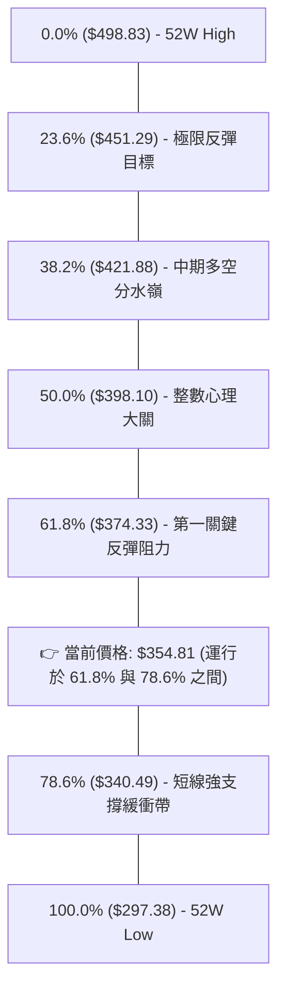

**斐波那契層級深度解讀**：
1. **當前區間定性**：現價 **$354.81** 精確落於 **Fib 78.6% ($340.49)** 與 **Fib 61.8% ($374.33)** 之間。
2. **多方進攻路徑**：若日線能有效帶量突破 Fib 61.8%（**$374.33**），將正式打開向上挑戰 Fib 50.0%（**$398.10**）與阻力位 R1（**$409.28**）的空間。
3. **空方防守底線**：下方 Fib 78.6%（**$340.49**）與 S1（**$337.24**）、MA20（**$336.94**）高度重疊，構成多頭短線回踩的「黃金防禦堡壘」。

---

## 5. 技術指標深度解讀

### 🎛️ 指標訊號總覽

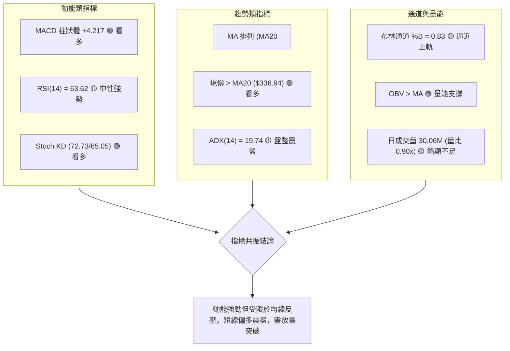

### 📈 移動平均線排列分析

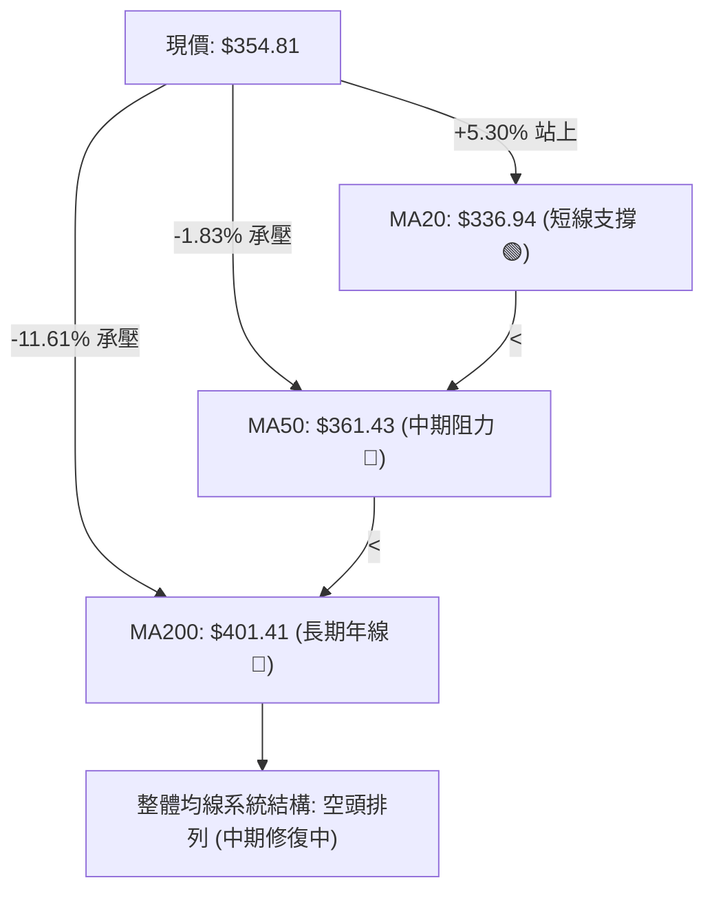

**移動平均線詳細數據解讀**：
- **極短期均線（MA5 $352.54 / MA10 $347.74）**：價格分別在 MA5 之上 +0.64% 與 MA10 之上 +2.03%，短線呈多頭發散，提供即時推升力道。
- **短期生命線（MA20 $336.94）**：價格顯著高於 MA20 (+5.30%)，且 MA20 斜率已向上拐頭，形成下檔強力支撐。
- **中長期阻力帶（MA60 $368.55 / MA120 $381.02 / MA240 $407.66）**：全數呈現由上而下的下行壓制，說明上方解套賣壓沈重，行情難以走出爆發性單邊暴漲，更傾向於階梯式震盪消化。

### 📉 RSI(14) 分析

```
RSI(14) 數值儀表：63.62
0 ────────── 30 ────────────────────── 60 ── 63.62 ── 70 ────────── 100
[  極度超賣區  ] [      中性偏弱區      ]    [▲當前位置] [  極度超買區  ]
進度條：████████████████░░░░░░░░░░  63.62%
```

- **超買超賣狀態**：RSI(14) 數值為 **63.62**，自 7 月底的極度超賣（15.7）強勁回升，目前處於健康的多頭控盤區間（50–70），距離超買閾值（70–80）仍有餘裕，尚未出現動能耗竭。
- **背離判斷**：
  - **底背離確立**：7 月底價格創 52W 新低 $297.38 時 RSI 為 15.7，8 月初價格二次探底 $311.21 時 RSI 抬升至 18.1，形成標準的「動能底背離」，隨後引發本輪 $311 → $362 的大反彈。
  - **頂背離情況**：當前日線未出現頂背離訊號，多方動能運行平穩。

### 📊 MACD(12/26/9) 訊號解讀

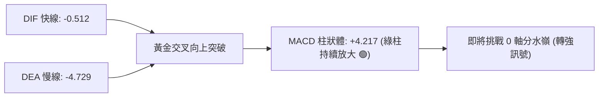

- **數值關係**：DIF (-0.512) 顯著高於 DEA (-4.729)，柱狀體達到 **+4.217**。
- **型態解讀**：MACD 在零軸下方完成低位「黃金交叉」後持續向上發散，且柱狀體連續多日維持在正值高位區，展現強烈的均值回歸動能。一旦快線實體站上 0 軸，將由「超跌反彈」正式升級為「多頭波段行情」。

### 📦 布林通道分析

```
TSLA 布林通道 (20, 2) 結構圖
價格 ($)
$363.81 ┼───────────────────────────────── 布林上軌 (阻力帶)
        │                         * *
$354.81 ┼────────────────────────*─────── 現價 ($354.81, %B = 0.83)
        │                       *
$336.94 ┼──────────────────────*────────── 布林中軌 (MA20 / 核心支撐)
        │                     *
$310.07 ┼────────────────────*──────────── 布林下軌 (波段防守)
        └─────────────────────────────────
```

- **通道帶寬與位置**：通道上軌 **$363.81**，中軌 **$336.94**，下軌 **$310.07**。
- **%B 指標解讀**：%B = **0.83**，顯示價格高度貼近上軌運行。在 ADX < 25 的震盪市況下，當 %B 接近 0.85–1.0 時，常伴隨短線遇阻拉回；中軌 $336.94 將提供極佳的回踩支撐。

### 💹 成交量分析（量價配合度）

- **量能現況**：最新日成交量為 **30,062,000 股**，相較 20 日均量（33,358,505 股）的量比為 **0.90x**，相較 50 日均量（39,741,800 股）略顯萎縮。
- **OBV 能量潮解讀**：OBV 線持續運行於其移動平均線上方（OBV > MA），證實 8 月反彈過程中主力資金並未大規模出逃，底層籌碼沉澱良好，量能結構有效支撐價格維持在 $350 之上。
- **量價背離提示**：近期價格逼近 MA50 時日成交量未見顯著放大（< 33M），呈現「價漲量縮」的微幅背離，意味著在缺乏大額機構買盤推進下，直接放量突破 R1（$409.28）的難度較高，後市需關注補量訊號。

---

## 6. 動能與波動率

### ⚡ 動能評估四象限

| 象限 | 動能維度 | 波動率維度 | 當前狀態 | 策略指導意義 |
|:---:|:---:|:---:|:---:|:---|
| **第一象限 (Q1)** | 強動能 (RSI>60, MACD>0) | 低波動 (ATR% < 3.5%) | **✓ 當前所處位置** | **優質波段機會：動能向上且波動可控，宜順勢拉回佈局** |
| **第二象限 (Q2)** | 弱動能 (RSI<40, MACD<0) | 低波動 (ATR% < 3.5%) | — | 沉悶築底期，觀望為主 |
| **第三象限 (Q3)** | 強動能 (超買/暴漲) | 高波動 (ATR% > 5.0%) | — | 狂熱主升浪，需嚴格追蹤止盈 |
| **第四象限 (Q4)** | 弱動能 (崩跌/破位) | 高波動 (ATR% > 5.0%) | — | 恐慌殺跌期，禁止盲目抄底 |

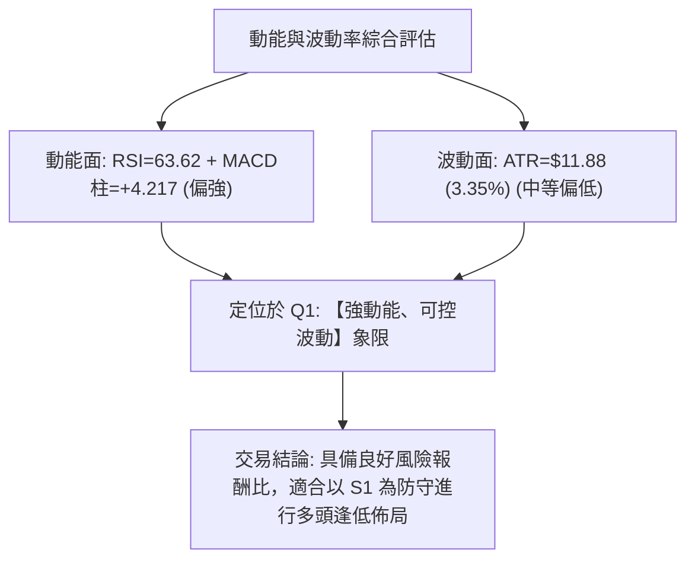

### 📊 ATR 波動率分析

- **ATR(14) 數值**：**$11.88**（佔當前股價之 **3.35%**）。
- **止損距離建議**：
  - *短線當沖/隔夜波段*：建議設置 1.0x ATR = **$11.88** 緩衝空間。
  - *中期波段交易*：建議設置 1.5x ~ 2.0x ATR = **$17.82 ~ $23.76** 止損距離。
- **波動特徵解讀**：相較於 7 月份單日 5%–8% 的劇烈震盪，當前 3.35% 的 ATR 處於過去半年相對溫和區間，有利於降低假突破造成的洗盤風險。

### 📐 Beta 與市場相關性

- **Beta 係數**：**1.827**。
- **市場敏感度**：TSLA 具備典型的高彈性成長股特徵，其波動幅度為標普 500 指數的 1.83 倍。在市場大盤走強或風險偏好回升時，TSLA 向上進攻彈性極大；反之大盤回調時其回撤壓力亦顯著放大，操作上必須嚴控整體倉位暴露。

---

## 7. 多時框架總結

### 📋 時框架評分表

| 時框架 | 趨勢方向 | 動能狀態 | 均線排列 | 圖表形態 | 綜合評分 | 操作指導建議 |
|:---|:---:|:---:|:---:|:---:|:---:|:---|
| **月線 (長期)** | 🟡 震盪整理 | 🟡 中性回升 | 🔴 空頭承壓 | 箱體築底 | **45/100** | 長期仍處於 $297–$498 寬幅區間，不宜重倉長抱 |
| **週線 (中期)** | 🟢 觸底反彈 | 🟢 柱狀體翻正 | 🟡 均線修復 | W底構築中 | **65/100** | 自超賣區翻轉，中期反彈波段確立，逢回做多 |
| **日線 (短期)** | 🟢 多頭推升 | 🟢 MACD金叉 | 🟡 站上MA20 | 逼近布林上軌 | **60/100** | 短線面臨 MA50 阻力，等待回踩 S1 分批低吸 |

### 🔲 綜合訊號矩陣

```
╔══════════════════════════════════════════════════════════════════╗
║                   TSLA 多時框架綜合訊號矩陣                      ║
╠═════════════════╦══════════════╦═════════════════╦═══════════════╣
║     分析維度    ║ 短期 (日線)  ║   中期 (週線)   ║  長期 (月線)  ║
╠═════════════════╬══════════════╬═════════════════╬═══════════════╣
║ 趨勢方向        ║ 🟢 偏多反彈  ║ 🟢 底部反轉     ║ 🟡 寬幅震盪   ║
║ 動能指標        ║ 🟢 MACD強勢  ║ 🟢 柱狀體翻正   ║ 🟡 RSI中性    ║
║ 關鍵支撐確認    ║ 🟢 S1 $337.24║ 🟢 S2 $297.38   ║ 🟢 $297.38    ║
║ 關鍵阻力壓制    ║ 🔴 MA50 $361 ║ 🔴 Fib $374.33  ║ 🔴 R1 $409.28 ║
║ 成交量配合度    ║ 🟡 略低於均量║ 🟢 OBV持續抬升  ║ 🟡 量能平淡   ║
╠═════════════════╩══════════════╩═════════════════╩═══════════════╣
║ 時框收斂一致性：短期反彈動能強勁，中期確立築底，長期受制均線反壓║
╚══════════════════════════════════════════════════════════════════╝
```

### ⚖️ 多時框收斂結論

依據多時框收斂規則（嚴格要求 14）：
1. **行情定性**：當前日線 ADX(14) = **19.74 < 25**，嚴格界定為**【盤整震盪 / 均值回歸行情】**，而非單邊趨勢行情。
2. **主導時框與權重**：在此環境下，日線布林通道（$310.07 ~ $363.81）與近期波段支撐阻力為核心交易依據；週線之底背離反彈為順勢背景。
3. **方向性收斂結論**：**【中性偏多觀望，逢低做多】**。綜合評分為 **55/100**，多頭在短期與中期動能上佔據優勢，但上方受制於 MA50（$361.43）與斐波那契 61.8%（$374.33）阻力，交易策略應採取「回踩關鍵支撐 S1 / MA20 低吸，上探阻力分批止盈」，嚴禁於布林上軌附近追高。

---

## 8. 交易策略建議

### 🗺️ 策略決策流程圖

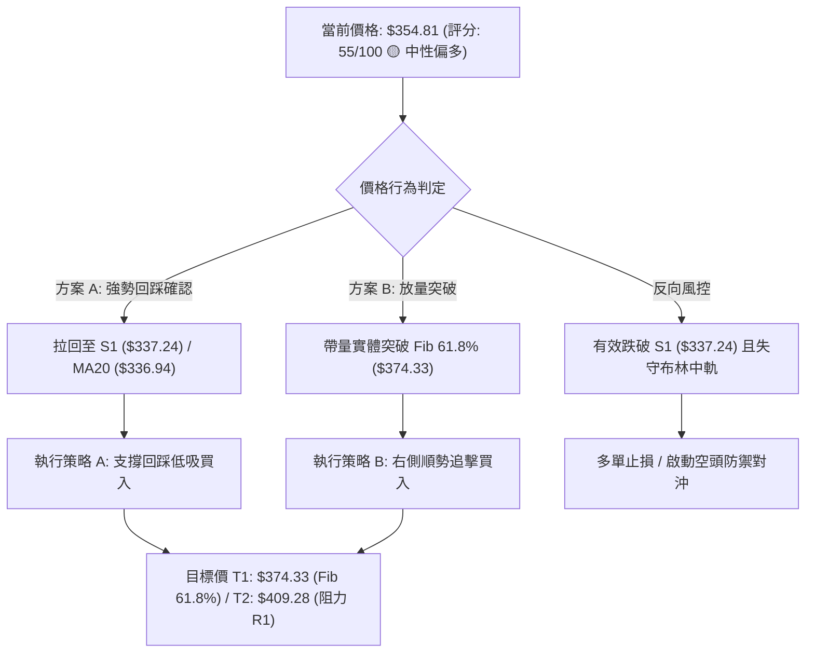

### 🧭 策略路由

> **當前主策略方向 = 【中性偏多區間操作】（依評分卡 55/100 路由定調）**  
> 因評分處於 40–60 區間且 ADX < 25，主推「支撐回踩低吸」與「關鍵阻力突破追擊」之雙軌多頭波段策略；空方訊號僅作為風險觸發與對沖參考。

### 🎯 價格情境階梯（Price Scenarios）

| 觸發條件 | 判定訊號 | 下一目標 | 後續延伸 | 情境含義與技術解讀 |
|:---|:---|:---:|:---:|:---|
| **向上突破** | 日線收盤帶量站上 **$374.33** (Fib 61.8%) | **$398.10** (Fib 50.0%) | **$409.28** (R1) | 多頭全面轉強，W 底形態頸線突破，打開通往 $400 之路 |
| **區間震盪** | 價格維持於 **$337.24** (S1) ~ **$363.81** (布林上軌) | — | — | 均線修復期，動能蓄積，維持布林通道內高拋低吸 |
| **向下破位** | 日線收盤跌破 **$337.24** (S1 / MA20) | **$310.07** (布林下軌) | **$297.38** (S2) | 短線反彈夭折，重新回測 52 週底部尋求二次支撐 |

### 📊 情境機率分佈

| 價格演變情境 | 發生機率 | 主要技術依據 |
|:---|:---:|:---|
| **情境一：震盪蓄勢後向上突破** | **55%** | MACD 柱狀體維持 +4.217 強勢多頭、OBV 持續高於均線、+DI (27.05) > -DI (19.32) 握有主導權 |
| **情境二：布林通道內區間震盪** | **30%** | ADX = 19.74 趨勢強度不足、日成交量 (30.06M) 略低於均量、MA50 ($361.43) 反壓明顯 |
| **情境三：跌破支撐重回探底** | **15%** | 中長期均線仍呈空頭排列 (MA20<MA50<MA200)，若大盤系統性回調引發 High-Beta 拋壓 |

### 🟢 主策略詳情（多頭波段操作）

*所有價位嚴格引用數據庫計算之精確數值*：

| 策略要素 | 策略 A（保守型：支撐回踩低吸） | 策略 B（激進型：右側突破加碼） |
|:---|:---|:---|
| **策略邏輯** | 依託 MA20 與 S1 強支撐共振區佈局 | 突破 Fib 61.8% 頸線後順勢追擊 |
| **進場條件** | 價格回踩 S1 / MA20 獲得支撐且日線收陽 | 帶量突破 $374.33（日成交量 > 35M） |
| **精確進場價** | **$338.50**（S1 $337.24 上方） | **$375.50**（突破 $374.33 確認） |
| **目標價 T1** | **$374.33**（Fib 61.8% 阻力，預期收益 +10.58%） | **$409.28**（阻力位 R1，預期收益 +8.99%） |
| **目標價 T2** | **$409.28**（阻力位 R1，預期收益 +20.91%） | **$421.88**（Fib 38.2% 阻力，預期收益 +12.35%） |
| **精確止損價** | **$325.36**（S1 下方 1.0x ATR: $337.24 - $11.88） | **$362.45**（突破點下方 1.1x ATR: $375.50 - $13.05） |
| **風險報酬比** | **1 : 2.72**（以 T1 計算）/ **1 : 5.39**（以 T2 計算） | **1 : 2.59**（以 T1 計算）/ **1 : 3.55**（以 T2 計算） |
| **勝率預估** | **65%** | **55%** |
| **建議倉位** | **15% ~ 20%** | **10% ~ 15%** |

### 🔴 反向風險觸發點（對沖與風控提示）

若出現以下訊號，宣告多頭反彈結構失敗，應立即執行多單止損或佈局空頭避險：
1. **破位觸發價**：日線收盤價跌破 **$337.24 (S1)** 且無法於 2 日內收復。
2. **指標惡化訊號**：MACD 柱狀體由正翻負（< 0），且 RSI(14) 跌破 50 中軸。
3. **下行防守目標**：一旦跌破 S1，股價將迅速下探布林下軌 **$310.07**，極限考驗 52W 低點 **$297.38 (S2)**。

### ⭐ 整體訊號強度評星

```
做多訊號強度：★★★★☆  (3.8/5星 - 動能充沛、支撐明確，惟受制均線)
做空訊號強度：★★☆☆☆  (1.8/5星 - 缺乏空頭頂背離，下檔支撐強勁)
整體分析可信度：★★★★☆  (4.2/5星 - 量價指標高度共振，價位聚類清晰)
```

---

## 9. 風險提示與監控

### ✅ 關鍵監控指標 Checklist

```
╔══════════════════════════════════════════════════════════════╗
║                 TSLA 交易風控與監控清單                      ║
╠══════════════════════════════════════════════════════════════╣
║ [ ] 價格是否守穩短期生命線 MA20 ($336.94)                    ║
║ [ ] RSI(14) 是否維持在 50–70 強勢區間，未見頂背離            ║
║ [ ] MACD 柱狀體是否持續大於 0 (當前 +4.217)                  ║
║ [ ] 日成交量是否能放大至 20日均量 (33.36M) 以上              ║
║ [ ] 向上測試時能否有效突破 Fib 61.8% ($374.33)               ║
║ [ ] 下方核心支撐 S1 ($337.24) 是否完好無損                   ║
║ [ ] 大盤波動 (Beta 1.827 敏感度) 是否引發市場系統性拋售      ║
╚══════════════════════════════════════════════════════════════╝
```

### ⚠️ 風險場景分析

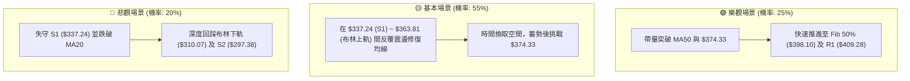

### 🛡️ 風險管理重要提醒

1. **嚴格執行 ATR 動態止損**：鑑於 TSLA 當前 ATR 為 **$11.88**，日內雜訊波動較大，切忌將止損設定過窄（< 1.0x ATR）；策略 A 之止損應堅定設於 **$325.36**，嚴防主力假跌破誘空。
2. **倉位配置與槓桿控制**：TSLA Beta 高達 **1.827**，且本益比（Trailing P/E: 322.55）處於高估值區間，整體持倉部位不建議超過投資組合總資金之 **20%**，並嚴禁在 ADX < 25 的盤整市況中使用高倍槓桿追價。
3. **分析師目標價指引**：華爾街 39 位分析師綜合評級為 **Buy**，平均目標價為 **$390.09**（介於 Fib 61.8% $374.33 與 Fib 50.0% $398.10 之間），最高目標價 $600.00，最低目標價 $125.00。分析師共識目標價 $390.09 與本報告之波段目標高度吻合，強化了中線向上修復的技術面邏輯。

---

## 📋 報告總結

```
╔══════════════════════════════════════════════════════════════════╗
║                    TSLA 技術分析報告總結                         ║
╠══════════════════════════════════════════════════════════════════╣
║ 報告日期：2026-08-28                                            ║
║ 當前收盤：$354.81 (位於52週區間 28.5% 分位)                      ║
║ 技術評級：🟡 55/100 【中性偏多反彈 / 區間震盪蓄勢】              ║
╠══════════════════════════════════════════════════════════════════╣
║ 關鍵技術維度結論：                                               ║
║ ├─ 長期趨勢：🟡 寬幅箱體震盪 ($297.38 ~ $498.83)                 ║
║ ├─ 中期趨勢：🟢 底部 W 底形態初成，MACD 柱狀體翻正 (+4.217)     ║
║ ├─ 短期趨勢：🟢 站上 MA20 ($336.94)，逼近布林上軌與 MA50 阻力   ║
║ ├─ 核心支撐：S1 $337.24 (近期波段低點) / S2 $297.38 (52W Low)    ║
║ ├─ 核心阻力：Fib 61.8% $374.33 / R1 $409.28 (年線/波段高點共振) ║
║ └─ 共識目標：分析師平均目標價 $390.09 (隱含 +9.94% 上行空間)     ║
╠══════════════════════════════════════════════════════════════════╣
║ 最優交易策略組合：                                               ║
║ 1. 🥇 最佳機會（策略 A）：回踩 S1 支撐區 $338.50 分批低吸做多，  ║
║    目標 T1 $374.33 / T2 $409.28，止損 $325.36，風報比 1:2.72。   ║
║ 2. 🥈 次選機會（策略 B）：放量突破 Fib 61.8% ($374.33) 順勢追多， ║
║    目標 $409.28 / $421.88，止損 $362.45，風報比 1:2.59。        ║
║ 3. 🥉 防守機制：日線收盤跌破 S1 ($337.24) 無條件停損離場觀望。   ║
╚══════════════════════════════════════════════════════════════════╝
```

---

> ⚠️ **免責聲明**：本報告為技術分析研究成果，所有引據數據、圖表形態與價位測算均基於歷史市場交易資訊。本報告**僅供學術研究與投資參考**，**不構成任何形式的個別投資諮詢或買賣邀約**。金融市場瞬息萬變，投資人應獨立評估風險，自負盈虧。

---

*報告生成時間：2026-08-28 ｜ 數據來源：Yahoo Finance ｜ 分析框架：多時框架量化技術分析系統*