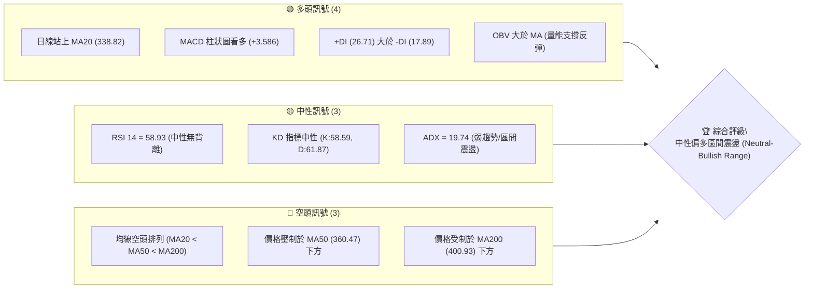
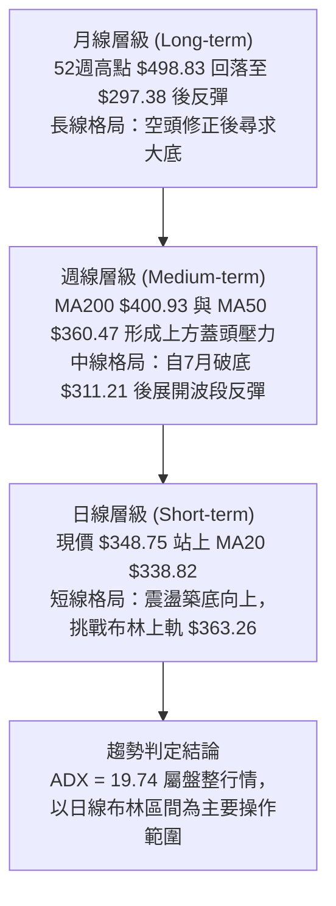
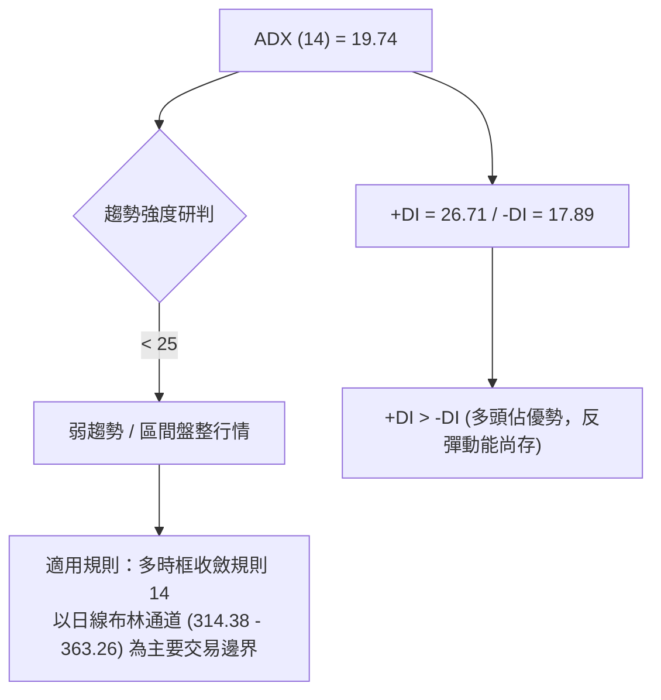
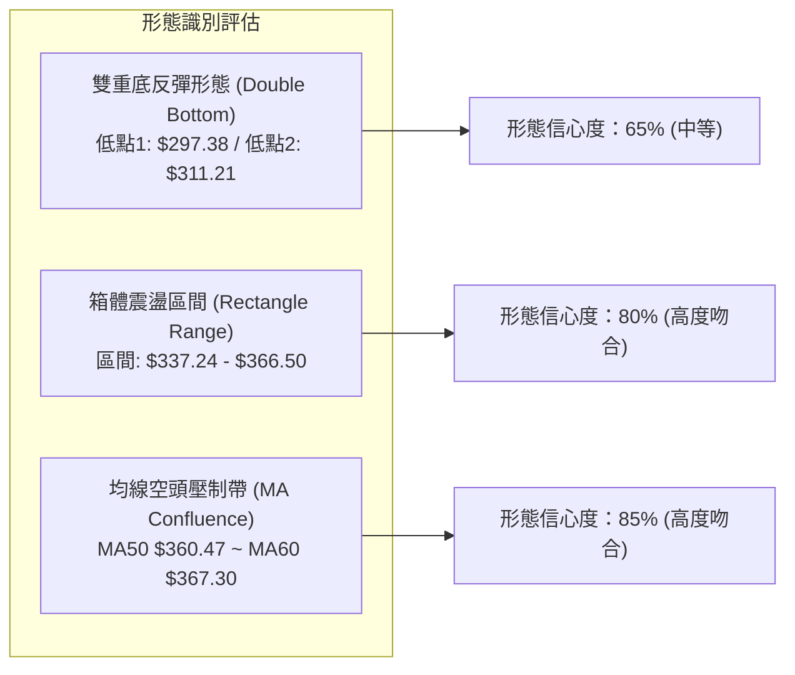
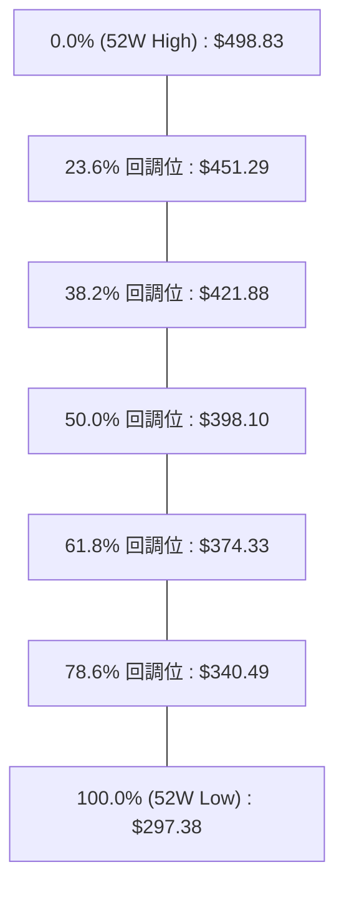
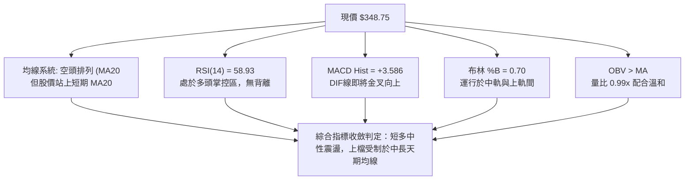
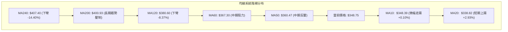
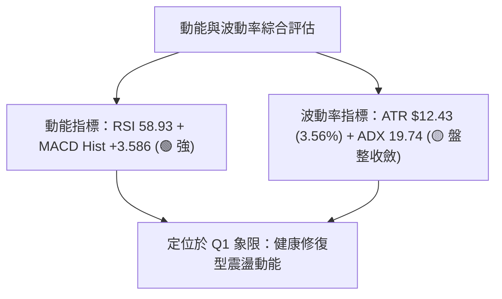
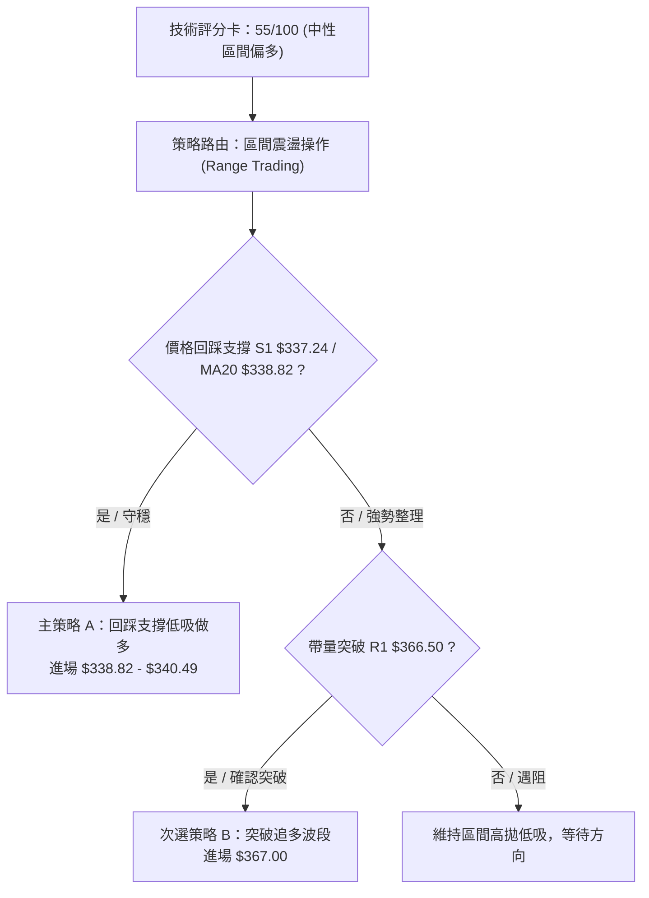
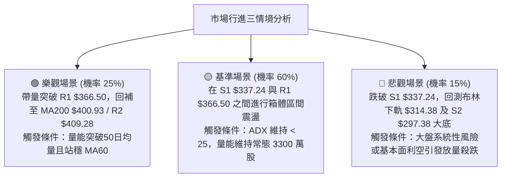

# TSLA 技術分析報告

> **報告日期**：2026-08-29 ｜ **語言**：繁體中文 ｜ **數據來源**：Yahoo Finance ｜ **當前價格**：$348.75

---

## 目錄

| 章節 | 內容 |
|------|------|
| [1. 技術面概覽](#1-技術面概覽) | 訊號儀表板、核心指標、評分卡 |
| [2. 趨勢分析](#2-趨勢分析) | 多時框趨勢、長中短期走勢 |
| [3. 圖表形態分析](#3-圖表形態分析) | 形態識別、K線組合、目標價 |
| [4. 支撐與阻力](#4-支撐與阻力) | 關鍵價位、斐波那契回調 |
| [5. 技術指標深度解讀](#5-技術指標深度解讀) | MA/RSI/MACD/布林/成交量 |
| [6. 動能與波動率](#6-動能與波動率) | 動能評估、ATR、Beta |
| [7. 多時框架總結](#7-多時框架總結) | 時框架評分矩陣 |
| [8. 交易策略建議](#8-交易策略建議) | 多空策略、風險報酬比 |
| [9. 風險提示與監控](#9-風險提示與監控) | 監控指標、風險場景 |

---

## 1. 技術面概覽

### 🎯 技術訊號儀表板



### 📊 核心指標速覽表

| 指標類別 | 指標名稱 | 當前數值 | 訊號 | 解讀 |
|----------|----------|----------|------|------|
| **價格** | 當前價格 | $348.75 | 🟡 中性 | 處於52週區間 25.5% 分位，處於中低檔回升段 |
| **短期均線** | MA20 | $338.82 | 🟢 看多 | 現價位於 MA20 上方（+2.93%），短線底部確立 |
| **中期均線** | MA50 | $360.47 | 🔴 看空 | 現價位於 MA50 下方（-3.25%），中期仍受上方均線反壓 |
| **長期均線** | MA200 | $400.93 | 🔴 看空 | 現價位於 MA200 下方（-13.01%），長期處於修復階段 |
| **動能震盪** | RSI(14) | 58.93 | 🟡 中性 | 動能位於 50 軸上方，無超買超賣，短多續航中 |
| **趨勢動能** | MACD | -0.247 / +3.586 | 🟢 看多 | DIF 線即將穿越零軸，柱狀圖持續擴張為正 |
| **趨勢強度** | ADX(14) | 19.74 | 🟡 中性 | ADX < 25 表明處於無明確單邊趨勢的盤整震盪市 |
| **波動風險** | ATR(14) | $12.43 | 🟡 中性 | ATR 佔股價 3.56%，每日波動適中，提供操作空間 |
| **量能趨勢** | OBV | OBV > MA | 🟢 看多 | 能量潮高於均線，量價配合健康，支撐反彈走勢 |

### 🏆 技術評分卡

```
╔══════════════════════════════════════════════════════════════╗
║              技術評分卡 — TSLA (2026-08-29)                  ║
╠══════════════════════════════════════════════════════════════╣
║ 趨勢強度      ████████░░░░░░░░░░░░  40/100  🟡 中性偏弱      ║
║ 動能指標      ██████████████░░░░░░  70/100  🟢 短線偏多      ║
║ 支撐穩定度    ██████████████░░░░░░  70/100  🟢 S1支撐強固    ║
║ 成交量配合    ████████████░░░░░░░░  60/100  🟢 量能回升      ║
║ 形態完整度    ██████████░░░░░░░░░░  50/100  🟡 區間震盪底    ║
║ 均線排列      ██████░░░░░░░░░░░░░░  30/100  🔴 空頭排列      ║
╠══════════════════════════════════════════════════════════════╣
║ 綜合評分      ███████████░░░░░░░░░  55/100  🟡 中性區間震盪  ║
╚══════════════════════════════════════════════════════════════╝
```

---

## 2. 趨勢分析

### 🌐 多時框趨勢分析



### 📈 長期趨勢 — 12個月走勢圖（Unicode）

```
TSLA 月線走勢圖（過去12個月：2025-08 至 2026-08）
價格軸 ($)
$456.56 ┤             ●(10月高點:456.56)
$444.72 ┤       ●     │     ●(12月:449.72)
$430.17 ┤       │  ●──┘  ●  │
$420.60 ┤       │  │     │  │  ●(1月:430.41)      ●(5月:435.79)
$402.51 ┤       │  │     │  │  │  ●(2月:402.51)   │  ●(6月:420.60)
$371.75 ┤       │  │     │  │  │  │  ●(3月:371.75)│  │
$348.75 ┤ ●     │  │     │  │  │  │  │  ●(4月)    │  │        ●←現價 $348.75
$311.21 ┤ │     │  │     │  │  │  │  │  │        │  │  ●(7月低點:311.21)
        └─┴─────┴──┴─────┴──┴──┴──┴──┴────────┴──┴──┴────────────
        08'25  09 10    11 12 01'26 02 03 04    05 06 07    08'26 (當前)
```

#### 走勢特徵分析表格

| 階段區間 | 起訖月份 | 價格區間 ($) | 漲跌幅 | 走勢特徵與技術意義 |
|----------|----------|--------------|--------|--------------------|
| **波段攻頂** | 2025-08 → 2025-10 | 333.87 → 456.56 | +36.75% | 量能放大，突破400美元整數關卡，創波段頂部 |
| **高檔盤整** | 2025-11 → 2026-01 | 430.17 → 430.41 | +0.06% | 430-456 美元區間構築高檔雙頂，多頭動能衰竭 |
| **震盪回落** | 2026-02 → 2026-04 | 402.51 → 381.63 | -5.19% | 跌破400美元關鍵心理關卡，均線系統開始下彎 |
| **次高反彈** | 2026-05 → 2026-06 | 435.79 → 420.60 | -3.49% | 5月大幅反彈至435.79形成右肩，隨後量能萎縮回落 |
| **快速殺跌** | 2026-07 | 311.21 | -26.01% | 單月重挫，摜破多道均線，探尋52週低點 $297.38 支撐 |
| **底部分打** | 2026-08 | 348.75 | +12.06% | 自7月低位展開V型修復，站回 MA20，短期築底確立 |

### 📊 中期趨勢（週線分析）

中期走勢自 2026 年 7 月下旬打出低點（2026-07-26 收盤 $313.03，隨後最低觸及 52W 低點 $297.38 區域）後，週線呈現 4 週連續反彈。RSI 自超賣區（15.7）強勁回升至 58.9，週 MACD 柱狀圖由 -8.365 翻正至 +3.586，顯示空頭下殺動能已告竭，目前進入中期反彈修復波。

```
TSLA 中期週線支撐阻力結構
  $409.28 ────── R2 中期關鍵阻力 (前波密集套牢區 / 逼近MA200 $400.93)
     ▲
     │    [反彈延伸挑戰區]
     ▼
  $366.50 ────── R1 短期阻力 (近期波段高點聚類 / 斐波 61.8% $374.33 附近)
     ▲
     │    [現價震盪區間: $348.75]
     ▼
  $337.24 ────── S1 關鍵支撐 (MA20 $338.82 / 斐波 78.6% $340.49 重合帶)
     ▲
     │    [下檔強防守區]
     ▼
  $297.38 ────── S2 長期強支撐 (52週低點 / 底部防線)
```

### ⚡ 趨勢強度評估（ADX 解讀）



| ADX 數值區間 | 當前數值 | 趨勢性質 | 交易策略指導方針 |
|--------------|----------|----------|------------------|
| 0 – 20       | **19.74** | **極弱趨勢 / 盤整震盪** | **避免順勢突破追價，嚴格採取高拋低吸之區間震盪策略** |
| 20 – 25      | -        | 趨勢萌芽 / 方向未明 | 觀察布林通道上下軌突破訊號 |
| 25 – 50      | -        | 強趨勢行情 | 依均線方向順勢單邊操作 |
| 50 – 100     | -        | 極強趨勢 / 即將反轉 | 順勢持有並隨時收緊移動止損 |

---

## 3. 圖表形態分析

### 🔍 形態識別系統



#### 形態識別與信心度評估表

| 形態名稱 | 信心度 | 判斷依據（引用數據） | 完成度 | 目標價（附計算式） |
|----------|--------|----------------------|--------|--------------------|
| **雙重底反彈** | 65% | 7月波段探低 $297.38 (52W Low) 及 8月初次低 $311.21，隨後突破 S1 $337.24 | 75% | 頸線 R1 $366.50 - 底部低點 S2 $297.38 = 高度 $69.12。<br/>突破目標價 = 頸線 $366.50 + $69.12 = **$435.62**（接近前高 $435.79） |
| **矩形震盪箱體** | 80% | ADX=19.74，價格受限於支撐 S1 $337.24 與阻力 R1 $366.50 之間波動 | 90% | 箱體上軌目標 = **$366.50**；<br/>箱體下軌回測 = **$337.24** |
| **均線壓制反轉** | 70% | MA20 < MA50 < MA200 空頭排列，反彈逼近 MA50 $360.47 與 MA60 $367.30 | 60% | 受阻回落目標 = MA20 **$338.82** / S1 **$337.24** |

### 🕯️ 重要K線形態分析

| 日期 / 月份 | 收盤價 ($) | K線形態特徵 | 技術解讀 | 訊號 |
|-------------|------------|-------------|----------|------|
| **2026-07-26** | 313.03 | 長黑摜破大陰線 | 恐慌拋盤湧現，週 RSI 跌至極端超賣 15.7，空頭力道竭盡 | 🔴 極空 |
| **2026-08-02** | 311.21 | 下影線錘頭星線 (Hammer) | 探底 $297.38 後強勁拉回，形成潛在波段底部低點 | 🟢 看多反轉 |
| **2026-08-16** | 342.27 | 中長紅實體吞噬線 | 連續兩週收紅，跳空站回 MA20，確立反彈趨勢 | 🟢 強烈看多 |
| **2026-08-23** | 362.86 | 帶長上影線小陽線 | 觸及布林上軌及 R1 $366.50 遭遇阻力，多頭短線滯漲 | 🟡 滯漲訊號 |
| **2026-08-30** | 348.75 | 窄幅震盪十字星 | 回踩 MA20 上方進行蓄勢整理，量能萎縮至 1.6 億股 | 🟡 中性整理 |

### 📉 ASCII 走勢形態示意圖

```
TSLA 短中期雙底與箱體形態示意圖
$366.50 ───────────────┬──────────────────────── R1 阻力 / 箱體上軌 (頸線)
                       │          /\
                       │         /  \  現價 $348.75
$338.82 ───────────────┼────────/────\───●────── MA20 / 箱體中軸 (S1: $337.24)
                       │  /\   /      \ /
                       │ /  \ /        V
$311.21 ───────────────┼/    V (次低點 8月: $311.21)
                       │
$297.38 ───────────────┴ (初次低點 7月: $297.38 - S2)
                       ├────────────────────────
                         雙底打底區 (Double Bottom)
```

### 🎯 形態目標價計算

1. **雙底破頸線量度目標**：
   - 形態底部低點：$297.38
   - 形態頸線位置（R1）：$366.50
   - 形態垂直高度：$366.50 - $297.38 = $69.12
   - **量度擴展目標價**：$366.50 + $69.12 = **$435.62**（此數值與 2026 年 5 月高點 $435.79 完美重合，若確認帶量突破 R1 則中期開啟此空間）。
2. **短期箱體震盪目標**：
   - 上軌阻力目標：**$366.50**（R1，距現價 +5.09%）
   - 下軌支撐回測：**$337.24**（S1，距現價 -3.30%）

---

## 4. 支撐與阻力

### 🗺️ 關鍵價位分布圖（Unicode）

```
TSLA 價位結構分布圖
══════════════════════════════════════════════════════════════════
$498.83 ║██████████████████████████████║ 52週歷史高點 (52W High / 0.0%)
$451.29 ║██████████████████████        ║ 斐波那契 23.6% 回調位
$418.36 ║██████████████████████████████║ 強阻力 R3 (+19.96%)
$409.28 ║████████████████████          ║ 阻力 R2 (+17.36%) / 逼近 MA200 $400.93
$398.10 ║██████████████████            ║ 斐波那契 50.0% 關鍵平衡位
$374.33 ║██████████████                ║ 斐波那契 61.8% 黃金分割回調位
$366.50 ║██████████████████████████████║ 關鍵阻力 R1 (+5.09%) / MA60 $367.30
$348.75 ╠══════════════════════════════╣ ◄ 當前市價 (Current Price)
$340.49 ║▓▓▓▓▓▓▓▓▓▓▓▓▓▓▓▓              ║ 斐波那契 78.6% 回調位
$337.24 ║▓▓▓▓▓▓▓▓▓▓▓▓▓▓▓▓▓▓▓▓▓▓▓▓▓▓▓▓  ║ 近期關鍵支撐 S1 (-3.30%) / MA20 $338.82
$314.38 ║▓▓▓▓▓▓▓▓▓▓                    ║ 布林通道下軌
$297.38 ║██████████████████████████████║ 強支撐 S2 (-14.73%) / 52週低點 (100.0%)
══════════════════════════════════════════════════════════════════
```

### 🚧 阻力位分析表

| 阻力級別 | 價位 ($) | 距離現價 | 形成原因與籌碼結構 | 突破難度 | 重要性 |
|----------|----------|----------|--------------------|----------|--------|
| **R1** | **$366.50** | +5.09% | 近一年波段高點聚類、MA60 ($367.30) 與布林上軌 ($363.26) 密集壓制區 | 🟡 中等 | 🟢🟢🟢 極高 (短線多空分水嶺) |
| **R2** | **$409.28** | +17.36% | 長期均線 MA200 ($400.93) 壓制帶、斐波 50% ($398.10) 上方套牢密集成交區 | 🔴 困難 | 🟢🟢🟢 極高 (牛熊轉換樞紐) |
| **R3** | **$418.36** | +19.96% | 斐波那契 38.2% ($421.88) 下緣、2026年6月起跌點前密集套牢區 | 🔴 極難 | 🟢🟢 中等 (波段目標上限) |

### 🛡️ 支撐位分析表

| 支撐級別 | 價位 ($) | 距離現價 | 形成原因與防守邏輯 | 守住機率 | 重要性 |
|----------|----------|----------|--------------------|----------|--------|
| **S1** | **$337.24** | -3.30% | 近一年波段低點聚類、MA20 ($338.82) 均線支撐、斐波 78.6% ($340.49) | 75% | 🟢🟢🟢 極高 (短線多頭防線) |
| **S2** | **$297.38** | -14.73% | 52週最低點 (100.0% 回調位)、中期大底底部水平防線 | 90% | 🟢🟢🟢 極高 (長線生死分界點) |

### 📐 斐波那契回調位分析

本波段依據 52 週完整區間 **$297.38 (低點) → $498.83 (高點)** 進行黃金分割回調測算：



- **當前位置解讀**：現價 **$348.75** 精確座落於 **78.6% ($340.49)** 與 **61.8% ($374.33)** 兩次回調位之間。
- **技術意義**：
  - 下方 **78.6% ($340.49)** 與 S1 支撐位 **$337.24** 及 MA20 **$338.82** 構成強固的「共振支撐帶」，提供極佳的安全墊。
  - 上方 **61.8% ($374.33)** 則是黃金分割最關鍵的反壓關卡，與 R1 **$366.50** 構成反彈的第一道重壓阻力帶。一旦有效收復 $374.33，回調結構將由弱轉強，邁向 50.0% **$398.10**。

---

## 5. 技術指標深度解讀

### 🎛️ 指標訊號總覽



### 📈 移動平均線排列分析



| 均線名稱 | 數值 ($) | 與現價偏離度 | 走勢方向 | 技術解讀 |
|----------|----------|--------------|----------|----------|
| **MA5** | $349.72 | -0.28% | ▼ 走平微跌 | 極短線面臨微幅震盪整理 |
| **MA10** | $348.39 | +0.10% | ▲ 上揚 | 短線下檔具備貼身支撐 |
| **MA20** | $338.82 | +2.93% | ▲ 強勁上揚 | 短期生命線，已形成堅實支撐 (S1 $337.24) |
| **MA50** | $360.47 | -3.25% | ▼ 下彎 | 中期反壓，阻礙波段直接向上展開 |
| **MA60** | $367.30 | -5.05% | ▼ 下彎 | 與 R1 ($366.50) 形成強阻力共振 |
| **MA120** | $380.60 | -8.37% | ▼ 下彎 | 半年線持續下行壓制 |
| **MA200** | $400.93 | -13.01% | ▼ 下彎 | 牛熊分界線，長期空頭排列未變 |
| **MA240** | $407.40 | -14.40% | ▼ 下彎 | 年線位置，接近 R2 ($409.28) |

### 📉 RSI(14) 分析

- **當前數值**：**58.93**
- **強度進度條**：`████████████░░░░░░░░ 58.93%` 🟡 中性偏多

```
  0        30 (超賣)            50 (中軸)      70 (超買)      100
  ├────────┼────────────────────┼────────●─────┼──────────────┤
                                         58.93 (多頭掌控區)
```

- **背離判斷**：數據確認「**無明顯背離**」。股價自 7 月底 $311.21 低點回升時，週線 RSI 由 15.7 快速同步修復至 58.93，動能指標與價格走勢同步走高，不存在指標衰竭之頂背離或底背離。

### 📊 MACD(12/26/9) 訊號解讀


- **指標解讀**：DIF (-0.247) 顯著高於 Signal (-3.833)，柱狀圖維持 **+3.586** 的看多狀態。週線層級 MACD 柱狀圖亦由 2026-07-26 的 -8.365 連續翻正至 +3.586，確認中短期多頭動能正在加速聚集，具備挑戰上方均線的動能基礎。

### 📦 布林通道分析

```
TSLA 日線布林通道結構 (BB 20, 2)
  $363.26 ────────────────────────────── 上軌 (Upper Band)
                     ▲
                     │   現價 $348.75 (%B = 0.70)
  $338.82 ───────────●────────────────── 中軌 (MA20 / Middle Band)
                     │
                     ▼
  $314.38 ────────────────────────────── 下軌 (Lower Band)
```

- **布林參數**：上軌 **$363.26** ｜ 中軌 **$338.82** ｜ 下軌 **$314.38** ｜ 帶寬 = $48.88
- **%B 指標**：**0.70**（股價位於中軌與上軌之間 70% 位置，處於強勢震盪向上通道）
- **通道狀態**：通道呈現開口微幅擴張，現價受到中軌 MA20 ($338.82) 向上支撐，目標往上軌 **$363.26** 與阻力 R1 **$366.50** 靠攏。

### 💹 成交量分析（量價配合度）

- **最新成交量**：32,818,355 股
- **20日均量**：33,171,603 股（量比：**0.99x**，量價持平）
- **50日均量**：39,528,965 股
- **OBV 能量潮**：**OBV > MA**，量能健康支撐上漲。
- **量價關係解讀**：7 月破底殺跌時週成交量高達 2.75 億股釋放恐慌盤，隨後 8 月縮量反彈至 1.6 億股，配合 OBV 維持在均線之上，說明現階段籌碼鎖定良好，並無高檔出貨跡象，短線回踩量縮屬於健康洗盤。

---

## 6. 動能與波動率

### ⚡ 動能評估四象限

| 象限 | 動能強度 (RSI/MACD) | 波動率水準 (ATR/Beta) | TSLA 當前狀態 | 評估與策略指引 |
|------|----------------------|-----------------------|---------------|----------------|
| **Q1** | 強 (MACD看多, RSI>50) | 低 (ATR縮減, 震盪築底) | 🎯 **當前座落位置** | **最佳波段低吸機會：下檔風險受控，動能蓄勢向上** |
| **Q2** | 弱 (MACD看空, RSI<50) | 低 (波動壓縮) | - | 謹慎觀望，等待動能方向確立 |
| **Q3** | 強 (單邊噴發) | 高 (歷史高波動) | - | 高風險高收益，需嚴設移動止盈 |
| **Q4** | 弱 (破位殺跌) | 高 (恐慌拋售) | - | 避免進場，如 2026 年 7 月殺跌期 |



### 📊 ATR 波動率分析

- **當前 ATR(14)**：**$12.43**（佔股價比率 **3.56%**）
- **波動特性**：目前每日平均真實波幅約 12.43 美元，相較於 7 月極端波動期已大幅降溫收斂。
- **止損與風控設置建議**：
  - **短線交易止損距離**：建議設定 1.0x ATR = **$12.43**。以現價 $348.75 扣除 1.0x ATR 約為 **$336.32**（與關鍵支撐 S1 **$337.24** 極度吻合）。
  - **波段交易止損距離**：建議設定 1.5x ATR = **$18.65**，對應止損位約 **$330.10**。

### 📐 Beta 與市場相關性

- **Beta 係數**：**1.827**
- **市場特徵解讀**：TSLA 具備極高的高彈性屬性，其波動幅度為 S&P 500 大盤的 1.83 倍。在市場情緒回暖時具備強大的向上槓桿效應，但在盤整環境下亦容易出現較寬幅的日內震盪洗盤，倉位配置上應適度控制，不宜重倉單邊押注。

---

## 7. 多時框架總結

### 📋 時框架評分表

| 時框架 | 趨勢方向 | 動能指標 | 均線排列 | 形態結構 | 綜合評分 | 操作建議 |
|--------|----------|----------|----------|----------|----------|----------|
| **月線 (長期)** | 🔴 下行修復 | 🟡 中性回升 | 🔴 空頭排列 | 高檔雙頂跌破後尋底 | **45/100** | 長線定期定額或耐心等待大底確立 |
| **週線 (中期)** | 🟡 止跌反彈 | 🟢 柱狀翻正 | 🔴 MA50/200 蓋頭 | 雙底頸線挑戰中 | **60/100** | 波段操作，於 S1 附近逢低佈局 |
| **日線 (短期)** | 🟢 震盪走高 | 🟢 RSI 58.93 / +DI | 🟡 站上 MA20 | 布林中上軌強勢震盪 | **65/100** | 區間操作，回踩支撐做多，上軌減碼 |

### 🔲 綜合訊號矩陣

```
時框訊號收斂矩陣
┌───────────┬──────────────┬──────────────┬──────────────┐
│  分析維度 │  短期 (日線) │  中期 (週線) │  長期 (月線) │
├───────────┼──────────────┼──────────────┼──────────────┤
│ 均線系統  │  🟢 站上MA20 │  🔴 承壓MA50 │  🔴 承壓MA200│
│ 動能 (RSI)│  🟢 58.93    │  🟢 58.90    │  🟡 50附近   │
│ MACD 狀態 │  🟢 柱狀擴張 │  🟢 柱狀翻正 │  🔴 零軸下方 │
│ 量能結構  │  🟢 OBV>MA   │  🟡 縮量反彈 │  🟡 中性量能 │
│ 波動 (ADX)│  🟡 19.74    │  🟡 弱趨勢   │  🔴 空頭慣性 │
└───────────┴──────────────┴──────────────┴──────────────┘
```

### ⚖️ 多時框收斂結論

依據【嚴格要求 14】多時框收斂規則進行收斂判斷：
1. **當前趨勢性質判定**：ADX(14) 數值為 **19.74 (< 25)**，明確定義當前市場處於「**無單邊強趨勢的盤整震盪行情**」。
2. **主導時框與交易邊界**：以日線布林通道及 S1/R1 區間作為主要交易邊界。
3. **衝突收斂與方向裁決**：日線短多（站穩 MA20、MACD 看多）與週月線中長空（MA50 $360.47、MA200 $400.93 下彎壓制）產生矛盾。依優先級收斂，當前策略**定調為「中性偏多區間震盪」**——主策略依據日線支撐進行「**逢低做多、區間操作**」，以布林上軌與 R1 為第一階段目標，嚴禁在壓力區追高。

---

## 8. 交易策略建議

### 🗺️ 策略決策流程圖



### 🧭 策略路由（依評分卡分流）

> **當前主策略方向 = 中性偏多區間操作（依綜合評分 55/100）**
> 因評分處於 40–60 區間且 ADX < 25，策略以**布林上下軌區間交易**為主，採「**回踩關鍵支撐低吸**」為主策略，上方阻力位作為獲利減碼點，並設定嚴格止損以防破底風險。

### 🎯 價格情境階梯（Price Scenarios）

| 觸發條件 | 下一目標 | 後續延伸 | 情境技術含義 |
|----------|----------|----------|--------------|
| **帶量突破 R1 $366.50** | **R2 $409.28** | **R3 $418.36** | 中期築底成功，挑戰 MA200 關鍵牛熊線 |
| **維持在 S1-R1 間震盪** | **布林上軌 $363.26** | **MA20 $338.82** | 盤整蓄勢，量能沉澱，標準箱體行情 |
| **有效跌破 S1 $337.24** | **布林下軌 $314.38** | **S2 $297.38** | 短線反彈失敗，二度回測 52 週大底防線 |

### 📊 情境機率分佈

| 情境劇本 | 發生機率 | 主要技術指標依據 |
|----------|----------|------------------|
| **區間震盪偏多（向 R1 靠攏）** | **60%** | MACD Hist 持續擴張 (+3.586)、OBV > MA 量價配合、股價站上 MA20 |
| **直接強勢向上突破 R1** | **25%** | +DI (26.71) 顯著高於 -DI (17.89)，華爾街分析師平均目標 $390.09 具吸引力 |
| **跌破 S1 再度探底 S2** | **15%** | MA50/200 空頭排列反壓強烈，若失守 MA20 可能引發停損賣壓 |

### 🟢 主策略詳情

| 策略要素 | 策略 A（回踩支撐低吸 — 推薦首選） | 策略 B（突破追多 — 次選備案） |
|----------|------------------------------------|--------------------------------|
| **進場條件** | 價格拉回測試 MA20 及 S1 獲支撐確認 | 日K線收盤帶量實體突破阻力位 R1 |
| **進場價格** | **$338.82**（精確對應 MA20 支撐位） | **$367.00**（確認突破 R1 $366.50 後進場）|
| **目標價 T1** | **$366.50**（阻力位 R1，獲利空間 +8.17%） | **$398.10**（斐波 50.0% 回調位，空間 +8.47%）|
| **目標價 T2** | **$409.28**（阻力位 R2，獲利空間 +20.80%）| **$418.36**（阻力位 R3，獲利空間 +13.99%）|
| **止損價格** | **$326.39**（S1 $337.24 扣除 1.0x ATR $12.43 緩衝，虧損 -3.67%）| **$354.07**（R1 $366.50 扣除 1.0x ATR $12.43，虧損 -3.52%）|
| **風險報酬比** | **2.23 : 1**（目標 T1）/ **5.67 : 1**（目標 T2）| **2.41 : 1**（目標 T1）/ **3.97 : 1**（目標 T2）|
| **成功機率** | **65%** | **55%** |
| **建議倉位** | **15% - 20%** 總資金 | **10% - 15%** 總資金 |

### 🔴 反向風險觸發點（對沖提示）

- **多頭結構破壞點**：若日K線跌破 **S1 $337.24** 且收盤失守，且 MACD 柱狀圖翻負，代表反彈波段結束。
- **對沖處置建議**：多頭部位應無條件止損離場，短線積極者可考慮利用反向工具避險，下檔防守目標直指 **S2 $297.38**。

### ⭐ 整體訊號強度評星

```
做多訊號強度：★★★☆☆  (3/5星 — 短線動能良好，但受中長期均線壓制)
做空訊號強度：★★☆☆☆  (2/5星 — 短線動能翻多，空頭動能減退)
整體可信度：  ★★★★☆  (4/5星 — 數據指標一致，區間界線明確)
```

---

## 9. 風險提示與監控

### ✅ 關鍵監控指標 Checklist

```
╔══════════════════════════════════════════════════════════════╗
║               TSLA 關鍵技術監控指標清單                      ║
╠══════════════════════════════════════════════════════════════╣
║ [ ] 價格是否能持續守在 MA20 ($338.82) 與 S1 ($337.24) 之上   ║
║ [ ] 向上挑戰 R1 ($366.50) 時，日成交量是否放大突破 4000 萬股 ║
║ [ ] RSI(14) 是否在衝過 65 後出現頂背離訊號                   ║
║ [ ] MACD DIF 線是否能順利向上穿越零軸 (當前 -0.247)          ║
║ [ ] ADX 數值是否由 19.74 攀升突破 25，確認新趨勢啟動         ║
║ [ ] 布林帶寬是否持續擴張，股價是否沿上軌 ($363.26) 運行      ║
╚══════════════════════════════════════════════════════════════╝
```

### ⚠️ 風險場景分析



### 🛡️ 風險管理重要提醒

1. **高 Beta 波動管理**：TSLA Beta 高達 **1.827**，日常 ATR 達 **$12.43 (3.56%)**。單筆交易的最大虧損風險應嚴格控制在總投資組合淨值的 **1% - 1.5%** 以內。
2. **均線壓制不可忽視**：目前 MA50 ($360.47)、MA60 ($367.30)、MA200 ($400.93) 呈現空頭排列下彎壓制，**切忌在接近阻力位 R1 ($366.50) 附近進行追高操作**。
3. **區間操作紀律**：當 ADX < 25 時，趨勢突破策略失敗率較高，務必堅持「**支撐低吸、阻力分批止盈**」的交易紀律，若跌破止損位必須嚴格執行停損。

---

## 📋 報告總結

```
╔══════════════════════════════════════════════════════════════════╗
║                   TSLA 技術分析報告總結                          ║
╠══════════════════════════════════════════════════════════════════╣
║ 報告日期：2026-08-29                                             ║
║ 當前價格：$348.75                                                ║
║ 分析評級：⚖️ 中性偏多區間震盪 (Neutral-Bullish Range)           ║
║ 綜合評分：55 / 100 (動能翻多但均線承壓)                          ║
╠══════════════════════════════════════════════════════════════════╣
║ 關鍵結論：                                                       ║
║ ├─ 長期趨勢：🔴 弱勢修復 (承壓於 MA200 $400.93 下方)             ║
║ ├─ 中期趨勢：🟡 築底反彈 (自 $297.38 回升，MACD 週柱狀圖翻正)   ║
║ ├─ 短期趨勢：🟢 震盪偏多 (站穩 MA20 $338.82，RSI 58.93 健康)     ║
║ ├─ 關鍵支撐：S1: $337.24 (近期波段低點) / S2: $297.38 (52W低點) ║
║ ├─ 關鍵阻力：R1: $366.50 (波段高點)   / R2: $409.28 (MA200區間) ║
║ └─ 分析師目標：華爾街平均目標價 $390.09 (隱含 +11.85% 空間)      ║
╠══════════════════════════════════════════════════════════════════╣
║ 最優策略組合：                                                   ║
║ 1. 🥇 最佳機會：策略 A (回踩 MA20 $338.82 附近低吸做多，         ║
║                  止損設 $326.39，第一目標 R1 $366.50，風報比2.23)║
║ 2. 🥈 次選機會：策略 B (若帶量突破 R1 $366.50 順勢加碼，         ║
║                  目標指向斐波 50% $398.10 及 R2 $409.28)         ║
║ 3. 🥉 保守選擇：維持觀望，等待 ADX > 25 趨勢明確或回測 S1 守穩   ║
╚══════════════════════════════════════════════════════════════════╝
```

---

> ⚠️ **免責聲明**：本報告為 AI 自動生成之技術分析，所有數據及估算均基於提供的歷史價格資訊。本報告**僅供研究與學術參考**，**不構成任何投資建議**。投資有風險，入市需謹慎。

---

*報告生成時間：2026-08-29 ｜ 數據來源：Yahoo Finance ｜ 分析框架：多時框技術分析*