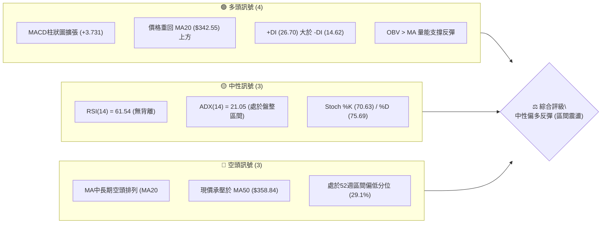
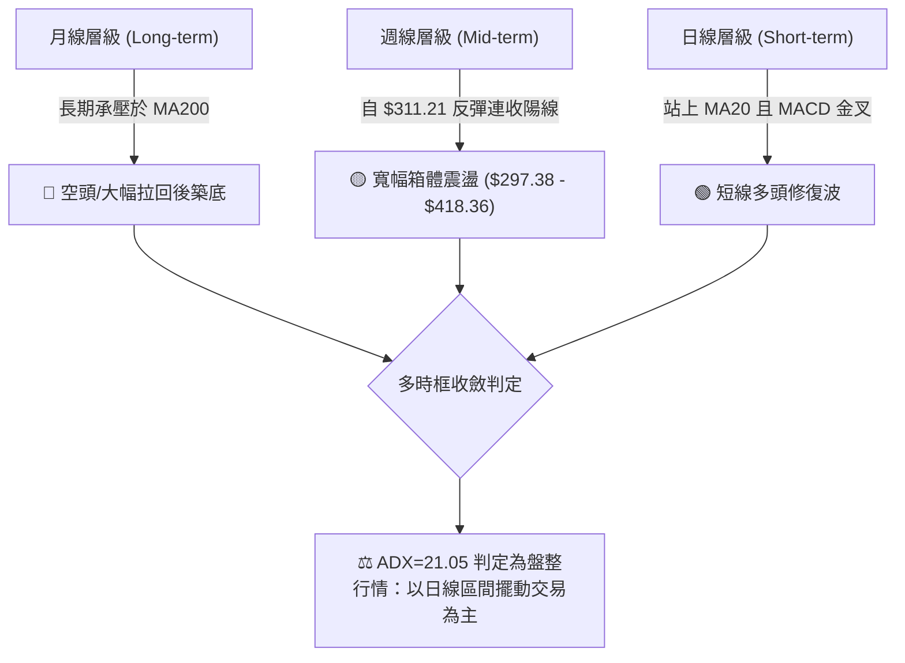
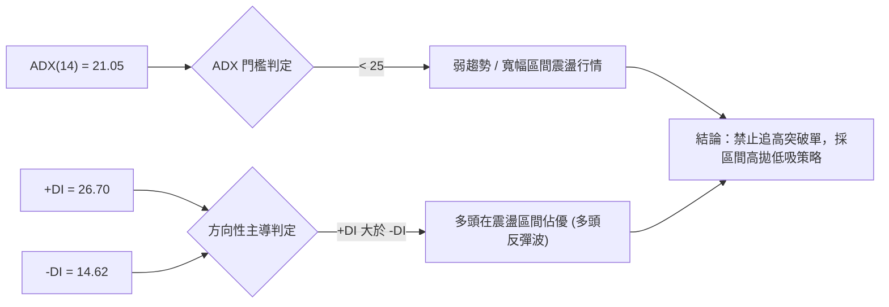
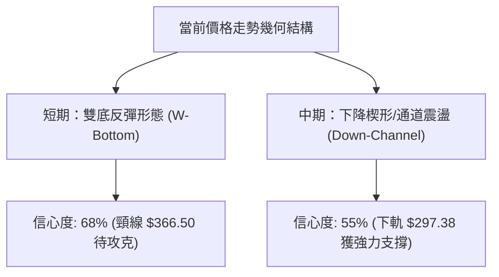
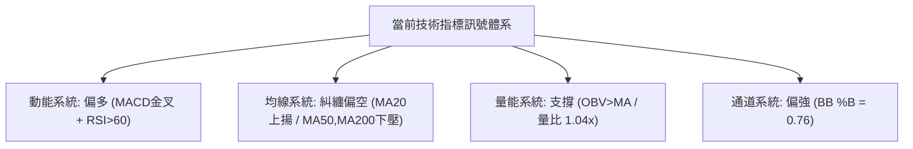
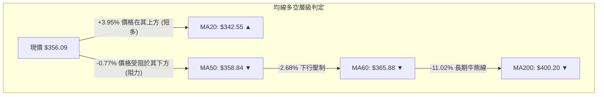
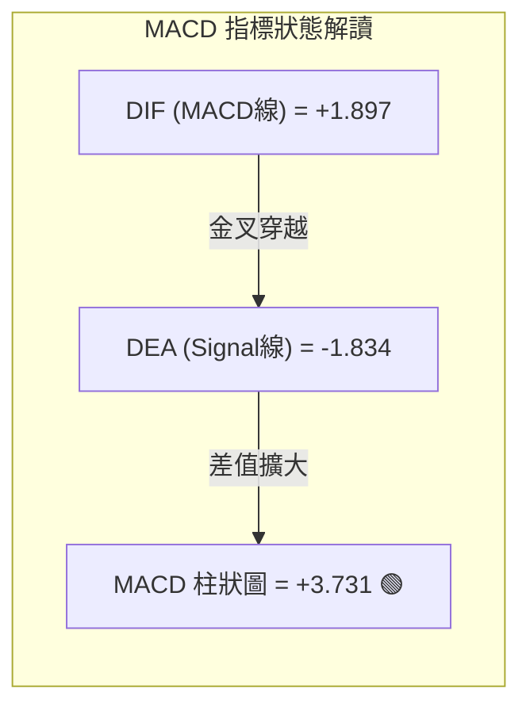
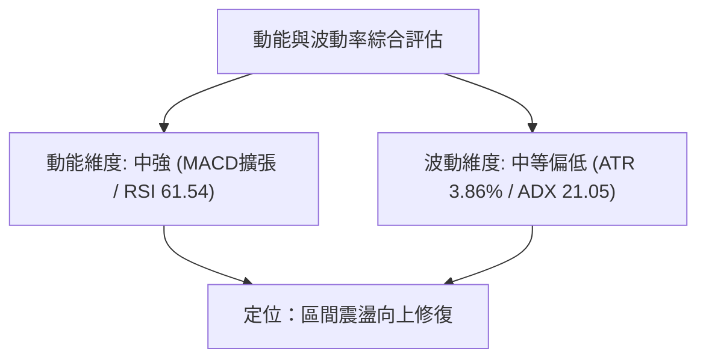
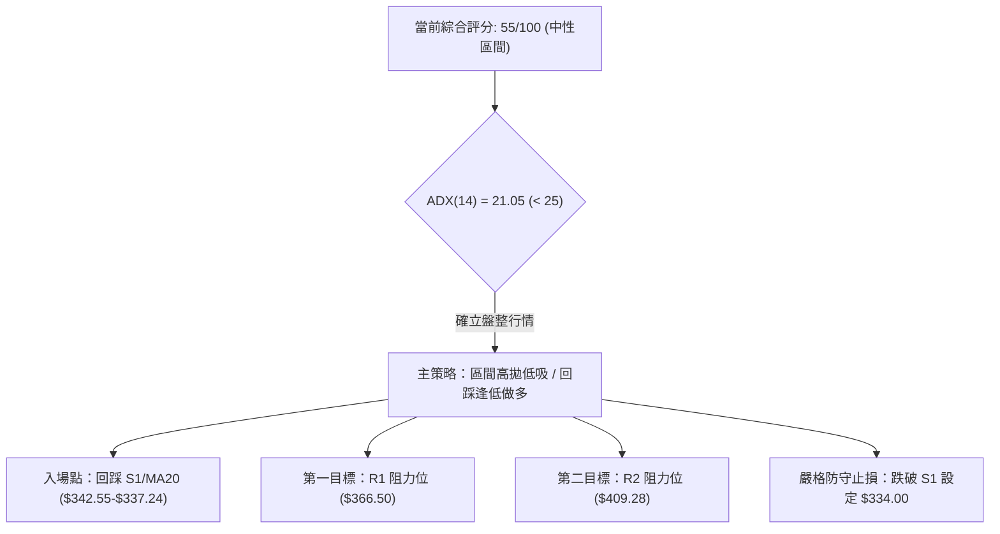
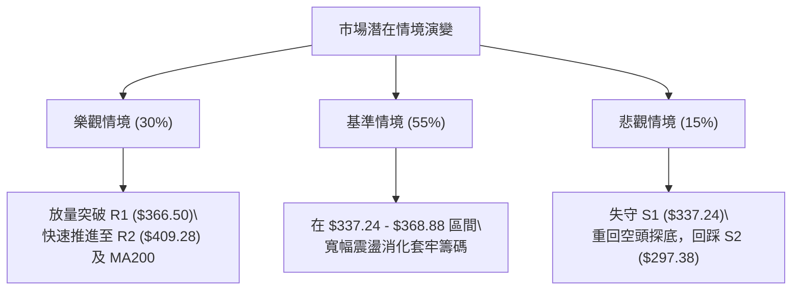

# TSLA 技術分析報告

> **報告日期**：2026-09-01 ｜ **語言**：繁體中文 ｜ **數據來源**：Yahoo Finance ｜ **當前價格**：$356.09

---

## 目錄

| 章節 | 內容 |
|------|------|
| [1. 技術面概覽](#1-技術面概覽) | 訊號儀表板、核心指標、評分卡 |
| [2. 趨勢分析](#2-趨勢分析) | 多時框趨勢、長中短期走勢 |
| [3. 圖表形態分析](#3-圖表形態分析) | 形態識別、K線組合、目標價 |
| [4. 支撐與阻力](#4-支撐與阻力) | 關鍵價位、斐波那契回調 |
| [5. 技術指標深度解讀](#5-技術指標深度解讀) | MA/RSI/MACD/布林/成交量 |
| [6. 動能與波動率](#6-動能與波動率) | 動能評估、ATR、Beta |
| [7. 多時框架總結](#7-多時框架總結) | 時框架評分矩陣 |
| [8. 交易策略建議](#8-交易策略建議) | 多空策略、風險報酬比 |
| [9. 風險提示與監控](#9-風險提示與監控) | 監控指標、風險場景 |

---

## 1. 技術面概覽

### 🎯 技術訊號儀表板



### 📊 核心指標速覽表

| 指標類別 | 指標名稱 | 當前數值 | 訊號 | 解讀 |
|:---|:---|:---|:---:|:---|
| **價格** | 當前價格 | $356.09 | 🟡 | 位於52週區間29.1%位置，短期底部強勁反彈中 |
| **均線** | MA20 | $342.55 | 🟢 | 價格在MA20上方 (+3.95%)，短期多頭支撐確立 |
| **均線** | MA50 | $358.84 | 🔴 | 價格在MA50下方 (-0.77%)，面臨中短期均線壓制 |
| **均線** | MA200 | $400.20 | 🔴 | 價格在MA200下方 (-11.02%)，長期結構仍屬空頭 |
| **動能** | RSI(14) | 61.54 | 🟡 | 處於50-70強勢中性區間，無超買或超賣背離 |
| **動能** | MACD | 1.897 | 🟢 | 快線突破慢線，柱狀圖 +3.731 擴張，多頭修復強勁 |
| **動能** | Stoch %K/%D | 70.63 / 75.69 | 🟡 | 高位微幅鈍化，短線反彈動能充沛但接近超買 |
| **趨勢** | ADX(14) | 21.05 | 🟡 | 低於25，確認當前屬於弱趨勢/寬幅盤整震盪行情 |
| **通道** | 布林通道 %B | 0.76 | 🟢 | 位於中軌與上軌間，朝上軌 $368.88 推進 |
| **波動** | ATR(14) | $13.73 | 🟡 | 佔股價 3.86%，波動適中，提供充足日內擺動空間 |

### 🏆 技術評分卡

```
╔══════════════════════════════════════════════════════════════╗
║                技術評分卡 — TSLA (2026-09-01)                ║
╠══════════════════════════════════════════════════════════════╣
║ 趨勢強度      ████████░░░░░░░░░░░░  42/100  🔴 空頭壓制中    ║
║ 動能指標      ██████████████░░░░░░  70/100  🟢 短線動能強    ║
║ 支撐穩定度    ██████████████░░░░░░  68/100  🟢 低點支撐穩    ║
║ 成交量配合    ████████████░░░░░░░░  60/100  🟡 量能溫和放    ║
║ 形態完整度    ██████████░░░░░░░░░░  52/100  🟡 構築箱體中    ║
║ 均線排列      ████████░░░░░░░░░░░░  40/100  🔴 均線未多排    ║
╠══════════════════════════════════════════════════════════════╣
║ 綜合評分      ███████████░░░░░░░░░  55/100  ⚖️ 區間操作(中性)║
╚══════════════════════════════════════════════════════════════╝
```

---

## 2. 趨勢分析

### 🌐 多時框趨勢分析



### 📈 長期趨勢 — 12個月走勢圖（Unicode）

```
TSLA 月線走勢圖（過去12個月：2025-09 至 2026-09）
價格軸 ($)
$460 ┤               ●($456.56)
$440 ┤     ●($444.72)      ●($449.72)        ●($435.79)
$420 ┤           ●($430.17)      ●($430.41)        ●($420.60)
$400 ┤                                 ●($402.51)
$380 ┤                                       ●($381.63)
$360 ┤                                 ●($371.75)    ●($367.95) ●←$356.09 (現價)
$340 ┤
$320 ┤                                             ●($311.21)
$300 ┤
     └────────────────────────────────────────────────────────────
      25/09 25/10 25/11 25/12 26/01 26/02 26/03 26/04 26/05 26/06 26/07 26/08 26/09
```

**走勢特徵分析表格**：

| 階段區間 | 起始/結束價 | 漲跌幅 | 走勢特徵描述 |
|:---|:---|:---:|:---|
| **高檔強勢整理** (2025-09 ~ 2026-01) | $444.72 → $430.41 | -3.22% | 股價於 $430-$460 高檔震盪，高點觸及 52W High $498.83 後形成雙頂壓力 |
| **中級下行修正** (2026-02 ~ 2026-04) | $402.51 → $381.63 | -5.19% | 跌破 $400 整數關卡，MA50 轉下彎，賣壓逐步湧現 |
| **反彈受阻與崩跌** (2026-05 ~ 2026-07) | $435.79 → $311.21 | -28.59% | 5月反抽至 $435.79 遭遇強阻力後快速回落，7月放量下探波段低點 $311.21 |
| **底部回升修復** (2026-08 ~ 2026-09) | $311.21 → $356.09 | +14.42% | 自 $311.21 啟動超跌反彈，站回 MA20，目前正測試 MA50 阻力 |

### 📊 中期趨勢（週線分析）

```
TSLA 中期週線支撐與阻力位階示意圖
$420 ────────────────────────────────────────── 阻力 R3 ($418.36) / MA240 ($406.89)
$400 ────────────────────────────────────────── 阻力 R2 ($409.28) / MA200 ($400.20)
$380 ────────────────────────────────────────── 61.8% 斐波回調位 ($374.33)
$366 ────────────────────────────────────────── 阻力 R1 ($366.50) / BB上軌 ($368.88)
$356.09  ◄═════════════════════════════════════ 【現價位置】
$342 ────────────────────────────────────────── BB中軌/MA20 ($342.55)
$337 ────────────────────────────────────────── 支撐 S1 ($337.24) / 78.6% 斐波位 ($340.49)
$297 ────────────────────────────────────────── 支撐 S2 ($297.38) / 52週低點
```

### ⚡ 趨勢強度評估（ADX 解讀）



| ADX 數值區間 | 當前數值 | 趨勢狀態 | 交易指引 |
|:---|:---:|:---:|:---|
| 00.00 - 20.00 | — | 極弱/無方向 | 避免任何順勢策略 |
| **20.01 - 25.00** | **21.05** | **弱趨勢 / 盤整震盪** | **以布林通道與支撐阻力進行波段操作** |
| 25.01 - 50.00 | — | 強趨勢形成 | 順勢追隨均線交易 |
| 50.01 - 100.0 | — | 極強趨勢/超買超賣 | 注意趨勢衰竭反轉 |

---

## 3. 圖表形態分析

### 🔍 形態識別系統



**形態信心度與目標價評估表**：

| 形態名稱 | 信心度 | 判斷依據（引用數據） | 完成度 | 目標價（附計算式） |
|:---|:---:|:---|:---:|:---|
| **短線雙重底 (W-Bottom)** | 68% | 2026年7-8月兩次低點探至 $313.03 與 $311.21（接近 S2 $297.38），頸線為 R1 $366.50 | 75% | 突破頸線後推算：<br>形態高度 = $366.50 - $311.21 = $55.29<br>理論目標 = $366.50 + $55.29 = **$421.79**（接近斐波38.2% $421.88） |
| **中期箱體震盪** | 72% | 價格在 S2 $297.38 與 R2 $409.28 區間內擺動，符合 ADX=21.05 盤整特徵 | 85% | 箱體上沿目標價 = **$409.28**（阻力位 R2） |
| **大級別頭肩頂形態** | 45% | 右肩構築不明顯，數據不足以確立 | — | 訊號不足，僅做指標型解讀，不計算下行目標價 |

### 🕯️ 重要K線形態分析

| 日期/週別 | 收盤價 | K線形態 | 解讀 | 訊號 |
|:---|:---:|:---|:---|:---:|
| 2026-07-26 | $313.03 | 長陰探底 (RSI 15.7) | 空頭恐慌性拋售，成交量放大至 2.75億股，嚴重超賣 | 🔴 超跌預警 |
| 2026-08-02 | $311.21 | 低位錘頭/十字星 (Hammer) | 二次探底不破新低，下影線長，多頭開始逢低介入 | 🟢 築底訊號 |
| 2026-08-16 | $342.27 | 大陽突破 (Bullish Marubozu) | 強勢收復 MA20，週線 RSI 飆升至 70.4，MACD 翻正 | 🟢 反轉確認 |
| 2026-08-23 | $362.86 | 上影光腳陽線 | 向上試探 R1 $366.50 阻力，遇阻回落，顯現短線解套賣壓 | 🟡 阻力確認 |
| 2026-08-30 | $348.75 | 縮量陰十字 (Pullback) | 正常回踩確認 MA20 支撐，未破 $342.55，量能萎縮 | 🟢 良性回踩 |
| 2026-09-06 | $356.09 | 溫和陽線收復 | 企穩於短期均線上，再度朝 MA50 ($358.84) 發起衝擊 | 🟢 延續反彈 |

### 📉 ASCII 走勢形態示意圖

```
TSLA 短期雙底 (W-Bottom) 結構示意圖
價格 ($)
$366.50 ┤                 頸線阻力 (R1) ─────┐
        │                  ▲                │
$356.09 ┤                  │        現價 ●  │
        │                  │         /      │ 形態高度 H = $55.29
$342.55 ┤      \          / \       /       │
        │       \  底1   /   \底2  /        │
$311.21 ┤────────●───────     ──●───────────┘
        └────────────────────────────────────────
         2026-07-26       2026-08-16       2026-09-01
```

### 🎯 形態目標價計算

若短期雙底形態在後續交易中獲得日線收盤價帶量突破頸線 R1 $366.50 確認：
1. **頸線價格 ($P_{Neck}$)**: $366.50
2. **形態最低點 ($P_{Low}$)**: $311.21
3. **形態高度 ($H$)**: $366.50 - $311.21 = $55.29
4. **第一目標價 ($T_1$)**: 頸線 + $H$ = $366.50 + $55.29 = **$421.79**（與斐波那契 38.2% 回調位 $421.88 產生重合共振）
5. **第二目標價 ($T_2$)**: 引用阻力位 R3 = **$418.36** 或 斐波那契 23.6% 回調位 **$451.29**。

---

## 4. 支撐與阻力

### 🗺️ 關鍵價位分布圖（Unicode）

```
TSLA 價位結構分布圖（數據精確錨定）
═══════════════════════════════════════════════════════════════
$498.83 ║████████████████████████████████║ 52週歷史高點 / 0.0% 斐波位
$451.29 ║██████████████████████          ║ 23.6% 斐波那契回調位
$418.36 ║████████████████████████        ║ 強阻力 R3 (波段高點聚類)
$409.28 ║██████████████████              ║ 阻力 R2 (MA200 關鍵共振區 $400-$409)
$374.33 ║██████████████                  ║ 61.8% 斐波那契黃金分割位
$366.50 ║████████████████████████        ║ 關鍵阻力 R1 (布林上軌 $368.88 聚類)
$356.09 ╠════════════════════════════════╣ ◄ 當前價格現位
$342.55 ║▓▓▓▓▓▓▓▓▓▓▓▓▓▓▓▓▓▓              ║ BB中軌 / MA20 動態支撐
$337.24 ║▓▓▓▓▓▓▓▓▓▓▓▓▓▓▓▓▓▓▓▓▓▓          ║ 近期波段支撐 S1 (78.6% 斐波 $340.49)
$316.22 ║▓▓▓▓▓▓▓▓▓▓▓▓                    ║ 布林通道下軌動態支撐
$297.38 ║████████████████████████████████║ 強支撐 S2 (52週低點 / 100% 斐波位)
═══════════════════════════════════════════════════════════════
```

### 🚧 阻力位分析表

| 阻力級別 | 價位 | 形成原因 | 突破難度 | 重要性 |
|:---|:---:|:---|:---:|:---:|
| **R1** | **$366.50** | 近一年波段高點聚類、布林上軌 ($368.88) 及 MA60 ($365.88) 密集重合區 | 中等 | 🟢🟢🟢 極高 (短線多空分水嶺) |
| **R2** | **$409.28** | 近一年波段高點聚類、MA200 ($400.20) 與 50% 斐波回調位 ($398.10) 共振 | 困難 | 🟢🟢🟢🟢 核心多空牛熊分界線 |
| **R3** | **$418.36** | 2026年6月波段高點聚類、斐波那契 38.2% 回調位 ($421.88) 壓制帶 | 極高 | 🟢🟢🟢 中長期強阻力區 |

### 🛡️ 支撐位分析表

| 支撐級別 | 價位 | 形成原因 | 守住機率 | 重要性 |
|:---|:---:|:---|:---:|:---:|
| **S1** | **$337.24** | 近一年波段低點聚類、斐波那契 78.6% ($340.49) 與 MA20 ($342.55) 支撐 | 75% | 🟢🟢🟢 極高 (短線防守底線) |
| **S2** | **$297.38** | 52週最低點、斐波那契 100% 回調位、整數關卡支撐 | 85% | 🟢🟢🟢🟢🟢 鋼底 (跌破將開啟崩盤) |

### 📐 斐波那契回調位分析

依據 52 週波動區間（高點 **$498.83** → 低點 **$297.38**，垂直落差 $201.45）之精準回調位解讀：

```
斐波那契回調層級分析
0.0%  ── $498.83 ── 52週高點極限阻力
23.6% ── $451.29 ── 多頭強勢復甦區
38.2% ── $421.88 ── 形態高度共振目標位
50.0% ── $398.10 ── 多空均衡線 (近MA200)
61.8% ── $374.33 ── 黃金分割關鍵阻力 (突破將展開大反彈)
-------------------- 現價 $356.09 (處於 61.8% 與 78.6% 之間) --------------------
78.6% ── $340.49 ── 短線回踩關鍵防守區 (近S1 $337.24)
100.0%── $297.38 ── 52週低點 (終極支撐)
```

**現價位階解讀**：
當前價格 **$356.09** 處於 **78.6% 回調位 ($340.49)** 與 **61.8% 回調位 ($374.33)** 之間的低位修復通道。股價站穩 78.6% 位階，顯示自 $297.38 的反彈已脫離破位危險，當前首要任務是向上攻克 61.8% 分割位 ($374.33) 及 R1 ($366.50)，方能打開通往 50% ($398.10) 的空間。

---

## 5. 技術指標深度解讀

### 🎛️ 指標訊號總覽



### 📈 移動平均線排列分析



| 均線名稱 | 數值 | 偏離度 | 走勢狀態 | 角色定位 |
|:---|:---:|:---:|:---:|:---|
| **MA 5** | $354.68 | +0.40% | ▲ 向上微升 | 超短線動態支撐 |
| **MA 10** | $353.17 | +0.83% | ▲ 向上助漲 | 短線助漲線 |
| **MA 20** | $342.55 | +3.95% | ▲ 向上反彈 | 波段多頭防守基準線 |
| **MA 50** | $358.84 | -0.77% | ▼ 持續下壓 | 即時壓制阻力 |
| **MA 60** | $365.88 | -2.68% | ▼ 持續下壓 | 季線阻力 (與 R1 $366.50 重合) |
| **MA 120** | $379.91 | -6.27% | ▼ 下行趨勢 | 半年線壓制帶 |
| **MA 200** | $400.20 | -11.02%| ▼ 下行壓制 | 長期牛熊分界嶺 |
| **MA 240** | $406.89 | -12.48%| ▼ 走平下垂 | 年線終極阻力區 |

**均線總評**：
當前呈現典型的「短均線抬頭、長均線壓頂」之反彈震盪格局。MA20 上穿帶動價格脫離底部，但上方 MA50、MA60、MA200 仍呈空頭排列，表明當前上漲性質屬於**空頭趨勢中的超跌反彈**，尚未構成大級別反轉。

### 📉 RSI(14) 分析

```
RSI(14) 當前強度：61.54
0 ══════════ 30 ══════════════ 50 ════════ 61.54 ══════ 70 ══════════ 100
[  超賣區   ] [     弱勢區     ] [  強勢區  ▲  ] [  超買區  ]
進度條：████████████████████████░░░░░░░░ 61.54%
```

- **超買超賣判定**：數值 61.54，處於 50–70 強勢多頭控盤區，尚未進入 >70 之嚴重超買過熱區。
- **背離判斷結論**：**無明顯背離**。股價自 7 月底低點 $311.21 反彈以來，週線 RSI 從 15.7 迅速拉升至 70 附近，隨後日線 RSI 在 61.54 穩健運行，指標與價格同向上行，量價動能匹配正常。

### 📊 MACD(12/26/9) 訊號解讀



- **訊號解讀**：DIF (+1.897) 位於 0 軸上方，DEA (-1.834) 正自負值區快速上穿 0 軸，MACD 柱狀圖維持在 **+3.731** 的擴張高位，釋放明確的**看多（Bullish）**買進動能修復訊號。
- **背離判斷**：週線級別 MACD 柱狀圖自 7 月底的 -8.365 谷底連續翻正至最新週期的 +3.731，構築了標準的低位柱狀圖底背離擴張，支撐本輪反彈持續。

### 📦 布林通道分析

```
TSLA 日線布林通道結構 (20日, 2.0σ)
$368.88 ┬────────────────────────────────────────── 上軌 (Upper Band)
        │                      ● $356.09 (現價, %B = 0.76)
$342.55 ┼────────────────────────────────────────── 中軌 (MA20 Baseline)
        │
$316.22 ┴────────────────────────────────────────── 下軌 (Lower Band)
```

- **帶寬與位置分析**：布林帶寬目前呈現溫和開口狀態，%B 指標為 **0.76**，代表現價已進入中軌與上軌之間的強勢推升區。
- **邊界反應**：上軌 **$368.88** 與阻力位 R1 ($366.50) 高度聚類，形成強大的上方動態磁吸與壓制區；中軌 **$342.55** 則構成短線回踩的最強動態支撐。

### 💹 成交量分析（量價配合度）

```
成交量動態與均量對比
最新成交量: ████████████████░░░░ 35.99M 股
20日均量:   ███████████████░░░░░ 34.48M 股 (量比 1.04x)
50日均量:   █████████████████░░░ 39.36M 股
```

- **量價特徵**：最新成交量 35,998,050 股，微幅高於 20日均量 (量比 1.04x)，展現溫和放量態勢。在回調日（如 2026-08-30）週成交量縮減至 1.6億股，而在推升階段維持均勻換手，未見異常爆量滯漲。
- **OBV 走勢評估**：**OBV > MA**，能量潮指標領先均線上行，確認資金呈淨流入格局，量能有效支撐價格上漲。

---

## 6. 動能與波動率

### ⚡ 動能評估



| 象限區間 | 動能特徵 | 波動特徵 | TSLA 當前狀態 | 交易策略指導 |
|:---|:---:|:---:|:---:|:---|
| **Q1 (最佳機會)** | 強動能 | 低波動 | — | 順勢加碼，趨勢爆發 |
| **Q2 (溫和修復)** | **中強動能** | **中低波動** | **✓ (TSLA 現位)** | **區間內低吸高拋，目標 R1/R2** |
| **Q3 (高危博弈)** | 強動能 | 高波動 | — | 嚴設止損，短線快進快出 |
| **Q4 (觀望迴避)** | 弱動能 | 高波動 | — | 觀望防守，禁止開倉 |

### 📊 ATR 波動率分析

- **ATR(14) 數值**：**$13.73**（佔股價比例為 **3.86%**）。
- **日內擺動空間**：每日平均波動約 $13.73，意味著常態日內波動區間約在 $342.36 至 $369.82 之間。
- **動態止損建議**：
  - **短線交易止損距離**：1.5 × ATR = $20.60（止損設於 $356.09 - $20.60 = **$335.49**，緊貼 S1 $337.24 下方）。
  - **波段交易止損距離**：2.0 × ATR = $27.46（止損設於 $356.09 - $27.46 = **$328.63**）。

### 📐 Beta 與市場相關性

- **Beta 係數**：**1.827**。
- **市場敏感度解讀**：TSLA 具備高彈性（High Beta）特徵，波動幅度為標普500指數的 1.83 倍。在市場整體風險偏好（Risk-on）回暖時將展現極高的向上反彈彈性；但在大盤回調時亦承擔放大的下行風險。

---

## 7. 多時框架總結

### 📋 時框架評分表

| 時框架 | 趨勢方向 | 動能狀態 | 均線排列 | 形態結構 | 綜合評分 | 操作指引 |
|:---|:---:|:---:|:---:|:---:|:---:|:---|
| **日線 (短期)** | 🟢 偏多反彈 | 🟢 強勁 (MACD翻紅) | 🟡 MA20金叉/MA50壓制 | 🟢 雙底反彈構築 | **68/100** | 逢回調依託 MA20 做多 |
| **週線 (中期)** | 🟡 寬幅震盪 | 🟢 RSI 走出超賣 | 🔴 MA50/MA200壓制 | 🟡 箱體低位回升 | **55/100** | 區間操作，鎖定 R1/R2 |
| **月線 (長期)** | 🔴 空頭承壓 | 🟡 跌勢趨緩 | 🔴 處於 MA200 下方 | 🔴 高檔下移格局 | **42/100** | 長線資金控制總倉位 |

### 🔲 綜合訊號矩陣

```
┌─────────────────┬─────────────────┬─────────────────┬─────────────────┐
│    分析維度     │   短期 (日線)   │   中期 (週線)   │   長期 (月線)   │
├─────────────────┼─────────────────┼─────────────────┼─────────────────┤
│ 均線系統 (MA)   │  🟢 MA20上方    │  🔴 MA50下方    │  🔴 MA200下方   │
│ 動能指標 (RSI)  │  🟢 61.54 偏強  │  🟡 58.9 中性   │  🟡 48.0 中性   │
│ 趨勢強度 (ADX)  │  🟡 21.05 盤整  │  🟡 22.3 盤整   │  🔴 趨勢走弱    │
│ 量能配合 (OBV)  │  🟢 OBV > MA    │  🟢 量能回升    │  🔴 歷史縮量    │
│ 多空主導權      │  🟢 多頭佔優    │  🟡 勢均力敵    │  🔴 空頭佔優    │
└─────────────────┴─────────────────┴─────────────────┴─────────────────┘
```

### ⚖️ 多時框收斂結論

> **依嚴格收斂優先級判定**：
> 當前日線 ADX(14) 為 **21.05 (<25)**，明確定義當前市場處於**「盤整震盪行情」**而非單邊趨勢行情。
> 根據多時框收斂規則，在盤整行情下，**以日線布林通道及關鍵支撐阻力為核心交易依據**。
> 
> **唯一方向性結論**：**【中性偏多（區間震盪反彈波）】**
> 日線短多動能（MACD金叉、站上MA20）主導當前反彈，但受限於中長期均線空頭壓制，反彈空間受限於 R1 ($366.50) 及 R2 ($409.28)。

---

## 8. 交易策略建議

### 🗺️ 策略決策流程圖



### 🧭 策略路由（依評分卡分流）

**當前主策略方向 = 【中性偏多：區間回踩低吸策略】（綜合評分：55/100，處於 40–60 區間操作帶）**

### 🎯 價格情境階梯（Price Scenarios）

| 觸發條件 | 下一目標 | 後續延伸 | 情境含義與操作指引 |
|:---|:---:|:---:|:---|
| **帶量突破 R1 $366.50** | **R2 $409.28** | **R3 $418.36** | 短線向上突破，雙底形態確立，順勢加碼進取型多單 |
| **維持在 $342.55 - $366.50** | — | — | 於布林中上軌間維持震盪，執行標準網格或區間擺動交易 |
| **有效跌破 S1 $337.24** | **S2 $297.38** | — | 反彈宣告失敗，空頭重掌主導權，多單全面止損離場觀望 |

### 📊 情境機率分佈

| 情境 | 機率 | 主要依據 |
|:---|:---:|:---|
| **區間震盪向上測試 R1/R2** | **60%** | MACD 柱狀圖 (+3.731) 擴張、OBV 支撐上行、+DI (26.70) 佔優 |
| **維持 $340-$365 區間窄幅震盪** | **25%** | ADX(14) = 21.05 處於弱趨勢，布林上軌與 MA50 存在短線壓制 |
| **破位下行重探 S2 $297.38** | **15%** | 中長期均線（MA200）仍處空頭排列，基本面營利年減 3.0% 形成壓制 |

### 🟢 主策略詳情（區間多頭反彈策略）

| 策略要素 | 策略 A（穩健型：回踩支撐低吸） | 策略 B（突破型：右側放量追擊） |
|:---|:---:|:---:|
| **進場條件** | 價格回踩 MA20 / S1 出現止跌K線 | 日線帶量收盤實體突破 R1 |
| **進場價格** | **$342.55**（MA20 附近） | **$367.00**（確認突破 R1 $366.50） |
| **目標價 T1** | **$366.50**（阻力位 R1） | **$409.28**（阻力位 R2 / 形態目標） |
| **目標價 T2** | **$409.28**（阻力位 R2） | **$418.36**（阻力位 R3 / 斐波38.2%） |
| **止損價格** | **$334.00**（跌破 S1 $337.24 下方） | **$355.00**（回跌至 MA50 下方假突破） |
| **風險報酬比** | **1 : 2.80**（風險 $8.55 / 報酬 $23.95 至T1） | **1 : 3.52**（風險 $12.00 / 報酬 $42.28 至T1） |
| **成功機率** | **65%** | **55%** |
| **建議倉位** | **10% - 15% 總資金** | **5% - 10% 總資金** |

### 🔴 反向風險觸發點（對沖提示）

- **多頭失效翻空觸發點**：若日線收盤價跌破 **S1 $337.24**，且 MACD 柱狀圖轉為收斂或翻綠，代表此輪反彈波終結。
- **對沖應對措施**：立即平倉所有多頭部位；極激進交易者可在反抽確認無力時，以 S1 為防守點小倉位建立下看 **S2 $297.38** 的空頭保護。

### ⭐ 整體訊號強度評星

```
做多訊號強度：★★★☆☆  (3.5/5星 - 短線反彈動能明確)
做空訊號強度：★★☆☆☆  (2.0/5星 - 短線空頭動能衰竭)
整體可信度：  ★★★★☆  (4.0/5星 - 多指標共振收斂於震盪行情)
```

---

## 9. 風險提示與監控

### ✅ 關鍵監控指標 Checklist

```
╔══════════════════════════════════════════════════════════════╗
║                   每日交易前技術監控清單                     ║
╠══════════════════════════════════════════════════════════════╣
║ [ ] 價格是否守穩 MA20 關鍵支撐 ($342.55)                     ║
║ [ ] MACD 柱狀圖是否維持正向擴張 (當前 +3.731)                ║
║ [ ] RSI(14) 是否在 50-70 區間運行，防範 >75 出現頂背離       ║
║ [ ] ADX(14) 是否突破 25（判斷盤整是否轉為單邊趨勢）          ║
║ [ ] 每日成交量是否維持在 20日均量 ($34.48M) 以上             ║
║ [ ] 是否觸及多頭防守止損位 ($334.00)                         ║
╚══════════════════════════════════════════════════════════════╝
```

### ⚠️ 風險場景分析



### 🛡️ 風險管理重要提醒

1. **嚴禁追高**：鑑於 ADX=21.05 處於盤整市，在價格逼近布林上軌 ($368.88) 及 R1 ($366.50) 時嚴禁追漲，應以逢低佈局為主。
2. **高 Beta 倉位控制**：TSLA Beta 高達 **1.827**，波動極大。建議單筆交易最大虧損金額不得超過總投資組合淨值的 **1.0% - 1.5%**。
3. **止損紀律執行**：價格若跌破 S1 ($337.24)，必須無條件執行止損紀律，防範股價向 52 週低點 S2 ($297.38) 進行垂直深度下探。

---

## 📋 報告總結

```
╔══════════════════════════════════════════════════════════════╗
║                   TSLA 技術分析報告總結                      ║
╠══════════════════════════════════════════════════════════════╣
║ 報告日期：2026-09-01                                         ║
║ 當前價格：$356.09                                            ║
║ 分析評級：⚖️ 中性偏多 (區間擺動反彈波)                       ║
║                                                              ║
║ 關鍵結論：                                                   ║
║ ├─ 長期趨勢：🔴 空頭壓制 (MA200 $400.20 下行)                ║
║ ├─ 中期趨勢：🟡 寬幅箱體震盪 ($297.38 - $409.28)             ║
║ ├─ 短期趨勢：🟢 站上 MA20，雙底反彈動能充沛                  ║
║ ├─ 關鍵支撐：S1: $337.24 / S2: $297.38                       ║
║ ├─ 關鍵阻力：R1: $366.50 / R2: $409.28 / R3: $418.36         ║
║ └─ 分析師目標均價：$390.09 (隱含 +9.55% 空間)                ║
║                                                              ║
║ 最優策略組合：                                               ║
║ 1. 🥇 最佳機會：回踩 MA20/S1 ($342-$337) 分批做多，看至 R1    ║
║ 2. 🥈 次選機會：突破 R1 ($366.50) 右側加碼，博弈至 R2 ($409) ║
║ 3. 🥉 保守選擇：於 $365-$368 阻力區獲利了結，等待方向突破    ║
╚══════════════════════════════════════════════════════════════╝
```

---

> ⚠️ **免責聲明**：本報告為 AI 自動生成之技術分析，所有數據及估算均基於提供的歷史價格資訊。本報告**僅供研究與學術參考**，**不構成任何投資建議**。投資有風險，入市需謹慎。

---

*報告生成時間：2026-09-01 ｜ 數據來源：Yahoo Finance ｜ 分析框架：多時框技術分析*