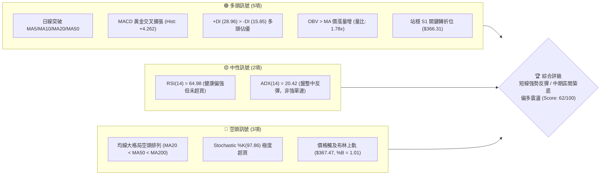
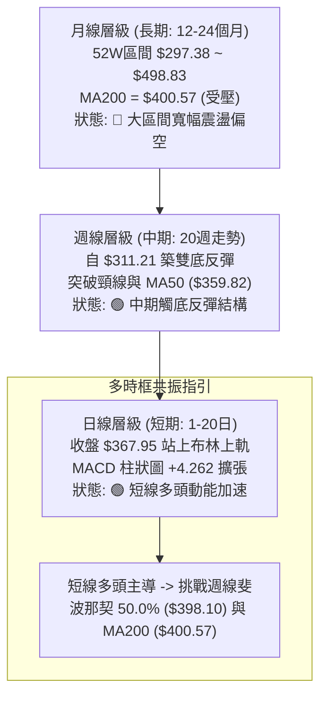
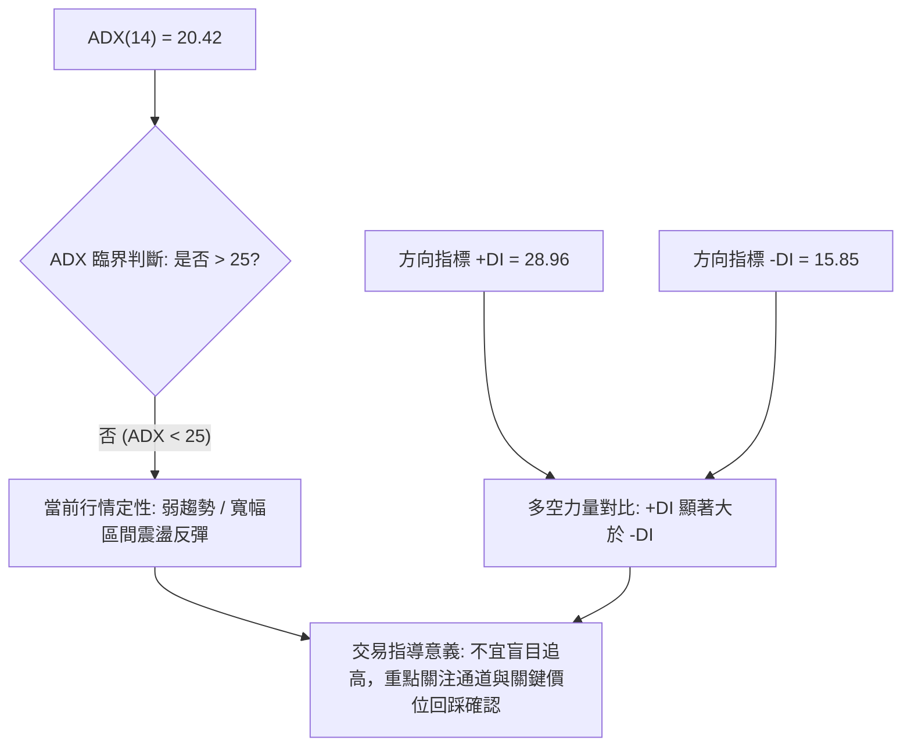
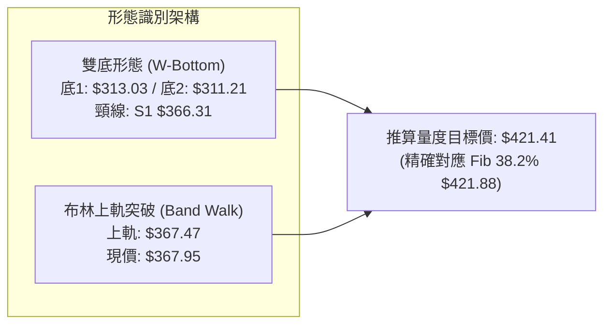
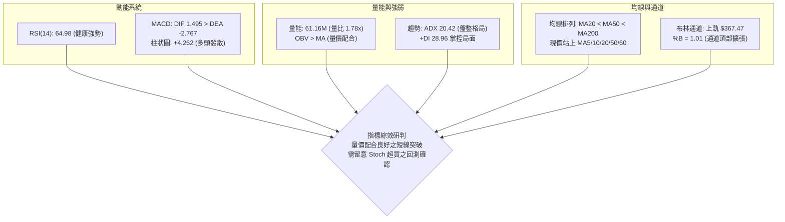
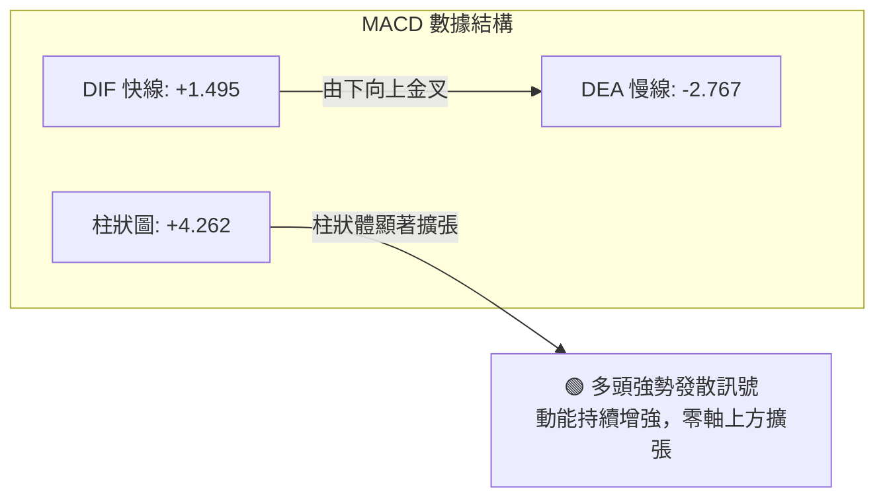
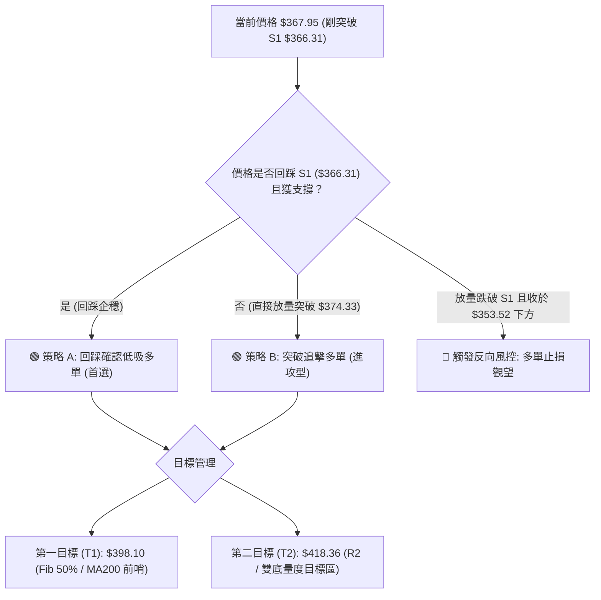
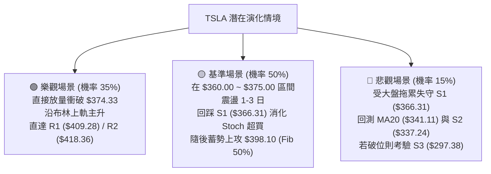

# TSLA 技術分析報告

> **報告日期**：2026-09-01 ｜ **語言**：繁體中文 ｜ **數據來源**：Yahoo Finance ｜ **當前價格**：$367.95

---

## 目錄

| 章節 | 內容 |
|------|------|
| [1. 技術面概覽](#1-技術面概覽) | 訊號儀表板、核心指標、評分卡 |
| [2. 趨勢分析](#2-趨勢分析) | 多時框趨勢、長中短期走勢 |
| [3. 圖表形態分析](#3-圖表形態分析) | 形態識別、K線組合、目標價 |
| [4. 支撐與阻力](#4-支撐與阻力) | 關鍵價位、斐波那契回調 |
| [5. 技術指標深度解讀](#5-技術指標深度解讀) | MA/RSI/MACD/布林/成交量 |
| [6. 動能與波動率](#6-動能與波動率) | 動能評估、ATR、Beta |
| [7. 多時框架總結](#7-多時框架總結) | 時框架評分矩陣、多時框收斂 |
| [8. 交易策略建議](#8-交易策略建議) | 價格情境、主策略詳情、風報比 |
| [9. 風險提示與監控](#9-風險提示與監控) | 監控清單、風險情境、倉位控制 |

---

## 1. 技術面概覽

### 🎯 技術訊號儀表板



---

### 📊 核心指標速覽表

| 指標類別 | 指標名稱 | 當前數值 | 訊號 | 專業技術解讀 |
|:---|:---|:---|:---:|:---|
| **價格** | 當前收盤價 | $367.95 | 🟢 | 突破布林上軌及短期均線群，展現強勁修復動能 |
| **短期均線** | MA20 (月線) | $341.11 | 🟢 | 價格在其上方 +7.87%，短線多頭支撐強勁 |
| **中期均線** | MA50 (季線) | $359.82 | 🟢 | 價格成功收復季線，中期空頭壓制初步化解 |
| **長期均線** | MA200 (年線) | $400.57 | 🔴 | 價格低於年線 -8.14%，長期牛熊分界線仍具壓制 |
| **震盪指標** | RSI(14) | 64.98 | 🟡 | 位於強勢多頭區間 (50-70)，尚未過熱且無頂背離 |
| **趨勢動能** | MACD (12/26/9) | DIF: 1.495 / DEA: -2.767 | 🟢 | 零軸下方黃金交叉並向上穿越零軸，柱狀圖正擴張 (+4.262) |
| **超買超賣** | KD (%K / %D) | 97.86 / 76.39 | 🔴 | %K 進入極度超買區，短線警惕回踩均線確認 |
| **趨勢強度** | ADX / ±DI | ADX: 20.42 (+DI: 28.96) | 🟡 | ADX < 25 屬區間反彈格局，+DI 主導短線多方動能 |
| **通道指標** | Bollinger Bands | 上軌 $367.47 / %B 1.01 | 🟡 | 價格突破上軌，進入通道擴張期或短線超買拉回期 |
| **量能指標** | 成交量 / OBV | 61.16M (量比 1.78x) | 🟢 | 價漲量增且 OBV 高於其均線，增量資金進場確認反彈 |
| **波動風險** | ATR(14) | $13.51 (佔比 3.67%) | 🟡 | 每日平均波動約 13.5 美元，止損設定需預留空間 |

---

### 🏆 技術評分卡

```
╔══════════════════════════════════════════════════════════════════╗
║                技術評分卡 — TSLA (2026-09-01)                    ║
╠══════════════════════════════════════════════════════════════════╣
║  評估維度      進度評分條                      得分     訊號     ║
╟──────────────────────────────────────────────────────────────────╢
║  趨勢強度      ██████████░░░░░░░░░░            50/100   🟡 中性  ║
║  動能指標      ██████████████░░░░░░            72/100   🟢 看多  ║
║  支撐穩定度    ████████████░░░░░░░░            60/100   🟢 偏多  ║
║  成交量配合    ████████████████░░░░            80/100   🟢 強多  ║
║  形態完整度    ██████████████░░░░░░            68/100   🟢 偏多  ║
║  均線排列      ████████░░░░░░░░░░░░            42/100   🔴 偏空  ║
╠══════════════════════════════════════════════════════════════════╣
║  綜合技術評分  ████████████░░░░░░░░            62/100   🟢 偏多  ║
║  市場狀態評級  【區間修復反彈・突破回測中】（短多中性・長線承壓）║
╚══════════════════════════════════════════════════════════════════╝
```

---

## 2. 趨勢分析

### 🌐 多時框趨勢分析



---

### 📈 長期趨勢 — 12個月走勢圖（ASCII）

```
TSLA 月線走勢圖（過去12個月：2025-09 至 2026-08）
價格軸 ($)
$460 ┤             ● $456.56 (2025-10 頂部)
$440 ┤ ● $444.72        ● $449.72        ● $435.79 (2026-05 次高)
$420 ┤       ● $430.17        ● $430.41        ● $420.60
$400 ┤                             ● $402.51
$380 ┤                                  ● $381.63
$360 ┤                                       ● $371.75   ● $367.95 ◄ (2026-08 現價)
$340 ┤
$320 ┤                                                        ● $311.21 (2026-07 探底)
$300 ┤                                                              (52W Low $297.38)
     └─────────────────────────────────────────────────────────────
       09   10   11   12   01   02   03   04   05   06   07   08 (月份)
```

#### 走勢特徵分析表格

| 階段區間 | 時間跨度 | 起止價格 | 漲跌幅 | 走勢結構與特徵解讀 |
|:---|:---|:---:|:---:|:---|
| **高位派發期** | 2025/09 - 2025/12 | $444.72 → $449.72 | +1.12% | 於 $450 上方形成多重頂部聚類，動能衰竭 |
| **中期陰跌期** | 2026/01 - 2026/04 | $430.41 → $381.63 | -11.33% | 跌破各級短期均線，呈現高點遞降 (LH) 與低點遞降 (LL) |
| **反彈誘多期** | 2026/05 - 2026/06 | $435.79 → $420.60 | -3.49% | 強烈反抽至 $435.79 後失守，確認形成更低的高點 |
| **恐慌探底期** | 2026/07 - 2026/08 | $311.21 → $367.95 | +18.23% | 跌至 52W 低點區 ($297.38-$311.21) 出現恐慌盤，隨後暴力回升 |

---

### 📊 中期趨勢（週線分析）

從近 20 週數據觀察，TSLA 於 2026 年 7 月下旬（2026-07-26 收 $313.03，RSI 跌至 15.7 極度超賣區）與 8 月初（2026-08-02 收 $311.21，RSI 18.1）完成週線雙底探底。隨後連續四週放量上漲，週線 MACD 柱狀圖由 -8.365 迅速翻正至 +4.262，週線 RSI 重返 65.0，展現中期強勢反轉特徵。

```
中期週線結構示意圖：
$435.79 ──┐ (5月波段高點)
          │
          └───► 下跌波段 ───┐
                            │
                            ├──► W底低點 1: $313.03 (07/26, RSI 15.7)
                            │    W底低點 2: $311.21 (08/02, RSI 18.1)
                            │
                            └───► 放量反彈 ───► 當前收盤: $367.95 (已突破頸線 S1 $366.31)
```

---

### ⚡ 趨勢強度評估（ADX 解讀）



#### ADX 與方向指標強度對照

| 指標名稱 | 實際數值 | 參考門檻 | 強度解讀 | 對交易策略的指引 |
|:---|:---:|:---:|:---|:---|
| **ADX(14)** | **20.42** | < 25 (弱趨勢) | 處於盤整與新趨勢醞釀過渡期 | 避免單邊追單，以區間回調低吸與突破回測策略為主 |
| **+DI** | **28.96** | > 25 (多頭主導) | 買方動能顯著增強 | 多頭掌握短線定價權，空頭暫無反撲實力 |
| **-DI** | **15.85** | < 20 (空頭減弱) | 賣方力量大幅衰退 | 下方拋壓大幅減輕，短線下行空間受限 |

---

## 3. 圖表形態分析

### 🔍 形態識別系統



#### 圖表形態信心度評估表

| 識別形態名稱 | 信心度 | 判斷依據（引用數據） | 完成度 | 量度目標價（附精確計算式） |
|:---|:---:|:---|:---:|:---|
| **短期雙底 (W-Bottom)** | **75%** | 2026/07/26 低點 $313.03 與 08/02 低點 $311.21 形成雙重支撐；現價 $367.95 剛突破關鍵頸線 S1 $366.31 | 85% | **頸線 $366.31 + 形態高度 ($366.31 - $311.21 = $55.10) = $421.41**（極度共振斐波那契 38.2% 位 $421.88） |
| **中長期下降通道反彈** | **60%** | 從 2025/10 高點 $456.56 及 2026/05 高點 $435.79 連線之下降軌道，目前回抽至軌道中軸 | 65% | **通道中軸阻力位推算：$398.10**（對應斐波那契 50.0% 回調位） |
| **頭肩底形態** | **35%** | 缺乏對稱左肩數據（歷史數據以寬幅震盪為主） | 20% | *訊號不足，僅做指標型與雙底形態解讀* |

---

### 🕯️ 重要K線形態分析

| 週期/月份 | 收盤價 | 典型 K 線組合形態 | 專業技術解讀 | 訊號方向 |
|:---|:---:|:---|:---|:---:|
| **2026-06** | $420.60 | **高位烏雲蓋頂** | 衝高 $435.79 受阻，收盤大跌回落，形成中期轉向訊號 | 🔴 看跌 |
| **2026-07** | $311.21 | **長陰恐慌出清線** | 單月暴跌逾 $109，成交量萎縮後恐慌盤湧出，週 RSI 觸及 15.7 極值 | 🔴 轉 🟢 (超賣) |
| **2026-08** | $367.95 | **大陽吞噬／紅三兵反轉** | 月線強勢大陽線收復失地，週線連三陽吞沒 7 月下旬陰線實體 | 🟢 看漲 |
| **最新日線** | $367.95 | **跳空高開光頭陽線** | 突破布林上軌 $367.47，收盤緊貼最高價，量比達 1.78x | 🟢 看漲 |

---

### 📉 ASCII 走勢形態示意圖

```
TSLA 中期「雙底突破」形態量化結構圖：

$421.88 ┤────────────────────────────────────────── 形態量度目標 (Fib 38.2% / $421.41)
        │                                         ▲
        │                                         │ 量度漲幅 H = $55.10
$398.10 ┤─────────────────────────────────────────┼ MA200 ($400.57) / Fib 50.0%
        │                                         │
$366.31 ┤━━━━━━━━━━━━━━━━━━━● 頸線突破位 (S1) ─────┴ 現價 $367.95 剛突破
        │                  / \                    ▲
        │                 /   \                   │ 形態高度 H = $55.10
        │                /     \                  │ ($366.31 - $311.21)
$311.21 ┤──────●────────/───────● 底2 (08/02) ────┴
        │    底1 (07/26)
        └─────────────────────────────────────────
             2026-07         2026-08      2026-09
```

---

## 4. 支撐與阻力

### 🗺️ 關鍵價位分布圖（ASCII）

```
TSLA 價位結構空間分佈圖
═════════════════════════════════════════════════════════════════════
$498.83 ║████████████████████████████████║ 52週歷史高點 (Fib 0.0%)
$451.29 ║██████████████████████          ║ Fib 23.6% 回調壓力位
$434.60 ║████████████████████████████    ║ 強阻力 R3 (2026-05 波段次高)
$418.36 ║████████████████████            ║ 阻力 R2 (波段籌碼密集區)
$409.28 ║████████████████████████        ║ 關鍵阻力 R1 (年線 MA200 $400.57 上方阻力)
$398.10 ║██████████████████              ║ 心理關卡 (Fib 50.0% 多空分水嶺)
$374.33 ║████████████                    ║ 短線阻力 (Fib 61.8% 回調位)
$367.95 ╠════════════════════════════════╣ ◄── 【當前收盤價格 $367.95】
$366.31 ║▓▓▓▓▓▓▓▓▓▓▓▓▓▓▓▓▓▓▓▓▓▓▓▓▓▓▓▓▓▓▓║ 關鍵支撐 S1 (頸線突破位 / 前期低點聚類)
$341.11 ║▓▓▓▓▓▓▓▓▓▓▓▓▓▓▓▓▓▓▓▓            ║ 動態支撐 (MA20 / 布林中軌)
$337.24 ║▓▓▓▓▓▓▓▓▓▓▓▓▓▓▓▓▓▓▓▓▓▓▓▓        ║ 強支撐 S2 (波段回撤低點聚類)
$297.38 ║▓▓▓▓▓▓▓▓▓▓▓▓▓▓▓▓▓▓▓▓▓▓▓▓▓▓▓▓▓▓▓║ 鐵底支撐 S3 (52W 最低點 / Fib 100.0%)
═════════════════════════════════════════════════════════════════════
```

---

### 🚧 阻力位分析表

| 阻力級別 | 精確價位 | 距現價空間 | 形成原因與籌碼分佈特徵 | 突破難度 | 戰略重要性 |
|:---|:---:|:---:|:---|:---:|:---:|
| **R1** | **$409.28** | +11.23% | 近一年波段高點聚類；與 MA200 ($400.57) 及 Fib 50% ($398.10) 形成密集阻力帶 | 🔴 高 | ★★★★★ (多頭反轉確認點) |
| **R2** | **$418.36** | +13.70% | 2026 年 6 月反彈高點平台籌碼套牢區；雙底量度目標 ($421.41) 之先遣阻力 | 🟡 中 | ★★★★☆ (波段止盈目標) |
| **R3** | **$434.60** | +18.12% | 2026 年 5 月反彈最高峰 ($435.79) 聚類；強大空頭防守陣地 | 🔴 極高 | ★★★★★ (中長期牛熊轉折) |

---

### 🛡️ 支撐位分析表

| 支撐級別 | 精確價位 | 距現價空間 | 形成原因與技術共振 | 守住機率 | 戰略重要性 |
|:---|:---:|:---:|:---|:---:|:---:|
| **S1** | **$366.31** | -0.45% | 近一年波段低點轉化之支撐；W底頸線；現價僅高出 $1.64 | 🟢 70% | ★★★★★ (短線多頭生命線) |
| **S2** | **$337.24** | -8.35% | 波段低點聚類；緊貼 MA20 ($341.11) 與 Fib 78.6% ($340.49) 共振區 | 🟢 85% | ★★★★☆ (波段多單加碼點) |
| **S3** | **$297.38** | -19.18% | 52週絕對最低點 (52W Low)；年線級別底部，極強買盤支撐 | 🟢 95% | ★★★★★ (長期防守底線) |

---

### 📐 斐波那契回調位分析

依據 52 週完整波段高低點（Low: **$297.38** → High: **$498.83**，波幅 $201.45）計算精確回調位：

```
0.0%  (52W High)  $498.83 ──────────────────────────────────
23.6%             $451.29 ──────────────────────────────────
38.2%             $421.88 ────────────────────────────────── (接近雙底量度價 $421.41)
50.0%             $398.10 ────────────────────────────────── (多空強弱中樞線)
61.8%             $374.33 ────────────────────────────────── (短線即時阻力)
                  $367.95 ◄── 【當前價格位於 61.8% 與 78.6% 之間】
78.6%             $340.49 ────────────────────────────────── (共振 MA20 $341.11)
100.0%(52W Low)   $297.38 ──────────────────────────────────
```

#### 回調位深度解讀
1. **當前位置定性**：現價 **$367.95** 成功脫離 78.6% ($340.49) 的深度回撤危險區，正向上挑戰 61.8% 黃金分割阻力位 **$374.33**。
2. **多空關鍵分水嶺**：若能進一步放量突破 $374.33，下一核心多空博弈中樞為 **50.0% ($398.10)**，該位置亦與年線 **MA200 ($400.57)** 形成重度共振壓制區。

---

## 5. 技術指標深度解讀

### 🎛️ 指標訊號總覽



---

### 📈 移動平均線排列分析

```
均線數值與價差分佈：
MA 5:   $353.52  ▲ (+4.08%)  ████████████████████ (短線極強)
MA 10:  $351.25  ▲ (+4.75%)  ███████████████████
MA 20:  $341.11  ▲ (+7.87%)  ████████████████
MA 50:  $359.82  ▲ (+2.26%)  ███████████████████ (突破季線)
MA 60:  $366.46  ▲ (+0.41%)  ████████████████████ (突破線)
MA 120: $380.34  ▼ (-3.26%)  █████████████████████ (半年線壓制)
MA 200: $400.57  ▼ (-8.14%)  ██████████████████████ (年線大關)
MA 240: $407.18  ▼ (-9.63%)  ███████████████████████
```

- **均線排列結構**：長期均線仍處於空頭排列（MA20 < MA50 < MA200），反映過去一年以來的下行趨勢慣性。
- **短期均線反轉**：短期均線出現強勢金叉糾纏向上（MA5 $353.52 > MA10 $351.25 > MA20 $341.11），且現價一次性摜穿 MA50 ($359.82) 與 MA60 ($366.46)，屬於典型的**由下而上的爆發型修復行情**。

---

### 📉 RSI(14) 分析

```
RSI(14) 數值儀表板：
0 ─────── 30 ───────────── 50 ───────── 64.98 ──── 70 ─────── 100
[ 超賣區 ]   [   弱勢區   ]   [  強勢多頭區  ▲  ]   [ 超買區 ]
進度條: ████████████████████████████████░░░░░░░░░░  64.98%
```

- **動能評估**：RSI(14) 自 2026 年 7 月底的極端超賣值 15.7 飆升至當前 64.98，位於 50-70 的強勢多頭推進區間。
- **背離檢驗**：觀察近 20 週走勢，7/26 低點 $313.03 (RSI 15.7) 與 8/02 低點 $311.21 (RSI 18.1) 呈現微幅**日/週線底背離**（價格創新低而 RSI 抬高），隨後觸發本輪報復性反彈；目前上行過程中**無任何頂背離現象**，上漲動能真實有效。

---

### 📊 MACD(12/26/9) 訊號解讀



- **訊號解析**：DIF 已經翻正為 +1.495，並拉開與 DEA (-2.767) 的距離，MACD 柱狀圖高達 +4.262，顯示買盤正在加速進場，中期動能全面轉多。

---

### 📦 布林通道分析（ASCII）

```
布林通道結構與現價相對位置（帶寬: $52.72）
$367.47 ┬────────────────────────────── 🟢 上軌 (Upper Band)
$367.95 ┼● 現價 ($367.95, %B = 1.01) ─── 突破上軌！(短線超買擴張)
        │
$341.11 ┼────────────────────────────── 🟡 中軌 MA20 (Middle Band)
        │
$314.75 ┴────────────────────────────── 🔴 下軌 (Lower Band)
```

- **解讀**：價格當前處於 `%B = 1.01`，剛好刺穿布林上軌 ($367.47)。在 ADX = 20.42 的震盪市特徵下，價格突破上軌往往伴隨兩種可能：(1) 開啟「沿軌上行（Band Walking）」強勢單邊行情；(2) 觸軌後回踩中軌 MA20 ($341.11) 與頸線 S1 ($366.31) 尋求支撐。

---

### 💹 成交量分析（量價配合度）

```
成交量對比儀表：
當日量:   61,157,428  ████████████████████████████ (量比 1.78x)
20日均量: 34,320,151  ███████████████
50日均量: 39,586,319  █████████████████
```

- **量價配合度**：最新成交量 61.16M 顯著放大，達到 20 日均量的 **1.78 倍**，呈現標準的「價漲量增」健康結構。
- **OBV 趨勢**：OBV 指標穩定運行於其均線之上，確認機構資金在 7-8 月底部區間積極建倉，量能為價格突破提供了堅實支撐。

---

## 6. 動能與波動率

### ⚡ 動能評估四象限

| 象限 | 動能強度 (RSI/MACD) | 波動率水準 (ATR/Beta) | 當前所屬狀態 | 專業操作策略建議 |
|:---:|:---:|:---:|:---:|:---|
| **Q1 (最佳爆發)** | 強 (RSI > 60, MACD擴張) | 低 (ATR 收縮) | — | 順勢重倉突破買入 |
| **Q2 (震盪反彈)** | **強 (RSI 64.98, MACD金叉)** | **高 (ATR $13.51, Beta 1.83)** | **✓ TSLA 當前位置** | **順勢做多，但需拉寬止損、嚴格控管倉位** |
| **Q3 (防守觀望)** | 弱 (RSI < 40, MACD死叉) | 低 (窄幅整理) | — | 空倉等待方向明朗 |
| **Q4 (極度危險)** | 弱 (動能潰散) | 高 (恐慌殺跌) | — | 嚴禁抄底，逢高減磅 |

---

### 📊 ATR 波動率分析

- **ATR(14) 數值**：**$13.51**（佔現價 **3.67%**）。
- **止損距離設計建議**：
  - **短線日內 / 敏捷交易**：建議止損距離為 $1.0 \times \text{ATR} \approx \$13.50$（對應支撐約 **$354.45**，貼近 MA5）。
  - **波段趨勢交易**：建議止損距離為 $1.5 \sim 2.0 \times \text{ATR} \approx \$20.25 \sim \$27.00$（對應支撐約 **$340.95 \sim \$347.70**，完美契合 MA20 $341.11 與 S2 區域）。

---

### 📐 Beta 與市場相關性

```
TSLA Beta 係數評估：
0.0 ────────────── 1.0 (標普500基準) ────────── 1.827 (TSLA 現值) ────── 2.5
進度條: ███████████████████████████████████████████░░░░░░░░░  1.827
```

- **市場敏感度**：Beta 高達 **1.827**，屬於高彈性、高風險偏好品種。大盤（S&P 500）每波動 1%，TSLA 預期波動約 1.83%。在市場整體風險偏好回暖時，TSLA 具備超越大盤的進攻爆發力。

---

## 7. 多時框架總結

### 📋 時框架評分表

| 時框架 | 趨勢方向 | 動能狀態 | 均線排列 | 圖表形態 | 綜合評分 | 戰略建議 |
|:---|:---:|:---:|:---:|:---:|:---:|:---|
| **短期 (日線)** | 🟢 看多 | 🟢 極強 (+DI/MACD擴張) | 🟢 突破短均群 | 🟢 突破頸線 S1 | **82/100** | 逢低回測進場，順勢做多 |
| **中期 (週線)** | 🟢 偏多 | 🟢 金叉 (MACD柱+4.26) | 🟡 突破 MA50 | 🟢 雙底構築完成 | **68/100** | 持股待漲，目標看至 MA200 |
| **長期 (月線)** | 🔴 偏空 | 🟡 底部回升中 | 🔴 空頭排列 | 🟡 大區間震盪 | **40/100** | 視為深跌反彈，注意年線阻力 |

---

### 🔲 綜合訊號矩陣

```
訊號一致性矩陣分析：
┌──────────────────┬──────────────┬──────────────┬──────────────┐
│ 分析維度         │ 短期 (1-5日) │ 中期 (1-3個月)│ 長期 (6-12個月)│
├──────────────────┼──────────────┼──────────────┼──────────────┤
│ 均線系統 (MA)    │   🟢 看多    │   🟡 中性    │   🔴 看空    │
│ 動能指標 (MACD)  │   🟢 看多    │   🟢 看多    │   🟡 中性    │
│ 震盪指標 (RSI)   │   🟡 中性偏多│   🟢 看多    │   🟡 中性    │
│ 量能配合 (OBV)   │   🟢 看多    │   🟢 看多    │   🟡 中性    │
│ 形態學 (Patterns)│   🟢 看多    │   🟢 看多    │   🟡 區間    │
└──────────────────┴──────────────┴──────────────┴──────────────┘
```

---

### ⚖️ 多時框收斂結論

依據多時框收斂規則：
1. **當前市場屬性判定**：ADX(14) 為 **20.42 (< 25)**，定性為「**大級別寬幅震盪中的波段修復反彈行情**」。
2. **多時框矛盾化解**：雖然長期月線 MA200 ($400.57) 仍處於空頭壓制之下，但日線與週線已完成雙底共振突破（突破 S1 $366.31），日線動能主導短期行情向上修正。
3. **唯一方向性結論**：**【偏多運行・順勢做多】**。短線策略以回踩 S1 ($366.31) 不破為依託，向上博弈第一目標區 Fib 50.0% ($398.10) 及關鍵阻力 R1 ($409.28)。

---

## 8. 交易策略建議

### 🗺️ 策略決策流程圖



---

### 🧭 策略路由

> **當前主策略方向 = 【逢回調做多 / 突破順勢多】（依綜合評分 62/100 偏多路由）**

---

### 🎯 價格情境階梯（Price Scenarios）

| 觸發條件 | 核心價位 | 下一目標 | 後續延伸 | 行情情境深度含義 |
|:---|:---:|:---:|:---:|:---|
| **放量突破 Fib 61.8%** | **$374.33** | **R1 $409.28** | **R2 $418.36** | 確立日線沿布林上軌主升浪，直撲年線 MA200 ($400.57) |
| **回踩站穩頸線** | **$366.31 (S1)** | **$398.10** | **R1 $409.28** | 健康蓄勢，確認突破有效性，最優風險報酬比進場點 |
| **失守月線支撐** | **$341.11 (MA20)**| **S2 $337.24** | **S3 $297.38** | 突破失敗，雙底形態破位，重回 52 週底部尋求支撐 |

---

### 📊 情境機率分佈

| 行情情境 | 機率預估 | 核心技術指標與量價依據 |
|:---|:---:|:---|
| **情境一：強勢上行 / 挑戰阻力** | **55%** | MACD 柱狀圖 (+4.262) 強勢擴張，+DI (28.96) 佔優，量比 1.78x 資金推動顯著 |
| **情境二：區間震盪 / 回踩蓄勢** | **30%** | ADX (20.42) 顯示非單邊牛市，Stoch (%K 97.86) 超買需消化指標乖離 |
| **情境三：再度回落 / 破位探底** | **15%** | 均線長期空頭排列，若大盤系統性風險爆發跌破 S1 ($366.31) 則觸發多頭踩踏 |

---

### 🟢 主策略詳情

| 策略要素 | 策略 A：穩健型回踩多單（主推） | 策略 B：激進型突破加碼多單 |
|:---|:---|:---|
| **進場邏輯** | 回踩雙底頸線與 S1 支撐位確認不破進場 | 盤中放量摜穿 Fib 61.8% 阻力位順勢追進 |
| **具體進場價格** | **$366.50 ~ $367.00**（限價掛單） | **$374.80**（突破 $374.33 觸發市價） |
| **目標價 T1** | **$398.10**（Fib 50.0% / 年線關前） | **$409.28**（阻力位 R1） |
| **目標價 T2** | **$418.36**（阻力位 R2 / 形態量度目標） | **$421.88**（Fib 38.2% 回調位） |
| **嚴格止損價格** | **$352.80**（跌破 MA5 $353.52 關鍵動能線） | **$365.50**（假突破跌回 S1 下方） |
| **風險空間 / 報酬空間** | 風險 $13.70 / 預期回報 $31.60 ~ $51.86 | 風險 $9.30 / 預期回報 $34.48 ~ $47.08 |
| **風險報酬比 (R:R)** | **1 : 2.31 ～ 1 : 3.79** | **1 : 3.71 ～ 1 : 5.06** |
| **預估勝率** | **65%** | **55%** |
| **建議倉位上限** | **總資金 15% - 20%** | **總資金 8% - 10%** |

---

### 🔴 反向風險觸發點（對沖與風控提示）

- **多頭徹底失效點**：收盤價有效跌破 **S2 ($337.24)** 及 **MA20 ($341.11)**。
- **風控處置行動**：一旦跌破 $337.24，表明本輪 W 底突破為假突破（Bull Trap），應立即平倉所有多頭部位，或買入看跌期權對沖現貨下跌至 **S3 ($297.38)** 的風險。

---

### ⭐ 整體訊號強度評星

```
做多訊號強度：★★★★☆  (4.0/5星 — 短中期多頭共振，量價配合)
做空訊號強度：★☆☆☆☆  (1.0/5星 — 僅存在超買回調風險，無空頭結構)
整體策略可信度：★★★★☆  (4.2/5星 — 關鍵價位高度共振，風報比優異)
```

---

## 9. 風險提示與監控

### ✅ 關鍵監控指標 Checklist

```
╔══════════════════════════════════════════════════════════════════╗
║              TSLA 交易風控實時監控 Checklist                      ║
╠══════════════════════════════════════════════════════════════════╣
║ [ ] 價格是否每日收盤穩於 S1 ($366.31) 之上？                     ║
║ [ ] 日成交量是否維持在 20 日均量 (34.32M) 之上？                  ║
║ [ ] RSI(14) 是否在 70 附近出現「價格創新高而指標未新高」之頂背離？║
║ [ ] MACD 柱狀圖是否持續擴張（> +4.00）？若收縮需提防回調。       ║
║ [ ] 價格接近 MA200 ($400.57) 時是否出現長上影線或放量滯漲？     ║
║ [ ] 大盤 Beta 風險聯動（關注標普500/納斯達克是否同步回調）。      ║
╚══════════════════════════════════════════════════════════════════╝
```

---

### ⚠️ 風險場景分析



---

### 🛡️ 風險管理重要提醒

1. **高波動品種倉位管理**：TSLA 當前 ATR 高達 **$13.51**，Beta 為 **1.827**，單次交易風險暴露嚴格限制在總賬戶淨值的 **1.0% - 1.5%** 之內。
2. **獲利保護機制（動態移動止損）**：當股價達到第一目標價 **$398.10** 時，必須將止損位上移至進場保本點（**$367.95**），並至少減倉 **50%** 鎖定利潤。
3. **長線均線心理防線**：切記 **MA200 ($400.57)** 為強大牛熊分水嶺，在未能放量週線實體站穩 $400.57 之前，均應將此波行情視為優質波段交易，而非無腦長期持有。

---

## 📋 報告總結

```
╔══════════════════════════════════════════════════════════════════╗
║                    TSLA 技術分析報告總結                         ║
╠══════════════════════════════════════════════════════════════════╣
║ 報告日期：2026-09-01             當前價格：$367.95               ║
║ 分析評級：🟢 偏多（波段修復突破）  技術評分：62 / 100             ║
╟──────────────────────────────────────────────────────────────────╢
║ 關鍵結論：                                                       ║
║ ├─ 長期趨勢：🔴 大區間寬幅震盪偏空（受制於年線 MA200 $400.57）  ║
║ ├─ 中期趨勢：🟢 週線雙底構築完成，突破關鍵頸線 S1 $366.31       ║
║ ├─ 短期趨勢：🟢 價漲量增（量比 1.78x），突破布林上軌強勢發散     ║
║ ├─ 關鍵支撐：S1 $366.31 ｜ S2 $337.24 ｜ S3 $297.38 (52W Low)   ║
║ ├─ 關鍵阻力：Fib 61.8% $374.33 ｜ R1 $409.28 ｜ R2 $418.36      ║
║ └─ 分析師共識：買入 (Buy) ｜ 共識目標均價：$390.09               ║
╟──────────────────────────────────────────────────────────────────╢
║ 最優策略執行組合：                                               ║
║ 1. 🥇 最佳機會：回踩 S1 ($366.31-$367.00) 企穩進場做多，          ║
║                止損設 $352.80，首要目標 $398.10，風報比 1:2.31   ║
║ 2. 🥈 次選機會：強勢突破 $374.33 順勢加碼，目標看至 $418.36     ║
║ 3. 🥉 防守機制：跌破 S2 ($337.24) 嚴格停損離場觀望               ║
╚══════════════════════════════════════════════════════════════════╝
```

---

> ⚠️ **免責聲明**：本報告為技術分析專業研究報告，所有分析、數據及圖表均基於歷史量價數據計算。本報告**僅供研究與學術參考**，**不構成任何要約、招攬或具體投資建議**。金融市場存在高風險，投資人應獨立評估風險並自負盈虧。

---

*報告生成時間：2026-09-01 ｜ 數據來源：Yahoo Finance ｜ 分析框架：多時框架量化技術分析*