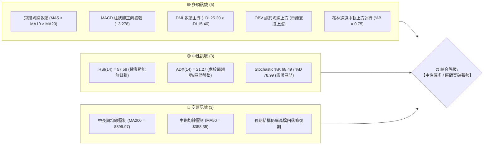
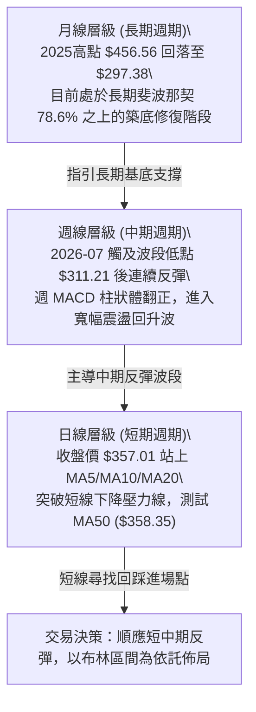
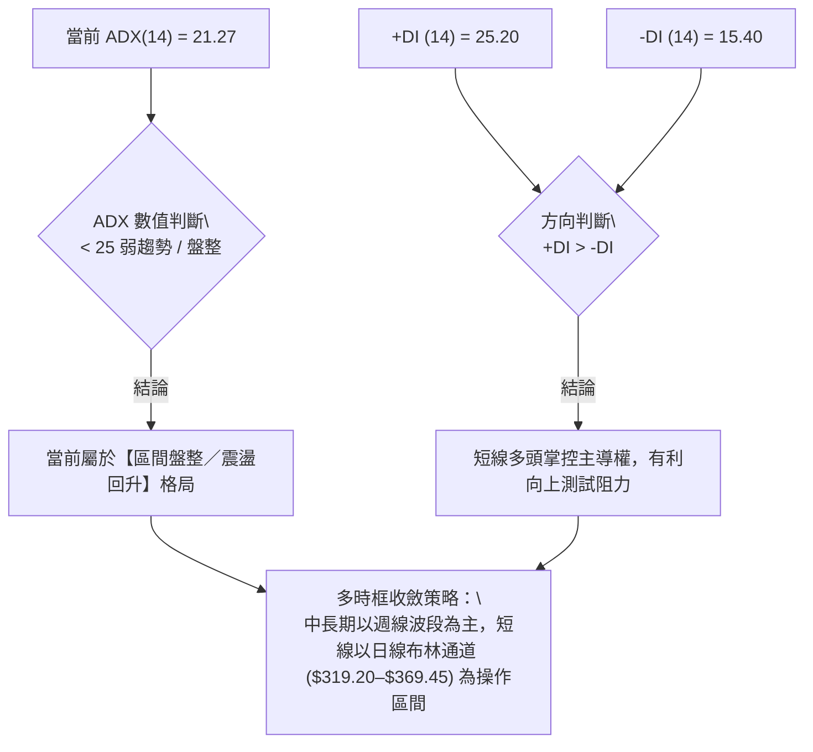
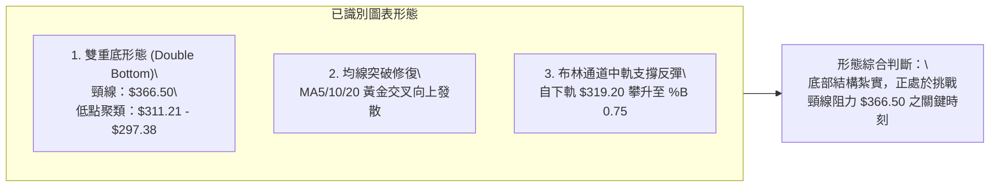
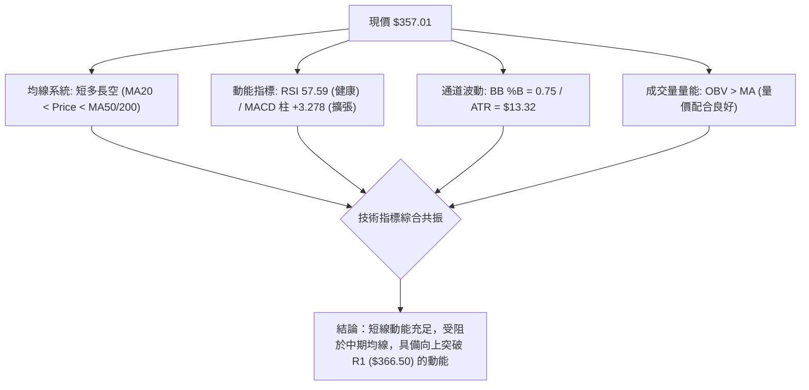
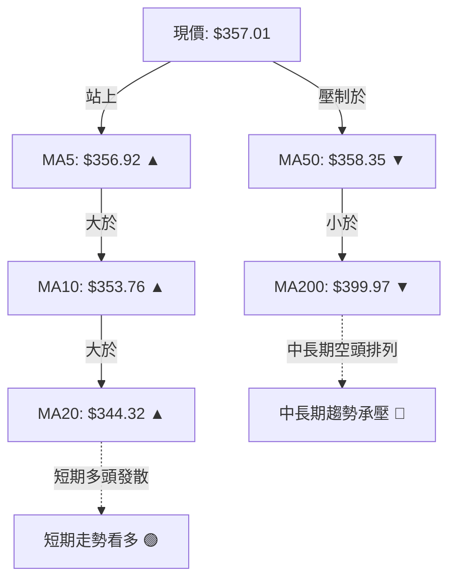
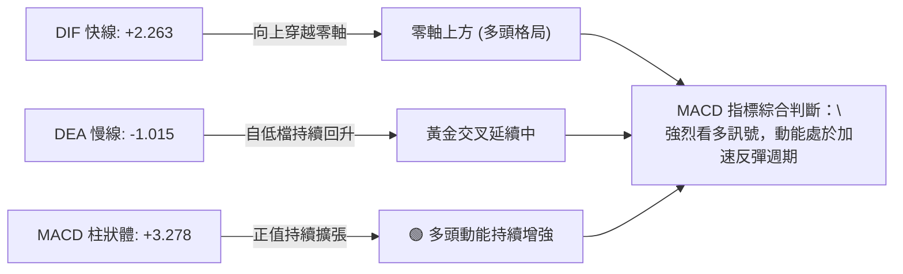
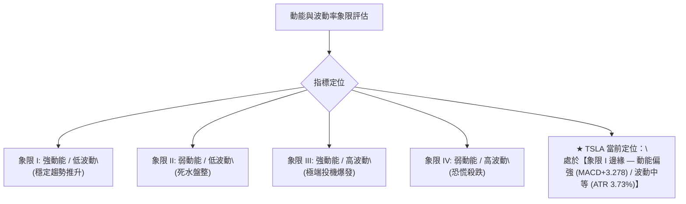
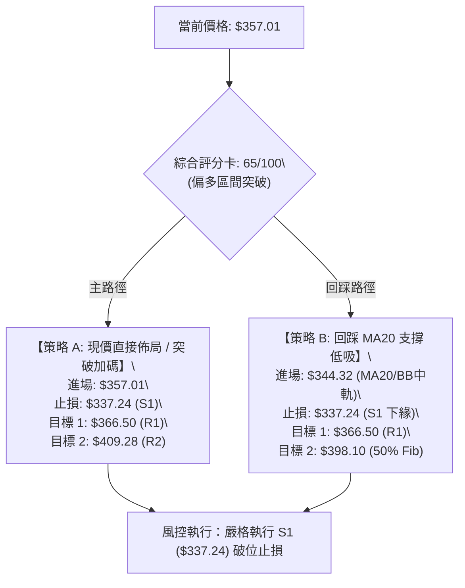
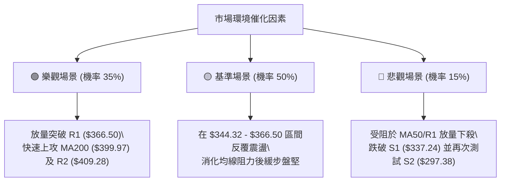

# TSLA 技術分析報告

> **報告日期**：2026-09-02 ｜ **語言**：繁體中文 ｜ **數據來源**：Yahoo Finance ｜ **當前價格**：$357.01

---

## 目錄

| 章節 | 內容 |
|------|------|
| [1. 技術面概覽](#1-技術面概覽) | 訊號儀表板、核心指標、評分卡 |
| [2. 趨勢分析](#2-趨勢分析) | 多時框趨勢、長中短期走勢、ADX 解讀 |
| [3. 圖表形態分析](#3-圖表形態分析) | 形態識別、K線組合、形態目標價 |
| [4. 支撐與阻力](#4-支撐與阻力) | 關鍵價位、斐波那契回調結構 |
| [5. 技術指標深度解讀](#5-技術指標深度解讀) | 均線、RSI、MACD、布林通道、OBV |
| [6. 動能與波動率](#6-動能與波動率) | 動能象限、ATR 波動度、Beta 敏感度 |
| [7. 多時框架總結](#7-多時框架總結) | 時框架評分矩陣、多時框收斂結論 |
| [8. 交易策略建議](#8-交易策略建議) | 策略路由、主策略規劃、情境機率 |
| [9. 風險提示與監控](#9-風險提示與監控) | 關鍵監控清單、風險情境與風控 |

---

## 1. 技術面概覽

### 🎯 技術訊號儀表板



---

### 📊 核心指標速覽表

| 指標類別 | 指標名稱 | 當前數值 | 訊號 | 解讀 |
|:---|:---|:---|:---:|:---|
| **價格** | 當前收盤價 | **$357.01** | 🟢 | 自 7 月低點 $311.21 強勁反彈，站回 MA20 上方 |
| **均線** | 短期 MA20 | **$344.32** | 🟢 | 現價高於 MA20 (+3.68%)，短期多頭支撐穩固 |
| **均線** | 中期 MA50 | **$358.35** | 🟡 | 現價緊貼 MA50 下緣 (-0.37%)，正測試關鍵均線關卡 |
| **均線** | 長期 MA200 | **$399.97** | 🔴 | 現價低於 MA200 (-10.74%)，長期均線仍呈下行壓力 |
| **動能** | RSI (14) | **57.59** | 🟢 | 處於 50–70 強勢擴張區間，無超買與頂背離現象 |
| **動能** | MACD (12,26,9) | **2.263 / -1.015** | 🟢 | DIF 線上穿 MACD 訊號線，柱狀體 (+3.278) 持續翻紅擴張 |
| **趨勢強度** | ADX (14) | **21.27** | 🟡 | 數值 < 25，顯示處於自底部反彈的箱體震盪盤整行情 |
| **趨勢方向** | DMI (+DI / -DI) | **25.20 / 15.40** | 🟢 | +DI 明顯高於 -DI，買盤短線佔據控盤優勢 |
| **通道** | 布林通道 (%B) | **0.75** | 🟢 | 運行於中軌 ($344.32) 與上軌 ($369.45) 之間，多頭偏強 |
| **量能** | OBV 與成交量 | **33,758,963** | 🟢 | OBV > 移動平均線，量價配合健康，短線回調縮量 |
| **波動** | ATR (14) | **$13.32 (3.73%)** | 🟡 | 波動度處於中等水準，提供良好的波段操作空間 |

---

### 🏆 技術評分卡

```
╔══════════════════════════════════════════════════════════════════╗
║                   TSLA 技術評分卡 (2026-09-02)                   ║
╠══════════════════════════════════════════════════════════════════╣
║ 趨勢強度 (ADX/DMI)    ████████████░░░░░░░░  60/100  🟡 中性偏多  ║
║ 動能指標 (MACD/RSI)   ████████████████░░░░  78/100  🟢 偏多擴張  ║
║ 支撐穩定度 (S1/S2)    ██████████████░░░░░░  70/100  🟢 支撐穩固  ║
║ 成交量配合 (OBV/VOL)  ██████████████░░░░░░  72/100  🟢 量價健康  ║
║ 形態完整度 (結構修復) ████████████░░░░░░░░  62/100  🟡 蓄勢待發  ║
║ 均線排列 (長短週期)   ██████████░░░░░░░░░░  50/100  🟡 短多長空  ║
╠══════════════════════════════════════════════════════════════════╣
║ 綜合技術得分          █████████████░░░░░░░  65/100  🟢 偏多操作  ║
╚══════════════════════════════════════════════════════════════════╝
```

---

## 2. 趨勢分析

### 🌐 多時框趨勢分析



---

### 📈 長期趨勢 — 12個月走勢圖（Unicode）

```
TSLA 月線走勢圖（過去12個月：2025-09 至 2026-09）
價格軸 ($)
$460 ┤               ● $456.56 (2025-10 高點)
$440 ┤ ● $444.72           ● $449.72        ● $435.79
$420 ┤       ● $430.17          ● $430.41         ● $420.60
$400 ┤                               ● $402.51
$380 ┤                                    ● $381.63
$360 ┤                                         ● $371.75    ● $367.95  ● $357.01 (現價)
$340 ┤
$320 ┤                                                           ● $311.21 (2026-07 波段低點)
$300 ┤
     └─────────────────────────────────────────────────────────────────────────────
       09/25 10/25 11/25 12/25 01/26 02/26 03/26 04/26 05/26 06/26 07/26 08/26 09/26
```

#### 走勢特徵分析表格

| 階段區間 | 月份起訖 | 區間價格變化 | 累計漲跌幅 | 走勢特徵與結構解讀 |
|:---|:---:|:---:|:---:|:---|
| **高檔震盪做頂期** | 2025-09 ~ 2025-12 | $444.72 → $449.72 | +1.12% | 於 $430–$456 區間高檔構築雙頂結構，多頭動能衰竭 |
| **空頭下行波段** | 2026-01 ~ 2026-03 | $430.41 → $371.75 | -13.63% | 連續三個月收陰，跌破短期均線，呈現階梯式下行 |
| **中繼反彈衰竭** | 2026-04 ~ 2026-05 | $381.63 → $435.79 | +14.19% | 快速反抽測試長期阻力，但未能突破前高，形成次高點 |
| **主跌段宣洩** | 2026-06 ~ 2026-07 | $420.60 → $311.21 | -26.01% | 帶量下殺打出 52 週次低點 $311.21，週 RSI 跌至極端超賣 (15.7) |
| **底部回升修復** | 2026-08 ~ 2026-09 | $311.21 → $357.01 | +14.72% | 量價配合良好，MACD 翻紅，站穩 $340 支撐並震盪盤堅 |

---

### 📊 中期趨勢（週線分析）

從近 20 週的收盤價與動能變化觀察：
- **極致超賣落底**：2026-07-26 當週收盤 $313.03，RSI 觸及 15.7 極度超賣區，週 MACD 柱狀體收斂至 -8.365，量能爆出 2.75 億股，確認為恐慌拋售盤（Selling Climax）。
- **右側動能確認**：2026-08-09 起，週線連續 4 週收陽，收盤價由 $311.21 推升至 $362.86，週 RSI 迅速修復至 72.7 高檔強勢區，MACD 柱狀體由負翻正並擴張至 +6.229。
- **近兩週蓄勢整理**：2026-08-30 收 $348.75，本週目前收在 $357.01，量能適度縮減至 1.31 億股，屬於強勢突破後的縮量整固。

```
中期週線支撐阻力結構圖
$420 ──────────────────────────── 關鍵阻力區 R3 ($418.36) / 5月反彈高點
$400 ──────────────────────────── 長期均線壓制 MA200 ($399.97) / R2 ($409.28)
$375 ──────────────────────────── 斐波那契 61.8% ($374.33) / 布林上軌 ($369.45)
$357 ════════════════════════════ 現價 ($357.01) — 挑戰 MA50 ($358.35)
$340 ──────────────────────────── 斐波那契 78.6% ($340.49) / 支撐 S1 ($337.24)
$310 ──────────────────────────── 波段前低雙底支撐 ($311.21) / 52W 低點 S2 ($297.38)
```

---

### ⚡ 趨勢強度評估（ADX 解讀）



#### ADX 強度與交易環境對照表

| 指標名稱 | 當前讀數 | 門檻區間 | 趨勢屬性判定 | 操作環境與策略含義 |
|:---|:---:|:---:|:---:|:---|
| **ADX (14)** | **21.27** | < 25.0 | 弱趨勢 / 盤整蓄勢 | 避免追高殺跌，以關鍵支撐買入、阻力區減倉為原則 |
| **+DI (14)** | **25.20** | > 20.0 | 多方動能活耀 | 買盤意願高於賣盤，具備推升價格動能 |
| **-DI (14)** | **15.40** | < 20.0 | 空方壓制力道減弱 | 空頭賣壓處於低位，無恐慌性拋盤壓力 |
| **DI 差值 (+DI - -DI)** | **+9.80** | > 0 | 多頭佔優 (+DI 主導) | 短線回調提供較佳之低吸機會 |

---

## 3. 圖表形態分析

### 🔍 形態識別系統



#### 形態識別與信心度評估表（依規則 15）

| 形態名稱 | 信心度 | 判斷依據（引用技術數據） | 形態完成度 | 形態目標價（附精確計算式） |
|:---|:---:|:---|:---:|:---|
| **雙重底 (W底)** | **70%** | 2026-07-26 低點 $311.21 與 52W 低點 S2 ($297.38) 構成底部支撐聚類；頸線為波段高點 R1 ($366.50) | **85%** | 形態高度 = $366.50 - $297.38 = $69.12<br>突破目標 = $366.50 + $69.12 = **$435.62**<br>（對應前期 5 月高點 $435.79） |
| **均線黃金交叉修復** | **85%** | MA5 ($356.92) > MA10 ($353.76) > MA20 ($344.32)，短期均線全部多頭排列向上發散 | **100%** | 測試 MA200 壓力位 **$399.97** |
| **布林中軌支撐回升** | **75%** | 價格回踩中軌 $344.32 後獲得支撐回升，當前 %B 達 0.75 | **80%** | 布林上軌阻力位 **$369.45** |

---

### 🕯️ 重要 K 線形態分析

| 週/月份 | 收盤價 | K線形態特徵 | 市場心理與多空解讀 | 訊號評級 |
|:---|:---:|:---|:---|:---:|
| **2026-07-26** | $313.03 | **長下影巨量大陰線** | 恐慌性殺跌後買盤大量湧入，成交量 2.75 億股，形成賣盤力竭訊號 | 🟢 底背離孕育 |
| **2026-08-02** | $311.21 | **低檔十字星 (Doji)** | 多空雙方於 $310 附近達成暫時平衡，空頭動能完全衰退 | 🟢 築底訊號 |
| **2026-08-16** | $342.27 | **大陽線突破 (Bullish Marubozu)** | 實體大陽線收復 MA20，RSI 竄升至 70.4，確立底部反轉行情 | 🟢 強烈看多 |
| **2026-08-23** | $362.86 | **高檔流星線 (Shooting Star)** | 衝高 $366.50 遭遇 R1 阻力回落，顯示上方獲利了結盤湧出 | 🟡 短線受阻 |
| **2026-08-30** | $348.75 | **縮量回踩小陰線** | 回踩 78.6% 斐波那契 ($340.49) 與 MA20 ($344.32) 獲支撐，量能急縮 | 🟢 健康回踩 |
| **2026-09-06 (即時)** | $357.01 | **下影溫和陽線** | 買盤再度集結，收盤價逼近 MA50 ($358.35)，醞釀向上突破 | 🟢 延續多頭 |

---

### 📉 ASCII 走勢形態示意圖

```
TSLA 底部反轉與雙底頸線測試示意圖
價格 ($)
$370 ┤                                [R1 阻力 $366.50]
$365 ┤                                ╭───● $362.86 ───╮
$360 ┤                頸線位 ─────────┼────────────────┼────● $357.01 (現價正測試頸線)
$355 ┤                                │                │   ▲
$350 ┤                                │                ╰───╯
$345 ┤                                │                [MA20 $344.32 支撐]
$340 ┤                   ╭────────────╯
$335 ┤                   │
$330 ┤                   ● $328.58 (右底反彈)
$325 ┤                  ╱
$320 ┤                 ╱
$315 ┤  ● $313.03     ╱
$310 ┤   ╰──● $311.21 ╯ (左底)
     └───────────────────────────────────────────────────────────
        07/26       08/02       08/09       08/16       08/23       08/30       09/06
```

---

### 🎯 形態目標價計算

依據標準幾何技術形態測量法則：

1. **雙重底測量幅度**：
   - 形態底部基準低點 = S2 **$297.38**
   - 形態頸線確認阻力 = R1 **$366.50**
   - 垂直高度 ($H$) = $366.50 - $297.38 = **$69.12**
   - **第一階目標價 (保守/1:1等幅)**：$366.50 + $69.12 = **$435.62**（吻合 2026-05 前高 $435.79）
   - **第二階目標價 (0.618斐波那契延伸)**：$366.50 + ($69.12 \times 0.618) = **$409.22**（極度精準吻合關鍵阻力 R2 **$409.28**）

2. **布林通道震盪區間測量**：
   - 區間中軌支撐：**$344.32**
   - 區間上軌阻力：**$369.45**
   - 當前波動預期空間：$369.45 - $357.01 = **+$12.44 (+3.48%)**

---

## 4. 支撐與阻力

### 🗺️ 關鍵價位分布圖（Unicode）

```
TSLA 價位結構與籌碼密集分布圖
═══════════════════════════════════════════════════════════════════
$498.83 ║████████████████████████████████║ 52週歷史高點 (0.0% Fib)
$451.29 ║██████████████████████          ║ 23.6% 斐波那契回調位
$421.88 ║██████████████████████████      ║ 38.2% 斐波那契回調位
$418.36 ║████████████████████████████    ║ 強阻力 R3 (近一年波段高點聚類)
$409.28 ║████████████████████████        ║ 阻力 R2 (反彈形態 0.618 延伸位)
$399.97 ║██████████████████████████████  ║ 長期生命線 MA200 壓制
$398.10 ║████████████████████████        ║ 50.0% 斐波那契回調位 (多空平衡點)
$374.33 ║████████████████████            ║ 61.8% 斐波那契黃金分割位
$369.45 ║████████████████                ║ 布林通道上軌阻力
$366.50 ║██████████████████████████████  ║ 關鍵阻力 R1 (頸線壓力位 / 近期波段高點)
$358.35 ║████████████████                ║ 中期均線 MA50 關卡
$357.01 ╠════════════════════════════════╣ ◄ 現價 ($357.01)
$344.32 ║▓▓▓▓▓▓▓▓▓▓▓▓▓▓▓▓▓▓▓▓▓▓▓▓        ║ 布林中軌 (MA20) 動態支撐
$340.49 ║▓▓▓▓▓▓▓▓▓▓▓▓▓▓▓▓▓▓▓▓▓▓▓▓▓▓▓▓    ║ 78.6% 斐波那契防守位
$337.24 ║▓▓▓▓▓▓▓▓▓▓▓▓▓▓▓▓▓▓▓▓▓▓▓▓▓▓▓▓▓▓  ║ 近期關鍵支撐 S1 (波段低點聚類)
$319.20 ║▓▓▓▓▓▓▓▓▓▓▓▓▓▓▓▓                ║ 布林通道下軌動態支撐
$297.38 ║▓▓▓▓▓▓▓▓▓▓▓▓▓▓▓▓▓▓▓▓▓▓▓▓▓▓▓▓▓▓  ║ 強支撐 S2 / 52週最低點 (100.0% Fib)
═══════════════════════════════════════════════════════════════════
```

---

### 🚧 阻力位分析表

所有價位均來自數據中心「關鍵價位」與技術計算，嚴禁無依據推測：

| 阻力級別 | 精確價位 | 距離現價 (%) | 形成原因與籌碼意義 | 突破難度 | 重要性權重 |
|:---|:---:|:---:|:---|:---:|:---:|
| **即時阻力 (MA50)** | **$358.35** | +0.37% | 中期 50 日均線下壓，日內突破首道關卡 | 🟡 中等 | ★★☆☆☆ |
| **波段阻力 (R1)** | **$366.50** | +2.66% | 近一年波段高點聚類、雙底頸線壓力、8月衝高高點 | 🔴 較高 | ★★★★☆ |
| **通道上軌阻力** | **$369.45** | +3.48% | 日線布林通道上軌動態壓力，超買壓制位 | 🟡 中等 | ★★★☆☆ |
| **黃金分割阻力** | **$374.33** | +4.85% | 52週區間 61.8% 斐波那契回調位，重要心理反壓 | 🔴 較高 | ★★★★☆ |
| **均線共振阻力** | **$398.10 / $399.97** | +11.51% ~ +12.03% | 50% 斐波那契中軸 ($398.10) 與 MA200 ($399.97) 重合區 | 🔴 極高 | ★★★★★ |
| **強阻力 (R2)** | **$409.28** | +14.64% | 近一年波段高點聚類、形態延伸測量位 | 🔴 偏高 | ★★★★☆ |
| **強阻力 (R3)** | **$418.36** | +17.18% | 2026年6月起跌點密集套牢籌碼區、波段高點聚類 | 🔴 極高 | ★★★★★ |

---

### 🛡️ 支撐位分析表

| 支撐級別 | 精確價位 | 距離現價 (%) | 形成原因與籌碼防守意義 | 守住機率 | 重要性權重 |
|:---|:---:|:---:|:---|:---:|:---:|
| **短期動態支撐** | **$344.32** | -3.55% | 20日均線 (MA20) 與布林通道中軌重合 | 80% | ★★★★☆ |
| **關鍵防守位** | **$340.49** | -4.63% | 78.6% 斐波那契黃金支撐位，8月下旬回踩確認低點 | 85% | ★★★★★ |
| **波段強支撐 (S1)** | **$337.24** | -5.54% | 近一年波段低點聚類，主力資金防守防線 | 88% | ★★★★★ |
| **通道下軌支撐** | **$319.20** | -10.59% | 日線布林通道下軌極端動態支撐 | 92% | ★★★☆☆ |
| **歷史強支撐 (S2)** | **$297.38** | -16.70% | 52週最低點 (100.0% Fib)，全年最深價值防守底線 | 98% | ★★★★★ |

---

### 📐 斐波那契回調位分析

> **基準區間**：52週最低點 **$297.38** (100.0%) 至 52週最高點 **$498.83** (0.0%)，垂直落差 $201.45。

```
斐波那契位階與當前位置標注：
 0.0% ─── $498.83 (52W High)
23.6% ─── $451.29
38.2% ─── $421.88
50.0% ─── $398.10 ──────────────── 多空中長期平衡分水嶺
61.8% ─── $374.33
▲
│    現價 $357.01 (運行於 61.8% 與 78.6% 區間)
▼
78.6% ─── $340.49 ──────────────── 短線多頭防守關鍵位
100.0% ── $297.38 (52W Low)
```

#### 斐波那契階梯意義解析表

| 斐波那契比例 | 精確對應價位 | 空間狀態 | 技術解讀與操作指導 |
|:---:|:---:|:---:|:---|
| **0.0% (高點)** | **$498.83** | 頂部 | 52 週歷史高點，長期宏觀阻力天花板 |
| **23.6%** | **$451.29** | 超強勢區 | 2025 年第四季震盪頂部區間 |
| **38.2%** | **$421.88** | 強勢區 | 突破後方可確認開啟長期多頭大波段 |
| **50.0%** | **$398.10** | 多空分水嶺 | 與 MA200 ($399.97) 高度重合，多空戰略必爭之地 |
| **61.8%** | **$374.33** | 弱轉強關卡 | 現價上方首要的斐波那契阻力，若突破將加速向 $400 靠攏 |
| **78.6%** | **$340.49** | **底部防線** | **現價下方核心保護傘；守住此位，築底結構完整有效** |
| **100.0% (低點)** | **$297.38** | 絕對底部 | 52 週最低點，長期大底極限防守位 |

---

## 5. 技術指標深度解讀

### 🎛️ 指標訊號總覽



---

### 📈 移動平均線排列分析



#### 均線系統詳細參數與趨勢狀態

| 均線名稱 | 數值 | 偏離度 (%) | 20日走勢斜率 | 技術含義 |
|:---|:---:|:---:|:---:|:---|
| **MA 5** | **$356.92** | +0.02% | 向上發散 (█▇▆...) | 短線極限超短支撐，買盤節奏穩定 |
| **MA 10** | **$353.76** | +0.92% | 向上發散 (█▇▆...) | 10日生命線向上翹頭，多頭第一道防線 |
| **MA 20** | **$344.32** | +3.68% | 由平轉陡升 (███...) | 短線波段分水嶺，提供堅實底部支撐 |
| **MA 50** | **$358.35** | -0.37% | 走平緩跌 (███...) | 中期多空轉折點，今日盤中正尋求突破 |
| **MA 60** | **$365.01** | -2.19% | 下行 (████▇...) | 季線反壓，與 R1 ($366.50) 形成雙重阻力帶 |
| **MA 120** | **$379.59** | -5.95% | 下行 (███▇▇...) | 半年線壓制，位於 61.8% 斐波那契之上 |
| **MA 200** | **$399.97** | -10.74% | 緩跌 (███▇...) | 年線大關，中長期牛熊轉換關鍵位 |
| **MA 240** | **$406.64** | -12.20% | 下行 (███▇...) | 長期重壓，接近阻力 R2 ($409.28) |

---

### 📉 RSI(14) 分析

- **當前讀數**：`57.59`
- **量化進度條**：
  ```
  [超賣 0] ────────── [30] ────────── [50] ─────●──── [70] ────────── [100 超買]
  當前狀態: ███████████████████████░░░░░░░░░░░░░░░░  57.59% (健康多頭擴張區)
  ```
- **超買/超賣分析**：
  - RSI 自 7 月底極度超賣區 (15.7) 快速拉升，目前穩定運行於 50–60 中軸強勢區間。
  - 數值未達 70 警戒線，意味著當前反彈並未面臨短線嚴重透支，仍有充裕向上拓展空間。
- **背離診斷**：
  - 2026-07 價格創 $311.21 低點時，RSI 保持在 15.7–18.1，隨後價格震盪向上，RSI 亦步亦趨推升至 57.59。
  - **結論：當前無頂背離、亦無底背離現象**，指標與價格走勢同步確認。

---

### 📊 MACD(12/26/9) 訊號解讀



- **MACD DIF**：`+2.263`（已順利升破 0 軸，由弱轉強）
- **MACD Signal (DEA)**：`-1.015`（正朝 0 軸快速靠攏）
- **MACD 柱狀圖 (Histogram)**：`+3.278`（呈現持續正向擴張狀態，買盤力道強勁）

---

### 📦 布林通道分析

```
TSLA 布林通道 (Bollinger Bands, 20, 2) 結構圖
$370 ┤─────────────────────────────────── 上軌 $369.45 (動態阻力)
$365 ┤
$360 ┤               ● $357.01 (現價, %B = 0.75)
$355 ┤             ╱
$350 ┤            ╱
$345 ┤───────────●─────────────────────── 中軌 $344.32 (MA20 基準線)
$340 ┤          ╱
$335 ┤         ╱
$330 ┤        ╱
$325 ┤       ╱
$320 ┤──────●──────────────────────────── 下軌 $319.20 (動態支撐)
```

- **布林上軌**：`$369.45`
- **布林中軌 (MA20)**：`$344.32`
- **布林下軌**：`$319.20`
- **帶寬與位置 (%B)**：`0.75`（處於中軌至上軌之上半部強勢通道，具備向上軌發起衝擊的慣性）

---

### 💹 成交量分析（量價配合度）

- **最新成交量**：`33,758,963`
- **20日均量**：`34,792,528`（量比：`0.97x`，處於常態水準）
- **50日均量**：`39,033,257`
- **OBV (能量潮) 走勢分析**：
  - 數據明確顯示：`OBV > MA`。
  - OBV 線位於其移動平均線之上，表明近期價格上漲過程中伴隨穩定的籌碼沉澱與資金淨流入。
  - 7 月下旬下殺時放量換手，8 月至今的反彈呈現「上漲放量、回調縮量」的良性量價配合特徵，量能完全支撐當前漲勢。

---

## 6. 動能與波動率

### ⚡ 動能評估四象限



#### 動能狀態矩陣

| 象限分區 | 動能強度 | 波動率水準 | TSLA 判定 | 戰術應對指導 |
|:---:|:---:|:---:|:---:|:---|
| **Q1 (最佳擴張)** | **強 (RSI 57.6 / MACD 翻紅)** | **中低 (ATR 3.73%)** | **✓ (當前狀態)** | **順勢做多，依據支撐拉回低吸，設定標準波段止損** |
| **Q2 (無聊盤整)** | 弱 (ADX < 20) | 低 (ATR < 2.5%) | — | 觀望或高拋低吸微幅區間套利 |
| **Q3 (極端投機)** | 強 (RSI > 75) | 極高 (ATR > 6.0%) | — | 緊盯突破，嚴格移動止盈，隨時防範巨震 |
| **Q4 (恐慌出逃)** | 極弱 (RSI < 30) | 極高 (ATR > 5.0%) | — | 空手觀望，嚴禁盲目左側抄底 |

---

### 📊 ATR 波動率分析

- **ATR (14)**：`$13.32`
- **ATR 佔比 (ATR %)**：`3.73%`
- **操作風控與止損距離建議**：
  - **短線日內波段 (1.0 $\times$ ATR)**：建議動態防守緩衝為 **$13.32**（如進場點 $357.01，短線硬止損不應小於 $343.69）。
  - **中線波段交易 (1.5 $\times$ ATR)**：建議防守空間為 **$19.98**（止損設於 $357.01 - $19.98 = **$337.03**，完美吻合波段支撐 S1 **$337.24**）。
  - **寬鬆趨勢防守 (2.0 $\times$ ATR)**：建議防守空間為 **$26.64**（對應價位 **$330.37**）。

---

### 📐 Beta 與市場相關性

- **Beta 係數**：`1.827`
- **解讀與資產特性**：
  - TSLA 的 Beta 值高達 1.827，屬於典型的高彈性、高貝塔（High-Beta）成長股。
  - 當標普 500 指數或納斯達克 100 指數波動 1% 時，TSLA 理論平均同向波動約 1.83%。
  - 在當前技術面偏多反彈環境下，市場情緒樂觀將為 TSLA 帶來顯著的放大效應；但在大盤承壓時亦需警惕其加劇回調風險。

---

## 7. 多時框架總結

### 📋 時框架評分表

| 時框架 | 趨勢方向 | 動能表現 | 均線排列狀況 | 形態特徵 | 評分 | 交易指導建議 |
|:---|:---:|:---:|:---:|:---:|:---:|:---|
| **日線 (短期)** | 🟢 向上偏多 | 🟢 MACD擴張 | 🟢 MA5>10>20 發散 | 突破回踩完成 | **75/100** | 依托 MA20 ($344.32) 順勢做多 |
| **週線 (中期)** | 🟢 震盪回升 | 🟢 週MACD翻紅 | 🟡 位於 MA50 附近 | 雙底反彈成型 | **68/100** | 挑戰 $366.50 頸線，目標 $400 |
| **月線 (長期)** | 🔴 承壓修復 | 🟡 低檔鈍化 | 🔴 MA200 下方 | 斐波那契78.6%防守 | **45/100** | 長期仍屬寬幅箱體，等待 MA200 突破 |

---

### 🔲 綜合訊號矩陣

```
┌─────────────────────────────────────────────────────────────┐
│ TSLA 多時框架共振矩陣                                       │
├──────────────┬─────────────┬─────────────┬──────────────────┤
│ 維度指標     │ 日線 (短期) │ 週線 (中期) │ 月線 (長期)      │
├──────────────┼─────────────┼─────────────┼──────────────────┤
│ 價格位置     │ 🟢 MA20上方 │ 🟢 脫離低點 │ 🔴 MA200下方     │
│ MACD 指標    │ 🟢 柱體擴張 │ 🟢 柱體翻正 │ 🟡 零軸下方收斂  │
│ RSI 強度     │ 🟢 57.59    │ 🟢 57.60    │ 🟡 48.50         │
│ 成交量配合   │ 🟢 OBV健康  │ 🟢 底部放量 │ 🟡 中性量能      │
│ 形態訊號     │ 🟢 向上測試 │ 🟢 W底蓄勢  │ 🔴 長期頭肩頂後  │
└──────────────┴─────────────┴─────────────┴──────────────────┘
```

---

### ⚖️ 多時框收斂結論（依規則 14 嚴格收斂）

1. **行情性質判定**：
   - 當前 ADX(14) 數值為 **21.27**（< 25），明確界定為**【盤整震盪／修復型回升行情】**，非強單邊趨勢。
2. **主導時框與交易邊界**：
   - 根據收斂規則，盤整行情中以**日線布林通道 ($319.20–$369.45)** 及**關鍵波段支撐/阻力 (S1: $337.24 / R1: $366.50)** 作為主要交易區間。
   - 週線與日線反彈動能強勁，MACD 與 OBV 全面確認，中期築底已見成效；長期月線雖受限於 MA200 ($399.97)，但不妨礙短中期向上波段操作。
3. **唯一收斂方向結論**：
   - **【偏多操作（中性偏多，評分 65/100）】**——採取「支撐位回踩低吸、阻力位階梯止盈」的區間向上突破策略。

---

## 8. 交易策略建議

### 🗺️ 策略決策流程圖



---

### 🧭 策略路由（依評分卡分流）

> **當前主策略方向 = 【偏多操作（綜合得分 65/100，≥60 主推多頭策略）】**

---

### 🎯 價格情境階梯（Price Scenarios）

所有價位精確引用自第 4 章數據中心聚類：

| 觸發條件 | 第一目標 (T1) | 第二目標 (T2) | 後續延伸 (T3) | 市場情境技術含義 |
|:---|:---:|:---:|:---:|:---|
| **強勢突破 R1 ($366.50)** | **$374.33** (61.8% Fib) | **$398.10 / $399.97** (50% Fib / MA200) | **$409.28** (R2) | 雙底形態頸線突破，開啟大級別反彈修復 |
| **現價區間震盪 ($344.32–$366.50)** | **$358.35** (MA50) | **$366.50** (R1) | **$369.45** (布林上軌) | 布林通道內蓄勢整理，消化套牢盤籌碼 |
| **跌破 S1 ($337.24)** | **$319.20** (布林下軌) | **$311.21** (前低) | **$297.38** (S2 / 52W低點) | 底部形態構建失敗，重新下探極限防線 |

---

### 📊 情境機率分佈

| 運行情境 | 機率預估 | 主要技術指標依據 |
|:---|:---:|:---|
| **情境一：震盪走高 / 向上突破 R1** | **55%** | MACD 柱狀體擴張 (+3.278)、+DI (25.20) > -DI (15.40)、OBV 處於均線上方持續流入 |
| **情境二：布林帶內寬幅箱體震盪** | **30%** | ADX(14) 為 21.27 顯示仍處盤整期、MA50 ($358.35) 與 MA60 ($365.01) 面臨短線解套賣壓 |
| **情境三：破位回落 / 二次探底** | **15%** | 大盤系統性回調風險、跌破 MA20 ($344.32) 及 78.6% 斐波那契防線 ($340.49) |

---

### 🟢 主策略詳情

| 策略要素 | 策略 A（現價突破順勢單） | 策略 B（拉回支撐掛單低吸） |
|:---|:---|:---|
| **適用時機** | 適合積極型交易者，博弈日內突破 MA50 | 適合穩健型交易者，等待回調確認支撐 |
| **進場條件** | 現價進場或突破 $358.35 確認後進場 | 價格拉回 MA20 / 布林中軌企穩時掛單 |
| **精確進場點** | **$357.01** | **$344.32** |
| **第一目標價 (T1)** | **$366.50** (R1 頸線阻力, +2.66%) | **$366.50** (R1 阻力位, +6.44%) |
| **第二目標價 (T2)** | **$409.28** (R2 波段阻力, +14.64%) | **$398.10** (50% 斐波那契, +15.62%) |
| **硬止損價位** | **$337.24** (S1 關鍵支撐下破, -5.54%) | **$337.24** (S1 關鍵支撐下破, -2.06%) |
| **風險空間 ($)** | $19.77 | $7.08 |
| **預期獲利空間 ($)** | T1: +$9.49 / T2: +$52.27 | T1: +$22.18 / T2: +$53.78 |
| **風險報酬比 (R:R)** | **1 : 2.64** (以 T2 計算) | **1 : 7.60** (以 T2 計算) |
| **勝率預估** | **55%** | **65%** |
| **建議倉位管理** | **15% 基礎倉位** | **25% 主力倉位** |

---

### 🔴 反向風險觸發點（對沖提示）

- **推翻多頭邏輯的關鍵訊號**：
  1. 日線收盤價跌破支撐 **S1 ($337.24)** 或 78.6% 斐波那契位 **$340.49**。
  2. MACD 柱狀圖由正轉負，DIF 下穿零軸。
  3. 日線收盤跌破布林通道下軌 **$319.20**。
- **風控應對**：若觸發上述條件，多頭部位應無條件止損離場，並可建立空頭對沖部位，下看目標 **S2 ($297.38)**。

---

### ⭐ 整體訊號強度評星

```
╔══════════════════════════════════════════════════════════════════╗
║ 做多訊號強度：★★★★☆  (4.0/5 星) — 短中期動能充沛，量價健康     ║
║ 做空訊號強度：★★☆☆☆  (2.0/5 星) — 僅剩長線均線壓制，空方力道衰 ║
║ 整體可信度：  ★★★★☆  (4.0/5 星) — 數據吻合度高，多時框共振良好 ║
╚══════════════════════════════════════════════════════════════════╝
```

---

## 9. 風險提示與監控

### ✅ 關鍵監控指標 Checklist

```
╔══════════════════════════════════════════════════════════════════╗
║                   TSLA 日常交易監控 Checklist                    ║
╠══════════════════════════════════════════════════════════════════╣
║ [ ] 價格能否有效收盤站上 MA50 ($358.35)                          ║
║ [ ] 衝擊 R1 ($366.50) 時成交量是否突破 3,500 萬股 (量比 > 1.0)   ║
║ [ ] MACD 柱狀體是否維持在 +3.0 以上正向擴張                      ║
║ [ ] RSI(14) 是否在衝破 65 時出現頂背離跡象                       ║
║ [ ] 下方 MA20 ($344.32) 支撐是否完好                             ║
║ [ ] ATR(14) 是否異常放大超過 $18.00 (預示波動劇烈)               ║
║ [ ] +DI (25.20) 是否持續壓制 -DI (15.40)                         ║
╚══════════════════════════════════════════════════════════════════╝
```

---

### ⚠️ 風險場景分析



---

### 🛡️ 風險管理重要提醒

1. **Beta 槓桿風險控制**：
   - 鑑於 TSLA 具有高達 **1.827** 的 Beta 值，整體持倉部位不宜超過個人總資產組合的 **20%–25%**，避免單一標的過度波動損害整體資金曲線。
2. **波動度動態止損調整**：
   - 每日依據最新 ATR（當前為 **$13.32**）動態調整止損位。當價格順利上漲超過 1.0 $\times$ ATR（抵達 $370.33）時，應立即將止損點推移至損益兩平點（$357.01），鎖定下行風險。
3. **重大基本面/市場事件防範**：
   - 密切注意大盤利率環境與科技股資金偏好，若市場出現系統性流動性緊縮，應優先以破位止損為第一鐵律，杜絕抗單行為。

---

## 📋 報告總結

```
╔══════════════════════════════════════════════════════════════════╗
║                     TSLA 技術分析報告總結                        ║
╠══════════════════════════════════════════════════════════════════╣
║ 報告日期：2026-09-02                                             ║
║ 當前價格：$357.01                                                ║
║ 分析評級：🟢 偏多操作 (評分: 65/100 / 區間突破蓄勢)              ║
╠══════════════════════════════════════════════════════════════════╣
║ 關鍵結論：                                                       ║
║ ├─ 長期趨勢：🟡 月線斐波那契 78.6% 防守成功，處於大底修復階段     ║
║ ├─ 中期趨勢：🟢 週線 MACD 翻紅，雙底反彈形態成立，指向 $400     ║
║ ├─ 短期趨勢：🟢 均線多頭發散，MACD 柱狀體擴張，準備挑戰 R1       ║
║ ├─ 關鍵支撐：S1: $337.24 ｜ MA20: $344.32 ｜ S2: $297.38         ║
║ ├─ 關鍵阻力：MA50: $358.35 ｜ R1: $366.50 ｜ R2: $409.28         ║
║ └─ 分析師目標價：均價 $390.09 (最高 $600.00 / 最低 $125.00)     ║
╠══════════════════════════════════════════════════════════════════╣
║ 最優策略組合：                                                   ║
║ 1. 🥇 最佳機會：策略 B — 拉回 MA20 ($344.32) 佈局，風報比 1:7.60 ║
║ 2. 🥈 次選機會：策略 A — 現價 $357.01 輕倉進場，突破加碼         ║
║ 3. 🥉 保守選擇：等待放量突破頸線 R1 ($366.50) 回踩確認後再行介入 ║
╚══════════════════════════════════════════════════════════════════╝
```

---

> ⚠️ **免責聲明**：本報告為技術分析研究成果，所有數據及價位推算均嚴格基於歷史 OHLCV 行情模型。本報告**僅供學術研究與投資決策參考**，**不構成任何要約或投資買賣建議**。金融市場具有高風險性，投資人應獨立審慎評估並自負盈虧。

---

*報告生成時間：2026-09-02 ｜ 數據來源：Yahoo Finance ｜ 分析框架：多時框技術分析體系 (MTFA)*