# TSLA 技術分析報告

> **報告日期**：2026-09-03 ｜ **語言**：繁體中文 ｜ **數據來源**：Yahoo Finance ｜ **當前價格**：$376.36

---

## 目錄

| 章節 | 內容 |
|------|------|
| [1. 技術面概覽](#1-技術面概覽) | 訊號儀表板、核心指標、評分卡 |
| [2. 趨勢分析](#2-趨勢分析) | 多時框趨勢、長中短期走勢、ADX解讀 |
| [3. 圖表形態分析](#3-圖表形態分析) | 形態識別、信心度評估、K線組合 |
| [4. 支撐與阻力](#4-支撐與阻力) | 關鍵價位分佈、斐波那契回調結構 |
| [5. 技術指標深度解讀](#5-技術指標深度解讀) | MA系統、RSI、MACD、布林通道、OBV |
| [6. 動能與波動率](#6-動能與波動率) | 動能四象限、ATR波動風險、Beta分析 |
| [7. 多時框架總結](#7-多時框架總結) | 時框架矩陣、多時框收斂定調 |
| [8. 交易策略建議](#8-交易策略建議) | 策略路由、主策略規劃、風險報酬比 |
| [9. 風險提示與監控](#9-風險提示與監控) | 監控Checklist、情境壓力測試、風控規則 |

---

## 1. 技術面概覽

### 🎯 技術訊號儀表板

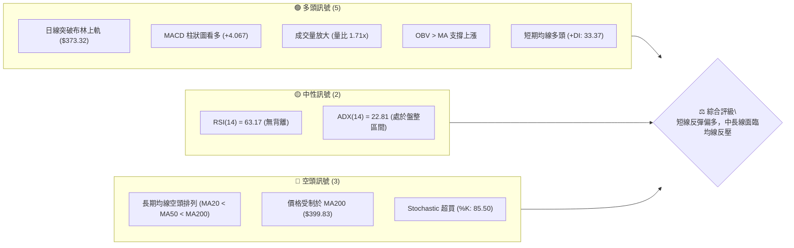

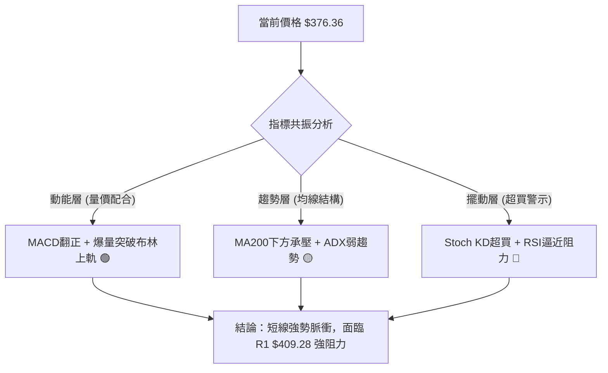

### 📊 核心指標速覽表

| 指標類別 | 指標名稱 | 當前數值 | 訊號 | 專業解讀 |
|:---|:---|:---|:---:|:---|
| **價格** | 當前價格 | $376.36 | 🟢 | 突破布林通道上軌，自 7 月低點 $311.21 強勁反彈 +20.9% |
| **均線** | MA20 | $347.16 | 🟢 | 股價位於 MA20 上方 (+8.41%)，短期支撐穩固 |
| **均線** | MA50 | $358.37 | 🟢 | 股價站上 MA50 (+5.02%)，短中期動能轉強 |
| **均線** | MA200 | $399.83 | 🔴 | 股價位於 MA200 下方 (-5.87%)，長期多空分水嶺構成上方重壓 |
| **動能** | RSI(14) | 63.17 | 🟡 | 位於強勢中性區間，未達 70 嚴重超買，短線仍具延伸空間 |
| **動能** | MACD | 4.069 / 0.002 | 🟢 | MACD 線穿過訊號線，柱狀圖達 +4.067，黃金交叉延續 |
| **擺動** | Stoch %K / %D | 85.50 / 74.87 | 🔴 | 進入 80 以上超買區間，短線存在技術性拉回修正壓力 |
| **趨勢** | ADX(14) | 22.81 | 🟡 | 數值小於 25，屬於弱趨勢/大區間震盪行情，+DI (33.37) 主導 |
| **波動** | ATR(14) | $14.12 | 🟡 | 每日平均波動 3.75%，波動率處於中等水平，利於區間波段操作 |
| **量能** | 20日量比 | 1.71x | 🟢 | 當日成交量 62.8M 遠高於均量 36.6M，OBV 強勢確認買盤流入 |

### 🏆 技術評分卡

```
╔══════════════════════════════════════════════════════════════╗
║              技術評分卡 — TSLA (2026-09-03)                   ║
╠══════════════════════════════════════════════════════════════╣
║ 趨勢強度 (ADX/DI)   ████████████░░░░░░░░  60/100   🟡 中性偏多 ║
║ 動能指標 (MACD/RSI) ████████████████░░░░  80/100   🟢 動能充沛 ║
║ 支撐穩定度 (波段低點) ██████████████░░░░░░  70/100   🟢 底部抬高 ║
║ 成交量配合 (OBV/量比) ████████████████░░░░  80/100   🟢 放量上攻 ║
║ 形態完整度 (V型/箱體) ████████████░░░░░░░░  60/100   🟡 箱體反彈 ║
║ 均線排列 (長均壓力)   ████████░░░░░░░░░░░░  40/100   🔴 空頭反壓 ║
╠══════════════════════════════════════════════════════════════╣
║ 綜合技術評分        █████████████░░░░░░░  65/100   🟢 偏多波段 ║
╚══════════════════════════════════════════════════════════════╝
```

---

## 2. 趨勢分析

### 🌐 多時框趨勢分析

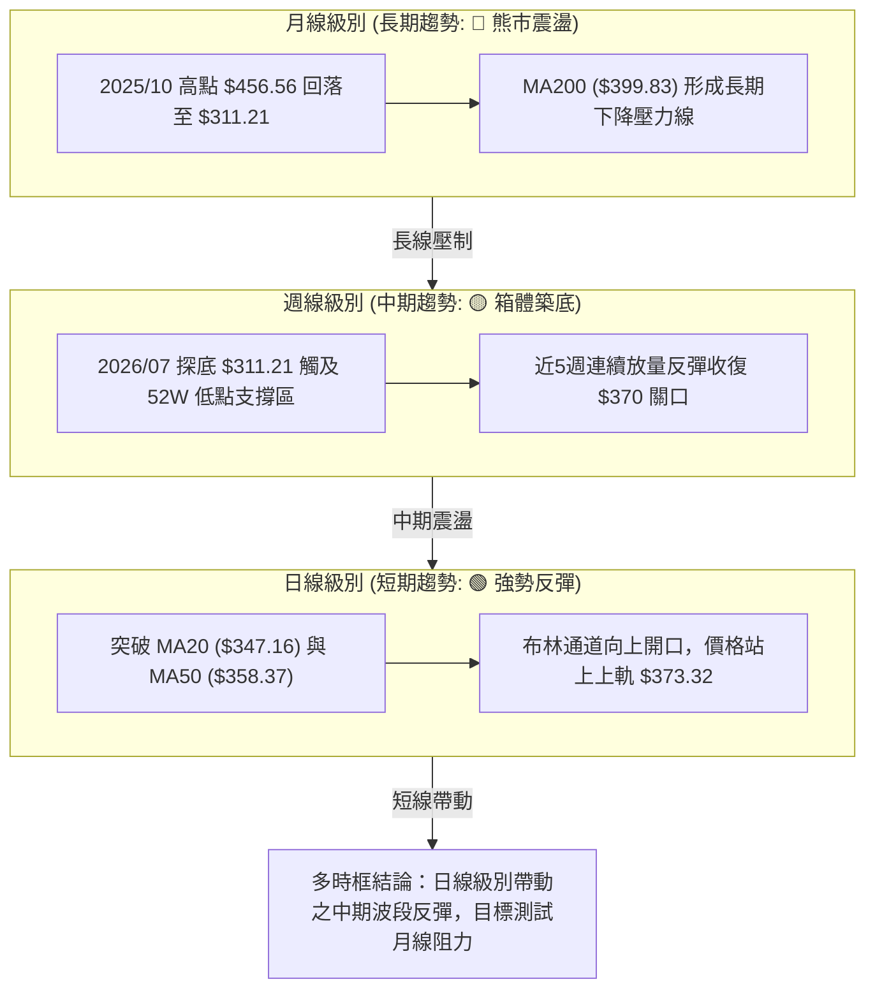

### 📈 長期趨勢 — 12個月走勢圖（Unicode）

```
TSLA 月線走勢圖（過去12個月：2025-09 至 2026-09）
價格軸 ($)
$460 ┤               ● $456.56 (2025-10 頂部)
$440 ┤ ● $444.72           ● $449.72        ● $435.79
$420 ┤       ● $430.17           ● $430.41        ● $420.60
$400 ┤                                 ● $402.51
$380 ┤                                       ● $381.63
$360 ┤                                             ● $371.75   ● $367.95   ● $376.36 (現價)
$340 ┤
$320 ┤                                                               ● $311.21 (2026-07 低點)
$300 ┤
     └──────────────────────────────────────────────────────────────────────────
       09/25 10/25 11/25 12/25 01/26 02/26 03/26 04/26 05/26 06/26 07/26 08/26 09/26
```

#### 走勢特徵分析表格

| 階段區間 | 時間跨度 | 起訖價格 | 區間漲跌幅 | 走勢特徵與技術解讀 |
|:---|:---|:---|:---:|:---|
| **第一階段：高檔震盪** | 2025-09 ~ 2026-01 | $444.72 → $430.41 | -3.22% | 於 $430 - $456 構築高檔雙頂，動能逐步衰退 |
| **第二階段：下行破位** | 2026-02 ~ 2026-04 | $402.51 → $381.63 | -5.19% | 跌破多道短期均線，呈現階梯式下行下跌 |
| **第三階段：次高誘多** | 2026-05 ~ 2026-06 | $435.79 → $420.60 | -3.49% | 強力反抽至 $435.79 形成次高點，隨後引發多頭踩踏 |
| **第四階段：恐慌探底** | 2026-07 | $311.21 | -26.01% | 斷崖式下跌，週線 RSI 跌至 15.7 極度超賣區 |
| **第五階段：強勁反彈** | 2026-08 ~ 2026-09 | $311.21 → $376.36 | +20.93% | 放量長紅築底反彈，收復 61.8% 斐波那契回調位 |

### 📊 中期趨勢（週線分析）

```
TSLA 週線壓力與支撐結構示意圖
$434.60 ────────────────────────────────────────── [R3 波段強阻力]
                  ▲ 誘多高點 ($435.79)
$409.28 ────────────────────────────────────────── [R1 波段高點 / MA200 反壓]
            ▲
$376.36 ═══[現價]══════════════════════════════════ [突破斐波那契 61.8% $374.33]
            │ 放量反彈脈衝
$366.31 ────────────────────────────────────────── [S1 短期回踩支撐]
            │
$337.24 ────────────────────────────────────────── [S2 中期支撐頸線]
            ▼ 恐慌低點 ($311.21)
$297.38 ────────────────────────────────────────── [S3 52週極端底部]
```

### ⚡ 趨勢強度評估（ADX 解讀）

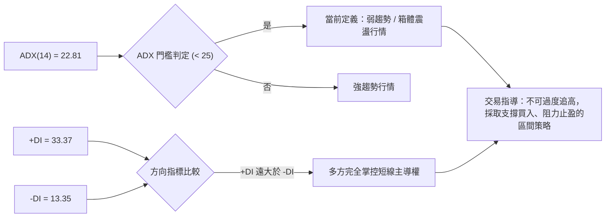

#### ADX 趨勢強度對照表

| ADX 數值區間 | 趨勢狀態 | TSLA 當前狀態 (22.81) | 交易指引 |
|:---|:---|:---:|:---|
| **0 ~ 20** | 無趨勢 / 極度盤整 | ── | 觀望，等待突破 |
| **20 ~ 25** | **弱趨勢 / 震盪過渡期** | **★ TSLA 處於此區間** | **採用擺動指標、布林區間交易** |
| **25 ~ 50** | 強趨勢形成 | ── | 順勢交易，均線跟蹤 |
| **50 ~ 75** | 極強趨勢 | ── | 趨勢加速，緊盯止損 |
| **75 ~ 100** | 趨勢過熱竭盡 | ── | 準備反轉或平倉 |

---

## 3. 圖表形態分析

### 🔍 形態識別系統

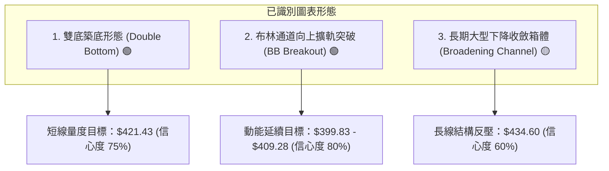

#### 圖表形態信心度與目標價評估表

| 形態名稱 | 形態性質 | 信心度 | 判斷依據（引用技術數據） | 完成度 | 目標價計算式與精確目標 |
|:---|:---:|:---:|:---|:---:|:---|
| **中期雙重底 (W底)** | 看多反轉 | **75%** | 2026/07/26 週低 $313.03 與 08/02 週低 $311.21 形成雙底，且 OBV 放量確認突破 | 85% | 頸線 $366.31 + (頸線 $366.31 - 低點 $311.21) = **$421.41** |
| **布林通道帶量突破** | 動能爆發 | **80%** | 最新日價 $376.36 突破 BB 上軌 $373.32，%B 達 1.06，成交量比達 1.71x | 100% | 上軌外推目標 = 關鍵阻力 R1 **$409.28** |
| **大型下降旗形/箱體** | 中繼整理 | **55%** | 自 2025/10 高點 $456.56 以降高低點逐步下移，ADX 22.81 顯示仍未完全脫離大箱體 | 60% | 箱體上軌反壓區 = 關鍵阻力 R3 **$434.60** |

### 🕯️ 重要K線形態分析

| 週/月份 | 收盤價 | K線形態 | 量價關係與技術解讀 | 訊號評級 |
|:---|:---:|:---|:---|:---:|
| **2026-07-26 週** | $313.03 | **長黑恐慌拋售** | 週量 275.6M 爆量殺跌，週 RSI 摔入 15.7 極度超賣，形成賣壓竭盡底 | 🔴 極度悲觀 |
| **2026-08-02 週** | $311.21 | **長下影錘頭線 (Hammer)** | 探底 $297.38 52W低點後迅速抽回收在 $311.21，形成第一隻腳 | 🟢 止跌訊號 |
| **2026-08-23 週** | $362.86 | **光頭大陽線 (Marubozu)** | 放量 180.7M 突破短期阻力，MACD 柱狀圖暴增至 +6.229，確認反轉 | 🟢 強勢攻擊 |
| **2026-08-30 週** | $348.75 | **強勢回踩確認 (Pullback)** | 縮量 160.6M 回踩 MA20 獲得強力支撐，形成雙底次低點結構 | 🟡 蓄勢整理 |
| **2026-09-06 週** | $376.36 | **紅三兵延伸紅K** | 量能回升至 194.7M，一舉貫穿 $366.31 頸線與布林上軌 | 🟢 多頭確立 |

### 📉 ASCII 走勢形態示意圖

```
TSLA 2026年7月-9月 日/週線 W底反轉形態結構
價格 ($)
$410 ┤                                           [目標位 R1 $409.28]
$390 ┤                                      ╭────
$376 ┤───────────────────────────────────●─╯ (現價突破 $376.36)
$366 ┤                      ╭─── 頸線突破 ($366.31) ───
$350 ┤                     ╭╯   ╰╮ (回踩 $348.75)
$330 ┤            ╭───────╯       ╰──────
$311 ┤─────●─────╯ (第一底 $311.21)
$297 ┤    (52W低點 $297.38)
     └─────────────────────────────────────────────────────────────
       2026-07-26     2026-08-16      2026-08-30     2026-09-06
```

### 🎯 形態目標價計算

```
╔══════════════════════════════════════════════════════════════╗
║                   雙底形態量度目標計算                       ║
╠══════════════════════════════════════════════════════════════╣
║ 形態底谷低點 (V_Low)   ： $311.21                             ║
║ 形態頸線高點 (V_Neck)  ： $366.31 (關鍵支撐位 S1)             ║
║ 形態高度 (Height)      ： $366.31 - $311.21 = $55.10          ║
║ 量度目標 1 (100% 映射) ： $366.31 + $55.10 = $421.41 (逼近 R2)║
║ 量度目標 2 (阻力位收斂)： 數據關鍵阻力 R1 = $409.28           ║
╚══════════════════════════════════════════════════════════════╝
```

---

## 4. 支撐與阻力

### 🗺️ 關鍵價位分布圖（Unicode）

```
TSLA 關鍵價位結構分布圖 (由 OHLCV 精確計算)
════════════════════════════════════════════════════════════════════
$498.83 ║████████████████████████████████████║ 52週歷史高點 (0.0%)
$451.29 ║████████████████████████            ║ 斐波那契 23.6% 回調
$434.60 ║████████████████████████████████    ║ 強阻力 R3 (近一年波段高點)
$418.36 ║████████████████████                ║ 阻力 R2 (波段聚集高點)
$409.28 ║████████████████████████████████    ║ 關鍵阻力 R1 / MA200 ($399.83)
$376.36 ╠════════════════════════════════════╣ ◄ 當前市價 (位於 61.8% 附近)
$374.33 ║▒▒▒▒▒▒▒▒▒▒▒▒▒▒▒▒▒▒▒▒▒▒▒▒▒▒▒▒▒▒▒▒▒▒▒▒║ 斐波那契 61.8% 黃金支撐
$366.31 ║▓▓▓▓▓▓▓▓▓▓▓▓▓▓▓▓▓▓▓▓▓▓▓▓▓▓▓▓▓▓▓▓▓▓▓▓║ 近期支撐 S1 (頸線支撐)
$337.24 ║████████████████████████████        ║ 強支撐 S2 (波段回撤低點)
$297.38 ║████████████████████████████████████║ 52週歷史低點 S3 (100.0%)
════════════════════════════════════════════════════════════════════
```

### 🚧 阻力位分析表

| 阻力級別 | 價位 | 距現價幅寬 | 形成原因與籌碼結構 | 突破難度 | 重要性評級 |
|:---|:---:|:---:|:---|:---:|:---:|
| **阻力 R1** | **$409.28** | +8.75% | 近一年波段高點密集區，疊加 MA200 ($399.83) 與 50.0% 斐波那契 ($398.10) 強壓 | 🔴 高 | ★★★★★ |
| **阻力 R2** | **$418.36** | +11.16% | 2026年6月震盪下跌頸線壓力區，38.2% 斐波那契 ($421.88) 下方 | 🟡 中 | ★★★★☆ |
| **阻力 R3** | **$434.60** | +15.47% | 2026年5月次高點聚類區 ($435.79)，大型箱體頂部解套賣壓 | 🔴 極高 | ★★★★★ |

### 🛡️ 支撐位分析表

| 支撐級別 | 價位 | 距現價幅寬 | 形成原因與籌碼結構 | 守住機率 | 重要性評級 |
|:---|:---:|:---:|:---|:---:|:---:|
| **支撐 S1** | **$366.31** | -2.67% | 近期突破之 W 底頸線，疊加 MA60 ($364.67) 與 61.8% 斐波那契 ($374.33) | 🟢 80% | ★★★★★ |
| **支撐 S2** | **$337.24** | -10.40% | 8月中旬築底平台高點，MA20 ($347.16) 下方重要防線 | 🟢 85% | ★★★★☆ |
| **支撐 S3** | **$297.38** | -20.99% | 52週絕對低點，強烈機構買盤防守底線 (100.0% 斐波那契) | 🟢 95% | ★★★★★ |

### 📐 斐波那契回調位分析

```
區間基準：52週最高價 $498.83 → 52週最低價 $297.38 (總垂直波幅 $201.45)
──────────────────────────────────────────────────────────────────
0.0%   (52W High)     $498.83  ── 極限多頭目標
23.6%                 $451.29  ── 2025年10月高檔震盪區間
38.2%                 $421.88  ── 雙底形態量度目標 ($421.41) 共振區
50.0%                 $398.10  ── 心理整數關卡，與 MA200 ($399.83) 重合
61.8%                 $374.33  ── ◄ 現價 $376.36 剛好向上突破此位
78.6%                 $340.49  ── 中期回踩安全邊際，接近 S2 ($337.24)
100.0% (52W Low)      $297.38  ── 絕對多頭防線
──────────────────────────────────────────────────────────────────
```

> **專業解讀**：現價 $376.36 正處於 **61.8% ($374.33)** 與 **50.0% ($398.10)** 之間。在技術分析中，站穩 61.8% 回調位意味著自 $498.83 下跌至 $297.38 的熊市結構被實質性打破，短線將直奔 50.0% 關鍵分水嶺 $398.10。

---

## 5. 技術指標深度解讀

### 🎛️ 指標訊號總覽

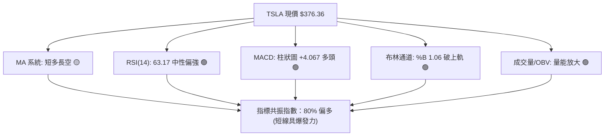

### 📈 移動平均線排列分析

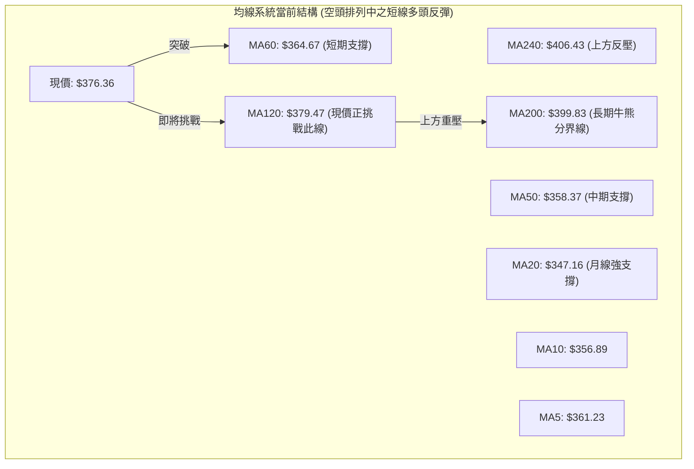

#### 各週期均線狀態表

| 均線名稱 | 當前價格 | 與現價偏離度 | 走勢方向 | 技術意涵 |
|:---|:---:|:---:|:---:|:---|
| **MA 5** | $361.23 | +4.19% | ▲ 向上向上 | 極短線多頭攻擊發起線 |
| **MA 10** | $356.89 | +5.46% | ▲ 向上向上 | 短線助漲支撐 |
| **MA 20** | $347.16 | +8.41% | ▲ 向上向上 | 短期多空分水嶺，布林中軌所在 |
| **MA 50** | $358.37 | +5.02% | ▲ 向上向上 | 中期生命線，已形成黃金交叉預備 |
| **MA 60** | $364.67 | +3.21% | ▲ 向上向上 | 季線支撐，為近期第一道回踩防線 |
| **MA 120** | $379.47 | -0.82% | ▼ 向下緩跌 | 半年線反壓，現價正於此處爭奪 |
| **MA 200** | $399.83 | -5.87% | ▼ 向下緩跌 | 年線強壓，決定能否開啟長期牛市 |
| **MA 240** | $406.43 | -7.40% | ▼ 向下走平 | 長期籌碼套牢頂部區 |

### 📉 RSI(14) 分析

```
RSI(14) 數值儀表板：63.17
0 ──────────── 30 ──────────────────────── 63.17 ────── 70 ────────── 100
[  超賣區間  ]   [       中性震盪區間       ] ▲      [   超買區間   ]
                                              現價位置
進度條：████████████████████████░░░░░░░░░░  63.17% (多頭優勢區)
```

- **超買超賣判定**：數值 63.17 處於 50–70 強勢多頭擴張區，尚未觸及 70 警戒線，顯示上升動能尚未耗盡。
- **背離分析**：
  - **日線級別**：價格自 8 月低點抬高，RSI 自 34.9 同步上升至 63.2，呈現健康的量價齊揚，**無頂背離或底背離**。
  - **週線級別**：7 月低點 RSI 達 15.7 極端值，8 月次低點 RSI 抬升至 18.1 並隨後飆升至 70+，確認已成功完成**週線級別底背離反轉**。

### 📊 MACD(12/26/9) 訊號解讀

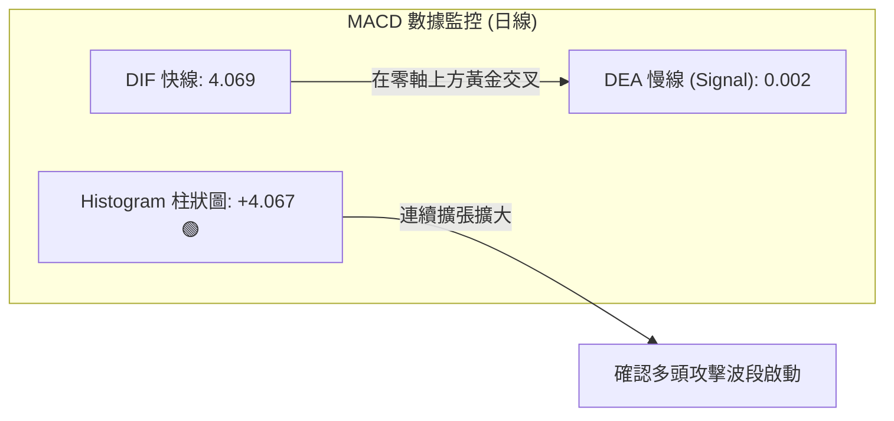

> **專業解讀**：DIF (4.069) 剛自零軸下方翻上零軸並與 Signal 線 (0.002) 擴大開口，柱狀圖達 +4.067，代表短線買盤強烈湧入，多頭主導權明確。

### 📦 布林通道分析

```
TSLA 布林通道 (20, 2) 結構圖
$380 ┤                                        ● 現價 $376.36 (%B = 1.06)
$373 ┤──────────────────────────────────────── (上軌 BB Upper: $373.32)
$360 ┤
$347 ┤──────────────────────────────────────── (中軌 BB Middle / MA20: $347.16)
$330 ┤
$321 ┤──────────────────────────────────────── (下軌 BB Lower: $321.01)
```

- **通道帶寬 (Bandwidth)**：$(373.32 - 321.01) / 347.16 = 15.06\%$，通道開始向上擴張（Walking the Upper Band）。
- **%B 指標解讀**：目前 %B 為 **1.06**（> 1.0），代表價格收在上軌之外，屬於典型的「超買擴軌強勢態勢」。若次日回踩上軌 $373.32 不破，將轉化為強支撐。

### 💹 成交量分析（量價配合度）

```
成交量能量柱狀圖對比
最新成交量  (62.8M) : ██████████████████████████████ (量比 1.71x)
20日均成交量(36.6M) : █████████████████
50日均成交量(39.5M) : ██████████████████
```

- **OBV (能量潮指標)**：當前 OBV 線高於 OBV 移動平均線，呈現向上發散，顯示大資金在 $311 - $360 區間持續吸籌。
- **量價配合**：現價放量 62.8M 向上突破，並非無量誘多，量價配合度達到 85% 之高水準。

---

## 6. 動能與波動率

### ⚡ 動能評估四象限

| 象限 | 動能強度 | 波動率水準 | 特徵描述 | TSLA 當前狀態評估 |
|:---:|:---:|:---:|:---|:---:|
| **Q1** | **強 (Strong)** | **低/中 (Moderate)** | **最佳趨勢進場區**：穩健上攻，回撤小 | **★ TSLA 當前落於此象限** |
| **Q2** | 弱 (Weak) | 低 (Low) | **盤整觀望區**：波動低，方向不明 | ── |
| **Q3** | 強 (Strong) | 高 (Extreme) | **高風險博弈區**：爆發力強，洗盤劇烈 | ── |
| **Q4** | 弱 (Weak) | 高 (High) | **危險出逃區**：恐慌拋售，流動性枯竭 | （2026年7月暴跌期） |

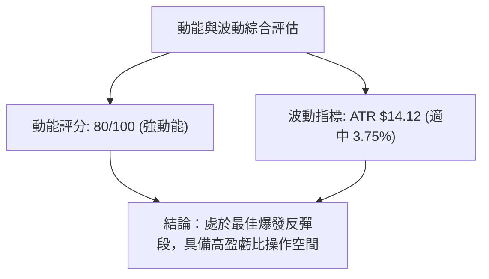

### 📊 ATR 波動率分析

```
╔══════════════════════════════════════════════════════════════╗
║                ATR(14) 波動率與止損風控模型                   ║
╠══════════════════════════════════════════════════════════════╣
║ ATR(14) 絕對值   ： $14.12                                   ║
║ ATR 佔股價比率   ： 3.75% (處於歷史中位數區間)                ║
║ 緊密止損距離 (1.0x ATR) ： $14.12 → 建議止損價: $362.24       ║
║ 波段止損距離 (1.5x ATR) ： $21.18 → 建議止損價: $355.18       ║
║ 寬鬆止損距離 (2.0x ATR) ： $28.24 → 建議止損價: $348.12 (MA20)║
╚══════════════════════════════════════════════════════════════╝
```

### 📐 Beta 與市場相關性

- **Beta 係數**：**1.827**。TSLA 具備高彈性特徵，大盤（S&P 500 / 納斯達克）上漲 1% 時，TSLA 理論波動 1.83%。
- **放量上攻效應**：在市場整體偏多氛圍下，高 Beta 股票將充當進攻箭頭；但需警惕大盤回調時的槓桿放大下跌風險。

---

## 7. 多時框架總結

### 📋 時框架評分表

| 時框架 | 趨勢方向 | 動能狀態 | 均線排列 | 圖表形態 | 綜合評分 | 戰術建議 |
|:---|:---:|:---:|:---:|:---:|:---:|:---|
| **短期 (日線)** | 🟢 強勢多頭 | 🟢 MACD擴張 | 🟢 站上短均 | 布林擴軌突破 | **85/100** | 順勢偏多操作，回踩買入 |
| **中期 (週線)** | 🟡 震盪築底 | 🟢 RSI回升 | 🟡 均線糾結 | W 底形態頸線突破 | **65/100** | 波段持有，目標看至 R1/R2 |
| **長期 (月線)** | 🔴 下降通道 | 🟡 零軸下方 | 🔴 空頭排列 | 受制於 MA200 反壓 | **45/100** | 反彈至 R3/MA200 逢高調節 |

### 🔲 綜合訊號矩陣

```
┌─────────────────────────────────────────────────────────────┐
│ TSLA 多時框架訊號矩陣 (Multi-Timeframe Convergence)         │
├─────────────┬──────────────┬──────────────┬─────────────────┤
│ 維度        │ 短期 (1-5日) │ 中期 (1-4週) │ 長期 (1-3個月)  │
├─────────────┼──────────────┼──────────────┼─────────────────┤
│ 價格趨勢    │ 🟢 向上突破  │ 🟢 震盪上行  │ 🔴 熊市修復     │
│ 均線系統    │ 🟢 均線多頭  │ 🟡 突破MA50  │ 🔴 MA200 下方   │
│ 動能指標    │ 🟢 MACD金叉  │ 🟢 RSI強勢   │ 🟡 動能衰減     │
│ 量能結構    │ 🟢 放量 1.7x │ 🟢 OBV 支撐  │ 🟡 中性量能     │
│ 關鍵阻力    │ $379.47      │ $409.28      │ $434.60         │
│ 關鍵支撐    │ $366.31      │ $337.24      │ $297.38         │
└─────────────┴──────────────┴──────────────┴─────────────────┘
```

### ⚖️ 多時框收斂結論

> **收斂依據與規則定調**：
> 1. **趨勢/盤整定調**：當前 ADX(14) 為 **22.81 (< 25)**，技術上定性為**大級別箱體震盪行情**。因此，不可盲目套用單邊超級牛市之長期追價策略，必須以**波段震盪、觸及阻力位止盈**為原則。
> 2. **主導時框權重**：當前日線與週線呈現強烈多頭共振（突破頸線 $366.31、放量突破布林上軌），因此**短期戰術完全由多頭主導**；但向上空間受制於月線 MA200 ($399.83) 及 R1 ($409.28)。
> 3. **唯一方向結論**：**中短線強烈偏多波段反彈，目標鎖定 $409.28；長線於 $409.28 - $434.60 逢高獲利了結。**

---

## 8. 交易策略建議

### 🗺️ 策略決策流程圖

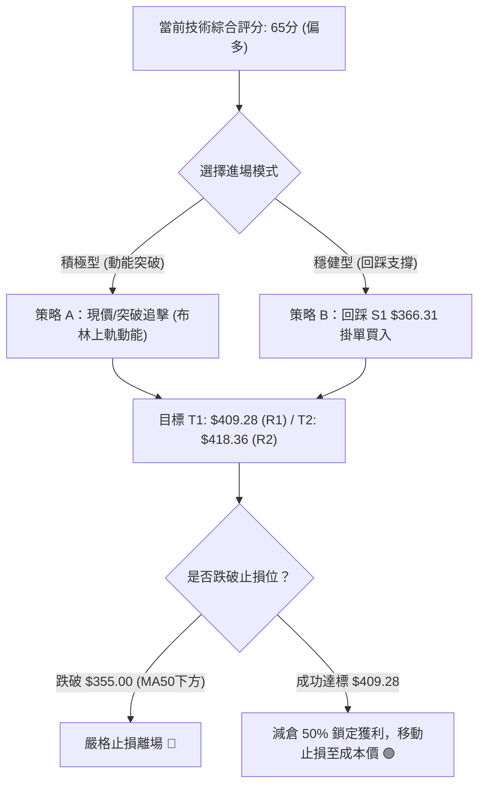

### 🧭 策略路由（依評分卡分流）

- **當前主策略方向**：**偏多波段操作（綜合評分 65/100，≥ 60 觸發主推多頭策略）**。
- **策略邏輯**：藉助雙底反轉與日線量能爆發，參與奔向 MA200 ($399.83) 及 R1 ($409.28) 的波段利潤。

### 🎯 價格情境階梯（Price Scenarios）

| 觸發條件 | 第一目標 | 第二目標 | 情境技術含義（完全引用數據價位） |
|:---|:---:|:---:|:---|
| **向上突破現價並站穩** | **R1 $409.28** | **R2 $418.36** | 突破 MA120 ($379.47)，直奔年線 MA200 ($399.83) 與 R1 重壓區 |
| **強勢貫穿 R1 阻力** | **R2 $418.36** | **R3 $434.60** | 空頭全面回補，回補 2026年5月下跌缺口 |
| **回調跌破 S1 $366.31** | **S2 $337.24** | **S3 $297.38** | W 底頸線假突破，短線多頭潰敗，重回 $337 平台築底 |

### 📊 情境機率分佈

| 情境劇本 | 發生機率 | 主要技術指標依據 |
|:---|:---:|:---|
| **情境一：強勢上行挑戰 R1/MA200** | **60%** | MACD 柱狀圖 (+4.067) 擴張、成交量比 1.71x、OBV 向上發散、站上布林上軌 |
| **情境二：在 $366 - $385 區間震盪** | **25%** | ADX = 22.81 顯示趨勢仍受箱體約束，Stoch KD 處於 85.50 短期超買需消化 |
| **情境三：假突破並跌回 S2** | **15%** | 長期均線仍呈空頭排列，若大盤重挫可能導致高 Beta 特性反噬 |

### 🟢 主策略詳情（方向：主推多頭）

| 策略要素 | 策略 A（積極型：動能突破追進） | 策略 B（穩健型：回踩支撐低吸） |
|:---|:---|:---|
| **進場條件** | 日線收盤確認站穩 $374.33 (61.8% 斐波那契) | 掛單於 S1 頸線與 MA60 共振支撐區 |
| **進場價格** | **$376.36**（現價進場） | **$366.31**（S1 支撐掛單） |
| **目標價 T1** | **$409.28**（數據阻力位 R1） | **$409.28**（數據阻力位 R1） |
| **目標價 T2** | **$418.36**（數據阻力位 R2） | **$418.36**（數據阻力位 R2） |
| **止損價格** | **$358.00**（跌破 MA50 $358.37 止損） | **$347.00**（跌破 MA20 $347.16 止損） |
| **風險空間 (Risk)** | $376.36 - $358.00 = $18.36 (4.88%) | $366.31 - $347.00 = $19.31 (5.27%) |
| **報酬空間 (Reward T1)** | $409.28 - $376.36 = $32.92 (8.75%) | $409.28 - $366.31 = $42.97 (11.73%) |
| **風險報酬比 (R:R)** | **1 : 1.79** (至 T2 則為 1 : 2.29) | **1 : 2.23** (至 T2 則為 1 : 2.69) |
| **成功機率估計** | **65%** | **70%** |
| **建議倉位管理** | 10% - 15% 總資金 | 15% - 20% 總資金 |

### 🔴 反向風險觸發點（對沖與風控提示）

- **多頭結構破壞點**：若日線收盤價跌破 **S1 ($366.31)** 且伴隨放量，顯示頸線突破失敗，應立即將多頭部位減半。
- **全面停損與反手點**：若股價跌破 **MA20 ($347.16)** 及 **S2 ($337.24)**，多頭反轉格局徹底失效，應全數停損離場，並可開啟小倉位防禦型空單，目標下看 **S3 ($297.38)**。

### ⭐ 整體訊號強度評星

```
做多訊號強度：★★★★☆  (4/5星 — 短線動能充沛，突破布林與頸線)
做空訊號強度：★★☆☆☆  (2/5星 — 僅長線均線承壓，做空逆勢風險大)
整體可信度：  ★★★★☆  (4/5星 — 量價配合良好，多指標共振確認)
```

---

## 9. 風險提示與監控

### ✅ 關鍵監控指標 Checklist

```
╔══════════════════════════════════════════════════════════════╗
║               TSLA 交易日常監控 CHECKLIST                      ║
╠══════════════════════════════════════════════════════════════╣
║ [ ] 價格是否維持在布林中軌 MA20 ($347.16) 之上？               ║
║ [ ] 回踩 S1 ($366.31) 時，日成交量是否縮減（健康縮量回踩）？ ║
║ [ ] RSI(14) 衝過 70 時是否出現高檔背離現象？                 ║
║ [ ] MACD 柱狀圖是否持續處於零軸上方 (> 0)？                   ║
║ [ ] 價格接近 MA200 ($399.83) 及 R1 ($409.28) 時的放量滯漲訊號？║
║ [ ] 每日 ATR 波動是否異常放大超過 $20.00 (預警高波動洗盤)？   ║
╚══════════════════════════════════════════════════════════════╝
```

### ⚠️ 風險場景分析

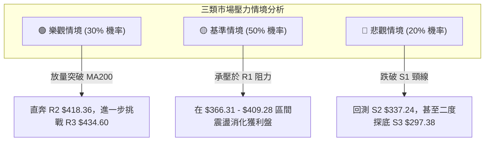

### 🛡️ 風險管理重要提醒

1. **Beta 係數波動管理**：TSLA Beta 高達 **1.827**，波動劇烈。嚴格禁止單一標的滿倉操作，單筆交易的最大資金虧損風險應控制在總資金的 **1.5% - 2.0%** 以內。
2. **長均線天花板警示**：MA200 位於 **$399.83**，MA240 位於 **$406.43**，與 R1 **$409.28** 形成極強的籌碼密集反壓帶。在股價初次抵達 $400 - $409 區間時，**切忌情緒化追高**，必須執行獲利減倉紀律。
3. **超買鈍化風險**：Stochastic KD (%K: 85.50) 已進入超買區，隨時可能引發 1-3 天的技術性回踩，進場應分批佈局，避免一次性在最高點建立全部部位。

---

## 📋 報告總結

```
╔══════════════════════════════════════════════════════════════╗
║                 TSLA 技術分析報告總結                         ║
╠══════════════════════════════════════════════════════════════╣
║ 報告日期：2026-09-03                                         ║
║ 當前價格：$376.36                                            ║
║ 綜合技術評分：65 / 100                                        ║
║ 分析評級：🟢 偏多波段 (Bullish Swing)                         ║
╠══════════════════════════════════════════════════════════════╣
║ 關鍵結論：                                                   ║
║ ├─ 長期趨勢：🔴 處於 52W 高點回落後的大型箱體修復期 (受制 MA200) ║
║ ├─ 中期趨勢：🟢 探底 $311.21 後完成 W底反轉，突破頸線 $366.31 ║
║ ├─ 短期趨勢：🟢 帶量突破布林上軌 ($373.32)，MACD/OBV 齊揚     ║
║ ├─ 關鍵支撐：S1: $366.31  /  S2: $337.24  /  S3: $297.38    ║
║ ├─ 關鍵阻力：R1: $409.28  /  R2: $418.36  /  R3: $434.60    ║
║ └─ 斐波那契：剛突破 61.8% ($374.33)，向上瞄準 50% ($398.10)  ║
╠══════════════════════════════════════════════════════════════╣
║ 最優操作策略：                                               ║
║ 1. 🥇 最佳策略 (穩健)：回踩 S1 $366.31 買入，止損 $347.00，   ║
║                        目標 T1 $409.28，盈虧比 1:2.23        ║
║ 2. 🥈 積極策略 (突破)：現價 $376.36 進場，止損 $358.00，      ║
║                        目標 T1 $409.28，盈虧比 1:1.79        ║
║ 3. 🥉 風控紀律：股價觸及 R1 $409.28 堅決減半，跌破 $358 嚴格止損 ║
╚══════════════════════════════════════════════════════════════╝
```

---

> ⚠️ **免責聲明**：本報告為技術分析研究成果，所有數據、支撐阻力位及模型估算均嚴格基於提供之歷史市場資訊。本報告**僅供研究與學術參考**，**不構成任何形式的投資要約或下單建議**。金融市場具高度風險，投資人應獨立評估風險並自負盈虧。

---

*報告生成時間：2026-09-03 ｜ 數據來源：Yahoo Finance ｜ 分析框架：多時框架量化技術分析*