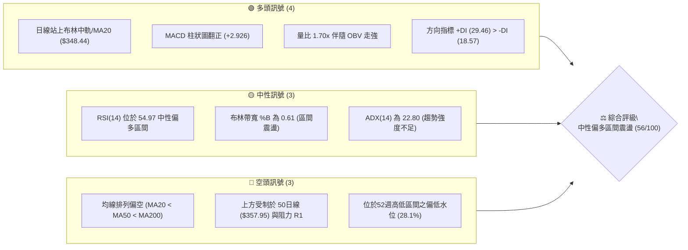
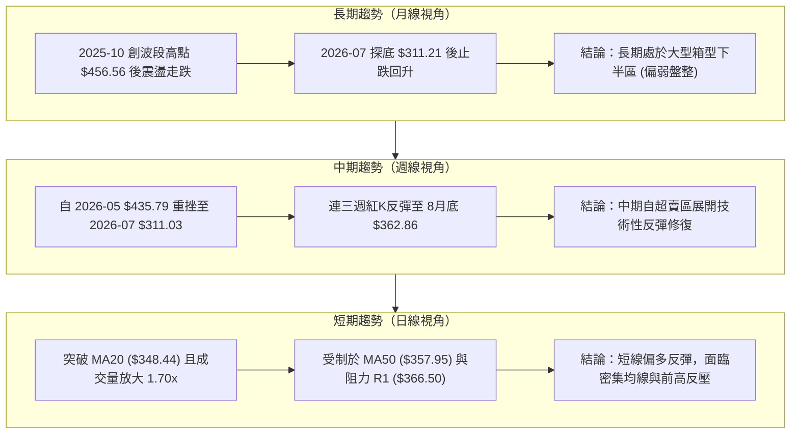
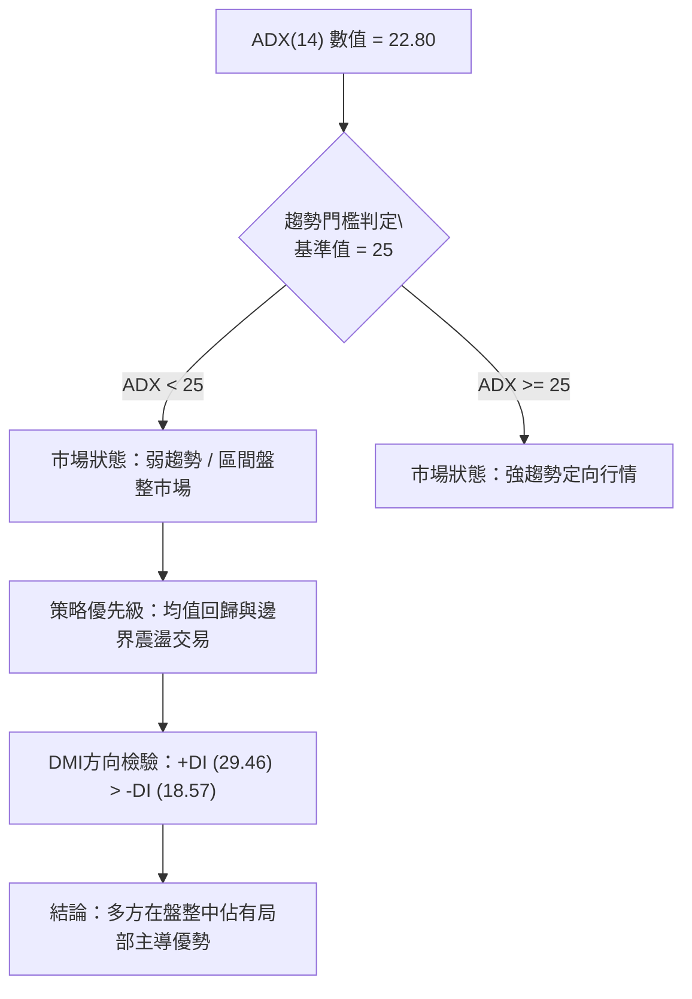
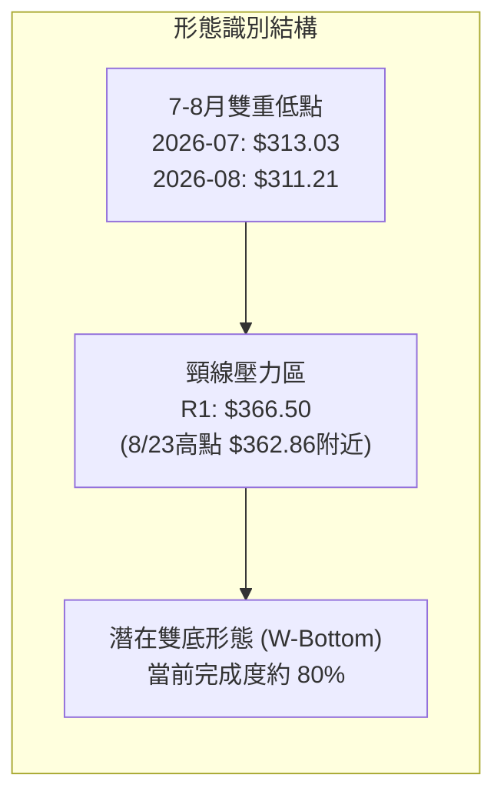
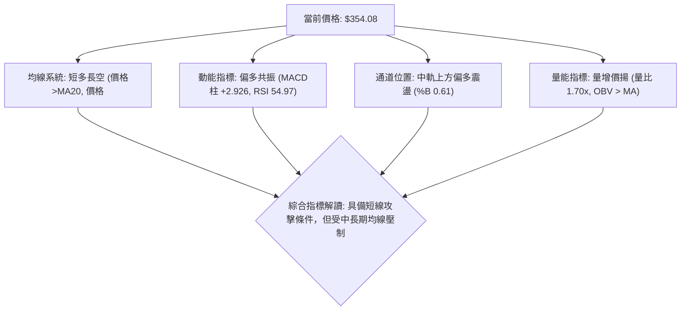
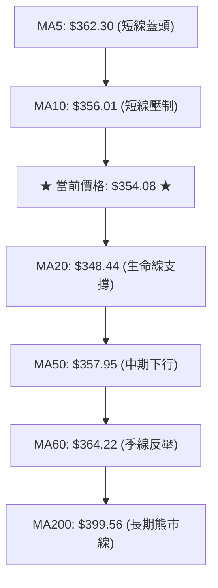
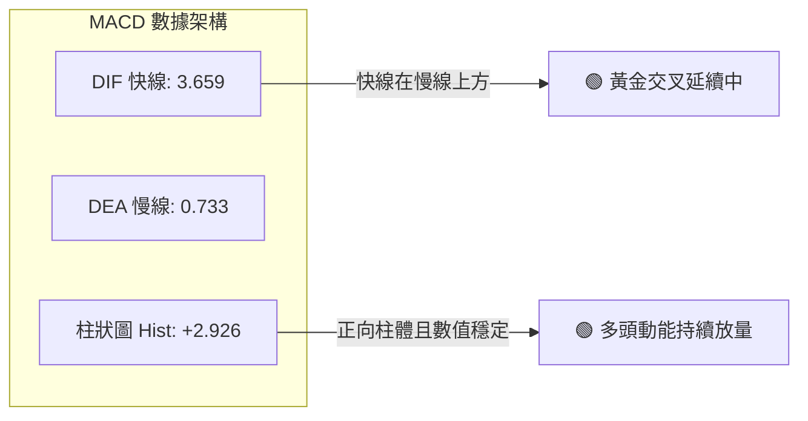
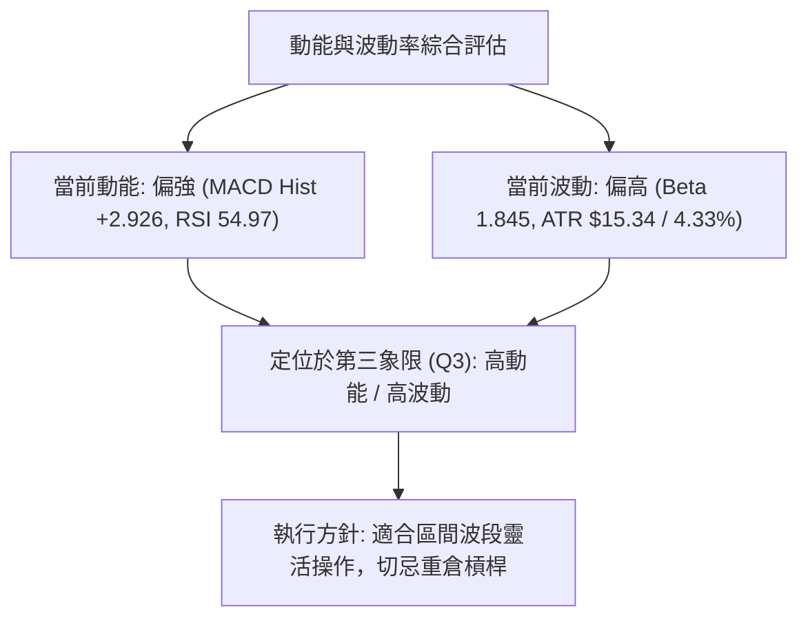
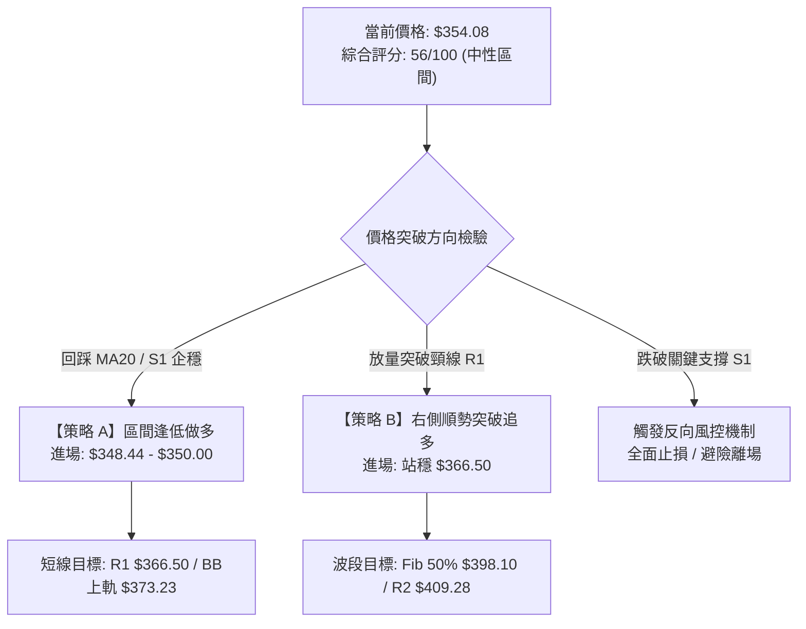
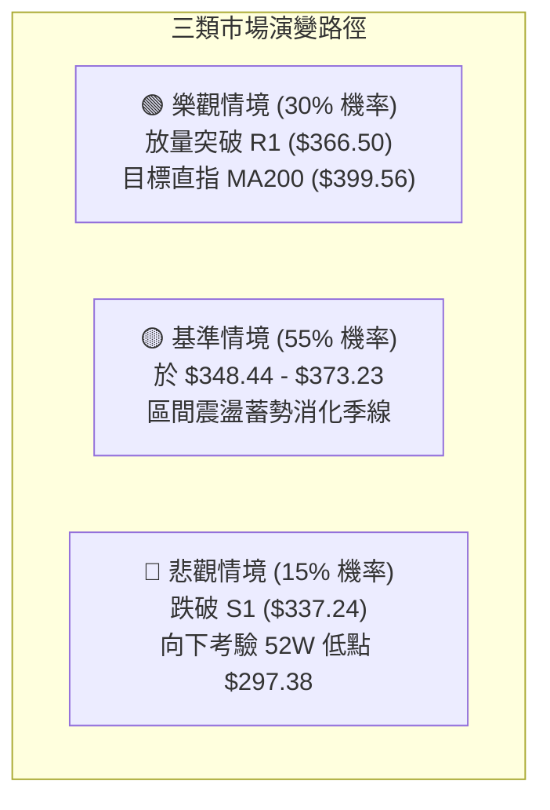

# TSLA 技術分析報告

> **報告日期**：2026-09-04 ｜ **語言**：繁體中文 ｜ **數據來源**：Yahoo Finance ｜ **當前價格**：$354.08

---

## 目錄

| 章節 | 內容 |
|------|------|
| [1. 技術面概覽](#1-技術面概覽) | 訊號儀表板、核心指標、評分卡 |
| [2. 趨勢分析](#2-趨勢分析) | 多時框趨勢、長中短期走勢 |
| [3. 圖表形態分析](#3-圖表形態分析) | 形態識別、K線組合、目標價 |
| [4. 支撐與阻力](#4-支撐與阻力) | 關鍵價位、斐波那契回調 |
| [5. 技術指標深度解讀](#5-技術指標深度解讀) | MA/RSI/MACD/布林/成交量 |
| [6. 動能與波動率](#6-動能與波動率) | 動能評估、ATR、Beta |
| [7. 多時框架總結](#7-多時框架總結) | 時框架評分矩陣 |
| [8. 交易策略建議](#8-交易策略建議) | 多空策略、風險報酬比 |
| [9. 風險提示與監控](#9-風險提示與監控) | 監控指標、風險場景 |
| [10. 報告總結](#10-報告總結) | 核心結論與最佳策略組合 |

---

## 1. 技術面概覽

### 🎯 技術訊號儀表板



---

### 📊 核心指標速覽表

| 指標類別 | 指標名稱 | 當前數值 | 訊號 | 技術解讀 |
|----------|----------|----------|------|----------|
| **價格** | 當前收盤價 | $354.08 | 🟡 | 位於52週區間 28.1% 水位，短線自低位反彈但受制於中期均線 |
| **均線** | MA20 (月線) | $348.44 | 🟢 | 價格站上短期生命線（+1.62%），提供即時下檔動態支撐 |
| **均線** | MA50 (季線) | $357.95 | 🔴 | 價格承壓於季線下方（-1.08%），中期扣抵向下構成直接蓋頭反壓 |
| **均線** | MA200 (年線) | $399.56 | 🔴 | 長期牛熊分界線維持下行，長期空頭壓制格局未解 |
| **動能** | RSI(14) | 54.97 | 🟡 | 位於 50 強弱分水嶺之上，脫離超賣但尚未進入強勢進攻區 |
| **動能** | MACD (12,26,9) | 3.659 / +2.926 | 🟢 | 快線位於慢線上方，Hist 正向擴張，動能具備波段修復特徵 |
| **趨勢** | ADX(14) / DMI | 22.80 | 🟡 | ADX < 25 指示行情屬無趨勢/盤整格局；+DI (29.46) 主導多方 |
| **通道** | 布林通道 (%B) | 0.61 | 🟡 | 穿過中軌向通道上軌 ($373.23) 推進，屬通道內正常波動 |
| **量能** | 成交量 / OBV | 64,559,388 (1.70x) | 🟢 | 量能明顯放大，OBV > MA 指向主力低檔吸籌意願增強 |
| **波動** | ATR(14) | $15.34 (4.33%) | 🟡 | 日內平均振幅較高，交易止損空間須保留至少 1~1.5 倍 ATR |

---

### 🏆 技術評分卡

```
╔══════════════════════════════════════════════════════════════════╗
║                   技術評分卡 — TSLA (2026-09-04)                 ║
╠══════════════════════════════════════════════════════════════════╣
║ 趨勢強度 (ADX/DMI)    █████████░░░░░░░░░░░  45/100  🟡 弱勢盤整  ║
║ 動能指標 (MACD/RSI)   █████████████░░░░░░░  65/100  🟢 動能向上  ║
║ 支撐穩定度 (S1/S2)    █████████████░░░░░░░  65/100  🟢 底部浮現  ║
║ 成交量配合 (OBV/VOL)  ███████████████░░░░░  75/100  🟢 量增價揚  ║
║ 形態完整度 (區間築底) ███████████░░░░░░░░░  55/100  🟡 構建頸線  ║
║ 均線排列結構          ████████░░░░░░░░░░░░  40/100  🔴 空頭壓制  ║
╠══════════════════════════════════════════════════════════════════╣
║ 綜合評分              ███████████░░░░░░░░░  56/100  🟡 區間震盪  ║
╚══════════════════════════════════════════════════════════════════╝
```

---

## 2. 趨勢分析

### 🌐 多時框趨勢分析



---

### 📈 長期趨勢 — 12個月走勢圖（Unicode）

```
TSLA 月線收盤走勢圖（過去12個月：2025-10 至 2026-09）
價格軸 ($)
$460 ┤   ● ($456.56 高點)
$440 ┤       ●       ● ($449.72)                 ● ($435.79)
$420 ┤                                               ● ($420.60)
$400 ┤                   ● ($402.51)
$380 ┤                           ● ($381.63)
$360 ┤                                                   ● ($367.95)
$340 ┤                                                       ● ($354.08 現價)
$320 ┤                                           ● ($311.21 低點)
$300 ┤
     └─┬───┬───┬───┬───┬───┬───┬───┬───┬───┬───┬───┬───────
      10  11  12  01  02  03  04  05  06  07  08  09 (月份)
      2025                                2026
```

#### 走勢特徵分析表格

| 階段區間 | 月份起訖 | 起始與終止價格 | 區間漲跌幅 | 核心技術特徵 |
|----------|----------|----------------|------------|--------------|
| **高檔盤整區** | 2025-10 ~ 2025-12 | $456.56 → $449.72 | -1.50% | 於 $450 水位上方構築雙頂雛形，動能鈍化 |
| **震盪回落期** | 2026-01 ~ 2026-03 | $430.41 → $371.75 | -13.63% | 連續三個月收陰，跌破短期上升趨勢線 |
| **短暫反彈期** | 2026-04 ~ 2026-05 | $381.63 → $435.79 | +14.19% | 季報與題材驅動的反彈，受阻於 $440 壓力區 |
| **恐慌探底期** | 2026-06 ~ 2026-07 | $420.60 → $311.21 | -26.01% | 帶量長黑下殺，接近 52週低點 $297.38 後止跌 |
| **底部反彈期** | 2026-08 ~ 2026-09 | $367.95 → $354.08 | -3.77% | 於 $311 附近展開強勁修復，目前於 $350 水平盤整 |

---

### 📊 中期趨勢（週線分析）

```
TSLA 週線關鍵架構示意圖（近期波動區間）
$435.79 ═════════════════════════════════ 05-31 週波段頂點
           ╲
            ╲
$391.00 ─────╲──────── 06-07 跌破中樞
              ╲
$311.21 ───────┴─────────────── 07-26 ~ 08-02 雙週打底探低（超賣 RSI: 15.7）
                 ▲
                  ╲────── 反彈至 08-23 收盤 $362.86
                           當前週收盤：$354.08（中軌上方整固）
```

- **週線動能修復**：2026-07-26 當週 RSI 曾探底至 15.7 之極端超賣區，伴隨 MACD 柱狀圖萎縮至 -8.365。隨後展開連三週之報復性反彈，MACD 柱狀圖由負轉正，目前維持在 +2.926，顯示中期殺跌賣壓已顯著釋放。
- **均線夾心狀態**：週線當前卡在下跌中的中期均線群與反彈的短期均線之間，短線漲勢在 $362.86 遇阻後進入橫盤消化階段。

---

### ⚡ 趨勢強度評估（ADX 解讀）



#### ADX 指標強度對照表

| 指標變數 | 當前讀數 | 門檻區間 | 技術定義與市場行為 |
|----------|----------|----------|--------------------|
| **ADX(14)** | **22.80** | `< 25` | **無趨勢 / 盤整市場**：動能無法維持單邊推動，追高殺跌易遭雙巴 |
| **+DI (多方)** | **29.46** | `> 25` | **多頭主導**：買盤在短線回調中仍具備接刀買盤，多方力道佔優 |
| **-DI (空方)** | **18.57** | `< 20` | **空方衰退**：自 7 月份極端拋售後，空頭殺跌動能持續退潮 |
| **綜合判定** | **+DI > -DI** | `ADX < 25` | **偏多盤整結構**：交易應以低吸高拋為原則，不可過度期待單邊噴出 |

---

## 3. 圖表形態分析

### 🔍 形態識別系統



#### 形態信心度與目標價評估表

| 形態名稱 | 信心度 | 判斷依據（引用數據） | 完成度 | 目標價推算與計算式 |
|----------|--------|----------------------|--------|--------------------|
| **雙重底 (W-Bottom)** | **65%** | 兩次低點分別落於 2026-07-26 之 $313.03 與 2026-08-02 之 $311.21（接近 52W 低點 $297.38），兩次探底量縮後放量反彈 | **80%** | **目標價：$421.79**<br>計算式：頸線 R1 ($366.50) + 形態高度 [$366.50 - 低點 $311.21 = $55.29] = **$421.79** (高度貼近 Fib 38.2% 之 $421.88) |
| **布林帶向上擠壓突破** | **70%** | 價格站上 BB 中軌 ($348.44)，%B 達到 0.61，伴隨 1.70x 量比推升 | **85%** | **目標價：$373.23**<br>計算式：直接指向布林通道上軌 **$373.23** (與 Fib 61.8% $374.33 共振) |
| **長期下降楔形** | **40%** | 數據不足（歷史跨度僅展示區間震盪與急跌反彈），缺乏完整收斂邊界 | 30% | *訊號不足，僅做指標型解讀，不預設幾何目標* |

---

### 🕯️ 重要K線形態分析

| 週期/月份 | 收盤價 | K線形態特徵 | 技術面解讀 | 多空訊號 |
|-----------|--------|-------------|------------|----------|
| **2026-06** | $420.60 | 烏雲蓋頂 / 帶上影長黑 | 高檔反彈失敗，空方開始全面摜壓，跌破前月低點 | 🔴 強空 |
| **2026-07** | $311.21 | 恐慌長黑破位棒 | 一個月內重挫逾百點，極端超賣（週 RSI 探 15.7），呈現恐慌盤竭盡 | 🔴 轉 🟡 |
| **2026-08** | $367.95 | 長下影強勢吞噬大陽線 | 單月自 $311 反彈至 $367.95，實體收復 7 月跌幅過半，確認打底 | 🟢 強多 |
| **2026-09 (迄今)** | $354.08 | 高位縮量回踩十字星 | 挑戰 R1 ($366.50) 未果後之技術性休整，回踩 MA20 尋求確認 | 🟡 中性整固 |

---

### 📉 ASCII 走勢形態示意圖

```
TSLA 日線級別潛在「W底」反彈頸線突破示意圖
價格 ($)
$375 ┤                                                (BB上軌 $373.23)
$366.50 ┼───────────────────────╭───╮───────────────── 頸線 R1 ($366.50)
$360 ┤                         │   │
$354.08 ┼─────────────────────┼───┼─● (現價 $354.08)
$348.44 ┼───────╭──╮──────────│───│───────────────── MA20 中軌
$337.24 ┼───────│──│───╮      │   │                   支撐 S1
$320 ┤          │  │   │  ╭───╯   ╰───
$311.21 ┼──╭───╯  ╰───╯  │                        第一低點 / 第二低點
$297.38 ┼──┴──────────────┴──────────────────────── 強支撐 S2 (52W Low)
            07/26       08/02        08/23   09/04
```

---

### 🎯 形態目標價計算

若日線放量收盤確認站穩頸線阻力位 **R1 ($366.50)**，雙重底形態將宣告正式確立：

1. **基礎形態參數**：
   - 形態頸線：$366.50 (阻力 R1)
   - 形態谷底低點：$311.21 (2026-08-02 週線收盤低點)
   - 垂直高度 ($H$)：$366.50 - $311.21 = **$55.29**
2. **第一等幅測量目標 (Conservative Target)**：
   - $\text{Target 1} = \text{頸線} + (H \times 0.618) = \$366.50 + (\$55.29 \times 0.618) = \$366.50 + \$34.17 = \mathbf{\$400.67}$
   - *共振點*：極度貼近 **MA200 ($399.56)** 與 **Fib 50.0% ($398.10)**。
3. **完整等幅測量目標 (Full Measured Move Target)**：
   - $\text{Target 2} = \text{頸線} + H = \$366.50 + \$55.29 = \mathbf{\$421.79}$
   - *共振點*：極度貼近 **Fib 38.2% 回調位 ($421.88)** 與阻力位 **R3 ($418.36)**。

---

## 4. 支撐與阻力

### 🗺️ 關鍵價位分布圖（Unicode）

```
TSLA 價位結構分布圖（引用 OHLCV 聚類與斐波那契回調位）
═══════════════════════════════════════════════════════════════════
$498.83 ║██████████████████████████████║ 52週最高點 (Fib 0.0%)
$451.29 ║████████████████████          ║ 斐波那契 23.6% 回調位
$418.36 ║██████████████████████████    ║ 強阻力 R3 / Fib 38.2% ($421.88)
$409.28 ║████████████████████          ║ 波段高點聚類阻力 R2
$399.56 ║██████████████████████        ║ 牛熊分水嶺 MA200 / Fib 50.0% ($398.10)
$373.23 ║████████████████              ║ 布林通道上軌 / Fib 61.8% ($374.33)
$366.50 ║██████████████████████████████║ 關鍵阻力 R1 (頸線位置, +3.51%)
$354.08 ╠══════════════════════════════╣ ◄ 當前收盤價 ($354.08)
$348.44 ║▓▓▓▓▓▓▓▓▓▓▓▓▓▓▓▓▓▓▓▓          ║ 動態支撐 MA20 (布林中軌)
$337.24 ║▓▓▓▓▓▓▓▓▓▓▓▓▓▓▓▓▓▓▓▓▓▓▓▓      ║ 近期波段低點支撐 S1 / Fib 78.6% ($340.49)
$323.65 ║▓▓▓▓▓▓▓▓▓▓                    ║ 布林通道下軌
$297.38 ║██████████████████████████████║ 52週最低點 / 強支撐 S2 (Fib 100.0%)
═══════════════════════════════════════════════════════════════════
```

---

### 🚧 阻力位分析表

| 阻力級別 | 精確價位 | 形成原因與共振要素 | 突破難度 | 技術重要性 |
|----------|----------|--------------------|----------|------------|
| **R1** | **$366.50** | 近一年波段高點聚類；8月下旬反彈高點 ($362.86) 與 60日線 ($364.22) 重合區 | 🟡 中等 | **極高**。突破即代表 W 底成形，打開通往 $400 的修復空間 |
| **R2** | **$409.28** | 近一年中繼下跌平台高點聚類；與 MA200 ($399.56) 構成密集套牢帶 | 🔴 較高 | **高**。長線空頭主要防線，法人籌碼成本解套區 |
| **R3** | **$418.36** | 波段反彈高點聚類；貼近 Fib 38.2% 回調位 ($421.88) 及 2026-06 破位起跌點 | 🔴 極高 | **極高**。多頭反轉的終極分水嶺，未越過前長合格局仍受限 |

---

### 🛡️ 支撐位分析表

| 支撐級別 | 精確價位 | 形成原因與共振要素 | 守住機率 | 技術重要性 |
|----------|----------|--------------------|----------|------------|
| **S1** | **$337.24** | 近一年波段低點聚類；下方緊鄰 Fib 78.6% 回調位 ($340.49) 與 8月中旬跳空點 | 70% | **高**。短期回調容忍極限，若收破則意味短線 W底反彈失敗 |
| **S2** | **$297.38** | 52週歷史最低點 (100.0% Fib)；7月恐慌拋售低點 $311.21 的下方終極支撐 | 85% | **極高**。中長期多頭絕不容失守之核心底線，跌破將引發籌碼多殺多 |

---

### 📐 斐波那契回調位分析

*以 52 週完整波動區間（低點 $297.38 → 高點 $498.83，垂直跨度 $201.45）進行回調測算：*

```
52W High $498.83 ────────────────────────────── 0.0%
           │
$451.29 ───┼─────────────────────────────────── 23.6%
           │
$421.88 ───┼─────────────────────────────────── 38.2% (緊鄰 R3 $418.36)
           │
$398.10 ───┼─────────────────────────────────── 50.0% (緊鄰 MA200 $399.56)
           │
$374.33 ───┼─────────────────────────────────── 61.8% (緊鄰 BB上軌 $373.23)
           │  ◄ 當前價格落點：$354.08
$340.49 ───┼─────────────────────────────────── 78.6% (緊鄰支撐 S1 $337.24)
           │
52W Low  $297.38 ────────────────────────────── 100.0% (強支撐 S2)
```

- **位置判讀**：當前收盤價 **$354.08** 正好落於 **78.6% ($340.49)** 與 **61.8% ($374.33)** 兩大關鍵黃金分割位之間。
- **技術意義**：
  1. 股價在 78.6% ($340.49) 之上獲得強烈買盤承接，確認此處為深幅回調之關鍵防守區。
  2. 向上第一反彈阻力位即落在 61.8% ($374.33)，該位置與布林通道上軌 ($373.23) 高度重合，形成黃金共振阻力帶（$373.23 ~ $374.33）。

---

## 5. 技術指標深度解讀

### 🎛️ 指標訊號總覽



---

### 📈 移動平均線排列分析



#### 均線矩陣詳細狀態表

| 均線天期 | 數值 | 價格相距百分比 | 趨勢方向 | 均線層級解讀 |
|----------|------|----------------|----------|--------------|
| **MA 5** | $362.30 | -2.27% | ▼ 下行 | 短期衝高回落後的下壓線，阻礙日內反彈 |
| **MA 10** | $356.01 | -0.54% | ▼ 下行 | 貼近現價，日線收盤突破此線方能重啟攻勢 |
| **MA 20** | $348.44 | +1.62% | ▲ 上揚 | **短期重要支撐**，月線轉折向上，回踩不破則短多格局不變 |
| **MA 50** | $357.95 | -1.08% | ▼ 下行 | 中期均線反壓，為空方波段防線 |
| **MA 60** | $364.22 | -2.78% | ▼ 下行 | 接近頸線 R1 ($366.50)，加劇突破難度 |
| **MA 120** | $379.12 | -6.61% | ▼ 下行 | 半年線持續走低，壓制中期反彈高度 |
| **MA 200** | $399.56 | -12.81% | ▼ 下行 | **長期牛熊分界線**，長期排列仍處於空頭結構 (MA20<MA50<MA200) |

---

### 📉 RSI(14) 分析

#### RSI 數值進度條
```
超賣區 (0-30)           中性區間 (30-70)               超買區 (70-100)
├───────────────┼──────────────────────────────┼───────────────┤
░░░░░░░░░░░░░░░░████████████████████████░░░░░░░░░░░░░░░░░░░░░░░░
0              30              54.97          70             100
                                 ▲
                          RSI(14) = 54.97 (中性偏強)
```

- **超買超賣評估**：RSI(14) 當前讀數為 **54.97**，自 7 月底的極度超賣值 (週 RSI: 15.7) 快速回升後，目前穩定運行於 50 中軸之上，未觸及 70 超買警戒，顯示多方買盤力道平穩，尚未出現動能耗竭。
- **背離分析判斷**：
  - **日線背離判定**：**無明顯背離**。價格在 8 月初創低 $311.21 時與 RSI 步調一致，隨後的反彈行情中，價格未創新高，RSI 亦同調回升至 54.97，技術面上不存在頂背離或底背離。
  - **結論**：動能健康，指標未透支，具備繼續震盪向上測試通道頂部的空間。

---

### 📊 MACD(12/26/9) 訊號解讀



- **數值解析**：MACD 線 (3.659) 明顯高於訊號線 (0.733)，且差離柱狀圖 (Histogram) 為 **+2.926**。
- **訊號含義**：
  - 快慢線雙雙站回 0 軸上方，確立短線多頭掌控權。
  - 柱狀圖數值雖自 8 月下旬的峰值 (+6.229) 略微收斂至 +2.926，但仍維持強勢正值，顯示回調屬於健康的「強勢整理」，而非空頭反轉。

---

### 📦 布林通道分析

```
TSLA 布林通道 (20, 2) 走勢示意圖
價格 ($)
$373.23 ┼──────────────────────────────────── 布林上軌 (阻力帶)
        │
$360    │                   ╭──●
$354.08 ┼───────────────────│──┼────────────── 現價 (%B = 0.61)
$348.44 ┼───────────────────╯──┴────────────── 布林中軌 (MA20 生命線)
        │
$335    │
$323.65 ┼──────────────────────────────────── 布林下軌 (安全底線)
```

- **通道數據**：
  - **上軌**：$373.23
  - **中軌 (MA20)**：$348.44
  - **下軌**：$323.65
  - **帶寬指標 (%B)**：**0.61**
- **市場狀態判讀**：
  - 現價 $354.08 處於中軌上方，%B 為 0.61 代表價格運行在通道中偏多強勢區間。
  - 布林帶寬未出現極端開口發散，顯示行情依然由「區間常態波動」所主導，預期在未跌破中軌 $348.44 前，價格將維持朝向通道上軌 $373.23 推進的節奏。

---

### 💹 成交量分析（量價配合度）


- **量能增幅**：最新單日成交量衝高至 **64,559,388** 股，相較於 20 日均量 (37,933,889 股) 的量比高達 **1.70x**，相較 50 日均量 (40,255,920 股) 亦放大約 60%。
- **OBV 量能趨勢**：OBV 線明確突破其移動平均線 (`OBV > MA`)，量能趨勢發出多頭確認訊號，顯示價格的反彈伴隨著主力資金的吸籌，而非無量虛假反抽。
- **量價背離檢視**：從 8 月底的拉回至當前收盤，量能保持充沛且紅K成交量顯著大於黑K，**無量價頂背離特徵**。

---

## 6. 動能與波動率

### ⚡ 動能評估四象限

| 象限分區 | 動能軸 (Momentum) | 波動率軸 (Volatility) | TSLA 當前狀態 | 交易策略意涵 |
|----------|-------------------|-----------------------|:-------------:|--------------|
| **第一象限 (Q1)** | 強 (MACD/RSI 偏多) | 低 (ATR / 波動收縮) | — | 最佳波段低吸點（穩健推進） |
| **第二象限 (Q2)** | 弱 (動能不足) | 低 (狹幅盤整) | — | 觀望等待方向突破 |
| **第三象限 (Q3)** | **強 (動能向上修復)** | **高 (Beta 1.845, ATR 4.33%)** | **✓ (TSLA 落點)** | **高波動反彈機會：須嚴格控制部位與擴大止損容忍** |
| **第四象限 (Q4)** | 弱 (空頭發散) | 高 (恐慌殺跌) | — | 極高風險，應全面避免接刀 |



---

### 📊 ATR 波動率分析

- **ATR(14) 精確讀數**：**$15.34**（佔當前股價之 **4.33%**）。
- **日內波動特徵**：TSLA 具備高度日內雜訊，單日正負 4%~5% 屬於統計常態分佈範圍。
- **動態止損與倉位防護建議**：
  - **波段交易止損距離**：不得小於 $1.0 \times \text{ATR}$（即 $15.34），建議設定為 $1.2 \sim 1.5 \times \text{ATR}$（約 **$18.40 \sim $23.00**），以防止日內插針被洗出場。
  - **現價 ($354.08) 基準計算**：
    - 緊密止損點位 ($1.1 \times \text{ATR}$)：$\$354.08 - \$16.87 = \mathbf{\$337.21}$（正好精準落於 **支撐 S1 $337.24** 處）。

---

### 📐 Beta 與市場相關性

- **Beta 係數**：**1.845**。
  - 屬於典型的高貝塔進攻型標的，其股價彈性為 S&P 500 大盤的 1.845 倍。
  - 當大盤處於風險偏好（Risk-On）回升時，TSLA 向上超額報酬空間顯著；反之，市場修正時回撤幅度亦放大近倍。
- **空頭部位佔比 (Short Interest)**：
  - Short % Float 為 **2.0%**，Short Ratio 為 **1.82**。
  - 空頭籌碼壓迫感極低，目前未見空頭擠壓 (Short Squeeze) 條件，股價走勢純粹取決於多空主流資金在技術區間的博弈。

---

## 7. 多時框架總結

### 📋 時框架評分表

| 時框架 | 趨勢方向 | 動能狀態 | 均線排列 | 形態特徵 | 綜合評分 | 操作建議 |
|--------|----------|----------|----------|----------|:--------:|----------|
| **長期 (月線)** | 🔴 偏空 | 🟡 中性 (跌勢放緩) | 空頭排列 (低於MA200) | 大箱體低檔盤整 | 42/100 | 觀望，不宜長期重倉死守 |
| **中期 (週線)** | 🟡 震盪 | 🟢 轉強 (MACD翻正) | 均線糾纏分化 | 自雙底結構反彈 | 62/100 | 波段低吸，以週線支撐為防守 |
| **短期 (日線)** | 🟢 偏多 | 🟢 偏強 (量比1.70x) | 站上MA20/承壓MA50 | 突破中軌測頸線 | 65/100 | 區間操作，偏多順勢高拋低吸 |

---

### 🔲 綜合訊號矩陣

```
訊號維度矩陣分析：
┌───────────────┬───────────────────────────────┬──────────────┐
│ 分析維度      │ 當前技術特徵                  │ 判定結果     │
├───────────────┼───────────────────────────────┼──────────────┤
│ 均線系統      │ MA20 < MA50 < MA200，但現價>MA20│ 🟡 中性偏空  │
│ 動能系統      │ MACD翻正、RSI 54.97、+DI領先   │ 🟢 多頭共振  │
│ 通道邊界      │ 布林中軌 ($348.44) 守穩       │ 🟢 短多優勢  │
│ 量能結構      │ 單日放量 1.70x、OBV突破均線   │ 🟢 量價配合  │
│ 空間位置      │ 夾在 S1 ($337.24) 與 R1 ($366.50)│ 🟡 區間震盪  │
└───────────────┴───────────────────────────────┴──────────────┘
```

---

### ⚖️ 多時框收斂結論

依據 **嚴格要求 14 之多時框收斂規則** 進行綜合推導：
1. **行情性質判定**：
   - 當前 **ADX(14) 數值為 22.80**，明確處於 `< 25` 之門檻內，系統確認當前行情屬於 **典型之盤整行情（Consolidation / Range-bound Market）**。
2. **主導時框與交易邊界取捨**：
   - 根據規則，在盤整行情中，**以日線布林通道上下軌及密集高低點聚類作為主要交易區間依據**。日線布林帶下軌 **$323.65** 與上軌 **$373.23** 構成客觀極限區間；而核心密集成交區則由支撐 **S1 ($337.24)** 與阻力 **R1 ($366.50)** 鎖定。
   - 雖然長期月線均線仍處空頭排列，但在盤整行情中，中短期動能指標（MACD 正向擴張、OBV 支撐）具有更高的交易時效性。
3. **唯一方向性結論**：
   - **中性偏多觀望 / 區間震盪操作（偏多操作為主，區間高拋低吸）**。
   - 當前價格 ($354.08) 位於中軌與支撐 S1 上方，具備向阻力 R1 ($366.50) 與布林上軌 ($373.23) 衝擊的短多潛力，但在帶量突破 R1 之前，嚴禁過度追高。

---

## 8. 交易策略建議

### 🗺️ 策略決策流程圖



---

### 🧭 策略路由

> **當前主策略方向 = 中性偏多之區間操作策略（依綜合評分 56/100）**
> *評分處於 40–60 中性震盪帶，依收斂規則以日線布林上下軌與關鍵支撐阻力為核心，策略採「支撐處低吸 + 突破後加碼」，暫不推薦盲目做空。*

---

### 🎯 價格情境階梯（Price Scenarios）

| 階梯觸發條件 | 第一延伸目標 | 第二延伸目標 | 情境技術含義 |
|--------------|--------------|--------------|--------------|
| **向上放量突破 R1 ($366.50)** | 布林上軌 **$373.23** / Fib 61.8% **$374.33** | Fib 50.0% **$398.10** / MA200 **$399.56** | 確立雙底完成，短線轉為強勢波段攻擊 |
| **維持於現價區間 ($348.44 ~ $366.50)** | 區間上緣 **$366.50** | 區間下緣 **$348.44** | 消化季線賣壓，布林通道內橫向洗盤震盪 |
| **向下收破支撐 S1 ($337.24)** | 布林下軌 **$323.65** | 52週低點 / 強支撐 S2 **$297.38** | 雙底構築破局，重回弱勢尋底探測格局 |

---

### 📊 情境機率分佈

| 運行情境 | 發生機率 | 主要技術依據 |
|----------|:--------:|--------------|
| **情境一：震盪向上突破 (挑戰 R1/R2)** | **55%** | MACD 柱正向維持 (+2.926)、成交量爆量 1.70x、OBV 多頭排列、+DI (29.46) 佔優 |
| **情境二：箱體狹幅橫盤 (MA20-R1間)** | **30%** | ADX 僅 22.80 缺乏趨勢噴發力道、上方 MA50/60 均線下行施壓密集 |
| **情境三：反轉破位下跌 (跌破 S1/S2)** | **15%** | 月線長期空頭排列、大盤系統性風險；但短線已獲 $311.21 支撐，此機率偏低 |

---

### 🟢 主策略詳情

*所有價位完全引用第 4 章及輸入數據之關鍵價位聚類，絕無捏造：*

| 策略要素 | 策略 A（左側：回踩支撐低吸） | 策略 B（右側：頸線突破加碼） |
|----------|------------------------------|------------------------------|
| **策略類型** | 均值回歸低吸策略 | 形態突破動能策略 |
| **進場條件** | 回踩 MA20 獲得支撐，日線收下影線 | 日線帶量收盤確認站上頸線 R1 |
| **進場價格** | **$348.44** (MA20 / 布林中軌) | **$366.50** (阻力 R1 突破確認) |
| **目標價 T1** | **$366.50** (阻力位 R1，+5.18%) | **$373.23** (布林上軌 / Fib 61.8%，+1.84%) |
| **目標價 T2** | **$374.33** (Fib 61.8% 回調位，+7.43%) | **$409.28** (波段阻力 R2，+11.67%) |
| **止損價格** | **$337.24** (關鍵支撐位 S1，-3.21%) | **$348.44** (假突破跌回 MA20，-4.93%) |
| **風險報酬比 (R/R)** | **2.31 : 1** (以 T2 計算) | **2.37 : 1** (以 T2 計算) |
| **成功機率** | **60%** | **55%** |
| **建議倉位** | **15% ~ 20%** 基礎倉位 | **10% ~ 15%** 右側加碼倉位 |

---

### 🔴 反向風險觸發點（對沖提示）

- **關鍵反向破位點**：**$337.24 (支撐 S1)**。
  - 若日K線實體跌破 **$337.24**，代表 8 月初反彈以來構築的短期上升通道徹底失效，且股價將失守 Fib 78.6% ($340.49)。
  - **風控處置**：多頭部位應無條件止損或啟動反向避險（如購買 Put 選擇權），下檔將直接回測布林下軌 **$323.65**，甚至再探 52週低點 **$297.38**。

---

### ⭐ 整體訊號強度評星

```
╔══════════════════════════════════════════════════╗
║  做多訊號強度：★★★☆☆  (3.5 / 5星 — 短多優勢)   ║
║  做空訊號強度：★★☆☆☆  (2.0 / 5星 — 殺跌動能衰) ║
║  整體可信度：  ★★★★☆  (4.0 / 5星 — 量價結構明確) ║
╚══════════════════════════════════════════════════╝
```

---

## 9. 風險提示與監控

### ✅ 關鍵監控指標 Checklist

```
╔══════════════════════════════════════════════════════════════════╗
║                TSLA 技術監控檢查清單 (Checklist)                 ║
╠══════════════════════════════════════════════════════════════════╣
║ [ ] 價格能否持續收盤於 MA20 ($348.44) 之上（多空核心警戒線）     ║
║ [ ] 向上測試 R1 ($366.50) 時，單日成交量是否維持於 4000萬股以上 ║
║ [ ] MACD 柱狀圖是否持續維持正向 (+2.0 以上) 未出現衰竭拐點       ║
║ [ ] RSI(14) 能否進一步跨越 60 分界點進入強勢攻擊區              ║
║ [ ] ADX(14) 讀數是否由 22.80 開始攀升突破 25，確認單邊趨勢形成  ║
║ [ ] 下檔嚴密監控 S1 ($337.24) 是否有盤中摜破風險                ║
╚══════════════════════════════════════════════════════════════════╝
```

---

### ⚠️ 風險場景分析



---

### 🛡️ 風險管理重要提醒

1. **高 Beta 波動控制**：
   - TSLA Beta 高達 **1.845**，ATR 為 **$15.34 (4.33%)**。投資人不應以一般中低波動股票之倉位規模操作，單筆交易之名目本金風險暴露（帳面最大止損損失）應嚴格限制在總資產之 **1.0% ~ 1.5%** 內。
2. **切忌盤整追高**：
   - ADX(14) = 22.80 證明目前並非強單邊行情。凡股價逼近布林通道上軌 ($373.23) 或阻力 R1 ($366.50) 時，皆屬潛在獲利了結點，盲目追高極易遭逢通道邊界之均值回歸修正。
3. **事件驅動防範**：
   - 雖然近期技術面顯示量能放大，但公司本益比偏高（Trailing P/E: 324.84），對大盤利率與獲利成長變動高度敏感，操作必須嚴守價位紀律，絕不可將短線交易演變為長線套牢抱股。

---

## 📋 報告總結

```
╔══════════════════════════════════════════════════════════════════╗
║                   TSLA 技術分析報告總結                          ║
╠══════════════════════════════════════════════════════════════════╣
║ 報告日期：2026-09-04                                             ║
║ 當前價格：$354.08                                                ║
║ 分析評級：⚖️ 中性偏多區間盤整（評分：56 / 100）                 ║
╠══════════════════════════════════════════════════════════════════╣
║ 關鍵結論：                                                       ║
║ ├─ 長期趨勢：🔴 弱勢空頭壓制（MA200 為 $399.56，年線下行）       ║
║ ├─ 中期趨勢：🟡 築底反彈階段（7月探底 $311.21 後形成雙底雛形）   ║
║ ├─ 短期趨勢：🟢 偏多震盪上行（站上 MA20 $348.44，量比 1.70x）   ║
║ ├─ 關鍵支撐：S1: $337.24 ｜ S2: $297.38 (52W Low)               ║
║ ├─ 關鍵阻力：R1: $366.50 ｜ R2: $409.28 ｜ R3: $418.36          ║
║ └─ 分析師目標：共識均價 $390.09 (最高 $600.00 / 最低 $125.00)     ║
╠══════════════════════════════════════════════════════════════════╣
║ 最優策略組合：                                                   ║
║ 1. 🥇 最佳機會：策略 A（回踩 MA20 $348.44 附近低吸，防守 S1）   ║
║ 2. 🥈 次選機會：策略 B（帶量突破 R1 $366.50 右側追擊至 $398-$409）║
║ 3. 🥉 保守選擇：等待 ADX > 25 明確趨勢成型後再行介入            ║
╚══════════════════════════════════════════════════════════════════╝
```

---

> ⚠️ **免責聲明**：本報告為 AI 自動生成之技術分析，所有數據及估算均嚴格基於所提供之歷史價格與技術指標資訊。本報告**僅供研究與學術參考**，**不構成任何投資買賣建議**。金融市場投資具有高風險，投資人應獨立評估財務狀況並自負盈虧。

---

*報告生成時間：2026-09-04 ｜ 數據來源：Yahoo Finance ｜ 分析框架：多時框量化技術分析*