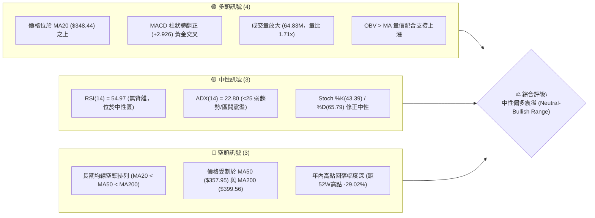
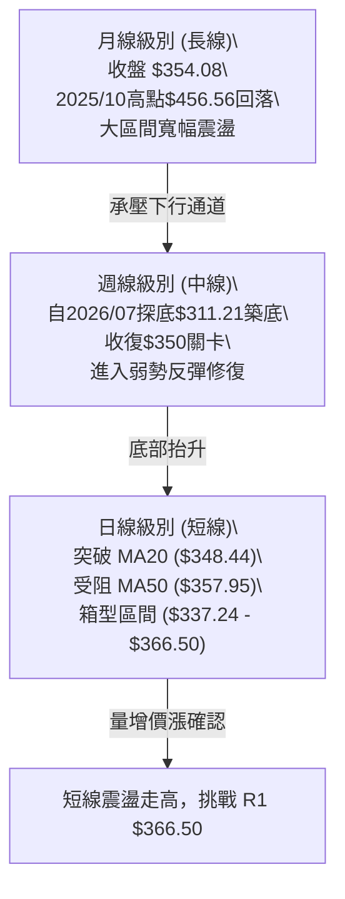
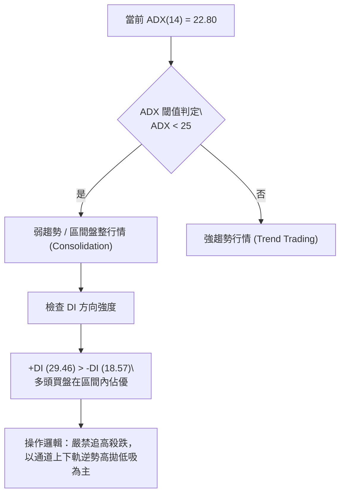
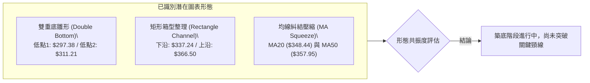
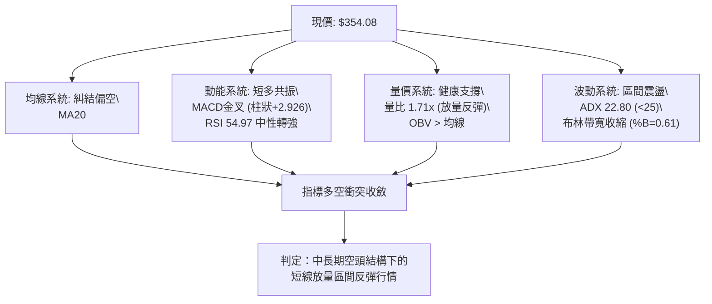
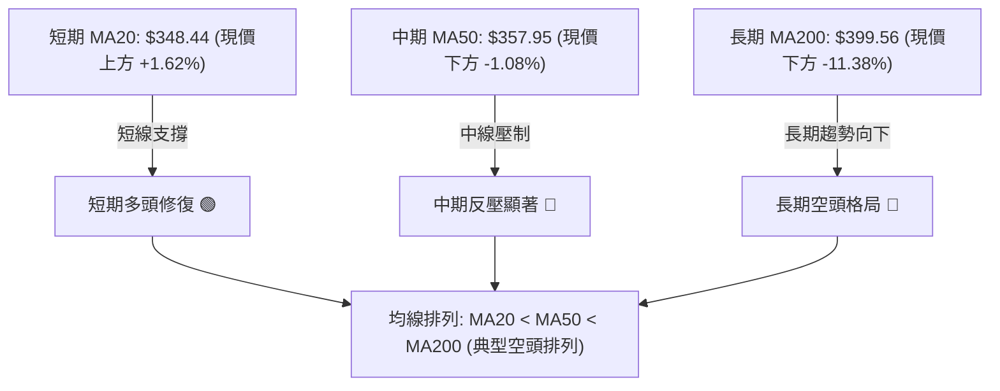
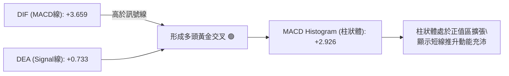
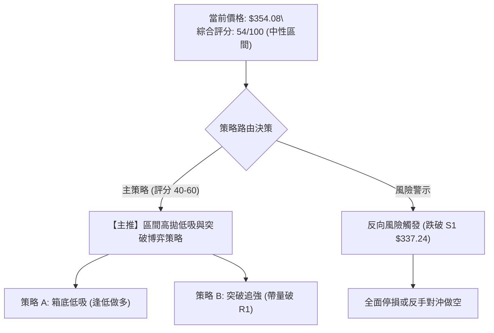
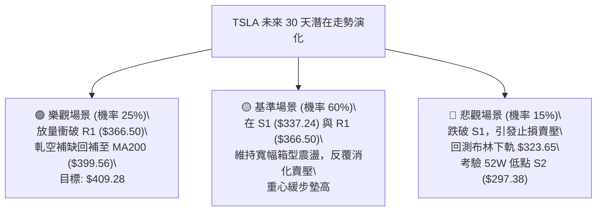

# TSLA 技術分析報告

> **報告日期**：2026-09-05 ｜ **語言**：繁體中文 ｜ **數據來源**：Yahoo Finance ｜ **當前價格**：$354.08

---

## 目錄

| 章節 | 內容 |
|------|------|
| [1. 技術面概覽](#1-技術面概覽) | 訊號儀表板、核心指標、評分卡 |
| [2. 趨勢分析](#2-趨勢分析) | 多時框趨勢、長中短期走勢 |
| [3. 圖表形態分析](#3-圖表形態分析) | 形態識別、K線組合、目標價 |
| [4. 支撐與阻力](#4-支撐與阻力) | 關鍵價位、斐波那契回調 |
| [5. 技術指標深度解讀](#5-技術指標深度解讀) | MA/RSI/MACD/布林/成交量 |
| [6. 動能與波動率](#6-動能與波動率) | 動能評估、ATR、Beta |
| [7. 多時框架總結](#7-多時框架總結) | 時框架評分矩陣 |
| [8. 交易策略建議](#8-交易策略建議) | 多空策略、風險報酬比 |
| [9. 風險提示與監控](#9-風險提示與監控) | 監控指標、風險場景 |

---

## 1. 技術面概覽

### 🎯 技術訊號儀表板



### 📊 核心指標速覽表

| 指標類別 | 指標名稱 | 當前數值 | 訊號 | 解讀 |
|----------|----------|----------|------|------|
| **價格** | 當前價格 | $354.08 | 🟡 | 位於52週區間28.1%分位，自底部反彈但承壓於中期均線 |
| **均線** | MA20 | $348.44 | 🟢 | 現價高於 MA20 (+1.62%)，短線多頭掌控支撐 |
| **均線** | MA50 | $357.95 | 🔴 | 現價低於 MA50 (-1.08%)，正面臨中短期動能反壓 |
| **均線** | MA200 | $399.56 | 🔴 | 現價低於 MA200 (-11.38%)，長期趨勢仍處空方架構 |
| **動能** | RSI(14) | 54.97 | 🟡 | 處於 30–70 中性強弱分水嶺偏多方，未出現超買或超賣 |
| **動能** | MACD | 3.659 / 0.733 | 🟢 | DIF 高於 Signal 線，柱狀體 +2.926，呈現短線多頭放量 |
| **動能** | Stoch %K/%D | 43.39 / 65.79 | 🟡 | %K 由高檔向下跌破 %D，短線面臨微幅超買消化修正 |
| **趨勢強度**| ADX(14) | 22.80 | 🟡 | 數值低於 25，屬於弱趨勢行情，市場以區間震盪為主 |
| **方向指標**| +DI / -DI | 29.46 / 18.57 | 🟢 | +DI 明顯高於 -DI，顯示區間內多方買盤力道暫居主導 |
| **通道** | 布林通道 %B | 0.61 | 🟢 | 站上中軌 $348.44，向上軌 $373.23 運行測試中 |
| **量能** | 20日成交量比 | 1.71x | 🟢 | 成交量 64.83M 明顯高於20日均量 37.95M，買盤介入積極 |
| **波動** | ATR(14) | $15.34 | 🟡 | 日波動率達 4.33%，具備充足日內與波段交易波動空間 |

### 🏆 技術評分卡

```
╔════════════════════════════════════════════════════════════════╗
║                技術評分卡 — TSLA (2026-09-05)                   ║
╠════════════════════════════════════════════════════════════════╣
║ 趨勢強度 (ADX/方向)   ████████░░░░░░░░░░░░  42/100   🟡 中性弱勢 ║
║ 短期動能 (MACD/RSI)   █████████████░░░░░░░  65/100   🟢 多頭修復 ║
║ 支撐穩定度 (波段低點)  ██████████████░░░░░░  70/100   🟢 S1/S2穩固 ║
║ 成交量配合 (OBV/量比)  ███████████████░░░░░  75/100   🟢 放量反彈 ║
║ 形態完整度 (區間築底)  ████████████░░░░░░░░  60/100   🟡 箱型整理 ║
║ 均線架構 (MA排列)     ██████░░░░░░░░░░░░░░  30/100   🔴 空頭排列 ║
╠════════════════════════════════════════════════════════════════╣
║ 綜合評分             ███████████░░░░░░░░░  54/100   🟡 區間震盪 ║
╚════════════════════════════════════════════════════════════════╝
```

---

## 2. 趨勢分析

### 🌐 多時框趨勢分析



### 📈 長期趨勢 — 12個月走勢圖（Unicode）

以下展示過去 12 個月（2025年9月至2026年9月）TSLA 每月收盤價之走勢軌跡，標注關鍵頂部與底部波段點：

```
TSLA 月線走勢圖（2025-09 至 2026-09）
價格軸 ($)
$460 ┤               ● $456.56 (波段頂部 2025-10)
$440 ┤ ● $444.72            ● $449.72        ● $435.79
$420 ┤          ● $430.17        ● $430.41         ● $420.60
$400 ┤                               ● $402.51
$380 ┤                                    ● $381.63
$360 ┤                                         ● $371.75    ● $367.95
$340 ┤                                                           ● $354.08 (現價)
$320 ┤                                                       ● $311.21 (波段底部 2026-07)
     └─┬───────┬───────┬───────┬───────┬───────┬───────┬───────┬───────┬───────┬─
     09/25   10/25   11/25   12/25   01/26   02/26   03/26   04/26   05/26   06/26   07/26   08/26   09/26
```

#### 走勢特徵分析表格

| 階段區間 | 起止月份 | 價格區間 ($) | 漲跌幅 (%) | 形態特徵與成交結構解讀 |
|----------|----------|--------------|------------|------------------------|
| **頂部構築期** | 2025-09 ~ 2025-12 | $430.17 → $456.56 | +2.66% | 高檔橫盤震盪，多次衝擊 $450 以上阻力，量能遞減，呈現多頭衰竭 |
| **加速下行期** | 2026-01 ~ 2026-03 | $430.41 → $371.75 | -13.63% | 連續三個月破線下殺，跌破 MA200 關鍵防線，空方動能宣洩 |
| **中繼反抽期** | 2026-04 ~ 2026-05 | $381.63 → $435.79 | +14.19% | 空頭回補與政策題材刺激反彈，但未能創出新高，形成次級高點 |
| **恐慌探底期** | 2026-06 ~ 2026-07 | $420.60 → $311.21 | -26.01% | 週線 RSI 觸及超賣極端值 15.7，創下 52 週次低點 $311.21，籌碼徹底清洗 |
| **底部回升期** | 2026-08 ~ 2026-09 | $311.21 → $354.08 | +13.78% | 大量低接買盤湧入（量比 1.71x），站回 MA20，構築中期雙底雛形 |

### 📊 中期趨勢（週線分析）

從近 20 週收盤走勢可見，TSLA 經歷了 2026 年 7 月底的急遽拋售（收盤價跌至 $313.03 及 $311.21，週線 RSI 降至 15.7 之歷史極端值），隨後在 8 月初展開強勁的「V 型超賣反彈」，連續 3 週收陽，帶動週線 MACD 柱狀體由 -8.365 大幅修復至 +6.229。目前價格在 $354.08 進行橫向盤整修復，消化 7 月底跳空大跌的套牢籌碼。

```
TSLA 週線關鍵支撐阻力結構
阻力位: R1 $366.50 ───────┐ (近期反彈高點聚類反壓)
現  價: $354.08 ─────────┼─ 目前在此窄幅整理，爭奪 MA50 ($357.95)
支撐位: S1 $337.24 ───────┘ (8月中旬突破缺口與密集成交區)
強支撐: S2 $297.38 ───────── (52週極端低點，空方不可逾越防線)
```

### ⚡ 趨勢強度評估（ADX 解讀）



#### ADX 強度對照表

| 指標變數 | 當前讀數 | 門檻區間 | 市場環境解讀 | 戰術策略對策 |
|----------|----------|----------|--------------|--------------|
| **ADX(14)** | 22.80 | < 25.0 | 無明確單邊趨勢，走勢呈現均線糾結與震盪整理 | 採用區間交易系統（布林通道、支撐阻力位）操作 |
| **+DI** | 29.46 | > 25.0 | 多頭進攻力道回升，買盤力量主導近期波段反彈 | 回調至關鍵支撐位時逢低做多勝率較高 |
| **-DI** | 18.57 | < 20.0 | 空頭拋壓處於相對低位，暫無主動恐慌拋售潮 | 空方動能減弱，暫不具備深度單邊做空條件 |
| **DI 差值 (+DI - -DI)** | +10.89 | 正值擴大 | 多方佔據短線微弱優勢，但缺乏 ADX 趨勢增強確認 | 預期反彈將在遇到波段強阻力（R1/R2）時受阻回落 |

---

## 3. 圖表形態分析

### 🔍 形態識別系統



#### 圖表形態信心度表格（嚴格遵循數據紀律）

| 形態名稱 | 信心度 (%) | 判斷依據（引用真實數據） | 完成度 (%) | 目標價計算公式與預期價位 |
|----------|------------|--------------------------|------------|--------------------------|
| **雙重底 (W底) 雛形** | 68% | 52W 低點 $297.38 (2025年數據) 與 2026-08 低點 $311.21 形成非對稱右腳抬升底，且週線 MACD 出現極強金叉底背離修復。 | 75% | 頸線阻力取波段反彈高點聚類 **R1 $366.50**。<br>形態高度 = 頸線 $366.50 - 底部 $311.21 = $55.29。<br>突破目標價 = $366.50 + $55.29 = **$421.79**（與斐波那契 38.2% 回調位 $421.88 完美共振）。 |
| **短期箱型整理** | 82% | 價格在 S1 $337.24 與 R1 $366.50 之間連續震盪 4 週，ADX 22.80 確認處於箱型盤整狀態。 | 90% | 箱體高度 = $366.50 - $337.24 = $29.26。<br>箱體突破目標 = $366.50 + $29.26 = **$395.76**（逼近 MA200 $399.56 與 50% 斐波那契 $398.10）。 |
| **頭肩底形態** | 35% | 數據中左肩與右肩結構對稱性不足，成交量分布不均勻，信心度低於 50%。 | 30% | *訊號不足，僅做指標型解讀，不預設該形態目標價。* |

### 🕯️ 重要 K 線形態分析（近 5 個月收盤走勢）

| 月份 | 收盤價 | 實體漲跌 | K 線組合與形態特徵 | 技術解讀 | 訊號 |
|------|--------|----------|-------------------|----------|------|
| **2026-05** | $435.79 | +14.19% | 長陽線突破，上影線觸及 $450 壓力 | 多頭強力上攻，但於 $450 遭遇強烈解套賣壓 | 🟢 偏多 |
| **2026-06** | $420.60 | -3.49% | 高檔孕線（Harami），小陰線實體 | 滯漲訊號，多方動能開始衰退，籌碼鬆動 | 🟡 警告 |
| **2026-07** | $311.21 | -26.01% | 崩跌大陰線，跳空跌破均線群 | 恐慌性宣洩，引發程式化停損，進入極端超賣區 | 🔴 極空 |
| **2026-08** | $367.95 | +18.23% | 長下影穿刺長陽線（破底翻吞噬線） | 空頭陷阱確立，$311.21 低檔承接力道強烈 | 🟢 強多 |
| **2026-09** | $354.08 | -3.77% | 中性紡錘線（Spindle），高檔震盪整理 | 遭遇 MA50 與 R1 阻力後的消化性回踩，量能平穩 | 🟡 中性 |

### 📉 ASCII 走勢形態示意圖

```
TSLA 雙底雛形與箱型突破邊界示意圖
價格 ($)
$421.88 ┼───────────────────────────────── 目標價 (斐波那契 38.2% / 形態高度)
        │
$399.56 ┼───────────────────────────────── MA200 長期趨勢多空分水嶺
        │
$366.50 ┼─────────┬─────────────●─────── 箱型上沿 / 頸線阻力 R1 (突破確認點)
        │         │             │▲
$354.08 ┼─────────┼──────●──────┼┴────── 現價 (於箱體上半部震盪)
        │         │      │      │
$337.24 ┼─────────●──────┼──────┼─────── 箱型下沿支撐 S1 (防守底線)
        │        / \     │      │
$311.21 ┼───────●   \───●      │        第二腳低點 (2026-08)
        │      /                        
$297.38 ┼─────●                         第一腳低點 (52W Low)
        └─────┴───────┴───────┴────────
            2026-07  2026-08  2026-09
```

### 🎯 形態目標價計算

依據幾何技術測量法則：
1. **箱體突破最小量度目標（Target 1）**：
   $$\text{Target 1} = \text{箱頂 (R1)} + (\text{箱頂} - \text{箱底 S1}) = \$366.50 + (\$366.50 - \$337.24) = \$395.76$$
   *該價位與 50.0% 斐波那契回調位 $398.10 及 MA200 ($399.56) 構成密集共振反壓區。*

2. **雙底形態完全量度目標（Target 2）**：
   $$\text{Target 2} = \text{頸線 (R1)} + (\text{頸線} - \text{底部低點}) = \$366.50 + (\$366.50 - \$311.21) = \$421.79$$
   *該價位精準契合 38.2% 斐波那契回調位 $421.88 及阻力位 R3 ($418.36)。*

---

## 4. 支撐與阻力

### 🗺️ 關鍵價位分布圖（Unicode）

```
TSLA 價位結構分布圖
════════════════════════════════════════════════════════════════════
$498.83 ║████████████████████████████████║ 52週歷史高點 (0.0% Fib)
$451.29 ║████████████████████████        ║ 斐波那契 23.6% 回調壓力
$421.88 ║████████████████████████████    ║ 阻力 R3 ($418.36) / Fib 38.2%
$409.28 ║████████████████████            ║ 波段反彈高點聚類阻力 R2
$399.56 ║████████████████████████████    ║ 長期生命線 MA200 / Fib 50% ($398.10)
$373.23 ║▓▓▓▓▓▓▓▓▓▓▓▓▓▓▓▓                ║ 布林通道上軌
$366.50 ║████████████████████████████████║ 關鍵阻力 R1 (近一年波段高點聚類)
$357.95 ║▓▓▓▓▓▓▓▓▓▓▓▓                    ║ 中期均線 MA50 反壓
$354.08 ╠════════════════════════════════╣ ◄ 當前市價 ($354.08)
$348.44 ║▓▓▓▓▓▓▓▓▓▓▓▓                    ║ 布林中軌 / MA20 短線支撐
$340.49 ║▓▓▓▓▓▓▓▓▓▓▓▓▓▓▓▓                ║ 斐波那契 78.6% 回調支撐
$337.24 ║████████████████████████        ║ 近期關鍵波段支撐 S1
$323.65 ║▓▓▓▓▓▓▓▓▓▓▓▓▓▓▓▓                ║ 布林通道下軌
$297.38 ║████████████████████████████████║ 52週歷史低點強支撐 S2 (100.0% Fib)
════════════════════════════════════════════════════════════════════
```

### 🚧 阻力位分析表

所有價位均直接取自技術數據之波段高點聚類計算：

| 阻力級別 | 價位 ($) | 距現價幅幅 | 形成原因與技術共振 | 突破難度 | 戰略重要性 |
|----------|----------|------------|--------------------|----------|------------|
| **R1** | $366.50 | +3.51% | 近一年波段高點密集成交區，箱型整理區間上沿，與 MA60 ($364.22) 共振。 | 🟡 中等 | ★★★★☆<br>短線多空分水嶺，有效帶量突破將展開波段上攻。 |
| **R2** | $409.28 | +15.59% | 前期高檔盤整區下緣，突破 MA200 ($399.56) 後之次級阻力，MA240 ($406.10) 壓制。 | 🔴 極高 | ★★★★★<br>牛熊轉換臨界點，需伴隨全市場量能大幅放大方能化解。 |
| **R3** | $418.36 | +18.15% | 波段高點聚類區，緊鄰 38.2% 斐波那契回調位 ($421.88)，強烈套牢盤堆積。 | 🔴 極高 | ★★★★☆<br>中期波段多頭反彈的終極強壓目標位。 |

### 🛡️ 支撐位分析表

所有價位均直接取自技術數據之波段低點聚類計算：

| 支撐級別 | 價位 ($) | 距現價跌幅 | 形成原因與技術共振 | 守住機率 | 戰略重要性 |
|----------|----------|------------|--------------------|----------|------------|
| **S1** | $337.24 | -4.76% | 近期波段低點聚類，箱型整理區下沿，下方緊鄰 78.6% 斐波那契位 ($340.49)。 | 🟢 75% | ★★★★☆<br>短線防守核心，守穩則震盪偏多架構不變。 |
| **S2** | $297.38 | -16.01% | 52 週最低點，年線級別極端價值區，100.0% 斐波那契基準原點。 | 🟢 90% | ★★★★★<br>長期生命線底限，一旦失守將引發估值崩潰風險。 |

### 📐 斐波那契回調位分析

依據 52 週區間高點 $498.83 至低點 $297.38（區間總震幅 $201.45）進行嚴密回調測算：

| 斐波那契級別 | 基準價位 ($) | 與現價關係 | 技術意義與多空互動解讀 |
|--------------|--------------|------------|------------------------|
| **0.0% (52W High)** | $498.83 | +40.88% | 歷史波段峰值，多頭終極目標。 |
| **23.6%** | $451.29 | +27.45% | 2025 年末高檔密集震盪區，長期套牢籌碼峰值。 |
| **38.2%** | $421.88 | +19.15% | **強弱分界線**：此處與 R3 ($418.36) 重疊，若能收復則代表大週期跌勢扭轉。 |
| **50.0%** | $398.10 | +12.43% | **心理均值軸**：與長期均線 MA200 ($399.56) 形成完美雙重共振阻力。 |
| **61.8% (黃金分割)** | $374.33 | +5.72% | **反彈強阻力**：緊鄰布林通道上軌 ($373.23)，為當前多頭反撲的第一道硬道坎。 |
| **78.6%** | $340.49 | -3.84% | **關鍵回調防線**：現價落於 61.8% ($374.33) 與 78.6% ($340.49) 區間內運行。 |
| **100.0% (52W Low)** | $297.38 | -16.01% | 本輪熊市調整極限底，強烈多頭防護墊。 |

*現價定位解讀*：當前市價 $354.08 處於 **61.8% ($374.33)** 與 **78.6% ($340.49)** 之間。技術上，當價格處於 61.8%–78.6% 深度回調區間時，代表股價尚未擺脫空頭修正主浪的陰影，但已自 100% 低點展開有效反彈。短線只要持續守穩 78.6% ($340.49) 與 S1 ($337.24)，反彈向上測試 61.8% ($374.33) 與布林上軌的機率極高。

---

## 5. 技術指標深度解讀

### 🎛️ 指標訊號總覽



### 📈 移動平均線排列分析



#### 移動平均線數據矩陣

| 均線名稱 | 數值 ($) | 與現價乖離 | 走勢趨向 | 技術含義 |
|----------|----------|------------|----------|----------|
| **MA 5** | $362.30 | -2.27% | ▼ 下彎 | 短線衝高受阻回調，日線級別微幅超買消化 |
| **MA 10** | $356.01 | -0.54% | ▼ 下彎 | 短期平滑均線壓制，目前現價正在爭奪此線 |
| **MA 20** | $348.44 | +1.62% | ▲ 走平上揚 | 短期多空防守線，提供即時回踩動態支撐（與布林中軌重合） |
| **MA 50** | $357.95 | -1.08% | ▼ 下行 | 季線下行斜率趨緩，為當前向上推進的第一道動態阻力 |
| **MA 60** | $364.22 | -2.78% | ▼ 下行 | 緊鄰阻力位 R1 ($366.50)，構成多頭上攻阻力帶 |
| **MA 120** | $379.12 | -6.61% | ▼ 下行 | 半年線持續壓制，中長期均線下壓動能猶存 |
| **MA 200** | $399.56 | -11.38% | ▼ 下行 | 年線（牛熊分界線），未放量突破前不宜盲目判定反轉 |
| **MA 240** | $406.10 | -12.81% | ▼ 下行 | 長期資本成本線，代表上方存在巨額解套賣壓 |

### 📉 RSI(14) 分析

當前 RSI(14) 讀數為 **54.97**。

```
RSI(14) 強弱區間分布圖
0                30              50       54.97        70               100
├────────────────┼───────────────┼─────────●───────────┼────────────────┤
     超賣區          空方掌控區        中軸      現值      多方掌控區        超買區
[░░░░░░░░░░░░░░░░][░░░░░░░░░░░░░░][█████████░░░░░░░░░░][░░░░░░░░░░░░░░░░]
強度進度條: ███████████░░░░░░░░░ 55.0% (中性偏多微幅領先)
```

- **超買/超賣判定**：數值 54.97 穩居 50 中軸之上，脫離了 2026 年 7 月底的極端超賣區（當時週線 RSI 僅 15.7），反映多方買盤已修復技術指標，未達 70 警戒線，意味著向上仍有充足的動能發揮空間。
- **背離判斷**：
  - **頂背離**：無。目前價格自低位回升，未創新高，無頂背離跡象。
  - **底背離**：無明顯日線背離，但週線級別在 7 月底 $313.03 (RSI 15.7) 與 8 月初 $311.21 (RSI 18.1) 呈現微弱的「底背離雛形」（價格創新低而 RSI 抬升），促成了本次向 $350 以上的波段修復。

### 📊 MACD(12/26/9) 訊號解讀



- **數值分析**：DIF (3.659) 明顯高於 DEA (0.733)，MACD Histogram 達 +2.926。此數據表明自 8 月底以來的短線多頭攻擊仍具備慣性動能。
- **歷史連續性**：近 5 週週線 MACD 柱狀體分別為 `-6.930 → +1.025 → +4.956 → +6.229 → +3.586 → +2.926`。週線級別雖然柱狀體稍有收斂，但日線級別仍維持多頭主導。

### 📦 布林通道分析

```
TSLA 日線布林通道位置示意圖 (帶寬: $49.58)
$373.23 ┬───────────────────────────────── BB 上軌 (+5.41%)
        │
$360.00 ┤        
        │               ● 現價 $354.08 (%B = 0.61)
$348.44 ┼───────────────────────▲───────── BB 中軌 (MA20) (-1.59%)
        │
$330.00 ┤
        │
$323.65 ┴───────────────────────────────── BB 下軌 (-8.60%)
```

- **當前位置解讀**：現價 $354.08 處於布林帶上半區（中軌與上軌之間），%B 指標為 **0.61**。技術上，%B 站穩 0.50 以上代表多方佔據區間內主導地位。
- **通道形態特徵**：通道帶寬 ($373.23 - $323.65 = $49.58) 呈現收斂後的平行平移走勢，未見大幅擴口，佐證了 ADX < 25 所指示的箱體震盪特徵，上軌 $373.23 與 61.8% 斐波那契回調位 ($374.33) 形成疊加阻力。

### 💹 成交量分析（量價配合度）

- **量能爆發力**：最新單日成交量為 **64,829,000 股**，相較於 20 日均量 (37,947,370 股) 放大至 **1.71 倍**；相較於 50 日均量 (40,261,312 股) 亦明顯放大。
- **量價健康度**：股價在站上 MA20 的過程中伴隨量能顯著放大，顯示非單純散戶反抽，機構資金與空頭回補買盤介入跡象明顯。
- **OBV 能量潮趨勢**：技術快照明確指出「**OBV > MA → 量能支撐上漲**」，能量潮指標率先突破其移動平均線，呈現資產積累（Accumulation）特徵，對價格形成實質性支撐。

---

## 6. 動能與波動率

### ⚡ 動能評估四象限

```
                   動能強度 (Momentum)
                         高 ▲
                           │
             Q3            │           Q1
      (高風險高收益)       │       (最佳進攻機會)
                           │
                           │
◄──────────────────────────┼──────────────────────────► 波動率
低                         │                         高 (Volatility)
                           │       ★ TSLA 當前位置
             Q2            │     [動能中等 / 波動偏高]
        (謹慎觀望)         │           Q4
                           │       (震盪洗盤防守)
                         低 ▼
```

#### 四象限動能與波動率狀態表

| 象限標籤 | 動能等級 | 波動率等級 | 當前特徵對應 | 策略應對方針 |
|----------|----------|------------|--------------|--------------|
| **Q1 (最佳機會)** | 強 (RSI>65, ADX>30) | 低 (ATR%<2.5%) | 否 | 單邊強趨勢持股待漲 |
| **Q2 (謹慎觀望)** | 弱 (RSI<45, MACD死叉) | 低 (ATR%<2.5%) | 否 | 資金沉睡期，觀望為宜 |
| **Q3 (強勢搏弈)** | 強 (MACD金叉放量) | 高 (ATR%>4.0%) | 否 | 突破追價，嚴控滑點 |
| **Q4 (震盪洗盤)** | **中等 (RSI 55, MACD+)** | **高 (ATR% 4.33%, Beta 1.85)** | **✓ (TSLA 現狀)** | **區間內逆勢低吸高拋，恪守 ATR 止損邊界** |

### 📊 ATR 波動率分析

- **ATR(14) 絕對值**：**$15.34**（佔當前市價之 **4.33%**）。
- **日內震盪特徵**：高達 4.33% 的日常波動率顯示 TSLA 維持其高彈性本色。任何交易策略若止損設置過窄（例如小於 1.0x ATR，即 < $15.34），極易被日常隨機雜訊洗出場。
- **風控止損參數設定**：
  - **日內交易止損距離**：$1.0 \times \text{ATR} = \$15.34$
  - **波段波段止損距離**：$1.5 \times \text{ATR} = \$23.01$
  - **寬鬆趨勢止損距離**：$2.0 \times \text{ATR} = \$30.68$

### 📐 Beta 與市場相關性

- **Beta 係數**：**1.845**。
- **市場彈性解讀**：TSLA 具備超高貝塔屬性，波動幅度約為標普 500 指數的 1.85 倍。在整體美股市場情緒回暖或大盤突破時，其彈升爆發力顯著放量；反之，若大盤面臨流動性收緊，其回撤幅度亦會放大。
- **融資與空頭數據**：當前空頭佔流通盤比例（Short % Float）為 2.0%，Short Ratio 為 1.82，空頭部位處於健康低位，暫無因極端軋空（Short Squeeze）引發非理性飆漲的結構性條件，走勢回歸自身技術與籌碼面博弈。

---

## 7. 多時框架總結

### 📋 時框架評分表

| 時框架 | 趨勢方向 | 動能狀態 | 均線排列 | 形態特徵 | 綜合評分 | 操作建議 |
|--------|----------|----------|----------|----------|----------|----------|
| **月線 (長期)** | 🔴 空頭偏弱 | 🟡 中性平淡 | 🔴 空頭排列 (承壓於 MA120/MA200) | 距高點深幅回撤後的尋底週期 | 35/100 | 嚴控部位，不宜進行盲目長期左側定投 |
| **週線 (中期)** | 🟡 震盪築底 | 🟢 金叉修復 | 🟡 均線收斂糾結 | 雙底雛形構築，嘗試挑戰下降壓力線 | 58/100 | 波段低吸，以 $311–$337 為防守做多 |
| **日線 (短期)** | 🟢 震盪偏多 | 🟢 MACD柱狀擴張 | 🟡 站上 MA20，承壓 MA50 | 布林帶中上軌運行，箱體震盪偏強 | 65/100 | 區間內高拋低吸，關注 R1 $366.50 突破 |

### 🔲 綜合訊號矩陣

```
時框維度        訊號屬性    技術指標確認項                         多空指向
──────────────────────────────────────────────────────────────────────────
短期 (日線)  │  偏多 🟢  │  價格 > MA20、MACD 金叉、量比 1.71x   │  順勢反彈
中期 (週線)  │  中性 🟡  │  RSI 脫離超賣、週線 MACD 柱翻正       │  底部確認
長期 (月線)  │  偏空 🔴  │  MA20 < MA50 < MA200、年線壓制       │  長線空頭
──────────────────────────────────────────────────────────────────────────
時框衝突判定：日線反彈動能正遭遇中長線空頭均線層層反壓。
```

### ⚖️ 多時框收斂結論

> **依據「嚴格要求 14」收斂規則執行決策**：
> 1. **趨勢強度檢驗**：當前 ADX(14) 讀數為 **22.80 (< 25)**，嚴格界定為**「盤整行情（Consolidation Market）」**。
> 2. **主導時框裁決**：因處於盤整行情，**不以中長期單邊均線為唯一依據，而以日線布林通道上下軌 ($323.65 - $373.23) 及關鍵波段高低點 (S1 $337.24 / R1 $366.50) 作為核心交易區間**。
> 3. **方向性收斂結論**：**【中性偏多區間震盪（Neutral-to-Bullish Range-Bound）】**。短線多頭在量能支撐（OBV > MA，量比 1.71x）下佔據主動，具備向上測試箱頂 R1 ($366.50) 與布林上軌 ($373.23) 的動能，但受限於中期空頭排列，暫不具備展開單邊大牛市條件。

---

## 8. 交易策略建議

### 🗺️ 策略決策流程圖



### 🧭 策略路由

**當前主策略方向 = 【中性偏多區間操作（Range-Bound Trading）】（依技術評分 54/100 判定）**

依據評分分流規則，當前綜合評分 54/100 處於 40–60 區間。操作上嚴禁盲目單邊下注，以「區間下沿與中軌低吸、關鍵阻力分批止盈、帶量突破順勢加碼」為核心架構。

### 🎯 價格情境階梯（Price Scenarios）

所有價位均嚴格取自數據模組之波段點與回調位：

| 觸發條件 | 突破確認點 | 第一目標 (T1) | 第二目標 (T2) | 後續延伸 (T3) | 情境技術含義 |
|----------|------------|---------------|---------------|---------------|--------------|
| **強勢向上突破** | 帶量站穩 R1 $366.50 | 斐波 61.8% $374.33 | 斐波 50% / MA200 $398.10 ~ $399.56 | 阻力 R2 $409.28 | 短線反彈轉為中級反轉浪 |
| **區間內震盪** | 維持在 $340.49 ~ $366.50 | 布林上軌 $373.23 | — | — | 消化 MA50 均線阻力，箱體拉鋸 |
| **弱勢向下破位** | 跌破 S1 $337.24 | 布林下軌 $323.65 | 52W低點 S2 $297.38 | — | 反彈夭折，重回尋底探底行情 |

### 📊 情境機率分佈

```
情境機率分佈圖
繼續震盪上行 (挑戰R1/MA200)  ███████████████████████░░░░░  55%
維持箱體窄幅震盪 ($337-$366)    ████████████░░░░░░░░░░░░░░  30%
再度回落跌破支撐 (探底S2)       ██████░░░░░░░░░░░░░░░░░░░░  15%
```

| 情境劃分 | 機率估計 (%) | 核心判定依據（指標數據支撐） |
|----------|--------------|------------------------------|
| **情境一：震盪走高 / 向上突破** | **55%** | MACD 柱狀體維持正值 (+2.926)、+DI (29.46) 壓制 -DI (18.57)、單日成交量放大 1.71x 且 OBV > 均線，多方動能佔優。 |
| **情境二：維持箱體橫盤拉鋸** | **30%** | ADX(14) 僅 22.80 顯示趨勢鈍化，MA20、MA50 糾結，上方有長期均線反壓，多空反覆爭奪籌碼。 |
| **情境三：向下破位 / 二次探底** | **15%** | 月線級別仍為空頭排列，若大盤系統性風險釋放導致跌破 S1 ($337.24)，將觸發程式化多殺多賣盤。 |

### 🟢 主策略詳情（方向：中性偏多震盪操作）

針對當前走勢，提供**保守型（回踩低吸）**與**積極型（突破追強）**兩套嚴格量化的交易執行方案：

| 策略要素 | 策略 A（回踩 MA20/S1 低吸策略） | 策略 B（帶量突破 R1 追強策略） |
|----------|----------------------------------|--------------------------------|
| **策略類型** | 逆勢逢低分批佈局 | 順勢右側突破進場 |
| **進場條件** | 股價回踩 MA20 ($348.44) 至 Fib 78.6% ($340.49) 企穩出現下影線 | 日線收盤價帶量（>50M股）強勢實體突破 R1 ($366.50) |
| **進場價格** | **$344.50**（位於 MA20 與 S1 之間之回踩均值） | **$367.50**（突破 R1 $366.50 確認點） |
| **目標價 T1** | **$366.50**（阻力位 R1 / 箱頂） | **$398.10**（50.0% 斐波那契回調位） |
| **目標價 T2** | **$398.10**（斐波 50% 與 MA200 共振位） | **$418.36**（阻力位 R3 / 形態量度目標） |
| **止損價格** | **$334.00**（跌破 S1 $337.24 緩衝 0.2x ATR） | **$354.00**（跌破 MA50 與假突破回撤點） |
| **止損空間** | $10.50 (3.05%) | $13.50 (3.67%) |
| **第一盈虧比** | **2.10 : 1** (獲利 $22.00 / 虧損 $10.50) | **2.27 : 1** (獲利 $30.60 / 虧損 $13.50) |
| **終極盈虧比** | **5.10 : 1** (獲利 $53.60 / 虧損 $10.50) | **3.77 : 1** (獲利 $50.86 / 虧損 $13.50) |
| **成功機率** | 60% | 52% |
| **建議倉位** | 15% - 20% 資金上限 | 10% - 15% 資金上限 |

### 🔴 反向風險觸發點（對沖與風控提示）

若市場出現極端利空導致以下情況發生，本報告之多頭與區間策略**全面失效**，應即刻轉入避險模式：
1. **破位觸發點**：若日線實體陰線**收盤跌破 S1 $337.24**，代表短期箱型支撐徹底潰敗。
2. **對沖操作**：多頭部位無條件停損出場；進階交易者可反手建立做空或買入 Put 避險，下看布林下軌 **$323.65** 及年度強支撐 **S2 $297.38**。
3. **動能反轉訊號**：若 MACD 柱狀體再度由正翻負，且 RSI 跌破 45，應全面出清短線多單。

### ⭐ 整體訊號強度評星

```
做多訊號強度：★★★☆☆  (3.5/5星 — 短線動能充足，受制於長期均線)
做空訊號強度：★★☆☆☆  (2.0/5星 — 空方下行動能衰竭，不宜低位追空)
整體可信度：  ★★★★☆  (4.0/5星 — 數據共振度高，區間邊界極為清晰)
```

---

## 9. 風險提示與監控

### ✅ 關鍵監控指標 Checklist

```
╔════════════════════════════════════════════════════════════════╗
║                   關鍵技術監控清單 (Checklist)                  ║
╠════════════════════════════════════════════════════════════════╣
║ [ ] 價格是否能連續 3 日守穩 MA20 ($348.44)                     ║
║ [ ] 向上測試 R1 ($366.50) 時單日成交量是否突破 50,000,000 股   ║
║ [ ] RSI(14) 能否進一步跨越 60 進入多頭強勢區                    ║
║ [ ] MACD 柱狀體是否持續保持在正值區 (> +2.0)                   ║
║ [ ] ADX(14) 讀數是否由 22.8 向上穿越 25 (確認趨勢行情啟動)    ║
║ [ ] 下方防守位 S1 ($337.24) 是否遭空方放量貫穿                 ║
╚════════════════════════════════════════════════════════════════╝
```

### ⚠️ 風險場景分析



### 🛡️ 風險管理重要提醒

1. **極高波動風險防範**：TSLA 之 ATR 達 $15.34（佔比 4.33%），Beta 高達 1.845。交易者切忌滿倉或使用過高槓桿，單筆交易的最大可承受虧損金額（Risk per trade）應嚴格控制在總投資組合淨值的 **1.0% – 1.5%** 之內。
2. **均線空頭排列之反壓本質**：請投資人時刻保持清醒，目前 MA20 < MA50 < MA200 仍為標準空頭陣容。歷史統計顯示，在空頭排列下的反彈往往伴隨著反覆洗盤與劇烈回撤，在未見帶量站穩 MA200 ($399.56) 之前，一律將當前行情視為**「技術性波段反彈修復」而非「大牛市主升浪」**。
3. **假突破與假跌破防範**：由於 ADX 低於 25，市場缺乏強大趨勢慣性，價格容易在 R1 ($366.50) 或 S1 ($337.24) 附近出現影線穿刺的「假突破」或「假跌破」。建議以**收盤價（Daily Close）**或**突破後回踩不破**作為確認信號。

---

## 📋 報告總結

```
╔════════════════════════════════════════════════════════════════╗
║                   TSLA 技術分析報告總結                         ║
╠════════════════════════════════════════════════════════════════╣
║ 報告日期：2026-09-05                                           ║
║ 當前價格：$354.08                                              ║
║ 分析評級：⚖️ 中性偏多區間操作 (Neutral-Bullish Range)          ║
║                                                                ║
║ 關鍵結論：                                                     ║
║ ├─ 長期趨勢：🔴 空頭排列壓制 (承壓於 MA200 $399.56)           ║
║ ├─ 中期趨勢：🟡 雙底雛形構築中 (探底 $311.21 後止跌回升)      ║
║ ├─ 短期趨勢：🟢 站上 MA20，量能放大 (量比 1.71x)，MACD 金叉    ║
║ ├─ 關鍵支撐：S1 $337.24  /  強支撐 S2 $297.38 (52W Low)       ║
║ ├─ 關鍵阻力：R1 $366.50  /  強阻力 R2 $409.28                 ║
║ └─ 分析師共識目標：$390.09 (現價具備 +10.17% 空間)            ║
║                                                                ║
║ 最優策略組合：                                                 ║
║ 1. 🥇 最佳機會：回踩 $344.50 (靠近 MA20/S1) 逢低建立多單，     ║
║                 停損設 $334.00，目標上看 R1 $366.50。          ║
║ 2. 🥈 次選機會：帶量突破 R1 $366.50 後順勢追多，目標 $398.10。  ║
║ 3. 🥉 保守選擇：空手觀望，等待突破 R1 或回踩 S1 後確認訊號。  ║
╚════════════════════════════════════════════════════════════════╝
```

---

> ⚠️ **免責聲明**：本報告為技術分析研究，所有數據指標及價位均基於歷史量價資訊計算得出。本報告**僅供學術研究與投資參考**，**不構成任何形式的買賣推薦或投資諮詢建議**。金融市場瞬息萬變，交易決策應依據個人風險承受能力獨立做出，入市需謹慎。

---

*報告生成時間：2026-09-05 ｜ 數據來源：Yahoo Finance ｜ 分析框架：多時框幾何與量化技術分析*