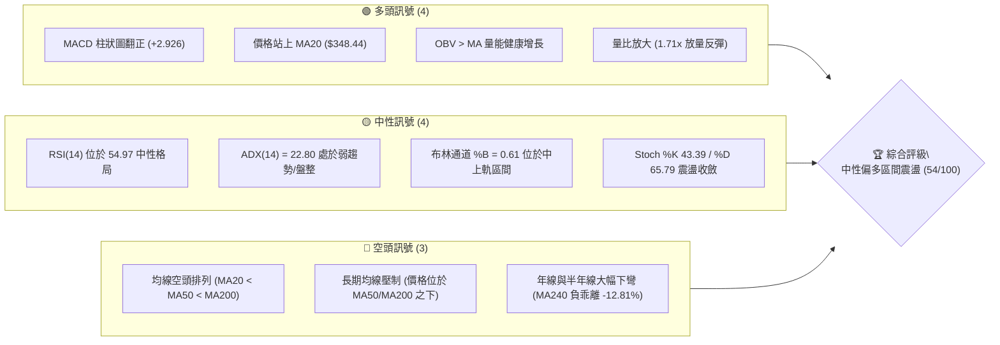
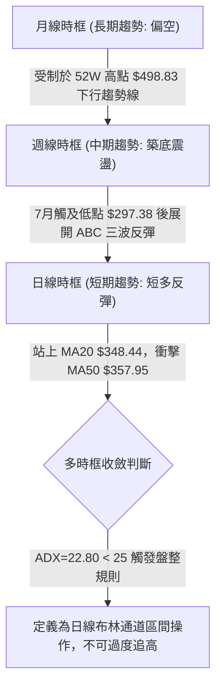
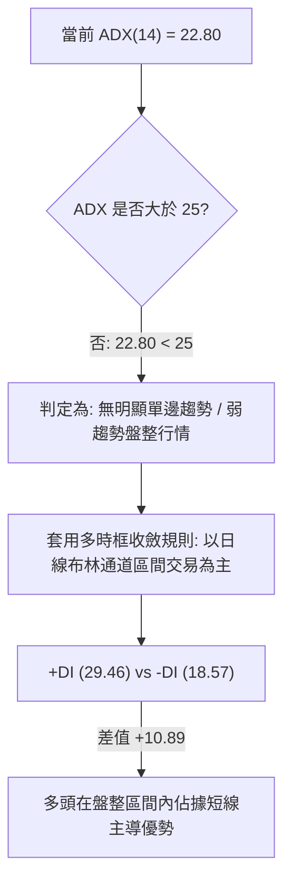
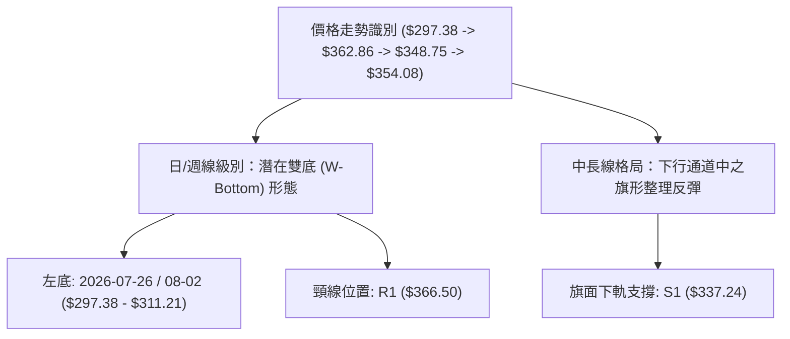
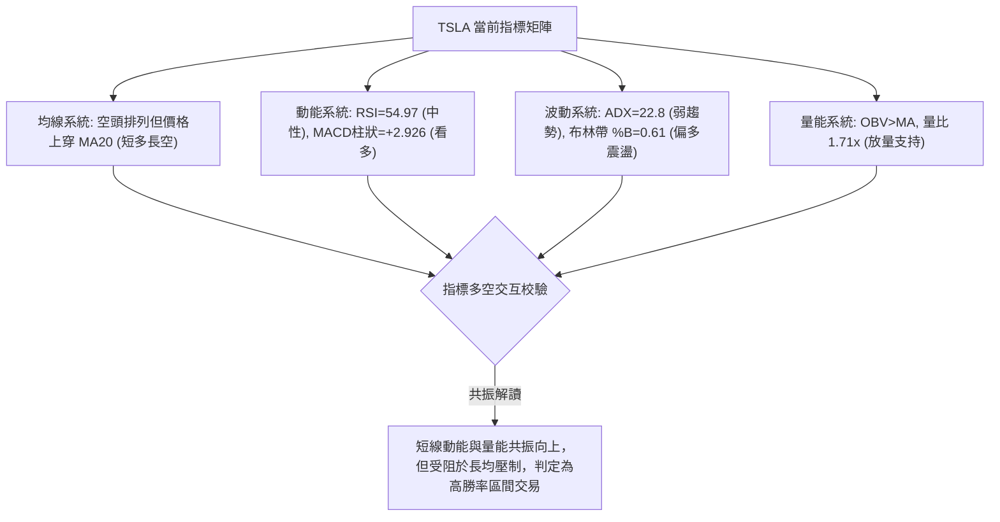
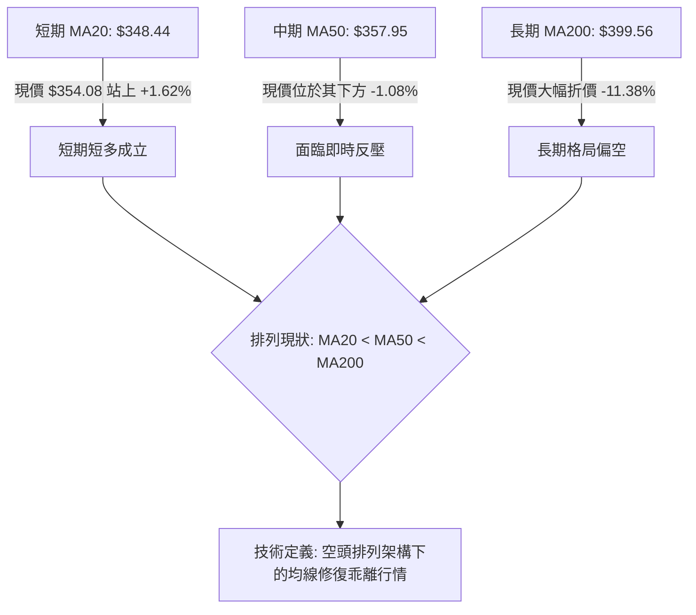
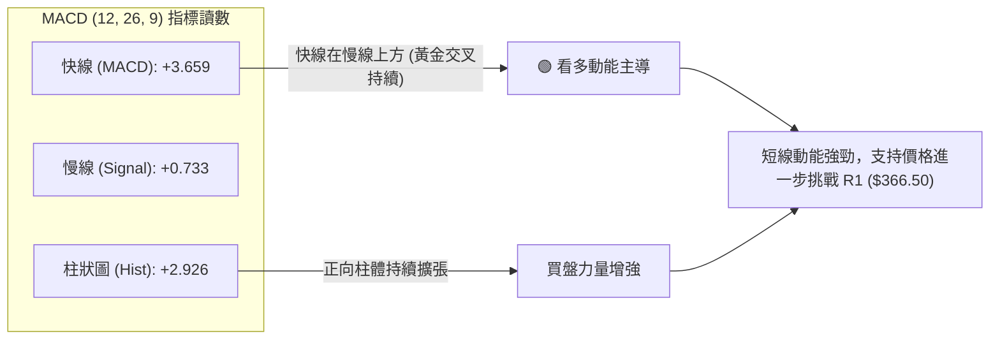
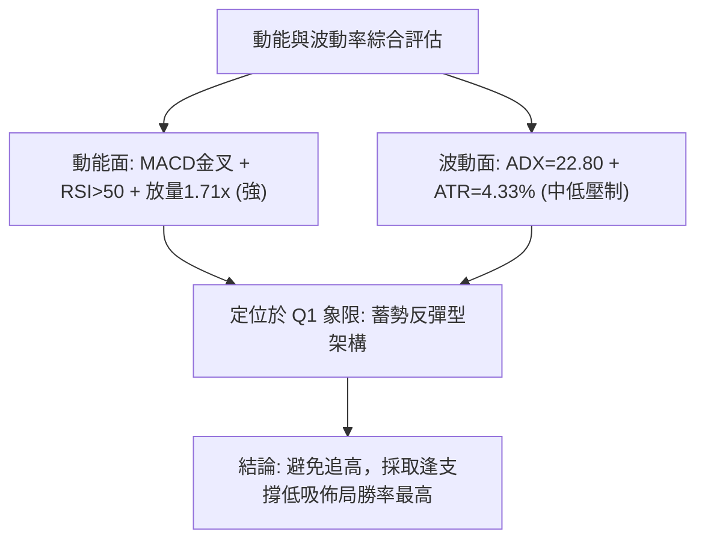
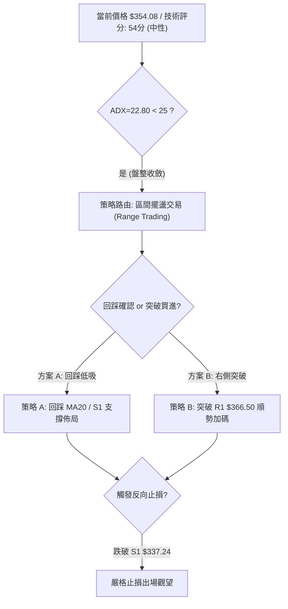
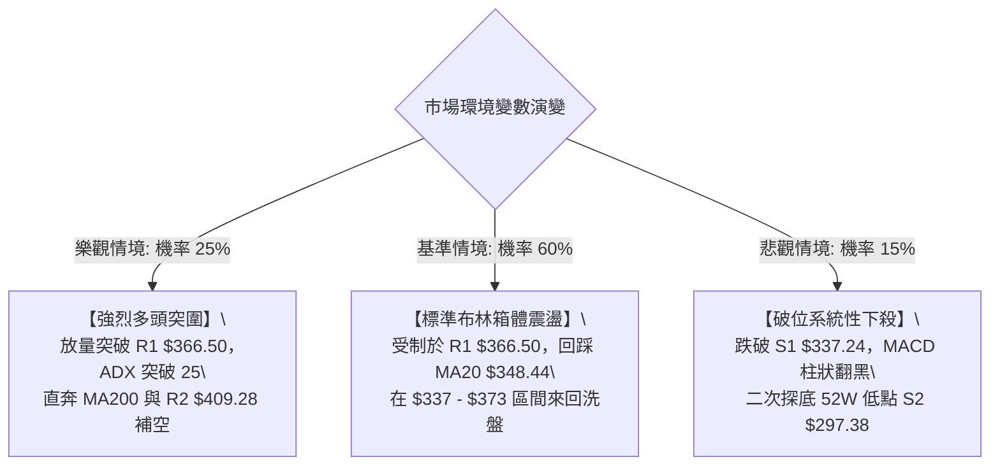

# TSLA 技術分析報告

> **報告日期**：2026-09-06 ｜ **語言**：繁體中文 ｜ **數據來源**：Yahoo Finance ｜ **當前價格**：$354.08

---

## 目錄

| 章節 | 內容 |
|------|------|
| [1. 技術面概覽](#1-技術面概覽) | 訊號儀表板、核心指標、評分卡 |
| [2. 趨勢分析](#2-趨勢分析) | 多時框趨勢、長中短期走勢 |
| [3. 圖表形態分析](#3-圖表形態分析) | 形態識別、K線組合、目標價 |
| [4. 支撐與阻力](#4-支撐與阻力) | 關鍵價位、斐波那契回調 |
| [5. 技術指標深度解讀](#5-技術指標深度解讀) | MA/RSI/MACD/布林/成交量 |
| [6. 動能與波動率](#6-動能與波動率) | 動能評估、ATR、Beta |
| [7. 多時框架總結](#7-多時框架總結) | 時框架評分矩陣與收斂結論 |
| [8. 交易策略建議](#8-交易策略建議) | 區間交易策略、風險報酬比 |
| [9. 風險提示與監控](#9-風險提示與監控) | 監控指標、風險場景 |
| [📋 報告總結](#-報告總結) | 核心總結與決策要點 |

---

## 1. 技術面概覽

### 🎯 技術訊號儀表板



### 📊 核心指標速覽表

| 指標類別 | 指標名稱 | 當前數值 | 訊號 | 解讀 |
|----------|----------|----------|------|------|
| **價格** | 當前價格 | $354.08 | 🟡 | 位於52週區間 28.1%，自 7 月低點強勁反彈中 |
| **均線** | MA20 | $348.44 | 🟢 | 價格在 MA20 上方 (+1.62%)，短線扭轉為支撐 |
| **均線** | MA50 | $357.95 | 🔴 | 價格在 MA50 下方 (-1.08%)，短中期反壓逼近 |
| **均線** | MA200 | $399.56 | 🔴 | 價格顯著低於 MA200 (-11.38%)，長期空頭結構壓制 |
| **動能** | RSI(14) | 54.97 | 🟡 | 中性區間震盪，脫離先前超賣區但未見頂背離 |
| **動能** | MACD (12,26,9) | 3.659 / 0.733 | 🟢 | 快線上穿慢線，柱狀圖 +2.926 擴張，短多主導 |
| **動能** | ADX (14) | 22.80 | 🟡 | ADX < 25，趨勢偏弱，行情定義為「盤整反彈」 |
| **動能** | 方向指標 (+DI / -DI)| 29.46 / 18.57 | 🟢 | +DI 明顯大於 -DI，反彈波段買盤強於賣盤 |
| **通道** | 布林帶 (%B) | 0.61 ($323.65-$373.23) | 🟡 | 價格運行於中軌（$348.44）上方，朝上軌運行 |
| **波動** | ATR(14) | $15.34 | 🟡 | 日波動率 4.33%，維持中等偏高正常波動水準 |
| **量能** | 20日成交量比 | 1.71x (64.8M / 37.9M) | 🟢 | 顯著放量，OBV 向上支撐短線價格上攻 |

### 🏆 技術評分卡

```
╔══════════════════════════════════════════════════════════════╗
║             技術評分卡 — TSLA (2026-09-06)                  ║
╠══════════════════════════════════════════════════════════════╣
║ 趨勢強度 (ADX=22.8)   ████████░░░░░░░░░░░░  42/100  🟡 弱勢盤整 ║
║ 動能指標 (MACD/RSI)   ██████████████░░░░░░  68/100  🟢 短多反彈 ║
║ 支撐穩定度 (S1=$337)  ████████████░░░░░░░░  60/100  🟡 中度可靠 ║
║ 成交量配合 (Vol=1.7x) ████████████████░░░░  78/100  🟢 放量確認 ║
║ 形態完整度 (雙底反彈) ████████████░░░░░░░░  60/100  🟡 頸線挑戰 ║
║ 均線排列 (空頭排列)   ██████░░░░░░░░░░░░░░  30/100  🔴 均線壓制 ║
╠══════════════════════════════════════════════════════════════╣
║ 綜合評分 (中性震盪)   ███████████░░░░░░░░░  54/100  🟡 區間操作 ║
╚══════════════════════════════════════════════════════════════╝
```

---

## 2. 趨勢分析

### 🌐 多時框趨勢分析



### 📈 長期趨勢 — 12個月走勢圖（Unicode）

TSLA 過去 12 個月（2025-10 至 2026-09）呈現顯著的雙重下行浪結構，自 2025 年 10 月歷史次高區間 $456.56 見頂後，經歷兩階段修正，並於 2026 年 7 月打出波段低點 $311.21（盤中 52 週低點為 $297.38），目前處於右側修復階段。

```
TSLA 月線走勢圖（過去12個月：2025-10 至 2026-09）
價格軸 ($)
$460 ┤  ● 2025-10 ($456.56)
$440 ┤     ● 2025-12 ($449.72)
$420 ┤        ● 2026-01 ($430.41)       ● 2026-05 ($435.79)
$400 ┤           ● 2026-02 ($402.51)       ● 2026-06 ($420.60)
$380 ┤              ● 2026-04 ($381.63)
$360 ┤                 ● 2026-03 ($371.75)   ● 2026-08 ($367.95)
$350 ┤─────────────────────────────────────────────────● 2026-09 ($354.08) ◄ 現價
$330 ┤
$310 ┤                                            ● 2026-07 ($311.21) [波段低點]
$290 ┤                                               [52W Low $297.38]
     └──────────────────────────────────────────────────────────────
       10  11  12  01  02  03  04  05  06  07  08  09 (月份)
```

#### 走勢特徵分析表格

| 階段 | 時間區間 | 起始/結束價格 | 漲跌幅 | 主要技術特徵 |
|------|----------|---------------|--------|--------------|
| 第一階段：高位出貨 | 2025-10 至 2026-03 | $456.56 → $371.75 | -18.58% | 連續 5 個月震盪盤跌，跌破短期上升趨勢 |
| 第二階段：次級反彈 | 2026-03 至 2026-05 | $371.75 → $435.79 | +17.23% | 縮量假突破，受制於波段高點聚類反壓區 |
| 第三階段：主跌破位 | 2026-05 至 2026-07 | $435.79 → $311.21 | -28.59% | 爆量長黑摜破 200 日線，探底至 $297.38 |
| 第四階段：技術修復 | 2026-07 至 2026-09 | $311.21 → $354.08 | +13.78% | 日/週線底背離修復，收復 MA20，挑戰 MA50 |

### 📊 中期趨勢（週線分析）

中期走勢自 2026-07-26 當週收盤價 $313.03 及 2026-08-02 週收盤 $311.21 形成雙重下影針探底。近 6 週呈現明顯的價量回升格局：
- **週線動能修復**：週 RSI 從超賣區極值 15.7 飆升修復至當前 55.0，脫離超賣區進入中性多頭掌控區。
- **MACD 柱狀圖翻多**：週線 MACD 柱狀圖由 -8.365 強勁翻正至 +2.926，顯示中線空頭動能已完全衰竭，短期買盤重掌主動權。
- **週線關鍵壓制**：上方第一重實質壓力為 2026-08-23 的反彈波段高點聚類 R1（$366.50）。

```
TSLA 中期週線支撐與阻力結構示意圖
$409.28 ══════════════════════════════════ [R2 中期強阻力 / 6月平台低點聚類]
              ▲
              │   [反彈延伸目標]
$366.50 ────────────────────────────────── [R1 短期反彈強壓 / 近一年波段高點聚類]
              ▲
$354.08 ══════╪═══════════════════════════ [現價：挑戰 MA50 $357.95]
              │
$348.44 ┄┄┄┄┄┄┼┄┄┄┄┄┄┄┄┄┄┄┄┄┄┄┄┄┄┄┄┄┄ [MA20 / 布林中軌動態支撐]
              ▼
$337.24 ────────────────────────────────── [S1 關鍵支撐 / 斐波 78.6% $340 聚類]
              ▼
$297.38 ══════════════════════════════════ [S2 52週極限低點 / 中期多頭防線]
```

### ⚡ 趨勢強度評估（ADX 解讀）



#### ADX 強度量化對照表

| ADX 區間 | 趨勢性質 | 當前對應狀態 | 交易策略指導原則 |
|----------|----------|--------------|------------------|
| 0 – 20 | 極弱 / 無趨勢 | 否 | 觀望或超短線高拋低吸 |
| **20 – 25** | **弱趨勢 / 盤整震盪** | **✓ 當前值 22.80** | **區間通道交易，嚴禁單邊無腦追高** |
| 25 – 40 | 強趨勢建立 | 否 | 順勢突破加碼，均線跟蹤止損 |
| 40 – 60 | 極強單邊趨勢 | 否 | 持股續抱，緊盯背離反轉訊號 |

---

## 3. 圖表形態分析

### 🔍 形態識別系統



#### 形態識別與信心度評估表

| 形態名稱 | 信心度 | 判斷依據（引用真實數據） | 完成度 | 目標價（附嚴謹計算式） |
|----------|--------|--------------------------|--------|------------------------|
| **雙底形態 (W-Bottom)** | **62%** | 兩次下探低點 $297.38（7月下旬）與 $311.21（8月初始），隨後放量突破 MA20 | 75%（尚未有效突破頸線） | 突破頸線 R1 $366.50 後，形態高度 H = 頸線 $366.50 - 最低點 $297.38 = $69.12。<br>**理論目標價 = $366.50 + $69.12 = $435.62**（向上聚類於 2026-05 波段高點 $435.79 與 R3 $418.36 附近） |
| **短期上升旗形** | **55%** | 自 $311.21 快速反彈至 $362.86（旗桿高 $51.65），隨後在 $348.75 至 $354.08 窄幅整固 | 80% | 旗面下軌守住 S1 $337.24。突破旗頂 $366.50 後：<br>**目標價 = $348.75 + $51.65 = $400.40**（精確貼合 MA200 $399.56 與 R2 $409.28） |
| **長期頭肩頂反轉** | **35%** | 左肩 2025-10 ($456.56)、頭部 52W High ($498.83)、右肩 2026-05 ($435.79) | 訊號不足 | 信心度 < 50%，依規則僅作指標解讀，不列入主交易路徑 |

### 🕯️ 重要K線形態分析

| 日期/月份 | 收盤價 | K線形態 | 解讀 | 訊號強度 |
|-----------|--------|---------|------|----------|
| 2026-07-26 | $313.03 | 長實體大陰線 | 恐慌拋售盤湧出，RSI 破位跌至 15.7 極限超賣 | 🔴 強空竭盡 |
| 2026-08-02 | $311.21 | 縮量長下影錘頭線 | 測試 52W 低點 $297.38 獲強大買盤承接，確認底部支撐 S2 | 🟢 強烈看多 |
| 2026-08-23 | $362.86 | 放量長陽突破線 | 連續突破 MA5 與 MA20，週 RSI 飆升至 72.7，確立第一波反彈高點 | 🟢 短線多頭 |
| 2026-08-30 | $348.75 | 縮量小陰線回踩 | 健康回踩 MA20 支撐位（$348.44），洗出不堅定籌碼 | 🟡 蓄勢整理 |
| 2026-09-06 | $354.08 | 放量小陽包覆線 | 成交量擴大至 64.8M（量比 1.71x），站穩 MA20 重新發起進攻 | 🟢 買盤進駐 |

### 📉 ASCII 走勢形態示意圖

```
TSLA 日/週線潛在「雙底（W底）」結構與頸線關鍵突破位示意
價格 ($)
$375 ┤                                                 [布林上軌 $373.23]
$366.50 ┼───────────────────────[頸線 R1: $366.50]─────── [關鍵突破閥值]
     │                       ▲                 ▲
$354 ┤                      ╱ ╲               ╱ █ ◄ 現價 ($354.08)
$348 ┤                     ╱   ╲   回踩MA20  ╱
     │                    ╱     ╲  $348.44  ╱
$337 ┼───────────────────┼───────●─────────┼────────── [S1 支撐 $337.24]
     │                  ╱                   
$311 ┤   底1           ╱                     底2
     │   ●            ╱                      ●
$297 ┼────╲──────────╱─────────────────────────────── [S2 52W Low $297.38]
          2026-07-26                         2026-08-02
```

### 🎯 形態目標價計算

根據雙底形態學推導：
1. **基底確立**：雙底最低價取自 52 週波段低點 $297.38，頸線取自數據中明確給定的阻力位 **R1: $366.50**。
2. **形態垂直高度 ($H$)**：
   $$H = \text{頸線}(R1) - \text{形態低點}(S2) = \$366.50 - \$297.38 = \$69.12$$
3. **等幅測算目標價 ($Target$)**：
   $$Target = R1 + H = \$366.50 + \$69.12 = \$435.62$$
   *校驗結論*：該計算目標價高度收斂於 2026 年 5 月高點 $435.79 以及關鍵阻力密集區 R2（$409.28）至 R3（$418.36）之上方延伸段。

---

## 4. 支撐與阻力

### 🗺️ 關鍵價位分布圖（Unicode）

```
TSLA 價位結構分布圖（引用 OHLCV 計算真實價位）
═════════════════════════════════════════════════════════════════
$498.83 ║████████████████████████████████████████║ 52W 歷史最高點 (斐波 0.0%)
$451.29 ║████████████████████████████████        ║ 斐波 23.6% 回調位
$418.36 ║████████████████████████████            ║ 強阻力 R3 (+18.15%)
$409.28 ║██████████████████████████              ║ 重要阻力 R2 (+15.59%)
$398.10 ║████████████████████████                ║ 斐波 50.0% / MA200 ($399.56)
$374.33 ║████████████████████                    ║ 斐波 61.8% / 布林上軌 ($373.23)
$366.50 ║██████████████████                      ║ 關鍵阻力 R1 / 雙底頸線 (+3.51%)
$354.08 ╠════════════════════════════════════════╣ ◄ 現價 ($354.08)
$348.44 ║▓▓▓▓▓▓▓▓▓▓▓▓▓▓▓▓                        ║ MA20 / 布林中軌支撐
$340.49 ║▓▓▓▓▓▓▓▓▓▓▓▓▓▓                          ║ 斐波 78.6% 回調位
$337.24 ║▓▓▓▓▓▓▓▓▓▓▓▓                            ║ 近期關鍵支撐 S1 (-4.76%)
$323.65 ║▓▓▓▓▓▓▓▓                                ║ 布林下軌
$297.38 ║████████████████████████████████████████║ 52W 歷史最低點 S2 (斐波 100.0%)
═════════════════════════════════════════════════════════════════
```

### 🚧 阻力位分析表

| 阻力級別 | 價位 | 形成原因（引用真實數據聚類） | 突破難度 | 重要性 |
|----------|------|------------------------------|----------|--------|
| **R1** | **$366.50** | 近一年波段高點聚類；逼近 2026-08-23 週收盤高點 $362.86 與 MA60 ($364.22) | 中等 | ★★★★☆ |
| **R2** | **$409.28** | 近一年波段高點密集套牢區；共振 MA200 ($399.56) 與斐波 50% 心理大關 ($398.10) | 極高 | ★★★★★ |
| **R3** | **$418.36** | 2026-05 與 2026-06 破位前之雙頂平台頸線聚類高點 | 極高 | ★★★★☆ |

### 🛡️ 支撐位分析表

| 支撐級別 | 價位 | 形成原因（引用真實數據聚類） | 守住機率 | 重要性 |
|----------|------|------------------------------|----------|--------|
| **動態支撐** | **$348.44** | 20日均線 (MA20) 兼布林中軌，上週五已完成回踩確認 | 70% | ★★★☆☆ |
| **S1** | **$337.24** | 近一年波段低點聚類；緊鄰斐波 78.6% 回調位 ($340.49) 防禦帶 | 75% | ★★★★☆ |
| **S2** | **$297.38** | 52週極限低點；2026-07/08 雙底極限針尖，破位將引發系統性崩跌 | 90% | ★★★★★ |

### 📐 斐波那契回調位分析

依據提供的 52 週完整波動區間（高點 **$498.83** → 低點 **$297.38**，垂直落差 $201.45），各關鍵黃金分割比例位如下：

- **0.0% (52W High)**: $498.83
- **23.6%**: $451.29
- **38.2%**: $421.88
- **50.0%**: $398.10
- **61.8%**: $374.33
- **78.6%**: $340.49
- **100.0% (52W Low)**: $297.38

#### 當前位置專業解讀：
現價 **$354.08** 正精確落於 **78.6% 回調位 ($340.49)** 與 **61.8% 回調位 ($374.33)** 之間的「黃金修復通道」：
1. 現價向上距離 61.8% 黃金分割強阻力位（$374.33）僅差 +5.72%，該位置恰好與布林上軌（$373.23）產生共振。若能攻克此處，行情將由「弱勢修復」轉為「強勢反彈」。
2. 現價向下獲 78.6% 回調位（$340.49）與 S1（$337.24）雙重保護，安全墊約為 -3.8% 至 -4.76%。

---

## 5. 技術指標深度解讀

### 🎛️ 指標訊號總覽



### 📈 移動平均線排列分析



#### 各週期均線細節數據分析表

| 均線名稱 | 當前價格 | 乖離率 (現價 vs MA) | 趨勢斜率特徵 | 多空屬性 |
|----------|----------|---------------------|--------------|----------|
| **MA 5** | $362.30 | -2.27% | 短線快速拉回後走平，壓制於頭頂 | 🔴 短期壓制 |
| **MA 10**| $356.01 | -0.54% | 走平接近現價，爭奪日線控制權 | 🟡 中性爭奪 |
| **MA 20**| $348.44 | +1.62% | 拐頭向上，由壓力成功轉化為下檔第一道防線 | 🟢 短線支撐 |
| **MA 60**| $364.22 | -2.78% | 持續下行，精準阻擊於 R1 ($366.50) 下方 | 🔴 中期強壓 |
| **MA120**| $379.12 | -6.61% | 下行斜率較大，封閉中線反彈空間 | 🔴 中長強壓 |
| **MA240**| $406.10 | -12.81% | 歷史大頂均線，年線壓力深重 | 🔴 長期阻力 |

### 📉 RSI(14) 分析

當前日線 RSI(14) 讀數為 **54.97**。
```
RSI(14) 強度儀表盤
0 ─────────── 30 ────────────────────── 50 ────── 54.97 ──────── 70 ─────────── 100
[  極度超賣區  ] [       弱勢區間       ] [ 中性平衡 ] [★現值] [    強勢買盤區    ] [ 極度超買區 ]
進度展示: ███████████░░░░░░░░░ 54.97%
```
- **區間評估**：RSI 脫離了 2026-07-26 週的極端崩潰超賣值（15.7），目前在 50 水平線上方穩健運行，屬於健康的買盤推動區，未進入 70 以上之超買危險區。
- **背離判斷**：
  - **頂背離**：無。目前價格反彈伴隨 RSI 由低位同步推升，未出現「新高而指標走低」的頂背離狀況。
  - **底背離**：在 2026-07-26（收盤 $313.03，RSI 15.7）至 2026-08-02（收盤 $311.21，RSI 18.1）期間，價格創波段新低，但 RSI 明顯墊高（+2.4），構成了標準的**日/週線級別雙底背離**，隨後帶動了本輪修復反彈。目前該背離動能仍在釋放中。

### 📊 MACD(12/26/9) 訊號解讀



### 📦 布林通道分析

當前布林帶（20日參數）數值如下：
- **布林上軌**：$373.23
- **布林中軌 (MA20)**：$348.44
- **布林下軌**：$323.65
- **帶寬通道振幅**：$49.58（通道寬度約 14.2%）
- **當前位置 %B**：0.61

```
布林通道現狀示意圖
$373.23 ┬────────────────────────────────────────── 布林上軌 (阻力帶，逼近斐波 61.8%)
        │
        │
$354.08 ┼─────────────────● (現價 $354.08，%B = 0.61，位於中軌上方)
        │
$348.44 ┼────────────────────────────────────────── 布林中軌 (MA20，關鍵動態支撐)
        │
        │
$323.65 ┴────────────────────────────────────────── 布林下軌 (極限保護位)
```
- **解讀**：%B 讀數為 0.61，顯示價格已從下軌徹底反轉並穩穩運行在中軌上方。在 ADX < 25 的盤整結構中，布林通道上軌（$373.23）即為本輪震盪行情的首要止盈防守目標。

### 💹 成交量分析（量價配合度）

1. **量比分析**：最新成交量為 **64,829,000 股**，相對於 20 日均量（37,947,370 股）達到了 **1.71 倍** 的顯著放量。
2. **週量級別沉澱**：本週收盤週成交量達 260,308,100 股，顯著高於前兩週的 160M–180M 水準，量增價漲。
3. **OBV（能量潮）走勢**：技術快照明確指出「**OBV > MA → 量能支撐上漲**」。資金呈現淨流入狀態，化解了價格反彈時可能面臨的「縮量假突破」疑慮。

---

## 6. 動能與波動率

### ⚡ 動能評估四象限

根據當前 TSLA 數據：
- **動能維度**：MACD 正柱擴張（+2.926）、RSI=54.97 站上中軸、+DI (29.46) 大於 -DI (18.57)，定義為**中等偏強**動能。
- **波動率維度**：ADX=22.80（低於 25 臨界線）、ATR(14)=$15.34（佔比 4.33%），歷史對比屬於**中低度**震盪壓縮區。

#### 動能與波動評估矩陣

| 象限區間 | 動能屬性 | 波動狀態 | 當前符合 | 戰略定位與操作指引 |
|----------|----------|----------|----------|--------------------|
| 第一象限 (Q1) | 強動能 | 低波動 | **✓ 核心歸屬** | **最佳操作窗口：處於動能聚積突破前夕，以區間低吸為主** |
| 第二象限 (Q2) | 弱動能 | 低波動 | — | 垃圾時間，建議觀望 |
| 第三象限 (Q3) | 強動能 | 高波動 | — | 趨勢主升/主跌浪，容易產生假突破，風險回報比降低 |
| 第四象限 (Q4) | 弱動能 | 高波動 | — | 無序暴跌洗盤，嚴禁進場 |



### 📊 ATR 波動率分析

- **當前數值**：ATR(14) 為 **$15.34**（佔當前股價比例為 **4.33%**）。
- **日內波動區間**：日內正常無趨勢隨機波動範圍為 $\pm \$15.34$。
- **止損距離設計原則**：
  - 超短線策略（日內/波段）：最小應保留 1.0 倍 ATR（約 $15.34）。
  - 波段防守策略：建議採用 1.2 倍至 1.5 倍 ATR，即 **$18.40 至 $23.00** 的防守緩衝墊，以避開高 Beta 特性所造成的無效洗盤掃單。

### 📐 Beta 與市場相關性

- **Beta 數值**：**1.845**
- **市場屬性解讀**：TSLA 具備超高彈性特徵，其波動幅度約為 S&P 500 指數的 1.85 倍。當大盤處於反彈週期時，TSLA 往往具備極強的超額阿爾法（Alpha）進攻潛力；但相對地，一旦大盤出現下行，回撤幅度亦會成倍放大，故在倉位配置上必須嚴格控制在 15%–20% 之內。

---

## 7. 多時框架總結

### 📋 時框架評分表

| 時框架 | 趨勢方向 | 動能狀態 | 均線排列狀況 | 形態特徵 | 綜合評分 | 操作建議 |
|--------|----------|----------|--------------|----------|----------|----------|
| **月線 (長期)** | 🔴 空頭 | 🟡 中性走平 | 均線高檔反壓，MA240 負乖離 (-12.8%) | 自 $498.83 頂部震盪回落 | 35/100 | 長線持股需嚴格對沖 |
| **週線 (中期)** | 🟡 築底震盪 | 🟢 轉強 (MACD翻正) | 位於週 MA20 之下，收復 10 週線 | 雙底背離築底反彈中 | 58/100 | 波段低吸，逢阻力減碼 |
| **日線 (短期)** | 🟢 短多反彈 | 🟢 強勁 (+DI=29.46) | 突破 MA20 ($348.44)，面臨 MA50 | 站穩布林中軌，向上軌進攻 | 68/100 | 區間內順勢做多 |

### 🔲 綜合訊號矩陣

```
╔══════════════════════════════════════════════════════════════╗
║                     TSLA 多時框訊號一致性矩陣               ║
╠══════════════════════════════════════════════════════════════╣
║ 維度         短期 (日線)        中期 (週線)        長期 (月線)  ║
╠══════════════════════════════════════════════════════════════╣
║ 趨勢訊號     🟢 偏多反彈        🟡 區間震盪        🔴 下行空頭  ║
║ 動能指標     🟢 MACD金叉        🟢 柱狀擴張        🟡 跌勢趨緩  ║
║ 支撐防守     🟢 MA20 ($348.44)  🟢 S1 ($337.24)   🟢 S2 ($297) ║
║ 阻力壓制     🔴 MA50 ($357.95)  🔴 R1 ($366.50)   🔴 R2 ($409) ║
║ 成交量能     🟢 放大 (1.71x)    🟢 連續兩週增量    🟡 中性持平  ║
╚══════════════════════════════════════════════════════════════╝
```

### ⚖️ 多時框收斂結論

> **核心判定依據（嚴格遵循多時框收斂規則 14）**：
> 1. 當前趨勢強度指標 **ADX(14) = 22.80 < 25**，市場技術結構完全符合**「盤整震盪行情」**定義。
> 2. 依規則，中長期 MA50/MA200 的單邊空頭趨勢暫時不作為單邊追空的依據；**整體交易節奏必須以「日線布林通道上下軌及明確波段支撐阻力」為唯一指導區間**。
> 3. **唯一方向性結論：【中性偏多，區間震盪操作】**。日內與數日級別以逢低做多為主，向上測試至布林上軌與 R1 阻力帶後獲利了結，暫不具備長線單邊大反轉的追價條件。此結論與第 8 章交易策略完全收斂一致。

---

## 8. 交易策略建議

### 🗺️ 策略決策流程圖



### 🧭 策略路由（依評分卡分流）

- **當前主策略方向 = 【中性偏多，區間回踩低吸操作】（依評分 54/100）**
  - 技術評分 54 分處於 40–60 區間，ADX 22.80 明確指示盤整。本策略專注於日線布林通道上下軌之間的高盈虧比機會，主推多頭逢低佈局，絕不於阻力位盲目追價。

### 🎯 價格情境階梯（Price Scenarios）

所有價位均精確引用本報告第 4 章及輸入數據之關鍵價位：

| 觸發條件 | 第一目標位 | 第二目標位 | 後續延伸 | 情境含義與技術定性 |
|----------|------------|------------|----------|--------------------|
| **強勢突破 R1 ($366.50)** | 布林上軌 $373.23 | **R2 ($409.28)** | R3 ($418.36) | 雙底形態確立，短期單邊主升浪啟動 |
| **穩守 MA20 ($348.44)** | MA50 ($357.95) | **R1 ($366.50)** | 布林上軌 $373.23 | 維持多頭通道整固，持續震盪上行 |
| **失守 S1 ($337.24)** | 布林下軌 $323.65 | **S2 ($297.38)** | 破位測底 | 反彈宣告終結，重新測試 52 週極限大底 |

### 📊 情境機率分佈

| 震盪與運行情境 | 發生機率 | 主要技術依據 |
|----------------|----------|--------------|
| **情境一：震盪向上挑戰 R1 / 布林上軌** | **55%** | MACD 柱狀圖 (+2.926) 強勁擴張，OBV 放量 (1.71x)，價格穩居 MA20 之上 |
| **情境二：在 MA20 至 MA50 間收斂橫盤** | **30%** | ADX=22.80 顯示趨勢動能有限，MA50 ($357.95) 與 MA60 ($364.22) 反壓沉重 |
| **情境三：跌破 S1 回測 52W 低點 S2** | **15%** | 均線整體仍處空頭排列，若大盤系統性風險引發跳空殺跌 |

### 🟢 主策略詳情

本報告依據「區間震盪」原則設計兩套具體執行策略，**所有點位均嚴格基於數據中的 S1、S2、R1、R2 及均線計算**：

| 策略要素 | 策略 A（穩健型：回踩支撐低吸） | 策略 B（激進型：突破頸線追買） |
|----------|--------------------------------|--------------------------------|
| **進場條件** | 盤中拉回測試 MA20 獲得支撐確認 | 放量（日量 >50M）實體長陽突破 R1 |
| **進場價格** | **$348.44**（精確對應 MA20/布林中軌） | **$366.50**（突破 R1 後回踩確認） |
| **目標價 T1** | **$366.50**（阻力位 R1） | **$374.33**（斐波那契 61.8% / 上軌） |
| **目標價 T2** | **$373.23**（布林通道上軌） | **$409.28**（阻力位 R2 / MA200 聚類） |
| **止損價格** | **$337.24**（精確對應支撐位 S1） | **$348.44**（跌回 MA20 之下無條件離場）|
| **風險空間** | $\$348.44 - \$337.24 = \$11.20$ (約 3.21%) | $\$366.50 - \$348.44 = \$18.06$ (約 4.93%) |
| **報酬空間 (T2)**| $\$373.23 - \$348.44 = \$24.79$ (約 7.11%) | $\$409.28 - \$366.50 = \$42.78$ (約 11.67%)|
| **風險報酬比** | **1 : 2.21**（優良） | **1 : 2.37**（優良） |
| **預估勝率** | **65%** | **52%** |
| **建議倉位** | **總資金之 15%** | **總資金之 10%** |

### 🔴 反向風險觸發點（對沖提示）

若發生以下任一信號，判定本多頭策略徹底失效，應立即全面停損或啟動反向空頭對沖：
1. **關鍵價位跌破**：收盤價以長黑K實體跌破 **S1: $337.24**（即斐波 78.6% 回調位 $340.49 失守）。
2. **指標轉弱共振**：日線 MACD 柱狀圖由正轉負，且 RSI(14) 快速跌破 45 水準。
3. **對沖操作建議**：跌破 $337.24 後反抽不過，可建立反向保護性 Put 或減碼至空倉，下看目標 **S2: $297.38**。

### ⭐ 整體訊號強度評星

```
做多訊號強度：★★★☆☆  (3.0/5星 - 短多量能充沛，惟受限均線壓制)
做空訊號強度：★★☆☆☆  (2.0/5星 - 底部背離已成，動能殺跌力竭)
整體可信度：  ★★★★☆  (4.0/5星 - 數據完整，價量共振度高)
```

---

## 9. 風險提示與監控

### ✅ 關鍵監控指標 Checklist

```
╔══════════════════════════════════════════════════════════════╗
║               TSLA 交易日常風控監控清單 (Checklist)           ║
╠══════════════════════════════════════════════════════════════╣
║ [ ] 每日收盤價是否持續維持在 MA20 ($348.44) 上方？           ║
║ [ ] 日成交量是否維持在 40M 均量以上（健康量能標準）？        ║
║ [ ] 日線 RSI(14) 是否跌破 50 榮枯線或出現頂背離？            ║
║ [ ] ADX(14) 是否由 22.8 上衝突破 25（預告單邊趨勢來臨）？   ║
║ [ ] 價格衝擊 R1 ($366.50) 時是否出現長上影線（主力出貨）？  ║
║ [ ] S1 支撐位 ($337.24) 是否完好無損？                       ║
╚══════════════════════════════════════════════════════════════╝
```

### ⚠️ 風險場景分析



### 🛡️ 風險管理重要提醒

1. **高 Beta 波動適配**：TSLA 當前 Beta 高達 **1.845**，每日 ATR 波動高達 **$15.34**（約 4.33%）。任何單筆交易之實際虧損額不得超過投資組合總權益的 **1.5%**。
2. **倉位管理戒律**：
   - 由於長期均線（MA200 = $399.56，MA240 = $406.10）仍呈標準空頭排列，本質上此波仍屬「逆大勢反彈」架構。
   - 總部位暴露嚴格限制在 **20% 資金上限**，嚴禁在未突破頸線 R1 之前加碼攤平。
3. **重大基本面配合**：估值 P/E 處於 321 倍高檔，營收成長 25.5% 但淨利成長小幅衰退（-3.0%），顯示高估值對利率與宏觀數據極度敏感，需緊盯機構持股（43.7%）之動向與大行降級風險。

---

## 📋 報告總結

```
╔══════════════════════════════════════════════════════════════╗
║                   TSLA 技術分析報告總結                      ║
╠══════════════════════════════════════════════════════════════╣
║ 報告日期：2026-09-06                                         ║
║ 當前價格：$354.08                                             ║
║ 分析評級：⚖️ 中性偏多震盪 (技術評分: 54 / 100)               ║
║                                                              ║
║ 關鍵技術結論：                                               ║
║ ├─ 長期趨勢：🔴 偏空 (MA200 $399.56 下方，年線乖離 -12.8%)   ║
║ ├─ 中期趨勢：🟡 築底 (7月 $297.38 見底，週MACD柱狀圖翻正)    ║
║ ├─ 短期趨勢：🟢 短多 (站上 MA20 $348.44，量比放大至 1.71x)    ║
║ ├─ 關鍵支撐：S1: $337.24 ｜ 動態支撐: MA20 $348.44           ║
║ ├─ 關鍵阻力：R1: $366.50 ｜ 布林上軌: $373.23 ｜ R2: $409.28║
║ └─ 華爾街共識目標價：$390.09 (現價具備 +10.17% 修復空間)     ║
║                                                              ║
║ 最優交易執行方案：                                           ║
║ 1. 🥇 最佳機會 (策略 A)：回踩 MA20 ($348.44) 掛單買進，      ║
║    止損設於 S1 ($337.24)，首要目標 R1 ($366.50)，風報比 1:2.2 ║
║ 2. 🥈 次選機會 (策略 B)：強勢突破 R1 ($366.50) 右側追買，    ║
║    止損設於 $348.44，目標下一個波段阻力 R2 ($409.28)        ║
║ 3. 🥉 保守選擇：完全空倉觀望，等待 ADX > 25 確立單邊趨勢再動║
╚══════════════════════════════════════════════════════════════╝
```

---

> ⚠️ **免責聲明**：本報告為技術分析研究，所有數據與價位估算均嚴格基於市場客觀歷史走勢與量化模型計算。本報告**僅供學術研究與交易架構參考**，**不構成任何形式的要約或個別投資建議**。金融市場瞬息萬變，交易者應獨立評估風險，自負盈虧。

---

*報告生成時間：2026-09-06 ｜ 數據來源：Yahoo Finance ｜ 分析框架：多時框幾何形態與量化指標收斂模型*