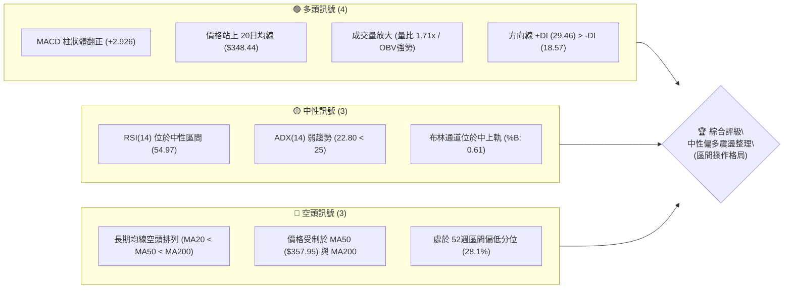
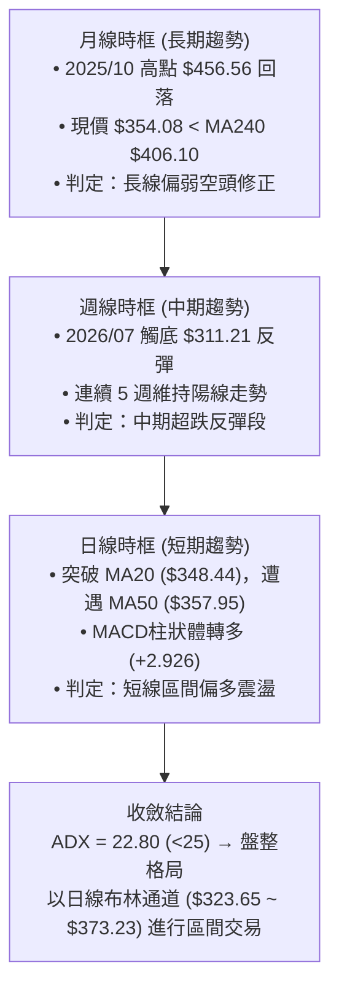
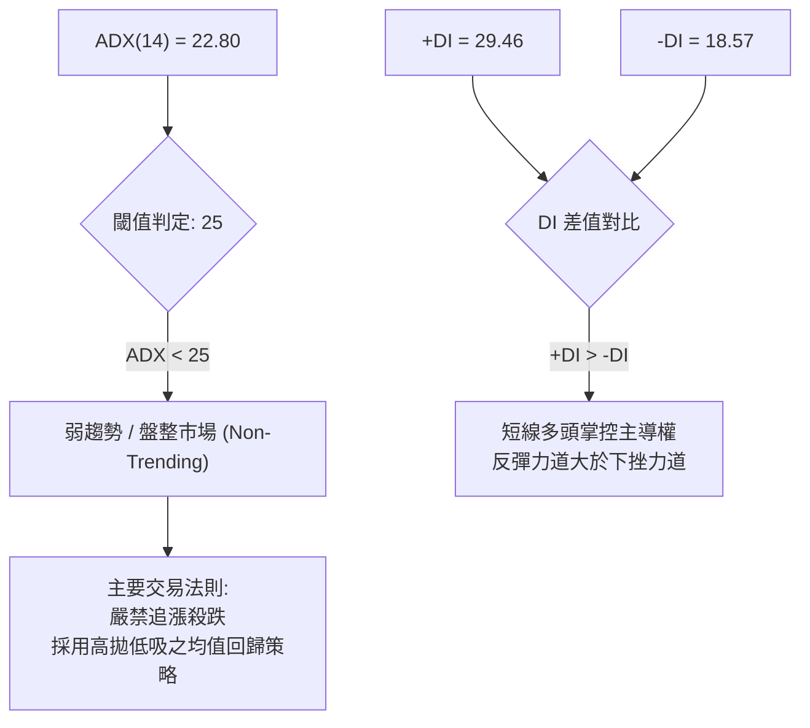
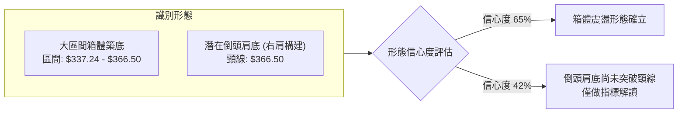
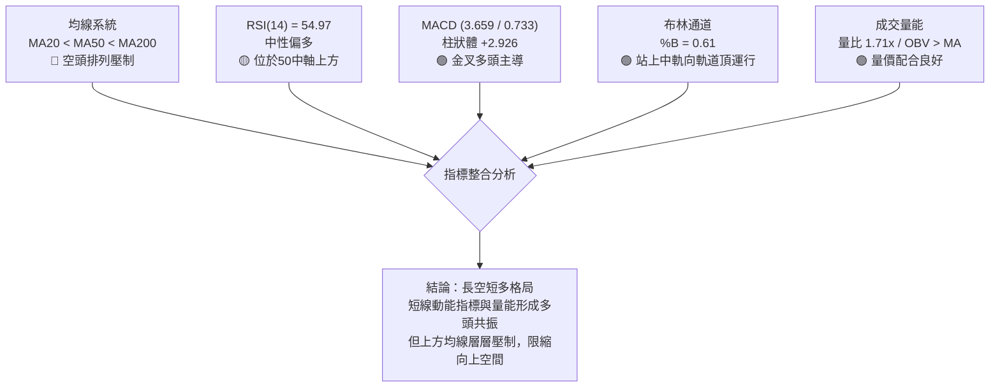
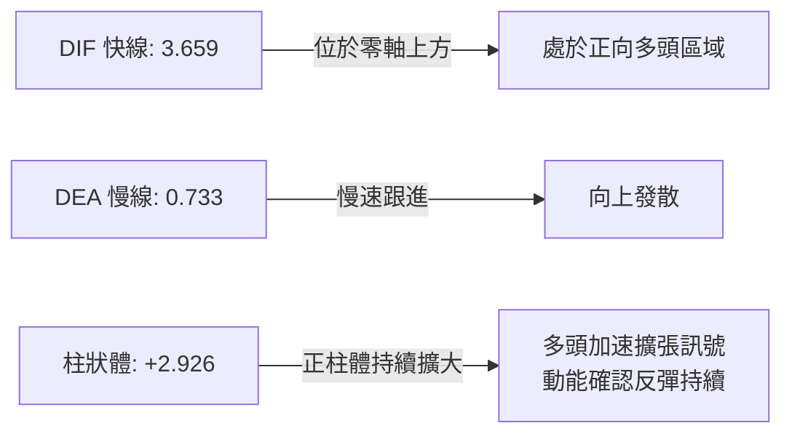
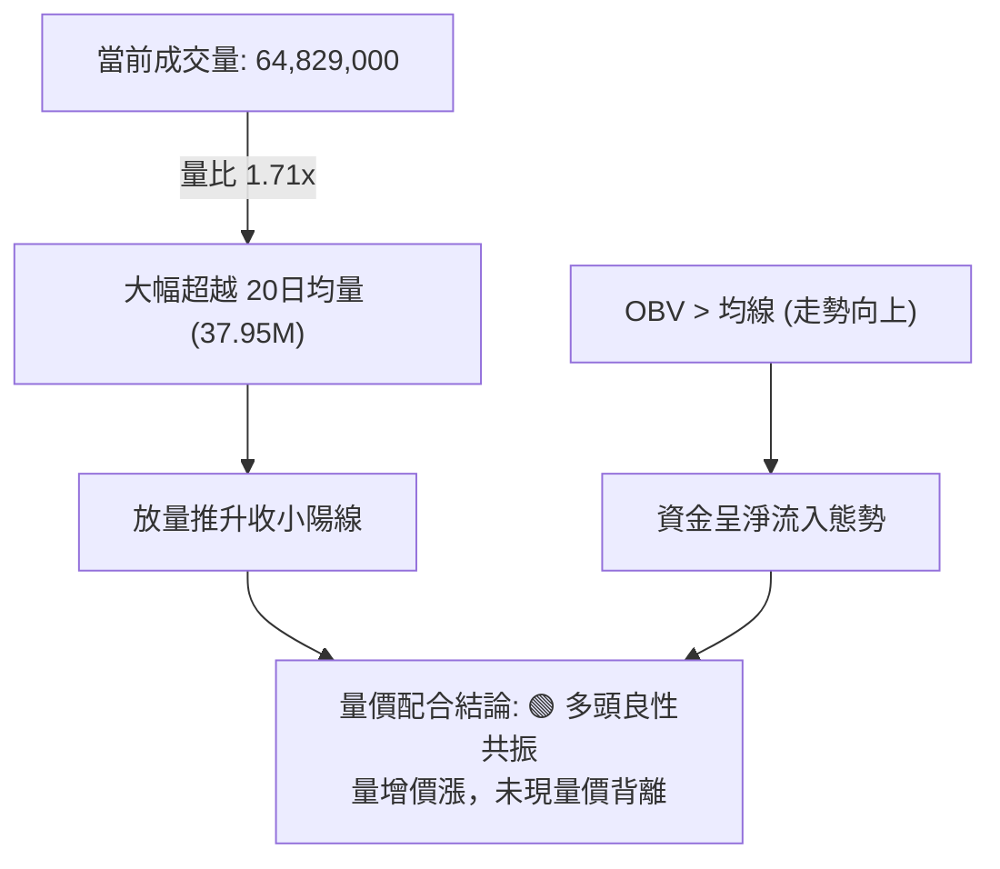
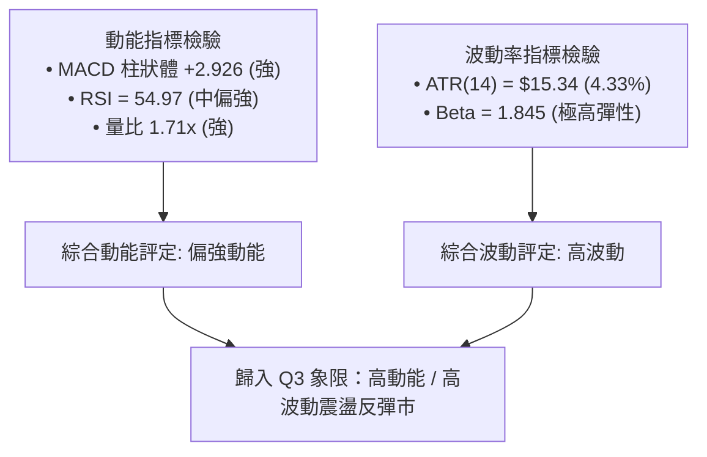
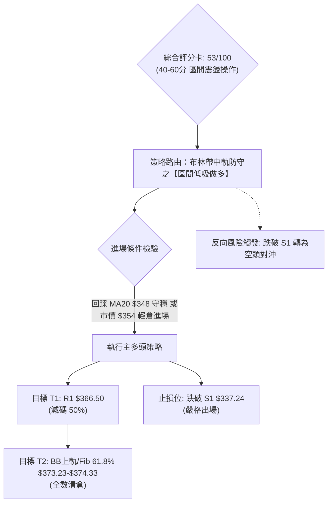
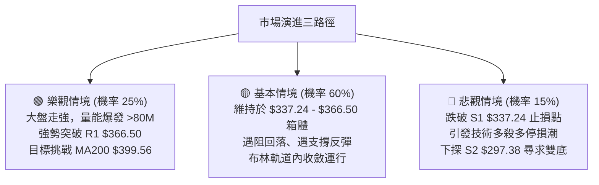

# TSLA 技術分析報告

> **報告日期**：2026-09-07 ｜ **語言**：繁體中文 ｜ **數據來源**：Yahoo Finance ｜ **當前價格**：$354.08

---

## 目錄

| 章節 | 內容 |
|------|------|
| [1. 技術面概覽](#1-技術面概覽) | 訊號儀表板、核心指標、評分卡 |
| [2. 趨勢分析](#2-趨勢分析) | 多時框趨勢、長中短期走勢、12個月走勢圖、ADX強度 |
| [3. 圖表形態分析](#3-圖表形態分析) | 形態識別、信心度評估、K線組合、目標價計算 |
| [4. 支撐與阻力](#4-支撐與阻力) | 關鍵價位分布圖、阻力位、支撐位、斐波那契回調 |
| [5. 技術指標深度解讀](#5-技術指標深度解讀) | 均線系統、RSI、MACD、布林通道、量價配合度 |
| [6. 動能與波動率](#6-動能與波動率) | 動能四象限、ATR波幅、Beta與大盤敏感度 |
| [7. 多時框架總結](#7-多時框架總結) | 時框矩陣、多時框收斂結論（ADX規則） |
| [8. 交易策略建議](#8-交易策略建議) | 策略路由、情境階梯、主策略詳情、風控對沖點 |
| [9. 風險提示與監控](#9-風險提示與監控) | 監控清單、風險情境路徑、資金管理規範 |
| [10. 報告總結](#10-報告總結) | 總結儀表板與策略優先級 |

---

## 1. 技術面概覽

### 🎯 技術訊號儀表板



### 📊 核心指標速覽表

| 指標類別 | 指標名稱 | 當前數值 | 訊號 | 解讀 |
|:---|:---|:---|:---:|:---|
| **價格** | 當前收盤價 | $354.08 | 🟡 | 位於52週區間 28.1% 分位，處於築底後反彈中繼 |
| **均線** | MA20 (短線) | $348.44 | 🟢 | 現價高於 MA20（+1.62%），短線下檔具動態支撐 |
| **均線** | MA50 (中線) | $357.95 | 🔴 | 現價低於 MA50（-1.08%），中線反彈面臨首道動態壓力 |
| **均線** | MA200 (長線)| $399.56 | 🔴 | 現價大幅低於 MA200（-11.38%），長線多空分水嶺承壓 |
| **動能** | RSI(14) | 54.97 | 🟡 | 位於 50 多空分界線上方，動能溫和中性，無極端超買超賣 |
| **動能** | MACD (12/26/9)| DIF: 3.659 / DEA: 0.733 | 🟢 | MACD金叉運行，柱狀體 +2.926 持續擴張，短多主導 |
| **擺動** | KD (Stoch 14)| %K: 43.39 / %D: 65.79 | 🟡 | %K 跌破 %D 進入整理，短線衝高後呈現動能消化 |
| **趨勢** | ADX (14) | 22.80 (+DI: 29.46) | 🟡 | ADX < 25 判定為盤整/弱趨勢，多方力道佔優但缺乏趨勢性 |
| **通道** | 布林通道 | 帶寬: $49.58 (%B: 0.61)| 🟢 | 站上中軌 $348.44，向上軌 $373.23 尋求空間 |
| **量能** | 當日量 / 20日均量| 64.83M / 37.95M | 🟢 | 量比達 1.71x，OBV > MA，量能配合短線反彈 |
| **波動** | ATR(14) | $15.34 (4.33%) | 🟡 | 每日平均波幅 15 美元，屬中高波動標的，風控需保留裕度 |

### 🏆 技術評分卡

```
╔══════════════════════════════════════════════════════════════════╗
║              技術評分卡 — TSLA (2026-09-07)                      ║
╠══════════════════════════════════════════════════════════════════╣
║ 趨勢強度 (ADX/均線)   ████████░░░░░░░░░░░░  42/100  🔴 空頭排列壓制  ║
║ 動能指標 (MACD/RSI)  ████████████░░░░░░░░  60/100  🟢 短線金叉放量  ║
║ 支撐穩定度 (S1/S2)    █████████████░░░░░░░  65/100  🟢 $337支撐強勁  ║
║ 成交量配合 (OBV/量比) ██████████████░░░░░░  70/100  🟢 放量1.71倍確認 ║
║ 形態完整度 (區間築底) ██████████░░░░░░░░░░  50/100  🟡 弱形態待突破  ║
║ 均線排列 (多空結構)   ███████░░░░░░░░░░░░░  35/100  🔴 MA20<50<200   ║
╠══════════════════════════════════════════════════════════════════╣
║ 綜合評分             ███████████░░░░░░░░░  53/100  🟡 區間震盪整理  ║
╚══════════════════════════════════════════════════════════════════╝
```

---

## 2. 趨勢分析

### 🌐 多時框趨勢分析



### 📈 長期趨勢 — 12個月走勢圖（Unicode）

以下為 TSLA 自 2025 年 9 月至 2026 年 9 月的月線走勢圖與關鍵高低點軌跡：

```
TSLA 月線走勢圖（2025-09 至 2026-09）
價格 ($)
$460 ┤          ● $456.56 (2025-10 高點)
$440 ┤    ●           ●                 ● $435.79 (2026-05)
$420 ┤                      ●     ●           ●
$400 ┤                                  ●
$380 ┤                                        ●
$360 ┤                                              ●←現價 $354.08
$340 ┤
$320 ┤                                                    ● $311.21 (2026-07 低點)
     └────┬─────┬─────┬─────┬─────┬─────┬─────┬─────┬─────┬─────┬─────┬─────┬─────
        25/09 25/10 25/11 25/12 26/01 26/02 26/03 26/04 26/05 26/06 26/07 26/08 26/09
```

#### 走勢特徵分析表格

| 階段區間 | 起止月份 | 價格區間 | 區間漲跌幅 | 主要技術特徵與驅動因素 |
|:---|:---:|:---:|:---:|:---|
| **第一階段：高檔作頂** | 2025-09 ~ 2025-12 | $444.72 → $449.72 | +1.12% | 於 $450 水平多次上攻受阻，10月創下 $456.56 波段高點後形成擴散頂部 |
| **第二階段：中期下行** | 2026-01 ~ 2026-03 | $430.41 → $371.75 | -13.63% | 連續跌破月線均線支撐，成交量萎縮，空方動能主導跌破 $400 整數關卡 |
| **第三階段：假突破反彈**| 2026-04 ~ 2026-05 | $381.63 → $435.79 | +14.19% | 快速反彈上抽 MA120，但無法觸及前期高點，隨後於 6 月展開猛烈補跌 |
| **第四階段：恐慌殺跌** | 2026-06 ~ 2026-07 | $420.60 → $311.21 | -26.01% | 週線 RSI 驟降至 15.7 極度超賣區，成交量激增，於 7 月觸底 $311.21 |
| **第五階段：修復反彈** | 2026-08 ~ 2026-09 | $367.95 → $354.08 | -3.77% | 自 $311.21 迅速回升至 $360 上方，目前進入 MA20 與 MA50 夾層整理 |

### 📊 中期趨勢（週線分析）

中期技術面正處於「從崩跌後的 V 型反轉，轉化為水平收斂整理」之過渡期。
- **週線 MACD 柱狀體**：已由 2026-07-26 恐慌低點的 `-8.365` 大幅回升至目前的 `+2.926`，顯示中期下行動能已完全耗盡，空頭殺跌動能解除。
- **週線 RSI(14)**：自超賣極值 `15.7`（2026-07-26）強勁回升至目前的 `55.0`，順利跨越 50 多空榮枯線，驗證中期走勢已脫離流動性衰竭區。
- **均線壓制**：上方週線層級仍受到 MA50（$357.95）與 MA60（$364.22）的動態反壓，需持續維持 2 億股以上的週成交量方能有效突破。

```
週線中期壓力與支撐階梯：
$409.28 ══════════════════════════════════════ 強阻力 (R2 / 中期頭部反壓)
             ↑
$366.50 ────────────────────────────────────── 阻力 (R1 / 8月反彈高點聚類)
             ↑
$354.08 ┈┈┈┈┈┈┈┈┈┈┈┈┈┈┈┈┈┈┈┈┈┈┈┈┈┈┈┈┈┈┈┈┈┈┈┈┈┈ 現價整理中
             ↓
$337.24 ────────────────────────────────────── 近期支撐 (S1 / 斐波那契78.6%匯聚)
             ↓
$297.38 ══════════════════════════════════════ 絕對強支撐 (S2 / 52週最低點)
```

### ⚡ 趨勢強度評估（ADX 解讀）



#### ADX 數值強度對照表

| 指標變數 | 當前讀數 | 標準區間定義 | 技術含義解讀 | 對交易策略指導意義 |
|:---|:---:|:---:|:---|:---|
| **ADX (14)** | **22.80** | 0 ~ 25：弱趨勢/震盪<br/>25 ~ 50：強趨勢<br/>50 ~ 100：極強單邊 | 市場無明確單邊趨勢，前期下挫趨勢已停滯，但新一輪上漲趨勢尚未成型 | **嚴禁使用突破追單系統**；優先參考日線布林通道軌道與水平關鍵價位 |
| **+DI (14)** | **29.46** | > 25：多頭強勢 | 多頭買盤在短線週期具備發動定價能力 | 逢支撐低吸具備較高防守性，短線反彈具持續性 |
| **-DI (14)** | **18.57** | < 20：空頭衰退 | 空頭打壓力道持續減弱，拋壓不再具侵略性 | 暫無再破前低 $297.38 之迫切空頭風險 |

---

## 3. 圖表形態分析

### 🔍 形態識別系統

根據近一年 OHLCV 與關鍵價位幾何分布，系統辨識出以下圖表形態：



#### 形態識別與信心度評估表

| 形態名稱 | 信心度 | 判斷依據（引用真實數據） | 完成度 | 目標價（附嚴謹計算式） |
|:---|:---:|:---|:---:|:---|
| **箱體震盪整理** | **68%** | 價格在 S1（$337.24）獲得支撐，受阻於 R1（$366.50），ADX 22.80 驗證盤整 | **85%** | 箱體頂部 = **$366.50**；若箱體向上突破：$366.50 + ($366.50 - $337.24) = **$395.76**（接近 MA200） |
| **未確認倒頭肩底** | **42%** | 左肩 2026-07-26 收盤 $313.03，頭部 2026-08-02 $311.21，右肩 2026-08-30 $348.75 | **45%** | 頸線為 R1 **$366.50**。因信心度 < 50%，依規定不作形態突破目標操作，僅以區間對待 |
| **布林中軌支撐反彈**| **75%** | 價格回踩中軌 MA20（$348.44）獲利好回升，%B 達 0.61，量能放大 1.71 倍 | **90%** | 上軌目標價 = **$373.23**（布林上軌數據直接引用） |

### 🕯️ 重要K線形態分析（月線與週線層級）

| 週期/月份 | 收盤價 | 實體/引線特徵 | K線形態解讀 | 訊號意涵 |
|:---:|:---:|:---|:---|:---:|
| **2026-07 月線** | $311.21 | 長下影大陰線，波段重挫 26% 後於 52W 低點 $297.38 上方收住 | **恐慌拋售錘頭線** | 🟢 短線嚴重超賣，逢低買盤積極承接 |
| **2026-08 月線** | $367.95 | 長實體大陽線，全月暴漲 +18.23%，覆蓋 7 月大部分跌幅 | **強勢多頭吞噬線** | 🟢 反轉動能確認，確立 $311.21 為中期底部 |
| **2026-08-23 週線**| $362.86 | 實體陽線，週成交量達 1.80 億股，衝破多道短期均線 | **放量上攻突破線** | 🟢 買盤主力進場，突破短期下行趨勢 |
| **2026-08-30 週線**| $348.75 | 縮量十字星回調，成交量驟降至 1.60 億股，守住 MA20 | **縮量良性回踩星線**| 🟡 空頭回壓無量，支撐測試有效 |
| **2026-09-06 週線**| $354.08 | 下影線小陽線，成交量回升至 2.60 億股，MACD 柱狀體維持紅柱 | **量增止跌孕線** | 🟢 買盤重新介入，準備向上測試阻力 |

### 📉 ASCII 走勢形態示意圖

```
TSLA 箱體整理與潛在頸線測試示意圖
價格 ($)
$373.23 ┬──────────────────────────────────────────── 布林通道上軌
$366.50 ┼──────────────────● (R1 阻力位 / 箱體上緣)
        │                 / \
$357.95 ┼----------------/---\----------------------- MA50 阻力
$354.08 ┼               /     ●← 現價 ($354.08)
$348.44 ┼-------●------/------------------------------ BB中軌 / MA20
        │      / \    /  (右肩回踩)
$337.24 ┼─────●───\──/──────────────────────────────── 支撐位 S1
        │    (左肩)\/
$311.21 ┼──────────● (頭部 7月低點)
        └──────────────────────────────────────────── 時間 (2026-07 至 2026-09)
```

### 🎯 形態目標價計算

依據已確認之「布林通道中軌反彈形態」與「$337.24 ~ $366.50 箱體震盪區間」，精確測算空間目標：
1. **箱體等距測幅第一目標**：
   - 頸線/箱頂阻力：$366.50（數據引用 R1）
   - 箱底支撐：$337.24（數據引用 S1）
   - 垂直高度 $H = \$366.50 - \$337.24 = \$29.26$
   - **向上突破等距目標價**：$\$366.50 + \$29.26 = \mathbf{\$395.76}$（緊鄰 50.0% 斐波那契位 $398.10 與 MA200 $399.56）
2. **保守通道目標價**：
   - 布林通道上軌：直接引用數據 $\mathbf{\$373.23}$

---

## 4. 支撐與阻力

### 🗺️ 關鍵價位分布圖（Unicode）

```
TSLA 價位結構分布圖（OHLCV 精確計算）
══════════════════════════════════════════════════════════════════
$498.83 ║████████████████████████████████████████║ 52週高點 (0.0% Fib)
$451.29 ║████████████████████████████            ║ 斐波那契 23.6% 回調位
$418.36 ║████████████████████████████████        ║ 極強阻力 R3 (近一年波段高點)
$409.28 ║██████████████████████████              ║ 中期強阻力 R2
$399.56 ║────────────────────────────────────────║ 長期均線 MA200 / 50% Fib ($398.10)
$374.33 ║██████████████████                      ║ 斐波那契 61.8% / BB上軌 ($373.23)
$366.50 ║████████████████████                    ║ 關鍵短線阻力 R1 (+3.51%)
$357.95 ║┄┄┄┄┄┄┄┄┄┄┄┄┄┄┄┄┄┄┄┄┄┄┄┄┄┄┄┄┄┄┄┄┄┄┄┄║ 中期均線 MA50 動態阻力
$354.08 ╠════════════════════════════════════════╣ ◄ 現價 ($354.08)
$348.44 ║┄┄┄┄┄┄┄┄┄┄┄┄┄┄┄┄┄┄┄┄┄┄┄┄┄┄┄┄┄┄┄┄┄┄┄┄║ 短期均線 MA20 / BB中軌支撐
$340.49 ║▓▓▓▓▓▓▓▓▓▓▓▓▓▓▓▓▓▓▓▓                    ║ 斐波那契 78.6% 回調位
$337.24 ║▓▓▓▓▓▓▓▓▓▓▓▓▓▓▓▓▓▓▓▓▓▓▓▓                ║ 關鍵近期支撐 S1 (-4.76%)
$323.65 ║▓▓▓▓▓▓▓▓▓▓▓▓                            ║ 布林通道下軌動態支撐
$297.38 ║████████████████████████████████████████║ 52週最低點 / 絕對支撐 S2 (-16.01%)
══════════════════════════════════════════════════════════════════
```

### 🚧 阻力位分析表

所有價位均直接引用自核心數據計算結果，不作任意臆測：

| 阻力級別 | 精確價位 | 距現價空間 | 形成技術原因 | 突破難度評估 | 重要性級別 |
|:---|:---:|:---:|:---|:---:|:---:|
| **R1** | **$366.50** | +3.51% | 近一年多次波段反彈高點聚類、8月下旬衝高阻力點 | 🟡 中等（需放量突破日均量 40M） | ★★★★☆ |
| **動態反壓**| **$374.33** | +5.72% | 斐波那契 61.8% 黃金分割回調位，重合布林上軌 $373.23 | 🟡 中偏高（通道頂部阻力） | ★★★☆☆ |
| **R2** | **$409.28** | +15.59%| 2026年上半年多次成交密集區下沿、跌破後的反抽壓力位 | 🔴 極高（長線機構套牢盤集中區） | ★★★★★ |
| **R3** | **$418.36** | +18.15%| 近一年多重頂部頸線聚類區、MA120 均線上方壓力群 | 🔴 極高（需伴隨重大基本面利多） | ★★★★☆ |

### 🛡️ 支撐位分析表

| 支撐級別 | 精確價位 | 距現價空間 | 形成技術原因 | 守住機率評估 | 重要性級別 |
|:---|:---:|:---:|:---|:---:|:---:|
| **動態支撐**| **$348.44** | -1.59% | 日線 MA20 與布林通道中軌共振，短線多空防禦基準線 | 🟢 高（短線回踩不破即可做多） | ★★★☆☆ |
| **黃金分割**| **$340.49** | -3.84% | 52週區間 78.6% 斐波那契重要回調支撐 | 🟢 高（波段防禦第二道防線） | ★★★★☆ |
| **S1** | **$337.24** | -4.76% | 近一年波段低點聚類，8月回踩不破之實質形態支撐底 | 🟢 極高（中線多頭防守底線） | ★★★★★ |
| **S2** | **$297.38** | -16.01%| 52週最低點（100.0% Fib），全年最深恐慌拋售底 | 🟢 極高（中長線價值底線） | ★★★★★ |

### 📐 斐波那契回調位分析

依據 52 週最高點 **$498.83** 與最低點 **$297.38** 所構成之完整波動區間（全幅波幅 $201.45），各分割層級定位如下：

```
斐波那契深度回調梯形圖（現價：$354.08）
0.0%  (52W High)  $498.83 ────────────────────────── 波段天花板
23.6%             $451.29 ────────────────────────── 強度阻力
38.2%             $421.88 ────────────────────────── 空頭回撤防線
50.0%             $398.10 ────────────────────────── 多空分水嶺 (重合 MA200 $399.56)
61.8%             $374.33 ───────┐
                                 │ ◄ 現價 $354.08 處於 61.8% 與 78.6% 夾層區間
78.6%             $340.49 ───────┘
100.0% (52W Low)  $297.38 ────────────────────────── 終極黃金防禦底
```

- **位置解讀**：現價 $354.08 落在 **78.6% 回調位（$340.49）** 與 **61.8% 回調位（$374.33）** 之間，處於超跌反彈後的深水修復區。
- **博弈意義**：
  - 價格成功脫離 78.6%（$340.49）下方之極度弱勢區，確立了空頭力道衰竭；
  - 現階段向上攻堅的第一道大級別關卡即為 61.8%（$374.33），此處若能放量收復，技術架構將由「超跌弱勢反彈」躍升為「挑戰 50% 分水嶺（$398.10）」之中級行情。

---

## 5. 技術指標深度解讀

### 🎛️ 指標訊號總覽



### 📈 移動平均線排列分析

```mermaid
graph TD
    P["現價: $354.08"] -->|"大於 +1.62%"| M20["MA20: $348.44 (短線動態支撐)"]
    P -->|"小於 -1.08%"| M50["MA50: $357.95 (第一道動態阻力)"]
    M50 -->|"小於 -11.38%"| M200["MA200: $399.56 (長線空頭分水嶺)"]
    
    subgraph ALIGNMENT ["均線架構狀態"]
        M20 <.-.->|"空頭排列結構"| M50
        M50 <.-.->|"未破長線均線"| M200
    end
```

#### 各週期均線數據詳細分析

| 均線名稱 | 當前價格 | 與現價偏離度 | 歷史走勢特徵 | 訊號意涵 |
|:---|:---:|:---:|:---|:---:|
| **MA 5** | $362.30 | -2.27% | 短期衝高回落，近幾日小幅下彎 | 🔴 短線逢高存在獲利了結壓制 |
| **MA 10**| $356.01 | -0.54% | 緊貼現價上方，呈現微幅負乖離 | 🟡 超短線多空爭奪樞軸 |
| **MA 20**| **$348.44**| **+1.62%** | **連續回升，走平轉為微幅向上** | 🟢 **核心短線保護支撐，回踩不破看多** |
| **MA 50**| $357.95 | -1.08% | 下行走緩，即將與現價產生正面碰撞 | 🔴 中期反彈首要壓制線 |
| **MA 60**| $364.22 | -2.78% | 持續向下傾斜，與 R1（$366.50）構成重合反壓 | 🔴 波段壓制強烈 |
| **MA 120**| $379.12 | -6.61% | 長期下傾，壓制半年以來的反彈高點 | 🔴 中長期反壓 |
| **MA 200**| **$399.56**| **-11.38%**| 牛熊分界指標，空頭形態主導長線壓制 | 🔴 長期架構仍屬空頭熊市控制區 |
| **MA 240**| $406.10 | -12.81%| 年線位置，嚴重向下發散 | 🔴 長期趨勢未轉強 |

### 📉 RSI(14) 分析

- **當前讀數**：`54.97`
- **強度進度條**：
  `超賣(0) ░░░░░░░░░░░░░░░░░░░░ [54.97] ███████████░░░░░░░░░ 超買(100)`
- **區間診斷**：位於 50 ~ 60 之強勢弱化中性區間。既脫離了超賣鈍化（7月低點時週 RSI 為 15.7），亦未進入 70 以上之過熱超買區，代表反彈動能健康，無立即性力竭風險。
- **背離分析判斷**：
  - **日線背離判定**：檢視近期走勢，價格自 2026-08-23 收盤 $362.86 回落至 $348.75 後再回升至現價 $354.08，RSI 相對應自 72.7 降至 55.0，與價格微幅整理節奏相符，**無明顯頂背離，亦無底背離**。
  - **結論**：動能指標運行健康，價格完全遵循震盪整理軌跡。

### 📊 MACD (12/26/9) 訊號解讀

```
MACD 指標數值快照：
DIF 快線:    3.659
DEA 慢線:    0.733
Hist 柱狀圖: +2.926  🟢 看多 (正值擴張中)
```



- **深度分析**：MACD 快慢線均運行於零軸之上，且 DIF 高於 DEA 呈現典型「黃金交叉續揚」形態。柱狀體數值達 `+2.926`，未出現紅柱萎縮跡象，確認短線多方動能仍居於優勢，為現價挑戰 MA50（$357.95）提供了實質動力。

### 📦 布林通道分析（Bollinger Bands）

```
TSLA 日線布林通道結構示意圖
價格 ($)
$373.23 ┬────────────────────────────────────────── 上軌 (阻力帶，偏離度 +5.41%)
        │
$354.08 ┼┈┈┈┈┈┈┈┈┈┈┈┈● 現價 ($354.08, %B: 0.61)
        │
$348.44 ┼────────────────────────────────────────── 中軌 (MA20支撐，偏離度 -1.59%)
        │
$323.65 ┴────────────────────────────────────────── 下軌 (超賣邊界，偏離度 -8.59%)
```

- **通道帶寬解讀**：上軌 $373.23 與下軌 $323.65 之間距為 $49.58（帶寬約 14%），處於收口後橫向走平階段，無單邊喇叭開口特徵，再次佐證市場處於**區間盤整模式**。
- **%B 指標分析**：目前 `%B = 0.61`，價格運行於中軌（0.50）之上、上軌（1.00）之下，屬於健康的「中軌向上軌推進」走勢，下方中軌 $348.44 構成直接防守點。

### 💹 成交量分析（量價配合度）



- **量能評估**：最新單日成交量達 64.83M，較 20 日均量（37.95M）顯著放大 70.8%（量比 1.71x），這表明在 $350 附近有主力機構承接或短線換手積極。
- **OBV 趨勢解讀**：OBV 明確運行於其均線上方，顯示自 7 月底反彈以來的成交量以陽線放量為主、陰線回調縮量為輔，量能結構支持價格進一步向上回補空間。

---

## 6. 動能與波動率

### ⚡ 動能評估四象限

根據市場「動能強度（Momentum）」與「波動率水平（Volatility）」兩個維度的交互分析：

| 象限分區 | 動能強度 | 波動率特徵 | 當前狀態判定 | 戰略應對方針 |
|:---:|:---:|:---:|:---:|:---|
| **Q1 (高動能 / 低波動)** | 強 | 低 | — | 最優加碼突破階段，趨勢穩定延伸 |
| **Q2 (低動能 / 低波動)** | 弱 | 低 | — | 盤整蓄勢階段，適宜網格與期權賣方 |
| **Q3 (高動能 / 高波動)** | **強** | **高** | **✓ 當前 TSLA 所在位置** | **高風險高收益波段；嚴格執行限價與移動止損** |
| **Q4 (低動能 / 高波動)** | 弱 | 高 | — | 恐慌流動性釋放階段，宜空倉觀望 |



### 📊 ATR 波動率分析

- **當前 ATR(14)**：`$15.34`（佔現價比率為 **4.33%**）。
- **日內波動特徵**：TSLA 具備高阿爾法（Alpha）與高貝塔特徵，單日正常隨機波動區間即達 ±$15 美元。
- **止損距離動態建議**：
  - **日內超短線止損**：$1.0 \times \text{ATR} = \mathbf{\$15.34}$
  - **波段擺動交易止損**：$1.5 \sim 2.0 \times \text{ATR} = \mathbf{\$23.01 \sim \$30.68}$
  - **實戰防守含義**：若以現價 $354.08 建立多單，技術止損絕不可小於 $15 美元（應設於 S1 關鍵價位 $337.24，兩者間距 $16.84，恰好契合約 $1.1 \times \text{ATR}$ 之防守安全邊際，避免被日內隨機雜訊掃出場）。

### 📐 Beta 與市場相關性

- **Beta 係數**：`1.845`
- **市場敏感度解讀**：
  - TSLA 的系統性市場風險暴露極高，其股價對 S&P 500 及 Nasdaq 100 指數的波動敏感度接近大盤的 **1.85 倍**。
  - 當標普指數下跌 1% 時，理論上 TSLA 平均下挫 1.85%；反之在大盤走升時具備高 Beta 的向上彈性。
  - 在大盤整體未形成單邊多頭前，高 Beta 意味著任何大盤的微幅回檔都可能造成 TSLA 在阻力位（如 R1 $366.50）的劇烈洗盤。

---

## 7. 多時框架總結

### 📋 時框架評分表

| 時框架 | 趨勢方向 | 動能狀態 | 均線排列 | 關鍵形態 | 綜合評分 | 操作建議 |
|:---:|:---:|:---:|:---:|:---:|:---:|:---|
| **長期 (月線)** | 🔴 偏空 | 🟡 中性平緩 | 🔴 MA200大幅下壓 | 高檔大雙頂破位後的低位抽蓄 | **38/100** | 戰略性減碼，長線未到底部反轉點 |
| **中期 (週線)** | 🟡 震盪整理 | 🟢 柱體紅翻正 | 🔴 處於MA50下方 | 7月恐慌針底後的 V 型修復段 | **55/100** | 逢回檔支撐分批低吸，高拋低吸 |
| **短期 (日線)** | 🟢 偏多反彈 | 🟢 金叉放量 | 🟡 站上MA20/承壓MA50| 布林中軌反彈，構築箱體上攻 | **65/100** | 順短線動能進場，嚴格在阻力前止盈 |

### 🔲 綜合訊號矩陣

```
┌──────────────┬─────────────────┬─────────────────┬─────────────────┐
│ 分析維度     │ 短期 (1-5日)    │ 中期 (1-4週)    │ 長期 (1-6個月)  │
├──────────────┼─────────────────┼─────────────────┼─────────────────┤
│ 主控力道     │ 🟢 多方佔優     │ 🟡 多空拉鋸     │ 🔴 空方主導     │
│ 核心支撐     │ MA20 ($348.44)  │ S1 ($337.24)    │ S2 ($297.38)    │
│ 核心阻力     │ MA50 ($357.95)  │ R1 ($366.50)    │ MA200 ($399.56) │
│ 交易策略偏向 │ 順勢逢低做多    │ 區間箱體擺動    │ 逢高減碼對沖    │
└──────────────┴─────────────────┴─────────────────┴─────────────────┘
```

### ⚖️ 多時框收斂結論

依據多時框優先級收斂原則與具體指標狀態嚴格推導：
1. **趨勢 vs 盤整判定**：當前 ADX(14) 讀數為 **22.80 (< 25)**，嚴格判定當前市場處於**盤整行情（Non-Trending Consolidation）**。
2. **時框權重收斂**：根據收斂規則第 14 條，在盤整行情中，中長期單邊趨勢權重讓位於**日線布林通道（$323.65 ~ $373.23）與水平幾何價位**。日線級別的動能指標（MACD 柱狀體 +2.926、量比 1.71x、+DI 29.46）全面佔優，主導短線由中軌向阻力位推進。
3. **唯一方向性結論**：**【區間偏多震盪（Range-Bound with Bullish Bias）】**。
   - 交易核心邏輯為「在 S1 支撐上方維持多頭思維，以日線布林上軌與 R1 阻力位作為獲利了結目標」，切忌在大阻力位追漲。

---

## 8. 交易策略建議

### 🗺️ 策略決策流程圖



### 🧭 策略路由

**當前主策略方向 = 【中性偏多，區間逢低做多】（依評分 53/100，落於 40–60 區間）**  
- 當前市場由日線短多主導反彈，但受制於中期阻力。主推以「回踩支撐做多」為核心的波段策略，空頭方向僅列為關鍵支撐跌破後的對沖風險觸發點。

### 🎯 價格情境階梯（Price Scenarios）

所有目標與防守價位均嚴格綁定已計算之真實技術點位：

| 觸發條件 | 演進階段 | 下一目標 | 後續延伸極限 | 實質行情含義解讀 |
|:---|:---:|:---:|:---:|:---|
| **放量突破 R1 $366.50** | 短線向上爆發 | **$374.33** (Fib 61.8%) | **$409.28** (R2) | 突破近期箱體頂部，挑戰長線 MA200（$399.56）多空生死線 |
| **維持現價 $354.08 震盪** | 常態中繼整理 | **$366.50** (R1) | **$348.44** (MA20) | 處於箱體內部消化 MA50 壓力，指標以橫代跌 |
| **有效跌破 S1 $337.24** | 中期結構破位 | **$323.65** (BB下軌) | **$297.38** (S2) | 反彈浪宣告終結，股價重回探底軌道，考驗 52 週最低點 |

### 📊 情境機率分佈

```
情境機率分佈圓盤：
┌────────────────────────────────────────────────────────┐
│ 🟢 上行反彈測試 R1/61.8%Fib (55%)                       │
│ 🟡 箱體內部震盪整理 (30%)                              │
│ 🔴 跌破 S1 破位探底 (15%)                              │
└────────────────────────────────────────────────────────┘
```

| 預測情境 | 機率估計 | 關鍵核心依據 |
|:---|:---:|:---|
| **情境一：震盪上行反彈** | **55%** | MACD 柱狀圖維持 +2.926 擴張，成交量放量 1.71 倍且 OBV > MA，+DI（29.46）多頭主控 |
| **情境二：區間收斂橫盤** | **30%** | ADX 僅 22.80 缺乏大級別單邊驅動，MA50（$357.95）短線產生壓制阻力 |
| **情境三：破位回落探底** | **15%** | 均線整體仍呈空頭排列（MA20<MA50<MA200），若跌破 S1 則引發長線停損賣壓 |

### 🟢 主策略詳情

本報告提供兩組不同風險偏好之做多操作策略：

| 策略要素 | 策略 A：現價順勢波段單 (積極型) | 策略 B：回踩支撐低吸單 (穩健型) |
|:---|:---:|:---:|
| **進場條件** | 現價 $354.08 站穩 MA20，MACD 金叉放量 | 等待股價拉回測試 MA20 或 Fib 78.6% 獲支撐 |
| **進場價格** | **$354.08** (即時市價分批佈局) | **$348.44** (限價單掛於 MA20 支撐處) |
| **第一目標價 T1** | **$366.50** (阻力位 R1，預期漲幅 +3.51%) | **$366.50** (阻力位 R1，預期漲幅 +5.18%) |
| **第二目標價 T2** | **$374.33** (Fib 61.8% / BB上軌，+5.72%) | **$373.23** (布林通道上軌，預期漲幅 +7.11%) |
| **止損價格** | **$337.24** (嚴格跌破 S1 支撐出場) | **$337.24** (嚴格跌破 S1 支撐出場) |
| **風險空間** | -$16.84 (-4.76%) | -$11.20 (-3.21%) |
| **報酬空間 (至T2)**| +$20.25 (+5.72%) | +$24.79 (+7.11%) |
| **風險報酬比 (R/R)**| **1 : 1.20** (至T1) / **1 : 1.48** (至T2) | **1 : 1.61** (至T1) / **1 : 2.21** (至T2) |
| **估計成功率** | **58%** | **65%** |
| **建議配置倉位** | **總資金 8% ~ 10%** | **總資金 12% ~ 15%** |

### 🔴 反向風險觸發點（對沖提示）

若出現以下訊號，表示主多頭策略全面失效，必須立刻停損多單並啟動風控對沖：
- **破位觸發價**：收盤價**實體跌破 S1（$337.24）** 且單日跌幅伴隨放量。
- **指標反轉訊號**：日線 MACD 柱狀體由正翻負，且 RSI(14) 跌破 45。
- **對沖應對指引**：一旦觸發，意味著下行空間將完全打開直指 **$323.65（布林下軌）** 甚至 **$297.38（S2 / 52週低點）**。投資人應即刻執行多頭停損，或買入相應名目本金之價平 Put 進行下行保護。

### ⭐ 整體訊號強度評星

```
做多訊號強度：★★★☆☆  (3.5/5 星 — 短線量價共振，惟中長線均線壓頂)
做空訊號強度：★★☆☆☆  (2.0/5 星 — 空頭動能衰退，殺跌缺乏量能配合)
整體策略可信度：★★★★☆  (4.0/5 星 — 支撐阻力結構清晰，區間邊界分明)
```

---

## 9. 風險提示與監控

### ✅ 關鍵監控指標 Checklist

```
╔══════════════════════════════════════════════════════════════════╗
║                   每日交易監控清單 (Checklist)                    ║
╠══════════════════════════════════════════════════════════════════╣
║ [ ] 價格是否維持在 MA20 ($348.44) 上方運行？                    ║
║ [ ] 每日成交量是否維持在 40M 以上之動能攻擊量？                 ║
║ [ ] MACD 柱狀體數值是否維持大於 0 (目前 +2.926)？               ║
║ [ ] RSI(14) 是否在 50~65 健康區間，未跌破 50 中軸？             ║
║ [ ] 上攻 R1 ($366.50) 時是否出現放量滯漲之長上影線？            ║
║ [ ] 盤中是否有跌破 S1 ($337.24) 之異常放量賣壓？                ║
╚══════════════════════════════════════════════════════════════════╝
```

### ⚠️ 風險場景分析



### 🛡️ 風險管理重要提醒

1. **嚴格禁止逆勢左側重倉**：
   - 儘管 TSLA 具有極高彈性，但當前 MA200（$399.56）與 MA240（$406.10）仍向下傾斜，整體長線大週期仍處於修正格局。所有操作必須定位為「**波段反彈交易**」而非「長線牛市滿倉買入」。
2. **波動率下的倉位縮放**：
   - 考量到 TSLA 高達 1.845 的 Beta 係數與 4.33%（$15.34）的日 ATR，個股單筆交易風險暴露金額不應超過總投資組合淨值的 **1.5%**。
   - 單一標的總持倉部位建議嚴格限制在總資產 **15%** 以內。
3. **盈利保護機制（Trailing Stop）**：
   - 當股價順利觸及第一目標價 R1（$366.50）後，必須立即將防守止損點上移至**進場成本價位（Break-Even Stop）**，確保此筆交易立於不敗之地，杜絕任何盈利轉為虧損之操作失誤。

---

## 📋 報告總結

```
╔══════════════════════════════════════════════════════════════════╗
║                   TSLA 技術分析報告總結                        ║
╠══════════════════════════════════════════════════════════════════╣
║ 報告日期：2026-09-07                                             ║
║ 當前價格：$354.08                                               ║
║ 分析評級：⚖️ 中性偏多（區間震盪操作格局，評分 53/100）           ║
╠══════════════════════════════════════════════════════════════════╣
║ 關鍵結論：                                                       ║
║ ├─ 長期趨勢：🔴 偏空修正（現價受制於 MA200 $399.56 下方）       ║
║ ├─ 中期趨勢：🟡 築底修復（自 7月 $311.21 恐慌底走穩，週線翻正） ║
║ ├─ 短期趨勢：🟢 偏多反彈（站上 MA20，量比 1.71x，MACD柱狀體擴張）║
║ ├─ 關鍵支撐：S1 $337.24 ｜ 終極強支撐 S2 $297.38                 ║
║ ├─ 關鍵阻力：R1 $366.50 ｜ 中期強阻力 R2 $409.28                 ║
║ └─ 分析師目標均價：$390.09 (共 39 位分析師綜合目標)              ║
╠══════════════════════════════════════════════════════════════════╣
║ 最優策略組合：                                                   ║
║ 1. 🥇 最佳機會：回踩 MA20 $348.44 低吸做多，目標 R1 $366.50，     ║
║                 停損設於 S1 $337.24 (風益比 1:1.61)             ║
║ 2. 🥈 次選機會：市價 $354.08 輕倉短多，目標 Fib 61.8% $374.33   ║
║ 3. 🥉 保守選擇：空倉觀望，靜待放量突破 R1 $366.50 後右側順勢追進║
╚══════════════════════════════════════════════════════════════════╝
```

---

> ⚠️ **免責聲明**：本報告為技術量化分析研究所得之客觀技術模型評估，所載之價位、支撐阻力點與策略均基於歷史量價數據推導。本報告**僅供研究與學術參考**，**不構成任何個人化投資建議或買賣邀約**。金融市場瞬息萬變，投資人應獨立評估風險並自負盈虧。

---

*報告生成時間：2026-09-07 ｜ 數據來源：Yahoo Finance ｜ 分析框架：多時框技術分析模型*