# TSLA 技術分析報告

> **報告日期**：2026-09-08 ｜ **語言**：繁體中文 ｜ **數據來源**：Yahoo Finance ｜ **當前價格**：$368.16

---

## 目錄

| 章節 | 內容 |
|------|------|
| [1. 技術面概覽](#1-技術面概覽) | 訊號儀表板、核心指標、評分卡 |
| [2. 趨勢分析](#2-趨勢分析) | 多時框趨勢、長中短期走勢 |
| [3. 圖表形態分析](#3-圖表形態分析) | 形態識別、K線組合、目標價 |
| [4. 支撐與阻力](#4-支撐與阻力) | 關鍵價位、斐波那契回調 |
| [5. 技術指標深度解讀](#5-技術指標深度解讀) | MA/RSI/MACD/布林/成交量 |
| [6. 動能與波動率](#6-動能與波動率) | 動能評估、ATR、Beta |
| [7. 多時框架總結](#7-多時框架總結) | 時框架評分矩陣 |
| [8. 交易策略建議](#8-交易策略建議) | 多空策略、風險報酬比 |
| [9. 風險提示與監控](#9-風險提示與監控) | 監控指標、風險場景 |

---

## 1. 技術面概覽

### 🎯 技術訊號儀表板

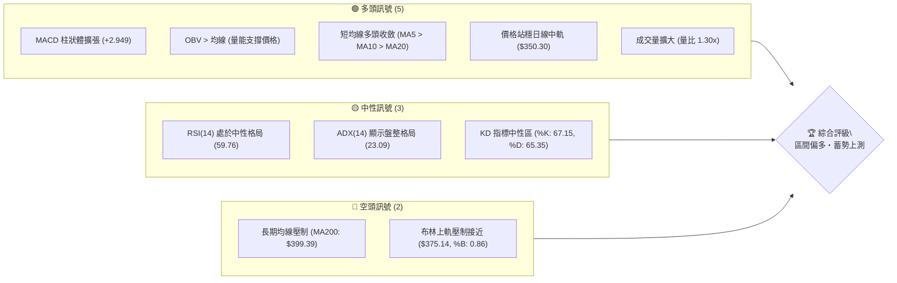

### 📊 核心指標速覽表

| 指標類別 | 指標名稱 | 當前數值 | 訊號 | 解讀 |
|:---|:---|:---|:---:|:---|
| **價格** | 當前收盤價 | $368.16 | 🟢 | 站上多條短期均線，處於反彈上升波段 |
| **均線** | MA20 (布林中軌) | $350.30 | 🟢 | 價格位於上方 (+5.10%)，短期趨勢轉強 |
| **均線** | MA50 | $357.72 | 🟢 | 價格收復中期均線 (+2.92%)，多頭排列初成 |
| **均線** | MA200 | $399.39 | 🔴 | 價格低於長期年線 (-7.82%)，長期結構仍受壓 |
| **動能** | RSI(14) | 59.76 | 🟡 | 中性偏強區間，未進入超買，具向上動能彈性 |
| **動能** | MACD (12,26,9) | 4.420 / 1.471 | 🟢 | 快線位於慢線上方，柱狀圖 +2.949 持續放量 |
| **動能** | KD (14,3,3) | %K: 67.15 / %D: 65.35 | 🟢 | 黃金交叉後平穩走高，維持偏多態勢 |
| **趨勢** | ADX (14) | 23.09 (+DI: 29.75) | 🟡 | 弱趨勢/區間盤整 (<25)，但多頭動能占優 |
| **波動** | ATR (14) | $15.80 (4.29%) | 🟡 | 波動率處於中等水平，單日正常波動幅度明確 |
| **量能** | 成交量 / 20日均量 | 50.85M / 39.24M | 🟢 | 量比 1.30x，反彈伴隨溫和放量，量價配合健康 |

### 🏆 技術評分卡

```
╔══════════════════════════════════════════════════════════════╗
║              技術評分卡 — TSLA (2026-09-08)                  ║
╠══════════════════════════════════════════════════════════════╣
║ 趨勢強度 (ADX/方向)   ██████████░░░░░░░░░░  52/100  🟡 盤整偏多║
║ 動能指標 (MACD/RSI)   ██████████████░░░░░░  70/100  🟢 動能充沛║
║ 支撐穩定度 (S1/S2)    ████████████░░░░░░░░  60/100  🟢 底部抬高║
║ 成交量配合 (OBV/量比) ██████████████░░░░░░  72/100  🟢 放量確認║
║ 形態完整度 (區間築底) ████████████░░░░░░░░  60/100  🟡 醞釀突破║
║ 均線架構 (長短線收斂) ████████░░░░░░░░░░░░  42/100  🔴 長期壓制║
╠══════════════════════════════════════════════════════════════╣
║ 綜合技術評分          ███████████░░░░░░░░░  58/100  🟡 區間偏多║
╚══════════════════════════════════════════════════════════════╝
```

---

## 2. 趨勢分析

### 🌐 多時框趨勢分析

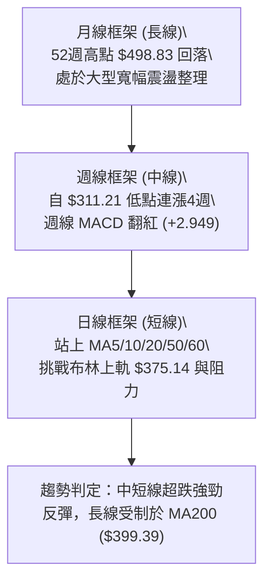

### 📈 長期趨勢 — 12個月走勢圖（Unicode）

```
TSLA 月線走勢圖（2025-09 至 2026-09）
價格軸 ($)
$460 ┤             ● $456.56 (2025-10 頂部)
$440 ┤     ●       │   ●       ●
$420 ┤     │   ●   │   │   ●   │
$400 ┤     │   │   │   │   │   │   ●
$380 ┤     │   │   │   │   │   │   │       ●
$360 ┤     │   │   │   │   │   │   │       │       ●←現價 $368.16
$340 ┤     │   │   │   │   │   │   │       │   ●
$320 ┤     │   │   │   │   │   │   │       │   │
$300 ┤     │   │   │   │   │   │   │   ●   │   │  (52W Low: $297.38)
     └─────┴───┴───┴───┴───┴───┴───┴───┴───┴───┴───┴───
           09  10  11  12  01  02  03  04  05  06  07  08  09 (月份)
          [------ 2025 ------] [------------- 2026 ------------]
```

#### 走勢特徵分析表格

| 階段區間 | 起止價格 | 漲跌幅度 | 走勢特徵與技術含義 |
|:---|:---|:---:|:---|
| **2025-09 ~ 2025-10** | $444.72 → $456.56 | +2.66% | 觸及 52 週高點 $498.83 後構築雙頂形態，量能衰退 |
| **2025-11 ~ 2026-03** | $430.17 → $371.75 | -13.58% | 震盪盤跌，長期均線下彎，市場估值壓縮 |
| **2026-04 ~ 2026-05** | $381.63 → $435.79 | +14.19% | 弱勢反抽，受阻於阻力密集區後再度無力上攻 |
| **2026-06 ~ 2026-07** | $420.60 → $311.21 | -26.01% | 斷崖式下跌，週線 RSI 跌至 15.7 嚴重超賣區 |
| **2026-08 ~ 2026-09** | $311.21 → $368.16 | +18.30% | 筑底完成後強勁反彈，連續突破 MA20 與 MA50 |

### 📊 中期趨勢（週線分析）

從 2026 年 7 月 26 日的 $313.03 及 8 月 2 日的 $311.21 觸底以來，週線圖呈現經典的「V型反轉+階梯式推升」結構：
- **第一階段（超賣修復）**：7月26日當週 RSI 降至 15.7 極度超賣，隨後空頭力竭，成交量放大至 2.75 億股。
- **第二階段（動能確認）**：8月09日當週 MACD 柱狀體由負轉正 (+1.025)，隨後兩週放量推升至 $362.86。
- **第三階段（現階段平台整理）**：在 $350-$368 區間進行均線修復，最新週收盤價來到 $368.16，站穩於斐波那契 61.8% ($374.33) 下方，蓄勢挑戰年線阻力。

```
週線支撐與壓力階梯示意圖：
$418.36 ─────────────────────── 週線波段高點阻力 (R2)
$399.39 ─────────────────────── MA200 年線壓制位
$374.33 ─────────────────────── 斐波那契 61.8% 關鍵壓制
$368.16 ◄■■■■■■■■■■■■■■■■■■■■■ 現價位置 (測試中)
$366.31 ─────────────────────── 近期波段支撐 (S1)
$350.30 ─────────────────────── MA20 / 布林中軌支撐
$337.24 ─────────────────────── 中期防守支撐 (S2)
```

### ⚡ 趨勢強度評估（ADX 解讀）

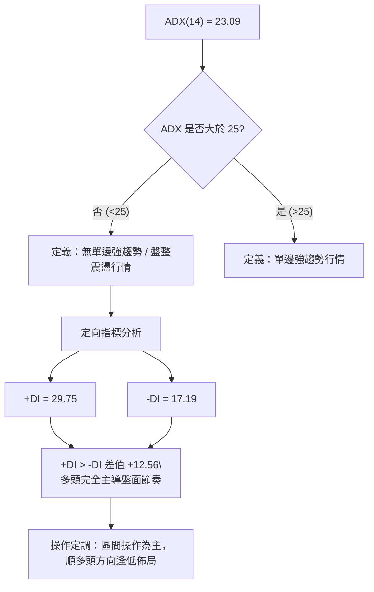

#### ADX 指標強度對照表

| 指標變數 | 當前數值 | 參考標準 | 狀態評估 | 實戰交易含義 |
|:---|:---:|:---:|:---:|:---|
| **ADX 趨勢強度** | 23.09 | <20: 極弱 / 20-25: 弱趨勢盤整 / >25: 強趨勢 | 🟡 弱趨勢/盤整 | 避免單邊追高，以震盪邊界交易為主 |
| **+DI 多頭趨向** | 29.75 | >25 表明買盤動能充沛 | 🟢 強勢 | 多方掌控中短期定價權 |
| **-DI 空頭趨向** | 17.19 | <20 表明賣壓顯著減退 | 🟢 弱勢 | 拋壓暫時告一段落 |
| **DI 差值 (+DI - -DI)**| +12.56 | 正值且擴大 | 🟢 多頭主導 | 震盪向上通道格局維持完好 |

---

## 3. 圖表形態分析

### 🔍 形態識別系統

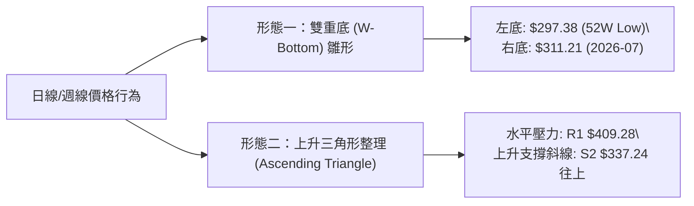

#### 形態信心度與目標價評估表

| 形態名稱 | 信心度 | 判斷依據（數據引證） | 完成度 | 目標價（附嚴格計算式） |
|:---|:---:|:---|:---:|:---|
| **雙重底雛形 (W-Bottom)** | 65% | 兩次波段低點分別為 52W Low $297.38 與 2026-07 低點 $311.21；頸線取自近期阻力位 R1 $409.28 | 75% | **理論目標價** = 頸線 $409.28 + (頸線 $409.28 - 右底 $311.21) = $409.28 + $98.07 = **$507.35**（需先突破頸線確認） |
| **矩形突破回踩** | 70% | 價格脫離 $311.21-$337.24 震盪箱底，突破 MA20 ($350.30) 並回踩確認 | 85% | **箱體等幅測距** = 突破點 $350.30 + ($350.30 - $325.46 布林下軌) = $350.30 + $24.84 = **$375.14** (恰為布林上軌) |
| **頭肩底形態** | 35% | 缺乏清晰左肩架構，數據不足以支撐幾何標準 | 20% | *訊號不足，不予計算，僅做指標型解讀* |

### 🕯️ 重要K線形態分析

| 週期/月份 | 收盤價 | K線形態特徵 | 專業技術解讀 | 多空訊號 |
|:---|:---:|:---|:---|:---:|
| **2026-07** | $311.21 | 長下影大陰線 (錘頭雛形) | 暴跌探底至 $311.21 後浮現強烈抄底盤，賣壓被巨量吸收 | 🟢 潛在底部 |
| **2026-08** | $367.95 | 大實體陽線 (吞噬反轉) | 月漲幅高達 +18.23%，直接將7月長陰實體收復過半，確認止跌 | 🟢 強烈看多 |
| **2026-09(初)** | $368.16 | 高位窄幅十字星/小陽 | 在阻力位前縮量整理，多空短暫平衡，屬於強勢抗跌蓄勢 | 🟡 中性蓄勢 |
| **2026-09-06當週**| $354.08 | 下影線小陽線 | 回踩 MA10 ($357.93) 與 S1 ($366.31) 附近後快速拉起，確認支撐有效 | 🟢 回踩確認 |

### 📉 ASCII 走勢形態示意圖

```
TSLA 雙重底 (W-Bottom) 與突破示意圖：

價格 ($)
$409.28 ┤                 [ 頸線阻力位 R1: $409.28 ]
         │                  /             \
$375.14 ┤                 /  [上軌 $375.14] \
$368.16 ┤                /   ● 現價 $368.16  \
$350.30 ┤─── 頸線中繼 ──/───────────────────────\────── [MA20: $350.30]
         │  \          /
$337.24 ┤   \  S2    /
         │    \      /
$311.21 ┤     ●────●  右底 ($311.21)
$297.38 ┤    左底 ($297.38)
         └─────────────────────────────────────────────► 時間軸
```

### 🎯 形態目標價計算

依據價格行為學（Price Action）幾何投射原則：
1. **箱體等幅推算**：
   - 底部箱體中軸為 MA20 **$350.30**，箱體下邊緣為布林下軌 **$325.46**。
   - 箱體垂直高度 $H = \$350.30 - \$325.46 = \$24.84$。
   - 第一目標價 $T1 = \$350.30 + H = \$375.14$（精準對應當前布林帶上軌）。
2. **週線波段等幅推算**：
   - 近期反彈波段由 $311.21 起步至短期波段高點聚類 R1 **$409.28**，高度為 $\$98.07$。
   - 一旦確認放量突破 R1 **$409.28**，測幅目標價將指向 $409.28 + \$98.07 = \$507.35$。

---

## 4. 支撐與阻力

### 🗺️ 關鍵價位分布圖（Unicode）

```
TSLA 價位結構分布圖（嚴格依據 OHLCV 聚類與斐波那契點位）
══════════════════════════════════════════════════════════════
$498.83 ║████████████████████████████████║ 52週歷史高點 (Fib 0.0%)
$451.29 ║████████████████████████        ║ 斐波那契 23.6% 回調位
$434.60 ║████████████████████████████    ║ 強阻力 R3 (近一年波段高點)
$421.88 ║████████████████████            ║ 斐波那契 38.2% 回調位
$418.36 ║██████████████████████          ║ 阻力 R2 (波段高點聚類)
$409.28 ║████████████████████████████    ║ 關鍵阻力 R1 (突破點位)
$399.39 ║██████████████████████████████  ║ MA200 年線壓制位
$398.10 ║████████████████████            ║ 斐波那契 50.0% 回調位
$375.14 ║▓▓▓▓▓▓▓▓▓▓▓▓▓▓▓▓▓▓▓▓▓▓▓▓        ║ 布林通道上軌壓制
$374.33 ║▓▓▓▓▓▓▓▓▓▓▓▓▓▓▓▓▓▓▓▓▓▓▓▓        ║ 斐波那契 61.8% 關鍵黃金位
$368.16 ╠════════════════════════════════╣ ◄ 當前收盤現價 ($368.16)
$366.31 ║▓▓▓▓▓▓▓▓▓▓▓▓▓▓▓▓▓▓▓▓▓▓▓▓▓▓▓▓▓▓  ║ 近期波段關鍵支撐 S1 (-0.50%)
$350.30 ║████████████████████████████    ║ MA20 / 布林中軌支撐
$340.49 ║████████████████████            ║ 斐波那契 78.6% 回調位
$337.24 ║████████████████████████████    ║ 強支撐 S2 (波段低點聚類)
$325.46 ║████████████████████            ║ 布林通道下軌支撐
$297.38 ║████████████████████████████████║ 極強支撐 S3 (52週最低點)
══════════════════════════════════════════════════════════════
```

### 🚧 阻力位分析表

| 阻力級別 | 嚴格價位 | 距現價幅幅 | 形成原因與籌碼屬性 | 突破難度 | 重要性評級 |
|:---|:---:|:---:|:---|:---:|:---:|
| **動態阻力** | $374.33 - $375.14 | +1.68% ~ +1.90% | 斐波那契 61.8% 黃金分割位與布林上軌共振壓制 | 🟡 中等 | ★★★☆☆ |
| **年線阻力** | $399.39 | +8.48% | 200日移動平均線 (MA200)，牛熊分界線 | 🔴 極高 | ★★★★★ |
| **R1 (關鍵)**| $409.28 | +11.17% | 近一年多次頂部換手聚類區，突破將打開波段空間 | 🔴 高 | ★★★★☆ |
| **R2 (重要)**| $418.36 | +13.64% | 2026年6月中旬反彈高點聚類，密集成交套牢區 | 🔴 高 | ★★★☆☆ |
| **R3 (極強)**| $434.60 | +18.05% | 2026年5月反彈大頂，強阻力聚類平台 | 🔴 極高 | ★★★★☆ |

### 🛡️ 支撐位分析表

| 支撐級別 | 嚴格價位 | 距現價幅幅 | 形成原因與籌碼屬性 | 守住機率 | 重要性評級 |
|:---|:---:|:---:|:---|:---:|:---:|
| **S1 (首要)**| $366.31 | -0.50% | 近期波段低點聚類，日線級別微型回踩結構點 | 75% | ★★★★☆ |
| **動態支撐** | $350.30 | -4.85% | 20日均線 (MA20) 及布林通道中軌，短線生命線 | 80% | ★★★★★ |
| **S2 (強支撐)**| $337.24 | -8.40% | 近一年波段低點密集區，多方防守第二道防線 | 85% | ★★★★☆ |
| **S3 (鐵底)**| $297.38 | -19.23% | 52週最低點 (52W Low)，年內最堅固價值支撐區 | 95% | ★★★★★ |

### 📐 斐波那契回調位分析

依據 52 週完整波動區間（高點 **$498.83** → 低點 **$297.38**，垂直落差 **$201.45**）：

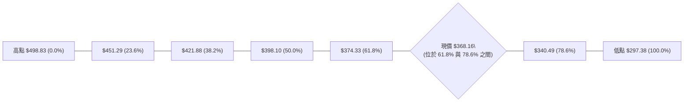

- **當前相對位置**：現價 **$368.16** 處於 52 週區間的 35.1% 位置（自低點反彈已收復近 35% 跌幅），精準運行於 **61.8% ($374.33)** 與 **78.6% ($340.49)** 之間。
- **技術意義解讀**：
  - **$374.33 (61.8%)** 是空頭防守的黃金咽喉點。若日線實體陽線收盤突破 $374.33，技術上將宣告弱勢反彈升級為「中級上升行情」，下一個多頭磁吸目標將直指 50.0% 回調位 **$398.10**（高度重合 MA200 **$399.39**）。
  - **$340.49 (78.6%)** 構建強烈多頭保護層，只要回調不跌破此位置及 S2 **$337.24**，築底向上的多頭架構均不會遭到破壞。

---

## 5. 技術指標深度解讀

### 🎛️ 指標訊號總覽

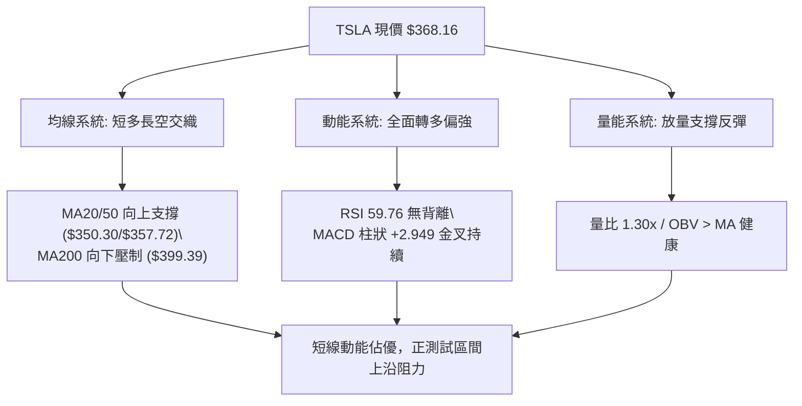

### 📈 移動平均線排列分析

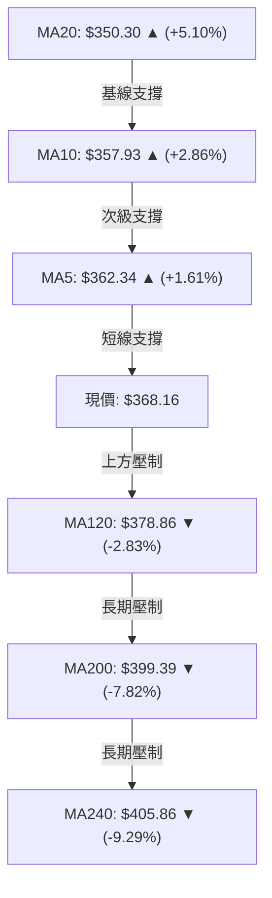

#### 均線系統深度解析

1. **短期排列（極短線強勢）**：
   - 數值排序：`現價 $368.16 > MA60 $363.70 > MA5 $362.34 > MA10 $357.93 > MA50 $357.72 > MA20 $350.30`。
   - 現價站穩於短期 5、10、20、50、60 日均線之上，且 MA5 (+1.61%)、MA10 (+2.86%)、MA20 (+5.10%) 斜率均為正向向上（▲），表明近一個月多頭建倉積極，短期底部抬升顯著。
2. **長期排列（中長線壓制）**：
   - 數值排序：`MA120 $378.86 > MA200 $399.39 > MA240 $405.86`，且長均線均呈向下扣落（▼）。
   - 雖然長期架構呈現典型的「死叉排列（MA20 < MA50 < MA200）」，但目前價格已先行穿越 MA50，為後續均線產生「金叉」修復爭取了時間與空間。

### 📉 RSI(14) 分析

```
RSI(14) 當前水平：59.76
0 ────────── 30 ───────────────────── 59.76 ─────── 70 ────────── 100
[  超賣區  ] [       中性區間        ] ● [超買區]
進度條：███████████████░░░░░░░░░░  59.76% (中性偏多)
```

- **數值與區間**：RSI(14) 報 **59.76**，處於 50–70 擴張中性偏強區間。既未陷入低於 30 的弱勢鈍化，也未進入高於 70 的超買警示區，動能具備充裕的上行餘裕。
- **背離分析**：
  - 價格在 8 月中旬自 $342.27 震盪上行至當前 $368.16，RSI 由 70.4 平滑過渡至 59.76；
  - 結合系統判定「RSI 背離：無明顯背離」，技術形態顯示目前為健康的震盪換手，無量價背離或頂背離威脅。

### 📊 MACD(12/26/9) 訊號解讀

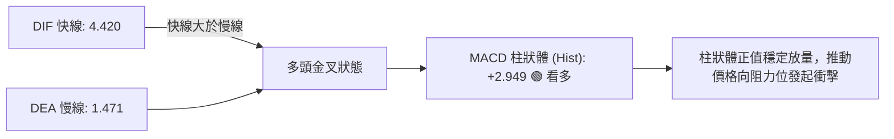

- **指標特徵**：DIF (4.420) 明顯處於 DEA (1.471) 之上，差離柱（Histogram）為 **+2.949**，保持擴張態勢。
- **交叉形態**：MACD 自零軸下方金叉後強勢翻上零軸之上，顯示本輪反彈並非單純的超跌抽腳，而是具備資金推動的中級波段動能。

### 📦 布林通道分析

```
TSLA 日線布林通道示意圖：
價格 ($)
$375.14 ┤─────────────────────────── 布林上軌 ($375.14)
         │                   ● 現價: $368.16 (%B = 0.86)
$368.16 ┤                  /
         │                 /
$350.30 ┤────────────────/────────── 布林中軌 / MA20 ($350.30)
         │              /
$325.46 ┤─────────────●───────────── 布林下軌 ($325.46)
         └──────────────────────────► 時間
```

- **布林帶寬度與位置**：
  - 上軌：**$375.14** ｜ 中軌：**$350.30** ｜ 下軌：**$325.46**。
  - **%B 指標**：高達 **0.86**（0 代表下軌，0.5 代表中軌，1.0 代表上軌），表明當前價格極度貼近布林上軌。
- **通道行為解讀**：價格沿著中軌與上軌之間的強勢通道運行。由於 ADX < 25，布林通道尚未呈現喇叭口強烈擴張，現價接近上軌 $375.14，面臨技術性受阻回踩中軌 $350.30 的均值回歸風險。

### 💹 成交量分析（量價配合度）

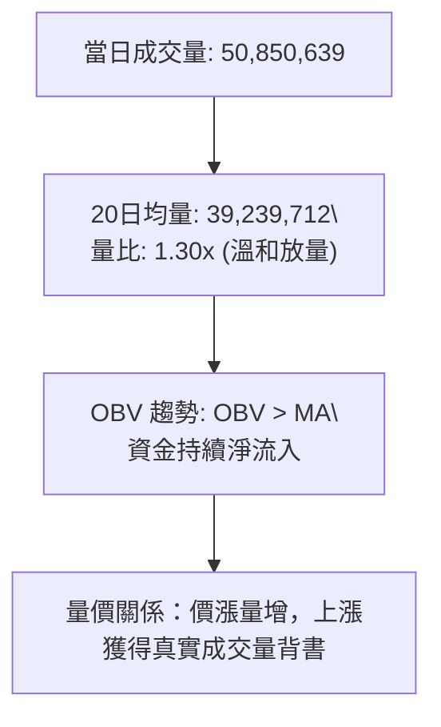

- **成交量對比**：最新單日成交量 **50,850,639 股**，較 20 日平均成交量（39,239,712 股）放大 29.59%（量比 **1.30x**），高於 50 日均量（40,209,643 股）。
- **OBV 能量潮解讀**：OBV 線持續運行於其移動平均線上方（OBV > MA），說明伴隨 8 月以來的反彈，機構資金處於穩定吸籌通道，量價配合結構健康，不存在無量空拔現象。

---

## 6. 動能與波動率

### ⚡ 動能評估四象限

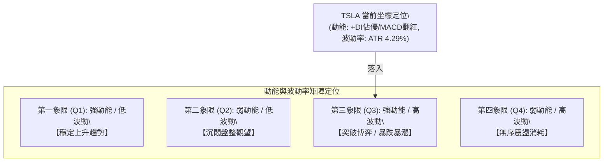

#### 動能與波動象限分析表

| 象限 | 動能維度 | 波動維度 | 當前狀態 | 技術環境與實戰應對 |
|:---:|:---:|:---:|:---:|:---|
| **Q1** | 強 | 低 | — | 最佳波段順勢持有區間 |
| **Q2** | 弱 | 低 | — | 縮量築底期，適合長期定投 |
| **Q3** | **強** | **中高** | **✓ (當前定位)** | **動能指標 (MACD/RSI) 偏強，ATR 達 4.29%，適合突破與邊界嚴格止損交易** |
| **Q4** | 弱 | 高 | — | 籌碼崩解期，應堅決空倉迴避 |

### 📊 ATR 波動率分析

- **ATR(14) 絕對值**：**$15.80**。
- **ATR 相對百分比**：佔當前股價的 **4.29%**（屬於中高波動特性個股）。
- **風控止損應用**：
  - 日內正常隨機雜訊波動區間：$\pm 1.0 \times \text{ATR} = \pm \$15.80$。
  - **建議動態止損緩衝距離**：設定為 $1.5 \times \text{ATR} = \$23.70$ 或 $2.0 \times \text{ATR} = \$31.60$，避免在日內正常洗盤中過早被震盪出局。

### 📐 Beta 與市場相關性

```
Beta 敏感度進度條 (基準 1.0)
0.0 ─────────── 1.0 ───────────── 1.845 ─────────── 3.0
[ 低於大盤波動 ] [   基準線   ]     ● [ 高彈性高Beta ]
進度條：██████████████████░░░░░░  Beta = 1.845 (極高彈性)
```

- **Beta 係數**：**1.845**。
- **市場特徵分析**：TSLA 具有極高的大盤彈性係數。在美股標普 500 指數或納斯達克上漲時，TSLA 平均呈現近 1.85 倍的進攻彈性；反之，大盤承壓時其回撤幅度亦顯著放大。當前高 Beta 配合量能放大，適合作為反彈行情中的進攻先鋒。

---

## 7. 多時框架總結

### 📋 時框架評分表

| 時框架 | 趨勢方向 | 動能狀態 | 均線排列 | 形態結構 | 綜合評分 | 戰術建議 |
|:---|:---:|:---:|:---:|:---:|:---:|:---|
| **短期 (日線)** | 🟢 震盪上行 | 🟢 強勢擴張 | 🟢 短多成型 (站上MA5/20/50) | 測試布林上軌 | **68/100** | 逢回踩支撐做多，不盲目追高 |
| **中期 (週線)** | 🟡 底部修復 | 🟢 金叉翻紅 | 🟡 均線糾纏 | 雙底雛形初現 | **58/100** | 持股待漲，關注頸線 $409.28 |
| **長期 (月線)** | 🔴 寬幅震盪 | 🟡 處於中性 | 🔴 長空壓制 (MA200之下) | 區間震盪整理 | **48/100** | 受制年線，以波段獲利了結為主 |

### 🔲 綜合訊號矩陣

```
┌──────────┬───────────────────────┬───────────────────────┬───────────────────────┐
│ 分析維度 │ 短期架構 (日線)       │ 中期架構 (週線)       │ 長期架構 (月線)       │
├──────────┼───────────────────────┼───────────────────────┼───────────────────────┤
│ 價格位置 │ 站穩 MA20 ($350.30)   │ 站上 61.8% ($374.33下) │ 距年線 $399.39 差7.8% │
│ 動能信號 │ MACD柱 +2.949 擴張    │ RSI 59.8 自低點反彈   │ RSI 處於長線中軸      │
│ 量能確認 │ 量比 1.30x 放量確認   │ OBV 向上穿越均線      │ 成交量較歷史峰值萎縮  │
│ 關鍵矛盾 │ 逼近上軌 $375.14 壓制 │ 面臨斐波那契強壓      │ 估值與年線構成強阻礙  │
└──────────┴───────────────────────┴───────────────────────┴───────────────────────┘
```

### ⚖️ 多時框收斂結論

依據多時框收斂第一優先級規則：
1. **當前趨勢定性**：當前 ADX(14) 數值為 **23.09 (<25)**，技術架構明確屬於**「無單邊強趨勢之盤整/震盪行情」**。
2. **主導時框取捨**：依規則，當 ADX < 25 時，以**日線布林通道（$325.46 - $375.14）及近一年波段高低點為主要交易區間**。中長期週線雖然築底反彈，但受制於 MA200 ($399.39)，難以發動一蹴而就的單邊暴漲。
3. **唯一收斂方向**：**【區間偏多・高拋低吸・防守上測】**。
   - 短線沿布林中軌 $350.30 向上測試上軌 **$375.14** 與斐波那契 61.8% **$374.33**；
   - 由於現價已達 $368.16（接近上軌），勝率最高之策略並非直接市價追多，而是等待「回踩支撐佈局」或「強勢放量突破上軌後追隨」。

---

## 8. 交易策略建議

### 🗺️ 策略決策流程圖

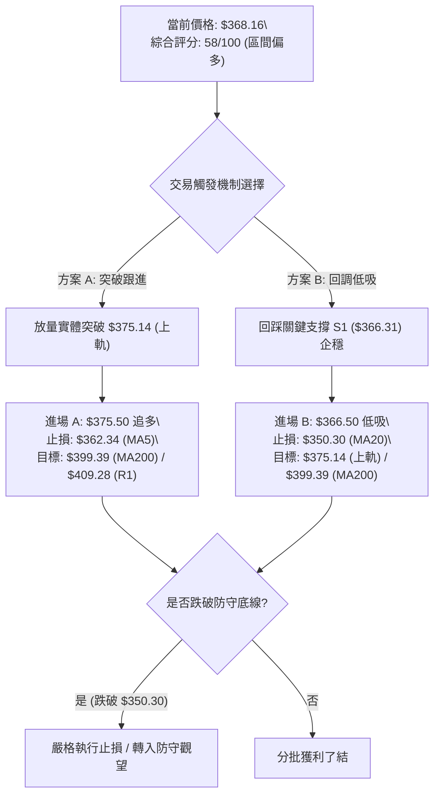

### 🧭 策略路由（依評分卡分流）

> **當前主策略方向 = 【中性偏多・區間震盪逢低佈局，等待突破確認】（依技術綜合評分：58/100）**
> 
> 由於綜合評分處於 40–60 之中性偏多區間，且 ADX (23.09) 指引盤整行情，主策略採用「布林通道區間博弈」：以支撐位防守低吸為主，並輔以突破上軌後的順勢加碼，嚴禁盲目重倉追高。

### 🎯 價格情境階梯（Price Scenarios）

| 觸發條件（嚴格引用數據點位） | 下一目標 | 後續延伸 | 情境技術含義 |
|:---|:---:|:---:|:---|
| **突破布林上軌與斐波那契 ($375.14)** | R1 $409.28 | R2 $418.36 / R3 $434.60 | 突破盤整區間，波段反彈全面打開，向年線發起衝擊 |
| **站穩現價區間 ($366.31 - $375.14)** | $375.14 | $399.39 (MA200) | 布林上軌下方強勢以橫代墊，等待量能再次聚集 |
| **跌破關鍵支撐 S1 ($366.31)** | MA20 $350.30 | S2 $337.24 / S3 $297.38 | 反彈動能衰退，價格回歸布林中軌進行二次探底確認 |

### 📊 情境機率分佈

| 情境劇本 | 機率估算 | 主要技術依據與指標支撐 |
|:---|:---:|:---|
| **情境一：強勢突破上行** | **45%** | MACD 柱狀體持續擴大 (+2.949)，OBV > MA 量能充沛，+DI 達 29.75 多頭控盤 |
| **情境二：區間震盪拉鋸** | **40%** | ADX 僅 23.09 缺乏單邊趨勢，布林上軌 $375.14 與斐波那契 $374.33 形成共振壓制 |
| **情境三：反轉回落探底** | **15%** | 均線長期空頭排列，若大盤重挫導致高 Beta (1.845) 放大拋壓，回測 S2 $337.24 |

### 🟢 主策略詳情

本報告提供兩套依據不同進場條件的專業操作方案：

| 策略要素 | 策略 A（右側突破追隨型） | 策略 B（左側支撐低吸型 - 優先推薦） |
|:---|:---:|:---:|
| **策略定位** | 突破布林上軌動能跟進 | 關鍵波段支撐回踩低吸 |
| **進場條件** | 日線放量突破 $375.14 (上軌) 並站穩 | 價格回調測試 S1 ($366.31) 出現企穩K線 |
| **進場價格** | **$375.50** | **$366.50** |
| **止損價格** | **$362.34** (跌破 MA5 移動平均線) | **$350.30** (跌破 MA20 / 布林中軌) |
| **目標價 T1** | **$399.39** (MA200 年線附近) | **$375.14** (布林通道上軌) |
| **目標價 T2** | **$409.28** (近一年波段阻力 R1) | **$399.39** (MA200 年線壓制) |
| **風險額度 (每股)** | $375.50 - $362.34 = **$13.16** | $366.50 - $350.30 = **$16.20** |
| **報酬空間 T1 (每股)** | $399.39 - $375.50 = **$23.89** | $375.14 - $366.50 = **$8.64** |
| **報酬空間 T2 (每股)** | $409.28 - $375.50 = **$33.78** | $399.39 - $366.50 = **$32.89** |
| **風險報酬比 (至T2)** | **1 : 2.57** 🟢 (優良) | **1 : 2.03** 🟢 (良好) |
| **預估勝率** | 55% | 65% |
| **建議倉位** | 10% - 15% 總資金 | 15% - 20% 總資金 |

### 🔴 反向風險觸發點（對沖提示）

- **多頭結構失效閥門**：若股價收盤實體陰線**跌破 MA20 / 布林中軌 ($350.30)**，宣告本輪反彈告一段落，區間偏多邏輯被推翻。
- **對沖處置動作**：應立即將多頭部位無條件止損出局，並可考慮小倉位配置反向對沖工具，防守目標看至 S2 **$337.24** 與 S3 **$297.38**。

### ⭐ 整體訊號強度評星

```
╔══════════════════════════════════════════════════════════════╗
║ 做多訊號強度：  ★★★☆☆  (3.5/5 星 — 短線動能充沛但面臨阻力)   ║
║ 做空訊號強度：  ★★☆☆☆  (2.0/5 星 — 拋壓衰退，順勢做空風險大) ║
║ 整體訊號可信度：★★★★☆  (4.0/5 星 — 量價配合與指標收斂高度吻合)║
╚══════════════════════════════════════════════════════════════╝
```

---

## 9. 風險提示與監控

### ✅ 關鍵監控指標 Checklist

```
╔══════════════════════════════════════════════════════════════╗
║              關鍵技術監控清單 (DAILY CHECKLIST)              ║
╠══════════════════════════════════════════════════════════════╣
║ [ ] 監控點 1：收盤價是否有效站穩 S1 ($366.31) 之上？         ║
║ [ ] 監控點 2：成交量是否能持續維持在 4,000 萬股以上水準？     ║
║ [ ] 監控點 3：MACD 柱狀體數值是否持續 > 0 (今日 +2.949)？    ║
║ [ ] 監控點 4：布林帶寬度是否擴大？%B 是否有效突破 1.0？       ║
║ [ ] 監控點 5：ADX 是否突破 25，確認盤整行情轉化為單邊趨勢？  ║
║ [ ] 監控點 6：價格向上觸及 $375.14 與 $399.39 時的量價反應？ ║
╚══════════════════════════════════════════════════════════════╝
```

### ⚠️ 風險場景分析

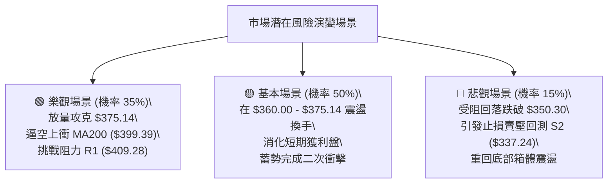

### 🛡️ 風險管理重要提醒

1. **Beta 槓桿效應控制**：鑑於 TSLA Beta 高達 **1.845**，個股波動劇烈，單筆交易虧損不得超過總資產的 1.5%–2.0%。
2. **ATR 浮動停損設置**：TSLA 單日 ATR 高達 **$15.80**，日常震盪劇烈，日內停損點切勿設置過於狹窄，應以關鍵價位（如 S1 $366.31、MA20 $350.30）作為邏輯止損依據。
3. **年線重大分水嶺**：MA200 ($399.39) 處於下降扣抵期，歷來為強大解套拋壓盤所在，價格接近 $398-$400 區間必須啟動第一階段利潤保護機制，分批鎖定利潤。

---

## 📋 報告總結

```
╔══════════════════════════════════════════════════════════════╗
║              TSLA 技術分析報告總結 (2026-09-08)              ║
╠══════════════════════════════════════════════════════════════╣
║ 報告日期：2026-09-08          當前價格：$368.16               ║
║ 分析評級：⚖️ 區間偏多・蓄勢上測 (技術評分: 58/100)            ║
╠══════════════════════════════════════════════════════════════╣
║ 關鍵結論：                                                   ║
║ ├─ 長期趨勢：🔴 弱勢整理 (受制於 MA200: $399.39 壓制)       ║
║ ├─ 中期趨勢：🟢 底部確立 (自 $311.21 展開雙底強勁反彈)       ║
║ ├─ 短期趨勢：🟢 偏多震盪 (均線系統 MA5/10/20/50 抬頭向上)   ║
║ ├─ 關鍵支撐：首要支撐 $366.31 (S1) ｜ 核心底線 $350.30 (MA20)║
║ ├─ 關鍵阻力：通道上軌 $375.14 ｜ 年線重壓 $399.39 (MA200)   ║
║ └─ 華爾街共識目標：$390.09 (平均) / $600.00 (最高)            ║
╠══════════════════════════════════════════════════════════════╣
║ 最優策略配置：                                               ║
║ 1. 🥇 首選策略 (低吸)：回踩 S1 $366.50 進場，止損 $350.30，   ║
║    目標 T1: $375.14 / T2: $399.39 (風報比 1:2.03)           ║
║ 2. 🥈 次選策略 (突破)：突破上軌 $375.50 追進，止損 $362.34，  ║
║    目標 T1: $399.39 / T2: $409.28 (風報比 1:2.57)           ║
║ 3. 🥉 保守選擇：等待股價確認突破 $375.14 或回落至 $350.30 再行介入║
╚══════════════════════════════════════════════════════════════╝
```

---

> ⚠️ **免責聲明**：本報告為依據客觀量化指標與圖表形態所生成之專業技術分析，所有數據與推算均嚴格基於所提供之歷史價格與指標資訊。本報告**僅供研究與學術參考**，**不構成任何要約、招攬或具體投資建議**。市場具有高度不確定性，投資人應獨立評估風險並自行承擔交易結果。

---

*報告生成時間：2026-09-08 ｜ 數據來源：Yahoo Finance ｜ 分析框架：多時框架量化技術體系*