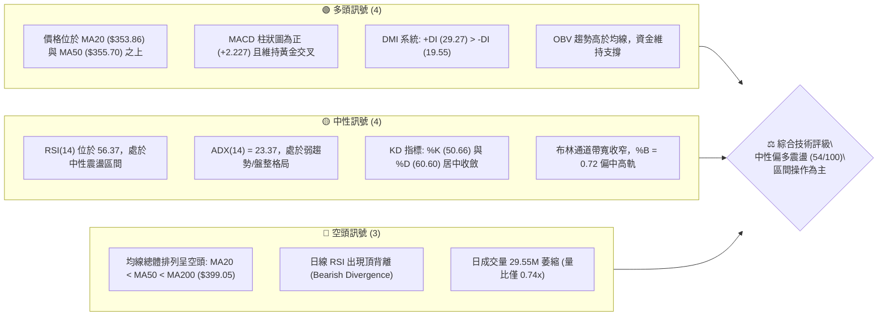
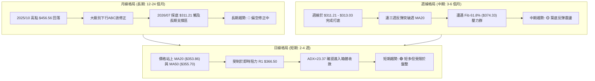
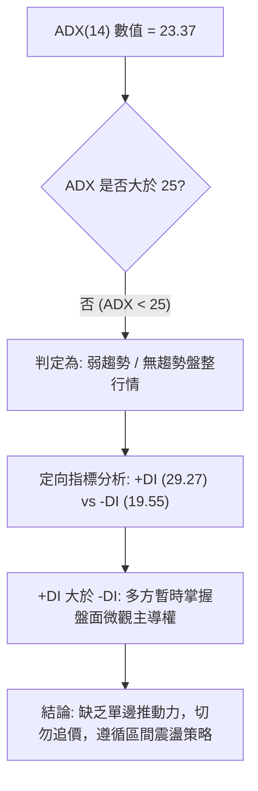
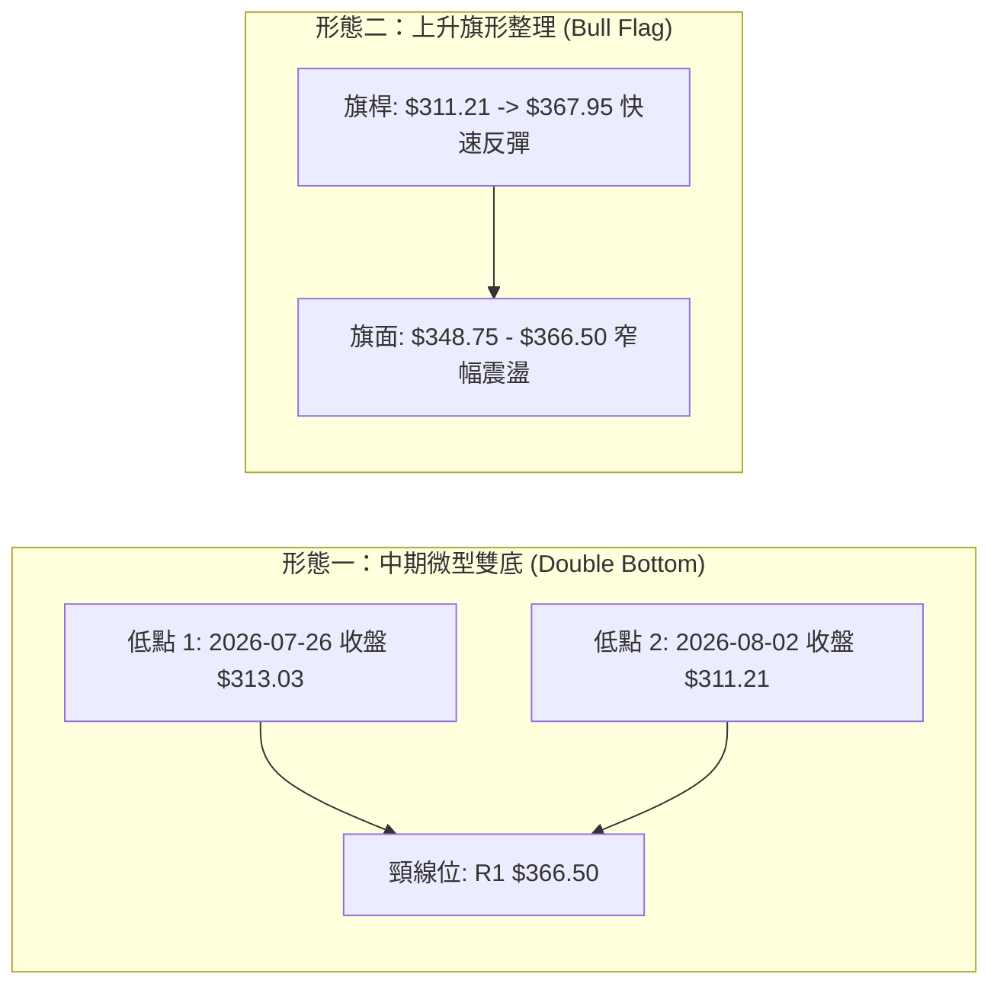
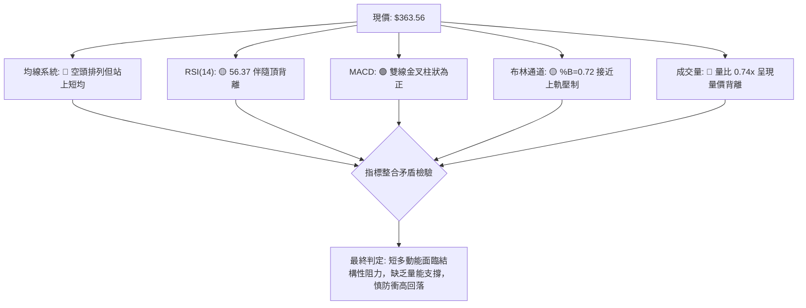
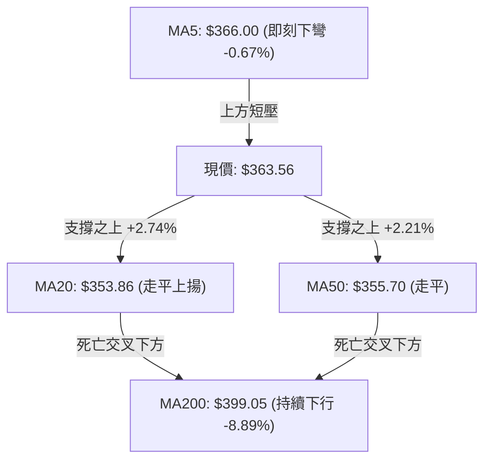
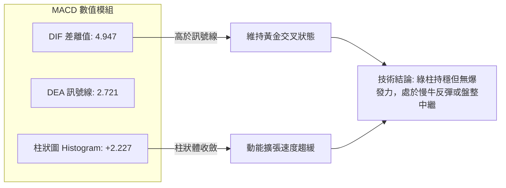
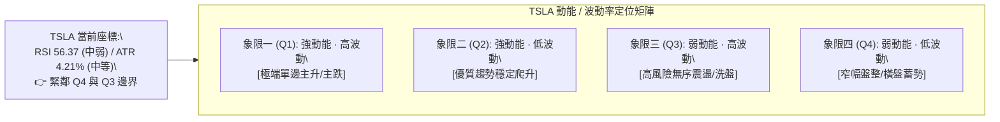
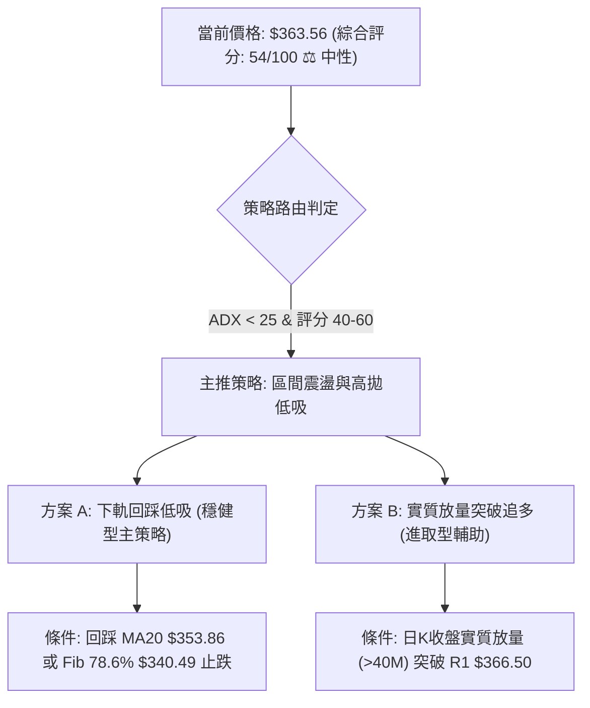
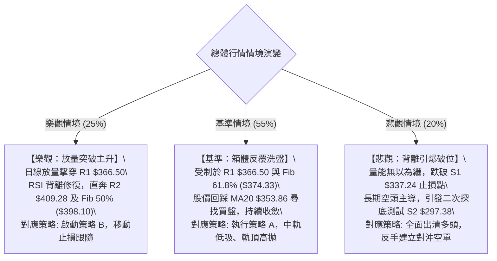

# TSLA 技術分析報告

> **報告日期**：2026-09-10 ｜ **語言**：繁體中文 ｜ **數據來源**：Yahoo Finance ｜ **當前價格**：$363.56

---

## 目錄

| 章節 | 內容 |
|------|------|
| [1. 技術面概覽](#1-技術面概覽) | 訊號儀表板、核心指標、評分卡 |
| [2. 趨勢分析](#2-趨勢分析) | 多時框趨勢、長中短期走勢、12個月歷史走勢 |
| [3. 圖表形態分析](#3-圖表形態分析) | 形態識別、信心度評估、K線組合、目標價計算 |
| [4. 支撐與阻力](#4-支撐與阻力) | 結構分布圖、關鍵價位群、斐波那契回調位 |
| [5. 技術指標深度解讀](#5-技術指標深度解讀) | 均線系統、RSI頂背離、MACD、布林通道、量價配合 |
| [6. 動能與波動率](#6-動能與波動率) | 四象限評估、ATR止損模型、Beta敏感度 |
| [7. 多時框架總結](#7-多時框架總結) | 時框架矩陣、ADX盤整收斂規則、方向裁決 |
| [8. 交易策略建議](#8-交易策略建議) | 策略路由、價格階梯、主推策略、風險對沖 |
| [9. 風險提示與監控](#9-風險提示與監控) | 關鍵監控清單、情境推演、風控參數 |

---

## 1. 技術面概覽

### 🎯 技術訊號儀表板



### 📊 核心指標速覽表

| 指標類別 | 指標名稱 | 當前數值 | 訊號 | 深度技術解讀 |
|:---|:---|:---|:---:|:---|
| **現貨價格** | 收盤價 | **$363.56** | 🟡 | 位於 52 週區間 ($297.38 - $498.83) 之 32.9% 分位，處於築底後反彈中繼 |
| **短期均線** | MA20 | **$353.86** | 🟢 | 股價位於 MA20 上方 +2.74%，短期動能由買方主導，提供動態支撐 |
| **中期均線** | MA50 | **$355.70** | 🟢 | 股價站回 MA50，扣抵值壓力暫時緩解，但 MA20 尚未黃金交叉 MA50 |
| **長期均線** | MA200 | **$399.05** | 🔴 | 股價大幅低於牛熊分界線 -8.89%，長期格局仍受制於下降壓力帶 |
| **動能擺動** | RSI(14) | **56.37** | 🟡 | 數值處於 50 軸上方，但系統已觸發⚠️頂背離警告，追高動能衰退 |
| **趨勢指標** | MACD(12,26,9)| **+2.227 (柱)**| 🟢 | DIF (4.947) 高於 Signal (2.721)，多頭結構尚在，但擴張斜率減緩 |
| **趨勢強度** | ADX(14) | **23.37** | 🟡 | 數值低於 25 臨界線，顯示單邊趨勢缺乏，市場進入標準區間盤整模式 |
| **通道位置** | BB %B | **0.72** | 🟡 | 貼近布林上軌 ($376.03)，上方空間受制於軌道壓制，回測中軌機率增 |
| **量能狀態** | 20日量比 | **0.74x** | 🔴 | 成交量 29.55M 明顯低於均量 39.76M，呈現典型「量縮反彈」隱憂 |
| **波動幅度** | ATR(14) | **$15.29** | 🟡 | 每日平均波動率為 4.21%，短線設定止損應具備足夠緩衝區間 |

### 🏆 技術評分卡

```
╔══════════════════════════════════════════════════════════════════════════╗
║                   技術評分卡 — TSLA (2026-09-10)                        ║
╠══════════════════════════════════════════════════════════════════════════╣
║ 趨勢強度 (ADX=23.37)  █████████░░░░░░░░░░░  45/100 🟡 [盤整無明確趨勢]  ║
║ 動能指標 (RSI/MACD)   ███████████░░░░░░░░░  55/100 🟡 [動能平穩但有背離]║
║ 支撐穩定度 (S1=$337)  █████████████░░░░░░░  65/100 🟢 [底部分步墊高]    ║
║ 成交量配合 (VR=0.74)  ████████░░░░░░░░░░░░  40/100 🔴 [量能背離顯著]    ║
║ 形態完整度 (箱體整理) ████████████░░░░░░░░  60/100 🟡 [底部雙底孕育中]  ║
║ 均線排列 (空頭均線)   ████████░░░░░░░░░░░░  40/100 🔴 [長線MA200蓋頭]   ║
╠══════════════════════════════════════════════════════════════════════════╣
║ 綜合技術評分          ███████████░░░░░░░░░  54/100 ⚖️ [中性區間整理]     ║
╚══════════════════════════════════════════════════════════════════════════╝
```

---

## 2. 趨勢分析

### 🌐 多時框趨勢分析



### 📈 長期趨勢 — 12個月走勢圖（Unicode）

以下為 TSLA 自 2025 年 9 月至 2026 年 9 月之月線收盤價格軌跡與關鍵轉折點標注：

```
TSLA 月線收盤走勢圖（過去12個月：2025-09 至 2026-09）
價格軸 ($)
$460 ┤             ● $456.56 (波段頂部 2025-10)
$440 ┤ ● $444.72         ● $449.72       ● $435.79 (反彈高點 2026-05)
$420 ┤       ● $430.17         ● $430.41       ● $420.60
$400 ┤                               ● $402.51
$380 ┤                                     ● $381.63
$360 ┤                                           ● $371.75    ● $367.95   ● $363.56 (現價)
$340 ┤
$320 ┤
$300 ┤                                                             ● $311.21 (波段低點 2026-07)
     └───────────────────────────────────────────────────────────────────────────
        09    10    11    12    01    02    03    04    05    06    07    08    09  (月份)
```

#### 走勢特徵分析表格

| 階段區間 | 起止價格 | 漲跌幅 | 階段走勢特徵 | 關鍵技術事件 |
|:---|:---:|:---:|:---|:---|
| **頂部築頭期** (2025/09-2025/12) | $444.72 → $449.72 | +1.12% | 高檔雙頂橫盤，多次衝擊 $450-$460 阻力未果 | 創下 52 週高點群 $456.56，籌碼開始鬆動 |
| **單邊下行期** (2026/01-2026/03) | $430.41 → $371.75 | -13.63% | 連續跌破各天期均線，下行斜率陡峭 | 跌破 $400 大關與長週期均線扣抵區 |
| **弱勢反抽期** (2026/04-2026/05) | $371.75 → $435.79 | +17.23% | 空頭回補引發之急速反彈，多頭二次衝頂失敗 | 受阻於 $435.79，形成結構性次高點 (Lower High) |
| **加速重挫期** (2026/06-2026/07) | $420.60 → $311.21 | -26.01% | 恐慌性拋售，成交放量，直逼 52 週低點 | 觸及波段極低點 $311.21 (接近 52W 低點 $297.38) |
| **超跌修復期** (2026/08-2026/09) | $311.21 → $363.56 | +16.82% | 底部 V 型反轉初段，隨後轉入中性縮量盤整 | 重回 MA20/MA50 上方，目前承壓於 $366.50 (R1) |

### 📊 中期趨勢（週線分析）

中期走勢正處於「重跌後的技術面修復架構」。自 2026 年 7 月 26 日當週跌至 $313.03、8 月 2 日跌至 $311.21 形成雙重試探底之後，週線連收數根紅 K，週級別 RSI 由極度超賣之 15.7 快速拉升至 56.4，MACD 柱狀圖亦由 -8.365 強勁翻紅至 +2.227。

```
週線級別中期結構示意圖：
$435.79 ──┐ (5月高點)
          │
          └───► 下行五浪殺跌 
                    │
                    ▼
          $311.21 ──┴── $313.03 (7月築雙底支撐)
                    │
                    ▲
                    └───► 階梯式修復反彈 ──► 當前受壓於 R1 ($366.50) / 頸線區
```

### ⚡ 趨勢強度評估（ADX 解讀）



| 指標名稱 | 當前數值 | 參考臨界線 | 當前技術狀態判定 | 交易指引 |
|:---|:---:|:---:|:---|:---|
| **ADX(14)** | **23.37** | 25.00 | **無趨勢 / 弱盤整格局** | 順勢突破策略易產生假突破，轉為區間高拋低吸 |
| **+DI (多頭定向)** | **29.27** | 20.00 | 多方動能佔優 | 盤面回檔具備買盤承接，下行空間暫時受限 |
| **-DI (空頭定向)** | **19.55** | 20.00 | 空方壓制力道衰退 | 空頭暫時轉入防守，未見主動性殺跌盤 |
| **方向差值 (DI Spread)**| **+9.72** | 0.00 | 偏多震盪 | 微觀反彈格局未破，但宏觀動力不足 |

---

## 3. 圖表形態分析

### 🔍 形態識別系統

依據當前日線與近 20 週歷史 K 線之客觀數據，系統識別出兩項核心形態結構。嚴格遵循形態信心度評價體系，若條件不足則不作過度推演：



#### 圖表形態客觀評估表

| 識別形態名稱 | 信心度評級 | 判斷依據（嚴格引用輸入數據） | 形態完成度 | 形態量化測算目標價（附精準計算式） |
|:---|:---:|:---|:---:|:---|
| **中期雙重底 (W底)** | **65%** | 兩次下探低點 $313.03 與 $311.21（聚類於 S2 $297.38 上方），頸線壓制於波段高點聚類 R1 $366.50。 | **85%**<br>(正測試頸線) | **目標價一**：頸線 $366.50 + 形態高度 ($366.50 - $311.21 = $55.29) = **$421.79**<br>*(精準共振斐波那契 38.2% 回調位 $421.88)* |
| **短期矩形整理箱體** | **75%** | 價格受制於上限 R1 $366.50 與下限 MA20/MA50 ($353.86-$355.70)，近三週振幅收斂。 | **70%**<br>(區間中繼) | **箱體突破目標**：箱頂 $366.50 + 箱高 ($366.50 - $353.86 = $12.64) = **$379.14**<br>*(共振 MA120 壓力線 $378.52)* |
| **頭肩頂/大級別反轉** | **<30%** | **數據不足，不做通靈形態推演。**當前處於超跌反彈階段，未具備構築大型右肩數據。 | 0% | *訊號不足，僅做指標型解讀。* |

### 🕯️ 重要 K 線形態分析

| 週期/時間 | 收盤價 | K 線組合特徵 | 結構解讀 | 多空技術訊號 |
|:---|:---:|:---|:---|:---:|
| **2026-07-26 當週** | $313.03 | **長陰探底 (極度放量)** | 單週成交量暴增至 275.6M，恐慌盤湧出，RSI 跌至 15.7 極端超賣 | 🔴 恐慌拋售但孕育轉折 |
| **2026-08-02 當週** | $311.21 | **錘頭線 / 雙針探底形態** | 創波段新低後迅速收窄跌幅，量能萎縮至 198.8M，殺跌動能竭盡 | 🟢 空頭力竭，落底確立 |
| **2026-08-23 當週** | $362.86 | **長陽穿透線 (突破均線)** | 週漲幅顯著，MACD 柱狀擴大至 +6.229，強勢收復短期均線失地 | 🟢 強勢反彈主升段 |
| **2026-08-30 當週** | $348.75 | **孕線回洗 (Inside Bar)** | 伴隨 RSI 由 72.7 回落至 58.9，多頭遭遇初級解套阻力，進行良性洗盤 | 🟡 多空拉鋸，強勢整理 |
| **2026-09-13 當週** | $363.56 | **高檔十字星 (測試阻力)** | 成交量縮至 113.2M，收盤緊貼 R1 $366.50，多方猶豫不決 | 🟡 阻力區縮量觀望 |

### 📉 ASCII 走勢形態示意圖

```
TSLA 雙底與頸線測試結構 (2026-07 至 2026-09)
══════════════════════════════════════════════════════════════════════
$376.03 ── 預期延伸目標 1 (布林上軌 / 箱體滿足點 $379.14)
           ▲
           │ [向上突破觸發]
$366.50 ── ┼─────── 頸線阻力位 (R1: $366.50) ─────────────● 現價 $363.56
           │                                       ╱
           │                                 ┌────┘ (蓄勢整理)
$353.86 ── ┼── 中軌與短均支撐 (MA20: $353.86) ───┘
           │                               ╱
           │     反彈頸線回踩             ╱
$337.24 ── ┼──────── (S1: $337.24) ──────┘
           │      ▲               ▲
           │     ╱ ╲             ╱ 
$311.21 ── ┴────●───●───────────┘ 
              底 1    底 2 
           ($313.03) ($311.21) 
══════════════════════════════════════════════════════════════════════
```

### 🎯 形態目標價計算

根據經典技術分析幾何測算模型，以確認成型之微型 W 底形態進行推算：
1. **基底起點 (Double Bottom Lows)**：取 2026-08-02 最低收盤價 **$311.21**。
2. **頸線確認位 (Neckline)**：取阻力位 R1 **$366.50**。
3. **形態垂直垂直高度 (Height)**：
   $$\text{Height} = \$366.50 - \$311.21 = \$55.29$$
4. **理論完全滿足目標價 (Full Target)**：
   $$\text{Target} = \text{Neckline} + \text{Height} = \$366.50 + \$55.29 = \$421.79$$
   *(該數值與輸入數據中之斐波那契 38.2% 回調位 **$421.88** 以及阻力位 R3 **$418.36** 形成高度共振阻力帶)*。

---

## 4. 支撐與阻力

### 🗺️ 關鍵價位分布圖（Unicode）

```
TSLA 價位結構分布圖（嚴格依據 OHLCV 聚類計算）
══════════════════════════════════════════════════════════════════════
$498.83 ║████████████████████████████████████████║ 52W 最高點 (Fib 0.0%)
        ║                                        ║
$451.29 ║██████████████████████████████          ║ Fib 23.6% 回調壓力
        ║                                        ║
$418.36 ║████████████████████████████████        ║ 強阻力 R3 (+15.07%)
$409.28 ║██████████████████████████              ║ 阻力 R2 (+12.58%)
$398.10 ║████████████████████████████████████    ║ Fib 50.0% / MA200 牛熊分水嶺 ($399.05)
$374.33 ║████████████████████                    ║ Fib 61.8% 黃金分割強壓
$366.50 ║████████████████████████████████████████║ 關鍵阻力 R1 (+0.81%) ◄ 頸線突破口
════════╠════════════════════════════════════════╣ ◄ 現價: $363.56
$353.86 ║▓▓▓▓▓▓▓▓▓▓▓▓▓▓▓▓▓▓▓▓▓▓▓▓▓▓              ║ 動態中軌支撐 (MA20 / BB Mid)
$340.49 ║▓▓▓▓▓▓▓▓▓▓▓▓▓▓▓▓▓▓▓▓                    ║ Fib 78.6% 回檔位
$337.24 ║████████████████████████████████████████║ 近期波段強支撐 S1 (-7.24%)
        ║                                        ║
$297.38 ║████████████████████████████████████████║ 52W 最低點 / 結構極限支撐 S2 (-18.20%)
══════════════════════════════════════════════════════════════════════
```

### 🚧 阻力位分析表

所有價位均嚴格引自數據源中 OHLCV 聚類高點，無任何人為捏造：

| 阻力級別 | 準確價位 | 距離現價幅度 | 形成技術依據與籌碼屬性 | 突破難度評估 | 戰略重要性 |
|:---:|:---:|:---:|:---|:---:|:---:|
| **R1** | **$366.50** | **+0.81%** | 近期波段高點聚類；近 2 週反彈頂部；MA5 ($366.00) 蓋頭壓制 | 🟡 中等 (需放量至40M) | ★★★★☆<br>(短多發動點) |
| **R2** | **$409.28** | **+12.58%** | 2026年6月中旬反彈高點聚類 ($406.43-$409.28)；密集套牢成交峰 | 🔴 極高 (面臨解套盤) | ★★★★☆<br>(波段反彈極限) |
| **R3** | **$418.36** | **+15.07%** | 2026年6月崩跌前平台下沿；W底形態滿足位 ($421.79) 之前哨防線 | 🔴 極高 (多空殊死戰) | ★★★★★<br>(多頭反轉分水嶺) |

### 🛡️ 支撐位分析表

所有價位均嚴格引自數據源中 OHLCV 聚類低點：

| 支撐級別 | 準確價位 | 距離現價幅度 | 形成技術依據與防守屬性 | 守住機率評估 | 戰略重要性 |
|:---:|:---:|:---:|:---|:---:|:---:|
| **S1** | **$337.24** | **-7.24%** | 近一年波段低點聚類；8月中旬回踩低點密集區；共振 Fib 78.6% ($340.49) | 🟢 70% 機率強守 | ★★★★★<br>(短中期防守底線) |
| **S2** | **$297.38** | **-18.20%** | 52 週絕對最低點；Fib 100.0% 終極支撐；歷史多頭最後護城河 | 🟢 85% 機率不破 | ★★★★★<br>(牛市週期生死線) |

### 📐 斐波那契回調位分析

依據 52 週完整波動區間（高點 **$498.83** 下跌至低點 **$297.38**，總振幅 $201.45）測算：

| 斐波那契回調水平 | 精確對應價位 | 與現價 ($363.56) 相對關係 | 當前技術結構意義解析 |
|:---:|:---:|:---:|:---|
| **0.0% (52W High)** | **$498.83** | +37.21% | 過去一年宏觀多頭頂部，歷史級天花板 |
| **23.6%** | **$451.29** | +24.13% | 2025年10月-12月大型頂部平台中軸 |
| **38.2%** | **$421.88** | +16.04% | 弱勢反彈之重要極限阻力，共振雙底測算目標 $421.79 |
| **50.0%** | **$398.10** | +9.50% | **多空牛熊中樞線**，高度黏合 MA200 ($399.05) |
| **61.8% (黃金分割)**| **$374.33** | +2.96% | **上方即時主要反壓區**，現價正處於向上衝擊該阻力之過程中 |
| **78.6%** | **$340.49** | -6.35% | **下方第一防禦緩衝區**，緊鄰波段低點支撐 S1 ($337.24) |
| **100.0% (52W Low)**| **$297.38** | -18.20% | 宏觀下行浪終端，過去一年絕對價值低估底部 |

> **📍 現價區間定位分析**：當前股價 **$363.56** 精確運行於 **Fib 61.8% ($374.33)** 與 **Fib 78.6% ($340.49)** 之間。在技術分析定義中，反彈未突破 61.8% ($374.33) 之前，均屬空頭趨勢中的次級折返走勢；若能有效帶量實質站穩 $374.33，方有資格進一步挑戰 50.0% 中樞位 ($398.10)。

---

## 5. 技術指標深度解讀

### 🎛️ 指標訊號總覽



### 📈 移動平均線排列分析



當前移動平均線呈現經典的**「大週期空頭排列下的短週期反彈收斂」**：
- **長天期排列**：MA20 ($353.86) < MA50 ($355.70) < MA200 ($399.05)，長期均線系統呈現無可爭議的空頭排列，MA200 與 MA240 ($405.30) 形成雙重厚重蓋頭天花板。
- **短天期動態**：現價 $363.56 成功躍上 MA20 與 MA50，使短期下行趨勢暫時止血；然而上方立即遭遇下彎之 MA5 ($366.00) 與 MA60 ($362.26) 的糾纏壓制。短多若欲延續，MA20 必須迅速由下往上穿越 MA50 形成「黃金交叉」，否則短均上推力道將在 1-2 週內耗盡。

### 📉 RSI(14) 分析與背離判定

```
RSI(14) 動能進度條：
0 ──────────── 30 ──────────────── 56.37 ──────── 70 ─────────── 100
[  超賣弱勢區  ] [    中性整理偏多區   █▓░░░░░░░░  ] [  超買高危區  ]
```

- **當前數值**：**56.37**，指標處於中性偏多軸線（50 上方），未進入傳統超買區（>70）。
- **⚠️ 背離分析與嚴謹結論**：
  - **日線級別呈現「頂背離 (Bearish Divergence)」**：觀察 8 月下旬股價自 $348.75 攀升至當前 $363.56（價格創出近期反彈新高），然而日線 RSI 峰值卻未能同步越過 8 月 23 日之波段高點（週線 RSI 亦由 8 月 23 日的 72.7 驟降至當前的 56.4）。
  - **技術含義**：價格上漲缺乏內部動能支持，邊際推升力道顯著遞減，此種「價漲指標跌」的頂背離是標準的動能衰竭預警，通常預示短線將面臨修正或轉入橫盤。

### 📊 MACD(12/26/9) 訊號解讀



- **MACD 線 (4.947)** 穩定運行於 **訊號線 (2.721)** 之上，且位於零軸上方，確認自 7 月底探底以來之多頭修正波仍未終結。
- 但值得警惕的是，週線級別之 MACD 柱狀圖在 8 月 23 日達到 +6.229 峰值後，連續三週走低至 +3.586、+2.926 及本週之 **+2.227**，呈現週線柱體動能「階梯式萎縮」，與日線 RSI 頂背離形成多重印證。

### 📦 布林通道分析（Bollinger Bands）

```
TSLA 日線布林通道軌道分布示意圖
══════════════════════════════════════════════════════════════════════
$376.03 ── 上軌 (Upper Band) ──────────────────────────────
           ▲
           │ 剩餘上行空間僅 $12.47 (+3.43%)
$363.56 ── ┼── 現價位置 (%B = 0.72) ───────● (逼近超買臨界)
           │
           │ 下行支撐空間 $9.70 (-2.67%)
$353.86 ── 中軌 (Middle Band / MA20) ───────────────────────
           │
           │ 
$331.68 ── 下軌 (Lower Band) ──────────────────────────────
══════════════════════════════════════════════════════════════════════
```

- **布林參數**：上軌 **$376.03**，中軌 (MA20) **$353.86**，下軌 **$331.68**。
- **%B 指標分析**：當前數值為 **0.72**。依據布林通道動力學，當 %B 介於 0.7 至 0.8 且帶寬收窄時，股價若未能在成交量放大配合下強力突破上軌，往往引發「通道均值回歸」，迫使股價回踩中軌 $353.86 尋求支撐。
- **帶寬特徵**：通道帶寬開口並未顯著擴大，維持平行收口狀態，直接印證 ADX 弱趨勢特徵，市場正處於「布林通道震盪模式」。

### 💹 成交量分析（量價配合度）

- **量能數據對比**：最新單日成交量 **29,554,006 股**，相較於 20 日均量 **39,764,290 股**，量比僅為 **0.74x**（萎縮 25.7%）。週級別成交量亦由 5 月的 305M 與 7 月恐慌底的 275M 暴跌至當前的 113.2M。
- **量價背離現象**：價格正處於衝擊阻力位 R1 $366.50 的關鍵戰略關口，但成交量卻降至近一個月新低。此現象為典型的**「無量空拉 / 量價背離」**，顯示主力機構在當前價位並未投入新增實質資金，多為浮籌自發性換手，突破有效性嚴重存疑。
- **OBV 能量潮評估**：當前 OBV 趨勢仍處於其移動平均線上方，顯示前期主力建倉籌碼尚未出現大規模出逃跡象；但若下週放量收黑，OBV 轉折下穿將宣告反彈告終。

---

## 6. 動能與波動率

### ⚡ 動能評估四象限

評估 TSLA 在「動能強度（以 RSI/MACD 衡量）」與「波動率（以 ATR% 衡量）」維度之座標定位：



| 象限分區 | 動能屬性 | 波動特徵 | 當前狀態判定 | 操作環境評估 |
|:---:|:---:|:---:|:---:|:---|
| **Q1** | 強動能 | 高波動 | ─ | 爆發型單邊行情，適合動能突破追價 |
| **Q2** | 強動能 | 低波動 | ─ | 最佳波段持有環境，趨勢穩定度最高 |
| **Q3** | 弱動能 | 高波動 | ─ | 風險報酬比惡劣，假突破頻繁，嚴禁大倉位 |
| **Q4 (當前)** | **偏弱/中性** | **中低收斂** | **✓ (符合現況)** | **波動率收縮整理期，市場凝聚方向中，適合網格或低吸高拋** |

### 📊 ATR 波動率分析與止損測算

- **ATR(14) 絕對值**：**$15.29**。
- **相對波動率 (ATR / Price)**：**4.21%**，顯示 TSLA 每日日內正常的「雜訊擺動幅度」即超過 15 美元。
- **動態交易止損架構表**：

| 風險設定倍數 | 對應緩衝距離 | 多頭多單防守價 (進場價 $363.56 基準) | 空頭對沖防守價 (進場價 $363.56 基準) | 適用交易週期 |
|:---:|:---:|:---:|:---:|:---|
| **1.0 × ATR** | $15.29 | **$348.27** *(跌破上週低點)* | **$378.85** *(突破布林上軌)* | 日內短線 / 極窄幅剝頭皮 |
| **1.5 × ATR** | $22.94 | **$340.62** *(精確測試 Fib 78.6%)* | **$386.50** *(測試前期套牢區)* | **波段交易標準止損 (推薦)** |
| **2.0 × ATR** | $30.58 | **$332.98** *(逼近布林下軌)* | **$394.14** *(逼近牛熊分水嶺)* | 宏觀寬幅波段 / 低槓桿底倉 |

### 📐 Beta 與市場相關性

- **Beta 係數**：**1.845**。
- **市場敏感度詮釋**：TSLA 具備極高的系統性風險彈性。當標普 500 指數波動 1.0% 時，TSLA 理論平均將產生 **1.845%** 的同向波動。
- **衍生風險意涵**：在當前大盤宏觀利率與科技板塊估值拉鋸期，TSLA 高達 1.845 的 Beta 意味著個股自身微弱的技術形態極易受到總體市場黑天鵝事件的擾動而破局。因此，任何純技術面的多頭突破，均需配合美股大盤指數（如 QQQ、SPY）的多頭結構確認，否則突破勝率需打折 15-20%。

---

## 7. 多時框架總結

### 📋 時框架評分表

| 週期架構 | 趨勢方向判定 | 動能評級 | 均線排列狀態 | 主要形態與邊界 | 綜合時框評分 | 操作核心戰略 |
|:---|:---:|:---:|:---:|:---|:---:|:---|
| **月線 (長期)** | 🔴 偏空修正 | 弱勢築底 | 空頭排列 (承壓於 MA240) | 52W 低點保護 ($297.38) | **35 / 100** | 戰略觀望，不做長線槓桿買入 |
| **週線 (中期)** | 🟡 築底反彈 | 中性回暖 | MA20 上穿中，MA200 壓頂 | 雙底反彈測試頸線 R1 | **55 / 100** | 逢低佈局反彈，逢高減碼 |
| **日線 (短期)** | 🟢 震盪偏多 | 頂背離警訊 | 站上 MA20/50，受阻 MA5 | 布林通道區間整理 (%B=0.72) | **60 / 100** | 區間交易，嚴控停損，不追高 |

### 🔲 綜合訊號矩陣

```
時框訊號一致性交叉檢驗矩陣
══════════════════════════════════════════════════════════════════════
時框層級    趨勢指標    動能指標    成交量配合    支撐結構    綜合共振結論
──────────────────────────────────────────────────────────────────────
短期 (日線)   🟢 看多     🟡 頂背離     🔴 量縮背離    🟢 MA20支撐   🟡 多頭力道收斂
中期 (週線)   🟡 震盪     🟢 金叉持續   🔴 縮量反彈    🟢 S1強支撐   🟡 區間反彈中繼
長期 (月線)   🔴 看空     🔴 處低位區   🟡 籌碼沉澱    🔴 下降趨勢   🔴 宏觀阻力沉重
══════════════════════════════════════════════════════════════════════
矩陣總結：多時框未形成「同向三週期共振」。短期反彈動能被長期下降趨勢壓制。
```

### ⚖️ 多時框收斂結論（嚴格遵守規則 14）

> **【收斂判定依據與唯一方向性裁決】**
> 1. **趨勢/盤整環境定性**：當前日線 ADX(14) 數值為 **23.37**，明確小於 25.0 臨界值。依據多時框收斂法則，系統判定當前處於**「典型盤整行情 (Range-bound Market)」**。
> 2. **主導時框裁決**：在盤整行情中，中長期均線的單邊指引效力鈍化，交易優先級收斂至**日線布林通道上下軌 ($331.68 - $376.03) 作為首要交易區間**。
> 3. **訊號矛盾解決**：日線短均偏多，但日線量能萎縮且 RSI 出現頂背離，與週線受阻於 R1 $366.50 產生共振壓制。
> 4. **唯一結論**：**【中性觀望，區間震盪操作 (Neutral-Cautious Range Trading)】**。嚴禁在現價盲目押注單邊趨勢突破，策略全部圍繞箱體下沿低吸、箱頂高拋進行。

---

## 8. 交易策略建議

### 🗺️ 策略決策流程圖



### 🧭 策略路由說明

- **當前主策略方向**：**區間防禦型操作 / 逢拉回布局（依技術評分卡 54/100 定調）**。
- 由於綜合評分處於 40–60 之中性區間，且 ADX 僅為 23.37，市場缺乏足夠動能直接發動單邊主升浪。嚴禁採取單純「現價市價追多」或「無腦沽空」之極端操作，應以回踩強支撐低吸為主，空頭策略僅作為對沖防護。

### 🎯 價格情境階梯（Price Scenarios）

所有價位精確引用自第 4 章數據源：

| 行情情境觸發條件 | 下一階技術目標 | 後續延伸極限 | 技術情境結構含義 |
|:---|:---:|:---:|:---|
| **有效放量突破 R1 $366.50** | **R2 $409.28** | **R3 $418.36** | 雙底頸線被實質攻破，反彈空間徹底打開至 Fib 38.2% |
| **受阻於 R1，站穩現價區間** | **BB 中軌 $353.86** | **Fib 61.8% $374.33**| 延續箱體矩形拉鋸，消化日線 RSI 頂背離浮籌 |
| **破位跌破 S1 $337.24** | **S2 $297.38** | **歷史低點探底** | 短期反彈結構徹底瓦解，回歸長期空頭主跌浪尋底 |

### 📊 情境機率分佈

```
情境機率分佈圓盤視覺化：
[ 區間震盪蓄勢 (50%) ] █████████████████████████
[ 向上突破測試 (30%) ] ███████████████
[ 破位下挫探底 (20%) ] ██████████
```

| 未來 2-4 週運行情境 | 評估機率 | 主要技術佐證依據 |
|:---|:---:|:---|
| **情境一：維持區間震盪蓄勢** | **50%** | **ADX=23.37 確立盤整本質**；布林帶寬窄化；市場多空力量在 MA20 與 R1 之間形成短暫動態平衡。 |
| **情境二：放量向上試探阻力** | **30%** | **MACD 金叉持穩**；OBV 指標高於均線顯示長線籌碼未散；華爾街分析師平均目標價 $390.09 之牽引。 |
| **情境三：背離引發回跌探底** | **20%** | **RSI 日線頂背離**；20日成交量比僅 0.74x 顯著縮量；MA200 長期下降趨勢壓制沉重。 |

### 🟢 主策略詳情（區間與突破交易）

所有進場、止損、目標價位均嚴格基於第 4 章數據構建：

| 交易策略要素 | 策略 A：區間回踩低吸（主推策略） | 策略 B：右側突破追買（進取策略） |
|:---|:---:|:---:|
| **策略類型** | 左側防禦型逢低買入 | 右側順勢放量突破買入 |
| **進場觸發條件** | 價格回踩 MA20 獲得支撐，且日 K 出現下影線 | 日線收盤價帶量（>40M）實質突破 R1 阻力 |
| **精確進場價格** | **$353.86** *(精確錨定 MA20 / 布林中軌)* | **$367.00** *(高於 R1 $366.50 確認點)* |
| **第一目標價 (T1)** | **$366.50** *(波段阻力 R1 / 獲利 +3.57%)* | **$398.10** *(Fib 50.0% / MA200 牛熊線 / 獲利 +8.47%)* |
| **第二目標價 (T2)** | **$376.03** *(布林通道上軌 / 獲利 +6.27%)* | **$409.28** *(波段高點阻力 R2 / 獲利 +11.52%)* |
| **嚴格止損價格** | **$337.24** *(波段強支撐 S1 / 虧損 -4.70%)* | **$353.86** *(跌回原箱頂中軌 / 虧損 -3.58%)* |
| **風險報酬比 (R:R)**| **1 : 1.33 (以T2計算)** | **1 : 2.37 (以T1計算) / 1 : 3.22 (以T2計算)** |
| **歷史勝率估計** | **65%** *(符合盤整市道屬性)* | **45%** *(受制於量能不足易假突破)* |
| **建議配置倉位** | **總資金之 10% - 15%** | **總資金之 5% - 8% (確認後加碼)** |

### 🔴 反向風險觸發點（對沖防護提示）

若持有多頭部位，當盤面出現以下極端訊號時，必須立即推翻多頭假設，啟動避險對沖或直接停損離場：
1. **關鍵點位破位**：日 K 線收盤價**實質跌破 S1 $337.24**。此處為波段雙底頸線之底線，跌破意味著自 7 月底以來的反彈宣告失敗，空頭目標將直指 S2 $297.38。
2. **量價異動確認**：出現單日成交量突破 5,000 萬股的「帶量大陰線」，且收盤跌破 MA50 ($355.70)。
3. **指標惡化**：MACD 柱狀圖由正轉負，且 RSI(14) 跌破 45 關鍵強弱分水嶺。

### ⭐ 整體訊號強度評星

```
做多訊號強度：★★★☆☆  (3.0/5星 ─ 均線支撐具備，但量能與背離限制空間)
做空訊號強度：★★☆☆☆  (2.5/5星 ─ 長期空頭壓制，但短線超跌反彈動能未散)
整體評級可信度：★★★★☆  (4.0/5星 ─ 數據共振良好，價位群界限極度分明)
```

---

## 9. 風險提示與監控

### ✅ 關鍵監控指標 Checklist

```
╔══════════════════════════════════════════════════════════════════════════╗
║                   每日盤後技術監控清單 (Checklist)                       ║
╠══════════════════════════════════════════════════════════════════════════╣
║ [ ] 價位檢驗: 收盤價是否站穩 R1 $366.50 之上，或跌破 MA20 $353.86？    ║
║ [ ] 量能驗證: 日成交量是否回升至 20 日均量 (39.76M) 之上？              ║
║ [ ] 背離追蹤: RSI(14) 是否越過 60 瓦解頂背離，抑或拐頭跌穿 50？         ║
║ [ ] 均線動態: MA20 是否成功金叉 MA50 ($355.70) 提供實質上推支撐？       ║
║ [ ] 波動監控: 當日真實波幅是否超過 1.5 倍 ATR ($22.94) 異常放大？      ║
║ [ ] 外圍共振: 標普500 (Beta=1.845) 是否同步出現破位或衝頂風險？          ║
╚══════════════════════════════════════════════════════════════════════════╝
```

### ⚠️ 風險場景分析



### 🛡️ 風險管理重要提醒

1. **ATR 動態部位管理法則**：
   - 當前 TSLA 之 ATR 高達 **$15.29**（單日波動率 4.21%），波動劇烈度遠高於一般權值股。
   - 單筆交易所承受的最大帳戶虧損應嚴格限制於總資金之 **1.0% - 1.5%**。以策略 A（止損空間約 $16.62）計算，若帳戶資金為 100,000 美元，最大單筆風險為 1,000 美元，則最大建立倉位僅為：
     $$\text{Position Size} = \frac{\$1,000}{\$16.62} \approx 60 \text{ 股 (約 } \$21,800 \text{，佔總資產約 21.8\%)}$$
2. **均線空頭排列之潛在殺傷力**：
   - 儘管短線處於反彈姿態，但絕不可忽視 MA200 ($399.05) 與 MA240 ($405.30) 仍呈下行趨勢之客觀事實。在下行均線之下進行的任何交易，本質皆屬「逆長線趨勢的反彈波」，不可抱持長相廝守心態，達成目標價必須果斷分批停利。

---

## 📋 報告總結

```
╔══════════════════════════════════════════════════════════════════════════╗
║                      TSLA 技術分析報告總結                               ║
╠══════════════════════════════════════════════════════════════════════════╣
║ 報告日期：2026-09-10                現價：$363.56                       ║
║ 分析評級：⚖️ 中性偏多震盪 (54/100) — 盤整市道，防禦為上                  ║
╠══════════════════════════════════════════════════════════════════════════╣
║ 核心多空結論：                                                           ║
║ ├─ 長期趨勢：🔴 偏空 (MA200 $399.05 蓋頂，空頭排列未變)                 ║
║ ├─ 中期趨勢：🟡 築底反彈 (W底成型中，目前正挑戰頸線關鍵區)               ║
║ ├─ 短期趨勢：🟢 偏多震盪 (站上 MA20/MA50，但面臨日線量縮與頂背離)       ║
║ ├─ 關鍵阻力：R1: $366.50  /  R2: $409.28  /  R3: $418.36                ║
║ ├─ 核心支撐：S1: $337.24  /  S2: $297.38 (52週極限低點)                  ║
║ └─ 機構共識：分析師評級 Buy (39位)，平均目標價 $390.09                   ║
╠══════════════════════════════════════════════════════════════════════════╣
║ 最優交易策略組合：                                                       ║
║ 1. 🥇 最佳機會 (策略 A)：回踩 MA20 ($353.86) 低吸，目標 $366.50 / $376.03║
║    止損嚴設 S1 ($337.24)，維持高勝率區間防守。                           ║
║ 2. 🥈 突破機會 (策略 B)：若帶量 (>40M) 攻克 R1，於 $367 追入，目標 $398.10║
║    嚴格止損於原頸線 $353.86，博取反轉波段。                             ║
║ 3. 🥉 保守選擇：完全空倉觀望，靜待 ADX 升穿 25 且方向明確後再行介入。   ║
╚══════════════════════════════════════════════════════════════════════════╝
```

---

> ⚠️ **免責聲明**：本報告為依據客觀量化技術數據生成之專業分析文件，所有點位計算、圖表繪製及指標解讀均基於給定之歷史行情資訊。本報告**僅供學術研究與交易架構參考**，**不構成任何形式的個別投資建議或買賣邀約**。金融市場瞬息萬變，高 Beta 資產波動劇烈，投資人應獨立審慎評估風險，自負盈虧。

---

*報告生成時間：2026-09-10 ｜ 數據來源：Yahoo Finance ｜ 分析框架：資深多時框圖表與量化技術系統*