# TSLA 技術分析報告

> **報告日期**：2026-09-11 ｜ **語言**：繁體中文 ｜ **數據來源**：Yahoo Finance ｜ **當前價格**：$365.44

---

## 目錄

| 章節 | 內容 |
|------|------|
| [1. 技術面概覽](#1-技術面概覽) | 訊號儀表板、核心指標、評分卡 |
| [2. 趨勢分析](#2-趨勢分析) | 多時框趨勢、長中短期走勢、ADX 解讀 |
| [3. 圖表形態分析](#3-圖表形態分析) | 形態識別、信心度評估、K線組合、目標價計算 |
| [4. 支撐與阻力](#4-支撐與阻力) | 關鍵價位分佈圖、阻力/支撐矩陣、斐波那契回調 |
| [5. 技術指標深度解讀](#5-技術指標深度解讀) | 均線系統、RSI背離、MACD、布林通道、量價OBV |
| [6. 動能與波動率](#6-動能與波動率) | 動能四象限、ATR 波動度、Beta 系統風險 |
| [7. 多時框架總結](#7-多時框架總結) | 時框架矩陣、多時框收斂與方向定調 |
| [8. 交易策略建議](#8-交易策略建議) | 策略路由決策、價格情境階梯、進出場規劃 |
| [9. 風險提示與監控](#9-風險提示與監控) | 風險監控清單、情境推演、部位風控準則 |
| [報告總結](#-報告總結) | 核心結論速覽與最優策略總結 |

---

## 1. 技術面概覽

### 🎯 技術訊號儀表板

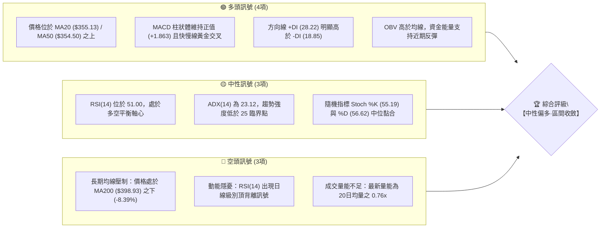

---

### 📊 核心指標速覽表

| 指標類別 | 指標名稱 | 當前數值 | 訊號 | 專業解讀與市場含義 |
|:---|:---|:---|:---:|:---|
| **基準價格** | 收盤價 (Close) | **$365.44** | 🟡 | 位於52週區間($297.38 - $498.83)之 33.8% 分位，處於中低檔回升段 |
| **短期均線** | MA20 (布林中軌) | **$355.13** | 🟢 | 現價高於 MA20 達 +2.90%，短線底部墊高，具動態支撐效力 |
| **中期均線** | MA50 | **$354.50** | 🟢 | 現價高於 MA50 達 +3.09%，中期均線開始走平並提供下檔承接力 |
| **長期均線** | MA200 | **$398.93** | 🔴 | 現價低於 MA200 達 -8.39%，長期空頭結構尚未化解，具強大蓋頭反壓 |
| **動能震盪** | RSI(14) | **51.00** | 🟡 | 位於50多空分水嶺，未見極端超買/超賣；但伴隨微幅頂背離警訊 |
| **趨勢動能** | MACD (12,26,9) | **+1.863** | 🟢 | DIF(5.049) > DEA(3.186)，雙線處於零軸上方且柱狀體為正，多方控盤 |
| **趨勢強度** | ADX(14) | **23.12** | 🟡 | ADX < 25 表明市場處於弱趨勢或箱體震盪行情，尚未展開爆發性單邊走勢 |
| **波動範圍** | ATR(14) | **$14.27** | 🟡 | 佔股價 3.91%，單日波動幅度適中，適合作為進出場風控停損點參照 |
| **通道位置** | Bollinger %B | **0.74** | 🟢 | 接近上軌 ($376.86)，短線動能偏強，但需留意上軌技術性壓制 |
| **量能結構** | Volume / 20MA | **0.76x** | 🔴 | 量能降溫至 29.92M（均量 39.53M），量價配合呈現「價漲量縮」格局 |

---

### 🏆 技術評分卡

```
╔══════════════════════════════════════════════════════════════════╗
║              TSLA 技術面綜合評分卡 (2026-09-11)                  ║
╠══════════════════════════════════════════════════════════════════╣
║ 評估維度      進度條權重指標                     得分     評級   ║
╟──────────────────────────────────────────────────────────────────╢
║ 趨勢強度      █████████░░░░░░░░░░░              45/100     🟡    ║
║ 動能指標      ████████████░░░░░░░░              60/100     🟢    ║
║ 支撐穩定度    ██████████████░░░░░░              70/100     🟢    ║
║ 成交量配合    ████████░░░░░░░░░░░░              40/100     🔴    ║
║ 形態完整度    ███████████░░░░░░░░░              55/100     🟡    ║
║ 均線排列系統  ████████████░░░░░░░░              58/100     🟡    ║
╠══════════════════════════════════════════════════════════════════╣
║ 綜合技術得分  ███████████░░░░░░░░░              54.7/100   🟡    ║
║ 最終定調：【中性震盪偏多 (Neutral / Range-Bound Accumulation)】    ║
╚══════════════════════════════════════════════════════════════════╝
```

---

## 2. 趨勢分析

### 🌐 多時框趨勢分析

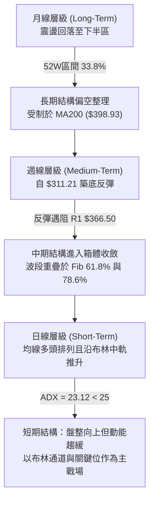

---

### 📈 長期趨勢 — 12個月走勢圖（Unicode）

以下為 TSLA 過去 12 個月（2025-10 至 2026-09）之每月收盤價走勢軌跡。高點出現在 2025-10 ($456.56)，波段低點於 2026-07 觸及 $311.21，目前最新價格為 $365.44。

```
TSLA 月線收盤走勢圖（2025-10 至 2026-09）
價格軸 ($)
$460 ┤   ●($456.56 - 區間高點)
$440 ┤       ●       ●                               ●
$420 ┤                   ●                               ●
$400 ┤                       ●
$380 ┤                               ●
$360 ┤                                   ●                       ●($365.44 現價)
$340 ┤                                                       ●
$320 ┤
$300 ┤                                                   ●($311.21 - 波段低點)
     └─────────────────────────────────────────────────────────────
        10   11  12  01  02  03  04  05  06  07  08  09  (月份)
        [── 2025年 ──] [────────────── 2026年 ──────────────]
```

#### 走勢特徵分析表格

| 階段別 | 期間涵蓋 | 價格區間 (收盤價) | 漲跌幅 | 結構性技術特徵解讀 |
|:---|:---:|:---:|:---:|:---|
| **階段 I：高檔盤整** | 2025-10 ~ 2025-12 | $456.56 → $449.72 | -1.50% | 於 $450 上方反覆震盪測試 52W 高點 ($498.83)，未能放量突破形成雙頂阻力 |
| **階段 II：單邊回落** | 2026-01 ~ 2026-03 | $430.41 → $371.75 | -13.63% | 長陰跌破高檔頸線，均線轉向發散下行，跌破 MA200 關鍵防線 |
| **階段 III：破位重挫** | 2026-04 ~ 2026-07 | $381.63 → $311.21 | -18.45% | 5月短暫反彈至 $435.79 後急轉直下，7月暴跌至 $311.21，逼近 52W 低點 $297.38 |
| **階段 IV：築底回溫** | 2026-08 ~ 2026-09 | $367.95 → $365.44 | -0.68% | 8月強力技術反彈修復跌幅，9月於 $365.44 進行橫盤消化，構築短期支撐底座 |

---

### 📊 中期趨勢（週線分析）

```
TSLA 週線關鍵架構阻力與支撐示意圖
══════════════════════════════════════════════════════════════════
$409.28  ═════════════════════════════════════  強阻力 R3 (週線級套牢頭部)
         │
$398.93  - - - - - - - - - - - - - - - - - - -  MA200 / Fib 50.0% ($398.10)
         │
$384.04  ─────────────────────────────────────  中期阻力 R2 (近一年波段高點聚類)
         │
$366.50  =====================================  即時阻力 R1 (當前測試點位 +0.29%)
         ▲
$365.44  [ ◄◄◄ TSLA 當前價格交投區間 ]
         ▼
$355.13  - - - - - - - - - - - - - - - - - - -  MA20 / 布林中軌動態支撐
         │
$337.24  ─────────────────────────────────────  波段支撐 S1 (近一年波段低點聚類)
         │
$297.38  ═════════════════════════════════════  核心強支撐 S2 (52週最低點)
══════════════════════════════════════════════════════════════════
```

週線數據顯示，股價自 2026-07-26 觸及 $313.03 及 2026-08-02 的 $311.21 低點後，呈現連續三週的強勢反彈（RSI 自 15.7 極端超賣區回升至 72.7）。然而，近期兩週（2026-08-30 至 2026-09-13）價格在 $348.75 至 $365.44 區間收斂，週成交量自 2.60 億股縮減至 1.43 億股，顯示中期反彈步入籌碼沉澱期。

---

### ⚡ 趨勢強度評估（ADX 解讀）

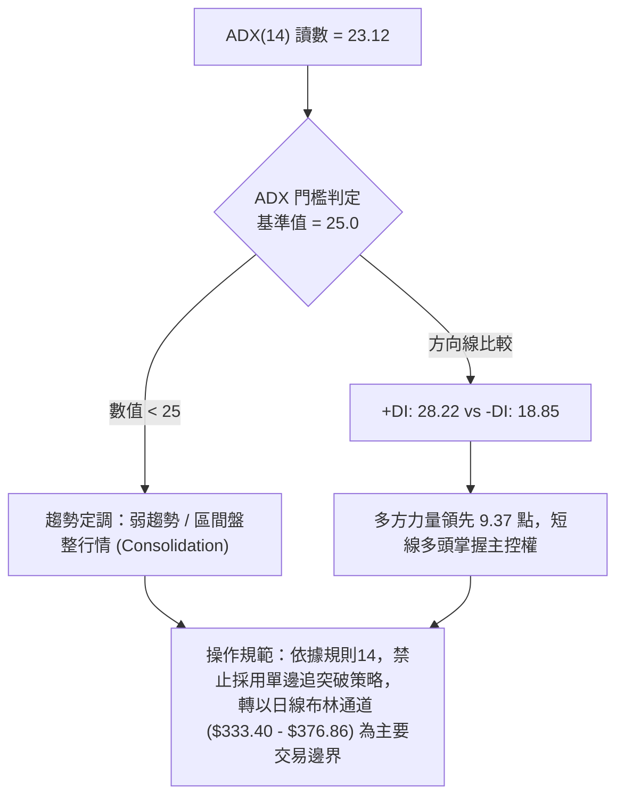

#### ADX 趨勢強度量化參照矩陣

| 參數指標 | 數值 | 狀態區間 | 技術解讀與訊號確認 |
|:---|:---:|:---:|:---|
| **ADX(14)** | **23.12** | 20 - 25（弱趨勢） | 過去 14 天單邊動能有限，市場缺乏強烈趨勢驅動力，震盪指標效能高於趨勢指標 |
| **+DI (正向動向)** | **28.22** | 多方進攻區 (>25) | 買方在短期邊際定價上佔據優勢，價格維持在短期均線群之上運作 |
| **-DI (負向動向)** | **18.85** | 空方退守區 (<20) | 賣壓暫時退潮，空方主動拋售力道減弱，下檔具備承接量能 |
| **方向差距 (+DI - -DI)** | **+9.37** | 偏多震盪格局 | 雖多方主導，但因 ADX 尚未突破 25，多方尚無能力開啟主升浪行情的波段推升 |

---

## 3. 圖表形態分析

### 🔍 形態識別系統

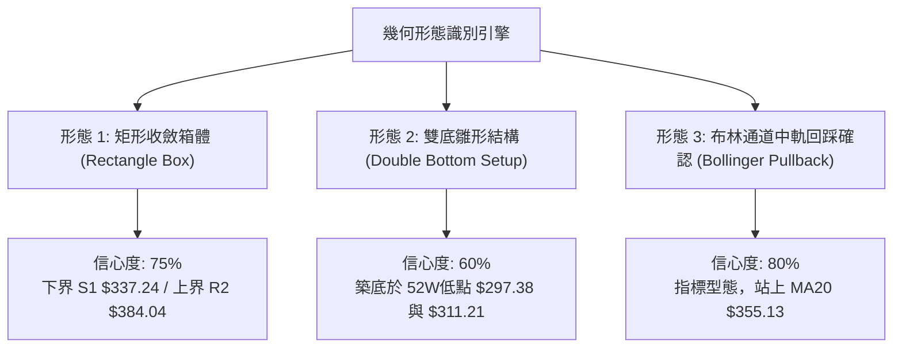

#### 圖表形態信心度與目標價評估表

| 識別形態名稱 | 信心度 | 判斷依據（嚴格引用技術數據） | 形態完成度 | 目標價（嚴格附帶計算公式） |
|:---|:---:|:---|:---:|:---|
| **箱體震盪整理<br>(Rectangle Box)** | **75%** | 價格受制於近一年波段高點聚類 R2 ($384.04)，下檔受波段低點聚類 S1 ($337.24) 支撐，近6週於此區間震盪 | **70%** | **突破目標**：頸線 R2 ($384.04) + 箱高 ($384.04 - $337.24 = $46.80) = **$430.84**（若能有效突破確認） |
| **雙重底雛形<br>(Double Bottom)** | **60%** | 52週低點 $297.38 與 2026-07 收盤低點 $311.21 構成雙腳支撐，兩次低點未破底且隨後放量反彈 | **55%**<br>(尚未突破頸線) | **頸線突破目標**：頸線取 R2 ($384.04)，形態高度為 $384.04 - $297.38 = $86.66；目標價 = $384.04 + $86.66 = **$470.70** |
| **均線向上金叉排列<br>(MA Crossover)** | **85%** | 指標型形態：MA5 ($363.81) > MA10 ($362.52) > MA20 ($355.13) > MA50 ($354.50)，短中期均線呈多頭排列 | **90%**<br>(已確立) | **指標動能測幅**：短期目標鎖定布林上軌 **$376.86** 與斐波那契 61.8% 位 **$374.33** |

*註：依據規則 15，因未見嚴謹之頭肩頂/旗形幾何收斂結構，本報告剔除虛構幾何形態，專注於矩形箱體、雙底築底與指標型均線架構。*

---

### 🕯️ 重要K線形態分析

| 月份 | 收盤價 | K線形態特徵 | 技術解讀與市場心理 | 多空訊號 |
|:---|:---:|:---|:---|:---:|
| **2026-05** | $435.79 | 長陽反彈線 | 自4月低位放量拉升，多頭強勢反撲，但遭遇 2025 年底套牢密集區壓制 | 🟢 看多 |
| **2026-06** | $420.60 | 高檔倒轉錘頭 | 多方上攻乏力，月線留下影線未果反現上影線，買盤後繼無力 | 🟡 滯漲 |
| **2026-07** | $311.21 | 大陰破位線 | 暴跌 -26.0%，跌破 MA120 與 MA200，空方全面摜壓引發停損賣壓 | 🔴 極度看空 |
| **2026-08** | $367.95 | 底部吞噬大陽線 | 強勢反彈 +18.23%，單月收復過半跌幅，確立 $311.21 為中期極限超賣底 | 🟢 強力看多 |
| **2026-09** | $365.44 | 高檔紡錘十字星 | 本月至今微幅收斂 -0.68%，多空於 R1 ($366.50) 關鍵阻力前夕陷入觀望沉思 | 🟡 變盤中性 |

---

### 📉 ASCII 走勢形態示意圖

```
TSLA 矩形箱體與雙底結構示意圖
===================================================================
$430.84 --------------------------------------- 箱體等幅向上測幅目標
         │
$384.04 ┌─────────────────────────────────────┐ 箱頂阻力頸線 (R2)
         │                 ╭─╮                 │
$365.44 ─┼───────╭─╮───────╯ │ ╭─╮           │ ◄ 當前價格 $365.44 (受阻 R1 $366.50)
         │       │ │         │ │ │           │
$355.13  - - - - │ - - - - - │ - - - - - - - -   MA20 / 布林中軌支撐
         │   ╭───╯ │         ╰─╯ ╰───╮       │
$337.24 └─-─┼─────┴───────────────────┴───────┘ 箱底支撐 (S1)
            │
$311.21 ────╯ (2026-07 低點: 底2)
            
$297.38 ════ (52W Low 強支撐: 底1 / S2)
===================================================================
```

---

## 4. 支撐與阻力

### 🗺️ 關鍵價位分布圖（Unicode）

```
TSLA 價位結構分布圖（嚴格依據 OHLCV 聚類計算）
══════════════════════════════════════════════════════════════════
$498.83 ║████████████████████████████████║ 52W 最高點 (Fib 0.0%)
$451.29 ║████████████████████            ║ 斐波那契 23.6% 回調壓制
$421.88 ║████████████████                ║ 斐波那契 38.2% 回調位
$409.28 ║████████████████████████████████║ 強阻力 R3 (近一年波段高點聚類)
$398.93 ║████████████████████████        ║ MA200 牛熊分水嶺 / Fib 50.0% ($398.10)
$384.04 ║████████████████████            ║ 阻力 R2 (近一年波段高點聚類)
$376.86 ║██████████                      ║ 布林通道上軌壓制
$374.33 ║██████████████                  ║ 斐波那契 61.8% 黃金分割反壓
$366.50 ║████████████████████████        ║ 關鍵即時阻力 R1 (+0.29%)
$365.44 ╠════════════════════════════════╣ ◄ 現價 (Current Price)
$355.13 ║▓▓▓▓▓▓▓▓▓▓▓▓                    ║ MA20 / 布林通道中軌動態防線
$340.49 ║▓▓▓▓▓▓▓▓▓▓▓▓▓▓▓▓                ║ 斐波那契 78.6% 回調防線
$337.24 ║▓▓▓▓▓▓▓▓▓▓▓▓▓▓▓▓▓▓▓▓            ║ 近期支撐 S1 (近一年波段低點聚類)
$333.40 ║▓▓▓▓▓▓▓▓                        ║ 布林通道下軌動態支撐
$297.38 ║████████████████████████████████║ 強支撐 S2 (52W 最低點 / Fib 100.0%)
══════════════════════════════════════════════════════════════════
```

---

### 🚧 阻力位分析表

所有價位均嚴格引用 OHLCV 計算之聚類數據：

| 阻力級別 | 精確價位 | 距離現價 | 形成原因與籌碼技術面背景 | 突破難度 | 戰略重要性 |
|:---|:---:|:---:|:---|:---:|:---:|
| **阻力 R1** | **$366.50** | +0.29% | 近一年波段高點密集聚類點，同時為本週多次上攻之即時反壓 | 中等 | 🟡 短線多空轉換樞紐 |
| **布林上軌**| **$376.86** | +3.12% | 統計學 2 倍標準差壓力邊界，短線超買臨界線（配合 Fib 61.8% $374.33）| 高 | 🟡 短線波段獲利了結點 |
| **阻力 R2** | **$384.04** | +5.09% | 近一年密集波段高點聚類，箱體震盪形態之上頸線 | 極高 | 🔴 中期箱體破局關鍵 |
| **阻力 R3** | **$409.28** | +12.00% | 2026年上半年重挫起跌點，上方套牢巨量籌碼區；與 MA200 ($398.93) 形成複合壓力帶 | 極高 | 🔴 實質熊牛分水嶺 |

---

### 🛡️ 支撐位分析表

| 支撐級別 | 精確價位 | 距離現價 | 形成原因與籌碼技術面背景 | 守住機率 | 戰略重要性 |
|:---|:---:|:---:|:---|:---:|:---:|
| **MA20中軌**| **$355.13** | -2.82% | 日線 20 日移動平均線暨布林通道中軌，多頭防守第一線 | 75% | 🟢 短線多頭防線 |
| **支撐 S1** | **$337.24** | -7.72% | 近一年波段低點聚類點，重疊布林下軌 ($333.40) 與 Fib 78.6% ($340.49) 支撐帶 | 80% | 🟢 中期箱體底部基準 |
| **支撐 S2** | **$297.38** | -18.62% | 52週最低點聚類，絕對多頭防線與長期估值托底線 | 95% | 🟢 全年強烈多頭防護牆 |

---

### 📐 斐波那契回調位分析

依據 52 週完整波動區間（高點 **$498.83** → 低點 **$297.38**，垂直落差 **$201.45**）計算之黃金分割水準如下：

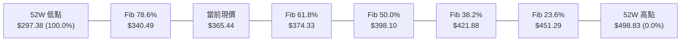

#### 斐波那契價位解讀表

| 回調比例 | 精確價位 | 與現價距離 | 技術面戰略意涵 |
|:---:|:---:|:---:|:---|
| **0.0% (52W High)** | **$498.83** | +36.50% | 週期大頂部，歷史套牢籌碼峰值 |
| **23.6%** | **$451.29** | +23.49% | 2025年 Q4 盤整平台中樞，長期牛市修復終極目標 |
| **38.2%** | **$421.88** | +15.44% | 下跌波段反彈第一阻力平台，接近 2026-06 月線收盤價 ($420.60) |
| **50.0%** | **$398.10** | +8.94% | 關鍵多空平衡位，緊密共振 MA200 均線 ($398.93)，具極強壓制力 |
| **61.8% (黃金分割)** | **$374.33** | +2.43% | **當前關鍵上方目標**：與布林上軌 ($376.86) 形成共振阻力區 |
| **現價位置 (33.8%)** | **$365.44** | 0.00% | **處於 Fib 78.6% ($340.49) 與 Fib 61.8% ($374.33) 之間震盪推升** |
| **78.6%** | **$340.49** | -6.83% | 深次回調防守點，共振 S1 支撐位 ($337.24) |
| **100.0% (52W Low)**| **$297.38** | -18.62% | 52週大底，跌破則長期走勢全面崩潰轉熊 |

---

## 5. 技術指標深度解讀

### 🎛️ 指標訊號總覽

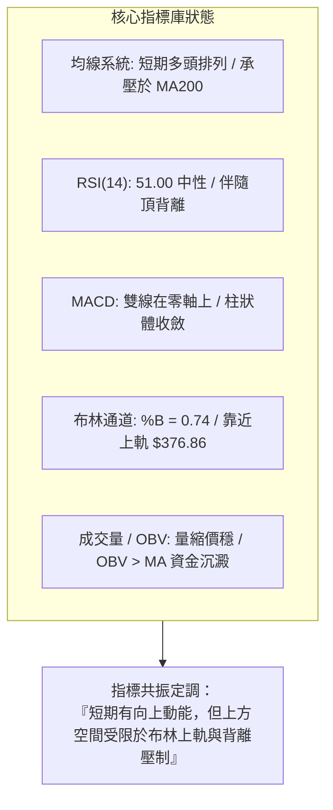

---

### 📈 移動平均線排列分析

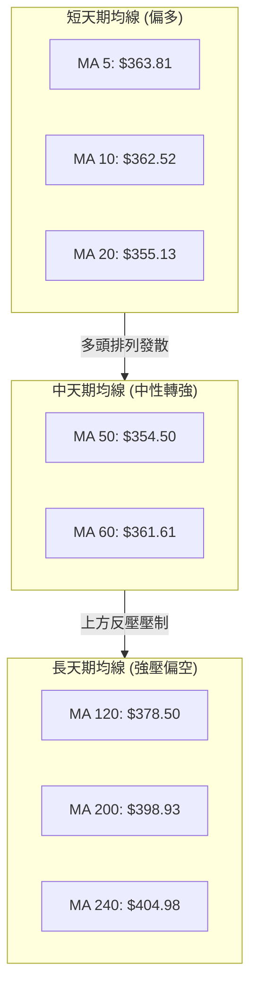

#### 均線數據深度解讀表

| 均線天期 | 當前數值 | 價差狀態 | 乖離率 (BIAS) | 短期斜率與走勢涵義 |
|:---|:---:|:---:|:---:|:---|
| **MA 5** | $363.81 | ▲ 股價在其上 | +0.45% | 短天期攻擊線維持向上傾斜，支撐短線高位換手 |
| **MA 10** | $362.52 | ▲ 股價在其上 | +0.80% | 短線控盤線，近5日回踩未破，提供極短線保護 |
| **MA 20** | $355.13 | ▲ 股價在其上 | +2.90% | 輔助布林中軌，向上走揚，為近期多頭波段操作依託 |
| **MA 50** | $354.50 | ▲ 股價在其上 | +3.09% | 季線級別走平微揚，與 MA20 形成黃金交叉初生段 |
| **MA 60** | $361.61 | ▲ 股價在其上 | +1.06% | 穿越站穩，確立自7月低點以來之中期反彈結構 |
| **MA 120**| $378.50 | ▼ 股價在其下 | -3.45% | 半年線持續下行，與布林上軌 ($376.86) 重合構成強阻力帶 |
| **MA 200**| $398.93 | ▼ 股價在其下 | -8.39% | 年線牛熊分水嶺，未有效收復前，不可定義為長期多頭牛市 |
| **MA 240**| $404.98 | ▼ 股價在其下 | -9.76% | 長期下行通道上軌，長期資金解套拋壓沉重 |

---

### 📉 RSI(14) 分析與背離檢驗

```
RSI(14) 當前數值進度條：
0 ══════════ 30 ════════════════ 51.00 ══════════════ 70 ══════════ 100
[ 超賣區間 ]  [     中性區間    ▲    中性偏多       ]  [ 超買區間 ]
▓▓▓▓▓▓▓▓▓▓▓▓▓▓▓▓▓▓▓▓▓▓▓▓▓▓▓▓▓▓▓░░░░░░░░░░░░░░░░░░░░░  51.00%
```

#### ⚠️ 背離分析與嚴肅警告

在技術數據中，明確提示存在 **「⚠️ 頂背離 (Bearish Divergence)」**：
1. **價格軌跡**：自 2026-08-23 週收盤 $362.86 上漲至 2026-09-13 週收盤 **$365.44**，價格創出反彈以來的收盤新高。
2. **RSI 軌跡**：RSI 讀數自 2026-08-23 的 **72.7**（超買高點）急速滑落至 2026-09-13 的 **51.00**。
3. **背離結論**：價格創高而 RSI 高點大幅下移，形成典型的**日/週線級別熊性頂背離**。這意味著內生上漲動能已顯著衰竭，目前價格推升屬於縮量慣性，若無突發放量大陽線化解背離，隨時面臨技術性拉回修正壓力。

---

### 📊 MACD(12/26/9) 訊號解讀

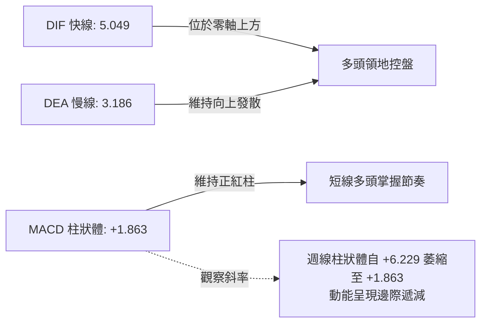

當前 MACD 數值為 5.049，訊號線（Signal line）為 3.186，柱狀體為 **+1.863**。快慢線仍處於零軸上方且呈現黃金交叉狀態，確認日線層面多方佔優。但需嚴格關注近 4 週週線 MACD 柱狀圖走勢：自 2026-08-23 的 **+6.229** 逐週縮減為 **+3.586** → **+2.926** → **+1.863**，動能柱出現持續階梯式萎縮，確認與 RSI 相同的「動能趨緩」特徵。

---

### 📦 布林通道分析（Bollinger Bands）

```
TSLA 布林通道位置示意圖 (寬度收窄中)
══════════════════════════════════════════════════════════════════
$376.86  ──────────────────────────────────────  上軌 (Upper Band)
         ▲
         │ (通道上部強勢區間)
         │  
$365.44  ● [ 現價位置: %B = 0.74，偏向強勢但面臨上軌反壓 ]
         │  
$355.13  - - - - - - - - - - - - - - - - - - -  中軌 / MA20 (Middle Band)
         │  
         │ (通道下部回踩區間)
         ▼  
$333.40  ──────────────────────────────────────  下軌 (Lower Band)
══════════════════════════════════════════════════════════════════
```

- **通道帶寬解讀**：通道帶寬 (Upper - Lower) = $376.86 - $333.40 = **$43.46**，佔現價約 11.89%，呈現橫盤收窄特徵，反映市場正處於 ADX < 25 的盤整週期。
- **%B 指標分析**：%B 讀數為 **0.74**，表明價格位於中軌至上軌的上半部強勢區域。根據布林通道震盪法則，當 %B 接近 0.8-1.0 時，常引發向中軌 ($355.13) 的均值回歸拉回。

---

### 💹 成交量分析（量價配合度）

```
成交量對比柱狀圖：
最新成交量  29,922,750  ████████████░░░░ (0.76x)
20日均量    39,530,672  ████████████████
50日均量    39,237,889  ███████████████░
```

1. **量能縮水現狀**：最新成交量為 29.92M，僅為 20 日均量 (39.53M) 的 75.69%，顯示在股價逼近 R1 ($366.50) 阻力時，買盤追價意願謹慎。
2. **OBV 能量潮狀態**：技術數據顯示「OBV > MA → 量能支撐上漲」，這表明雖然單日成交量萎縮，但近一個月累計的能量潮均線仍維持向上發散，機構籌碼在 8 月初反彈時介入深沉，目前尚未出現大規模出貨拋壓，屬於標準的「量縮橫盤洗盤」型態。

---

## 6. 動能與波動率

### ⚡ 動能評估四象限

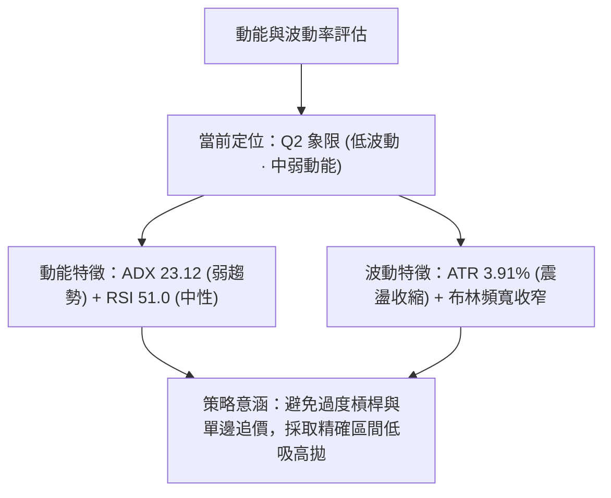

#### 動能四象限劃分對照表

| 象限代號 | 動能維度 | 波動維度 | 當前狀態標註 | 核心操作戰略 |
|:---:|:---:|:---:|:---:|:---|
| **Q1 象限** | 強動能 (ADX>25) | 低波動 (ATR<3%) | — | 趨勢突破醞釀期，最佳單邊波段建倉機會 |
| **Q2 象限** | **弱動能 (ADX<25)** | **低/中波動 (ATR 3.9%)** | **✓ TSLA 當前定位** | **區間震盪整理，以中軌低吸、阻力位高拋為主** |
| **Q3 象限** | 強動能 (ADX>25) | 高波動 (ATR>5%) | — | 主升浪/主跌浪爆發期，嚴格順勢交易 |
| **Q4 象限** | 弱動能 (ADX<25) | 高波動 (ATR>5%) | — | 劇烈洗盤震盪，方向混亂，應嚴格避免進場 |

---

### 📊 ATR 波動率分析

- **當前 ATR(14) 數值**：**$14.27**
- **波動率比率**：$14.27 / $365.44 = **3.91%**（屬於高 Beta 成長股之正常中等波動區間）。
- **停損防守間距設置指南**：
  - **超短線當沖 / 隔夜交易 (1.0x ATR)**：防守緩衝區間為 **$14.27**。
  - **波段多單標準防守 (1.5x ATR)**：防守緩衝區間為 **$21.41**。自現價扣除 1.5x ATR 為 $365.44 - $21.41 = **$344.03**（落於 MA20 $355.13 之下、S1 $337.24 之上）。
  - **寬幅防守 (2.0x ATR)**：防守緩衝區間為 **$28.54**，換算價位為 **$336.90**（剛好保護在支撐 S1 $337.24 之下）。

---

### 📐 Beta 與市場相關性

- **Beta 係數**：**1.845**
- **意涵解析**：TSLA 具備極高的市場彈性。當標普500指數 (S&P 500) 上漲 1.0% 時，TSLA 理論平均上漲 1.845%；反之，大盤回檔 1.0% 時，其跌幅亦放大至 1.845%。
- **風控聯動**：在當前高 Beta (1.845) 且 ADX < 25 的環境下，個股極易受到大盤總體經濟數據（如 CPI、利率決議）與科技板塊情緒的外部衝擊，因此整體持倉曝險規模應主動控制在 50% 以下。

---

## 7. 多時框架總結

### 📋 時框架評分表

| 時框架 | 趨勢方向 | 動能狀態 | 均線系統排列 | 關鍵形態結構 | 綜合評分 | 戰術操作建議 |
|:---:|:---:|:---:|:---:|:---:|:---:|:---|
| **日線 (Daily)** | 🟢 偏多震盪 | 🟡 RSI 51 中性<br>MACD 翻紅 | 短期 MA5/10/20<br>多頭向上發散 | 沿布林中軌震盪推升<br>接近 R1 阻力 | **62/100** | 逢回踩 MA20 支撐低吸，不可於上軌追多 |
| **週線 (Weekly)** | 🟡 橫盤修復 | 🔴 RSI 頂背離<br>動能柱萎縮 | 位於 MA50 處震盪<br>承壓於 MA200 | 矩形整理箱體<br>下界 S1 / 上界 R2 | **52/100** | 箱體波段思維，R2 ($384.04) 附近分批落袋 |
| **月線 (Monthly)**| 🔴 長期走弱 | 🔴 處於 52W 區間<br>33.8% 低分位 | 股價受制於下行之<br>MA120 / MA200 | 大級別自高位 $456<br>大幅拉回後之低檔橫盤 | **45/100** | 尚未構成牛市反轉，長期部位維持防禦配置 |

---

### 🔲 綜合訊號矩陣

```
時框訊號收斂一致性檢視：
┌─────────────┬─────────────┬─────────────┬─────────────┐
│ 時框層級    │ 短期 (日線) │ 中期 (週線) │ 長期 (月線) │
├─────────────┼─────────────┼─────────────┼─────────────┤
│ 均線系統    │    🟢 多頭  │    🟡 混合  │    🔴 空頭  │
│ 動能指標    │    🟢 偏多  │    🔴 背離  │    🟡 中性  │
│ 形態位置    │    🟢 偏多  │    🟡 震盪  │    🔴 弱勢  │
│ 量能配合    │    🔴 萎縮  │    🔴 萎縮  │    🟡 持平  │
└─────────────┴─────────────┴─────────────┴─────────────┘
一致性程度：【低度一致 · 典型多空時框拉鋸衝突】
```

---

### ⚖️ 多時框收斂結論

依據本報告**嚴格要求第 14 條多時框收斂規則**：
1. **趨勢/盤整行情判定**：當前 ADX(14) 讀數為 **23.12**，明確低於 25 的趨勢門檻，因此當前市場被嚴格定調為**「盤整行情（Consolidation / Range-Bound）」**。
2. **交易邊界界定**：在盤整行情中，中長期單邊趨勢暫不發揮主導作用，交易邏輯應完全收斂至**日線布林通道上下軌 ($333.40 至 $376.86) 與波段高低點 (S1 $337.24 至 R2 $384.04)** 所構成的區間。
3. **唯一方向性定調**：**【中性偏多·區間震盪整理 (Neutral to Mild Bullish Range-Bound)】**。
   - 日線級別均線金叉提供下檔緩衝（支持回檔偏多佈局）；
   - 週線 RSI 頂背離與長天期 MA200 壓制封閉上方爆發空間（反對激進追高）。

---

## 8. 交易策略建議

### 🗺️ 策略決策流程圖

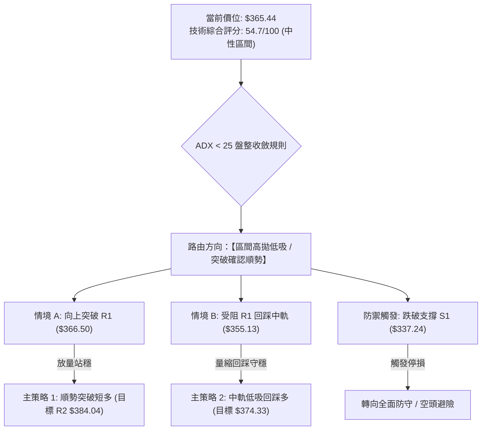

---

### 🧭 策略路由（依評分卡分流）

> **當前主策略方向 = 【中性區間波段操作，以布林通道與關鍵支撐阻力為操作界限】（綜合評分：54.7 / 100）**

因綜合評分落在 40–60 的中性區間，且 ADX 為 23.12，禁止單邊重倉下注。本章節以**多頭波段操作為主策略（分為「突破買入」與「回踩低吸」兩套執行方案）**，空頭僅列為關鍵反轉點之風控避險提示。

---

### 🎯 價格情境階梯（Price Scenarios）

所有價位均嚴格引用第 4 章所確認之真實數據：

| 階梯觸發條件 | 第一目標位 | 第二目標位 | 後續延伸極限 | 行情情境含義解讀 |
|:---|:---:|:---:|:---:|:---|
| **強勢突破 R1 ($366.50)** | **$374.33** (Fib 61.8%) | **$376.86** (布林上軌) | **$384.04** (阻力 R2) | 短線動能激發，挑戰箱體頂部壓力帶 |
| **突破箱頂 R2 ($384.04)** | **$398.10** (Fib 50.0%) | **$398.93** (MA200 年線) | **$409.28** (阻力 R3) | 中期空翻多，挑戰牛熊分水嶺核心防線 |
| **受阻回跌守穩 MA20 ($355.13)**| **$365.44** (現價) | **$374.33** (Fib 61.8%) | **$376.86** (布林上軌) | 標準箱體內強勢震盪洗盤，多頭結構完整 |
| **有效跌破 S1 ($337.24)** | **$333.40** (布林下軌) | **$297.38** (強支撐 S2) | — | 中期反彈結構瓦解，二次探底 52W 低點 |

---

### 📊 情境機率分佈

| 情境類型 | 預測機率 | 關鍵技術指標支撐依據 |
|:---|:---:|:---|
| **情境一：區間震盪收斂** | **50%** | ADX(14) = 23.12（無單邊趨勢）、成交量能持續萎縮（量比 0.76x）、布林通道帶寬收斂 |
| **情境二：向上反彈測試阻力**| **30%** | +DI (28.22) > -DI (18.85)、MACD 柱狀體維持正值 (+1.863)、OBV 能量潮高於均線支持微幅推升 |
| **情境三：頂背離引發回調** | **20%** | RSI(14) 頂背離警訊確立、接近布林上軌 (%B=0.74)、長期 MA200 蓋頭空頭壓制尚未扭轉 |

---

### 🟢 主策略詳情

本報告擬定兩套互補之操作方案，所有進出場價位嚴格錨定第 4 章聚類數據：

| 策略維度 | 方案 A：順勢突破短多策略 (Breakout Long) | 方案 B：回踩支撐低吸策略 (Pullback Long) |
|:---|:---|:---|
| **進場條件與觸發** | 日K收盤價有效站穩阻力 R1 之上，放量確認 | 價格回踩 MA20 / 布林中軌獲得下影線支撐 |
| **精確進場價格** | **$367.00**（確認突破 R1 $366.50 後右側進場） | **$355.50**（貼近 MA20 $355.13 支撐左側掛單） |
| **第一目標價 (T1)** | **$374.33**（斐波那契 61.8% 壓制點） | **$366.50**（阻力位 R1） |
| **第二目標價 (T2)** | **$384.04**（近一年高點阻力 R2 / 箱頂） | **$376.86**（布林通道上軌邊界） |
| **精確止損價格** | **$354.50**（跌破 MA50 / MA20 支撐群） | **$340.00**（跌破 Fib 78.6% $340.49 與整數防線）|
| **風險空間 (Risk)** | $367.00 - $354.50 = **$12.50** | $355.50 - $340.00 = **$15.50** |
| **報酬空間 (Reward)**| T2: $384.04 - $367.00 = **$17.04** | T2: $376.86 - $355.50 = **$21.36** |
| **風險報酬比 (R:R)**| **1 : 1.36** (至 T2) | **1 : 1.38** (至 T2) |
| **技術成功勝率** | **55%**（受制於頂背離，勝率適中） | **65%**（獲均線簇與下軌保護，勝率較高） |
| **建議配置倉位** | 總資金之 **15%** | 總資金之 **20%** |

---

### 🔴 反向風險觸發點（對沖與風控提示）

若出現以下極端技術訊號，意味著當前多頭反彈結構徹底失效，投資人應立即執行多單全面停損或啟動防守型對沖：
1. **觸發跌破 S1 ($337.24)**：若日K線以實體長陰線跌破波段低點聚類 S1 ($337.24)，代表自 8 月以來的震盪反彈波段結束，形態演變為破位下行。
2. **週線 MACD 轉負**：若週線 MACD 柱狀體翻綠跌破 0 軸，將確認頂背離引發中期跌浪。
3. **風控行動**：全面撤銷所有多頭掛單，持有多單全數停損離場，空手觀望至 52W 低點 S2 ($297.38) 尋求下一次築底訊號。

---

### ⭐ 整體訊號強度評星

```
做多訊號強度：★★★☆☆  (3.0 / 5.0 星 — 均線短多但受制於震盪與背離)
做空訊號強度：★★☆☆☆  (2.0 / 5.0 星 — 短期均線發散向上，做空勝率偏低)
整體技術可信度：★★★★☆  (4.0 / 5.0 星 — 關鍵阻力支撐邊界明確，指標呈現高收斂度)
```

---

## 9. 風險提示與監控

### ✅ 關鍵監控指標 Checklist

```
╔══════════════════════════════════════════════════════════════════╗
║               TSLA 交易每日風控監控清單 (Checklist)              ║
╠══════════════════════════════════════════════════════════════════╣
║ [ ] 監控點 1：收盤價是否能攻克即時阻力 R1 ($366.50)              ║
║ [ ] 監控點 2：MA20 動態防線 ($355.13) 是否遭遇帶量長陰線貫穿     ║
║ [ ] 監控點 3：日線成交量是否放大至 39.53M (20日均量) 之上       ║
║ [ ] 監控點 4：RSI(14) 是否跌破 50 多空分界線，加劇頂背離修正     ║
║ [ ] 監控點 5：布林通道帶寬是否出現暴起開口發散 (破壞箱體平衡)     ║
║ [ ] 監控點 6：S&P 500 / Nasdaq 大盤聯動走勢 (Beta 1.845 高敏感度) ║
╚══════════════════════════════════════════════════════════════════╝
```

---

### ⚠️ 風險場景分析

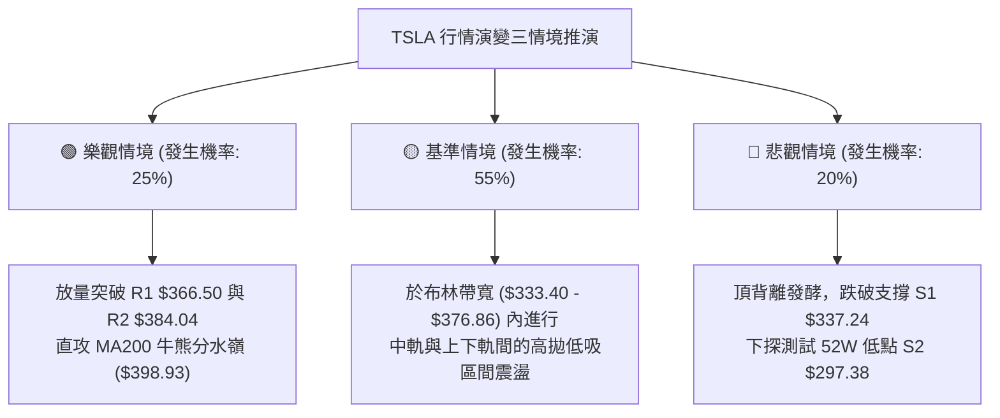

---

### 🛡️ 風險管理重要提醒

1. **高 Beta 波動懲罰機制**：TSLA 當前 Beta 為 **1.845**，單日 ATR 高達 **$14.27 (3.91%)**。這意味著隔夜跳空幅度常超出預期，**嚴禁採用超過 2 倍以上之金融槓桿**，單一交易策略之停損金額嚴格限制於總投資組合淨值的 **1.0% - 1.5%** 範圍內。
2. **假突破誘多陷阱防範**：由於日線 RSI 出現顯著頂背離，當價格微幅突破 R1 ($366.50) 但成交量未達 20日均量 (39.53M) 的 1.2 倍以上時，極高機率為「假突破誘多」，切忌在盤中盲目追價，應等待收盤確認或回踩時再行介入。
3. **倉位管理配置原則**：
   - 總部位上限：不超過總資產的 **35%**。
   - 分批建倉：首筆進場資金控制在 **10% - 15%**，獲利脫離成本區（突破 Fib 61.8% $374.33）後，方可將停損點上移至進場成本並動用加碼部位。

---

## 📋 報告總結

```
╔══════════════════════════════════════════════════════════════════╗
║                    TSLA 技術分析報告總結                         ║
╠══════════════════════════════════════════════════════════════════╣
║ 報告日期：2026-09-11             當前價格：$365.44              ║
║ 分析評級：⚖️ 中性偏多 / 區間震盪 (Neutral to Bullish Range)      ║
╟──────────────────────────────────────────────────────────────────╢
║ 關鍵結構結論：                                                   ║
║ ├─ 長期趨勢 (月線)：🔴 空頭壓制，受制於 MA200 ($398.93) 年線反壓 ║
║ ├─ 中期趨勢 (週線)：🟡 箱體沉澱，自 $311 反彈後於 S1-R2 區間震盪 ║
║ ├─ 短期趨勢 (日線)：🟢 多頭排列，股價沿 MA20 ($355.13) 緩步墊高 ║
║ ├─ 關鍵核心阻力：R1: $366.50  /  R2: $384.04  /  R3: $409.28   ║
║ ├─ 關鍵核心支撐：MA20: $355.13 /  S1: $337.24  /  S2: $297.38   ║
║ └─ 華爾街共識目標價：$390.09 (隱含 +6.74% 空間，共識評級：Buy)   ║
╟──────────────────────────────────────────────────────────────────╢
║ 最優實戰策略推薦：                                               ║
║ 1. 🥇 最佳機會（勝率最高）：【方案 B 回踩低吸】                  ║
║    等待股價回踩 MA20 支撐區 $355.50 介入，停損設於 $340.00，     ║
║    目標上看布林上軌 $376.86，風險報酬比 1:1.38。                 ║
║ 2. 🥈 次選機會（動能確認）：【方案 A 順勢突破】                  ║
║    若放量突破 R1 $366.50，於 $367.00 追買，停損設於 $354.50，    ║
║    目標上看箱頂 R2 $384.04，風險報酬比 1:1.36。                 ║
║ 3. 🥉 保守風控防線：                                             ║
║    若跌破 $337.24 (S1)，無條件多單離場觀望，防範探底 $297.38。   ║
╚══════════════════════════════════════════════════════════════════╝
```

---

> ⚠️ **免責聲明**：本報告為依據定量技術指標自動生成之專業技術分析研究，報告內引用之所有價位、均線、形態與評估矩陣均基於特定歷史交易數據演算。本報告**僅供學術研究與機構投資交流參考**，**絕不構成任何具體投資建議、買賣要約或獲利保證**。金融市場存在高度波動風險，投資人應獨立評估財務狀況、承擔投資決策之後果與風險。

---
*報告生成時間：2026-09-11 ｜ 數據來源：Yahoo Finance ｜ 分析框架：多時框技術分析 (MTFA System)*