# TSLA 技術分析報告

> **報告日期**：2026-09-12 ｜ **語言**：繁體中文 ｜ **數據來源**：Yahoo Finance ｜ **當前價格**：$365.44

---

## 目錄

| 章節 | 內容 |
|------|------|
| [1. 技術面概覽](#1-技術面概覽) | 訊號儀表板、核心指標、評分卡 |
| [2. 趨勢分析](#2-趨勢分析) | 多時框趨勢、長中短期走勢、ADX解讀 |
| [3. 圖表形態分析](#3-圖表形態分析) | 形態識別、信心度評估、K線組合 |
| [4. 支撐與阻力](#4-支撐與阻力) | 關鍵價位分佈、斐波那契回調 |
| [5. 技術指標深度解讀](#5-技術指標深度解讀) | MA/RSI背離/MACD/布林/量價配合 |
| [6. 動能與波動率](#6-動能與波動率) | 動能四象限、ATR評估、Beta相關性 |
| [7. 多時框架總結](#7-多時框架總結) | 時框架評分、收斂結論 |
| [8. 交易策略建議](#8-交易策略建議) | 策略路由、主策略、風控對沖 |
| [9. 風險提示與監控](#9-風險提示與監控) | 監控清單、情境模擬、倉位管理 |
| [📋 報告總結](#-報告總結) | 核心總結看板 |

---

## 1. 技術面概覽

### 🎯 技術訊號儀表板

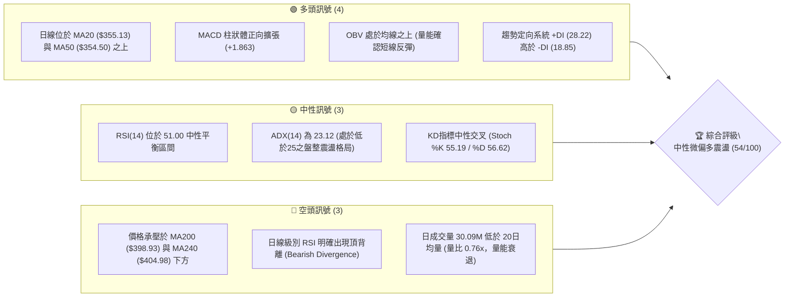

### 📊 核心指標速覽表

| 指標類別 | 指標名稱 | 當前數值 | 訊號 | 解讀 |
|----------|----------|----------|------|------|
| **價格** | 當前價格 | $365.44 | 🟡 | 位於52週區間 33.8% 位置，處於中短期反彈但受制於長期均線 |
| **均線** | MA20 | $355.13 | 🟢 | 價格在 MA20 上方 (+2.90%)，短線呈支撐形態且均線扣抵向上 |
| **均線** | MA50 | $354.50 | 🟢 | 價格在 MA50 上方 (+3.09%)，中期底部支撐成形 |
| **均線** | MA200 | $398.93 | 🔴 | 價格在 MA200 下方 (-8.39%)，長期空頭壓制未解，屬逆勢修正 |
| **動能** | RSI(14) | 51.00 | 🟡 | 中性水平，但日線伴隨頂背離警訊，短期動能衰退 |
| **動能** | MACD | 5.049 (Sig: 3.186) | 🟢 | 雙線位於零軸上方，Histogram (+1.863) 維持正值發散 |
| **波動** | ATR(14) | $14.27 | 🟡 | 佔股價 3.91%，波動率處於中等收斂階段，適合區間擺盪操作 |

### 🏆 技術評分卡

```
╔══════════════════════════════════════════════════════════════════╗
║               技術評分卡 — TSLA (2026-09-12)                     ║
╠══════════════════════════════════════════════════════════════════╣
║ 趨勢強度 (ADX=23.12)   █████████░░░░░░░░░░░  45/100  🟡 弱趨勢/盤整║
║ 動能指標 (RSI/MACD)    ███████████░░░░░░░░░  55/100  🟡 動能面臨背離║
║ 支撐穩定度 (S1=$337.24) ██████████████░░░░░  70/100  🟢 下檔買盤堅固║
║ 成交量配合 (量比 0.76x) ████████░░░░░░░░░░░░  40/100  🔴 量能未能放大║
║ 形態完整度 (箱型整理)   ████████████░░░░░░░░  60/100  🟡 區間收斂待變║
║ 均線排列 (短強長弱)     ███████████░░░░░░░░░  55/100  🟡 混合交叉糾結║
╠══════════════════════════════════════════════════════════════════╣
║ 綜合評分               ███████████░░░░░░░░░  54/100  ⚖️ 區間中性震盪║
╚══════════════════════════════════════════════════════════════════╝
```

---

## 2. 趨勢分析

### 🌐 多時框趨勢分析

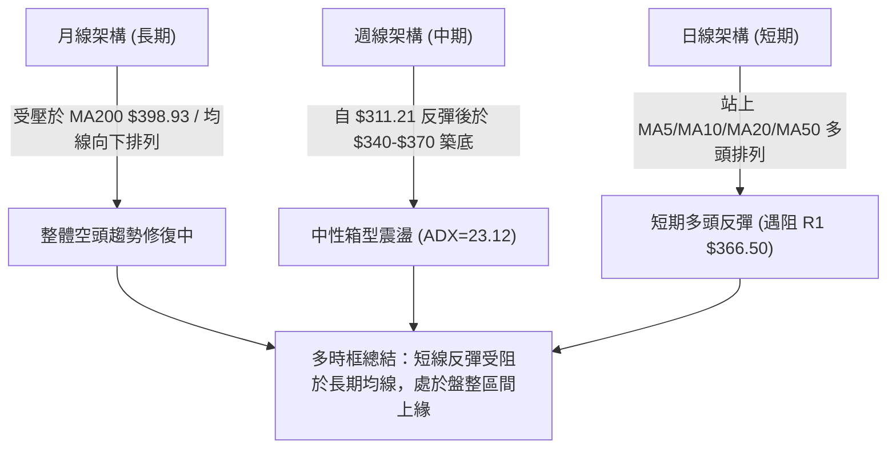

### 📈 長期趨勢 — 12個月走勢圖（Unicode）

```
TSLA 月線收盤走勢圖（2025-09 至 2026-09）
價格 ($)
$460 ┤               ● $456.56
$440 ┤ ● $444.72           ● $449.72        ● $435.79
$420 ┤          ● $430.17        ● $430.41        ● $420.60
$400 ┤                               ● $402.51
$380 ┤                                        ● $381.63
$360 ┤                                                 ● $367.95 ━● $365.44 (現價)
$340 ┤                                                          
$320 ┤                                                      ● $311.21 (低點)
$300 ┤
     └─────────────────────────────────────────────────────────────────
       25-09 25-10 25-11 25-12 26-01 26-02 26-03 26-04 26-05 26-06 26-07 26-08 26-09
```

#### 走勢特徵分析表格

| 階段區間 | 起止價格 | 漲跌幅 | 主要形態特徵與驅動要素 |
|----------|----------|--------|------------------------|
| **2025-09 ~ 2025-10** | $444.72 → $456.56 | +2.66% | 高檔多頭噴出，見到近2年波段高點（52W高點為 $498.83） |
| **2025-11 ~ 2026-03** | $430.17 → $371.75 | -13.58% | 連續階梯式下滑，跌破短期支撐，長均線開始走平轉弱 |
| **2026-04 ~ 2026-05** | $381.63 → $435.79 | +14.19% | 強勁技術性回抽，未能突破前期雙頂阻力，量能開始背離 |
| **2026-06 ~ 2026-07** | $420.60 → $311.21 | -26.01% | 暴跌測試 52W 低點 $297.38 上方支撐，週線 RSI 降至 15.7 極端超賣 |
| **2026-08 ~ 2026-09** | $367.95 → $365.44 | -0.68% | 超賣報復性反彈後進入窄幅箱型震盪，多空在 MA20 與阻力 R1 間拉鋸 |

### 📊 中期趨勢（週線分析）

```
TSLA 中期週線支撐阻力結構
────────────────────────────────────────────────────────────────
$409.28 ═════════════════════════════════════════  阻力 R3 (強阻力/前波破位點)
$398.93 ┄┄┄┄┄┄┄┄┄┄┄┄┄┄┄┄┄┄┄┄┄┄┄┄┄┄┄┄┄┄┄┄┄┄┄┄┄┄  MA200 牛熊分水嶺
$384.04 ─────────────────────────────────────────  阻力 R2 (反彈高點聚類)
$376.86 ┄┄┄┄┄┄┄┄┄┄┄┄┄┄┄┄┄┄┄┄┄┄┄┄┄┄┄┄┄┄┄┄┄┄┄┄┄┄  布林通道上軌
$366.50 ─────────────────────────────────────────  阻力 R1 (當前測試關卡)
$365.44 ◄────── 現價位置 ($365.44)
$355.13 ┄┄┄┄┄┄┄┄┄┄┄┄┄┄┄┄┄┄┄┄┄┄┄┄┄┄┄┄┄┄┄┄┄┄┄┄┄┄  布林中軌 / MA20
$337.24 ═════════════════════════════════════════  支撐 S1 (近期回踩平台)
$297.38 ═════════════════════════════════════════  強支撐 S2 (52W 最低點)
────────────────────────────────────────────────────────────────
```

### ⚡ 趨勢強度評估（ADX 解讀）

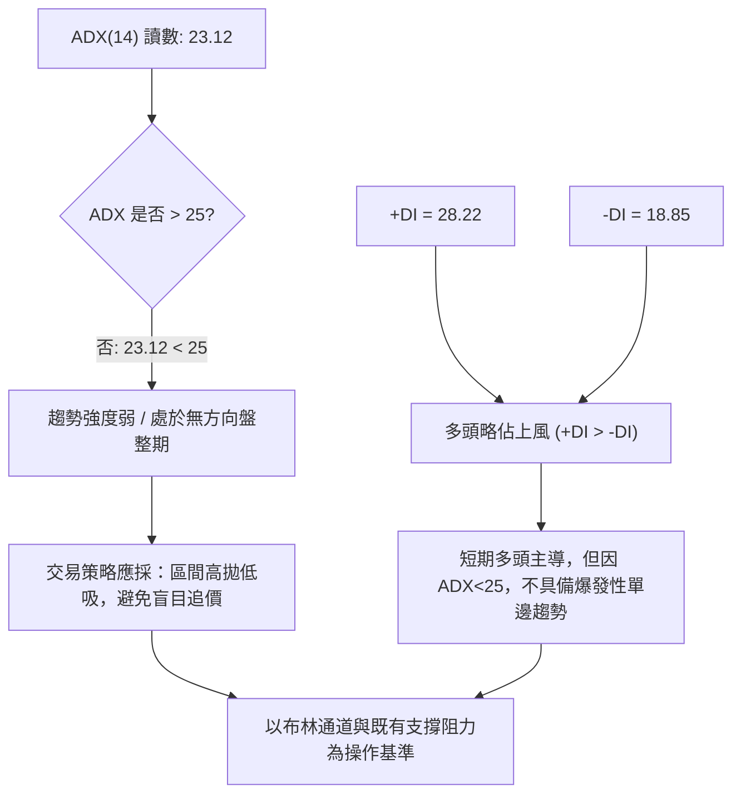

| 指標 | 數值 | 狀態門檻 | 趨勢解讀結論 |
|------|------|----------|--------------|
| **ADX (14)** | **23.12** | < 25 (弱趨勢/盤整) | 目前不屬於趨勢突破行情，動能不足以發動持續性單邊走勢 |
| **+DI** | **28.22** | 高於 -DI (多頭主導) | 買盤力量在短線反彈中大於賣盤，多方具備主動權 |
| **-DI** | **18.85** | 處於相對低位 | 空頭下殺動能暫時退潮，未出現主動性拋售壓迫 |

---

## 3. 圖表形態分析

### 🔍 形態識別系統

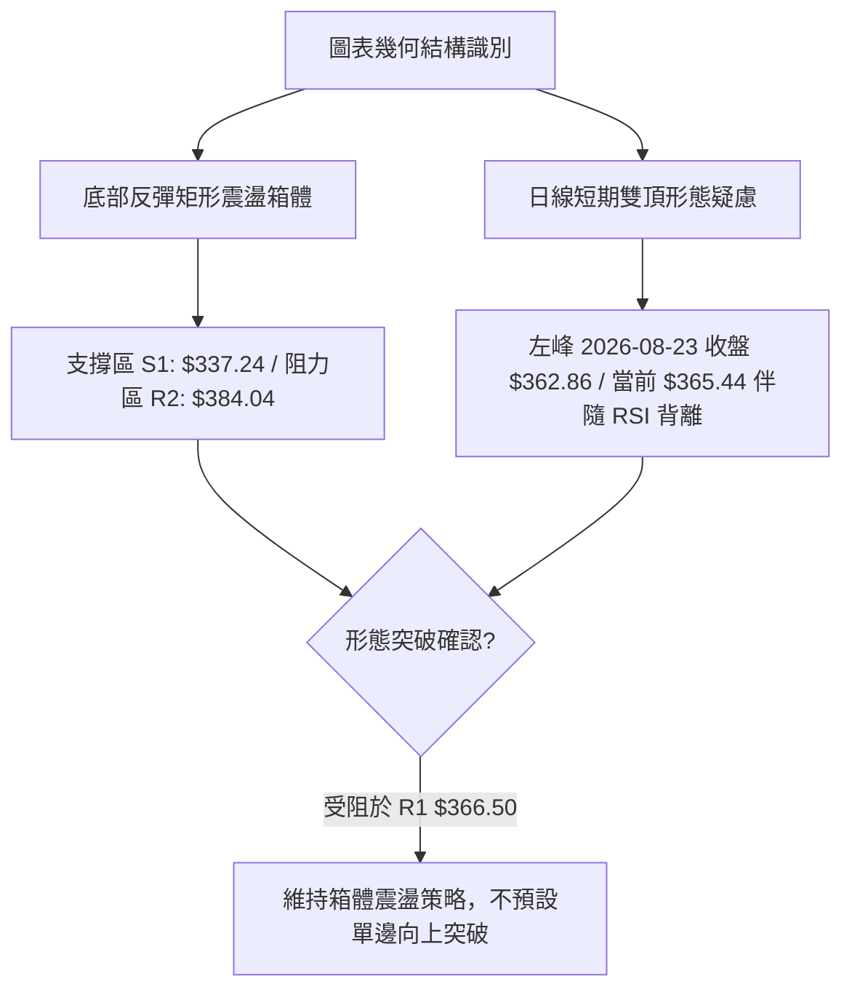

#### 形態信心度評估表

| 形態類別 | 信心度 | 判斷依據（引用數據） | 完成度 | 目標價（附計算式） |
|----------|--------|----------------------|--------|--------------------|
| **矩形震盪箱體 (Box Range)** | **75%** | 價格在 2026-07 觸及 $311.21 後回升，在 $337.24 (S1) 與 $384.04 (R2) 之間拉鋸，ADX=23.12 證實為無趨勢盤整 | 85% | 向上突破目標：箱頂 $384.04 + 箱體高度 ($384.04 - $337.24 = $46.80) = **$430.84**（數據中波段高點參考 R3 為 $409.28） |
| **潛在短線雙頂 (Double Top)** | **55%** | 8月23日見高 $362.86 後拉回至 $348.75，當前再次測試 $365.44，但日線 RSI 顯示頂背離，量能從 180M 縮至 143M | 60% | 若跌破頸線 $348.75，測幅滿足點：$348.75 - ($365.44 - $348.75 = $16.69) = **$332.06**（接近布林下軌 $333.40 與支撐 S1） |
| **頭肩底形態** | **30%** | 數據中左肩與頭部結構不對稱，成交量無典型特徵 | 未成形 | 訊號不足，僅做指標型解讀，不納入交易決策依據 |

### 🕯️ 重要K線形態分析

| 週/月份 | 收盤價 | K線形態特徵 | 盤面解讀 | 訊號評級 |
|---------|--------|-------------|----------|----------|
| **2026-07-26** | $313.03 | 大陰線破位放量 (275M) | 跌破多個中期支撐，引發恐慌性超賣 (RSI 15.7) | 🔴 空頭宣洩 |
| **2026-08-02** | $311.21 | 下影線錘頭星線 (198M) | 低檔出現長下影線，賣壓枯竭，形成中期波段實體低點 | 🟢 築底訊號 |
| **2026-08-23** | $362.86 | 連續中陽線突破 (180M) | 報復性反彈收復 MA20/MA50，短期趨勢翻多 | 🟢 多頭轉強 |
| **2026-09-13** | $365.44 | 高檔窄幅十字星 (143M) | 量能急劇萎縮（量比 0.76x），顯示突破 R1 $366.50 動能猶豫 | 🟡 滯漲警戒 |

### 📉 ASCII 走勢形態示意圖

```
TSLA 箱型震盪與阻力測試形態示意
價格
$384.04 ┼────────────────────────────── 箱體上軌 (阻力 R2)
        │
$366.50 ┼───────────────────╭──● 阻力 R1 (當前測試關卡 $365.44)
        │                  ╱    │  (伴隨 RSI 頂背離)
$355.13 ┼───────╭─────────╯      │  布林中軌 / MA20
        │      ╱ ╲               │
$348.75 ┼─────╯   ╰── 頸線支撐 ─╯
        │
$337.24 ┼────────────────────────────── 箱體下軌 (支撐 S1)
        │    ● 2026-08-02 底部 $311.21
$297.38 ┼────────────────────────────── 52W 低點 (支撐 S2)
```

---

## 4. 支撐與阻力

### 🗺️ 關鍵價位分布圖（Unicode）

```
TSLA 價位結構分布圖
═══════════════════════════════════════════════════════════════════
$498.83 ║████████████████████████████████████████║ 52週歷史高點 (0.0% Fib)
$451.29 ║████████████████████████████            ║ 斐波那契 23.6% 回調位
$421.88 ║████████████████████                    ║ 斐波那契 38.2% 回調位
$409.28 ║████████████████████████████████        ║ 強阻力 R3 (前波跌破頸線點)
$398.93 ║████████████████████████                ║ MA200 牛熊分界線 / Fib 50% ($398.10)
$384.04 ║████████████████████                    ║ 阻力 R2 (反彈高點聚類)
$376.86 ║████████████                            ║ 布林通道上軌
$374.33 ║██████████████                          ║ 斐波那契 61.8% 回調位
$366.50 ║████████████████████████████            ║ 關鍵阻力 R1 (+0.29%)
$365.44 ╠════════════════════════════════════════╣ ◄ 當前市價 ($365.44)
$355.13 ║▓▓▓▓▓▓▓▓▓▓▓▓▓▓▓▓▓▓                      ║ MA20 / MA50 均線聚集支撐區
$340.49 ║▓▓▓▓▓▓▓▓▓▓▓▓                            ║ 斐波那契 78.6% 回調位
$337.24 ║▓▓▓▓▓▓▓▓▓▓▓▓▓▓▓▓▓▓▓▓▓▓▓▓                ║ 近期波段支撐 S1 (-7.72%)
$297.38 ║████████████████████████████████████████║ 52週最低點 S2 (100.0% Fib)
═══════════════════════════════════════════════════════════════════
```

### 🚧 阻力位分析表

| 阻力級別 | 價位 | 形成原因 | 突破難度 | 重要性 |
|----------|------|----------|----------|--------|
| **R1** | **$366.50** | 近一年波段高點聚類，與布林上軌 ($376.86) 構成第一道壓力帶 | 中等 | ⭐⭐⭐ 短線突破與否決定是否向上挑戰 R2 |
| **R2** | **$384.04** | 近一年中波段反彈高點密集套牢區，前期成交密集帶 | 偏高 | ⭐⭐⭐⭐ 箱型震盪之絕對上軌，中期強壓 |
| **R3** | **$409.28** | 2026年5-6月波段高點聚類，且貼近 MA200 ($398.93) 與 MA240 | 極高 | ⭐⭐⭐⭐⭐ 牛熊趨勢反轉之關鍵分水嶺 |

### 🛡️ 支撐位分析表

| 支撐級別 | 價位 | 形成原因 | 守住機率 | 重要性 |
|----------|------|----------|----------|--------|
| **S1** | **$337.24** | 近一年波段低點聚類，接近斐波那契 78.6% ($340.49) 與布林下軌 | 70% | ⭐⭐⭐⭐ 多頭箱型防守底線，破位將引發停損 |
| **S2** | **$297.38** | 52週絕對最低點 (2026年波段極致低點聚類) | 85% | ⭐⭐⭐⭐⭐ 長期價值與極限止損防線，失守將開啟單邊崩跌 |

### 📐 斐波那契回調位分析

依據 52 週區間高點 **$498.83** 與低點 **$297.38** 展開分析：

* **0.0% (52W High)**: $498.83
* **23.6%**: $451.29
* **38.2%**: $421.88
* **50.0%**: $398.10（極為關鍵，與 MA200 的 $398.93 形成雙重重合共振）
* **61.8%**: $374.33
* **78.6%**: $340.49
* **100.0% (52W Low)**: $297.38

> **當前價位解讀**：
> 現價 **$365.44** 正處於 **78.6% ($340.49)** 與 **61.8% ($374.33)** 的回調區間內。黃金分割的 61.8%（$374.33）為傳統強阻力位，上方即為 R1 ($366.50) 與布林上軌 ($376.86)。這意味著 TSLA 股價目前正處在弱勢反彈的關鍵測試窗口，若無法放量越過 $374.33，回調測試 78.6% ($340.49) 及 S1 ($337.24) 的機率極大。

---

## 5. 技術指標深度解讀

### 🎛️ 指標訊號總覽

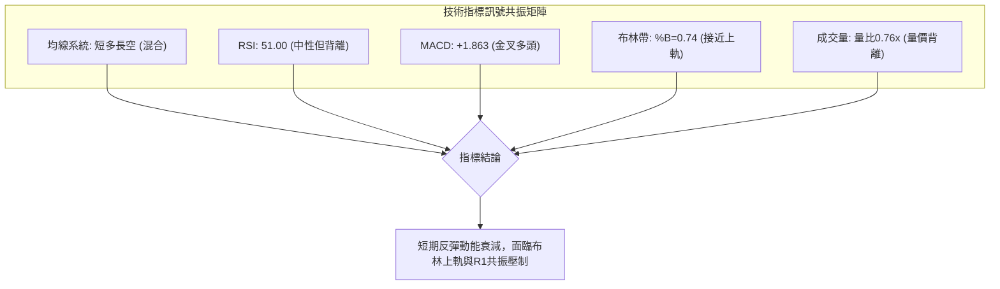

### 📈 移動平均線排列分析

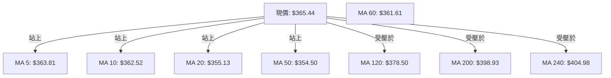

| 均線名稱 | 當前價格 | 與現價差距 | 趨勢狀態 | 解讀與角色 |
|----------|----------|------------|----------|------------|
| **MA 5** | $363.81 | +0.45% | ▲ 向上 | 短線極限超短支撐，守穩代表超短線未轉弱 |
| **MA 10** | $362.52 | +0.80% | ▲ 向上 | 5日與10日呈多頭微幅發散 |
| **MA 20** | $355.13 | +2.90% | ▲ 向上 | 月線支撐，布林通道中軌，短線多空生命線 |
| **MA 50** | $354.50 | +3.09% | ▲ 向上 | 季線位置，與 MA20 形成黃金交叉糾結向上 |
| **MA 60** | $361.61 | +1.06% | ▲ 向上 | 價格由下向上穿過，短中期趨勢修復 |
| **MA 120**| $378.50 | -3.45% | ▼ 向下 | 半年線向下壓制，處於布林上軌外圍 |
| **MA 200**| $398.93 | -8.39% | ▼ 向下 | 年線主要熊市阻力，尚未化解長期空頭架構 |
| **MA 240**| $404.98 | -9.76% | ▼ 向下 | 長期扣抵高位，下傾角度仍大 |

### 📉 RSI(14) 分析與背離判斷

* **當前 RSI(14) 數值**：**51.00**
* **進度條狀態**：
  `超賣 [░░░░░░░░░░] 30 ──── [█████░░░░░] 51.00 ──── 70 [░░░░░░░░░░] 超買`

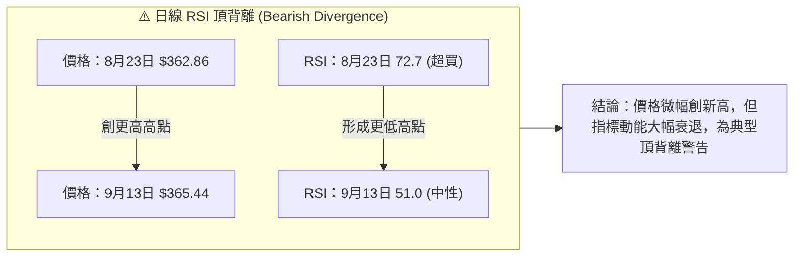

> **背離結論**：
> 數據中已明確標註 `⚠️ 頂背離 (Bearish Divergence)`。8月23日股價在 $362.86 時週線 RSI 達到 72.7，而9月13日股價推升至 $365.44 時，RSI 僅錄得 51.00。動能與價格發生實質頂背離，暗示此處買盤跟進無力，短線極易引發向 MA20 ($355.13) 甚至 S1 ($337.24) 的技術性拉回修正。

### 📊 MACD(12/26/9) 訊號解讀

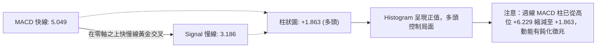

* **MACD 快線**：5.049
* **MACD 訊號線**：3.186
* **MACD 柱狀體**：+1.863 🟢 看多（數值大於0）
* **深層分析**：雖然日線 MACD 仍維持多頭排列，但對照近20週歷史數據，MACD Histogram 自 2026-08-23 的峰值 +6.229 明顯逐週萎縮（+6.229 → +3.586 → +2.926 → +1.863）。這表明中期反彈動能正在衰退，多頭能量釋放接近尾聲。

### 📦 布林通道分析

```
TSLA 布林通道 (20, 2) 結構圖
────────────────────────────────────────────────────────────────
$376.86 ┬────────────────────────────────────────── 布林上軌 (阻力帶)
        │
$365.44 ┼─────────────────────────● 現價 (BB %B = 0.74，位於中上軌區間)
        │
$355.13 ┴────────────────────────────────────────── 布林中軌 (MA20 生命線)
        │
$333.40 ┴────────────────────────────────────────── 布林下軌 (超賣支撐區)
────────────────────────────────────────────────────────────────
```

* **布林上軌**：$376.86
* **布林中軌 (MA20)**：$355.13
* **布林下軌**：$333.40
* **帶寬狀態與 %B 分析**：%B 為 **0.74**，顯示價格落在中軌與上軌之間且偏向上軌（74% 分位）。由於 ADX 僅為 23.12（小於25），通道並未出現開口單邊噴出擴張的特徵，因此觸及上軌附近（$376.86）反而容易引發均值回歸賣壓，回踩中軌 $355.13。

### 💹 成交量分析（量價配合度）

* **最新日成交量**：30,091,300 股
* **20日平均成交量**：39,539,100 股
* **50日平均成交量**：39,241,260 股
* **量比**：**0.76x**（呈現明顯縮量狀態）
* **OBV 趨勢**：`OBV > MA` 🟢（累計能量線仍高於其移動平均線，顯示中期籌碼並未大舉出逃）

> **量價配合結論**：
> 股價近期反彈逼近 R1 ($366.50)，然而日成交量僅 30.09M，量比降至 0.76x，呈現**「價漲量縮」**的量價背離格局。雖然 OBV 仍在 MA 之上支持整體反彈架構，但缺乏主動性攻擊量能意味著難以一舉衝破 R1 與布林上軌形成的重壓區。

---

## 6. 動能與波動率

### ⚡ 動能評估四象限

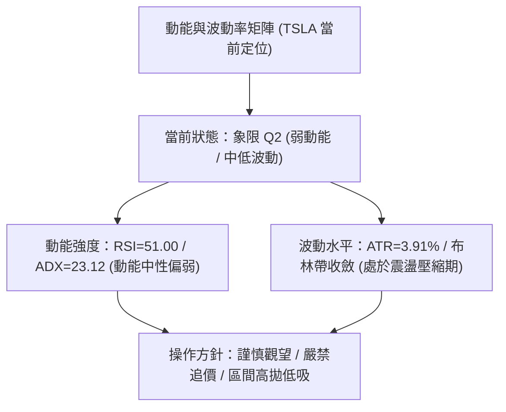

| 象限標籤 | 動能強度 | 波動率水準 | TSLA 定位判斷 | 交易應對邏輯 |
|----------|----------|------------|---------------|--------------|
| **Q1 (最佳爆發)** | 強 (ADX>30) | 低 (ATR<3%) | ❌ 未落入 | 趨勢初升段，全力順勢加碼 |
| **Q2 (震盪收斂)** | **弱 (ADX<25)** | **中低 (ATR≈3.9%)** | **✓ 當前狀態** | **箱體擺盪，以布林與支撐阻力為主，觀望或低吸** |
| **Q3 (極度高危)** | 強 (動能擴張) | 高 (ATR>6%) | ❌ 未落入 | 順勢短沖，嚴控止損幅度 |
| **Q4 (鈍化盤跌)** | 弱 (動能不足) | 高 (洗盤劇烈) | ❌ 未落入 | 避免參與，防止雙向被巴 |

### 📊 ATR 波動率分析

* **當前 ATR(14)**：**$14.27**（佔市價比例 **3.91%**）
* **波動度評估**：每日合理波動區間在 ±$14.27 左右。
* **風控止損距離建議**：
  * **超短線交易（1.0 × ATR）**：緩衝距 $14.27（現價 - 1 ATR = $351.17，剛好跌破 MA20 停損）
  * **波段擺盪交易（1.5 × ATR）**：緩衝距 $21.41（現價 - 1.5 ATR = $344.03，位於 S1 之上）
  * **趨勢防守止損（2.0 × ATR）**：緩衝距 $28.54（現價 - 2 ATR = $336.90，緊貼支撐 S1 $337.24）

### 📐 Beta 與市場相關性

* **Beta 係數**：**1.845**
* **分析結論**：TSLA 具備高彈性（高 Beta）特質，其波動幅度為標普500指數的 1.845 倍。在高 Beta 疊加 ADX 處於盤整（23.12）的環境下，大盤若出現輕微震盪，TSLA 往往會放大波動。但同時其空頭回補比率（Short Ratio 2.14、Short % Float 2.1%）處於極低水位，顯示目前沒有軋空動力支撐股價突破阻力。

---

## 7. 多時框架總結

### 📋 時框架評分表

| 時框架 | 趨勢方向 | 動能狀態 | 均線排列 | 形態結構 | 綜合評分 | 操作建議 |
|--------|----------|----------|----------|----------|----------|----------|
| **長期 (月線)** | 🔴 偏空 | 弱 (自高點回調) | 空頭排列 (壓在 MA200 下) | 雙頂回跌後築底 | **35/100** | 逢高減磅，等待突破 MA200 |
| **中期 (週線)** | 🟡 震盪 | 中性 (Histogram 縮窄) | 糾結交叉 (MA20/50拉扯) | 大箱體整理 ($311-$384) | **50/100** | 箱體操作，嚴禁追高 |
| **短期 (日線)** | 🟢 偏多 | 轉弱 (頂背離隱憂) | 短期多頭 (站上 MA5-MA50) | 衝擊 R1 阻力十字星 | **58/100** | 獲利了結，回踩低吸 |

### 🔲 綜合訊號矩陣

```
時框訊號收斂矩陣
┌───────────────┬─────────────────┬─────────────────┬─────────────────┐
│ 維度          │ 短期 (日線)     │ 中期 (週線)     │ 長期 (月線)     │
├───────────────┼─────────────────┼─────────────────┼─────────────────┤
│ 價格位置      │ 站上短期均線    │ 處於區間中值    │ 處於52W中下方   │
│ 動能方向      │ 多頭衰退 (背離) │ 柱體正向縮減    │ 動能不足        │
│ 趨勢強度      │ ADX=23.12 (弱)  │ 無明顯單邊趨勢  │ 熊市反彈修正    │
│ 關鍵價位考驗  │ 測試 R1 $366.50 │ 壓制於 R2 $384  │ 壓制於 R3 $409  │
│ 結論收斂      │ 🔴 短線逢高承壓 │ 🟡 維持箱型震盪 │ 🔴 長期架構偏弱 │
└───────────────┴─────────────────┴─────────────────┴─────────────────┘
```

### ⚖️ 多時框收斂結論

> **依嚴格規則 14 執行收斂判定**：
> 1. **行情性質判定**：當前 **ADX(14) = 23.12 < 25**，市場嚴格判定為**「盤整震盪行情」**，而非單邊趨勢行情。
> 2. **主導規則**：依收斂規則，盤整行情中**「以日線布林通道上下軌 ($333.40 ~ $376.86) 為主要交易區間」**，日線與週線的局部金叉不得解讀為向上主升浪。
> 3. **唯一收斂方向**：**【中性觀望，區間偏空防禦】**。
>    雖然日線均線短期翻多，但面臨日線 RSI 頂背離、量比萎縮至 0.76x、且價格直接迎頭撞擊 R1 ($366.50) 與布林上軌 ($376.86)；在長期均線 MA200 ($398.93) 仍向下扣抵的壓制下，此處絕非買點，向上空間受限，策略必須收斂為：**等待回踩支撐不破低吸，或在阻力區反彈乏力時建立防禦性對沖**。

---

## 8. 交易策略建議

### 🗺️ 策略決策流程圖

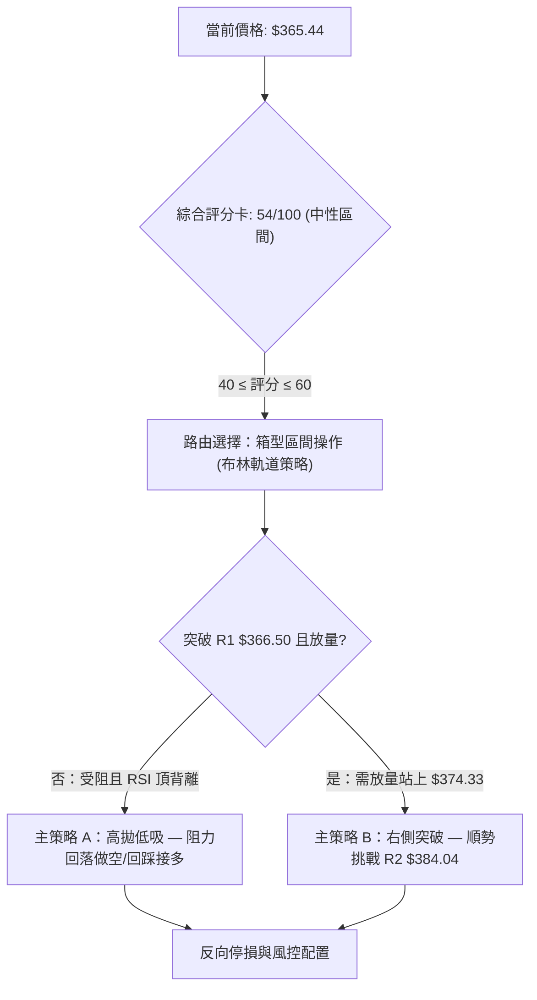

### 🧭 策略路由

* **技術評分卡綜合得分**：**54 / 100**（落在 40–60 之中性區間）
* **當前主策略方向**：**【中性區間擺盪操作（以布林軌道上下軌為界，等待確認信號）】**
* 決策說明：評分未達 60 分多頭閾值，且未低於 40 分極度空頭，禁止單邊重倉追高；當前股價 $365.44 緊貼阻力 R1 $366.50，當前盈虧比對多頭極為不利。

### 🎯 價格情境階梯（Price Scenarios）

所有價位嚴格引用第四章及關鍵數據，計算明確之情境階梯：

| 觸發條件 | 第一目標 | 第二目標 | 後續延伸 | 情境技術含義 |
|----------|----------|----------|----------|--------------|
| **向上放量突破 R1 $366.50** | **$374.33** (Fib 61.8%) | **$384.04** (阻力 R2) | **$409.28** (阻力 R3) | 短線強勢修復，挑戰週線箱頂與 MA200 |
| **現價區間受阻震盪** | **$355.13** (MA20/布林中軌) | **$340.49** (Fib 78.6%) | **$337.24** (支撐 S1) | 典型區間均值回歸，頂背離引發正常消化 |
| **向下跌破支撐 S1 $337.24** | **$333.40** (布林下軌) | **$297.38** (52W 低點 S2) | 數據未偵測更低點 | 中期箱體破位，空頭趨勢重新主導下殺 |

### 📊 情境機率分佈

| 預測情境 | 發生機率 | 主要技術依據 |
|----------|----------|--------------|
| **情境一：受阻回落，區間震盪** | **55%** | ADX 23.12 確認盤整；RSI 出現頂背離；量比僅 0.76x，無量難以穿透密集阻力帶 |
| **情境二：回測支撐後重拾反彈** | **30%** | MACD 仍處於多頭金叉 (+1.863)；MA20 ($355.13) 與 MA50 提供堅實下檔保護 |
| **情境三：直接放量噴出突破 R2** | **15%** | 長期 MA200 ($398.93) 壓制嚴重；上方 61.8% 斐波那契 $374.33 阻力重重 |

### 🟢 主策略詳情（區間操作與短線低吸）

#### 策略 A：區間下軌／支撐回踩低吸（多頭策略，順應中期反彈）
* **進場條件**：股價自現價回踩 MA20 / MA50 支撐區，或下探至 S1 附近出現止跌K線確認
* **進場價格**：**$355.13**（MA20中軌附近，精確數值）
* **目標價 T1**：**$366.50**（阻力位 R1，預期獲利 +3.20%）
* **目標價 T2**：**$384.04**（阻力位 R2，預期獲利 +8.14%）
* **止損價格**：**$337.24**（直接以支撐位 S1 為防守，距離 -5.04%）
* **風險報酬比**：
  * 對 T1：$11.37 / $17.89 = **1 : 0.64**
  * 對 T2：$28.91 / $17.89 = **1 : 1.62**
* **成功機率**：**60%**
* **建議倉位**：**15%**（輕倉參與）

#### 策略 B：阻力位 R1 受阻右側短空（逆勢短線防禦策略）
* **進場條件**：現價 $365.44 向上衝刺 R1 $366.50 失敗，日線收長上影線且跌破 MA5 ($363.81)
* **進場價格**：**$363.81**（跌破 MA5 確認點）
* **目標價 T1**：**$355.13**（布林中軌 MA20，預期回調空間 +2.39%）
* **目標價 T2**：**$337.24**（支撐位 S1，預期回調空間 +7.30%）
* **止損價格**：**$374.33**（斐波那契 61.8% 阻力位，虧損空間 -2.89%）
* **風險報酬比**：
  * 對 T1：$8.68 / $10.52 = **1 : 0.83**
  * 對 T2：$26.57 / $10.52 = **1 : 2.53**
* **成功機率**：**55%**
* **建議倉位**：**10%**（嚴格避險對沖性質）

### 🔴 反向風險觸發點（對沖與風控警報）

* **空頭風險警報（若執行多頭策略）**：
  * 日線收盤價若實體跌破 **$337.24 (S1)**，視為箱體結構徹底破位，必須無條件市價全數止損離場，下檔風險將直指 52W 低點 **$297.38**。
* **多頭突破警報（若執行防禦空頭）**：
  * 日成交量若放大至 50M 以上（超過50日均量 39.24M 且量比 > 1.3x），並強勢突破 **$374.33 (Fib 61.8%)**，空頭必須立即停損，此時股價將展開向 R2 ($384.04) 與 MA200 ($398.93) 的強勢反撲。

### ⭐ 整體訊號強度評星

```
╔══════════════════════════════════════════════════════════════════╗
║ 做多訊號強度：★★☆☆☆  (2.5/5星) — 受制於頂背離與 R1 壓制         ║
║ 做空訊號強度：★★★☆☆  (3.0/5星) — 指標超買衰退，盈虧比具防禦價值 ║
║ 整體可信度：  ★★★☆☆  (3.5/5星) — ADX=23.12，箱型整理可信度高   ║
╚══════════════════════════════════════════════════════════════════╝
```

---

## 9. 風險提示與監控

### ✅ 關鍵監控指標 Checklist

```
╔══════════════════════════════════════════════════════════════════╗
║                  每日交易監控清單 (Checklist)                    ║
╠══════════════════════════════════════════════════════════════════╣
║ [ ] 價格突破監控：收盤價是否站上 R1 ($366.50) 或 跌破 MA20 ($355.13) ║
║ [ ] 成交量比驗證：日成交量是否突破 39.54M（量比是否由 0.76x 轉為 >1.0x）║
║ [ ] RSI 背離化解：日線 RSI 是否能重新站上 60 並突破前期高點 72.7   ║
║ [ ] MACD 柱狀變化：柱狀體是否由正轉負（+1.863 跌破 0 軸死亡交叉）    ║
║ [ ] ADX 趨勢甦醒：ADX 數值是否由 23.12 向上穿越 25.0 門檻          ║
║ [ ] 極限防守位置：支撐 S1 ($337.24) 與 52W 低點 ($297.38) 之防線維護║
╚══════════════════════════════════════════════════════════════════╝
```

### ⚠️ 風險場景分析

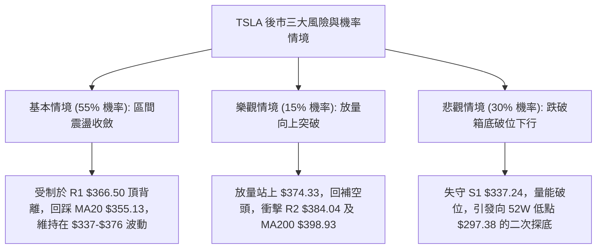

### 🛡️ 風險管理重要提醒

1. **嚴控單筆交易虧損**：依 ATR = $14.27 計算，單日波動幅度約 3.91%，任何進場部位之單筆最大本金虧損必須控制在總投資組合的 **1.0% ~ 1.5%** 以內。
2. **拒絕高位追價**：現價 $365.44 距離阻力 R1 $366.50 僅 +0.29%，在量縮且 RSI 頂背離的情況下，在現價追多屬於高風險低勝率行為，切忌追買。
3. **倉位總量上限**：在 ADX < 25 的盤整週期內，TSLA 的總配置倉位不宜超過總資金的 **25%**，保持 75% 以上的現金流動性以應對突破時的右側順勢加碼。

---

## 📋 報告總結

```
╔══════════════════════════════════════════════════════════════════╗
║                 TSLA 技術分析報告總結看板                        ║
╠══════════════════════════════════════════════════════════════════╣
║ 報告日期：2026-09-12                                             ║
║ 當前價格：$365.44  (52W 區間分位: 33.8%)                         ║
║ 分析評級：⚖️ 中性盤整 (評分 54/100) — 區間高拋低吸，嚴防背離回調 ║
╠══════════════════════════════════════════════════════════════════╣
║ 關鍵技術結論：                                                   ║
║ ├─ 長期趨勢：🔴 偏空，壓制在 MA200 ($398.93) 與 MA240 之下       ║
║ ├─ 中期趨勢：🟡 震盪，位於 $337.24 (S1) ~ $384.04 (R2) 箱體內    ║
║ ├─ 短期趨勢：🟢 偏多但動能衰退，日線 RSI 頂背離，量比萎縮至 0.76x  ║
║ ├─ 關鍵支撐：S1: $337.24 ｜ 強支撐 S2: $297.38                   ║
║ ├─ 關鍵阻力：R1: $366.50 ｜ 強阻力 R2: $384.04 ｜ 核心 R3: $409.28║
║ └─ 分析師目標價：均價 $390.09 (低標 $125.00 / 高標 $600.00)     ║
╠══════════════════════════════════════════════════════════════════╣
║ 最優操作策略組合：                                               ║
║ 1. 🥇 最佳機會：等待回踩布林中軌/MA20 ($355.13) 止跌建立短多，防守 S1 ║
║ 2. 🥈 次選機會：測試 R1 ($366.50) 滯漲跌破 MA5 ($363.81) 時建立對沖空單║
║ 3. 🥉 保守選擇：完全空倉觀望，靜待 ADX 突破 25 且價格突破箱體後順勢交易 ║
╚══════════════════════════════════════════════════════════════════╝
```

---

> ⚠️ **免責聲明**：本報告為 AI 自動生成之技術分析，所有數據及估算均基於所提供的歷史價格資訊。本報告**僅供研究與學術參考**，**不構成任何投資建議**。投資有風險，入市需謹慎。

---

*報告生成時間：2026-09-12 ｜ 數據來源：Yahoo Finance ｜ 分析框架：多時框技術分析體系*