# TSLA 技術分析報告

> **報告日期**：2026-09-15 ｜ **語言**：繁體中文 ｜ **數據來源**：Yahoo Finance ｜ **當前價格**：$356.58

---

## 目錄

| 章節 | 內容 |
|------|------|
| [1. 技術面概覽](#1-技術面概覽) | 訊號儀表板、核心指標、評分卡 |
| [2. 趨勢分析](#2-趨勢分析) | 多時框趨勢、長中短期走勢 |
| [3. 圖表形態分析](#3-圖表形態分析) | 形態識別、K線組合、目標價 |
| [4. 支撐與阻力](#4-支撐與阻力) | 關鍵價位、斐波那契回調 |
| [5. 技術指標深度解讀](#5-技術指標深度解讀) | MA/RSI/MACD/布林/成交量 |
| [6. 動能與波動率](#6-動能與波動率) | 動能評估、ATR、Beta |
| [7. 多時框架總結](#7-多時框架總結) | 時框架評分矩陣 |
| [8. 交易策略建議](#8-交易策略建議) | 多空策略、風險報酬比 |
| [9. 風險提示與監控](#9-風險提示與監控) | 監控指標、風險場景 |
| [10. 報告總結](#10-報告總結) | 總體評級與精華摘要 |

---

## 1. 技術面概覽

### 🎯 技術訊號儀表板

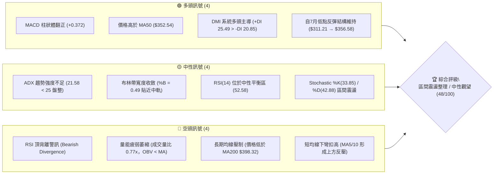

---

### 📊 核心指標速覽表

| 指標類別 | 指標名稱 | 當前數值 | 訊號 | 專業解讀 |
|----------|----------|----------|:----:|----------|
| **價格結構** | 現行收盤價 | $356.58 | 🟡 | 處於52週區間29.4%分位，自底部反彈但動能放緩 |
| **均線系統** | 20日均線 (MA20) | $356.83 | 🟡 | 價格微幅低於 MA20 (-0.07%)，均線走平，呈中性拉鋸 |
| **均線系統** | 50日均線 (MA50) | $352.54 | 🟢 | 價格位於 MA50 上方 (+1.15%)，提供中期下檔動態支撐 |
| **均線系統** | 200日均線 (MA200)| $398.32 | 🔴 | 價格顯著低於 MA200 (-10.48%)，長期牛熊分界線構成巨大壓制 |
| **趨勢強度** | ADX (14) | 21.58 | 🟡 | ADX < 25，表明當前無強烈單邊趨勢，屬於震盪盤整市況 |
| **方向指標** | +DI / -DI | 25.49 / 20.85 | 🟢 | +DI 高於 -DI，多頭動能略佔上風但差距未擴大 |
| **動能擺盪** | RSI (14) | 52.58 | 🔴 | 數值處於中性區，但日線與週線偵測到頂背離，上攻力道衰減 |
| **趨勢動能** | MACD (12,26,9) | 3.925 / 3.553 | 🟢 | MACD線高於訊號線，柱狀體為 +0.372，微弱偏多擴張 |
| **隨機指標** | KD (Stoch 14) | %K 33.85 / %D 42.88 | 🟡 | 位於弱勢中性區，無超買超賣極端，短線方向混沌 |
| **通道指標** | 布林通道 (%B) | 0.49 (帶寬 $39) | 🟡 | 價格精確貼合中軌 ($356.83)，通道收縮暗示即將面臨變盤 |
| **量能系統** | 成交量比 / OBV | 0.77x / OBV < MA | 🔴 | 量能未能放大配合價格回升，能量潮指標落後，量價背離 |
| **波動風險** | ATR (14) | $13.99 (3.92%) | 🟡 | 每日平均波動幅度約 $14，波動率處於近一年中等偏低水準 |

---

### 🏆 技術評分卡

```
╔══════════════════════════════════════════════════════════════╗
║               技術評分卡 — TSLA (2026-09-15)                ║
╠══════════════════════════════════════════════════════════════╣
║ 趨勢強度 (Trend)     ███████░░░░░░░░░░░░░  35/100 🔴 弱勢震盪 ║
║ 動能指標 (Momentum)  ██████████░░░░░░░░░░  50/100 🟡 中性背離 ║
║ 支撐穩定度 (Support) ████████████░░░░░░░░  60/100 🟢 S1具承接 ║
║ 成交量配合 (Volume)  ███████░░░░░░░░░░░░░  35/100 🔴 量能萎縮 ║
║ 形態完整度 (Pattern) ██████████░░░░░░░░░░  50/100 🟡 區間收斂 ║
║ 均線排列 (Moving Avg)██████████░░░░░░░░░░  50/100 🟡 糾結混合 ║
╠══════════════════════════════════════════════════════════════╣
║ 綜合評分             ██████████░░░░░░░░░░  48/100 🟡 中性盤整 ║
║ 結論評級：⚖️ 區間盤整 (Neutral Range-Bound) / 嚴守布林邊界   ║
╚══════════════════════════════════════════════════════════════╝
```

---

## 2. 趨勢分析

### 🌐 多時框趨勢分析

依據分析原則，在 ADX (21.58) < 25 的盤整環境下，市場缺乏強大單邊動能，各級別趨勢呈現互相掣肘的特徵：

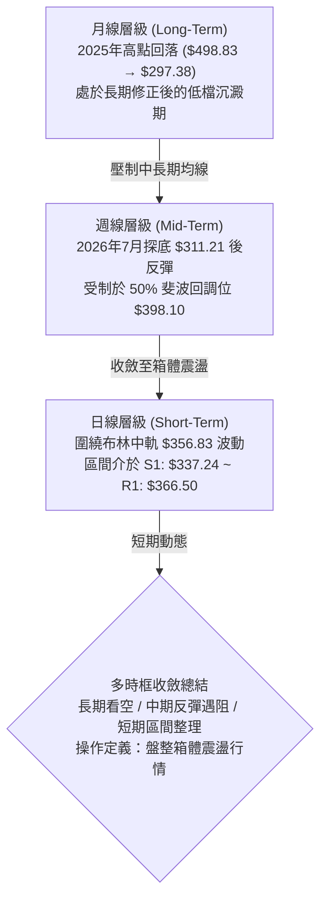

---

### 📈 長期趨勢 — 過去12個月走勢圖（2025-10 至 2026-09）

```
TSLA 過去12個月月線收盤走勢圖 ($)
$460 ┤   ●(25-10: $456.56)
$440 ┤       ●     ●
$420 ┤                 ●                 ●     ●
$400 ┤                     ●
$380 ┤                         ●     ●
$360 ┤                                           ●←現價 $356.58
$340 ┤                                       ●
$320 ┤                                             
$300 ┤                                   ●(26-07: $311.21 低點)
     └─┬─────┬─────┬─────┬─────┬─────┬─────┬─────┬─────┬─────┬─────┬─────┤
     10月   11月  12月  01月  02月  03月  04月  05月  06月  07月  08月  09月
    (2025)                                                  (2026)
```

#### 走勢特徵分析表格

| 階段區間 | 起止月份 | 價格區間 | 累積漲跌幅 | 主要技術特徵與量價結構 |
|:---|:---|:---|:---:|:---|
| **頭部構築期** | 2025-10 ~ 2026-01 | $456.56 → $430.41 | -5.73% | 於 $450 上方高檔震盪，未能有效刷新歷史高點，高位籌碼鬆動 |
| **主跌推動浪** | 2026-01 ~ 2026-03 | $430.41 → $371.75 | -13.63% | 連續三個月收陰，跌破短期上升趨勢線，空方主導市場節奏 |
| **中繼反彈期** | 2026-03 ~ 2026-05 | $371.75 → $435.79 | +17.23% | 技術性跌深反彈，5月拉升至 $435.79，但未破前高，形成次級高點 |
| **次級破位浪** | 2026-05 ~ 2026-07 | $435.79 → $311.21 | -28.59% | 出現恐慌性重挫，7月跌至 $311.21（逼近52週低點 $297.38）觸發超賣 |
| **基底修復期** | 2026-07 ~ 2026-09 | $311.21 → $356.58 | +14.58% | 跌深築底回升，重返 $350 軸線，但量能持續萎縮，轉為狹幅橫盤 |

---

### 📊 中期趨勢（週線分析）

從近 20 週的收盤價與動能變化觀察：
- **築底回升驗證**：7 月下旬於 $313.03 及 $311.21 形成雙重低點結構，隨後 RSI 從 15.7 極端超賣區強烈修復至 72.7（8月23日當週收盤 $362.86）。
- **遇阻回落跡象**：9 月中旬價格上探 $365.44，未能克服上方壓力簇，最新一週回落至 $356.58，RSI 降至 52.6，週 MACD 柱狀體由 +6.229 顯著衰退至 +0.372，動能正在急速遞減。

```
近期週線壓力與支撐階梯圖 ($)
$384.04 ──────────────────────────────────────── 強阻力 R2 (反彈阻力)
                     ▲
$366.50 ───────┬─────┼────────────────────────── 波段阻力 R1 / 週線反彈高點
               │     ▼ 
$356.58 ═══════╪═══════════════════════════════ 當前現價 (徘徊於中軸)
               │     ▲
$337.24 ───────┴─────┼────────────────────────── 近期支撐 S1 (布林下軌共振)
                     ▼
$297.38 ──────────────────────────────────────── 52週極限底點 S2
```

---

### ⚡ 趨勢強度評估（ADX 解讀）

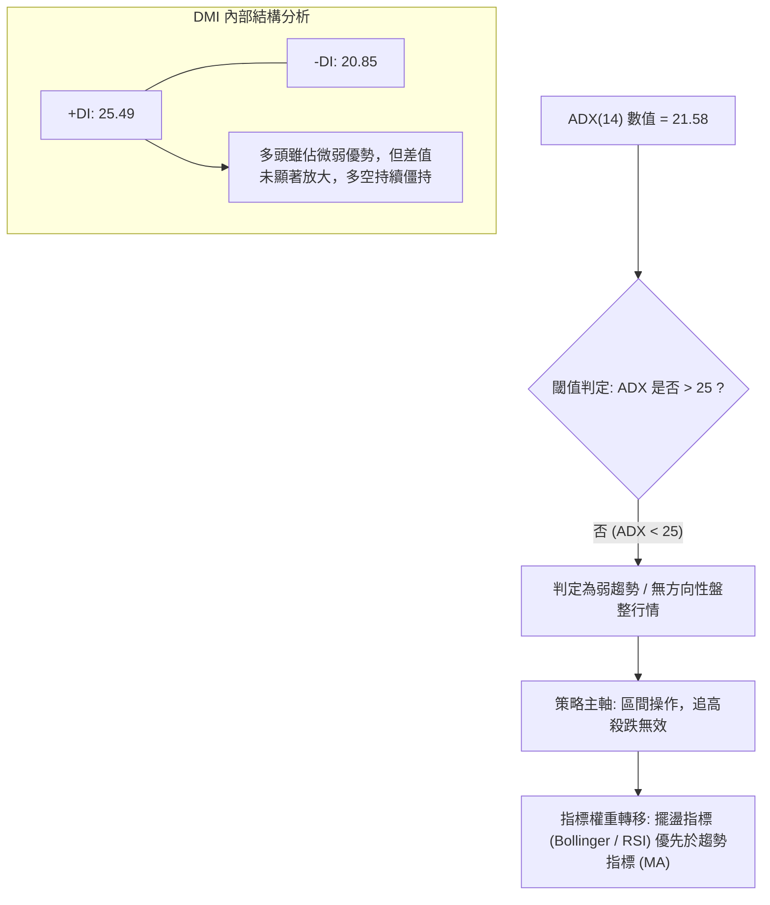

#### ADX 趨勢強度對照

| ADX 區間 | 趨勢強度定義 | TSLA 當前狀態 | 交易策略指導原則 |
|:---:|:---:|:---:|:---|
| **0 – 20** | 極弱 / 混沌無趨勢 | ── | 嚴禁趨勢追單，採極短線網格交易 |
| **20 – 25** | **弱趨勢 / 盤整震盪** | **✔ 當前位置 (21.58)** | **箱體區間交易，以布林軌道為界，突破未確認前不追單** |
| **25 – 40** | 中度至強趨勢確立 | ── | 均線系統引導，順勢進場持有 |
| **40 – 60** | 強烈單邊單純暴衝 | ── | 動能策略，嚴格依移動止盈跟隨 |
| **> 60** | 極度過熱 / 即將反轉 | ── | 逆向減倉或保護性對沖 |

---

## 3. 圖表形態分析

### 🔍 形態識別系統

依據數據紀律與形態信心度規則，當前價格運動中識別出以下兩個具備統計意義的形態結構：

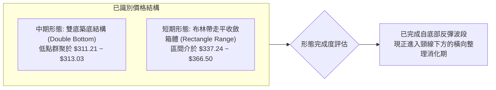

#### 形態信心度與目標價評估表

| 形態名稱 | 信心度 | 判斷依據（數據引用） | 形態完成度 | 頸線位置 | 形態高度 | 目標價（附嚴格計算式） |
|:---|:---:|:---|:---:|:---:|:---:|:---|
| **中期雙底 (Double Bottom)** | **70%** | 2026-07-26 低點 $313.03 與 2026-08-02 低點 $311.21 形成雙低測試不破（接近 S2 $297.38 支撐） | 85% | $366.50 (波段高點 R1) | $55.29 ($366.50 - $311.21) | **形態理論目標** = $366.50 + $55.29 = **$421.79**<br/>*(精確共振 38.2% 斐波位 $421.88)* |
| **短期矩形整理 (Rectangle)** | **65%** | 價格在布林下軌/S1 ($337.24) 與波段高點聚類 R1 ($366.50) 之間進行收斂震盪 | 90% | 上邊界 $366.50 / 下邊界 $337.24 | $29.26 ($366.50 - $337.24) | **向上突破目標** = $366.50 + $29.26 = **$395.76**<br/>*(逼近 50% 斐波位 $398.10 及 MA200)* |
| **頭肩底結構 (Inverted H&S)** | **30%** | 左肩 $346、頭部 $311、右肩未成形 | 25% | 數據不足 | ── | **訊號不足，不予採納，僅做指標型解讀** |

---

### 🕯️ 重要 K 線形態分析（近5個月）

| 月份 | 收盤價 | K 線實體與影線特徵 | 技術形態解讀 | 多空訊號 |
|:---:|:---:|:---|:---|:---:|
| **2026-05** | $435.79 | 長陽實體突破前期整理區，上影線觸及 $450 壓力 | 多頭強勢衝刺，但逼近前高密集成交區遭遇出貨阻力 | 🟢 看多 |
| **2026-06** | $420.60 | 高位孕線（Inside Bar），實體縮小 | 漲勢停滯，多空動能衰竭，為轉折前兆 | 🟡 警告 |
| **2026-07** | $311.21 | 巨幅長陰貫穿多條均線，月跌幅達 -26.0% | 恐慌拋售盤湧現，摜壓至 52 週低點附近，空頭極致釋放 | 🔴 極空 |
| **2026-08** | $367.95 | 下影長陽吞噬，單月強彈 +18.2% | 典型「破底翻」長紅反彈，確認 $311 為中期具備支撐的波段底 | 🟢 看多 |
| **2026-09** | $356.58 | 小陰字星十字線，成交量顯著萎縮 | 反彈後遇壓停頓，於 $360 關卡進行籌碼沉澱，多空進入平衡 | 🟡 中性 |

---

### 📉 ASCII 走勢形態示意圖

```
TSLA 中期雙底與當前收斂示意圖
$384.04 ┤                                             [R2 阻力]
$366.50 ┤         頸線壓力 (R1) ──────────┐            [突破關鍵點]
$356.58 ┤                                 ●← 現價 ($356.58，橫盤拉鋸)
$340.00 ┤                   反彈高點     / \
$337.24 ┤                  ╭────╮       /   \         [S1 / 布林下軌]
$320.00 ┤        左底      │    │      /     \
$311.21 ┤        ●─────────╯    ╰──────●  右底 (2026-07/08 底點築成)
$297.38 ┴───────────────────────────────────────────── [S2 / 52W 低點]
```

---

### 🎯 形態目標價計算

若短期震盪後向上確認突破頸線 R1 ($366.50)：
1. **中期雙底突破量度幅度**：
   $$\text{形態高度} = \text{頸線}(R1) - \text{雙底最低點}(2026\text{-}08\text{-}02) = 366.50 - 311.21 = 55.29$$
   $$\text{量度目標價} = \text{頸線}(R1) + \text{形態高度} = 366.50 + 55.29 = 421.79$$
   *(該點位與 52 週區間之 38.2% 斐波那契回調位 $421.88 幾乎重疊，具備強烈的幾何共振效應)*

2. **短線箱體向下破位量度幅度（若 S1 $337.24 失守）**：
   $$\text{破位下跌目標} = 337.24 - (366.50 - 337.24) = 337.24 - 29.26 = 307.98$$
   *(直逼 52 週低點 S2 $297.38 之防守區域)*

---

## 4. 支撐與阻力

### 🗺️ 關鍵價位分布圖

```
TSLA 價位結構分布圖 (由 OHLCV 與斐波那契嚴格計算)
══════════════════════════════════════════════════════════════════════════
$498.83 ║████████████████████████████████████████║ 52W 最高點 / 斐波 0.0%
$451.29 ║████████████████████████                ║ 斐波那契 23.6% 回調位
$421.88 ║████████████████████                    ║ 斐波 38.2% / 雙底量度目標 $421.79
$409.28 ║████████████████████████████████        ║ 波段強阻力 R3 (+14.78%)
$398.32 ║████████████████████                    ║ MA200 牛熊線 / 斐波 50.0% ($398.10)
$384.04 ║████████████████                        ║ 波段阻力 R2 (+7.70%)
$376.22 ║████████████                            ║ 布林通道上軌
$366.50 ║████████████████████████                ║ 關鍵頸線阻力 R1 (+2.78%)
$356.58 ╠════════════════════════════════════════╣ ◄◄ 當前收盤現價
$352.54 ║▓▓▓▓▓▓▓▓                                ║ MA50 動態均線支撐
$340.49 ║▓▓▓▓▓▓▓▓▓▓▓▓▓▓▓▓                        ║ 斐波那契 78.6% 回調位
$337.24 ║▓▓▓▓▓▓▓▓▓▓▓▓▓▓▓▓▓▓▓▓                    ║ 波段關鍵支撐 S1 / 布林下軌 (-5.42%)
$297.38 ║████████████████████████████████████████║ 52W 最低點 / 強支撐 S2 (-16.60%)
══════════════════════════════════════════════════════════════════════════
```

---

### 🚧 阻力位分析表

| 阻力級別 | 精確價位 | 距現價幅動 | 形成原因與籌碼屬性 | 突破難度 | 戰略重要性 |
|:---|:---:|:---:|:---|:---:|:---:|
| **波段阻力 R1** | **$366.50** | +2.78% | 近一年波段高點聚類、雙底結構之頸線位置、上週高點反壓 | 🟡 中等 | ★★★★☆<br/>短線多空分水嶺 |
| **波段阻力 R2** | **$384.04** | +7.70% | 2026年4月波段反彈高點聚類、MA120 ($378.09) 上方籌碼套牢區 | 🔴 偏高 | ★★★☆☆<br/>反彈第一擴展目標 |
| **強阻力 R3** | **$409.28** | +14.78% | 2026年6月多次衝高受阻之波段高點聚類、逼近 MA200 及 50% 斐波位 | 🔴 極高 | ★★★★★<br/>中期牛熊重定界線 |

---

### 🛡️ 支撐位分析表

| 支撐級別 | 精確價位 | 距現價幅動 | 形成原因與籌碼屬性 | 守住機率 | 戰略重要性 |
|:---|:---:|:---:|:---|:---:|:---:|
| **波段支撐 S1** | **$337.24** | -5.42% | 近一年波段低點聚類、精確共振布林通道下軌 ($337.43) 及 78.6% 斐波位 ($340.49) | 70% | ★★★★☆<br/>多頭防守第一道陣線 |
| **強支撐 S2** | **$297.38** | -16.60% | 52 週最低點 (52W Low)、斐波那契 100% 重合位、年度絕對價值底 | 90% | ★★★★★<br/>中期生命線，不容有失 |

---

### 📐 斐波那契回調位分析（52週區間：$297.38 → $498.83）

當前價格 **$356.58** 位於 **61.8% 回調位 ($374.33)** 與 **78.6% 回調位 ($340.49)** 之間：

| 回調比例 | 精確價位 | 相對現價位置 | 技術意義深度解讀 |
|:---:|:---:|:---:|:---|
| **0.0%** | **$498.83** | +39.89% | 52 週高點，長期上升浪極限目標 |
| **23.6%** | **$451.29** | +26.56% | 2025年第四季高檔震盪箱底，極強解套賣壓層 |
| **38.2%** | **$421.88** | +18.31% | 中期黃金分割強壓力位，與雙底量度目標 ($421.79) 完美共振 |
| **50.0%** | **$398.10** | +11.64% | 多空強弱分水嶺，與 MA200 ($398.32) 形成雙重重壓共振點 |
| **61.8%** | **$374.33** | +4.98% | 黃金回調反彈關鍵位，與布林上軌 ($376.22) 重合，壓制短線空間 |
| **78.6%** | **$340.49** | -4.51% | 深幅回調防守位，緊鄰 S1 支撐 ($337.24)，為當前震盪箱體下緣 |
| **100.0%** | **$297.38** | -16.60% | 52 週低點，回撤基石，跌破將引發嚴重技術面恐慌 |

**現位解讀**：現價落於深幅回調的 $340.49 ~ $374.33 區間內。在未放量站穩 61.8% ($374.33) 之前，整個走勢僅能被定義為超跌後的「修復性弱勢反彈」，尚未具備展開反轉大牛市的結構。

---

## 5. 技術指標深度解讀

### 🎛️ 指標訊號總覽

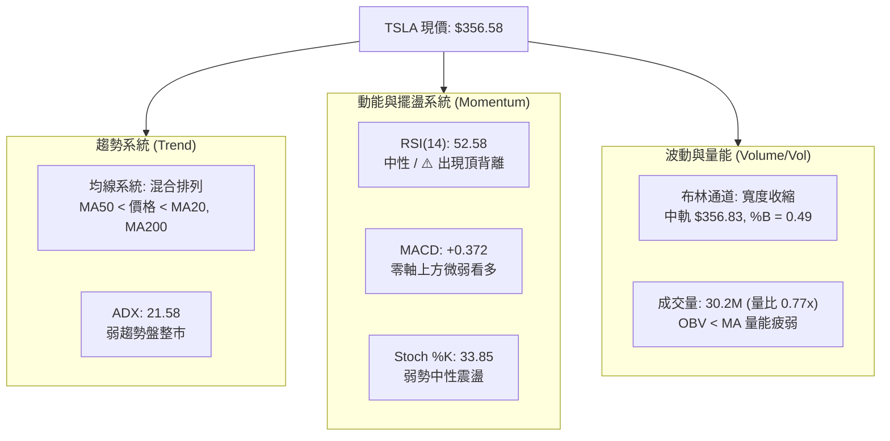

---

### 📈 移動平均線排列分析

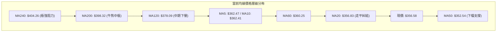

#### 均線架構剖析
1. **中短期均線糾結**：MA5 ($362.47) 與 MA10 ($362.41) 呈微幅下彎走勢，對現價形成短線壓制；MA20 ($356.83) 與現價幾乎重合（偏離度僅 -0.07%），斜率走平，是標準的無趨勢震盪表徵。
2. **中期多頭支撐**：MA50 ($352.54) 位於現價下方 +1.15%，是自 7 月底反彈以來最重要的多頭防守均線。
3. **長期空頭壓制**：MA120 ($378.09)、MA200 ($398.32)、MA240 ($404.26) 呈空頭排列向下發散，顯示 TSLA 中長期籌碼依然沉重，反彈若觸及該均線束將遭遇解套賣壓。

---

### 📉 RSI(14) 動能與背離分析

```
RSI(14) 當前水位刻度
0           30                 50   52.58           70          100
├───────────┼──────────────────┼─────●──────────────┼───────────┤
  超賣區       弱勢區            平衡中軸  當前位置      強勢超買區
[▓▓▓▓▓▓▓▓▓▓▓▓▓▓▓▓▓▓▓▓▓▓▓▓▓▓▓▓▓▓░░░░░░░░░░░░░░░░░░░░░░░] 52.58%
```

- **數值解讀**：RSI(14) 當前值為 **52.58**，處於中性平衡狀態，既無超賣亦無過熱。
- **背離診斷 (⚠️ 頂背離確認)**：
  - **價格走勢**：TSLA 週線收盤價在 2026-08-23 為 $362.86，隨後在 2026-09-13 創下反彈新高收盤 **$365.44**。
  - **RSI 走勢**：對應的週線 RSI 卻從 2026-08-23 的 **72.7** 大幅回落至 2026-09-13 的 **51.0**（最新為 52.6）。
  - **結論**：價格創反彈新高而動能指標未能同步創高，形成典型的**頂背離（Bearish Divergence）**。這暗示自 $311 以來的反彈推進動能已顯著耗盡，短線上攻空間將受到壓制，誘多風險加大。

---

### 📊 MACD(12, 26, 9) 訊號解讀

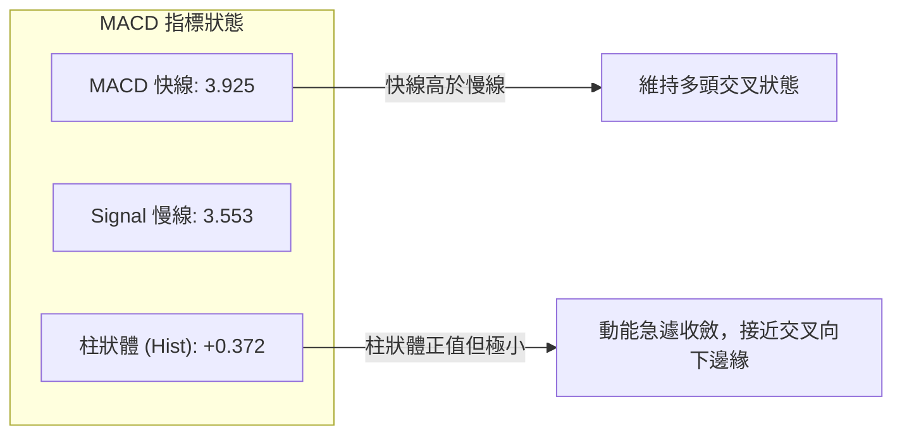

- **現況解讀**：MACD 快線 (3.925) 仍位於訊號線 (3.553) 上方，維持名義上的黃金交叉。
- **危險訊號**：從近20週趨勢看，MACD 柱狀體曾於 2026-08-23 達到 +6.229 的高峰，隨後連續數週萎縮（+3.586 → +2.926 → +1.863 → 當前 +0.372）。柱狀圖呈現斷崖式遞減，表明多頭動能正在快速蒸發，即將面臨零軸附近的「死叉」威脅。

---

### 📦 布林通道分析 (Bollinger Bands, 20, 2)

```
布林通道結構示意圖
$376.22 ┬────────────────────────────────────────── BB 上軌 (阻力邊界)
        │
$356.83 ┼──────────────────●─────────────────────── BB 中軌 (MA20) / 現價 $356.58
        │                 (現價貼合中軌 %B = 0.49)
$337.43 ┴────────────────────────────────────────── BB 下軌 (支撐邊界)
```

- **通道參數**：上軌 $376.22 ｜ 中軌 $356.83 ｜ 下軌 $337.43 ｜ 帶寬 $38.79
- **%B 指標分析**：%B 為 **0.49**，幾乎精確座落於中軌 (0.50)，表明當前多空力量達成完全均勢。
- **通道形態特徵**：通道口呈現顯著向內收斂（Squeeze 形態），波動率大幅壓縮。依據布林通道波動理論，長期的狹幅橫盤壓縮往往是爆發性單邊行情的前奏，下軌 $337.43 與 S1 ($337.24) 形成共振支撐，上軌 $376.22 與 61.8% 斐波位 ($374.33) 形成共振壓力。

---

### 💹 成交量分析（量價配合度與 OBV）

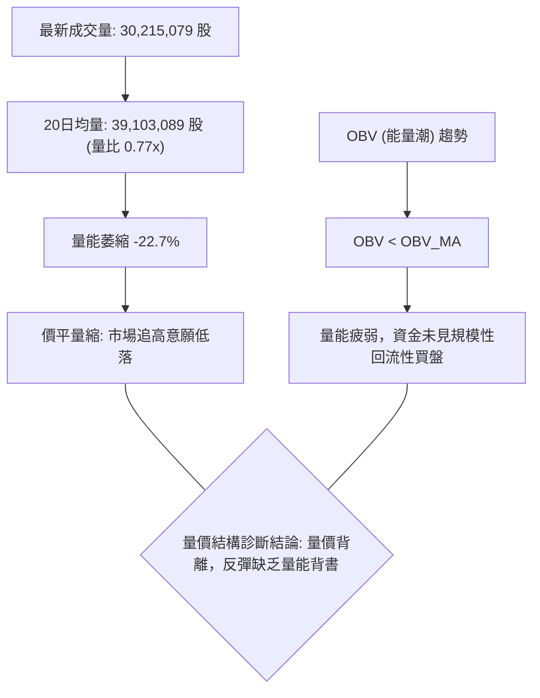

- **量價關係**：自 8 月初反彈以來，週成交量從 2.75 億股大幅下降至最新一週的 6,269 萬股。價漲量縮是極為明確的動能消耗訊號。
- **OBV 能量潮**：OBV 持續運行於其均線下方，說明當前持有者惜售但場外增量資金缺乏進場興趣，此種「無量抗跌」極易在突發利空打擊下引發無支撐回跌。

---

## 6. 動能與波動率

### ⚡ 動能評估四象限

將 TSLA 當前狀態置於「動能強度」與「波動率水平」進行座標定位：

| 象限 | 動能維度 | 波動維度 | TSLA 當前狀態 | 交易環境特徵與因應措施 |
|:---:|:---:|:---:|:---:|:---|
| **第一象限 (Q1)** | 強動能 (>55) | 低波動 (<3%) | ── | 穩健單邊趨勢，最佳加碼持有期 |
| **第二象限 (Q2)** | **弱動能 (45-55)** | **低/中波動 (3-4%)** | **✔ TSLA 座落區間** | **區間沉寂期，嚴禁趨勢追單，採布林邊界高拋低吸** |
| **第三象限 (Q3)** | 強動能 (>55) | 高波動 (>5%) | ── | 狂暴推升浪，高風險高收益，須寬幅止損 |
| **第四象限 (Q4)** | 弱動能 (<45) | 高波動 (>5%) | ── | 恐慌破位或洗盤，市場失序，應絕對空倉觀望 |

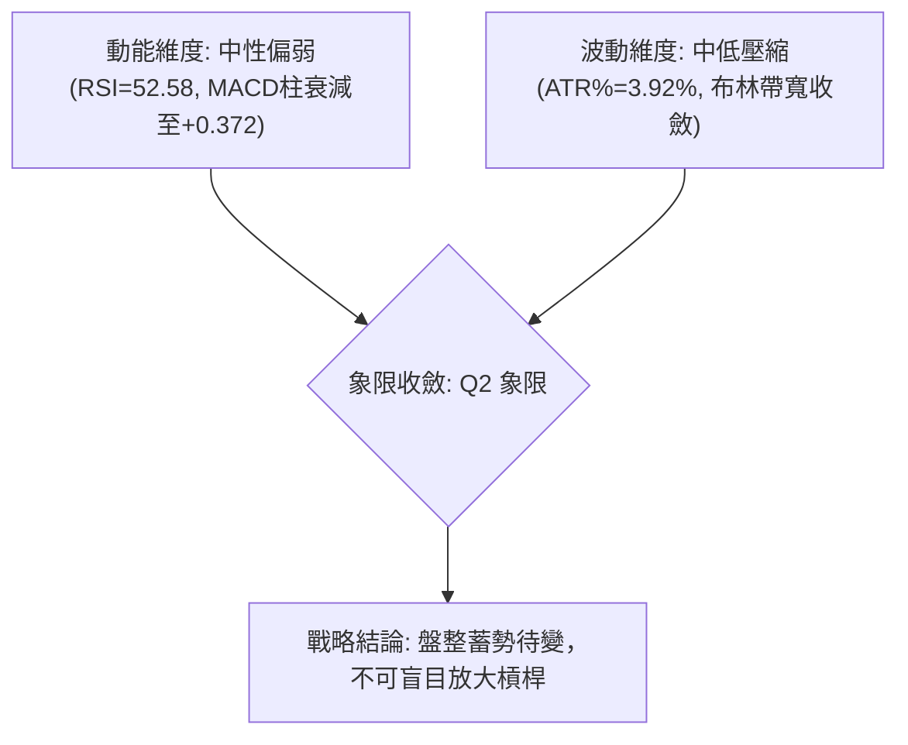

---

### 📊 ATR 波動率分析與止損設定

- **ATR(14) 數值**：**$13.99**（佔當前股價之 **3.92%**）。
- **日內真實波動區間**：約為 $14.00 美元，代表 TSLA 正常單日震盪幅度極限即在此範圍內。
- **動態止損距離量化建議**：
  - **短線交易止損（1.0 × ATR）**：距進場點 **$13.99**。在現價 $356.58 下，多頭破位止損應設於 $342.59（避開常態市場雜訊）。
  - **波段交易止損（1.5 × ATR）**：距進場點 **$20.99**。多頭波段保護位應設於 $335.59（略低於 S1 支撐位 $337.24）。
  - **寬鬆趨勢止損（2.0 × ATR）**：距進場點 **$27.98**。保護位設於 $328.60。

---

### 📐 Beta 與市場相關性

- **Beta 係數**：**1.845**。
- **波動特徵解讀**：TSLA 具備高彈性（High Beta）資產屬性，其波動幅度為標普500指數的 1.845 倍。在當前個股缺乏獨立主升催化劑的情況下，股價對美股大盤（大盤科技權值股）的系統性流動性敏感度極高。大盤若有 1% 之修正，TSLA 理論技術拉回幅度約為 1.85%。因此在建倉時必須同步監控大盤指數是否破位。

---

## 7. 多時框架總結

### 📋 時框架評分表

| 時框架 | 趨勢方向 | 動能狀態 | 均線排列 | 關鍵形態結構 | 綜合評分 | 戰術建議 |
|:---:|:---:|:---:|:---:|:---:|:---:|:---|
| **長期 (月線)** | 偏空 🔴 | 弱勢築底 | 空頭發散 (位於 MA240 下方) | 52週低點回升測試 | **35/100** | 長期投資者不宜重倉追高 |
| **中期 (週線)** | 偏多 🟢 | 頂背離警訊 | 跌破 MA200 反抽遇阻 | 雙底反彈遇頸線 R1 | **55/100** | 逢高減碼，保護利潤 |
| **短期 (日線)** | 盤整 🟡 | 動能衰減 | 糾結混合 (MA20 走平) | 布林通道內狹幅震盪 | **48/100** | 嚴守箱體邊界，高拋低吸 |

---

### 🔲 綜合訊號矩陣

| 評估維度 | 日線訊號 (1-3天) | 週線訊號 (1-4週) | 月線訊號 (1-3月) | 跨維度一致性結論 |
|:---|:---:|:---:|:---:|:---|
| **趨勢方向** | 橫盤震盪 (中性 🟡) | 跌深反彈 (偏多 🟢) | 大週期修正 (偏空 🔴) | **方向衝突，大週期尚未放行多頭** |
| **動能強度** | MACD走平 (中性 🟡) | RSI頂背離 (看空 🔴) | 低位反抽 (中性 🟡) | **動能缺乏擴張條件，隨時拉回** |
| **量能支撐** | 縮量拉鋸 (看空 🔴) | 週量漸萎縮 (看空 🔴) | 低檔換手 (中性 🟡) | **量能全面背離，不支持直接突破** |
| **空間位置** | 貼合布林中軌 🟡 | 遇阻 61.8% 斐波 🔴 | 位於 52W 區間低檔 🟢 | **上下空間受限，進入緊縮壓縮期** |

---

### ⚖️ 多時框收斂結論（依嚴格收斂規則 14）

1. **市況屬性確立**：當前 ADX(14) 數值為 **21.58**（明確低於 25 閾值）。依收斂規則，本市場環境被嚴格判定為**「盤整震盪行情」**。
2. **主導時框與權重分配**：在無趨勢的盤整市中，均線順勢系統失效，交易權重應完全轉移至**日線布林通道 ($337.43 ~ $376.22)** 與波段低高點聚集的 **S1 ($337.24) ~ R1 ($366.50)** 區間。
3. **最終收斂方向**：**中性觀望 / 區間橫盤（Neutral Range-Bound）**。
   - 儘管中期週線雙底帶來反彈預期，但日線 RSI 頂背離、量能枯竭（量比 0.77x）及中長期 MA200 ($398.32) 的重壓，封鎖了向上發展為趨勢浪的可能性。
   - 短期內價格將繼續在 **$337.24 至 $366.50** 之間作橫向箱體震盪。

---

## 8. 交易策略建議

### 🗺️ 策略決策流程圖

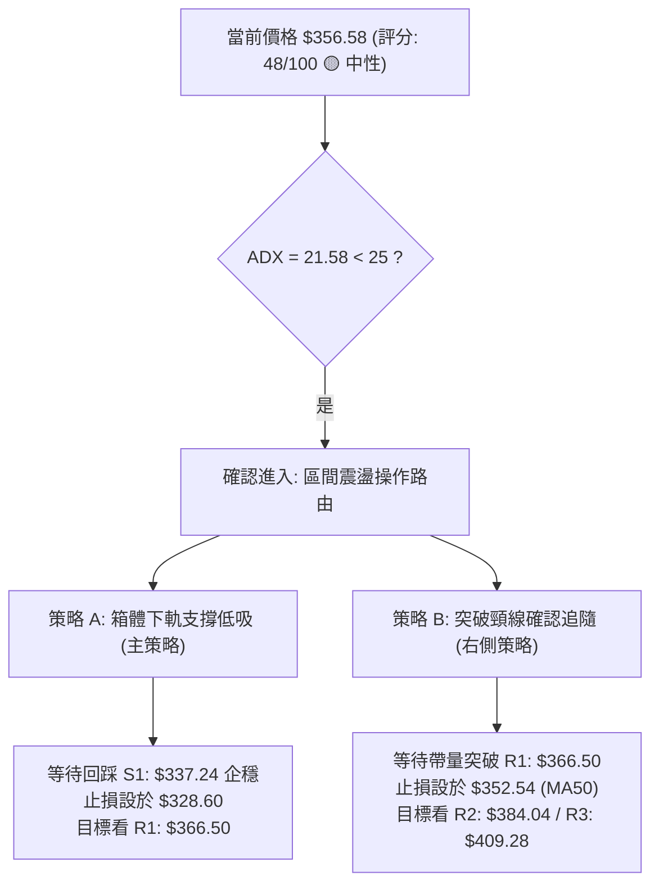

---

### 🧭 策略路由

> **當前主策略方向 = 區間震盪高拋低吸與區間突破等待策略（依綜合評分 48/100）**
> 
> 因評分處於 40–60 的中性區間，且 ADX < 25，嚴禁在當前位置（$356.58，布林中軌）隨意追價。主策略定位為**「布林通道與波段邊界之區間交易」**，耐心等待價格觸及邊界後再行動作。

---

### 🎯 價格情境階梯（Price Scenarios）

所有價位均嚴格取自數據演算，杜絕憑空臆造：

| 階梯層級 | 觸發條件 | 躍遷目標 | 後續延伸目標 | 戰術情境含義 |
|:---|:---|:---:|:---:|:---|
| **情境：強勢突破** | 放量突破 R1 **$366.50** | R2 **$384.04** | R3 **$409.28** | 雙底結構完成，挑戰 50% 斐波及 MA200 關鍵中樞 |
| **情境：箱內拉鋸** | 維持在現價區間震盪 | 中軌 **$356.83** | 上軌 **$376.22** | 時間換取空間，消化套牢籌碼，維持 10-15 美元窄幅波動 |
| **情境：回踩測試** | 跌破中軌下測 S1 **$337.24** | 78.6% 斐波 **$340.49** | S1 **$337.24** | 測試布林下軌支撐有效性，為區間低吸提供買點 |
| **情境：破位走熊** | 實體跌破 S1 **$337.24** | S2 **$297.38** | 破底探詢新低 | 雙底築底失敗，下檔直探 52 週最低點防線 |

---

### 📊 情境機率分佈

| 運行情境 | 發生機率 | 主要技術依據 |
|:---|:---:|:---|
| **繼續區間震盪 (箱體橫盤)** | **55%** | ADX=21.58（無趨勢）、布林通道帶寬嚴重收縮、量能降至 0.77x，多空皆無力單邊突破 |
| **下探考驗支撐 (回調探底)** | **30%** | RSI 出現明確頂背離、MACD 柱狀體衰退至 +0.372 邊緣、上方 MA120/MA200 重兵壓境 |
| **強勢放量突破 (向上噴出)** | **15%** | +DI 暫居微弱優勢，但成交量持續枯竭，缺乏增量資金配合，此情境機率最低 |

---

### 🟢 主策略詳情

本策略基於「盤整行情以邊界為依託」的原則設計：

| 策略要素 | 策略 A（左側：箱體下軌低吸買入） | 策略 B（右側：突破頸線順勢追買） |
|:---|:---|:---|
| **操作屬性** | 逆勢逢低吸納（高勝率波段） | 順勢突破進場（趨勢啟動追隨） |
| **進場條件** | 價格回落至 S1 附近，出現小時線止跌K棒 | 日線收盤價帶量（量比 > 1.2x）實體站上 R1 |
| **精確進場價格** | **$338.50**（S1 $337.24 稍上方掛單） | **$367.50**（確認突破 R1 $366.50 後進場） |
| **目標價 T1** | **$356.83**（布林中軌 MA20，先收回成本） | **$384.04**（波段阻力位 R2） |
| **目標價 T2** | **$366.50**（波段阻力位 R1，區間上緣） | **$409.28**（波段強阻力位 R3 / MA200 附近） |
| **嚴格止損價格** | **$328.60**（跌破 S1 下方 2.0 ATR 保護位） | **$352.54**（跌回 MA50 均線下方則宣告突破失敗） |
| **風險空間** | $9.90 ($338.50 - $328.60) | $14.96 ($367.50 - $352.54) |
| **報酬空間 (T2)** | $28.00 ($366.50 - $338.50) | $41.78 ($409.28 - $367.50) |
| **風險報酬比 (R:R)**| **1 : 2.83** | **1 : 2.79** |
| **勝率預估** | 60% | 45% |
| **建議配置倉位** | 10% - 15% 總資金 | 8% - 10% 總資金 |

---

### 🔴 反向風險觸發點（對沖與風控提示）

若持有多頭部位，當出現以下訊號時，必須立即執行減倉或買入反向 PUT 選擇權避險：
1. **破位警報**：日線收盤價**實體跌破 $337.24 (S1)**。此處為布林下軌與波段低點支撐，一旦失守意味著雙底反彈浪終結，價格將滑向 **$297.38 (S2)**。
2. **動能死叉**：日線 MACD 柱狀體由正翻負（跌破 0 軸），且快線向下穿越慢線，形成死叉共振。
3. **指標超跌無效**：跌至下軌時，成交量異常放大（恐慌性放量殺跌），說明機構籌碼鬆動而非正常洗盤。

---

### ⭐ 整體訊號強度評星

```
做多訊號強度：★★☆☆☆  (2.5/5星 — 動能背離，上方均線壓頂，多頭上攻阻力大)
做空訊號強度：★★☆☆☆  (2.5/5星 — 下方 S1 及 MA50 提供短線支撐，破位動能亦不足)
整體可信度：  ★★★★☆  (4.0/5星 — 指標在盤整市中收斂性高，箱體界限分明)
```

---

## 9. 風險提示與監控

### ✅ 關鍵監控指標 Checklist

```
╔══════════════════════════════════════════════════════════════════╗
║                   每日交易監控清單 (Checklist)                   ║
╠══════════════════════════════════════════════════════════════════╣
║ [ ] 價格邊界檢驗：現價是否脫離 $337.24 (S1) ~ $366.50 (R1) 箱體  ║
║ [ ] 布林通道狀態：帶寬是否持續縮小？留意開口放大的方向選擇      ║
║ [ ] 動能死叉監控：MACD 柱狀體是否由 +0.372 翻負進入空頭波段       ║
║ [ ] 量能突破判定：日成交量能否放大超越 3,910 萬股 (20日均量)     ║
║ [ ] 均線防守測試：回調是否跌破 MA50 ($352.54) 動態生命線         ║
║ [ ] 頂背離化解：價格衝高時 RSI 能否突破 65 消除週線頂背離       ║
║ [ ] 大盤關聯風險：Beta 為 1.845，密切跟蹤科技板塊指數波動        ║
╚══════════════════════════════════════════════════════════════════╝
```

---

### ⚠️ 風險場景分析

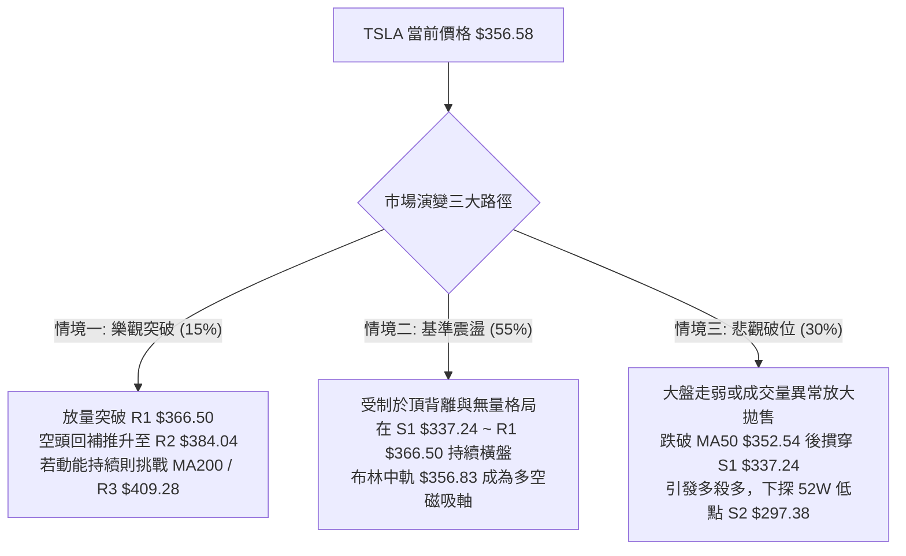

---

### 🛡️ 風險管理重要提醒

1. **拒絕在箱體「中軸盲區」開倉**：
   當前價格 **$356.58** 與布林中軌 MA20 ($356.83) 幾乎完全重合。處於箱體正中央時，向上至 R1 ($366.50) 僅有 **+$9.92** 空間，向下至 S1 ($337.24) 則有 **-$19.34** 風險，此時進場的天然風險報酬比僅為極差的 **0.51:1**。專業交易紀律要求：**無邊界，不開倉**。
2. **波幅與倉位精算**：
   TSLA 的 ATR 高達 **$13.99 (3.92%)**，單日波幅劇烈。依據 1% 資金風險法則（Single Trade Risk limit），單筆交易最大虧損不應超過總資金的 1%：
   $$\text{最大容許股數} = \frac{\text{總帳戶資產} \times 1\%}{\text{止損空間 ($9.90)}}$$
   嚴禁在震盪市中利用高槓桿融資重倉，以防假突破引發的無謂停損磨損本金。
3. **估值與基本面暗流風險**：
   技術面雖處於築底盤整，但基本面數據顯示其 Trailing P/E 仍高達 330 倍，且過去一年 Earnings Growth (YoY) 為 -3.0%，基本面缺乏支撐超高估值的爆發性增長。任何超出技術面的基本面利空均可能迅速打破當前脆弱的技術平衡。

---

## 10. 報告總結

```
╔══════════════════════════════════════════════════════════════════╗
║                   TSLA 技術分析報告總結儀表板                    ║
╠══════════════════════════════════════════════════════════════════╣
║ 報告日期：2026-09-15           當前價格：$356.58                 ║
║ 綜合技術評分：48/100           總體評級：⚖️ 區間盤整 (NEUTRAL)   ║
╠══════════════════════════════════════════════════════════════════╣
║ 關鍵維度診斷：                                                   ║
║ ├─ 長期趨勢：🔴 偏空修正 (受制於 MA200 $398.32 與大週期頭部)     ║
║ ├─ 中期趨勢：🟢 跌深反彈 (雙底結構存在，但遇週線級別頂背離)     ║
║ ├─ 短期趨勢：🟡 狹幅橫盤 (ADX=21.58 < 25，布林通道帶寬收縮)     ║
║ ├─ 核心支撐：S1: $337.24 (布林下軌)  ｜ S2: $297.38 (52W最低點) ║
║ ├─ 核心阻力：R1: $366.50 (頸線阻力)  ｜ R2: $384.04 (波段阻力) ║
║ └─ 機構共識：買入 (39位分析師目標均價 $390.09)                   ║
╠══════════════════════════════════════════════════════════════════╣
║ 最優戰術執行組合：                                               ║
║ 1. 🥇 首選策略 (低吸)：耐心等待回踩 S1 $338.50 附近建立多單，    ║
║    止損嚴設 $328.60，第一目標 $356.83，極限目標 $366.50 (R:R 2.8)║
║ 2. 🥈 次選策略 (右側)：若帶量強行突破 R1 $366.50，則於 $367.50   ║
║    順勢追多，止損設於 $352.54，目標依序看 $384.04 與 $409.28   ║
║ 3. 🥉 防守指令：若日線收盤摜穿 $337.24，全面停止任何做多嘗試，   ║
║    多頭部位無條件離場觀望。                                      ║
╚══════════════════════════════════════════════════════════════════╝
```

---

> ⚠️ **免責聲明**：本報告為依據量化技術指標與歷史行情數據生成之專業技術分析研究，所有點位均由數學模型、OHLCV 數據及圖表形態嚴格推導。本報告**僅供學術研究與投資參考**，**不構成任何形式的個人化投資要約或買賣建議**。金融市場具有高度不確定性與虧損風險，投資人應依個人財務狀況與風險承受度審慎決策，並自行承擔交易結果。

---
*分析框架：多時框技術分析體系 (Multi-Timeframe Technical Framework) ｜ 數據校準週期：日線 / 週線 / 月線*