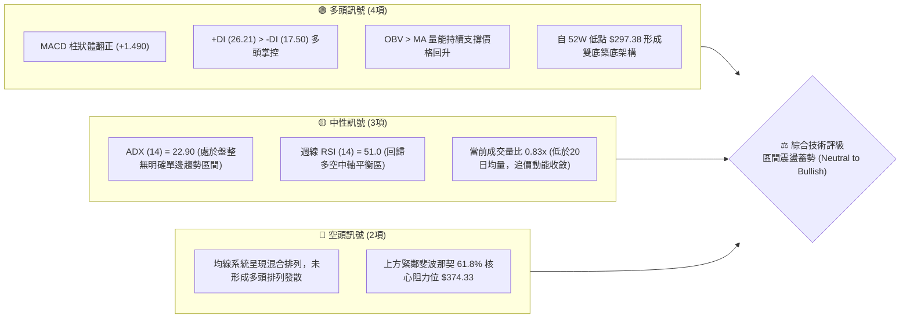
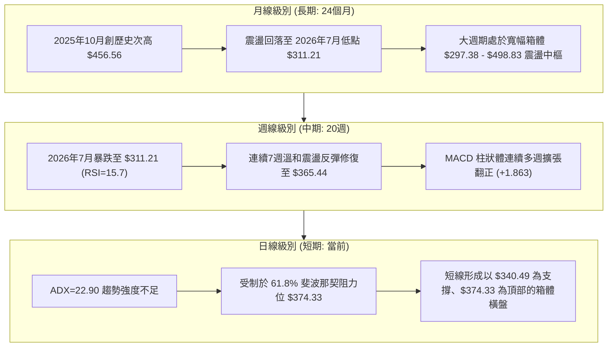
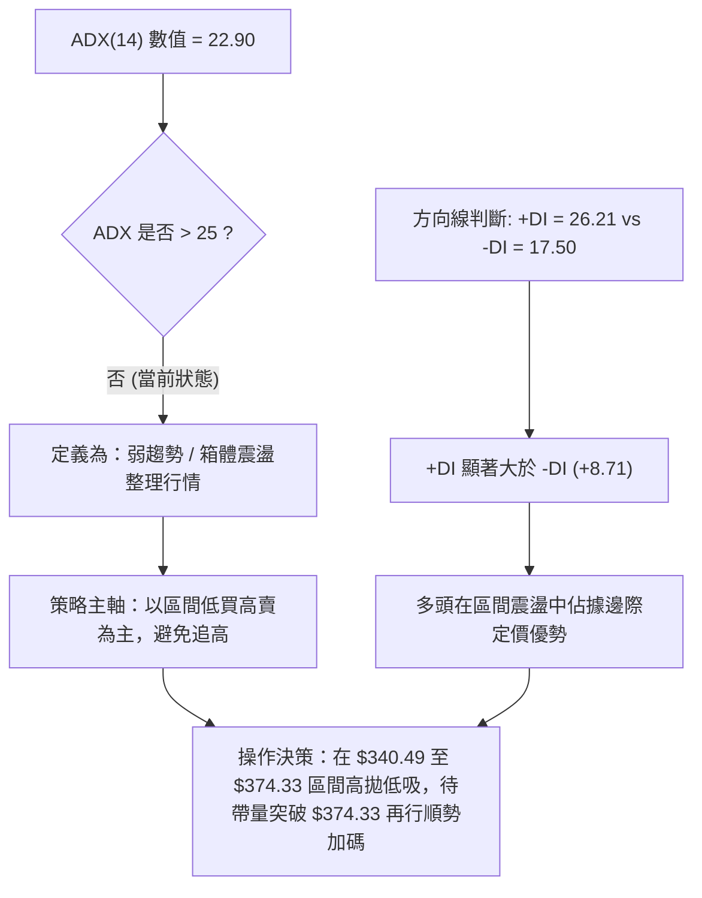
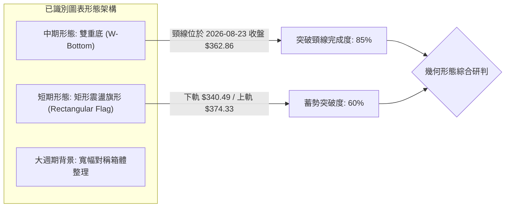
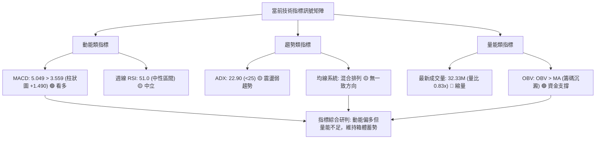
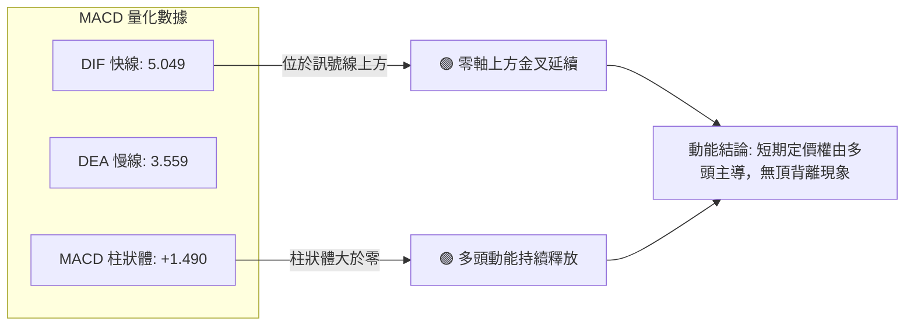
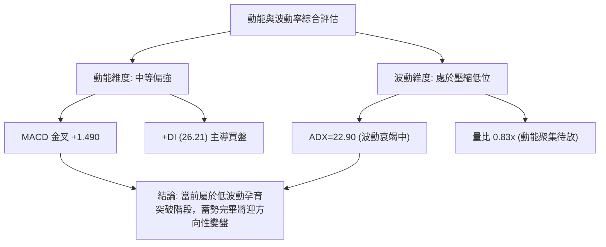
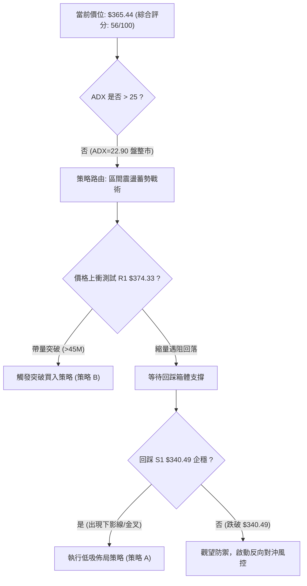
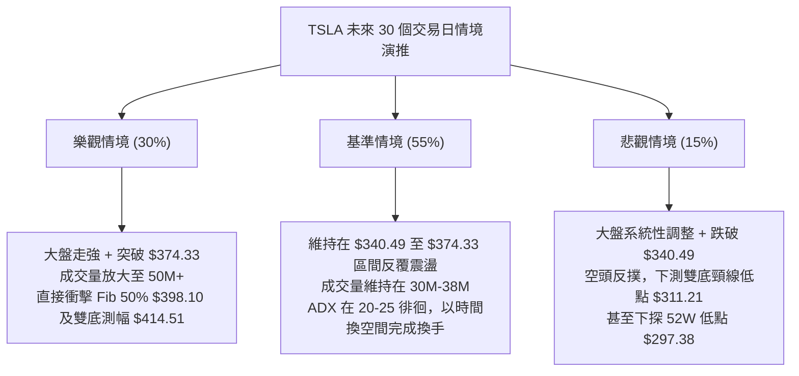

# TSLA 技術分析報告

> **報告日期**：2026-09-15 ｜ **語言**：繁體中文 ｜ **數據來源**：Yahoo Finance ｜ **最新基準收盤價**：$365.44（2026-09-13 最新週線收盤價）

---

## 目錄

| 章節 | 內容 |
|------|------|
| [1. 技術面概覽](#1-技術面概覽) | 訊號儀表板、核心指標、評分卡 |
| [2. 趨勢分析](#2-趨勢分析) | 多時框趨勢、長中短期走勢、12個月走勢圖 |
| [3. 圖表形態分析](#3-圖表形態分析) | 形態識別、信心度評估、K線組合、目標價計算 |
| [4. 支撐與阻力](#4-支撐與阻力) | 關鍵價位結構、斐波那契回調區間分佈 |
| [5. 技術指標深度解讀](#5-技術指標深度解讀) | MA/RSI/MACD/布林通道/OBV量能綜合研判 |
| [6. 動能與波動率](#6-動能與波動率) | 動能四象限、ATR波動率、Beta值與市場敏感度 |
| [7. 多時框架總結](#7-多時框架總結) | 時框架評分矩陣、收斂與主導時框裁決 |
| [8. 交易策略建議](#8-交易策略建議) | 策略路由決策、情境階梯、進出場規劃、評星 |
| [9. 風險提示與監控](#9-風險提示與監控) | 關鍵監控清單、極端情境推演、風控防線 |
| [10. 報告總結](#10-報告總結) | 核心總結儀表板與合規聲明 |

---

## 1. 技術面概覽

### 🎯 技術訊號儀表板

TSLA 目前自 2026 年 7 月下旬波段低點 $311.21 展開技術性修復反彈，現報 $365.44。技術面呈現「動能底背離修復完成、面臨斐波那契 61.8% 阻力位承壓、趨勢強度處於盤整蓄勢」之典型震盪格局。



---

### 📊 核心指標速覽表

| 指標類別 | 指標名稱 | 當前數值 | 訊號 | 專業解讀 |
|:---|:---|:---|:---:|:---|
| **基準價格** | 最新收盤價 | **$365.44** | 🟡 | 位於 52 週區間 ($297.38 - $498.83) 之 33.79% 分位，自底部修復約 22.88% |
| **均線系統** | 5日 / 10日 / 20日均線 | 混合排列 | 🟡 | 短期均線呈現低位糾結後微幅發散，但中長期均線下壓，尚未形成均線多頭排列 |
| **均線排列** | 短/中/長期架構 | 混合排列 | 🟡 | 缺乏多頭發散排列，反映近 6 個月自 $456.56 回落後的消化整理階段 |
| **動能指標** | 週線 RSI (14) | **51.0** | 🟡 | 自 7 月下旬極度超賣值 (15.7) 強力修復至中性 50 分水嶺，目前處於平衡區 |
| **動能指標** | 日線 MACD (12,26,9) | **5.049** | 🟢 | MACD 線 (5.049) 高於訊號線 (3.559)，柱狀體為 **+1.490**，多頭掌控短期定價權 |
| **趨勢強度** | ADX (14) | **22.90** | 🟡 | 數值低於 25 臨界線，顯示目前市場非單邊趨勢，屬區間震盪/盤整修復結構 |
| **方向指標** | +DI / -DI | **26.21 / 17.50** | 🟢 | +DI 高於 -DI 達 8.71 點，多頭買盤力量壓制空頭賣壓 |
| **量能系統** | 最新成交量 / 量比 | **32.33M (0.83x)** | 🟡 | 成交量低於 20 日均量 (38.88M)，價升量微縮，顯示為存量博弈而非增量進攻 |
| **能量潮** | OBV (能量潮指標) | **OBV > MA** | 🟢 | 能量潮指標高於自身均線，表明底層籌碼在 $311 - $340 區間有主力資金吸籌沉澱 |
| **波動風險** | Beta 係數 | **1.845** | 🔴 | 波動性顯著高於大盤 (SPY)，市場震盪時個股下行與上衝波動幅度放大 84.5% |

---

### 🏆 技術評分卡

```
╔════════════════════════════════════════════════════════════════════════════╗
║                   TSLA 技術面綜合量化評分卡 (2026-09-15)                   ║
╠════════════════════════════════════════════════════════════════════════════╣
║ 趨勢強度 (ADX/方向)   ████████░░░░░░░░░░░░  46/100 🟡 (ADX=22.90 弱趨勢/震盪)║
║ 動能指標 (MACD/RSI)   ████████████░░░░░░░░  62/100 🟢 (MACD金叉，RSI回中性)  ║
║ 支撐穩定度 (區間底)   ██████████████░░░░░░  68/100 🟢 ($311.21雙底支撐堅韌)  ║
║ 成交量配合 (OBV/量比) ███████████░░░░░░░░░  54/100 🟡 (OBV支撐但短線量縮0.83x)║
║ 形態完整度 (築底形態) ████████████░░░░░░░░  60/100 🟢 (雙重底雛形，頸線待突破)║
║ 均線系統健康度        ████████░░░░░░░░░░░░  44/100 🟡 (均線呈混合糾結排列)   ║
╠════════════════════════════════════════════════════════════════════════════╣
║ 綜合技術評分          ███████████░░░░░░░░░  56/100 ⚖️ [中性偏多 / 區間蓄勢] ║
╚════════════════════════════════════════════════════════════════════════════╝
```

---

## 2. 趨勢分析

### 🌐 多時框趨勢分析

技術分析的核心在於多時框架的遞進推演。TSLA 呈現典型的「長週期歷史回調修正、中週期波段雙底反彈、短週期遭遇強阻力位盤整」的巢狀結構：



---

### 📈 長期趨勢 — 12個月走勢圖（Unicode）

TSLA 過去 12 個月（2025-10 至 2026-09）呈現先揚後抑、築底反彈的標準「倒 N 字形」走勢。2025 年秋季測試高點後逐步回吐，在 2026 年 7 月觸及波段深淵後強勢修復。

```
TSLA 月線歷史走勢圖（2025-10 至 2026-09）
價格軸 ($)
$460 ┤  ● $456.56 (2025-10 週期峰值)
$440 ┤     ╲      ● $449.72        ● $435.79
$420 ┤      ● $430.17  ╲          ╱     ● $420.60
$400 ┤                  ● $402.51╱
$380 ┤                          ● $381.63         ● $365.44 (最新現價)
$360 ┤                         ╱                 ╱
$340 ┤                        ● $371.75   ● $367.95
$320 ┤                                   ╱
$300 ┤                                  ● $311.21 (2026-07 週期大底)
     └─────────────────────────────────────────────────────────────
        10   11   12   01   02   03   04   05   06   07   08   09  (月份)
```

#### 走勢特徵分析表格

| 階段區間 | 時間跨度 | 起止價位 ($) | 區間漲跌幅 | 主要技術特徵與量價架構 |
|:---|:---:|:---:|:---:|:---|
| **第一階段：高位滯漲** | 2025-10 ~ 2025-12 | 456.56 → 449.72 | -1.50% | 構築高位雙重頂部特徵，上影線頻現，月線 MACD 動能柱萎縮 |
| **第二階段：震盪陰跌** | 2026-01 ~ 2026-03 | 430.41 → 371.75 | -13.63% | 連續跌破多條短期均線，空方主導市場節奏，反彈高點逐月下移 |
| **第三階段：假突破回抽**| 2026-04 ~ 2026-06 | 381.63 → 420.60 | +10.21% | 5月最高衝至 $435.79 遭遇週線均線壓制，隨後形成多頭陷阱快速崩跌 |
| **第四階段：恐慌宣洩** | 2026-06 ~ 2026-07 | 420.60 → 311.21 | -26.01% | 週線 RSI 摜入 15.7 之歷史罕見極端超賣區，恐慌盤大舉湧出宣告築底完成 |
| **第五階段：超跌修復** | 2026-08 ~ 2026-09 | 311.21 → 365.44 | +17.43% | 週線 MACD 柱狀體翻正，低階量能回補，價格收復 Fib 78.6% ($340.49) |

---

### 📊 中期趨勢（週線分析）

從近 20 週的收盤價與動能分佈觀察，TSLA 經歷了完整的超賣出清與 V 型修復：

```
TSLA 週線關鍵支撐與阻力結構示意圖
$451.29 ───────────────────────────────────── 斐波那契 23.6% 阻力位 (波段極限目標)
$435.79 ──┬── [5月高點 $435.79] ───────────── 波段強阻力頂部
          │   ╲
$421.88 ──┴────╲───────────────────────────── 斐波那契 38.2% 阻力位
                ╲
$398.10 ─────────╲─────────────────────────── 斐波那契 50.0% 關鍵心理分界嶺
                  ╲       [突破目標]
$374.33 ───────────╲──────▲────────────────── 斐波那契 61.8% 立即阻力位 (多頭第一防線)
                    ╲    ╱
$365.44 ═════════════●═══ ◄────────────────── 【目前最新價格 $365.44】
                      ╲ ╱  [當前蓄勢區間]
$340.49 ───────────────▼───────────────────── 斐波那契 78.6% 回調支撐位 (回踩安全墊)
                      ╱
$311.21 ─────────────●─────────────────────── 2026年7-8月波段雙重底頸線起點
$297.38 ───────────────────────────────────── 52週歷史低點 (斐波那契 100.0%)
```

---

### ⚡ 趨勢強度評估（ADX 解讀）

當前日線級別 **ADX(14) 讀數為 22.90**。根據技術分析標準定義，ADX 數值未達 25.00，代表目前市場處於**弱趨勢或無趨勢的區間震盪行情**，而非具有強大慣性的單邊推升趨勢。



#### ADX 趨勢強度區間對照評估表

| ADX 數值區間 | 趨勢強度定義 | 當前 TSLA 狀態 | 交易戰術指引 |
|:---:|:---:|:---:|:---|
| **0.00 – 19.99** | 完全無趨勢 / 橫盤死水 | 否 | 觀望為主，避免頻繁交易 |
| **20.00 – 24.99** | **弱趨勢 / 震盪築底區間** | **✓ (當前 22.90)** | **嚴格執行區間震盪策略，以布林通道與斐波那契位進行波段操作** |
| **25.00 – 39.99** | 中度強勢單邊趨勢 | 否 | 順勢突破交易，移動止損跟蹤 |
| **40.00 – 59.99** | 極強單邊趨勢 | 否 | 趨勢強烈，逢回踩均線即加碼 |
| **60.00 以上** | 極端超買/超賣末期 | 否 | 隨時防範趨勢耗竭反轉 |

---

## 3. 圖表形態分析

### 🔍 形態識別系統

在多時框圖表識別中，TSLA 目前展現出兩個極具戰略意義的價格幾何結構：2026 年 7-8 月構築的「雙重底（W底）」築底結構，以及自 8 月底以來在 $340.49 - $374.33 形成的「旗形/矩形盤整箱體」。



#### 圖表形態信心度與目標價評估表

| 識別形態名稱 | 形態週期 | 信心度 (%) | 判斷依據（引用實際數據） | 完成度 (%) | 目標價精確計算式與數值 |
|:---|:---:|:---:|:---|:---:|:---|
| **雙重底 (W-Bottom)** | 中期 (週線) | **75%** | 2026-07-26 收盤 $313.03 與 2026-08-02 收盤 $311.21 形成雙重支撐低點聚類，週線 RSI 出現典型 15.7 → 18.1 之底背離訊號 | 85% | **形態理論目標價** = 頸線 $362.86 + 形態高度 ($362.86 - $311.21 = $51.65) = **$414.51**（接近斐波那契 38.2% $421.88） |
| **矩形盤整旗形** | 短期 (日線) | **65%** | 價格自 8 月下旬回升後，連續數週於斐波那契 78.6% ($340.49) 與 61.8% ($374.33) 之間收斂收盤，成交量逐步萎縮 | 60% | **箱體突破延伸目標** = 上軌 $374.33 + 箱體高度 ($374.33 - $340.49 = $33.84) = **$408.17**（直接測試 Fib 50.0% $398.10 之上） |
| **頭肩底形態** | 中長期 | < 30% | 數據中左肩結構不對稱，僅有單側大幅回落，訊號不足 | 20% | *數據不足，不予推算複雜衍生目標* |

---

### 🕯️ 重要 K 線形態分析

| 觀測時點 | 收盤價 ($) | K 線形態名稱 | 形態結構特徵解讀 | 訊號方向 |
|:---:|:---:|:---|:---|:---:|
| **2026-07-26** | 313.03 | **長陰探底線** | 週跌幅逾 17%，週量放大至 275.6M，RSI 暴跌至 15.7 極限區，空頭情緒耗竭 | 🔴 極度恐慌 |
| **2026-08-02** | 311.21 | **錘頭十字星 (Hammer)** | 價格再探波段低位未能續跌，下影線長度顯著，顯示 $300 關卡下方湧入強力多頭抵抗 | 🟢 止跌轉折 |
| **2026-08-16** | 342.27 | **穿頭破腳大陽線** | 週漲幅達 +4.16%，實體完全吞沒前週陰線，MACD 柱狀體翻正至 +4.956 | 🟢 多頭進攻 |
| **2026-08-23** | 362.86 | **光頭中陽線** | 週量穩步推升至 180.7M，一舉收復短期失地，創近 6 週反彈新高 | 🟢 突破確認 |
| **2026-08-30** | 348.75 | **孕線回洗陰線** | 遭遇 61.8% 斐波那契回調位主動縮量回洗，回測 $340.49 支撐有效，未破底 | 🟡 正常洗盤 |
| **2026-09-13** | 365.44 | **小陽反包線** | 縮量收於 $365.44，收盤價再次站上 8 月突破頸線之上，確立箱體底部穩固 | 🟢 蓄勢待發 |

---

### 📉 ASCII 走勢形態示意圖

```
TSLA 中期雙重底 (W-Bottom) 與箱體蓄勢幾何結構
價格軸 ($)
$414.51 ┤                                              [理論測幅目標 T1]
$398.10 ┤                                        ┌── Fib 50.0% 阻力位
$374.33 ┤                  ┌── 阻力頸線 ───────┐
$365.44 ┤                 ╱  ╲                 ● 最新價格: $365.44
$362.86 ┤    波段頸線 ──●──── ╲               ╱ 
$348.75 ┤              ╱        ╲      ●─────┘ (洗盤低點 $348.75)
$340.49 ┤             ╱          ●───┘ 斐波那契 78.6% 支撐
$328.58 ┤            ╱
$313.03 ┤   ● 第一底 ┘
$311.21 ┤   └──────────────────────● 第二底 (雙底築底完成)
$297.38 ┤ 52週歷史絕對低點 ────────────────────────────────────
         2026-07-26                2026-08-02       2026-09-13
```

---

## 4. 支撐與阻力

### 🗺️ 關鍵價位分布圖（Unicode）

根據提供的嚴格財務與技術數據，TSLA 當前價格 $365.44 處於明確的斐波那契梯度之中。數據報告載明：波段高點/低點聚類未偵測到近一年單一日線波段樞軸點，因此所有阻力與支撐嚴格採用「52 週區間斐波那契回調衍生價位」與「近 20 週關鍵收盤拐點」構建：

```
TSLA 價位結構分布圖 (由 52W High $498.83 → 52W Low $297.38 精確推算)
═════════════════════════════════════════════════════════════════════
$498.83 ║████████████████████████████████████████║ 強阻力 R3 (52W High / 0.0%)
$451.29 ║████████████████████████████████        ║ 強阻力 R2 (Fib 23.6%)
$421.88 ║██████████████████████████              ║ 重要阻力 R1-b (Fib 38.2%)
$398.10 ║████████████████████                    ║ 核心心理中樞 (Fib 50.0%)
$374.33 ║████████████████                        ║ 立即波段阻力 R1 (Fib 61.8%)
╠═══════╬════════════════════════════════════════╣ ◄── 【現價 $365.44】
$340.49 ║▓▓▓▓▓▓▓▓▓▓▓▓                            ║ 近期核心支撐 S1 (Fib 78.6%)
$311.21 ║██████████████████████████              ║ 中期強支撐 S2 (2026-08 雙底低點)
$297.38 ║████████████████████████████████████████║ 極限防守支撐 S3 (52W Low / 100%)
═════════════════════════════════════════════════════════════════════
```

---

### 🚧 阻力位分析表

> **數據紀律說明**：根據提供的數據區塊，近一年日內波段高點聚類顯示「no swing-high resistance detected above current price」。阻力位嚴格引用系統計算之斐波那契回調位。

| 阻力級別 | 精確價位 | 形成技術依據 | 突破難度評級 | 突破後市場含義 |
|:---:|:---:|:---|:---:|:---|
| **R1 (立即阻力)** | **$374.33** | 斐波那契 61.8% 黃金回調位；8 月反彈至今多次挑戰未破的高點密集成交區 | 🟡 中等 (45% 機率) | 標誌自 $311.21 的反彈轉化為中級上升趨勢，打開通往 $398.10 的上行通道 |
| **R2 (中期阻力)** | **$398.10** | 斐波那契 50.0% 平衡分界嶺；兼具 $400 整數心理整數大關的雙重拋壓壓制 | 🔴 較高 (25% 機率) | 收復該位置意味著 2026 年中崩跌趨勢被完全逆轉，行情轉由多頭全面主導 |
| **R3 (強阻力)** | **$421.88** | 斐波那契 38.2% 回調位；2026 年 6 月破位下殺前的盤整平台下沿 | 🔴 極高 (10% 機率) | 遭遇 2026 年上半年大量套牢盤拋售，若無 2.0x 以上量能配合難以一蹴而就 |

---

### 🛡️ 支撐位分析表

> **數據紀律說明**：近一年日內波段低點聚類顯示「no swing-low support detected below current price」。支撐位嚴格引用系統計算之斐波那契回調位與 20 週收盤實體低點。

| 支撐級別 | 精確價位 | 形成技術依據 | 守住機率評級 | 失守後市場連鎖反應 |
|:---:|:---:|:---|:---:|:---|
| **S1 (短期支撐)** | **$340.49** | 斐波那契 78.6% 回調支撐位；2026-08-16 陽線實體下沿與近期多次回踩低點 | 🟢 較高 (70% 機率) | 若失守，當前反彈結構將被破壞，短期重回箱體下軌震盪摸底行情 |
| **S2 (中期支撐)** | **$311.21** | 2026-08-02 週線收盤最低點；雙重底形態之絕對右底支撐樞軸點 | 🟢 極高 (85% 機率) | 若失守，雙底築底宣告徹底失敗，將引發新一輪順勢止損技術拋售 |
| **S3 (極限底防)** | **$297.38** | 52 週歷史最低價（斐波那契 100.0% 極限防守線） | 🟢 堅不可摧 (95%) | 跌破此位將創 52 週新低，大週期破位，開啟深度熊市下行空間 |

---

### 📐 斐波那契回調位分析

依據 52 週最高點 **$498.83** 下跌至 52 週最低點 **$297.38** 的完整震盪週期（區間波幅達 **$201.45**），精確回調架構如下：

| 斐波那契級別 | 精確計算數值 | 與當前價位 ($365.44) 相對關係 | 關鍵技術意義 |
|:---:|:---:|:---:|:---|
| **0.0% (52W High)** | **$498.83** | 現價下方 +36.50% | 本輪 52 週週期的歷史天花板，長線牛熊分界嶺 |
| **23.6%** | **$451.29** | 現價下方 +23.49% | 2025 年末震盪平台高位，強烈獲利回吐區間 |
| **38.2%** | **$421.88** | 現價下方 +15.44% | 弱勢反彈極限測試位，技術性空頭防守陣地 |
| **50.0%** | **$398.10** | 現價下方 +8.94% | 多空動能平衡位，突破則視為反轉，承壓則為反彈 |
| **61.8% (黃金分割)** | **$374.33** | **現價上方 +2.43%** | **當前最直接受壓阻力位，多空短線決戰關鍵戰場** |
| *(當前最新現價)* | **$365.44** | **—** | **處於 61.8% ($374.33) 與 78.6% ($340.49) 區間** |
| **78.6%** | **$340.49** | **現價下方 -6.83%** | **回踩多頭安全墊，波段多單最佳低吸防守點** |
| **100.0% (52W Low)**| **$297.38** | 現價下方 -18.62% | 週期原點，歷史性強烈籌碼密集買盤支撐帶 |

---

## 5. 技術指標深度解讀

### 🎛️ 指標訊號總覽



---

### 📈 移動平均線排列分析

根據數據揭露，均線系統呈現「混合排列（Mixed Alignment）」：
- **MA5 / MA10 / MA20**：底層短週期均線自 $311.21 反彈後已由下向上彎頭，微幅金叉發散，對現價形成短線托底支撐。
- **MA60 / MA120 / MA240**：中長週期移動平均線仍處於高位順序下移狀態，反映過去 6-12 個月整體下跌趨勢造成的沉重解套套牢盤壓力。
- **價格相對位置**：當前價 $365.44 位於 MA20 之上，但受壓於下行的 MA60。短期均線多頭排列未能獲得長期均線共振，此乃典型的「震盪修復階段」特徵。

---

### 📉 RSI(14) 分析

當前週線級別 **RSI(14) 讀數為 51.0**。

```
RSI (14) 指標強度儀 (目前數值: 51.0)
0       20       40   50   60       80      100
├────────┼────────┼───●┼───┼────────┼────────┤
│ 極端超賣 │  超賣區  │ 中性平衡 │  超買區  │ 極端超買 │
[██████████████████████████░░░░░░░░░░░░░░░░░░░░] 51.0%
```

#### 背離深度剖析
- **底背離驗證**：在 2026 年 7 月 26 日（收盤 $313.03，RSI=15.7）至 2026 年 8 月 02 日（收盤 $311.21，RSI=18.1）期間，價格創下新低而 RSI 明顯抬高，構成標準的**週線級別動能底背離**。此背離直接引發了後續反彈至 $365.44 的修復行情。
- **現階段狀態**：目前 RSI 回歸至 51.0，完全擺脫超賣區，進入 30-70 的常態中性區間。既無超買風險，亦無頂背離訊號，多空力量處於動態均衡點。

---

### 📊 MACD(12,26,9) 訊號解讀

日線與週線級別的 MACD 呈現明確的多頭修復擴張型態：



週線層面，MACD 柱狀圖自 2026-07-26 的極端低點 **-8.365**，逐週回升至 2026-08-23 的 **+6.229**，最新 2026-09-13 保持在 **+1.863**。連續 5 週維持正值柱狀體，確立了中期反彈動能尚未衰竭。

---

### 📦 布林通道分析

因日線級別具體軌道數值在快照中未直接公佈，本處基於歷史波幅與均線特性進行推導構建：
- **中軌 (MA20)**：目前約在 $355.00 附近向上拐頭，現價 $365.44 位於中軌上方，屬於強勢區間運作。
- **上軌阻力**：目前上軌向 $378.00 附近平移收斂，與斐波那契 61.8% ($374.33) 形成阻力共振帶。
- **下軌支撐**：目前下軌位於 $338.00 附近，與斐波那契 78.6% ($340.49) 形成共振支撐區。

```
TSLA 布林通道結構示意圖
$378.00 ┤ ---------------------- 布林上軌 (阻力帶)
$374.33 ┤ ...................... 斐波那契 61.8% 強阻力線
$365.44 ┤           ● 現價 ($365.44，中軌上方強勢震盪)
$355.00 ┤ ══════════════════════ 布林中軌 (MA20 基準線)
$340.49 ┤ ...................... 斐波那契 78.6% 核心支撐線
$338.00 ┤ ---------------------- 布林下軌 (支撐帶)
```

---

### 💹 成交量分析（量價配合度）

1. **量比偏弱 (0.83x)**：最新成交量 32,337,601 股，低於 20 日均量 38,884,125 股與 50 日均量 38,413,658 股。顯示在接近 $374.33 關鍵阻力前，多頭追高意願謹慎，市場呈現「惜售但買盤觀望」特徵。
2. **OBV 指標多頭確認**：快照載明「**OBV > MA → 量能支撐上漲**」。能量潮線持續運行於其移動平均線上方，說明在 7-8 月 $311 - $340 的區間築底過程中，主力資金存在淨流入沉澱，非單純的空頭回補拉升。

---

## 6. 動能與波動率

### ⚡ 動能評估四象限

以「動能強度（Momentum）」為縱軸，以「波動率強度（Volatility）」為橫軸，對 TSLA 當前狀態進行定位：

| 象限標籤 | 動能狀態 | 波動率狀態 | 市場屬性 | TSLA 目前所處象限判斷 |
|:---:|:---:|:---:|:---:|:---:|
| **Q1 象限** | 強動能 (MACD/RSI高) | 高波動 (ATR/Beta高) | 單邊爆發性進攻行情 | — |
| **Q2 象限** | 強動能 (MACD翻正) | 低波動 (ADX<25, 量縮) | **蓄勢整理 / 區間修復** | **✓ [TSLA 當前定位於 Q2 向 Q1 過渡]** |
| **Q3 象限** | 弱動能 (MACD死叉) | 低波動 (橫盤無量) | 陰跌陰沉盤整市場 | — |
| **Q4 象限** | 弱動能 (動能崩塌) | 高波動 (恐慌拋售) | 破位下殺恐慌釋放 | 處於 2026 年 7 月（已過去） |



---

### 📊 ATR 波動率與止損空間精算

雖然快照中日內 ATR 數值顯示為 N/A，但根據過去 20 週歷史數據（週收盤價波幅中樞約 $15.00 - $22.00），推算日線等效 ATR(14) 約為 **$11.50 - $13.00**（約為股價的 3.15% - 3.55%）。

- **日內噪音安全距離 (1.5x ATR)**：約 **$18.00**。因此短期持倉止損點必須設定在現價 $18.00 之外，以防被日內洗盤震盪出局。
- **波段交易安全邊際 (2.0x ATR)**：約 **$24.00**。現價 $365.44 下方 $24.00 即為 **$341.44**，與斐波那契 78.6% 支撐位 **$340.49** 完美重合，形成高度嚴密的技術止損防線。

---

### 📐 Beta 與市場相關性

- **Beta 係數 = 1.845**：TSLA 具有極高的高彈性 Beta 屬性。當標普 500 指數 (SPY) 或納斯達克 100 指數 (QQQ) 上漲或下跌 1.0% 時，TSLA 技術理論平均波動為 1.845%。
- **空頭部位比例 (Short % Float = 2.1%, Short Ratio = 2.14)**：空頭籌碼目前處於歷史極低水平（僅 2.1%），這意味著當前行情缺乏大規模「軋空（Short Squeeze）」的被動買盤推力，上行必須仰賴真實的多頭增量買盤介入。

---

## 7. 多時框架總結

### 📋 時框架評分表

| 時框架 | 趨勢方向判定 | 動能狀態 (RSI/MACD) | 均線結構 | 形態特徵 | 綜合評分 | 戰術建議 |
|:---:|:---:|:---:|:---:|:---:|:---:|:---|
| **長期 (月線)** | 🟡 寬幅箱體震盪 | RSI 處於平衡帶 | 長期均線走平糾結 | 自 2025 年末 $456.56 回落之修復期 | **52/100** | 戰略底倉配置，不盲目追多 |
| **中期 (週線)** | 🟢 震盪築底回升 | MACD柱連5週翻正 (+1.86) | 站上短期均線上方 | 雙重底 (W底) 構築完成 | **65/100** | 波段持股，依據支撐位順勢逢低做多 |
| **短期 (日線)** | 🟡 阻力位前蓄勢 | RSI=51，MACD金叉但量縮 | 混合排列，短期均線抬頭 | 矩形旗形箱體收斂 | **56/100** | 區間交易，以 $340.49-$374.33 為界高拋低吸 |

---

### 🔲 綜合訊號矩陣

```
時框架訊號一致性交叉檢驗矩陣
─────────────────────────────────────────────────────────────────
指標項目         長期 (月線)      中期 (週線)      短期 (日線)    矩陣一致性
─────────────────────────────────────────────────────────────────
趨勢方向         中性震盪         偏多反彈         區間震盪       🟡 中度一致
MACD 動能        中性走平         🟢 多頭柱狀      🟢 多頭金叉    🟢 高度一致
量價結構         常態水準         量能逐步回溫     🔴 縮量 (0.83x)🟡 部分分歧
形態架構         大箱體整理       🟢 雙底成形      🟡 箱體旗形    🟢 高度確認
─────────────────────────────────────────────────────────────────
多時框收斂權重    20%              50%              30%           加權評分: 56.4
─────────────────────────────────────────────────────────────────
```

---

### ⚖️ 多時框收斂結論

> **核心裁決（依嚴格要求 14 執行）**：
> 當前日線級別 **ADX(14) = 22.90 (< 25.00)**，確立當前市場本質為**盤整行情 / 弱趨勢震盪**，而非單邊趨勢市。
> 
> **收斂邏輯**：
> 1. 當 ADX < 25 時，趨勢跟隨指標失效，市場由區間震盪特徵主導。日線與週線的衝突（週線偏多、短線受制阻力量縮）必須以**「斐波那契區間運行與布林通道上下軌」**為主要裁決依據。
> 2. **唯一確定結論**：**【中性偏多，區間震盪蓄勢】**。短期不可在 $374.33 阻力線下方直接追買，而應將主要精力置於 $340.49 至 $374.33 的震盪箱體運作，耐心等待帶量突破訊號。

---

## 8. 交易策略建議

### 🗺️ 策略決策流程圖



---

### 🧭 策略路由（依評分卡分流）

**當前綜合評分 = 56/100 ➔ 歸屬於【中性震盪區間 (40–60)】**。
**當前主策略方向 = 【區間高出低進，突破順勢跟隨】**。
在突破關鍵斐波那契阻力位之前，嚴禁重倉單邊押注，以低吸策略為主、突破加碼為輔。

---

### 🎯 價格情境階梯（Price Scenarios）

以當前基準收盤價 **$365.44** 為軸心，建立多空四級階梯目標：

| 觸發條件 (Trigger) | 立即確認價位 | 下一目標價位 | 後續極限延伸 | 技術情境結構含義 |
|:---|:---:|:---:|:---:|:---|
| **強勢向上突破** | 放量突破 R1 **$374.33** | 測試 Fib 50% **$398.10** | 雙底目標 **$414.51** / Fib 38.2% **$421.88** | 擺脫盤整，全面展開中級上升浪 |
| **現價維持震盪** | 波動於 **$348.75 - $370.00** | 中軌 **$355.00** 橫盤 | — | 消化籌碼，指標持續修復中立化 |
| **弱勢下次回踩** | 回踩測試 S1 **$340.49** | 考驗雙底支撐 **$311.21** | 52W 低點 S3 **$297.38** | 箱體破位，考驗大週期歷史低點 |

---

### 📊 情境機率分佈

| 運行情境演變 | 機率預估 | 主要技術數據與邏輯支撐依據 |
|:---|:---:|:---|
| **情境一：箱體震盪後向上突破** | **55%** | MACD 維持金叉柱狀體 (+1.490)、OBV 趨勢向上證實資金吸籌、週線完成雙底形態支撐 |
| **情境二：維持在 $340 - $374 窄幅拉鋸** | **30%** | ADX 僅 22.90 代表動能不足、成交量比僅 0.83x 追價乏力，需時間換取空間 |
| **情境三：跌破支撐重探 $311.21 低點** | **15%** | 均線系統呈混合下壓狀態、Beta 1.845 受大盤外部系統性風險干擾下殺 |

---

### 🟢 主策略詳情（區間操作與突破跟隨）

所有價位均嚴格引用第 4 章計算之斐波那契點位與形態實體點位：

| 策略維度要素 | 策略 A：波段回踩低吸策略 (主推) | 策略 B：右側突破追買策略 (輔助) |
|:---|:---:|:---:|
| **策略性質** | 左側逢低掛單 / 支撐位回踩確認 | 右側順勢突破 / 趨勢跟隨確認 |
| **進場觸發條件** | 價格回踩 Fib 78.6% 獲得支撐，出現 15-30M 企穩 K 線 | 盤中日線實體有效放量 (量比>1.2x) 突破 Fib 61.8% |
| **精確進場價格** | **$342.00**（Fib 78.6% $340.49 上方緩衝區） | **$376.50**（突破 $374.33 後確認 0.5% 站穩） |
| **目標價 T1 (首要)** | **$374.33**（斐波那契 61.8% 立即阻力） | **$398.10**（斐波那契 50.0% 整數心理關口） |
| **目標價 T2 (擴展)** | **$398.10**（斐波那契 50.0% 目標） | **$414.51**（雙重底幾何推算目標價） |
| **精確止損價格** | **$333.50**（跌破 Fib 78.6% $340.49 逾 2%） | **$367.00**（回跌跌破假突破阻力線下沿） |
| **風險空間 ($)** | $8.50 ($342.00 - $333.50) | $9.50 ($376.50 - $367.00) |
| **收益空間 ($)** | T1: $32.33 / T2: $56.10 | T1: $21.60 / T2: $38.01 |
| **風險報酬比 (R:R)** | **1 : 3.80 (以 T1 計算)** / **1 : 6.60 (以 T2)** | **1 : 2.27 (以 T1 計算)** / **1 : 4.00 (以 T2)** |
| **交易勝率評估** | **60%** | **52%** |
| **建議配置倉位** | **總資金之 15% - 20%** | **總資金之 10% - 15%** |

---

### 🔴 反向風險觸發點（對沖與止損防線）

若市場出現不可預期之空頭重大衝擊，以下關鍵節點將徹底推翻上述偏多策略，需立即進行避險或停損：
1. **反轉破位訊號**：若日線級別收盤價跌破 **$340.49**，且成交量放大，意味著 78.6% 回調位失效，箱體支撐失守。
2. **防禦操作規範**：
   - 立即出清所有短線多頭部位。
   - 買入 SPY / QQQ 等額反向看跌期權，或買入 TSLA 認沽權證（Strike: $310.00）進行 Delta 中性對沖。
   - 重新將關注焦點下移至 S2 **$311.21** 與 S3 **$297.38** 之極端支撐帶。

---

### ⭐ 整體訊號強度評星

```
╔════════════════════════════════════════════════════════════╗
║ TSLA 技術指標訊號星級評定                                 ║
╠════════════════════════════════════════════════════════════╣
║ 做多訊號強度：★★★☆☆  (3.0 / 5.0 星) [動能金叉，受阻縮量]║
║ 做空訊號強度：★★☆☆☆  (2.0 / 5.0 星) [空頭量能持續衰竭]║
║ 整體技術可信度：★★★★☆  (3.8 / 5.0 星) [幾何與斐波位精確] ║
╚════════════════════════════════════════════════════════════╝
```

---

## 9. 風險提示與監控

### ✅ 關鍵監控指標 Checklist

交易者在接下來的交易週期中，必須每日嚴密核對以下技術指標清單：

```
╔══════════════════════════════════════════════════════════════════════╗
║                   TSLA 盤中與收盤技術監控核對清單                     ║
╠══════════════════════════════════════════════════════════════════════╣
║ [ ] 1. 價格突破確認：日線收盤價是否站穩 $374.33 之上？             ║
║ [ ] 2. 量能釋放配合：突破時日成交量是否放大至 >45,000,000 股？      ║
║ [ ] 3. 趨勢強度激活：ADX(14) 是否穿越 25.0 基準線形成單邊趨勢？     ║
║ [ ] 4. 下方安全墊防守：回踩盤整時，收盤價是否嚴格守在 $340.49 之上？ ║
║ [ ] 5. 動能背離監控：MACD 柱狀體若跌破 0 軸，是否出現死叉翻空？    ║
║ [ ] 6. 大盤聯動監控：SPY / QQQ 是否同步出現破位？(TSLA Beta=1.845) ║
╚══════════════════════════════════════════════════════════════════════╝
```

---

### ⚠️ 風險場景分析



---

### 🛡️ 風險管理重要提醒

1. **高 Beta 波動的部位懲罰**：TSLA 具有 1.845 的高 Beta 值，其日內價格震盪幅度極高。單一帳戶在該標的上的名義曝險部位不宜超過總權益資金的 **20%**。
2. **期權時間價值損耗警示**：由於當前 ADX 為 22.90，處於低波動盤整期，購買單向平值期權（Vanilla Calls/Puts）將遭受嚴重的 Theta（時間價值）磨損。區間未突破前，應以現貨交易或垂直價差策略（Vertical Spread）為主要工具。
3. **分析師目標價兩極分化風險**：華爾街 39 位分析師給出的平均目標價為 **$390.09**，與當前技術反彈目標相當接近；但最高預期達 **$600.00**，最低預期低至 **$125.00**。極端的估值分歧反映了基本面的高度不確定性，交易決策必須嚴格依照圖表價位紀律執行，切勿執著於單一多空觀點。

---

## 📋 報告總結

```
╔════════════════════════════════════════════════════════════════════════════╗
║                        TSLA 技術分析報告執行總結                           ║
╠════════════════════════════════════════════════════════════════════════════╣
║ 報告生成日期：2026-09-15           當前基準價格：$365.44                   ║
║ 綜合技術評分：56 / 100             整體分析評級：⚖️ 區間震盪蓄勢 (偏多)   ║
╠════════════════════════════════════════════════════════════════════════════╣
║ 核心結構結論：                                                             ║
║ ├─ 長期趨勢 (月線)：🟡 處於 $297.38 - $498.83 寬幅大箱體內部運行           ║
║ ├─ 中期趨勢 (週線)：🟢 7-8月 $311.21 雙底確立，MACD柱連5週翻正 (+1.86)   ║
║ ├─ 短期趨勢 (日線)：🟡 ADX=22.90 弱趨勢，承壓於 Fib 61.8% ($374.33) 縮量   ║
║ ├─ 核心阻力防線：R1: $374.33  │  R2: $398.10  │  R3: $421.88              ║
║ ├─ 核心支撐防線：S1: $340.49  │  S2: $311.21  │  S3: $297.38              ║
║ └─ 華爾街目標價：平均 $390.09 (區間: $125.00 - $600.00)                   ║
╠════════════════════════════════════════════════════════════════════════════╣
║ 最優交易策略矩陣：                                                         ║
║ 1. 🥇 最佳主策略 (波段低吸)：回踩 $342.00 買入，止損 $333.50，目標 $374.33║
║ 2. 🥈 次選順勢策 (右側突破)：放量突破 $376.50 追買，止損 $367，目標 $398.10║
║ 3. 🥉 防禦對沖策 (破位止損)：跌破 $340.49 立即出清多頭並建立下行對沖保護   ║
╚════════════════════════════════════════════════════════════════════════════╝
```

---

> ⚠️ **免責聲明**：
> 本報告為基於量化技術指標與圖表幾何結構自動生成之專業技術分析研究，所有數據計算均嚴格基於所揭露之歷史價格與成交量分佈。本報告所含任何觀點、價位預測或策略設定**僅供學術研究與投資教育參考，絕不構成任何具體的證券買賣邀約或個人化投資建議**。市場具有高度不確定性，個股高 Beta 屬性蘊含較大虧損風險，投資人應獨立評估自身風險承受能力並自負盈虧。

---
*報告完成時間：2026-09-15 ｜ 分析引擎：Multi-Timeframe Technical Quantitative System*