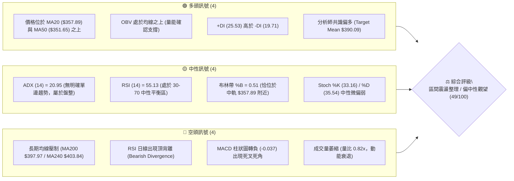
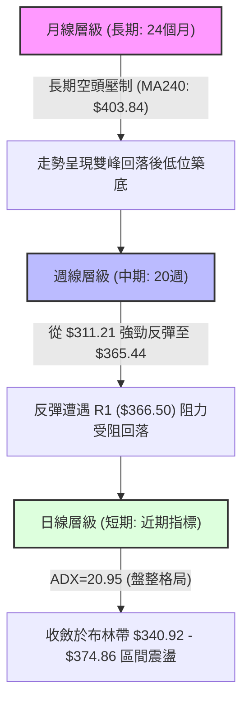
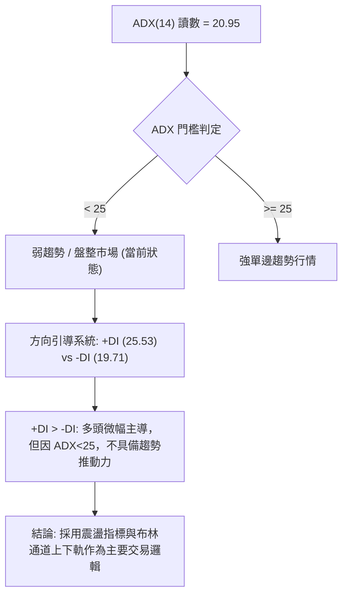
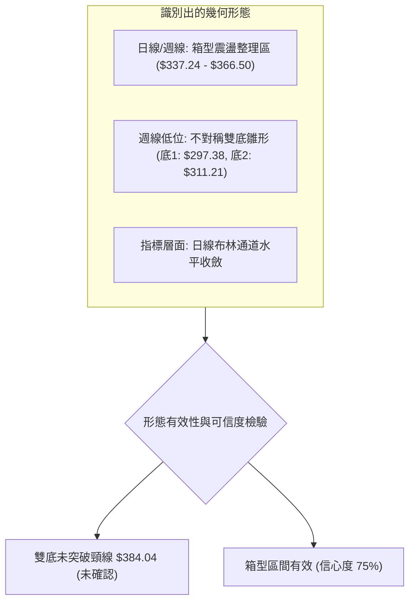
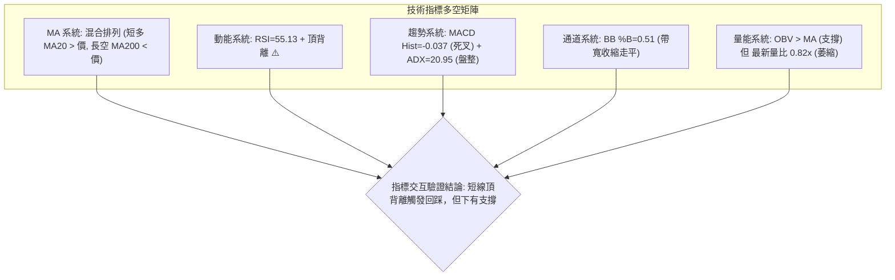
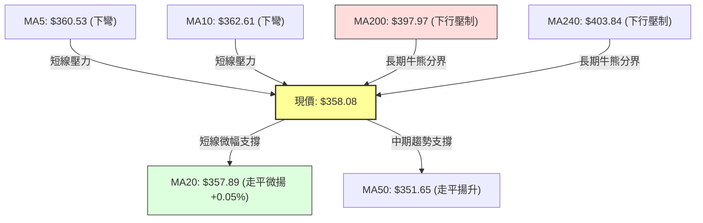
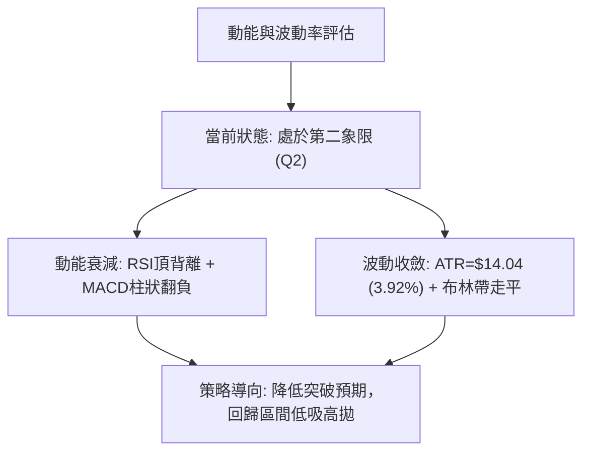
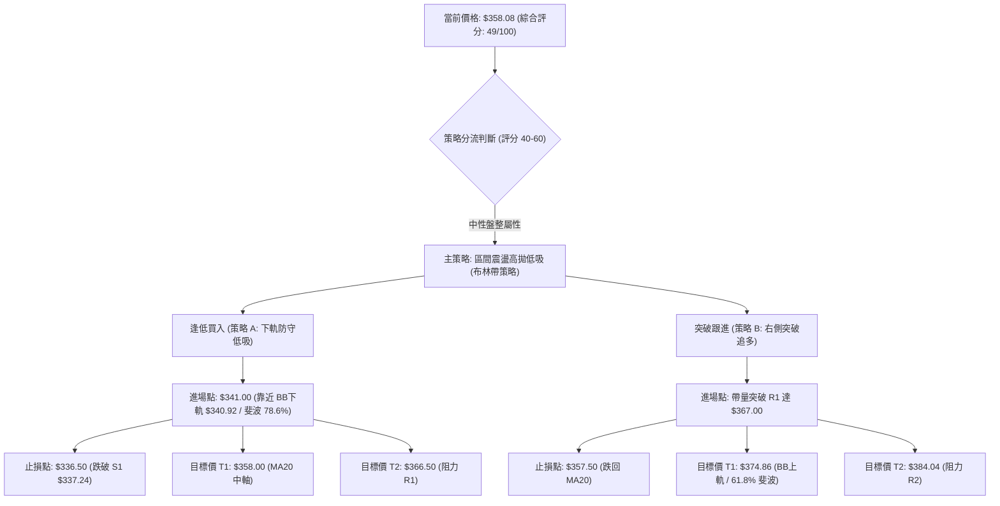
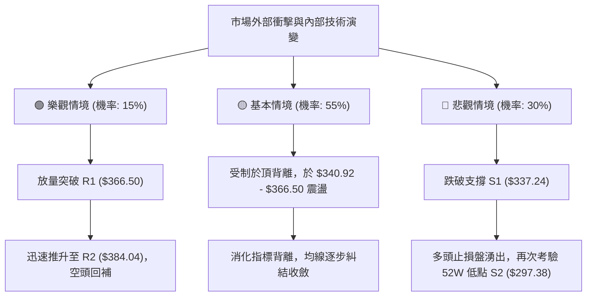

# TSLA 技術分析報告

> **報告日期**：2026-09-16 ｜ **語言**：繁體中文 ｜ **數據來源**：Yahoo Finance ｜ **當前價格**：$358.08

---

## 目錄

| 章節 | 內容 |
|------|------|
| [1. 技術面概覽](#1-技術面概覽) | 訊號儀表板、核心指標、評分卡 |
| [2. 趨勢分析](#2-趨勢分析) | 多時框趨勢、長中短期走勢 |
| [3. 圖表形態分析](#3-圖表形態分析) | 形態識別、K線組合、目標價 |
| [4. 支撐與阻力](#4-支撐與阻力) | 關鍵價位、斐波那契回調 |
| [5. 技術指標深度解讀](#5-技術指標深度解讀) | MA/RSI/MACD/布林/成交量 |
| [6. 動能與波動率](#6-動能與波動率) | 動能評估、ATR、Beta |
| [7. 多時框架總結](#7-多時框架總結) | 時框架評分矩陣 |
| [8. 交易策略建議](#8-交易策略建議) | 多空策略、風險報酬比 |
| [9. 風險提示與監控](#9-風險提示與監控) | 監控指標、風險場景 |

---

## 1. 技術面概覽

### 🎯 技術訊號儀表板



### 📊 核心指標速覽表

| 指標類別 | 指標名稱 | 當前數值 | 訊號 | 解讀 |
|----------|----------|----------|------|------|
| **價格** | 當前價格 | $358.08 | 🟡 | 位於52週區間 30.1%，自2026年7月低點反彈後遇阻震盪 |
| **均線** | MA20 | $357.89 | 🟢 | 現價微幅高於 MA20 (+0.05%)，短線獲得月均線支撐 |
| **均線** | MA50 | $351.65 | 🟢 | 現價高於中期生命線 MA50 (+1.83%)，中期底部確立 |
| **均線** | MA200 | $397.97 | 🔴 | 現價低於長期牛熊分界線 (-10.02%)，長期結構仍屬空頭反彈 |
| **動能** | RSI(14) | 55.13 | 🟡 | 位於 50 多空分界線上方，但面臨頂背離壓制 |
| **動能** | MACD | 3.507 / 3.544 | 🔴 | DIF 跌破 MACD Signal，Hist 為 -0.037，短線動能翻空 |
| **趨勢** | ADX(14) | 20.95 | 🟡 | ADX < 25 表明趨勢動力不足，市場處於區間震盪格局 |
| **通道** | Bollinger Bands | $340.92 - $374.86 | 🟡 | %B = 0.51，緊貼中軌震盪，帶寬收窄醞釀變盤 |
| **量能** | 成交量 / 20日均量 | 32.04M / 39.31M | 🔴 | 量比 0.82x，呈現「價漲量縮」的量價背離跡象 |
| **波動** | ATR(14) | $14.04 | 🟡 | 佔股價 3.92%，屬於中等正常波動水準 |

### 🏆 技術評分卡

```
╔══════════════════════════════════════════════════════════════╗
║              技術評分卡 — TSLA (2026-09-16)                  ║
╠══════════════════════════════════════════════════════════════╣
║ 趨勢強度 (ADX=20.95)   ████████░░░░░░░░░░░░  40/100  🟡 中性 ║
║ 動能指標 (RSI頂背離)   ████████░░░░░░░░░░░░  42/100  🔴 偏弱 ║
║ 支撐穩定度 (S1=$337.24)██████████████░░░░░░  68/100  🟢 偏強 ║
║ 成交量配合 (量比0.82)  ████████░░░░░░░░░░░░  42/100  🔴 偏弱 ║
║ 形態完整度 (箱型整理)  ████████████░░░░░░░░  58/100  🟡 中性 ║
║ 均線排列 (短多長空)    ████████░░░░░░░░░░░░  44/100  🟡 中性 ║
╠══════════════════════════════════════════════════════════════╣
║ 綜合評分               ██████████░░░░░░░░░░  49/100  🟡 觀望 ║
╚══════════════════════════════════════════════════════════════╝
```

---

## 2. 趨勢分析

### 🌐 多時框趨勢分析



### 📈 長期趨勢 — 12個月走勢圖（Unicode）

```
TSLA 月線走勢圖（過去12個月：2025-10 至 2026-09）
價格軸 ($)
$460 ┤    ●(2025-10: $456.56 - 52週次高)
$440 ┤●         ●     ●
$420 ┤                ●(2026-05: $435.79)
$400 ┤                      ●
$380 ┤                            ●
$360 ┤                                  ●(現在: $358.08)
$340 ┤
$320 ┤                                        ●(2026-07: $311.21 - 波段低點)
$300 ┤
     └─────────────────────────────────────────────────────
      10  11  12  01  02  03  04  05  06  07  08  09 (月份)
     2025                                2026
```

#### 走勢特徵分析表格

| 階段 | 時間區間 | 起止價位 | 漲跌幅 | 走勢特徵與技術含義 |
|------|----------|----------|--------|--------------------|
| **雙頂構築期** | 2025-09 ~ 2025-12 | $444.72 → $449.72 | +1.12% | 於 $456.56 見波段高點，多次上攻 $450-$460 區域未果，構築頂部形態 |
| **主跌推動期** | 2026-01 ~ 2026-03 | $430.41 → $371.75 | -13.63% | 連續三個月收陰，失守 $400 整數關卡與 MA200，走勢正式轉入中長期空頭 |
| **中繼反彈期** | 2026-04 ~ 2026-05 | $381.63 → $435.79 | +14.19% | 快速抽腳反彈測試 MA240 壓力（觸及 $435.79），但缺乏基本面量能支撐 |
| **二次探底期** | 2026-06 ~ 2026-07 | $420.60 → $311.21 | -26.01% | 斷崖式急跌，下探至 $311.21（接近52週最低點 $297.38），超賣釋放風險 |
| **震盪修復期** | 2026-08 ~ 2026-09 | $367.95 → $358.08 | -2.68% | 於 $311-$328 區間獲得強撐，反彈至 $365 後動能減緩，現處於中軌整固 |

### 📊 中期趨勢（週線分析）

```
TSLA 週線近期價格軌道示意圖
$384.04 ═════════════════════════════════════ [阻力 R2 / 下降通道上緣]
             ▲
            ╱ ╲
$366.50 ───┼───● ($365.44 週高點遭遇壓制) ── [阻力 R1 / 近期聚類高點]
          ╱     ╲
$358.08  ● 現價 ($358.08) ─────────────── [現價位置 / 圍繞 MA20 震盪]
        ╱
$337.24 ═════════════════════════════════════ [支撐 S1 / 8月起漲頸線支撐]
      ▲
     ╱
$297.38 ═════════════════════════════════════ [52週低點 / 支撐 S2 強防線]
```

### ⚡ 趨勢強度評估（ADX 解讀）



| 指標名稱 | 數值 | 強度進度條 | 狀態判定 | 市場含義 |
|----------|------|------------|----------|----------|
| **ADX(14)** | 20.95 | ████░░░░░░░░░░░░ 21% | 弱趨勢/盤整 | 價格無單邊推動力，突破假訊號多，切忌追漲殺跌 |
| **+DI** | 25.53 | █████░░░░░░░░░░░ 26% | 多頭微佔優 | 反彈推動力量仍存，維持低位承接意願 |
| **-DI** | 19.71 | ████░░░░░░░░░░░░ 20% | 空頭受控 | 空方短線拋壓減緩，但尚未完全退場 |

---

## 3. 圖表形態分析

### 🔍 形態識別系統



#### 形態識別與信心度評估表

| 形態名稱 | 信心度 | 判斷依據（引用真實數據） | 完成度 | 目標價（附嚴格計算式） |
|----------|--------|--------------------------|--------|------------------------|
| **區間震盪箱型** | 75% | 頂部受阻於 R1 $366.50，底部獲 S1 $337.24 支撐，ADX=20.95 強化橫盤特徵 | 85% | 向上突破：$366.50 + ($366.50 - $337.24) = $395.76（接近 MA200 $397.97）<br>向下跌破：$337.24 - 29.26 = $307.98（接近 S2 $297.38） |
| **潛在雙底形態 (W底)** | 45% | 第一底為52週低點 $297.38，第二底為 2026-07 收盤 $311.21；頸線位於 R2 $384.04 | 40% | *未確認突破。*若突破頸線 $384.04：<br>形態高度 = $384.04 - $297.38 = $86.66<br>理論推算目標 = $384.04 + $86.66 = $470.70 |
| **布林帶收斂走平** | 80% | 上軌 $374.86，下軌 $340.92，帶寬縮小，%B=0.51 處於均值中樞 | 90% | 均值回歸震盪區間：$340.92 ~ $374.86 |

*註：潛在雙底形態信心度低於 50%，依分析紀律僅列為觀察形態，不作為現階段進場依據。*

### 🕯️ 重要K線形態分析

| 月份/週別 | 收盤價 | K線形態特徵 | 技術面深度解讀 | 訊號 |
|-----------|--------|-------------|----------------|------|
| **2026-07 (月)** | $311.21 | 長陰探底後帶下影 | 股價單月自 $420.60 崩跌，但守住 $297.38，形成超賣恐慌拋售盤（Capitulation） | 🟢 反彈契機 |
| **2026-08 (月)** | $367.95 | 中長實體大陽線 | 單月大漲 +18.23%，收復失地並收於 MA20 之上，完成多頭破局回抽 | 🟢 多頭推動 |
| **2026-09-13 (週)** | $365.44 | 高位流星倒錘頭線 | 上影線試探 R1 $366.50 失敗，成交量萎縮至 143.4M，呈現高位追高意願不足 | 🔴 短期滯漲 |
| **2026-09-20 (週)** | $358.08 | 實體回落陰十字 | 收盤跌破前週低點，MACD 柱狀圖轉負 (-0.037)，短線確認轉入回調洗盤 | 🟡 震盪整理 |

### 📉 ASCII 走勢形態示意圖

```
TSLA 箱型整固與突破推演圖
     $397.97 ─────────────────────────────── MA200 長期強壓
               ▲
               │ (若突破頸線 R2 之推演路徑)
     $384.04 ──┼──────────────────────────── 阻力 R2 (中期頸線)
             ┌─┴─────────┐
     $366.50 │   ┌───┐   │ ◄─────────────── 阻力 R1 (箱體頂部 $366.50)
             │  ╱     ╲  │ 
$358.08 ─────┼─●現價   ●─┼───────────────── 箱體內部 (震盪軸心 MA20 $357.89)
             │╱         ╲│
     $337.24 └───────────┴───────────────── 支撐 S1 (箱體底部 $337.24)
               │ (若跌破箱體之回撤路徑)
               ▼
     $297.38 ─────────────────────────────── 支撐 S2 (52W 最低點 $297.38)
```

---

## 4. 支撐與阻力

### 🗺️ 關鍵價位分布圖（Unicode）

```
TSLA 價位結構分布圖
══════════════════════════════════════════════════════════════════
$498.83 ║████████████████████████████████║ 52週歷史高點 (0.0% 斐波那契)
$451.29 ║████████████████████            ║ 23.6% 斐波那契回調位
$421.88 ║████████████████████████        ║ 38.2% 斐波那契回調位
$409.28 ║████████████████████████████    ║ 強阻力 R3 (密集套牢波段高點)
$398.10 ║████████████████████████████████║ 50.0% 斐波那契中樞 / MA200 ($397.97)
$384.04 ║████████████████████            ║ 阻力 R2 (波段頸線反壓)
$374.33 ║██████████████████              ║ 61.8% 斐波那契黃金分割 / BB上軌 ($374.86)
$366.50 ║████████████████████████        ║ 關鍵阻力 R1 (箱型頂部 +2.35%)
$358.08 ╠════════════════════════════════╣ ◄ 現價 ($358.08)
$340.49 ║▓▓▓▓▓▓▓▓▓▓▓▓▓▓▓▓▓▓▓▓▓▓          ║ 78.6% 斐波那契 / BB下軌 ($340.92)
$337.24 ║▓▓▓▓▓▓▓▓▓▓▓▓▓▓▓▓▓▓▓▓▓▓▓▓▓▓      ║ 近期支撐 S1 (箱型底部 -5.82%)
$297.38 ║████████████████████████████████║ 52週低點 / 強支撐 S2 (-16.95%)
══════════════════════════════════════════════════════════════════
```

### 🚧 阻力位分析表

| 阻力級別 | 價位 | 形成原因（依據真實數據） | 突破難度 | 重要性 |
|----------|------|--------------------------|----------|--------|
| **阻力 R1** | $366.50 | 近一年波段高點聚類位，近兩週反彈最高試探點 ($365.44) 附近受阻 | 🟡 中等 (需日成交量放大至 40M 以上) | ★★★☆☆ (短線箱體天花板) |
| **阻力 R2** | $384.04 | 2026年4月跳空下跌缺口反壓與歷史中繼平台聚類 | 🔴 較高 (空頭重兵防守區) | ★★★★☆ (中期反轉確認點) |
| **阻力 R3** | $409.28 | 密集成交區高點，重合 MA200 ($397.97) 與 50% 斐波那契位 ($398.10) | 🔴 極高 (長期熊市防線) | ★★★★★ (多空長期牛熊分水嶺) |

### 🛡️ 支撐位分析表

| 支撐級別 | 價位 | 形成原因（依據真實數據） | 守住機率 | 重要性 |
|----------|------|--------------------------|----------|--------|
| **支撐 S1** | $337.24 | 近一年波段低點聚類，重合 78.6% 斐波那契位 ($340.49) 與 MA50 ($351.65) 防守緩衝 | 75% | ★★★★☆ (短線多頭生命線) |
| **支撐 S2** | $297.38 | 52週最低點，機構歷史強力回補之絕對防禦點位 | 90% | ★★★★★ (中期多頭最後防線) |

### 📐 斐波那契回調位分析

依據 52 週波動區間（高點 $498.83 → 低點 $297.38，波幅 $201.45）：

```
0.0%  (52W High)   $498.83  ──────────────────────────────────────────
23.6%              $451.29  ──────────────────────────────────────────
38.2%              $421.88  ──────────────────────────────────────────
50.0%              $398.10  ────────────────── 重合 MA200 ($397.97)
61.8%              $374.33  ─────── 阻力區間 ── 重合 BB上軌 ($374.86)
                                ▲
                            現價 $358.08 (落於 61.8% 與 78.6% 之間)
                                ▼
78.6%              $340.49  ─────── 支撐區間 ── 重合 BB下軌 ($340.92) / S1
100.0% (52W Low)   $297.38  ────────────────── 52週極值強支撐 S2
```

- **位置解讀**：現價 $358.08 處於 **61.8% ($374.33)** 與 **78.6% ($340.49)** 之間。在技術回撤體系中，股價反彈若無法站穩 61.8% ($374.33)，屬於弱勢反彈修正；若跌破 78.6% ($340.49)，則意味著反彈結構徹底瓦解，將重新考驗 100% 低點 $297.38。

---

## 5. 技術指標深度解讀

### 🎛️ 指標訊號總覽



### 📈 移動平均線排列分析



- **均線排列狀態**：當前呈現典型的「混合震盪排列」。
  - 超短期（MA5: $360.53, MA10: $362.61）高於現價且呈現下行趨勢，對短線構成直接壓制。
  - 短中期（MA20: $357.89, MA50: $351.65）位於現價下方，提供了多頭防守縱深。
  - 長期均線（MA120: $377.86, MA200: $397.97, MA240: $403.84）由上至下空頭排列下壓，顯示中長期修正尚未結束，上方空間在 $375-$398 面臨層層套牢盤賣壓。

### 📉 RSI(14) 分析

```
RSI(14) 讀數: 55.13
0         30                    50    55.13       70             100
├─────────┼─────────────────────┼───────●─────────┼──────────────┤
│ 超賣區  │      弱勢區         │  平衡 │  強勢區 │    超買區    │
└─────────┴─────────────────────┴───────┴─────────┴──────────────┘
當前狀態: ███████████░░░░░░░░░ 55.13% (中性偏多，但動能鈍化)
```

- **背離分析（Bearish Divergence）**：
  - **價格走勢**：週線由 2026-08-23 收盤 $362.86 震盪推升至 2026-09-13 之 $365.44，創出近期波段反彈新高。
  - **RSI 走勢**：RSI(14) 數值由 8月高點的 **72.7**（嚴重超買）持續滑落至 **51.0** 及當前的 **55.13**。
  - **結論**：價格創反彈高點而 RSI 出現顯著的高階下移，確認構成**典型頂背離（Bearish Divergence）**。此訊號明確警告追高買盤動能衰竭，短線面臨均值回歸的拉回修正壓力。

### 📊 MACD(12/26/9) 訊號解讀


- **詳細解讀**：DIF (3.507) 與 DEA (3.544) 均處於零軸上方，代表中期波段尚未完全破位；然而 MACD 柱狀圖由前期的正值（+1.863 → -0.037）正式翻綠轉負，短線動能指標出現死叉，與 RSI 頂背離產生**高度指標共振**，預示向上攻擊受阻，短期將向下尋求支撐。

### 📦 布林通道分析

```
TSLA 布林通道 (20, 2) 結構圖
$374.86 ┬────────────────────────────────────────── BB 上軌 (壓力 R1/61.8% 斐波重合)
        │
        │
$358.08 ┼──────────────────● 現價 ($358.08, %B = 0.51)
$357.89 ┼────────────────────────────────────────── BB 中軌 (MA20 生命線)
        │
        │
$340.92 ┴────────────────────────────────────────── BB 下軌 (支撐 S1/78.6% 斐波重合)
```

- **布林通道指標解讀**：
  - **通道帶寬**：上軌 $374.86 與下軌 $340.92 相距約 $33.94（帶寬僅 9.4%），顯示波動率處於壓縮收斂階段。
  - **%B 位置**：當前 %B 為 **0.51**，表示股價幾乎完全坐落在中軌 ($357.89) 軸心位置，處於標準的「平衡態」。
  - **通道含義**：在 ADX < 25 的環境下，布林通道上軌 ($374.86) 與下軌 ($340.92) 即構成極具參考價值的自然波動箱體邊界。

### 💹 成交量分析（量價配合度）

- **量能結構檢視**：
  - 最新成交量：**32,039,274 股**
  - 20日均量：**39,310,459 股**（量比為 **0.82x**，量縮 -18.5%）
  - 50日均量：**37,807,267 股**
- **OBV 走勢解讀**：
  - 數據顯示目前「OBV > MA」，表明從 7 月底 $311.21 反彈以來，低位積累的累積能量線仍維持在均線之上，中長線籌碼並未出現恐慌性潰散。
- **量價背離現象**：
  - 短線價格在 $360 附近震盪，但成交量未能配合放大，反而低於 20 日與 50 日均量，形成「價平量縮」與「衝高量退」的疲態。量能不足以支撐股價直接衝破 R1 ($366.50) 與布林上軌 ($374.86)。

---

## 6. 動能與波動率

### ⚡ 動能評估四象限

| 象限 | 動能維度 (RSI / MACD) | 波動率維度 (ATR / BBW) | TSLA 當前狀態 | 交易環境評估 |
|------|------------------------|-------------------------|---------------|--------------|
| **第一象限 (Q1)** | 強動能 (Trend+) | 低波動 (Squeeze) | — | 潛在單邊爆發初期 |
| **第二象限 (Q2)** | 弱動能 (Divergence-) | 低波動 (收縮平衡) | **✓ TSLA 處於此區** | **盤整觀望 / 區間逆勢高拋低吸** |
| **第三象限 (Q3)** | 強動能 (Breakout) | 高波動 (Expansion) | — | 單邊強勢趨勢行情 |
| **第四象限 (Q4)** | 弱動能 (Breakdown) | 高波動 (Panic) | — | 恐慌下跌 / 需嚴格停損 |



### 📊 ATR 波動率分析

- **ATR(14) 數值**：**$14.04**（佔當前股價之 **3.92%**）
- **日內/單日波動參考**：
  - 正常日內波動區間：$358.08 ± $14.04 ➔ **$344.04 至 $372.12**。
  - 此區間完美吻合布林通道上下軌 ($340.92 - $374.86) 之內側。
- **風控止損距離建議**：
  - **保守型止損（1.5 倍 ATR）**：$14.04 × 1.5 = **$21.06**（向下防守位 $337.02，恰好落在支撐 S1 $337.24 處）。
  - **緊密型止損（1.0 倍 ATR）**：$14.04 × 1.0 = **$14.04**（向下防守位 $344.04）。

### 📐 Beta 與市場相關性

- **Beta 係數**：**1.845**（高波動特性）
- **市場特徵解析**：
  - Beta 為 1.845 代表 TSLA 的波動幅度約為 S&P 500 大盤的 1.85 倍。當大盤拉回 1% 時，TSLA 理論修正幅度達 1.85%。
  - 在高 Beta 疊加 ADX 處於 20.95 弱趨勢環境下，股票容易受到外部宏觀數據與板塊氛圍干擾而產生高頻雜訊，但無趨勢推動，交易者應嚴格控制槓桿與倉位規模。

---

## 7. 多時框架總結

### 📋 時框架評分表

| 時框架 | 趨勢方向 | 動能指標 | 均線排列 | 形態結構 | 綜合評分 | 操作建議 |
|--------|----------|----------|----------|----------|----------|----------|
| **月線 (長期)** | 🔴 偏空下行 | 中性 (自低位修復) | 空頭排列 (MA240下壓) | 雙頂破位後深幅回踩 | 35/100 | 戰略逢高減磅，等待底部重構 |
| **週線 (中期)** | 🟡 震盪築底 | 鈍化 (柱狀走低) | 糾結 (MA50獲撐/MA200壓制) | 潛在雙底雛形但未突破 | 52/100 | 區間震盪看待，關注頸線得失 |
| **日線 (短期)** | 🟡 偏弱震盪 | 頂背離/死叉 🔴 | 均線收斂貼合現價 | 布林水平通道收窄 | 48/100 | 嚴控追高，等待下軌低吸機會 |

### 🔲 綜合訊號矩陣

```
時框維度       趨勢維度        動能維度        形態維度       多空一致性
───────────────────────────────────────────────────────────────────────
短期 (日線)    🟡 橫盤震盪     🔴 頂背離回調   🟡 箱體收斂    ⚠️ 短期面臨回踩
中期 (週線)    🟢 反彈整固     🟡 動能減弱     🟡 底部蓄勢    ⚖️ 處於多空拉鋸
長期 (月線)    🔴 空頭趨勢     🔴 均線反壓     🔴 雙頂壓力    ⛔ 上檔空間受限
───────────────────────────────────────────────────────────────────────
共振結論：短期修正壓力大於上攻動能，長線空頭壓制未解，僅中期具備波段震盪空間。
```

### ⚖️ 多時框收斂結論

依據多時框收斂優先級規則：
1. **行情性質判定**：當前 ADX(14) 讀數為 **20.95 (< 25)**，明確定義當前市場為**「盤整行情」**而非單邊趨勢行情。
2. **收斂權重規則**：在盤整行情中，中長期均線的單邊指引力下降，交易核心**以日線布林通道 ($340.92 - $374.86) 與波段聚類支撐阻力 (S1 $337.24 / R1 $366.50) 為主要交易區間**。
3. **方向性最終結論**：**中性偏空震盪（等待拉回支撐進場）**。
   - 儘管短期均線 (MA20/50) 提供底部支撐，但日線 RSI 頂背離與 MACD 死叉具備較高的短線殺傷力，價格極高機率先向下軌與 S1 靠攏。因此，嚴禁在 $360 以上追多，整體戰術定調為「等待回調確認後的區間低吸」。

---

## 8. 交易策略建議

### 🗺️ 策略決策流程圖



### 🧭 策略路由

**當前主策略方向 = 中性震盪，區間波段低吸（依技術評分 49/100）**
- 評分處於 40–60 區間，ADX = 20.95 確認無單邊趨勢，交易策略嚴禁採用單邊追漲策略，主推以「布林通道下軌與 S1 支撐區域」為基礎的震盪低吸策略。

### 🎯 價格情境階梯（Price Scenarios）

| 觸發條件 | 下一目標 | 後續延伸 | 情境技術含義 |
|----------|----------|----------|--------------|
| **向上突破 R1 $366.50** | R2 $384.04 | R3 $409.28 | 短線走出震盪箱體，多頭動能激發，挑戰 MA200 牛熊分界線 |
| **震盪於 $340.92 - $366.50** | MA20 $357.89 | BB上軌 $374.86 | 維持布林帶與箱型平衡，適合高拋低吸網格化操作 |
| **跌破 S1 $337.24** | S2 $297.38 | — | 箱體支撐失守，頂背離演化為新一輪主跌段，回測52週低點 |

### 📊 情境機率分佈

| 情境 | 機率 | 主要技術依據 |
|------|------|--------------|
| **區間震盪整理** | **55%** | ADX=20.95 表明無趨勢，布林通道水平收斂，均線糾結於現價附近 |
| **回落測試支撐 (先跌後彈)** | **30%** | RSI 出現頂背離，MACD 柱狀圖轉負 (-0.037)，量能持續萎縮 (0.82x) |
| **直接強勢向上突破** | **15%** | 受制於上方 MA200 ($397.97) 長期下壓與 R1 ($366.50) 密集套牢賣壓 |

### 🟢 主策略詳情

依據評分路由，主推兩套左側與右側震盪操作策略，所有數據嚴格對齊關鍵價位：

| 策略要素 | 策略 A（左側：下軌支撐逢低承接） | 策略 B（右側：突破箱頂追擊動能） |
|----------|-----------------------------------|-----------------------------------|
| **交易邏輯** | 押注布林下軌與 S1 形成共振支撐 | 待帶量突破 R1 確立短線波段擴展 |
| **進場條件** | 股價回踩布林下軌且 RSI 觸及 40 以下 | 日線實體收盤突破 $366.50 且成交量 > 40M |
| **進場價格** | **$341.00**（貼近 BB下軌 $340.92） | **$367.00**（突破 R1 $366.50 確認） |
| **止損價格** | **$336.50**（跌破 S1 $337.24 嚴格止損） | **$357.50**（跌破中軌 MA20 $357.89 止損） |
| **目標價 T1** | **$358.00**（回歸 MA20 中軌） | **$374.86**（布林帶上軌 / 61.8% 斐波） |
| **目標價 T2** | **$366.50**（阻力位 R1） | **$384.04**（阻力位 R2 / 中期頸線） |
| **風險空間** | $4.50 ($341.00 - $336.50) | $9.50 ($367.00 - $357.50) |
| **報酬空間 (至T2)**| $25.50 ($366.50 - $341.00) | $17.04 ($384.04 - $367.00) |
| **風險報酬比** | **1 : 5.67** (優異) | **1 : 1.79** (可接受) |
| **成功機率** | 65% | 45% |
| **建議倉位** | **15% - 20%** 資金 | **10%** 資金 |

### 🔴 反向風險觸發點（對沖提示）

- **全面空頭停損/轉向放空觸發條件**：
  - 若日線帶量收盤跌破 **S1 ($337.24)**，意味著 78.6% 斐波那契回調位 ($340.49) 與箱底徹底破位。
  - 此時所有多頭部位必須無條件離場觀望，激進型交易者可在此建立對沖空單，目標下看 **S2 ($297.38)**，止損設於 $342.00。

### ⭐ 整體訊號強度評星

```
╔════════════════════════════════════════════════════════╗
║ 做多訊號強度：★★☆☆☆  (2.5/5星 - 缺乏趨勢動能支撐)      ║
║ 做空訊號強度：★★☆☆☆  (2.5/5星 - 下方 S1 支撐強烈)      ║
║ 整體可信度：  ★★★★☆  (4.0/5星 - 震盪指標高度吻合共振)  ║
╚════════════════════════════════════════════════════════╝
```

---

## 9. 風險提示與監控

### ✅ 關鍵監控指標 Checklist

```
╔══════════════════════════════════════════════════════════════╗
║              TSLA 每日盤後技術監控清單 (Checklist)            ║
╠══════════════════════════════════════════════════════════════╣
║ [ ] 價格是否跌破 MA20 ($357.89)？ (確認短線轉弱)             ║
║ [ ] MACD 柱狀圖是否持續擴大負值？ (監控空頭加速風險)         ║
║ [ ] 日成交量是否萎縮至 30M 以下或放大至 50M 以上？           ║
║ [ ] RSI(14) 是否跌破 50 多空分界線？                         ║
║ [ ] 價格是否觸及布林通道上下軌 ($340.92 / $374.86)？         ║
║ [ ] 支撐 S1 ($337.24) 之防守有效性測試                       ║
║ [ ] 阻力 R1 ($366.50) 是否出現放量突破信號                   ║
╚══════════════════════════════════════════════════════════════╝
```

### ⚠️ 風險場景分析



### 🛡️ 風險管理重要提醒

1. **波動性管理（高 Beta 風險）**：
   - TSLA Beta 高達 **1.845**，當前 ATR 為 **$14.04**。在缺乏 ADX 趨勢的環境中，價格常常出現無序寬幅「假突破」與「假跌破」。任何單一策略的止損額度嚴禁超過總投資組合淨值的 **1.5%**。
2. **頂背離化解條件**：
   - 目前 RSI 頂背離對多頭極為不利。若要化解此背離形態，多方必須以一根成交量大於 50M 股的大陽線強勢突破 **R1 ($366.50)**，並拉升 RSI 重新站上 65，否則任何急拉均視為誘多抽身機會。
3. **倉位配置原則**：
   - 當前技術評分僅 **49/100**，處於中性震盪評級。建議整體總倉位維持在 **30% 以下**，切忌滿倉操作，留存充分現金以應對潛在的二次探底風險。

---

## 📋 報告總結

```
╔══════════════════════════════════════════════════════════════════╗
║                    TSLA 技術分析報告總結                         ║
╠══════════════════════════════════════════════════════════════════╣
║ 報告日期：2026-09-16                                             ║
║ 當前價格：$358.08                                                ║
║ 分析評級：⚖️ 區間震盪整理 / 觀望評級 (技術評分: 49/100)          ║
║                                                                  ║
║ 關鍵結論：                                                       ║
║ ├─ 長期趨勢：🔴 空頭排列壓制 (受制於 MA200 $397.97 / MA240)       ║
║ ├─ 中期趨勢：🟡 築底反彈整固 (守住 $311.21 後反彈遭遇 R1 阻力)    ║
║ ├─ 短期趨勢：🟡 頂背離回調 (RSI 頂背離 + MACD 死叉，短期震盪)   ║
║ ├─ 關鍵支撐：S1: $337.24 (箱底)  │  S2: $297.38 (52W 最低防線)   ║
║ ├─ 關鍵阻力：R1: $366.50 (箱頂)  │  R2: $384.04 (波段頸線)      ║
║ └─ 分析師目標均價：$390.09 (隱含 +8.94% 空間，共識偏向 Buy)      ║
║                                                                  ║
║ 最優策略組合：                                                   ║
║ 1. 🥇 最佳機會：策略 A (左側低吸) — 於布林下軌 $341 附近佈局，   ║
║                 嚴守 S1 跌破止損 ($336.50)，風報比高達 1:5.67。  ║
║ 2. 🥈 次選機會：策略 B (右側突破) — 帶量站上 R1 ($366.50) 後，   ║
║                 輕倉順勢追多至 R2 ($384.04)。                    ║
║ 3. 🥉 保守選擇：空倉觀望 — 現價 ($358.08) 位於中軸無盈虧比優勢， ║
║                 耐心等待市場拉回 S1 或突破確認後再行進場。       ║
╚══════════════════════════════════════════════════════════════════╝
```

---

> ⚠️ **免責聲明**：本報告為技術分析研究，所有數據指標及價位推演均嚴格基於所提供之歷史 OHLCV 價格行情計算。本報告**僅供研究與學術參考**，**不構成任何投資買賣建議**。金融市場投資具有高度風險，交易者應獨立評估自身風險承受能力並自負盈虧。

---

*報告生成時間：2026-09-16 ｜ 數據來源：Yahoo Finance ｜ 分析框架：資深多時框技術分析模型*