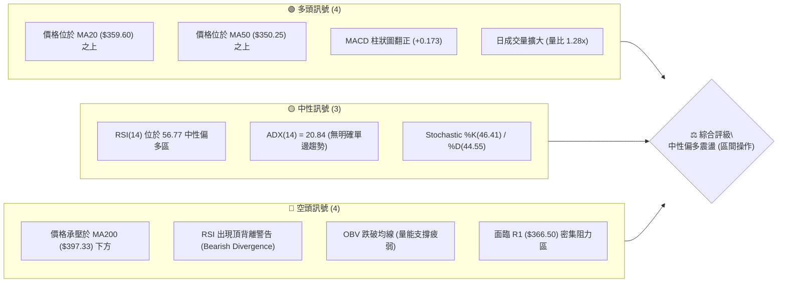
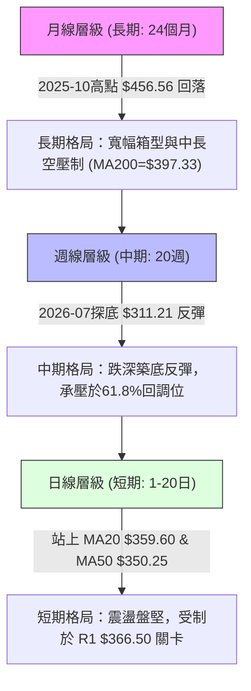
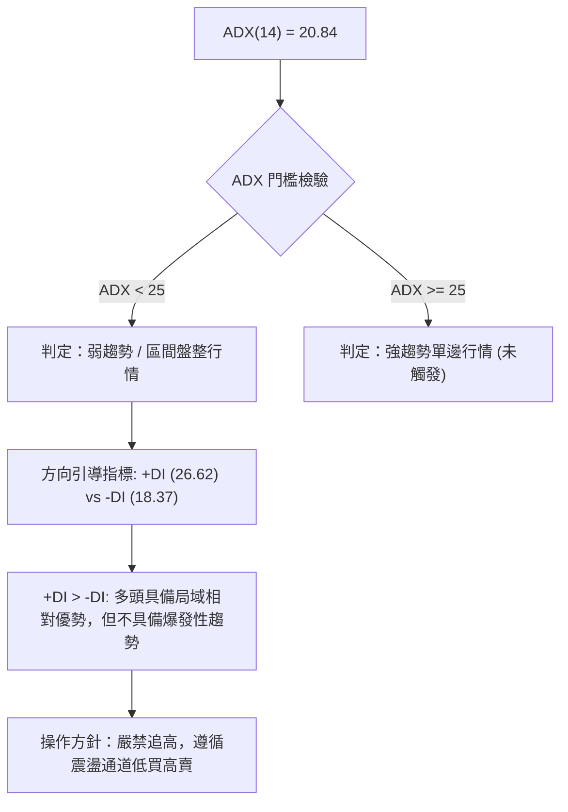
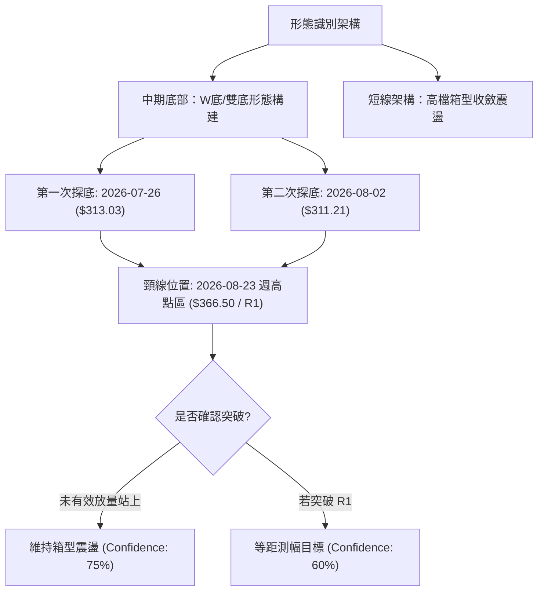
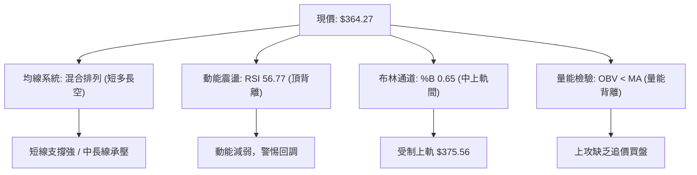
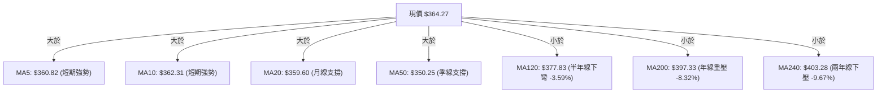
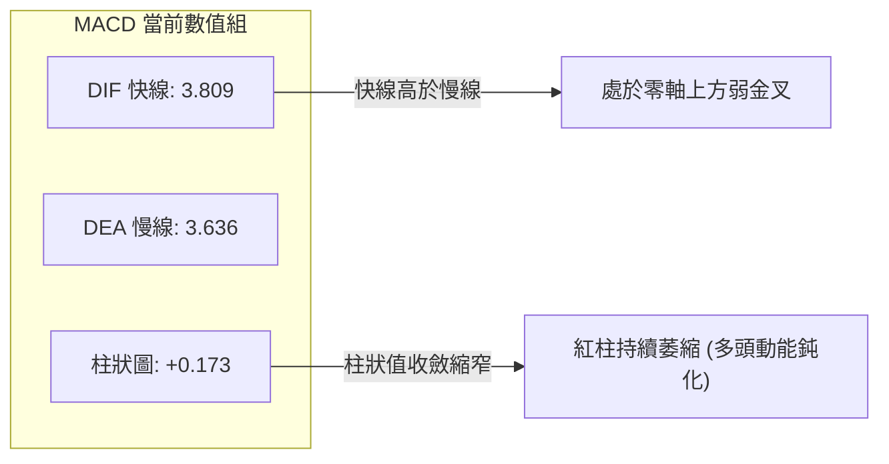
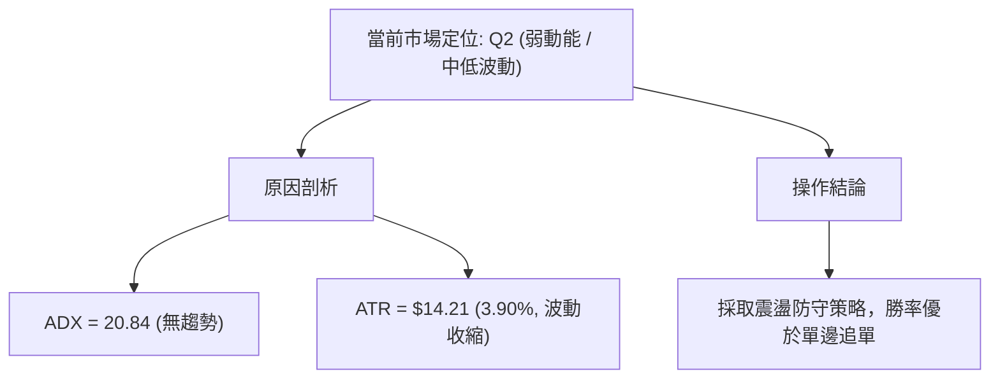
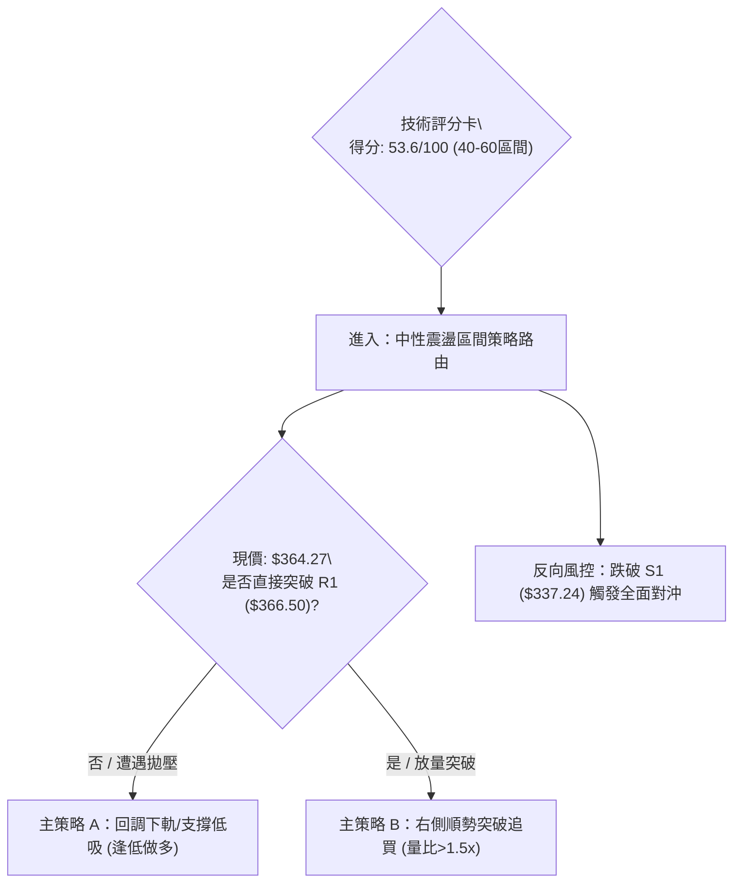
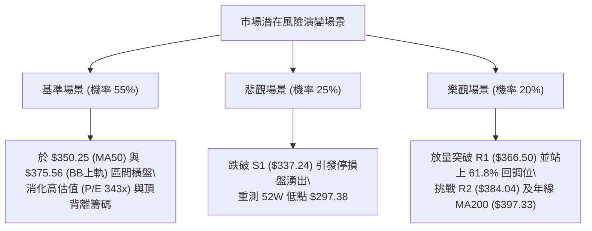

# TSLA 技術分析報告

> **報告日期**：2026-09-18 ｜ **語言**：繁體中文 ｜ **數據來源**：Yahoo Finance ｜ **當前價格**：$364.27

---

## 目錄

| 章節 | 內容 |
|------|------|
| [1. 技術面概覽](#1-技術面概覽) | 訊號儀表板、核心指標、評分卡 |
| [2. 趨勢分析](#2-趨勢分析) | 多時框趨勢、長中短期走勢、ADX解讀 |
| [3. 圖表形態分析](#3-圖表形態分析) | 形態識別、K線組合、目標價推算 |
| [4. 支撐與阻力](#4-支撐與阻力) | 關鍵價位分佈、斐波那契回調結構 |
| [5. 技術指標深度解讀](#5-技術指標深度解讀) | MA排列、RSI背離、MACD、布林通道、量價OBV |
| [6. 動能與波動率](#6-動能與波動率) | 動能四象限、ATR波動分析、Beta風險系數 |
| [7. 多時框架總結](#7-多時框架總結) | 時框架矩陣、多時框收斂結論 |
| [8. 交易策略建議](#8-交易策略建議) | 策略路由、價格階梯、主客策略細節、風控評星 |
| [9. 風險提示與監控](#9-風險提示與監控) | 監控清單、風險場景樹、倉位管理準則 |
| [📋 報告總結](#-報告總結) | 總結看板與免責聲明 |

---

## 1. 技術面概覽

### 🎯 技術訊號儀表板



### 📊 核心指標速覽表

| 指標類別 | 指標名稱 | 當前數值 | 訊號 | 解讀 |
|:---|:---|:---|:---:|:---|
| **價格** | 當前收盤價 | $364.27 | 🟡 | 位於52週區間 33.2% 分位，處於中低位築底反彈段 |
| **均線** | 短期 MA20 | $359.60 | 🟢 | 現價高於 MA20 (+1.30%)，短線多頭掌握主控權 |
| **均線** | 中期 MA50 | $350.25 | 🟢 | 現價高於 MA50 (+4.00%)，中期基底具備動態支撐 |
| **均線** | 長期 MA200 | $397.33 | 🔴 | 現價低於 MA200 (-8.32%)，長期格局仍受空頭結構壓制 |
| **動能** | RSI(14) | 56.77 | 🟡 | 位於50中軸上方，但已觸發頂背離預警，上行阻力大 |
| **動能** | MACD (12,26,9) | 3.809 / 3.636 | 🟢 | DIF 高於 DEA，柱狀圖 +0.173，維持弱多頭金叉狀態 |
| **擺動** | KD (Stoch 14,3,3)| 46.41 / 44.55 | 🟡 | 位於中值區間，短期無超買超賣極端現象 |
| **趨勢** | ADX(14) | 20.84 | 🟡 | ADX < 25 表明趨勢動能疲弱，市場屬於區間震盪型態 |
| **通道** | 布林通道 %B | 0.65 | 🟡 | 位於中軌 ($359.60) 與上軌 ($375.56) 之間，偏向溫和多頭 |
| **量能** | 20日量比 | 1.28x (51.77M) | 🟢 | 單日量能高於均量，然而 OBV 仍在均線下方，追高動能受限 |
| **波動** | ATR(14) | $14.21 (3.90%) | 🟡 | 每日平均波動約 14 美元，提供標準風控距離參考 |

### 🏆 技術評分卡

```
╔══════════════════════════════════════════════════════════════╗
║               技術評分卡 — TSLA (2026-09-18)                ║
╠══════════════════════════════════════════════════════════════╣
║ 趨勢強度 (Trend)     ████████░░░░░░░░░░░░  42/100  🟡 弱勢盤整 ║
║ 動能指標 (Momentum)  ████████████░░░░░░░░  58/100  🟡 頂背微弱 ║
║ 支撐穩定度 (Support) ██████████████░░░░░░  68/100  🟢 底部紮實 ║
║ 成交量配合 (Volume)  ██████████░░░░░░░░░░  48/100  🟡 量價分歧 ║
║ 形態完整度 (Pattern) ████████████░░░░░░░░  56/100  🟡 矩形整理 ║
║ 均線排列 (Moving Av) ██████████░░░░░░░░░░  50/100  🟡 混合排列 ║
╠══════════════════════════════════════════════════════════════╣
║ 綜合技術評分         ███████████░░░░░░░░░  53.6/100 評級: 🟡中性║
╚══════════════════════════════════════════════════════════════╝
```

---

## 2. 趨勢分析

### 🌐 多時框趨勢分析



### 📈 長期趨勢 — 12個月走勢圖（Unicode）

TSLA 過去一年歷經自 2025 年秋季高點的持續回落，並在 2026 年夏季於 $311.21 形成關鍵低點支撐後反彈。

```
TSLA 月線收盤走勢圖（過去12個月：2025-10 至 2026-09）
價格 ($)
$460 ┤  ● (2025-10: 456.56)
$440 ┤      ● (12: 449.72)
$420 ┤    ●(11) ●(01: 430.41)                   ● (05: 435.79)
$400 ┤              ● (02: 402.51)          ● (06: 420.60)
$380 ┤                          ● (04: 381.63)
$360 ┤                      ● (03: 371.75)             ● (08: 367.95)
$340 ┤                                                    ●現價 364.27 (09)
$320 ┤
$300 ┤                                              ● (07: 311.21 低點)
     └─────────────────────────────────────────────────────────────
       10  11  12  01  02  03  04  05  06  07  08  09 (月份)
```

#### 走勢特徵分析表格

| 階段區間 | 時間段 | 價格區間 ($) | 漲跌幅 | 結構特徵與成交量型態 |
|:---|:---|:---|:---:|:---|
| **第一階段：高檔震盪** | 2025-10 ~ 2026-01 | $456.56 → $430.41 | -5.73% | 於 $450 上方多次上攻乏力，構築高檔雙重頂雛形 |
| **第二階段：震盪陰跌** | 2026-01 ~ 2026-03 | $430.41 → $371.75 | -13.63% | 連續跌破各期短均線，跌破多頭防守點位 |
| **第三階段：次級反彈** | 2026-03 ~ 2026-05 | $371.75 → $435.79 | +17.23% | 空頭回補與反彈，形成中繼高點，但未創歷史新高 |
| **第四階段：主跌破位** | 2026-05 ~ 2026-07 | $435.79 → $311.21 | -28.59% | 週線巨量下殺，直接打至52週低點附近 ($297.38支撐帶) |
| **第五階段：築底復甦** | 2026-07 ~ 2026-09 | $311.21 → $364.27 | +17.05% | 自底部超賣區展開 V 型修復，目前於中軸整理 |

### 📊 中期趨勢（週線分析）

從近 20 週數據觀察，TSLA 經歷了 2026 年 7 月下旬的極度超賣（2026-07-26 週 RSI 跌至 15.7、收盤價 $313.03），隨後在 8 月中旬展開強勁的均值回歸。MACD 柱狀圖自 -8.365 谷底回升至正值區間，週 RSI 亦脫離超賣區回歸 50-60 中性區間。

```
週線支撐與壓力拓撲示意圖：
[阻力 R3: $409.28]  ───────────────────────────────── (MA200與回調密集區)
                         ↑
[阻力 R2: $384.04]  ─────────────── (前波下跌密集成交帶)
                         ↑
[阻力 R1: $366.50]  ───────▲─────── (近3週收盤密集阻力)
                     現價 $364.27 
───────────────────────────▼────────────────────────
[支撐 S1: $337.24]  ─────────────── (8月中旬起漲頸線支撐)
                         ↓
[支撐 S2: $297.38]  ───────────────────────────────── (52週絕對低點)
```

### ⚡ 趨勢強度評估（ADX 解讀）



#### ADX 趨勢強度對照表

| 指標變數 | 當前讀數 | 門檻參照 | 市場狀態詮釋 | 交易指導方針 |
|:---|:---:|:---:|:---|:---|
| **ADX 數值** | **20.84** | < 25: 盤整 / > 25: 趨勢 | 市場處於「無趨勢盤整」階段 | 趨勢跟隨指標失效，改採震盪震幅策略 |
| **+DI (多頭動能)** | **26.62** | 基準線 20.00 | 多頭略佔主導地位 | 逢低回調支撐偏多操作勝率較高 |
| **-DI (空頭動能)** | **18.37** | 基準線 20.00 | 空方壓制力道弱化 | 尚未出現主動性崩跌拋壓 |
| **DI 差值 (+DI - -DI)** | **+8.25** | 正向擴張 | 局域買盤略勝一籌 | 向上觸及通道上軌容易遭遇阻力回調 |

---

## 3. 圖表形態分析

### 🔍 形態識別系統



#### 形態識別信心度評估表（嚴格依據數據）

| 形態類別 | 信心度 | 判斷依據（引用數據） | 完成度 | 目標價（附嚴格計算式） |
|:---|:---:|:---|:---:|:---|
| **中期雙重底 (W-Bottom)** | **62%** | 兩次波段低點分別為 2026-07-26 ($313.03) 與 2026-08-02 ($311.21)，低點未破 52W Low ($297.38)，隨後展開反彈。 | 75% | 頸線為波段高點聚類 R1 ($366.50)，形態深度 = 頸線 $366.50 - 低點 $311.21 = $55.29。突破目標 = $366.50 + $55.29 = **$421.79**（恰與斐波那契 38.2% 回調位 $421.88 吻合）。 |
| **高檔收斂矩形** | **78%** | 近4週收盤於 $348.75 ~ $365.44 之間窄幅波動，日線布林通道帶寬收窄。 | 85% | 箱頂為 R1 ($366.50)，箱底為短線 MA20 ($359.60) 及 S1 ($337.24)。突破則朝上軌 $375.56，跌破則測 S1 $337.24。 |
| **頭肩底形態** | **35%** | 訊號不足，僅有左肩與頭部特徵，缺乏明確右肩對稱結構與量能驗證。 | 30% | 信心度低於 50%，依規定不予採納，僅做純指標解讀。 |

### 🕯️ 重要K線形態分析

| 週/月份週期 | 收盤價 ($) | 識別K線組合 | 技術意涵與量價驗證 | 訊號強度 |
|:---|:---:|:---|:---|:---:|
| **2026-07-26 週** | $313.03 | 長陰貫穿 / 恐慌拋售棒 | 週成交量爆出 2.75 億股，跌破前低，RSI 崩落至 15.7，恐慌盤湧出 | 🔴 極度偏空 |
| **2026-08-02 週** | $311.21 | 錘頭星 / 探底十字星 | 成交量縮減至 1.98 億股，收盤止跌企穩，形成波段實質低點 | 🟢 多頭晨星雛形 |
| **2026-08-16 週** | $342.27 | 穿頭破腳長陽線 | 實體陽線收復多條短均線，週 RSI 回彈至 70.4，確立底部反轉 | 🟢 強勁反轉確認 |
| **2026-08-23 週** | $362.86 | 衝高受阻上影線 | 觸及阻力位 R1 ($366.50) 附近遭遇解套拋壓，MACD 柱狀見頂 | 🟡 上檔賣壓湧現 |
| **2026-09-13 週** | $365.44 | 高檔窄幅孕線 | 成交量急劇萎縮至 1.43 億股，量價背離，呈現觀望氣氛 | 🟡 變盤前兆 |
| **2026-09-20 週** | $364.27 | 橫向整理陰十字星 | 多空雙方於現價 $364.27 形成均勢平衡，等待催化劑 | 🟡 橫盤平衡 |

### 📉 ASCII 走勢形態示意圖

```
TSLA 底部築底與當前收斂示意圖
價格
$370 ┤                                 [頸線/R1: $366.50]
     │                             ┌───┬───┐ ◄ 現價 $364.27 震盪
$360 ┤                         ┌───┘   │   └─── [MA20: $359.60]
     │                     ┌───┘       └───近期整理箱體
$350 ┤                     │
     │                 ┌───┘ [MA50: $350.25]
$340 ┤                 │
     │                 │   [S1: $337.24 支撐頸線]
$330 ┤             ┌───┘
     │             │
$320 ┤     ▲       │
     │    ╱ ╲      │
$310 ┤───●   ●─────●  [底1: $313.03]  [底2: $311.21]
     └──────────────────────────────────────────────────
       07-26 08-02 08-16 08-23 08-30 09-06 09-13 09-20 (週)
```

### 🎯 形態目標價計算

依據標準雙底測幅公式計算：
1. **基底低點 ($L$)**：取 2026-08-02 週收盤點位 **$311.21**。
2. **頸線阻力 ($H$)**：取關鍵價位 R1 **$366.50**。
3. **形態高度 ($\Delta$)**：
   $$\Delta = H - L = \$366.50 - \$311.21 = \$55.29$$
4. **向上突破最小測幅目標 (Target 1)**：
   $$\text{Target 1} = H + \Delta = \$366.50 + \$55.29 = \$421.79$$
   *(該數值與歷史阻力及 38.2% 斐波那契回調位 $421.88 形成高度共振，共振誤差僅 $0.09)*。
5. **保守收斂目標 (保守波段阻力 R2)**：
   若形態未放量突破，則第一受阻位直接以既有近一年波段高點聚類 **$384.04** 作為階段目標。

---

## 4. 支撐與阻力

### 🗺️ 關鍵價位分布圖（Unicode）

```
TSLA 價位結構分布圖 (當前現價: $364.27)
════════════════════════════════════════════════════════════════════
$498.83 ║████████████████████████████████████████║ 52週最高點 (0.0%)
$451.29 ║████████████████████████████████        ║ 斐波那契 23.6%
$421.88 ║████████████████████████████████████    ║ 斐波那契 38.2%
$409.28 ║████████████████████████████████████████║ 密集強阻力 R3 (+12.36%)
$398.10 ║████████████████████████                ║ 斐波那契 50.0% / MA200($397.33)
$384.04 ║████████████████████████████            ║ 波段阻力 R2 (+5.43%)
$374.33 ║████████████████████                    ║ 斐波那契 61.8% / BB上軌($375.56)
$366.50 ║████████████████████████████████████    ║ 短線關鍵阻力 R1 (+0.61%)
════════╬════════════════════════════════════════╬══════════════════
$364.27 ╠════════════════════════════════════════╣ ◄ 當前市價 ($364.27)
════════╬════════════════════════════════════════╬══════════════════
$359.60 ║▓▓▓▓▓▓▓▓▓▓▓▓▓▓▓▓▓▓▓▓▓▓                  ║ 布林中軌 / MA20
$350.25 ║▓▓▓▓▓▓▓▓▓▓▓▓▓▓▓▓                        ║ 中期支撐 MA50
$343.64 ║▓▓▓▓▓▓▓▓▓▓▓▓▓▓▓▓▓▓▓▓                    ║ 布林下軌
$340.49 ║▓▓▓▓▓▓▓▓▓▓▓▓▓▓▓▓▓▓▓▓▓▓▓▓                ║ 斐波那契 78.6%
$337.24 ║▓▓▓▓▓▓▓▓▓▓▓▓▓▓▓▓▓▓▓▓▓▓▓▓▓▓▓▓▓▓▓▓        ║ 近一年波段支撐 S1 (-7.42%)
$297.38 ║▓▓▓▓▓▓▓▓▓▓▓▓▓▓▓▓▓▓▓▓▓▓▓▓▓▓▓▓▓▓▓▓▓▓▓▓▓▓▓║ 52週低點 / 強支撐 S2 (-18.36%)
════════════════════════════════════════════════════════════════════
```

### 🚧 阻力位分析表

所有阻力價位嚴格引用系統計算之波段聚類數值：

| 阻力級別 | 精確價位 | 距離現價 | 形成原因與籌碼特徵 | 突破難度 | 戰略重要性 |
|:---|:---:|:---:|:---|:---:|:---:|
| **阻力一 (R1)** | **$366.50** | +0.61% | 近一年波段高點聚類位，近4週多頭多次衝擊均告失敗之收盤心理整數防線。 | 🟡 中等 | ★★★★☆ |
| **阻力二 (R2)** | **$384.04** | +5.43% | 2026年4月收盤位 ($381.63) 與多週反彈高點重合帶，也是空頭回補關鍵帶。 | 🔴 較高 | ★★★★☆ |
| **阻力三 (R3)** | **$409.28** | +12.36% | 長期週線密集頭部套牢區，上方臨近 MA200 ($397.33) 與 50% 回調位 ($398.10)。 | 🔴 極高 | ★★★★★ |

### 🛡️ 支撐位分析表

所有支撐價位嚴格引用系統計算之波段聚類數值：

| 支撐級別 | 精確價位 | 距離現價 | 形成原因與籌碼特徵 | 守住機率 | 戰略重要性 |
|:---|:---:|:---:|:---|:---:|:---:|
| **支撐一 (S1)** | **$337.24** | -7.42% | 近一年波段低點聚類位，8月中旬啟動反彈之平台起漲點，具極強籌碼支撐。 | 🟢 75% | ★★★★☆ |
| **支撐二 (S2)** | **$297.38** | -18.36% | 52週絕對歷史低點，長線多頭最後防線，跌破將引發系統性估值重新定價。 | 🟢 90% | ★★★★★ |

### 📐 斐波那契回調位分析

依據 52 週波動極值（低點 **$297.38** 至 高點 **$498.83**，波幅達 **$201.45**）精確測算：

| 斐波那契回調比例 | 對應價位 | 意義與當前市況關係 |
|:---:|:---:|:---|
| **0.0% (52W High)** | **$498.83** | 極端超買歷史頂峰，短期不可逾越之天花板。 |
| **23.6%** | **$451.29** | 2025年10月-12月長期箱體頂部區。 |
| **38.2%** | **$421.88** | 2026年6月崩跌前夕平台位置，強阻力帶。 |
| **50.0%** | **$398.10** | 多空分水嶺，與 MA200 ($397.33) 高度重合，構成結構反轉核心關卡。 |
| **61.8% (黃金分割)** | **$374.33** | 上檔第一道技術解套反壓位，與布林上軌 ($375.56) 形成共振阻力。 |
| **78.6%** | **$340.49** | 深幅回調關鍵防禦點，緊鄰 S1 支撐位 ($337.24)。 |
| **100.0% (52W Low)**| **$297.38** | 絕對底部基準。 |

> **當前位置解讀**：現價 **$364.27** 精確處於 **61.8% ($374.33)** 與 **78.6% ($340.49)** 之間。在技術分析理論中，跌破 61.8% 且在 78.6% 上方獲得支撐的反彈，若無法突破 61.8% 黃金分割阻力（$374.33），則本質上屬於「空頭趨勢中的次級弱勢反彈」；唯有放量突破 $374.33 並攻克 50% 回調位 ($398.10)，方可宣告中期趨勢反轉。

---

## 5. 技術指標深度解讀

### 🎛️ 指標訊號總覽



### 📈 移動平均線排列分析



#### 均線階層架構解讀

1. **短期均線簇 (MA5, MA10, MA20, MA60)**：全數呈現多頭扣抵上揚，MA20 ($359.60) 與 MA60 ($359.03) 於 $359 附近黏合共振，形成短線極強之動態下檔緩衝墊。
2. **中長期均線簇 (MA120, MA200, MA240)**：MA120 ($377.83) 及 MA200 ($397.33) 均呈現向下傾斜態勢，且與現價存在負乖離。此結構為典型「空頭主導下的低位反彈」，現價向上進入 $377–$397 區間時將面臨沉重的解套拋壓。

### 📉 RSI(14) 分析與背離判定

```
RSI(14) 讀數儀表盤:
0       20       30               50       56.77     70       80      100
├───────┼────────┼────────────────┼─────────●────────┼────────┼────────┤
  極度超賣   超賣區          弱勢區        中軸     當前      超買區   極度超買
當前進度條: ████████████████████████████░░░░░░░░░░░░░░░░░░░░  56.77%
```

#### ⚠️ 背離分析（頂背離成立）
- **形態事實**：
  - 2026-08-23 週：TSLA 收盤價為 **$362.86**，對應週 RSI 達到 **72.7**。
  - 2026-09-13 週：TSLA 收盤價攀升至 **$365.44**（創反彈新高），然而週 RSI 卻降至 **51.0**；當前最新 RSI 僅為 **56.8**。
- **結論**：價格創出反彈新高，但動能指標未能同步創高，形成標準的**看跌頂背離 (Bearish Divergence)**。這表明買盤後勁動能衰退，主力資金在此區間更多是維持橫盤震盪以進行出貨或籌碼換手，短期向上突破失敗並回踩中軌的風險顯著增高。

### 📊 MACD(12/26/9) 訊號解讀



- **MACD 線**：3.809 高於 Signal 線 3.636，維持多頭排列。
- **柱狀圖 (Histogram)**：讀數僅為 **+0.173**，較 8 月下旬的峰值 (+6.229) 出現大幅衰減，顯示短期上衝動能已經嚴重衰竭，指標即將面臨零軸附近的「死叉」邊緣，多頭若不能放量攻克 R1，MACD 轉負將引發指標共振回踩。

### 📦 布林通道分析

```
TSLA 日線布林通道 (Bollinger Bands 20, 2) 結構圖
價格軸 ($)
$375.56 ┬──────────────────────────────────────── 布林上軌 (阻力帶)
$370.00 ┤
$364.27 ┼───────────────────● 現價 (BB %B = 0.65)
$360.00 ┤
$359.60 ┼──────────────────────────────────────── 布林中軌 (MA20 支撐)
$350.00 ┤
$343.64 ┴──────────────────────────────────────── 布林下軌 (超賣邊界)
```

- **通道寬度**：上軌 **$375.56** 與下軌 **$343.64** 頻寬僅為 $31.92（約 8.7%），通道帶寬處於近半年低檔收斂狀態，預示即將迎來變盤行情。
- **%B 位置**：當前數值為 **0.65**，代表價格處於中軌（0.5）與上軌（1.0）之間，屬溫和偏多區，上行首要空間受制於上軌 $375.56（與斐波那契 61.8% $374.33 高度吻合）。

### 💹 成交量分析（量價配合度）

1. **單日量比放大**：當日最新成交量為 **51,771,532 股**，相對於 20 日均量 (40,477,057 股) 量比為 **1.28x**，顯示有資金介入。
2. **OBV (能量潮) 疲弱**：系統數據明確顯示 **「OBV趨勢：OBV < MA → 量能疲弱」**。這表示雖然短日有放量，但在整體波段上，資金呈淨流出狀態，上漲過程成交量萎縮，未能有效支持價格展開波瀾壯闊的單邊主升浪，屬於「虛假放量、實質分歧」。

---

## 6. 動能與波動率

### ⚡ 動能評估四象限

| 象限分佈 | 動能維度 (Momentum) | 波動率維度 (Volatility) | 當前標的狀態 | 交易戰略含義 |
|:---|:---:|:---:|:---:|:---|
| **第一象限 (Q1)** | 強動能 (+DI > 30, MACD擴張) | 低波動 (ATR < 3%) | — | 最優主升浪騎乘區間 |
| **第二象限 (Q2)** | **弱動能 (ADX: 20.84, RSI背離)** | **中低波動 (ATR: 3.90%)** | **✓ TSLA 當前定位** | **謹慎觀望：區間操作，嚴禁追高追突破** |
| **第三象限 (Q3)** | 強動能 (+DI 強勢突破) | 高波動 (ATR > 5%) | — | 突破行情：追隨趨勢，嚴設保護止損 |
| **第四象限 (Q4)** | 弱動能 (空頭全面主導) | 高波動 (急跌崩潰) | — | 避險放空或完全空倉觀望 |



### 📊 ATR 波動率分析

- **ATR(14) 絕對值**：**$14.21**，佔當前股價的 **3.90%**。
- **每日預期波動區間**：在一個標準差（68% 置信度）下，TSLA 每日正常波動邊界為 $\pm \$14.21$。
- **動態止損距離設定建議**：
  - **短線交易 (1.5x ATR)**：$\$14.21 \times 1.5 = \mathbf{\$21.32}$。
  - **波段交易 (2.0x ATR)**：$\$14.21 \times 2.0 = \mathbf{\$28.42}$。
  - 若在現價 $364.27 建立多頭，常規無雜訊安全止損位應設於現價扣除 1.5x ATR 即 **$342.95**（恰好座落於布林下軌 $343.64 與斐波那契 78.6% $340.49 的防護帶）。

### 📐 Beta 與市場相關性

- **Beta 數值**：**1.845**（高敏感度成長股）。
- **市場意涵**：TSLA 的波動率約為標準普爾 500 指數的 **1.85 倍**。在當前大盤無強烈單邊趨勢之際，TSLA 的高 Beta 屬性會放大盤整區間內的來回洗盤幅度，因此持倉規模不可過大，避免情緒化交易。

---

## 7. 多時框架總結

### 📋 時框架評分表

| 時框架 | 趨勢方向 | 動能指標 | 均線排列 | 形態結構 | 綜合評分 | 操作建議 |
|:---|:---:|:---:|:---:|:---:|:---:|:---|
| **日線 (短期)** | 🟢 震盪偏多 | 🟡 RSI背離 | 🟢 站上MA20/50 | 🟡 箱型整理 | **58/100** | 區間操作，R1 附近獲利了結 |
| **週線 (中期)** | 🟡 築底反彈 | 🟢 MACD金叉 | 🔴 承壓MA120 | 🟢 雙底構建中 | **54/100** | 回調至 S1 不破可逢低佈局 |
| **月線 (長期)** | 🔴 空頭下行 | 🔴 長期走弱 | 🔴 低於MA200 | 🔴 長期頂部確立 | **42/100** | 長線多頭宜保守減碼或對沖 |

### 🔲 綜合訊號矩陣

```
┌─────────────────┬──────────┬──────────┬──────────┐
│ 維度 \ 時框     │ 日線 (短)│ 週線 (中)│ 月線 (長)│
├─────────────────┼──────────┼──────────┼──────────┤
│ 均線架構 (Trend)│ 偏多 🟢  │ 震盪 🟡  │ 空頭 🔴  │
│ 震盪指標 (Osc.) │ 背離 🔴  │ 偏多 🟢  │ 偏空 🔴  │
│ 量能結構 (Vol.) │ 虛放 🟡  │ 萎縮 🔴  │ 平淡 🟡  │
│ 支撐壓力 (S/R)  │ 面臨R1 🔴│ 脫離S2 🟢│ 空頭主導 🔴│
└─────────────────┴──────────┴──────────┴──────────┘
```

### ⚖️ 多時框收斂結論（嚴格遵守規則14）

> **行情屬性判定**：當前 **ADX(14) = 20.84 (< 25)**，嚴格判定為**「盤整行情 (Range-bound Market)」**。
>
> **主導時框收斂原則**：在盤整行情中，中長期趨勢指標（MA200）鈍化，市場定價以**「日線布林通道上下軌與近端波段 S/R 關鍵價位」**為最高依據。
>
> **唯一方向性結論**：**【中性觀望，區間高拋低吸】**。
> 雖短期站上 MA20，但由於日線 RSI 頂背離、OBV 疲軟，且上方直接受阻於近一年波段高點 R1 ($366.50) 及斐波那契 61.8% ($374.33)，因此**絕不可在此位置追高買入**；主要策略應鎖定布林通道內部震盪或等待回調至主要支撐位。

---

## 8. 交易策略建議

### 🗺️ 策略決策流程圖



### 🧭 策略路由說明

- **當前主策略方向**：**區間雙向防守型策略（偏向高拋低吸），綜合評分 53.6/100**。
- 由於分數座落於 40–60 之「中性盤整」區，依規則嚴禁孤注一擲單邊下注，以「**逢回檔關鍵支撐低吸（策略A）**」為主，並輔以「**帶量攻克關鍵阻力之右側突破（策略B）**」。

### 🎯 價格情境階梯（Price Scenarios）

價位嚴格引用數據庫中波段高低點與斐波那契回調位：

| 觸發條件 | 第一目標 (T1) | 第二延伸目標 (T2) | 風險止損防線 | 情境戰略含義 |
|:---|:---:|:---:|:---:|:---|
| **有效突破 R1 ($366.50)** | **$384.04 (R2)** | **$409.28 (R3)** | $359.60 (MA20) | 短線強勢突圍，挑戰年線及雙底等距測幅 |
| **維持於現價區間震盪** | $375.56 (BB上軌) | $359.60 (BB中軌) | $343.64 (BB下軌) | 區間箱型洗盤，籌碼沉澱 |
| **跌破 S1 ($337.24)** | **$297.38 (S2)** | — | $350.25 (MA50) | 中期反彈破位，尋求 52 週歷史大底支撐 |

### 📊 情境機率分佈

| 情境劇本 | 估計機率 | 主要量化與技術依據 |
|:---|:---:|:---|
| **情境一：區間震盪整理** | **55%** | ADX = 20.84 (<25)，布林通道收口，市場等待基本面與外部催化。 |
| **情境二：受阻回落探底** | **25%** | RSI 頂背離警告確立，OBV 疲軟無力，上方 R1 及 MA200 壓制力道強勁。 |
| **情境三：向上放量突破** | **20%** | 最新日量比 1.28x，MACD 維持多頭弱金叉，若帶量越過 $366.50 則引發空頭踩踏。 |

### 🟢 主策略詳情（方向：區間低吸為主，突破追買為輔）

所有交易價位嚴格取自數據表中的計算值：

| 策略要素 | 策略 A（逢低支撐佈局 - 推薦） | 策略 B（強勢突破確認 - 備選） |
|:---|:---|:---|
| **策略類型** | 左側逢低掛單買入 | 右側強勢突破跟進 |
| **進場條件** | 價格回踩 MA20 ($359.60) 或下探布林下軌企穩 | 日K線實體收盤**突破 R1 ($366.50)** 且成交量達均量1.3倍以上 |
| **進場價格** | **$359.60**（或分批至 $343.64） | **$366.50**（突破確認時入場） |
| **目標價 T1** | **$375.56**（布林上軌 / 61.8%反壓） | **$384.04**（波段阻力 R2） |
| **目標價 T2** | **$384.04**（波段阻力 R2） | **$409.28**（密集強阻力 R3） |
| **止損價格** | **$337.24**（跌破波段支撐 S1 嚴格停損） | **$350.25**（跌回中期均線 MA50 止損） |
| **風險報酬比** | **1 : 1.12** (至T2為 **1 : 1.76**) | **1 : 1.08** (至T2為 **1 : 2.63**) |
| **勝率評估** | **65%** | **45%** |
| **建議倉位** | **總資金 10% - 15%** | **總資金 5% - 8%** |

### 🔴 反向風險觸發點（對沖提示）

- **全面空頭轉向觸發位**：若日收盤價有效**跌破 S1 ($337.24)**，說明反彈結構彻底瓦解。
- **風控行動**：立即清空所有短多部位，並可將資金轉為防禦性標的，或透過期權買入認沽合約（Put）避險，下檔回歸考驗 52 週低點 **$297.38 (S2)**。

### ⭐ 整體訊號強度評星

```
做多訊號強度：★★☆☆☆  (2.5/5 星：短線有撐但阻力重重，動能出現背離)
做空訊號強度：★★☆☆☆  (2.5/5 星：處於反彈中段，直接追空易遭嘎空)
整體可信度：  ★★★☆☆  (3.0/5 星：處於震盪通道，信號呈現中度分歧)
```

---

## 9. 風險提示與監控

### ✅ 關鍵監控指標 Checklist

```
╔══════════════════════════════════════════════════════════════╗
║               TSLA 交易日常監控清單 (Checklist)               ║
╠══════════════════════════════════════════════════════════════╣
║ [ ] 價位檢驗: 每日收盤價是否站穩 MA20 ($359.60) 之上？       ║
║ [ ] 阻力檢驗: 盤中衝擊 R1 ($366.50) 時是否伴隨 50M 以上量能？ ║
║ [ ] 動能警報: 日線 RSI(14) 是否跌破 50 中軸防線？             ║
║ [ ] 指標共振: MACD 柱狀圖 (+0.173) 是否由正轉負形成死叉？    ║
║ [ ] 趨勢啟動: ADX(14) 讀數是否由 20.84 向上拉升突破 25？     ║
║ [ ] 資金流向: OBV 能否向上穿越其移動平均線扭轉背離？          ║
║ [ ] 終極風控: 盤中價格是否觸及 S1 ($337.24) 停損警戒線？      ║
╚══════════════════════════════════════════════════════════════╝
```

### ⚠️ 風險場景分析



### 🛡️ 風險管理重要提醒

1. **基本面估值壓力警訊**：TSLA 當前滾動市盈率 (P/E Trailing) 高達 **343.65**，市銷率 (P/S) 達 **13.88**，營業利潤率僅 **1.4%**。高估值意味著容錯率極低，任何外部市場波動均易引發技術面殺跌。
2. **波動度管理**：當前 ATR 為 **$14.21**（日波動 3.90%），在單筆交易中，承擔的風險資金不可超過總投資組合淨值的 **1% ~ 1.5%**。若以 $21.32 (1.5x ATR) 為停損幅度，單一部位倉位上限應嚴格控制在總資金的 **15%** 以內。

---

## 📋 報告總結

```
╔══════════════════════════════════════════════════════════════════╗
║                   TSLA 技術分析總結看板                          ║
╠══════════════════════════════════════════════════════════════════╣
║ 報告基準日期：2026-09-18                                        ║
║ 當前收盤價格：$364.27                                            ║
║ 綜合技術評級：⚖️ 中性觀望 (區間震盪整理，評分 53.6 / 100)        ║
╠══════════════════════════════════════════════════════════════════╣
║ 關鍵維度技術定論：                                               ║
║ ├─ 長期趨勢 (月線)：🔴 偏空受制於下彎 MA200 ($397.33)            ║
║ ├─ 中期趨勢 (週線)：🟡 自 $311.21 築底反彈，承壓於斐波 61.8%     ║
║ ├─ 短期趨勢 (日線)：🟢 站上 MA20/50，但受制於 R1 ($366.50)       ║
║ ├─ 關鍵支撐陣列：S1: $337.24 ｜ S2: $297.38 (52W Low)           ║
║ ├─ 關鍵阻力陣列：R1: $366.50 ｜ R2: $384.04 ｜ R3: $409.28      ║
║ └─ 華爾街共識目標：$396.94 (38位分析師均值，隱含 +8.97% 空間)   ║
╠══════════════════════════════════════════════════════════════════╣
║ 最優實操策略組合：                                               ║
║ 1. 🥇 最佳機會：等待回踩 MA20 ($359.60) 或通道下部低吸，止損 S1 ║
║ 2. 🥈 次選機會：放量突破 R1 ($366.50) 右側追多，目標看 R2 $384  ║
║ 3. 🥉 保守選擇：空倉觀望，待 ADX > 25 明確趨勢發散後再行跟進     ║
╚══════════════════════════════════════════════════════════════════╝
```

---

> ⚠️ **免責聲明**：
> 本技術分析報告係依據 Yahoo Finance 截至 2026-09-18 之歷史行情數據（OHLCV）與多時框架量化模型自動生成。報告內容僅作為技術教學、學術研究與交易架構驗證參考，**不構成任何形式的證券買賣邀約、投資建議或獲利保證**。技術指標具備滯後性，金融市場充滿不確定性，投資人應獨立思考、審慎評估市場風險，並對自身交易決策承擔全部責任。

---
*報告生成時間：2026-09-18 ｜ 數據來源：Yahoo Finance ｜ 分析框架：多時框架量化技術體系*