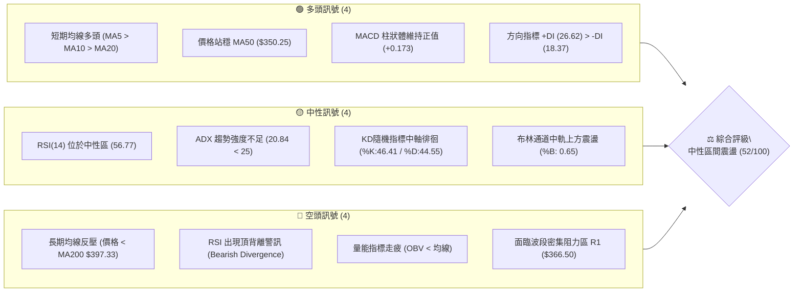
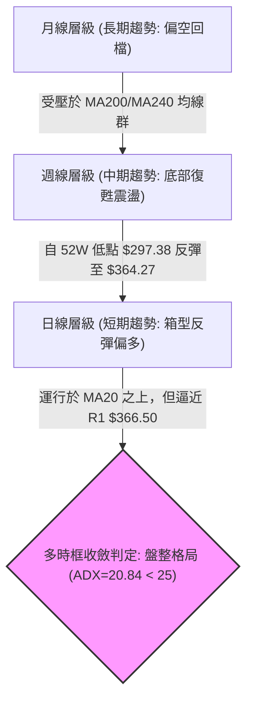
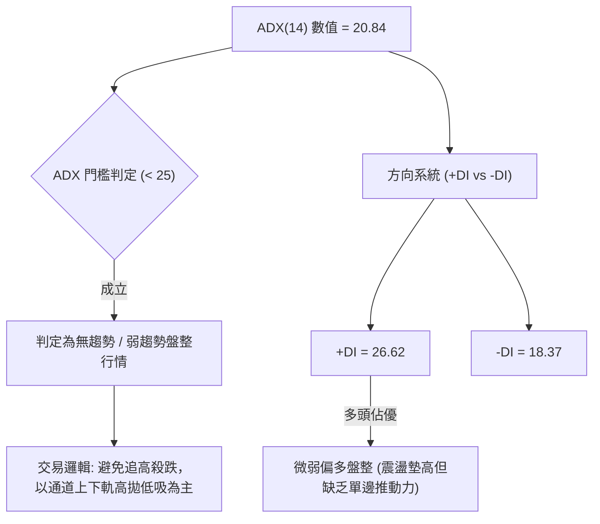
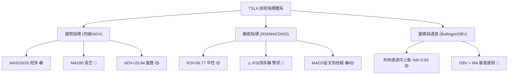
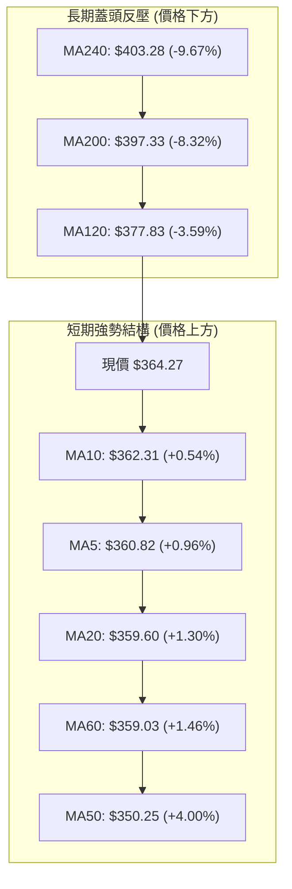
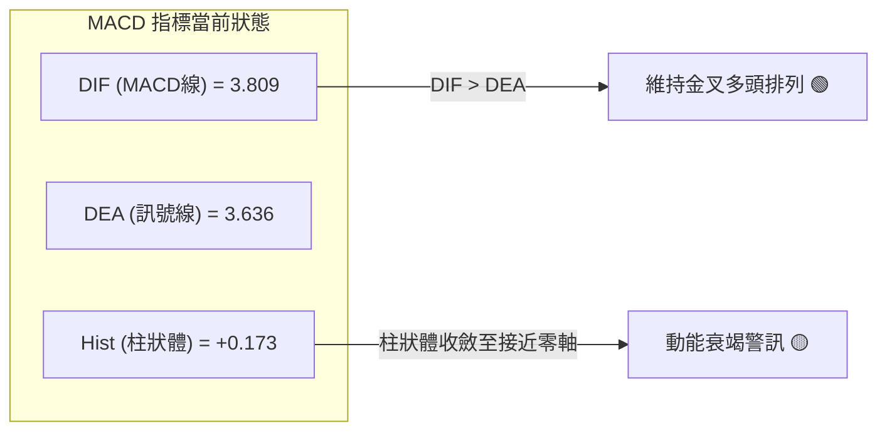
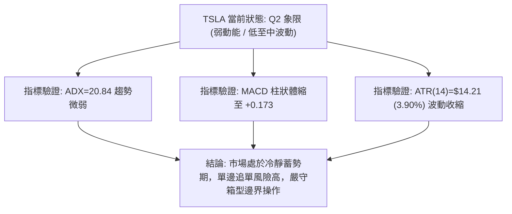
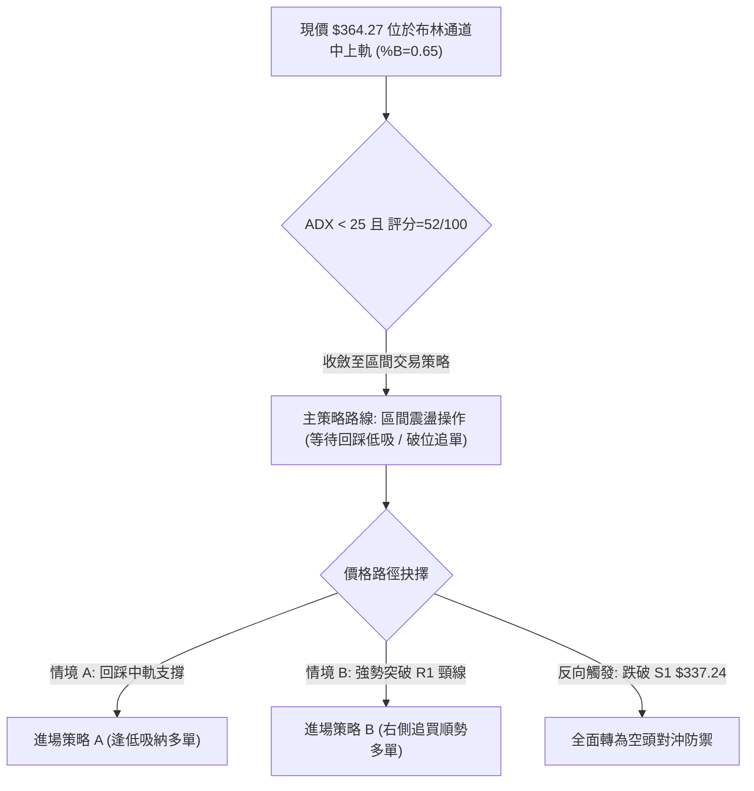
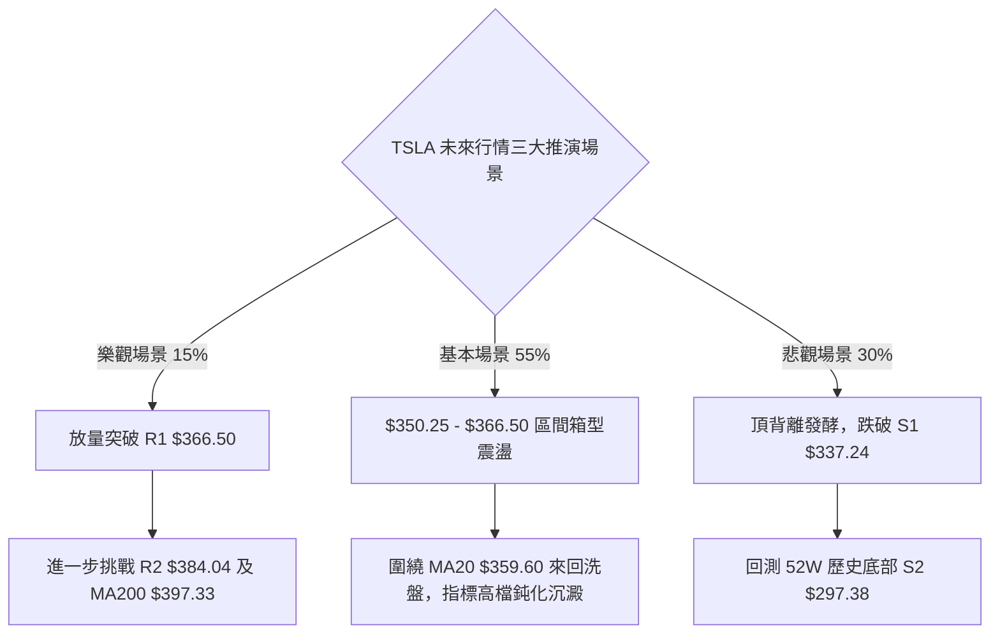

# TSLA 技術分析報告

> **報告日期**：2026-09-19 ｜ **語言**：繁體中文 ｜ **數據來源**：Yahoo Finance ｜ **當前價格**：$364.27

---

## 目錄

| 章節 | 內容 |
|------|------|
| [1. 技術面概覽](#1-技術面概覽) | 訊號儀表板、核心指標、評分卡 |
| [2. 趨勢分析](#2-趨勢分析) | 多時框趨勢、長中短期走勢、12個月ASCII走勢圖、ADX解讀 |
| [3. 圖表形態分析](#3-圖表形態分析) | 形態識別、信心度評估、K線組合、目標價推算 |
| [4. 支撐與阻力](#4-支撐與阻力) | 關鍵價位分布圖、阻力位、支撐位、斐波那契回調結構 |
| [5. 技術指標深度解讀](#5-技術指標深度解讀) | MA均線系統、RSI頂背離、MACD動能、布林通道、量價OBV |
| [6. 動能與波動率](#6-動能與波動率) | 動能評估四象限、ATR波動度、Beta係數分析 |
| [7. 多時框架總結](#7-多時框架總結) | 時框架評分表、訊號收斂優先級結論 |
| [8. 交易策略建議](#8-交易策略建議) | 策略路由決策、價格情境階梯、主交易策略規格、風控對沖 |
| [9. 風險提示與監控](#9-風險提示與監控) | 監控指標Checklist、三種市場情境、資金管理法則 |
| [報告總結](#-報告總結) | 全文核心結論與策略決策歸納 |

---

## 1. 技術面概覽

### 🎯 技術訊號儀表板



---

### 📊 核心指標速覽表

| 指標類別 | 指標名稱 | 當前數值 | 訊號 | 專業解讀 |
|:---|:---|:---|:---:|:---|
| **價格定位** | 當前收盤價 | **$364.27** | 🟡 | 位於52週區間($297.38–$498.83)之 33.2% 分位，處於反彈中段 |
| **短期均線** | MA20 (月線) | **$359.60** | 🟢 | 價格在MA20之上 (+1.30%)，短線多頭維持下檔支撐力道 |
| **中期均線** | MA50 (季線) | **$350.25** | 🟢 | 價格在MA50之上 (+4.00%)，中期底部結構逐步抬高 |
| **長期均線** | MA200 (年線)| **$397.33** | 🔴 | 價格顯著低於MA200 (-8.32%)，長線格局仍屬空頭反彈承壓 |
| **動能擺盪** | RSI(14) | **56.77** | 🟡 | 位於50–60中性偏強區，但日線與週線出現明顯「頂背離」警訊 |
| **趨勢動能** | MACD (12,26,9)| **+0.173** (柱) | 🟢 | MACD線(3.809) > 訊號線(3.636)，金叉中但柱狀體動能出現衰竭 |
| **波動風險** | ATR(14) | **$14.21** (3.90%) | 🟡 | 波動度處於中等水準，代表單日正常波動區間約在 $14 美元左右 |

---

### 🏆 技術評分卡

```
╔══════════════════════════════════════════════════════════════════╗
║              技術評分卡 — TSLA (2026-09-19)                      ║
╠══════════════════════════════════════════════════════════════════╣
║ 趨勢強度 (ADX=20.84)      ████████░░░░░░░░░░░░  42/100  🔴 弱趨勢║
║ 動能指標 (RSI/MACD/KD)    ███████████░░░░░░░░░  55/100  🟡 中性偏多║
║ 支撐穩定度 (S1/MA50重疊)  ██████████████░░░░░░  70/100  🟢 支撐扎實║
║ 成交量配合 (OBV疲弱/縮量) ████████░░░░░░░░░░░░  40/100  🔴 量價背離║
║ 形態完整度 (箱型整理)    ████████████░░░░░░░░  60/100  🟡 箱型構築║
║ 均線排列 (短多長空)      █████████░░░░░░░░░░░  45/100  🟡 混合排列║
╠══════════════════════════════════════════════════════════════════╣
║ 綜合評分                  ██████████░░░░░░░░░░  52/100  ⚖️ 中性震盪║
╚══════════════════════════════════════════════════════════════════╝
```

---

## 2. 趨勢分析

### 🌐 多時框趨勢分析



---

### 📈 長期趨勢 — 12個月走勢圖（Unicode）

TSLA 過去 12 個月經歷了自 2025 年第四季高點回落、2026 年夏季探底後震盪回升的週期：

```
TSLA 月線走勢圖（過去12個月：2025-10 至 2026-09）
價格軸 ($)
$460 ┤  ● 456.56 (波段頂部 2025-10)
$440 ┤     ● 430.17  ● 449.72  ● 430.41              ● 435.79
$420 ┤                                                ● 420.60
$400 ┤                          ● 402.51
$380 ┤                                    ● 381.63
$360 ┤                                ● 371.75             ● 367.95 ━ ● 364.27 (現價)
$340 ┤
$320 ┤                                                     ● 311.21 (夏季低點 2026-07)
$300 ┤                                                
     └──────────────────────────────────────────────────────────────
       10    11    12    01    02    03    04    05    06    07    08    09  (月份)
      2025  2025  2025  2026  2026  2026  2026  2026  2026  2026  2026  2026
```

#### 走勢特徵分析表格

| 階段區間 | 起止月份 | 價格區間 | 累積漲跌幅 | 價量特徵與型態解讀 |
|:---|:---:|:---:|:---:|:---|
| **頭部構築期** | 2025-10 → 2025-12 | $456.56 → $449.72 | -1.50% | 高檔橫盤震盪，無法突破前高 $498.83，動能開始衰竭 |
| **首輪下跌期** | 2025-12 → 2026-03 | $449.72 → $371.75 | -17.34% | 破位下殺，跌破多道短期均線，呈現階梯式走跌 |
| **春季反彈期** | 2026-03 → 2026-05 | $371.75 → $435.79 | +17.23% | 強勁反抽測試 $435 阻力帶，但受阻於長週期均線下彎壓力 |
| **夏季重挫期** | 2026-05 → 2026-07 | $435.79 → $311.21 | -28.59% | 週線連續崩跌，下殺逼近 52 週最低點 $297.38 (7月探底 $311.21) |
| **現行修復期** | 2026-07 → 2026-09 | $311.21 → $364.27 | +17.05% | 自低檔築底反彈，短天期均線金叉向上，目前於 $360–$366 遇阻盤整 |

---

### 📊 中期趨勢（週線分析）

從近 20 週的收盤價與動能變化觀察，中期走勢呈現「重挫後築底反抽、上方承壓」之態勢：
1. **重挫探底（2026-07）**：週收盤於 2026-07-26 跌至 $313.03、08-02 觸及 $311.21，週 RSI 跌至 15.7 極度超賣區，週 MACD 負柱放大至 -8.365。
2. ** V 型反彈（2026-08）**：連續三週強拉，自 $311.21 衝至 2026-08-23 收盤 $362.86，週 RSI 快速拉升至 72.7 進入超買。
3. **高檔鈍化與背離（2026-09）**：隨後在 $365 附近橫盤，收盤價由 $362.86 小幅攀升至 $364.27–$365.44，但週 RSI 自 72.7 急降至 51.0–56.8，MACD 柱狀體由 +6.229 快速萎縮至 +0.173，中期上升斜率明顯受阻。

---

### ⚡ 趨勢強度評估（ADX 解讀）



#### ADX 強度對照與解讀

| 指標變數 | 具體數值 | 參考閾值標準 | 行情性質判定 |
|:---|:---:|:---:|:---|
| **ADX(14)** | **20.84** | < 20 極弱; **20–25 盤整/無趨勢**; > 25 趨勢啟動 | **無實質單邊趨勢，屬於區間震盪整理** |
| **+DI (多方)** | **26.62** | 基準線 20.0 | 多頭略佔主導地位，維持下檔承接力道 |
| **-DI (空方)** | **18.37** | 基準線 20.0 | 空方壓制動能暫時退居 20 門檻之下 |
| **趨勢綜合解讀**| ── | 依多時框收斂規則（ADX < 25） | **必須以日線布林通道 ($343.64–$375.56) 作為核心交易區間** |

---

## 3. 圖表形態分析

### 🔍 形態識別系統


#### 形態識別與信心度評估表

| 形態類別 | 信心度 | 判斷依據（數據引用） | 完成度 | 目標價推算（附精確計算式） |
|:---|:---:|:---|:---:|:---|
| **中期雙底 (W底)** | **75%** | 第一低點 52W 低點 $297.38；第二低點為 2026-07 底低點 $311.21，兩次低點支撐於 S2 區間未破。 | **70%** (正測試頸線 R1 $366.50) | 形態高度 = 頸線 R1 ($366.50) - 低點 S2 ($297.38) = $69.12。<br/>突破目標 = 頸線 $366.50 + $69.12 = **$435.62** (接近2026-05高點 $435.79) |
| **短線箱型震盪** | **85%** | 價格受制於布林上軌 $375.56 與阻力 R1 $366.50，下受布林中軌 $359.60 及 S1 $337.24 支撐。 | **90%** (處於箱體中上緣) | 箱頂 R1 ($366.50) 與箱底 MA20 ($359.60) / S1 ($337.24) 之間進行波段來回。 |
| **頭肩底形態** | **35%** | 缺乏對稱之左肩（數據顯示 2026 年初為階梯下跌而非典型左肩結構）。 | **0%** | **數據不足以支撐頭肩底幾何形態，依規則予以剔除，不強行預測。** |

---

### 🕯️ 重要K線形態分析

| 週期/月份 | 收盤價 | K線形態特徵 | 盤面心理與技術意涵解讀 | 多空訊號 |
|:---|:---:|:---|:---|:---:|
| **2026-07** | $311.21 | 長下影大陰線（探底神針） | 月線重挫探至 52W 低位後爆量換手，空頭動能釋放完畢，確立 S2 ($297.38) 鋼鐵支撐。 | 🟢 築底訊號 |
| **2026-08** | $367.95 | 中長實體大陽線 | 多方發起反攻收復失地，月線實體收於 MA20 ($359.60) 上方，扭轉短線極端空頭架構。 | 🟢 轉強訊號 |
| **2026-09** | $364.27 | 紡錘線 (Spinning Top) / 十字星 | 價格受阻於阻力 R1 ($366.50)，多空雙方於月線 MA20 上方激烈拉鋸，買盤動能出現停頓。 | 🟡 變盤猶豫 |

---

### 📉 ASCII 走勢形態示意圖

```
TSLA 中期雙底 (W-Bottom) 與當前箱型阻力結構示意圖
價格 ($)
$435.62 ┼ ─ ─ ─ ─ ─ ─ ─ ─ ─ ─ ─ ─ ─ ─ ─ ─ ─ ─ ─ ─ ─ ─ ─ ─ ─ ─ ─ ─ ─ ─ ─ ─ ─ ─ ─ [雙底理論等距測幅目標]
         │
$384.04 ┼ ─ ─ ─ ─ ─ ─ ─ ─ ─ ─ ─ ─ ─ ─ ─ ─ ─ ─ ─ ─ ─ ─ ─ ─ ─ ─ ─ ─ ─ ─ ─ ─ ─ ─ ─ [波段阻力 R2]
$375.56 ┼ ─ ─ ─ ─ ─ ─ ─ ─ ─ ─ ─ ─ ─ ─ ─ ─ ─ ─ ─ ─ ─ ─ ─ ─ ─ ─ ─ ─ ─ [布林上軌]
$366.50 ┼ ─ ─ ─ ─ ─ ─ ─ ─ ─ ─ ─ ─ ─ ─ ─ ─ ─ ─ ─ ─ ─ ─ ─ ─ ─ ─ ─ ─ ─ ─ ─ ─ ─ ─ ─ [頸線密集阻力 R1]
$364.27 ┼ ─ ─ ─ ─ ─ ─ ─ ─ ─ ─ ─ ─ ─ ─ ─ ─ ─ ─ ─ ─ ─ ─ ─ ─ ─ ─ ─ ─ ─ ─ ─ ─ ─ ─ ─ ◄ 現價 (遇阻橫盤)
$359.60 ┼ ─ ─ ─ ─ ─ ─ ─ ─ ─ ─ ─ ─ ─ ─ ─ ─ ─ ─ ─ ─ ─ ─ ─ ─ ─ ─ ─ ─ ─ [布林中軌 MA20]
         │                 ▲ 頸線波段高點 ($366.50)
$337.24 ┼ ─ ─ ─ ─ ─ ─ ─ ─ / \ ─ ─ ─ ─ ─ ─ ─ ─ ─ ─ ─ ─ ─ ─ ─ ─ ─ ─ ─ ─ ─ ─ ─ ─ ─ [波段支撐 S1]
         │                /   \             ▲ 現行反彈浪
$311.21 ┼ ─ ─ ─ ─ ─ ─ ─  /     \           /
         │   低點 1      /       \  低點 2  /
$297.38 ┼ ───────●──────/─────────\──────●───/───────────────────────────────────── [強支撐 S2 / 52W 低點]
         │   (52W Low)             ($311.21)
         └──────────────────────────────────────────────────────────────────
```

---

## 4. 支撐與阻力

### 🗺️ 關鍵價位分布圖（Unicode）

```
TSLA 價位結構分布圖
═══════════════════════════════════════════════════════════════════
$498.83 ║██████████████████████████████║ 52週最高點 (Fib 0.0%)
$451.29 ║████████████████████          ║ 斐波那契回調位 (Fib 23.6%)
$421.88 ║████████████████████          ║ 斐波那契回調位 (Fib 38.2%)
$409.28 ║████████████████████████      ║ 強阻力 R3 (近一年波段高點聚類)
$398.10 ║██████████████████            ║ 斐波那契回調位 (Fib 50.0% / 接近MA200 $397.33)
$384.04 ║████████████████              ║ 阻力 R2 (反彈高點聚類)
$374.33 ║██████████████                ║ 斐波那契回調位 (Fib 61.8% / 貼合布林上軌 $375.56)
$366.50 ║████████████████████████      ║ 關鍵阻力 R1 (當前測試中 +0.61%)
$364.27 ╠══════════════════════════════╣ ◄ 現價 ($364.27)
$359.60 ║▓▓▓▓▓▓▓▓▓▓▓▓▓▓▓▓              ║ 動態支撐 (MA20 / 布林中軌)
$340.49 ║▓▓▓▓▓▓▓▓▓▓▓▓▓▓▓▓▓▓▓▓          ║ 斐波那契回調位 (Fib 78.6%)
$337.24 ║▓▓▓▓▓▓▓▓▓▓▓▓▓▓▓▓▓▓▓▓▓▓▓▓      ║ 近期波段強支撐 S1 (-7.42%)
$297.38 ║██████████████████████████████║ 鋼鐵支撐 S2 (52週最低點 / Fib 100.0%)
═══════════════════════════════════════════════════════════════════
```

---

### 🚧 阻力位分析表

所有價位均取自數據庫波段高點聚類數值：

| 阻力級別 | 價位 | 距現價幅動 | 形成原因與籌碼結構 | 突破難度 | 重要性等級 |
|:---|:---:|:---:|:---|:---:|:---:|
| **R1** | **$366.50** | **+0.61%** | 近一年多次波段反彈高點聚類，亦為雙底形態之頸線關卡。 | 🟡 中等 (須量能放大) | ★★★★☆ |
| **R2** | **$384.04** | **+5.43%** | 2026 年春季下跌波段之反彈次高點，上方密集套牢區下緣。 | 🔴 較高 (空頭防守點) | ★★★☆☆ |
| **R3** | **$409.28** | **+12.36%**| 密集套牢解套賣壓聚類，且上方貼近 MA200 ($397.33) 與 MA240 ($403.28)。 | 🔴 極高 (長線牛熊分水嶺)| ★★★★★ |

---

### 🛡️ 支撐位分析表

所有價位均取自數據庫波段低點聚類數值：

| 支撐級別 | 價位 | 距現價幅動 | 形成原因與籌碼結構 | 守住機率 | 重要性等級 |
|:---|:---:|:---:|:---|:---:|:---:|
| **S1** | **$337.24** | **-7.42%** | 近一年波段回踩之次低點聚類，下方有 Fib 78.6% ($340.49) 與 MA50 ($350.25) 構築防線。 | 🟢 75% | ★★★★☆ |
| **S2** | **$297.38** | **-18.36%**| 52 週絕對歷史低點，歷史強力買盤進駐點，中期大雙底基準底線。 | 🟢 90% | ★★★★★ |

---

### 📐 斐波那契回調位分析

依據 52 週絕對極值區間（低點 **$297.38** 至 高點 **$498.83**，波幅 **$201.45**）計算回調水平：

| 斐波那契比率 | 對應精確價位 | 技術意涵與當前關聯解讀 |
|:---:|:---:|:---|
| **0.0% (52W High)** | **$498.83** | 過去一年之歷史天花板。 |
| **23.6%** | **$451.29** | 2025-10 高檔震盪回調位。 |
| **38.2%** | **$421.88** | 強勢回檔位，也是 2026-06 跌破前的月線震盪平台。 |
| **50.0%** | **$398.10** | 中軸多空分水嶺，**高度共振 MA200 ($397.33)**，具極強空間共振反壓。 |
| **61.8%** | **$374.33** | **黃金分割關鍵位**，與當前布林上軌 ($375.56) 幾乎重疊，為短線反彈終極壓力。 |
| **78.6%** | **$340.49** | 深度回調防守位，緊鄰波段支撐 S1 ($337.24)。 |
| **100.0% (52W Low)**| **$297.38** | 結構底線，跌破則意味著下行空間重新打開。 |

> **現價位置解讀**：現價 **$364.27** 精確處於 **Fib 78.6% ($340.49)** 與 **Fib 61.8% ($374.33)** 區間內。目前正自下軌向 61.8% 黃金分割阻力位逼近，需確認能否實質收復 $374.33，否則將在此區間內維持箱型整理。

---

## 5. 技術指標深度解讀

### 🎛️ 指標訊號總覽



---

### 📈 移動平均線排列分析



#### 均線數據與結構分析表

| 均線名稱 | 當前價格 | 與現價差距 | 狀態 | 走勢特徵與意義解讀 |
|:---|:---:|:---:|:---:|:---|
| **MA5** | $360.82 | +0.96% | ▲ 上行 | 短天期超快線，連續墊高，提供超短線日內買盤防護。 |
| **MA10** | $362.31 | +0.54% | ▲ 上行 | 短線攻擊步調穩健，但與現價貼合過緊，乖離率偏低。 |
| **MA20** | $359.60 | +1.30% | ▲ 上行 | 月均線維持向上傾斜，代表近一個月持倉者普遍處於微利狀態。 |
| **MA50** | $350.25 | +4.00% | ▲ 上行 | 季線順利收復，中期技術性賣壓獲得有效舒緩。 |
| **MA60** | $359.03 | +1.46% | ▲ 上行 | 與 MA20 在 $359 形成金叉共振支撐平台。 |
| **MA120**| $377.83 | -3.59% | ▼ 下行 | 半年線持續下壓，與布林上軌 $375.56 構成上方第一道重疊空頭防線。 |
| **MA200**| $397.33 | -8.32% | ▼ 下行 | **牛熊分水嶺**，長期趨勢線仍向下傾斜，顯示大格局仍屬熊市修正。 |
| **MA240**| $403.28 | -9.67% | ▼ 下行 | 年線壓制，中長線上方籌碼套牢沉重。 |

> **均線排列結論**：呈現標準的「**短多長空／混合排列**」。短週期均線金叉簇擁推升價格，但上方長天期均線（MA120/MA200）呈覆蓋式下壓，向上彈升空間被壓縮於 $375–$397 之間。

---

### 📉 RSI(14) 分析與背離判定

- **RSI 當前數值**：**56.77**（處於 30–70 正常中性偏強區間）

```
RSI(14) 刻度指示：
0 ──────── 30 ───────────────── 56.77 ───── 70 ──────── 100
[ 極度超賣 ]    [    中性偏弱    ]   ▲  [  中性偏強  ]    [ 極度超買 ]
                                (現值)
進度條：█████████████░░░░░░░░░░  56.77%
```

#### ⚠️ RSI 頂背離 (Bearish Divergence) 深度解讀
1. **日線與週線背離特徵**：
   - 在 2026-08-23 週，收盤價達到 $362.86，週線 RSI 高達 **72.7**（嚴重超買）。
   - 隨後在 2026-09-13 週，價格創出反彈新高至 **$365.44**，但週線 RSI 卻驟降至 **51.0**；至 2026-09-20 週價格維持在 **$364.27** 高位，RSI 僅回升至 **56.8**。
2. **頂背離判定結論**：**明確存在頂背離**。價格創高（$362.86 → $365.44），但相對強弱指標高點卻大幅滑落（72.7 → 51.0/56.8）。此現象反映追價買盤意願隨價格走高而迅速鈍化，潛藏回踩確認下檔均線的技術性修正需求。

---

### 📊 MACD(12,26,9) 訊號解讀



- **MACD 數值**：DIF **3.809** 略高於 Signal **3.636**，柱狀體為 **+0.173**。
- **動能演變分析**：
  - 回溯近數週柱狀體變化：從 2026-08-23 的 **+6.229** → 08-30 的 **+3.586** → 09-06 的 **+2.926** → 09-13 的 **+1.863** → 當前的 **+0.173**。
  - **解讀結論**：儘管目前仍處於多頭金叉狀態，但柱狀體呈現連續 4 週急劇萎縮，即將面臨零軸考驗。若無法帶量向上發動突破，隨時可能在零軸上方形成死叉，確認短線反彈動能耗盡。

---

### 📦 布林通道分析（Bollinger Bands）

```
TSLA 日線布林通道位置示意圖 (帶寬: $31.92)
$375.56 ┼──────────────────────────────────── 布林上軌 (Resistance)
         │                         
         │                  ● $364.27 (當前現價: %B = 0.65)
$359.60 ┼───────────────────▲──────────────── 布林中軌 (MA20 Support)
         │
         │
$343.64 ┼──────────────────────────────────── 布林下軌 (Support)
```

- **通道參數**：
  - 上軌：**$375.56**
  - 中軌 (MA20)：**$359.60**
  - 下軌：**$343.64**
  - 當前位置 %B：**0.65**（介於中軌 0.50 與上軌 1.00 之間）
- **通道形態特徵解讀**：
  - 當前通道寬度為 $375.56 - $343.64 = $31.92，呈現通道由走擴轉向橫向收斂態勢。
  - %B 為 0.65 表明現價略高於中軌，尚未觸及超買上軌（$375.56），但上行空間僅剩約 $11 美元即可觸及上軌壓力；下方則以中軌 $359.60 作為短線動態支撐防線。

---

### 💹 成交量分析（量價配合度）

- **量能統計**：
  - 最新成交量：**51,819,200 股**
  - 20 日均量：**40,479,440 股**（今日量比為 **1.28x**）
  - 50 日均量：**38,191,298 股**
  - OBV 趨勢判定：**OBV < MA（量能疲弱）**
- **量價背離診斷**：
  - 雖然今日單日放量至 1.28 倍均量，但從中中期 OBV（能量潮）指標觀察，OBV 依然運行於其均線下方，說明過去數週反彈過程中的主力資金吸籌意願不強，多為空頭回補而非主動型買盤推升。
  - 週線量能從 2026-05 反彈時的 2.7 億股縮減至目前的 1.4 億～1.8 億股區間，呈現「**價漲量縮、高檔籌碼承接乏力**」的典型量價背離結構。

---

## 6. 動能與波動率

### ⚡ 動能評估四象限

| 象限分區 | 動能強度 (Momentum) | 波動率水準 (Volatility) | 當前狀態判定 | 戰略應對建議 |
|:---:|:---:|:---:|:---:|:---|
| **第一象限 (Q1)** | 強 (Strong) | 低 (Low) | ── | 穩健單邊上攻，最佳順勢加碼區間 |
| **第二象限 (Q2)** | **弱 (Weak)** | **低 (Low)** | **✓ (TSLA 當前定位)** | **動能放緩、波動收斂，宜採箱型區間高拋低吸** |
| **第三象限 (Q3)** | 強 (Strong) | 高 (High) | ── | 高度投機破位，追逐暴利伴隨高風險 |
| **第四象限 (Q4)** | 弱 (Weak) | 高 (High) | ── | 崩跌擴散期，嚴格觀望空倉迴避 |



---

### 📊 ATR 波動率分析

- **ATR(14) 當前數值**：**$14.21**（佔現價比例：**3.90%**）
- **止損與波動保護距離推算**：
  - **日內正常波動區間**：$364.27 ± $14.21 ➔ **[$350.06 – $378.48]**。
  - **1.0 倍 ATR 防守位**：$364.27 - $14.21 = **$350.06**（正好完全吻合季線 MA50: **$350.25**）。
  - **1.5 倍 ATR 震盪保護止損位**：$364.27 - (1.5 × $14.21) = $364.27 - $21.32 = **$342.95**（貼合布林下軌 **$343.64**）。
  - **2.0 倍 ATR 波段趨勢止損位**：$364.27 - (2.0 × $14.21) = $364.27 - $28.42 = **$335.85**（略低於支撐位 S1 **$337.24**）。

---

### 📐 Beta 與市場相關性

- **Beta 係數**：**1.845**
- **市場特徵解讀**：
  - TSLA 的高 Beta 特性（1.845）意味著其對標普 500 指數與納斯達克指數的波動具備近 **1.85 倍的槓桿放大效應**。
  - 當大盤回調 1% 時，TSLA 技術面傾向回跌約 1.85%；若大盤盤整，TSLA 則易出現內生性寬幅震盪。
  - 目前 Short Float 僅 **2.1%**、Short Ratio **2.14 天**，顯示市場放空部位偏低，缺乏大規模「空頭軋空（Short Squeeze）」的額外爆發催化劑。

---

## 7. 多時框架總結

### 📋 時框架評分表

| 時框架 | 趨勢方向 | 動能指標 | 均線排列狀態 | 圖表形態識別 | 綜合評分 | 操作指導原則 |
|:---|:---:|:---:|:---:|:---:|:---:|:---|
| **短期 (日線)** | 偏多震盪 🟢 | RSI頂背離/柱縮 🔴 | 短天期多頭排列 🟢 | 逼近頸線 R1 箱型 🟡 | **56/100** | 逢高減磅，回踩布林中軌擇機短多 |
| **中期 (週線)** | 築底反彈 🟡 | RSI拉回/金叉 🟢 | 站上MA20/承壓MA50 🟡 | 大雙底右側成形中 🟢 | **54/100** | 逢低佈局，以頸線突破確認為準 |
| **長期 (月線)** | 空頭承壓 🔴 | 中長週期疲軟 🔴 | MA200/240蓋頭 🔴 | 長期下降階梯整理 🔴 | **44/100** | 戰略防守，不宜盲目加碼長線多單 |

---

### 🔲 綜合訊號矩陣

```
時框維度與指標矩陣一致性檢驗：
╔══════════════════╦══════════════╦══════════════╦══════════════╗
║ 指標類別         ║ 短期 (日線)  ║ 中期 (週線)  ║ 長期 (月線)  ║
╠══════════════════╬══════════════╬══════════════╬══════════════╣
║ 趨勢方向 (MA)    ║   🟢 看多    ║   🟡 中性    ║   🔴 看空    ║
║ 動能指標 (RSI)   ║   🔴 頂背離  ║   🟡 中性回落║   🔴 空方主導║
║ 趨勢強度 (ADX)   ║   🟡 無趨勢  ║   🟡 弱勢盤整║   🔴 下行趨勢║
║ 形態位置         ║   🟡 逼近箱頂║   🟢 雙底成形║   🔴 破位反抽║
║ 成交量能 (OBV)   ║   🔴 量價背離║   🔴 縮量反彈║   🔴 資金退潮║
╚══════════════════╩══════════════╩══════════════╩══════════════╝
一致性評估結論：三個時框在「向上空間受限」方面高度一致，缺乏單邊暴衝條件。
```

---

### ⚖️ 多時框收斂結論

依據多時框收斂規則第 14 條嚴格執行收斂判定：
1. **行情性質判定**：當前日線 **ADX(14) = 20.84 (< 25)**，技術結構明確判定為「**無趨勢／盤整行情**」。
2. **時框優先級權重**：在盤整行情中，**以日線布林通道 ($343.64 – $375.56) 作為主要交易區間**，中長期均線（MA200: $397.33）作為極限反壓邊界。
3. **唯一方向性結論**：**【中性偏多區間震盪（Neutral Range-Bound）】**。
   - 短期站穩 MA20 ($359.60) 與 MA50 ($350.25)，下檔有撐；但遭遇 R1 ($366.50) 阻力、RSI 頂背離警訊及長天期均線覆蓋壓制。
   - 策略不得在 $364–$366 追多，應以**「布林區間高拋低吸，嚴守支撐阻力邊界」**為唯一主軸。

---

## 8. 交易策略建議

### 🗺️ 策略決策流程圖



---

### 🧭 策略路由

> **當前主策略方向**：**區間震盪操作（評分：52/100，中性分流區）**。  
> 綜合評分落在 40–60 之中性區間，不進行單邊主觀押注，以布林通道與波段關鍵位進行高拋低吸，等待突破確認信號。

---

### 🎯 價格情境階梯（Price Scenarios）

價位嚴格引用數據庫波段聚類與斐波那契計算值：

| 階梯層級 | 觸發條件 | 下一階段目標價位 | 後續延伸極限 | 行情情境含義解讀 |
|:---|:---|:---|:---|:---|
| **牛市延伸** | 帶量突破 **R1: $366.50** | **R2: $384.04** | **R3: $409.28** (接近MA200 $397.33) | 雙底頸線正式攻克，啟動對長天期年線之波段回補修復行情。 |
| **現況震盪** | 運行於 **$350.25 – $366.50** | 測試布林中軌 **$359.60** | 測試波段支撐 **S1: $337.24** | 消化 RSI 頂背離，於 MA50 與頸線間進行時間換空間之橫向整理。 |
| **熊市破位** | 跌破 **S1: $337.24** | **Fib 78.6%: $340.49** 破位 | **S2: $297.38** (52W歷史低點) | 雙底反彈形態徹底潰敗，重啟尋底格局。 |

---

### 📊 情境機率分佈

| 情境預測 | 機率評估 | 主要技術指標支撐依據 |
|:---|:---:|:---|
| **區間震盪消化 (主導情境)** | **55%** | ADX(14)=20.84 確立無趨勢行情，MACD 柱狀體收斂至 +0.173，上方 R1 與下方 MA20 形成狹幅夾擊。 |
| **向下回踩支撐 (次要情境)** | **30%** | RSI 明確出現「頂背離」警訊，OBV 疲弱低於均線，量價配合不足容易引發技術性回踩 S1。 |
| **強勢放量突破 (低機率情境)** | **15%** | 均線長空壓制（MA200: $397.33），目前市場成交量未見持續性放大，除非有重大基本面催化劑。 |

---

### 🟢 主策略詳情（區間高拋低吸與突破確認）

所有價位均完全基於數據庫內之 S1/S2/R1/R2/R3 及均線/布林/ATR 精確數值制定：

| 策略維度要素 | 策略 A：中軌回踩低吸策略（左側偏多） | 策略 B：突破頸線順勢追擊（右側偏多） |
|:---|:---:|:---:|
| **策略性質** | 震盪下緣逢低佈局 | 突破阻力追強波段 |
| **進場條件** | 股價回踩布林中軌及 MA20 獲支撐確認不破 | 日線收盤價帶量實體站穩阻力位 R1 之上 |
| **進場價格** | **$359.60** (MA20 / 布林中軌) | **$366.50** (阻力位 R1 突破點) |
| **第一目標價 T1** | **$375.56** (布林通道上軌) | **$384.04** (阻力位 R2) |
| **第二目標價 T2** | **$384.04** (阻力位 R2) | **$397.33** (年線 MA200 反壓) |
| **嚴格止損價格** | **$350.25** (跌破 MA50 季線停損) | **$359.60** (跌破突破前平台 MA20) |
| **風險額度 (每股)** | $359.60 - $350.25 = **$9.35** | $366.50 - $359.60 = **$6.90** |
| **報酬額度 (至T1)** | $375.56 - $359.60 = **$15.96** | $384.04 - $366.50 = **$17.54** |
| **風險報酬比 (R:R)** | **1 : 1.71** (至 T2 則為 **1 : 2.61**) | **1 : 2.54** (至 T2 則為 **1 : 4.47**) |
| **預估成功機率** | **65%** | **55%** |
| **建議配置倉位** | **總資金之 10% - 15%** | **總資金之 8% - 10%** |

---

### 🔴 反向風險觸發點（對沖與撤退提示）

1. **破位止損紅線**：若價格失守 **$350.25 (MA50)**，且進一步跌破 **S1: $337.24**，宣告此波反彈宣告失敗，所有多頭倉位應無條件全數離場。
2. **反手放空/避險對沖條件**：
   - **觸發價位**：有效收破 **$337.24 (S1)**。
   - **對沖目標**：**$297.38 (S2 / 52W 低點)**。
   - **防守線**：回到 **$350.25** 上方即止損空頭對沖。

---

### ⭐ 整體訊號強度評星

```
做多訊號強度：★★☆☆☆  (2.5/5星 - 均線短多但受制於頂背離與長天期反壓)
做空訊號強度：★★☆☆☆  (2.5/5星 - 下方 MA20/50 支撐密集，破位動能不足)
整體策略可信度：★★★☆☆  (3.5/5星 - 箱型結構清晰，區間交易勝率較高)
```

---

## 9. 風險提示與監控

### ✅ 關鍵監控指標 Checklist

```
╔══════════════════════════════════════════════════════════════════╗
║              TSLA 盤面日常監控清單 (Checklist)                    ║
╠══════════════════════════════════════════════════════════════════╣
║ [ ] 阻力測試：日線收盤價能否帶量攻克 R1: $366.50 頸線關卡        ║
║ [ ] 支撐防守：回踩時 MA20 ($359.60) 與 MA50 ($350.25) 是否守住 ║
║ [ ] 動能警訊：MACD 柱狀體 (+0.173) 是否跌破零軸形成高位死叉     ║
║ [ ] 背離化解：日線 RSI 能否突破 65 化解現存之頂背離疑慮          ║
║ [ ] 趨勢轉變：ADX 數值是否自 20.84 突破 25.0，展開單邊行情     ║
║ [ ] 均量配合：單日成交量是否重返 20 日均量 (40,479,440股) 以上   ║
╚══════════════════════════════════════════════════════════════════╝
```

---

### ⚠️ 風險場景分析



---

### 🛡️ 風險管理重要提醒

1. **波動度適應（高 Beta 風險）**：
   - TSLA 的 Beta 高達 **1.845**，當前 ATR 為 **$14.21**。這意味著每日正常價格波動即可達 4% 左右。槓桿與合約交易者必須將止損空間拉寬至至少 1.0～1.5 倍 ATR（約 $14–$21 美元），並相應**降低頭寸規模**，避免被日內雜訊洗出場。
2. **倉位管控紀律**：
   - 鑑於 ADX 顯示當前為無趨勢盤整市場，總持倉量應嚴格限制在總投資組合資金的 **15% 以下**。
   - 堅決反對在當前阻力位密集區（$364–$366）市價重倉追多。
3. **事件與籌碼面變數**：
   - 估值指標顯示 TSLA 本益比 (P/E TTM) 高達 334.19 倍，EV/EBITDA 高達 131.28 倍，對於市場利率與大盤情緒極度敏感。雖然內部人持股達 17.8%、機構持股 43.7%，籌碼相對集中，但若大盤走弱，高估值成長股的獲利回吐壓力將首當其衝。

---

## 📋 報告總結

```
╔══════════════════════════════════════════════════════════════════╗
║                   TSLA 技術分析報告總結                          ║
╠══════════════════════════════════════════════════════════════════╣
║ 報告日期：2026-09-19                                             ║
║ 當前價格：$364.27                                                ║
║ 分析評級：⚖️ 中性區間震盪 (技術評分: 52 / 100)                     ║
╠══════════════════════════════════════════════════════════════════╣
║ 關鍵結論：                                                       ║
║ ├─ 長期趨勢：🔴 空頭主導 (受制於 MA200: $397.33 與年線下壓)       ║
║ ├─ 中期趨勢：🟡 築底震盪 (大雙底右側反彈，測試頸線阻力中)       ║
║ ├─ 短期趨勢：🟢 偏多排列 (MA5 > 10 > 20，但面臨 RSI 頂背離警訊)   ║
║ ├─ 趨勢強度：🟡 ADX = 20.84 (< 25 弱趨勢，定性為箱型盤整)        ║
║ ├─ 關鍵阻力：R1: $366.50  /  R2: $384.04  /  R3: $409.28         ║
║ ├─ 關鍵支撐：S1: $337.24  /  S2: $297.38 (52W歷史極值)           ║
║ └─ 華爾街共識目標價：$396.94 (38位分析師，覆蓋區間 $125 - $600)  ║
╠══════════════════════════════════════════════════════════════════╣
║ 最優策略組合：                                                   ║
║ 1. 🥇 最佳機會：策略 A — 耐心等待股價拉回布林中軌 $359.60 逢低吸納║
║    (停損設於季線 MA50: $350.25，目標看布林上軌 $375.56，風報比 1.7)║
║ 2. 🥈 次選機會：策略 B — 帶量確認突破 R1 $366.50 後右側順勢追進 ║
║    (停損設於 $359.60，目標看 R2: $384.04，風報比 2.54)          ║
║ 3. 🥉 保守選擇：場外觀望，等待 ADX > 25 或突破 $337 - $375 箱型邊界║
╚══════════════════════════════════════════════════════════════════╝
```

---

> ⚠️ **免責聲明**：本報告為依據客觀量化技術指標與價格數據生成之技術分析研究，所有數值、阻力支撐位與估算均嚴格基於提供之歷史市場資訊。本報告**僅供學術研究與投資參考**，**不構成任何形式的要約或投資操作建議**。金融市場瞬息萬變，投資人應獨立評估風險並自負盈虧。

---
*報告生成時間：2026-09-19 ｜ 數據來源：Yahoo Finance ｜ 分析框架：CFA 多時框架量化技術體系*